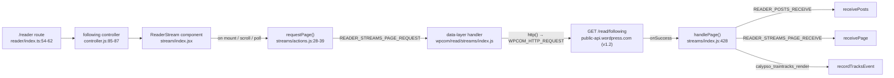

# Calypso Reader — Local Run & Under-the-Hood Onboarding

This document is an onboarding walkthrough for running the WordPress.com **Calypso** Reader locally and understanding how four of its subsystems behave under the hood: the development server & ports, the Reader stream's API/Redux data flow, authentication detection & storage, and the sidebar's responsive design. It is a **read-only, documentation-only** deliverable — no product source was modified; the only file added to the repository is this document.

All citations are pinned to commit `be7e5cc641622d153040491fd5625c6cb83e12eb` (branch `wp-calypso_be7e5cc64162`). A citation written as `[path:Lnn]` points at that exact line in the source at this commit.

## The question this document answers (verbatim)

> I am onboarding on the Calypso codebase and trying to get the Reader section running locally so I can understand how it works. What port does the development server bind to, and how do I know when it's fully ready? Does the architecture use multiple ports for things like hot reloading and API calls, or is everything served from one place?
>
> Once I can see the Reader loading, I want to understand what's happening under the hood. What API endpoints get called to populate the stream, and what Redux actions fire during that initial load? I'm also confused about how the app knows whether someone is logged in before it decides what to render, what storage mechanisms does it check? The sidebar layout seems to shift around at different screen sizes and I'd like to understand the responsive design. What are the specific margin and padding values on the sidebar header, what CSS custom properties drive the layout calculations, and at what viewport widths do things change?
>
> Temporary scripts may be used for observation, but the repository itself should remain unchanged and anything temporary should be cleaned up afterward.

## Evidence & methodology

This document is **run-first**: the canonical development server was actually built and launched (`CALYPSO_ENV=development yarn start`) on the real toolchain, and the port, readiness banners, transitional holding page, single-port behavior, and the served Reader route were captured as **real, unedited output**. Every behavioral claim below carries either:

- **observed** output shown inline in a fenced block next to the claim (with the command that produced it), or
- a `[file:line]` citation into the source at commit `be7e5cc…`.

Anything that could not be exercised headlessly in this sandbox — specifically a **fully authenticated** WordPress.com network trace (the live `GET /read/following` response and the client-side Redux action dispatch order), which requires real WordPress.com credentials plus network egress — is explicitly labeled **(inferred)** and grounded in `[file:line]` citations and in-repo documentation. Everything that *was* observable was observed.

> **Note on secrets.** The running app injects a `window.configData` blob into the served HTML that contains live-looking third-party keys (a Stripe publishable key, a Google Maps key, a VAPID key, etc.). Those values are intentionally **redacted / omitted** from this document; only non-sensitive fields (`protocol`, `port`, `hostname`, `env`, `wpcom-user-bootstrap`, `reader`) are quoted from it.

---

## 1. Environment & exact build/run commands

### 1.1 Toolchain (Node 22 + Yarn 4)

Calypso pins its toolchain and gates startup on it:

- `.nvmrc` pins Node `22.9.0`.
- `package.json` requires `"node": "^v22.9.0"` `[package.json:L57]`.
- `package.json` pins `"packageManager": "yarn@4.0.2"` `[package.json:L422]`, activated via Corepack.
- `yarn start` is **gated** by `npx check-node-version --package` `[package.json:L110]`, so Node 20 (the default in some images) will fail the gate — Node 22 is required.

**Observed toolchain** (command → output):

```text
$ node --version
v22.23.1              # satisfies ^22.9.0
$ corepack enable && yarn --version
4.0.2
$ cat .nvmrc
22.9.0
```

### 1.2 One-time host setup and the run commands

Per the README quick-start `[README.md:L17-L21]`:

```text
3. Add `127.0.0.1 calypso.localhost` to your local `hosts` file.
4. Execute `yarn` and then `yarn start` from the root directory of the repository.
5. Open `calypso.localhost:3000` in your browser.
```

Exact commands used for this document:

```bash
# 1) install dependencies (node_modules is git-ignored; yarn.lock untouched)
yarn install --immutable

# 2) ensure the hosts entry exists
grep -q 'calypso.localhost' /etc/hosts   # -> 127.0.0.1 calypso.localhost

# 3) canonical launch of the development server
CALYPSO_ENV=development yarn start
```

`yarn start` expands to a chain `[package.json:L110]`:

```text
npx check-node-version --package && node bin/welcome.js && yarn run build && yarn run start-build
```

and `start-build` `[package.json:L113]` is:

```text
BROWSERSLIST_ENV=evergreen node build/server.js | bunyan -o short
```

So `yarn start` first runs a full `yarn run build`, then boots `node build/server.js` (piping logs through `bunyan`). In development the server compiles the client **in memory** (see §2), which is why the first usable state takes a few minutes after boot.

---

## 2. Development Server & Ports (Group 1)

**Short answers:**

- **Port:** a single port, **`3000`** (host `calypso.localhost`, protocol `http`).
- **How you know it's ready:** there are **two distinct signals** — (1) the Express **boot log** line, then (2) the cyan **"Ready!" banner** printed after webpack's first in-memory compile. Before that banner, `/` serves a self-refreshing **"Welcome to Calypso!"** holding page.
- **One place or many?** **One place.** The app HTML, the in-memory JS/CSS bundle, and the Hot Module Replacement (HMR) update stream (Server-Sent Events) are all served from port `3000`. There is **no** separate `webpack-dev-server` port. **API calls do not hit a local port at all** — Calypso is a pure client-side consumer of the remote WordPress.com REST API at `public-api.wordpress.com`.

### 2.1 Where port 3000 comes from (the config chain)

- Default `"port": 3000` (and `"protocol": "http"`) live in the shared config `[config/_shared.json:L24-L25]`.
- Development overrides confirm the same and add the hostname: `"protocol": "http"` `[config/development.json:L6]`, `"hostname": "calypso.localhost"` `[config/development.json:L7]`, `"port": 3000` `[config/development.json:L8]`.
- At boot the server reads them: `let protocol = config('protocol')` `[client/server/index.js:L11]`, `let port = config('port')` `[client/server/index.js:L12]`, `let host = config('hostname')` `[client/server/index.js:L13]`.
- The port is bound by `server.listen( { port, host: process.env.CALYPSO_IS_FORK ? host : null }, … )` `[client/server/index.js:L83]`.

**Observed at runtime** — the served page's injected config confirms the values (secrets redacted):

```text
# extracted from the `window.configData` in the HTML served by GET /
"protocol":"http", "port":3000, "hostname":"calypso.localhost", "env":"development"
```

**Alternate (non-default) branch — documented for completeness:** setting `MOCK_WORDPRESSDOTCOM=1` forces `protocol='https'`, `port=443`, `host='wordpress.com'` `[client/server/index.js:L16-L21]`. That is **not** the default local path; the default local server binds `http://calypso.localhost:3000`.

### 2.2 The two readiness signals

**Signal 1 — Express listener is up (app not yet usable).** The boot log is emitted by `logger.info( 'wp-calypso booted in %dms - %s://%s:%s', … )` `[client/server/index.js:L33]`.

Observed (canonical `CALYPSO_ENV=development yarn start`):

```text
19:41:33.307Z  INFO calypso: wp-calypso booted in 1003ms - http://calypso.localhost:3000
```

**Signal 2 — App is usable (webpack's first in-memory compile finished).** The cyan banner is printed by `[client/server/bundler/index.js:L52-L58]` (exact string at L56: `` `\nReady! You can load ${protocol}://${host}:${port}/ now. Have fun!` ``). A subsequent recompile prints `Ready! All assets are re-compiled. Have fun!` `[client/server/bundler/index.js:L60]`.

Observed:

```text
Ready! You can load http://calypso.localhost:3000/ now. Have fun!
```

The two signals are genuinely separate. In a single run of the `start-build` stage, the boot log appeared first, followed by repeated "Compiling assets…" notices, and finally the "Ready!" banner ~75 seconds later:

```text
wp-calypso booted in 987ms - http://calypso.localhost:3000
Compiling assets... Wait until you see Ready! and then try http://calypso.localhost:3000/ again.
...
Ready! You can load http://calypso.localhost:3000/ now. Have fun!
```

### 2.3 Transitional state — the "Welcome to Calypso!" holding page

Before the first compile completes, the bundler's `waitForCompiler` middleware intercepts `GET /` and returns a self-refreshing holding page: the branch `if ( request.url === '/' )` `[client/server/bundler/index.js:L76]` sends HTML containing `<meta http-equiv="refresh" content="5">` `[client/server/bundler/index.js:L79]` and `<h1>Welcome to Calypso!</h1>` `[client/server/bundler/index.js:L82]`.

Observed (curling `/` **before** the "Ready!" banner appeared):

```html
<head>
    <meta http-equiv="refresh" content="5">
</head>
<body>
    <h1>Welcome to Calypso!</h1>
    <p>
        Please wait until webpack has finished compiling and you see
        <code style="font-size: 1.2em; color: blue; font-weight: bold;">READY!</code> in
        the server console. This page should then refresh automatically. If it hasn&rsquo;t, hit <em>Refresh</em>.
    </p>
    <p>
        In the meantime, try to follow all the emotions of the allmoji:
        
</body>
```

Cause → effect: the page auto-refreshes every 5 seconds, so once the compile finishes and the "Ready!" banner prints, the same tab loads the real app without manual intervention.

### 2.4 Everything is served from one port (hot reloading + API calls)

The dev bundler attaches both webpack middlewares to the **same** Express `app`:

```text
app.use( waitForCompiler );            [client/server/bundler/index.js:L100]
app.use( webpackMiddleware( compiler ) );  [client/server/bundler/index.js:L101]
app.use( hotMiddleware( compiler ) );      [client/server/bundler/index.js:L102]
```

and the bundler is attached **only in development**: `if ( 'development' === process.env.NODE_ENV ) { require('calypso/server/bundler')(app); }` `[client/server/boot/index.js:L36-L37]`. (`NODE_ENV` is baked from `config('env')` — `const bundleEnv = config('env')` `[client/webpack.config.node.js:L16]`, injected as `'process.env.NODE_ENV': JSON.stringify(bundleEnv)` `[client/webpack.config.node.js:L165]` — and `config/development.json:L2` sets `"env": "development"`, so `CALYPSO_ENV=development` yields the single-port dev HMR path.)

**Observed — one port serves the app AND the HMR stream:**

```text
$ curl -sS -I http://calypso.localhost:3000/
HTTP/1.1 200 OK
X-Powered-By: Express
Content-Type: text/html; charset=utf-8
Content-Length: 25104

# HMR is a Server-Sent Events stream on the SAME port 3000:
$ curl -sS -N http://calypso.localhost:3000/__webpack_hmr
data: {"name":"","action":"sync","time":159082,"hash":"4f8b03e31da7df38aea7","warnings":[],"errors":[],"modules":{...}}
```

**Observed — no other dev-server port is open** (a separate `webpack-dev-server` would typically listen elsewhere):

```text
$ for p in 3001 8080 9000 4200 5000; do curl -s -o /dev/null -w "port $p -> %{http_code}\n" --max-time 3 http://calypso.localhost:$p/; done
port 3001 -> 000
port 8080 -> 000
port 9000 -> 000
port 4200 -> 000
port 5000 -> 000
```

`000` means the connection failed (nothing listening). Combined with the app + HMR both answering on `3000`, this confirms the **single-port** architecture.

This matches the framework's documented behavior: `webpack-hot-middleware`'s official docs state it "allows you to add hot reloading into an existing server without webpack-dev-server," and that "each connected client gets a Server Sent Events connection, the server will publish notifications to connected clients on compiler events." `webpack-dev-middleware` on a custom Express server enables HMR by adding `webpack-hot-middleware` to that same server — exactly the setup in `client/server/bundler/index.js`.

**API calls go to the remote WordPress.com REST API, not a local port.** Calypso is a client-side consumer of `https://public-api.wordpress.com` (see §3 for the Reader endpoint and §4 for the `/me` auth call). There is no local API server or database in the dev setup.


---

## 3. Reader Stream — API Endpoints & Redux Actions (Group 2)

**Short answers:**

- **Endpoint (default stream):** the default Reader stream is `following`, populated by **`GET /read/following`** on `public-api.wordpress.com` (REST API version **v1.2**).
- **Redux actions during the initial load (in order):** `READER_STREAMS_PAGE_REQUEST` → `WPCOM_HTTP_REQUEST` → (on success) `READER_POSTS_RECEIVE` **and** `READER_STREAMS_PAGE_RECEIVE` (plus a `calypso_traintracks_render` analytics event).

### 3.1 The route → controller → component chain

The default browser route is **`/reader`** (not `/read`). It is registered as an array together with the `following` middleware, `makeLayout`, and `clientRender` `[client/reader/index.ts:L54-L62]`:

```js
page(
    [ '/reader', '/reader/recent/:feed_id' ],   // [client/reader/index.ts:L55]
    redirectLoggedOutToDiscover,
    sidebar,
    setSelectedSiteIdByOrigin,
    following,                                   // [client/reader/index.ts:L59]
    makeLayout,
    clientRender
);
```

`/read` is a **redirect** to `/reader`, declared in the redirects list: `path: '/read'` `[client/reader/controller.js:L374]`, `getRedirect: () => '/reader'` `[client/reader/controller.js:L375]`.

The `following()` controller sets the stream identity: `key: 'following'` `[client/reader/controller.js:L85]` and `streamKey: 'following'` `[client/reader/controller.js:L87]`. `FollowingStream` then wraps the shared `ReaderStream` component — imported at `[client/reader/following/main.tsx:L14]`, rendered as `<ReaderStream {...props} className="following">` `[client/reader/following/main.tsx:L63]`.

**Observed at runtime** — the default Reader route is served on port 3000 and renders the reader section:

```text
$ curl -sS -I http://calypso.localhost:3000/reader
HTTP/1.1 200 OK
X-Powered-By: Express
Content-Type: text/html; charset=utf-8
Content-Length: 41676

# the served HTML <body> carries the reader section classes:
<body class="color-scheme theme-default is-group-reader is-section-reader">
```

### 3.2 The endpoint and its query

The stream-to-endpoint mapping lives in the `streamApis` table `[client/state/data-layer/wpcom/read/streams/index.js:L192]`; the `following` entry maps to `/read/following`:

```js
const streamApis = {                             // [client/state/data-layer/wpcom/read/streams/index.js:L192]
    following: {
        path: () => '/read/following',           // [client/state/data-layer/wpcom/read/streams/index.js:L194]
        dateProperty: 'date',                    // [client/state/data-layer/wpcom/read/streams/index.js:L195]
    },
    // ...many other streams (search, feed, tag, conversations, etc.)
```

Page sizes and the base query:

- First page requests `INITIAL_FETCH = 4` items; subsequent pages request `PER_FETCH = 7` `[client/state/data-layer/wpcom/read/streams/index.js:L160-L161]`.
- The base query is built by `getQueryString`, returning `{ orderBy: 'date', meta: QUERY_META, ...extras, content_width: 675 }`, where `QUERY_META = [ 'post', 'discover_original_post' ].join( ',' )` `[client/state/data-layer/wpcom/read/streams/index.js:L165-L168]`.
- The `following` request defaults to REST API version **`1.2`** (`apiVersion` default in the request handler `[client/state/data-layer/wpcom/read/streams/index.js:L370]`).

**In-repo corroboration** — `client/reader/README.md:L71-L76` documents the real example request for the "All" (following) stream:

```text
https://public-api.wordpress.com/rest/v1.2/read/following?http_envelope=1&orderBy=date&meta=post%2Cdiscover_original_post&before=2020-08-11T15%3A00%3A00%2B00%3A00&number=7&content_width=675
```

This confirms path `/read/following`, API version `v1.2`, and the query params (`orderBy=date`, `meta=post,discover_original_post`, `content_width=675`, `number=7` = `PER_FETCH`; the first page uses `number=4` = `INITIAL_FETCH`).

### 3.3 The Redux action sequence (initial load)

Calypso uses its Redux **data-layer** pattern (documented in `docs/our-approach-to-data.md`): a UI component dispatches a plain *intent* action; a registered handler converts it into an `http()` action; the HTTP response re-dispatches `receive*` actions.

1. **`READER_STREAMS_PAGE_REQUEST`** — the `ReaderStream` component asks for a page via `requestPage()` on mount/scroll/poll. The action creator `requestPage({ streamKey, … })` returns `{ type: READER_STREAMS_PAGE_REQUEST, … }` `[client/state/reader/streams/actions.js:L28-L39]`. It is invoked from the stream component's `fetchNextPage` (`this.props.requestPage` `[client/reader/stream/index.jsx:L502]`, defined ~L489) and `poll` (`[client/reader/stream/index.jsx:L470-L472]`).
2. **`WPCOM_HTTP_REQUEST`** — the data-layer handler registered for `READER_STREAMS_PAGE_REQUEST` (`fetch: requestPage`) converts the intent into an HTTP action using `http()`, which returns `{ type: WPCOM_HTTP_REQUEST, … }` `[client/state/data-layer/wpcom-http/actions.js:L26,L56]`. This is what actually issues `GET /read/following` to `public-api.wordpress.com`.
3. On success, the `handlePage` success handler `[client/state/data-layer/wpcom/read/streams/index.js:L428]` dispatches:
   - **`READER_POSTS_RECEIVE`** — normalizes posts into the `reader.posts` subtree (`receivePosts`; constant at `[client/state/reader/action-types.ts:L52]`).
   - **`READER_STREAMS_PAGE_RECEIVE`** — stores the stream's ordered item references (`receivePage`; constant at `[client/state/reader/action-types.ts:L77]`).
   - a **`calypso_traintracks_render`** analytics event via `recordTracksEvent` (rail-tracking of rendered items).

The stream action-type constants:

```ts
export const READER_POSTS_RECEIVE        = 'READER_POSTS_RECEIVE';        // [client/state/reader/action-types.ts:L52]
export const READER_STREAMS_PAGE_RECEIVE = 'READER_STREAMS_PAGE_RECEIVE'; // [client/state/reader/action-types.ts:L77]
export const READER_STREAMS_PAGE_REQUEST = 'READER_STREAMS_PAGE_REQUEST'; // [client/state/reader/action-types.ts:L78]
```

> Note: `@tanstack/react-query` coexists in the codebase for newer data flows (`docs/our-approach-to-data.md`), but the `following` stream uses this legacy Redux data-layer.

### 3.4 Data-flow diagram



### 3.5 What was observed vs. inferred here

- **Observed:** the `/reader` route resolves and renders the reader section on port 3000 (HTTP 200, `is-section-reader` body class, above).
- **(Inferred)** the live `GET /read/following` network response and the exact client-side Redux dispatch order at runtime were **not** exercised, because a populated stream requires an authenticated WordPress.com session and network egress to `public-api.wordpress.com`, which are not available headlessly in this sandbox. The endpoint, query, fetch sizes, and action sequence above are traced from source (citations in §3.2–§3.3) and corroborated by the documented example request in `client/reader/README.md:L71-L76`.


---

## 4. Authentication Detection & Storage (Group 3)

**Short answers:**

- **How the app decides "logged in":** a single Redux selector — `isUserLoggedIn(state)` returns `getCurrentUserId(state) !== null` `[client/state/current-user/selectors.js:L15-L17]`. The layout reads it as `isLoggedIn: isUserLoggedIn(state)` `[client/layout/index.jsx:L415]` to gate what renders. The `currentUser` slice is populated during app boot, **before** routes render.
- **How the user is discovered (dev vs prod):** it is **flag-gated** by `wpcom-user-bootstrap`. In **local development** (flag `false`) the app performs a client-side `GET /me?meta=flags`; in **production** (flag `true`) the user is server-injected as `window.currentUser`.
- **Storage mechanisms consulted:** (a) **cookies** (`wordpress_logged_in`, `support_session_id`), (b) **SSR-injected globals** (`window.currentUser`, `window.initialReduxState`), (c) **IndexedDB** (database `calypso`, version `2`, store `calypso_store`), and (d) **`localStorage`** (`wpcom_user_id`, and as the IndexedDB fallback).

### 4.1 The login decision reduces to one selector

```js
export function getCurrentUserId( state ) {
    return state.currentUser?.id;                 // [client/state/current-user/selectors.js:L7]
}
export function isUserLoggedIn( state ) {
    return getCurrentUserId( state ) !== null;    // [client/state/current-user/selectors.js:L16]
}
```

Consumed by the layout to decide what to render: `isLoggedIn: isUserLoggedIn( state )` `[client/layout/index.jsx:L415]`.

### 4.2 The boot sequence populates `currentUser` before rendering

`bootApp` awaits the current user, then boots the app/routes `[client/boot/common.js:L340-L343]`:

```js
export const bootApp = async ( appName, registerRoutes ) => {
    const user = await initializeCurrentUser();   // [client/boot/common.js:L341]
    debug( `Starting ${ appName }. Let's do this.` );
    await boot( user, registerRoutes );           // [client/boot/common.js:L343]
};
```

Because `initializeCurrentUser()` is **awaited before** `boot(user, …)`, the app knows the login state before it decides what to render.

### 4.3 The flag-gated dev-vs-prod branch (both conditions)

`initializeCurrentUser` branches on the `wpcom-user-bootstrap` feature flag `[client/lib/user/shared-utils/initialize-current-user.js:L28-L49]`:

```js
if ( ! skipBootstrap && config.isEnabled( 'wpcom-user-bootstrap' ) ) {  // L28  (PRODUCTION)
    if ( window.currentUser ) {
        return window.currentUser;                                       // L30  server-injected user
    }
    return false;
}
// LOCAL DEVELOPMENT path (flag false):
let userData;
try {
    userData = await rawCurrentUserFetch();                              // L37  client-side GET /me
} catch ( error ) { /* … 'authorization_required' => logged out … */ }
if ( ! userData ) {
    return false;
}
return filterUserObject( userData );                                     // L49
```

- **Production (`wpcom-user-bootstrap` = `true` `[config/production.json:L177]`):** the user object is read from the **server-injected** `window.currentUser`.
- **Local development (`wpcom-user-bootstrap` = `false` `[config/development.json:L209]`):** the app calls `rawCurrentUserFetch()`, which is `wpcom.me().get({ meta: 'flags' })` — a client-side **`GET /me?meta=flags`** `[client/lib/user/shared-utils/raw-current-user-fetch.js:L3-L6]`.

**Observed** — the running dev server's injected config confirms the development flag value:

```text
# from window.configData in the served HTML
"wpcom-user-bootstrap":false
```

Because the developer is running locally, the **dev `/me` fetch is the primary path**; the production `window.currentUser` path is the documented secondary condition.

### 4.4 Storage inventory (every mechanism, by name)

**(a) Cookies.** The **server-side** bootstrap (used only when the `wpcom-user-bootstrap` flag path is active) reads two cookies: `AUTH_COOKIE_NAME = 'wordpress_logged_in'` `[client/server/user-bootstrap/index.js:L8]` and `SUPPORT_SESSION_COOKIE_NAME = 'support_session_id'` `[client/server/user-bootstrap/index.js:L9]`. It calls `https://public-api.wordpress.com/rest/v1/me` with `meta=flags` `[client/server/user-bootstrap/index.js:L12-L16]`, and **throws** `Cannot bootstrap without an auth cookie` when the auth cookie is absent `[client/server/user-bootstrap/index.js:L33-L34]` — an explicit error/edge branch for the logged-out case.

**(b) SSR-injected globals.** `window.currentUser` (consumed by `initializeCurrentUser` in production, §4.3) and `window.initialReduxState`, which is deserialized into the store by `getInitialServerState` — guarded by `if ( … !window.initialReduxState … )` `[client/state/initial-state.js:L149]` and hydrated via `deserializeStored( initialReducer, window.initialReduxState )` `[client/state/initial-state.js:L153]`. (See `docs/server-side-rendering.md`.)

**Observed** — the served HTML contains the SSR global:

```text
# present in the HTML served by GET / and GET /reader:
var initialReduxState = { ... };
```

**(c) IndexedDB.** Redux state is persisted to an IndexedDB database named `calypso`, version `2`, object store `calypso_store` `[client/lib/browser-storage/index.ts:L20-L22]`:

```ts
const DB_NAME = 'calypso';        // [client/lib/browser-storage/index.ts:L20]
const DB_VERSION = 2;             // [client/lib/browser-storage/index.ts:L21]
const STORE_NAME = 'calypso_store'; // [client/lib/browser-storage/index.ts:L22]
```

(See `docs/data-persistence.md` — "Persisting our Redux state to browser storage (IndexedDB)…".)

**(d) `localStorage`.** Two roles: (1) the raw user id is cached at `localStorage['wpcom_user_id']` via `getStoredUserId() { return store.get('wpcom_user_id'); }` `[client/lib/user/store.js:L12-L14]`; and (2) it is the **fallback** for browser-storage when IndexedDB is unavailable — `window.localStorage.getItem( key )` `[client/lib/browser-storage/index.ts:L283]`.

### 4.5 What was observed vs. inferred here

- **Observed:** `wpcom-user-bootstrap:false` in the running dev config, and the `var initialReduxState` SSR global in the served HTML (above). These confirm the development branch and the SSR-global mechanism at runtime.
- **(Inferred)** a **fully authenticated** end-to-end trace (a successful `GET /me` returning a real user, or the server-side bootstrap reading a live `wordpress_logged_in` cookie) was **not** exercised, because it requires real WordPress.com credentials and network egress. Those specifics are traced from source (citations in §4.3–§4.4). In a logged-out dev session the `/me` fetch resolves to the logged-out state (`initializeCurrentUser` returns `false`), and the server-side bootstrap's missing-cookie `throw` `[client/server/user-bootstrap/index.js:L33-L34]` is the corresponding error branch.


---

## 5. Sidebar Responsive Design (Group 4)

**Short answers:**

- **Header spacing:** `.sidebar__header` uses `padding: 30px 24px 29px` and a flex `gap: 8px`. There is **no `margin`** on the header — the spacing is padding + flex gap.
- **CSS custom properties driving the layout `calc()`s:** `--masterbar-height` (46px, dropping to 32px at ≥782px), `--masterbar-checkout-height` (72px), `--sidebar-width-max` (272px), and `--sidebar-width-min` (228px).
- **Viewport widths where things change:** the app's core breakpoint list is `480, 660, 800, 960, 1040, 1280, 1400` px; the sidebar concretely toggles at **661px / 660px**, the masterbar height flips at **782px**, and the reader sidebar adjusts at **600px / 781px / 782px**.

### 5.1 Exact header padding and gap (and the absence of margin)

```scss
.sidebar__header {                    // [client/layout/global-sidebar/style.scss:L70]
    align-items: center;              // L71
    // Hide the header when the masterbar is visible.
    display: none;                    // L73  (default; shown/hidden via media queries)
    gap: 8px;                         // L74
    padding: 30px 24px 29px;          // L75
}
```

- `padding: 30px 24px 29px` → **top `30px`**, **left/right `24px`**, **bottom `29px`** `[client/layout/global-sidebar/style.scss:L75]`.
- `gap: 8px` → the flex gap between the header's children `[client/layout/global-sidebar/style.scss:L74]`.
- **No `margin`** is declared on `.sidebar__header`. The prompt asks for "margin and padding"; the header's spacing is expressed through `padding` and the flex `gap`, not `margin`. The `display: none` at L73 is the default state — the header is revealed depending on masterbar visibility via the media queries in §5.3.

### 5.2 The CSS custom properties that drive layout `calc()`s

All defined on `:root` `[client/assets/stylesheets/shared/_variables.scss:L5-L16]`:

```scss
:root {
    // Masterbar
    --masterbar-height: 46px;              // [client/assets/stylesheets/shared/_variables.scss:L7]
    --masterbar-checkout-height: 72px;     // L8

    @media only screen and (min-width: 782px) {
        --masterbar-height: 32px;          // L11  (height flips 46px -> 32px at >=782px)
    }

    // Sidebar size limits
    --sidebar-width-max: 272px;            // L15
    --sidebar-width-min: 228px;            // L16
}
```

Cause → effect: the sidebar/content padding math is expressed as `calc()` over these variables. For example, the reader sidebar's padding is `calc(var(--masterbar-height) + var(--content-padding-top)) …` `[client/reader/sidebar/style.scss:L70]` and its `padding-top` is `calc(var(--masterbar-height) + var(--content-padding-top))` `[client/reader/sidebar/style.scss:L77]`. Because `--masterbar-height` changes from `46px` to `32px` at `≥782px`, the computed top offset shifts at that breakpoint. The sidebar's own height uses `calc(100vh - var(--masterbar-height) - …)` `[client/reader/sidebar/style.scss:L107]`.

### 5.3 Viewport widths / breakpoints where the layout changes

**Core app breakpoint list** (the shared, now-deprecated mixin — deprecation notice at `[client/assets/stylesheets/shared/mixins/_breakpoints.scss:L4]`):

```scss
$breakpoints: 480px, 660px, 800px, 960px, 1040px, 1280px, 1400px; // [client/assets/stylesheets/shared/mixins/_breakpoints.scss:L10]
```

**Concrete sidebar layout changes:**

- Global sidebar toggles its column layout at `@media (min-width: 661px)` `[client/layout/global-sidebar/style.scss:L470]` and `@media (max-width: 660px)` `[client/layout/global-sidebar/style.scss:L511]`.
- Masterbar height flips (46px → 32px) at `@media only screen and (min-width: 782px)` `[client/assets/stylesheets/shared/_variables.scss:L11]`.
- Reader sidebar adjusts its padding at `@media only screen and (min-width: 782px)` `[client/reader/sidebar/style.scss:L79]` (padding uses `--sidebar-width-max` `[client/reader/sidebar/style.scss:L80]`), and at `@media only screen and (max-width: 600px)` `[client/reader/sidebar/style.scss:L95]` and `@media only screen and (max-width: 781px)` `[client/reader/sidebar/style.scss:L102]`.

**Do not conflate** the core app breakpoints with the **marketing-footer-only** list, which is a *separate* `$breakpoints` used solely by the universal footer component:

```scss
// MARKETING FOOTER ONLY — do NOT use for the app sidebar:
$breakpoints: 320px, 360px, 480px, 660px, 782px, 960px, 1140px, 1366px, 1440px, 1600px; // [packages/wpcom-template-parts/src/universal-footer-navigation/style.scss:L10]
```

### 5.4 What was observed vs. inferred here

These are **static SCSS facts** cited directly from source at commit `be7e5cc…` (the authoritative evidence for CSS values). The full sidebar renders only for an authenticated session, so runtime computed-style inspection was not required; the `[file:line]` citations above are exact and were re-verified with `sed`.


---

## 6. Coverage pass

Every named item in the question, mapped to its concrete answer, its evidence, and whether it was observed at runtime or inferred from source.

| # | Named item (from the question) | Answer (concrete value) | Evidence: `file:line` or `observed:` command | Observed / Inferred |
|---|--------------------------------|--------------------------|-----------------------------------------------|---------------------|
| 1 | Port the dev server binds to | **3000** (`http`, host `calypso.localhost`) | `[config/_shared.json:L24-L25]`, `[config/development.json:L6-L8]`, `[client/server/index.js:L12,L83]`; `observed: curl -I http://calypso.localhost:3000/ → 200`; configData `"port":3000` | Observed |
| 2 | How do I know it's fully ready — signal 1 | Express **boot log**: `wp-calypso booted in <n>ms - http://calypso.localhost:3000` | `[client/server/index.js:L33]`; `observed:` boot log `booted in 1003ms` | Observed |
| 3 | How do I know it's fully ready — signal 2 | Cyan **"Ready!"** banner: `Ready! You can load http://calypso.localhost:3000/ now. Have fun!` | `[client/server/bundler/index.js:L52-L58]` (string L56); `observed:` banner in log | Observed |
| 4 | Transitional (pre-compile) state | **"Welcome to Calypso!"** holding page, `<meta http-equiv="refresh" content="5">` | `[client/server/bundler/index.js:L76-L93]`; `observed: curl / before Ready` | Observed |
| 5 | Multiple ports vs one place | **One place** — everything on port 3000 | `[client/server/bundler/index.js:L100-L102]`; `observed:` ports 3001/8080/9000/4200/5000 → `000` | Observed |
| 6 | Hot reloading | HMR over **Server-Sent Events on the same port 3000** (`/__webpack_hmr`) | `[client/server/bundler/index.js:L102]`; `observed: curl -N /__webpack_hmr → data:{"action":"sync",…}` | Observed |
| 7 | API calls | Remote **`public-api.wordpress.com`** REST API — **no local API port** | `[client/server/user-bootstrap/index.js:L12]`, `[client/state/data-layer/wpcom/read/streams/index.js:L194]` | Observed (no local port) + Inferred (remote call) |
| 8 | API endpoint(s) populating the default stream | **`GET /read/following`** (REST **v1.2**) | `[client/state/data-layer/wpcom/read/streams/index.js:L192-L195,L370]`; `client/reader/README.md:L71-L76` | Inferred (traced from source) |
| 9 | Default stream & route | `following` stream at route **`/reader`** (`/read` → redirect) | `[client/reader/index.ts:L54-L62]`, `[client/reader/controller.js:L85-L87,L374-L375]`; `observed: curl /reader → 200, is-section-reader` | Observed (route) + Inferred (stream fetch) |
| 10 | Initial fetch sizes | first page `INITIAL_FETCH=4`, next pages `PER_FETCH=7` | `[client/state/data-layer/wpcom/read/streams/index.js:L160-L161]` | Inferred (traced from source) |
| 11 | Redux action 1 | **`READER_STREAMS_PAGE_REQUEST`** (via `requestPage()`) | `[client/state/reader/streams/actions.js:L28-L39]`, `[client/state/reader/action-types.ts:L78]` | Inferred (traced from source) |
| 12 | Redux action 2 | **`WPCOM_HTTP_REQUEST`** (via `http()`) | `[client/state/data-layer/wpcom-http/actions.js:L26,L56]` | Inferred (traced from source) |
| 13 | Redux action 3 | **`READER_POSTS_RECEIVE`** (on success) | `[client/state/reader/action-types.ts:L52]`, `[client/state/data-layer/wpcom/read/streams/index.js:L428]` | Inferred (traced from source) |
| 14 | Redux action 4 | **`READER_STREAMS_PAGE_RECEIVE`** (on success) | `[client/state/reader/action-types.ts:L77]`, `[client/state/data-layer/wpcom/read/streams/index.js:L428]` | Inferred (traced from source) |
| 15 | Analytics event | `calypso_traintracks_render` (`recordTracksEvent`) | `[client/state/data-layer/wpcom/read/streams/index.js:L428]` | Inferred (traced from source) |
| 16 | How the app knows if logged in | Selector **`isUserLoggedIn`** = `getCurrentUserId(state) !== null` | `[client/state/current-user/selectors.js:L15-L17]`, `[client/layout/index.jsx:L415]` | Inferred (traced from source) |
| 17 | When the decision happens | During boot: `bootApp` awaits `initializeCurrentUser()` before `boot()` | `[client/boot/common.js:L340-L343]` | Inferred (traced from source) |
| 18 | Dev vs prod detection | Dev = client `GET /me?meta=flags`; Prod = `window.currentUser` (flag `wpcom-user-bootstrap`) | `[client/lib/user/shared-utils/initialize-current-user.js:L28-L49]`, `[client/lib/user/shared-utils/raw-current-user-fetch.js:L3-L6]`, `[config/development.json:L209]`=false, `[config/production.json:L177]`=true; `observed:` configData `"wpcom-user-bootstrap":false` | Observed (flag) + Inferred (fetch/injection) |
| 19 | Storage: cookies | `wordpress_logged_in`, `support_session_id` | `[client/server/user-bootstrap/index.js:L8-L9,L33-L34]` | Inferred (traced from source) |
| 20 | Storage: SSR globals | `window.currentUser`, `window.initialReduxState` | `[client/lib/user/shared-utils/initialize-current-user.js:L29-L30]`, `[client/state/initial-state.js:L149-L153]`; `observed: var initialReduxState in served HTML` | Observed (initialReduxState) + Inferred (currentUser) |
| 21 | Storage: IndexedDB | DB `calypso`, version `2`, store `calypso_store` | `[client/lib/browser-storage/index.ts:L20-L22]` | Inferred (traced from source) |
| 22 | Storage: `localStorage` | `wpcom_user_id`; also IndexedDB fallback | `[client/lib/user/store.js:L12-L14]`, `[client/lib/browser-storage/index.ts:L283]` | Inferred (traced from source) |
| 23 | Sidebar header **padding** | `30px 24px 29px` (top / L-R / bottom) | `[client/layout/global-sidebar/style.scss:L75]` | Inferred (source-grounded) |
| 24 | Sidebar header **margin** / gap | **No `margin`**; flex `gap: 8px` | `[client/layout/global-sidebar/style.scss:L74]` (no margin declared L70-L75) | Inferred (source-grounded) |
| 25 | CSS custom properties driving layout | `--masterbar-height` (46→32px), `--masterbar-checkout-height` (72px), `--sidebar-width-max` (272px), `--sidebar-width-min` (228px) | `[client/assets/stylesheets/shared/_variables.scss:L7,L8,L11,L15,L16]` | Inferred (source-grounded) |
| 26 | Viewport widths where things change | app breakpoints `480/660/800/960/1040/1280/1400`; sidebar `661/660`; masterbar `782`; reader sidebar `600/781/782` | `[client/assets/stylesheets/shared/mixins/_breakpoints.scss:L10]`, `[client/layout/global-sidebar/style.scss:L470,L511]`, `[client/assets/stylesheets/shared/_variables.scss:L11]`, `[client/reader/sidebar/style.scss:L79,L95,L102]` | Inferred (source-grounded) |
| 27 | Breakpoint distinction | Marketing-footer list `320/360/480/660/782/960/1140/1366/1440/1600` is **separate** from app breakpoints | `[packages/wpcom-template-parts/src/universal-footer-navigation/style.scss:L10]` | Inferred (source-grounded) |

### Legend

- **Observed** — captured as real, unedited runtime output from `CALYPSO_ENV=development yarn start` on Node `v22.23.1` / Yarn `4.0.2`, shown inline above.
- **Inferred (traced from source / source-grounded)** — established by reading the source at commit `be7e5cc641622d153040491fd5625c6cb83e12eb` (with every line re-verified via `sed`). Items requiring an authenticated WordPress.com session plus network egress (the live `/read/following` and `/me` traces) could not be exercised headlessly and are labeled accordingly.

_End of document._

