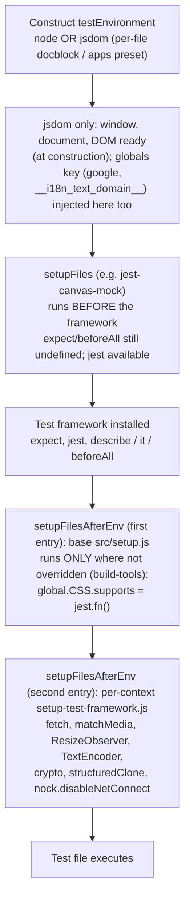

# Why wp-calypso Tests Pass in Isolation but Fail in the Full Suite: An Investigation of Per-Context Jest Environments and Module Resolution

> Repository: `Automattic/wp-calypso` &nbsp;•&nbsp; Source branch: `wp-calypso_be7e5cc64162` &nbsp;•&nbsp; HEAD: `be7e5cc641622d153040491fd5625c6cb83e12eb`

This document is a code-grounded investigation into why a test in this monorepo can pass when executed one way (e.g. under one `yarn test-*` command, or in isolation) yet fail when executed another way (e.g. under a different command or as part of the full suite). **The root cause is structural, not incidental: wp-calypso deliberately splits Jest into several independent _execution contexts_, each with its own config, preset, setup files, globals, and even a custom module resolver. As a result, the _same test source_ can run under a materially different runtime environment (`node` vs `jsdom`), see a different set of global identifiers, and — most surprisingly — resolve the _same import string_ to a _different file on disk_, depending purely on which command launched it.** A test that silently depends on a capability that only one context happens to provide will appear to "pass in isolation" (under the providing context) and "fail in the suite" (when a different context — one whose config, environment, globals, or resolver does not supply that capability — runs it instead). Every claim below was verified by building the repository and running its real test commands plus disposable probes; the probes were deleted and the working tree re-verified pristine.

---

## 1. Problem Statement & Methodology

### 1.1 The five questions

This investigation answers five concrete questions, each of which isolates one axis along which the execution contexts diverge:

1. **Q1 — Runtime environments.** Run the different test commands the codebase exposes. What runtime environment does each actually use during execution, and how do they differ?
2. **Q2 — Global surface.** Compare what is available globally in each context and identify something that exists in one context but not another.
3. **Q3 — Internal-package resolution.** Find a monorepo package that depends on another internal package from this same repository. Run its tests and determine what actual file gets loaded when that internal dependency is imported. Does it differ based on how the tests are executed?
4. **Q4 — Redirected imports.** The test infrastructure overrides some import paths. Discover where an import gets redirected and trace where it actually resolves at runtime. Does the same import resolve to different locations depending on execution context?
5. **Q5 — Initialization order & browser-API provenance.** When a test runs, what loads first? Some tests have access to browser-like APIs — what provides those capabilities and when does that provider become available? Verify the initialization order by observing what is accessible at different points.

### 1.2 Environment used to ground the answers

All findings were produced by actually provisioning and running the suite at HEAD `be7e5cc641622d153040491fd5625c6cb83e12eb`. The toolchain is the repository-pinned one — never ad-hoc global binaries:

- **Node `v22.23.1`.** The repository requires `engines.node = "^v22.9.0"` (`package.json:L57`) and pins `22.9.0` in `.nvmrc`. The container's Node `v22.23.1` satisfies the `^v22.9.0` range, so it is used as-is (it is **not** downgraded, and no manifest is edited). Node version matters for this investigation because several globals tested below (`fetch`, `TextEncoder`, `structuredClone`, `ReadableStream`) are provided by the Node runtime itself.
- **Yarn `4.0.2` via Corepack.** `package.json` declares `"packageManager": "yarn@4.0.2"` (`package.json:L422`); `.yarnrc.yml` sets `nodeLinker: node-modules` (`.yarnrc.yml:L3`) and `yarnPath: .yarn/releases/yarn-4.0.2.cjs` (`.yarnrc.yml:L5`), so the vendored Yarn release is used in-repo.
- **`yarn install` into the untracked `node_modules/`** (~3.1 GB, verified present). The install emits exactly one non-fatal warning — `YN0066` for a TypeScript compat-patch hunk (`Cannot apply hunk #1`) — which does not affect test execution or any finding here. Because `node_modules/` is untracked, installing it leaves the tracked tree unchanged.
- **Jest `29.7.0`**, invoked through the per-context configs, e.g. `yarn test-client`, `yarn test-server`, `yarn test-packages`, `yarn test-apps`, `yarn test-build-tools`, `yarn test-integration`.

### 1.3 Probe methodology (how runtime behavior was observed)

Reading configuration alone is insufficient — Jest merges presets, applies object spreads, and runs a custom resolver, so the _effective_ behavior must be observed at runtime. The approach was:

- **Disposable probe tests** were placed under each context's `testMatch` globs so the real per-context config would pick them up: e.g. `client/**/test/*.js` (client), `client/server/**/test/*.js` (server, whose `rootDir` is `client/server`), `build-tools/**/test/*.js` (build-tools), `client/**/integration/*.js` (integration), `packages/<pkg>/**/test/*` (packages), and `apps/<app>/**/test/*` (apps). Each probe printed `typeof` of candidate globals and the result of `require.resolve(...)` for the target modules.
- For the **node-vs-jsdom split within a single command**, two sibling probes were used: one plain (inheriting the context default) and one carrying a `/** @jest-environment jsdom */` docblock.
- For the **initialization order** (Q5), a temporary Jest config that extended the client config injected an extra `setupFiles` entry and appended an extra `setupFilesAfterEnv` entry; each marker recorded `typeof` of key identifiers at its lifecycle stage, and the test body recorded the same at test-execution time.
- The Jest cache was redirected to `/tmp` (the in-repo `.cache/jest` is git-ignored anyway), so the repository tree stayed pristine. **Every probe and the temporary config were removed afterward and `git status --porcelain` returned empty (0 lines).**

### 1.4 How to read the evidence

Each of Q1–Q5 below pairs the **observed evidence** (the runtime value a probe printed, or a path a resolver returned) with the **rationale** (the specific config/preset/setup lines that cause it). Citations use the `path:Lnn` convention and refer to files at the HEAD above.

---

## 2. Q1 — Test commands & their runtime environments

### 2.1 The commands

The root `package.json` `scripts` block exposes seven distinct test entry points (the `*:watch` / `*:coverage` siblings are convenience variants of these, and `test-desktop:e2e` is a deprecation notice, not a context; `test/e2e` is a separate workspace and out of scope):

| Script             | Definition                                                                    | `package.json` line |
| ------------------ | ----------------------------------------------------------------------------- | ------------------- |
| `test`             | `run-s -s test-client test-packages test-server test-build-tools` (aggregate) | `L120`              |
| `test-build-tools` | `jest -c=test/build-tools/jest.config.js`                                     | `L121`              |
| `test-client`      | `TZ=UTC jest -c=test/client/jest.config.js`                                   | `L122`              |
| `test-integration` | `jest -c=test/integration/jest.config.js`                                     | `L125`              |
| `test-apps`        | `jest -c=test/apps/jest.config.js`                                            | `L127`              |
| `test-packages`    | `jest -c=test/packages/jest.config.js`                                        | `L129`              |
| `test-server`      | `jest -c=test/server/jest.config.js`                                          | `L131`              |

### 2.2 The single source of the default environment

Every context ultimately derives from one base preset, `@automattic/calypso-jest`, which sets the default test environment to **`node`**:

- `packages/calypso-jest/jest-preset.js:L11` → `testEnvironment: 'node'`. The same preset also wires the custom `resolver` (`:L9`), the base `setupFilesAfterEnv` (`:L10`, pointing at `./src/setup.js`), and the `testMatch` glob `<rootDir>/**/test/*.[jt]s?(x)` (`:L12`).

Because `node` is the baseline, **a test only runs under `jsdom` if something explicitly opts it in.** Three distinct opt-in mechanisms exist in this repository:

1. **A per-file docblock** `/** @jest-environment jsdom */` at the top of an individual test file. This is how hundreds of client test files acquire a DOM while the client config itself stays on the `node` default.
2. **A preset-level override.** The apps preset sets `testEnvironment: 'jsdom'` for every test in that context: `test/apps/jest-preset.js:L7`.
3. **A project-level (per-package) override.** An individual `packages/<pkg>/jest.config.js` can set `testEnvironment: 'jsdom'` for the whole package project. This matters specifically for `test-packages`, which is a **multi-project runner**: it does **not** apply a single environment to "all packages." Running `yarn jest -c=test/packages/jest.config.js --showConfig` resolves **58 package projects**, of which **36 use `jest-environment-node`** and **22 use `jest-environment-jsdom`**. The 22 jsdom projects each declare `testEnvironment: 'jsdom'` in their own leaf config — e.g. `packages/search/jest.config.js:L3`, `packages/dataviews/jest.config.js:L3`, and `packages/wpcom-checkout/jest.config.js:L3`. (The full set: block-renderer, calypso-products, calypso-sentry, calypso-url, command-palette, composite-checkout, dataviews, design-picker, design-preview, domain-picker, global-styles, help-center, launchpad, odie-client, onboarding, search, shopping-cart, site-admin, sites, subscriber, verbum-block-editor, wpcom-checkout.) This is a third, package-level form of `jsdom` opt-in that is independent of any per-file docblock.

### 2.3 Command → config → environment

The table below was confirmed empirically by probing `typeof window` / `typeof document` under each command:

| Command                 | Jest config                                                                     | Default environment                | DOM opt-in mechanism                               |
| ----------------------- | ------------------------------------------------------------------------------- | ---------------------------------- | -------------------------------------------------- |
| `yarn test`             | aggregate `run-s -s test-client test-packages test-server test-build-tools`     | mixed (per sub-command)            | per sub-command                                    |
| `yarn test-client`      | `test/client/jest.config.js`                                                    | `node` (from base preset)          | per-file `/** @jest-environment jsdom */` docblock |
| `yarn test-server`      | `test/server/jest.config.js`                                                    | `node`                             | rarely used; mostly pure `node`                    |
| `yarn test-packages`    | `test/packages/jest.config.js` (multi-project over 58 `packages/*/jest.config.js`) | `node` base default, but **per-project** (36 `node` / 22 `jsdom`) | package-level `testEnvironment: 'jsdom'` (22 projects) **or** per-file docblock |
| `yarn test-apps`        | `test/apps/jest.config.js` (multi-project over `apps/*/jest.config.js`)         | **`jsdom`** (apps preset override) | already `jsdom`                                    |
| `yarn test-build-tools` | `test/build-tools/jest.config.js`                                               | `node`                             | none                                               |
| `yarn test-integration` | `test/integration/jest.config.js`                                               | `node` (explicit, `:L7`)           | none                                               |

### 2.4 How each config is wired (and why it matters)

- **client / server / build-tools** each import the base preset and spread it: `const base = require( '@automattic/calypso-jest' ); module.exports = { ...base, ... }` (`test/client/jest.config.js:L5`, `test/server/jest.config.js:L5`, `test/build-tools/jest.config.js:L5`). They therefore inherit `testEnvironment: 'node'` unless they override it — none of them does, so all three default to `node`.
- **packages / apps** are **multi-project runners**: each declares a `projects:` array (`test/packages/jest.config.js:L4`, `test/apps/jest.config.js:L4`) that points Jest at every `packages/*/jest.config.js` (resp. `apps/*/jest.config.js`). The packages preset spreads the base (`test/packages/jest-preset.js:L9`) and keeps `node`; the apps preset spreads the base but **overrides** to `jsdom` (`test/apps/jest-preset.js:L7`). **The leaf configs differ markedly between the two contexts.** All three apps leaf configs really are one-liners — `{ preset: '../../test/apps/jest-preset.js' }` (`apps/notifications/jest.config.js`, `apps/odyssey-stats/jest.config.js`, `apps/wpcom-block-editor/jest.config.js`) — so every app simply inherits the preset's `jsdom`. The **package** leaf configs, by contrast, vary widely: some are minimal, but many override the preset. 22 of the 58 set `testEnvironment: 'jsdom'` (e.g. `packages/search/jest.config.js:L3`, `packages/dataviews/jest.config.js:L3`), and several also add their own `testMatch`, `globals`, `setupFilesAfterEnv`, and/or `transformIgnorePatterns`. For example: `packages/wpcom-checkout/jest.config.js` adds `globals.configData` plus a `transformIgnorePatterns`; `packages/block-renderer/jest.config.js` (together with `design-picker`, `design-preview`, `verbum-block-editor`) sets `jsdom`, a custom `testMatch`, and appends a match-media mock via `setupFilesAfterEnv` (`:L5`); and `packages/command-palette/jest.config.js` sets `jsdom`, a custom `testMatch`, `globals`, and reuses the **client** `setup-test-framework.js` (`:L10`). Crucially, because these leaf configs use Jest's `preset:` field (not object spread), their `setupFilesAfterEnv` are **concatenated** with the preset's rather than replacing it (contrast the spread-and-reassign behavior in §6.4) — which is precisely why their effective global surfaces diverge (see Q2 §3.5).
- **integration** does **not** spread the base preset. It sets `testEnvironment: 'node'` itself (`test/integration/jest.config.js:L7`) and supplies an explicit `resolver` (`:L8`, the same `@automattic/calypso-jest/src/module-resolver.js`), its own `moduleNameMapper` (`:L3`), `modulePaths` (`:L5`), and a bespoke `testMatch` matching `**/integration/*.[jt]s` (`:L9`–`L14`).

### 2.5 Empirical confirmation

Probes printing `typeof window` produced:

- `test-client`, default file → `typeof window === 'undefined'` (**node**); the same file with a `jsdom` docblock → `typeof window === 'object'`.
- `test-apps` (the `notifications` app) → `typeof window === 'object'` (**jsdom** from the preset, with no docblock needed).
- `test-server`, `test-build-tools`, `test-integration` → `typeof window === 'undefined'` (**node**).
- `test-packages`, a default-`node` package file → `typeof window === 'undefined'` (**node**); the same file with a `jsdom` docblock → `typeof window === 'object'`; and a file in a package whose leaf config sets `testEnvironment: 'jsdom'` (e.g. `packages/search`) → `typeof window === 'object'` **with no docblock needed**.

**Rationale.** The divergence is entirely explained by §2.2–§2.4: `node` is the inherited default everywhere; `jsdom` appears only where the apps preset forces it, where a package's leaf config sets it, or where an individual file opts in via a docblock. This is the first and most fundamental axis of divergence — and it already implies that a DOM-dependent test is portable only to contexts that supply a DOM.

---

## 3. Q2 — Globals that differ by context

### 3.1 Three independent mechanisms inject globals

Beyond the environment itself, two configuration mechanisms add identifiers to the global scope, and the environment adds a third source:

1. **The Jest `globals` config key** — values placed on the global object **at environment construction**, independent of `node` vs `jsdom`.
2. **Per-context setup files** (`setupFiles` and especially `setupFilesAfterEnv`) — code that runs and assigns globals during test bootstrap (see Q5 for exact timing).
3. **The runtime itself** — `node` provides built-ins such as `fetch`, `TextEncoder`, `structuredClone`, and `ReadableStream`; switching to `jsdom` replaces `globalThis`, so those Node built-ins are no longer present unless a setup file re-adds them.

### 3.2 Observed `typeof` matrix

The following values were printed by probes in each context (`client` shown for both its `node` default and its `jsdom`-docblock form; `packages` likewise). These are observed runtime values, not inferences.

> **Scope of the two `packages` columns (important).** As established in Q1, `test-packages` is a multi-project runner whose 58 leaf projects do **not** share one configuration. The two `packages` columns below are therefore **representative probe cases, not a single, uniform "packages context."** They show a package project that inherits **only the default `test/packages/setup.js`** wiring — once in its `node` default form and once under a `/** @jest-environment jsdom */` docblock. They hold for the majority of package projects (those that do not override `setupFilesAfterEnv`), but **package projects that append or reuse a different setup file have a materially different global surface.** Those variants are probed and tabulated separately in §3.5 (e.g. `command-palette`, which reuses the client setup file, sees `fetch`, `CSS.supports`, and the Node stream/encoder built-ins even under `jsdom`). Read these two columns as "default-setup packages," not "all of `test-packages`."

| Global                 | client (jsdom docblock) | client (node default) | server (node)       | build-tools (node) | integration (node)  | packages (node, default setup) | packages (jsdom, default setup) | apps (jsdom) |
| ---------------------- | ----------------------- | --------------------- | ------------------- | ------------------ | ------------------- | ------------------------------ | ------------------------------- | ------------ |
| `window`               | object                  | undefined             | undefined           | undefined          | undefined           | undefined               | object                    | object       |
| `document`             | object                  | undefined             | undefined           | undefined          | undefined           | undefined               | object                    | object       |
| `google`               | object                  | object                | **undefined**       | undefined          | undefined           | undefined               | undefined                 | undefined    |
| `__i18n_text_domain__` | string                  | string                | **undefined**       | undefined          | undefined           | string                  | string                    | undefined    |
| `matchMedia`           | function                | function              | **undefined**       | undefined          | undefined           | function                | function                  | function     |
| `fetch`                | function                | function              | function (Node)     | function (Node)    | function (Node)     | function (Node)         | **undefined**             | function     |
| `ResizeObserver`       | function                | function              | undefined           | undefined          | undefined           | function                | function                  | function     |
| `TextEncoder`          | function                | function              | function (Node)     | function (Node)    | function (Node)     | function (Node)         | **undefined**             | function     |
| `structuredClone`      | function                | function              | function (Node)     | function (Node)    | function (Node)     | function (Node)         | **undefined**             | function     |
| `ReadableStream`       | function                | function              | function (Node)     | function (Node)    | function (Node)     | function (Node)         | **undefined**             | function     |
| `CSS`                  | object                  | object                | undefined           | object             | undefined           | object\*                | object\*                  | object       |
| `CSS.supports`         | function                | function              | n/a (CSS undefined) | function           | n/a (CSS undefined) | undefined\*             | undefined\*               | function     |

\* In **default-setup** `packages` projects, `CSS` is present as a minimal object exposing **only** `CSS.escape` (a `css.escape` polyfill pulled in transitively; the object's only own property is `escape` and its constructor is `Object`). It has **no** `supports` method, so `typeof CSS.supports === 'undefined'`. This is discussed further under Q5 (§6.4), because it is a direct consequence of how `setupFilesAfterEnv` is wired — and §3.5 shows that package projects which reuse the client setup file instead get a `CSS` object whose `supports` **is** a mock (and which loses `escape`). In `server` and `integration`, `CSS` is entirely `undefined`, so `CSS.supports` is genuinely not applicable.

### 3.3 Clear "exists in one context but not another" cases (with provenance)

- **`google` — exists only in the client context.** It is declared in the client config's `globals` block: `test/client/jest.config.js:L22`–`L25` (`globals: { google: {}, __i18n_text_domain__: 'default' }`). It is `undefined` in every other context: the server config has no `globals` key at all; the packages preset declares only `__i18n_text_domain__` (`test/packages/jest-preset.js:L11`–`L13`); the apps preset has no `globals` key. **Because `globals` is injected at environment construction, `google` is present in client tests whether or not they use a `jsdom` docblock** — the probe showed `typeof google === 'object'` in both the `node`-default and the `jsdom` client probes. This is the cleanest answer to Q2: `google` is a global that exists in one context (client) and in no other.

- **`__i18n_text_domain__` — client and packages only.** Declared in `test/client/jest.config.js:L24` and `test/packages/jest-preset.js:L12` (both as `'default'`, hence `typeof === 'string'`). It is `undefined` in `server`, `build-tools`, `integration`, and `apps`.

- **`matchMedia` — client, packages, and apps; absent from server/build-tools/integration.** It is a `function` because a setup file assigns it: `test/client/setup-test-framework.js:L54`–`L63` (client and, by reuse, apps) and `test/packages/setup.js:L7`–`L16` (packages). It is `undefined` in `server`/`build-tools`/`integration` because their setup files never add it and it is not a Node built-in.

- **`window` / `document` — only under a `jsdom` environment.** They appear in the client `jsdom` probe, both packages `jsdom`, and apps; they are `undefined` in every `node` context.

- **`fetch` — the sharpest _intra-command_ divergence.** Within the **same `test-packages` command**, a default-setup (`node`) package test sees `typeof fetch === 'function'` (the Node 22 global), but a default-setup package test carrying a `/** @jest-environment jsdom */` docblock sees `typeof fetch === 'undefined'`. The reason: switching to `jsdom` replaces `globalThis` with the jsdom one (which has no `fetch`), and `test/packages/setup.js` does **not** re-add `fetch`. The identical effect was observed for `TextEncoder`, `structuredClone`, and `ReadableStream` — all Node globals in the default-setup `node` package tests, all gone under a `jsdom` docblock in the same command. Note the contrast with the client and apps contexts, where `fetch` is a `function` even under `jsdom`, precisely because `test/client/setup-test-framework.js:L36`–`L40` explicitly re-adds it. **And the divergence is sharper still _within_ `test-packages`:** a `jsdom` package that reuses that very client setup file — `command-palette` — sees `typeof fetch === 'function'` even though it is `jsdom`, the exact opposite of a default-setup `jsdom` package (§3.5). So "does `fetch` exist?" cannot be answered for `test-packages` as a whole; it depends on the individual package project's setup wiring.

### 3.4 Precise provenance summary

- From the `globals` config key (at construction): `google` (client), `__i18n_text_domain__` (client, packages).
- From setup files (during `setupFilesAfterEnv`): `matchMedia`, `ResizeObserver`, `fetch` (client/apps), `crypto.randomUUID`, the mocked `CSS.supports` in client/apps.
- From the `jsdom` environment (at construction): `window`, `document`, the DOM, and the jsdom `window.CSS`.
- From the Node runtime itself: `fetch`, `TextEncoder`, `structuredClone`, `ReadableStream` (present in `node`-environment tests; absent once `jsdom` replaces `globalThis`, unless a setup file re-adds them).

This provenance holds for the canonical contexts and for default-setup package projects; §3.5 extends it to the package projects whose leaf configs append or reuse a different setup file.

### 3.5 The `packages` global surface is not uniform — per-project setup variants

The two `packages` columns in §3.2 capture **default-setup** package projects only. Because each `packages/<pkg>/jest.config.js` consumes the packages preset via Jest's **`preset:`** field (not an object spread), a leaf config's `setupFilesAfterEnv` is **concatenated with** the preset's — `[ test/packages/setup.js ]` (from the preset) **followed by** the leaf's own entries — rather than replacing it. (This is the opposite of the spread-and-reassign **replacement** behavior in the `test/*` configs, dissected in §6.4.) The concatenation was confirmed empirically: a probe in `block-renderer` still saw `ResizeObserver` (which only `test/packages/setup.js` provides among its two setup files), proving the preset's setup ran in addition to the leaf's.

Enumerating the 58 effective package projects by their setup wiring (verified from the leaf configs) yields four observable global-surface variants:

- **A — `node`, default setup (the 36 `node` projects).** Inherit only `test/packages/setup.js`. (`domains-table` is a `node` project that appends the match-media mock, but in a `node` environment that mock is a **no-op** because it guards on `typeof window !== 'undefined'` — so its surface is still group A; `calypso-codemods` adds a custom `setupFiles` and `testMatch` but keeps the default `setupFilesAfterEnv`.)
- **B — `jsdom`, default setup (16 projects: `calypso-products`, `calypso-sentry`, `calypso-url`, `composite-checkout`, `dataviews`, `domain-picker`, `global-styles`, `launchpad`, `odie-client`, `onboarding`, `search`, `shopping-cart`, `site-admin`, `sites`, `subscriber`, `wpcom-checkout`).** Inherit only `test/packages/setup.js`; this is exactly the "packages (jsdom, default setup)" column of §3.2. (`help-center` is a near-member: it is `jsdom` on the default `setupFilesAfterEnv` but adds an extra `setupFiles` entry, `jestSetup.ts`, which runs before the framework.)
- **C — `jsdom` + match-media mock (`block-renderer`, `design-picker`, `design-preview`, `verbum-block-editor`).** Append `@automattic/calypso-build/jest/mocks/match-media` (`:L5` in each) on top of `test/packages/setup.js`. The mock only (re)defines `window.matchMedia`, which `test/packages/setup.js` already supplies — so the observable surface is **identical to group B** (the probe in `block-renderer` matched group B exactly).
- **D — `jsdom` reusing the client setup (`command-palette`).** Appends `require.resolve( '../../test/client/setup-test-framework.js' )` (`:L10`) on top of `test/packages/setup.js`. Because the client setup re-adds the Node/browser APIs and overwrites `global.CSS`, this project's surface looks like the **client** context, not like a default-setup package.

The distinguishing globals across these variants — all observed at runtime via disposable probes under `test/packages/jest.config.js` — are:

| Global                                          | A. `node`, default setup | B. `jsdom`, default setup (e.g. `search`) | C. `jsdom` + match-media (`block-renderer` family) | D. `jsdom` reusing client setup (`command-palette`) |
| ----------------------------------------------- | ------------------------ | ----------------------------------------- | -------------------------------------------------- | --------------------------------------------------- |
| `window` / `document`                           | undefined                | object                                    | object                                             | object                                              |
| `fetch`                                         | function (Node)          | **undefined**                             | **undefined**                                      | **function** (client mock)                          |
| `TextEncoder` / `structuredClone` / `ReadableStream` | function (Node)     | undefined                                 | undefined                                          | **function** (client setup)                         |
| `matchMedia`                                    | function                 | function                                  | function                                           | function                                            |
| `ResizeObserver`                                | function                 | function                                  | function                                           | function                                            |
| `CSS.escape`                                    | function                 | function                                  | function                                           | **undefined**                                       |
| `CSS.supports`                                  | undefined                | undefined                                 | undefined                                          | **function** (mock)                                 |

**Rationale.** The override that actually changes the observable surface is **D**: reusing `test/client/setup-test-framework.js` makes a `jsdom` package re-acquire `fetch`/`TextEncoder`/`structuredClone`/`ReadableStream` and a mocked `global.CSS = { supports: jest.fn() }` (which, running **after** the preset's setup, also drops the transitive `CSS.escape`). Variant **C**'s match-media mock is effectively redundant given `test/packages/setup.js`. This is the precise sense in which "the packages context" is a simplification: `test-packages` is a fleet of independently-configured projects, and a global such as `fetch` or `CSS.supports` can be present in one package project and absent in another **under the very same command**.

---

## 4. Q3 — Internal-package resolution

### 4.1 The example dependency pair

A clean example of one monorepo package depending on another is `@automattic/explat-client-react-helpers` → `@automattic/explat-client`:

- The dependency is declared as a workspace dependency: `packages/explat-client-react-helpers/package.json:L28` → `"@automattic/explat-client": "workspace:^"`.
- The import site: `packages/explat-client-react-helpers/src/index.tsx:L3` → `import type { ExPlatClient, ExperimentAssignment } from '@automattic/explat-client';`.
- The package's own test, `packages/explat-client-react-helpers/src/test/index.tsx`, carries a `/** @jest-environment jsdom */` docblock (`:L1`–`L3`) and at `:L5` imports a _subpath_ of the internal package: `import { validExperimentAssignment } from '@automattic/explat-client/src/internal/test-common';`.
- Its Jest config is the one-liner `{ preset: '../../test/packages/jest-preset.js' }` (`packages/explat-client-react-helpers/jest.config.js:L2`), so it runs under the packages context.

### 4.2 What actually loads (observed inside Jest)

Running the package's test and capturing `require.resolve(...)` at runtime produced:

- `require.resolve('@automattic/explat-client')` → **`packages/explat-client/src/index.ts`** — the untranspiled **`calypso:src`** entry, **not** the `main` target.
- `require.resolve('@automattic/explat-client/src/internal/test-common')` → **`packages/explat-client/src/internal/test-common.ts`**.

### 4.3 Why — the custom resolver prefers untranspiled source

The behavior is produced by the custom Jest resolver, which is wired in by the base preset (`packages/calypso-jest/jest-preset.js:L9`). The resolver is built on `enhanced-resolve` and is configured to **prefer the `calypso:src` field over `main`**:

- `packages/calypso-jest/src/module-resolver.js:L16` creates the resolver; `:L18` sets `mainFields: [ 'calypso:src', 'main' ]`; `:L19` sets `conditionNames: [ 'calypso:src', 'node', 'require' ]`. Because `calypso:src` is listed first, a monorepo package's untranspiled source wins.
- The depended-upon package declares all three fields: `packages/explat-client/package.json` → `main: dist/cjs/index.js` (`:L9`), `module: dist/esm/index.js` (`:L11`), and `calypso:src: src/index.ts` (`:L12`). The resolver picks `calypso:src` → `src/index.ts`.
- The resolver's own header comment explains the intent: monorepo packages ship a `calypso:src` field pointing at untranspiled source so tests (and webpack) can skip a build step; for such packages `main` "usually _does not_ exist, but it doesn't matter because all packages in the monorepo have `calypso:src`."
- The integration context wires the **same** resolver explicitly (`test/integration/jest.config.js:L8`). And there is a verbatim copy of the resolver at `test/module-resolver.js` that is **byte-identical** to `packages/calypso-jest/src/module-resolver.js` (confirmed with `diff`).

### 4.4 The `main` target genuinely does not exist on disk

After install, `packages/explat-client/dist/` contains only `esm/` (with an `internal/` subfolder), `types/` (with `internal/`), and `tsconfig.tsbuildinfo`. **There is no `cjs/` directory**, so the `main` target `dist/cjs/index.js` does not exist. This is why preferring `calypso:src` is not merely a convenience here — it is the _only_ entry that resolves to a real file without a build.

### 4.5 Does it differ by how you execute? — the outside-Jest contrast

This is the payoff for "does it differ based on how you execute the tests." Inside Jest, the answer is constant: the custom resolver always yields `packages/explat-client/src/index.ts`. Outside Jest, standard Node resolution uses `main`/`module`/`exports` instead:

- `node_modules/@automattic/explat-client` is a symlink to the workspace `packages/explat-client`.
- Running plain Node (no Jest, no custom resolver) `require.resolve('@automattic/explat-client')` from the dependent package directory **fails** with:
  `Error [MODULE_NOT_FOUND]: Cannot find module '.../node_modules/@automattic/explat-client/dist/cjs/index.js'. Please verify that the package.json has a valid "main" entry` — because Node honors `main` (`dist/cjs/index.js`), and that file is absent.

**Conclusion.** The file that an internal import loads is determined by the **resolver**, and the resolver is execution-context-specific. Within Jest, `@automattic/explat-client` is the untranspiled `src/index.ts`; a webpack/`tsc`/compiled run using standard `main`/`module`/`exports` resolution would instead target `dist/` — and at this HEAD, without a CJS build, would even fail. The import string is identical; the loaded file depends on _who_ resolves it.

---

## 5. Q4 — Redirected imports resolving to different files per context

### 5.1 The redirected import and the relevant Jest precedence

The import `@automattic/calypso-config` is redirected by Jest's `moduleNameMapper`, and the redirect target differs per context. The relevant precedence (per Jest semantics) is: **`moduleNameMapper` rewrites the request first; the custom `resolver` then resolves the (possibly rewritten) request.** So the mapper decides _what string_ is resolved, and the resolver decides _which file_ that string points to.

### 5.2 Observed resolutions (runtime `require.resolve('@automattic/calypso-config')`)

| Context     | `moduleNameMapper` (citation)                                                                                                            | Resolves to (runtime, observed)                                                |
| ----------- | ---------------------------------------------------------------------------------------------------------------------------------------- | ------------------------------------------------------------------------------ |
| packages    | none — `test/packages/jest.config.js:L5`–`L7` maps only `react-markdown`                                                                 | `packages/calypso-config/src/index.ts` (real package source via `calypso:src`) |
| client      | `^@automattic/calypso-config$` → `<rootDir>/server/config/index.js` (`test/client/jest.config.js:L11`, `rootDir = client`)               | `client/server/config/index.js`                                                |
| server      | `^@automattic/calypso-config$` → `calypso/server/config` (`test/server/jest.config.js:L10`; subpaths `:L11`)                             | `client/server/config/index.js`                                                |
| integration | `^@automattic/calypso-config$` → `<rootDir>/client/server/config/index.js` (`test/integration/jest.config.js:L3`, `rootDir = repo root`) | `client/server/config/index.js`                                                |

### 5.3 Both targets exist on disk

- `packages/calypso-config/src/index.ts` — the package's `calypso:src` entry (`packages/calypso-config/package.json:L11`).
- `client/server/config/index.js` — the application's server-config shim.

### 5.4 A corroborating observation: build-tools and apps also see the real source

The probes additionally showed that in **build-tools** and **apps** — neither of which maps `@automattic/calypso-config` — the import resolves to the **real package source** `packages/calypso-config/src/index.ts`, exactly like `packages`. This reinforces the mechanism: where there is no mapper entry, the custom resolver loads the real package via `calypso:src`; only the client/server/integration contexts redirect it to the application shim.

### 5.5 Conclusion

The _identical_ import statement `import config from '@automattic/calypso-config'` loads the **real package source** (`packages/calypso-config/src/index.ts`) under `test-packages` (and `test-build-tools`, `test-apps`), but the **application's server-config shim** (`client/server/config/index.js`) under `test-client`, `test-server`, and `test-integration`. This is a concrete demonstration that the same import resolves to different files depending purely on execution context — and those two files are different code with potentially different behavior.

---

## 6. Q5 — Initialization order & browser-API provenance

### 6.1 What loads first (observed lifecycle)

Using the client (jsdom) context with markers injected at each stage, the observed `typeof` of key identifiers at each lifecycle point was:

| Identifier   | at `setupFiles` | at `setupFilesAfterEnv` | at test body |
| ------------ | --------------- | ----------------------- | ------------ |
| `window`     | object          | object                  | object       |
| `document`   | object          | object                  | object       |
| `jest`       | object          | object                  | object       |
| `expect`     | **undefined**   | function                | function     |
| `beforeAll`  | **undefined**   | function                | function     |
| `fetch`      | **undefined**   | function                | function     |
| `matchMedia` | **undefined**   | function                | function     |
| `CSS`        | **undefined**   | object                  | object       |
| `google`     | object          | object                  | object       |

Reading this matrix top-to-bottom yields the initialization order directly:

1. **The test environment is constructed first.** At the very first stage (`setupFiles`), `window` and `document` are already `object` — so under `jsdom`, the DOM exists **before any setup file runs**. (Under a `node` context, this stage simply has no `window`/`document`.)
2. **`globals` are injected at construction too.** `google` is already `object` at `setupFiles` time — confirming the `globals` config key is applied at environment construction, not by a setup file.
3. **`setupFiles` run before the test framework is installed.** At this stage `expect` and `beforeAll` are `undefined`, yet `jest` (the module mocker) is already `object`. This is exactly Jest's documented contract: `setupFiles` execute before the framework is wired up, but the `jest` object is available for mocking.
4. **The test framework is then installed**, after which `expect`, `beforeAll`, `describe`, `it`, etc. become available.
5. **`setupFilesAfterEnv` run after the framework is installed.** By this stage `fetch`, `matchMedia`, and `CSS` have appeared — they were added by the per-context setup file (`test/client/setup-test-framework.js`).
6. **The test body executes last**, with everything above present.

### 6.2 The two providers of browser-like APIs

Browser-like capabilities come from **two distinct providers at two distinct times**:

- **(a) The `jsdom` environment — at environment construction**, before any setup file. It supplies `window`, `document`, and the DOM. A context is on `jsdom` either because a file used a `/** @jest-environment jsdom */` docblock, or because the apps preset forced it (`test/apps/jest-preset.js:L7`); otherwise the base preset leaves it on `node` (`packages/calypso-jest/jest-preset.js:L11`).
- **(b) The per-context `setup-test-framework.js` — during `setupFilesAfterEnv`**, after the framework is installed. For the client context, `test/client/setup-test-framework.js` provides the remaining browser-ish APIs: `fetch` (`:L36`–`L40`), `matchMedia` (`:L54`–`L63`), `ResizeObserver` (`:L34`), `TextEncoder`/`TextDecoder` (`:L25`–`L26`), `crypto.randomUUID` (`:L52`) and `crypto.subtle` (`:L76`–`L78`), `structuredClone` (`:L71`–`L73`), `ReadableStream`/`TransformStream` (`:L66`–`L67`), and `Worker` (`:L68`); it also mocks `wpcom-proxy-request` (`:L44`–`L49`) and disables the network with `nock.disableNetConnect()` (`:L9`). The **apps** context reuses this very file (`test/apps/jest-preset.js:L13`), which is why apps gets `fetch`/`matchMedia`/`CSS.supports` despite declaring no `globals`. By stark contrast, the **server** context's `test/server/setup-test-framework.js` adds **only** `nock.disableNetConnect()` (`:L4`) plus a `wpcom-proxy-request` mock (`:L21`) — no browser APIs at all.

### 6.3 The lifecycle diagram

### 6.4 A critical nuance: `setupFilesAfterEnv` is _replaced_ by the `test/*` configs but _merged_ by package leaf configs

The base preset sets `setupFilesAfterEnv: [ require.resolve( './src/setup.js' ) ]` (`packages/calypso-jest/jest-preset.js:L10`), and that base `src/setup.js` mocks `global.CSS = { supports: jest.fn() }` (`packages/calypso-jest/src/setup.js:L3`–`L5`). However, because the client, server, and packages configs use object spread `...base` and then **reassign** `setupFilesAfterEnv`, they **replace** the base array rather than append to it (`test/client/jest.config.js:L21`, `test/server/jest.config.js:L13`, `test/packages/jest-preset.js:L14`). The empirically confirmed consequences:

- **build-tools** spreads the base and does **not** override `setupFilesAfterEnv`, so the base `src/setup.js` is the only entry and **does** run there → `typeof CSS.supports === 'function'` was observed in build-tools.
- **client** (and **apps**, which reuses the client setup file) re-establish `global.CSS` independently in `test/client/setup-test-framework.js:L30`–`L32` → `CSS.supports` is a `function` there too, but via a different file.
- **server** and **integration** mock no CSS at all → `CSS` is `undefined` (so `CSS.supports` is not applicable).
- **packages** (the preset) overrides `setupFilesAfterEnv` to `test/packages/setup.js` (`test/packages/jest-preset.js:L14`), which does not mock CSS; the bare `CSS` object that remains (exposing only `CSS.escape`) has no `supports`, so in a **default-setup** package `typeof CSS.supports === 'undefined'`.
- **but a package _leaf_ config can re-introduce the mock.** Leaf package configs use Jest's `preset:` field, so their `setupFilesAfterEnv` is **concatenated** with the preset's `[ test/packages/setup.js ]` rather than replacing it (the inverse of the spread-and-reassign case above). Thus `command-palette`, which appends the client `setup-test-framework.js`, runs `global.CSS = { supports: jest.fn() }` **after** the preset's setup → `typeof CSS.supports === 'function'` (and `CSS.escape` is dropped); whereas the `block-renderer`-family match-media mock adds no CSS, leaving `CSS.supports` `undefined` (see §3.5).

The takeaway: even a "base" setup file is **not** universally applied, and the merge rule itself differs by layer. A `test/*` config that spreads `...base` and reassigns `setupFilesAfterEnv` **replaces** it; a package **leaf** config that uses `preset:` **merges** (concatenates) onto it. Whether `global.CSS.supports` is a working mock therefore depends on which context's — and, within `test-packages`, which individual package's — setup wiring ran. This is a subtle, easily-overlooked source of cross-context (and intra-`test-packages`) divergence.

### 6.5 Corroboration with Jest's documented semantics

The observed order matches Jest's documented contract: `setupFiles` run before the testing framework is installed in the environment (so `expect`/lifecycle hooks are not yet available, though the `jest` object is), while `setupFilesAfterEnv` run after the framework is installed (the "global `beforeAll`" slot). The environment (`node` or `jsdom`) is constructed before either, which is why `window`/`document` and the `globals` key are present from the earliest stage.

---

## 7. Synthesis — Why isolation passes but the suite fails

The five divergences above are not independent curiosities; together they explain the isolation-versus-suite (and command-versus-command) failure pattern. The unifying principle is:

> **The same test source can execute under materially different environments, globals, and module resolution depending on which command runs it. A test that silently relies on a capability supplied by one context will pass when run under that context and fail when run under another. Because the aggregate suite runs each file under exactly one context — and the same source can also be invoked under a different config in isolation — the command that executes a file decides which environment, globals, and resolutions it sees.**

Concretely, each axis maps to a failure mode:

- **Environment (Q1) + DOM globals (Q2).** A test that touches `window`/`document` passes only where a DOM exists — under a `/** @jest-environment jsdom */` docblock, or under `test-apps`. The very same file run under `test-server` or `test-build-tools` (both `node`, no docblock) fails because `window`/`document` are `undefined`. If a file's docblock is missing or stripped, it "works in isolation" wherever a DOM happens to be present and breaks where it is not.

- **Config-injected globals (Q2).** A test that references `google` passes under `test-client` (where the `globals` key declares it — `test/client/jest.config.js:L22`–`L25`) but throws a `ReferenceError` under `test-server`, where `google` is `undefined`. The same applies to `__i18n_text_domain__` outside the client/packages contexts.

- **Runtime-vs-jsdom built-ins (Q2).** The `fetch`/`TextEncoder`/`structuredClone`/`ReadableStream` flip _within_ `test-packages` means a package test that uses `fetch` can pass as a plain `node` test and fail the moment a `jsdom` docblock is added (or vice-versa) — a divergence entirely internal to one command.

- **Redirected imports (Q4).** A test importing `@automattic/calypso-config` exercises **different code** depending on the command: the real package source under `test-packages`/`test-build-tools`/`test-apps`, versus the application's server-config shim (`client/server/config/index.js`) under `test-client`/`test-server`/`test-integration`. Behavior that depends on which implementation answers the import will diverge accordingly.

- **Internal-package source resolution (Q3).** Tests load the untranspiled `calypso:src` of internal packages inside Jest. A test (or assumption) that depends on that untranspiled source behaves correctly under Jest but would break in a webpack/`tsc`/compiled pipeline that resolves `main`/`module`/`exports` to `dist/` — which, at this HEAD, lacks a CJS build entirely.

- **Initialization order & setup provenance (Q5).** Code that runs at `setupFiles` time cannot rely on `expect` or on `fetch`/`matchMedia` (not yet installed/added). And because the base `setupFilesAfterEnv` is _replaced_ (not merged) by the `test/*` contexts, a test assuming `global.CSS.supports` is a mock passes in `build-tools` and `client`/`apps` but not in `server`/`integration`, where `CSS` is `undefined` — while inside `test-packages` it is `undefined` for default-setup packages yet a working mock for `command-palette`, which merges in the client setup (§3.5, §6.4).

**Why a different command (or the aggregate suite) diverges from isolation.** This was checked against the suite's _actual_ test routing rather than assumed. Running `--listTests` for all six contexts returns **disjoint** file sets — `client` 1392, `server` 12, `build-tools` 1, `integration` 3, `packages` 216, `apps` 4 (**1628** files in total, **1628** of them distinct, and **zero** paths shared by any two contexts). So the aggregate `yarn test` (`run-s -s test-client test-packages test-server test-build-tools`, `package.json:L120`) is **not** a single config sweeping one shared pool of files; it is several **independent** Jest runs, each applying its own environment, `globals`, setup files, and resolver to its **own**, non-overlapping slice of files. The operative divergence is therefore **command-vs-command (context-vs-context)** — _not_ a single file being matched by competing `testMatch` globs (no such overlap exists). A file passes when executed under a command whose context supplies the capability it silently needs, and fails under any command — or a bare, ad-hoc `jest <file>` invocation defaulting to a different environment — that does not. Two grounded caveats keep this explanation honest:

- **Cross-file global "state accumulation" is _not_ the mechanism here.** A probe placed two test files in one project and ran them in a single worker (`--runInBand`): a `globalThis` value set by the first file was observed as `undefined` by the second. Jest constructs a **fresh test environment per test file**, so globals mutated or mocked by one file do not leak into a sibling file — it is the per-context _configuration_ differences catalogued above, not cross-file leakage, that make outcomes disagree.
- **What "isolation" actually changes is the config, not the neighbors.** "Passes in isolation" in this codebase almost always means "was run under a command, config, or editor runner that happened to provide the missing environment, global, or resolution"; "fails in the suite" means a _different_ context owns and executes that file. (Per-test-case state within one file can of course still leak between `it` blocks, but that is intra-file and is present in isolation too — it is independent of the per-context split studied here.)

The deliberate per-context split — distinct configs, presets, setup files, `globals`, and a custom `calypso:src`-preferring resolver, layered with per-package overrides inside `test-packages` (§3.5) — is therefore the structural reason that command/isolation and suite/command outcomes can disagree.

---

## 8. References

### 8.1 Repository evidence files (consulted read-only, at HEAD `be7e5cc641622d153040491fd5625c6cb83e12eb`)

- `package.json` — the seven `test*` scripts (`L120`–`L131`), `engines.node` (`L57`), `packageManager` (`L422`), and `workspaces`.
- `.nvmrc` — pins Node `22.9.0`.
- `.yarnrc.yml` — `nodeLinker: node-modules` (`L3`), `yarnPath: .yarn/releases/yarn-4.0.2.cjs` (`L5`).
- `test/client/jest.config.js` — client context: `...base` (`L5`), `rootDir` (`L6`), `@automattic/calypso-config` → `<rootDir>/server/config/index.js` (`L11`), `setupFiles` (`L20`), `setupFilesAfterEnv` (`L21`), `globals` (`L22`–`L25`).
- `test/server/jest.config.js` — server context: `...base` (`L5`), `rootDir` (`L7`), `@automattic/calypso-config` mapping (`L10`–`L11`), `setupFilesAfterEnv` (`L13`); no `globals`.
- `test/packages/jest.config.js` — packages multi-project runner: `projects` (`L4`), `moduleNameMapper` maps only `react-markdown` (`L5`–`L7`).
- `test/packages/jest-preset.js` — packages preset: `...base` (`L9`), `globals.__i18n_text_domain__` (`L11`–`L13`), `setupFilesAfterEnv` → `setup.js` (`L14`).
- `test/packages/setup.js` — `@testing-library/jest-dom` (`L1`), `crypto.randomUUID` (`L3`), `ResizeObserver` (`L5`), `matchMedia` (`L7`–`L16`).
- `test/apps/jest.config.js` — apps multi-project runner: `projects` (`L4`).
- `test/apps/jest-preset.js` — apps preset: `...base` (`L5`), `testEnvironment: 'jsdom'` override (`L7`), `setupFiles` (`L11`), `setupFilesAfterEnv` reuses the client setup file (`L13`).
- `test/build-tools/jest.config.js` — build-tools context: `...base` (`L5`), `rootDir` (`L7`); no `setupFilesAfterEnv` override (inherits base).
- `test/integration/jest.config.js` — integration context: `@automattic/calypso-config` mapping (`L3`), `modulePaths` (`L5`), `rootDir` (`L6`), `testEnvironment: 'node'` (`L7`), explicit `resolver` (`L8`), `testMatch` (`L9`–`L14`).
- `test/client/setup-test-framework.js` — browser-API polyfills: `jest-dom` (`L1`), `nock.disableNetConnect` (`L9`), `TextEncoder`/`TextDecoder` (`L25`–`L26`), `CSS.supports` (`L30`–`L32`), `ResizeObserver` (`L34`), `fetch` (`L36`–`L40`), `wpcom-proxy-request` mock (`L44`–`L49`), `crypto.randomUUID` (`L52`), `matchMedia` (`L54`–`L63`), `ReadableStream`/`TransformStream` (`L66`–`L67`), `Worker` (`L68`), `structuredClone` (`L71`–`L73`), `crypto.subtle` (`L76`–`L78`).
- `test/server/setup-test-framework.js` — minimal: `nock.disableNetConnect` (`L4`), `wpcom-proxy-request` mock (`L21`).
- `test/module-resolver.js` — a byte-identical copy of the calypso-jest resolver.
- `packages/calypso-jest/jest-preset.js` — base preset: `resolver` (`L9`), `setupFilesAfterEnv` → `src/setup.js` (`L10`), `testEnvironment: 'node'` (`L11`), `testMatch` (`L12`).
- `packages/calypso-jest/src/module-resolver.js` — custom resolver: `enhanced-resolve` (`L16`), `mainFields: ['calypso:src','main']` (`L18`), `conditionNames` (`L19`), exported `function(request, options)` (`L22`–`L23`).
- `packages/calypso-jest/src/setup.js` — base `setupFilesAfterEnv`: `global.CSS = { supports: jest.fn() }` (`L3`–`L5`).
- `packages/explat-client-react-helpers/package.json` — internal dependency `@automattic/explat-client: workspace:^` (`L28`).
- `packages/explat-client-react-helpers/jest.config.js` — `{ preset: '../../test/packages/jest-preset.js' }` (`L2`).
- `packages/explat-client-react-helpers/src/index.tsx` — import of the internal dependency (`L3`).
- `packages/explat-client-react-helpers/src/test/index.tsx` — `jsdom` docblock (`L1`–`L3`), subpath import (`L5`).
- `packages/explat-client/package.json` — `main` (`L9`), `module` (`L11`), `calypso:src: src/index.ts` (`L12`).
- `packages/calypso-config/package.json` — `main` (`L9`), `module` (`L10`), `calypso:src: src/index.ts` (`L11`).
- `packages/search/jest.config.js`, `packages/dataviews/jest.config.js` — minimal `jsdom` leaf configs: `testEnvironment: 'jsdom'` (`:L3`) on the default packages setup (Q1, Q2 §3.5 group B).
- `packages/wpcom-checkout/jest.config.js` — `jsdom` (`:L3`) plus `globals.configData` (`:L4`–`L6`) and a `transformIgnorePatterns` (`:L7`) (Q1).
- `packages/command-palette/jest.config.js` — `jsdom` (`:L4`), custom `testMatch` (`:L3`), `globals` (`:L5`), and `setupFilesAfterEnv` reusing the client `setup-test-framework.js` (`:L10`) — Q2 §3.5 group D.
- `packages/block-renderer/jest.config.js` (with `packages/design-picker`, `packages/design-preview`, `packages/verbum-block-editor`, and the `node` project `packages/domains-table`) — `setupFilesAfterEnv: [ '@automattic/calypso-build/jest/mocks/match-media' ]` (`:L5`/`:L4`) appended onto the packages setup — Q2 §3.5 group C.
- `packages/help-center/jest.config.js` — `jsdom` (`:L4`) plus a custom `setupFiles: [ '<rootDir>/jestSetup.ts' ]` (`:L3`) on the default `setupFilesAfterEnv` (Q2 §3.5).
- `packages/calypso-build/jest/mocks/match-media.js` — defines `window.matchMedia` **only** when `typeof window !== 'undefined'` (`:L3`–`L16`); a no-op in a `node` environment (Q2 §3.5).
- Empirical commands used for grounding: `yarn jest -c=test/packages/jest.config.js --showConfig` (resolves **58** package projects: **36** `jest-environment-node`, **22** `jest-environment-jsdom`) for Q1; and `yarn jest -c=test/<context>/jest.config.js --listTests` for each context (`client` 1392, `server` 12, `build-tools` 1, `integration` 3, `packages` 216, `apps` 4 — **disjoint**, no shared paths) for the Synthesis (§7).

### 8.2 Official Jest semantics relied upon

- **Test environments.** Jest runs on Node by default, where `window`/`document`/`navigator` do not exist; a `jsdom` environment must be supplied to provide them. The environment is selectable globally via `testEnvironment` or per-file via a `@jest-environment` docblock — the exact pattern wp-calypso uses (a base `node` default plus three opt-ins: a per-file `jsdom` docblock, a per-preset `jsdom` override for apps, and a per-project `jsdom` override in 22 of the 58 package leaf configs).
- **Setup ordering.** `setupFiles` run before the test framework is installed and before `setupFilesAfterEnv`; `setupFilesAfterEnv` run after the framework is installed (the "global `beforeAll`" slot). This matches the order observed in Q5.
- **Resolution precedence.** `moduleNameMapper` is applied first to rewrite a request; a custom `resolver` (a module exporting `function(request, options)` returning a path) then resolves the rewritten request — matching `module-resolver.js` and explaining Q4.
- **The `projects` multi-config runner.** A single Jest invocation can run multiple sub-configs via `projects`, which is how `test-packages` and `test-apps` execute one config per package/app.
