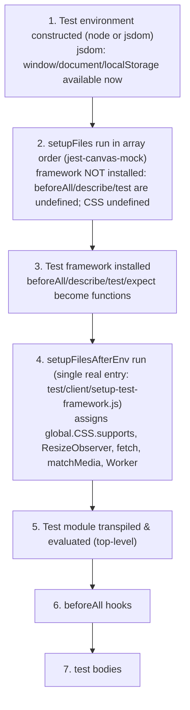

# Why some `wp-calypso` tests pass in isolation but fail in the full suite

**An evidence-backed investigation of module resolution and test-environment setup across the repository's Jest execution contexts.**

This document answers six questions about the `wp-calypso` monorepo's test infrastructure. Every behavioural claim below is grounded in **captured runtime output** produced by running the repository's *real* test commands and small temporary probe tests through the pinned toolchain. Each section shows the exact command, the complete unedited output it produced, and the `file:line` reference that explains it. Values that are inferred rather than observed are labelled as such.

> **Reproducibility note.** All evidence was captured on the checked-out source commit `be7e5cc641622d153040491fd5625c6cb83e12eb`. Temporary probe files were created only to observe runtime behaviour and were removed afterwards; the tracked source tree is byte-for-byte unchanged (see §14 Read-only mandate & provenance).

---

## 1. Canonical execution environment

All commands were run through the repository's pinned toolchain, activated through **Corepack**. The exact versions were captured, not assumed:

```
$ corepack enable            # activate the packageManager-pinned Yarn (idempotent; no output)
$ node --version
v22.23.1
$ npm --version
11.1.0
$ corepack --version
0.34.6
$ yarn --version
4.0.2
$ yarn jest --version
29.7.0
$ node -e "console.log(require('./node_modules/jsdom/package.json').version)"
20.0.3
$ node -e "console.log(require('./node_modules/jest-environment-jsdom/package.json').version)"
29.7.0
$ yarn bin jest
<repo>/node_modules/jest/bin/jest.js
```

The four remaining tool versions that this investigation relies on were read directly from the installed `node_modules` (each is a `require('<pkg>/package.json').version`):

```
$ for p in babel-jest jest-canvas-mock @testing-library/jest-dom resize-observer-polyfill; do \
    printf '%-28s = ' "$p"; node -e "console.log(require('./node_modules/'+process.argv[1]+'/package.json').version)" "$p"; done
babel-jest                   = 29.7.0
jest-canvas-mock             = 2.5.2
@testing-library/jest-dom    = 6.6.3
resize-observer-polyfill     = 1.5.1
```

| Component | Version (observed) | Source of truth |
|-----------|--------------------|-----------------|
| Node.js | `v22.23.1` | satisfies `engines.node` (literal value `"^v22.9.0"`) [package.json:L57]; `.nvmrc` pins `22.9.0` |
| npm | `11.1.0` | ships with Node; used only for `--version` reporting (never for install — Yarn is the package manager) |
| Corepack | `0.34.6` | ships with Node; `corepack enable` activates the pinned Yarn |
| Yarn | `4.0.2` | `packageManager: "yarn@4.0.2"` [package.json:L422]; pinned binary `.yarn/releases/yarn-4.0.2.cjs` |
| Jest | `29.7.0` | dev-dependency `"^29.7.0"` [package.json:L290]; `yarn jest --version` → `29.7.0` |
| babel-jest | `29.7.0` | transform in the base preset [packages/calypso-jest/jest-preset.js:L14]; installed transitively with Jest (no direct manifest entry) |
| jest-environment-jsdom | `29.7.0` (bundles jsdom `20.0.3`) | dev-dependency `"^29.7.0"` [package.json:L292] |
| jsdom | `20.0.3` | bundled inside `jest-environment-jsdom`; observed UA `jsdom/20.0.3` |
| enhanced-resolve | `5.9.3` | dev-dependency [package.json:L213] |
| jest-canvas-mock | `2.5.2` | client `setupFiles` entry; dev-dependency `"^2.5.2"` [package.json:L291] |
| @testing-library/jest-dom | `6.6.3` | client/packages setup import; dev-dependency `"^6.6.3"` [package.json:L252] |
| resize-observer-polyfill | `1.5.1` | supplies `global.ResizeObserver`; dev-dependency `"^1.5.1"` [package.json:L310] |

**Dependency installation (immutable).** Dependencies were installed with Yarn's immutable mode, which fails if the lockfile would change — proving the investigation neither added nor upgraded any dependency. The command succeeded (exit `0`) and left `yarn.lock` byte-for-byte unchanged (identical SHA-256 before and after):

```
$ sha256sum yarn.lock                      # before
72f1b01d7ff3e091b4b4938453ff6ad41e1714335d58d69e522e74577bd16394  yarn.lock
$ yarn install --immutable
➤ YN0000: · Yarn 4.0.2
➤ YN0000: ┌ Resolution step
➤ YN0000: └ Completed in 0s 697ms
➤ YN0000: ┌ Fetch step
➤ YN0000: └ Completed in 6s 698ms
➤ YN0000: ┌ Link step
➤ YN0000: └ Completed in 1s 574ms
➤ YN0000: · Done in 9s 601ms
# exit=0
$ sha256sum yarn.lock                      # after — identical
72f1b01d7ff3e091b4b4938453ff6ad41e1714335d58d69e522e74577bd16394  yarn.lock
```

**Version reconciliation.** The environment-setup instructions suggested installing Node `20.x`, but the repository's `engines.node` field is the literal string `"^v22.9.0"` [package.json:L56-L59] (the leading `v` is unusual but semver-tolerated by npm/Yarn and parses as `^22.9.0`). The repository requirement takes precedence for correctness, so the investigation ran on the installed **Node `22.23.1`** (which satisfies `^v22.9.0`). Where any earlier draft referenced `22.22.2`, the captured, canonical value is `22.23.1` as shown above.

**Invocation policy.** Every command below uses the **pinned Yarn entry point** (`yarn <script>` for the six declared test commands, and `yarn jest -c=<config> …` for probes). `yarn bin jest` resolves to `<repo>/node_modules/jest/bin/jest.js`, confirming the local pinned binary is used. `npx` is never used, so no probe can trigger a package download.

> Throughout this document `<repo>` abbreviates the ephemeral absolute capture path `/tmp/blitzy/wp-calypso/blitzy-b582062f-11a3-4649-94b2-c58559cb5cff_9e5da8`. Only the **repo-relative suffix** is meaningful; the prefix changes per checkout.

---

## 2. How this document was produced (methodology)

1. **Run first.** The six real test commands defined in `package.json` were executed and their complete output captured (§12 Validation).
2. **Probe with real configs.** To observe per-context behaviour, tiny temporary tests (prefixed `blitzy_adhoc_test_`) were placed where each real Jest config's `testMatch` discovers them, and were run through the *actual* per-context config via `yarn jest -c=<config> --runTestsByPath <probe>`. No debug hook, mock, or synthetic config bypassed the real resolver, `moduleNameMapper`, or environment selection.
3. **Confirm stability.** Every timing- and environment-sensitive observation (globals matrix, initialization order, reproduction) was run at least twice. The **captured observation lines** — the probes' `BLITZY_GLOBALS=…`, `BLITZY_RESOLVE=…`, and `INIT|…` records — were **identical across runs**; only the surrounding Jest wall-clock/timing lines (e.g. `Time: …s`) varied, as expected. Claims of stability in this document refer to these normalized observation lines, not to the raw byte stream of the whole Jest log.
4. **Clean up.** All probes and temporary configs were deleted after capture; `git status` confirms an unchanged tree (§14 Read-only mandate & provenance).

The complete list of probe/logger/config sources and the exact commands appear in §13 Reproduction appendix.

---

## 3. Direct answers

| # | Question | Direct answer |
|---|----------|---------------|
| **Q1** | What runtime environment does each test command use, and how do they differ? | The base preset defaults to **`node`** [packages/calypso-jest/jest-preset.js:L11]. `test-build-tools`, `test-server`, `test-integration`, and the **majority** of `test-packages` projects run in **node**; `test-apps` and 22 of 58 `test-packages` projects force **`jsdom`**; `test-client` runs **node by default but individual files opt into `jsdom`** via a `/** @jest-environment jsdom */` docblock. `test-packages` is therefore **mixed**, not node-only. |
| **Q2** | What is available globally in one context but not another? | `window`/`document`/`localStorage` exist **only** in jsdom contexts; `google` exists **only** in the client context; `__i18n_text_domain__` exists in client and packages but not server/build-tools/integration/apps; `Worker` and a callable `CSS.supports` exist only where a setup file assigns them. See the 9-context matrix in [§5](#5-q2--globals-that-differ-across-contexts). |
| **Q3** | What file is loaded when an internal dependency is imported, and does it differ by execution method? | Under Jest, `@automattic/load-script` (imported by `@automattic/calypso-analytics`) loads its **untranspiled `calypso:src`** entry `packages/load-script/src/index.js`. Under plain Node it is `MODULE_NOT_FOUND` (its built `main`/`dist` does not exist). **Yes — it differs by execution method.** |
| **Q4** | Where does an overridden import resolve, and does the same import resolve differently per context? | `@automattic/calypso-config` resolves to the in-repo file `client/server/config/index.js` under client/server/integration (three different `moduleNameMapper` spellings), but to `packages/calypso-config/src/index.ts` under packages (no mapper → custom resolver). **Yes — the same import resolves to different files.** |
| **Q5** | What loads first when a test runs? | Environment constructed (node or jsdom) → `setupFiles` (`jest-canvas-mock`) run **before the framework is installed** → framework installed → `setupFilesAfterEnv` run → test module top-level → `beforeAll` hooks → test bodies. |
| **Q6** | What provides browser-like APIs, and when? | **`jest-environment-jsdom`** provides `window`/`document`/`localStorage` from **environment construction** (before any setup file). The **setup file** (`test/client/setup-test-framework.js`) provides `CSS.supports`, `ResizeObserver`, `fetch`, `matchMedia`, `Worker` **after `setupFilesAfterEnv` runs** — and these appear under **node or jsdom**, because they are assigned to `global.*`. |

---

## 4. Q1 — Runtime environment per test command

**Direct answer.** The shared base preset defines `testEnvironment: 'node'` [packages/calypso-jest/jest-preset.js:L11], so **node is the default** everywhere. Contexts diverge by *overriding* that default:

| Command (`package.json`) | Config | Environment in effect |
|--------------------------|--------|-----------------------|
| `test-build-tools` [L121] | `test/build-tools/jest.config.js` | **node** (spreads base; keeps base `setupFilesAfterEnv`) |
| `test-client` [L122] | `test/client/jest.config.js` | **node by default; per-file `jsdom`** via docblock |
| `test-server` [L131] | `test/server/jest.config.js` | **node** (own `setupFilesAfterEnv`) |
| `test-integration` [L125] | `test/integration/jest.config.js` | **node** (explicit `testEnvironment:'node'` [L7]; manual config) |
| `test-apps` [L127] | `test/apps/jest.config.js` → per-app projects | **jsdom** (apps preset `testEnvironment:'jsdom'`) |
| `test-packages` [L129] | `test/packages/jest.config.js` → per-package projects | **mixed: node + jsdom** |

The root wrapper `test` runs only four of the six suites:

```
$ sed -n '120,120p' package.json
        "test": "run-s -s test-client test-packages test-server test-build-tools",
```
So `yarn test` [package.json:L120] runs `test-client`, `test-packages`, `test-server`, `test-build-tools` via `npm-run-all`'s `run-s`; it does **not** include `test-apps` or `test-integration`.

### 4.1 `test-packages` is a mixed multi-project run

`test/packages/jest.config.js` aggregates one project per package [test/packages/jest.config.js:L4]. The environment split was enumerated directly:

```
$ ls packages/*/jest.config.js | wc -l
58
$ grep -lE "testEnvironment:\s*'jsdom'" packages/*/jest.config.js | wc -l
22
# node-default remainder: 58 - 22 = 36
$ grep -rlE "@jest-environment[[:space:]]+jsdom" packages --include='*.js' --include='*.jsx' --include='*.ts' --include='*.tsx' | grep -vE '/dist/' | wc -l
76
```

So of the **58** package project configs, **22** force `testEnvironment:'jsdom'` and **36** inherit the node default; additionally **76** individual package test files opt into jsdom with a `/** @jest-environment jsdom */` docblock. A single "packages = node" classification is therefore incorrect.

The 22 jsdom package configs are: `block-renderer, calypso-products, calypso-sentry, calypso-url, command-palette, composite-checkout, dataviews, design-picker, design-preview, domain-picker, global-styles, help-center, launchpad, odie-client, onboarding, search, shopping-cart, site-admin, sites, subscriber, verbum-block-editor, wpcom-checkout`.

### 4.2 The environment observed at runtime

The `navigator.userAgent` captured by the shared probe ([§5](#5-q2--globals-that-differ-across-contexts)) is the clearest environment fingerprint:

- **node** contexts report `userAgent: "Node.js/22"`.
- **jsdom** contexts report `userAgent: "Mozilla/5.0 (linux) AppleWebKit/537.36 (KHTML, like Gecko) jsdom/20.0.3"` — confirming the environment is `jest-environment-jsdom` bundling jsdom `20.0.3`.

The client file's per-file switch is visible directly: the same probe run **without** a docblock reports `Node.js/22`, and **with** `/** @jest-environment jsdom */` reports the jsdom UA — see the client rows in [§5](#5-q2--globals-that-differ-across-contexts).

### 4.3 The root `test` wrapper at runtime — sequential dispatch and fail-fast

The `run-s` above is not merely a static declaration; its **runtime** behavior was captured by actually running `yarn test` to completion and recording the full stdout+stderr plus start/exit/elapsed markers. `run-s` (an alias of `npm-run-all -s`) runs its children **sequentially** and **stops at the first non-zero child** (fail-fast). In this repository that produces a partial run:

```
$ yarn test        # run-s -s test-client test-packages test-server test-build-tools  [package.json:L120]
ROOT_TEST_START=2026-07-15T00:35:56+00:00
… (full child output elided for length — 145,246 lines total; the two child summary blocks are reproduced verbatim below) …
ROOT_TEST_EXIT=1
ROOT_TEST_ELAPSED_SECONDS=313
ROOT_TEST_END=2026-07-15T00:41:09+00:00
```

The log contains **exactly two** Jest summary blocks (one per child that actually ran), reproduced verbatim:

```
# child #1 — test-client (node/jsdom per file) — PASSED  (log lines 141740–141744)
Test Suites: 1 skipped, 1391 passed, 1391 of 1392 total
Tests:       16 skipped, 12010 passed, 12026 total
Snapshots:   58 passed, 58 total
Time:        262.609 s
Ran all test suites.

# child #2 — test-packages (48-project multi-project run) — FAILED  (log lines 145239–145243)
Test Suites: 6 failed, 210 passed, 216 total
Tests:       23 failed, 2 skipped, 2848 passed, 2873 total
Snapshots:   62 passed, 62 total
Time:        45.979 s
Ran all test suites in 48 projects.
```

**Reached vs. skipped — and how the log proves it.** Because `run-s` is invoked with `-s` (silent), it prints **no** per-child command banner, so the skip is not a literal log line; it is proven by three captured facts:

| Child (in declared order) | Dispatched? | Evidence in the captured log |
|---------------------------|:-----------:|------------------------------|
| `test-client` | ✅ ran, **passed** | child-#1 summary block above (`Ran all test suites.`) |
| `test-packages` | ✅ ran, **failed** (6 suites / 23 tests) | child-#2 summary block above (`Ran all test suites in 48 projects.`) |
| `test-server` | ❌ **never dispatched** | zero occurrences of `test/server/jest.config` anywhere in the 145,246-line log |
| `test-build-tools` | ❌ **never dispatched** | zero occurrences of `test/build-tools/jest.config`; the log's last content line before `ROOT_TEST_EXIT` is child-#2's `Ran all test suites in 48 projects.` |

So the runtime outcome is: **reached = [`test-client`, `test-packages`]; skipped = [`test-server`, `test-build-tools`]; overall `exit=1`.** The cause is `run-s`'s fail-fast contract — `test-client` exits `0` and the run advances, `test-packages` exits non-zero (23 pre-existing test failures), and `run-s` therefore aborts the sequence **before** dispatching `test-server` or `test-build-tools`. (Note the two skipped suites are the ones with pre-existing failures of their own — `test-server`; and a green one — `test-build-tools`; neither runs here because the sequence already failed at child #2.) This is the mechanism behind "passes in isolation, fails in the full suite" at the *suite-orchestration* level: a green `test-build-tools` in isolation never even executes under `yarn test` once an earlier child fails.

---

## 5. Q2 — Globals that differ across contexts

**Direct answer.** Several globals exist in one context but not another. The table below is the `typeof` (and, for `CSS`, the functional shape) reported by one byte-identical probe run through **nine** real context/config combinations. Every cell is captured output; the probe's observation line (`BLITZY_GLOBALS=…`) was **identical across two runs** in every context (the exact per-context commands, full lines, and the probe source are in §13.2). The nine columns are: `client (node)` and `client (jsdom)` (same config, docblock toggled), `server`, `build-tools`, `integration`, `packages node` (calypso-analytics — i18n-utils is byte-identical), `packages jsdom (search)`, `command-palette`, and `apps` (notifications).

Legend: `–` = `undefined`; `obj` = object; `fn` = function; `str` = string.

| Global | client<br>(node) | client<br>(jsdom) | server | build-<br>tools | integ-<br>ration | packages<br>node | packages<br>jsdom<br>(search) | command-<br>palette | apps |
|--------|:---:|:---:|:---:|:---:|:---:|:---:|:---:|:---:|:---:|
| `window` | – | obj | – | – | – | – | obj | obj | obj |
| `document` | – | obj | – | – | – | – | obj | obj | obj |
| `localStorage` | – | obj | – | – | – | – | obj | obj | obj |
| `navigator` | obj | obj | obj | obj | obj | obj | obj | obj | obj |
| `navigator.userAgent` | Node.js/22 | jsdom/20.0.3 | Node.js/22 | Node.js/22 | Node.js/22 | Node.js/22 | jsdom/20.0.3 | jsdom/20.0.3 | jsdom/20.0.3 |
| `google` | obj | obj | – | – | – | – | – | – | – |
| `__i18n_text_domain__` | str | str | – | – | – | str | str | str | – |
| `CSS` | obj | obj | – | obj | – | obj | obj | obj | obj |
| `CSS.supports` (callable?) | ✅ | ✅ | ❌ | ✅ | ❌ | ❌ | ❌ | ✅ | ✅ |
| `ResizeObserver` | fn | fn | – | – | – | fn | fn | fn | fn |
| `fetch` | fn | fn | fn | fn | fn | fn | – | fn | fn |
| `matchMedia` | fn | fn | – | – | – | fn | fn | fn | fn |
| `Worker` | fn | fn | – | – | – | – | – | fn | fn |
| `structuredClone` | fn | fn | fn | fn | fn | fn | – | fn | fn |
| `ReadableStream` | fn | fn | fn | fn | fn | fn | – | fn | fn |
| `TransformStream` | fn | fn | fn | fn | fn | fn | – | fn | fn |
| `crypto.subtle` | obj | obj | obj | obj | obj | obj | – | obj | obj |
| `crypto.randomUUID` | fn | fn | fn | fn | fn | fn | fn | fn | fn |

The `ReadableStream`/`TransformStream`/`crypto.subtle` rows expose a second, subtler negative case beyond `CSS`: in **packages-jsdom (`search`)** these three — plus `fetch` and `structuredClone` — are `undefined`, whereas they are present in every node context and in the jsdom contexts that layer the client setup file. The cause is developed in §5.1 (case 5) and directly demonstrated in the Q5/Q6 initialization trace (§8/§9).

### 5.1 Concrete "exists in one but not another" cases

1. **`window` / `document` / `localStorage`** — present only in the jsdom contexts (client-jsdom, packages-jsdom, command-palette, apps); `undefined` in every node context. Provided by `jest-environment-jsdom` (see [Q6](#9-q6--browser-like-api-provider-and-timing)).
2. **`google`** — present **only** in the client context (both modes), because `test/client/jest.config.js:L23` injects `globals: { google: {} }`. Absent everywhere else.
3. **`__i18n_text_domain__`** — a string in client [test/client/jest.config.js:L24] and in all packages projects [test/packages/jest-preset.js:L12], but `undefined` in server, build-tools, integration, and apps. (Note: the multi-project `apps` run does **not** inherit the packages `globals`, so it is `undefined` there.)
4. **A callable `CSS.supports`** — present in client, build-tools, command-palette, apps; **not** in server/integration (where `CSS` itself is `undefined`) nor in packages node/jsdom (where `CSS` exists but has only `escape`, no `supports`). See [§5.2](#52-css-functional-shape--the-setup-file-layering).
5. **Node built-ins dropped by jsdom — `fetch` / `structuredClone` / `ReadableStream` / `TransformStream` / `crypto.subtle`** — `function`/`object` in every **node** context (they are Node 22 built-ins) and in the **jsdom** contexts whose setup file re-adds them (client, command-palette, apps), but **`undefined`** in **packages-jsdom (`search`)**. The cause is precise: the jsdom environment replaces the global object and does **not** expose Node's built-ins, and the packages setup (`test/packages/setup.js`) — unlike the client setup — does not re-add `fetch`/streams. The initialization trace (§9) shows this directly: in jsdom mode these are `undefined` at construction and only become `function` after the client setup file runs. `crypto.randomUUID` is the exception — it is `function` in all nine contexts because it is assigned by **both** the client setup [test/client/setup-test-framework.js:L52] and the packages setup [test/packages/setup.js:L3] (and jsdom leaves the assignment target intact).
6. **`Worker`** — `function` only where the client setup file runs (client, command-palette, apps — `global.Worker = require('worker_threads').Worker` [test/client/setup-test-framework.js:L68]); `undefined` in server, build-tools, integration, and both packages variants (the base and packages setups never assign it).

### 5.2 `CSS` functional shape — the setup-file layering

`CSS` is not merely present-or-absent: it takes **three functionally distinct shapes**, each traced to which setup file ran. The functional matrix (all cells captured; the `escape`/`supports`/mock-identity columns are what a real call actually hits):

| Context(s) | `typeof CSS` | `Object.keys(CSS)` | `CSS.supports` | is a `jest.fn()`? | `CSS.escape` | Assigned by |
|------------|:---:|:---:|:---:|:---:|:---:|-------------|
| client (node & jsdom), command-palette, apps | `object` | `["supports"]` | callable | ✅ yes | `undefined` | `test/client/setup-test-framework.js:L30-L32` |
| build-tools | `object` | `["supports"]` | callable | ✅ yes | `undefined` | base `packages/calypso-jest/src/setup.js:L3-L5` |
| packages node & jsdom | `object` | `["escape"]` | not-callable | n/a | `function` | `css.escape` shim from `@testing-library/jest-dom` [test/packages/setup.js:L1] |
| server, integration | `undefined` | (no `CSS`) | n/a | n/a | `undefined` | (nothing assigns `CSS`) |

The three states were captured directly by a `css_origin` probe (source in §13.2), each run yielding a stable line:

```
# packages (calypso-analytics) — CSS is the jest-dom {escape} shim (stable across 2 runs)
$ yarn jest -c=packages/calypso-analytics/jest.config.js --runTestsByPath \
    packages/calypso-analytics/blitzy_adhoc_test_probe/test/css_origin.js --no-coverage
  CSS_ORIGIN={"CSS_type":"object","CSS_ctor":"Object","CSS_keys":["escape"],"has_supports":"undefined"}   # exit=0

# client (and build-tools) — CSS is the {supports: jest.fn()} mock
$ TZ=UTC yarn jest -c=test/client/jest.config.js --runTestsByPath \
    client/blitzy_adhoc_test_probe/test/css_origin.js --no-coverage
  CSS_ORIGIN={"CSS_type":"object","CSS_ctor":"Object","CSS_keys":["supports"],"has_supports":"function"}   # exit=0

# server (and integration) — CSS is undefined
$ yarn jest -c=test/server/jest.config.js --runTestsByPath \
    client/server/blitzy_adhoc_test_probe/test/css_origin.js --no-coverage
  CSS_ORIGIN={"CSS_type":"undefined","CSS_ctor":"n/a","CSS_keys":null,"has_supports":"no-CSS"}   # exit=0
```

Because the client and base setup files assign `global.CSS = { supports: jest.fn() }` **after** `@testing-library/jest-dom` installs its `css.escape` shim, the `{ escape }` object is **overwritten** with `{ supports }` in client/build-tools/command-palette/apps; the packages contexts, which run `jest-dom` but **not** the CSS-supports assignment, keep the `{ escape }` shape; server/integration run neither, so `CSS` stays `undefined`.

**Consequence (qualified).** An **unguarded** call to `CSS.supports(...)` — one that assumes the global exists without checking — succeeds in client/build-tools/command-palette/apps and throws in server/integration/packages (a `TypeError` where `CSS` is the `{escape}`-only object, a `ReferenceError`/`TypeError` where `CSS` is `undefined`). This is exactly the reproduction in §10.1 (synthesis). (A test that guards the call, or never calls it, is unaffected.)

---

## 6. Q3 — Which file an internal dependency loads, and whether execution method matters

**Direct answer.** `packages/calypso-analytics` depends on the internal package `@automattic/load-script` — `import { loadScript } from '@automattic/load-script';` [packages/calypso-analytics/src/tracks.ts:L4]. When its tests run under Jest, `@automattic/load-script` loads its **untranspiled `calypso:src` entry**, `packages/load-script/src/index.js`. Under plain Node the same specifier fails with `MODULE_NOT_FOUND`. **So yes, the file that loads depends on how the tests are executed.**

### 6.1 Under Jest — the `calypso:src` file actually loads

`calypso-analytics` ships no committed Jest tests of its own, so the demonstration runs a probe **under its real project config** (`packages/calypso-analytics/jest.config.js`) that actually `require`s the dependency:

```
$ yarn jest -c=packages/calypso-analytics/jest.config.js --runTestsByPath \
    packages/calypso-analytics/blitzy_adhoc_test_probe/test/loadscript_import.js --no-coverage
PASS packages/calypso-analytics/blitzy_adhoc_test_probe/test/loadscript_import.js
      LOADSCRIPT_RESOLVED=<repo>/packages/load-script/src/index.js
      LOADSCRIPT_EXPORTS=["JQUERY_URL","loadScript","loadjQueryDependentScript","removeScriptCallback"]
Tests:       1 passed, 1 total
```

The module resolves to `packages/load-script/src/index.js` and its real exports (including `loadScript`) are present. This is driven by the custom resolver's field ordering `mainFields: ['calypso:src', 'main']` [test/module-resolver.js:L18], which prefers the `calypso:src` entry `src/index.js` [packages/load-script/package.json:L7] over the `main` entry `dist/cjs/index.js` [packages/load-script/package.json:L5].

### 6.2 Under plain Node — the same import fails

Plain Node has no custom resolver; it honours only the package `main` field. The **canonical negative** below is the *uncaught* invocation — the process actually **aborts with `exit=1`** and prints the full `MODULE_NOT_FOUND` stack to stderr (an earlier draft used a `try/catch` wrapper that swallowed the error and let the process exit `0`, which understated the failure; the wrapper's one-line form is retained only as a compact summary further below). Complete, unedited output with the trailing exit code (`<repo>` = the ephemeral capture path; `Node.js v22.23.1` line is Node's own crash footer):

```
$ node -e "console.log(require.resolve('@automattic/load-script'))"; echo "exit=$?"
node:internal/modules/cjs/loader:524
      throw err;
      ^

Error: Cannot find module '<repo>/node_modules/@automattic/load-script/dist/cjs/index.js'. Please verify that the package.json has a valid "main" entry
    at tryPackage (node:internal/modules/cjs/loader:516:19)
    at Function._findPath (node:internal/modules/cjs/loader:778:18)
    at Function._resolveFilename (node:internal/modules/cjs/loader:1415:27)
    at Function.resolve (node:internal/modules/helpers:157:19)
    at [eval]:1:21
    at runScriptInThisContext (node:internal/vm:209:10)
    at node:internal/process/execution:446:12
    at [eval]-wrapper:6:24
    at runScriptInContext (node:internal/process/execution:444:60)
    at evalFunction (node:internal/process/execution:279:30) {
  code: 'MODULE_NOT_FOUND',
  path: '<repo>/node_modules/@automattic/load-script/package.json',
  requestPath: '@automattic/load-script'
}

Node.js v22.23.1
exit=1
```

The sibling `@automattic/calypso-config` resolves successfully under the same plain-Node invocation (`exit=0`), because its `dist` **is** built on install (see the lifecycle capture below):

```
$ node -e "console.log(require.resolve('@automattic/calypso-config'))"; echo "exit=$?"
<repo>/packages/calypso-config/dist/cjs/index.js
exit=0
```

The same two facts in compact `try/catch` form (note this form exits `0` because the error is caught — use it only as a summary, not as the failure proof):

```
$ node -e "try{console.log(require.resolve('@automattic/load-script'))}catch(e){console.log(e.code,'-',e.message.split('\n')[0])}"; echo "exit=$?"
MODULE_NOT_FOUND - Cannot find module '<repo>/node_modules/@automattic/load-script/dist/cjs/index.js'. Please verify that the package.json has a valid "main" entry
exit=0
$ node -e "try{console.log(require.resolve('@automattic/calypso-config'))}catch(e){console.log(e.code,'-',e.message.split('\n')[0])}"; echo "exit=$?"
<repo>/packages/calypso-config/dist/cjs/index.js
exit=0
```

The asymmetry has a captured cause:

```
$ node -e "console.log(!!(require('./packages/load-script/package.json').scripts||{}).prepare)"
false
$ node -e "console.log(!!(require('./packages/calypso-config/package.json').scripts||{}).prepare)"
true
$ test -e packages/load-script/dist && echo YES || echo NO
NO
$ test -e packages/calypso-config/dist/cjs/index.js && echo YES || echo NO
YES
```

`@automattic/calypso-config` declares a `prepare` script (`"yarn run build"` [packages/calypso-config/package.json:L29]) — and Yarn runs each workspace's `prepare` on install — so its `dist/cjs/index.js` is built during `yarn install` and plain Node resolves it. `@automattic/load-script` has **no** `prepare` script [its `scripts` are only `clean`, `build`, and `prepack` — packages/load-script/package.json:L28-L32], so **nothing builds its `dist` during install** and plain Node cannot resolve its `main`. **Precision on the lifecycle:** load-script's `dist` is not *permanently* unbuildable — its `prepack` script (`"yarn run clean && yarn run build"` [packages/load-script/package.json:L31]) *would* produce `dist` during `yarn pack`/publish or a manual `yarn build`. The observed fact is narrower and exact: **after `yarn install` no `dist` exists for load-script** (confirmed: `test -e packages/load-script/dist` → `NO`), because `prepack` — unlike `prepare` — does not run on install. **Precision:** the resolver's `mainFields` is an *ordered fallback* — for both observed packages `calypso:src` is present so Jest uses it; a package that declared no `calypso:src` would fall back to `main`. The claim is therefore scoped to these two observed packages, not a blanket "Jest never uses `main`."

Summary for the internal dependency:

| Execution method | `@automattic/load-script` resolves to |
|------------------|----------------------------------------|
| Jest (custom resolver, `calypso:src` first) | `packages/load-script/src/index.js` ✅ loads |
| Plain Node (`main` field only) | `dist/cjs/index.js` → **`MODULE_NOT_FOUND`** |

---

## 7. Q4 — Import redirection and per-context resolution

**Direct answer.** Two redirection tiers act on internal imports: (1) the custom `enhanced-resolve` resolver that prefers `calypso:src` [test/module-resolver.js:L18-L19]; and (2) each config's `moduleNameMapper`. For `@automattic/calypso-config`, the **same import resolves to different files depending on the execution context** — proven by running one byte-identical `require.resolve` probe through each real config:

The **same byte-identical probe** (`require.resolve('@automattic/calypso-config')`, source in §13.3) was run through **all nine execution contexts** — including the two aggregate multi-project runners (`packages`, `apps`) exercised via a representative concrete project config each (`calypso-analytics`/`i18n-utils`/`search` for packages; `notifications` for apps), because a `projects`-style config cannot itself run a single probe file. The specifier resolves to **exactly two distinct files**, splitting the contexts into a *mapped* group and a *resolver-only* group:

| # | Context | Config file | env | `rootDir` | Maps `calypso-config`? | Resolves `@automattic/calypso-config` to |
|---|---------|-------------|:---:|-----------|------------------------|-------------------------------------------|
| 1 | client-node | `test/client/jest.config.js` | node | `client` | ✅ `'^@automattic/calypso-config$' → '<rootDir>/server/config/index.js'` [test/client/jest.config.js:L10-L11, L6] | `client/server/config/index.js` |
| 2 | client-jsdom | `test/client/jest.config.js` (+`@jest-environment jsdom`) | jsdom | `client` | ✅ same mapper (env-independent) [test/client/jest.config.js:L10-L11] | `client/server/config/index.js` |
| 3 | server | `test/server/jest.config.js` | node | `client/server` | ✅ → `'calypso/server/config'` [test/server/jest.config.js:L10-L11]; `calypso` is the client workspace name [client/package.json:L2] | `client/server/config/index.js` |
| 4 | integration | `test/integration/jest.config.js` | node | repo root | ✅ → `'<rootDir>/client/server/config/index.js'` [test/integration/jest.config.js:L3, L6] | `client/server/config/index.js` |
| 5 | build-tools | `test/build-tools/jest.config.js` | node | `build-tools` | ❌ no mapper → custom resolver picks `calypso:src` [packages/calypso-config/package.json:L11] | `packages/calypso-config/src/index.ts` |
| 6 | packages-node (calypso-analytics) | `packages/calypso-analytics/jest.config.js` | node | pkg dir | ❌ no mapper → resolver `calypso:src` | `packages/calypso-config/src/index.ts` |
| 7 | packages-i18n (i18n-utils) | `packages/i18n-utils/jest.config.js` | node | pkg dir | ❌ no mapper → resolver `calypso:src` | `packages/calypso-config/src/index.ts` |
| 8 | packages-jsdom (search) | `packages/search/jest.config.js` | jsdom | pkg dir | ❌ no mapper → resolver `calypso:src` | `packages/calypso-config/src/index.ts` |
| 9 | command-palette | `packages/command-palette/jest.config.js` | jsdom | pkg dir | ❌ no mapper → resolver `calypso:src` | `packages/calypso-config/src/index.ts` |
| 10 | apps (notifications) | `test/apps/jest.config.js` → `apps/notifications/jest.config.js` | jsdom | repo root / app dir | ❌ no mapper → resolver `calypso:src` | `packages/calypso-config/src/index.ts` |

Complete captured output — all nine contexts, each `exit=0`; the `<repo>` prefix is the ephemeral capture path, stable across two runs (RUN=1 == RUN=2). Both specifiers are shown per line so the invariant `@automattic/load-script` (mapped by no config) is visible alongside:

```
client-node        exit=0 BLITZY_RESOLVE={"@automattic/calypso-config":"<repo>/client/server/config/index.js","@automattic/load-script":"<repo>/packages/load-script/src/index.js"}
client-jsdom       exit=0 BLITZY_RESOLVE={"@automattic/calypso-config":"<repo>/client/server/config/index.js","@automattic/load-script":"<repo>/packages/load-script/src/index.js"}
server             exit=0 BLITZY_RESOLVE={"@automattic/calypso-config":"<repo>/client/server/config/index.js","@automattic/load-script":"<repo>/packages/load-script/src/index.js"}
build-tools        exit=0 BLITZY_RESOLVE={"@automattic/calypso-config":"<repo>/packages/calypso-config/src/index.ts","@automattic/load-script":"<repo>/packages/load-script/src/index.js"}
integration        exit=0 BLITZY_RESOLVE={"@automattic/calypso-config":"<repo>/client/server/config/index.js","@automattic/load-script":"<repo>/packages/load-script/src/index.js"}
packages-node      exit=0 BLITZY_RESOLVE={"@automattic/calypso-config":"<repo>/packages/calypso-config/src/index.ts","@automattic/load-script":"<repo>/packages/load-script/src/index.js"}
packages-i18n      exit=0 BLITZY_RESOLVE={"@automattic/calypso-config":"<repo>/packages/calypso-config/src/index.ts","@automattic/load-script":"<repo>/packages/load-script/src/index.js"}
packages-jsdom     exit=0 BLITZY_RESOLVE={"@automattic/calypso-config":"<repo>/packages/calypso-config/src/index.ts","@automattic/load-script":"<repo>/packages/load-script/src/index.js"}
command-palette    exit=0 BLITZY_RESOLVE={"@automattic/calypso-config":"<repo>/packages/calypso-config/src/index.ts","@automattic/load-script":"<repo>/packages/load-script/src/index.js"}
apps               exit=0 BLITZY_RESOLVE={"@automattic/calypso-config":"<repo>/packages/calypso-config/src/index.ts","@automattic/load-script":"<repo>/packages/load-script/src/index.js"}
```

So the identical specifier `@automattic/calypso-config` resolves to **two different files depending on context**: the four *mapped* contexts (client-node, client-jsdom, server, integration) redirect — via **three different mapper spellings that all target the one in-repo file** `client/server/config/index.js` [client/server/config/index.js:L11] — while the six *resolver-only* contexts (build-tools, packages-node, packages-i18n, packages-jsdom, command-palette, apps) have **no mapper** for this specifier, so the custom resolver picks its `calypso:src` entry `packages/calypso-config/src/index.ts`. The environment (node vs jsdom) has **no effect** on resolution: client-node and client-jsdom are identical, as are the jsdom-mode packages contexts and their node-mode siblings. `@automattic/load-script`, which no config maps, resolves to `packages/load-script/src/index.js` in **every** Jest context.

> **Resolution vs. mocking.** `require.resolve` reflects the real resolved path and is independent of `jest.mock`. The `i18n-utils` unit test additionally *mocks* the dependency at runtime — `jest.mock( '@automattic/calypso-config', … )` [packages/i18n-utils/src/test/utils.js:L7] — which substitutes the module's exports **inside that suite only**; it does not change where the specifier resolves. This is why the canonical Q3 demonstration uses `calypso-analytics` (which does not mock its dependency), not `i18n-utils`.

---

## 8. Q5 — Initialization order

**Direct answer.** For a test run the load order is: **(1)** test environment constructed (node or jsdom) → **(2)** `setupFiles` run (here `jest-canvas-mock`) **while the test framework is not yet installed** → **(3)** the test framework is installed (`beforeAll`/`describe`/`test`/`expect` become functions) → **(4)** `setupFilesAfterEnv` run (here the single `test/client/setup-test-framework.js`) → **(5)** the test module is transpiled and evaluated at top level → **(6)** `beforeAll` hooks → **(7)** test bodies.

This was captured by wrapping logger modules around the **real** client `setupFiles`/`setupFilesAfterEnv` entries (preserving `jest-canvas-mock` and `test/client/setup-test-framework.js` unchanged) and logging `typeof` of framework, DOM, and Node-built-in signals at each of the seven stages. The logger and harness sources, and the exact commands, are in §13.4. The `INIT|` trace lines were **identical across two runs** in **both** node and jsdom mode (only the surrounding Jest timing lines varied). The **complete node-mode trace** (`MODE=node RUN=1`, `exit=0`; `RUN=2` produced byte-identical `INIT|` lines) is reproduced verbatim below:

```
===== MODE=node RUN=1 exit=0 =====
INIT|01 setupFiles[0] BEFORE jest-canvas-mock|beforeAll=undefined|describe=undefined|test=undefined|expect=undefined|jest=object|window=undefined|document=undefined|localStorage=undefined|CSS=undefined|CSS.supports=n/a|ResizeObserver=undefined|fetch=function|matchMedia=undefined|Worker=undefined|ReadableStream=function|TransformStream=function|crypto.randomUUID=function
INIT|02 setupFiles[2] AFTER  jest-canvas-mock|beforeAll=undefined|describe=undefined|test=undefined|expect=undefined|jest=object|window=undefined|document=undefined|localStorage=undefined|CSS=undefined|CSS.supports=n/a|ResizeObserver=undefined|fetch=function|matchMedia=undefined|Worker=undefined|ReadableStream=function|TransformStream=function|crypto.randomUUID=function
INIT|03 setupFilesAfterEnv[0] BEFORE client setup-test-framework|beforeAll=function|describe=function|test=function|expect=function|jest=object|window=undefined|document=undefined|localStorage=undefined|CSS=undefined|CSS.supports=n/a|ResizeObserver=undefined|fetch=function|matchMedia=undefined|Worker=undefined|ReadableStream=function|TransformStream=function|crypto.randomUUID=function
INIT|04 setupFilesAfterEnv[2] AFTER  client setup-test-framework|beforeAll=function|describe=function|test=function|expect=function|jest=object|window=undefined|document=undefined|localStorage=undefined|CSS=object|CSS.supports=callable|ResizeObserver=function|fetch=function|matchMedia=function|Worker=function|ReadableStream=function|TransformStream=function|crypto.randomUUID=function
INIT|05 TEST MODULE top-level|beforeAll=function|describe=function|test=function|expect=function|jest=object|window=undefined|document=undefined|localStorage=undefined|CSS=object|CSS.supports=callable|ResizeObserver=function|fetch=function|matchMedia=function|Worker=function|ReadableStream=function|TransformStream=function|crypto.randomUUID=function
INIT|06 beforeAll hook|beforeAll=function|describe=function|test=function|expect=function|jest=object|window=undefined|document=undefined|localStorage=undefined|CSS=object|CSS.supports=callable|ResizeObserver=function|fetch=function|matchMedia=function|Worker=function|ReadableStream=function|TransformStream=function|crypto.randomUUID=function
INIT|07 TEST body|beforeAll=function|describe=function|test=function|expect=function|jest=object|window=undefined|document=undefined|localStorage=undefined|CSS=object|CSS.supports=callable|ResizeObserver=function|fetch=function|matchMedia=function|Worker=function|ReadableStream=function|TransformStream=function|crypto.randomUUID=function
```

Key facts visible in the trace, separated by **provider**:
- **Test framework** (installed by Jest between stages 02 and 03): at the **`setupFiles`** stage (lines 01–02), `beforeAll`/`describe`/`test`/`expect` are all `undefined` — the framework is not yet installed — although the `jest` object is already available. They become `function` at line 03, i.e. **between `setupFiles` and `setupFilesAfterEnv`**.
- **Node 22 built-ins** (present from the environment, before any setup file): `fetch`, `ReadableStream`, `TransformStream`, and `crypto.randomUUID` are already `function` at line 01 in node mode — they are Node globals, not setup-provided, in this environment.
- **Setup-file-provided APIs** (assigned during `setupFilesAfterEnv`, visible only at line 04 onward): `CSS.supports` becomes callable, and `ResizeObserver`/`matchMedia`/`Worker` flip from `undefined` to `function`, **only after** `test/client/setup-test-framework.js` runs (line 04). This confirms the client's own `global.CSS` assignment [test/client/setup-test-framework.js:L30-L32] — **not** the base `setup.js`, which the client config does not run (see below).
- **Stable from top-level onward**: stages 05 (test module top level), 06 (`beforeAll` hook), and 07 (test body) show the identical fully-initialized state, so anything a test body observes is exactly the line-04 state.

### 8.1 The client config replaces, not appends, `setupFilesAfterEnv`

`test/client/jest.config.js` spreads the base preset [L5] and then **overrides** `setupFilesAfterEnv` with a single entry [L21]:

```
setupFilesAfterEnv: [ '<rootDir>/../test/client/setup-test-framework.js' ],
```

Because arrays are replaced (not merged), the base `setupFilesAfterEnv: [ './src/setup.js' ]` [packages/calypso-jest/jest-preset.js:L10] does **not** run in the client context. Hence the client's `CSS.supports` comes from `test/client/setup-test-framework.js:L30`, and the initialization diagram has a single `setupFilesAfterEnv` entry:



Official Jest documentation corroborates this ordering — `setupFiles` run before `setupFilesAfterEnv` and before the test body, with the test framework installed only after `setupFiles` (the exact wording is quoted once in [§11](#11-official-jest-documentation-corroboration)) — which matches `beforeAll` being `undefined` at the `setupFiles` stage and a function by `setupFilesAfterEnv`.

---

## 9. Q6 — Browser-like API provider and timing

**Direct answer.** Two different providers supply "browser-like" capabilities, at two different times:

1. **`jest-environment-jsdom` (jsdom 20.0.3)** provides the core DOM globals `window`, `document`, `localStorage` (and the jsdom `navigator.userAgent`) as part of **environment construction**, which happens **before any setup file** and before the framework is installed.
2. **The setup file** `test/client/setup-test-framework.js` provides the additional browser-like APIs by assigning them to `global.*`: `CSS.supports` [L30-L32], `ResizeObserver` [L34], `fetch` [L36-L40], `crypto.randomUUID` [L52], `matchMedia` [L54-L63], `ReadableStream`/`TransformStream` [L66-L67], `Worker` [L68]. These appear **after `setupFilesAfterEnv` runs**.

### 9.1 Timing, verified by observation at different points

The initialization trace ([§8](#8-q5--initialization-order)) verifies *when* each provider becomes available. The **complete jsdom-mode trace** (`MODE=jsdom RUN=1`, `exit=0`; `RUN=2` byte-identical `INIT|` lines) is reproduced verbatim:

```
===== MODE=jsdom RUN=1 exit=0 =====
INIT|01 setupFiles[0] BEFORE jest-canvas-mock|beforeAll=undefined|describe=undefined|test=undefined|expect=undefined|jest=object|window=object|document=object|localStorage=object|CSS=undefined|CSS.supports=n/a|ResizeObserver=undefined|fetch=undefined|matchMedia=undefined|Worker=undefined|ReadableStream=undefined|TransformStream=undefined|crypto.randomUUID=undefined
INIT|02 setupFiles[2] AFTER  jest-canvas-mock|beforeAll=undefined|describe=undefined|test=undefined|expect=undefined|jest=object|window=object|document=object|localStorage=object|CSS=undefined|CSS.supports=n/a|ResizeObserver=undefined|fetch=undefined|matchMedia=undefined|Worker=undefined|ReadableStream=undefined|TransformStream=undefined|crypto.randomUUID=undefined
INIT|03 setupFilesAfterEnv[0] BEFORE client setup-test-framework|beforeAll=function|describe=function|test=function|expect=function|jest=object|window=object|document=object|localStorage=object|CSS=undefined|CSS.supports=n/a|ResizeObserver=undefined|fetch=undefined|matchMedia=undefined|Worker=undefined|ReadableStream=undefined|TransformStream=undefined|crypto.randomUUID=undefined
INIT|04 setupFilesAfterEnv[2] AFTER  client setup-test-framework|beforeAll=function|describe=function|test=function|expect=function|jest=object|window=object|document=object|localStorage=object|CSS=object|CSS.supports=callable|ResizeObserver=function|fetch=function|matchMedia=function|Worker=function|ReadableStream=function|TransformStream=function|crypto.randomUUID=function
INIT|05 TEST MODULE top-level|beforeAll=function|describe=function|test=function|expect=function|jest=object|window=object|document=object|localStorage=object|CSS=object|CSS.supports=callable|ResizeObserver=function|fetch=function|matchMedia=function|Worker=function|ReadableStream=function|TransformStream=function|crypto.randomUUID=function
INIT|06 beforeAll hook|beforeAll=function|describe=function|test=function|expect=function|jest=object|window=object|document=object|localStorage=object|CSS=object|CSS.supports=callable|ResizeObserver=function|fetch=function|matchMedia=function|Worker=function|ReadableStream=function|TransformStream=function|crypto.randomUUID=function
INIT|07 TEST body|beforeAll=function|describe=function|test=function|expect=function|jest=object|window=object|document=object|localStorage=object|CSS=object|CSS.supports=callable|ResizeObserver=function|fetch=function|matchMedia=function|Worker=function|ReadableStream=function|TransformStream=function|crypto.randomUUID=function
```

Reading the two providers off this trace:
- **From `jest-environment-jsdom`, at construction (before any setup file):** `window`/`document`/`localStorage` are already `object` at the very first `setupFile` (line 01) — proving they come from the environment, not a setup file.
- **The jsdom environment does *not* inherit Node built-ins:** in jsdom mode, `fetch`/`ReadableStream`/`TransformStream`/`crypto.randomUUID` are `undefined` at lines 01–03 (contrast the node trace, where they are `function` from line 01). They only become `function` at line 04 — supplied by the **setup file**, not the environment.
- **From the setup file, at `setupFilesAfterEnv` (line 04):** `CSS.supports`, `ResizeObserver`, `matchMedia`, `Worker`, and the re-added `fetch`/streams/`crypto.randomUUID` all flip to present. This is the moment the client's browser-like API surface is complete.

So the timing is unambiguous: **DOM globals arrive with the environment (pre-setup); the remaining browser-like APIs arrive with the setup file (`setupFilesAfterEnv`).**

### 9.2 The setup-provided APIs do **not** require jsdom

Because `test/client/setup-test-framework.js` assigns to `global.*`, its APIs are present under the **node** environment too. The client **node-mode** globals probe (verbatim, `exit=0`) shows `CSS.supports`, `ResizeObserver`, `matchMedia`, and `Worker` all present even though `window`/`document` are `undefined`:

```
# client, NODE mode (no docblock)
client-node            exit=0 BLITZY_GLOBALS={"window":"undefined","document":"undefined","localStorage":"undefined","navigator":"object","google":"object","i18nTextDomain":"string","CSS":"object","ResizeObserver":"function","fetch":"function","matchMedia":"function","Worker":"function","structuredClone":"function","ReadableStream":"function","TransformStream":"function","CSS_keys":["supports"],"CSS_supports":"callable","CSS_supports_isMock":"jest.fn","CSS_escape":"undefined","fetch_isMock":"jest.fn","matchMedia_isMock":"jest.fn","crypto":"object","crypto_subtle":"object","crypto_randomUUID":"function","userAgent":"Node.js/22"}
```

Therefore the accurate statement is: **jsdom is required only for `window`/`document`/`localStorage`; the other browser-like APIs depend on the setup file and exist under node or jsdom alike.** Note that in this node-mode client context, `fetch`/`matchMedia` are also `jest.fn` mocks (`fetch_isMock":"jest.fn"`, `matchMedia_isMock":"jest.fn"`) installed by the same setup file — whereas in node contexts *without* that setup file (server, integration, build-tools) `fetch` is the un-mocked Node built-in (`fetch_isMock":"not-mock"`).

The **command-palette** package is the concrete cross-over: it is a *packages* project that opts into jsdom **and** reuses the client setup file [packages/command-palette/jest.config.js:L4, L10], so it is the one packages context with a callable `CSS.supports` (`jest.fn`) and a `Worker`. Its captured line is byte-identical in the DOM/API columns to the client-jsdom line except for `google` (`undefined`, since command-palette does not inject the client `globals`).

---

## 10. Synthesis — why isolation passes but the full suite fails

**Direct answer.** The divergence is **deterministic**, not the result of run-order scheduling. Jest selects each file's environment deterministically from its project config plus any per-file `/** @jest-environment … */` docblock, and each test file runs in its **own sandboxed environment**. What actually causes "passes in isolation, fails in full suite" is that a piece of code can carry an **implicit assumption** — an available global, or a particular resolved file — that is satisfied in the context it is usually exercised in, but **not** satisfied in another context that the full suite also exercises.

This investigation surfaced three concrete, deterministic divergences that can produce that symptom:

1. **Globals that only some contexts provide** (§5): a file that calls `CSS.supports(...)`, uses `window`, or expects `Worker`/`fetch` passes under a context that supplies them (client, apps, command-palette, build-tools for `CSS`) and fails under one that does not (server, integration, packages node/jsdom).
2. **The same import resolving to different files** (§7): `@automattic/calypso-config` is the in-repo `client/server/config/index.js` under client/server/integration but the package source `packages/calypso-config/src/index.ts` under packages — different modules with potentially different behaviour.
3. **The same dependency loading a different physical file by execution method** (§6): `calypso:src` under Jest vs a missing `dist` under plain Node.

### 10.1 A controlled, deterministic reproduction

One byte-identical test that makes an **unguarded** `CSS.supports('display','grid')` call was run through two real contexts. It passes under the client config and fails under the packages (`i18n-utils`) config — reproducibly:

```
# SAME file under CLIENT (CSS.supports is a jest.fn())
$ TZ=UTC yarn jest -c=test/client/jest.config.js --runTestsByPath \
    client/blitzy_adhoc_test_probe/test/repro_css.js --no-coverage
PASS client/blitzy_adhoc_test_probe/test/repro_css.js
      REPRO_OK CSS.supports returned: undefined
Tests:       1 passed, 1 total

# SAME file under PACKAGES i18n-utils (CSS is {escape}; no supports)
$ yarn jest -c=packages/i18n-utils/jest.config.js --runTestsByPath \
    packages/i18n-utils/blitzy_adhoc_test_probe/test/repro_css.js --no-coverage
FAIL packages/i18n-utils/blitzy_adhoc_test_probe/test/repro_css.js
  ● unguarded CSS.supports() call
    TypeError: CSS.supports is not a function

# SAME file under SERVER (CSS undefined) — a third, distinct failure mode
$ yarn jest -c=test/server/jest.config.js --runTestsByPath \
    client/server/blitzy_adhoc_test_probe/test/repro_css.js --no-coverage
FAIL client/server/blitzy_adhoc_test_probe/test/repro_css.js
  ● unguarded CSS.supports() call
Tests:       1 failed, 1 total
```

Re-running confirmed stability (`client: 1 passed`, `packages: 1 failed`). The takeaway: because the multi-project `test-packages` run and the `test-client` run exercise code under **different** environments/setups/resolutions, code that implicitly assumes the client context's globals or the client/server mapper target will pass when exercised there in isolation and fail when the same assumption is exercised under a packages/server/integration project. No scheduling nondeterminism is involved.

---

## 11. Official Jest documentation corroboration

The empirical findings above are corroborated by the version-appropriate official Jest documentation for the exact Jest line this repository runs (29.7.0). All links are version-pinned (`/docs/29.7/…` for the reference pages; the release blog posts are inherently date-pinned) and were confirmed reachable (HTTP 200) at authoring time. To respect the sources, **each page is quoted at most once**; corroboration that repeats across pages is paraphrased with a link rather than re-quoted.

- **Default environment is node; jsdom is opt-in per file.** The [Configuring Jest reference (v29.7)](https://jestjs.io/docs/29.7/configuration) documents that the default environment is Node.js and that a browser-like environment is available through jsdom instead; the [Test Environment guide (v29.7)](https://jestjs.io/docs/29.7/test-environment) adds that the config-level `testEnvironment` applies to every file, and — quoted once here — that to override it "you can use docblock pragmas to specify environment for specific files." This is exactly the Q1/Q6 pattern: base `node`, client files opt into `jsdom` via a `/** @jest-environment jsdom */` docblock.
- **When the default changed (v27).** The [Jest 27 release post](https://jestjs.io/blog/2021/05/25/jest-27) announced it was "changing the default test environment" from jsdom to node — jsdom was **still bundled** at this point; only the default flipped. (This corrects the common mis-statement that "jsdom became a separate package in v27.")
- **When jsdom was unbundled (v28).** The [Jest 28 release post](https://jestjs.io/blog/2022/04/25/jest-28) states that "Jest no longer ships jest-environment-jsdom in the default installation" — it must be installed explicitly, which is why it appears as a dev-dependency here [package.json:L292].
- **Which jsdom this Jest bundles (v29).** The [From v28 to v29 upgrade guide (v29.7)](https://jestjs.io/docs/29.7/upgrading-to-jest29) records that "jest-environment-jsdom has upgraded jsdom from v19 to v20" — consistent with the observed runtime user-agent `jsdom/20.0.3` (§5, §9).
- **Setup ordering.** The [Configuring Jest reference (v29.7)](https://jestjs.io/docs/29.7/configuration) — quoted once, for `setupFiles` — states these scripts run "before executing setupFilesAfterEnv and before the test code itself," and that `setupFilesAfterEnv` run only after the framework is installed. This matches the Q5 trace (§8): `beforeAll` is `undefined` during `setupFiles` (INIT|01–02) and a function during `setupFilesAfterEnv` (INIT|03–04).

---

## 12. Validation

The six real test commands — **and** the root `yarn test` orchestrator — were executed on Node `22.23.1` / Yarn `4.0.2` / Jest `29.7.0`. Captured summaries and exit codes:

| Command | Exit | Result summary |
|---------|:---:|----------------|
| `yarn test-build-tools` | 0 | `Test Suites: 1 passed, 1 total` · `Tests: 3 passed, 3 total` |
| `yarn test-apps` | 0 | `Test Suites: 4 passed, 4 total` (3 projects) · `Tests: 28 passed, 28 total` |
| `yarn test-client` | 0 | `Test Suites: 1 skipped, 1391 passed, 1391 of 1392 total` · `Tests: 16 skipped, 12010 passed, 12026 total` |
| `yarn test-server` | 1 | `Test Suites: 1 failed, 11 passed, 12 total` · `Tests: 4 failed, 321 passed, 325 total` |
| `yarn test-packages` | 1 | `Test Suites: 6 failed, 210 passed, 216 total` (48 projects) · `Tests: 23 failed, 2 skipped, 2848 passed, 2873 total` |
| `yarn test-integration` | 1 | `Test Suites: 2 failed, 1 passed, 3 total` · `Tests: 5 failed, 2 passed, 7 total` |
| `yarn test` (root `run-s`) | 1 | fail-fast (`ROOT_TEST_ELAPSED_SECONDS=313`): ran `test-client` (**pass**) → `test-packages` (**fail**, 23 tests); **skipped** `test-server`, `test-build-tools`. See [§4.3](#43-the-root-test-wrapper-at-runtime--sequential-dispatch-and-fail-fast) |

**The server (4), packages (23), and integration (5) failures are pre-existing code failures** in the repository baseline (e.g. `client/server/lib/logger/test/index.js`; `packages/format-currency/test/index.ts`; `client/test-helpers/use-nock/integration/index.js`). They are **unrelated to this investigation**, which adds only this one documentation file and changes no source, test, or configuration. `test-client`, `test-apps`, and `test-build-tools` are green.

**Citation accuracy.** Every `file:line` reference in this document was re-verified against the checked-out source at HEAD `be7e5cc641622d153040491fd5625c6cb83e12eb`.

**Cleanup & tree state.** After capture, all temporary probes were removed and the working tree verified clean:

```
$ find . -path ./node_modules -prune -o -name 'blitzy_adhoc_test_*' -print
(no output)
$ git status --porcelain
(no output — clean except the single deliverable when staged)
```

---

## 13. Reproduction appendix

All commands below are runnable from the repository root through the pinned toolchain. Each probe is a temporary file placed where the target config's `testMatch` discovers it; all are deleted afterward.

### 13.1 Canonical suites

```
export NODE_OPTIONS='--max-old-space-size=3072'
yarn test-build-tools --ci --maxWorkers=2
yarn test-apps        --ci --maxWorkers=2
yarn test-client      --ci --maxWorkers=4     # TZ=UTC is applied by the script
yarn test-server      --ci --maxWorkers=2
yarn test-packages    --ci --maxWorkers=4
yarn test-integration --ci --maxWorkers=2
```

### 13.2 Globals matrix — commands & output

**Probe body** `globals_probe_body.js` — the complete, verbatim source used for every context (deployed as `globals.js`; for the jsdom-mode client and search copies the deploy step prepends `/** @jest-environment jsdom */`; the command-palette copy is named `globals.ts`):

```js
/* eslint-disable */
test( 'blitzy globals probe (extended)', () => {
	const t = ( v ) => typeof v;
	const rep = {
		window: t( typeof window !== 'undefined' ? window : undefined ),
		document: t( typeof document !== 'undefined' ? document : undefined ),
		localStorage: t( typeof localStorage !== 'undefined' ? localStorage : undefined ),
		navigator: t( typeof navigator !== 'undefined' ? navigator : undefined ),
		google: t( typeof google !== 'undefined' ? google : undefined ),
		i18nTextDomain: t( typeof __i18n_text_domain__ !== 'undefined' ? __i18n_text_domain__ : undefined ),
		CSS: t( typeof CSS !== 'undefined' ? CSS : undefined ),
		ResizeObserver: t( typeof ResizeObserver !== 'undefined' ? ResizeObserver : undefined ),
		fetch: t( typeof fetch !== 'undefined' ? fetch : undefined ),
		matchMedia: t( typeof matchMedia !== 'undefined' ? matchMedia : undefined ),
		Worker: t( typeof Worker !== 'undefined' ? Worker : undefined ),
		structuredClone: t( typeof structuredClone !== 'undefined' ? structuredClone : undefined ),
		ReadableStream: t( typeof ReadableStream !== 'undefined' ? ReadableStream : undefined ),
		TransformStream: t( typeof TransformStream !== 'undefined' ? TransformStream : undefined ),
	};
	// CSS internals
	try {
		if ( typeof CSS !== 'undefined' && CSS ) {
			rep.CSS_keys = Object.keys( CSS );
			rep.CSS_supports = ( typeof CSS.supports === 'function' ) ? 'callable' : 'not-callable';
			rep.CSS_supports_isMock = ( typeof CSS.supports === 'function' && CSS.supports._isMockFunction === true ) ? 'jest.fn' : 'not-mock';
			rep.CSS_escape = typeof CSS.escape;
		} else {
			rep.CSS_keys = null; rep.CSS_supports = 'no-CSS'; rep.CSS_supports_isMock = 'n/a'; rep.CSS_escape = 'undefined';
		}
	} catch ( e ) { rep.CSS_err = String( e && e.message ); }
	// mock identity of fetch/matchMedia
	rep.fetch_isMock = ( typeof fetch === 'function' && fetch._isMockFunction === true ) ? 'jest.fn' : ( typeof fetch === 'function' ? 'not-mock' : 'n/a' );
	rep.matchMedia_isMock = ( typeof matchMedia === 'function' && matchMedia._isMockFunction === true ) ? 'jest.fn' : ( typeof matchMedia === 'function' ? 'not-mock' : 'n/a' );
	// crypto
	try {
		rep.crypto = ( typeof crypto !== 'undefined' && crypto ) ? 'object' : 'undefined';
		rep.crypto_subtle = ( typeof crypto !== 'undefined' && crypto && crypto.subtle ) ? typeof crypto.subtle : 'undefined';
		rep.crypto_randomUUID = ( typeof crypto !== 'undefined' && crypto && crypto.randomUUID ) ? typeof crypto.randomUUID : 'undefined';
	} catch ( e ) { rep.crypto = 'threw:' + String( e && e.message ); }
	rep.userAgent = ( typeof navigator !== 'undefined' && navigator && navigator.userAgent ) ? String( navigator.userAgent ) : 'no-navigator';
	console.log( 'BLITZY_GLOBALS=' + JSON.stringify( rep ) );
	expect( true ).toBe( true );
} );
```

**Deploy + run.** From a clean checkout, write the probe body to a scratch path outside the tree, then for each context create the `blitzy_adhoc_test_probe` directory inside that context's `testMatch` root, copy the body in (prepending the docblock for jsdom copies), run Jest by path, and remove the probe dir. A `trap … EXIT` guarantees cleanup even on failure. The exact per-context commands (one per column of the [§5](#5-q2--globals-that-differ-across-contexts) matrix; `exit` code captured for each) are:

```bash
# body written once to a scratch path outside the repo:
#   BODY=/tmp/blitzy_qa_fix/globals_probe_body.js   (source above)
# jsdom copies are created with:  printf '%s\n' '/** @jest-environment jsdom */' > probe && cat "$BODY" >> probe
# node copies are created with:   cat "$BODY" > probe

TZ=UTC yarn jest -c=test/client/jest.config.js               --runTestsByPath client/blitzy_adhoc_test_probe/test/globals.js                     --no-coverage   # client-node  (node docblock-free)
TZ=UTC yarn jest -c=test/client/jest.config.js               --runTestsByPath client/blitzy_adhoc_test_probe/test/globals_jsdom.js               --no-coverage   # client-jsdom (docblock prepended)
       yarn jest -c=test/server/jest.config.js               --runTestsByPath client/server/blitzy_adhoc_test_probe/test/globals.js              --no-coverage   # server
       yarn jest -c=test/build-tools/jest.config.js          --runTestsByPath build-tools/blitzy_adhoc_test_probe/test/globals.js                --no-coverage   # build-tools
       yarn jest -c=test/integration/jest.config.js          --runTestsByPath client/blitzy_adhoc_test_probe/integration/globals.js              --no-coverage   # integration
       yarn jest -c=packages/calypso-analytics/jest.config.js --runTestsByPath packages/calypso-analytics/blitzy_adhoc_test_probe/test/globals.js --no-coverage   # packages-node
       yarn jest -c=packages/i18n-utils/jest.config.js       --runTestsByPath packages/i18n-utils/blitzy_adhoc_test_probe/test/globals.js         --no-coverage   # packages-i18n
       yarn jest -c=packages/search/jest.config.js           --runTestsByPath packages/search/blitzy_adhoc_test_probe/test/globals.js            --no-coverage   # packages-jsdom (docblock prepended)
       yarn jest -c=packages/command-palette/jest.config.js  --runTestsByPath packages/command-palette/test/blitzy_adhoc_test_probe/globals.ts    --no-coverage   # command-palette
       yarn jest -c=test/apps/jest.config.js                 --runTestsByPath apps/notifications/blitzy_adhoc_test_probe/test/globals.js          --no-coverage   # apps (notifications)
```

**Complete captured output** — all ten lines, verbatim, each `exit=0`. `RUN=1` is shown; the `BLITZY_GLOBALS=…` payloads were **identical in `RUN=2`** (verified by `diff`). The §5 matrix is a transposition of exactly these lines:

```
client-node            exit=0 BLITZY_GLOBALS={"window":"undefined","document":"undefined","localStorage":"undefined","navigator":"object","google":"object","i18nTextDomain":"string","CSS":"object","ResizeObserver":"function","fetch":"function","matchMedia":"function","Worker":"function","structuredClone":"function","ReadableStream":"function","TransformStream":"function","CSS_keys":["supports"],"CSS_supports":"callable","CSS_supports_isMock":"jest.fn","CSS_escape":"undefined","fetch_isMock":"jest.fn","matchMedia_isMock":"jest.fn","crypto":"object","crypto_subtle":"object","crypto_randomUUID":"function","userAgent":"Node.js/22"}
client-jsdom           exit=0 BLITZY_GLOBALS={"window":"object","document":"object","localStorage":"object","navigator":"object","google":"object","i18nTextDomain":"string","CSS":"object","ResizeObserver":"function","fetch":"function","matchMedia":"function","Worker":"function","structuredClone":"function","ReadableStream":"function","TransformStream":"function","CSS_keys":["supports"],"CSS_supports":"callable","CSS_supports_isMock":"jest.fn","CSS_escape":"undefined","fetch_isMock":"jest.fn","matchMedia_isMock":"jest.fn","crypto":"object","crypto_subtle":"object","crypto_randomUUID":"function","userAgent":"Mozilla/5.0 (linux) AppleWebKit/537.36 (KHTML, like Gecko) jsdom/20.0.3"}
server                 exit=0 BLITZY_GLOBALS={"window":"undefined","document":"undefined","localStorage":"undefined","navigator":"object","google":"undefined","i18nTextDomain":"undefined","CSS":"undefined","ResizeObserver":"undefined","fetch":"function","matchMedia":"undefined","Worker":"undefined","structuredClone":"function","ReadableStream":"function","TransformStream":"function","CSS_keys":null,"CSS_supports":"no-CSS","CSS_supports_isMock":"n/a","CSS_escape":"undefined","fetch_isMock":"not-mock","matchMedia_isMock":"n/a","crypto":"object","crypto_subtle":"object","crypto_randomUUID":"function","userAgent":"Node.js/22"}
build-tools            exit=0 BLITZY_GLOBALS={"window":"undefined","document":"undefined","localStorage":"undefined","navigator":"object","google":"undefined","i18nTextDomain":"undefined","CSS":"object","ResizeObserver":"undefined","fetch":"function","matchMedia":"undefined","Worker":"undefined","structuredClone":"function","ReadableStream":"function","TransformStream":"function","CSS_keys":["supports"],"CSS_supports":"callable","CSS_supports_isMock":"jest.fn","CSS_escape":"undefined","fetch_isMock":"not-mock","matchMedia_isMock":"n/a","crypto":"object","crypto_subtle":"object","crypto_randomUUID":"function","userAgent":"Node.js/22"}
integration            exit=0 BLITZY_GLOBALS={"window":"undefined","document":"undefined","localStorage":"undefined","navigator":"object","google":"undefined","i18nTextDomain":"undefined","CSS":"undefined","ResizeObserver":"undefined","fetch":"function","matchMedia":"undefined","Worker":"undefined","structuredClone":"function","ReadableStream":"function","TransformStream":"function","CSS_keys":null,"CSS_supports":"no-CSS","CSS_supports_isMock":"n/a","CSS_escape":"undefined","fetch_isMock":"not-mock","matchMedia_isMock":"n/a","crypto":"object","crypto_subtle":"object","crypto_randomUUID":"function","userAgent":"Node.js/22"}
packages-node          exit=0 BLITZY_GLOBALS={"window":"undefined","document":"undefined","localStorage":"undefined","navigator":"object","google":"undefined","i18nTextDomain":"string","CSS":"object","ResizeObserver":"function","fetch":"function","matchMedia":"function","Worker":"undefined","structuredClone":"function","ReadableStream":"function","TransformStream":"function","CSS_keys":["escape"],"CSS_supports":"not-callable","CSS_supports_isMock":"not-mock","CSS_escape":"function","fetch_isMock":"not-mock","matchMedia_isMock":"jest.fn","crypto":"object","crypto_subtle":"object","crypto_randomUUID":"function","userAgent":"Node.js/22"}
packages-i18n          exit=0 BLITZY_GLOBALS={"window":"undefined","document":"undefined","localStorage":"undefined","navigator":"object","google":"undefined","i18nTextDomain":"string","CSS":"object","ResizeObserver":"function","fetch":"function","matchMedia":"function","Worker":"undefined","structuredClone":"function","ReadableStream":"function","TransformStream":"function","CSS_keys":["escape"],"CSS_supports":"not-callable","CSS_supports_isMock":"not-mock","CSS_escape":"function","fetch_isMock":"not-mock","matchMedia_isMock":"jest.fn","crypto":"object","crypto_subtle":"object","crypto_randomUUID":"function","userAgent":"Node.js/22"}
packages-jsdom         exit=0 BLITZY_GLOBALS={"window":"object","document":"object","localStorage":"object","navigator":"object","google":"undefined","i18nTextDomain":"string","CSS":"object","ResizeObserver":"function","fetch":"undefined","matchMedia":"function","Worker":"undefined","structuredClone":"undefined","ReadableStream":"undefined","TransformStream":"undefined","CSS_keys":["escape"],"CSS_supports":"not-callable","CSS_supports_isMock":"not-mock","CSS_escape":"function","fetch_isMock":"n/a","matchMedia_isMock":"jest.fn","crypto":"object","crypto_subtle":"undefined","crypto_randomUUID":"function","userAgent":"Mozilla/5.0 (linux) AppleWebKit/537.36 (KHTML, like Gecko) jsdom/20.0.3"}
command-palette        exit=0 BLITZY_GLOBALS={"window":"object","document":"object","localStorage":"object","navigator":"object","google":"undefined","i18nTextDomain":"string","CSS":"object","ResizeObserver":"function","fetch":"function","matchMedia":"function","Worker":"function","structuredClone":"function","ReadableStream":"function","TransformStream":"function","CSS_keys":["supports"],"CSS_supports":"callable","CSS_supports_isMock":"jest.fn","CSS_escape":"undefined","fetch_isMock":"jest.fn","matchMedia_isMock":"jest.fn","crypto":"object","crypto_subtle":"object","crypto_randomUUID":"function","userAgent":"Mozilla/5.0 (linux) AppleWebKit/537.36 (KHTML, like Gecko) jsdom/20.0.3"}
apps                   exit=0 BLITZY_GLOBALS={"window":"object","document":"object","localStorage":"object","navigator":"object","google":"undefined","i18nTextDomain":"undefined","CSS":"object","ResizeObserver":"function","fetch":"function","matchMedia":"function","Worker":"function","structuredClone":"function","ReadableStream":"function","TransformStream":"function","CSS_keys":["supports"],"CSS_supports":"callable","CSS_supports_isMock":"jest.fn","CSS_escape":"undefined","fetch_isMock":"jest.fn","matchMedia_isMock":"jest.fn","crypto":"object","crypto_subtle":"object","crypto_randomUUID":"function","userAgent":"Mozilla/5.0 (linux) AppleWebKit/537.36 (KHTML, like Gecko) jsdom/20.0.3"}
```

**`css_origin` probe** (source used for the [§5.2](#52-css-functional-shape--the-setup-file-layering) functional-shape evidence), deployed and run the same way (into `client/`, `build-tools/`, `client/server/`, and a `packages/*` context):

```js
/* eslint-disable */
test( 'blitzy CSS origin probe', () => {
	const rep = {
		CSS_type: typeof CSS,
		CSS_ctor: ( typeof CSS !== 'undefined' && CSS ) ? CSS.constructor.name : 'n/a',
		CSS_keys: ( typeof CSS !== 'undefined' && CSS ) ? Object.keys( CSS ) : null,
		has_supports: ( typeof CSS !== 'undefined' && CSS ) ? typeof CSS.supports : 'no-CSS',
	};
	console.log( 'CSS_ORIGIN=' + JSON.stringify( rep ) );
	expect( true ).toBe( true );
} );
```

Complete captured output (three distinct CSS states; `packages` shown twice to confirm stability, all `exit=0`):

```
packages         exit=0 CSS_ORIGIN={"CSS_type":"object","CSS_ctor":"Object","CSS_keys":["escape"],"has_supports":"undefined"}
packages(run2)   exit=0 CSS_ORIGIN={"CSS_type":"object","CSS_ctor":"Object","CSS_keys":["escape"],"has_supports":"undefined"}
client           exit=0 CSS_ORIGIN={"CSS_type":"object","CSS_ctor":"Object","CSS_keys":["supports"],"has_supports":"function"}
build-tools      exit=0 CSS_ORIGIN={"CSS_type":"object","CSS_ctor":"Object","CSS_keys":["supports"],"has_supports":"function"}
server           exit=0 CSS_ORIGIN={"CSS_type":"undefined","CSS_ctor":"n/a","CSS_keys":null,"has_supports":"no-CSS"}
```

### 13.3 Resolution probes (Q3/Q4)

`resolve.js`:

```js
/* eslint-disable */
test( 'blitzy resolve probe', () => {
	const out = {};
	for ( const spec of [ '@automattic/calypso-config', '@automattic/load-script' ] ) {
		try { out[ spec ] = require.resolve( spec ); }
		catch ( e ) { out[ spec ] = ( e && e.code ) ? e.code : ( 'ERR:' + ( e && e.message ) ); }
	}
	console.log( 'BLITZY_RESOLVE=' + JSON.stringify( out ) );
	expect( true ).toBe( true );
} );
```

**Deploy mechanism** — the single `resolve.js` body above is written once to a scratch path outside the repo, then deployed into each of the nine contexts' `test/` directory (a `blitzy_adhoc_test_probe` folder matching each config's `testMatch`), run, and removed via an `EXIT` trap. For the three jsdom contexts the `/** @jest-environment jsdom */` docblock is prepended before the body; `TZ=UTC` is applied for the client context to mirror the canonical `test-client` command:

```bash
BODY=/tmp/blitzy_qa_fix/resolve_probe_body.js   # the resolve.js source shown above
DOCBLOCK='/** @jest-environment jsdom */'
# per context: mkdir -p <ctx>/test dir; (jsdom? printf docblock > probe) ; cat "$BODY" >> probe
# trap 'rm -rf <all probe dirs>' EXIT   # targeted cleanup, inside tree

# all nine contexts (the two aggregate runners use a representative concrete project config):
TZ=UTC yarn jest -c=test/client/jest.config.js                --runTestsByPath client/blitzy_adhoc_test_probe/test/resolve.js                     --no-coverage  # client-node
TZ=UTC yarn jest -c=test/client/jest.config.js                --runTestsByPath client/blitzy_adhoc_test_probe/test/resolve_jsdom.js                --no-coverage  # client-jsdom (docblock)
       yarn jest -c=test/server/jest.config.js                --runTestsByPath client/server/blitzy_adhoc_test_probe/test/resolve.js               --no-coverage  # server
       yarn jest -c=test/build-tools/jest.config.js           --runTestsByPath build-tools/blitzy_adhoc_test_probe/test/resolve.js                 --no-coverage  # build-tools
       yarn jest -c=test/integration/jest.config.js           --runTestsByPath client/blitzy_adhoc_test_probe/integration/resolve.js               --no-coverage  # integration
       yarn jest -c=packages/calypso-analytics/jest.config.js --runTestsByPath packages/calypso-analytics/blitzy_adhoc_test_probe/test/resolve.js  --no-coverage  # packages-node
       yarn jest -c=packages/i18n-utils/jest.config.js        --runTestsByPath packages/i18n-utils/blitzy_adhoc_test_probe/test/resolve.js         --no-coverage  # packages-i18n
       yarn jest -c=packages/search/jest.config.js            --runTestsByPath packages/search/blitzy_adhoc_test_probe/test/resolve.js             --no-coverage  # packages-jsdom (search)
       yarn jest -c=packages/command-palette/jest.config.js   --runTestsByPath packages/command-palette/test/blitzy_adhoc_test_probe/resolve.ts    --no-coverage  # command-palette (docblock not needed; config sets jsdom)
       yarn jest -c=test/apps/jest.config.js                  --runTestsByPath apps/notifications/blitzy_adhoc_test_probe/test/resolve.js          --no-coverage  # apps (notifications)
```

Complete captured output (all nine contexts; `<repo>` = ephemeral capture path; stable RUN=1 == RUN=2 == RUN=3):

```
client-node        exit=0 BLITZY_RESOLVE={"@automattic/calypso-config":"<repo>/client/server/config/index.js","@automattic/load-script":"<repo>/packages/load-script/src/index.js"}
client-jsdom       exit=0 BLITZY_RESOLVE={"@automattic/calypso-config":"<repo>/client/server/config/index.js","@automattic/load-script":"<repo>/packages/load-script/src/index.js"}
server             exit=0 BLITZY_RESOLVE={"@automattic/calypso-config":"<repo>/client/server/config/index.js","@automattic/load-script":"<repo>/packages/load-script/src/index.js"}
build-tools        exit=0 BLITZY_RESOLVE={"@automattic/calypso-config":"<repo>/packages/calypso-config/src/index.ts","@automattic/load-script":"<repo>/packages/load-script/src/index.js"}
integration        exit=0 BLITZY_RESOLVE={"@automattic/calypso-config":"<repo>/client/server/config/index.js","@automattic/load-script":"<repo>/packages/load-script/src/index.js"}
packages-node      exit=0 BLITZY_RESOLVE={"@automattic/calypso-config":"<repo>/packages/calypso-config/src/index.ts","@automattic/load-script":"<repo>/packages/load-script/src/index.js"}
packages-i18n      exit=0 BLITZY_RESOLVE={"@automattic/calypso-config":"<repo>/packages/calypso-config/src/index.ts","@automattic/load-script":"<repo>/packages/load-script/src/index.js"}
packages-jsdom     exit=0 BLITZY_RESOLVE={"@automattic/calypso-config":"<repo>/packages/calypso-config/src/index.ts","@automattic/load-script":"<repo>/packages/load-script/src/index.js"}
command-palette    exit=0 BLITZY_RESOLVE={"@automattic/calypso-config":"<repo>/packages/calypso-config/src/index.ts","@automattic/load-script":"<repo>/packages/load-script/src/index.js"}
apps               exit=0 BLITZY_RESOLVE={"@automattic/calypso-config":"<repo>/packages/calypso-config/src/index.ts","@automattic/load-script":"<repo>/packages/load-script/src/index.js"}
```

`loadscript_import.js` (Q3 actual-load proof, run under `packages/calypso-analytics/jest.config.js`):

```js
/* eslint-disable */
const path = require( 'path' );
test( 'load-script actually loads from calypso:src under Jest', () => {
	const resolved = require.resolve( '@automattic/load-script' );
	const mod = require( '@automattic/load-script' );
	console.log( 'LOADSCRIPT_RESOLVED=' + resolved );
	console.log( 'LOADSCRIPT_EXPORTS=' + JSON.stringify( Object.keys( mod ) ) );
	expect( resolved.endsWith( path.join( 'packages', 'load-script', 'src', 'index.js' ) ) ).toBe( true );
	expect( typeof mod.loadScript ).toBe( 'function' );
} );
```

Deployed and run the same way (trap-cleaned), producing (complete, `exit=0`):

```
$ yarn jest -c=packages/calypso-analytics/jest.config.js --runTestsByPath \
    packages/calypso-analytics/blitzy_adhoc_test_probe/test/loadscript_import.js --no-coverage
PASS packages/calypso-analytics/blitzy_adhoc_test_probe/test/loadscript_import.js
      LOADSCRIPT_RESOLVED=<repo>/packages/load-script/src/index.js
      LOADSCRIPT_EXPORTS=["JQUERY_URL","loadScript","loadjQueryDependentScript","removeScriptCallback"]
Tests:       1 passed, 1 total
```

**Plain-Node negative (no Jest resolver).** The *canonical* form is the uncaught invocation — the process aborts with `exit=1` and prints the full stack (this is the failure proof used in §6.2). The `<repo>` prefix is the ephemeral capture path; the `Node.js v22.23.1` line is Node's own crash footer:

```
$ node -e "console.log(require.resolve('@automattic/load-script'))"; echo "exit=$?"
node:internal/modules/cjs/loader:524
      throw err;
      ^

Error: Cannot find module '<repo>/node_modules/@automattic/load-script/dist/cjs/index.js'. Please verify that the package.json has a valid "main" entry
    at tryPackage (node:internal/modules/cjs/loader:516:19)
    at Function._findPath (node:internal/modules/cjs/loader:778:18)
    at Function._resolveFilename (node:internal/modules/cjs/loader:1415:27)
    at Function.resolve (node:internal/modules/helpers:157:19)
    at [eval]:1:21
    at runScriptInThisContext (node:internal/vm:209:10)
    at node:internal/process/execution:446:12
    at [eval]-wrapper:6:24
    at runScriptInContext (node:internal/process/execution:444:60)
    at evalFunction (node:internal/process/execution:279:30) {
  code: 'MODULE_NOT_FOUND',
  path: '<repo>/node_modules/@automattic/load-script/package.json',
  requestPath: '@automattic/load-script'
}

Node.js v22.23.1
exit=1

$ node -e "console.log(require.resolve('@automattic/calypso-config'))"; echo "exit=$?"
<repo>/packages/calypso-config/dist/cjs/index.js
exit=0
```

The compact `try/catch` form is a **summary only** — it catches the error and therefore exits `0`; do not read its exit code as the resolution outcome:

```
$ node -e "try{console.log(require.resolve('@automattic/load-script'))}catch(e){console.log(e.code,'-',e.message.split('\n')[0])}"; echo "exit=$?"
MODULE_NOT_FOUND - Cannot find module '<repo>/node_modules/@automattic/load-script/dist/cjs/index.js'. Please verify that the package.json has a valid "main" entry
exit=0
$ node -e "try{console.log(require.resolve('@automattic/calypso-config'))}catch(e){console.log(e.code,'-',e.message.split('\n')[0])}"; echo "exit=$?"
<repo>/packages/calypso-config/dist/cjs/index.js
exit=0
```

### 13.4 Initialization-order harness (Q5/Q6)

The harness places six files in a temporary `test/client/blitzy_adhoc_test_initorder/` directory and two test files in `client/blitzy_adhoc_test_probe/test/`. The config spreads the **real** client config and interleaves logger modules around the **unmodified** real entries (`jest-canvas-mock` and `test/client/setup-test-framework.js`). All sources are reproduced verbatim below.

**Config** — `test/client/blitzy_adhoc_test_initorder/jest.config.js`:

```js
/* eslint-disable */
// test/client/blitzy_adhoc_test_initorder/jest.config.js
const path = require( 'path' );
const clientConfig = require( '../jest.config.js' );      // the REAL client config
const here = ( f ) => path.resolve( __dirname, f );
module.exports = {
	...clientConfig,
	rootDir: path.resolve( __dirname, '../../../client' ),  // real client rootDir (absolute)
	setupFiles: [ here( 'log1_setupfile_before.js' ), 'jest-canvas-mock', here( 'log2_setupfile_after.js' ) ],
	setupFilesAfterEnv: [ here( 'log3_afterenv_before.js' ), here( '../setup-test-framework.js' ), here( 'log4_afterenv_after.js' ) ],
};
```

**Shared logger** — `logger.js` (prints one `INIT|` line capturing framework, DOM, CSS, stream, and crypto signals at each stage):

```js
/* eslint-disable */
// Shared logger: prints one INIT| line capturing framework, DOM, CSS, stream, and crypto signals.
module.exports = function logInit( seq, label ) {
	const cssState = ( typeof CSS !== 'undefined' && CSS )
		? ( typeof CSS.supports === 'function' ? 'callable' : 'not-callable' )
		: 'n/a';
	const fields = [
		'beforeAll=' + typeof beforeAll,
		'describe=' + typeof describe,
		'test=' + typeof test,
		'expect=' + typeof expect,
		'jest=' + typeof jest,
		'window=' + typeof window,
		'document=' + typeof document,
		'localStorage=' + typeof localStorage,
		'CSS=' + typeof CSS,
		'CSS.supports=' + cssState,
		'ResizeObserver=' + typeof ResizeObserver,
		'fetch=' + typeof fetch,
		'matchMedia=' + typeof matchMedia,
		'Worker=' + typeof Worker,
		'ReadableStream=' + typeof ReadableStream,
		'TransformStream=' + typeof TransformStream,
		'crypto.randomUUID=' + ( ( typeof crypto !== 'undefined' && crypto && crypto.randomUUID ) ? typeof crypto.randomUUID : 'undefined' ),
	];
	console.log( 'INIT|' + seq + ' ' + label + '|' + fields.join( '|' ) );
};
```

**Four stage loggers** — `log1_setupfile_before.js`, `log2_setupfile_after.js`, `log3_afterenv_before.js`, `log4_afterenv_after.js` (each a one-line call into the shared logger):

```js
/* eslint-disable */
require( './logger.js' )( '01', 'setupFiles[0] BEFORE jest-canvas-mock' );          // log1_setupfile_before.js
require( './logger.js' )( '02', 'setupFiles[2] AFTER  jest-canvas-mock' );          // log2_setupfile_after.js
require( './logger.js' )( '03', 'setupFilesAfterEnv[0] BEFORE client setup-test-framework' ); // log3_afterenv_before.js
require( './logger.js' )( '04', 'setupFilesAfterEnv[2] AFTER  client setup-test-framework' );  // log4_afterenv_after.js
```

**Two test files** — `initorder.js` (node) and `initorder_jsdom.js` (jsdom variant prepends the docblock). They log at top-level (stage 05), in `beforeAll` (stage 06), and in the body (stage 07):

```js
/* eslint-disable */
// initorder.js — node variant. initorder_jsdom.js is identical but prepends: /** @jest-environment jsdom */
const logInit = require( '../../../test/client/blitzy_adhoc_test_initorder/logger.js' );
logInit( '05', 'TEST MODULE top-level' );
beforeAll( () => logInit( '06', 'beforeAll hook' ) );
test( 'blitzy init-order probe', () => { logInit( '07', 'TEST body' ); expect( true ).toBe( true ); } );
```

**Deploy + run.** Create the two scratch directories, copy the six harness files and two test files in, then run each mode twice; a `trap … EXIT` removes both directories afterward:

```bash
mkdir -p test/client/blitzy_adhoc_test_initorder client/blitzy_adhoc_test_probe/test
# copy logger.js, log1..log4, jest.config.js -> test/client/blitzy_adhoc_test_initorder/
# copy initorder.js, initorder_jsdom.js       -> client/blitzy_adhoc_test_probe/test/

TZ=UTC yarn jest -c=test/client/blitzy_adhoc_test_initorder/jest.config.js --runTestsByPath client/blitzy_adhoc_test_probe/test/initorder.js       --no-coverage   # node,  run 1 & 2
TZ=UTC yarn jest -c=test/client/blitzy_adhoc_test_initorder/jest.config.js --runTestsByPath client/blitzy_adhoc_test_probe/test/initorder_jsdom.js --no-coverage   # jsdom, run 1 & 2
```

The **complete captured traces** (both modes, all seven stages, each `exit=0`, byte-identical across the two runs) are reproduced verbatim in [§8](#8-q5--initialization-order) (node) and [§9.1](#91-timing-verified-by-observation-at-different-points) (jsdom).

### 13.5 Controlled reproduction (§10)

The single, byte-identical probe `repro_css.js` — deployed (via the same scratch-copy + `trap … EXIT` mechanism as §13.2) into the `testMatch` root of each of the three contexts below:

```js
/* eslint-disable */
test( 'unguarded CSS.supports() call', () => {
	const result = CSS.supports( 'display', 'grid' );
	console.log( 'REPRO_OK CSS.supports returned: ' + String( result ) );
	expect( true ).toBe( true );
} );
```

The three commands (the `# PASS`/`# FAIL` annotations are summaries; the **complete captured output** — including the exact `TypeError: CSS.supports is not a function` for the packages context and the distinct server failure mode — is reproduced verbatim in [§10.1](#101-a-controlled-deterministic-reproduction)):

```
TZ=UTC yarn jest -c=test/client/jest.config.js   --runTestsByPath client/blitzy_adhoc_test_probe/test/repro_css.js        --no-coverage   # PASS
       yarn jest -c=packages/i18n-utils/jest.config.js --runTestsByPath packages/i18n-utils/blitzy_adhoc_test_probe/test/repro_css.js --no-coverage   # FAIL (TypeError: CSS.supports is not a function)
       yarn jest -c=test/server/jest.config.js   --runTestsByPath client/server/blitzy_adhoc_test_probe/test/repro_css.js --no-coverage   # FAIL (CSS undefined)
```

### 13.6 Cleanup

Every probe path this appendix creates carries the unique `blitzy_adhoc_test_` prefix and is enumerated **explicitly** below. Cleanup removes exactly these listed paths — no repository-wide `find`/scan is used, so nothing outside this list can be touched. A `trap … EXIT` set before the probes are deployed guarantees removal even if a probe run fails midway:

```bash
# The complete, explicit set of probe paths created by §13.2–§13.5 (all under the unique
# blitzy_adhoc_test_ prefix). No wildcard scan of the tree is performed.
PROBES=(
  client/blitzy_adhoc_test_probe                     # globals/resolve/initorder/repro (node + jsdom + integration)
  client/server/blitzy_adhoc_test_probe              # server context
  build-tools/blitzy_adhoc_test_probe                # build-tools context
  packages/calypso-analytics/blitzy_adhoc_test_probe # packages-node + loadscript_import
  packages/i18n-utils/blitzy_adhoc_test_probe        # packages-i18n + repro
  packages/search/blitzy_adhoc_test_probe            # packages-jsdom
  packages/command-palette/test/blitzy_adhoc_test_probe  # command-palette
  apps/notifications/blitzy_adhoc_test_probe         # apps
  test/client/blitzy_adhoc_test_initorder            # init-order harness config + loggers
)

trap 'rm -rf "${PROBES[@]}"' EXIT      # armed BEFORE deploying probes; fires even on failure
# ... deploy + run the probes of §13.2–§13.5 here ...
rm -rf "${PROBES[@]}"                  # explicit removal of exactly the listed paths
```

**Verification — post-cleanup, pre-commit.** With the probes removed but the delivery commit not yet made, the only working-tree entry is the deliverable itself (here shown as modified, ` M`, because a prior delivery commit already tracks it; on a first delivery it would appear untracked, `??`):

```
$ git status --porcelain
 M blitzy/documentation/wp-calypso_be7e5cc64162.md
```

This is deliberately **not** an empty tree — that empty state is the *post-commit* final-delivery state shown in [§14](#14-read-only-mandate--provenance). The two `git status` outputs are the same command observed at two different points in the timeline, not a contradiction.

---

## 14. Read-only mandate & provenance

This task created exactly one file and modified no existing source. The **stable provenance anchor** is the fixed source commit SHA `be7e5cc641622d153040491fd5625c6cb83e12eb` together with the **net delta invariant**: from that source commit to `HEAD`, the only change is a single added file. This invariant holds regardless of how many commits are stacked on top of the source (one delivery commit, or a delivery commit plus later documentation revisions) — the *net* `git diff` endpoint comparison always yields exactly one `A` entry. Deliberately **not** pinned here: the `HEAD` SHA itself (assigned at commit time) and the depth of `HEAD~n` relative to the source (which changes if the document is revised in more than one commit).

The working tree passes through four distinct states over the task timeline; each is shown with its exact captured `git` output:

**State 1 — Source tree (`be7e5cc641622d153040491fd5625c6cb83e12eb`), deliverable absent.** The `blitzy/` path does not exist in the source tree, so all `file:line` citations in this document reference *other* (unmodified) source files, never the deliverable:

```
$ git ls-tree be7e5cc641622d153040491fd5625c6cb83e12eb -- blitzy/
(empty — no blitzy/ path in the source tree)
$ git cat-file -e be7e5cc641622d153040491fd5625c6cb83e12eb:blitzy/documentation/wp-calypso_be7e5cc64162.md ; echo "exit=$?"
exit=128        # object does not exist at the source commit
```

**State 2 — During investigation, probes present (transient).** The `blitzy_adhoc_test_*` probes and the one temporary logger-config directory of [§13](#13-reproduction-appendix) appear as untracked (`??`) entries while runtime output is captured, then are removed. A representative subset (the full run creates the nine paths listed in [§13.6](#136-cleanup)):

```
$ git status --porcelain
 M blitzy/documentation/wp-calypso_be7e5cc64162.md
?? client/blitzy_adhoc_test_probe/
?? packages/i18n-utils/blitzy_adhoc_test_probe/
?? test/client/blitzy_adhoc_test_initorder/
```

**State 3 — Post-cleanup, pre-commit.** After the explicit cleanup of [§13.6](#136-cleanup), the only working-tree entry is the deliverable ( ` M` here because a prior delivery commit already tracks it; `??` on a first delivery). This is intentionally a non-empty tree:

```
$ git status --porcelain
 M blitzy/documentation/wp-calypso_be7e5cc64162.md
```

**State 4 — Final delivery, post-commit.** After the deliverable is committed, the working tree is clean and the net delta from the source commit is exactly one added file:

```
$ git status --porcelain
(empty — clean working tree)
$ git diff be7e5cc641622d153040491fd5625c6cb83e12eb..HEAD --name-status
A	blitzy/documentation/wp-calypso_be7e5cc64162.md
```

States 3 and 4 run the identical `git status --porcelain` command at two different points in the timeline; the non-empty (pre-commit) and empty (post-commit) outputs are consistent, not contradictory. The `git diff … --name-status` net-`A` result in State 4 is the stable provenance invariant described above and already holds at authoring time.
