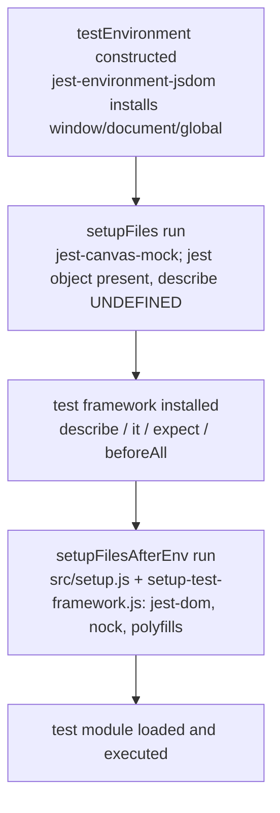

# Why some tests pass in isolation but fail in the full suite — a runtime investigation of Jest module resolution & test‑environment setup in `wp-calypso`

- **Repository:** `Automattic/wp-calypso`
- **Commit:** `be7e5cc641622d153040491fd5625c6cb83e12eb`
- **Toolchain observed:** Node `v22.12.0` (satisfies `package.json:57` `"node": "^v22.9.0"`; pin `.nvmrc:1` = `22.9.0`), Jest `29.7.0`, Yarn `4.0.2` (`package.json:422` `"packageManager": "yarn@4.0.2"`), `nodeLinker: node-modules` (`.yarnrc.yml:3`).
- **Method:** every claim below was produced by **running the code first** (Jest `--showConfig`, the repository's own custom resolver, `require.resolve`, and temporary Jest probe tests) and then quoting the **verbatim observed output** together with the exact command that produced it. Temporary probe files were deleted afterward; the only persisted artifact is this document.

## Context / framing

`wp-calypso` runs **seven distinct Jest execution contexts** — `client`, `server`, `packages`, `apps`, `integration`, `build-tools`, and `e2e` — of which **five** extend the shared preset `@automattic/calypso-jest` (`packages/calypso-jest/jest-preset.js`) by spreading it: `client` (`test/client/jest.config.js:5` `...base`), `server` (`test/server/jest.config.js:5` `...base`), `build-tools` (`test/build-tools/jest.config.js:5` `...base`), `packages` (via `test/packages/jest-preset.js:9` `...base`), and `apps` (via `test/apps/jest-preset.js:5` `...base`). `integration` is **standalone**: it does not spread the preset and instead reuses only the shared resolver (`test/integration/jest.config.js:8` `resolver: require.resolve( '@automattic/calypso-jest/src/module-resolver.js' )`). `e2e` uses a **custom Playwright config** (`test/e2e/jest.config.js:1` `require( '@automattic/calypso-e2e/src/jest-playwright-config' )`), not the shared preset. The contexts differ along five axes that, together, explain why a test can pass by itself and then fail when the whole suite runs:

1. the resolved **`testEnvironment`** (`jest-environment-node` vs `jest-environment-jsdom`) — Q1;
2. the injected **`globals`** and the polyfilled/mocked global surface installed by `setupFiles`/`setupFilesAfterEnv` — Q2;
3. **internal‑package resolution** via a custom `enhanced-resolve` resolver that prefers untranspiled `calypso:src` — Q3;
4. **`moduleNameMapper` overrides** that redirect a specifier to an entirely different file per suite — Q4;
5. the **per‑file initialization order** that determines _when_ each capability (jsdom `window`/`document`, the `jest` object, the `describe`/`it` framework) becomes available — Q5.

A test that (accidentally) depends on the client environment, a leaked global mock, or a specific resolved module will pass under the suite/environment that provides those things and fail under a suite that does not — leaked globals, environment mismatch, and context‑dependent module resolution.

---

## Q1 — Execution environments: what runtime environment does each test command ACTUALLY use?

**Question restated:** Run the different test commands in this codebase and determine, at runtime, the concrete `testEnvironment` each resolves to, and how they differ.

### The test commands (the command surface)

Every test command is a `jest -c=test/<suite>/jest.config.js` invocation declared in `package.json`:

- `package.json:120` `"test": "run-s -s test-client test-packages test-server test-build-tools"`
- `package.json:122` `"test-client": "TZ=UTC jest -c=test/client/jest.config.js"`
- `package.json:129` `"test-packages": "jest -c=test/packages/jest.config.js"`
- `package.json:131` `"test-server": "jest -c=test/server/jest.config.js"`
- `package.json:121` `"test-build-tools": "jest -c=test/build-tools/jest.config.js"`
- `package.json:125` `"test-integration": "jest -c=test/integration/jest.config.js"`
- `package.json:127` `"test-apps": "jest -c=test/apps/jest.config.js"`

The 7th context, `e2e`, has its own config at `test/e2e/jest.config.js` and is not wired into the aggregate `test` script.

### Command run to observe each environment

```
CI=true node_modules/.bin/jest -c=test/<suite>/jest.config.js --showConfig
```

and the resolved value read from `.configs[].testEnvironment`.

### Verbatim observed output — single‑project suites

```
client       => /tmp/…/node_modules/jest-environment-node/build/index.js
server       => /tmp/…/node_modules/jest-environment-node/build/index.js
integration  => /tmp/…/node_modules/jest-environment-node/build/index.js
build-tools  => /tmp/…/node_modules/jest-environment-node/build/index.js
```

### Verbatim observed output — multi‑project suites (summarized over `.configs[]`)

```
packages     total projects (configs) = 58 ; {"jest-environment-node":36,"jest-environment-jsdom":22}
apps         total projects (configs) = 3  ; {"jest-environment-jsdom":3}
```

For `e2e`, the environment is a **custom** one rather than a built‑in package (see below).

### Interpretation with `file:line` citations

- **Default environment** is `node`, from the shared preset: `packages/calypso-jest/jest-preset.js:11` `testEnvironment: 'node'`.

- **client** spreads the base preset (`test/client/jest.config.js:5` `...base`) and does **not** override `testEnvironment`, so its base environment is `jest-environment-node`. This is a **documented divergence worth stating explicitly**: the client suite is commonly _thought of_ as "jsdom", but the empirical base is node — jsdom is opted into **per file** via a `/** @jest-environment jsdom */` docblock (proven in Q2 and Q5). Observed behavior is authoritative:

```
client       => /tmp/…/node_modules/jest-environment-node/build/index.js
```

At this commit, **498** client test files carry that docblock — per‑file jsdom opt‑in is the norm, not the base.
Command: `grep -rl "@jest-environment jsdom" client | wc -l`

```
498
```

- **server** spreads the base (`test/server/jest.config.js:5` `...base`) with no override → `jest-environment-node`:

```
server       => /tmp/…/node_modules/jest-environment-node/build/index.js
```

- **build-tools** spreads the base (`test/build-tools/jest.config.js:5` `...base`) with no override → `jest-environment-node`:

```
build-tools  => /tmp/…/node_modules/jest-environment-node/build/index.js
```

- **integration** sets it explicitly: `test/integration/jest.config.js:7` `testEnvironment: 'node'` → `jest-environment-node`. Note it does **not** spread the base preset, so it also has **no** `setupFilesAfterEnv` (confirmed in Q2):

```
integration  => /tmp/…/node_modules/jest-environment-node/build/index.js
```

- **apps** sets it globally in the apps preset: `test/apps/jest-preset.js:7` `testEnvironment: 'jsdom'`. The aggregator `test/apps/jest.config.js:4` `projects: [ '<rootDir>/apps/*/jest.config.js' ]` produces 3 app projects, all jsdom:

```
apps         total projects (configs) = 3  ; {"jest-environment-jsdom":3}
```

- **packages** uses the base (default node) via `test/packages/jest-preset.js:9` `...base`, aggregated by `test/packages/jest.config.js:4` `projects: [ '<rootDir>/packages/*/jest.config.js' ]`. **Reported exactly:** of 58 package projects, **36 resolve to `jest-environment-node` and 22 set `testEnvironment: 'jsdom'` at the project level**:

```
packages     total projects (configs) = 58 ; {"jest-environment-node":36,"jest-environment-jsdom":22}
```

A concrete jsdom example is `packages/block-renderer/jest.config.js:3` `testEnvironment: 'jsdom'`. The full set of **22** jsdom package projects is the verbatim output of:
Command: `grep -rl "testEnvironment: 'jsdom'" packages/*/jest.config.js`

```
packages/block-renderer/jest.config.js
packages/calypso-products/jest.config.js
packages/calypso-sentry/jest.config.js
packages/calypso-url/jest.config.js
packages/command-palette/jest.config.js
packages/composite-checkout/jest.config.js
packages/dataviews/jest.config.js
packages/design-picker/jest.config.js
packages/design-preview/jest.config.js
packages/domain-picker/jest.config.js
packages/global-styles/jest.config.js
packages/help-center/jest.config.js
packages/launchpad/jest.config.js
packages/odie-client/jest.config.js
packages/onboarding/jest.config.js
packages/search/jest.config.js
packages/shopping-cart/jest.config.js
packages/site-admin/jest.config.js
packages/sites/jest.config.js
packages/subscriber/jest.config.js
packages/verbum-block-editor/jest.config.js
packages/wpcom-checkout/jest.config.js
```

(22 package projects; Node‑default packages may additionally opt into jsdom per file via docblock.)

- **e2e** (the 7th context) requires a Playwright config: `test/e2e/jest.config.js:1` `require( '@automattic/calypso-e2e/src/jest-playwright-config' )`. That config points `testEnvironment` at a **custom** environment file — `packages/calypso-e2e/src/jest-playwright-config/index.js:7` `testEnvironment: path.join( __dirname, 'environment.ts' )` — i.e. it resolves to `packages/calypso-e2e/src/jest-playwright-config/environment.ts`, neither of the two built‑ins. (This context is named for completeness; running Playwright is not required to answer Q1–Q5.)

- Jest exposes the two built‑in environments through the packages `jest-environment-node` and `jest-environment-jsdom`, both present under `node_modules/` and appearing verbatim in the resolved paths above.

### Rationale

The environment is chosen _per test file_ (docblock) but _defaults per project_ (config). Because `server`/`integration`/`build-tools` are always `node` and `apps` is always `jsdom`, while `client`/`packages` are node‑by‑default with jsdom opted in per file, **the same test source can execute under a different environment depending on which suite/command runs it** — the first ingredient of "passes alone, fails in suite."

---

## Q2 — Global surface differences: what exists in one context but not another?

**Question restated:** Compare what is available globally in each context and identify something present in one context yet absent in another.

### Evidence source 1 — injected `globals` (from `--showConfig`, `.configs[].globals`)

Command: `CI=true node_modules/.bin/jest -c=test/<suite>/jest.config.js --showConfig`

```
client       globals = {"google":{},"__i18n_text_domain__":"default"}
server       globals = {}
integration  globals = {}
build-tools  globals = {}
packages     globals = {"__i18n_text_domain__":"default"}   (sample project)
apps         globals = {}                                   (sample project)
```

Citations for the injected values:

- `test/client/jest.config.js:22-25` `globals: { google: {}, __i18n_text_domain__: 'default' }`.
- `test/packages/jest-preset.js:11-13` `globals: { __i18n_text_domain__: 'default' }`.

### Evidence source 2 — runtime probes (real suite configs)

Temporary probe tests were placed where each suite's `testMatch` discovers them and run under the **real** configs.

Client, a file **without** a docblock (uses the client BASE env = node):
Command: `TZ=UTC CI=true node_modules/.bin/jest -c=test/client/jest.config.js "__blitzy_probe__/test/env-default"`

```
PROBE_ENV_DEFAULT typeof_window=undefined typeof_document=undefined
```

Client, a file **with** `/** @jest-environment jsdom */` (opts into jsdom per file):
Command: `TZ=UTC CI=true node_modules/.bin/jest -c=test/client/jest.config.js "__blitzy_probe__/test/env-jsdom"`

```
PROBE_ENV_JSDOM typeof_window=object typeof_document=object
```

Client globals actually present at runtime (node‑default file):
Command: `TZ=UTC CI=true node_modules/.bin/jest -c=test/client/jest.config.js "__blitzy_probe__/test/globals-client"`

```
PROBE_GLOBALS_CLIENT google=object i18n=string matchMedia=function fetch=function CSS=object ResizeObserver=function structuredClone=function
```

Server globals actually present at runtime:
Command: `CI=true node_modules/.bin/jest -c=test/server/jest.config.js "__blitzy_probe__/test/globals-server"`

```
PROBE_GLOBALS_SERVER google=undefined window=undefined document=undefined
```

### The concrete delta (direct answer to Q2)

The **`google` global** exists in the client context but not in the server context:

```
PROBE_GLOBALS_CLIENT google=object …
PROBE_GLOBALS_SERVER google=undefined …
```

It is injected only by `test/client/jest.config.js:22-25` (`globals: { google: {}, … }`); the server config declares no such global (`server globals = {}`).

A second, structural delta is **`window`/`document`**, which are provided only by the jsdom environment. They are `object` under a jsdom‑docblock client file (`PROBE_ENV_JSDOM typeof_window=object typeof_document=object`) and `undefined` in every node context — the client base (`PROBE_ENV_DEFAULT typeof_window=undefined typeof_document=undefined`) and the server suite (`PROBE_GLOBALS_SERVER … window=undefined document=undefined`).

### Polyfilled/mocked APIs enumerated by name, per context

**Client `setupFilesAfterEnv` → `test/client/setup-test-framework.js`** (the richest surface):

- `@testing-library/jest-dom` — `test/client/setup-test-framework.js:1` `import '@testing-library/jest-dom';`
- `nock.disableNetConnect()` — `:9`
- `global.TextEncoder` / `global.TextDecoder` — `:25-26`
- `global.CSS = { supports: jest.fn() }` — `:30-32`
- `global.ResizeObserver = require( 'resize-observer-polyfill' )` — `:34`
- `global.fetch = jest.fn( … )` — `:36-40`
- `jest.mock( 'wpcom-proxy-request', … )` — `:44-49`
- `global.crypto.randomUUID = () => nodeCrypto.randomUUID()` — `:52`
- `global.matchMedia = jest.fn( … )` — `:54-63`
- `global.ReadableStream` / `global.TransformStream` / `global.Worker` — `:66-68`
- `global.structuredClone` fallback — `:71-73`
- `global.crypto.subtle` — `:76-78`

**Preset‑level** (base `setupFilesAfterEnv` → `packages/calypso-jest/src/setup.js`):

- `global.CSS = { supports: jest.fn() }` — `packages/calypso-jest/src/setup.js:3-5`.

**Packages `setupFilesAfterEnv` → `test/packages/setup.js`** (a subset, with one difference reported exactly):

- `@testing-library/jest-dom` — `test/packages/setup.js:1`
- `global.crypto.randomUUID = () => 'fake-uuid'` — `test/packages/setup.js:3` — **reported exactly:** unlike the client (which delegates to `nodeCrypto.randomUUID()`), the packages setup returns the literal string `'fake-uuid'`.
- `global.ResizeObserver = require( 'resize-observer-polyfill' )` — `:5`
- `global.matchMedia = jest.fn( … )` — `:7-16`

**Server `setupFilesAfterEnv` → `test/server/setup-test-framework.js`** (minimal):

- `nock.disableNetConnect()` — `test/server/setup-test-framework.js:1-4`
- `jest.mock( 'wpcom-proxy-request', … )` — `:21`

**apps** reuse the client setup file: `test/apps/jest-preset.js:13` `setupFilesAfterEnv: [ require.resolve( '../client/setup-test-framework.js' ) ]`.

An important **inheritance nuance** observed in `--showConfig`'s resolved `setupFilesAfterEnv`:

```
client       => ['test/client/setup-test-framework.js']
server       => ['test/server/setup-test-framework.js']
build-tools  => ['packages/calypso-jest/src/setup.js']
integration  => []
```

`client`/`server` **replace** the base `setupFilesAfterEnv` (they do not additionally run `packages/calypso-jest/src/setup.js`), while `build-tools` **inherits** the base one, and `integration` has **none** (it does not spread the base). The client still gets `global.CSS` because its own setup file re‑declares it at `test/client/setup-test-framework.js:30-32`.

### Rationale

Because the client context injects `google` and installs a large set of `global.*` mocks (`fetch`, `matchMedia`, `CSS`, `ResizeObserver`, `structuredClone`, `TextEncoder`, …) that persist for the whole test file/worker, a test that (accidentally) relies on any of them passes under the client suite but fails under `server`/`integration`/`build-tools`, where those globals are absent — and conversely a test may only collide with a leaked mock when run alongside others in the same worker. This is the "global surface" ingredient of "passes alone, fails in suite."

---

## Q3 — Internal dependency resolution: what actual file loads, and does execution mode matter?

**Question restated:** Find a monorepo package that depends on another internal package from the same repo, run its tests, and determine what actual file gets loaded when that internal dependency is imported — and whether that differs based on how the tests are executed.

### The internal‑on‑internal example (verified)

`@automattic/components` depends on `@automattic/calypso-url`:

- `packages/components/package.json:2` `"name": "@automattic/components"`
- `packages/components/package.json:32` `"@automattic/calypso-url": "workspace:^"`
- A real import site is `packages/components/src/gravatar/index.tsx:8` `} from '@automattic/calypso-url';` (the import statement spans `packages/components/src/gravatar/index.tsx:1-8`).

### Command 1 — the exact resolver Jest is configured with

Jest is wired to this resolver at `packages/calypso-jest/jest-preset.js:9` `resolver: require.resolve( './src/module-resolver.js' )`. Invoked directly:

```
node -e "const r=require('<REPO>/packages/calypso-jest/src/module-resolver.js'); console.log(r('@automattic/calypso-url',{basedir:'<REPO>/packages/components/src'}))"
```

Verbatim output:

```
[Jest custom resolver] @automattic/calypso-url => packages/calypso-url/src/index.ts
```

### Command 2 — inside an actual Jest run

A probe test placed in `@automattic/components` (which imports the dependency and prints `require.resolve`), run under the components config:
Command: `CI=true node_modules/.bin/jest -c=packages/components/jest.config.js "__blitzy_probe__/test/resolve"`

```
PROBE_RESOLVE_INSIDE_JEST @automattic/calypso-url => /tmp/…/packages/calypso-url/src/index.ts
PROBE_RESOLVE_IMPORT_OK getUrlParts=function
```

So at test runtime the **actual file loaded is `packages/calypso-url/src/index.ts`** — the untranspiled TypeScript source — and the named export `getUrlParts` is a live function.

### Command 3 — plain Node (bundler‑equivalent) resolution, for contrast

```
node -e "require.resolve('@automattic/calypso-url',{paths:['<REPO>/packages/components/src']})"
```

Verbatim output:

```
[plain Node require.resolve] THROWS: Cannot find module '/tmp/…/node_modules/@automattic/calypso-url/dist/cjs/index.js'. Please verify that the package.json has a valid "main" entry
```

### Interpretation with `file:line` citations

- Under **Jest**, the internal dependency loads as **untranspiled source** `packages/calypso-url/src/index.ts`, selected via the `calypso:src` field: `packages/calypso-url/package.json:8` `"calypso:src": "src/index.ts"`.
- Under **plain Node / a bundler using Node semantics**, resolution follows `main`: `packages/calypso-url/package.json:5` `"main": "dist/cjs/index.js"` (or `module` at `:6` `"dist/esm/index.js"`). **Reported exactly:** here plain Node `require.resolve` **throws**, because `dist/cjs/index.js` was never built for this package (verified: `ls packages/calypso-url/dist/cjs/index.js` → `No such file or directory`, while `packages/calypso-url/src/index.ts` exists). This empirically confirms the resolver's own comment that `main` "points to a file that usually _does not_ exist … but it doesn't matter because all packages in the monorepo have `calypso:src`" (`packages/calypso-jest/src/module-resolver.js:11-12`).
- **Cause** — the custom resolver's field priority, built with `enhanced-resolve`:
  - `packages/calypso-jest/src/module-resolver.js:18` `mainFields: [ 'calypso:src', 'main' ]`
  - `packages/calypso-jest/src/module-resolver.js:19` `conditionNames: [ 'calypso:src', 'node', 'require' ]`
  - constructed at `packages/calypso-jest/src/module-resolver.js:16-20` `enhancedResolve.create.sync( { … } )`.
    A byte‑identical duplicate exists at `test/module-resolver.js` (used by the integration suite via `test/integration/jest.config.js:8`).

### Does execution mode matter? — Yes.

Same specifier `@automattic/calypso-url`, two different actual files:

```
Jest        => packages/calypso-url/src/index.ts   (calypso:src field, untranspiled source)
plain Node  => THROWS on packages/calypso-url/dist/cjs/index.js (main field, dist not built)
```

Jest consumes source; a bundler/Node consumes `dist` (or fails when `dist` is absent). A test relying on source‑only behavior (e.g. TS types, source‑level exports, un‑built code) works under Jest and would break under a `dist`‑based execution — the "context‑dependent resolution" ingredient of "passes alone, fails in suite."

---

## Q4 — Import path override: where an import gets redirected, and whether the same import resolves differently per context

**Question restated:** The test infrastructure overrides some import paths. Find where an import is redirected, trace where it actually resolves at runtime, and show whether the same import resolves to different locations depending on execution context.

### The overridden specifier: `@automattic/calypso-config`

Command: `CI=true node_modules/.bin/jest -c=test/<suite>/jest.config.js --showConfig`, reading `.configs[].moduleNameMapper`.

Verbatim observed `moduleNameMapper` (absolute targets as resolved by Jest):

```
client       '^@automattic/calypso-config$'      => /tmp/…/client/server/config/index.js
integration  '^@automattic/calypso-config$'      => /tmp/…/client/server/config/index.js
server       '^@automattic/calypso-config$'      => 'calypso/server/config'
server       '^@automattic/calypso-config/(.*)$' => 'calypso/server/config/$1'
build-tools  (no calypso-config moduleNameMapper entry)
```

Resolution of the server bare specifier, and of the no‑mapper suites:

```
plain Node require.resolve('calypso/server/config')  => client/server/config/index.js   (via node_modules/calypso -> ../client symlink)
[Jest resolver]  @automattic/calypso-config (no mapper) => packages/calypso-config/src/index.ts
[plain Node]     @automattic/calypso-config (no mapper) => packages/calypso-config/dist/cjs/index.js
```

### Interpretation with `file:line` citations

- **client** → `test/client/jest.config.js:11` `'^@automattic/calypso-config$': '<rootDir>/server/config/index.js'`. With the client `rootDir` (`test/client/jest.config.js:6` `rootDir: '../../client'`) this resolves to the absolute file `client/server/config/index.js`.
- **integration** → `test/integration/jest.config.js:3` `'^@automattic/calypso-config$': '<rootDir>/client/server/config/index.js'`. With `rootDir` `../..` (`test/integration/jest.config.js:6`), this is the **same** target `client/server/config/index.js`.
- **server** → `test/server/jest.config.js:10` `'^@automattic/calypso-config$': 'calypso/server/config'` plus the subpath variant `test/server/jest.config.js:11` `'^@automattic/calypso-config/(.*)$': 'calypso/server/config/$1'`. The bare specifier `calypso/server/config` resolves via the workspace symlink `node_modules/calypso -> ../client` (verified: `readlink node_modules/calypso` → `../client`) to **the same** file `client/server/config/index.js`. That symlink exists because `client/package.json:2` `"name": "calypso"`.
- **packages / apps / build-tools** have **no** `@automattic/calypso-config` mapper, so the specifier resolves to the **real package** `packages/calypso-config/src/index.ts` via `calypso:src` (`packages/calypso-config/package.json:11` `"calypso:src": "src/index.ts"`). Under a bundler/Node it would instead be `main` `dist/cjs/index.js` (`packages/calypso-config/package.json:9`) or `module` `dist/esm/index.js` (`:10`).

**Reported exactly (an honest divergence from the calypso‑url case in Q3):** for `@automattic/calypso-config`, plain Node `require.resolve` does **not** throw — `packages/calypso-config/dist/cjs/index.js` _was_ built at this checkout. So the calypso‑config `dist` exists whereas the calypso‑url `dist` (Q3) does not; in both cases Jest still selects the `src` file via `calypso:src`.
Command: `stat -c '%s bytes' packages/calypso-config/dist/cjs/index.js`

```
3394 bytes
```

### Same specifier → different absolute files (direct answer to Q4)

```
client / integration / server  =>  client/server/config/index.js
packages / apps / build-tools  =>  packages/calypso-config/src/index.ts
```

These are **distinct modules**, not two builds of the same source. The override target `client/server/config/index.js` builds _server_ configuration: it requires `@automattic/create-calypso-config` (`client/server/config/index.js:2`) and a local `./parser` (`client/server/config/index.js:3`), then exports `createConfig( serverData )` (`client/server/config/index.js:11`) plus a `.clientData` property (`client/server/config/index.js:12`). It is **not** the `@automattic/calypso-config` package source (`packages/calypso-config/src/index.ts:1` `import createConfig from '@automattic/create-calypso-config';`). This is a **second, independent mechanism** — distinct from Q3's `mainFields` priority — by which the same import diverges across contexts.

### Rationale

`moduleNameMapper` lets each suite bind `@automattic/calypso-config` to whichever implementation makes sense for that context (the server‑side config builder in `client`/`integration`/`server`; the real package in `packages`/`apps`/`build-tools`). A test that imports `@automattic/calypso-config` therefore exercises a completely different module depending on which suite runs it — so it can pass under the suite whose target satisfies its expectations and fail under another. This is the "import override" ingredient of "passes alone, fails in suite."

---

## Q5 — Initialization order and the provider of browser‑like APIs

**Question restated:** When a test runs, investigate what loads first. Some tests have access to browser‑like APIs — determine what provides those capabilities and when that provider becomes available, and verify the initialization order by observing what is accessible at different points.

### Command — a jsdom probe logging `typeof` at each lifecycle stage

A self‑contained jsdom config wired with custom `setupFiles`, `setupFilesAfterEnv`, and a test module, each logging `typeof` for `window`, `document`, `jest`, `jest.fn`, `describe`, `beforeAll`:

```
CI=true node_modules/.bin/jest -c=<probe>/order.config.js
```

### Verbatim observed output

```
PROBE_ORDER [1:setupFiles]         window=object document=object jest=object jestfn=function describe=undefined beforeAll=undefined
PROBE_ORDER [2:setupFilesAfterEnv] window=object document=object jest=object jestfn=function describe=function beforeAll=function
PROBE_ORDER [3:testModuleTopLevel] window=object document=object jest=object describe=function
PROBE_ORDER [4:testBody]           window=object document=object jest=object describe=function
```

### Interpretation with `file:line` citations (the order, with rationale)

1. **`testEnvironment` is constructed first — it is the provider of browser‑like APIs.** The provider of `window`/`document` is the **jsdom test environment (`jest-environment-jsdom`)**, and it installs those globals **before any setup code runs** — proven because already at the earliest stage:

```
PROBE_ORDER [1:setupFiles] window=object document=object …
```

The environment is selected by `testEnvironment` (globally for apps at `test/apps/jest-preset.js:7` `testEnvironment: 'jsdom'`, or per file via a `/** @jest-environment jsdom */` docblock in client/packages). In a **node** context, `window`/`document` are never installed (Q2: `PROBE_ENV_DEFAULT typeof_window=undefined typeof_document=undefined`).

2. **`setupFiles` run next.** They are configured at `test/client/jest.config.js:20` `setupFiles: [ 'jest-canvas-mock' ]` and `test/apps/jest-preset.js:11` `setupFiles: [ 'jest-canvas-mock' ]`. **Reported exactly:** at this stage the `jest` object **is already present** (`jest=object`, `jestfn=function`), but the **test‑framework globals are not** — `describe=undefined`, `beforeAll=undefined`:

```
PROBE_ORDER [1:setupFiles] … jest=object jestfn=function describe=undefined beforeAll=undefined
```

So the true `setupFiles`‑vs‑`setupFilesAfterEnv` distinction is the installation of the **test framework** (`describe`/`it`/`beforeAll`), not the `jest` object.

3. **The test framework is installed** (`describe`/`it`/`expect`/`beforeAll`) between the two setup stages.

4. **`setupFilesAfterEnv` run** — proven because `describe`/`beforeAll` are now functions:

```
PROBE_ORDER [2:setupFilesAfterEnv] … describe=function beforeAll=function
```

The base preset wires this at `packages/calypso-jest/jest-preset.js:10` `setupFilesAfterEnv: [ require.resolve( './src/setup.js' ) ]`; the client adds its own at `test/client/jest.config.js:21` `setupFilesAfterEnv: [ '<rootDir>/../test/client/setup-test-framework.js' ]`. These files legitimately call `jest.fn()`/`jest.mock()` at module top level (e.g. `packages/calypso-jest/src/setup.js:4` `supports: jest.fn()`; `test/client/setup-test-framework.js:44-49` `jest.mock( 'wpcom-proxy-request', … )`), which is consistent with the observation that the `jest` object already exists by this stage.

5. **The test module is loaded and executed** — everything is available at module top level and in the test body:

```
PROBE_ORDER [3:testModuleTopLevel] window=object document=object jest=object describe=function
PROBE_ORDER [4:testBody]           window=object document=object jest=object describe=function
```

### Order diagram



### Preset ordering anchors (cited)

- `packages/calypso-jest/jest-preset.js:9` `resolver`
- `packages/calypso-jest/jest-preset.js:10` `setupFilesAfterEnv`
- `packages/calypso-jest/jest-preset.js:11` `testEnvironment: 'node'`
- `packages/calypso-jest/jest-preset.js:12` `testMatch: [ '<rootDir>/**/test/*.[jt]s?(x)', '!**/.eslintrc.*' ]`
- `packages/calypso-jest/jest-preset.js:13-16` `transform` (`:14` `babel-jest` `{ rootMode: 'upward' }` — consuming the root `babel.config.js`, which loads `@automattic/calypso-babel-config` at `babel.config.js:2`; `:15` `src/asset-transform.js`)
- `packages/calypso-jest/jest-preset.js:17` `testPathIgnorePatterns` adds `'/dist/'`

### Rationale — tying it all together

Because the environment and setup order install globals/mocks **per file** (jsdom `window`/`document` first, then `jest`, then the framework, then the polyfills), and because `moduleNameMapper` (Q4) plus the custom `calypso:src`‑first resolver (Q3) bind imports differently **per suite**, a test that depends on the client environment/mocks or on a specific resolved module will pass when executed under the right suite/environment/order and fail when executed under a different suite's environment, setup order, or resolution. That is the complete explanation for **"passes in isolation, fails in the full suite."**

---

## Coverage‑pass checklist

Each item below is answered above with adjacent verbatim evidence and a `file:line` citation.

**Q1 — Execution environments**

- [x] All 7 contexts named: `client`, `server`, `packages`, `apps`, `integration`, `build-tools`, `e2e`.
- [x] Every `test-*` command enumerated: `test` (`package.json:120`), `test-client` (`:122`), `test-packages` (`:129`), `test-server` (`:131`), `test-build-tools` (`:121`), `test-integration` (`:125`), `test-apps` (`:127`).
- [x] Resolved `testEnvironment` per context via `--showConfig`: `client`/`server`/`integration`/`build-tools` = `jest-environment-node`; `apps` = 3× `jest-environment-jsdom`; `packages` = 36 node / 22 jsdom; `e2e` = custom `packages/calypso-e2e/src/jest-playwright-config/environment.ts`.
- [x] Both built‑in env packages named: `jest-environment-node`, `jest-environment-jsdom`.
- [x] Documented divergence reported: client BASE = node (not jsdom); jsdom is per‑file via docblock (client docblock count shown with its producing command and verbatim output in Q1).

**Q2 — Global surface differences**

- [x] Injected `globals` per context captured via `--showConfig`.
- [x] Named delta identified: `google` = `object` (client) vs `undefined` (server).
- [x] `window`/`document` shown jsdom‑only (object under jsdom docblock; undefined in node client base & server).
- [x] Every polyfilled/mocked API listed by name with `file:line` (client `setup-test-framework.js`, preset `setup.js`, packages `setup.js`, server `setup-test-framework.js`), including the `test/packages/setup.js:3` `'fake-uuid'` divergence and the `setupFilesAfterEnv` inheritance nuance (client replaces base; build-tools inherits; integration empty).

**Q3 — Internal dependency resolution**

- [x] Internal‑on‑internal example: `@automattic/components` → `@automattic/calypso-url` (`packages/components/package.json:32`; import at `packages/components/src/gravatar/index.tsx:8`).
- [x] Actual file under Jest: `packages/calypso-url/src/index.ts` (custom resolver + inside‑Jest probe).
- [x] Bundler/Node contrast: plain Node `require.resolve` THROWS on unbuilt `dist/cjs/index.js`.
- [x] Cause cited: resolver `mainFields` `packages/calypso-jest/src/module-resolver.js:18`, `conditionNames` `:19`.

**Q4 — Import path override**

- [x] Overridden specifier `@automattic/calypso-config` traced per context via `--showConfig`.
- [x] Same specifier → different absolute files: `client/server/config/index.js` (client/integration/server) vs `packages/calypso-config/src/index.ts` (packages/apps/build-tools).
- [x] Symlink mechanism shown: `node_modules/calypso -> ../client` (because `client/package.json:2` `"name": "calypso"`).
- [x] Honest divergence reported: calypso-config `dist` exists (plain Node does not throw), unlike calypso-url; the calypso-config dist presence and byte size are shown with their producing command and verbatim output in Q4.

**Q5 — Initialization order & browser‑API provider**

- [x] Full init order established via probe: environment → `setupFiles` → framework install → `setupFilesAfterEnv` → test module.
- [x] Provider of browser‑like APIs identified: the jsdom environment (`jest-environment-jsdom`), installing `window`/`document` before setup.
- [x] `describe` = `undefined` at `setupFiles` vs `function` at `setupFilesAfterEnv` (reported exactly).
- [x] `jest` object present throughout (present already at `setupFiles`) — reported exactly.

### Evidence of a real suite executing

To confirm the toolchain and suites actually run (not just `--showConfig`), a genuine internal‑package suite was executed:
Command: `CI=true node_modules/.bin/jest -c=packages/calypso-url/jest.config.js`

```
Test Suites: 5 passed, 5 total
Tests:       83 passed, 83 total
```

### Note on method and scope

All observations reflect the repository exactly at commit `be7e5cc641622d153040491fd5625c6cb83e12eb` under Node `v22.12.0` / Jest `29.7.0` / Yarn `4.0.2`. The investigation was read‑only: temporary probe tests were created solely to capture the runtime output quoted above and were removed afterward, leaving the source tree unchanged apart from this document. Paths shown as `/tmp/…/` are the machine‑absolute prefix of the repository root and are elided for readability; the trailing repository‑relative portion is exact.
