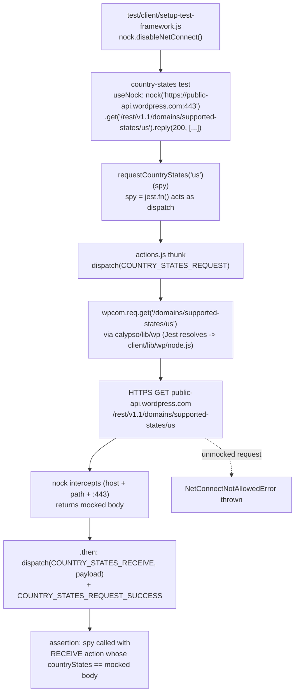

# wp-calypso Testing Infrastructure — Onboarding Briefing

> **Audience:** a developer about to contribute to the [`Automattic/wp-calypso`](https://github.com/Automattic/wp-calypso) monorepo.
> **Scope:** how the test environment boots and behaves, how it differs from running the dev server, and how configuration/feature-flags resolve differently under test — answered from the code itself, with citations and the reasoning behind each answer.
> **Branch / commit:** `wp-calypso_be7e5cc64162` @ `be7e5cc641622d153040491fd5625c6cb83e12eb`.
> **Runtime used to verify:** Node `v22.12.0` (satisfies `engines.node ^v22.9.0`), Yarn `4.0.2` via Corepack.

## How to read this document

This is a Question-and-Answer briefing. It opens by confirming the **development server** works, then pivots to the **test environment**, which is the real focus. Each answer has three parts:

1. **The answer** — the observed behavior.
2. **Citations** — every claim points at real code using the `path:Lstart-Lend` convention (line numbers verified at the commit above).
3. **Rationale / thinking** — _why_ the code behaves this way, not just _that_ it does.

Where it adds clarity, an answer includes a short code excerpt or a diagram. The closing **"How this was verified"** section lists the commands that were actually run — read-only test runs, inline `node -e` snippets, and an actual dev-server boot. Apart from the dev server's **gitignored** `build/` artifacts (cleaned up afterward), the probes created no files, so the tracked source tree is left pristine.

Two stable, well-documented Jest framework defaults are relied upon throughout and are called out where used: (a) Jest sets `process.env.NODE_ENV` to `'test'` when it is unset; (b) Jest's default `testEnvironment` is Node, with a browser-like `jsdom` environment being opt-in per file via a `@jest-environment` docblock (Jest docs, `jestjs.io`). These corroborate — they do not replace — the repository evidence below.

This document also cross-references the project's Technical Specification **§6.6 (Testing Strategy)** and **§4.10 (Feature Flag and Configuration Flow)**, which independently corroborate the findings.

The seven answer sections are:

| #   | Question                                                                                                             |
| --- | -------------------------------------------------------------------------------------------------------------------- |
| Q1  | Does the dev server boot/work (`yarn start`)? (baseline, then pivot to tests)                                        |
| Q2  | What does the test environment look like at boot vs. normal development?                                             |
| Q3  | Which globals / env vars / polyfills exist _only_ during test execution?                                             |
| Q4  | What happens when code makes network requests during tests?                                                          |
| Q5  | A test that mocks an API call — trace the mocked response through the action creator to the assertion.               |
| Q6  | How is config (e.g. feature flags) resolved differently in tests vs. development?                                    |
| Q7  | How do tests control what `config` returns — with proof a test resolves a different value than the dev server would? |

---

## Q1. Dev-server confirmation (baseline)

**Answer.** The dev server is started by `yarn start`, a gated build-then-serve chain defined entirely in `package.json`. With `NODE_ENV`/`CALYPSO_ENV` unset (the normal-development case), the configuration layer resolves the **`development`** environment. This establishes the "normal development" baseline that the test environment is contrasted against in Q2–Q7.

**The script chain** (quoted verbatim):

```jsonc
// package.json:L110
"start": "npx check-node-version --package && node bin/welcome.js && yarn run build && yarn run start-build",
// package.json:L113
"start-build": "BROWSERSLIST_ENV=evergreen node build/server.js | bunyan -o short",
// package.json:L64
"build": "./bin/build-packages-if-needed.sh && yarn run build-static && yarn run build-css && run-p -s 'build-devdocs:*' && run-p -s build-server build-client-if-prod",
```

Citations: `package.json:L110`, `package.json:L113`, `package.json:L64`.

**Runtime gate.** `start` first runs `npx check-node-version --package`, which reads `engines` and **rejects an incompatible Node/Yarn**:

```jsonc
// package.json:L56-L58
"engines": {
	"node": "^v22.9.0",
	"yarn": "^4.0.0"
},
```

`.nvmrc` pins `22.9.0`, and `package.json:L422` sets `"packageManager": "yarn@4.0.2"`. This is _why_ the documented runtime is Node `>= 22.9.0` with Yarn `4.0.2` (a Node 20.x toolchain would fail the gate). Citations: `package.json:L56-L58`, `.nvmrc:L1`, `package.json:L422`.

**Build → run ordering (important).** `build/server.js` is a **generated artifact** — it does _not_ exist in the source tree at this commit; it is produced by `yarn run build`. So `start` builds first, then `start-build` runs `node build/server.js`. (Verified: `build/server.js` is absent at HEAD and `build-server` at `package.json:L81` is the webpack step that emits it.)

**Why it resolves `development`.** The server reads its environment from a small shim:

```js
// client/server/config/index.js:L5-L9
const { serverData, clientData } = parser( configPath, {
	env: process.env.CALYPSO_ENV || process.env.NODE_ENV || 'development',
	enabledFeatures: process.env.ENABLE_FEATURES,
	disabledFeatures: process.env.DISABLE_FEATURES,
} );
```

With neither `CALYPSO_ENV` nor `NODE_ENV` set, `env` falls through to `'development'` (`client/server/config/index.js:L6`). This is corroborated by `config/README.md:L3`, which states the server picks the config file from `NODE_ENV` and that the default is `"development"`.

**Observed (the dev server was actually booted).** The build-then-run chain was exercised non-interactively and the server came up:

1. **Runtime gate passed.** `npx check-node-version --package` exited `0` against the installed Node `v22.12.0` / Yarn `4.0.2` — the `engines` gate in `start` accepts this toolchain.
2. **Server bundle built.** `yarn run build-server` (the webpack step at `package.json:L81`) emitted the generated `build/server.js` (~7.9 MB), which is gitignored and absent from the source tree until built.
3. **Server started and served HTTP 200.** Run exactly as `start-build` does — `BROWSERSLIST_ENV=evergreen node build/server.js` (`package.json:L113`) with `NODE_ENV`/`CALYPSO_ENV` unset — it logged `wp-calypso booted in 1086ms - http://calypso.localhost:3000`, and `curl -sI http://localhost:3000` returned **`HTTP/1.1 200 OK`** (served by Express). That 200 is the framework's "waiting for webpack" placeholder page, the expected response when only the server bundle has been built (the full `yarn start` additionally builds the client).
4. **Environment confirmed `development`.** With both variables unset, the same shim the server uses resolves `config('env_id') === 'development'` (`client/server/config/index.js:L6`).

The server was then stopped; its `build/` output is gitignored, so the tracked source tree is unchanged.

**Rationale.** Confirming the dev server matters because it fixes the _baseline_: a single long-running Node process serving the `development` configuration. Every difference described below — auto-set `NODE_ENV=test`, injected globals, disabled network, a remapped config module — is a deliberate divergence _from this baseline_ that exists to make tests fast, hermetic, and deterministic.

---

## Q2. Test environment at boot vs. normal development

**Answer.** Where the dev server is _one_ long-lived Node process serving `development` config, the test suite is split into **seven Jest projects** that each spin up **isolated Jest workers**. The projects are _not_ uniform in how they configure those workers: **client**, **server**, and **build-tools** spread the shared base preset `@automattic/calypso-jest` directly; **packages** and **apps** are multi-project aggregators whose _child_ configs pick up that base preset indirectly (through `test/packages/jest-preset.js` / `test/apps/jest-preset.js`); **integration** does not spread the base at all but manually reuses the Calypso resolver and a Node environment; and **e2e** uses a Playwright config instead. What the projects that load Calypso source _share_ is the common machinery described below: defaulting to a Node test environment (jsdom is opt-in), resolving untranspiled monorepo source via the `calypso:src` resolver, having `NODE_ENV` auto-set to `'test'`, injecting a battery of globals/polyfills (Q3), and disabling the network (Q4). The `@automattic/calypso-config` import is remapped to a disk-reading shim in the **client**, **server**, and **integration** projects specifically (Q6/Q7) — not in every project.

### The seven projects

The aggregate `test` script and the per-project scripts live in `package.json`:

```jsonc
// package.json:L120
"test": "run-s -s test-client test-packages test-server test-build-tools",
// package.json:L122 / L129 / L131 / L121
"test-client": "TZ=UTC jest -c=test/client/jest.config.js",
"test-packages": "jest -c=test/packages/jest.config.js",
"test-server": "jest -c=test/server/jest.config.js",
"test-build-tools": "jest -c=test/build-tools/jest.config.js",
```

There are seven Jest config files on disk — `test/{client,server,packages,apps,build-tools,integration,e2e}/jest.config.js` — so the suite has seven projects (the default `yarn test` aggregate runs four of them; integration and e2e run separately):

| Project          | Config                            | Notable role                                                                                    |
| ---------------- | --------------------------------- | ----------------------------------------------------------------------------------------------- |
| client           | `test/client/jest.config.js`      | `rootDir` → `../../client` (`:L6`); colocated unit/component tests; the heaviest setup          |
| server           | `test/server/jest.config.js`      | `rootDir` → `../../client/server` (`:L7`)                                                       |
| packages         | `test/packages/jest.config.js`    | multi-project aggregator: `projects: ['<rootDir>/packages/*/jest.config.js']` (`:L4`)           |
| apps             | `test/apps/jest.config.js`        | multi-project aggregator: `projects: ['<rootDir>/apps/*/jest.config.js']` (`:L4`)               |
| build-tools      | `test/build-tools/jest.config.js` | `rootDir` → `../../build-tools` (`:L7`)                                                         |
| integration      | `test/integration/jest.config.js` | `testEnvironment: 'node'` (`:L7`); its own `testMatch` for `**/integration/*.[jt]s` (`:L9-L14`) |
| e2e (Playwright) | `test/e2e/jest.config.js`         | extends `@automattic/calypso-e2e/src/jest-playwright-config` (`:L1`) — Playwright end-to-end    |

> The `test/README.md` overview still describes only "four groups" (`client`, `integration`, `server`, `e2e`) — it is an older, simplified summary. The seven `jest.config.js` files plus the `package.json` scripts are the source of truth and were used here. This matches Technical Specification §6.6 (Testing Strategy).

### The shared base preset

Three top-level projects — **client**, **server**, and **build-tools** — spread `@automattic/calypso-jest` directly (`test/client/jest.config.js:L2`,`:L5`; `test/server/jest.config.js:L2`,`:L5`; `test/build-tools/jest.config.js:L2`,`:L5`). **packages** and **apps** do _not_ spread it at the top level — they are aggregators (`projects: ['<rootDir>/packages/*/jest.config.js']` at `test/packages/jest.config.js:L4`; `projects: ['<rootDir>/apps/*/jest.config.js']` at `test/apps/jest.config.js:L4`) whose _child_ configs inherit the base preset indirectly via `test/packages/jest-preset.js:L9` / `test/apps/jest-preset.js:L5` (each does `...base`). **integration** does _not_ spread the base — it declares its own `testEnvironment: 'node'`, resolver, `testMatch`, and `verbose` (`test/integration/jest.config.js:L7-L15`) while reusing the Calypso resolver (`require.resolve( '@automattic/calypso-jest/src/module-resolver.js' )`, `:L8`). **e2e** spreads the Playwright config instead (`test/e2e/jest.config.js:L1`,`:L4`). The base preset that the first group spreads (and that the packages/apps presets re-spread) is:

```js
// packages/calypso-jest/jest-preset.js:L8-L22
module.exports = {
	resolver: require.resolve( './src/module-resolver.js' ), // L9
	setupFilesAfterEnv: [ require.resolve( './src/setup.js' ) ], // L10
	testEnvironment: 'node', // L11  ← default is Node
	testMatch: [ '<rootDir>/**/test/*.[jt]s?(x)', '!**/.eslintrc.*' ], // L12  ← colocated test/ convention
	transform: {
		// L13-L16
		'\\.[jt]sx?$': [ 'babel-jest', { rootMode: 'upward' } ],
		'\\.(gif|jpg|jpeg|png|svg|scss|sass|css)$': require.resolve( './src/asset-transform.js' ),
	},
	testPathIgnorePatterns: [ ...defaults.testPathIgnorePatterns, '/dist/' ], // L17
	verbose: false, // L18
	snapshotFormat: { escapeString: true, printBasicPrototype: true }, // L19-L22
};
```

Citations: `packages/calypso-jest/jest-preset.js:L8-L22`. Asset imports (`gif|jpg|...|css`) are transformed to just their basename string by `packages/calypso-jest/src/asset-transform.js:L4-L5`, so importing an image/stylesheet in a test never touches a real asset pipeline.

### jsdom is opt-in

The base default is `testEnvironment: 'node'` (`packages/calypso-jest/jest-preset.js:L11`). Client-side tests that need a DOM opt into jsdom **per file** via the documented Jest `/** @jest-environment jsdom */` docblock. The one project-wide exception is **apps**, whose preset forces jsdom for every file and reuses the client setup:

```js
// test/apps/jest-preset.js:L7 and L13
testEnvironment: 'jsdom',
setupFilesAfterEnv: [ require.resolve( '../client/setup-test-framework.js' ) ],
```

Citations: `test/apps/jest-preset.js:L7`, `:L13`.

### Untranspiled source resolution (the `calypso:src` trick)

A custom `enhanced-resolve` resolver (identical in `packages/calypso-jest/src/module-resolver.js` and `test/module-resolver.js`) prefers the `calypso:src` field so Jest loads **untranspiled** monorepo source directly:

```js
// packages/calypso-jest/src/module-resolver.js:L16-L20
const resolver = enhancedResolve.create.sync( {
	extensions: [ '.json', '.js', '.jsx', '.ts', '.tsx' ],
	mainFields: [ 'calypso:src', 'main' ],
	conditionNames: [ 'calypso:src', 'node', 'require' ],
} );
```

Citations: `packages/calypso-jest/src/module-resolver.js:L16-L20`. (This resolver is also exactly why `calypso/lib/wp` loads `node.js` and not `browser.js` under test — see Q5.)

### Client project specializations

The client config (the one most contributors touch) layers several things on top of the base:

```js
// test/client/jest.config.js
moduleNameMapper: {                                                       // L10-L13
	'^@automattic/calypso-config$': '<rootDir>/server/config/index.js',   // L11  ← the crux of Q6/Q7
	'react-markdown': '<rootDir>/node_modules/react-markdown/react-markdown.min.js',
},
testEnvironmentOptions: { url: 'https://example.com' },                   // L17-L19
setupFiles: [ 'jest-canvas-mock' ],                                       // L20
setupFilesAfterEnv: [ '<rootDir>/../test/client/setup-test-framework.js' ],// L21
globals: { google: {}, __i18n_text_domain__: 'default' },                 // L22-L25
```

Citations: `test/client/jest.config.js:L6` (`rootDir`), `:L11`, `:L17-L19`, `:L20`, `:L21`, `:L22-L25`. The server project remaps the same import to `calypso/server/config` (`test/server/jest.config.js:L9-L12`) and the integration project to `<rootDir>/client/server/config/index.js` (`test/integration/jest.config.js:L3`).

### The contrast, made explicit

| Aspect                       | Dev server (`yarn start`)                | Test environment (Jest)                         |
| ---------------------------- | ---------------------------------------- | ----------------------------------------------- |
| Process model                | one long-running `node build/server.js`  | many isolated Jest workers                      |
| `NODE_ENV`                   | unset → config resolves `development`    | auto-set to `'test'` → config resolves `test`   |
| DOM                          | real browser                             | Node by default; jsdom opt-in per file          |
| Module source                | webpack bundle (honors `browser` field)  | untranspiled source via `calypso:src` resolver  |
| `@automattic/calypso-config` | browser impl reading `window.configData` | disk shim reading `config/<env>.json` (Q6/Q7)   |
| Network                      | real                                     | disabled by `nock.disableNetConnect()` (Q4)     |
| Extra globals                | none injected                            | `fetch`, `matchMedia`, `ResizeObserver`, … (Q3) |

**Rationale.** The design optimizes for _speed, isolation, and consistency_: the `calypso:src` resolver skips per-package transpilation in a large monorepo; defaulting to the Node environment (with jsdom only where a DOM is actually needed) keeps workers light; and sharing one base preset across the Calypso-source projects (spread directly by client/server/build-tools, or re-spread by the packages/apps presets) keeps them behaving consistently. The remapped config module and disabled network are what make a test's outcome depend only on its declared inputs, never on a developer's machine or the live network.

---

## Q3. Globals, environment variables, and polyfills that exist only under test

**Answer.** Test workers run code that expects browser/runtime APIs the Node (and even jsdom) environment doesn't fully provide. The setup files registered via `setupFilesAfterEnv` patch a battery of these onto `global` **only during test execution**; they do not exist when the dev server runs. The richest set is injected by the **client** setup file (which the **apps** suite reuses); the **packages** suite injects its own, separate set; and the base preset contributes a single global that — as detailed below — actually loads only for the **build-tools** project, because every other project overrides `setupFilesAfterEnv`.

### Client suite — `test/client/setup-test-framework.js`

This file (registered at `test/client/jest.config.js:L21`) is the main injection surface. Every assignment, by symbol → what it does → line:

| Symbol / action                                    | What it provides                                   | Line                   |
| -------------------------------------------------- | -------------------------------------------------- | ---------------------- |
| `import '@testing-library/jest-dom'`               | custom DOM matchers (`toBeInTheDocument`, …)       | `:L1`                  |
| `nock.disableNetConnect()`                         | blocks all real network (see Q4)                   | `:L9`                  |
| `beforeAll` / `afterAll` nock lifecycle            | re-activate / `restore()` + `cleanAll()`           | `:L11-L16`, `:L18-L22` |
| `global.TextEncoder` / `global.TextDecoder`        | for `ReactDOMServer`                               | `:L25-L26`             |
| `global.CSS = { supports: jest.fn() }`             | `@wordpress/components` calls `CSS.supports`       | `:L30-L32`             |
| `global.ResizeObserver`                            | `resize-observer-polyfill`                         | `:L34`                 |
| `global.fetch = jest.fn(...)`                      | mock resolving `{ json: () => Promise.resolve() }` | `:L36-L40`             |
| `jest.mock('wpcom-proxy-request', …)`              | 3-fn mock (+ `__esModule`; accesses `document`)    | `:L44-L49`             |
| `global.crypto.randomUUID`                         | delegates to Node's `crypto.randomUUID()`          | `:L52`                 |
| `global.matchMedia = jest.fn(...)`                 | media-query stub (`matches:false`, listeners)      | `:L54-L63`             |
| `global.ReadableStream` / `global.TransformStream` | for `@wp-playground/client`                        | `:L66-L67`             |
| `global.Worker`                                    | `require('worker_threads').Worker`                 | `:L68`                 |
| `global.structuredClone` (if missing)              | JSON round-trip polyfill                           | `:L71-L73`             |
| `global.crypto.subtle` (if missing)                | Node's WebCrypto `subtle`                          | `:L76-L79`             |

A representative excerpt — the `fetch` mock that exists only under test:

```js
// test/client/setup-test-framework.js:L36-L40
global.fetch = jest.fn( () =>
	Promise.resolve( {
		json: () => Promise.resolve(),
	} )
);
```

### Base setup — `packages/calypso-jest/src/setup.js` (loaded only where the base `setupFilesAfterEnv` is not overridden)

The base preset declares `setupFilesAfterEnv: [ require.resolve( './src/setup.js' ) ]` (`packages/calypso-jest/jest-preset.js:L10`), and that one file injects a single global:

```js
// packages/calypso-jest/src/setup.js:L3-L5
global.CSS = {
	supports: jest.fn(),
};
```

But this base file does **not** run for every project. Each project config that does `...base` and then sets its own `setupFilesAfterEnv` **replaces** the base array rather than appending to it — plain object‑spread is not additive. Of the seven projects, only **build-tools** leaves the base value untouched (`test/build-tools/jest.config.js:L4-L8` spreads `...base` and declares no `setupFilesAfterEnv`), so **build-tools is the only project that actually loads `packages/calypso-jest/src/setup.js`**. The **client** (`test/client/jest.config.js:L21`), **server** (`test/server/jest.config.js:L13`), **apps** (`test/apps/jest-preset.js:L13`), and **packages** (`test/packages/jest-preset.js:L14`) configs each set their own `setupFilesAfterEnv` after `...base`, so this base file never loads for them.

The practical consequence for `global.CSS.supports` is therefore **per-project**, not "every suite":

| Project           | `setupFilesAfterEnv` actually used                                        | `global.CSS.supports` present?                                          |
| ----------------- | ------------------------------------------------------------------------- | ----------------------------------------------------------------------- |
| build-tools       | base `src/setup.js` — not overridden (`test/build-tools/jest.config.js:L4-L8`) | ✅ yes — via the base file (`packages/calypso-jest/src/setup.js:L3-L5`)  |
| client            | `test/client/setup-test-framework.js` (`test/client/jest.config.js:L21`)  | ✅ yes — the client file defines its own (`test/client/setup-test-framework.js:L30-L32`) |
| apps              | client file, reused (`test/apps/jest-preset.js:L13`)                       | ✅ yes — via the client file (`test/client/setup-test-framework.js:L30-L32`) |
| server            | `test/server/setup-test-framework.js` (`test/server/jest.config.js:L13`)  | ❌ no — not defined there                                               |
| packages          | `test/packages/setup.js` (`test/packages/jest-preset.js:L14`)             | ❌ no — not defined there                                               |
| integration / e2e | none — they do not spread the base preset at all (Q2)                      | ❌ no                                                                   |

A runtime probe of a package suite confirms `CSS.supports` is `undefined` there, so a package test that needs it must add it explicitly. In short: the base `src/setup.js` is loaded **only** by build-tools; `global.CSS.supports` still exists in client and apps tests, but it comes from the **client** setup file (`test/client/setup-test-framework.js:L30-L32`), not from the base preset.

### Packages suite — `test/packages/setup.js`

The packages suite injects its own, slightly different set (note: a **static** `'fake-uuid'`, unlike the client's real Node implementation):

| Symbol / action                                               | Line      |
| ------------------------------------------------------------- | --------- |
| `import '@testing-library/jest-dom'`                          | `:L1`     |
| `global.crypto.randomUUID = () => 'fake-uuid'`                | `:L3`     |
| `global.ResizeObserver = require('resize-observer-polyfill')` | `:L5`     |
| `global.matchMedia = jest.fn(...)`                            | `:L7-L16` |

### Config-level globals

Some globals are declared directly in Jest config rather than a setup file:

- Client: `globals: { google: {}, __i18n_text_domain__: 'default' }` (`test/client/jest.config.js:L22-L25`).
- Packages preset: `globals: { __i18n_text_domain__: 'default' }` (`test/packages/jest-preset.js:L11-L13`).

### Environment variables present only under test

- **`NODE_ENV='test'`** — **auto-set by Jest** when unset. The wp-calypso test scripts never set `NODE_ENV` (only `TZ`), so Jest's default applies. This single variable is what flips the config layer from `development` to `test` (Q6/Q7).
- **`TZ=UTC`** — set by the `test-client` script (`package.json:L122`) for deterministic date/time behavior.
- Optionally `ENABLE_FEATURES` / `DISABLE_FEATURES` / `ACTIVE_FEATURE_FLAGS` are honored _if present_ (Q7), but are not set by default.

**Rationale.** These exist because the Node/jsdom test environment lacks browser/runtime APIs that Calypso and its dependencies assume. The in-file comments name the culprits: `CSS.supports` is for `@wordpress/components` (`test/client/setup-test-framework.js:L28-L29`), and `ReadableStream`/`Worker`/`structuredClone`/`crypto.subtle` are for `@wp-playground/client` (`:L65`, `:L70`, `:L75`). Mocking `fetch` and `matchMedia` keeps code paths that call them deterministic and offline. The key onboarding insight: **if a test references one of these globals, it is relying on the test bootstrap, not on anything that exists at dev-server runtime** — so the same code can behave differently in the two environments.

---

## Q4. What happens when code makes network requests during tests

**Answer.** The network is **disabled at module load**. The first thing the client and server setup files do is call `nock.disableNetConnect()`, so any **unmocked** outbound HTTP(S) request throws a `NetConnectNotAllowedError`. To let a request through, a test must register a `nock` interceptor for that exact host + path. Separately, `global.fetch` is replaced by a jest mock, and the `wpcom-proxy-request` transport is mocked out.

**Where it happens.** Both setup files (registered via `setupFilesAfterEnv`, so they run for every test file in their project) disable net connect at the top level:

```js
// test/client/setup-test-framework.js:L8-L9
// Disables all network requests for all tests.
nock.disableNetConnect();
```

```js
// test/server/setup-test-framework.js:L3-L4
// Disables all network requests for all tests.
nock.disableNetConnect();
```

Citations: `test/client/setup-test-framework.js:L9`, `test/server/setup-test-framework.js:L4`.

**Lifecycle.** Each file re-activates nock if inactive in `beforeAll`, and in `afterAll` calls `nock.restore()` + `nock.cleanAll()` to avoid cross-test leakage (client `:L11-L22`; server `:L6-L17`).

**Consequence (observed).** An unmocked request rejects with the `NetConnectNotAllowedError` class:

```
Error class : NetConnectNotAllowedError
Error message: Nock: Disallowed net connect for "public-api.wordpress.com:443/rest/v1.1/domains/supported-states/us"
```

(Reproduced with a standalone `nock.disableNetConnect()` + `https.get(...)` snippet — see "How this was verified".) A request _with_ a matching interceptor returns the mocked body instead — that is the mechanism Q5 traces end-to-end.

**`fetch` is independently mocked.** Even though nock intercepts `http`/`https`, `global.fetch` is a jest mock resolving to `{ json: () => Promise.resolve() }` — so awaiting its `.json()` yields `undefined` (an empty body), not an `{}` object (`test/client/setup-test-framework.js:L36-L40`); `fetch`-based code is therefore stubbed regardless of nock.

**Server also mocks the proxy transport.** `jest.mock('wpcom-proxy-request', () => ({ __esModule: true }))` on the server (`test/server/setup-test-framework.js:L21-L23`); the client mock is richer (three jest functions plus an `__esModule: true` flag, `test/client/setup-test-framework.js:L44-L49`).

**Rationale.** Disabling net connect by default turns "did you forget to mock this call?" from a flaky, environment-dependent failure into a loud, deterministic one: the test author is forced to declare every HTTP interaction. Because nock matches by host + path, the author controls precisely what each endpoint returns, which makes tests fast, offline-capable, and reproducible on any machine or CI runner.

---

## Q5. A test that mocks an API call — full trace (country-states)

**Answer.** The canonical example is the `country-states` data layer. A test mocks the WordPress.com REST endpoint with `nock`, calls a thunk action creator passing a `jest.fn()` spy in place of Redux `dispatch`, and asserts that the spy received an action whose payload equals the mocked body. The chain is: **nock interceptor → thunk → `wpcom` HTTP client → (intercepted) HTTPS GET → `.then` dispatches the RECEIVE action → assertion**. Observed: the test file passes 5 tests (1 for `receiveCountryStates`, 4 for `requestCountryStates`); the 4 `requestCountryStates` tests exercise the mock.

### 1) The test — `client/state/country-states/test/actions.js`

It imports `useNock` and the action creators, and sets up a `jest.fn()` spy as `dispatch` before each test:

```js
// client/state/country-states/test/actions.js:L7-L8, L13-L15
import useNock from 'calypso/test-helpers/use-nock';
import { receiveCountryStates, requestCountryStates } from '../actions';
// ...
beforeEach( () => {
	spy = jest.fn();
} );
```

Inside the `#requestCountryStates()` block (`:L38-L94`), a `useNock` callback registers the interceptors (`:L39-L52`):

```js
// client/state/country-states/test/actions.js:L40-L51
nock( 'https://public-api.wordpress.com:443' )
	.persist()
	.get( '/rest/v1.1/domains/supported-states/us' )
	.reply( 200, [
		{ code: 'AK', name: 'Alaska' },
		{ code: 'AS', name: 'American Samoa' },
	] )
	.get( '/rest/v1.1/domains/supported-states/ca' )
	.reply( 500, { error: 'server_error', message: 'A server error occurred' } );
```

The four tests drive: REQUEST dispatch (`:L54-L61`, calling `requestCountryStates('us')(spy)` at `:L55`), the RECEIVE assertion (`:L63-L74`), REQUEST_SUCCESS (`:L76-L83`), and the failure path via `/ca → 500` (`:L85-L93`).

### 2) The thunk — `client/state/country-states/actions.js`

```js
// client/state/country-states/actions.js:L1, L21-L46 (excerpt)
import wpcom from 'calypso/lib/wp';
// ...
export function requestCountryStates( countryCode ) {
	countryCode = countryCode.toLowerCase(); // L22
	return ( dispatch ) => {
		// L24
		dispatch( { type: COUNTRY_STATES_REQUEST, countryCode } ); // L25-L28
		return wpcom.req
			.get( `/domains/supported-states/${ countryCode }` ) // L30-L31
			.then( ( countryStates ) => {
				dispatch( receiveCountryStates( countryStates, countryCode ) ); // L33
				dispatch( { type: COUNTRY_STATES_REQUEST_SUCCESS, countryCode } ); // L34-L37
			} )
			.catch( ( error ) =>
				dispatch( { type: COUNTRY_STATES_REQUEST_FAILURE, countryCode, error } )
			); // L39-L45
	};
}
```

`receiveCountryStates` (`:L11-L19`) builds `{ type: COUNTRY_STATES_RECEIVE, countryCode, countryStates }`. Note the thunk passes the path **without** the REST base (`/domains/supported-states/us`); the `wpcom` client prepends `/rest/v1.1`, which is why the interceptor path is `/rest/v1.1/domains/supported-states/us`.

### 3) The HTTP layer — which `wpcom` module loads (accuracy nuance)

`import wpcom from 'calypso/lib/wp'` resolves to a package directory whose `package.json` declares **two** entry points and _no_ `calypso:src`:

```jsonc
// client/lib/wp/package.json:L5-L6
"main": "node.js",
"browser": "browser.js"
```

Because the Jest custom resolver uses `mainFields: ['calypso:src','main']` / `conditionNames: ['calypso:src','node','require']` and sets **no** `aliasFields` (`packages/calypso-jest/src/module-resolver.js:L16-L20`), it **ignores the `browser` field** and resolves to **`client/lib/wp/node.js`** → `export default new WPCOM( wpcomXhrRequest )` (`client/lib/wp/node.js:L4`). In the **dev/browser webpack build**, the `browser` field _is_ honored, so the same import resolves to **`client/lib/wp/browser.js`** → `new WPCOM( wpcomProxyRequest )` (`client/lib/wp/browser.js:L21`, default export `:L56`) — which also has a dev-only branch that enables an offline library and `window.wpcom` (`client/lib/wp/browser.js:L39-L44`).

Both construct a `WPCOM` client issuing the same HTTPS GET to `public-api.wordpress.com/rest/v1.1/domains/supported-states/us`; nock intercepts by host + path, so the mocked body flows identically into the RECEIVE action regardless of transport wrapper. This `node.js`-vs-`browser.js` split is a **bonus dev-vs-test divergence** worth knowing. (Verified live with `enhanced-resolve@5.9.3` using the exact preset config: Jest-style → `node.js`; a browser-style resolver with `aliasFields:['browser']` → `browser.js`. See "How this was verified".)

### 4) The assertion mapping

The RECEIVE test asserts the spy was called with the action whose `countryStates` **equals the mocked nock body**:

```js
// client/state/country-states/test/actions.js:L63-L74 (excerpt)
return requestCountryStates( 'us' )( spy ).then( () => {
	expect( spy ).toHaveBeenCalledWith( {
		type: COUNTRY_STATES_RECEIVE,
		countryCode: 'us',
		countryStates: [
			{ code: 'AK', name: 'Alaska' },
			{ code: 'AS', name: 'American Samoa' },
		],
	} );
} );
```

The failure test (`:L85-L93`) drives `/ca → 500` and asserts `COUNTRY_STATES_REQUEST_FAILURE` with an `error` containing `message: 'A server error occurred'`.

### 5) `useNock` helper — `client/test-helpers/use-nock/index.js`

It re-exports `nock` (`:L4`) and wires `beforeAll(() => setupCallback(nock))` + `afterAll(() => nock.cleanAll())` (`:L12-L20`). It is explicitly **`@deprecated` — "Use nock directly instead."** (`:L10`); new tests should use `nock` directly, but the country-states test still uses the helper, which is why it appears here.

### 6) The flow



**Rationale.** Passing a `jest.fn()` spy as `dispatch` lets the test observe exactly which actions a thunk dispatches **without** a real Redux store — the spy _is_ the seam. `nock` substitutes the network at the `http`/`https` layer, so the mocked reply deterministically becomes the value the thunk's `.then` receives and forwards into the RECEIVE action. The assertion then compares the dispatched payload to the very bytes the test declared, closing the loop from mock to assertion.

---

## Q6. Config / feature-flag resolution — dev vs. test (two implementations behind one import)

**Answer.** The single import `@automattic/calypso-config` resolves to **two completely different implementations** depending on environment. In the browser (dev/prod) it is a module that reads `window.configData`. In the Jest projects that exercise Calypso source — **client**, **server**, and **integration** — it is remapped (via `moduleNameMapper`) to a server/test shim that reads `config/<env>.json` from disk, where `<env>` is driven by `NODE_ENV`. This remap is the crux of the dev-vs-test divergence. (The other top-level projects — build-tools, packages, apps, and e2e — declare no such mapper in their configs or presets; client/server/integration are the ones whose tests actually resolve `@automattic/calypso-config`.)

### A) Browser implementation — `packages/calypso-config/src/index.ts` (dev/prod)

```ts
// packages/calypso-config/src/index.ts:L17-L19
if ( 'undefined' === typeof window ) {
	throw new Error( 'Trying to initialize the configuration outside of a browser context.' );
}
```

It then reads `window.configData` (init/guard `:L21-L37`; `configData = window.configData` `:L46`) and — **only** in development / specific environments / calypso.live — applies cookie, `sessionStorage`, and URL `?flags=` overrides:

```ts
// packages/calypso-config/src/index.ts:L86-L90
if (
	process.env.NODE_ENV === 'development' ||
	flagEnvironments.includes( configData.env_id ) ||
	isCalypsoLive()
) {
```

where `flagEnvironments = ['wpcalypso','horizon','stage','jetpack-cloud-stage','a8c-for-agencies-stage']` (`:L78-L84`); cookie/sessionStorage/URL handling at `:L91-L94` / `:L96-L103` / `:L105-L109`. It builds the API with `createConfig(configData)` (`:L111`) and re-exports `isEnabled`/`enabledFeatures`/`enable`/`disable` (`:L113-L116`).

### B) Disk shim — `client/server/config/index.js` (client, server & integration projects)

```js
// client/server/config/index.js:L5-L11
const { serverData, clientData } = parser( configPath, {
	env: process.env.CALYPSO_ENV || process.env.NODE_ENV || 'development', // L6
	enabledFeatures: process.env.ENABLE_FEATURES, // L7
	disabledFeatures: process.env.DISABLE_FEATURES, // L8
} );
module.exports = createConfig( serverData ); // L11
```

It is wired per project through `moduleNameMapper`:

| Project     | Mapping                                                                    | Citation                             |
| ----------- | -------------------------------------------------------------------------- | ------------------------------------ |
| client      | `^@automattic/calypso-config$` → `<rootDir>/server/config/index.js`        | `test/client/jest.config.js:L11`     |
| server      | `^@automattic/calypso-config$` → `calypso/server/config`                   | `test/server/jest.config.js:L9-L12`  |
| integration | `^@automattic/calypso-config$` → `<rootDir>/client/server/config/index.js` | `test/integration/jest.config.js:L3` |

In the three projects listed above, tests resolve this shim (never the browser module), so they read config from disk and are never subject to the dev-only cookie/URL override channels.

### The cascade resolver — `client/server/config/parser.js`

The shim delegates to a parser that deep-merges three files and applies env overrides:

```js
// client/server/config/parser.js:L31-L35
const configFiles = [
	path.resolve( configPath, '_shared.json' ),
	path.resolve( configPath, opts.env + '.json' ),
	path.resolve( configPath, opts.env + '.local.json' ),
];
```

It merges the `features` object specifically (`assignWith`, `:L42-L47`), then flips flags from `ENABLE_FEATURES` → `true` (`:L50-L53`) and `DISABLE_FEATURES` → `false` (`:L54-L57`), applies `protocol`/`hostname`/`port` env overrides (`:L61-L63`), and returns `{ serverData, clientData }` (`:L87`).

### The factory — `packages/create-calypso-config/src/index.ts`

Both implementations build their API from this factory:

- `config(data)(key)` returns `data[key]` if present (`:L31-L33`); otherwise it **throws a `ReferenceError` _only_ when `NODE_ENV === 'development'`** (`:L35-L40`), and otherwise logs (in a browser) and **returns `undefined`** (`:L61`). The docblock (`:L6-L27`) explains the intent: crash early in development, degrade gracefully elsewhere.
- `isEnabled(data)(feature)` first honors `process.env.ACTIVE_FEATURE_FLAGS` (comma-split, `:L73-L83`), else returns `!!data.features[feature]` (`:L85`).
- `enabledFeatures` (`:L93-L101`), `enable` (`:L107-L111`), `disable` (`:L118-L122`); the default export currys `config` and attaches the helpers (`:L132-L140`).

### Edge case worth calling out

Be careful to separate two distinct senses of _environment_ here: the **config environment** (`env_id`) and the **Node process environment** (`process.env.NODE_ENV`). The shim selects the config _file_ from `process.env.CALYPSO_ENV || process.env.NODE_ENV || 'development'` (`client/server/config/index.js:L6`), whereas the factory throws on a missing key **only when `process.env.NODE_ENV === 'development'` literally** (`packages/create-calypso-config/src/index.ts:L35-L40`), otherwise returning `undefined` (`:L61`). These are **not** the same condition. In the documented dev-server baseline `NODE_ENV` is unset (Q1), so `env_id` resolves to `development` through the `|| 'development'` fallback **yet a missing key returns `undefined`** — it does **not** throw, because `process.env.NODE_ENV` is not the string `'development'`. A missing key throws **only** when the process is actually launched with `NODE_ENV=development`; under Jest (`NODE_ENV='test'`) and under the `NODE_ENV`-unset dev-server baseline alike, it returns `undefined`. (Verified at runtime: with `NODE_ENV`/`CALYPSO_ENV` unset, `config('definitely_missing_key')` returns `undefined` while `config('env_id')` is `development`; only launching with `NODE_ENV=development` makes the same call throw a `ReferenceError`.) Separately, the cookie / `sessionStorage` / URL `?flags=` override channels apply in dev but never under test. These remain concrete behavioral differences for the _same_ `config(...)` call.

**Rationale.** The `moduleNameMapper` indirection plus `NODE_ENV`-driven file selection is what makes configuration **deterministic and disk-backed under test**, versus **browser-window-backed and override-prone in dev**. Tests get a fixed, checked-in `config/test.json`; the dev server gets `window.configData` plus a developer's local overrides. Corroborated by `config/README.md:L3`, `packages/calypso-config/README.md:L3-L5`, and Technical Specification §4.10 (Feature Flag and Configuration Flow).

---

## Q7. How tests control config values — with proof of divergence

**Answer.** Tests control configuration through **four mechanisms**, and the divergence from the dev server is provable: the same `config(...)` call returns different values under Jest than it would for `yarn start`, because they read different files (`config/test.json` vs `config/development.json`) that differ in **97** feature flags.

### The four control mechanisms

1. **Environment selection (default).** Jest auto-sets `NODE_ENV='test'`, so the shim's `env` resolves to `test` and the parser loads `config/test.json`; the dev server leaves `NODE_ENV` unset → `config/development.json`. Citations: `client/server/config/index.js:L6`, `client/server/config/parser.js:L31-L35`.
2. **`ENABLE_FEATURES` / `DISABLE_FEATURES`.** These env vars flip individual flags during parse (`client/server/config/parser.js:L50-L57`, fed from `client/server/config/index.js:L7-L8`). Setting `ENABLE_FEATURES=foo` forces `features.foo = true` for that run.
3. **`ACTIVE_FEATURE_FLAGS`.** A comma-separated list honored by `isEnabled` at call time, short-circuiting to `true` for listed features (`packages/create-calypso-config/src/index.ts:L73-L83`).
4. **`jest.mock('@automattic/calypso-config')`.** A test can replace the whole module. Example:

```js
// client/signup/config/test/index.js:L15-L17
jest.mock( '@automattic/calypso-config', () => ( {
	isEnabled: () => true,
} ) );
```

### Proof a test resolves different values than the dev server

`config/development.json` declares `env_id = "development"` with **178** feature flags; `config/test.json` declares `env_id = "test"` with **101**. Their union is **183** keys, of which **exactly 97 differ**. The exact command used (inline, no file created):

```bash
node -e 'const d=require("./config/development.json").features,t=require("./config/test.json").features;
const u=new Set([...Object.keys(d),...Object.keys(t)]);let n=0;for(const k of u)if(d[k]!==t[k])n++;
console.log(Object.keys(d).length, Object.keys(t).length, u.size, n);'
# → 178 101 183 97
```

Citations: `config/development.json:L3` (`env_id`), `config/test.json:L3` (`env_id`). Concrete examples of flags that differ:

| Flag                        | dev    | test                 |
| --------------------------- | ------ | -------------------- |
| `checkout/checkout-version` | `true` | `false`              |
| `100-year-domain`           | `true` | `undefined` (absent) |
| `calypso/big-sky`           | `true` | `undefined` (absent) |

This was further confirmed by loading the **actual test shim** under each environment (not just diffing JSON): with `NODE_ENV`/`CALYPSO_ENV` unset, `config('env_id')` returns `'development'` and `config.isEnabled('checkout/checkout-version')` returns `true`; with `NODE_ENV=test`, the _same_ calls return `'test'` and `false`. So a test running `config('env_id')` genuinely observes `'test'` while the dev server observes `'development'` — same code, different resolved value. (See "How this was verified".)

### The existing proof test

The repository already encodes this contract: `client/server/config/test/parser.js` mocks the filesystem (`jest.mock('fs', …)`, `:L4-L7`) and asserts the `_shared.json → <env>.json → <env>.local.json` cascade plus the `ENABLE_FEATURES`/`DISABLE_FEATURES` override behavior (helpers `:L9-L55`).

**Rationale.** This is exactly the proof an onboarding developer asks for: it is not hand-waving but a reproducible, file-grounded difference. The divergence is intentional — `config/test.json` is a curated, stable baseline so tests don't break when product flags flip in `development` — and the four mechanisms give a test author escalating levels of control, from "just run under Jest" to "replace the module entirely."

---

## How this was verified

Every claim above was checked against the source at `be7e5cc641622d153040491fd5625c6cb83e12eb`, and the dynamic behaviors were observed by running code. The probes were inline `node -e` snippets, read-only test runs, and one dev-server boot; apart from the dev server's **gitignored** `build/` artifacts (cleaned up afterward), they **created no files in the tracked tree**, which was left pristine.

| Check                       | Command (abbreviated)                                                                             | Observed result                                                                   |
| --------------------------- | ------------------------------------------------------------------------------------------------- | --------------------------------------------------------------------------------- |
| Runtime                     | `node --version` / `yarn --version`                                                               | `v22.12.0` / `4.0.2`                                                              |
| Dev server boots (HTTP 200) | `check-node-version --package` → `yarn run build-server` → `node build/server.js` → `curl -sI :3000` | gate exit `0`; `build/server.js` (~7.9 MB) emitted; `booted in 1086ms`; **`HTTP/1.1 200 OK`**; `env_id` = `development` |
| Dev env resolution          | `delete NODE_ENV/CALYPSO_ENV; require('./client/server/config')('env_id')`                        | `development`                                                                     |
| Test env resolution         | `NODE_ENV=test … config('env_id')`                                                                | `test`                                                                            |
| Flag divergence (same call) | `isEnabled('checkout/checkout-version')` under each env                                           | `true` (dev) vs `false` (test)                                                    |
| Country-states test         | `TZ=UTC yarn jest -c=test/client/jest.config.js client/state/country-states/test/actions.js --ci` | **5 tests pass** (4 exercise the nock mock)                                       |
| Flag diff                   | the `node -e` diff snippet in Q7                                                                  | `178 101 183 97`                                                                  |
| Resolver nuance             | `enhanced-resolve@5.9.3` with the preset config resolving `calypso/lib/wp`                        | Jest config → `client/lib/wp/node.js`; browser-style → `client/lib/wp/browser.js` |
| Network isolation           | `nock.disableNetConnect()` + unmocked `https.get(...)`                                            | `NetConnectNotAllowedError` (mocked request returns `200` + body)                 |

**Repository hygiene.** No existing repository file was modified, added, or deleted other than this document: the baseline diff (`git diff be7e5cc..HEAD`) contains only the added `blitzy/documentation/wp-calypso_be7e5cc64162.md`, and once that file is committed the final working tree is clean (`git status --porcelain` is empty). During investigation the document was the only untracked addition; all probing used inline `node -e` snippets and read-only test runs plus a dev-server boot whose `build/` artifacts are gitignored, so no temporary scripts were left behind and the tracked source tree is pristine.

**Cross-references.** Technical Specification **§6.6 (Testing Strategy)** corroborates the seven-project layout, the shared preset, the `calypso:src` resolver, and jsdom opt-in; **§4.10 (Feature Flag and Configuration Flow)** corroborates the two-implementation config model and `NODE_ENV`-driven file selection.
