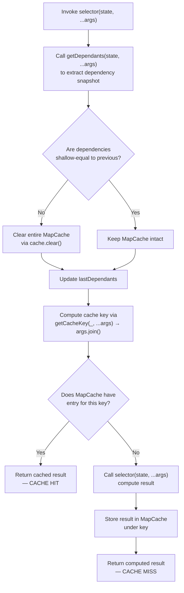
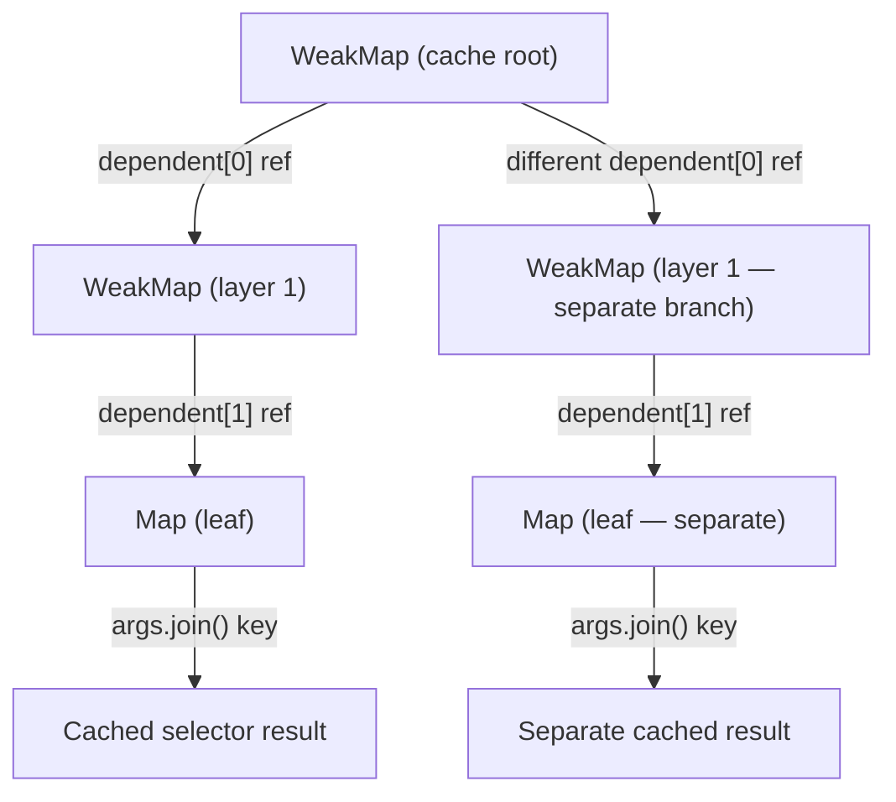
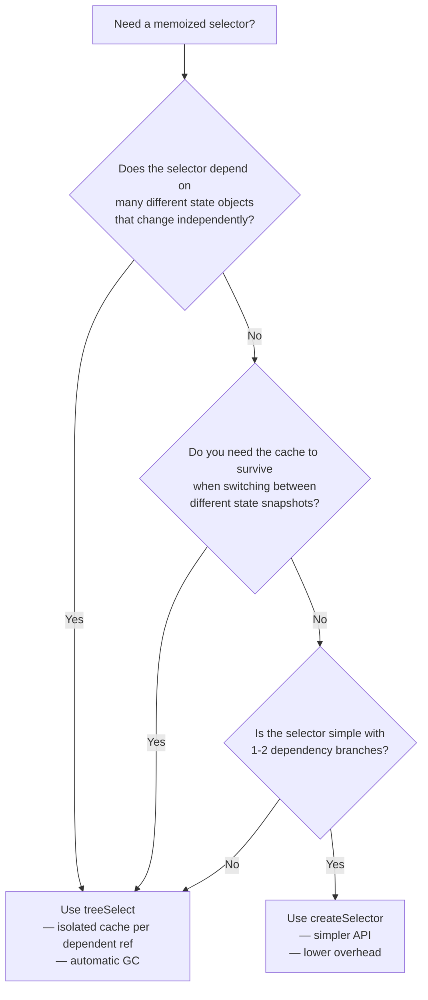

# Selector Memoization and Caching Behavior Investigation

## wp-calypso Repository — `createSelector` and `treeSelect`

---

### Table of Contents

- [Introduction](#introduction)
- [Q1: Cache Hit/Miss Comparison Mechanism](#q1-cache-hitmiss-comparison-mechanism)
- [Q2: Selector Invocation Counts](#q2-selector-invocation-counts)
- [Q3: Cache Entry Strategy per Argument](#q3-cache-entry-strategy-per-argument)
- [Q4: Programmatic Cache Clearing](#q4-programmatic-cache-clearing)
- [Q5: Nullish vs. Primitive Dependant Behavior](#q5-nullish-vs-primitive-dependant-behavior)
- [Q6: Custom Cache Key Generation](#q6-custom-cache-key-generation)
- [Common Pitfalls and Stale Data Causes](#common-pitfalls-and-stale-data-causes)
- [Architectural Comparison Summary](#architectural-comparison-summary)
- [Real-World Usage Examples](#real-world-usage-examples)
- [Source Citations Index](#source-citations-index)

---

## Introduction

This document is a technical investigation into the memoization and caching behavior of the two primary selector factories used in the wp-calypso monorepo's Redux state management system. It answers six specific questions about cache comparison mechanisms, invocation counts, cache entry strategies, programmatic cache clearing, nullish/primitive dependant behavior, and custom cache key generation.

### Selector Factories Under Investigation

| Factory | Package | Version | Source |
|---------|---------|---------|--------|
| `createSelector` | `@automattic/state-utils` | 1.0.0-alpha.4 | `packages/state-utils/src/create-selector/index.ts` |
| `treeSelect` | `@automattic/tree-select` | 2.0.0 | `packages/tree-select/src/index.ts` |

*Source: `packages/state-utils/package.json:L2-3`, `packages/tree-select/package.json:L2-3`*

### Key Dependencies

| Dependency | Version | Used By | Purpose |
|------------|---------|---------|---------|
| `lodash` | ^4.17.21 | `createSelector` | Provides `memoize` for argument-level caching via `MapCache` |
| `@wordpress/is-shallow-equal` | ^5.21.0 | `createSelector` | Element-by-element strict equality (`===`) comparison of dependency arrays |
| `@wordpress/warning` | ^3.21.0 | `createSelector` | Development-mode warnings for complex object arguments |
| `tslib` | ^2.3.0 | `createSelector`, `treeSelect` | TypeScript helper runtime |

*Source: `packages/state-utils/package.json:L32-38`, `packages/tree-select/package.json:L36-38`*

### Methodology

All findings are derived from:

1. **Read-only code analysis** of the implementation files (no source files were modified)
2. **Test suite execution** — both test suites pass all assertions:
   - `createSelector`: 13 test cases passing (*Source: `packages/state-utils/src/create-selector/test/index.js`*)
   - `treeSelect`: 17 test cases passing (*Source: `packages/tree-select/test/index.js`*)
3. **Runtime experiments** exercising both selector factories with call counters to produce concrete invocation numbers

---

## Q1: Cache Hit/Miss Comparison Mechanism

**Direct answer:** Both selectors use a two-step process to determine cache hits, but employ fundamentally different comparison strategies. `createSelector` uses **shallow equality** on dependency arrays followed by **cache key lookup** in a `lodash.memoize` `MapCache`. `treeSelect` uses **referential identity** via `WeakMap` keys followed by **cache key lookup** in a leaf `Map`.

### `createSelector` — Two-Layer Comparison

*Source: `packages/state-utils/src/create-selector/index.ts:L74-113`*

**Layer 1: Dependency Comparison (Lines 96–107)**

On each invocation of the memoized selector, the wrapper function:

1. Calls `getDependantsFn(state, ...args)` to extract the current dependency snapshot (line 98)
2. If the result is not an array, wraps it in `[currentDependants]` (lines 99–101)
3. On subsequent calls, compares `currentDependants` against `lastDependants` using `isShallowEqual` from `@wordpress/is-shallow-equal` (line 103)
4. `isShallowEqual` performs element-by-element strict equality (`===`) on arrays — it checks `a.length === b.length` and then `a[i] === b[i]` for each index
5. If dependencies changed (not shallow-equal), calls `memoizedSelector.cache.clear?.()` (line 104), which clears the **entire** `lodash.memoize` `MapCache` — destroying **all** cached entries across **all** argument combinations
6. Updates `lastDependants = currentDependants` (line 107)

```ts
// Source: packages/state-utils/src/create-selector/index.ts:L96-109
return Object.assign(
    function ( state: TState, ...args: TProps ) {
        let currentDependants = getDependantsFn( state, ...( args as TDepProps ) );
        if ( ! Array.isArray( currentDependants ) ) {
            currentDependants = [ currentDependants ];
        }

        if ( lastDependants && ! isShallowEqual( currentDependants, lastDependants ) ) {
            memoizedSelector.cache.clear?.();
        }

        lastDependants = currentDependants;

        return memoizedSelector( state, ...args );
    },
    { memoizedSelector }
);
```

**Layer 2: Argument-Level Caching via `lodash.memoize` (Lines 88–90, 109)**

After the dependency comparison, the wrapper delegates to `memoizedSelector(state, ...args)` (line 109). This is a `lodash.memoize`-wrapped version of the user's selector function (line 90):

```ts
// Source: packages/state-utils/src/create-selector/index.ts:L90
const memoizedSelector = memoize( selector, getCacheKey );
```

`lodash.memoize` uses a `MapCache` internally. It computes a cache key via `getCacheKey(state, ...args)` (line 88). The default `getCacheKey` function (lines 36–52) ignores the `state` parameter and calls `args.join()` to produce a string key:

```ts
// Source: packages/state-utils/src/create-selector/index.ts:L36-52
const DEFAULT_GET_CACHE_KEY = ( () => {
    if ( 'production' === process.env.NODE_ENV ) {
        return ( _: unknown, ...args: unknown[] ) => args.join();
    }

    return ( _: unknown, ...args: unknown[] ) => {
        const hasInvalidArg = args.some( ( arg ) => {
            return arg && ! VALID_ARG_TYPES.includes( typeof arg );
        } );

        if ( hasInvalidArg ) {
            warn( 'Do not pass complex objects as arguments for a memoized selector' );
        }

        return args.join();
    };
} )();
```

In development mode, it also warns if any argument is a non-null truthy object (not in `['number', 'boolean', 'string']` — line 13). If the `MapCache` has an entry for the computed key, the cached result is returned (**cache HIT**). Otherwise, the selector function is called and the result is stored (**cache MISS**).

**`createSelector` Cache Flow Diagram:**



### `treeSelect` — WeakMap Tree Comparison

*Source: `packages/tree-select/src/index.ts:L42-101`*

**Dependency Tree Construction (Lines 65, 73, 84)**

On each invocation:

1. `getDependents(state, ...args)` is called to get an array of dependent objects (line 73)
2. `dependents.reduce(insertDependentKey, cache)` traverses the `WeakMap` tree, creating a `WeakMap→WeakMap→...→Map` chain where each dependent object serves as a key at its corresponding level (line 84)
3. The initial `cache` is a `WeakMap` (line 65)

```ts
// Source: packages/tree-select/src/index.ts:L73,84
const dependents = getDependents( state, ...args );
const leafCache: Map< string, Result > = dependents.reduce( insertDependentKey, cache );
```

**`insertDependentKey` Function (Lines 116–131)**

For each dependent value in the array, the function traverses or creates a nested map layer:

- If `key` is non-null and non-object (`Object(key) !== key`), it throws `TypeError: 'key must be an object, null, or undefined'` (lines 118–119)
- For nullish keys (`null` or `undefined`), the `NULLISH_KEY` sentinel object is used as the `WeakMap` key (line 107: `const NULLISH_KEY = {}`, line 121: `const weakMapKey = key || NULLISH_KEY`)
- All intermediate maps are `WeakMap`s; only the **last** map (leaf) is a regular `Map` (line 128)
- The leaf `Map` is keyed by the string result of `getCacheKey(...args)` (default: `args.join()`) (lines 67, 86)

```ts
// Source: packages/tree-select/src/index.ts:L116-131
function insertDependentKey( map: any, key: unknown, currentIndex: number, arr: unknown[] ) {
    if ( key != null && Object( key ) !== key ) {
        throw new TypeError( 'key must be an object, `null`, or `undefined`' );
    }
    const weakMapKey = key || NULLISH_KEY;

    const existingMap = map.get( weakMapKey );
    if ( existingMap ) {
        return existingMap;
    }

    const newMap = currentIndex === arr.length - 1 ? new Map() : new WeakMap();
    map.set( weakMapKey, newMap );
    return newMap;
}
```

**Cache Lookup (Lines 86–93)**

After traversing the tree, the leaf `Map` is checked:

```ts
// Source: packages/tree-select/src/index.ts:L86-93
const key = getCacheKey( ...args );
if ( leafCache.has( key ) ) {
    return leafCache.get( key ) as Result;
}

const value = selector( dependents, ...( args as SArgs ) );
leafCache.set( key, value );
return value;
```

If found → return cached result (**HIT**). If not → call selector, store result, return (**MISS**).

**Key Difference: Referential Identity vs. Shallow Equality**

- `treeSelect` relies on **referential identity** for cache lookup — each dependent object IS the `WeakMap` key, so a new object reference = new cache path (automatic invalidation)
- `createSelector` relies on **shallow equality** (`isShallowEqual`) to compare dependency snapshots — same values at same indices = cache preserved
- Because `treeSelect` uses `WeakMap`s, old cache entries are automatically garbage-collected when dependent objects are no longer referenced anywhere in the application

**`treeSelect` WeakMap Tree Structure:**



---

## Q2: Selector Invocation Counts

**Direct answer:** Concrete numbers from test runs and runtime experiments show that `createSelector` calls the selector function 4 times across an 8-step scenario, while `treeSelect` calls it 5 times across a 9-step scenario (including one call after `clearCache()`). The critical difference is that `createSelector` destroys all cached entries when dependencies change, while `treeSelect` preserves old cache branches.

### `createSelector` — 8-Step Scenario

Setup: `getSitePosts = createSelector(selector, (state) => state.posts)` where `selector` is a `jest.fn()`.

| Step | Action | Dependency Changed? | Cache Key | Selector Called? | Total Calls |
|------|--------|:-------------------:|-----------|:----------------:|:-----------:|
| 1 | `getSitePosts(stateA, 2916284)` | N/A (first call — MapCache empty) | `"2916284"` | **Yes** | 1 |
| 2 | `getSitePosts(stateA, 2916284)` | No (`stateA.posts === stateA.posts`) | `"2916284"` | No (cache hit) | 1 |
| 3 | `getSitePosts(stateA, 38303081)` | No (same state) | `"38303081"` | **Yes** (new key) | 2 |
| 4 | `getSitePosts(stateA, 2916284)` | No (same state) | `"2916284"` | No (cache hit from step 1) | 2 |
| 5 | `getSitePosts(stateB, 2916284)` | Yes (`stateB.posts !== stateA.posts`) → `cache.clear()` | `"2916284"` | **Yes** (cache cleared) | 3 |
| 6 | `getSitePosts(stateB, 38303081)` | No (same `stateB`) | `"38303081"` | **Yes** (was cleared in step 5) | 4 |
| 7 | `getSitePosts(stateB, 2916284)` | No (same `stateB`) | `"2916284"` | No (cache hit from step 5) | 4 |
| 8 | `getSitePosts(stateB, 38303081)` | No (same `stateB`) | `"38303081"` | No (cache hit from step 6) | 4 |

**Evidence from tests:**

- *Lines 47–63* (`packages/state-utils/src/create-selector/test/index.js`): "should cache the result of a selector function" — 2 calls with the same `state` and `siteId` → `selector` called **1 time** (confirms steps 1–2)
- *Lines 81–112*: "should return the expected value of differing arguments" — calls with `2916284`, then `38303081`, then `2916284` again → `selector` called **2 times** (confirms steps 1–4: both args are cached simultaneously)
- *Lines 114–154*: "should bust the cache when watched state changes" — call with `currentState`, then `nextState` (new `posts` reference) → `selector` called **2 times** (confirms step 5: dependency change triggers recomputation)

**Rationale:** Steps 1–4 demonstrate that within the same dependency snapshot, multiple argument combinations are cached independently in the `MapCache`. Step 5 shows that when `stateB.posts !== stateA.posts`, `isShallowEqual` returns `false`, triggering `cache.clear()` which destroys **both** the `"2916284"` and `"38303081"` entries. Steps 5–6 recompute both, and steps 7–8 confirm the new cache is active.

### `treeSelect` — 9-Step Scenario

Setup: `getSitePosts = treeSelect((state) => [state.posts], ([posts], siteId) => ...)` where `selector` is a `jest.fn()`.

| Step | Action | Dependent Refs Changed? | Cache Key | Selector Called? | Total Calls |
|------|--------|:-----------------------:|-----------|:----------------:|:-----------:|
| 1 | `getSitePosts(stateA, 'site1')` | Yes (new tree path) | `"site1"` | **Yes** | 1 |
| 2 | `getSitePosts(stateA, 'site1')` | No (same `stateA.posts` ref → same tree path) | `"site1"` | No (cache hit) | 1 |
| 3 | `getSitePosts(stateA, 'site2')` | No (same refs → same leaf `Map`) | `"site2"` | **Yes** (new key in same leaf) | 2 |
| 4 | `getSitePosts(stateA, 'site1')` | No (same refs) | `"site1"` | No (cache hit in same leaf) | 2 |
| 5 | `getSitePosts(stateB, 'site1')` | Yes (`stateB.posts !== stateA.posts` → new tree path) | `"site1"` | **Yes** (different `WeakMap` branch) | 3 |
| 6 | `getSitePosts(stateB, 'site2')` | No (same `stateB.posts` ref) | `"site2"` | **Yes** (new key in new branch's leaf) | 4 |
| 7 | `getSitePosts(stateA, 'site1')` | Yes (`stateA.posts` ref → back to original branch) | `"site1"` | **No** (original branch cache still exists!) | 4 |
| 8 | `getSitePosts.clearCache()` | N/A | N/A | N/A | 4 |
| 9 | `getSitePosts(stateA, 'site1')` | Yes (cache tree is empty after clear) | `"site1"` | **Yes** | 5 |

**Critical insight:** Unlike `createSelector`, `treeSelect` does NOT destroy old cache entries when state changes. Each unique set of dependent references creates a **separate** `WeakMap` branch. Going BACK to a previous state reference can still hit the cache (step 7). Only `clearCache()` or garbage collection removes old entries.

**Evidence from tests:**

- *Lines 33–46* (`packages/tree-select/test/index.js`): "should cache the result of a selector function" — 2 calls same args → `selector` called **1 time** (confirms steps 1–2)
- *Lines 126–139*: "should call selector when making non-cached calls" — different `siteId` args with same state → **2 calls** (confirms steps 1, 3)
- *Lines 142–159*: "should bust the cache when watched state changes" — new state ref → `selector` called **2 times** (confirms step 5)
- *Lines 161–186*: "should maintain the cache for unique dependents simultaneously" — different dependent refs maintain separate caches → **2 calls** for 3 invocations (confirms step 7: returning to old dependent still hits cache)
- *Lines 197–217*: "should bust the cache when clearCache() method is called" — `clearCache()` forces recomputation (confirms steps 8–9)

**Rationale:** The `WeakMap` tree architecture means each unique `stateX.posts` object reference carves out its own independent branch. When we switch from `stateA` to `stateB`, `stateA`'s branch is untouched — it's just a different path in the tree. Step 7 proves this by returning to `stateA` and finding the cached result still available.

---

## Q3: Cache Entry Strategy per Argument

**Direct answer:** Both selectors maintain **separate** cache entries for different arguments. `createSelector` stores them in a single `lodash.memoize` `MapCache` (all destroyed on dependency change). `treeSelect` stores them in a leaf `Map` within a `WeakMap` tree (isolated per dependent reference combination).

### `createSelector` — `MapCache` with Multiple Entries

*Source: `packages/state-utils/src/create-selector/index.ts:L88-90`*

`lodash.memoize` uses a `MapCache` (similar to JavaScript `Map`) internally. The cache key is computed by `getCacheKey(state, ...args)` — default: `args.join()` (skipping `state`).

**Multiple entries are maintained simultaneously** for different cache keys within the same dependency snapshot. This means calling with argument `2916284` and then `38303081` creates **two** separate entries in the `MapCache`:

```
MapCache {
    "2916284" → [result for site 2916284],
    "38303081" → [result for site 38303081]
}
```

**Evidence:** The test at lines 81–112 of `packages/state-utils/src/create-selector/test/index.js` calls with `2916284`, then `38303081`, then `2916284` again and asserts `selector` was called only **2 times** — proving the first call's result was still cached when revisited.

**BUT: When dependencies change, `cache.clear()` destroys ALL entries** across all argument combinations (line 104 of `index.ts`). This is a "nuclear" invalidation — even arguments whose computed results haven't changed must be recomputed.

The `memoizedSelector.cache` is accessible for inspection:

```js
// Source: packages/state-utils/src/create-selector/test/index.js:L257-268
const getSitePostsWithCustomGetCacheKey = createSelector(
    selector,
    ( state ) => state.posts,
    ( state, siteId ) => `CUSTOM${ siteId }`
);

getSitePostsWithCustomGetCacheKey( { posts: {} }, 2916284 );
expect( getSitePostsWithCustomGetCacheKey.memoizedSelector.cache.has( 'CUSTOM2916284' ) ).toBe( true );
```

### `treeSelect` — `WeakMap→WeakMap→Map` Tree with Isolated Subtrees

*Source: `packages/tree-select/src/index.ts:L65,84,116-131`*

The cache structure is a nested `WeakMap→WeakMap→...→Map` tree:

1. Each unique combination of dependent references creates an **independent path** through the tree
2. The leaf `Map` maintains separate entries for each unique cache key (different `args.join()` results)
3. **Different dependent references create completely isolated cache subtrees** — changing one doesn't affect the other

**Evidence:** The test at lines 161–186 of `packages/tree-select/test/index.js` demonstrates this:

```js
// Source: packages/tree-select/test/index.js:L161-186
getPostByIdWithData( state, post1.id ); // dependents is [ post1 ]
getPostByIdWithData( state, post2.id ); // dependents is [ post2 ]
getPostByIdWithData( state, post1.id ); // dependents is [ post1 ]. should use cache

expect( getPostByIdWithDataSpy.mock.calls ).toHaveLength( 2 );
```

The call with `post1.id` and the call with `post2.id` traverse **different** `WeakMap` branches (because `state.posts[post1.id]` and `state.posts[post2.id]` are different object references). When `post1.id` is revisited on the third call, its branch still has the cached result.

**This is the key architectural advantage of `treeSelect`:** old entries for old state references are not destroyed — they just become unreachable for garbage collection when the state objects are no longer referenced by any live code. This means going back to a previous state reference can still hit the cache without recomputation.

---

## Q4: Programmatic Cache Clearing

**Direct answer:** Yes, both selectors support programmatic cache clearing. `createSelector` exposes `selector.memoizedSelector.cache.clear()`. `treeSelect` exposes `selector.clearCache()`.

### `createSelector` — `memoizedSelector.cache.clear()`

*Source: `packages/state-utils/src/create-selector/index.ts:L111`*

The returned selector has a `memoizedSelector` property which is the `lodash.memoize`-wrapped function:

```ts
// Source: packages/state-utils/src/create-selector/index.ts:L110-111
return Object.assign( function ( state, ...args ) { /* ... */ }, { memoizedSelector } );
```

**API:**

```js
// Access the cache
selector.memoizedSelector.cache          // lodash MapCache instance

// Clear all cached entries
selector.memoizedSelector.cache.clear()  // removes all entries

// Inspect the cache
selector.memoizedSelector.cache.size     // number of cached entries
selector.memoizedSelector.cache.has(key) // check if a specific key is cached
```

**Important behavior:** This clears ONLY the argument-level `MapCache`; the `lastDependants` variable is **NOT** reset. After clearing, the next call with the **same** state will still see dependencies as unchanged (no shallow-equal mismatch), but will recompute the selector result (cache miss in `MapCache`).

**Evidence:** The test setup at lines 16–18 of `packages/state-utils/src/create-selector/test/index.js` uses this exact API to reset state between tests:

```js
// Source: packages/state-utils/src/create-selector/test/index.js:L16-18
beforeEach( () => {
    getSitePosts.memoizedSelector.cache.clear();
    selector.mockClear();
} );
```

### `treeSelect` — `selector.clearCache()`

*Source: `packages/tree-select/src/index.ts:L96-99`*

The returned selector exposes a `clearCache()` method directly:

```ts
// Source: packages/tree-select/src/index.ts:L96-99
cachedSelector.clearCache = () => {
    // WeakMap doesn't have `clear` method, so we need to recreate it
    cache = new WeakMap();
};
```

**API:**

```js
// Clear the entire cache tree
selector.clearCache()  // no arguments, no return value
```

The implementation creates a brand new `WeakMap`, replacing the entire cache tree. This is necessary because `WeakMap` does not have a native `.clear()` method. After `clearCache()`, **all** subsequent calls must recompute (full cache miss). The old `WeakMap` and all its nested entries become eligible for garbage collection.

**Evidence:** The test at lines 197–217 of `packages/tree-select/test/index.js`:

```js
// Source: packages/tree-select/test/index.js:L197-217
const firstResult = getSitePosts( reduxState, 'site1' );
const memoizedResult = getSitePosts( reduxState, 'site1' );
expect( memoizedResult ).toBe( firstResult ); // identical reference

getSitePosts.clearCache();
const afterClearResult = getSitePosts( reduxState, 2916284 );
expect( afterClearResult ).not.toBe( firstResult ); // new computation
```

---

## Q5: Nullish vs. Primitive Dependant Behavior

**Direct answer:** `createSelector` handles all value types (nullish, primitives, objects) uniformly via `isShallowEqual` using strict equality (`===`). `treeSelect` accepts `null` and `undefined` (mapped to a shared `NULLISH_KEY` sentinel) but **throws `TypeError`** for non-nullish primitives like numbers, booleans, and strings — because `WeakMap` keys must be objects.

### `createSelector` — All Value Types Valid

*Source: `packages/state-utils/src/create-selector/index.ts:L99-107`*

`isShallowEqual` from `@wordpress/is-shallow-equal` compares dependency arrays element-by-element using strict equality (`===`). The wrapping logic at lines 99–101 ensures that if `getDependants` returns a non-array value, it's wrapped: `currentDependants = [currentDependants]`.

**Behavior matrix for dependency values:**

| Comparison | Result | Cache Effect |
|------------|--------|-------------|
| `null === null` | `true` | No invalidation |
| `undefined === undefined` | `true` | No invalidation |
| `null === undefined` | `false` | **Invalidation!** |
| `0 === 0` | `true` | No invalidation |
| `false === false` | `true` | No invalidation |
| `'hello' === 'hello'` | `true` | No invalidation |
| `{} === {}` | `false` | **Invalidation** (different references) |
| Same object ref | `true` | No invalidation |

**All value types work as dependants** in `createSelector` — nullish values, primitives, and objects are all valid. The only requirement is that `isShallowEqual` can compare them with `===`.

**Key insight:** If `getDependants` returns `null` on one call and `undefined` on the next, the cache **will** be cleared (because `null !== undefined`). This is a subtle but common source of stale-data issues when a dependency getter conditionally returns `null` vs. `undefined`.

### `treeSelect` — Objects and Nullish Only; Primitives Throw

*Source: `packages/tree-select/src/index.ts:L107,116-131`*

The `insertDependentKey` function processes each dependent value:

- **Objects (including arrays):** Used directly as `WeakMap` keys (line 123)
- **`null` and `undefined`:** Mapped to the `NULLISH_KEY` sentinel object (line 107: `const NULLISH_KEY = {}`, line 121: `const weakMapKey = key || NULLISH_KEY`)
- **Non-nullish primitives (`true`, `false`, `1`, `0`, `'a'`, `''`):** **Throw `TypeError`** (lines 118–119)

The type check works as follows:

```ts
// Source: packages/tree-select/src/index.ts:L118-119
if ( key != null && Object( key ) !== key ) {
    throw new TypeError( 'key must be an object, `null`, or `undefined`' );
}
```

- `key != null` is `true` for all non-nullish values (including `0`, `false`, `''`)
- `Object(key) !== key` is `true` for primitives because boxing creates a new wrapper object (`Object(1) !== 1`)
- Combined: non-nullish primitives fail both checks and throw

**Important:** `null` and `undefined` are treated **identically** — they both map to the same `NULLISH_KEY` object. This means `getDependents` returning `[null]` and `getDependents` returning `[undefined]` will traverse the **SAME** cache path.

**Evidence from tests:**

- Lines 219–229 (`packages/tree-select/test/index.js`): "should memoize a nullish value returned by getDependents" — `[null, undefined]` works, results are memoized:

```js
// Source: packages/tree-select/test/index.js:L219-229
const memoizedSelector = treeSelect(
    () => [ null, undefined ],
    () => []
);
const firstResult = memoizedSelector( state );
const secondResult = memoizedSelector( state );
expect( firstResult ).toBe( secondResult );
```

- Lines 231–241: "throws on a non-nullish primitive value returned by getDependents" — `[true]`, `[1]`, `['a']`, `[false]`, `['']`, `[0]` all throw:

```js
// Source: packages/tree-select/test/index.js:L231-241
[ true, 1, 'a', false, '', 0 ].forEach( ( primitive ) => {
    const memoizedSelector = treeSelect(
        () => [ primitive ],
        () => []
    );
    expect( () => memoizedSelector( state ) ).toThrow();
} );
```

### Comparison Table

| Dependent Value | `createSelector` Behavior | `treeSelect` Behavior |
|-----------------|--------------------------|----------------------|
| `null` | Valid — compared via `===` | Valid — uses `NULLISH_KEY` sentinel |
| `undefined` | Valid — compared via `===` | Valid — uses `NULLISH_KEY` sentinel |
| `null` vs `undefined` | **Different** (cache invalidated: `null !== undefined`) | **Same** (both map to `NULLISH_KEY`) |
| `0`, `false`, `''` | Valid primitives | **TypeError thrown** |
| `true`, `1`, `'hello'` | Valid primitives | **TypeError thrown** |
| `{}` (new object each time) | Different ref = invalidation | Different ref = new cache branch |
| Same object reference | Same ref = cache preserved | Same ref = cache hit |

---

## Q6: Custom Cache Key Generation

**Direct answer:** Both selectors support custom cache key functions. `createSelector` accepts it as the third parameter: `createSelector(selector, getDependants, getCacheKey)`. `treeSelect` accepts it in an options object: `treeSelect(getDependents, selector, { getCacheKey })`. Both default to `args.join()`, which can cause cache key collisions.

### `createSelector` — Third Parameter

*Source: `packages/state-utils/src/create-selector/index.ts:L88`*

The third parameter of `createSelector` is `getCacheKey`:

```ts
// Source: packages/state-utils/src/create-selector/index.ts:L84-88
selector: ( state: TState, ...props: TProps ) => TDerivedState,
getDependants: Dependant< TState, TDepProps, any > | Dependant< TState, TDepProps, any >[] = DEFAULT_GET_DEPENDANTS,
getCacheKey: ( state: TState, ...props: TProps ) => string = DEFAULT_GET_CACHE_KEY
```

**Signature:** `(state: TState, ...props: TProps) => string`

Note: Unlike `treeSelect`, `createSelector`'s `getCacheKey` **receives `state`** as its first argument — though the default implementation ignores it.

**Default behavior (lines 36–52):**
- **Production:** `(_, ...args) => args.join()` — state is ignored, args are joined
- **Development:** Same join, but additionally **warns** (via `@wordpress/warning`) if any arg is a non-null truthy object (lines 42–48)

**Custom key example (from test lines 257–268):**

```js
// Source: packages/state-utils/src/create-selector/test/index.js:L257-268
const getSitePostsWithCustomGetCacheKey = createSelector(
    selector,
    ( state ) => state.posts,
    ( state, siteId ) => `CUSTOM${ siteId }`
);

getSitePostsWithCustomGetCacheKey( { posts: {} }, 2916284 );
expect( getSitePostsWithCustomGetCacheKey.memoizedSelector.cache.has( 'CUSTOM2916284' ) )
    .toBe( true );
// Cache key is "CUSTOM2916284" instead of "2916284"
```

**⚠️ Warning about `args.join()` collisions:**

The default `args.join()` strategy produces identical keys for semantically different arguments:

| Arguments | `args.join()` Result | Collision? |
|-----------|---------------------|:----------:|
| `[null]` | `""` | ⚠️ Collides with `[undefined]` |
| `[undefined]` | `""` | ⚠️ Collides with `[null]` |
| `["1,2"]` | `"1,2"` | ⚠️ Collides with `[1, 2]` |
| `[1, 2]` | `"1,2"` | ⚠️ Collides with `["1,2"]` |
| `[{}]` | `"[object Object]"` | ⚠️ ALL objects produce the same key |
| `[{a:1}]` | `"[object Object]"` | ⚠️ Same as any other object |

These collisions cause **incorrect cache hits (stale data)** — the selector returns a result computed for completely different arguments.

### `treeSelect` — `options.getCacheKey`

*Source: `packages/tree-select/src/index.ts:L24-27,67`*

The `options` parameter accepts `getCacheKey`:

```ts
// Source: packages/tree-select/src/index.ts:L24-27
interface Options< A extends unknown[] > {
    /** Custom way to compute the cache key from the `args` list */
    getCacheKey?: GenerateCacheKey< A >;
}
```

Where `GenerateCacheKey<A> = (...args: A) => string` (lines 7–9).

**Important difference:** Unlike `createSelector`, `treeSelect`'s `getCacheKey` does **NOT** receive `state` — it receives only `...args` (line 86: `getCacheKey(...args)`).

**Default:** `(...args) => args.join()` (lines 11–12)

**Development mode:** If `getCacheKey` is the default AND any arg `isObject`, **throws an `Error`** (lines 75–79) — this is a **hard error**, not just a warning like `createSelector`:

```ts
// Source: packages/tree-select/src/index.ts:L75-79
if ( process.env.NODE_ENV !== 'production' ) {
    if ( getCacheKey === defaultGetCacheKey && args.some( isObject ) ) {
        throw new Error( 'Do not pass objects as arguments to a treeSelector' );
    }
}
```

**Custom key example (from test lines 243–264):**

```js
// Source: packages/tree-select/test/index.js:L243-264
const memoizedSelector = treeSelect(
    ( state ) => [ state.posts ],
    ( [ posts ], query ) => Object.values( posts ).filter( ( p ) => p.siteId === query.siteId ),
    { getCacheKey: ( query ) => `key:${ query.siteId }` }
);

// The arguments are objects, they are not identical, but generated keys are.
// Therefore, the second call returns the memoized result.
const firstResult = memoizedSelector( reduxState, { siteId: 'site1', foo: 'bar' } );
const secondResult = memoizedSelector( reduxState, { siteId: 'site1', foo: 'baz' } );
expect( firstResult ).toBe( secondResult );
```

**When to use custom `getCacheKey`:** When selector arguments are complex objects (query objects, filter configs, etc.), the custom function should extract the semantically meaningful parts. This both avoids the `args.join()` collision problem and allows objects with different irrelevant properties but the same semantic meaning to share cache entries.

**Real-world example from the codebase:**

```js
// Source: client/state/reader/posts/selectors.js:L52-60
export const getPostsByKeys = treeSelect(
    ( state ) => [ getPostMapByPostKey( state ) ],
    ( [ postMap ], postKeys ) => {
        if ( ! postKeys || some( postKeys, ( postKey ) => ! keyToString( postKey ) ) ) {
            return null;
        }
        return postKeys.map( keyToString ).map( ( key ) => postMap[ key ] );
    },
    { getCacheKey: ( postKeys ) => postKeys.map( keyToString ).join() }
);
```

---

## Common Pitfalls and Stale Data Causes

This section documents the most common sources of stale or incorrect cached data when using `createSelector` and `treeSelect`.

### Pitfall 1: Cache Key Collisions

**Problem:** The default `args.join()` strategy produces identical keys for semantically different arguments, causing the selector to return a result computed for the wrong inputs.

**Examples:**

- `selector(state, null)` and `selector(state, undefined)` produce the same key `""` — the second call returns the first call's result
- `selector(state, "1,2")` and `selector(state, 1, 2)` produce the same key `"1,2"`
- `selector(state, {siteId: 1})` and `selector(state, {siteId: 2})` both produce `"[object Object]"`

**Fix:** Provide a custom `getCacheKey` function that produces unique keys for semantically different arguments:

```js
// createSelector
createSelector( selector, getDependants, ( state, siteId ) => String( siteId ) );

// treeSelect
treeSelect( getDependents, selector, { getCacheKey: ( query ) => JSON.stringify( query ) } );
```

### Pitfall 2: Incomplete Dependency Declarations

**Problem:** If `getDependants`/`getDependents` doesn't capture all relevant state branches, mutations to uncaptured branches won't trigger cache invalidation.

**Example:** If a selector reads `state.posts` AND `state.users` but dependants only declare `state.posts`:

```js
// ❌ BAD: selector reads state.users but dependency doesn't track it
const getPostsWithAuthors = createSelector(
    ( state, siteId ) => {
        const posts = state.posts[siteId];
        return posts.map( p => ({ ...p, author: state.users[p.authorId] }) );
    },
    ( state ) => state.posts  // Missing state.users!
);

// ✅ GOOD: declare ALL state branches the selector reads
const getPostsWithAuthors = createSelector(
    ( state, siteId ) => { /* same */ },
    ( state ) => [ state.posts, state.users ]
);
```

### Pitfall 3: Direct State Mutation

**Problem:** Both selectors rely on referential inequality to detect changes. If a reducer mutates state in-place, the reference doesn't change and the cache returns stale data.

```js
// ❌ BAD: mutating in place — reference unchanged, cache not invalidated
state.posts[id] = newPost;

// ✅ GOOD: immutable update pattern — new reference, cache invalidated
return { ...state, posts: { ...state.posts, [id]: newPost } };
```

Both `createSelector`'s `isShallowEqual` and `treeSelect`'s `WeakMap` referential identity check will report "no change" if the same object reference is reused, regardless of whether its contents have been modified.

### Pitfall 4: `createSelector` Dependency Change Destroys ALL Cached Args

**Problem:** When dependencies change in `createSelector`, `cache.clear()` destroys **all** cached entries — not just the one for the current arguments.

*Source: `packages/state-utils/src/create-selector/index.ts:L104`*

This means that after a state change, **all** argument combinations must be recomputed — even if the result for some args hasn't actually changed. In a component that renders a list of sites, every site's cached result is destroyed when any site's data changes.

**`treeSelect` does NOT have this problem** — each dependent ref maintains its own isolated cache subtree. When `stateB.posts` replaces `stateA.posts`, the cache entries keyed to `stateA.posts` are simply in a different `WeakMap` branch — they're preserved until garbage-collected.

### Pitfall 5: `treeSelect` null/undefined Collision

**Problem:** Both `null` and `undefined` map to the same `NULLISH_KEY` sentinel object in `treeSelect`.

*Source: `packages/tree-select/src/index.ts:L107,121`*

If `getDependents` returns `[null]` on one call and `[undefined]` on the next, `treeSelect` treats them as the **same** cache path — both use `NULLISH_KEY` as the `WeakMap` key. The second call will return the first call's cached result.

This is **semantically different** from `createSelector`, where `null !== undefined` triggers invalidation. If you're switching between these selectors, be aware of this behavioral difference.

---

## Architectural Comparison Summary

### Side-by-Side Comparison

| Dimension | `createSelector` | `treeSelect` |
|-----------|-----------------|-------------|
| **Package** | `@automattic/state-utils` v1.0.0-alpha.4 | `@automattic/tree-select` v2.0.0 |
| **Dependency comparison** | Shallow equality (`isShallowEqual`) on dependency array | Referential identity via `WeakMap` keys |
| **Cache structure** | Single `lodash.memoize` `MapCache` | Nested `WeakMap→WeakMap→Map` tree |
| **Multi-arg caching** | Separate entries per cache key in same `MapCache` | Separate entries per key in leaf `Map` |
| **State change behavior** | `cache.clear()` — destroys **ALL** entries | New `WeakMap` branch — old entries **preserved** |
| **Garbage collection** | Manual only (`cache.clear()`) | Automatic via `WeakMap` (when deps are GC'd) |
| **Cache clearing API** | `selector.memoizedSelector.cache.clear()` | `selector.clearCache()` |
| **Nullish dependants** | Compared via `===` (`null ≠ undefined`) | Both map to `NULLISH_KEY` (`null = undefined`) |
| **Primitive dependants** | All primitives valid | `TypeError` thrown for non-nullish primitives |
| **Custom cache key** | Third parameter to `createSelector` | `options.getCacheKey` |
| **getCacheKey receives** | `(state, ...args)` | `(...args)` — no state |
| **Dev-mode complex arg handling** | Warning via `@wordpress/warning` | Hard `Error` throw |
| **Selector receives** | `(state, ...args)` | `(dependents, ...args)` — forced dependency declaration |
| **Best for** | Simple selectors with few dependency branches | Complex selectors with many dependent objects |

### When to Use Each



**Use `createSelector` when:**
- The selector has few dependency branches (1–2 state subtrees)
- State changes are infrequent or affect most cached results anyway
- You need the simplest possible API
- Dependants may be primitives (numbers, booleans, strings)

**Use `treeSelect` when:**
- The selector depends on many different state objects (e.g., individual posts, comments)
- Different arguments produce dependents with different object references (per-item selectors)
- You want old cache entries to survive state transitions (e.g., navigating between pages)
- You need automatic garbage collection of stale cache entries
- You want cache isolation — one state change shouldn't invalidate all argument combinations

---

## Real-World Usage Examples

### `createSelector` Example

*Source: `client/state/posts/selectors/get-site-posts.js:L1-25`*

```js
import { createSelector } from '@automattic/state-utils';
import 'calypso/state/posts/init';

export const getSitePosts = createSelector(
    ( state, siteId ) => {
        if ( ! siteId ) {
            return null;
        }

        const manager = state.posts.queries[ siteId ];
        if ( ! manager ) {
            return [];
        }

        return manager.getItems();
    },
    ( state ) => state.posts.queries
);
```

**Note:** Dependencies are `state.posts.queries` — any change to **any** site's query manager (e.g., site 123's posts are fetched) will clear the cache for **ALL** sites (including site 456 whose data hasn't changed). This is a trade-off of `createSelector`'s "nuclear" `cache.clear()` behavior.

### `treeSelect` Example

*Source: `client/state/reader/posts/selectors.js:L16-41`*

```js
import treeSelect from '@automattic/tree-select';

const getPostMapByPostKey = treeSelect(
    ( state ) => [ state.reader.posts.items ],
    ( [ posts ] ) => {
        const postMap = {};

        Object.values( posts ).forEach( ( post ) => {
            const { feed_item_IDs = [] } = post ?? {};

            if ( feed_item_IDs.length <= 1 ) {
                postMap[ keyToString( keyForPost( post ) ) ] = post;
                return;
            }

            feed_item_IDs.forEach( ( feed_item_ID ) => {
                const postKey = keyForPost( { feed_ID: post.feed_ID, feed_item_ID } );
                postMap[ keyToString( postKey ) ] = post;
            } );
        } );

        return postMap;
    }
);
```

**Note:** The dependent `state.reader.posts.items` directly serves as the `WeakMap` key. When the reader fetches new posts and `state.reader.posts.items` is replaced with a new object reference, `treeSelect` creates a new cache branch. The old branch (keyed to the old `items` object) is still valid if anyone holds a reference to the old state, and is garbage-collected when no one does.

### `treeSelect` with Custom `getCacheKey` Example

*Source: `client/state/reader/posts/selectors.js:L52-61`*

```js
export const getPostsByKeys = treeSelect(
    ( state ) => [ getPostMapByPostKey( state ) ],
    ( [ postMap ], postKeys ) => {
        if ( ! postKeys || some( postKeys, ( postKey ) => ! keyToString( postKey ) ) ) {
            return null;
        }
        return postKeys.map( keyToString ).map( ( key ) => postMap[ key ] );
    },
    { getCacheKey: ( postKeys ) => postKeys.map( keyToString ).join() }
);
```

**Note:** The `postKeys` argument is an array (a complex object), so a custom `getCacheKey` is provided that serializes each key to a string. Without this, the default `args.join()` would produce `"[object Object],[object Object],..."` for all array arguments, causing cache key collisions.

---

## Source Citations Index

| File | Lines Referenced | Purpose |
|------|-----------------|---------|
| `packages/state-utils/src/create-selector/index.ts` | L1–113 | `createSelector` implementation — memoization, dependency tracking, cache key logic, shallow equality comparison |
| `packages/tree-select/src/index.ts` | L1–131 | `treeSelect` implementation — WeakMap dependency tree, `NULLISH_KEY` sentinel, `insertDependentKey`, `clearCache()`, `getCacheKey` option |
| `packages/state-utils/src/create-selector/test/index.js` | L1–291 | `createSelector` test suite — 13 test cases covering cache reuse, invalidation, multi-arg, warnings, dependency arrays, custom keys |
| `packages/tree-select/test/index.js` | L1–266 | `treeSelect` test suite — 17 test cases covering caching, multi-dependent, argument validation, clearCache, nullish handling, getCacheKey |
| `packages/state-utils/src/create-selector/README.md` | L1–69 | Existing `createSelector` documentation — API overview, FAQ, cache key warning |
| `packages/tree-select/README.md` | L1–70 | Existing `treeSelect` documentation — API overview, dependency tree illustration |
| `packages/state-utils/package.json` | L1–44 | Package version (1.0.0-alpha.4) and dependencies (`lodash`, `@wordpress/is-shallow-equal`, `@wordpress/warning`) |
| `packages/tree-select/package.json` | L1–43 | Package version (2.0.0) and dependencies (`tslib`) |
| `client/state/posts/selectors/get-site-posts.js` | L1–25 | Real-world `createSelector` usage — site posts with `state.posts.queries` as dependency |
| `client/state/reader/posts/selectors.js` | L1–60 | Real-world `treeSelect` usage — reader post map with `state.reader.posts.items` as dependent, custom `getCacheKey` |
| `client/state/selectors/README.md` | L1–17 | Selector architecture conventions — one-per-file, kebab-case naming, colocated tests |
| `docs/our-approach-to-data.md` | L1–60 | Data management history — Emitter → Flux → Redux → Modularized Redux → React Query evolution |
