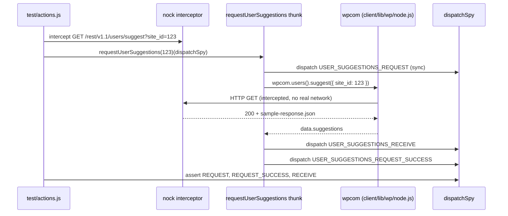

# wp-calypso Testing Infrastructure — Onboarding Q&A

This document answers seven onboarding questions about how **wp-calypso**'s Jest
test environment is constructed and how it diverges from the normal development
runtime. Every behavioral claim is backed by an **actual command** and its
**complete, unedited output**, plus a `file:line` citation into the source. The
investigation is strictly **read-only**: the only file written to the repository
is this document. All investigative probes were created outside the source tree
(or as throwaway tests deleted immediately) and removed when done; the working
tree was verified clean (`git status --porcelain` shows only `blitzy/`) after
every probe.

Statements that could not be observed at runtime and are derived from reading
code are explicitly labelled **(inferred)**.

---

## Environment

All observations were captured on the repository's canonical toolchain. The
repository requires Node `^v22.9.0` (`package.json:57`) and yarn `4.0.2`
(`package.json:422`); the `yarn start` chain runs `npx check-node-version
--package`, which fails on Node 20, so Node 22.x is authoritative.

```
$ node --version
v22.23.1

$ yarn --version
4.0.2

$ npx check-node-version --package; echo "EXIT=$?"
EXIT=0
```

`check-node-version` v4 is **silent on success**; the `EXIT=0` is the gate-pass
signal (`check-node-version` is a devDependency at `package.json:267`). The
baseline tree is clean apart from the pre-existing untracked `blitzy/` directory:

```
$ git status --porcelain
?? blitzy/
```

Key versions (from `package.json`): `jest ^29.7.0`, `nock ^13.5.6`,
`bunyan ^1.8.15` (`package.json:265`). `node_modules` is installed and
`build/server.js` (7.9 MB) is pre-built.

---

## Q1 — Does the development server boot?

**Direct answer: Yes.** The dev server boots at the default
`CALYPSO_ENV=development` and listens on **port 3000**. Observed startup log:

```
20:03:25.490Z  INFO calypso: wp-calypso booted in 989ms - http://calypso.localhost:3000
```

### Mechanism (cause → effect)

`yarn start` chains four steps (`package.json:110`):

```
start = npx check-node-version --package && node bin/welcome.js && yarn run build && yarn run start-build
```

1. **Version gate** — `npx check-node-version --package` (exits 0 on Node 22.x, above).
2. **Welcome banner** — `node bin/welcome.js` prints a cyan "calypso" ASCII banner
   via `console.log( chalk.cyan( ... ) )` (`bin/welcome.js:6-11`).
3. **Build** — `yarn run build` (`package.json:64`) produces `build/server.js`
   (it does not exist before a build; here it was pre-built at 7.9 MB).
4. **Serve** — `yarn run start-build` (`package.json:113`) =
   `BROWSERSLIST_ENV=evergreen node build/server.js | bunyan -o short`, i.e. it
   launches the Express SSR server and formats its JSON logs through `bunyan`.

The listening port comes from `config/development.json` (`"port": 3000`), which
matches the boot URL above.

> Note: the `MOCK_WORDPRESSDOTCOM` branch in `bin/welcome.js:13-34` only runs when
> that env var equals `'1'`; it was **not** triggered here **(inferred**, from the
> `if` guard**)**.

### Evidence

**Welcome banner** (chalk emits plain text when piped to a non-TTY):

```
$ node bin/welcome.js; echo "EXIT=$?"
             _                           
    ___ __ _| |_   _ _ __  ___  ___      
   / __/ _` | | | | | '_ \/ __|/ _ \ 
  | (_| (_| | | |_| | |_) \__ \ (_) |  
   \___\__,_|_|\__, | .__/|___/\___/ 
               |___/|_|                

EXIT=0
```

**Boot + health check + clean shutdown.** Because the build step was already
complete, the server was booted via `start-build` (the canonical final step of
`start`), and a real listening log was captured:

```
$ CALYPSO_ENV=development nohup yarn run start-build > /tmp/calypso-boot.log 2>&1 &
$ grep -E "booted in" /tmp/calypso-boot.log
20:03:25.490Z  INFO calypso: wp-calypso booted in 989ms - http://calypso.localhost:3000

$ curl -s -o /dev/null -w "HTTP_STATUS=%{http_code}\n" http://127.0.0.1:3000/
HTTP_STATUS=200

# clean shutdown of the exact spawned pids, then:
$ curl -s -o /dev/null -w "HTTP_STATUS=%{http_code}\n" --max-time 3 http://127.0.0.1:3000/
HTTP_STATUS=000
```

`HTTP_STATUS=200` confirms the server actively served a request; after shutting
down the spawned process, `HTTP_STATUS=000` (connection refused) confirms it was
the dev server responding. (The bunyan log is accompanied by benign
`Browserslist: browsers data (caniuse-lite) is 17 months old` warnings and a
non-fatal `Failed to load ./.env.` notice.)

---

## Q2 — What does the test runtime look like vs. the dev server?

**Direct answer.** When Jest boots a suite, the runtime differs from the dev
server in four observable ways: (1) the **test environment** is Node by default
(`jsdom` only when a file opts in via docblock) — the dev server is a real
browser + Node SSR process; (2) Jest injects **setup files** (`jest-canvas-mock`,
a shared `setup.js`, and a per-suite `setup-test-framework.js`) that the dev
server never loads; (3) **environment variables** `NODE_ENV=test` and `TZ=UTC`
are present only under Jest, whereas the dev server runs `CALYPSO_ENV=development`
with no forced `TZ`; and (4) a **config-module swap** (`moduleNameMapper`)
redirects `@automattic/calypso-config` to the server config module — this never
happens for the dev server (full detail in Q6).

### Mechanism (cause → effect)

- **Test-environment selection.** The shared preset sets
  `testEnvironment: 'node'` (`packages/calypso-jest/jest-preset.js:11`) and
  `testMatch: '<rootDir>/**/test/*.[jt]s?(x)'` (`:12`). The client config does
  **not** override `testEnvironment` (`test/client/jest.config.js` has no such
  key) so it **inherits `node`**. Component tests opt into a browser-like
  environment **per file** with a docblock, e.g.
  `client/jetpack-cloud/sections/partner-portal/credit-card-fields/test/credit-card-submit-button.jsx:2`
  (`* @jest-environment jsdom`). This matches Jest's documented behavior: the
  default environment is Node.js and a per-file `@jest-environment` docblock
  overrides it (jestjs.io/docs/test-environment).
- **Injected setup.** Base `setupFilesAfterEnv: ['./src/setup.js']`
  (`packages/calypso-jest/jest-preset.js:10`); client `setupFiles:
  ['jest-canvas-mock']` (`test/client/jest.config.js:20`) and client
  `setupFilesAfterEnv` → `setup-test-framework.js` (`:21`).
- **Environment variables.** `TZ=UTC` comes from the `test-client` script
  (`package.json:122`: `TZ=UTC jest -c=test/client/jest.config.js`); `NODE_ENV=test`
  is Jest's default.
- **Config-module swap.** Client `moduleNameMapper` maps
  `^@automattic/calypso-config$` → `<rootDir>/server/config/index.js`
  (`test/client/jest.config.js:10-13`, mapping at `:11`); the server suite maps
  it → `calypso/server/config` (`test/server/jest.config.js:10`).

The seven Jest suites and how each relates to the shared preset:

| Suite | Config | Relationship |
|-------|--------|--------------|
| client | `test/client/jest.config.js` | extends base; `setupFilesAfterEnv` → `setup-test-framework.js` |
| server | `test/server/jest.config.js` | extends base; own `setup-test-framework.js` |
| packages | `test/packages/jest.config.js` | multi-project: `projects: ['<rootDir>/packages/*/jest.config.js']` |
| apps | `test/apps/jest.config.js` | multi-project: `projects: ['<rootDir>/apps/*/jest.config.js']` |
| build-tools | `test/build-tools/jest.config.js` | extends base |
| integration | `test/integration/jest.config.js` | standalone; **no** setup framework → **real network** (see Q4) |
| e2e | `test/e2e/jest.config.js` | Playwright base (`@automattic/calypso-e2e/src/jest-playwright-config`) |

### Evidence

A throwaway probe run under the client config, with the **default `node`**
environment (no docblock), shows `window`/`document` absent and the test env
vars present:

```
$ TZ=UTC yarn jest -c=test/client/jest.config.js <node-probe> --verbose
    process.env.NODE_ENV="test"
    process.env.TZ="UTC"
    typeof window=undefined
    typeof document=undefined
    typeof navigator=object
```

The **same** probe with a `/** @jest-environment jsdom */` docblock shows a
browser-like environment, and `window.location.href` reflects the
`testEnvironmentOptions.url` (`test/client/jest.config.js:17-19`,
`url: 'https://example.com'`):

```
$ TZ=UTC yarn jest -c=test/client/jest.config.js <jsdom-probe> --verbose
    process.env.NODE_ENV="test"
    process.env.TZ="UTC"
    typeof window=object
    typeof document=object
    window.location.href=https://example.com/
    typeof window.matchMedia=function
```

Contrast with a **plain Node process** (no Jest), where the test env vars are
undefined:

```
$ node -e "console.log(process.env.NODE_ENV, process.env.TZ)"
undefined undefined
```

Both Jest probes passed; the throwaway probe files lived in a temporary
`client/__blitzy_tmp__/test/` directory and were deleted immediately, after which
`git status --porcelain` showed only `?? blitzy/`.

---


## Q3 — Which globals, environment variables, and polyfills exist only during tests?

**Direct answer.** The client suite injects the following. To be precise about
**what is genuinely test-only**, note that Node 22 already provides several of
these globals natively — so the honest categorization has three groups plus the
env vars:

**(A) Genuinely test-only** — `undefined` in a plain Node process, present under
Jest:

| Item | Plain node | Under Jest | Source |
|------|-----------|-----------|--------|
| `CSS` | `undefined` | `object` | `test/client/setup-test-framework.js:30-32`; base `packages/calypso-jest/src/setup.js:3-5` |
| `CSS.supports` | `n/a` | `function` (jest mock) | `setup-test-framework.js:30-32` |
| `ResizeObserver` | `undefined` | `function` | `setup-test-framework.js:34` (`resize-observer-polyfill`) |
| `matchMedia` | `undefined` | `function` (jest mock) | `setup-test-framework.js:54-63` |
| `Worker` | `undefined` | `function` | `setup-test-framework.js:68` (`worker_threads`) |
| `google` | `undefined` | `object` (`{}`) | `test/client/jest.config.js:22-25` (`globals`) |
| `__i18n_text_domain__` | `undefined` | `string` (`"default"`) | `test/client/jest.config.js:22-25` (`globals`) |
| jest-dom matchers (e.g. `toBeInTheDocument`) | absent | present | `setup-test-framework.js:1` (`@testing-library/jest-dom`) |
| `jest-canvas-mock` (canvas `getContext`) | absent | stubbed | `test/client/jest.config.js:20` (`setupFiles`) |

**(B) Native in Node 22 but replaced/mocked in tests:**

| Item | Plain node | Under Jest | Source |
|------|-----------|-----------|--------|
| `fetch` | `function` (native, `mock=false`) | `function` (jest mock, `mock=true`) | `setup-test-framework.js:36-40` |
| `crypto.randomUUID` | `function` (native) | `function` (reassigned to Node impl) | `setup-test-framework.js:52` |

**(C) Native in Node 22 — the setup assignment is redundant (a "no difference"
result):** `TextEncoder`/`TextDecoder` (`setup-test-framework.js:25-26`),
`crypto`/`crypto.subtle` (`:76-78`, guarded — branch not taken in Node 22),
`ReadableStream`/`TransformStream` (`:66-67`), `structuredClone` (`:71-73`,
guarded — branch not taken). These are `function`/`object` in **both** runtimes.

**Environment variables only present under tests:** `NODE_ENV=test` (Jest default)
and `TZ=UTC` (`package.json:122`).

### Mechanism (cause → effect)

All the injected client globals/polyfills come from
`test/client/setup-test-framework.js`, which Jest loads via the client
`setupFilesAfterEnv` (`test/client/jest.config.js:21`); `CSS` is additionally set
by the base `setupFilesAfterEnv` (`packages/calypso-jest/src/setup.js:3-5`, loaded
via `packages/calypso-jest/jest-preset.js:10`). `google` and
`__i18n_text_domain__` are injected via the Jest `globals` key
(`test/client/jest.config.js:22-25`). None of these files run in a plain Node
process or in the dev server, which is why the plain-Node column is `undefined`
for group (A).

### Evidence

**Plain Node process** (identical checks, no Jest):

```
$ node -e "require('/tmp/blitzy_probe_checks.js')()"
process.env.NODE_ENV=undefined
process.env.TZ=undefined
typeof window=undefined
typeof document=undefined
typeof navigator=object
typeof CSS=undefined
typeof CSS.supports=n/a
typeof ResizeObserver=undefined
typeof matchMedia=undefined
typeof fetch=function (mock=false)
typeof TextEncoder=function
typeof TextDecoder=function
typeof crypto=object
typeof crypto.randomUUID=function
typeof crypto.subtle=object
typeof ReadableStream=function
typeof TransformStream=function
typeof Worker=undefined
typeof structuredClone=function
typeof google=undefined
typeof __i18n_text_domain__=undefined
```

**Under Jest** (client config, default `node` environment):

```
$ TZ=UTC yarn jest -c=test/client/jest.config.js <probe> --verbose
process.env.NODE_ENV="test"
process.env.TZ="UTC"
typeof window=undefined
typeof document=undefined
typeof navigator=object
typeof CSS=object
typeof CSS.supports=function (mock=true)
typeof ResizeObserver=function
typeof matchMedia=function
typeof fetch=function (mock=true)
typeof TextEncoder=function
typeof TextDecoder=function
typeof crypto=object
typeof crypto.randomUUID=function
typeof crypto.subtle=object
typeof ReadableStream=function
typeof TransformStream=function
typeof Worker=function
typeof structuredClone=function
typeof google=object
typeof __i18n_text_domain__=string
```

Comparing the two columns: `CSS`, `CSS.supports`, `ResizeObserver`, `matchMedia`,
`Worker`, `google`, `__i18n_text_domain__` flip from `undefined`/`n/a` to
present (group A); `fetch` flips from native to a jest mock (`mock=false` →
`mock=true`, group B); and `NODE_ENV`/`TZ` flip from `undefined` to
`"test"`/`"UTC"`. The remaining items (group C) are identical in both — a
genuine "no difference". The probe files were temporary and deleted; the tree
stayed clean.

---


## Q4 — What happens when code makes a network request during a test?

**Direct answer.** Non-intercepted network requests are **blocked**, by two
independent mechanisms:

1. **`nock.disableNetConnect()`** (`test/client/setup-test-framework.js:9`; server
   suite at `test/server/setup-test-framework.js:4`) makes any request to a host
   without a matching interceptor throw a **`NetConnectNotAllowedError`**.
2. **`global.fetch` is replaced by a Jest mock**
   (`test/client/setup-test-framework.js:36-40`) that resolves to
   `{ json: () => Promise.resolve() }` — an empty JSON body — so `fetch` never
   touches the network.

This matches nock's documented behavior: after `disableNetConnect()`, a request
to a non-intercepted host throws `NetConnectNotAllowedError` and the returned
`http.ClientRequest` emits an `error` event; nock works by overriding Node's
`http.request`/`http.ClientRequest` (github.com/nock/nock, npmjs.com/package/nock).

### Mechanism (cause → effect)

The client setup calls `nock.disableNetConnect()` at load
(`test/client/setup-test-framework.js:9`) and manages the nock lifecycle:
`beforeAll` re-activates nock if inactive (`:11-16`), `afterAll` calls
`nock.restore()` + `nock.cleanAll()` (`:18-22`). Because nock overrides the HTTP
client, an unmatched request never leaves the process — it is converted into a
`NetConnectNotAllowedError` originating in `node_modules/nock/lib/intercept.js`.

The **integration** suite is the deliberate exception: `test/integration/jest.config.js`
declares **no** `setupFilesAfterEnv`, so `nock.disableNetConnect()` is never
called and real network access is permitted. This is corroborated by the repo's
own testing docs (`docs/testing/testing-overview.md`): the client and server
suites disable the network connection (`:18`, `:39`) while integration/e2e may use
it (`:60`).

### Evidence

**Error path (caught) + the fetch mock**, from one passing probe:

```
$ TZ=UTC yarn jest -c=test/client/jest.config.js <probe> --verbose
    error.name=NetConnectNotAllowedError
    error.message=Nock: Disallowed net connect for "public-api.wordpress.com:443/rest/v1.1/me"
    fetch._isMockFunction=true
    fetch.mock.calls.length=1
    awaited body=undefined
```

The `fetch` call resolved (`awaited body=undefined`, i.e. the empty JSON mock)
without any network access, and the unmocked `https.get` produced a
`NetConnectNotAllowedError`.

**Error path (uncaught)** — letting the error propagate shows how Jest renders a
real unmocked request as a test failure:

```
$ TZ=UTC yarn jest -c=test/client/jest.config.js <fail-probe> --verbose
FAIL client/__blitzy_tmp__/test/blitzy_adhoc_test_netfail.js
  blitzy probe (unmocked network failure rendering)
    ✕ unmocked https.get rejects the test with NetConnectNotAllowedError (2 ms)

  ● blitzy probe (unmocked network failure rendering) › unmocked https.get rejects the test with NetConnectNotAllowedError

    NetConnectNotAllowedError: Nock: Disallowed net connect for "public-api.wordpress.com:443/rest/v1.1/me"

      3 | 	test( 'unmocked https.get rejects the test with NetConnectNotAllowedError', async () => {
      4 | 		await new Promise( ( resolve, reject ) => {
    > 5 | 			const req = https.get( 'https://public-api.wordpress.com/rest/v1.1/me', resolve );
        | 			                  ^
      6 | 			req.on( 'error', reject );
      7 | 		} );
      8 | 	} );

      at ../node_modules/nock/lib/intercept.js:432:23
      at Object.module.get (../node_modules/nock/lib/common.js:99:19)
      at get (__blitzy_tmp__/test/blitzy_adhoc_test_netfail.js:5:22)
      at Object.<anonymous> (__blitzy_tmp__/test/blitzy_adhoc_test_netfail.js:4:9)

Test Suites: 1 failed, 1 total
Tests:       1 failed, 1 total
```

The stack confirms the error originates inside nock
(`node_modules/nock/lib/intercept.js:432`). Both probes were temporary and
deleted; the tree stayed clean (`?? blitzy/`).

---


## Q5 — Trace a mocked API call from the interceptor to the assertion

**Direct answer.** `client/state/user-suggestions/test/actions.js` mocks the
WordPress.com REST endpoint with `nock`, invokes the `requestUserSuggestions`
Redux thunk, and asserts the dispatched actions. Running it passes **2/2**:

```
$ TZ=UTC yarn jest -c=test/client/jest.config.js client/state/user-suggestions/test/actions.js --verbose
Browserslist: browsers data (caniuse-lite) is 17 months old. Please run:
  npx update-browserslist-db@latest
  Why you should do it regularly: https://github.com/browserslist/update-db#readme
PASS client/state/user-suggestions/test/actions.js
  actions
    #receiveUserSuggestions()
      ✓ should return an action object (2 ms)
    #requestUserSuggestions
      ✓ should dispatch properly when receiving a valid response (13 ms)

Test Suites: 1 passed, 1 total
Tests:       2 passed, 2 total
Snapshots:   0 total
Time:        0.938 s, estimated 1 s
Ran all test suites matching /client\/state\/user-suggestions\/test\/actions.js/i.
```

(The three-line Browserslist warning is benign stderr noise emitted before the
Jest result.)

### The four action types (all named)

From `client/state/action-types.ts`:

- `USER_SUGGESTIONS_RECEIVE` — `client/state/action-types.ts:1094`
- `USER_SUGGESTIONS_REQUEST` — `client/state/action-types.ts:1095`
- `USER_SUGGESTIONS_REQUEST_FAILURE` — `client/state/action-types.ts:1096`
- `USER_SUGGESTIONS_REQUEST_SUCCESS` — `client/state/action-types.ts:1097`

### Mechanism (cause → effect)

1. **Interceptor.** In `beforeAll`, the test intercepts the REST call and replies
   with a deep-frozen fixture
   (`client/state/user-suggestions/test/actions.js:27-31`):
   `nock( 'https://public-api.wordpress.com:443' ).get(
   '/rest/v1.1/users/suggest?site_id=123' ).reply( 200, deepFreeze(
   sampleSuccessResponse ) )`. The fixture
   (`client/state/user-suggestions/test/sample-response.json`) is
   `{"suggestions":[{"user_login":"wordpress1"},{"user_login":"wordpress2"}]}`.
2. **Invocation.** The test calls the thunk with a `jest.fn` dispatch spy
   (`:34-35`): `requestUserSuggestions( 123 )( dispatchSpy )`.
3. **Thunk.** `client/state/user-suggestions/actions.js:32-57`:
   - dispatches `USER_SUGGESTIONS_REQUEST` **synchronously** (`:34-37`);
   - calls `wpcom.users().suggest({ site_id: siteId })` (`:39-41`) — `wpcom` is
     imported from `calypso/lib/wp` (`:1`);
   - on resolve, dispatches `receiveUserSuggestions(...)` =
     `USER_SUGGESTIONS_RECEIVE` (`:43`, factory at `:18-24`) then
     `USER_SUGGESTIONS_REQUEST_SUCCESS` with `{ siteId, data }` (`:44-48`);
   - on error, the `.catch` dispatches `USER_SUGGESTIONS_REQUEST_FAILURE`
     (`:50-56`) — the error path.
4. **Data layer — why nock intercepts.** `calypso/lib/wp` has
   `main: "node.js"` / `browser: "browser.js"` (`client/lib/wp/package.json:5-6`).
   The custom resolver's `mainFields: ['calypso:src', 'main']`
   (`packages/calypso-jest/src/module-resolver.js:18`) does **not** include
   `browser`, so under Jest the module resolves to
   `client/lib/wp/node.js`, which is `new WPCOM( wpcomXhrRequest )`
   (`client/lib/wp/node.js:4`) — a client that issues a **real** HTTP GET that
   nock intercepts. (`browser.js` instead uses the `wpcom-proxy-request` transport
   at `client/lib/wp/browser.js:21`, which is separately mocked at
   `test/client/setup-test-framework.js:44-49`.)
5. **Assertions.** The test asserts `USER_SUGGESTIONS_REQUEST` **before**
   `await` (`:37-40`), then after `await request` (`:42`) asserts
   `USER_SUGGESTIONS_REQUEST_SUCCESS` (`:44-48`) and `USER_SUGGESTIONS_RECEIVE`
   (`:50-54`). Because `toHaveBeenCalledWith` is order-independent, the test can
   assert SUCCESS before RECEIVE even though the thunk dispatches RECEIVE first.

### Evidence for the resolution claim

The "resolves to `node.js`" claim above is **observed**, not inferred — a probe
run under the client config resolved the module and inspected it:

```
$ TZ=UTC yarn jest -c=test/client/jest.config.js <wp-resolve-probe> --verbose
    RESOLVED_PATH=/tmp/blitzy/wp-calypso/blitzy-e67e617f-30bf-4353-8b16-286c2ccf3ffe_db96c2/client/lib/wp/node.js
    default_ctor=WPCOM
    wpcomJetpackLicensing_type=object
    is_node_js=true
    is_browser_js=false
```

`wpcomJetpackLicensing` is a node-only named export (`client/lib/wp/node.js:9`),
present here — confirming `node.js` (not `browser.js`) was loaded. The passing
test above is itself proof that nock intercepted a real HTTP request. The probe
was temporary and deleted; the tree stayed clean.

### Flow diagram



---


## Q6 — How does config (e.g. feature flags) resolve differently in tests vs. development?

**Direct answer.** In **tests**, `@automattic/calypso-config` is swapped (via
`moduleNameMapper`) for the server config module, which resolves the environment
from `NODE_ENV=test` and loads `config/test.json`. On the **dev server**, the
browser bundle's `@automattic/calypso-config` reads `window.configData`, which the
server builds from `config/development.json`. Both paths ultimately run the same
core factory; only the **data** differs.

### Mechanism (cause → effect)

**Test path:**

1. `moduleNameMapper` maps `^@automattic/calypso-config$` →
   `<rootDir>/server/config/index.js` (`test/client/jest.config.js:10-13`, mapping
   at `:11`). (Server suite → `calypso/server/config`,
   `test/server/jest.config.js:10`; integration →
   `<rootDir>/client/server/config/index.js`, `test/integration/jest.config.js:3`.)
2. `client/server/config/index.js` resolves the env as
   `process.env.CALYPSO_ENV || process.env.NODE_ENV || 'development'`
   (`client/server/config/index.js:6`) → under Jest, `NODE_ENV=test` → env =
   `test`. It calls `parser(configPath, {...})` (`:5-9`) then
   `module.exports = createConfig( serverData )` (`:11`).
3. `parser.js` merges, in order, `_shared.json`, `<env>.json`, `<env>.local.json`
   (`client/server/config/parser.js:31-35`), deep-merging the `features` object
   and simple-assigning other fields (`:42-47`). So tests read `config/test.json`.

**Dev path:**

1. The browser bundle uses `packages/calypso-config/src/index.ts`, which throws
   if run outside a browser (`packages/calypso-config/src/index.ts:17-19`).
2. It reads `window.configData` (`:46`, declared `:6-11`, `{}` fallback `:36`) —
   built at server boot from `config/development.json` — and may apply runtime
   flag overrides from cookies/sessionStorage/URL when
   `NODE_ENV=development`, the `env_id` is a flag environment, or the host is
   `*.calypso.live` (`:78-110`, via `applyFlags` `:59-76`).
3. It calls `createConfig( configData )` (`:111`) and exports `isEnabled`,
   `enabledFeatures`, `enable`, `disable` (`:113-116`).

**Shared core factory** — only the data differs, not the code:
`packages/create-calypso-config/src/index.ts` provides the `config(key)` getter
(`:28-62`; it throws a `ReferenceError` for a missing key only when
`NODE_ENV=development`, `:35-40`) and `isEnabled(feature)` (`:69-86`, which reads
`data.features[feature]` at `:85`). The default export currys all helpers onto
the API object (`:132-140`).

### Evidence

Feature-key counts and top-level identity for the three config files (read at
runtime):

```
$ node -e '...print env/env_id/port/feature-key count for each config file...'
_shared.json: env="shared" env_id="shared" port=3000 feature_keys=0
development.json: env="development" env_id="development" port=3000 feature_keys=178
test.json: env="development" env_id="test" port=3000 feature_keys=101
```

Note the **"no difference" on `env`**: both `development.json` and `test.json`
set top-level `"env": "development"`, so `config('env')` returns `"development"`
in **both** runtimes. The distinguishing top-level key is `env_id`
(`development` vs `test`). The concrete proof that flag *values* differ is in Q7.

The divergence at a glance:

```mermaid
graph TD
    subgraph TEST["Test runtime (Jest)"]
        A["NODE_ENV=test"] --> B["moduleNameMapper swaps<br/>@automattic/calypso-config"]
        B --> C["client/server/config/index.js"]
        C --> D["parser.js merges config/test.json"]
        D --> E["isEnabled('flag') -> TEST value"]
    end
    subgraph DEV["Dev server runtime"]
        F["CALYPSO_ENV=development"] --> G["packages/calypso-config<br/>reads window.configData"]
        G --> H["built from config/development.json"]
        H --> I["isEnabled('flag') -> DEV value"]
    end
```



---


## Q7 — How do tests control config values, and can you prove divergence?

**Direct answer: Yes.** A test resolves **different feature-flag values** than the
dev server would. Using the very same canonical server-config module, two
runtime-verified flags flip: `checkout/checkout-version` and `google-my-business`
are both **`false`** under `NODE_ENV=test` and both **`true`** under
`CALYPSO_ENV=development`. Overall, **82 feature flags resolve differently**
between the two runtimes (computed below). Tests control values via four
mechanisms: `config.enable()`/`config.disable()`, the `ENABLE_FEATURES` /
`DISABLE_FEATURES` env vars, the `ACTIVE_FEATURE_FLAGS` env var, and
`jest.mock('@automattic/calypso-config', …)`.

### PROOF #1 — the same module, two runtimes, different values

A probe under `/tmp` (outside the tree) required
`client/server/config` and printed `config('env')`, `config('env_id')`, and two
flags, run once per runtime in separate processes:

```
$ env -u CALYPSO_ENV NODE_ENV=test node /tmp/config-probe.js
{
  "resolved_by": "NODE_ENV=test",
  "config(env)": "development",
  "config(env_id)": "test",
  "isEnabled(checkout/checkout-version)": false,
  "isEnabled(google-my-business)": false
}

$ env -u NODE_ENV CALYPSO_ENV=development node /tmp/config-probe.js
{
  "resolved_by": "CALYPSO_ENV=development",
  "config(env)": "development",
  "config(env_id)": "development",
  "isEnabled(checkout/checkout-version)": true,
  "isEnabled(google-my-business)": true
}
```

Both flags differ (test `false` vs dev `true`); `config('env')` is identical
(`"development"`) — the explicit "no difference"; `config('env_id')` differs
(`test` vs `development`).

### PROOF #2 — exact count of flags that resolve differently

A probe compared the `features` maps of `config/development.json` and
`config/test.json`, treating an absent key as disabled:

```
$ node /tmp/flag-diff.js
dev_feature_keys=178
test_feature_keys=101
union_feature_keys=183
present_in_both_but_different=10
both_different_list=["checkout/checkout-version","google-my-business","individual-subscriber-stats","jetpack/sharing-buttons-block-enabled","lasagna","launchpad-updates","post-list/qr-code-link","redirect-fallback-browsers","rum-tracking/logstash","ssr/prefetch-timebox"]
resolve_differently_treating_absent_as_disabled=82
```

So **82** flags resolve differently: 10 are present in both files with opposite
booleans, and the rest are enabled in `development.json` but absent (→ disabled)
in `test.json`.

### PROOF #3 — the swap is observed inside Jest (ties Q6 + Q7)

A throwaway Jest probe (client config) confirmed that inside a test,
`@automattic/calypso-config` **is** the server config module reading
`config/test.json`:

```
$ TZ=UTC yarn jest -c=test/client/jest.config.js <cfg-swap-probe> --verbose
    RESOLVED=/tmp/blitzy/wp-calypso/blitzy-e67e617f-30bf-4353-8b16-286c2ccf3ffe_db96c2/client/server/config/index.js
    is_server_config=true
    config(env)=development
    config(env_id)=test
    isEnabled(checkout/checkout-version)=false
    isEnabled(google-my-business)=false
```

These match the `NODE_ENV=test` values in PROOF #1 exactly. Probe deleted; tree
clean.

### Control mechanisms (each demonstrated at runtime)

A probe on the canonical module toggled `google-my-business` three ways:

```
# (1) baseline: NODE_ENV=test (test.json default)
{ "runtime": "NODE_ENV=test", "ENABLE_FEATURES": null, "ACTIVE_FEATURE_FLAGS": null,
  "isEnabled_at_load": false, "after_config.enable": true, "after_config.disable": false }

# (2) ENABLE_FEATURES=google-my-business (parser load-time override)
{ "runtime": "NODE_ENV=test", "ENABLE_FEATURES": "google-my-business", "ACTIVE_FEATURE_FLAGS": null,
  "isEnabled_at_load": true, "after_config.enable": true, "after_config.disable": false }

# (3) ACTIVE_FEATURE_FLAGS=google-my-business (isEnabled call-time override)
{ "runtime": "NODE_ENV=test", "ENABLE_FEATURES": null, "ACTIVE_FEATURE_FLAGS": "google-my-business",
  "isEnabled_at_load": true, "after_config.enable": true, "after_config.disable": true }
```

- **`config.enable()` / `config.disable()`** mutate `data.features[feature]`
  (`packages/create-calypso-config/src/index.ts:107-111` and `:118-122`): run (1)
  shows `false → enable → true → disable → false`.
- **`ENABLE_FEATURES` / `DISABLE_FEATURES`** are read at config **load** time
  (`client/server/config/index.js:7-8`) and applied by the parser
  (`client/server/config/parser.js:39-40`, override loops at `:50-53` and
  `:54-57`): run (2) shows `isEnabled_at_load=true`, overriding the test.json
  default of `false`.
- **`ACTIVE_FEATURE_FLAGS`** is checked at `isEnabled()` **call** time and
  short-circuits before `data.features`
  (`packages/create-calypso-config/src/index.ts:73-83`): run (3) shows the flag
  stays `true` **even after `config.disable()`** — proving it is a distinct,
  call-time mechanism from the parser overrides.
- **`jest.mock('@automattic/calypso-config', …)`** replaces the module at the
  test-module level; e.g.
  `client/jetpack-cloud/sections/agency-dashboard/sites-overview/hooks/test/use-default-site-columns.js:8`
  (auto-mock) and
  `client/jetpack-cloud/sections/agency-dashboard/downtime-monitoring/toggle-activate-monitoring/test/toggle-activate-monitoring.tsx:14`
  (factory form). A representative `config.enable`/`config.disable` usage in a
  test is
  `client/landing/stepper/declarative-flow/internals/steps-repository/site-migration-identify/test/index.tsx:49` (enable)
  and `:51` (disable).

All `/tmp` probes were deleted after use and the tree verified clean
(`git status --porcelain` → `?? blitzy/`).

---

## Coverage summary

| Question | Direct answer |
|----------|---------------|
| Q1 | Dev server boots at `CALYPSO_ENV=development` on port 3000 (observed listening log + HTTP 200). |
| Q2 | Test runtime differs by env selection (`node` default / `jsdom` opt-in), injected setup files, `NODE_ENV=test`+`TZ=UTC`, and the config-module swap. |
| Q3 | Test-only: `CSS`/`CSS.supports`, `ResizeObserver`, `matchMedia`, `Worker`, `google`, `__i18n_text_domain__`, jest-dom matchers, jest-canvas-mock; `fetch`+`crypto.randomUUID` replaced; `NODE_ENV`/`TZ` env vars. Several Node-22 natives are re-assigned redundantly (no difference). |
| Q4 | Non-intercepted requests are blocked — `nock.disableNetConnect()` → `NetConnectNotAllowedError`, and `global.fetch` is a mock returning empty JSON. Integration suite is the exception. |
| Q5 | `user-suggestions` test passes 2/2; nock reply flows through the `requestUserSuggestions` thunk (`REQUEST` → `RECEIVE` + `REQUEST_SUCCESS`; `FAILURE` on error) back to order-independent assertions; `calypso/lib/wp` resolves to `node.js`. |
| Q6 | Tests swap `@automattic/calypso-config` → server config reading `config/test.json`; dev reads `window.configData` from `config/development.json`; same factory, different data. |
| Q7 | Proven: `checkout/checkout-version` & `google-my-business` are `false` in test / `true` in dev; 82 flags differ overall; controlled via `enable`/`disable`, `ENABLE_FEATURES`/`DISABLE_FEATURES`, `ACTIVE_FEATURE_FLAGS`, and `jest.mock`. |

