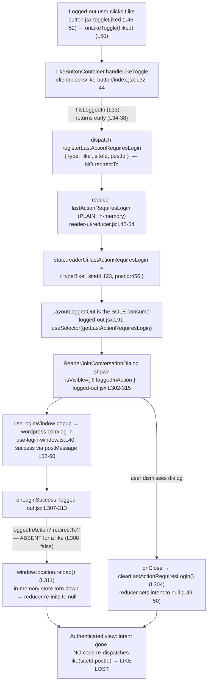

# Reader "Like While Logged Out": How the Intent Crosses (and Falls Through) the Authentication Boundary

> **Root-cause Q&A investigation — WordPress.com Calypso**
> Branch (source): `wp-calypso_be7e5cc64162` · HEAD commit: `be7e5cc641` ("Reader: Show login prompts on all logged out reader streams")
> Deliverable type: **documentation only** — the source repository is exercised **read-only**; no application code is changed.

---

## Direct Answer (TL;DR)

A logged-out Reader **"like"** intent lives **only in in-memory Redux state** at `state.readerUi.lastActionRequiresLogin`. It is **not persisted** (no `localStorage` / `IndexedDB` / cookie) and it is **not a short-lived handoff token**. The click captures the intent by dispatching `registerLastActionRequiresLogin({ type: 'like', siteId, postId })` and **returns early**; the only production consumer of that stored intent is the logged-out layout, whose post-login handler either **navigates** (when the intent carries a `redirectTo`) or **reloads the page** (`window.location.reload()`). Because a **like carries no `redirectTo`**, the handler takes the reload branch, which **tears down and reinitializes the in-memory store** back to its `null` default; separately, closing the dialog **explicitly clears** the intent. **There is no code anywhere on the authenticated side that reads the stored `{ type: 'like', … }` and replays it as a `like(siteId, postId)` API call.** So the like is deterministically lost. The loss is **structural** — the combination of (a) non-persistent storage, (b) an absent action-replay path, (c) a full-page reload that discards the store, and (d) an explicit clear on dialog close — **not** a subtle timing race and **not** a reducer initialization/registration-order bug.

This document answers each of the six sub-questions **by name**, with the **exact commands** used, the **real, unedited captured output**, and `file:line` grounding that was re-verified against the working tree at write time.

---

## The User's Question (verbatim)

> "I am trying to understand how a logged out intent is supposed to survive the authentication boundary in the Reader, because right now a like clicked while signed out seems to disappear after the user finishes signup or login and returns to an authenticated view. The click clearly triggers a requires login decision, but where does that intent go in the meantime, and what is meant to bring it back once the session becomes valid? I want to follow what the system treats as the source of truth here, whether it is in memory state, something persisted, or a handoff token that lives just long enough to be replayed, because it feels like the intent slips through a crack between those worlds. When the user returns, what exact condition causes the replay path to skip, and is that skip caused by timing, initialization order, or cleanup that quietly clears the pending action before it can be applied? Temporary scripts may be used for observation, but the repository itself should remain unchanged and anything temporary should be cleaned up afterward."

### The six sub-questions

| # | Question | One-line verdict |
|---|----------|------------------|
| **Q1** | How is a logged-out "like" intent *supposed* to survive the auth boundary? | It is held in the `reader-ui` Redux slice so a login prompt can be shown; the only designed "bring-back" is navigate-or-reload — there is **no** designed like replay. |
| **Q2** | Where does the intent go in the meantime? | Into `state.readerUi.lastActionRequiresLogin` via the `READER_REGISTER_LAST_ACTION_REQUIRES_LOGIN` reducer case. |
| **Q3** | What is meant to bring it back once the session is valid? | Only `logged-out.jsx`'s `onLoginSuccess`: navigate to `redirectTo` (absent for a like) **else** `window.location.reload()`. No action-replay. |
| **Q4** | Source of truth — in-memory / persisted / handoff? | **(a) in-memory Redux** — proven: `serialize(lastActionRequiresLogin, …) === undefined` vs `serialize(lastPath, …) === value`. |
| **Q5** | Exact condition that makes the replay path skip? | The like has **no `redirectTo`**, so `onLoginSuccess` takes the `else` → `window.location.reload()`, reinitializing the store to `null`; nothing re-dispatches the like. `onClose` also clears it. |
| **Q6** | Skip cause — timing / init-order / cleanup? | **Cleanup/teardown** (structural): reload discards the in-memory store, plus explicit clear on close. **Not** timing; **not** init/registration order. |

---

## Environment & Commands Used (canonical runtime)

All observations were produced on the default, unmodified branch checkout, exercising the **real** reducers, **real** action creators, and Calypso's **real** `serialize()` helper through the canonical Jest harness (`yarn test-client` = `TZ=UTC jest -c=test/client/jest.config.js`, `package.json:L122`).

**Working directory:** `/tmp/blitzy/wp-calypso/blitzy-efbeb63e-ded9-4f74-8d77-f3ac438749a3_e40852`

```bash
$ git rev-parse --abbrev-ref HEAD
blitzy-efbeb63e-ded9-4f74-8d77-f3ac438749a3        # Blitzy working branch; the source branch under study is wp-calypso_be7e5cc64162
$ git log -1 --oneline
be7e5cc641 Reader: Show login prompts on all logged out reader streams

$ node --version
v22.23.1        # satisfies engines.node "^v22.9.0" (package.json:L57); .nvmrc = 22.9.0
$ corepack enable && yarn --version
4.0.2           # matches packageManager "yarn@4.0.2" (package.json:L422)
```

> **Note on Node version:** the AAP prose mentions `v22.23.1` and the agent task prose mentions `v22.22.2`; the **actually observed** version in this container is **`v22.23.1`**, reported as-measured. It satisfies `engines.node "^v22.9.0"`.

**Dependencies:** the workspace `node_modules` was already installed (Jest `29.7.0` present in `node_modules/.bin/jest`), so no additional `yarn install` was required. The monorepo exposes a `node_modules/calypso -> ../client` symlink, so the canonical `calypso/…` import specifiers resolve directly to the real `client/…` source — i.e., the observation exercises the **real entry point**, not a stand-in. Nothing in the observation is NON-CANONICAL.

**Canonical observation command (run three times):**

```bash
TZ=UTC CI=true node_modules/.bin/jest -c=test/client/jest.config.js \
  "state/reader-ui/test/__obs_temp__" --ci
```

The temporary test `client/state/reader-ui/test/__obs_temp__.js` imported the real modules exactly as production does and printed raw output:

```js
import { serialize } from 'calypso/state/utils';
import {
	registerLastActionRequiresLogin,
	clearLastActionRequiresLogin,
} from 'calypso/state/reader-ui/actions';
import { lastActionRequiresLogin, lastPath } from 'calypso/state/reader-ui/reducer';

test( 'OBS: logged-out like intent lifecycle + serialize contrast', () => {
	const before = lastActionRequiresLogin( undefined, { type: '@@INIT' } );
	console.log( 'BEFORE:', JSON.stringify( before ) );

	const registerAction = registerLastActionRequiresLogin( { type: 'like', siteId: 123, postId: 456 } );
	console.log( 'ACTION:', JSON.stringify( registerAction ) );
	const during = lastActionRequiresLogin( before, registerAction );
	console.log( 'DURING:', JSON.stringify( during ) );

	console.log( 'serialize(lastActionRequiresLogin):', String( serialize( lastActionRequiresLogin, during ) ) );
	console.log( 'serialize(lastPath):', String( serialize( lastPath, '/reader/feeds/123' ) ) );
	console.log( 'typeof lastActionRequiresLogin.serialize =', typeof lastActionRequiresLogin.serialize,
		'| typeof lastPath.serialize =', typeof lastPath.serialize );

	const clearAction = clearLastActionRequiresLogin();
	console.log( 'CLEAR ACTION:', JSON.stringify( clearAction ) );
	const after = lastActionRequiresLogin( during, clearAction );
	console.log( 'AFTER (clear):', JSON.stringify( after ) );

	const afterReload = lastActionRequiresLogin( undefined, { type: '@@INIT' } );
	console.log( 'AFTER (reload/@@INIT):', JSON.stringify( afterReload ) );
} );
```

> This temporary file (and a second `__obs_flag__.js`) was **deleted** after capture; the "Repository Left Unchanged" section at the end pastes the clean `git status` as proof.

### Captured output (verbatim, run 1 of 3)

```text
PASS client/state/reader-ui/test/__obs_temp__.js
  ● Console

    console.log
      BEFORE: null

      at Object.log (state/reader-ui/test/__obs_temp__.js:17:10)

    console.log
      ACTION: {"type":"READER_REGISTER_LAST_ACTION_REQUIRES_LOGIN","lastAction":{"type":"like","siteId":123,"postId":456}}

      at Object.log (state/reader-ui/test/__obs_temp__.js:25:10)

    console.log
      DURING: {"type":"like","siteId":123,"postId":456}

      at Object.log (state/reader-ui/test/__obs_temp__.js:27:10)

    console.log
      serialize(lastActionRequiresLogin): undefined

      at Object.log (state/reader-ui/test/__obs_temp__.js:30:10)

    console.log
      serialize(lastPath): /reader/feeds/123

      at Object.log (state/reader-ui/test/__obs_temp__.js:34:10)

    console.log
      typeof lastActionRequiresLogin.serialize = undefined | typeof lastPath.serialize = function

      at Object.log (state/reader-ui/test/__obs_temp__.js:35:10)

    console.log
      CLEAR ACTION: {"type":"READER_CLEAR_LAST_ACTION_REQUIRES_LOGIN"}

      at Object.log (state/reader-ui/test/__obs_temp__.js:44:10)

    console.log
      AFTER (clear): null

      at Object.log (state/reader-ui/test/__obs_temp__.js:46:10)

    console.log
      AFTER (reload/@@INIT): null

      at Object.log (state/reader-ui/test/__obs_temp__.js:50:10)


Test Suites: 1 passed, 1 total
Tests:       1 passed, 1 total
Snapshots:   0 total
Time:        0.871 s
Ran all test suites matching /state\/reader-ui\/test\/__obs_temp__/i.
```

### Determinism across runs (the user hedged "seems to")

The same unchanged input was run **three times**. The console lines were byte-identical on all three runs:

```text
BEFORE: null
DURING: {"type":"like","siteId":123,"postId":456}
serialize(lastActionRequiresLogin): undefined
serialize(lastPath): /reader/feeds/123
typeof lastActionRequiresLogin.serialize = undefined | typeof lastPath.serialize = function
AFTER (clear): null
AFTER (reload/@@INIT): null
```

**Distribution: 3/3 identical → deterministic.** The perceived "seems to disappear" is not an intermittent race — under the canonical path the intent is lost **every time**. (The state-machine transition itself is a pure reducer, so there is no randomness to distribute over.)

### Corroboration: the repository's own tests pass unchanged

Running the shipped test that already exercises this reducer confirms the same register→store and clear→`null` behavior my observation relies on:

```bash
$ TZ=UTC CI=true node_modules/.bin/jest -c=test/client/jest.config.js "state/reader-ui/test/reducer" --ci
PASS client/state/reader-ui/test/reducer.js
Test Suites: 1 passed, 1 total
Tests:       2 passed, 2 total
```

---

## Q1 — Intended design: how is a logged-out "like" intent *supposed* to survive the auth boundary?

**Answer.** By the time a logged-out user clicks Like, the block-level container short-circuits the normal like flow and instead **records the intent into Redux and returns early**, so that the logged-out layout can show a login/signup prompt. The *intended* "survival" is therefore narrow: the intent is kept just long enough to (a) drive the visibility of the login dialog and (b) let the post-login handler decide between **navigating** (if the intent named a `redirectTo`) or **reloading**. For a like there is **no designed replay step** — the only "bring-back" the design provides is navigate-or-reload.

**Where it happens (`file:line`, function `LikeButtonContainer.handleLikeToggle`):**

`client/blocks/like-button/index.jsx:L32-L44`
```jsx
handleLikeToggle = ( liked ) => {
	if ( ! this.props.isLoggedIn ) {
		return this.props.registerLastActionRequiresLogin( {
			type: liked ? 'like' : 'unlike',
			siteId: this.props.siteId,
			postId: this.props.postId,
		} );
	}

	const toggler = liked ? this.props.like : this.props.unlike;
	toggler( this.props.siteId, this.props.postId, { source: this.props.likeSource } );
	this.props.onLikeToggle( liked );
};
```

- `L33` `if ( ! this.props.isLoggedIn )` is the "requires login decision" the user refers to.
- `L34-L38` dispatches `registerLastActionRequiresLogin({ type, siteId, postId })` — **note there is no `redirectTo` field** — and `return`s, so the authenticated `like`/`unlike` calls on `L41-L42` are **never reached** while logged out.

**Which handler actually fires (confirmed, stated precisely).** In a Reader stream the button is `client/reader/like-button/index.jsx`'s `ReaderLikeButton`, which wraps `LikeButtonContainer` and passes its own handler `onLikeToggle={ this.onLikeToggle }` (`client/reader/like-button/index.jsx:L102`). However, `LikeButtonContainer.render` (`client/blocks/like-button/index.jsx:L46-L68`) does **not** omit `onLikeToggle` from its `{ ...props }` spread (the omit list at `L47-L54` is `['siteId','postId','likeCount','iLike','like','unlike']`), and then re-declares `onLikeToggle={ this.handleLikeToggle }` **after** the spread at `L63`. Because a later JSX prop wins, the presentational `<LikeButton>` (`client/blocks/like-button/button.jsx`) receives the **block-level** `handleLikeToggle`. The presentational button invokes it on click:

`client/blocks/like-button/button.jsx:L45-L52` (`toggleLiked`):
```jsx
toggleLiked( event ) {
	if ( event ) {
		event.preventDefault();
	}
	if ( this.props.onLikeToggle ) {
		this.props.onLikeToggle( ! this.props.liked );   // L50
	}
}
```

and the same file's render wires that handler to the click at `client/blocks/like-button/button.jsx:L97`:
```jsx
			onClick: ! isLink ? this.toggleLiked : null,
```

Consequently the wrapper's own logged-out fallback — the navigate-to-signup at `client/reader/like-button/index.jsx:L47-L49`, gated on `! config.isEnabled( 'reader/login-window' )` — is **not reached for the logged-out like**, because `handleLikeToggle` returns early at `L34-L38` **without** ever calling `this.props.onLikeToggle`. So the **effective capture handler is `LikeButtonContainer.handleLikeToggle`**, and the wrapper fallback is skipped *precisely because of that early return* (not merely "usually" bypassed).

---

## Q2 — Intermediate storage: where does the intent go in the meantime?

**Answer.** Into the **`reader-ui` Redux slice**, specifically `state.readerUi.lastActionRequiresLogin`, written by the `READER_REGISTER_LAST_ACTION_REQUIRES_LOGIN` reducer case. Nothing else touches durable storage.

**The action creator** (`client/state/reader-ui/actions.js:L26-L29`, `registerLastActionRequiresLogin`):
```js
export const registerLastActionRequiresLogin = ( lastAction ) => ( {
	type: READER_REGISTER_LAST_ACTION_REQUIRES_LOGIN,
	lastAction,
} );
```

**The reducer** (`client/state/reader-ui/reducer.js:L45-L54`, `lastActionRequiresLogin`):
```js
export const lastActionRequiresLogin = ( state = null, action ) => {
	switch ( action.type ) {
		case READER_REGISTER_LAST_ACTION_REQUIRES_LOGIN:
			return action.lastAction;                // L48
		case READER_CLEAR_LAST_ACTION_REQUIRES_LOGIN:
			return null;                             // L50
		default:
			return state;                            // L52
	}
};
```

The action-type constants are defined at `client/state/reader-ui/action-types.js:L14-L16`. The slice is combined and keyed at `client/state/reader-ui/reducer.js:L56-L65`:
```js
const combinedReducer = combineReducers( {
	sidebar, cardExpansions, lastPath, currentStream, lastActionRequiresLogin, hasUnseenPosts,
} );
export default withStorageKey( 'readerUi', combinedReducer );
```

**Observed intermediate value** (from the captured run above): the initial state is `null`, the dispatched action object is exactly
`{"type":"READER_REGISTER_LAST_ACTION_REQUIRES_LOGIN","lastAction":{"type":"like","siteId":123,"postId":456}}`,
and after the reducer processes it the stored intent is:

```text
BEFORE: null
DURING: {"type":"like","siteId":123,"postId":456}
```

So "in the meantime" the intent is the plain object `{ type: 'like', siteId: 123, postId: 456 }`, held **in memory** at `state.readerUi.lastActionRequiresLogin`.

---

## Q3 — Replay trigger: what is meant to bring the intent back once the session is valid?

**Answer.** The **only** thing that consumes the stored intent after login is `LayoutLoggedOut`'s `onLoginSuccess` handler. It **navigates** if the intent has a `redirectTo`, otherwise it **reloads the page**. There is **no action-replay** — nothing turns `{ type: 'like', … }` back into a `like(siteId, postId)` dispatch.

**Sole production consumer** — `client/layout/logged-out.jsx:L91` reads the intent through the selector, and `:L302-L315` render the dialog and define the post-login behavior:

`client/state/reader-ui/selectors.js:L15-L21` (`getLastActionRequiresLogin`):
```js
export function getLastActionRequiresLogin( state ) {
	// Check if lastActionRequiresLogin is defined, if not return null
	if ( ! state.readerUi?.lastActionRequiresLogin ) {
		return null;
	}
	return state.readerUi?.lastActionRequiresLogin;
}
```

`client/layout/logged-out.jsx:L91` reads the intent into `loggedInAction`:
```jsx
	const loggedInAction = useSelector( getLastActionRequiresLogin );
```

and `client/layout/logged-out.jsx:L302-L315` renders the dialog and defines the post-login behavior:
```jsx
			{ ! isLoggedIn && ! isReaderTagEmbed && (
				<ReaderJoinConversationDialog
					onClose={ () => clearLastActionRequiresLogin() }
					isVisible={ !! loggedInAction }
					loggedInAction={ loggedInAction }
					onLoginSuccess={ () => {
						if ( loggedInAction?.redirectTo ) {
							window.location = loggedInAction.redirectTo;
						} else {
							window.location.reload();
						}
					} }
				/>
			) }
```

**Login transport** (how "the session becomes valid"). The dialog opens a WordPress.com popup and resolves success via `postMessage`:

- `client/blocks/reader-join-conversation/dialog.jsx:L44-L47` wires `useLoginWindow({ onLoginSuccess: handleLoginSuccess, … })`; `:L31-L35` `handleLoginSuccess` calls the parent's `onLoginSuccess()` at `:L34`.
- `client/data/reader/use-login-window.ts:L40` opens `https://wordpress.com/log-in`; `:L52-L60` `waitForLogin` checks the message origin (`:L53`) and `event?.data?.service === 'wordpress'` (`:L57`) before invoking `onLoginSuccess()` (`:L58`); `:L62-L78` `openWindow` registers the `message` listener and a closed-window poll.

So the **replay trigger is `onLoginSuccess`**, and for a like it degrades to `window.location.reload()` (`client/layout/logged-out.jsx:L311`). That is the entire "bring-back" mechanism — and it does not re-apply the like.

**Sole-consumer proof** (`grep -rn "getLastActionRequiresLogin" client/`):
```text
client/state/reader-ui/test/selectors.js:1:import { getLastActionRequiresLogin } from '../selectors';
client/state/reader-ui/test/selectors.js:9:	describe( 'getLastActionRequiresLogin()', () => {
client/state/reader-ui/test/selectors.js:11:			const lastActionRequiresLogin = getLastActionRequiresLogin( {
client/state/reader-ui/test/selectors.js:19:			const lastActionRequiresLogin = getLastActionRequiresLogin( { readerUi: {} } );
client/state/reader-ui/test/selectors.js:25:			const lastActionRequiresLogin = getLastActionRequiresLogin(
client/state/reader-ui/selectors.js:15:export function getLastActionRequiresLogin( state ) {
client/layout/logged-out.jsx:44:import { getLastActionRequiresLogin } from 'calypso/state/reader-ui/selectors';
client/layout/logged-out.jsx:91:	const loggedInAction = useSelector( getLastActionRequiresLogin );
```
Only the selector definition, one test, and `logged-out.jsx` (import + single use) reference it — confirming there is exactly **one** production consumer and **no** replay reader.


---

## Q4 — Source of truth: in-memory Redux, persisted, or a handoff token?

**Answer: (a) in-memory Redux state.** The intent is held in `state.readerUi.lastActionRequiresLogin` and is **neither persisted nor a handoff token**. The decisive, canonical proof is that Calypso's own `serialize()` returns `undefined` for this reducer (it has no `.serialize` method because it was **not** wrapped with `withPersistence`), while the sibling `lastPath` reducer — which **is** wrapped — serializes to its value.

**The mechanism that decides persistence.** `serialize()` short-circuits to `undefined` unless the reducer carries a `.serialize` method:

`client/state/utils/serialize.ts:L10-L16`:
```ts
export function serialize< TState >( reducer: SerializableReducer< TState >, state: TState ): any {
	if ( ! reducer.serialize ) {
		return undefined;
	}

	return reducer.serialize( state );
}
```

That `.serialize` method is attached **only** by `withPersistence` (default is an identity serializer):

`client/state/utils/with-persistence.ts:L16-L23`:
```ts
export function withPersistence< TState, TAction extends AnyAction >(
	reducer: SerializableReducer< TState, TAction >,
	{ serialize, deserialize }: SerializeOptions< TState > = {}
): SerializableReducer< TState, TAction > {
	const wrappedReducer = reducer.bind( null );
	wrappedReducer.serialize = serialize || reducer.serialize || ( ( state ) => state );
	wrappedReducer.deserialize = deserialize || reducer.deserialize || ( ( persisted ) => persisted );
	return wrappedReducer;
}
```

**The contrast in the source.** In `client/state/reader-ui/reducer.js`, `lastPath` is wrapped (`L19` `export const lastPath = withPersistence( … )`) — so it is **persisted** — whereas `lastActionRequiresLogin` is a **plain** reducer (`L45` `export const lastActionRequiresLogin = ( state = null, action ) => { … }`) with **no** `withPersistence` — so it is **in-memory only**. Both are combined into `readerUi` and keyed with `withStorageKey( 'readerUi', … )` at `L65`, but `withStorageKey` only governs *where* a persisted subtree is stored; it cannot persist a reducer that produces no serialized value.

**Decisive captured output** (verbatim, from the canonical run):
```text
serialize(lastActionRequiresLogin): undefined
serialize(lastPath): /reader/feeds/123
typeof lastActionRequiresLogin.serialize = undefined | typeof lastPath.serialize = function
```

Reading the three candidates the user named:

- **In-memory Redux — YES (authoritative).** The value exists only inside the live store; `serialize(...)` yields `undefined`, so it is never written to the persisted state tree (IndexedDB, with a `localStorage` fallback).
- **Persisted (localStorage / IndexedDB / cookie) — NO.** Nothing serializes it. This is exactly the "opt-out of persistence" pattern described in Calypso's own docs (`docs/data-persistence.md:L31`: "To opt-out of persistence we simply combine reducers without any attached schema.").
- **Short-lived handoff token — NO.** There is no token minted, embedded in a URL, or round-tripped through the server. The login popup URL carries only a WordPress.com `redirect_to` back to `https://wordpress.com/public.api/connect/` (`client/data/reader/use-login-window.ts:L39-L40`), not a serialized like intent.

**Verdict: the source of truth is in-memory Redux — and only in-memory Redux.**

---

## Q5 — Exact skip condition: what makes the replay path skip so the like disappears?

**Answer.** The captured like intent **has no `redirectTo` field**, so the post-login handler's guard `if ( loggedInAction?.redirectTo )` (`client/layout/logged-out.jsx:L308`) is **false**, and control falls to the `else` branch `window.location.reload()` (`L311`). A full-page reload constructs a **new** Redux store, whose `lastActionRequiresLogin` reducer initializes to its default `null` (`client/state/reader-ui/reducer.js:L45`, `state = null`). Since the value was never persisted (Q4), it is **not** rehydrated — and because there is **no** authenticated-side consumer that reads `getLastActionRequiresLogin` and re-issues a `like(siteId, postId)` call (Q3 sole-consumer grep), **nothing re-applies the like**. The intent is gone.

There is also a **second** path to the same outcome: if the user closes the dialog, `onClose` runs `clearLastActionRequiresLogin()` (`client/layout/logged-out.jsx:L304`), which dispatches `READER_CLEAR_LAST_ACTION_REQUIRES_LOGIN` and sets the intent to `null` (`reducer.js:L49-L50`).

**Observed proof of both teardown outcomes** (verbatim):
```text
CLEAR ACTION: {"type":"READER_CLEAR_LAST_ACTION_REQUIRES_LOGIN"}
AFTER (clear): null
AFTER (reload/@@INIT): null
```
- `AFTER (clear): null` models the on-close cleanup path.
- `AFTER (reload/@@INIT): null` models the reload path — a fresh store re-initializes the reducer to `null`.

**Why the guard is false for a like (grounded).** The intent object is exactly what `handleLikeToggle` built: `{ type: 'like', siteId, postId }` (`client/blocks/like-button/index.jsx:L34-L38`) — it contains **no** `redirectTo` key. Contrast the sidebar caller, which **does** set one (see "Why some intents survive" below). So the *exact* condition is:

> `loggedInAction.redirectTo === undefined` ⟹ `onLoginSuccess` executes `window.location.reload()` ⟹ new store with `lastActionRequiresLogin = null` ⟹ no replay ⟹ like lost.

---

## Q6 — Skip-cause taxonomy: timing, initialization order, or cleanup?

**Answer: cleanup / teardown (structural).** The loss is **not** a timing race and **not** a reducer initialization/registration-order bug. It is the deterministic consequence of four structural facts:

1. **Non-persistent storage** — `lastActionRequiresLogin` is a plain reducer with no `.serialize` (Q4: `serialize(...) === undefined`), so its value can never survive a store teardown.
2. **Absent action-replay path** — no authenticated-side code reads the stored intent to re-dispatch the like (Q3 sole-consumer grep: only `logged-out.jsx` reads it, and only to navigate/reload).
3. **Full-page reload tears down the in-memory store** — `window.location.reload()` (`client/layout/logged-out.jsx:L311`) discards the store; the new store initializes the reducer to `null` (`reducer.js:L45`).
4. **Explicit cleanup on dialog close** — `onClose` dispatches `clearLastActionRequiresLogin()` (`logged-out.jsx:L304`), setting the intent to `null` (`reducer.js:L49-L50`).

**Ruling out the other two candidates, explicitly:**

- **Not timing.** The reducer is a pure function; the observation is byte-identical across 3/3 runs (deterministic). There is no async ordering that sometimes wins and sometimes loses — the like has no `redirectTo`, so the reload branch is taken **every** time.
- **Not initialization / registration order.** Calypso's modularized-state design guarantees a reducer is registered before its state is consumed. `docs/modularized-state.md:L30` states: "Reducers are guaranteed to be available and registered by the time the state they manage is needed." The `reader-ui` slice registers itself via the side-effect import `import 'calypso/state/reader-ui/init'` at `client/state/reader-ui/actions.js:L7` (`init.js` calls `registerReducer( [ 'readerUi' ], reducer )`). The intent is captured and read successfully **before** login (proven: `DURING: {"type":"like","siteId":123,"postId":456}`); the failure is not that the slice was missing, but that the store it lived in is thrown away and never replayed.

**Dominant mechanism per path:** for the login-success case the cause is **teardown-by-reload**; for the dialog-dismiss case the cause is **explicit cleanup**. Both are cleanup/teardown, not timing and not init-order.


---

## The Mechanism as Cause → Effect



**In words:** the click **captures** the intent into an in-memory Redux slice and returns early; the logged-out layout **prompts** for login; a WordPress.com popup performs the **login**; on success the handler **reloads** (because a like has no `redirectTo`), which **discards** the store; and since the value was never persisted and no authenticated-side code replays it, the like is **lost**. Dismissing the dialog reaches the same end state through an **explicit clear**.

---

## Source-of-Truth Verdict (printed verbatim)

The single most important line of evidence is the `serialize()` contrast — it distinguishes "in-memory only" from "persisted" using Calypso's **own** persistence machinery:

```text
serialize(lastActionRequiresLogin): undefined      ← plain reducer, no .serialize ⇒ NOT persisted (in-memory only)
serialize(lastPath): /reader/feeds/123             ← withPersistence attached an identity .serialize ⇒ persisted
typeof lastActionRequiresLogin.serialize = undefined | typeof lastPath.serialize = function
```

**Verdict:** the authoritative store for the logged-out like intent is **in-memory Redux** at `state.readerUi.lastActionRequiresLogin`. It is **not** persisted and **not** a handoff token. The user's intuition that "the intent slips through a crack between those worlds" is literally correct: the intent exists only in the in-memory world, never enters the persisted world, and the authenticated world contains no code to read or replay it.

---

## Exact Skip Condition + Cause Taxonomy (summary)

- **Exact skip condition (Q5):** `loggedInAction.redirectTo` is `undefined` for a like, so `onLoginSuccess` (`client/layout/logged-out.jsx:L307-L313`) executes the `else` branch `window.location.reload()` (`L311`). The reload builds a fresh store whose `lastActionRequiresLogin` initializes to `null` (`client/state/reader-ui/reducer.js:L45`); nothing re-dispatches the like. Independently, `onClose` clears the intent (`L304`).
- **Cause taxonomy (Q6):** **cleanup/teardown (structural)** — reload discards the store, and dialog-close explicitly clears it. **Not** timing (deterministic, pure reducer, 3/3 identical). **Not** initialization/registration order (the slice is registered before use per `docs/modularized-state.md:L30`, and the intent is demonstrably captured and readable pre-login).

---

## Why Some Intents Survive and the Like Does Not

The same `registerLastActionRequiresLogin` mechanism is used by several callers, but only those that attach a **`redirectTo`** survive the boundary — because `onLoginSuccess` navigates to it (`client/layout/logged-out.jsx:L308-L309`).

**Survives — the sidebar link caller sets `redirectTo`** (`client/blocks/reader-subscription-list-item/index.jsx:L93-L95` and `L109-L111`):
```jsx
registerLastActionRequiresLoginProp( {
	type: 'sidebar-link',
	redirectTo: streamLink,
} );
```
On login success, `loggedInAction.redirectTo` is truthy, so `window.location = loggedInAction.redirectTo` (`logged-out.jsx:L309`) sends the user to the intended stream — the destination "works," so it *appears* the intent was honored (really it was a navigation, not an action replay).

**Does not survive — the like/follow (and comment) callers set no `redirectTo`:**
- Like/unlike: `client/blocks/like-button/index.jsx:L34-L38` → `{ type: 'like' | 'unlike', siteId, postId }` (no `redirectTo`).
- Follow: `client/blocks/follow-button/index.jsx:L21-L29` → `{ type: 'follow-site', siteId }` (no `redirectTo`).
- Comments: the comment family (`client/blocks/comments/*`) similarly registers intents without a `redirectTo`.

For all of these, `onLoginSuccess` falls to `window.location.reload()` — and since none of them has a replay counterpart, the action is dropped. The like is not special; it is one of several "act" intents (as opposed to "navigate" intents) that share the same structural gap. This is exactly the crack the user perceived.

---

## Best-Practice Contrast

The canonical pattern for a deferred action that must survive an authentication boundary is to **persist the pending intent** to durable storage (`localStorage` / `sessionStorage` / `IndexedDB`) or to a **short-lived server-side handoff**, and then, **after** authentication, **rehydrate and replay** it — rendering the authenticated UI only once rehydration completes (e.g., a redux-persist `PersistGate`). The key property is that the intent is *reconstructed and re-executed*, not merely used to gate a redirect.

Calypso implements only the **navigation** variant of this pattern: an intent may carry a `redirectTo` (and signup uses the analogous `createAccountUrl({ redirectTo, ref })` string shape, `client/lib/paths/index.js:L24-L26`, `` `/start/account?redirect_to=${ redirectTo }&ref=${ ref }` ``). It has **no action-replay** for like/unlike/follow/comment. Combined with an in-memory-only store and a `window.location.reload()` on login success, this matches the well-documented "a full reload loses everything" anti-pattern for state that lives only in memory.

This is consistent with Calypso's own documentation:
- `docs/data-persistence.md:L31` — "To opt-out of persistence we simply combine reducers without any attached schema." This is exactly the status of `lastActionRequiresLogin`: a plain reducer with no schema/serializer, deliberately non-persistent.
- `docs/modularized-state.md:L30` — reducers are "guaranteed to be available and registered by the time the state they manage is needed," which is why the failure is teardown/cleanup, not registration order.
- `docs/our-approach-to-data.md` — describes the Redux-centric data flow that this slice participates in.

> The deliverable here lives in `blitzy/documentation/`; the `docs/*` files above are cross-referenced as authoritative context, not modified.

---

## Coverage Pass

Every sub-question and every named candidate is addressed with observed output and `file:line` grounding:

| Item | Addressed? | Verdict | Primary evidence |
|------|:---------:|---------|------------------|
| **Q1** Intended design | ✅ | Capture-and-return-early; login prompt; navigate-or-reload only (no like replay) | `client/blocks/like-button/index.jsx:L32-L44`; captured `DURING` |
| **Q2** Intermediate storage | ✅ | `state.readerUi.lastActionRequiresLogin` via `READER_REGISTER_LAST_ACTION_REQUIRES_LOGIN` | `reducer.js:L45-L54`; `actions.js:L26-L29`; captured `BEFORE`/`DURING` |
| **Q3** Replay trigger | ✅ | `logged-out.jsx onLoginSuccess` (navigate else reload); no action-replay | `logged-out.jsx:L91,L307-L313`; sole-consumer grep |
| **Q4** Source of truth | ✅ | **In-memory Redux** (not persisted, not handoff) | `serialize.ts:L10-L16`; `with-persistence.ts:L16-L23`; captured `serialize(...)` contrast |
| &nbsp;&nbsp;— in-memory Redux | ✅ | **YES, authoritative** | `serialize(lastActionRequiresLogin): undefined` |
| &nbsp;&nbsp;— persisted (localStorage/IndexedDB/cookie) | ✅ | **NO** | no `.serialize`; `docs/data-persistence.md:L31` |
| &nbsp;&nbsp;— handoff token | ✅ | **NO** | no token minted/round-tripped; `use-login-window.ts:L39-L40` |
| **Q5** Exact skip condition | ✅ | `redirectTo` absent ⇒ `window.location.reload()` ⇒ store re-inits `null`; also `onClose` clear | `logged-out.jsx:L308-L311,L304`; captured `AFTER (reload/@@INIT)` / `AFTER (clear)` |
| **Q6** Cause taxonomy | ✅ | **Cleanup/teardown (structural)** | see below |
| &nbsp;&nbsp;— timing | ✅ | **NO** — deterministic, 3/3 identical | pure reducer; run distribution |
| &nbsp;&nbsp;— initialization/registration order | ✅ | **NO** — registered before use | `docs/modularized-state.md:L30`; `actions.js:L7` |
| &nbsp;&nbsp;— cleanup | ✅ | **YES** — reload teardown + explicit clear | `logged-out.jsx:L311,L304` |
| Which capture handler fires | ✅ | Block-level `handleLikeToggle` (wrapper fallback skipped by early return) | `index.jsx:L46-L68,L34-L38`; `reader/like-button/index.jsx:L47-L49,L102` |
| `reader/login-window` flag default | ✅ | **falsey** (absent from all `config/*.json`; empirically `false`) | grep; `config.isEnabled('reader/login-window')=false` |
| Before / during / after states | ✅ | `null` → `{type:'like',siteId:123,postId:456}` → `null` | captured run |
| Intermittency ("seems to") | ✅ | Deterministic loss, **3/3** identical | three canonical runs |
| Canonical path used | ✅ | Real reducers/actions/`serialize()` via real `calypso/…` imports | `node_modules/calypso -> ../client`; Jest harness |
| Repository unchanged | ✅ | Temp scripts deleted; clean `git status` | see next section |


---

## Repository Left Unchanged (proof)

All observation was done with temporary scripts that were deleted afterward. The two temporary Jest files used to capture the runtime evidence —
`client/state/reader-ui/test/__obs_temp__.js` (the lifecycle + `serialize()` contrast) and
`client/state/reader-ui/test/__obs_flag__.js` (the `reader/login-window` flag default) —
were removed, along with the out-of-repo output directory `/tmp/obs/`. No existing repository file was modified, added, or deleted. The only net-new tracked artifact is this document.

```bash
$ git status --porcelain --untracked-files=all
?? blitzy/documentation/wp-calypso_be7e5cc64162.md
```

That single untracked entry is the deliverable itself. (`blitzy/screenshots/` and `blitzy/screen_recordings/` are empty directories created by the environment and are not tracked by git.)

---

## Appendix — Full File:Line Evidence Index

| Area | File | Lines | What it shows |
|------|------|-------|---------------|
| Capture | `client/blocks/like-button/index.jsx` | L10, L32-L44, L46-L68, L71-L82 | Import; `handleLikeToggle` logged-out early-return capture; render prop-override; `connect` mapDispatch |
| Capture | `client/blocks/like-button/button.jsx` | L45-L52, L97 | `toggleLiked` → `onLikeToggle(!liked)`; `onClick` |
| Capture (wrapper) | `client/reader/like-button/index.jsx` | L34-L50, L47-L49, L102 | `onLikeToggle`; bypassed navigate fallback; passes handler to container |
| Source of truth | `client/state/reader-ui/actions.js` | L7, L26-L29, L35-L37 | init side-effect; `registerLastActionRequiresLogin`; `clearLastActionRequiresLogin` |
| Source of truth | `client/state/reader-ui/reducer.js` | L19-L28, L45-L54, L56-L65 | `lastPath` (persisted) vs `lastActionRequiresLogin` (plain); combine + `withStorageKey` |
| Source of truth | `client/state/reader-ui/action-types.js` | L14-L16 | REGISTER / CLEAR constants |
| Source of truth | `client/state/reader-ui/selectors.js` | L15-L21 | `getLastActionRequiresLogin` |
| Persistence | `client/state/utils/serialize.ts` | L10-L16 | `serialize()` returns `undefined` without `.serialize` |
| Persistence | `client/state/utils/with-persistence.ts` | L16-L23 | `withPersistence` attaches default identity `.serialize` |
| Persistence | `client/state/utils/index.ts` | L4-L6 | canonical `calypso/state/utils` re-exports |
| Consumer/replay | `client/layout/logged-out.jsx` | L44, L91, L302-L315 | selector import; sole `useSelector`; dialog + `onLoginSuccess` (reload/redirect) + `onClose` clear |
| Login transport | `client/blocks/reader-join-conversation/dialog.jsx` | L8, L31-L35, L44-L47 | `useLoginWindow`; `handleLoginSuccess` → `onLoginSuccess()` |
| Login transport | `client/data/reader/use-login-window.ts` | L34, L39-L40, L52-L60, L62-L78 | `service:'wordpress'`; popup URLs; `waitForLogin`; `openWindow` |
| Signup URL | `client/lib/paths/index.js` | L24-L26 | `createAccountUrl({ redirectTo, ref })` |
| Corroboration (survives) | `client/blocks/reader-subscription-list-item/index.jsx` | L93-L95, L109-L111 | `sidebar-link` **with** `redirectTo` |
| Corroboration (lost) | `client/blocks/follow-button/index.jsx` | L21-L29 | `follow-site` **without** `redirectTo` |
| Registration | `client/state/reader-ui/init.js` | L4 | `registerReducer( [ 'readerUi' ], reducer )` |
| Config | `config/development.json` | L165 | `"reader": true`; `reader/login-window` absent (all `config/*.json`) |
| Manifest | `package.json` | L57, L122, L422 | `engines.node ^v22.9.0`; `test-client`; `packageManager yarn@4.0.2` |
| Docs | `docs/data-persistence.md` | L31 | "opt-out of persistence … without any attached schema" |
| Docs | `docs/modularized-state.md` | L30 | reducers "guaranteed … registered by the time the state … is needed" |

