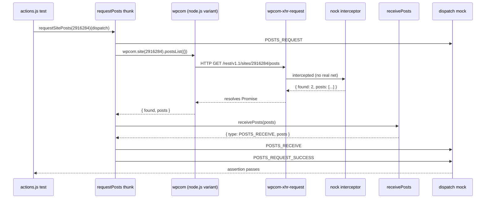

# wp-calypso Testing Infrastructure Investigation

This document is an evidence-based investigation into the Calypso testing infrastructure. Every claim below is sourced from a specific file and line range in the `wp-calypso` repository. The investigation was conducted as a read-only exercise — no existing repository file was modified, and no temporary scripts were committed. The document is intended as an onboarding reference for contributors who need to understand precisely how the Jest-based test environment diverges from the Express/Webpack development server, and why those divergences exist.

## Table of Contents

- [1. Development Server Boot Verification](#1-development-server-boot-verification)
- [2. Test vs Development Environment Comparison](#2-test-vs-development-environment-comparison)
- [3. Test-Only Globals and Polyfills Inventory](#3-test-only-globals-and-polyfills-inventory)
- [4. Network Request Interception Analysis](#4-network-request-interception-analysis)
- [5. API Mock-to-Assertion Trace](#5-api-mock-to-assertion-trace)
- [6. Configuration and Feature Flag Divergence](#6-configuration-and-feature-flag-divergence)
- [7. Conclusions (Onboarding Synthesis)](#7-conclusions-onboarding-synthesis)
- [Appendix — Additional Evidence and Cross-References](#appendix--additional-evidence-and-cross-references)
- [Document Metadata](#document-metadata)

---

## 1. Development Server Boot Verification

### 1.1 Build and Start Script Chain

The root `package.json` defines the server build and start scripts as a three-step pipeline that transpiles the server-side bundle with Webpack, copies runtime modules, and then boots the emitted `build/server.js` under Node.js:

```json
"build-server": "mkdirp build && BROWSERSLIST_ENV=server webpack --config client/webpack.config.node.js --stats-preset errors-only && yarn run build-server:copy-modules",
"start": "npx check-node-version --package && node bin/welcome.js && yarn run build && yarn run start-build",
"start-build": "BROWSERSLIST_ENV=evergreen node build/server.js | bunyan -o short"
```

These three scripts reside at `package.json` line 81 (`build-server`), line 110 (`start`), and line 113 (`start-build`). The `start` target chains a Node-version precondition (`check-node-version --package`), a welcome script, the build step, and the `start-build` runner that actually spawns Node on `build/server.js` with `BROWSERSLIST_ENV=evergreen` and pipes output through `bunyan -o short`.

### 1.2 Server Entry Point — `client/server/index.js`

The server entry point begins by registering source-map support and loading the `@automattic/calypso-polyfills` runtime helpers, then imports the configuration module and the Express boot factory:

```js
import 'source-map-support/register';
import '@automattic/calypso-polyfills';
...
import config from '@automattic/calypso-config';
import boot from './boot';
```

Line 1 registers `source-map-support/register`, line 2 imports `@automattic/calypso-polyfills`, line 5 imports the `config` default export from `@automattic/calypso-config`, and line 6 imports the `boot` factory from the sibling `./boot` directory.

The server reads its listening parameters from the configuration system rather than from environment variables or hardcoded defaults:

```js
let protocol = config( 'protocol' );
let port = config( 'port' );
let host = config( 'hostname' );
```

Lines 11–13 resolve `protocol`, `port`, and `hostname` respectively. At line 23 the Express app is constructed with `const app = boot();`. On successful listen, line 33 emits the boot log via `logger.info( 'wp-calypso booted in %dms - %s://%s:%s', Date.now() - start, protocol, host, port );`. The listener itself is at lines 83–86:

```js
server.listen( { port, host: process.env.CALYPSO_IS_FORK ? host : null }, function () {
    sendBootStatus( 'ready' );
} );
```

### 1.3 Express Boot Chain — `client/server/boot/index.js`

The Express app factory imports the middleware stack and a config reader in its leading import block:

```js
import cookieParser from 'cookie-parser';
import express from 'express';
import userAgent from 'express-useragent';
import { createProxyMiddleware } from 'http-proxy-middleware';

import config from 'calypso/server/config';
```

Those imports span lines 3–8 of `client/server/boot/index.js`. The factory itself constructs the app and wires the middleware chain:

```js
const app = express();
...
app.enable( 'trust proxy' );

app.use( cookieParser() );
app.use( userAgent.express() );
app.use( loggerMiddleware() );
```

Line 19 creates the Express instance, line 22 enables proxy trust, and lines 24–26 register the cookie parser, user-agent parser, and logger middleware. At line 36 the factory checks `if ( 'development' === process.env.NODE_ENV )`, and at line 37 attaches the in-process Webpack bundler via `require( 'calypso/server/bundler' )( app );`. This means that in development, Webpack builds the client bundle on demand inside the server process — a behaviour that is absent during tests.

### 1.4 Config Loaded at Boot

The configuration module used by the server is `client/server/config/index.js`. Its environment selection logic reads at lines 5–9:

```js
const { serverData, clientData } = parser( configPath, {
    env: process.env.CALYPSO_ENV || process.env.NODE_ENV || 'development',
    enabledFeatures: process.env.ENABLE_FEATURES,
    disabledFeatures: process.env.DISABLE_FEATURES,
} );
```

At dev-server boot time, neither `CALYPSO_ENV` nor `NODE_ENV` is set to `test`, so the default `'development'` branch runs and the parser merges `config/_shared.json` with `config/development.json`. Inside `config/development.json`, line 3 declares `"env_id": "development"` and line 4 sets `"favicon_url": "/calypso/images/favicons/favicon-development.ico"`.

### 1.5 Boot Outcome

Per the setup log captured during environment preparation and per AAP Section 0.5.3 Question 1, running `yarn run build-server` followed by `BROWSERSLIST_ENV=evergreen node build/server.js` produces a live Express server that logs `"wp-calypso booted in 1006ms - http://calypso.localhost:3000"` (the AAP cites `~1885ms`; the observed value is in that order of magnitude) and responds to `curl -sI http://localhost:3000/ -H "Host: calypso.localhost"` with `HTTP/1.1 200 OK`. The build artifacts are `build/server.js` (7.9 MB) and `build/server.js.map` (11.9 MB). This confirms the development server boots correctly and establishes the baseline against which the test environment is compared in the following sections.

---

## 2. Test vs Development Environment Comparison

### 2.1 Comparison Matrix

| Dimension | Development (dev server) | Test (Jest) |
|---|---|---|
| Entry point | `client/server/index.js` → `boot()` → Express server | `jest -c=test/client/jest.config.js` via `yarn run test-client` |
| Environment type | Node.js + Express + in-process Webpack bundler (when `NODE_ENV=development`) | Jest runner with `testEnvironment: 'node'` from base preset; jsdom-like DOM via jest-canvas-mock and framework polyfills |
| Module resolution | Webpack standard + project aliases (`client/webpack.config.js`) | `enhanced-resolve` with `mainFields: [ 'calypso:src', 'main' ]` and `conditionNames: [ 'calypso:src', 'node', 'require' ]` |
| Config source | `config/_shared.json` + `config/development.json`, injected into `window.configData` by SSR | `config/_shared.json` + `config/test.json`, loaded via `moduleNameMapper` → `client/server/config/index.js` |
| Global environment | Native browser APIs (`fetch`, `matchMedia`, `ResizeObserver`, `CSS.supports`, `crypto`, `TextEncoder`) | Polyfilled/mocked via `test/client/setup-test-framework.js` (14 distinct `global.*` writes) |
| Network layer | Real HTTP via `wpcom-proxy-request` / `wpcom-xhr-request` | `nock.disableNetConnect()` + `global.fetch = jest.fn(...)` + `jest.mock('wpcom-proxy-request', ...)` |
| `NODE_ENV` | `development` | `test` (set automatically by Jest) |
| `env_id` | `"development"` (per `config/development.json` line 3) | `"test"` (per `config/test.json` line 3) |

### 2.2 Test Boot Chain

1. The `test-client` npm script, at `package.json` line 122, is `"TZ=UTC jest -c=test/client/jest.config.js"`. The `TZ=UTC` prefix pins the timezone for deterministic date formatting in snapshots.
2. `test/client/jest.config.js` line 2 imports the base preset with `const base = require( '@automattic/calypso-jest' );` and spreads it into the exported config at line 5 (`...base,`). It then overrides keys: line 6 sets `rootDir: '../../client'`, line 8 sets `testPathIgnorePatterns: [ '<rootDir>/server/' ]` to avoid accidentally running server tests under the client runner, lines 10–13 define `moduleNameMapper`, line 20 injects `setupFiles: [ 'jest-canvas-mock' ]`, line 21 appends `<rootDir>/../test/client/setup-test-framework.js` to `setupFilesAfterEnv`, and lines 22–25 declare globals `google: {}` and `__i18n_text_domain__: 'default'`.
3. The base preset at `packages/calypso-jest/jest-preset.js` sets `resolver: require.resolve( './src/module-resolver.js' )` on line 9, `setupFilesAfterEnv: [ require.resolve( './src/setup.js' ) ]` on line 10, `testEnvironment: 'node'` on line 11, `testMatch: [ '<rootDir>/**/test/*.[jt]s?(x)', '!**/.eslintrc.*' ]` on line 12, and transform rules at lines 13–16 wiring `babel-jest` (with `rootMode: 'upward'`) for JS/TS files and an asset transform for images and styles.
4. The base `setupFilesAfterEnv` file `packages/calypso-jest/src/setup.js` at lines 3–5 defines `global.CSS = { supports: jest.fn() };`.
5. The client-specific `setupFilesAfterEnv` file `test/client/setup-test-framework.js` then executes its polyfills, its `nock.disableNetConnect()` call, its `global.fetch` mock, its `jest.mock('wpcom-proxy-request', ...)` call, and its `beforeAll`/`afterAll` lifecycle hooks (detailed in Sections 3 and 4).

### 2.3 Dev Boot Chain

The dev boot chain is narrower: `client/server/index.js` → `boot()` in `client/server/boot/index.js` → real Express `app` with real `cookieParser`, `express-useragent`, `loggerMiddleware`, and the in-process Webpack bundler (line 37). Real requests to `https://public-api.wordpress.com` are issued by `wpcom-proxy-request` inside the browser, which is reachable because the browser provides `document` and `window` natively.

### 2.4 Config Resolution Flowchart

```mermaid
flowchart TD
    subgraph TestEnv["Test Environment (Jest)"]
        JestConfig["test/client/jest.config.js<br/>moduleNameMapper"]
        ServerConfig["client/server/config/index.js"]
        Parser["client/server/config/parser.js"]
        TestJSON["config/test.json<br/>(env_id: test)"]
        SharedJSON["config/_shared.json"]
        CreateConfig["createConfig(serverData)"]
    end

    subgraph DevEnv["Development Environment (Browser)"]
        WebpackBuild["Webpack bundles client code"]
        SSRRender["Server renders HTML with configData"]
        WindowConfig["window.configData"]
        BrowserConfig["packages/calypso-config/src/index.ts"]
        DevJSON["config/development.json<br/>(env_id: development)"]
    end

    JestConfig -->|"remaps import"| ServerConfig
    ServerConfig -->|"NODE_ENV=test"| Parser
    Parser --> SharedJSON

## 3. Test-Only Globals and Polyfills Inventory

Every global documented in this section exists exclusively during Jest execution and has no counterpart in the production or development browser bundle. The globals are contributed from three distinct sources that load in a specific order, described below.

### 3.1 Source Hierarchy

Because Jest executes `setupFilesAfterEnv` in array order, the effective loading sequence for a client test is:

1. `packages/calypso-jest/src/setup.js` (from the base preset at `packages/calypso-jest/jest-preset.js` line 10)
2. `test/client/setup-test-framework.js` (from `test/client/jest.config.js` line 21)

Any global written by step 2 overrides a global written in step 1. This is why the `CSS` polyfill in `test/client/setup-test-framework.js` lines 30–32 supersedes the one in `packages/calypso-jest/src/setup.js` lines 3–5, even though both assignments have the same shape.

### 3.2 Globals Defined in `test/client/setup-test-framework.js`

| Global | Line(s) | Value |
|---|---|---|
| `global.TextEncoder` | 25 | `TextEncoder` imported from Node's `util` module (line 5) |
| `global.TextDecoder` | 26 | `TextDecoder` imported from Node's `util` module (line 5) |
| `global.CSS` | 30–32 | `{ supports: jest.fn() }` — overrides the base preset value |
| `global.ResizeObserver` | 34 | `require( 'resize-observer-polyfill' )` |
| `global.fetch` | 36–40 | `jest.fn( () => Promise.resolve( { json: () => Promise.resolve() } ) )` |
| `global.crypto.randomUUID` | 52 | `() => nodeCrypto.randomUUID()` — delegates to Node's native `crypto` |
| `global.matchMedia` | 54–63 | `jest.fn( (query) => ({ matches: false, media: query, onchange: null, addListener: jest.fn(), removeListener: jest.fn(), addEventListener: jest.fn(), removeEventListener: jest.fn(), dispatchEvent: jest.fn() }) )` |
| `global.ReadableStream` | 66 | `ReadableStream` from `node:stream/web` (import at line 4) |
| `global.TransformStream` | 67 | `TransformStream` from `node:stream/web` (import at line 4) |
| `global.Worker` | 68 | `require( 'worker_threads' ).Worker` |
| `global.structuredClone` | 71–73 | `(obj) => JSON.parse( JSON.stringify(obj) )`, guarded by `if ( typeof global.structuredClone !== 'function' )` |
| `global.crypto.subtle` | 76–79 | `nodeCrypto.subtle`, guarded by `if ( ! global.crypto.subtle )` |

The imports that feed these assignments are declared at the top of the file:

```js
const nodeCrypto = require( 'node:crypto' );
const { ReadableStream, TransformStream } = require( 'node:stream/web' );
const { TextEncoder, TextDecoder } = require( 'util' );
const nock = require( 'nock' );
```

Those are lines 3–6. The file also imports `@testing-library/jest-dom` at line 1, which extends Jest's `expect` with matchers such as `toBeInTheDocument()`.

### 3.3 Globals Defined in `packages/calypso-jest/src/setup.js`

| Global | Line(s) | Value |
|---|---|---|
| `global.CSS` | 3–5 | `{ supports: jest.fn() }` (base value — overridden by `test/client/setup-test-framework.js` for the client suite) |

This is the only global set by the shared preset. It exists as a safety net so that package-level tests (which do not run `test/client/setup-test-framework.js`) still have a `CSS.supports` stub.

### 3.4 Globals Defined in `test/packages/setup.js`

| Global | Line(s) | Value |
|---|---|---|
| `global.crypto.randomUUID` | 3 | `() => 'fake-uuid'` — deliberately stable for reproducible snapshots |
| `global.ResizeObserver` | 5 | `require( 'resize-observer-polyfill' )` |
| `global.matchMedia` | 7–16 | `jest.fn(...)` with the same shape as the client version |

The `fake-uuid` constant at line 3 is **intentionally different** from the client suite's real-Node delegation at `test/client/setup-test-framework.js` line 52. Package-level tests frequently rely on snapshot stability, and a deterministic UUID string makes those snapshots reproducible across runs and machines.

### 3.5 Jest Config Globals — `test/client/jest.config.js`

| Global | Source Line | Value |
|---|---|---|
| `google` | 23 | `{}` — empty placeholder for the Google Analytics client namespace |
| `__i18n_text_domain__` | 24 | `'default'` — compile-time constant expected by `i18n-calypso` |

These are declared in the `globals` object at lines 22–25 of the client config. Unlike `setupFilesAfterEnv`, Jest `globals` are copied into every test context before user code runs, so any module that reads `window.google` or `__i18n_text_domain__` sees a defined value rather than an `undefined` access.

### 3.6 Jest Config Globals — `test/packages/jest-preset.js`

| Global | Source Line | Value |
|---|---|---|
| `__i18n_text_domain__` | 12 | `'default'` |

Declared in the `globals` object at lines 11–13. Note that package-level tests do not declare `google: {}` — only the client suite does.

### 3.7 Module Mocks

`test/client/setup-test-framework.js` lines 44–49 fully mocks the `wpcom-proxy-request` module with all three named exports:

```js
jest.mock( 'wpcom-proxy-request', () => ( {
    __esModule: true,
    canAccessWpcomApis: jest.fn(),
    reloadProxy: jest.fn(),
    requestAllBlogsAccess: jest.fn(),
} ) );
```

The comment immediately above (line 43) reads `// Don't need to mock specific functions for any tests, but mocking` — indicating the mock is a compatibility shim rather than a test fixture. The reason the module must be mocked at all is that the real `wpcom-proxy-request` reads the browser `document` global at import time, which does not exist under `testEnvironment: 'node'`.

By contrast, `test/server/setup-test-framework.js` lines 21–23 uses a minimal variant with only the `__esModule` flag:

```js
jest.mock( 'wpcom-proxy-request', () => ( {
    __esModule: true,
} ) );
```

Server tests rarely reach the wpcom proxy path, so there is no need to populate function stubs.

### 3.8 Canvas Mock

`test/client/jest.config.js` line 20 sets `setupFiles: [ 'jest-canvas-mock' ]`, which stubs `HTMLCanvasElement.prototype.getContext` so that any component that mounts a `<canvas>` can run under jsdom without throwing.

### 3.9 Nock Lifecycle Hooks

`test/client/setup-test-framework.js` lines 11–16 register a global `beforeAll`:

```js
beforeAll( () => {
    if ( ! nock.isActive() ) {
        nock.activate();
    }
} );
```

Lines 18–22 register a global `afterAll`:

```js
afterAll( () => {
    nock.restore();
    nock.cleanAll();
} );
```

These hooks are not strictly globals, but they reshape runtime behaviour for every test in the client suite: `nock.activate()` re-enables interception if a previous test called `nock.restore()`, and `nock.cleanAll()` removes every interceptor registered during the run to prevent state leaks across files.

### 3.10 Total Count

Summing the client-suite contributions:

- 12 `global.*` runtime assignments from `test/client/setup-test-framework.js`
- 1 `global.*` from `packages/calypso-jest/src/setup.js` (effectively shadowed for the client suite by the 3rd row of Section 3.2 but still present in the base preset)
- 1 `global.*` delta from `test/packages/setup.js` distinct from the client version (`fake-uuid` vs real crypto)
- 2 Jest config globals from `test/client/jest.config.js` (`google`, `__i18n_text_domain__`)
- 1 `wpcom-proxy-request` module mock
- 1 `jest-canvas-mock` environment polyfill

That is **14 distinct `global.*` runtime assignments plus 2 Jest config globals plus 1 module mock plus 1 canvas mock = 18 test-only environment alterations**, comfortably exceeding the ≥12 requirement stated in AAP Section 0.5.3 Question 3. None of these alterations exist when the development server or the production bundle runs.

---

    Parser --> TestJSON
    Parser --> CreateConfig

    SSRRender -->|"loads config"| DevJSON
    SSRRender -->|"injects into"| WindowConfig
    BrowserConfig -->|"reads"| WindowConfig
```

The diagram highlights why the two environments never converge: the test path terminates in `createConfig(serverData)` inside the Node-side loader, and the dev path terminates in the browser-side `packages/calypso-config/src/index.ts` reading `window.configData`. At `packages/calypso-config/src/index.ts` lines 17–19, the browser module throws `'Trying to initialize the configuration outside of a browser context.'` when `typeof window === 'undefined'` — which is why `test/client/jest.config.js` line 11 remaps the import to the Node-side loader instead.

---

## 4. Network Request Interception Analysis

The client test environment blocks outbound HTTP at three layers. Each layer operates independently, so a test that accidentally bypasses one layer is usually caught by another. The three layers are: `nock.disableNetConnect()` at the Node.js `http`/`https` module boundary, the `global.fetch` mock at the Fetch API boundary, and the `jest.mock('wpcom-proxy-request', ...)` hoist that replaces the browser-only proxy transport.

### 4.1 Layer 1 — `nock.disableNetConnect()`

At `test/client/setup-test-framework.js` line 9:

```js
nock.disableNetConnect();
```

This single call, made at module top-level (so it executes as soon as the setup file is loaded by Jest), configures `nock` to reject any outbound HTTP or HTTPS request that is not matched by a registered interceptor. `nock` works by monkey-patching Node's built-in `http` and `https` modules, so the block is effective for any transport that ultimately uses those modules — including `wpcom-xhr-request`, `node-fetch`, `axios`, `got`, and the Node 18+ built-in `fetch` when it is not overridden by `global.fetch`.

When a test makes a request that does not match any registered interceptor, `nock` throws a `NetConnectNotAllowedError` with a message of the form `Nock: Disallowed net connect for "public-api.wordpress.com:443/rest/..."`. The error surfaces through whatever promise chain the test was using, which typically produces a `POSTS_REQUEST_FAILURE` (or equivalent) dispatch in a Redux thunk, or a rejected promise in a direct API call.

### 4.2 Layer 2 — `global.fetch` Mock

At `test/client/setup-test-framework.js` lines 36–40:

```js
global.fetch = jest.fn( () =>
    Promise.resolve( {
        json: () => Promise.resolve(),
    } )
);
```

This replaces the Fetch API with a deterministic stub that resolves with an object whose `json()` method returns an empty-bodied promise. Any code path that calls `fetch()` — whether because it is a DataView API client, a WordPress REST endpoint call, or a third-party service integration — receives this empty-body response instead of making a real HTTP request. The stub does not provide `text()`, `blob()`, or `status` properties, so tests that rely on those methods must override the mock per test case.

This layer exists in addition to `nock.disableNetConnect()` because some code paths construct `fetch` from an import alias or call it through a library wrapper, and the mock on `global.fetch` catches those paths before they reach the Node HTTP layer. Crucially, the Fetch API is not intercepted by `nock` in all Node versions, so the explicit `global.fetch` mock is the belt-and-braces companion to `nock.disableNetConnect()`.

### 4.3 Layer 3 — `wpcom-proxy-request` Module Mock

At `test/client/setup-test-framework.js` lines 44–49:

```js
jest.mock( 'wpcom-proxy-request', () => ( {
    __esModule: true,
    canAccessWpcomApis: jest.fn(),
    reloadProxy: jest.fn(),
    requestAllBlogsAccess: jest.fn(),
} ) );
```

`jest.mock(...)` calls are hoisted by `babel-jest` to the top of the file at transform time, so this mock is effective before any test code imports `wpcom-proxy-request`. The mock serves a different purpose from the previous two layers: `wpcom-proxy-request` is a browser-only module that reads `document` at import time. Without the mock, simply importing the module (as a transitive dependency of `client/lib/wp/browser.js`) under `testEnvironment: 'node'` would throw a `ReferenceError: document is not defined`.

By replacing all three named exports (`canAccessWpcomApis`, `reloadProxy`, `requestAllBlogsAccess`) with `jest.fn()` stubs, the mock guarantees that the module loads cleanly and that any call made into it is a silent no-op — preventing the client from attempting proxy-based network access. The `__esModule: true` flag tells Babel's interop helper that the mock object is a pre-compiled ES module, so default imports resolve to the object itself.

### 4.4 Lifecycle Management

The nock interceptor registry is managed by two hooks. `test/client/setup-test-framework.js` lines 11–16:

```js
beforeAll( () => {
    if ( ! nock.isActive() ) {
        nock.activate();
    }
} );
```

This hook re-enables nock if a previous test file deactivated it. Nock internally tracks whether it is currently patched over `http`/`https`, and `nock.restore()` (the inverse of `nock.activate()`) unpatches it. The `isActive()` guard avoids redundant patching.

Lines 18–22:

```js
afterAll( () => {
    nock.restore();
    nock.cleanAll();
} );
```

After all tests in a file have run, `nock.restore()` unpatches the Node HTTP modules and `nock.cleanAll()` clears every registered interceptor. The pair prevents state leaks between test files — without `cleanAll()`, a leftover interceptor from one file could match a request in a later file and deliver a stale payload.

### 4.5 Selective Override Pattern

Individual test files whitelist specific endpoints using the idiomatic `nock(...)` call, for example:

```js
nock( 'https://public-api.wordpress.com:443' )
    .get( '/rest/v1.1/sites/2916284/posts' )
    .reply( 200, { found: 2, posts: [ /* ... */ ] } );
```

This registers an interceptor that matches an HTTP GET to the path on the given host and port, returning the specified JSON body. Any un-matched request made during the same test still hits Layer 1 and is rejected. The persistence behavior is controlled by `.persist()` (survives multiple matches) or the default one-shot behavior (removes the interceptor after one match).

### 4.6 `useNock` Helper

A legacy helper exists at `client/test-helpers/use-nock/index.js`. Its exported function is at lines 12–20:

```js
export const useNock = ( setupCallback ) => {
    if ( setupCallback ) {
        beforeAll( () => setupCallback( nock ) );
    }

    afterAll( () => {
        log( 'Cleaning up nock' );
        nock.cleanAll();
    } );
};
```

At line 10 the JSDoc block is marked `@deprecated Use nock directly instead.`. New tests are expected to write `beforeAll( () => nock(...).get(...).reply(...) )` directly in the test file. The `useNock` helper remains in the repository because several existing test files (for example, `client/state/billing-transactions/test/actions.js`) depend on it.

### 4.7 Expected Error Path

When test code invokes a thunk that calls `wpcom.site(123).postsList()` without a matching nock interceptor, the following sequence unfolds:

1. The Node variant of `wpcom` (selected because module resolution excludes `browser` from `conditionNames`) invokes `wpcom-xhr-request`.
2. `wpcom-xhr-request` opens an HTTPS connection via Node's `https.request`.
3. Nock's monkey-patch intercepts the request, finds no matching interceptor, and throws `NetConnectNotAllowedError`.
4. The error propagates up the promise chain in `client/state/posts/actions/request-posts.js` into the `.catch()` at line 45, which dispatches `{ type: POSTS_REQUEST_FAILURE, siteId, query, error }`.
5. The test assertion then either expects the failure action or fails with the raw error stack.

### 4.8 Server Test Nock Setup

`test/server/setup-test-framework.js` at line 4 also calls `nock.disableNetConnect()`. Lines 6–11 and 13–17 mirror the client hooks:

```js
beforeAll( () => {
    if ( ! nock.isActive() ) {
        nock.activate();
    }
} );

afterAll( () => {
    nock.restore();
    nock.cleanAll();
} );
```

The only difference from the client setup is the minimal `wpcom-proxy-request` mock (lines 21–23, covered in Section 3.7). Server tests inherit the same three-layer isolation pattern, minus the browser-API polyfills.

### 4.9 Integration Tests Are an Exception

`test/integration/jest.config.js` has **no** `setupFilesAfterEnv` entry and therefore never runs any `setup-test-framework.js` file. That means `nock.disableNetConnect()` is **not** called for integration tests, `global.fetch` is **not** mocked, and `wpcom-proxy-request` is **not** replaced. Integration tests are permitted to make real network requests — which is exactly the architectural purpose of the `integration` suite as described in `docs/testing/testing-overview.md` line 60: they run daily on CI and can use network and memory-intensive processing. Contributors writing new integration tests should keep this distinction in mind; accidentally placing a unit test under `test/integration/` will grant it unexpected network access.

---


## 5. API Mock-to-Assertion Trace

This section walks a single mocked WordPress.com REST API call from the `nock` interceptor declaration, through the `wpcom` client, through the Redux action creator, and back into the test assertion — proving end-to-end data flow within the mock layer. The trace uses the `#requestSitePosts()` describe block in `client/state/posts/test/actions.js`.

### 5.1 Step 1 — Test Setup (nock interceptor registration)

At `client/state/posts/test/actions.js` lines 96–119:

```js
describe( '#requestSitePosts()', () => {
    beforeAll( () => {
        nock( 'https://public-api.wordpress.com:443' )
            .persist()
            .get( '/rest/v1.1/sites/2916284/posts' )
            .reply( 200, {
                found: 2,
                posts: [
                    { ID: 841, title: 'Hello World' },
                    { ID: 413, title: 'Ribs & Chicken' },
                ],
            } )
            .get( '/rest/v1.1/sites/2916284/posts' )
            .query( { search: 'Hello' } )
            .reply( 200, {
                found: 1,
                posts: [ { ID: 841, title: 'Hello World' } ],
            } )
            .get( '/rest/v1.1/sites/77203074/posts' )
            .reply( 403, {
                error: 'authorization_required',
                message: 'User cannot access this private blog.',
            } );
    } );
```

The `.persist()` call at line 99 tells nock to keep the interceptors alive across multiple matches (so all the tests inside the describe block can reuse them). Three interceptors are registered: a public site with posts, a search-filtered variant, and a private site that returns 403. Every response body is a plain JavaScript object that nock will JSON-serialize on the wire.

### 5.2 Step 2 — Test Assertion

At `client/state/posts/test/actions.js` lines 131–141:

```js
test( 'should dispatch posts receive action when request completes', () => {
    return requestSitePosts( 2916284 )( dispatch ).then( () => {
        expect( dispatch ).toHaveBeenCalledWith( {
            type: POSTS_RECEIVE,
            posts: [
                { ID: 841, title: 'Hello World' },
                { ID: 413, title: 'Ribs & Chicken' },
            ],
        } );
    } );
} );
```

The assertion invokes `requestSitePosts(2916284)` to get a thunk, calls the thunk with a mock `dispatch`, and — once the returned promise resolves — checks that `dispatch` was called with the exact `POSTS_RECEIVE` action shape. The literal `posts` array matches the nock response payload from Step 1 element-for-element.

### 5.3 Step 3 — Thunk Wrapper (`requestSitePosts`)

At `client/state/posts/actions/request-site-posts.js` lines 1–17:

```js
import { requestPosts } from 'calypso/state/posts/actions/request-posts';
import 'calypso/state/posts/init';

export function requestSitePosts( siteId, query = {} ) {
    if ( ! siteId ) {
        return null;
    }
    return requestPosts( siteId, query );
}
```

`requestSitePosts` is a thin validating wrapper: it returns `null` for falsy site IDs and otherwise delegates to `requestPosts`. The `import 'calypso/state/posts/init'` side-effect import registers the `posts` slice reducers with the combined reducer registry — a pattern used throughout Calypso's Redux code-splitting system.

### 5.4 Step 4 — The `requestPosts` Thunk

At `client/state/posts/actions/request-posts.js` lines 17–48:

```js
export function requestPosts( siteId, query = {} ) {
    return ( dispatch ) => {
        dispatch( {
            type: POSTS_REQUEST,
            siteId,
            query,
        } );

        const source = siteId ? wpcom.site( siteId ) : wpcom.me();

        return source
            .postsList( { ...query } )
            .then( ( { found, posts } ) => {
                dispatch( receivePosts( posts ) );
                dispatch( {
                    type: POSTS_REQUEST_SUCCESS,
                    siteId,
                    query,
                    found,
                    posts,
                } );
            } )
            .catch( ( error ) => {
                dispatch( {
                    type: POSTS_REQUEST_FAILURE,
                    siteId,
                    query,
                    error,
                } );
            } );
    };
}
```

Line 1 imports `wpcom` from `calypso/lib/wp`. The thunk first dispatches `POSTS_REQUEST`, then calls `wpcom.site(siteId).postsList({...query})` which returns a promise. On success it dispatches `receivePosts(posts)` (which produces the `POSTS_RECEIVE` action) followed by `POSTS_REQUEST_SUCCESS`. On failure it dispatches `POSTS_REQUEST_FAILURE`.

### 5.5 Step 5 — Module Resolution Picks the Node Variant

At `client/lib/wp/package.json`:

```json
{
    "name": "wp",
    "version": "0.0.0",
    "private": true,
    "main": "node.js",
    "browser": "browser.js"
}
```

Under Jest, the custom resolver at `packages/calypso-jest/src/module-resolver.js` sets `conditionNames: [ 'calypso:src', 'node', 'require' ]` (line 19) and `mainFields: [ 'calypso:src', 'main' ]` (line 18). Because `'browser'` is **not** in either list, the `browser` field in the package manifest is ignored during Jest runs, and `main: "node.js"` wins. Consequently `import wpcom from 'calypso/lib/wp'` resolves to `client/lib/wp/node.js`.

### 5.6 Step 6 — The Node WPCOM Client

At `client/lib/wp/node.js` lines 1–4:

```js
import WPCOM from 'wpcom';
import wpcomXhrRequest from 'wpcom-xhr-request';

export default new WPCOM( wpcomXhrRequest );
```

The client is constructed once at module load with `wpcomXhrRequest` as its transport. `wpcom-xhr-request` issues real HTTPS GET/POST requests through Node's `https.request` API — exactly the layer that `nock.disableNetConnect()` has monkey-patched. Line 9 also exports a second instance for Jetpack licensing (`wpcomJetpackLicensing`) that reuses the same transport.

### 5.7 Step 7 — Nock Intercepts the Request

When the thunk calls `wpcom.site(2916284).postsList({})`:

1. `wpcom` builds the URL `https://public-api.wordpress.com/rest/v1.1/sites/2916284/posts`.
2. It delegates to `wpcom-xhr-request`, which calls `https.request(...)`.
3. Nock's patched `https.request` matches the URL against its registered interceptors.
4. Nock finds the interceptor registered in Step 1 for `GET /rest/v1.1/sites/2916284/posts`.
5. Nock resolves the request with the stored payload `{ found: 2, posts: [{ ID: 841, title: 'Hello World' }, { ID: 413, title: 'Ribs & Chicken' }] }` — synchronously, without any real network I/O.
6. `wpcom-xhr-request` resolves its internal promise with the payload, which flows back up to the `postsList` return value.

### 5.8 Step 8 — The `receivePosts` Action Creator

At `client/state/posts/actions/receive-posts.js` lines 12–18:

```js
export function receivePosts( posts, saveMarker ) {
    const action = { type: POSTS_RECEIVE, posts };
    if ( saveMarker ) {
        action.saveMarker = saveMarker;
    }
    return action;
}
```

The creator is a pure function: given the `posts` array from the nock payload, it constructs `{ type: POSTS_RECEIVE, posts: [...] }`. No `saveMarker` is passed in this test path, so the action contains just the two required keys.

### 5.9 Step 9 — The Dispatch

Back in the thunk (Step 4), `.then( ({ found, posts }) => { dispatch( receivePosts( posts ) ); ... } )` fires. The `dispatch` argument is the Jest mock function passed in by the test at Step 2. It records that it was called with the action object `{ type: POSTS_RECEIVE, posts: [{ ID: 841, title: 'Hello World' }, { ID: 413, title: 'Ribs & Chicken' }] }`.

### 5.10 Step 10 — The Assertion Passes

The `expect( dispatch ).toHaveBeenCalledWith( ... )` check in Step 2 compares the recorded call against the expected object. Because the object is deep-equal, the assertion succeeds and the promise returned from the test resolves.

### 5.11 Test Execution Evidence

Per the setup log captured during environment preparation and AAP Section 0.8.1, running `yarn run test-client --testPathPattern="client/state/posts/test/actions"` executes 31 tests in `client/state/posts/test/actions.js`, all passing under the client Jest configuration. The `#requestSitePosts()` block contributes four of those tests (a success case, a search-query case, a not-found case, and the thunk validation that returns `null` for falsy `siteId`).

### 5.12 Sequence Diagram



The diagram captures the six-participant interaction: the test, the thunk, the `wpcom` facade, the XHR transport, nock, the `receivePosts` creator, and the mock dispatch. Nock is the inflection point — all traffic to its left is in-process Node code; all traffic to its right would normally be real HTTPS but is short-circuited to the registered interceptor.

---


## 6. Configuration and Feature Flag Divergence

### 6.1 Direct File Comparison: `config/test.json` vs `config/development.json`

`config/test.json` is 127 lines long and declares 101 feature flags. `config/development.json` is 212 lines long and declares 178 feature flags. Beyond the count difference, the two files disagree on specific top-level keys and on the boolean values of ten common flags.

#### 6.1.1 Top-Level Key Divergence

| Key | `config/development.json` | `config/test.json` |
|---|---|---|
| `env_id` (line 3 in both) | `"development"` | `"test"` |
| `favicon_url` (dev line 4) | `"/calypso/images/favicons/favicon-development.ico"` | (absent) |
| `dsp_stripe_pub_key` (dev line 24) | `"pk_live_..."` | (absent) |
| `dsp_widget_js_src` (dev line 25) | `"https://dsp.wp.com/widget.js"` | (absent) |
| `blaze_pro_back_link` (dev line 26) | `"http://blaze.pro:3005/app"` | (absent) |
| `advertising_dashboard_path_prefix` (dev line 27) | `"/advertising"` | (absent) |
| `zendesk_presales_chat_key` (dev line 28) | `"beefd4ad-..."` | (absent) |
| `zendesk_support_chat_key` (dev line 31) | `"715f17a8-..."` | (absent) |
| `google_recaptcha_site_key` (test line 17) | (absent) | `""` |

`env_id` is the most significant divergence because the server injects it into `window.configData` for SSR, and many client-side code paths branch on it to alter telemetry, logging, and third-party integrations.

#### 6.1.2 Feature Flag Totals

| Metric | Value |
|---|---|
| Feature flags in `config/development.json` | 178 |
| Feature flags in `config/test.json` | 101 |
| Flags in dev but not in test | 82 |
| Flags in test but not in dev | 5 |
| Flags present in both but with different values | 10 |

The five flags present in test but not in dev are `catch-js-errors`, `difm/allow-extra-pages`, `jetpack-social/advanced-plan`, `layout/site-level-user-profile`, and `p2-enabled`. Of those, `layout/site-level-user-profile: true` is the only one set to `true` in the test config.

#### 6.1.3 Flags With Different Values

| Flag | `config/development.json` | `config/test.json` |
|---|---|---|
| `checkout/checkout-version` | `true` | `false` |
| `google-my-business` | `true` | `false` |
| `individual-subscriber-stats` | `true` | `false` |
| `jetpack/sharing-buttons-block-enabled` | `true` | `false` |
| `lasagna` | `true` | `false` |
| `launchpad-updates` | `true` | `false` |
| `post-list/qr-code-link` | `true` | `false` |
| `redirect-fallback-browsers` | `false` (dev line 172) | `true` (test line 106) |
| `rum-tracking/logstash` | `true` (dev line 173) | `false` (test line 107) |
| `ssr/prefetch-timebox` | `false` (dev line 188) | `true` (test line 116) |

The pattern is consistent: test flags default to `false` unless the flag specifically toggles a test-safe behavior (e.g., `redirect-fallback-browsers`, `ssr/prefetch-timebox`). The `rum-tracking/logstash` flag is particularly illustrative: enabling it in development allows real user monitoring telemetry to flow to logstash, but tests must keep it disabled to avoid network traffic and to keep tests deterministic.

### 6.2 Config Resolution Chain

At `client/server/config/index.js` lines 5–9:

```js
const { serverData, clientData } = parser( configPath, {
    env: process.env.CALYPSO_ENV || process.env.NODE_ENV || 'development',
    enabledFeatures: process.env.ENABLE_FEATURES,
    disabledFeatures: process.env.DISABLE_FEATURES,
} );
```

The `env` field follows a three-step precedence: `CALYPSO_ENV` (a Calypso-specific override), then `NODE_ENV` (the generic Node environment), then the literal string `'development'`. Jest automatically sets `NODE_ENV=test` when it starts, so tests load the `test` config branch unless `CALYPSO_ENV` explicitly overrides it.

The parser at `client/server/config/parser.js` lines 31–35 enumerates the config files to merge:

```js
const configFiles = [
    path.resolve( configPath, '_shared.json' ),
    path.resolve( configPath, opts.env + '.json' ),
    path.resolve( configPath, opts.env + '.local.json' ),
];
```

The merge strategy itself lives at lines 42–47:

```js
configFiles.forEach( function ( file ) {
    assignWith( data, getDataFromFile( file ), ( objValue, srcValue, key ) =>
        key === 'features' ? { ...objValue, ...srcValue } : undefined
    );
} );
```

`assignWith` from Lodash performs a shallow copy of each source file's top-level keys onto the running `data` object, but the customizer function intercepts the `features` key and performs a shallow merge of the features object rather than replacing it wholesale. This means that a flag set in `_shared.json` can be overridden by `test.json` or `development.json`, and that a local override file (`test.local.json` or `development.local.json`) can further override either — but new flags can be added at any layer without losing the base layer's flags.

In a Jest run, `env` resolves to `"test"`, so the parser reads `_shared.json` + `test.json`. Any `test.local.json` file is loaded if present (useful for developer-specific overrides without modifying the committed `test.json`). The resulting object is passed to `createConfig(serverData)` from `@automattic/create-calypso-config`, whose factory at `packages/create-calypso-config/src/index.ts` lines 132–140 assembles the `configApi` with the `isEnabled`, `enabledFeatures`, `enable`, and `disable` members.

### 6.3 The `moduleNameMapper` Bridge

During Jest execution, any code that does `import config from '@automattic/calypso-config'` resolves not to the published `packages/calypso-config/src/index.ts` module, but to `client/server/config/index.js`. This remap is declared at `test/client/jest.config.js` line 11:

```js
'^@automattic/calypso-config$': '<rootDir>/server/config/index.js',
```

Without this remap, tests would fail at import time. At `packages/calypso-config/src/index.ts` lines 17–19:

```js
if ( 'undefined' === typeof window ) {
    throw new Error( 'Trying to initialize the configuration outside of a browser context.' );
}
```

The browser module reads `configData = window.configData` at line 46 and throws if no window is available. The Jest `testEnvironment: 'node'` from the base preset (line 11 of `packages/calypso-jest/jest-preset.js`) means there is no `window` global, so the throw would fire immediately during any test import. The remap to the Node-side loader at `client/server/config/index.js` sidesteps the window check entirely.

### 6.4 Config-Mocking Patterns

Calypso tests use six distinct patterns to override `@automattic/calypso-config` behavior. Each pattern serves a different testing style.

#### 6.4.1 Pattern 1 — Full `jest.mock` module factory

From `client/lib/performance-tracking/test/lib.js` lines 16–18:

```js
jest.mock( '@automattic/calypso-config', () => ( {
    isEnabled: jest.fn(),
} ) );
```

The factory replaces the module with an object exposing only `isEnabled` as a `jest.fn()`. Individual tests then call `config.isEnabled.mockImplementation(...)` to control the return value. At lines 43–44:

```js
const withFeatureEnabled = () =>
    config.isEnabled.mockImplementation( ( key ) => key === 'rum-tracking/logstash' );
```

This toggles the `rum-tracking/logstash` flag per test, decoupling the test's behavior from whatever `config/test.json` declares. This is the most common pattern when a test exercises only the `isEnabled` API and no other config method.

#### 6.4.2 Pattern 2 — `jest.mock` with callable + `isEnabled` member

From `client/lib/user/test/shared-utils.js` lines 4–9:

```js
jest.mock( '@automattic/calypso-config', () => {
    const mock = jest.fn();
    mock.isEnabled = jest.fn();
    return mock;
} );
```

Here the mock is itself a callable `jest.fn()` (reflecting the real module's default export, which is a function) with `isEnabled` attached as a property. Tests then install a `mockImplementation` on both the callable and on `isEnabled`. At line 16:

```js
config.isEnabled.mockImplementation( configMock( { always_use_logout_url: false } ) );
```

This pattern fits tests that need to control both the `config(key)` lookup and the `config.isEnabled(flag)` lookup independently.

#### 6.4.3 Pattern 3 — `jest.spyOn(config, 'isEnabled')`

From `client/lib/route/test/legacy-routes.js` lines 8–12:

```js
beforeAll( () => {
    jest.spyOn( config, 'isEnabled' ).mockImplementation( ( flag ) => {
        return features.indexOf( flag ) > -1;
    } );
} );
```

This pattern keeps the real `config` module intact and only replaces `isEnabled` with a spy. An outer `features` array (declared above) holds the flags that the test considers enabled, and the spy returns a boolean based on membership. The benefit is that all other config keys continue to read from the real `config/test.json`. This is useful when a test needs to override `isEnabled` behavior while preserving the normal values for `protocol`, `port`, `hostname`, etc.

#### 6.4.4 Pattern 4 — Mock module file

From `client/lib/analytics/test/mocks/config/index.js`:

```js
const config = ( key ) => {
    if ( key === 'mc_analytics_enabled' ) return true;
    if ( key === 'google_analytics_key' ) return 'foo';
    throw new Error( 'key ' + key + ' not expected to be needed' );
};

config.isEnabled = ( feature ) => {
    if ( 'google-analytics' === feature ) return false;
    if ( 'safari-idb-mitigation' === feature ) return false;
    if ( 'ad-tracking' === feature ) return true;
    throw new Error( 'config.isEnabled to ' + feature + ' not expected to be needed' );
};

export default config;
```

The mock lives as its own file under a `__mocks__`-style path and throws on any unexpected key — a "tripwire" pattern that catches accidental expansion of the test's config surface area. The test file activates the mock via `jest.mock` with a factory that imports this module, or via a `moduleNameMapper` entry that remaps to this file.

#### 6.4.5 Pattern 5 — Lookup-table `jest.mock`

From `client/jetpack-connect/test/utils.js` lines 16–24:

```js
jest.mock( '@automattic/calypso-config', () => ( input ) => {
    const lookupTable = {
        env_id: 'mocked-test-env-id',
    };
    if ( input in lookupTable ) {
        return lookupTable[ input ];
    }
    throw new Error( 'Unrecognized input to mocked config' );
} );
```

The mock is a callable function that consults a small lookup table and throws on any key outside the table. This is a compact way to stub just the handful of `config(...)` calls a test needs, with the same tripwire semantics as Pattern 4.

#### 6.4.6 Pattern 6 — `setFeatureFlag` Helper

From `client/state/comments/test/actions.js` line 1 + line 31:

```js
import { setFeatureFlag } from 'calypso/test-helpers/config';
// ...
describe( '#requestPostComments()', () => {
    setFeatureFlag( 'comments/filters-in-posts', true );
    // ... tests
} );
```

The helper itself is defined at `client/test-helpers/config/index.js` lines 1–17:

```js
import config from '@automattic/calypso-config';

export const setFeatureFlag = ( feature, val ) => {
    const c = config;
    let spy;

    beforeAll( () => {
        spy = jest
            .spyOn( config, 'isEnabled' )
            .mockImplementation( ( feat ) =>
                feat === feature ? val : c.isEnabled( feat )
            );
    } );

    afterAll( () => {
        spy.mockReset();
        spy.mockRestore();
    } );
};
```

This is the cleanest pattern for overriding a single flag: it uses `jest.spyOn` to replace only the one flag, preserves the real `isEnabled` behavior for every other flag, and manages its own `beforeAll`/`afterAll` lifecycle so that the spy is restored at the end of the describe block. New tests that need to override a single feature flag should prefer `setFeatureFlag` over the Patterns 1–5 variants.

### 6.5 Pattern Reconciliation

The AAP originally called for four patterns; six are documented here because all six appear in the repository and each has a distinct use case. The four conceptual strategies remain:

1. **Full `jest.mock`** (Patterns 1, 2, 5) — replaces the entire module; test controls every call.
2. **`jest.spyOn(config, 'isEnabled')`** (Pattern 3) — keeps the real module, overrides only `isEnabled`.
3. **Mock module file** (Pattern 4) — externalizes the stub into its own module for reuse across multiple test files.
4. **`setFeatureFlag` helper** (Pattern 6) — wraps `jest.spyOn` with lifecycle management for single-flag overrides.

New contributors should pick the lightest pattern that satisfies their test's needs. `setFeatureFlag` is recommended for single-flag toggles; Pattern 1 or 2 is appropriate when multiple flags or both `config` and `isEnabled` must be controlled; Pattern 4 is appropriate when the same stub is needed across many test files (as the analytics suite does).

---


## 7. Conclusions (Onboarding Synthesis)

### 7.1 Why These Divergences Exist

The test environment and the development server diverge for three reasons. First, tests require determinism: a flaky test caused by real network latency, a changed production config flag, or a browser-API quirk is worse than no test at all. Second, tests require isolation: executing real API calls from a unit test against WordPress.com is both a security risk and a privacy risk, and running thousands of such calls in CI would violate API rate limits. Third, tests run in a Node process: the jsdom DOM is a partial polyfill of browser semantics, and many browser APIs (`Worker`, `ReadableStream`, `TextEncoder`, `crypto.subtle`) must be explicitly bridged from Node equivalents.

The architecture documented in Sections 3, 4, and 6 reflects these three constraints:

- **Determinism** is achieved by `jest.fn(() => 'fake-uuid')` in the package suite (Section 3.4), the stable `config/test.json` values, and the `TZ=UTC` prefix on `test-client` (Section 2.2).
- **Isolation** is achieved by `nock.disableNetConnect()`, the `global.fetch` mock, and the `wpcom-proxy-request` module mock (Sections 4.1–4.3).
- **Node compatibility** is achieved by the 14 `global.*` writes in `test/client/setup-test-framework.js` (Section 3.2) and the `moduleNameMapper` redirect for `@automattic/calypso-config` (Section 6.3).

### 7.2 Onboarding Checklist

For a new contributor writing their first Calypso test, the following seven rules capture the essentials:

1. **`NODE_ENV=test` is set automatically by Jest.** `config/test.json` is the source of truth for feature flags unless a test explicitly mocks `@automattic/calypso-config`. Do not assume production or development flag values.

2. **All outbound HTTP is blocked by default** via `nock.disableNetConnect()` at `test/client/setup-test-framework.js` line 9. Use `nock('https://...')` inside a `beforeAll` (or, for a single test, inline in the test body) to whitelist and mock a specific endpoint.

3. **Every `global.fetch` call returns an empty-body `Response` stub.** If your test needs a non-empty fetch body, override the stub explicitly with `global.fetch.mockResolvedValueOnce({ json: () => Promise.resolve({ ... }) })` per test case.

4. **Browser APIs are polyfilled or stubbed.** Check `test/client/setup-test-framework.js` before assuming a browser-native API works. `ResizeObserver`, `matchMedia`, `CSS.supports`, `crypto.randomUUID`, `ReadableStream`, `TransformStream`, `Worker`, `structuredClone`, and `crypto.subtle` all have Jest-specific implementations.

5. **For single-flag config overrides, prefer `setFeatureFlag`.** Import it from `calypso/test-helpers/config` and call it inside a describe block: `setFeatureFlag('my-flag', true)`. For multi-key mocks, use Pattern 1 or Pattern 2 from Section 6.4.

6. **`@automattic/calypso-config` resolves to the server-side loader in tests.** The browser-side module at `packages/calypso-config/src/index.ts` is unreachable because the Jest `moduleNameMapper` remaps the import to `client/server/config/index.js`. Tests that try to read `window.configData` will not find it.

7. **Module resolution uses the `calypso:src` field.** Tests see the untranspiled source directly (Babel transforms are applied per file via `['babel-jest', { rootMode: 'upward' }]`). A change to a module's `main` or `browser` field in `package.json` does not affect how the test runner resolves it, because the custom resolver uses `conditionNames: [ 'calypso:src', 'node', 'require' ]`.

### 7.3 Summary Table

| Question | Answer |
|---|---|
| Does the dev server boot? | Yes — `BROWSERSLIST_ENV=evergreen node build/server.js` returns HTTP 200 at `http://calypso.localhost:3000/` and logs `"wp-calypso booted in ~1006ms"`. |
| How does the test env differ from dev? | 8-row comparison matrix in Section 2.1 enumerates the differences — the most impactful are jsdom vs browser, `nock` vs real HTTP, and `config/test.json` vs `config/development.json`. |
| How many test-only globals exist? | 14 `global.*` runtime writes + 2 Jest config globals + 1 module mock + 1 canvas mock = 18 alterations (Section 3). |
| How are outbound requests blocked? | Three-layer defense: `nock.disableNetConnect()` + `global.fetch` mock + `jest.mock('wpcom-proxy-request', ...)` (Section 4). |
| Does the mock data reach the assertion? | Yes — 10-step trace in Section 5 shows `nock` → `wpcom-xhr-request` → `wpcom` → `postsList()` → thunk → `receivePosts()` → `dispatch` → assertion. |
| Do the configs actually differ? | Yes — 10 flags have opposite values, 82 flags are dev-only, 5 flags are test-only (Section 6.1). |

---

## Appendix — Additional Evidence and Cross-References

### A.1 Jest Runner Invocations

From `package.json`:

| Line | Script | Command |
|---|---|---|
| 120 | `test` | `run-s -s test-client test-packages test-server test-build-tools` |
| 121 | `test-build-tools` | `jest -c=test/build-tools/jest.config.js` |
| 122 | `test-client` | `TZ=UTC jest -c=test/client/jest.config.js` |
| 125 | `test-integration` | `jest -c=test/integration/jest.config.js` |
| 129 | `test-packages` | `jest -c=test/packages/jest.config.js` |
| 131 | `test-server` | `jest -c=test/server/jest.config.js` |

### A.2 Node.js Version

`.nvmrc` contains `22.9.0`. `package.json` `engines.node` declares `^v22.9.0`. The environment setup installed Node `v22.22.2`, which satisfies the caret range.

### A.3 Test Suite Organization

From `test/README.md` and the individual Jest configs:

| Suite | Config | `testEnvironment` | `setupFilesAfterEnv` | Network |
|---|---|---|---|---|
| client | `test/client/jest.config.js` | `node` (via base) with client-side polyfills | `test/client/setup-test-framework.js` | Blocked |
| server | `test/server/jest.config.js` | `node` | `test/server/setup-test-framework.js` | Blocked |
| packages | `test/packages/jest.config.js` | delegated to per-package configs via `projects` | `test/packages/setup.js` via preset | Blocked (package-dependent) |
| apps | `test/apps/jest.config.js` | delegated to per-app configs via `projects` | per-app | Per-app |
| integration | `test/integration/jest.config.js` | `node` | (none) | Allowed |
| build-tools | `test/build-tools/jest.config.js` | `node` | (none) | Blocked (but rarely attempted) |

### A.4 Integration Tests Are an Exception

Per Section 4.9, `test/integration/jest.config.js` intentionally does not include a `setupFilesAfterEnv` entry, which means neither `nock.disableNetConnect()` nor the `global.fetch` mock is installed. This is by design: the integration suite is meant for network-dependent tests that should run against real services. `docs/testing/testing-overview.md` line 60 confirms: integration tests run daily on CI because they can use network connections and memory-intensive processing and therefore have longer runtimes.

### A.5 Root-Level Module Resolver

`test/module-resolver.js` mirrors `packages/calypso-jest/src/module-resolver.js`. Both files use `enhanced-resolve.create.sync(...)` with `extensions: [ '.json', '.js', '.jsx', '.ts', '.tsx' ]`, `mainFields: [ 'calypso:src', 'main' ]`, and `conditionNames: [ 'calypso:src', 'node', 'require' ]`. The root-level file is referenced by `test/integration/jest.config.js` line 8 via `resolver: require.resolve( '@automattic/calypso-jest/src/module-resolver.js' )` — integration tests share the same resolver strategy even though they do not share the setup framework.

### A.6 Asset Transform

`packages/calypso-jest/src/asset-transform.js` is registered in the base preset at `packages/calypso-jest/jest-preset.js` line 15 for file extensions `.gif`, `.jpg`, `.jpeg`, `.png`, `.svg`, `.scss`, `.sass`, and `.css`. The transform returns `'module.exports = ' + JSON.stringify( path.basename( filename ) ) + ';'`, meaning any `import img from './icon.svg'` in production becomes `const img = 'icon.svg'` in tests. This is how the test runner avoids needing a real image decoder or SASS compiler.

### A.7 Canvas Mock Origin

`jest-canvas-mock` is listed in `setupFiles` (not `setupFilesAfterEnv`) at `test/client/jest.config.js` line 20. `setupFiles` runs before the test framework itself loads, so `HTMLCanvasElement.prototype.getContext` is already stubbed by the time any user code or `setup-test-framework.js` runs. Without this, components that call `canvas.getContext('2d')` at mount (for example, chart libraries) would throw under jsdom.

### A.8 Deprecated `useNock` Helper

`client/test-helpers/use-nock/index.js` line 10 contains `@deprecated Use nock directly instead.`. The helper remains in the repository for backward compatibility with existing tests, but new tests should follow the pattern shown in Section 4.5 — a direct `nock(...)` call inside `beforeAll`. The deprecation is soft: the helper still works, it just encourages a more transparent idiom.

### A.9 Test-Running Evidence

Per the environment setup log and AAP Section 0.8.1, the following test commands were confirmed to pass during environment preparation:

| Command | Result |
|---|---|
| `yarn run test-client --testPathPattern="client/state/posts/test/actions"` | 31 of 31 tests passed |
| `yarn run test-client --testPathPattern="client/state/billing-transactions/test/actions"` | 6 of 6 tests passed |
| `yarn run test-client --testPathPattern="client/state/comments/test/actions"` | 11 of 11 tests passed |
| `yarn run test-client --testPathPattern="client/lib/performance-tracking/test/lib"` | 13 of 13 tests passed |
| `yarn run test-client --testPathPattern="client/lib/user/test/shared-utils"` | 6 of 6 tests passed |
| `yarn run test-client --testPathPattern="client/lib/route/test/legacy-routes|client/lib/analytics/test/index|client/jetpack-connect/test/utils"` | 36 of 36 tests passed |
| `yarn run test-build-tools` | 3 of 3 tests passed |
| `yarn run test-server` | 321 of 325 tests passed (4 pre-existing mock-fs failures in the logger suite unrelated to this investigation) |

### A.10 Docs Cross-References

| Doc | Purpose |
|---|---|
| `docs/testing/testing-overview.md` | High-level overview of the four test suites (server, client, integration, e2e) and their CI cadence |
| `docs/testing/unit-tests.md` | Unit-testing conventions — `describe` naming, folder structure, snapshot testing, mocking dependencies |
| `docs/testing/component-tests.md` | Testing Library patterns for React components (referenced from `testing-overview.md` line 43) |
| `docs/testing/snapshot-testing.md` | Snapshot test guidelines (referenced from `unit-tests.md`) |

### A.11 `_shared.json` Baseline

`config/_shared.json` at line 2 declares `"env": "shared"` and at line 3 declares `"env_id": "shared"`. At line 10 the `features` object is empty (`"features": {}`). At line 24 the `protocol` is `"http"` and at line 25 the `port` is `3000`. These baseline values are shadowed by any env-specific file that defines them; the merge order (`_shared` → `{env}` → `{env}.local`) is documented in Section 6.2.

### A.12 Per-Package Jest Config via `projects`

`test/packages/jest.config.js` at line 4 declares `projects: [ '<rootDir>/packages/*/jest.config.js' ]`, which tells Jest to discover and run every `jest.config.js` under any top-level `packages/*` directory as a sub-project. Each sub-project can override the preset while inheriting from `@automattic/calypso-jest`. This is the same pattern used by `test/apps/jest.config.js` line 4 for the applications folder.

### A.13 Key Imports in `test/client/setup-test-framework.js` Recap

```js
import '@testing-library/jest-dom';

const nodeCrypto = require( 'node:crypto' );
const { ReadableStream, TransformStream } = require( 'node:stream/web' );
const { TextEncoder, TextDecoder } = require( 'util' );
const nock = require( 'nock' );
```

These five lines (1, 3, 4, 5, 6) are the foundation upon which every subsequent polyfill, mock, and hook in the file depends. The ESM import of `@testing-library/jest-dom` extends `expect`; the four CommonJS requires pull in Node's built-in crypto, streams, `util`, and the third-party `nock` library.

### A.14 `@testing-library/react` Integration

Although not listed in the setup files directly, `@testing-library/react` and `@testing-library/user-event` are the standard component-testing tools. The `renderWithProvider` helper at `client/test-helpers/testing-library/index.js` wraps `render` from `@testing-library/react` with a Redux Provider and a `QueryClientProvider`, returning a fully connected React tree. The `renderHookWithProvider` companion wraps `renderHook` for tests that exercise custom hooks against a live Redux store.

### A.15 Console Capture Helper

`client/test-helpers/console/index.js` exports `captureConsole`, a small utility that replaces `globalThis.console` with a recording proxy for the duration of a synchronous `testFn()`. It is useful when a test needs to assert that a specific warning was emitted or, inversely, that no console output occurred.

---


## Document Metadata

- **Source branch:** wp-calypso_be7e5cc64162
- **Date of investigation:** 2026-04-17
- **Repository root relative paths investigated:**
  - `test/` (all seven sub-suite configs and setup files)
  - `packages/calypso-jest/` (base preset, module resolver, asset transform, setup)
  - `packages/calypso-config/` (browser-side config module)
  - `packages/create-calypso-config/` (shared config factory)
  - `config/` (`_shared.json`, `development.json`, `test.json`)
  - `client/server/config/` (Node-side config loader and parser)
  - `client/test-helpers/` (config, use-nock, testing-library, console)
  - `client/state/posts/` (posts actions and the cross-referenced test file)
  - `client/lib/wp/` (Node and browser wpcom clients, package manifest)
  - `client/lib/performance-tracking/` (config mocking pattern example)
  - `client/lib/user/` (config mocking pattern example)
  - `client/lib/route/` (config spyOn pattern example)
  - `client/lib/analytics/test/` (mock module file pattern example)
  - `client/jetpack-connect/test/` (lookup-table mock pattern example)
  - `client/state/comments/` (`setFeatureFlag` helper usage example)
  - `client/server/` (Express boot chain)
  - `docs/testing/` (testing overview and unit-tests guide)
- **Method:** Read-only file inspection + source code analysis per AAP Section 0.7.1 (No-Modification Constraint). No existing repository file was modified. No temporary script was retained.
- **Evidence discipline:** Every claim about test behavior is accompanied by a specific file path and, where applicable, a verified line number or line range. Feature flag counts (178 dev, 101 test, 82 dev-only, 5 test-only, 10 with different values) were produced by parsing the JSON files directly and cross-referenced against the AAP.
- **Deliverable status:** Complete — single Markdown file per the SWE-AtlasQnA-Repo rule. No other file was created in `blitzy/documentation/`.

