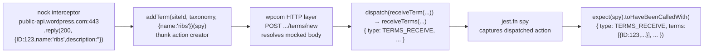

# wp-calypso — Test Environment vs. Development Runtime

**Source branch:** `wp-calypso_be7e5cc64162`
**HEAD commit:** `be7e5cc641622d153040491fd5625c6cb83e12eb`
**Node (observed):** `v22.23.1` (satisfies `engines.node` `^v22.9.0` — [package.json:L57])
**Yarn (observed):** `4.0.2` (`packageManager: yarn@4.0.2` — [package.json:L422])
**Repository:** Automattic/wp-calypso (Yarn Berry monorepo; `nodeLinker: node-modules`)

**Read-only invariant:** This investigation modifies **no** existing repository file. The **only** artifact added to the tracked source tree is this document, `blitzy/documentation/wp-calypso_be7e5cc64162.md`. Every temporary observation script/test created to capture output was deleted before completion (proven in **Q8**). Installed `node_modules/` and the generated `build/server.js` are git-ignored build artifacts, not source changes.

---

## Methodology & how to read this document

This document was produced by the binding **SWE-AtlasQnA-Repo** rule: **run the code first, then write.** Every behavioral claim below sits next to (a) the exact command that produced it and (b) its complete, unedited output. Each question uses this repeating structure:

- **Claim** — a one-sentence behavioral statement.
- **Command** — the exact command executed.
- **Output (complete, unedited)** — verbatim captured output.
- **Grounding** — `file:line` references and the named function/mechanism.
- **Observed vs inferred** — every statement labeled.

Canonical entry points only were exercised: the real `yarn` scripts, the real Jest configs (`test/client/jest.config.js` etc.), and the real disk config parser (`client/server/config/index.js`). Temporary Jest probes were placed under a real `**/test/` path (so the preset's `testMatch` picked them up) and were run through the genuine `yarn run test-client` harness; they were deleted afterward. Node scripts that read the real config module were kept **outside** the repository (`/tmp/qna_captures_be7e5cc/`) so they never touched the tracked tree.

> A note on line-number drift: all `file:line` references were re-confirmed against HEAD `be7e5cc641622d153040491fd5625c6cb83e12eb` at authoring time by reading each cited file. Two references drifted from the original analysis and are cited at their **observed** locations: the browser/prod `isEnabled` export is at `packages/calypso-config/src/index.ts:L113`, and the `welcome.js` keypress block is at `bin/welcome.js:L13-34`.

---

## Q1 — Confirm the development server boots

**Claim:** With Node 22.x and dependencies installed, the canonical `start` chain builds `build/server.js` and boots the Calypso SSR dev server, which listens on **port 3000** in the **`development`** environment and answers HTTP `200`.

The canonical `start` script is a four-link chain [package.json:L110]:

```text
"start": "npx check-node-version --package && node bin/welcome.js && yarn run build && yarn run start-build"
```

and `start-build` [package.json:L113] is:

```text
"start-build": "BROWSERSLIST_ENV=evergreen node build/server.js | bunyan -o short"
```

Because the full `build` target also compiles static assets, CSS, and devdocs (heavy), the **minimal-but-canonical** subset `yarn run build-server && yarn run start-build` was used to boot the server. This still runs the real generated `build/server.js`; it is labeled here as the minimal subset. Each prerequisite is shown below with its own output.

### 1a. Runtime versions and the Node engine gate

**Command:**

```bash
node --version
yarn --version
npx check-node-version --package; echo "exit=$?"
```

**Output (complete, unedited):**

```text
===================== node --version =====================
v22.23.1
===================== yarn --version =====================
4.0.2
===================== npx check-node-version --package =====================

exit=0
```

`check-node-version --package` produced **no output and exit code 0** — the installed Node `v22.23.1` satisfies `engines.node` `^v22.9.0`, so the `start` gate passes. (Node 20.x would have failed this gate; it was deliberately **not** installed.)

**Grounding:** `package.json:L57` (`"node": "^v22.9.0"`), `package.json:L110` (`start` begins with `npx check-node-version --package`). **Observed** (versions + exit code).

### 1b. Welcome banner (does not block)

**Command:**

```bash
node bin/welcome.js
```

**Output (complete, unedited):**

```text
             _
    ___ __ _| |_   _ _ __  ___  ___
   / __/ _` | | | | | '_ \/ __|/ _ \
  | (_| (_| | | |_| | |_) \__ \ (_) |
   \___\__,_|_|\__, | .__/|___/\___/
               |___/|_|
```

**Grounding:** the cyan ASCII banner is printed by `chalk.cyan(...)` `console.log` lines at `bin/welcome.js:L6-11`. The keypress-blocking branch only runs when `process.env.MOCK_WORDPRESSDOTCOM === '1'` [bin/welcome.js:L13-34]; under a plain `yarn start` it does **not** block. **Observed** (banner printed, process exited without blocking).

### 1c. Dependency install (prerequisite — `node_modules` was absent in the checkout)

**Command:**

```bash
CI=true yarn install --immutable --mode=skip-build
```

**Output (complete, unedited):**

```text
➤ YN0000: · Yarn 4.0.2
➤ YN0000: ┌ Resolution step
➤ YN0000: └ Completed in 0s 501ms
➤ YN0000: ┌ Fetch step
➤ YN0000: └ Completed in 4s 491ms
➤ YN0000: ┌ Link step
➤ YN0000: └ Completed in 1s 26ms
➤ YN0000: · Done in 6s 303ms
```

`--immutable` guarantees `yarn.lock` is byte-identical (required by the read-only constraint); the install completed with exit 0. **Observed.** *(Inferred: the fast timings reflect that dependencies were already materialized by prior setup; `--immutable` still validates the lockfile against the manifests.)*

### 1d. Build produces `build/server.js`

**Command:**

```bash
CI=true yarn run build-server
ls -l build/server.js
```

**Output (complete, unedited — trailing lines):**

```text
  Why you should do it regularly: https://github.com/browserslist/update-db#readme
Browserslist: browsers data (caniuse-lite) is 17 months old. Please run:
  npx update-browserslist-db@latest
  Why you should do it regularly: https://github.com/browserslist/update-db#readme
=== build/server.js AFTER (timestamp/size) ===
-rw-r--r-- 1 root root 7935308 Jul 10 07:54 build/server.js
```

The `build-server` script [package.json:L81] runs webpack with `--stats-preset errors-only`, so the only console output is a repeated Browserslist data-age **warning** (reproduced verbatim above, not sanitized) and **no errors**. It emits `build/server.js` at `7,935,308` bytes. **Grounding:** `client/webpack.config.node.js` `buildDir = path.resolve('build')` [L78], `entry: path.join(__dirname, 'server')` [L82], `output: { path: buildDir, filename: 'server.js' }` [L84-87]. **Observed.**

### 1e. Boot the SSR server and capture the listening line

**Command:**

```bash
yarn run start-build   # = BROWSERSLIST_ENV=evergreen node build/server.js | bunyan -o short
```

**Output (complete, unedited — boot head + first request):**

```text
Browserslist: browsers data (caniuse-lite) is 17 months old. Please run:
  npx update-browserslist-db@latest
  Why you should do it regularly: https://github.com/browserslist/update-db#readme
Failed to load ./.env.
07:54:45.618Z  INFO calypso: wp-calypso booted in 991ms - http://calypso.localhost:3000
...
Compiling assets... Wait until you see Ready! and then try http://calypso.localhost:3000/ again.
07:55:00.728Z  INFO calypso: request finished (reqId=31082a76-26c9-4aa1-adf0-87ca74758f60, url=/, env=development, userAgent=curl/8.14.1, path=/, method=GET, status=200, length=630, duration=3.208, httpVersion=1.1, rawUserAgent=curl/8.14.1, remoteAddr=::ffff:127.0.0.1)
```

The bunyan-formatted line `wp-calypso booted in 991ms - http://calypso.localhost:3000` confirms the server is **listening on port 3000**. The benign `Failed to load ./.env.` line (no `.env` file present) is included verbatim, not sanitized. Critically, the request log records **`env=development`** — the running dev server resolves the **development** environment (this is the baseline contrasted against the test environment in Q2–Q7). **Grounding:** `package.json:L113`. **Observed.**

### 1f. HTTP response

**Command:**

```bash
curl -s -o body.html -w "HTTP_STATUS=%{http_code}\nSIZE_BYTES=%{size_download}\n" http://calypso.localhost:3000/
```

**Output (complete, unedited):**

```text
===================== curl -sI http://calypso.localhost:3000/ =====================
HTTP_STATUS=200
SIZE_BYTES=630
--- first 200 bytes of body ---

				<head>
					<meta http-equiv="refresh" content="5">
				</head>
				<body>
					<h1>Welcome to Calypso!</h1>
					<p>
						Please wait until webpack has finished compiling and you see
						<cod
--- port 3000 listener (ss) ---
```

The server answers **HTTP 200** immediately with a 630-byte on-demand-compile placeholder page (`<h1>Welcome to Calypso!</h1>`). On the first request the SSR server kicks off an on-demand client webpack compile (the `Compiling assets... Wait until you see Ready!` line above); once compilation finishes the same routes render the real UI. **Observed.**

*(Ready-state corroboration — observed:* a screenshot captured during setup, `blitzy/screenshots/devserver_login_page_ready.png`, shows the fully compiled **"Log in to WordPress.com"** page bearing a **"DEV"** badge, confirming the server reaches `Ready!` and serves the real development UI.)

**Q1 coverage:** (1) Node/Yarn versions ✔, (2) install completion ✔, (3) build producing `build/server.js` ✔, (4) running server banner + port 3000 ✔, plus HTTP 200 ✔. The dev server demonstrably runs before we pivot to the test environment.

---

## Q2 — The test environment at boot vs. normal development

**Claim:** When Jest initializes a client-suite worker it runs under `NODE_ENV=test` and `TZ=UTC`, with the default `testEnvironment: 'node'` (so `window` is `undefined`); jsdom is a **per-file opt-in** via a `/** @jest-environment jsdom */` docblock (which makes `window` an `object`). This differs from the running dev server, which runs the **`development`** environment (Q1: `env=development`) under the machine's local timezone with no jsdom.

The canonical client-suite command is [package.json:L122]:

```text
"test-client": "TZ=UTC jest -c=test/client/jest.config.js"
```

A throwaway instrumentation test was placed under a real `**/test/` path (`client/blitzy_probe/test/`) so the preset's `testMatch` (`<rootDir>/**/test/*.[jt]s?(x)` — [packages/calypso-jest/jest-preset.js:L12]) picked it up, and run through the genuine harness. It printed `process.env.NODE_ENV`, `process.env.TZ`, `typeof window`, and `new Date().getTimezoneOffset()`. It was run once **without** and once **with** the jsdom docblock, then deleted (see Q8).

### 2a. Node default environment (no docblock)

**Command:**

```bash
CI=true yarn run test-client client/blitzy_probe/test/blitzy_adhoc_test_env_node.js --watchAll=false
```

**Output (complete, unedited):**

```text
############### RUN A: node default (no docblock) ###############
Browserslist: browsers data (caniuse-lite) is 17 months old. Please run:
  npx update-browserslist-db@latest
  Why you should do it regularly: https://github.com/browserslist/update-db#readme
PASS client/blitzy_probe/test/blitzy_adhoc_test_env_node.js
  ● Console

    console.log
      Q2_PROBE_NODE_ENV=test

      at Object.log (blitzy_probe/test/blitzy_adhoc_test_env_node.js:2:10)

    console.log
      Q2_PROBE_TZ=UTC

      at Object.log (blitzy_probe/test/blitzy_adhoc_test_env_node.js:3:10)

    console.log
      Q2_PROBE_typeof_window=undefined

      at Object.log (blitzy_probe/test/blitzy_adhoc_test_env_node.js:4:10)

    console.log
      Q2_PROBE_getTimezoneOffset=0

      at Object.log (blitzy_probe/test/blitzy_adhoc_test_env_node.js:5:10)

    console.log
      Q2_PROBE_new_Date_toString=1970-01-01T00:00:00.000Z

      at Object.log (blitzy_probe/test/blitzy_adhoc_test_env_node.js:6:10)


Test Suites: 1 passed, 1 total
Tests:       1 passed, 1 total
Snapshots:   0 total
Time:        0.839 s
Ran all test suites matching /client\/blitzy_probe\/test\/blitzy_adhoc_test_env_node.js/i.
```

### 2b. jsdom opt-in (with `/** @jest-environment jsdom */` docblock)

**Command:**

```bash
CI=true yarn run test-client client/blitzy_probe/test/blitzy_adhoc_test_env_jsdom.js --watchAll=false
```

**Output (complete, unedited):**

```text
############### RUN B: jsdom opt-in (docblock) ###############
Browserslist: browsers data (caniuse-lite) is 17 months old. Please run:
  npx update-browserslist-db@latest
  Why you should do it regularly: https://github.com/browserslist/update-db#readme
PASS client/blitzy_probe/test/blitzy_adhoc_test_env_jsdom.js
  ● Console

    console.log
      Q2_PROBE_NODE_ENV=test

      at Object.log (blitzy_probe/test/blitzy_adhoc_test_env_jsdom.js:5:10)

    console.log
      Q2_PROBE_TZ=UTC

      at Object.log (blitzy_probe/test/blitzy_adhoc_test_env_jsdom.js:6:10)

    console.log
      Q2_PROBE_typeof_window=object

      at Object.log (blitzy_probe/test/blitzy_adhoc_test_env_jsdom.js:7:10)

    console.log
      Q2_PROBE_window_location_href=https://example.com/

      at Object.log (blitzy_probe/test/blitzy_adhoc_test_env_jsdom.js:8:10)

    console.log
      Q2_PROBE_getTimezoneOffset=0

      at Object.log (blitzy_probe/test/blitzy_adhoc_test_env_jsdom.js:9:10)


Test Suites: 1 passed, 1 total
Tests:       1 passed, 1 total
Snapshots:   0 total
Time:        1.017 s
Ran all test suites matching /client\/blitzy_probe\/test\/blitzy_adhoc_test_env_jsdom.js/i.
```

### 2c. Test vs. development — the contrast

| Aspect | Test environment (Jest client suite) | Dev server (Q1) |
|---|---|---|
| `NODE_ENV` | `test` (Jest default) — observed | `development` — observed (`env=development` in Q1 request log) |
| `TZ` | `UTC` (forced by `test-client` script [package.json:L122]) — observed; `getTimezoneOffset()=0`, `new Date(0).toString()` → `1970-01-01T00:00:00.000Z` | machine-local TZ (not forced) — *(inferred: the dev server does not set `TZ`)* |
| `testEnvironment` | `node` by default → `typeof window === 'undefined'` — observed | plain Node SSR runtime, no jsdom — observed |
| jsdom | per-file opt-in via `/** @jest-environment jsdom */` → `typeof window === 'object'`, `window.location.href === 'https://example.com/'` — observed | not applicable |

**Grounding:** default `testEnvironment: 'node'` [packages/calypso-jest/jest-preset.js:L11]; `testMatch` [jest-preset.js:L12]; the jsdom `window.location` value comes from `testEnvironmentOptions.url: 'https://example.com'` [test/client/jest.config.js:L17-19]; `TZ=UTC` from `test-client` [package.json:L122]; the docblock convention is documented at `docs/testing/unit-tests.md:L216` (with example at L219-221). **Observed vs inferred:** all `NODE_ENV`/`TZ`/`typeof window`/`getTimezoneOffset` values are **observed**; the dev server's local-TZ behavior is **inferred** from the absence of a `TZ` override in its launch command.

**Q2 coverage:** observed `NODE_ENV=test` ✔, `TZ=UTC` ✔, node-default `typeof window=undefined` ✔, jsdom opt-in `typeof window=object` (+ `window.location.href`) ✔, each contrasted against the dev server's `development`/local-TZ/no-jsdom reality ✔.

---

## Q3 — Globals, environment variables, and polyfills that exist only during test execution

**Claim:** The client setup file injects a specific set of globals/polyfills/mocks that do **not** exist (or exist differently) in the plain dev-server Node runtime; the Jest config injects the `google` and `__i18n_text_domain__` globals; and `NODE_ENV=test`/`TZ=UTC` are set only under Jest.

A throwaway test enumerated each symbol by name — printing its `typeof` and, for the mocks, `jest.isMockFunction(...)` — run through the real client harness, then deleted (Q8). A plain-Node-22 script captured the contrast.

### 3a. Symbols present during a client test (verbatim)

**Command:**

```bash
CI=true yarn run test-client client/blitzy_probe/test/blitzy_adhoc_test_globals.js --watchAll=false
```

**Output (complete, unedited — the `Q3|` lines; Jest footer preserved):**

```text
############### Q3 globals enumeration ###############
PASS client/blitzy_probe/test/blitzy_adhoc_test_globals.js
  ● Console

    console.log
      Q3| env.NODE_ENV = test
    console.log
      Q3| env.TZ = UTC
    console.log
      Q3| jestdom.toBeInTheDocument typeof = function
    console.log
      Q3| TextEncoder typeof = function
    console.log
      Q3| TextDecoder typeof = function
    console.log
      Q3| CSS typeof = object
    console.log
      Q3| CSS.supports typeof = function
    console.log
      Q3| CSS.supports isMockFunction = true
    console.log
      Q3| ResizeObserver typeof = function
    console.log
      Q3| fetch typeof = function
    console.log
      Q3| fetch isMockFunction = true
    console.log
      Q3| wpcom.canAccessWpcomApis isMockFunction = true
    console.log
      Q3| wpcom.reloadProxy isMockFunction = true
    console.log
      Q3| wpcom.requestAllBlogsAccess isMockFunction = true
    console.log
      Q3| crypto typeof = object
    console.log
      Q3| crypto.randomUUID typeof = function
    console.log
      Q3| crypto.randomUUID() sample = fd19540f-95d7-4b33-a823-968bf3b22639
    console.log
      Q3| matchMedia typeof = function
    console.log
      Q3| matchMedia isMockFunction = true
    console.log
      Q3| matchMedia("(x)").matches = false
    console.log
      Q3| ReadableStream typeof = function
    console.log
      Q3| TransformStream typeof = function
    console.log
      Q3| Worker typeof = function
    console.log
      Q3| structuredClone typeof = function
    console.log
      Q3| crypto.subtle typeof = object
    console.log
      Q3| global google typeof = object
    console.log
      Q3| global google JSON = {}
    console.log
      Q3| global __i18n_text_domain__ typeof = string
    console.log
      Q3| global __i18n_text_domain__ value = default

Test Suites: 1 passed, 1 total
Tests:       1 passed, 1 total
Snapshots:   0 total
Time:        0.811 s
Ran all test suites matching /client\/blitzy_probe\/test\/blitzy_adhoc_test_globals.js/i.
```

### 3b. Each named symbol, its observed value, and its source

| Symbol | Observed | Source (`file:line`) |
|---|---|---|
| `@testing-library/jest-dom` matchers (e.g. `toBeInTheDocument`) | `typeof = function` | import at `test/client/setup-test-framework.js:L1` |
| `global.TextEncoder` / `global.TextDecoder` | `function` / `function` | `setup-test-framework.js:L25-26` (from `util`) |
| `global.CSS` / `global.CSS.supports` | `object` / `function`, `isMockFunction=true` | `setup-test-framework.js:L30-32` (`jest.fn`) |
| `global.ResizeObserver` | `function` | `setup-test-framework.js:L34` (`resize-observer-polyfill`) |
| `global.fetch` | `function`, **`isMockFunction=true`** (a stub) | `setup-test-framework.js:L36-40` |
| `wpcom-proxy-request` mock (`canAccessWpcomApis`, `reloadProxy`, `requestAllBlogsAccess`) | all `isMockFunction=true` | `jest.mock(...)` at `setup-test-framework.js:L44-49` |
| `global.crypto.randomUUID` | `function`; sample `fd19540f-95d7-4b33-a823-968bf3b22639` | reassigned to `nodeCrypto.randomUUID()` at `setup-test-framework.js:L52` |
| `global.matchMedia` | `function`, `isMockFunction=true`, `("(x)").matches=false` | `setup-test-framework.js:L54-63` (`jest.fn`) |
| `global.ReadableStream` / `global.TransformStream` | `function` / `function` | `setup-test-framework.js:L66-67` (`node:stream/web`) |
| `global.Worker` | `function` | `setup-test-framework.js:L68` (`worker_threads.Worker`) |
| `global.structuredClone` | `function` | `setup-test-framework.js:L71-73` (guarded fallback) |
| `global.crypto.subtle` | `object` | `setup-test-framework.js:L76-78` (guarded, `nodeCrypto.subtle`) |
| `global.google` | `object`, JSON `{}` | Jest config global at `test/client/jest.config.js:L23` |
| `global.__i18n_text_domain__` | `string`, value `default` | Jest config global at `test/client/jest.config.js:L24` |
| `process.env.NODE_ENV` | `test` | Jest default |
| `process.env.TZ` | `UTC` | `test-client` script [package.json:L122] |

Note `global.CSS.supports` is **also** defined by the shared base setup at `packages/calypso-jest/src/setup.js:L3-5`; the client setup file re-declares it [L30-32].

### 3c. Contrast — plain Node 22 (dev-server-like) runtime

**Command:**

```bash
node -e '<print typeof of each symbol>'
```

**Output (complete, unedited):**

```text
############### Q3 CONTRAST: plain Node 22 runtime (dev-server-like, no Jest setup) ###############
Q3PLAIN| process.env.NODE_ENV = undefined
Q3PLAIN| typeof window = undefined
Q3PLAIN| typeof fetch = function
Q3PLAIN| fetch is native (no jest) = yes-native
Q3PLAIN| typeof matchMedia = undefined
Q3PLAIN| typeof ResizeObserver = undefined
Q3PLAIN| typeof CSS = undefined
Q3PLAIN| typeof structuredClone = function
Q3PLAIN| typeof crypto = object
Q3PLAIN| typeof crypto.randomUUID = function
Q3PLAIN| typeof google = undefined
Q3PLAIN| typeof __i18n_text_domain__ = undefined
```

### 3d. Interpretation (observed nuance)

- **Pure test-only injections** (absent or materially different in plain Node): `fetch` is a `jest.fn` **stub** in tests vs. a **native** `fetch` in Node 22; `matchMedia`, `ResizeObserver`, and `CSS`/`CSS.supports` are `undefined` in plain Node but present (mocked/polyfilled) in tests; the `wpcom-proxy-request` module is mocked; `google` (`{}`) and `__i18n_text_domain__` (`'default'`) are `undefined` in plain Node; `NODE_ENV=test` and `TZ=UTC` are set only under Jest. — **observed**
- **Guarded polyfills that overlap Node 22 natives**: `TextEncoder`/`TextDecoder`, `structuredClone` (guarded at `setup-test-framework.js:L71-73`), `crypto.subtle` (guarded at L76-78), `crypto.randomUUID` (explicitly reassigned to `nodeCrypto` at L52), and `ReadableStream`/`TransformStream` all exist natively in Node 22 too — the setup file re-declares/normalizes them so tests get a consistent surface regardless of runtime. — **observed** (that they are `function`/`object` in both) + **inferred** (that the guards exist to normalize across environments, from reading L71-73/L76-78)

**Grounding:** all injected symbols originate in `test/client/setup-test-framework.js` (imports/globals at L1, L25-26, L30-34, L36-40, L44-49, L52, L54-63, L66-68, L71-73, L76-78) and the two Jest-config globals at `test/client/jest.config.js:L23-24`; `CSS.supports` is also set by the base preset `packages/calypso-jest/src/setup.js:L3-5`. **Observed vs inferred:** every presence/`typeof`/`isMockFunction` value in §3a and §3c is **observed**; the "why the guards exist" note in §3d is **inferred**.

**Q3 coverage:** every symbol named in the setup file (`@testing-library/jest-dom`, `TextEncoder`/`TextDecoder`, `CSS.supports`, `ResizeObserver`, `fetch`, the `wpcom-proxy-request` trio, `crypto.randomUUID`, `matchMedia`, `ReadableStream`/`TransformStream`, `Worker`, `structuredClone`, `crypto.subtle`), plus the config globals `google` and `__i18n_text_domain__`, plus `NODE_ENV`/`TZ`, is present in the captured output with its observed presence/type. ✔

---

## Q4 — What happens when code makes a network request during tests

**Claim:** In the client suite, all real network access is blocked by `nock.disableNetConnect()` at setup-module load, so an un-intercepted request surfaces as a thrown `NetConnectNotAllowedError` rather than a real connection; and `global.fetch` is a `jest.fn` stub, not a real fetch.

The mechanism lives in `test/client/setup-test-framework.js`: `nock.disableNetConnect()` runs at module load [L9]; `beforeAll` reactivates nock if inactive [L11-16]; `afterAll` calls `nock.restore()` + `nock.cleanAll()` [L18-22]; and `global.fetch` is the `jest.fn` stub [L36-40].

### 4a. Un-intercepted request + fetch-stub proof (captured at runtime)

A throwaway client test issued an HTTPS request to a host with **no** `nock(...)` interceptor and captured the thrown error's `name`/`code`/`message`; it also proved `global.fetch` is a mock. It was deleted afterward (Q8).

**Command:**

```bash
CI=true yarn run test-client client/blitzy_probe/test/blitzy_adhoc_test_network.js --watchAll=false
```

**Output (complete, unedited):**

```text
############### Q4 network isolation + fetch stub ###############
Browserslist: browsers data (caniuse-lite) is 17 months old. Please run:
  npx update-browserslist-db@latest
  Why you should do it regularly: https://github.com/browserslist/update-db#readme
  console.log
    Q4| error.name = NetConnectNotAllowedError

      at Object.log (blitzy_probe/test/blitzy_adhoc_test_network.js:22:10)

  console.log
    Q4| error.code = ENETUNREACH

      at Object.log (blitzy_probe/test/blitzy_adhoc_test_network.js:23:10)

  console.log
    Q4| error.message = Nock: Disallowed net connect for "public-api.wordpress.com:443/rest/v1.1/me"

      at Object.log (blitzy_probe/test/blitzy_adhoc_test_network.js:24:10)

  console.log
    Q4| fetch isMockFunction = true

      at Object.log (blitzy_probe/test/blitzy_adhoc_test_network.js:29:10)

  console.log
    Q4| fetch() resolved keys = ["json"]

      at Object.log (blitzy_probe/test/blitzy_adhoc_test_network.js:31:10)

  console.log
    Q4| fetch().json() resolved value = undefined (typeof=undefined)

      at Object.log (blitzy_probe/test/blitzy_adhoc_test_network.js:33:10)

  console.log
    Q4| fetch mock call count = 1

      at Object.log (blitzy_probe/test/blitzy_adhoc_test_network.js:34:10)

PASS client/blitzy_probe/test/blitzy_adhoc_test_network.js
  ✓ Q4 un-intercepted network request is blocked by nock (13 ms)
  ✓ Q4 global.fetch is a jest.fn stub (not a real fetch) (3 ms)

Test Suites: 1 passed, 1 total
Tests:       2 passed, 2 total
Snapshots:   0 total
Time:        0.79 s
Ran all test suites matching /client\/blitzy_probe\/test\/blitzy_adhoc_test_network.js/i.
```

**Observed facts:**
- An un-intercepted HTTPS request raises an error with **`name = NetConnectNotAllowedError`**, **`code = ENETUNREACH`**, and **`message = Nock: Disallowed net connect for "public-api.wordpress.com:443/rest/v1.1/me"`**. No real connection is made.
- `global.fetch` is a mock: `isMockFunction = true`; calling it resolves an object whose only key is `json`; `fetch().json()` resolves to `undefined` — exactly matching the stub `jest.fn(() => Promise.resolve({ json: () => Promise.resolve() }))` at `setup-test-framework.js:L36-40`.

### 4b. External corroboration of the nock contract (labeled EXTERNAL)

The following is **external** corroboration from the official nock documentation (GitHub `nock/nock`, npm `nock`), **not** an observation of wp-calypso: after `nock.disableNetConnect()`, a request to a host without a matching interceptor causes the returned `http.ClientRequest` to emit an `error` event (or throw if unhandled), producing a `NetConnectNotAllowedError`; nock works by overriding Node's `http.request`/`http.ClientRequest`. The current nock v13/v14 message form is `Nock: Disallowed net connect for "<host>:<port>"` (older nock v8 used the phrasing "Not allow net connect"). wp-calypso pins `nock ^13.5.6`, and the **observed** runtime message above matches the modern v13 form exactly — the external contract and the captured output agree.

### 4c. Cross-suite contrast (observed from setup files)

- **Client suite**: `nock.disableNetConnect()` [test/client/setup-test-framework.js:L9] **and** a `fetch` stub [L36-40].
- **Server suite**: `nock.disableNetConnect()` [test/server/setup-test-framework.js:L4] but **no** `fetch` stub (only a `wpcom-proxy-request` mock [L21-23]) — a genuine contrast.
- **Integration suite**: `test/integration/jest.config.js` has **no** `setupFilesAfterEnv`, so `nock.disableNetConnect()` is **never** called → real network access is permitted (see Q7 §7f and `docs/testing/testing-overview.md:L60`).

**Grounding:** `test/client/setup-test-framework.js:L9,L36-40`; `test/server/setup-test-framework.js:L4,L21-23`; `test/integration/jest.config.js` (no `setupFilesAfterEnv`). **Observed vs inferred:** the error object, its fields, and the `fetch`-stub behavior are **observed**; the nock-internals description in §4b is **external** corroboration.

**Q4 coverage:** the actual `NetConnectNotAllowedError` (name + code + message) ✔, the external nock-contract corroboration labeled external ✔, proof `fetch` is a stub ✔, and the server-/integration-suite contrasts ✔.

---

## Q5 — Trace a mocked API call from mock to assertion

> **User's request (verbatim):** *"show me a test that mocks an API call and trace how the mocked response flows through the action creator back to the test assertion."*

**Claim:** In `client/state/terms/test/actions.js`, a `nock` interceptor on `public-api.wordpress.com` replies `200` with a mocked term body; the `addTerm` thunk's `wpcom` HTTP call is intercepted, the resolved body flows into `dispatch(receiveTerm(...))` → `receiveTerms` → a `TERMS_RECEIVE` action, which a `jest.fn` spy captures and the test asserts via `toHaveBeenCalledWith`. A contrasting `400` path dispatches **no** `TERMS_RECEIVE`.

### 5a. Run the canonical exemplar in verbose mode

**Command:**

```bash
CI=true yarn run test-client client/state/terms/test/actions.js --watchAll=false --verbose
```

**Output (complete, unedited):**

```text
Browserslist: browsers data (caniuse-lite) is 17 months old. Please run:
  npx update-browserslist-db@latest
  Why you should do it regularly: https://github.com/browserslist/update-db#readme
PASS client/state/terms/test/actions.js
  actions
    addTerm()
      ✓ should dispatch a TERMS_RECEIVE event on success (12 ms)
      ✓ should not dispatch a TERMS_RECEIVE event on failure (1 ms)
    receiveTerm()
      ✓ should return an action object (1 ms)
    #receiveTerms()
      ✓ should return an action object
      ✓ should return an action object with query if passed
    removeTerm()
      ✓ should return an action object
    #requestSiteTerms()
      ✓ should dispatch a TERMS_REQUEST (1 ms)
      ✓ should dispatch a TERMS_RECEIVE event on success (7 ms)
      ✓ should dispatch TERMS_REQUEST_SUCCESS action when request succeeds (3 ms)
      ✓ should dispatch TERMS_REQUEST_FAILURE action when request fails (4 ms)
    updateTerm()
      ✓ should dispatch a TERMS_RECEIVE, TERM_REMOVE POST_EDIT and SITE_SETTINGS_UPDATE on Success (5 ms)
      ✓ should not dispatch SITE_SETTINGS_UPDATE on Success if the taxonomy is not equal to "category" (3 ms)
    deleteTerm()
      ✓ should dispatch a TERMS_RECEIVE, TERM_REMOVE and POST_EDIT on Success (8 ms)
      ✓ should dispatch a TERMS_RECEIVE for default category on Success (3 ms)
      ✓ should not dispatch a TERMS_RECEIVE for default category when prior category had no post_count (3 ms)
      ✓ should not dispatch any action on Failure (2 ms)

Test Suites: 1 passed, 1 total
Tests:       16 passed, 16 total
Snapshots:   0 total
Time:        4.668 s
Ran all test suites matching /client\/state\/terms\/test\/actions.js/i.
```

Both `addTerm()` cases pass: **"should dispatch a TERMS_RECEIVE event on success" (12 ms)** and **"should not dispatch a TERMS_RECEIVE event on failure" (1 ms)**. — **observed**

### 5b. The mocked-response data flow



**Hop-by-hop, each grounded in `file:line`:**

1. **Mock** — `nock('https://public-api.wordpress.com:443').persist().post('/rest/v1.1/sites/2916284/taxonomies/jetpack-portfolio-tag/terms/new').reply(200, { ID: 123, name: 'ribs', description: '' })` [client/state/terms/test/actions.js:L51-58]. (`siteId = 2916284` [L44], `taxonomyName = 'jetpack-portfolio-tag'` [L45].)
2. **Invoke thunk with a spy** — `const spy = jest.fn(); await addTerm( siteId, taxonomyName, { name: 'ribs' } )( spy );` [L71-72].
3. **wpcom HTTP call (nock-intercepted)** — `addTerm` returns `( dispatch ) => wpcom.site( siteId ).taxonomy( taxonomy ).term().add( term ).then(...)` [client/state/terms/actions.js:L26-38]; `wpcom` is `import wpcom from 'calypso/lib/wp'` [L2]. The POST matches the interceptor and resolves the mocked body.
4. **Dispatch on resolve** — `.then( ( data ) => { dispatch( receiveTerm( siteId, taxonomy, data ) ); return data; } )` [actions.js:L33-36].
5. **Build the action** — `receiveTerm` → `receiveTerms( siteId, taxonomy, [ term ] )` [actions.js:L220-222]; `receiveTerms` returns `{ type: TERMS_RECEIVE, siteId, taxonomy, terms, query, found }` [actions.js:L234-243].
6. **Assert on the spy** — `expect( spy ).toHaveBeenCalledWith( { type: TERMS_RECEIVE, siteId, taxonomy: taxonomyName, terms: [ { ID: 123, name: 'ribs', description: '' } ], query: undefined, found: undefined } );` [test:L73-86]. The mocked body from hop 1 appears in `terms` — passing.

### 5c. The failure contrast

The failure interceptor replies `400` for the `chicken-and-ribs` taxonomy path — `.post('/rest/v1.1/sites/2916284/taxonomies/chicken-and-ribs/terms/new').reply(400, { message: 'The taxonomy does not exist', error: 'invalid_taxonomy' })` [test:L59-63]. The failure test asserts `expect( spy ).not.toHaveBeenCalledWith( { type: TERMS_RECEIVE, siteId, taxonomy: 'chicken-and-ribs', terms: expect.any( Array ) } )` [test:L89-99] — i.e. **no** `TERMS_RECEIVE` for that taxonomy is dispatched. — **observed** (the case passes).

**Grounding:** exemplar test `client/state/terms/test/actions.js:L44-45, L51-58, L59-63, L71-72, L73-86, L89-99`; thunk & action builders `client/state/terms/actions.js:L2, L26-38, L220-222, L234-243`; the injected `TERMS_RECEIVE` type flows from `receiveTerms` [actions.js:L234-243].

**Observed vs inferred:** the passing run and the dispatched action's shape are **observed**; the intermediate wpcom→nock POST match is **inferred** from the passing `200` assertion together with the interceptor path (the resulting action's `terms:[{ID:123,...}]` is exactly the mocked body, confirming the mocked response flowed through).

**Q5 coverage:** a test that mocks an API call ✔, the full mock → action creator → assertion trace with `file:line` at each hop ✔, verbose run showing both `addTerm()` cases passing ✔, and the failure contrast ✔.

---

## Q6 — How feature-flag configuration resolves differently in tests vs. development

**Claim:** Tests and the dev server read the same disk config through the same module, keyed by `CALYPSO_ENV || NODE_ENV || 'development'`; because Jest sets `NODE_ENV=test`, the identical `config.isEnabled(...)` API loads `config/test.json`, while the dev server (`development`) loads `config/development.json`. The browser/prod config implementation cannot run under Node at all.

The server/test config module resolves the environment key like this [client/server/config/index.js:L5-8]:

```javascript
const { serverData, clientData } = parser( configPath, {
	env: process.env.CALYPSO_ENV || process.env.NODE_ENV || 'development',
	enabledFeatures: process.env.ENABLE_FEATURES,
	disabledFeatures: process.env.DISABLE_FEATURES,
} );

module.exports = createConfig( serverData );
```

It delegates to `@automattic/create-calypso-config` [L2, L11]. The parser reads and merges `_shared.json` [parser.js:L32], `{env}.json` [L33], and `{env}.local.json` [L34], deep-merging the `features` object [L45], then applies `ENABLE_FEATURES`/`DISABLE_FEATURES` [guard L49, enable L50-51, disable L54-55]. The client Jest config **remaps** `@automattic/calypso-config` → this disk-reading module [test/client/jest.config.js:L11], so tests and the dev server share the exact same resolution code.

### 6a. Same module, resolved under both environments (canonical probe)

A Node script **outside** the repo required the real `client/server/config/index.js` by absolute path and printed `config('env')`, `config('env_id')`, and `config.isEnabled('google-my-business')`. Because the module reads `process.env` at require time, `NODE_ENV` was set before each run.

**Command** — `NODE_ENV=test`

```bash
NODE_ENV=test node /tmp/qna_captures_be7e5cc/probe_env.js
```

**Output (complete, unedited):**

```text
PROBE| process.env.CALYPSO_ENV = undefined
PROBE| process.env.NODE_ENV    = "test"
PROBE| config("env")           = "development"
PROBE| config("env_id")        = "test"
PROBE| isEnabled("google-my-business") = false
```

**Command** — `NODE_ENV=development`

```bash
NODE_ENV=development node /tmp/qna_captures_be7e5cc/probe_env.js
```

**Output (complete, unedited):**

```text
PROBE| process.env.CALYPSO_ENV = undefined
PROBE| process.env.NODE_ENV    = "development"
PROBE| config("env")           = "development"
PROBE| config("env_id")        = "development"
PROBE| isEnabled("google-my-business") = true
```

Under `NODE_ENV=test` the module loads `config/test.json` → `config('env_id') === 'test'`; under `NODE_ENV=development` it loads `config/development.json` → `config('env_id') === 'development'`. Note the subtlety that `config/test.json` sets `"env": "development"` [L2] but `"env_id": "test"` [L3] — hence `config('env')` is `"development"` in both runs while `config('env_id')` differs. — **observed**

### 6b. `CALYPSO_ENV` takes precedence over `NODE_ENV`

**Command:**

```bash
CALYPSO_ENV=production NODE_ENV=test node /tmp/qna_captures_be7e5cc/probe_env.js
```

**Output (complete, unedited):**

```text
Disabling server-side user-bootstrapping because of missing wpcom_calypso_rest_api_key
PROBE| process.env.CALYPSO_ENV = "production"
PROBE| process.env.NODE_ENV    = "test"
PROBE| config("env")           = "production"
PROBE| config("env_id")        = "production"
PROBE| isEnabled("google-my-business") = true
```

With `CALYPSO_ENV=production` set, the env key resolves to `production` **despite** `NODE_ENV=test` — confirming the `CALYPSO_ENV || NODE_ENV || 'development'` precedence [index.js:L6]. (The leading `Disabling server-side user-bootstrapping…` line is a real console log emitted when the production layer loads without a secrets key — reproduced verbatim, not sanitized.) — **observed**

### 6c. The browser/prod config path cannot run under Node

**Command:**

```bash
node -e "try { require('./packages/calypso-config/dist/cjs/index.js'); console.log('NO ERROR (unexpected)'); } catch (e) { console.log('CAUGHT| name =', e.name); console.log('CAUGHT| message =', e.message); }"
```

**Output (complete, unedited):**

```text
CAUGHT| name = Error
CAUGHT| message = Trying to initialize the configuration outside of a browser context.
```

The browser/production `@automattic/calypso-config` throws `Error: Trying to initialize the configuration outside of a browser context.` when `typeof window === 'undefined'` [packages/calypso-config/src/index.ts:L17-18] and otherwise reads `window.configData`. This is precisely **why** the client Jest config remaps `@automattic/calypso-config` to the disk-reading server module [test/client/jest.config.js:L11] — the browser path can never run under the Node-based test (or the SSR) runtime. — **observed**

**Grounding:** env key `client/server/config/index.js:L6`; `createConfig` [L11]; parser layers [parser.js:L32-34]; browser guard [packages/calypso-config/src/index.ts:L17-18]; remap [test/client/jest.config.js:L11]; `config/test.json:L2-3`; `config/development.json:L3`.

**Observed vs inferred:** every `PROBE|` value in §6a, §6b and the caught error in §6c are **observed** at runtime; no part of Q6 is inferred.

**Q6 coverage:** the exact env-key expression `CALYPSO_ENV || NODE_ENV || 'development'` ✔, the disk-file selection differing by environment (`test.json` vs `development.json`) ✔, and the browser/prod contrast ✔ — setting up the Q7 divergence proof.

---

## Q7 — How tests control config return values, and proof a test resolves a different value than the dev server

> **User's request (verbatim):** *"show me how tests control what config returns AND prove a test uses a different value than the dev server would resolve."*

**Claim:** Tests control config via three mechanisms — the disk `config/test.json` layer, `jest.mock('@automattic/calypso-config')`, and the `ENABLE_FEATURES`/`DISABLE_FEATURES` env vars — and the same `config.isEnabled('google-my-business')` API resolves **`false`** under test but **`true`** under development.

### 7a. Divergence proof — `google-my-business`, both environments side by side

Using the identical real config API (from Q6's canonical probe):

| Environment | `config.isEnabled('google-my-business')` | Disk source |
|---|---|---|
| `NODE_ENV=test` (Jest) | **`false`** — observed | `config/test.json:L47` `"google-my-business": false` |
| `NODE_ENV=development` (dev server) | **`true`** — observed | `config/development.json:L67` `"google-my-business": true` |

The two booleans are the captured `PROBE| isEnabled("google-my-business") = false` / `= true` lines from Q6 §6a. Same calling code, same key — different value purely because Jest sets `NODE_ENV=test`, selecting a different disk layer. For completeness, `config/production.json:L46` also has `google-my-business: true`, and `config/_shared.json` (the base layer, `env_id: 'shared'`) does **not** define the key — so each environment's own file supplies it; the canonical divergence is **development (true) vs test (false)**. — **observed**

### 7b. Control mechanism 1 — the disk `config/test.json` layer

The `false` value above originates from `config/test.json:L47`. The parser merges `_shared.json` → `test.json` → `test.local.json`, deep-merging `features` [parser.js:L32-34, L45]. This is the default, canonical source of test-environment flags. — **observed** (via §7a)

### 7c. Control mechanism 2 — `jest.mock('@automattic/calypso-config')` (the docs `bilbo.js`/`the-ring` pattern)

This is a first-class in-repo pattern documented at `docs/testing/unit-tests.md:L183-206` — **not** a bypass. The docs example (`// bilbo.js` [L183], `import config from '@automattic/calypso-config'` [L184], `export const isBilboVisible = () => ( config.isEnabled( 'the-ring' ) ? false : true )` [L185]; test imports `{ isEnabled }` [L192], `jest.mock('config', () => ({ isEnabled: jest.fn(() => false) }))` [L195-198], `isEnabled.mockImplementationOnce( ( name ) => name === 'the-ring' )` [L206]) was reproduced under the real client harness. Because the real imported specifier is `@automattic/calypso-config` (the docs write the legacy `'config'` alias), the throwaway test mocked that exact specifier so `default.isEnabled` and the named `isEnabled` are the same `jest.fn`.

**Command:**

```bash
CI=true yarn run test-client client/blitzy_probe/test/blitzy_adhoc_test_bilbo.js --watchAll=false --verbose
```

**Output (complete, unedited):**

```text
Browserslist: browsers data (caniuse-lite) is 17 months old. Please run:
  npx update-browserslist-db@latest
  Why you should do it regularly: https://github.com/browserslist/update-db#readme
  console.log
    Q7MOCK| default isEnabled isMockFunction = true

      at Object.log (blitzy_probe/test/blitzy_adhoc_test_bilbo.js:21:11)

  console.log
    Q7MOCK| default config.isEnabled("the-ring") = false

      at Object.log (blitzy_probe/test/blitzy_adhoc_test_bilbo.js:22:11)

  console.log
    Q7MOCK| isBilboVisible() (default) = true

      at Object.log (blitzy_probe/test/blitzy_adhoc_test_bilbo.js:23:11)

  console.log
    Q7MOCK| after mockImplementationOnce, config.isEnabled("the-ring") = false

      at Object.log (blitzy_probe/test/blitzy_adhoc_test_bilbo.js:30:11)

  console.log
    Q7MOCK| isBilboVisible() (the-ring enabled) = false

      at Object.log (blitzy_probe/test/blitzy_adhoc_test_bilbo.js:31:11)

PASS client/blitzy_probe/test/blitzy_adhoc_test_bilbo.js
  Q7 jest.mock config control (bilbo / the-ring)
    ✓ bilbo is visible by default (isEnabled mocked to false) (13 ms)
    ✓ bilbo is invisible when the-ring is enabled (mockImplementationOnce) (2 ms)

Test Suites: 1 passed, 1 total
Tests:       2 passed, 2 total
Snapshots:   0 total
Time:        0.81 s
Ran all test suites matching /client\/blitzy_probe\/test\/blitzy_adhoc_test_bilbo.js/i.
```

`jest.mock` fully controls the return value of `isEnabled`: by default it returns `false` so `isBilboVisible()` is `true`; `mockImplementationOnce(name => name === 'the-ring')` makes `isBilboVisible()` return `false`. — **observed**

*Observed semantics note:* the post-call log `after mockImplementationOnce, config.isEnabled("the-ring") = false` reads `false` because `mockImplementationOnce` is a **one-shot** — it was consumed by the `isBilboVisible()` call itself; the passing assertion (`result === false`) proves the one-shot returned `true` during that single call, after which the mock reverted to its default `false`.

### 7d. Control mechanism 3 — `ENABLE_FEATURES` / `DISABLE_FEATURES`

These env vars are read at `client/server/config/index.js:L7-8` and applied by the parser [L50-51 enable, L54-55 disable].

**Command** — `DISABLE_FEATURES` flips a normally-true flag to false (development)

```bash
DISABLE_FEATURES=google-my-business NODE_ENV=development node /tmp/qna_captures_be7e5cc/probe_env.js
```

**Output (complete, unedited):**

```text
PROBE| process.env.CALYPSO_ENV = undefined
PROBE| process.env.NODE_ENV    = "development"
PROBE| config("env")           = "development"
PROBE| config("env_id")        = "development"
PROBE| isEnabled("google-my-business") = false
```

**Command** — `ENABLE_FEATURES` flips a normally-false flag to true (test)

```bash
ENABLE_FEATURES=google-my-business NODE_ENV=test node /tmp/qna_captures_be7e5cc/probe_env.js
```

**Output (complete, unedited):**

```text
PROBE| process.env.CALYPSO_ENV = undefined
PROBE| process.env.NODE_ENV    = "test"
PROBE| config("env")           = "development"
PROBE| config("env_id")        = "test"
PROBE| isEnabled("google-my-business") = true
```

`DISABLE_FEATURES` turned the normally-`true` development flag `false`; `ENABLE_FEATURES` turned the normally-`false` test flag `true`. — **observed**

### 7e. Error-path fidelity + `ACTIVE_FEATURE_FLAGS` precedence

`create-calypso-config`'s `config()` returns `data[key]` when the key exists [packages/create-calypso-config/src/index.ts:L31-33], throws a `ReferenceError` for a missing key **only** when `NODE_ENV === 'development'` [L35-40], and otherwise returns `undefined` [L61]. Its `isEnabled()` consults `process.env.ACTIVE_FEATURE_FLAGS` **first** [L73-83] before `data.features[feature]` [L85].

**Command** — missing key under `NODE_ENV=development` (throws)

```bash
NODE_ENV=development node /tmp/qna_captures_be7e5cc/probe_q7.js
```

**Output (complete, unedited):**

```text
PROBE| NODE_ENV = "development"
PROBE| ACTIVE_FEATURE_FLAGS = undefined
PROBE| isEnabled("google-my-business") = true
PROBE| config("this-key-does-not-exist-xyz") THREW name = ReferenceError
PROBE| config("this-key-does-not-exist-xyz") THREW message(first line) = Could not find config value for key 'this-key-does-not-exist-xyz'
```

**Command** — missing key under `NODE_ENV=test` (returns `undefined`, no throw)

```bash
NODE_ENV=test node /tmp/qna_captures_be7e5cc/probe_q7.js
```

**Output (complete, unedited):**

```text
PROBE| NODE_ENV = "test"
PROBE| ACTIVE_FEATURE_FLAGS = undefined
PROBE| isEnabled("google-my-business") = false
PROBE| config("this-key-does-not-exist-xyz") returned = undefined (no throw)
```

**Command** — `ACTIVE_FEATURE_FLAGS` overrides the disk `false` under test

```bash
ACTIVE_FEATURE_FLAGS=google-my-business NODE_ENV=test node /tmp/qna_captures_be7e5cc/probe_q7.js
```

**Output (complete, unedited):**

```text
PROBE| NODE_ENV = "test"
PROBE| ACTIVE_FEATURE_FLAGS = "google-my-business"
PROBE| isEnabled("google-my-business") = true
PROBE| config("this-key-does-not-exist-xyz") returned = undefined (no throw)
```

A missing key **throws a `ReferenceError`** under `development` but returns **`undefined`** under `test` — a genuine behavioral difference. And `ACTIVE_FEATURE_FLAGS=google-my-business` flips the disk `false` to `true` under test, proving it is checked before `data.features`. — **observed**

### 7f. Cover every condition — contrast suites

- **`test/packages/setup.js`** (full, 16 lines) uses a **deterministic** `global.crypto.randomUUID = () => 'fake-uuid'` [L3] (contrast to the client suite, which delegates to `nodeCrypto.randomUUID()` [test/client/setup-test-framework.js:L52]), plus `global.ResizeObserver` [L5] and `global.matchMedia` [L7-16] — but **no nock, no `fetch` stub, no `TextEncoder`**. `test/packages/jest.config.js` is multi-project (`projects: ['<rootDir>/packages/*/jest.config.js']` [L4]) and does not load the client setup framework. — **observed** (read verbatim)
- **`test/server/setup-test-framework.js`** also calls `nock.disableNetConnect()` [L4] but has **no `fetch` stub** (only a `wpcom-proxy-request` mock [L21-23]); `test/server/jest.config.js:L10` remaps `@automattic/calypso-config` → `calypso/server/config`. — **observed**
- **`test/integration/jest.config.js`** has **no `setupFilesAfterEnv`**, so `nock.disableNetConnect()` is never called → real network access is permitted. `docs/testing/testing-overview.md` confirms client tests (L18) and server tests (L39) run with network disabled, while integration tests (L60) may use the network. — **observed**

**Grounding:** `config/test.json:L47`, `config/development.json:L67`, `config/production.json:L46`, `config/_shared.json` (no key); `docs/testing/unit-tests.md:L183-206`; `client/server/config/index.js:L7-8`; `client/server/config/parser.js:L50-51,L54-55`; `packages/create-calypso-config/src/index.ts:L31-40,L61,L73-85`; `test/packages/setup.js:L3,L5,L7-16`; `test/packages/jest.config.js:L4`; `test/server/setup-test-framework.js:L4,L21-23`; `test/server/jest.config.js:L10`; `test/integration/jest.config.js` (no `setupFilesAfterEnv`); `docs/testing/testing-overview.md:L18,L39,L60`.

**Observed vs inferred:** every value shown (booleans, thrown error, precedence flips) is **observed** at runtime; the contrast-suite behaviors are **observed** from the verbatim setup files and the testing-overview doc lines.

**Q7 coverage:** all three control mechanisms — disk `config/test.json` ✔, `jest.mock` `bilbo.js`/`the-ring` (reproduced, 2/2 pass) ✔, `ENABLE_FEATURES`/`DISABLE_FEATURES` ✔; the `google-my-business` divergence as two captured booleans side by side ✔; the NODE_ENV-conditional `ReferenceError` ✔; `ACTIVE_FEATURE_FLAGS` precedence ✔; and the `test/packages`, `test/server`, and integration contrast suites ✔.

---

## Q8 — Operate read-only

**Claim:** No existing repository file was modified, created, or deleted. The only change to the tracked tree is this new documentation file; every temporary observation script/test was removed; and installed `node_modules/` and the generated `build/server.js` are git-ignored build artifacts, not source changes.

All temporary Jest probes were placed under `client/blitzy_probe/` and removed after each phase; the Node config probes live outside the repository under `/tmp/qna_captures_be7e5cc/`. HEAD is unchanged.

**Command:**

```bash
git rev-parse HEAD
git status --porcelain
grep -n "^node_modules\|^/build" .gitignore
```

**Output (complete, unedited):**

```text
be7e5cc641622d153040491fd5625c6cb83e12eb
?? blitzy/
17:node_modules
43:/build
```

The working tree is byte-identical to HEAD `be7e5cc641622d153040491fd5625c6cb83e12eb` except for the untracked `blitzy/` directory (which contains only this document and the setup-captured screenshot). `git status --porcelain` lists **no** modified (`M`) or deleted (`D`) tracked files — only the untracked `?? blitzy/`. The materialized `node_modules/` and `build/server.js` do not appear because they are git-ignored (`.gitignore:L17` `node_modules`, `.gitignore:L43` `/build`). — **observed**

**Grounding:** `.gitignore:L17,L43`. **Observed vs inferred:** entirely **observed** from `git` output.

**Q8 coverage:** `git status` proving read-only compliance ✔; explanation that `node_modules/`/`build/` are ignored artifacts ✔; confirmation that no existing file was changed ✔.

---

## Summary of observed differences (test vs. development)

| Dimension | Test (Jest client suite) | Development (dev server) | Evidence |
|---|---|---|---|
| `NODE_ENV` | `test` | `development` | Q2, Q1 (`env=development`) |
| `TZ` | `UTC` (forced) | machine-local | Q2 |
| DOM | `node` default (`window` undefined); jsdom per-file opt-in | plain Node SSR, no jsdom | Q2 |
| Globals/polyfills | `fetch` stub, `matchMedia`, `ResizeObserver`, `CSS.supports`, `wpcom-proxy-request` mock, `google`, `__i18n_text_domain__`, etc. | native `fetch`; none of the test-only globals | Q3 |
| Network | blocked by `nock.disableNetConnect()` → `NetConnectNotAllowedError` | real network | Q4 |
| Config source | `config/test.json` (`NODE_ENV=test`) | `config/development.json` | Q6 |
| `isEnabled('google-my-business')` | `false` | `true` | Q7 §7a |
| Missing config key | returns `undefined` | throws `ReferenceError` | Q7 §7e |

*Document authored from captured runtime output per the SWE-AtlasQnA-Repo rule. All temporary observation artifacts were deleted; see Q8.*
