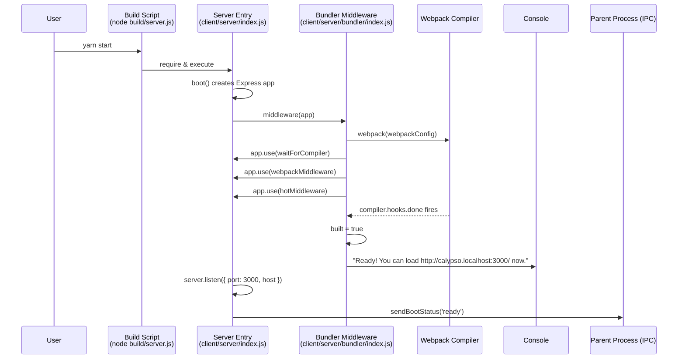
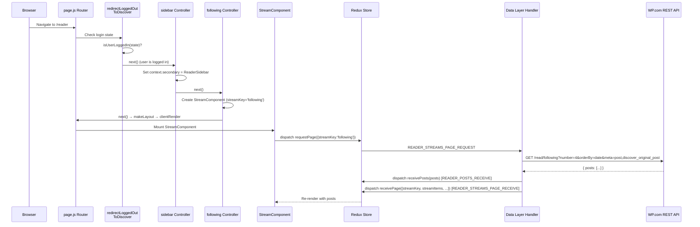
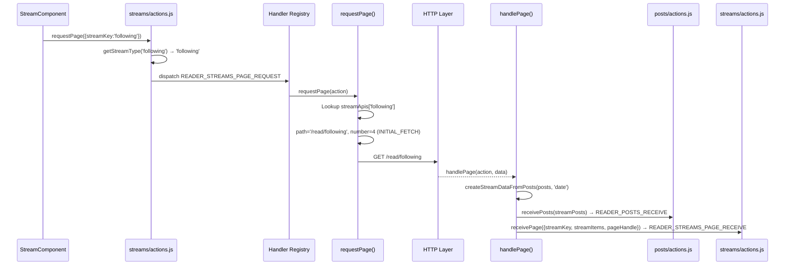
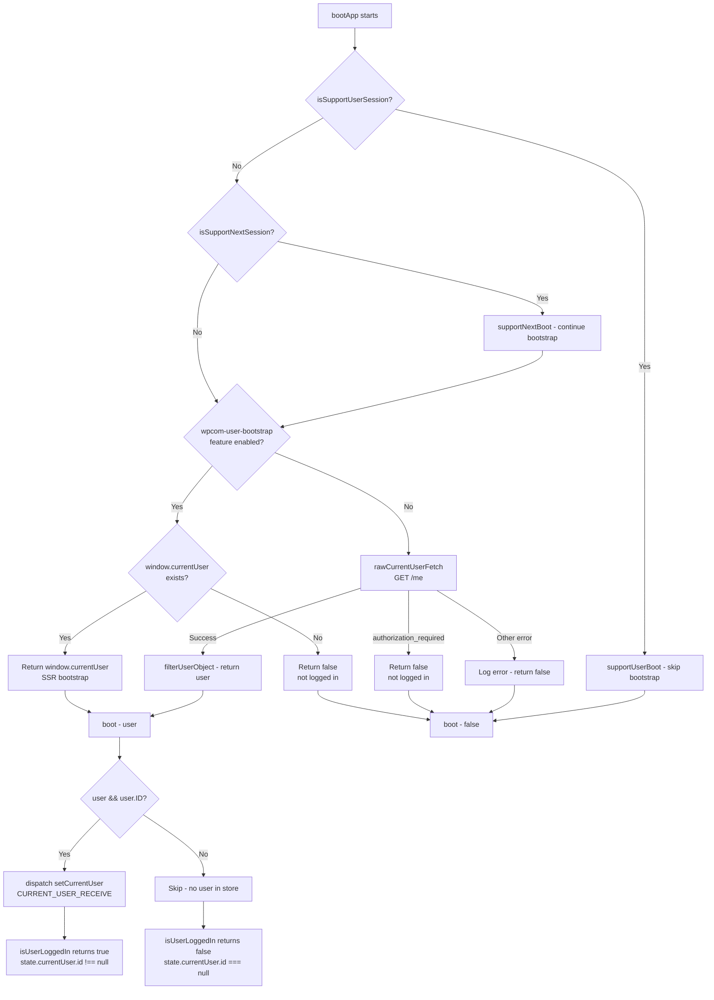

# Calypso Reader Section — Developer Onboarding Q&A

## Introduction & Context

This document answers six architectural questions about the Calypso Reader section, grounded entirely in source code evidence. Every claim cites specific file paths and line numbers so you can verify it yourself.

**What is Calypso?** Calypso is a REST-API-powered single-page application (SPA) that powers WordPress.com, Jetpack Cloud, and Automattic for Agencies (A4A). It is built with React, Redux, and Express, served from a Node.js backend.

**What is the Reader?** The Reader is a section of Calypso that aggregates content from sites the user follows, tags, search results, recommendations, and more. It is registered as a client-side section with `enableLoggedOut: true`, meaning parts of it are accessible without authentication.

**How to use this document:** Each question cluster follows a progressive-disclosure structure:
1. **Direct answer** — the concise, actionable answer
2. **Evidence** — code excerpts with file paths and line numbers
3. **Rationale** — the reasoning chain explaining *why* the answer follows from the evidence

**Terminology conventions:**
- **stream key** — the identifier string passed to the data layer to select a stream (e.g., `'following'`, `'site:12345'`)
- **masterbar** — the top navigation bar rendered across all Calypso sections
- **sidebar** — the left-hand navigation panel within the Reader section

---

## Q1: Development Server Port & Readiness

### Direct Answer

The development server binds to **port 3000** on host **`calypso.localhost`** using the **`http`** protocol. Two distinct readiness signals indicate the server is ready to serve requests:

1. **IPC Boot Status** — `sendBootStatus('ready')` sends `{ boot: 'ready' }` to the parent process via `process.send()`.
2. **Console "Ready!" Message** — webpack's `compiler.hooks.done` prints a human-readable message to the console after the first compilation completes.

### Evidence

**Port Configuration**

The values are defined in `config/development.json` lines 6–8:

```json
"protocol": "http",
"hostname": "calypso.localhost",
"port": 3000,
```

Source: `config/development.json:6-8`

These values are consumed at server startup in `client/server/index.js` lines 11–13:

```js
let protocol = config( 'protocol' );
let port = config( 'port' );
let host = config( 'hostname' );
```

Source: `client/server/index.js:11-13`

**Readiness Signal 1: IPC Boot Status**

The `sendBootStatus` function is defined at lines 25–31 of `client/server/index.js`:

```js
function sendBootStatus( status ) {
    if ( ! process.send ) { return; }
    process.send( { boot: status } );
}
```

It fires inside the `server.listen()` callback at line 85:

```js
server.listen( { port, host: process.env.CALYPSO_IS_FORK ? host : null }, function () {
    sendBootStatus( 'ready' );
} );
```

Source: `client/server/index.js:25-31,83-86`

The `process.send` guard at line 27 means this signal only fires when running as a forked child process (e.g., the desktop app or the build orchestrator).

**Readiness Signal 2: Console "Ready!" Message**

The bundler middleware hooks into webpack's `compiler.hooks.done` at `client/server/bundler/index.js` lines 38–63:

```js
compiler.hooks.done.tap( 'Calypso', function () {
    built = true;
    // ...
    process.nextTick( function () {
        process.nextTick( function () {
            if ( beforeFirstCompile ) {
                beforeFirstCompile = false;
                console.info( chalk.cyan(
                    `\nReady! You can load ${ protocol }://${ host }:${ port }/ now. Have fun!`
                ) );
            } else {
                console.info( chalk.cyan( '\nReady! All assets are re-compiled. Have fun!' ) );
            }
        } );
    } );
} );
```

Source: `client/server/bundler/index.js:38-63`

The double `process.nextTick` at lines 50–51 ensures the "Ready!" message appears *after* webpack's own "bundle is now VALID" log, since webpack also hooks `done` and uses `nextTick` internally.

### Server Startup Sequence



### Rationale

The port and host are centralized in the configuration file (`config/development.json`) and read once at server startup. The two readiness signals serve different consumers:
- **IPC (`sendBootStatus`)** notifies the parent build orchestrator (or the desktop Electron shell) that the server is accepting connections.
- **Console message** provides a visual cue to the developer that compilation is complete and the URL is safe to load.

The `waitForCompiler` middleware (lines 66–98 of `client/server/bundler/index.js`) acts as a gate: any HTTP request arriving before webpack finishes compilation is either queued (non-root paths) or served a "please wait" HTML page (root path with auto-refresh).

Source: `config/development.json:6-8`, `client/server/index.js:11-13,25-31,73,83-86`, `client/server/bundler/index.js:9-11,17,38-63,66-98,100-102`

---

## Q2: Multi-Port Architecture

### Direct Answer

Calypso uses a **single-port architecture**. All traffic — HTML pages, compiled JavaScript/CSS assets, Hot Module Replacement (HMR) WebSocket upgrades, and proxied API calls — flows through **port 3000** on the same Express application instance.

### Evidence

In `client/server/bundler/index.js` lines 100–102, all three middleware layers are mounted on the same Express `app`:

```js
app.use( waitForCompiler );
app.use( webpackMiddleware( compiler ) );
app.use( hotMiddleware( compiler ) );
```

Source: `client/server/bundler/index.js:100-102`

- `webpackMiddleware` is `webpack-dev-middleware` (imported at line 5) — it intercepts requests for compiled assets and serves them from memory.
- `hotMiddleware` is `webpack-hot-middleware` (imported at line 6) — it handles HMR WebSocket upgrade requests on the same server.
- `waitForCompiler` (defined at line 66) — gates all incoming requests until the initial webpack compilation completes.

The Express app itself is created in `client/server/index.js` at line 23:

```js
const app = boot();
```

And listened on a single port at line 83:

```js
server.listen( { port, host: process.env.CALYPSO_IS_FORK ? host : null }, function () { ... } );
```

Source: `client/server/index.js:23,73,83`

There is **no** separate HMR server, **no** separate asset server, and **no** separate API proxy port configured anywhere in the server entry point or bundler middleware.

### Rationale

The single-port design simplifies the development experience — developers only need to remember `calypso.localhost:3000`. The `waitForCompiler` gate ensures no request is served with stale or missing assets, providing a clean "ready or not" behavior. All traffic types coexist on the same Express app because `webpack-dev-middleware` and `webpack-hot-middleware` are designed to be Express-compatible middleware that intercept only the requests they handle (compiled asset paths and `/__webpack_hmr` respectively), passing everything else through to the next handler.

Source: `client/server/bundler/index.js:5-6,17,66-98,100-102`, `client/server/index.js:23,73,83`

---

## Q3: Reader Stream API Endpoints

### Direct Answer

The `streamApis` configuration table in `client/state/data-layer/wpcom/read/streams/index.js` (lines 192–351) is the single source of truth that maps stream keys to REST API endpoints. The data-layer handler registration at lines 514–529 connects `READER_STREAMS_PAGE_REQUEST` and `READER_STREAMS_PAGINATED_REQUEST` actions to the `requestPage` and `handlePage` functions.

### Fetch Constants

Defined at lines 160–163:

```js
export const PER_FETCH = 7;
export const INITIAL_FETCH = 4;
const PER_POLL = 40;
const PER_GAP = 40;
```

Source: `client/state/data-layer/wpcom/read/streams/index.js:160-163`

- `INITIAL_FETCH = 4` — number of posts fetched on first page load
- `PER_FETCH = 7` — number of posts fetched on subsequent pages (when a `pageHandle` is present)
- `PER_POLL = 40` — number of posts fetched during polling for updates
- `PER_GAP = 40` — number of posts fetched to fill timeline gaps

### Default Query String

All queries include these default parameters (lines 165–168):

```js
export const getQueryString = ( extras = {} ) => {
    return { orderBy: 'date', meta: QUERY_META, ...extras, content_width: 675 };
};
```

Where `QUERY_META = 'post,discover_original_post'` (line 165).

Source: `client/state/data-layer/wpcom/read/streams/index.js:165-168`

### Endpoint Reference Table

| # | Stream Key | REST Path | API Version | Date Property | Special Query Params |
|---|-----------|-----------|-------------|---------------|---------------------|
| 1 | `following` | `/read/following` | v1.2 (default) | `date` | — |
| 2 | `recent` | `/read/streams/following` | `wpcom/v2` (namespace) | `date` | Optional `feed_id` from stream key suffix |
| 3 | `search` | `/read/search` | v1.2 (default) | `date` | `sort`, `q` parsed from JSON stream key suffix |
| 4 | `feed` | `/read/feed/{feed_id}/posts` | v1.2 (default) | `date` | `feed_id` extracted from suffix |
| 5 | `discover` (recommended) | `/read/streams/discover` | `wpcom/v2` (namespace) | `date` | `orderBy: 'popular'`, `tags`, `tag_recs_per_card: 5`, `site_recs_per_card: 5`, `age_based_decay: 0.5` |
| 6 | `discover` (latest) | `/read/tags/posts` | `wpcom/v2` (namespace) | `date` | Same as above but `orderBy: 'date'` |
| 7 | `discover` (firstposts) | `/read/streams/first-posts` | `wpcom/v2` (namespace) | `date` | Same discover params |
| 8 | `discover` (default) | `/read/streams/discover?tags={suffix}` | `wpcom/v2` (namespace) | `date` | `tags` from suffix, same rec params |
| 9 | `site` | `/read/sites/{site_id}/posts` | v1.2 (default) | `date` | — |
| 10 | `conversations` | `/read/conversations` | v1.2 (default) | `last_comment_date_gmt` | `comments_per_post: 20` |
| 11 | `notifications` | `/read/notifications` | v1.2 (default) | `date` | — |
| 12 | `featured` | `/read/sites/{site_id}/featured` | v1.2 (default) | `date` | — |
| 13 | `p2` | `/read/following/p2` | v1.2 (default) | `date` | — |
| 14 | `a8c` | `/read/a8c` | v1.2 (default) | `date` | — |
| 15 | `conversations-a8c` | `/read/conversations` | v1.2 (default) | `last_comment_date_gmt` | `index: 'a8c'`, `comments_per_post: 20` |
| 16 | `likes` | `/read/liked` | v1.2 (default) | `date_liked` | — |
| 17 | `recommendations_posts` | `/read/recommendations/posts` | v1.2 (default) | `date` | `seed` (random 0–1000), `algorithm: 'read:recommendations:posts/es/1'` |
| 18 | `custom_recs_posts_with_images` | `/read/recommendations/posts` | v1.2 (default) | `date` | `seed`, `alg_prefix: 'read:recommendations:posts'` |
| 19 | `custom_recs_sites_with_images` | `/read/recommendations/sites` | v1.2 (default) | `date` | `algorithm: 'read:recommendations:sites/es/2'`, `posts_per_site: 1`, max 10 per poll |
| 20 | `tag` | `/read/tags/{tag}/posts` | `wpcom/v2` (namespace) | `date` | — |
| 21 | `tag_popular` | `/read/streams/tag/{tag}` | `wpcom/v2` (namespace) | `date` | `tags` from suffix, `tag_recs_per_card: 5`, `site_recs_per_card: 5` |
| 22 | `list` | `/read/list/{owner}/{slug}/posts` | v1.3 | `date` | `number: 40`, `owner`/`slug` from JSON-parsed suffix |
| 23 | `user` | `/users/{user_id}/posts` | v1 | `date` | — |

Source: `client/state/data-layer/wpcom/read/streams/index.js:192-351`

### Handler Registration Pattern

The handler registration at lines 514–529 uses a side-effect-based pattern:

```js
registerHandlers( 'state/data-layer/wpcom/read/streams/index.js', {
    [ READER_STREAMS_PAGE_REQUEST ]: [
        dispatchRequest( { fetch: requestPage, onSuccess: handlePage, onError: noop } ),
    ],
    [ READER_STREAMS_PAGINATED_REQUEST ]: [
        dispatchRequest( { fetch: requestPage, onSuccess: handlePage, onError: noop } ),
    ],
} );
```

Source: `client/state/data-layer/wpcom/read/streams/index.js:514-529`

This registration is triggered by a bare side-effect import in `client/state/reader/streams/actions.js` line 16:

```js
import 'calypso/state/data-layer/wpcom/read/streams';
```

Source: `client/state/reader/streams/actions.js:16`

Simply importing the module causes `registerHandlers` to execute, wiring up the action-to-handler mappings. This pattern is non-obvious to newcomers — the import has no named binding because its purpose is the side effect of handler registration.

### Stream Key Parsing

Stream keys are parsed by `getStreamType()` in `client/reader/utils.ts` lines 116–120:

```ts
export function getStreamType( streamKey: string ): string {
    const indexOfColon = streamKey.indexOf( ':' );
    return indexOfColon === -1 ? streamKey : streamKey.substring( 0, indexOfColon );
}
```

Source: `client/reader/utils.ts:116-120`

The prefix before the first colon is used to look up the correct API configuration in `streamApis`. For example, `'site:12345'` yields stream type `'site'`, which maps to `/read/sites/12345/posts`.

### Rationale

The `streamApis` object is the single source of truth for endpoint routing in the Reader data layer. Each entry defines a `path` function (which may extract dynamic segments from the stream key suffix), a `dateProperty` (used to sort and order stream items), an optional `apiVersion` or `apiNamespace`, and an optional custom `query` function. The default API version is `1.2` (set at line 370 in the `requestPage` function), and the default query builder includes `orderBy: 'date'`, `meta: 'post,discover_original_post'`, and `content_width: 675`.

Source: `client/state/data-layer/wpcom/read/streams/index.js:160-168,192-351,358-406,514-529`, `client/reader/utils.ts:116-120`, `client/state/reader/streams/actions.js:16`

---

## Q4: Redux Actions During Initial Load

### Direct Answer

When a user navigates to `/reader`, the route middleware chain defined in `client/reader/index.ts` lines 54–62 executes sequentially. The primary Redux actions dispatched during the initial load are:

1. `READER_STREAMS_PAGE_REQUEST` — when the stream component mounts
2. `READER_POSTS_RECEIVE` — when the API response arrives with post data
3. `READER_STREAMS_PAGE_RECEIVE` — when the page of stream items is processed

### Middleware Chain

The `/reader` route is registered at `client/reader/index.ts` lines 54–62:

```ts
page(
    [ '/reader', '/reader/recent/:feed_id' ],
    redirectLoggedOutToDiscover,
    sidebar,
    setSelectedSiteIdByOrigin,
    following,
    makeLayout,
    clientRender
);
```

Source: `client/reader/index.ts:54-62`

### Actions Dispatched at Each Step

**1. `redirectLoggedOutToDiscover`** (from `client/reader/controller.js`)

Checks `isUserLoggedIn(state)` from `client/state/current-user/selectors.js`. If the user is logged out, redirects to the Discover stream. **No Redux action dispatched** — this is a guard that either redirects or calls `next()`.

**2. `sidebar`** (`client/reader/controller.js` lines 35–44)

```js
export function sidebar( context, next ) {
    const state = context.store.getState();
    if ( isUserLoggedIn( state ) ) {
        context.secondary = (
            <AsyncLoad require="calypso/reader/sidebar" ... />
        );
    }
    next();
}
```

Source: `client/reader/controller.js:35-44`

Sets the sidebar component if logged in. No direct Redux dispatch here.

**3. `following`** (`client/reader/controller.js` lines 50–101)

This is where the key action setup occurs:

- For Automattic team members, it may dispatch `toggleReaderSidebarFollowing()` (line 70) to expand the sidebar's Following section.
- Creates `StreamComponent` with `streamKey: 'following'` (lines 84–99):

```js
context.primary = createElement( StreamComponent, {
    key: 'following',
    streamKey: 'following',
    startDate,
    recsStreamKey: 'custom_recs_posts_with_images',
    // ...
} );
```

Source: `client/reader/controller.js:50-101`

**4. Stream data fetch lifecycle** (dispatched by the data layer)

When the `StreamComponent` mounts, it dispatches `requestPage({ streamKey: 'following' })`.

The `requestPage` action creator in `client/state/reader/streams/actions.js` lines 28–50 produces:

```js
{
    type: READER_STREAMS_PAGE_REQUEST,
    payload: { streamKey, pageHandle, streamType, isPoll, gap, localeSlug, feedId }
}
```

Source: `client/state/reader/streams/actions.js:28-50`

The data-layer handler (`client/state/data-layer/wpcom/read/streams/index.js` lines 358–406) intercepts this action and issues an HTTP GET to `/read/following` with `number: 4` (INITIAL_FETCH).

On success, `handlePage()` (lines 428–512) dispatches:
- **`receivePosts(streamPosts)`** → action type `READER_POSTS_RECEIVE` (line 470)
- **`receivePage({ streamKey, streamItems, pageHandle, ... })`** → action type `READER_STREAMS_PAGE_RECEIVE` (lines 496–508)

Source: `client/state/data-layer/wpcom/read/streams/index.js:358-406,428-512`

### Reader Initial Load Sequence



### Stream Data Fetch Sequence



### Lasagna WebSocket Middleware

The Reader conditionally loads a real-time update middleware called Lasagna. This is set up in `client/reader/index.ts` lines 39–47:

```ts
export async function lazyLoadDependencies(): Promise< void > {
    const isBrowser = typeof window === 'object';
    if ( isBrowser && config.isEnabled( 'lasagna' ) && config.isEnabled( 'reader' ) ) {
        const lasagnaMiddleware = await import(
            'calypso/state/lasagna/middleware.js'
        );
        addMiddleware( lasagnaMiddleware.default );
    }
}
```

Source: `client/reader/index.ts:39-47`

This middleware is gated behind **two feature flags**: `lasagna` AND `reader`, and only runs in the browser (not during SSR). When enabled, it establishes a WebSocket connection for real-time updates, dispatching `READER_STREAMS_UPDATES_RECEIVE` and `READER_STREAMS_NEW_POST_RECEIVE` actions when new content arrives.

### Action Types Relevant to Initial Load

From `client/state/reader/action-types.ts`:

| Action Type | Line | When Dispatched |
|------------|------|-----------------|
| `READER_STREAMS_PAGE_REQUEST` | 78 | When a stream page is requested (component mount) |
| `READER_STREAMS_PAGE_RECEIVE` | 77 | When a stream page response is processed |
| `READER_STREAMS_PAGINATED_REQUEST` | 79 | When a paginated request is made (scroll/load more) |
| `READER_POSTS_RECEIVE` | 52 | When post objects arrive from any API response |
| `READER_STREAMS_SHOW_UPDATES` | 84 | When pending updates are shown to the user |
| `READER_STREAMS_UPDATES_RECEIVE` | 85 | When real-time poll updates arrive |
| `READER_STREAMS_NEW_POST_RECEIVE` | 86 | When a new post arrives via Lasagna WebSocket |

Source: `client/state/reader/action-types.ts:52,77-79,84-86`

### Rationale

The Reader's initial load follows a predictable middleware chain → controller → component mount → data fetch pattern. The key insight is that `requestPage` in the actions file is a plain action creator (not a thunk), and the actual HTTP request is handled by the data-layer middleware registered via `registerHandlers`. The `handlePage` function is responsible for splitting the API response into multiple Redux actions — separating post objects (`receivePosts`) from stream metadata (`receivePage`). This separation allows the posts reducer and streams reducer to handle their respective concerns independently.

Source: `client/reader/index.ts:39-62`, `client/reader/controller.js:35-101`, `client/state/reader/streams/actions.js:28-50`, `client/state/data-layer/wpcom/read/streams/index.js:358-529`, `client/state/reader/action-types.ts:52,77-86`

---

## Q5: Authentication Detection

### Direct Answer

Login detection spans four modules and checks four distinct storage mechanisms. The canonical login check is `isUserLoggedIn(state)` which simply verifies `state.currentUser.id !== null` in the Redux store. The complexity lies in *how* that state gets populated — through a multi-step initialization pipeline that checks cookies (server-side), `window.currentUser` (SSR bootstrap), localStorage (`wpcom_user_id`), and IndexedDB (persisted Redux state).

### Storage Mechanisms

| Storage Backend | Key / Mechanism | Module | Purpose |
|----------------|----------------|--------|---------|
| Cookie | `wordpress_logged_in` | `client/server/user-bootstrap/index.js:8` | Server-side auth — cookie value is HMAC-signed and sent to the `/me` API |
| localStorage | `wpcom_user_id` | `client/lib/user/store.js:13` | Client-side persistence of the user ID across sessions |
| `window.currentUser` | SSR bootstrap object | `client/lib/user/shared-utils/initialize-current-user.js:29` | Server-rendered user data injected into the HTML during SSR |
| IndexedDB | Redux state (storage key: `'reader'`) | `client/state/reader/reducer.ts:36` | Persisted Redux state hydrated on subsequent visits via `withStorageKey('reader', combinedReducer)` |

### Detection Flow

**Step 1: Boot Entry Point**

The app boot sequence begins in `client/boot/common.js` lines 340–344:

```js
export const bootApp = async ( appName, registerRoutes ) => {
    const user = await initializeCurrentUser();
    debug( `Starting ${ appName }. Let's do this.` );
    await boot( user, registerRoutes );
};
```

Source: `client/boot/common.js:340-344`

**Step 2: `initializeCurrentUser()`**

Defined in `client/lib/user/shared-utils/initialize-current-user.js` lines 11–50, this function executes the following decision tree:

1. **Support session check** (lines 14–19): If `isSupportUserSession()` is true, call `supportUserBoot()` and set `skipBootstrap = true`. This handles Automattic support staff impersonating users.

2. **Support next session check** (lines 21–26): If `isSupportNextSession()` is true, call `supportNextBoot()` but continue with normal bootstrap.

3. **SSR bootstrap check** (lines 28–33): If `wpcom-user-bootstrap` feature is enabled AND `window.currentUser` exists (injected by the server during SSR), return `window.currentUser` immediately.

4. **API fallback** (lines 36–49): If none of the above apply, call `rawCurrentUserFetch()` which issues a GET request to the `/me` endpoint. If the fetch fails with `authorization_required`, the user is not logged in. Other errors are logged to the console.

```js
if ( ! skipBootstrap && config.isEnabled( 'wpcom-user-bootstrap' ) ) {
    if ( window.currentUser ) {
        return window.currentUser;
    }
    return false;
}
```

Source: `client/lib/user/shared-utils/initialize-current-user.js:11-50`

**Step 3: Redux State Hydration**

Back in `client/boot/common.js`, the `boot()` function (lines 315–338) creates the Redux store and then calls `configureReduxStore` (lines 217–223):

```js
const configureReduxStore = ( currentUser, reduxStore ) => {
    if ( currentUser && currentUser.ID ) {
        reduxStore.dispatch( setCurrentUser( currentUser ) );
    }
    // ...
};
```

Source: `client/boot/common.js:217-223`

The `setCurrentUser` action dispatches `CURRENT_USER_RECEIVE` which sets `state.currentUser.id` and `state.currentUser.user` in the Redux store.

Source: `client/state/current-user/actions.js:21-26`

**Step 4: Login State Selector**

All components and middleware use `isUserLoggedIn(state)` to check login status:

```js
export function getCurrentUserId( state ) {
    return state.currentUser?.id;
}

export function isUserLoggedIn( state ) {
    return getCurrentUserId( state ) !== null;
}
```

Source: `client/state/current-user/selectors.js:6-17`

**Step 5: Server-Side Bootstrap**

For SSR requests, the server reads the auth cookie in `client/server/user-bootstrap/index.js`:

```js
const AUTH_COOKIE_NAME = 'wordpress_logged_in';
```

Source: `client/server/user-bootstrap/index.js:8`

The `getBootstrappedUser(request)` function (lines 27–109):
1. Reads the `wordpress_logged_in` cookie from the Express request (line 28).
2. If the cookie is absent, throws: `"Cannot bootstrap without an auth cookie"` (line 34).
3. Creates an HMAC-MD5 hash of the cookie value using the `wpcom_calypso_rest_api_key` from secrets.json (lines 79–81).
4. Sends a GET request to `https://public-api.wordpress.com/rest/v1/me?meta=flags` with an `Authorization: X-WPCALYPSO {hash}` header (line 83).
5. Returns the user object with `bootstrapped: true` (lines 90–93).

Source: `client/server/user-bootstrap/index.js:8,13-17,27-109`

**Step 6: `fetchCurrentUser()` Thunk**

For client-side re-authentication, `client/state/current-user/actions.js` lines 30–61 provides a thunk:

```js
export function fetchCurrentUser() {
    return ( dispatch ) => {
        // ...
        fetchingUser = rawCurrentUserFetch()
            .then( async ( user ) => {
                const userData = filterUserObject( user );
                const storedUserId = getStoredUserId();
                if ( storedUserId != null && storedUserId !== userData.ID ) {
                    await clearStore();
                }
                setStoredUserId( userData.ID );
                dispatch( setCurrentUser( userData ) );
            } )
        // ...
    };
}
```

Source: `client/state/current-user/actions.js:30-61`

This thunk checks `getStoredUserId()` (localStorage `wpcom_user_id`) — if the stored user ID differs from the fetched user, it calls `clearStore()` to wipe localStorage and IndexedDB, preventing stale data from a different user.

Source: `client/lib/user/store.js:7-14`

### Authentication Decision Flowchart



### Rationale

The authentication detection system is deliberately layered to optimize for different runtime contexts:

1. **Server-side (SSR):** The `wordpress_logged_in` cookie is the primary signal. The server-side bootstrap validates it via HMAC + API call and injects the user object into `window.currentUser` for the client to consume without an additional API roundtrip.

2. **Client-side (initial load):** When `wpcom-user-bootstrap` is enabled, the client checks `window.currentUser` first (zero-cost, already in the HTML). This avoids a blocking `/me` API call on every page load.

3. **Client-side (no SSR):** Falls back to `rawCurrentUserFetch()` which hits the `/me` endpoint directly. This path is used when the feature flag is disabled or when running in environments without server-side rendering.

4. **Cross-session persistence:** The `wpcom_user_id` in localStorage (via the `store` library) allows quick detection of user identity changes between sessions. If the ID changes, `clearStore()` wipes both localStorage and IndexedDB to prevent data leakage between accounts.

5. **Redux state persistence:** The `withStorageKey('reader', combinedReducer)` in `client/state/reader/reducer.ts:36` enables IndexedDB-based persistence for the Reader slice of the Redux store, so stream data survives page reloads.

Source: `client/boot/common.js:27,32-34,217-223,315-344`, `client/lib/user/shared-utils/initialize-current-user.js:1-50`, `client/lib/user/store.js:1-18`, `client/server/user-bootstrap/index.js:1-109`, `client/state/current-user/selectors.js:1-17`, `client/state/current-user/actions.js:1-61`, `client/state/reader/reducer.ts:1-37`

---

## Q6: Sidebar Responsive Design

### Direct Answer

The Reader sidebar layout is driven by CSS custom properties defined in three SCSS files, with four responsive breakpoints (600px, 781px, 782px, 1300px). The layout uses `calc()` expressions combining `--masterbar-height`, `--sidebar-width-max`, `--content-padding-top`, and `--content-padding-bottom` to compute content area dimensions.

### CSS Custom Property Inventory

| Property | Default Value | Override Condition | Override Value | Source |
|----------|--------------|-------------------|---------------|--------|
| `--masterbar-height` | `46px` | `min-width: 782px` | `32px` | `client/assets/stylesheets/shared/_variables.scss:7,10-12` |
| `--masterbar-checkout-height` | `72px` | — | — | `client/assets/stylesheets/shared/_variables.scss:8` |
| `--sidebar-width-max` | `272px` | `.is-global-sidebar-visible` | `295px` | `_variables.scss:15`, `client/my-sites/sidebar/style.scss:16` |
| `--sidebar-width-max` | `272px` | `.is-global-sidebar-collapsed` | `69px` | `client/my-sites/sidebar/style.scss:60` |
| `--sidebar-width-min` | `228px` | `.is-global-sidebar-visible` | `295px` | `_variables.scss:16`, `client/my-sites/sidebar/style.scss:17` |
| `--sidebar-width-min` | `228px` | `.is-global-sidebar-collapsed` | `69px` | `client/my-sites/sidebar/style.scss:61` |
| `--content-padding-top` | *(not set globally)* | `.is-global-sidebar-visible` | `16px` | `client/my-sites/sidebar/style.scss:50` |
| `--content-padding-bottom` | *(not set globally)* | `.is-global-sidebar-visible` | `16px` | `client/my-sites/sidebar/style.scss:51` |

Source: `client/assets/stylesheets/shared/_variables.scss:1-17`, `client/my-sites/sidebar/style.scss:10-17,50-51,59-61`

### Breakpoint Thresholds

| Breakpoint | Value | Where Used | Layout Change |
|-----------|-------|-----------|---------------|
| `$break-small` (600px) | `max-width: 600px` | `client/reader/style.scss:10-12` | Main content padding changes from `24px` to `24px 0` (horizontal padding removed) |
| `781px` | `max-width: 781px` | `client/reader/sidebar/style.scss:102-109` | `.layout__primary > div` gets `border-radius: 8px` and fixed `height: calc(100vh - var(--masterbar-height) - ...)` |
| `782px` | `min-width: 782px` | `client/assets/stylesheets/shared/_variables.scss:10`, `client/reader/sidebar/style.scss:79` | Masterbar height shrinks from `46px` to `32px`; layout content gets full padding with `!important` override |
| `1300px` | `max-width: 1300px` | `client/reader/style.scss:17,23,35,80` | Back-button switches to `position: unset` / `display: flex`; navigation header gets extra `padding-top: 12px` |

Source: `client/reader/style.scss:10-12,17-27,35-42,80-83,103-109`, `client/reader/sidebar/style.scss:79-81,102-109`, `client/assets/stylesheets/shared/_variables.scss:10-12`

### Key Margin and Padding Values

**From `client/reader/sidebar/style.scss`:**

Sidebar header (within `.is-section-reader` block, lines 116–117):
- `margin: 0 12px 44px`
- `padding: 0 10px`

Source: `client/reader/sidebar/style.scss:116-117`

Tag list item (line 16):
- `margin-bottom: 8px`

Source: `client/reader/sidebar/style.scss:16`

Tag text input (lines 27, 34–35):
- Outer container: `padding: 0 10px 8px`
- `.form-text-input`: `padding: 0 8px`, `margin: 4px 4px 4px 0`

Source: `client/reader/sidebar/style.scss:27,34-35`

All tags link (line 50):
- `margin-bottom: 2px`

Source: `client/reader/sidebar/style.scss:50`

RTL layout padding for `.layout__content` (line 70):

```scss
padding: calc(var(--masterbar-height) + var(--content-padding-top))
         calc(var(--sidebar-width-max))
         var(--content-padding-bottom) 16px;
```

Source: `client/reader/sidebar/style.scss:70`

LTR layout padding at `min-width: 782px` (line 80):

```scss
padding: calc(var(--masterbar-height) + var(--content-padding-top))
         16px var(--content-padding-bottom)
         calc(var(--sidebar-width-max)) !important;
```

Source: `client/reader/sidebar/style.scss:80`

**From `client/reader/style.scss`:**

Main content area with `.is-global-sidebar-visible` (lines 7–12):
- Default: `padding: 24px`
- Below 600px (`$break-small`): `padding: 24px 0`

Source: `client/reader/style.scss:7-12`

Layout primary div height calculation (line 89):

```scss
height: calc(100vh - var(--masterbar-height) - var(--content-padding-top) - var(--content-padding-bottom));
```

Source: `client/reader/style.scss:89`

Navigation header `::after` pseudo-element (lines 56–66):
- Default: `margin: 18px 0`
- Above `$break-medium`: `margin: 24px 0`

Source: `client/reader/style.scss:56-66`

### Rationale

The Reader sidebar's responsive design follows Calypso's global CSS custom property system. The key architectural decision is using CSS custom properties (`--masterbar-height`, `--sidebar-width-max`, etc.) that are **context-dependent** — their values change based on which CSS class is applied to the body or layout container:

- **`.is-global-sidebar-visible`** activates the full sidebar (295px wide) with content padding (16px top/bottom).
- **`.is-global-sidebar-collapsed`** shrinks the sidebar to 69px (icon-only mode).
- The **masterbar height** transitions from 46px (mobile) to 32px (desktop ≥782px), and all `calc()` expressions that reference `--masterbar-height` automatically adjust.

The 782px breakpoint is the primary mobile/desktop threshold (consistent with WordPress's admin bar breakpoint). The 1300px breakpoint handles the transition between wide and narrow desktop layouts, where the back-button switches from absolute positioning to inline flow.

Source: `client/assets/stylesheets/shared/_variables.scss:1-17`, `client/my-sites/sidebar/style.scss:1-74`, `client/reader/style.scss:1-108`, `client/reader/sidebar/style.scss:1-130`

---

## Summary

All six question clusters have been answered with direct source code evidence:

| Question | Key Finding | Primary Source |
|----------|-------------|---------------|
| **Q1: Dev Server Port** | Port 3000 on `calypso.localhost`, two readiness signals (IPC + console) | `config/development.json`, `client/server/index.js`, `client/server/bundler/index.js` |
| **Q2: Multi-Port** | Single-port architecture — all traffic on port 3000 | `client/server/bundler/index.js:100-102` |
| **Q3: Stream API** | 23 stream key entries in `streamApis` table, INITIAL_FETCH=4 | `client/state/data-layer/wpcom/read/streams/index.js:192-351` |
| **Q4: Redux Actions** | REQUEST → API call → POSTS_RECEIVE + PAGE_RECEIVE | `client/reader/index.ts`, `client/state/reader/streams/actions.js` |
| **Q5: Auth Detection** | Four storage backends: cookie, localStorage, window.currentUser, IndexedDB | `client/lib/user/shared-utils/initialize-current-user.js`, `client/server/user-bootstrap/index.js` |
| **Q6: Sidebar CSS** | Four breakpoints (600/781/782/1300px), CSS custom properties drive layout | `client/reader/style.scss`, `client/reader/sidebar/style.scss`, `_variables.scss` |

### Key Architectural Insights

1. **Single-port design:** Simplifies development by consolidating HTML, assets, HMR, and API proxy on one port.
2. **Side-effect handler registration:** The data-layer uses bare imports to trigger `registerHandlers`, a pattern that is non-obvious but central to how Redux actions connect to API calls.
3. **Dual-storage auth strategy:** Server-side uses cookie → HMAC → API; client-side uses `window.currentUser` (SSR) or `/me` fetch (fallback), with localStorage and IndexedDB for persistence.
4. **CSS custom property-driven layout:** Responsive behavior is achieved through context-dependent CSS custom properties rather than hardcoded media queries, allowing the sidebar and content area to adapt dynamically.

### Further Reading

- `docs/install.md` — Installation guide covering port configuration and `calypso.localhost` setup
- `docs/yarn-start.md` — Build pipeline Mermaid diagrams and the `yarn start` flow
- `docs/routing.md` — Section-based routing architecture
- `docs/our-approach-to-data.md` — Redux to React Query evolution and data-layer conventions
- `docs/data-persistence.md` — IndexedDB persistence architecture and schema validation
