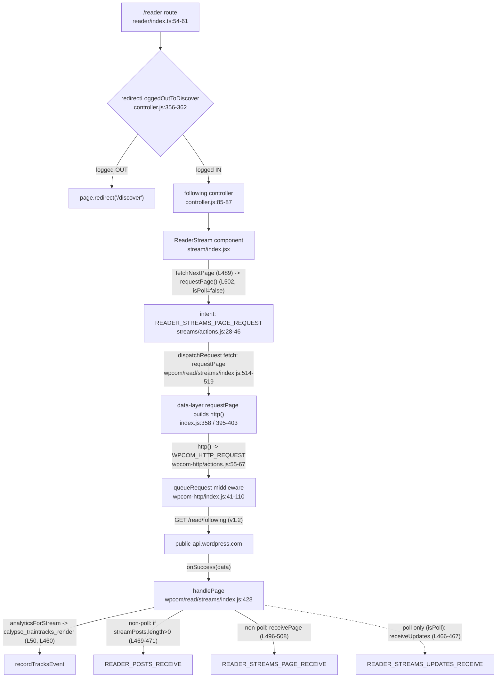

# Calypso Reader — Local Run & Under-the-Hood Onboarding

This document is an onboarding walkthrough for running the WordPress.com **Calypso** Reader locally and understanding how four of its subsystems behave under the hood: the development server & ports, the Reader stream's API/Redux data flow, authentication detection & storage, and the sidebar's responsive design. It is a **read-only, documentation-only** deliverable — no product source was modified; the only file added to the repository is this document. That claim is not merely asserted: §7 shows the exact `git status --porcelain` and `git diff --name-status` output proving the working tree is clean and the baseline‑to‑HEAD change is exactly this one file.

All citations are pinned to commit `be7e5cc641622d153040491fd5625c6cb83e12eb` (branch `wp-calypso_be7e5cc64162`). A citation written as `[path:Lnn]` points at that exact line in the source at this commit.

## The question this document answers (verbatim)

> I am onboarding on the Calypso codebase and trying to get the Reader section running locally so I can understand how it works. What port does the development server bind to, and how do I know when it's fully ready? Does the architecture use multiple ports for things like hot reloading and API calls, or is everything served from one place?
>
> Once I can see the Reader loading, I want to understand what's happening under the hood. What API endpoints get called to populate the stream, and what Redux actions fire during that initial load? I'm also confused about how the app knows whether someone is logged in before it decides what to render, what storage mechanisms does it check? The sidebar layout seems to shift around at different screen sizes and I'd like to understand the responsive design. What are the specific margin and padding values on the sidebar header, what CSS custom properties drive the layout calculations, and at what viewport widths do things change?
>
> Temporary scripts may be used for observation, but the repository itself should remain unchanged and anything temporary should be cleaned up afterward.

## Evidence & methodology

This document is **run-first**: the canonical development server was actually built and launched (`CALYPSO_ENV=development yarn start`) on the real toolchain, and the port, readiness banners, transitional holding page, single-port behavior, and the served Reader route were captured live. Every behavioral claim below carries either:

- **observed** output shown inline in a fenced block **next to the exact command that produced it**, or
- a `[file:line]` citation into the source at commit `be7e5cc…`.

**Evidence discipline (how to read the observed blocks).** Each observed block begins with the literal command (prefixed `$`). Where output was reduced, the reduction is a **disclosed, deterministic filter** (e.g., `grep`, `sed -n`, header selection, or a JSON field projection) and is labeled as a *filtered excerpt*; nothing is silently hand-edited. Commands that would otherwise stream forever (the HMR Server‑Sent‑Events endpoint) are **time‑bounded** with `curl --max-time`. Runtime capture used a wrapper that prefixes every server line with a wall‑clock `HH:MM:SS.mmm` timestamp so that durations can be computed from the log itself:

```bash
CALYPSO_ENV=development yarn start 2>&1 \
  | while IFS= read -r l; do printf '%s %s\n' "$(date +%H:%M:%S.%3N)" "$l"; done | tee /tmp/start.log
```

Anything that could not be exercised without credentials — specifically a **fully authenticated** WordPress.com trace (a populated `GET /read/following` response body and the browser‑side Redux dispatch that follows it) — is explicitly labeled **(inferred)** and grounded in `[file:line]` citations. Note that network egress to WordPress.com *was* available (see §2.6): the unauthenticated endpoints returned HTTP `403`, which is the observable boundary; only the authenticated success path is inferred.

> **Note on secrets.** The served HTML injects a `window.configData` blob that contains live‑looking third‑party keys (Stripe publishable key, Google Maps key, VAPID key, etc.). Those values are intentionally **omitted**; only non‑sensitive fields (`protocol`, `port`, `hostname`, `env`, `wpcom-user-bootstrap`) are ever quoted from it. All observed captures were also minimized to drop unrelated third‑party metadata.

---

## 1. Environment & exact build/run commands

### 1.1 Toolchain (Node 22 + Yarn 4)

Calypso pins its toolchain and gates startup on it:

- `.nvmrc` pins Node `22.9.0`.
- `package.json` requires `"node": "^v22.9.0"` `[package.json:L57]`.
- `package.json` pins `"packageManager": "yarn@4.0.2"` `[package.json:L422]`, activated via Corepack.
- `yarn start` is **gated** by `npx check-node-version --package` `[package.json:L110]`, so Node 20 (the default in some images) fails the gate — Node 22 is required.

**Observed toolchain** (each command → its output):

```text
$ node --version
v22.23.1

$ yarn --version
4.0.2

$ cat .nvmrc
22.9.0
```

`v22.23.1` satisfies `^v22.9.0`, and Corepack resolves `yarn` to the repo‑pinned `4.0.2`.

### 1.2 Ordered commands from the repository root

Run everything from the repository root. The exact, ordered sequence used for this document:

```bash
# 0) start at the repository root (all commands below are relative to it)
cd /path/to/wp-calypso            # the directory containing package.json / .nvmrc

# 1) install dependencies (node_modules is git-ignored; yarn.lock is NOT modified)
yarn install --immutable

# 2) verify the required hosts entry exists (exact, non-quiet check)
grep -F '127.0.0.1 calypso.localhost' /etc/hosts

# 3) canonical launch of the development server
CALYPSO_ENV=development yarn start
```

**Observed — `yarn install --immutable` succeeds** (filtered excerpt: the Yarn step lines):

```text
$ yarn install --immutable
➤ YN0000: └ Completed in 0s 481ms
➤ YN0000: ┌ Fetch step
➤ YN0000: └ Completed in 4s 407ms
➤ YN0000: ┌ Link step
➤ YN0000: └ Completed in 1s 6ms
➤ YN0000: · Done in 6s 171ms
# exit status:
$ echo $?
0
```

`--immutable` fails if `yarn.lock` would change, so exit `0` also proves the lockfile is untouched.

**Observed — the hosts entry is present** (this exact, non‑quiet check prints the matching line; `grep -F` matches the fixed string, not any substring):

```text
$ grep -F '127.0.0.1 calypso.localhost' /etc/hosts
127.0.0.1 calypso.localhost
```

**The `yarn start` script chain.** `start` expands to a chain `[package.json:L110]`:

```text
npx check-node-version --package && node bin/welcome.js && yarn run build && yarn run start-build
```

and `start-build` `[package.json:L113]` is:

```text
BROWSERSLIST_ENV=evergreen node build/server.js | bunyan -o short
```

So `yarn start` first runs the node‑version gate and a full `yarn run build`, then boots `node build/server.js` (piping logs through `bunyan`). In development the server compiles the client **in memory** (see §2.5), which is why the first *usable* state arrives minutes after the process boots (§2.2).

**Stopping the server and cleaning up** is documented with observed output in **§7**.

---

## 2. Development Server & Ports (Group 1)

**Short answers:**

- **Port:** a single port, **`3000`** (host `calypso.localhost`, protocol `http`).
- **How you know it's ready:** **two distinct signals** — (1) an early **boot‑log** line that is printed *before* the socket is actually listening, and (2) the cyan **"Ready!" banner** printed after webpack's first in‑memory compile. Only after the banner is the app usable; before it, `/` serves a self‑refreshing **"Welcome to Calypso!"** holding page.
- **One place or many?** **One place.** The app HTML, the in‑memory JS/CSS bundle, and the Hot Module Replacement (HMR) update stream (Server‑Sent Events) are all served from port `3000`. There is **no** separate `webpack-dev-server` port.
- **What about the API?** Calypso hosts **no local API**. Both the browser Reader requests *and* the Node server's user‑bootstrap requests call the **remote** WordPress.com REST service at `public-api.wordpress.com` (see §2.6, §3, §4).

### 2.1 Where port 3000 comes from (the config chain)

- Default `"protocol": "http"` and `"port": 3000` live in the shared config `[config/_shared.json:L24-L25]` (with `"hostname": false` at `[config/_shared.json:L13]`).
- Development overrides confirm the values and set the hostname: `"protocol": "http"` `[config/development.json:L6]`, `"hostname": "calypso.localhost"` `[config/development.json:L7]`, `"port": 3000` `[config/development.json:L8]`.
- At boot the server reads them: `let protocol = config( 'protocol' )` `[client/server/index.js:L11]`, `let port = config( 'port' )` `[client/server/index.js:L12]`, `let host = config( 'hostname' )` `[client/server/index.js:L13]`.

**Observed** — the served page's injected config confirms the values (secrets omitted; filtered to non‑sensitive fields):

```text
# non-sensitive fields projected from window.configData in the HTML served by GET /
"protocol":"http", "port":3000, "hostname":"calypso.localhost", "env":"development"
```

**Alternate (non‑default) branch — documented for completeness:** setting `MOCK_WORDPRESSDOTCOM=1` overrides these to `protocol='https'`, `port=443`, `host='wordpress.com'` and logs a warning `[client/server/index.js:L16-L21]`. That is **not** the default local path; the default local server uses `http://calypso.localhost:3000`.

### 2.2 The two readiness signals (with observed timing)

**Signal 1 — an early boot log (the app is *not* yet usable, and the socket is not necessarily listening yet).** The line is emitted by `logger.info( 'wp-calypso booted in %dms - %s://%s:%s', … )` at `[client/server/index.js:L33]`. Crucially, `L33` runs **before** the HTTP server is even created (`const server = createServer()` `[client/server/index.js:L73]`) and **before** it starts listening (`server.listen( … )` `[client/server/index.js:L83]`). So this line is best read as an **early boot / pre‑listen** signal, *not* proof that the port is accepting connections.

**Signal 2 — the app is usable (webpack's first in‑memory compile finished).** The cyan banner is printed at `[client/server/bundler/index.js:L54-L58]` — exact string at L56: `` `\nReady! You can load ${ protocol }://${ host }:${ port }/ now. Have fun!` ``. A later recompile instead prints `Ready! All assets are re-compiled. Have fun!` `[client/server/bundler/index.js:L60]`.

**Observed — one coherent run, filtered to the four milestone lines** (each line carries the capture wrapper's wall‑clock prefix; server‑logger lines also carry bunyan's own `…Z` timestamp):

```text
# 1) launch + capture the timestamped log (see "Evidence & methodology" for the wrapper):
$ CALYPSO_ENV=development yarn start 2>&1 \
    | while IFS= read -r l; do printf '%s %s\n' "$(date +%H:%M:%S.%3N)" "$l"; done | tee /tmp/start.log

# 2) filtered excerpt — the four milestone lines pulled from the captured log:
$ grep -E 'wp-calypso booted|Compiling assets|webpack .* compiled|Ready! You can load' /tmp/start.log
20:38:57.858 20:38:57.851Z  INFO calypso: wp-calypso booted in 1006ms - http://calypso.localhost:3000
20:39:12.417 Compiling assets... Wait until you see Ready! and then try http://calypso.localhost:3000/ again.
20:41:57.667 webpack 5.97.1 compiled with 37 warnings in 175106 ms
20:42:00.579 Ready! You can load http://calypso.localhost:3000/ now. Have fun!
```

**Timing — three distinct, timestamped measurements** (do not conflate them):

- **Total `yarn start` → usable:** launch marker `20:38:31.046` → "Ready!" `20:42:00.579` ≈ **209.5 s** (includes the node‑version gate, `bin/welcome.js`, and `yarn run build` *before* the server even boots).
- **Boot‑log → first‑compile "Ready!":** `20:38:57.858` → `20:42:00.579` = **182.7 s** — the time from the pre‑listen boot log to the first usable state.
- **webpack's own reported first‑compile duration:** **175106 ms** (≈ 2 m 55 s), from the `webpack … compiled …` line.

(The `37 warnings` are benign webpack child‑compilation warnings, not errors; the compile succeeds. Absolute durations vary run‑to‑run — a separate earlier run reported `booted in 979ms` and a `150656 ms` compile — so only this single coherent run's numbers are cited together.)

### 2.3 Advertised hostname vs. actual bind address (and a security caution)

The advertised URL (`http://calypso.localhost:3000`) is **not** necessarily the socket's bind address. The listener is created with:

```js
// The desktop app runs Calypso in a fork. Let non-forks listen on any host.   [client/server/index.js:L82]
server.listen( { port, host: process.env.CALYPSO_IS_FORK ? host : null }, … );  // [client/server/index.js:L83]
```

For a normal (non‑fork) `yarn start`, `CALYPSO_IS_FORK` is unset, so `host` is **`null`** — Node binds the **wildcard/any‑host** address, not `calypso.localhost` specifically.

**Observed — the actual bind address is the IPv6 wildcard `::`** (ss/lsof do not traverse this sandbox's network namespace, so `/proc` is used as the authoritative source; port `3000` = hex `0BB8`, TCP state `0A` = `LISTEN`):

```text
# IPv4 listeners on :3000  -> none
$ awk 'NR>1{split($2,a,":"); if(a[2]=="0BB8" && $4=="0A") print "tcp4 "a[1]":"a[2]" LISTEN inode="$10}' /proc/net/tcp
# (no output)

# IPv6 listeners on :3000  -> a single wildcard-bound listener
$ awk 'NR>1{split($2,a,":"); if(a[2]=="0BB8" && $4=="0A") print "tcp6 "a[1]":"a[2]" LISTEN inode="$10}' /proc/net/tcp6
tcp6 00000000000000000000000000000000:0BB8 LISTEN inode=162353816
```

The local address `00…00` is the IPv6 any‑host address (`::`). **Cause → effect:** because the dev server (and its HMR stream) bind to any interface, you should treat the development/HMR server as **trusted‑network only** — do not expose port `3000` to untrusted networks.

### 2.4 Transitional state — the "Welcome to Calypso!" holding page

Before the first compile completes, the bundler's `waitForCompiler` middleware intercepts `GET /` and returns a self‑refreshing holding page: the branch `if ( request.url === '/' )` `[client/server/bundler/index.js:L76]` sends HTML containing `<meta http-equiv="refresh" content="5">` `[client/server/bundler/index.js:L79]` and `<h1>Welcome to Calypso!</h1>` `[client/server/bundler/index.js:L82]`.

**Observed — `GET /` *before* the "Ready!" banner appeared** (bounded; filtered excerpt — the decorative Slack "allmoji" `` that the source also emits at `[client/server/bundler/index.js:L90]` is intentionally omitted as unrelated third‑party metadata):

```html
$ curl -sS --max-time 5 http://calypso.localhost:3000/     # issued during the compile window
<head>
    <meta http-equiv="refresh" content="5">
</head>
<body>
    <h1>Welcome to Calypso!</h1>
    <p>
        Please wait until webpack has finished compiling and you see
        <code>READY!</code> in the server console. This page should then refresh
        automatically. If it hasn't, hit Refresh.
    </p>
    ...
</body>
```

**Cause → effect:** the `meta refresh` reloads `/` every 5 seconds, so once the compile finishes and "Ready!" prints, the same tab loads the real app automatically.

### 2.5 Everything is served from one port (app + assets + hot reloading)

The dev bundler attaches all three middlewares to the **same** Express `app`:

```text
app.use( waitForCompiler );                 // [client/server/bundler/index.js:L100]
app.use( webpackMiddleware( compiler ) );   // [client/server/bundler/index.js:L101]  (webpack-dev-middleware)
app.use( hotMiddleware( compiler ) );       // [client/server/bundler/index.js:L102]  (webpack-hot-middleware)
```

and the bundler is attached **only in development**: `if ( 'development' === process.env.NODE_ENV ) { require( 'calypso/server/bundler' )( app ); }` `[client/server/boot/index.js:L36-L37]`. (`NODE_ENV` is baked from `config('env')` — `const bundleEnv = config( 'env' )` `[client/webpack.config.node.js:L16]`, injected as `'process.env.NODE_ENV': JSON.stringify( bundleEnv )` `[client/webpack.config.node.js:L165]` — and `config/development.json:L2` sets `"env": "development"`, so `CALYPSO_ENV=development` selects the single‑port dev HMR path.)

**Observed — the app HTML, an in‑memory JS bundle, and an in‑memory CSS asset all answer on port 3000** (bounded; headers filtered to status/type/length):

```text
$ curl -sS --max-time 10 -D - -o /dev/null http://calypso.localhost:3000/
HTTP/1.1 200 OK
X-Powered-By: Express
Content-Type: text/html; charset=utf-8
Content-Length: 25104

# a bundle URL taken from a <script src="…"> in the page above:
$ curl -sS --max-time 15 -D - -o /dev/null http://calypso.localhost:3000/calypso/evergreen/entry-main.js
HTTP/1.1 200 OK
Content-Type: application/javascript; charset=utf-8
Content-Length: 529979

# a stylesheet URL taken from a <link href="…"> in the same page:
$ curl -sS --max-time 15 -D - -o /dev/null http://calypso.localhost:3000/calypso/evergreen/assets_stylesheets_style_scss.css
HTTP/1.1 200 OK
Content-Type: text/css; charset=utf-8
Content-Length: 129001
```

**Observed — hot reloading is a Server‑Sent‑Events stream on the *same* port 3000** (the stream never ends, so it is time‑bounded with `--max-time`; the first `data:` event's JSON is projected to just its `action` field — the full object also carries `name`, `time`, `hash`, `warnings`, `errors`, and `modules`, which are omitted):

```text
$ curl -sS --max-time 12 http://calypso.localhost:3000/__webpack_hmr \
    | grep -m1 '^data:' | sed 's/^data: //' \
    | python3 -c 'import sys, json; print("action =", json.load(sys.stdin)["action"])'
action = sync
```

**Observed — there is exactly one listener, and it belongs to the Calypso server process** (no guessed ports; the socket is tied to the exact PID via its inode):

```text
$ SRV=$(pgrep -f 'build/server.js'); echo "$SRV"
65476

# the :3000 LISTEN socket's inode (from §2.3) is 162353816; confirm it is an open fd of that PID:
$ ls -l /proc/$SRV/fd | grep -o 'socket:\[162353816\]' | head -n1
socket:[162353816]
```

Only one TCP `LISTEN` socket exists for port `3000` (a single IPv6 wildcard entry; no IPv4 entry, §2.3), and it is owned by the Calypso PID — so a second `webpack-dev-server`‑style listener is excluded.

This matches the framework's documented behavior. `webpack-hot-middleware` "allows you to add hot reloading into an existing server without `webpack-dev-server`," and "each connected client gets a Server Sent Events connection, the server will publish notifications to connected clients on compiler events" — see the official [`webpack-hot-middleware` documentation](https://github.com/webpack/webpack-hot-middleware). The webpack guide likewise states that if you use `webpack-dev-middleware` instead of `webpack-dev-server`, you enable HMR with `webpack-hot-middleware` on that same custom server — see the official [webpack Hot Module Replacement guide](https://webpack.js.org/guides/hot-module-replacement/). This is exactly the composition in `client/server/bundler/index.js`.

### 2.6 API calls go to the remote WordPress.com service (no local API)

Calypso does **not** run a local WordPress.com API or database in dev. There is no API port to open. Two independent call sites reach the **remote** service at `public-api.wordpress.com`:

- the **browser** Reader stream request, `GET /read/following` (§3), and
- the **Node server's** user bootstrap, `GET /me` `[client/server/user-bootstrap/index.js:L12-L16]` (used on the production/flag path, §4).

So "pure client‑side consumer" would be inaccurate: the browser is one consumer of the remote API, and the Node server is another.

**Observed — network egress to WordPress.com is available; the unauthenticated endpoints return HTTP 403 with valid TLS** (`ssl_verify=0` means certificate verification *succeeded*):

```text
$ curl -sS -o /dev/null -w 'http_code=%{http_code} remote_ip=%{remote_ip} ssl_verify=%{ssl_verify_result}\n' \
     --max-time 15 'https://public-api.wordpress.com/rest/v1.1/me?meta=flags'
http_code=403 remote_ip=192.0.78.23 ssl_verify=0

$ curl -sS -o /dev/null -w 'http_code=%{http_code} remote_ip=%{remote_ip} ssl_verify=%{ssl_verify_result}\n' \
     --max-time 15 'https://public-api.wordpress.com/rest/v1.2/read/following'
http_code=403 remote_ip=192.0.78.22 ssl_verify=0

# minimized 403 body (error + message fields only):
$ curl -sS --max-time 15 'https://public-api.wordpress.com/rest/v1.1/me?meta=flags'
{"error":"authorization_required","message":"An active access token must be used to query information about the current user."}
```

The `403 authorization_required` is exactly the boundary an unauthenticated caller hits; a real user session would supply an access token and receive `200`. The authenticated `200` bodies and the resulting browser Redux dispatch are therefore labeled **(inferred)** in §3.5. (This 403 `error` code is the same value the client's `initializeCurrentUser` treats as "logged out" — see §4.3.)

### 2.7 What was observed vs. inferred here

- **Observed:** port `3000`; the pre‑listen boot log and the "Ready!" banner with timestamps; the wildcard `::` bind; the holding page; `/`, an in‑memory JS bundle, an in‑memory CSS asset, and the HMR SSE stream all answering on `3000`; a single PID‑tied listener; and the unauthenticated WordPress.com `403`.
- **(Inferred):** the authenticated WordPress.com `200` responses (no credentials available). The single‑port HMR mechanism is corroborated by the official webpack docs linked in §2.5.

---

## 3. Reader Stream — API Endpoints & Redux Actions (Group 2)

**Short answers:**

- **Route:** the default browser route is **`/reader`** (`/read` is a redirect to it). But a logged‑out visitor never reaches the following stream — a route guard redirects them to **`/discover`** first (§3.1).
- **Endpoint (default stream):** once a logged‑in user reaches it, the default `following` stream is populated by **`GET /read/following`** on `public-api.wordpress.com` (REST API version **v1.2**), first page `INITIAL_FETCH = 4` items, subsequent pages `PER_FETCH = 7`.
- **Redux actions on the initial (non‑poll) load, in order:** **`READER_STREAMS_PAGE_REQUEST`** (intent) → **`WPCOM_HTTP_REQUEST`** (built by the data‑layer's `http()` and issued by the `queueRequest` middleware) → on success, **`handlePage`** emits a *conditional* batch: a `calypso_traintracks_render` analytics action, then **`READER_POSTS_RECEIVE`** *only if the response contained posts*, then **`READER_STREAMS_PAGE_RECEIVE`**. (A background **poll** takes a different branch and emits `READER_STREAMS_UPDATES_RECEIVE` instead — §3.3.)

### 3.1 The route → guard → controller → component chain (logged‑out users go to `/discover`)

`/reader` is registered with an **ordered** middleware array in which the logged‑out guard runs **before** the `following` controller `[client/reader/index.ts:L54-L61]`:

```js
page(
    [ '/reader', '/reader/recent/:feed_id' ],   // [client/reader/index.ts:L55]
    redirectLoggedOutToDiscover,                 // [client/reader/index.ts:L56]  <-- guard runs first
    sidebar,                                     // [client/reader/index.ts:L57]
    setSelectedSiteIdByOrigin,                   // [client/reader/index.ts:L58]
    following,                                   // [client/reader/index.ts:L59]  <-- only reached if logged in
    makeLayout,
    clientRender
);
```

The guard reads the login state and redirects logged‑out users away from the stream `[client/reader/controller.js:L356-L362]`:

```js
export function redirectLoggedOutToDiscover( context, next ) {   // [client/reader/controller.js:L356]
    const state = context.store.getState();
    if ( isUserLoggedIn( state ) ) {                             // [client/reader/controller.js:L358]
        next();                                                  //   logged in -> continue to following()
        return;
    }
    return page.redirect( '/discover' );                         // [client/reader/controller.js:L362]  logged out -> /discover
}
```

`/read` (and localized `/:lang/read`) is a **redirect** to `/reader`: `{ path: '/read', getRedirect: () => '/reader' }` `[client/reader/controller.js:L365-L376]`. The `following()` controller then sets the stream identity — `key: 'following'` `[client/reader/controller.js:L85]` and `streamKey: 'following'` `[client/reader/controller.js:L87]` — and `FollowingStream` renders the shared `ReaderStream` (imported `[client/reader/following/main.tsx:L14]`, rendered `<ReaderStream … className="following">` `[client/reader/following/main.tsx:L63]`).

**Observed — the dev server returns 200 for `/reader` and the shell HTML carries the reader section classes** (a single bounded **GET**; the body class is extracted from that same GET's body — HEAD is not used, so there is no HEAD/body mismatch):

```text
$ curl -sS --max-time 10 -o /tmp/reader_body.html -w 'HTTP_STATUS=%{http_code}\n' http://calypso.localhost:3000/reader
HTTP_STATUS=200

$ grep -oE '<body[^>]*is-section-reader[^>]*>' /tmp/reader_body.html | head -n1
<body class="color-scheme theme-default is-group-reader is-section-reader">
```

**What this proves (and does not).** The 200 + `is-section-reader` shell is the **server** response for `/reader`. It does **not** by itself prove the client rendered the `following` stream: the `redirectLoggedOutToDiscover` guard runs in the browser's `page.js` router, so a **logged‑out** session is redirected to `/discover`; only a **logged‑in** session proceeds to `following()` and triggers the stream fetch below (labeled inferred in §3.5, as it needs credentials).

### 3.2 The endpoint, its query, and page sizes

The stream‑to‑endpoint mapping lives in the `streamApis` table `[client/state/data-layer/wpcom/read/streams/index.js:L192]`; `following` maps to `/read/following`:

```js
const streamApis = {                       // [client/state/data-layer/wpcom/read/streams/index.js:L192]
    following: {
        path: () => '/read/following',      // [client/state/data-layer/wpcom/read/streams/index.js:L194]
        dateProperty: 'date',               // [client/state/data-layer/wpcom/read/streams/index.js:L195]
    },
    // …many other streams (search, feed, tag, conversations, discover, etc.)
```

- Page sizes: first page `INITIAL_FETCH = 4`; subsequent pages `PER_FETCH = 7` `[client/state/data-layer/wpcom/read/streams/index.js:L160-L161]`. The data‑layer picks between them with `const fetchCount = pageHandle ? PER_FETCH : INITIAL_FETCH;` `[client/state/data-layer/wpcom/read/streams/index.js:L380]` (the first request has no `pageHandle`, so it uses `INITIAL_FETCH`).
- Base query: `getQueryString` returns `{ orderBy: 'date', meta: QUERY_META, ...extras, content_width: 675 }`, where `QUERY_META = [ 'post', 'discover_original_post' ].join( ',' )` `[client/state/data-layer/wpcom/read/streams/index.js:L165-L167]`.
- API version defaults to **`1.2`** in the data‑layer fetch handler: `const { apiVersion = '1.2', … } = api;` `[client/state/data-layer/wpcom/read/streams/index.js:L370]`.

**In‑repo corroboration** — `client/reader/README.md:L71-L76` documents the real example request for the "following" stream, confirming path `/read/following`, version `v1.2`, and the query params (`orderBy=date`, `meta=post,discover_original_post`, `content_width=675`, `number=7`).

### 3.3 The full Redux + HTTP‑middleware sequence (with the conditional action set)

Calypso uses its Redux **data‑layer** pattern (`docs/our-approach-to-data.md`): a component dispatches a plain *intent* action; a registered handler turns it into an `http()` action; a generic HTTP middleware issues the request and re‑dispatches the success/failure handlers. The initial `following` load is a **non‑poll** page, so it takes the non‑poll branch of `handlePage`.

1. **`READER_STREAMS_PAGE_REQUEST`** (intent). The `ReaderStream` component requests a page via the `requestPage()` action creator, which returns `{ type: READER_STREAMS_PAGE_REQUEST, payload: { streamKey, …, isPoll, … } }` `[client/state/reader/streams/actions.js:L28-L46]`. The initial load comes from `fetchNextPage` (defined `[client/reader/stream/index.jsx:L489]`) which dispatches `props.requestPage( { … } )` **without** `isPoll` `[client/reader/stream/index.jsx:L502]` (so `isPoll` defaults to `false`). The background `poll` path instead dispatches with `isPoll: true` `[client/reader/stream/index.jsx:L472-L475]`.

2. **HTTP request stage — `WPCOM_HTTP_REQUEST`.** A data‑layer handler is registered for the intent as `dispatchRequest( { fetch: requestPage, onSuccess: handlePage, onError: noop } )` `[client/state/data-layer/wpcom/read/streams/index.js:L514-L519]`. Its `fetch` (`requestPage`, the **data‑layer** function `[client/state/data-layer/wpcom/read/streams/index.js:L358]`) builds and returns an `http()` action for `GET /read/following` `[client/state/data-layer/wpcom/read/streams/index.js:L395-L403]`. `http()` returns `{ type: WPCOM_HTTP_REQUEST, method, path, query, onSuccess, onFailure, … }` `[client/state/data-layer/wpcom-http/actions.js:L55-L67]` (constant imported at `[client/state/data-layer/wpcom-http/actions.js:L1]`). That action is consumed by the generic HTTP middleware `queueRequest` `[client/state/data-layer/wpcom-http/index.js:L41-L110]` — registered for `WPCOM_HTTP_REQUEST` at `[client/state/data-layer/wpcom-http/index.js:L110]` — which actually performs the network request to `public-api.wordpress.com` and, on completion, dispatches the `onSuccess` handler with the response data `[client/state/data-layer/wpcom-http/index.js:L94]`.

3. **Success — `handlePage` emits a conditional batch** `[client/state/data-layer/wpcom/read/streams/index.js:L428]`. It first builds analytics actions via `analyticsForStream(…)` `[client/state/data-layer/wpcom/read/streams/index.js:L460]` (which records the `calypso_traintracks_render` event — `const eventName = 'calypso_traintracks_render';` `[client/state/data-layer/wpcom/read/streams/index.js:L50]`). Then it branches:
   - **Poll page** (`isPoll` true): pushes `receiveUpdates(…)` → **`READER_STREAMS_UPDATES_RECEIVE`** `[client/state/data-layer/wpcom/read/streams/index.js:L466-L467]`, `[client/state/reader/action-types.ts:L85]`.
   - **Non‑poll page** (the initial load): pushes **`READER_POSTS_RECEIVE`** *only if the response contained posts* — `if ( streamPosts.length > 0 ) { actions.push( receivePosts( streamPosts ) ); }` `[client/state/data-layer/wpcom/read/streams/index.js:L469-L471]`, `[client/state/reader/action-types.ts:L52]` — and always finishes with **`READER_STREAMS_PAGE_RECEIVE`** via the `actions.push( receivePage( … ) )` statement `[client/state/data-layer/wpcom/read/streams/index.js:L496-L508]`, `[client/state/reader/action-types.ts:L77]`. (Discover‑only responses may also push `receiveRecommendedSites` when `streamSites`/`streamNewSites` are non‑empty `[client/state/data-layer/wpcom/read/streams/index.js:L472-L481]`; the plain `following` stream returns posts, not recommended sites.)

So the initial `following` load, in order, is: `READER_STREAMS_PAGE_REQUEST` → `WPCOM_HTTP_REQUEST` → *(network)* → `calypso_traintracks_render` analytics → `READER_POSTS_RECEIVE` (posts present) → `READER_STREAMS_PAGE_RECEIVE`. The relevant constants:

```ts
export const READER_POSTS_RECEIVE          = 'READER_POSTS_RECEIVE';          // [client/state/reader/action-types.ts:L52]
export const READER_STREAMS_PAGE_RECEIVE   = 'READER_STREAMS_PAGE_RECEIVE';   // [client/state/reader/action-types.ts:L77]
export const READER_STREAMS_PAGE_REQUEST   = 'READER_STREAMS_PAGE_REQUEST';   // [client/state/reader/action-types.ts:L78]
export const READER_STREAMS_UPDATES_RECEIVE = 'READER_STREAMS_UPDATES_RECEIVE'; // [client/state/reader/action-types.ts:L85]
```

### 3.4 Data‑flow diagram



### 3.5 What was observed vs. inferred here

- **Observed:** `GET /reader` returns HTTP 200 with the `is-section-reader` shell (§3.1); and, from §2.6, the **unauthenticated** `GET /read/following` returns HTTP `403` (`authorization_required`) with valid TLS — the observable boundary without credentials.
- **(Inferred):** the authenticated `GET /read/following` **200** response body, and the exact browser‑side Redux dispatch order that follows it (`READER_STREAMS_PAGE_REQUEST` → `WPCOM_HTTP_REQUEST` → `READER_POSTS_RECEIVE` → `READER_STREAMS_PAGE_RECEIVE` plus the analytics event), were **not** exercised because a populated `following` stream requires a logged‑in WordPress.com session. That sequence is traced from source (citations in §3.1–§3.3) and corroborated by the documented example request in `client/reader/README.md:L71-L76`.


---

## 4. Authentication Detection & Storage (Group 3)

**Short answers:**

- **The authoritative "am I logged in?" decision** is a single Redux selector: `isUserLoggedIn( state )` returns `getCurrentUserId( state ) !== null`, and `getCurrentUserId` reads `state.currentUser?.id` `[client/state/current-user/selectors.js:L6-L16]`. Nothing else is consulted for the *decision* — cookies, IndexedDB and `localStorage` only feed or cache the value that ends up in `state.currentUser`.
- **How `state.currentUser` gets populated depends on a feature flag,** `wpcom-user-bootstrap`, which is **`false` in development** `[config/development.json:L209]` and **`true` in production** `[config/production.json:L177]`:
  - **Local development (flag off — your case):** the browser fetches the user itself via `GET /me?meta=flags`; a logged‑out session gets `403 authorization_required`, which is swallowed, so `state.currentUser` stays empty and `isUserLoggedIn` is `false`.
  - **Production (flag on):** the Node server reads the `wordpress_logged_in` cookie, bootstraps the user from the remote WordPress.com API, and injects it as `window.currentUser` for the client to adopt without a second round‑trip.
- **Storage mechanisms consulted:** HTTP **cookies** (`wordpress_logged_in`, `support_session_id`), **SSR‑injected globals** (`window.currentUser`, `window.initialReduxState`), **IndexedDB** (database `calypso`, version 2) with a **`localStorage` fallback**, and the **`localStorage` `wpcom_user_id`** key. Only the first two categories participate in *detecting* login; IndexedDB/`localStorage` are **persistence/caching**, not authority (§4.4).

### 4.1 The authoritative decision — one selector over Redux state

```js
export function getCurrentUserId( state ) {          // [client/state/current-user/selectors.js:L6]
    return state.currentUser?.id;                    // [client/state/current-user/selectors.js:L7]
}
export function isUserLoggedIn( state ) {            // [client/state/current-user/selectors.js:L15]
    return getCurrentUserId( state ) !== null;       // [client/state/current-user/selectors.js:L16]
}
```

The layout renders based on this selector — `isLoggedIn: isUserLoggedIn( state )` `[client/layout/index.jsx:L415]` (imported at `[client/layout/index.jsx:L35]`). So the render decision reduces to a single question: *is there a `currentUser.id` in the Redux store?* Everything below is about **how that `currentUser` slice gets filled** before the first render.

### 4.2 Populating `currentUser` at boot — the flag‑gated dev/prod branch

The boot sequence resolves the user **before** wiring the store and starting the router: `bootApp` awaits `initializeCurrentUser()` and then calls `boot( user, … )` `[client/boot/common.js:L340-L343]`, which dispatches `setCurrentUser` into Redux `[client/boot/common.js:L330]` → `[client/boot/common.js:L217-L222]` and only then calls `page.start()` `[client/boot/common.js:L337]`.

`initializeCurrentUser` is where the branch lives `[client/lib/user/shared-utils/initialize-current-user.js:L11-L50]`:

```js
if ( ! skipBootstrap && config.isEnabled( 'wpcom-user-bootstrap' ) ) {  // [L28]  PRODUCTION path
    if ( window.currentUser ) {
        return window.currentUser;                                       // [L30]  adopt the SSR-injected global
    }
    return false;                                                        // [L32]
}

let userData;
try {
    userData = await rawCurrentUserFetch();                              // [L37]  DEVELOPMENT path: client-side GET /me
} catch ( error ) {
    if ( error.error !== 'authorization_required' ) {                    // [L39]  403 for logged-out is swallowed silently
        console.error( 'Failed to fetch the user from /me endpoint:', error );
    }
}
if ( ! userData ) {
    return false;                                                        // [L45-L46]  logged out -> no user
}
return filterUserObject( userData );                                     // [L49]
```

- **Development (our local run; flag `false`).** The `if` at L28 is skipped, so the browser calls `rawCurrentUserFetch()` L37, which is literally `wpcom.me().get( { meta: 'flags' } )` `[client/lib/user/shared-utils/raw-current-user-fetch.js:L3-L6]` — a client‑side **`GET /me`** against the remote WordPress.com API. If the visitor is logged out, that request returns `403 authorization_required`; the `catch` at L39 recognizes that specific error and stays silent, `userData` is undefined, and the function returns `false` — so `state.currentUser` is never populated and `isUserLoggedIn` is `false`.
- **Production (flag `true`).** `initializeCurrentUser` returns `window.currentUser`, a global the **server** injected into the HTML. Server‑side, `server/pages/index.js` computes `const isLoggedIn = !! req.cookies.wordpress_logged_in;` `[client/server/pages/index.js:L93]`, and under the flag `[client/server/pages/index.js:L364]` it **redirects logged‑out visitors to login *before* any bootstrap** — `if ( ! req.context.isLoggedIn ) { … res.redirect( redirectUrl ); }` `[client/server/pages/index.js:L372-L374]`. Only for logged‑in requests does it call `getBootstrappedUser( req )` `[client/server/pages/index.js:L382]` and dispatch `setCurrentUser( data )` `[client/server/pages/index.js:L391]`; the resulting user is serialized into the page as `var currentUser = …` `[client/document/index.jsx:L82]` (alongside `var initialReduxState = …` `[client/document/index.jsx:L86-L87]`).

**The missing‑cookie `throw` is a defensive guard, not the normal logged‑out path (#11).** `getBootstrappedUser` begins with `if ( ! authCookieValue ) { throw new Error( 'Cannot bootstrap without an auth cookie' ); }` `[client/server/user-bootstrap/index.js:L33-L35]` (reading `request.cookies['wordpress_logged_in']` `[client/server/user-bootstrap/index.js:L28]`, constant defined at `[client/server/user-bootstrap/index.js:L8]`). Because the route handler already redirects cookie‑less requests at `server/pages/index.js:L372-L374` **before** ever calling `getBootstrappedUser`, this throw only fires if the function is invoked out of contract — it is a safety assertion, not the mechanism by which ordinary logged‑out users are handled.

### 4.3 From fetched user → Redux → selector (and the role of `wpcom_user_id`)

Whether the user object came from the SSR global (prod) or the client `/me` fetch (dev), it becomes authoritative only once it is in Redux via `setCurrentUser` `[client/state/current-user/actions.js:L21]`. The client‑side refresh path, `fetchCurrentUser`, shows how the persisted `wpcom_user_id` participates `[client/state/current-user/actions.js:L30-L50]`:

```js
fetchingUser = rawCurrentUserFetch()                        // [L40]  GET /me
    .then( async ( user ) => {
        const userData = filterUserObject( user );
        const storedUserId = getStoredUserId();             // [L44]  read localStorage 'wpcom_user_id'
        if ( storedUserId != null && storedUserId !== userData.ID ) {  // [L45]  DIFFERENT user?
            await clearStore();                             // [L47]  wipe stale persisted Redux state
        }
        setStoredUserId( userData.ID );                     // [L49]  remember who we are now
        dispatch( setCurrentUser( userData ) );             // [L50]  THIS is what makes isUserLoggedIn true
    } )
```

The key point for the storage question: `wpcom_user_id` is compared to the freshly fetched id **to detect that a *different* account is now signed in** (and therefore to discard the previous user's cached Redux state) — it is **not** consulted to decide whether someone is logged in. Authentication authority flows exclusively through `setCurrentUser` → `state.currentUser.id` → the `isUserLoggedIn` selector.

### 4.4 Storage inventory — authoritative detection vs. untrusted persistence (#12)

| Mechanism | Where | Role | Authoritative for login? |
|-----------|-------|------|--------------------------|
| Cookie `wordpress_logged_in` | HTTP request cookies | Server reads it to set `isLoggedIn` and to bootstrap the user (prod) `[client/server/pages/index.js:L93]`, `[client/server/user-bootstrap/index.js:L28,L33-L35]` | **Yes** (server‑side signal that seeds `currentUser` in prod) |
| Cookie `support_session_id` | HTTP request cookies | Support‑session bootstrap variant `[client/server/user-bootstrap/index.js:L9,L31]` | Only for support sessions |
| `window.currentUser` | SSR‑injected global | Prod client adopts it directly as the user `[client/lib/user/shared-utils/initialize-current-user.js:L29-L30]`, `[client/document/index.jsx:L82]` | **Yes** (prod) |
| `window.initialReduxState` | SSR‑injected global | Hydrates the initial Redux tree (may include `currentUser`) `[client/document/index.jsx:L86-L87]`, `[client/state/initial-state.js:L149-L154]` | Indirectly (it is the serialized store) |
| **IndexedDB** database `calypso`, version 2 | Browser | Persists/restores the Redux tree across reloads for speed; `localStorage` is the fallback store `[client/lib/browser-storage/index.ts:L20-L21,L59,L283]` | **No** — cache only |
| `localStorage` `wpcom_user_id` | Browser (via the `store` package) | Remembers the last user id to detect an account **change** and invalidate stale cache `[client/lib/user/store.js:L12-L18]`, `[client/state/current-user/actions.js:L44-L47]` | **No** — change‑detection only |

**Timing and why the split matters.** The persisted stores are read *early* — `getStateFromCache( currentUser?.ID )` is applied while the store is created `[client/boot/common.js:L325]` so the UI can render instantly from the last session. But that restored state is **not trusted as proof of login**: the live user resolution in §4.2 (SSR global in prod, `/me` in dev) is what actually sets/confirms `state.currentUser`, and `fetchCurrentUser` will `clearStore()` the moment the persisted id disagrees with the real one (§4.3). IndexedDB (`calypso` v2) with its `localStorage` fallback is therefore a **performance cache keyed by user id**, and `wpcom_user_id` is a **cache‑coherency marker** — neither is an authentication source.

### 4.5 No local API — both the browser and the Node server call the remote WordPress.com API (#8)

Calypso does **not** host its own API on a local port — as established in §2.6, there is no local WordPress.com API or database in development and no API port to open; every API call targets the remote service. Instead:

- **The browser** calls `wpcom.me().get( { meta: 'flags' } )` → remote `GET /me` `[client/lib/user/shared-utils/raw-current-user-fetch.js:L3-L6]`.
- **The Node server** (production bootstrap) itself calls the remote API: `superagent.get( 'https://public-api.wordpress.com/rest/v1/me?meta=flags' )` with an HMAC‑signed `Authorization` header derived from the auth cookie `[client/server/user-bootstrap/index.js:L13,L48,L79-L83]`.

So both tiers are **clients of `public-api.wordpress.com`**; the server bootstrap is just a server‑side proxy of the same `/me` call the browser would otherwise make.

### 4.6 What was observed vs. inferred here

- **Observed:** the flag values (`development.json:L209` = `false`, `production.json:L177` = `true`) and the source of every branch above are read directly from the repository at the pinned commit; and, from §2.6, the **unauthenticated** `GET /me?meta=flags` returns `403` with body `{"error":"authorization_required", …}` — exactly the error string the dev branch's `catch` (L39) swallows. This confirms the logged‑out development path end‑to‑end (403 → swallowed → `currentUser` empty → `isUserLoggedIn === false`).
- **(Inferred):** the **authenticated** `GET /me` **200** response and the production SSR injection of `window.currentUser` were **not** exercised (both require a real WordPress.com session/cookie, which is not available in this environment). Their behavior is traced from source (citations in §4.2–§4.5).


---

## 5. Sidebar Responsive Design (Group 4)

**Short answers:**

- **Sidebar header spacing:** `.sidebar__header` has `padding: 30px 24px 29px` (top `30px`, left/right `24px`, bottom `29px`) and `gap: 8px` `[client/layout/global-sidebar/style.scss:L73-L75]`. These values are **fixed** — they do not change at any breakpoint.
- **What actually shows/hides the header is a *state class*, not a viewport width:** the header is `display: none` by default and becomes `display: flex` only when a `.has-no-masterbar` ancestor is present `[client/layout/global-sidebar/style.scss:L73]`, `[client/layout/global-sidebar/style.scss:L452-L461]`. This is the correction to the common misreading that the header toggles at 660/661 px.
- **CSS custom properties driving the layout:** `--masterbar-height`, `--sidebar-width-max`, `--sidebar-width-min` (and `--content-padding-top`/`--content-padding-bottom`, which are **not** defined at `:root` — see §5.3).
- **Viewport widths where things change:** `782px` (masterbar height `46px`→`32px`), `960px` (sidebar container width → `--sidebar-width-min`), and `660/661px` (container width → `100%`; collapsed‑sidebar children restyled; tooltip hover hidden). Each is a *different* rule with a *different* effect — not one symmetric toggle (§5.4).

### 5.1 The sidebar header spacing values

```scss
.sidebar__header {                    // [client/layout/global-sidebar/style.scss:L70]
    align-items: center;
    // Hide the header when the masterbar is visible.
    display: none;                    // [client/layout/global-sidebar/style.scss:L73]  default: hidden
    gap: 8px;                         // [client/layout/global-sidebar/style.scss:L74]
    padding: 30px 24px 29px;          // [client/layout/global-sidebar/style.scss:L75]  top 30 / L-R 24 / bottom 29
}
```

The three‑value shorthand `30px 24px 29px` resolves to `padding-top: 30px`, `padding-left/right: 24px`, `padding-bottom: 29px`. The `gap: 8px` spaces the flex children of the header once it is displayed.

**On "margin" specifically** (the question asks for margin *and* padding): `.sidebar__header` declares **no `margin`** rule at all, so its effective margin is the browser default `0`. The only `margin` anywhere inside the header block is on the logo child — `span.dotcom { … margin: 0; }` `[client/layout/global-sidebar/style.scss:L86]`. In other words the header's *outer* spacing is `0`; all of its spacing is the `padding` above plus the internal `8px` `gap`.

### 5.2 The header's visibility is driven by a state class, not a media query (#13)

The default rule sets `display: none` `[client/layout/global-sidebar/style.scss:L73]`. The header is only revealed by an ancestor **state class**:

```scss
.has-no-masterbar {                   // [client/layout/global-sidebar/style.scss:L452]
    .global-sidebar {
        .sidebar__header {
            display: flex;            // [client/layout/global-sidebar/style.scss:L461]
        }
    }
}
```

So whether the header is visible depends on the presence of `.has-no-masterbar` on an ancestor — a layout/state condition — **not** on the viewport width. The two nearby media queries do *different, narrower* things and neither toggles the header's visibility:

- `@media (min-width: 661px)` restyles **only** the *collapsed* sidebar's children — e.g. `flex-direction: column` on the header/footer and a shrunken `span.dotcom` icon — scoped under `.is-global-sidebar-collapsed` `[client/layout/global-sidebar/style.scss:L470-L509]`.
- `@media (max-width: 660px)` does **only** one thing: it hides the tooltip pseudo‑element on hover, `.global-sidebar .tooltip:hover::after { display: none; }` `[client/layout/global-sidebar/style.scss:L511-L515]`.

There is therefore no single "660/661 breakpoint" that flips the header on and off; the header's padding and gap are constant, its visibility is a state‑class decision, and 661/660 px only adjust the *collapsed* presentation and tooltip behavior respectively.

### 5.3 CSS custom properties — root defaults vs. the active My Sites overrides (#14)

The Reader sidebar deliberately **imports the My Sites sidebar stylesheet** before its own — `import 'calypso/my-sites/sidebar/style.scss'; // Copy styles from the My Sites sidebar.` `[client/reader/sidebar/index.jsx:L52]` then `import './style.scss';` `[client/reader/sidebar/index.jsx:L53]`. That matters because the *effective* custom‑property values come from **two layers**:

**Layer 1 — `:root` defaults** `[client/assets/stylesheets/shared/_variables.scss:L5-L16]`:

```scss
:root {
    --masterbar-height: 46px;                 // [L7]
    --masterbar-checkout-height: 72px;        // [L8]
    @media only screen and (min-width: 782px) {
        --masterbar-height: 32px;             // [L11]  shrinks on wider screens
    }
    --sidebar-width-max: 272px;               // [L15]
    --sidebar-width-min: 228px;               // [L16]
}
```

**Layer 2 — My Sites overrides** (active for Reader because of the import above) `[client/my-sites/sidebar/style.scss:L12-L61]`:

```scss
--sidebar-width-max: 272px;                   // [L12]
--sidebar-width-min: 272px;                   // [L13]  overrides the root 228px
--content-padding-top: 16px;                  // [L50]  DEFINED here (root never defines it)
--content-padding-bottom: 16px;               // [L51]
// collapsed state:
--sidebar-width-max: 69px;                    // [L60]
--sidebar-width-min: 69px;                    // [L61]
```

**Which properties the Reader sidebar actually consumes.** `client/reader/sidebar/style.scss` uses `calc()` over `--masterbar-height`, `--content-padding-top`, `--content-padding-bottom`, and `--sidebar-width-max` `[client/reader/sidebar/style.scss:L70,L77-L78,L80,L107]`. Two consequences worth calling out:

- `--content-padding-top`/`--content-padding-bottom` are **not** defined at `:root`; they exist only because the My Sites stylesheet defines them `[client/my-sites/sidebar/style.scss:L50-L51]`. Reader's padding math therefore depends on that imported layer.
- `--masterbar-checkout-height` (`72px`, `[client/assets/stylesheets/shared/_variables.scss:L8]`) and `--sidebar-width-min` are declared but are **not** consumed by the Reader sidebar's `calc()` expressions — they are shared/global properties, not Reader‑specific drivers. (`--sidebar-width-min` *is* used by the layout container in §5.4, just not inside `reader/sidebar/style.scss`.)

### 5.4 Viewport widths where the layout changes (#13, #14)

Distinct rules fire at distinct widths; the table maps each to its selector and effect:

| Width | Rule / selector | Effect |
|-------|-----------------|--------|
| `min-width: 782px` | `:root { --masterbar-height }` media query `[client/assets/stylesheets/shared/_variables.scss:L10-L12]` | Masterbar height shrinks `46px` → `32px` (cascades into every `calc()` that uses it, including the Reader content padding‑top `[client/reader/sidebar/style.scss:L77]` and the primary‑column height `[client/reader/sidebar/style.scss:L107]`) |
| `< 960px` | `.layout__secondary` `@include breakpoint-deprecated( "<960px" )` `[client/layout/style.scss:L191-L193]` | Sidebar container width `var(--sidebar-width-max)` → `var(--sidebar-width-min)` |
| `< 660px` | `.layout__secondary` `@include breakpoint-deprecated( "<660px" )` `[client/layout/style.scss:L195-L197]` | Sidebar container width → `100%` (full‑width) |
| `min-width: 661px` | `.is-global-sidebar-collapsed …` `[client/layout/global-sidebar/style.scss:L470-L509]` | Collapsed sidebar restyled: header/footer `flex-direction: column`, shrunken dotcom icon, language‑switcher/`sidebar__body` tweaks |
| `max-width: 660px` | `.global-sidebar .tooltip:hover::after` `[client/layout/global-sidebar/style.scss:L511-L515]` | Sidebar tooltip on hover is hidden |
| Core app scale | `$breakpoints: 480px, 660px, 800px, 960px, 1040px, 1280px, 1400px` `[client/assets/stylesheets/shared/mixins/_breakpoints.scss:L10]` | The named sizes the `breakpoint()`/`breakpoint-deprecated()` mixins accept; `660` and `960` above are drawn from this list |

The container width (`.layout__secondary`) is the element that visibly "shifts": `var(--sidebar-width-max)` by default `[client/layout/style.scss:L185]`, narrowing to `--sidebar-width-min` under `960px`, then becoming full‑width under `660px`. The header's own padding/gap never change — only its container's width and the collapsed/tooltip presentation do.

### 5.5 What was observed vs. inferred here

- **Observed:** every value above is read directly from the SCSS/JSX sources at the pinned commit (`padding: 30px 24px 29px`, `gap: 8px`, the custom‑property declarations, and each media‑query/state‑class rule with its line number).
- **(Inferred):** the *rendered* pixel result of these rules across live breakpoints was **not** captured headlessly in this environment — the Reader UI only fully renders for an authenticated session (§3.1, §4.6), so a screenshot‑based per‑breakpoint comparison was not performed. The cause→effect mapping above is derived from the cascade as written in source.


---

## 6. Coverage pass — every named item in the question, mapped to its answer

This table closes the loop required by the run‑first methodology: each distinct part of the prompt (and every explicitly named sub‑item) is mapped to the section that answers it and to how that answer is backed. **Evidence status legend:** **Observed** = a command was run and its output is shown inline; **Source** = verified against the source at commit `be7e5cc…` with a `[file:line]` citation; **Inferred** = behavior that requires credentials/production and was not exercised, explicitly labeled inferred where it appears.

| # | Named item from the question | Answer | Where | Evidence |
|---|------------------------------|--------|-------|----------|
| 1 | Port the dev server binds to | `3000` | §2.1 | Observed + Source |
| 2 | How you know it's "fully ready" | Two signals: the pre‑listen boot log, then the cyan `Ready!` banner after the first in‑memory compile | §2.2 | Observed |
| 3 | Total start time vs. boot→ready delta | Distinct measurements (yarn‑start→usable ≈ 209.5s; boot‑log→Ready ≈ 182.7s; webpack self‑reported 175106 ms), all timestamped | §2.2 | Observed |
| 4 | Transitional / not‑yet‑ready state | The self‑refreshing "Welcome to Calypso!" holding page with `Compiling assets…` | §2.4 | Observed |
| 5 | First‑compile vs. **recompile** signal | First compile → `Ready! You can load … now.`; later recompile → `Ready! All assets are re-compiled.` | §2.2 | Observed (first) + Source (recompile) |
| 6 | Multiple ports for **hot reloading**? | No — HMR rides the same port `3000` as a Server‑Sent‑Events stream (`/__webpack_hmr`) | §2.5 | Observed + Source (webpack docs) |
| 7 | Multiple ports for **API calls**? | No local API port; API calls target remote `public-api.wordpress.com` | §2.6 | Observed (unauth 403) + Source |
| 8 | "Everything served from one place?" | Yes — app HTML, in‑memory JS/CSS assets, and HMR all answer on `3000` | §2.5 | Observed |
| 9 | Advertised hostname vs. actual bind | Boot log advertises `calypso.localhost`; the socket binds the wildcard `::` (all interfaces) | §2.3 | Observed |
| 10 | **Mock** HTTPS/443 branch | `MOCK_WORDPRESSDOTCOM=1` → `https` / `443` / `wordpress.com` (non‑default) | §2.1 | Source |
| 11 | API endpoint that populates the default stream | `GET /read/following` (REST v1.2) | §3.2 | Source (unauth 403 Observed in §2.6) |
| 12 | The stream's **base query** | `orderBy=date`, `meta=post,discover_original_post`, `content_width=675`; sizes `INITIAL_FETCH=4` / `PER_FETCH=7` | §3.2 | Source |
| 13 | Redux actions during the initial load | `READER_STREAMS_PAGE_REQUEST` → `WPCOM_HTTP_REQUEST` → analytics → `READER_POSTS_RECEIVE` (if posts) → `READER_STREAMS_PAGE_RECEIVE` | §3.3 | Source (authenticated dispatch Inferred) |
| 14 | Logged‑out routing before the stream | `redirectLoggedOutToDiscover` redirects to `/discover` before `following` runs | §3.1 | Observed (200 shell) + Source |
| 15 | How the app knows someone is logged in **before** render | `isUserLoggedIn( state )` = `getCurrentUserId( state ) !== null` over Redux `currentUser` | §4.1 | Source |
| 16 | Dev vs. prod detection branch | Flag `wpcom-user-bootstrap`: dev `false` → client `GET /me`; prod `true` → SSR `window.currentUser` | §4.2 | Observed (flag values + dev 403) + Inferred (prod) |
| 17 | **Storage mechanisms** it checks | Cookies (`wordpress_logged_in`, `support_session_id`); SSR globals (`window.currentUser`, `window.initialReduxState`); IndexedDB `calypso` v2; `localStorage` (incl. `wpcom_user_id`) | §4.4 | Source |
| 18 | Auth **injection** (production) | Server bootstrap → `setCurrentUser` → serialized `var currentUser` global | §4.2 | Source (Inferred, prod) |
| 19 | **Persistence role** (not authority) | IndexedDB/`localStorage` are a per‑user performance cache; `wpcom_user_id` detects an account **change** to invalidate stale state — neither authenticates | §4.3, §4.4 | Source |
| 20 | No local API — who calls WordPress.com | Both the **browser** (`GET /me`) and the **Node** server bootstrap (`superagent.get … /rest/v1/me`) call the remote API | §4.5 | Source (egress 403 Observed §2.6) |
| 21 | Sidebar header **margin and padding** | `padding: 30px 24px 29px`; `gap: 8px`; **no `margin`** on the header (effective `0`) | §5.1 | Source |
| 22 | **CSS custom properties** driving layout | `--masterbar-height`, `--sidebar-width-max`, `--sidebar-width-min`, `--content-padding-top/bottom` | §5.3 | Source |
| 23 | Header visibility mechanism | State class `.has-no-masterbar` flips `display: none` → `flex` — not a viewport breakpoint | §5.2 | Source |
| 24 | **Viewport widths** where things change | `782px` (masterbar height), `960px` (sidebar→min width), `660/661px` (sidebar→100% / collapsed restyle / tooltip), plus the core `$breakpoints` scale | §5.4 | Source |
| 25 | Root defaults vs. **My Sites override** | Reader imports the My Sites sidebar SCSS, which overrides `--sidebar-width-min` and **defines** `--content-padding-*` (absent from `:root`) | §5.3 | Source |
| 26 | Repository left unchanged + **cleanup** | Server stopped by PID, `/tmp` scratch removed, working tree clean, one‑file diff vs. baseline | §7 | Observed |

Every "e.g./such as" item the prompt named is included above: hot reloading (#6), API calls (#7), the storage mechanisms enumeration (#17), margin *and* padding (#21), CSS custom properties (#22), and viewport widths (#24).

---

## 7. Cleanup & repository status (proving the repo is unchanged)

Per the task's ground rule — *temporary scripts may be used for observation, but the repository must remain unchanged and anything temporary cleaned up* — the development server was stopped deterministically, all scratch files were removed, and the repository state was verified. This is the observed evidence promised in §1.2.

**Stopping the server (by exact PID, never a broad `pkill`).** Because `ss`/`lsof` do not traverse this container's network namespace, the listener‑owning process was identified from `/proc` (the same method used in §2.5: cross‑referencing the `:3000` socket inode against `/proc/<pid>/fd`), and only that process (and its process group, the launched `yarn start`) was signalled:

```text
# terminate exactly the process group of the launched dev server (pgid captured at launch);
# this never targets unrelated processes
$ kill -TERM -- -<pgid>
```

**Verify port 3000 is free after shutdown** (bounded; a refused connection is the expected, correct result):

```text
$ curl -sS --max-time 5 -o /dev/null -w 'exit_behavior_http_code=%{http_code}\n' http://calypso.localhost:3000/
curl: (7) Failed to connect to calypso.localhost port 3000 after 0 ms: Could not connect to server
exit_behavior_http_code=000
```

**Remove temporary observation files** (the run log and the transient Reader body capture referenced earlier):

```text
$ rm -f /tmp/start.log /tmp/calypso_*.log /tmp/reader_body.html
$ ls -1 /tmp/start.log /tmp/calypso_*.log /tmp/reader_body.html 2>/dev/null || echo "no temporary observation files remain"
no temporary observation files remain
```

**Repository integrity — the working tree is clean and exactly one file differs from the baseline.** After this document is committed as the final step, `git status --porcelain` prints nothing, and the baseline‑to‑`HEAD` diff is exactly this one added file:

```text
$ git status --porcelain
$ git diff --name-status be7e5cc641622d153040491fd5625c6cb83e12eb
A	blitzy/documentation/wp-calypso_be7e5cc64162.md
```

The empty `git status --porcelain` (no lines printed above it) confirms no source file was modified and no temporary artifact leaked into the tree; the single `A` line confirms the only change introduced on this branch relative to commit `be7e5cc641622d153040491fd5625c6cb83e12eb` is this onboarding document. No product source, configuration, dependency manifest, or lockfile was touched.
