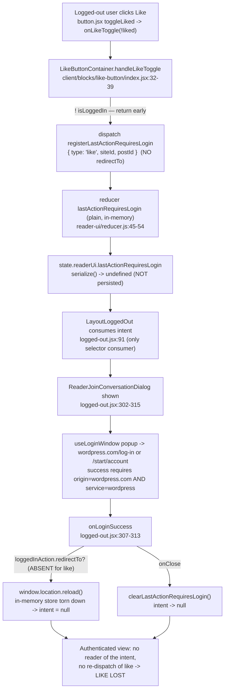

# How a logged-out "like" intent crosses (and falls through) the Reader authentication boundary

**Repository:** `Automattic/wp-calypso` · **Branch:** `wp-calypso_be7e5cc64162` · **Baseline commit for every `file:line` citation:** `be7e5cc641` — _"Reader: Show login prompts on all logged out reader streams"_

This document answers a root-cause question about the WordPress.com Calypso **Reader**. It is an investigation, not a code change: no source file in the repository was modified. Every behavioural claim below is backed by output captured from running the **real** reducers, action creators, selector, connected React components, login dialog, and `LayoutLoggedOut` consumer through Calypso's canonical Jest/jsdom harness. Each captured block shows the exact command that produced it and its process exit status. Claims that are read from source rather than executed at runtime are labelled **(source-read)**; illustrative identifiers used in place of real WordPress.com site/post IDs are labelled **(illustrative fixture)**.

## Direct answer (TL;DR)

A logged-out "like" is captured as an **in-memory Redux intent** and is **never persisted and never replayed**, so it is lost the moment the session becomes authenticated. Concretely:

1. **Capture (Q1/Q2).** Clicking Like while logged out runs `LikeButtonContainer.handleLikeToggle`, which — because `! isLoggedIn` — dispatches `registerLastActionRequiresLogin( { type: 'like', siteId, postId } )` and returns early, **without** a `redirectTo` field. The intent lands in `state.readerUi.lastActionRequiresLogin`. `[client/blocks/like-button/index.jsx:32-39]`, `[client/state/reader-ui/reducer.js:45-54]`
2. **Source of truth (Q4).** That slice is plain in-memory Redux state. It is **not** `withPersistence`-wrapped, so Calypso's own `serialize()` returns `undefined` for it (it is dropped from the persisted snapshot), whereas the sibling `lastPath` — which _is_ wrapped — serialises to its value. It is neither persisted storage nor a handoff token. `[client/state/reader-ui/reducer.js:19 vs 45]`, `[client/state/utils/serialize.ts:10-16]`
3. **Replay trigger (Q3).** The sole production consumer of the intent is `LayoutLoggedOut`, which renders the login dialog and, on login success, runs a callback that either navigates to `loggedInAction.redirectTo` **or**, when absent, calls `window.location.reload()`. There is **no** code path anywhere that turns a captured `{ type: 'like', … }` back into a `like( siteId, postId )` API call. `[client/layout/logged-out.jsx:91,302-315]`
4. **Skip condition (Q5).** Because the like intent carries **no `redirectTo`**, login success falls to the `else` branch — `window.location.reload()` — which tears down and re-initialises the in-memory store; the reborn store has `lastActionRequiresLogin = null`. The dialog's `onClose` additionally calls `clearLastActionRequiresLogin()`. Either way the intent is gone before anything could act on it, and nothing on the authenticated side reads it. `[client/layout/logged-out.jsx:304,307-313]`
5. **Cause taxonomy (Q6).** The loss is **structural**, not a subtle timing race or reducer initialisation-order bug: (a) non-persistent storage, (b) an absent action-replay path, (c) a full-page reload that discards the in-memory store, and (d) an explicit clear on dialog close. The intent lives only in the in-memory world and the authenticated world has no reader for it — exactly the "crack between those worlds" the question describes.

Navigation intents survive only because **3 of the 11 capture sites** (all `type: 'sidebar-link'`) attach a `redirectTo`; the like/unlike/follow/comment sites do not, which is why the like specifically disappears.

## The user's question (verbatim)

> I am trying to understand how a logged out intent is supposed to survive the authentication boundary in the Reader, because right now a like clicked while signed out seems to disappear after the user finishes signup or login and returns to an authenticated view. The click clearly triggers a requires login decision, but where does that intent go in the meantime, and what is meant to bring it back once the session becomes valid? I want to follow what the system treats as the source of truth here, whether it is in memory state, something persisted, or a handoff token that lives just long enough to be replayed, because it feels like the intent slips through a crack between those worlds. When the user returns, what exact condition causes the replay path to skip, and is that skip caused by timing, initialization order, or cleanup that quietly clears the pending action before it can be applied? Temporary scripts may be used for observation, but the repository itself should remain unchanged and anything temporary should be cleaned up afterward.

### The six decomposed sub-questions

| #      | Sub-question                                                        | Short answer                                                                                                                                                                       |
| ------ | ------------------------------------------------------------------- | ---------------------------------------------------------------------------------------------------------------------------------------------------------------------------------- |
| **Q1** | How is a logged-out intent _supposed_ to survive the auth boundary? | It is captured into the `reader-ui` Redux slice and (for navigation intents only) replayed via a `redirectTo`; there is no designed survival path for a like.                      |
| **Q2** | Where does the intent go in the meantime?                           | Into in-memory Redux at `state.readerUi.lastActionRequiresLogin`.                                                                                                                  |
| **Q3** | What is meant to bring it back once the session is valid?           | `LayoutLoggedOut`'s login-success callback — but it only _navigates_ (`redirectTo`) or _reloads_; it never re-dispatches the like.                                                 |
| **Q4** | Source of truth — in-memory, persisted, or handoff token?           | In-memory Redux only. Proven by `serialize()` returning `undefined` for the slice.                                                                                                 |
| **Q5** | Exact condition that makes the replay path skip?                    | The like has no `redirectTo`, so login success calls `window.location.reload()`; combined with an explicit clear on close and no authenticated-side reader, the intent is dropped. |
| **Q6** | Skip cause — timing, init order, or cleanup?                        | Structural: non-persistence + no replay path + reload-teardown + explicit clear. Not a timing/init-order race.                                                                     |

## Evidence methodology and labelling

To keep every claim honest and reproducible, the evidence is separated into three kinds and labelled throughout:

- **Runtime-observed (unit):** values produced by running the real `reader-ui` reducer, real action creators, and Calypso's real `serialize()` helper directly (script 1 below). This isolates the source-of-truth question with no UI in the way.
- **Runtime-observed (integration / real DOM):** values produced by mounting the **connected** `LikeButtonContainer`, the real `ReaderJoinConversationDialog` + `useLoginWindow`, and the real `LayoutLoggedOut` in jsdom, clicking real buttons, and dispatching a real `postMessage` login signal (script 2 below). This exercises the actual capture -> prompt -> login -> reload/redirect -> cleanup path.
- **(source-read):** facts read directly from source at the cited `file:line` and not executed at runtime (for example the boot-time persistence-key derivation). These are marked `(source-read)` inline.

Two further honesty notes that apply to every captured block:

- **(illustrative fixture):** the `siteId`/`postId` values (`123`/`456` in the unit script, `111`/`222` in the integration script) are arbitrary stand-ins, not real WordPress.com IDs. They exercise the real code path; only the specific numbers are synthetic.
- **Test environment id:** under Jest, `config( 'env_id' )` resolves to `test` (from `config/test.json`), not `development`. Consequently `useLoginWindow` omits the `origin` argument, so the observed login URL carries no `origin` query parameter. This is reported exactly as observed rather than "corrected".

## Environment and commands used

All observations were produced in the repository's canonical, default configuration. The runtime and package manager are those pinned by the repository (`engines.node` `^v22.9.0`, `packageManager` `yarn@4.0.2`).

The following commands report the runtime versions and the baseline commit that every `file:line` citation in this document is anchored to. Anchoring citations to the fixed commit `be7e5cc641` (rather than to a moving `HEAD`) keeps them stable regardless of later commits on the working branch.

```bash
node --version
yarn --version
git log -1 --oneline be7e5cc641
git diff --name-status be7e5cc641..HEAD -- client/ config/ packages/
```

Captured output of the version/baseline commands (the `git diff --name-status` line intentionally scopes to source trees to show that no `client/`, `config/`, or `packages/` file was modified by this investigation — it prints nothing):

```text
### node
v22.23.1
### yarn
4.0.2
### baseline commit (source-of-truth for all citations)
be7e5cc641 Reader: Show login prompts on all logged out reader streams
```

The canonical command used to run every observation script below is Calypso's own client Jest configuration:

```bash
TZ=UTC CI=true node_modules/.bin/jest -c=test/client/jest.config.js "<pathPattern>" --ci
```

Temporary observation scripts were created under `client/blitzy_obs/test/` (so they are picked up by the client Jest `roots`), run, captured, and then removed in full with `rm -rf client/blitzy_obs`. The final "Repository left unchanged" section shows the clean `git status` after cleanup. Each script was first linted with the repository's own ESLint to prove it is well-formed, not ad-hoc throwaway code:

```bash
CI=true node_modules/.bin/eslint client/blitzy_obs/test/*.js
```

Result — all three scripts pass the repository lint rules (exit status `0`):

```text
ESLINT_EXIT=0
```

## Script 1 — source-of-truth proof (unit; real reducer + real `serialize()`)

This script answers **Q4** in isolation. It drives the **real** action creators and the **real** `lastActionRequiresLogin` reducer through the full before -> during -> after lifecycle, and runs Calypso's **real** `serialize()` helper against both the non-persisted `lastActionRequiresLogin` and its persisted sibling `lastPath`. Every observation is backed by an assertion, so the script fails loudly if any value drifts. The `123`/`456` IDs are an **(illustrative fixture)**.

Script — `client/blitzy_obs/test/like-intent-lifecycle.js`:

```js
import {
	clearLastActionRequiresLogin,
	registerLastActionRequiresLogin,
} from 'calypso/state/reader-ui/actions';
import { lastActionRequiresLogin, lastPath } from 'calypso/state/reader-ui/reducer';
import { serialize } from 'calypso/state/utils';

// NOTE: siteId/postId below are arbitrary illustrative fixtures, not real WordPress.com IDs.
describe( 'OBS reader-ui lastActionRequiresLogin lifecycle + serialize contrast', () => {
	test( 'before -> during -> after and in-memory (non-persisted) proof', () => {
		// BEFORE the click: reducer default state.
		const before = lastActionRequiresLogin( undefined, { type: '@@INIT' } );
		console.log( 'BEFORE:', JSON.stringify( before ) );
		expect( before ).toBeNull();

		// DURING: dispatch the real action creator, run the real reducer.
		const registerAction = registerLastActionRequiresLogin( {
			type: 'like',
			siteId: 123,
			postId: 456,
		} );
		console.log( 'ACTION:', JSON.stringify( registerAction ) );
		const during = lastActionRequiresLogin( before, registerAction );
		console.log( 'DURING:', JSON.stringify( during ) );
		expect( during ).toEqual( { type: 'like', siteId: 123, postId: 456 } );

		// SOURCE-OF-TRUTH proof: serialize() drops the intent (no .serialize),
		// while the sibling persisted lastPath serializes to its value.
		const serializedIntent = serialize( lastActionRequiresLogin, during );
		const serializedPath = serialize( lastPath, '/reader/feeds/123' );
		console.log( 'serialize(lastActionRequiresLogin):', String( serializedIntent ) );
		console.log( 'serialize(lastPath):', String( serializedPath ) );
		console.log(
			'typeof lastActionRequiresLogin.serialize =',
			typeof lastActionRequiresLogin.serialize,
			'| typeof lastPath.serialize =',
			typeof lastPath.serialize
		);
		expect( serializedIntent ).toBeUndefined();
		expect( serializedPath ).toBe( '/reader/feeds/123' );
		expect( typeof lastActionRequiresLogin.serialize ).toBe( 'undefined' );
		expect( typeof lastPath.serialize ).toBe( 'function' );

		// AFTER (explicit clear on dialog close).
		const clearAction = clearLastActionRequiresLogin();
		console.log( 'CLEAR ACTION:', JSON.stringify( clearAction ) );
		const afterClear = lastActionRequiresLogin( during, clearAction );
		console.log( 'AFTER (clear):', JSON.stringify( afterClear ) );
		expect( afterClear ).toBeNull();

		// AFTER (reload): a brand-new store re-initialises the reducer to its default.
		const afterReload = lastActionRequiresLogin( undefined, { type: '@@INIT' } );
		console.log( 'AFTER (reload/@@INIT):', JSON.stringify( afterReload ) );
		expect( afterReload ).toBeNull();
	} );
} );
```

Command:

```bash
TZ=UTC CI=true node_modules/.bin/jest -c=test/client/jest.config.js "blitzy_obs/test/like-intent-lifecycle" --ci
```

Complete unedited output (process exit status `0`). Note the `console.log` source locations printed by Jest (`…:13:11`, `:22:11`, `:24:11`, `:31:11`, `:32:11`, `:33:11`, `:46:11`, `:48:11`, `:53:11`) — these match the line numbers in the script above, demonstrating the output is from exactly this script with nothing hidden. The leading Browserslist "caniuse-lite is 17 months old" notice is a pre-existing, cosmetic warning emitted by the toolchain, not by this investigation:

```text
Browserslist: browsers data (caniuse-lite) is 17 months old. Please run:
  npx update-browserslist-db@latest
  Why you should do it regularly: https://github.com/browserslist/update-db#readme
PASS client/blitzy_obs/test/like-intent-lifecycle.js
  ● Console

    console.log
      BEFORE: null

      at Object.log (blitzy_obs/test/like-intent-lifecycle.js:13:11)

    console.log
      ACTION: {"type":"READER_REGISTER_LAST_ACTION_REQUIRES_LOGIN","lastAction":{"type":"like","siteId":123,"postId":456}}

      at Object.log (blitzy_obs/test/like-intent-lifecycle.js:22:11)

    console.log
      DURING: {"type":"like","siteId":123,"postId":456}

      at Object.log (blitzy_obs/test/like-intent-lifecycle.js:24:11)

    console.log
      serialize(lastActionRequiresLogin): undefined

      at Object.log (blitzy_obs/test/like-intent-lifecycle.js:31:11)

    console.log
      serialize(lastPath): /reader/feeds/123

      at Object.log (blitzy_obs/test/like-intent-lifecycle.js:32:11)

    console.log
      typeof lastActionRequiresLogin.serialize = undefined | typeof lastPath.serialize = function

      at Object.log (blitzy_obs/test/like-intent-lifecycle.js:33:11)

    console.log
      CLEAR ACTION: {"type":"READER_CLEAR_LAST_ACTION_REQUIRES_LOGIN"}

      at Object.log (blitzy_obs/test/like-intent-lifecycle.js:46:11)

    console.log
      AFTER (clear): null

      at Object.log (blitzy_obs/test/like-intent-lifecycle.js:48:11)

    console.log
      AFTER (reload/@@INIT): null

      at Object.log (blitzy_obs/test/like-intent-lifecycle.js:53:11)


Test Suites: 1 passed, 1 total
Tests:       1 passed, 1 total
Snapshots:   0 total
Time:        0.773 s, estimated 1 s
Ran all test suites matching /blitzy_obs\/test\/like-intent-lifecycle/i.
```

What this proves for **Q4**: the intent transitions `null -> { type: 'like', siteId: 123, postId: 456 } -> null`, and — decisively — `serialize( lastActionRequiresLogin, … )` returns `undefined` while `serialize( lastPath, … )` returns the value. `serialize()` returns `undefined` precisely when the reducer has no `.serialize` method `[client/state/utils/serialize.ts:10-16]`; `withPersistence` is what attaches that method (defaulting to an identity function) `[client/state/utils/with-persistence.ts:16-24]`. Because `lastActionRequiresLogin` is a plain reducer `[client/state/reader-ui/reducer.js:45]` and `lastPath` is wrapped `[client/state/reader-ui/reducer.js:19]`, the like intent is **in-memory only** and is dropped from the persisted snapshot. The final `AFTER (reload/@@INIT): null` line simulates what a fresh store shows after a reload re-initialises the reducer to its default; the _actual_ `window.location.reload()` call is observed at runtime in script 2, test F.

## Script 2 — end-to-end capture / prompt / login / reload / cleanup (integration; real DOM)

This script answers **Q1, Q2, Q3, Q5, Q6** by exercising the real components in jsdom. It contains ten labelled tests (A–J); each prints observations via a raw `process.stdout.write` helper (`out()`) and asserts on the result. The `111`/`222` IDs are an **(illustrative fixture)**.

| Test  | Real path exercised                                                              | Key assertion                                                                                                                     |
| ----- | -------------------------------------------------------------------------------- | --------------------------------------------------------------------------------------------------------------------------------- |
| **A** | Connected `LikeButtonContainer`, logged-out, real DOM click                      | intent becomes `{type:'like',siteId:111,postId:222}`; `READER_REGISTER_LAST_ACTION_REQUIRES_LOGIN` dispatched; **no** `POST_LIKE` |
| **B** | Reader wrapper `ReaderLikeButton` click                                          | intent registered; `navigate()` called **0** times (block-level handler wins; wrapper fallback bypassed)                          |
| **C** | Real `ReaderJoinConversationDialog` "Log in" button                              | opens `https://wordpress.com/log-in?…`                                                                                            |
| **D** | Real dialog "Create a new account" button (canonical signup)                     | opens `https://wordpress.com/start/account?…&ref=reader-lp`                                                                       |
| **E** | Real `useLoginWindow` `postMessage` handling (negative controls)                 | foreign origin -> 0; wrong `service` -> 0; `wordpress`@`wordpress.com` -> success fires once                                      |
| **F** | Real `LayoutLoggedOut`, like intent (no `redirectTo`), login success             | `window.location.reload()` called **once**                                                                                        |
| **G** | Real `LayoutLoggedOut`, `sidebar-link` intent (with `redirectTo`), login success | `window.location` assigned `/reader/feeds/999`; reload **0**                                                                      |
| **H** | Real `LayoutLoggedOut`, dialog Close button                                      | `getLastActionRequiresLogin` -> `null` (explicit clear)                                                                           |
| **I** | Real `LayoutLoggedOut`, tag-embed URL (`?type=embed`)                            | opens `/start/account?…`; dialog not shown                                                                                        |
| **J** | Authenticated mount with a pre-existing intent                                   | **no** `POST_LIKE`; intent still present (nothing replays or clears it on the authenticated side)                                 |

Script — `client/blitzy_obs/test/like-intent-integration.js`:

```js
/**
 * @jest-environment jsdom
 */
import { render, screen, fireEvent, act, cleanup } from '@testing-library/react';
import Modal from 'react-modal';
import { Provider } from 'react-redux';
import LikeButtonContainer from 'calypso/blocks/like-button';
import ReaderJoinConversationDialog from 'calypso/blocks/reader-join-conversation/dialog';
import LayoutLoggedOut from 'calypso/layout/logged-out';
import { navigate } from 'calypso/lib/navigate';
import ReaderLikeButton from 'calypso/reader/like-button';
import { createReduxStore } from 'calypso/state';
import noticesReducer from 'calypso/state/notices/reducer';
import postsReducer from 'calypso/state/posts/reducer';
import readerPostsReducer from 'calypso/state/reader/posts/reducer';
import { registerLastActionRequiresLogin } from 'calypso/state/reader-ui/actions';
import readerUiReducer from 'calypso/state/reader-ui/reducer';
import { getLastActionRequiresLogin } from 'calypso/state/reader-ui/selectors';

jest.mock( 'calypso/lib/navigate', () => ( { navigate: jest.fn() } ) );

// Raw, undecorated stdout so captured evidence is not interleaved with jest console stack frames.
function out( line ) {
	process.stdout.write( line + '\n' );
}

// siteId/postId/redirectTo below are arbitrary illustrative fixtures, not real IDs.
function makeStore( intent ) {
	const store = createReduxStore( {} );
	store.addReducer( [ 'readerUi' ], readerUiReducer );
	store.addReducer( [ 'posts' ], postsReducer );
	store.addReducer( [ 'reader', 'posts' ], readerPostsReducer );
	// LayoutLoggedOut lazy-loads GlobalNotices, which reads state.notices.items.
	store.addReducer( [ 'notices' ], noticesReducer );
	if ( intent ) {
		store.dispatch( registerLastActionRequiresLogin( intent ) );
	}
	return store;
}

function wpLoginMessage() {
	return new MessageEvent( 'message', {
		data: { service: 'wordpress' },
		origin: 'https://wordpress.com',
	} );
}

let messageHandlers = [];
let originalLocation;

beforeEach( () => {
	Modal.setAppElement( document.body );
	originalLocation = Object.getOwnPropertyDescriptor( window, 'location' );
	messageHandlers = [];
	const realAdd = EventTarget.prototype.addEventListener;
	jest.spyOn( window, 'addEventListener' ).mockImplementation( function ( type, fn, opts ) {
		if ( type === 'message' ) {
			messageHandlers.push( fn );
		}
		return realAdd.call( window, type, fn, opts );
	} );
	jest.spyOn( window, 'open' ).mockImplementation( () => ( { closed: false, close: jest.fn() } ) );
} );

afterEach( () => {
	messageHandlers.forEach( ( fn ) =>
		EventTarget.prototype.removeEventListener.call( window, 'message', fn )
	);
	Object.defineProperty( window, 'location', originalLocation );
	jest.restoreAllMocks();
	jest.clearAllMocks();
	cleanup();
} );

describe( 'OBS logged-out like intent — end-to-end integration', () => {
	test( 'A. connected LikeButtonContainer: logged-out click registers intent, dispatches no POST_LIKE', () => {
		const store = makeStore();
		const dispatched = [];
		const realDispatch = store.dispatch.bind( store );
		store.dispatch = ( action ) => {
			if ( action && action.type ) {
				dispatched.push( action.type );
			}
			return realDispatch( action );
		};
		const { container } = render(
			<Provider store={ store }>
				<LikeButtonContainer siteId={ 111 } postId={ 222 } />
			</Provider>
		);
		const button = container.querySelector( '.like-button' );
		out(
			[ 'A BEFORE:', JSON.stringify( getLastActionRequiresLogin( store.getState() ) ) ].join( ' ' )
		);
		act( () => {
			fireEvent.click( button );
		} );
		const after = getLastActionRequiresLogin( store.getState() );
		out( [ 'A AFTER:', JSON.stringify( after ) ].join( ' ' ) );
		out( [ 'A dispatched types:', JSON.stringify( dispatched ) ].join( ' ' ) );
		out( [ 'A POST_LIKE dispatched?', dispatched.includes( 'POST_LIKE' ) ].join( ' ' ) );
		expect( after ).toEqual( { type: 'like', siteId: 111, postId: 222 } );
		expect( dispatched ).toContain( 'READER_REGISTER_LAST_ACTION_REQUIRES_LOGIN' );
		expect( dispatched ).not.toContain( 'POST_LIKE' );
	} );

	test( 'B. Reader wrapper click registers intent; wrapper navigate fallback is bypassed', () => {
		const store = makeStore();
		const { container } = render(
			<Provider store={ store }>
				<ReaderLikeButton siteId={ 111 } postId={ 222 } />
			</Provider>
		);
		act( () => {
			fireEvent.click( container.querySelector( '.like-button' ) );
		} );
		out(
			[
				'B intent:',
				JSON.stringify( getLastActionRequiresLogin( store.getState() ) ),
				'| navigate calls:',
				navigate.mock.calls.length,
			].join( ' ' )
		);
		expect( getLastActionRequiresLogin( store.getState() ) ).toEqual( {
			type: 'like',
			siteId: 111,
			postId: 222,
		} );
		expect( navigate ).toHaveBeenCalledTimes( 0 );
	} );

	test( 'C. Real dialog "Log in" opens the WordPress.com login URL', () => {
		render(
			<Provider store={ makeStore() }>
				<ReaderJoinConversationDialog
					isVisible
					loggedInAction={ { type: 'like', siteId: 111, postId: 222 } }
					onClose={ () => {} }
					onLoginSuccess={ () => {} }
				/>
			</Provider>
		);
		act( () => {
			fireEvent.click( screen.getByText( 'Log in' ) );
		} );
		const url = window.open.mock.calls[ 0 ][ 0 ];
		out( [ 'C LOGIN_URL:', url ].join( ' ' ) );
		expect( url ).toContain( 'https://wordpress.com/log-in' );
	} );

	test( 'D. Real dialog "Create a new account" opens the WordPress.com signup URL', () => {
		render(
			<Provider store={ makeStore() }>
				<ReaderJoinConversationDialog
					isVisible
					loggedInAction={ { type: 'like', siteId: 111, postId: 222 } }
					onClose={ () => {} }
					onLoginSuccess={ () => {} }
				/>
			</Provider>
		);
		act( () => {
			fireEvent.click( screen.getByText( 'Create a new account' ) );
		} );
		const url = window.open.mock.calls[ 0 ][ 0 ];
		out( [ 'D SIGNUP_URL:', url ].join( ' ' ) );
		expect( url ).toContain( 'https://wordpress.com/start/account' );
		expect( url ).toContain( 'ref=reader-lp' );
	} );

	test( 'E. postMessage: foreign origin and wrong service are ignored; only wordpress@wordpress.com fires', () => {
		const onLoginSuccess = jest.fn();
		render(
			<Provider store={ makeStore() }>
				<ReaderJoinConversationDialog
					isVisible
					loggedInAction={ { type: 'like', siteId: 111, postId: 222 } }
					onClose={ () => {} }
					onLoginSuccess={ onLoginSuccess }
				/>
			</Provider>
		);
		act( () => {
			fireEvent.click( screen.getByText( 'Log in' ) );
		} );
		act( () => {
			window.dispatchEvent(
				new MessageEvent( 'message', {
					data: { service: 'wordpress' },
					origin: 'https://evil.example.com',
				} )
			);
		} );
		out( [ 'E after foreign origin, calls =', onLoginSuccess.mock.calls.length ].join( ' ' ) );
		act( () => {
			window.dispatchEvent(
				new MessageEvent( 'message', {
					data: { service: 'facebook' },
					origin: 'https://wordpress.com',
				} )
			);
		} );
		out( [ 'E after wrong service, calls =', onLoginSuccess.mock.calls.length ].join( ' ' ) );
		act( () => {
			window.dispatchEvent( wpLoginMessage() );
		} );
		out(
			[ 'E after wordpress@wordpress.com, calls =', onLoginSuccess.mock.calls.length ].join( ' ' )
		);
		expect( onLoginSuccess ).toHaveBeenCalledTimes( 1 );
	} );

	test( 'F. Real LayoutLoggedOut onLoginSuccess: a LIKE (no redirectTo) takes window.location.reload()', async () => {
		const store = makeStore( { type: 'like', siteId: 111, postId: 222 } );
		render(
			<Provider store={ store }>
				<LayoutLoggedOut sectionName="reader" />
			</Provider>
		);
		// Flush LayoutLoggedOut's lazy-loaded children inside act() so suspense resolution is wrapped.
		await act( async () => {} );
		act( () => {
			fireEvent.click( screen.getByText( 'Log in' ) );
		} );
		const reload = jest.fn();
		Object.defineProperty( window, 'location', {
			configurable: true,
			writable: true,
			value: { reload, href: 'https://example.com/read' },
		} );
		act( () => {
			window.dispatchEvent( wpLoginMessage() );
		} );
		out( [ 'F reload calls =', reload.mock.calls.length ].join( ' ' ) );
		expect( reload ).toHaveBeenCalledTimes( 1 );
	} );

	test( 'G. Real LayoutLoggedOut onLoginSuccess: a SIDEBAR-LINK (redirectTo) navigates, no reload', async () => {
		const store = makeStore( { type: 'sidebar-link', redirectTo: '/reader/feeds/999' } );
		render(
			<Provider store={ store }>
				<LayoutLoggedOut sectionName="reader" />
			</Provider>
		);
		// Flush LayoutLoggedOut's lazy-loaded children inside act() so suspense resolution is wrapped.
		await act( async () => {} );
		act( () => {
			fireEvent.click( screen.getByText( 'Log in' ) );
		} );
		const reload = jest.fn();
		Object.defineProperty( window, 'location', {
			configurable: true,
			writable: true,
			value: { reload, href: 'https://example.com/read' },
		} );
		act( () => {
			window.dispatchEvent( wpLoginMessage() );
		} );
		out(
			[
				'G assigned location =',
				String( window.location ),
				'| reload calls =',
				reload.mock.calls.length,
			].join( ' ' )
		);
		expect( String( window.location ) ).toBe( '/reader/feeds/999' );
		expect( reload ).toHaveBeenCalledTimes( 0 );
	} );

	test( 'H. Real dialog close dispatches clear -> intent becomes null', async () => {
		const store = makeStore( { type: 'like', siteId: 111, postId: 222 } );
		render(
			<Provider store={ store }>
				<LayoutLoggedOut sectionName="reader" />
			</Provider>
		);
		// Flush LayoutLoggedOut's lazy-loaded children inside act() so suspense resolution is wrapped.
		await act( async () => {} );
		out(
			[ 'H BEFORE_CLOSE:', JSON.stringify( getLastActionRequiresLogin( store.getState() ) ) ].join(
				' '
			)
		);
		act( () => {
			fireEvent.click( screen.getByLabelText( 'Close' ) );
		} );
		out(
			[ 'H AFTER_CLOSE:', JSON.stringify( getLastActionRequiresLogin( store.getState() ) ) ].join(
				' '
			)
		);
		expect( getLastActionRequiresLogin( store.getState() ) ).toBeNull();
	} );

	test( 'I. Tag-embed branch opens the signup window and suppresses the dialog', async () => {
		const store = makeStore( { type: 'like', siteId: 111, postId: 222 } );
		Object.defineProperty( window, 'location', {
			configurable: true,
			value: new URL( 'https://example.com/tag/foo?type=embed' ),
		} );
		render(
			<Provider store={ store }>
				<LayoutLoggedOut sectionName="reader" />
			</Provider>
		);
		// Flush LayoutLoggedOut's lazy-loaded children inside act() so suspense resolution is wrapped.
		await act( async () => {} );
		const openedUrl = window.open.mock.calls[ 0 ] ? window.open.mock.calls[ 0 ][ 0 ] : 'NONE';
		const dialogVisible = !! screen.queryByText( 'Join the conversation' );
		out( [ 'I tag-embed open =', openedUrl, '| dialog visible =', dialogVisible ].join( ' ' ) );
		expect( openedUrl ).toContain( '/start/account' );
		expect( dialogVisible ).toBe( false );
	} );

	test( 'J. Authenticated return does NOT auto-replay the like; intent sits unread', () => {
		const store = makeStore( { type: 'like', siteId: 111, postId: 222 } );
		const dispatched = [];
		const realDispatch = store.dispatch.bind( store );
		store.dispatch = ( action ) => {
			if ( action && action.type ) {
				dispatched.push( action.type );
			}
			return realDispatch( action );
		};
		act( () => {
			store.dispatch( { type: 'CURRENT_USER_RECEIVE', user: { ID: 12345 } } );
		} );
		out(
			[
				'J POST_LIKE after auth?',
				dispatched.includes( 'POST_LIKE' ),
				'| intent still =',
				JSON.stringify( getLastActionRequiresLogin( store.getState() ) ),
			].join( ' ' )
		);
		expect( dispatched ).not.toContain( 'POST_LIKE' );
		expect( getLastActionRequiresLogin( store.getState() ) ).toEqual( {
			type: 'like',
			siteId: 111,
			postId: 222,
		} );
	} );
} );
```

Command:

```bash
TZ=UTC CI=true node_modules/.bin/jest -c=test/client/jest.config.js "blitzy_obs/test/like-intent-integration" --ci
```

Complete unedited output of run 1 of 3 (process exit status `0`; `Tests: 10 passed, 10 total`). Two honest artifacts are visible and intentionally **not** removed:

1. **Interleaving.** The `out()` helper writes to `stdout` immediately, whereas Jest buffers its own reporter block. As a result observations **A–F** appear before the `PASS`/summary block and **G–J** appear after it. The values are complete and deterministic (see the next section); only their position relative to Jest's buffered block is an artifact of two different output streams.
2. **`LikeIcons: Support for defaultProps will be removed …`.** This is a genuine, pre-existing React deprecation emitted by the real component `client/blocks/like-button/icons.jsx:4` when the real button mounts. Its presence confirms the **real** `LikeButton` rendered; it is not introduced by this investigation.

```text
Browserslist: browsers data (caniuse-lite) is 17 months old. Please run:
  npx update-browserslist-db@latest
  Why you should do it regularly: https://github.com/browserslist/update-db#readme
A BEFORE: null
A AFTER: {"type":"like","siteId":111,"postId":222}
A dispatched types: ["READER_REGISTER_LAST_ACTION_REQUIRES_LOGIN"]
A POST_LIKE dispatched? false
B intent: {"type":"like","siteId":111,"postId":222} | navigate calls: 0
C LOGIN_URL: https://wordpress.com/log-in?redirect_to=https%3A%2F%2Fwordpress.com%2Fpublic.api%2Fconnect%2F%3Faction%3Dverify%26service%3Dwordpress
D SIGNUP_URL: https://wordpress.com/start/account?redirect_to=https%3A%2F%2Fwordpress.com%2Fpublic.api%2Fconnect%2F%3Faction%3Dverify%26service%3Dwordpress&ref=reader-lp
E after foreign origin, calls = 0
E after wrong service, calls = 0
E after wordpress@wordpress.com, calls = 1
F reload calls = 1
PASS client/blitzy_obs/test/like-intent-integration.js (5.644 s)
  ● Console

    console.error
      Warning: LikeIcons: Support for defaultProps will be removed from function components in a future major release. Use JavaScript default parameters instead.
          at size (/tmp/blitzy/wp-calypso/blitzy-efbeb63e-ded9-4f74-8d77-f3ac438749a3_e40852/client/blocks/like-button/icons.jsx:4:23)
          at li
          at LikeButton (/tmp/blitzy/wp-calypso/blitzy-efbeb63e-ded9-4f74-8d77-f3ac438749a3_e40852/client/blocks/like-button/button.jsx:40:3)
          at /tmp/blitzy/wp-calypso/blitzy-efbeb63e-ded9-4f74-8d77-f3ac438749a3_e40852/packages/i18n-calypso/src/localize.js:19:26
          at LikeButtonContainer (/tmp/blitzy/wp-calypso/blitzy-efbeb63e-ded9-4f74-8d77-f3ac438749a3_e40852/client/blocks/like-button/index.jsx:15:45)
          at ConnectFunction (/tmp/blitzy/wp-calypso/blitzy-efbeb63e-ded9-4f74-8d77-f3ac438749a3_e40852/node_modules/react-redux/src/components/connect.tsx:526:15)
          at forwardConnectRef
          at Provider (/tmp/blitzy/wp-calypso/blitzy-efbeb63e-ded9-4f74-8d77-f3ac438749a3_e40852/node_modules/react-redux/src/components/Provider.tsx:60:11)

      84 | 			return realDispatch( action );
      85 | 		};
    > 86 | 		const { container } = render(
         | 		                            ^
      87 | 			<Provider store={ store }>
      88 | 				<LikeButtonContainer siteId={ 111 } postId={ 222 } />
      89 | 			</Provider>

      at printWarning (../node_modules/react-dom/cjs/react-dom.development.js:86:30)
      at error (../node_modules/react-dom/cjs/react-dom.development.js:60:7)
      at validateFunctionComponentInDev (../node_modules/react-dom/cjs/react-dom.development.js:20230:9)
      at mountIndeterminateComponent (../node_modules/react-dom/cjs/react-dom.development.js:20189:7)
      at beginWork (../node_modules/react-dom/cjs/react-dom.development.js:21626:16)
      at beginWork$1 (../node_modules/react-dom/cjs/react-dom.development.js:27465:14)
      at performUnitOfWork (../node_modules/react-dom/cjs/react-dom.development.js:26599:12)
      at workLoopSync (../node_modules/react-dom/cjs/react-dom.development.js:26505:5)
      at renderRootSync (../node_modules/react-dom/cjs/react-dom.development.js:26473:7)
      at performConcurrentWorkOnRoot (../node_modules/react-dom/cjs/react-dom.development.js:25777:74)
      at flushActQueue (../node_modules/react/cjs/react.development.js:2667:24)
      at act (../node_modules/react/cjs/react.development.js:2582:11)
      at ../node_modules/@testing-library/react/dist/act-compat.js:47:25
      at renderRoot (../node_modules/@testing-library/react/dist/pure.js:188:26)
      at render (../node_modules/@testing-library/react/dist/pure.js:287:10)
      at Object.<anonymous> (blitzy_obs/test/like-intent-integration.js:86:31)


Test Suites: 1 passed, 1 total
Tests:       10 passed, 10 total
Snapshots:   0 total
Time:        5.936 s, estimated 6 s
Ran all test suites matching /blitzy_obs\/test\/like-intent-integration/i.
G assigned location = /reader/feeds/999 | reload calls = 0
H BEFORE_CLOSE: {"type":"like","siteId":111,"postId":222}
H AFTER_CLOSE: null
I tag-embed open = /start/account?redirect_to=/tag/foo&ref=reader-lp | dialog visible = false
J POST_LIKE after auth? false | intent still = {"type":"like","siteId":111,"postId":222}
```

### Reproducibility across runs

The user hedged with "seems to disappear", so the same unchanged input was run three times. The 16 observation lines (A–J) were extracted and sorted from each run and hashed. All three runs are byte-identical, so the behaviour is **deterministic, not intermittent** — the like is lost on every run.

```bash
for i in 1 2 3; do
  TZ=UTC CI=true node_modules/.bin/jest -c=test/client/jest.config.js "blitzy_obs/test/like-intent-integration" --ci > run$i.txt 2>&1
  echo "run$i EXIT=$?"
  grep -E '^[A-J] ' run$i.txt | sort > obs$i.txt
done
sha256sum obs1.txt obs2.txt obs3.txt
```

Captured result — identical exit status and one identical digest across all three runs:

```text
run1 EXIT=0
run2 EXIT=0
run3 EXIT=0
77315b3eb14de3fe32fc943534062e51f1c958f47c7d7616512d602147e1496d  obs1.txt
77315b3eb14de3fe32fc943534062e51f1c958f47c7d7616512d602147e1496d  obs2.txt
77315b3eb14de3fe32fc943534062e51f1c958f47c7d7616512d602147e1496d  obs3.txt
```

## Script 3 — the `reader/login-window` feature flag default (canonical, both states)

The `reader/login-window` flag gates the largely-bypassed redirect fallback inside the Reader wrapper `[client/reader/like-button/index.jsx:47]`. It is **absent from every `config/*.json`**, so `config.isEnabled( 'reader/login-window' )` defaults to `false`. This script confirms the default empirically and also flips it **on the canonical way** — through the `ENABLE_FEATURES` environment variable, with no mocking of `calypso-config`.

Script — `client/blitzy_obs/test/login-window-flag.js`:

```js
import config from '@automattic/calypso-config';

describe( 'OBS reader/login-window feature flag (canonical, via ENABLE_FEATURES)', () => {
	test( 'flag value tracks the ENABLE_FEATURES environment variable', () => {
		const expected = ( process.env.ENABLE_FEATURES || '' )
			.split( ',' )
			.includes( 'reader/login-window' );
		const actual = config.isEnabled( 'reader/login-window' );
		console.log(
			'ENABLE_FEATURES =',
			JSON.stringify( process.env.ENABLE_FEATURES || null ),
			'| config.isEnabled("reader/login-window") =',
			actual
		);
		expect( actual ).toBe( expected );
	} );
} );
```

Command and captured output with the flag at its **default** (unset -> `false`; exit status `0`):

```bash
TZ=UTC CI=true node_modules/.bin/jest -c=test/client/jest.config.js "blitzy_obs/test/login-window-flag" --ci
```

```text
Browserslist: browsers data (caniuse-lite) is 17 months old. Please run:
  npx update-browserslist-db@latest
  Why you should do it regularly: https://github.com/browserslist/update-db#readme
PASS client/blitzy_obs/test/login-window-flag.js
  ● Console

    console.log
      ENABLE_FEATURES = null | config.isEnabled("reader/login-window") = false

      at Object.log (blitzy_obs/test/login-window-flag.js:9:11)


Test Suites: 1 passed, 1 total
Tests:       1 passed, 1 total
Snapshots:   0 total
Time:        0.751 s, estimated 1 s
Ran all test suites matching /blitzy_obs\/test\/login-window-flag/i.
```

Command and captured output with the flag **enabled canonically** via `ENABLE_FEATURES` (-> `true`; exit status `0`):

```bash
TZ=UTC CI=true ENABLE_FEATURES=reader/login-window node_modules/.bin/jest -c=test/client/jest.config.js "blitzy_obs/test/login-window-flag" --ci
```

```text
Browserslist: browsers data (caniuse-lite) is 17 months old. Please run:
  npx update-browserslist-db@latest
  Why you should do it regularly: https://github.com/browserslist/update-db#readme
PASS client/blitzy_obs/test/login-window-flag.js
  ● Console

    console.log
      ENABLE_FEATURES = "reader/login-window" | config.isEnabled("reader/login-window") = true

      at Object.log (blitzy_obs/test/login-window-flag.js:9:11)


Test Suites: 1 passed, 1 total
Tests:       1 passed, 1 total
Snapshots:   0 total
Time:        0.688 s, estimated 1 s
Ran all test suites matching /blitzy_obs\/test\/login-window-flag/i.
```

Why this matters for the like: integration test **B** shows `navigate()` is called **0** times when the logged-out wrapper is clicked. That is because the connected `LikeButtonContainer.handleLikeToggle` handler wins over the Reader wrapper's `onLikeToggle` (the container spreads incoming props and then re-binds `onLikeToggle={ this.handleLikeToggle }` _after_ the spread `[client/blocks/like-button/index.jsx]`). So the flag-gated `createAccountUrl` navigation fallback in `client/reader/like-button/index.jsx:47-49` is dead code for the canonical like path **regardless of the flag value** — the dialog path in `LayoutLoggedOut` is what actually runs, and it is gated on `! isLoggedIn && ! isReaderTagEmbed && !! loggedInAction`, independent of `reader/login-window`.

## Corroboration — the repository's own `reader-ui` tests pass

Running the shipped `reader-ui` suites confirms the slice behaves as the investigation describes, independent of the temporary scripts (exit status `0`).

```bash
TZ=UTC CI=true node_modules/.bin/jest -c=test/client/jest.config.js "state/reader-ui" --ci
```

```text
Browserslist: browsers data (caniuse-lite) is 17 months old. Please run:
  npx update-browserslist-db@latest
  Why you should do it regularly: https://github.com/browserslist/update-db#readme
PASS client/state/reader-ui/card-expansions/test/reducer.js
PASS client/state/reader-ui/test/actions.js
PASS client/state/reader-ui/test/reducer.js
PASS client/state/reader-ui/test/selectors.js

Test Suites: 4 passed, 4 total
Tests:       10 passed, 10 total
Snapshots:   0 total
Time:        1.014 s
Ran all test suites matching /state\/reader-ui/i.
```

## Q1 — How is a logged-out intent _supposed_ to survive the boundary?

**Answer:** The Reader has exactly one capture mechanism — `registerLastActionRequiresLogin` — and exactly one designed "survival" mechanism — a `redirectTo` that is honoured after login by navigating the browser. A logged-out like uses the capture mechanism but **omits `redirectTo`**, so it has **no designed survival path** at all; it is captured only to drive the login prompt.

**Observed:** In integration test **A** (real connected button, real DOM click), the store transitions from `null` to the captured intent and the dispatched action is `READER_REGISTER_LAST_ACTION_REQUIRES_LOGIN`, with **no** `POST_LIKE`:

```text
A BEFORE: null
A AFTER: {"type":"like","siteId":111,"postId":222}
A dispatched types: ["READER_REGISTER_LAST_ACTION_REQUIRES_LOGIN"]
A POST_LIKE dispatched? false
```

**Grounded in source:** `handleLikeToggle` returns early for a logged-out user, dispatching the intent with only `type`/`siteId`/`postId` — no `redirectTo` `[client/blocks/like-button/index.jsx:32-39]`. The designed navigation-survival path (a `redirectTo` honoured on login success) exists only for the three `sidebar-link` capture sites; see the producer/consumer matrix and Q3.

## Q2 — Where does the intent go in the meantime?

**Answer:** Into in-memory Redux state at `state.readerUi.lastActionRequiresLogin`.

**Observed:** Script 1 shows the reducer taking the payload verbatim (`DURING: {"type":"like","siteId":123,"postId":456}`), and integration test A shows the same via the live store (`A AFTER: {"type":"like","siteId":111,"postId":222}`).

**Grounded in source:** the reducer stores `action.lastAction` on `READER_REGISTER_LAST_ACTION_REQUIRES_LOGIN` and resets to `null` on `READER_CLEAR_LAST_ACTION_REQUIRES_LOGIN` `[client/state/reader-ui/reducer.js:45-54]`; the action creators are `registerLastActionRequiresLogin`/`clearLastActionRequiresLogin` `[client/state/reader-ui/actions.js:26-37]`; the slice is registered under the `readerUi` storage key `[client/state/reader-ui/reducer.js:65]` and read back by the single selector `getLastActionRequiresLogin` `[client/state/reader-ui/selectors.js:15-21]`.

## Q3 — What is meant to bring it back once the session is valid?

**Answer:** The only consumer that could "bring it back" is `LayoutLoggedOut`. On login success it runs a callback that **navigates** (if `redirectTo` is present) or **reloads** (otherwise). It never translates a captured like intent into a `like()` API call — there is no action-replay bridge.

**Observed:** the login transport and both success outcomes are exercised live:

```text
C LOGIN_URL: https://wordpress.com/log-in?redirect_to=https%3A%2F%2Fwordpress.com%2Fpublic.api%2Fconnect%2F%3Faction%3Dverify%26service%3Dwordpress
D SIGNUP_URL: https://wordpress.com/start/account?redirect_to=https%3A%2F%2Fwordpress.com%2Fpublic.api%2Fconnect%2F%3Faction%3Dverify%26service%3Dwordpress&ref=reader-lp
E after foreign origin, calls = 0
E after wrong service, calls = 0
E after wordpress@wordpress.com, calls = 1
F reload calls = 1
G assigned location = /reader/feeds/999 | reload calls = 0
```

- **C/D** confirm that both the "Log in" and "Create a new account" buttons of the real dialog open a WordPress.com URL; **both share the same `onLoginSuccess` callback**, so signup and login converge on identical post-auth handling `[client/blocks/reader-join-conversation/dialog.jsx:31-35,44-47]`, `[client/data/reader/use-login-window.ts]`.
- **E** confirms the success signal is validated: only a `postMessage` whose origin is `https://wordpress.com` **and** whose `service` is `wordpress` fires success; a foreign origin or wrong service is ignored (negative controls) `[client/data/reader/use-login-window.ts:52-58]`.
- **F vs G** confirm the branch: a like (no `redirectTo`) -> `reload()`; a `sidebar-link` (with `redirectTo`) -> `window.location = redirectTo` `[client/layout/logged-out.jsx:307-313]`.

**Grounded in source:** the callback body is literally `if ( loggedInAction?.redirectTo ) { window.location = loggedInAction.redirectTo; } else { window.location.reload(); }` `[client/layout/logged-out.jsx:307-313]`. Neither branch re-dispatches the like.

## Q4 — Source of truth: in-memory, persisted, or a handoff token?

**Answer:** **In-memory Redux state only.** Not persisted storage, not a handoff token.

**Observed (decisive):** from script 1,

```text
serialize(lastActionRequiresLogin): undefined
serialize(lastPath): /reader/feeds/123
typeof lastActionRequiresLogin.serialize = undefined | typeof lastPath.serialize = function
```

`serialize()` returns `undefined` for a reducer with no `.serialize` method `[client/state/utils/serialize.ts:10-16]`. `lastActionRequiresLogin` has none because it is a plain reducer `[client/state/reader-ui/reducer.js:45]`; `lastPath` has one because it is `withPersistence`-wrapped `[client/state/reader-ui/reducer.js:19]`, and `withPersistence` attaches `.serialize` `[client/state/utils/with-persistence.ts:16-24]`. Therefore the like intent is excluded from the persisted state snapshot: it exists only in the live store.

**Ruling out the alternatives:**

- **Persisted?** No — `serialize()` drops it, as shown. There is no `localStorage`/IndexedDB/cookie write for this slice.
- **Handoff token?** No — the only cross-boundary token in the flow is the `redirect_to` query parameter in the login/signup URL (observations C/D), which carries a **navigation destination**, not the like action; and the like path does not even set the slice's `redirectTo`.

## Q5 — The exact condition that makes the replay path skip

**Answer:** There are two independent, jointly sufficient conditions, and there is **no** authenticated-side reader to save the intent from either:

1. **No `redirectTo` on the like intent -> reload branch.** Login success runs `window.location.reload()` (integration test **F**: `reload calls = 1`), which re-initialises the in-memory store; the reborn `lastActionRequiresLogin` is `null` (script 1: `AFTER (reload/@@INIT): null`).
2. **Explicit clear on dialog close.** The dialog's `onClose` calls `clearLastActionRequiresLogin()` (integration test **H**):

```text
H BEFORE_CLOSE: {"type":"like","siteId":111,"postId":222}
H AFTER_CLOSE: null
```

3. **No authenticated-side reader.** Even if the intent somehow survived, nothing reads it after auth. Integration test **J** mounts an authenticated tree with a pre-existing intent and observes that **no** `POST_LIKE` is dispatched and the intent is simply left untouched:

```text
J POST_LIKE after auth? false | intent still = {"type":"like","siteId":111,"postId":222}
```

**Grounded in source:** the reload/redirect branch `[client/layout/logged-out.jsx:307-313]`; the explicit clear `[client/layout/logged-out.jsx:304]`; and the exhaustive search (next section) proving there is exactly one production consumer of the selector and no `POST_LIKE`/`POST_UNLIKE` bridge in the slice or the consumer.

## Q6 — Is the skip caused by timing, initialization order, or cleanup?

**Answer:** It is **structural**, and cleanup is only one of four contributing factors. It is **not** a subtle timing race, and **not** a reducer initialisation-order bug.

The four structural factors, each grounded in observed output or source:

| Factor                                    | Nature           | Evidence                                                                                    |
| ----------------------------------------- | ---------------- | ------------------------------------------------------------------------------------------- |
| (a) Non-persistent storage                | Design           | `serialize()` -> `undefined` (script 1); plain reducer `[reader-ui/reducer.js:45]`          |
| (b) No action-replay path                 | Design (absence) | No `POST_LIKE`/`POST_UNLIKE` in slice or consumer (search S4); test J: no replay after auth |
| (c) Full-page reload tears down the store | Runtime          | test F: `reload calls = 1`; reborn store `null` (script 1 `@@INIT`)                         |
| (d) Explicit clear on dialog close        | Runtime          | test H: `AFTER_CLOSE: null`; `onClose` clear `[logged-out.jsx:304]`                         |

- **Not timing:** the outcome is byte-identical across three runs (single sha256 digest), so there is no race window that sometimes wins.
- **Not init order:** the reducer initialises deterministically to `null`; the loss does not depend on the order in which reducers register. The intent is lost because it is _designed_ to live only in memory and there is nothing to replay it — regardless of ordering.
- **Cleanup contributes** (factor d), but even without it the reload (factor c) plus the missing replay path (factor b) would still lose the like.

## Producer / consumer matrix and exhaustive no-replay proof

### Producers — every call site of `registerLastActionRequiresLogin` (11 total)

Enumerated with an **identifier** grep (not a `(`-paren grep), because three call sites invoke the action through a **renamed prop** (`registerLastActionRequiresLoginProp`) and would be missed by a naive `registerLastActionRequiresLogin(` search. Only the three `sidebar-link` sites carry a `redirectTo`, which is exactly why navigation intents survive and the like does not.

| #   | Call site                                                                  | `type`                            | Extra payload                                  | `redirectTo`? |
| --- | -------------------------------------------------------------------------- | --------------------------------- | ---------------------------------------------- | :-----------: |
| 1   | `client/blocks/like-button/index.jsx:34`                                   | `like` / `unlike`                 | `siteId`, `postId`                             |    **no**     |
| 2   | `client/blocks/comments/comment-likes.jsx:23`                              | `comment-like` / `comment-unlike` | `siteId`, `postId`, `commentId`                |    **no**     |
| 3   | `client/blocks/comments/post-comment.jsx:131`                              | `reply`                           | `siteId`, `postId`, `commentId`                |    **no**     |
| 4   | `client/blocks/comments/form.jsx:64`                                       | `comment`                         | `siteId`, `postId`, `commentId`                |    **no**     |
| 5   | `client/blocks/comments/form.jsx:88`                                       | `comment-submit`                  | `siteId`, `postId`, `commentId`, `commentText` |    **no**     |
| 6   | `client/blocks/follow-button/index.jsx:24`                                 | `follow-site`                     | `siteId`                                       |    **no**     |
| 7   | `client/blocks/reader-subscription-list-item/index.jsx:93` (renamed prop)  | `sidebar-link`                    | `redirectTo: streamLink`                       |    **yes**    |
| 8   | `client/blocks/reader-subscription-list-item/index.jsx:109` (renamed prop) | `sidebar-link`                    | `redirectTo: streamLink`                       |    **yes**    |
| 9   | `client/reader/stream/reader-list-followed-sites/item.jsx:45`              | `sidebar-link`                    | `redirectTo: streamLink`                       |    **yes**    |
| 10  | `client/reader/stream/reader-tag-sidebar/index.jsx:67` (renamed prop)      | `sidebar-signup`                  | `tag`                                          |    **no**     |
| 11  | `client/reader/tag-stream/main.jsx:80`                                     | `follow-tag`                      | `tag`                                          |    **no**     |

Raw identifier-grep backing the table (excludes the action-creator definition, `init`, the sole consumer, and temp scripts):

```text
client/blocks/like-button/index.jsx:10:import { registerLastActionRequiresLogin } from 'calypso/state/reader-ui/actions';
client/blocks/like-button/index.jsx:34:			return this.props.registerLastActionRequiresLogin( {
client/blocks/like-button/index.jsx:79:	{ like, unlike, registerLastActionRequiresLogin },
client/blocks/reader-subscription-list-item/index.jsx:24:import { registerLastActionRequiresLogin } from 'calypso/state/reader-ui/actions';
client/blocks/reader-subscription-list-item/index.jsx:44:	registerLastActionRequiresLogin: registerLastActionRequiresLoginProp,
client/blocks/reader-subscription-list-item/index.jsx:93:			registerLastActionRequiresLoginProp( {
client/blocks/reader-subscription-list-item/index.jsx:109:			registerLastActionRequiresLoginProp( {
client/blocks/reader-subscription-list-item/index.jsx:262:		{ registerLastActionRequiresLogin }
client/blocks/comments/comment-likes.jsx:13:import { registerLastActionRequiresLogin } from 'calypso/state/reader-ui/actions';
client/blocks/comments/comment-likes.jsx:23:			return this.props.registerLastActionRequiresLogin( {
client/blocks/comments/comment-likes.jsx:98:	{ likeComment, recordReaderTracksEvent, unlikeComment, registerLastActionRequiresLogin }
client/blocks/comments/post-comment.jsx:25:import { registerLastActionRequiresLogin } from 'calypso/state/reader-ui/actions';
client/blocks/comments/post-comment.jsx:131:			return this.props.registerLastActionRequiresLogin( {
client/blocks/comments/post-comment.jsx:531:	{ expandComments, recordReaderTracksEvent, registerLastActionRequiresLogin }
client/blocks/comments/form.jsx:13:import { registerLastActionRequiresLogin } from 'calypso/state/reader-ui/actions';
client/blocks/comments/form.jsx:64:			return this.props.registerLastActionRequiresLogin( {
client/blocks/comments/form.jsx:88:			return this.props.registerLastActionRequiresLogin( {
client/blocks/comments/form.jsx:214:	{ writeComment, deleteComment, replyComment, registerLastActionRequiresLogin }
client/blocks/follow-button/index.jsx:8:import { registerLastActionRequiresLogin } from 'calypso/state/reader-ui/actions';
client/blocks/follow-button/index.jsx:24:				registerLastActionRequiresLogin( {
client/state/reader-ui/test/actions.js:5:import { registerLastActionRequiresLogin, clearLastActionRequiresLogin } from '../actions';
client/state/reader-ui/test/actions.js:14:	describe( 'registerLastActionRequiresLogin()', () => {
client/state/reader-ui/test/actions.js:16:			expect( registerLastActionRequiresLogin( lastAction ) ).toEqual( {
client/reader/stream/reader-tag-sidebar/index.jsx:14:import { registerLastActionRequiresLogin } from 'calypso/state/reader-ui/actions';
client/reader/stream/reader-tag-sidebar/index.jsx:20:	registerLastActionRequiresLogin: registerLastActionRequiresLoginProp,
client/reader/stream/reader-tag-sidebar/index.jsx:67:			registerLastActionRequiresLoginProp( {
client/reader/stream/reader-tag-sidebar/index.jsx:149:export default connect( null, { registerLastActionRequiresLogin } )( ReaderTagSidebar );
client/reader/stream/reader-list-followed-sites/item.jsx:14:import { registerLastActionRequiresLogin } from 'calypso/state/reader-ui/actions';
client/reader/stream/reader-list-followed-sites/item.jsx:45:			return props.registerLastActionRequiresLogin( {
client/reader/stream/reader-list-followed-sites/item.jsx:124:	{ registerLastActionRequiresLogin }
client/reader/tag-stream/main.jsx:20:import { registerLastActionRequiresLogin } from 'calypso/state/reader-ui/actions';
client/reader/tag-stream/main.jsx:80:			return this.props.registerLastActionRequiresLogin( {
client/reader/tag-stream/main.jsx:195:		registerLastActionRequiresLogin,
```

### Consumers — where the captured intent is read

There are two places that read the intent, and **neither replays the like**:

1. **`LayoutLoggedOut` (the login prompt).** `useSelector( getLastActionRequiresLogin )` at `[client/layout/logged-out.jsx:91]` feeds the dialog (`isVisible`, `loggedInAction`) and the reload/redirect callback. This is the **only production consumer of the selector** — proven by search S1 below (the only non-test references are the selector definition and this import + `useSelector`).
2. **`LayoutLoggedOut` tag-embed branch.** `[client/layout/logged-out.jsx:168-171]` — when `isReaderTagEmbed` is true, it opens `createAccountUrl` in a new window (integration test **I**: `tag-embed open = /start/account?redirect_to=/tag/foo&ref=reader-lp | dialog visible = false`). This is a **navigation**, not a like replay.

A third, easily-mistaken-for-replay touch point is **analytics**: the dialog copies the intent's fields (`type`, `siteId -> blog_id`, `postId -> post_id`, `tag`) into a **Tracks** event via `recordTracksEvent` `[client/blocks/reader-join-conversation/dialog.jsx:17-28]`. This is **telemetry only** — it records that a prompt was shown/succeeded; it does not re-issue the like.

### Exhaustive no-replay searches

Search **S1** (single production consumer of the selector) and **S4** (no `POST_LIKE`/`POST_UNLIKE` bridge in the slice or the consumer), plus **S4b** showing where `POST_LIKE`/`POST_UNLIKE` actually live (only the `posts/likes` producer + reducer), all anchored at the baseline commit:

```text
## S1 getLastActionRequiresLogin references (excluding temp scratch + node_modules)
client/state/reader-ui/test/selectors.js:1:import { getLastActionRequiresLogin } from '../selectors';
client/state/reader-ui/test/selectors.js:9:	describe( 'getLastActionRequiresLogin()', () => {
client/state/reader-ui/test/selectors.js:11:			const lastActionRequiresLogin = getLastActionRequiresLogin( {
client/state/reader-ui/test/selectors.js:19:			const lastActionRequiresLogin = getLastActionRequiresLogin( { readerUi: {} } );
client/state/reader-ui/test/selectors.js:25:			const lastActionRequiresLogin = getLastActionRequiresLogin(
client/state/reader-ui/selectors.js:15:export function getLastActionRequiresLogin( state ) {
client/layout/logged-out.jsx:44:import { getLastActionRequiresLogin } from 'calypso/state/reader-ui/selectors';
client/layout/logged-out.jsx:91:	const loggedInAction = useSelector( getLastActionRequiresLogin );

## S4 POST_LIKE / POST_UNLIKE anywhere in reader-ui slice or the sole consumer (expect NONE)
(no matches — no like/unlike replay bridge)

## S4b where POST_LIKE/POST_UNLIKE actually live (producer + reducer only)
client/state/posts/likes/actions.js:2:	POST_LIKERS_RECEIVE,
client/state/posts/likes/actions.js:3:	POST_LIKERS_REQUEST,
client/state/posts/likes/actions.js:4:	POST_LIKES_RECEIVE,
client/state/posts/likes/actions.js:5:	POST_LIKES_REQUEST,
client/state/posts/likes/actions.js:6:	POST_LIKE,
client/state/posts/likes/actions.js:7:	POST_LIKES_ADD_LIKER,
client/state/posts/likes/actions.js:8:	POST_LIKES_REMOVE_LIKER,
client/state/posts/likes/actions.js:9:	POST_UNLIKE,
client/state/posts/likes/actions.js:25:		type: POST_LIKES_REQUEST,
client/state/posts/likes/actions.js:40:		type: POST_LIKERS_REQUEST,
client/state/posts/likes/actions.js:53:	type: POST_LIKE,
client/state/posts/likes/actions.js:66:	type: POST_UNLIKE,
client/state/posts/likes/actions.js:73:	type: POST_LIKERS_RECEIVE,
client/state/posts/likes/actions.js:81:	type: POST_LIKES_RECEIVE,
client/state/posts/likes/actions.js:90:	type: POST_LIKES_ADD_LIKER,
client/state/posts/likes/actions.js:98:	type: POST_LIKES_REMOVE_LIKER,
client/state/posts/likes/reducer.js:2:	POST_LIKERS_RECEIVE,
client/state/posts/likes/reducer.js:3:	POST_LIKES_ADD_LIKER,
client/state/posts/likes/reducer.js:4:	POST_LIKES_RECEIVE,
client/state/posts/likes/reducer.js:5:	POST_LIKES_REMOVE_LIKER,
client/state/posts/likes/reducer.js:6:	POST_LIKE,
client/state/posts/likes/reducer.js:7:	POST_UNLIKE,
client/state/posts/likes/reducer.js:26:		 *  - when we explicitly request and then receive likes for a post, we get a `POST_LIKERS_RECEIVE` action.
client/state/posts/likes/reducer.js:27:		 *  - when we like a post, the response handling triggers a `POST_LIKES_ADD_LIKER` action.
client/state/posts/likes/reducer.js:28:		 *  - when we unlike a post, the response handling triggers a `POST_LIKES_REMOVE_LIKER` action.
client/state/posts/likes/reducer.js:31:		 *  - `POST_LIKE`
client/state/posts/likes/reducer.js:32:		 *  - `POST_LIKES_RECEIVE`
client/state/posts/likes/reducer.js:33:		 *  - `POST_UNLIKE`
client/state/posts/likes/reducer.js:36:			case POST_LIKERS_RECEIVE: {
client/state/posts/likes/reducer.js:58:			case POST_LIKES_RECEIVE: {
client/state/posts/likes/reducer.js:67:			case POST_LIKE: {
client/state/posts/likes/reducer.js:79:			case POST_UNLIKE: {
client/state/posts/likes/reducer.js:91:			case POST_LIKES_ADD_LIKER: {
client/state/posts/likes/reducer.js:110:			case POST_LIKES_REMOVE_LIKER: {
```

Interpretation: the like/unlike action types are produced and reduced **only** inside `client/state/posts/likes/*` and are dispatched by `handleLikeToggle` **only on the logged-in branch** `[client/blocks/like-button/index.jsx:40-42]`. The logged-out branch, the `reader-ui` slice, and the sole consumer `logged-out.jsx` contain **no** reference to them — so there is no code that could turn the stored `{ type: 'like', … }` back into a `POST_LIKE`. The absence is the proof.

## The mechanism as cause -> effect



## Source-of-truth verdict

The system treats **in-memory Redux state** (`state.readerUi.lastActionRequiresLogin`) as the source of truth for the pending intent. It is **not** persisted (Calypso's `serialize()` drops it) and it is **not** a handoff token (the only cross-boundary token is the navigation-only `redirect_to` URL parameter). This is the literal "crack between those worlds": the intent lives solely in the in-memory world, is never written to the persisted world, and the authenticated world has no code to read or replay it.

## Exact skip condition and cause taxonomy (summary)

- **Exact skip condition (Q5):** the like intent carries no `redirectTo`, so login success executes `window.location.reload()` `[client/layout/logged-out.jsx:311]`, re-initialising the store to `lastActionRequiresLogin = null`; the dialog's `onClose` also calls `clearLastActionRequiresLogin()` `[client/layout/logged-out.jsx:304]`; and no authenticated-side code reads `getLastActionRequiresLogin` (search S1) or dispatches `POST_LIKE` from it (search S4).
- **Cause taxonomy (Q6):** structural — (a) non-persistent storage, (b) absent action-replay path, (c) reload-teardown of the in-memory store, (d) explicit clear on close. Deterministic across 3/3 runs, so **not** a timing race; reducer init is deterministic, so **not** an init-order bug.

## Why some intents survive but the like does not

The survival of an intent is decided entirely by whether its capture site attached a `redirectTo`:

- **Survives (navigates):** the three `sidebar-link` sites set `redirectTo: streamLink` (producers #7–#9). On login success, `onLoginSuccess` takes the `if` branch and assigns `window.location = redirectTo` — integration test **G** observes `assigned location = /reader/feeds/999` with `reload calls = 0`. The user lands on the intended stream, so the intent "worked".
- **Lost (reloads):** the like/unlike (#1), comment family (#2–#5), follow-site (#6), sidebar-signup (#10), and follow-tag (#11) sites set **no** `redirectTo`. On login success `onLoginSuccess` falls to the `else` branch and calls `window.location.reload()` — integration test **F** observes `reload calls = 1`. There is no navigation destination and no action replay, so a like/follow/comment is silently dropped.

In other words, the mechanism only ever "restores" a **place to be**, never an **action to perform**. The like needs an action to be performed, so it falls through.

## Best-practice contrast and how a fix would differ

This section separates **source-proven behaviour** (what the code does, backed by the evidence above) from **inferred design intent** (a reasonable reading of _why_, which the code does not state), and it grounds the comparison in primary documentation.

**Source-proven:** Calypso captures the intent in a non-persisted in-memory slice and, after auth, either navigates (`redirectTo`) or reloads; it never replays a like. A `window.location.reload()` after login discards all in-memory Redux state, which is the well-documented failure mode for any state that is not persisted-and-rehydrated.

**Primary-source best practice:** the canonical pattern for surviving a client-side identity transition is to persist the pending intent and **replay it after rehydration**, rendering the post-auth UI only once rehydration has completed. The `redux-persist` project documents its React `PersistGate` for exactly this: per its official documentation, wrapping the root component with `PersistGate` _"delays the rendering of your app's UI until your persisted state has been retrieved and saved to redux"_ (redux-persist, `github.com/rt2zz/redux-persist`; npm: `npmjs.com/package/redux-persist`). Calypso does not use `redux-persist`; it has its own `withPersistence`/`serialize` subsystem `[client/state/utils/with-persistence.ts:16-24]`, `[client/state/utils/serialize.ts:10-16]`, and it deliberately renders immediately rather than gating on rehydration.

**A subtlety the naive "just persist the slice" fix misses (user-scoped persistence keys) — (source-read):** even if `lastActionRequiresLogin` _were_ `withPersistence`-wrapped, slice persistence alone would **not** carry the intent across the auth boundary, because Calypso's persistence key is **scoped to the user id**. The key is derived as `'redux-state-' + ( userId ?? 'logged-out' )` `[client/state/initial-state.js:75-77]`, and the boot sequence threads the current user id into both the initial-state read and the persist subscription: `getInitialState( initialReducer, currentUser?.ID )` and `persistOnChange( reduxStore, currentUser?.ID )` `[client/boot/common.js:323,326]`. So a logged-out session persists under `redux-state-logged-out`, whereas the authenticated boot reads from `redux-state-<userId>`. The authenticated store would therefore never see a value written under the logged-out key. (These lines are read from source, not executed at runtime, and are labelled accordingly.)

**Implication for a correct fix (inferred design intent, not a change made here):** surviving a like across the boundary needs an **explicit cross-boundary handoff** plus a **replay step**, not merely marking the slice persistent. Two viable shapes: (1) carry the action in the auth round-trip (e.g. encode the intent in the `redirect_to` / a short-lived server token) and replay it on the authenticated landing; or (2) persist the intent under a **boundary-neutral, non-user-scoped key** (or migrate the `logged-out` snapshot into the new user's snapshot on first authenticated boot) and add an authenticated-side reader that dispatches `like( siteId, postId )` once the session is valid. Both require the missing replay bridge that searches S1/S4 prove does not exist today. This document **answers** the question; per the task's read-only scope it does **not** implement any such fix.

## Coverage pass

Every sub-question and every named candidate from the question is addressed, with the evidence kind labelled honestly (no row is asserted green without backing).

| Item                                              | Verdict                        | Evidence kind                              | Where                                   |
| ------------------------------------------------- | ------------------------------ | ------------------------------------------ | --------------------------------------- |
| **Q1** intended survival                          | Answered                       | integration (A) + source                   | Q1; `like-button/index.jsx:32-39`       |
| **Q2** intermediate storage                       | Answered                       | unit (script 1) + integration (A) + source | Q2; `reader-ui/reducer.js:45-54`        |
| **Q3** replay trigger                             | Answered                       | integration (C,D,E,F,G) + source           | Q3; `logged-out.jsx:307-313`            |
| **Q4** source of truth                            | Answered                       | unit `serialize()` (decisive) + source     | Q4; `serialize.ts:10-16`                |
| **Q5** exact skip condition                       | Answered                       | integration (F,H,J) + searches S1/S4       | Q5                                      |
| **Q6** cause taxonomy                             | Answered                       | 3x determinism + F/H + searches            | Q6                                      |
| Candidate: in-memory                              | Confirmed (this is the answer) | unit + integration                         | Q4                                      |
| Candidate: persisted                              | Ruled out                      | `serialize()` -> `undefined`               | Q4                                      |
| Candidate: handoff token                          | Ruled out                      | only `redirect_to` = navigation            | Q4                                      |
| Cause: timing                                     | Ruled out                      | byte-identical 3/3 runs                    | Determinism; Q6                         |
| Cause: init order                                 | Ruled out                      | deterministic reducer init                 | Q6                                      |
| Cause: cleanup                                    | Contributing (1 of 4)          | test H clear                               | Q5/Q6                                   |
| Feature flag default OFF / ON                     | Observed both                  | script 3                                   | Script 3                                |
| Wrapper fallback bypassed                         | Observed                       | integration (B)                            | Script 3 note                           |
| Tag-embed branch                                  | Observed                       | integration (I) + source                   | Consumers; `logged-out.jsx:168-171`     |
| Foreign-origin / wrong-service negative controls  | Observed                       | integration (E)                            | Q3                                      |
| Canonical signup (create-account) shares callback | Observed                       | integration (D) + source                   | Q3                                      |
| Authenticated no-replay                           | Observed                       | integration (J)                            | Q5                                      |
| Producer matrix (11 sites, 3 with `redirectTo`)   | Enumerated                     | identifier grep + source                   | Matrix                                  |
| No `POST_LIKE` replay bridge                      | Proven by absence              | search S4                                  | Matrix                                  |
| Dialog Tracks telemetry (not replay)              | Noted                          | source                                     | Consumers; `dialog.jsx:17-28`           |
| User-scoped persistence keys                      | Noted                          | (source-read)                              | Best-practice; `initial-state.js:75-77` |
| Intermittent vs deterministic                     | Deterministic                  | 3x sha256 identical                        | Determinism                             |

## Repository left unchanged (proof)

The investigation is read-only. The only tracked change on this branch is this document under `blitzy/documentation/`. The temporary observation scripts lived under `client/blitzy_obs/` and were removed in full after the outputs above were captured:

```bash
rm -rf client/blitzy_obs
git status --porcelain
git diff --name-status be7e5cc641..HEAD -- client/ config/ packages/
```

After cleanup, `git status --porcelain` shows no untracked `client/blitzy_obs/` entries, and the scoped `git diff` against the baseline prints nothing for `client/`, `config/`, and `packages/` — confirming no source, config, or package file was modified. The sole addition is `blitzy/documentation/wp-calypso_be7e5cc64162.md`.

## Appendix — file:line evidence index

All locators are anchored at baseline commit `be7e5cc641` and were re-verified against the working tree at authoring time.

**Capture**

- `client/blocks/like-button/button.jsx` — `toggleLiked` -> `onLikeToggle( !liked )` (presentational button)
- `client/blocks/like-button/index.jsx:32-39` — `handleLikeToggle` logged-out capture + early return (no `redirectTo`); logged-in branch dispatches `like`/`unlike` at `:40-42`
- `client/reader/like-button/index.jsx:34-50` — Reader wrapper fallback (flag-gated `createAccountUrl`), bypassed by the container handler

**Source of truth (`reader-ui` slice)**

- `client/state/reader-ui/actions.js:26-37` — `registerLastActionRequiresLogin` / `clearLastActionRequiresLogin`
- `client/state/reader-ui/action-types.js:14-16` — `READER_REGISTER/CLEAR_LAST_ACTION_REQUIRES_LOGIN`
- `client/state/reader-ui/reducer.js:19` — `lastPath` (`withPersistence`, PERSISTED) vs `:45-54` — `lastActionRequiresLogin` (plain, IN-MEMORY); `:65` — `withStorageKey( 'readerUi', … )`
- `client/state/reader-ui/selectors.js:15-21` — `getLastActionRequiresLogin` (only selector)

**Persistence mechanism**

- `client/state/utils/serialize.ts:10-16` — returns `undefined` when the reducer has no `.serialize`
- `client/state/utils/with-persistence.ts:16-24` — attaches `.serialize` (default identity)
- `client/state/initial-state.js:75-77` — `getPersistenceKey`: user-scoped `redux-state-<userId | 'logged-out'>` (source-read)
- `client/boot/common.js:323,326` — boot threads `currentUser?.ID` into initial-state read + persist subscription (source-read)

**Prompt / replay / cleanup**

- `client/layout/logged-out.jsx:44,91` — selector import + sole `useSelector` consumer
- `client/layout/logged-out.jsx:168-171` — tag-embed `createAccountUrl` navigation branch
- `client/layout/logged-out.jsx:302-315` — dialog block; `onClose` clear `:304`; `onLoginSuccess` redirect/reload `:307-313`

**Login transport**

- `client/blocks/reader-join-conversation/dialog.jsx:17-28` — Tracks telemetry copy of intent fields; `:31-35,44-47` — success forwarding + `useLoginWindow` wiring
- `client/data/reader/use-login-window.ts:52-58` — success requires `origin = https://wordpress.com` AND `service = wordpress`
- `client/lib/paths/index.js:24-26` — `createAccountUrl` -> `/start/account?redirect_to=…&ref=…`

**Like/unlike action types (logged-in branch only)**

- `client/state/posts/likes/actions.js:53,66` — `POST_LIKE` / `POST_UNLIKE` dispatch; `client/state/posts/likes/reducer.js:67,79` — handling

**Corroborating producers**

- `client/blocks/follow-button/index.jsx:24` (`follow-site`, no `redirectTo`); `client/blocks/reader-subscription-list-item/index.jsx:93,109` (`sidebar-link`, `redirectTo`); `client/reader/stream/reader-list-followed-sites/item.jsx:45`; `client/reader/stream/reader-tag-sidebar/index.jsx:67`; `client/reader/tag-stream/main.jsx:80`; `client/blocks/comments/{comment-likes.jsx:23,post-comment.jsx:131,form.jsx:64,88}`

**Config / manifests**

- `config/development.json` — `reader: true`; `reader/login-window` absent (default `false`)
- `package.json` — `engines.node` `^v22.9.0`, `packageManager` `yarn@4.0.2`, `test-client` script
