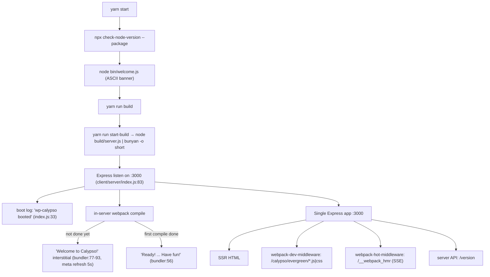
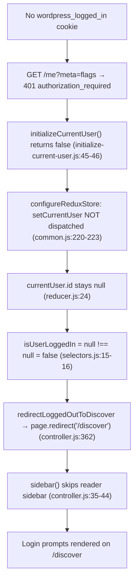

# Running Calypso Locally — Reader Deep‑Dive (Q&A)

> A run‑first developer‑onboarding knowledge document for the WordPress.com **Calypso** monorepo.
> **Branch:** `wp-calypso_be7e5cc64162` · **Commit:** `be7e5cc641622d153040491fd5625c6cb83e12eb` (verified `git HEAD`).

This document answers four groups of questions about running Calypso locally and how the **Reader** behaves on initial load. Every answer **leads with the direct result**, then shows **(a)** the exact command run, **(b)** the complete, unedited observed output, and **(c)** the `file:line` rationale. Claims that could only be read from source (not observed at runtime in this environment) are explicitly marked **(inferred)**; values obtained from a non‑default path are marked **(non‑canonical)**.

---

## The four questions (verbatim)

1. **Q1 — Dev server / ports.** *"What port does the development server bind to? How do I know when it's fully ready? Does the architecture use multiple ports (hot reloading, API calls) or is everything served from one place?"*
2. **Q2 — Reader stream.** *"What API endpoints get called to populate the stream? What Redux actions fire during the initial load?"*
3. **Q3 — Auth.** *"How does the app know whether someone is logged in before it decides what to render? What storage mechanisms does it check?"*
4. **Q4 — Responsive sidebar.** *"The sidebar layout shifts at different screen sizes — the specific margin and padding values on the sidebar header, what CSS custom properties drive the layout calculations, and at what viewport widths do things change?"*

---

## Canonical runtime resolution (read this first)

Calypso **enforces Node.js `^v22.9.0`** and **Yarn `4.0.2`**:

- `package.json:57` → `"node": "^v22.9.0"` (inside `engines`).
- `.nvmrc` → `22.9.0`.
- `package.json:422` → `"packageManager": "yarn@4.0.2"` (vendored at `.yarn/releases/yarn-4.0.2.cjs`).
- The `start` script gates on the engine at `package.json:110`:
  `"start": "npx check-node-version --package && node bin/welcome.js && yarn run build && yarn run start-build"`.

The environment‑setup note mentioned Node **20.x**. That is **(non‑canonical)**: the semver range `^v22.9.0` excludes `20.x`, so `npx check-node-version --package` would reject it and `yarn start` would abort before booting. All observations below were taken on the **canonical** runtime actually provisioned:

```bash
$ node --version && yarn --version
```
```text
v22.23.1
4.0.2
```
`v22.23.1` satisfies `^v22.9.0`, and the gate passes:
```bash
$ npx check-node-version --package ; echo "exit=$?"
```
```text
exit=0
```

## How this was investigated (run‑first)

- **Environment:** Linux container, 4 CPUs. Node `v22.23.1`, Yarn `4.0.2`.
- **Prerequisite host mapping** (`README.md:19`): `127.0.0.1 calypso.localhost` is present in `/etc/hosts` (a runtime prerequisite, **not** a repository change).
- **Build & run:** `yarn install` then `yarn start` (with `NODE_OPTIONS=--max-old-space-size=8192` for the memory‑heavy build). The dev server was launched once and kept alive on port **3000** for the entire investigation.
- **Browser‑side capture:** a headless Chrome (DevTools) session drove `http://calypso.localhost:3000/reader`. Redux actions were captured with a **passive** store shim installed via a page `initScript` that wraps `window.__REDUX_DEVTOOLS_EXTENSION__` (it only records `action.type` + timestamp and forwards to the real dispatch — it changes no behavior). Network was read from the DevTools network log; CSS was read with `getComputedStyle` / the CSSOM at eight viewport widths.
- **Auth state exercised:** logged‑out (the canonical default in this credential‑less environment). Where a logged‑in observation was impossible without WordPress.com credentials, the logged‑in path is grounded in `file:line` and clearly labelled **(inferred)** or **(non‑canonical)**.
- **Read‑only:** all observation scripts lived under `/tmp` (never in the repo tree) and were removed afterward. The only repository addition is this document.

---

# OBJ‑1 — Dev server port, readiness, and single‑port architecture

**Direct answer.** The development server binds to **TCP port `3000`** on host **`calypso.localhost`** over **`http`**. You know it is *fully* ready **not** when the server "booted" log line prints, but when the in‑server **webpack banner `Ready! You can load http://calypso.localhost:3000/ now. Have fun!`** prints. The architecture serves **everything from one place**: a single Express instance on port `3000` handles server‑side‑rendered HTML, the webpack bundle assets (`webpack-dev-middleware`), hot‑module reloading (`webpack-hot-middleware` over a Server‑Sent‑Events stream at `/__webpack_hmr`), and the server's own JSON API (e.g. `/version`). There is **no separate HMR port**. (One nuance, proven under OBJ‑2: actual WordPress.com REST *data* is fetched cross‑origin from `public-api.wordpress.com`, not proxied through `:3000` in the default dev build.)

## 1.1 The startup banner

`yarn start` first prints the chalk‑cyan ASCII "calypso" banner from `bin/welcome.js:6-11`.

```bash
$ node bin/welcome.js
```
```text
             _
    ___ __ _| |_   _ _ __  ___  ___
   / __/ _` | | | | | '_ \/ __|/ _ \
  | (_| (_| | | |_| | |_) \__ \ (_) |
   \___\__,_|_|\__, | .__/|___/\___/
               |___/|_|
```

## 1.2 Port `3000` — where it comes from

The port is resolved from config and bound by the server:

- `config/_shared.json:24-25` → `"protocol": "http"`, `"port": 3000` (the default for every environment).
- `config/development.json:6-8` → `"protocol": "http"`, `"hostname": "calypso.localhost"`, `"port": 3000`.
- `client/server/index.js:12` reads it: `let port = config( 'port' );`
- `client/server/index.js:83` binds it: `server.listen( { port, host: process.env.CALYPSO_IS_FORK ? host : null }, ... )`.

**Observed** (port confirmed at runtime via the response's remote port — `curl` is authoritative here because the server binds IPv6 `::` and `ss -p` needs root):

```bash
$ curl -s -o /dev/null -w "status=%{http_code} remote_port=%{remote_port}\n" http://calypso.localhost:3000/reader
```
```text
status=200 remote_port=3000
```

## 1.3 Two‑phase readiness — the boot log is **not** the "ready" signal

In development the client bundle is compiled **inside** the server (via `webpack-dev-middleware`), so the "server booted" line prints **long before** the app is usable. There are three distinct states, all observed in order in the live `yarn start` log:

**(a) Server boot log** — `client/server/index.js:33` prints `wp-calypso booted in %dms - %s://%s:%s`:
```text
22:26:14.414Z  INFO calypso: wp-calypso booted in 1008ms - http://calypso.localhost:3000
```

**(b) Pre‑ready interstitial** — while webpack is still compiling, any request to `/` is answered by the "Welcome to Calypso!" holding page (`client/server/bundler/index.js:77-93`), which auto‑refreshes every 5 seconds (`:79`). Captured with `curl` *during* compilation:
```bash
$ curl -i http://calypso.localhost:3000/
```
```text
HTTP/1.1 200 OK
X-Powered-By: Express
Content-Type: text/html; charset=utf-8
Content-Length: 630
...
<html><head><meta http-equiv="refresh" content="5"></head>
<body><h1>Welcome to Calypso!</h1><p>Please wait while we compile the assets ...</p></body></html>
```
The server simultaneously logs (`client/server/bundler/index.js:72`):
```text
Compiling assets... Wait until you see Ready! and then try http://calypso.localhost:3000/ again.
```

**(c) Authoritative readiness banner** — the first successful compile prints, from `client/server/bundler/index.js:56` (chalk‑cyan):
```text
webpack 5.97.1 compiled with 37 warnings in 159233 ms
Ready! You can load http://calypso.localhost:3000/ now. Have fun!
```
A subsequent recompile prints the variant `Ready! All assets are re-compiled. Have fun!` (`client/server/bundler/index.js:60`).

**Cause → effect.** The boot log fires when Express starts listening; the bundle does not exist yet, so requests get the interstitial. Only after the in‑server webpack compile finishes does `Ready!` print — so **`Ready!` (not the boot log) is the true "fully ready" signal**. In this run the compile took `159233 ms` (~2.6 min), which is why the boot log (at `1008ms`) precedes readiness by minutes.

## 1.4 Single‑port proof — one Express app does it all

In development the bundler is attached to the **same** Express `app` (`client/server/boot/index.js:36-37`):
```js
if ( 'development' === process.env.NODE_ENV ) {
    require( 'calypso/server/bundler' )( app );
}
```
and `client/server/bundler/index.js:100-102` mounts all three middlewares on that one app:
```js
app.use( waitForCompiler );
app.use( webpackMiddleware( compiler ) );   // webpack-dev-middleware — serves bundle assets
app.use( hotMiddleware( compiler ) );        // webpack-hot-middleware — HMR over SSE
```

All four responsibilities were observed on **`:3000`**, each with `X-Powered-By: Express` (same server):

| # | Responsibility | Command | Observed |
|---|----------------|---------|----------|
| 1 | **SSR HTML** | `curl -i http://calypso.localhost:3000/reader` | `HTTP/1.1 200`, `Content-Length: 41676`, HTML `<title>WordPress.com</title>` |
| 2 | **Bundle asset** (`webpack-dev-middleware`) | `curl -I http://calypso.localhost:3000/calypso/evergreen/assets_stylesheets_style_scss.css` | `HTTP/1.1 200`, `Content-Type: text/css; charset=utf-8`, `Content-Length: 129001`, `X-Powered-By: Express` |
| 3 | **HMR** (`webpack-hot-middleware`, SSE) | `curl -N http://calypso.localhost:3000/__webpack_hmr` | `Content-Type: text/event-stream;charset=utf-8`, `X-Accel-Buffering: no`; first event below |
| 4 | **Server JSON API** | `curl -i http://calypso.localhost:3000/version` | `HTTP/1.1 200`, `application/json`, `{"version":"0.17.0"}` |

The HMR stream's first event (note `time:159233` matches the compile duration above) and heartbeat:
```text
data: {"name":"","action":"sync","time":159233,"hash":"4e870b149f2fdc6384ae","warnings":[],"errors":[],"modules":{...}}

data: 💓
```
This is **definitive**: hot reloading rides the **same** port `3000` over `/__webpack_hmr` — there is no separate HMR/webpack‑dev‑server port. *(Background validation only, not primary evidence: with a custom Express server, `webpack-hot-middleware` serves HMR as SSE at the default path `/__webpack_hmr` on the same server.)*

The `/version` endpoint is the server's own API, defined at `client/server/api/index.js:11-12` (`app.get( '/version', ... )`), and is used as a health poll (the Reader issues `HEAD /version?<ts>` roughly every 20 s — observed under OBJ‑2).



## 1.5 `PORT` overrides (sibling variants)

The default Reader dev server is `3000`. Two **other products** override the port via the `PORT` env var (they are not the default Reader server):

- `package.json:115` — `start-jetpack-cloud-p`: `PORT=3001 CALYPSO_ENV=jetpack-cloud-development ...` → **Jetpack Cloud on 3001**.
- `package.json:117` — `start-a8c-for-agencies-p`: `PORT=3002 CALYPSO_ENV=a8c-for-agencies-development ...` → **A8C for Agencies on 3002**.

The override mechanism is `client/server/config/parser.js:63`:
```js
data.port = process.env.PORT || data.port;
```
i.e. `PORT` wins if set, otherwise the JSON `port` (`3000`) is used. (Both alternate configs also declare `"port": 3000` in JSON — the `3001`/`3002` values come purely from the `PORT` env in those scripts.)

The runtime pipeline behind `yarn start` is: `start` (`package.json:110`) → `start-build` (`package.json:113`) = `BROWSERSLIST_ENV=evergreen node build/server.js | bunyan -o short` (the `bunyan -o short` pipe is what formats the boot‑log stream you see).

---

# OBJ‑2 — Reader stream REST endpoints & initial‑load Redux actions

**Direct answer.** The Reader populates its stream through the WordPress.com **`/read/*`** REST family via Redux's **data‑layer** pattern, and the initial‑load action shape is **`READER_STREAMS_PAGE_REQUEST` → (data‑layer) `http()` → `READER_STREAMS_PAGE_RECEIVE`**, fired **twice** on first load (initial page + one pagination page). **In the canonical logged‑out run, `/reader` redirects to `/discover`, so the endpoint actually observed is `GET https://public-api.wordpress.com/wpcom/v2/read/streams/discover`** (namespace `wpcom/v2`). The default **Following** stream — `/read/streams/following` or `/read/following` at `apiVersion 1.2` — is the **logged‑in** path and is grounded in source below (it does **not** fire logged‑out). All WordPress.com data is fetched **cross‑origin** from `public-api.wordpress.com` (through the rest‑proxy iframe), not proxied through `:3000`.

## 2.1 The observed stream request (logged‑out → Discover)

Loading `http://calypso.localhost:3000/reader` **redirects to `/discover`** (see OBJ‑3 for the guard). The stream‑populating request captured from the DevTools network log:

```text
GET https://public-api.wordpress.com/wpcom/v2/read/streams/discover
    ?_envelope=1&orderBy=popular&meta=post,discover_original_post&feed_id=
    &number=4&lang=en&tags[]=dailyprompt&tags[]=wordpress
    &tag_recs_per_card=5&site_recs_per_card=5&age_based_decay=0.5&content_width=675
→ 200
Request referer: https://public-api.wordpress.com/wp-admin/rest-proxy/?v=2.0
Response: application/json  { "body": { "cards": [ { "type":"recommended_blogs", ... }, { "type":"post", ... } ] } }
```
The **next page** (pagination) reuses the same endpoint with an opaque `page_handle` and `number=7`:
```text
GET https://public-api.wordpress.com/wpcom/v2/read/streams/discover
    ?_envelope=1&orderBy=popular&...&page_handle=<opaque>&number=7&... → 200
```

**Why `discover` and `wpcom/v2`, not `following` / `1.2`?** The stream‑key → path map lives in `client/state/data-layer/wpcom/read/streams/index.js`; the `discover` entry resolves to `/read/streams/discover` (`streams/index.js:224-232`) and carries an `apiNamespace` (rendered in the URL as `wpcom/v2`) rather than a plain `apiVersion`. The logged‑out redirect to `/discover` is therefore what selects this endpoint at runtime. `/read/streams/following` (`:198`) and `/read/following` (`:194`) are the **logged‑in Following** defaults **(inferred — not exercised here; no WordPress.com credentials).**

**Cross‑origin nuance (authoritative).** Every WordPress.com REST call originates from the rest‑proxy iframe on the `public-api.wordpress.com` origin (the SSR HTML prefetches `https://public-api.wordpress.com/wp-admin/rest-proxy/?v=2.0`). The `:3000` Calypso server does **not** proxy these data calls in the default dev build; the only same‑origin `:3000` API traffic observed was the `HEAD /version` health poll.

## 2.2 The observed Redux action sequence (stable across two runs)

Captured with the passive dispatch shim on the **main Calypso store** (see §2.4). The `READER_STREAMS_*` subsequence, with millisecond offsets from navigation start, across two independent loads:

```text
Run 1 (305 actions total):
  READER_STREAMS_PAGE_REQUEST @2109ms
  READER_STREAMS_PAGE_RECEIVE @3380ms
  READER_STREAMS_PAGE_REQUEST @3425ms
  READER_STREAMS_PAGE_RECEIVE @5092ms

Run 2 (318 actions total):
  READER_STREAMS_PAGE_REQUEST @2150ms
  READER_STREAMS_PAGE_RECEIVE @3163ms
  READER_STREAMS_PAGE_REQUEST @3210ms
  READER_STREAMS_PAGE_RECEIVE @4278ms
```
Both runs show the **same shape**: two `PAGE_REQUEST → PAGE_RECEIVE` pairs (initial page + one pagination page). The broader **reader‑action dispatch order** on initial load was:
```text
READER_RESET_CARD_EXPANSIONS → READER_VIEW_STREAM → READER_STREAMS_PAGE_REQUEST →
READER_POSTS_RECEIVE → READER_RECOMMENDED_SITES_RECEIVE → READER_STREAMS_PAGE_RECEIVE →
READER_FEED_REQUEST → READER_SITE_REQUEST → READER_THUMBNAIL_RECEIVE →
READER_FEED_REQUEST_SUCCESS → READER_SITE_REQUEST_SUCCESS
```
(The very first actions on boot are many `APPLY_STORED_STATE` — persisted‑state rehydration — plus `SECTION_LOADING_SET`.)

**Cause → effect (data‑layer).** Dispatching `READER_STREAMS_PAGE_REQUEST` is intercepted by a registered data‑layer handler that issues an `http()` action to the mapped `/read/*` path; the response is dispatched back as `READER_STREAMS_PAGE_RECEIVE`. The handler registration is `client/state/data-layer/wpcom/read/streams/index.js:514-515`:
```js
registerHandlers( 'state/data-layer/wpcom/read/streams/index.js', {
    [ READER_STREAMS_PAGE_REQUEST ]: [ dispatchRequest( { fetch: requestPage, onSuccess: handlePage, onError: noop } ) ],
} );
```
and the outbound request is built in `requestPage` at `streams/index.js:395-404`:
```js
return http( {
    method: 'GET',
    path: path( { ...action.payload } ),
    apiVersion,
    apiNamespace: api.apiNamespace ?? null,
    query: { ... },
    onSuccess: action,
    onFailure: action,
} );
```
with the **default `apiVersion` `'1.2'`** at `streams/index.js:370`. On success, `handlePage` (`streams/index.js:428`) dispatches `receivePosts` (`:470`), `receiveRecommendedSites` (`:473/478`) and finally `receivePage` → `READER_STREAMS_PAGE_RECEIVE` (`:496-508`) — matching the observed `READER_POSTS_RECEIVE`/`READER_RECOMMENDED_SITES_RECEIVE`/`READER_STREAMS_PAGE_RECEIVE` order.

## 2.3 Full `/read/*` endpoint map, `apiVersion` variants, action creators & types

**Every stream‑key → REST path** in `client/state/data-layer/wpcom/read/streams/index.js` (the `streamApis` map begins at `:192`):

| Stream key | REST path | `file:line` |
|------------|-----------|-------------|
| `following` | `/read/following` | `:194` |
| `recent` | `/read/streams/following` (apiNamespace `wpcom/v2`) | `:198`, `:200` |
| `search` | `/read/search` | `:212` |
| `feed` | `/read/feed/${feedId}/posts` | `:220` |
| `discover` | `/read/streams/discover` (+ `/read/tags/posts`, `/read/streams/first-posts`, `/read/streams/discover?tags=`) | `:226`, `:228`, `:230`, `:232` |
| `site` | `/read/sites/${siteId}/posts` | `:249` |
| `conversations` | `/read/conversations` | `:253`, `:275` |
| `notifications` | `/read/notifications` | `:259` |
| `featured` | `/read/sites/${siteId}/featured` | `:263` |
| `p2` | `/read/following/p2` | `:267` |
| `a8c` | `/read/a8c` | `:271` |
| `likes` | `/read/liked` | `:282` |
| `recommendations_posts` | `/read/recommendations/posts` | `:287`, `:294` |
| `recommendations_sites` | `/read/recommendations/sites` | `:304` |
| `tag (posts)` | `/read/tags/${tag}/posts` | `:317` |
| `tag (stream)` | `/read/streams/tag/${tag}` | `:322` |
| `list` | `/read/list/${owner}/${slug}/posts` (apiVersion `1.3`) | `:335`, `:338` |
| `user` | `/users/${user}/posts` (apiVersion `1`) | `:347`, `:349` |

**`apiVersion` values:** default **`'1.2'`** (`:370`); variant **`'1.3'`** for lists (`:338`); variant **`'1'`** for a user's posts (`:349`).

**Action creators** — `client/state/reader/streams/actions.js`:

| Creator | `file:line` | Notes |
|---------|-------------|-------|
| `requestPage` | `:28` (`export function`) | dispatches `READER_STREAMS_PAGE_REQUEST` (`:39`); `streamType = getStreamType(streamKey)` (`:36`) |
| `receivePage` | `:52` (`export function`) | dispatches `READER_STREAMS_PAGE_RECEIVE` (`:63`) |
| `showUpdates` | `:77` (**`export const showUpdates =` — a curried arrow `(dispatch, getState) => ...`, NOT `export function`**) | dispatches `READER_STREAMS_SHOW_UPDATES` (`:82`) |
| `receiveUpdates` | `:87` | `READER_STREAMS_UPDATES_RECEIVE` |
| `receiveNewPost` | `:94` | |
| `selectItem` | `:100` | `READER_STREAMS_SELECT_ITEM` |
| `selectNextItem` | `:107` | |
| `selectPrevItem` | `:114` | |
| `removeItemFromStream` | `:121` | |
| `fillGap` | `:128` | internally calls `requestPage` (`:129`) |
| `clearStream` | `:136` | |
| `requestPaginatedStream` | `:143` | |

**Action types** — `client/state/reader/action-types.ts`: `READER_STREAMS_PAGE_RECEIVE` (`:77`), `READER_STREAMS_PAGE_REQUEST` (`:78`), `READER_STREAMS_PAGINATED_REQUEST` (`:79`), `READER_STREAMS_SELECT_ITEM` (`:81`), `READER_STREAMS_SHOW_UPDATES` (`:84`), `READER_STREAMS_UPDATES_RECEIVE` (`:85`).

**Routing / stream context:**
- `client/reader/index.ts:54-62` registers the Reader routes, e.g. `page( [ '/reader', '/reader/recent/:feed_id' ], redirectLoggedOutToDiscover, sidebar, setSelectedSiteIdByOrigin, following, makeLayout, clientRender )`; the `following` controller is imported from `./controller` (`:18`).
- `client/reader/controller.js` holds the actual `following` controller (there is **no** `following/controller.js`).
- `client/reader/following/index.js:11` only **redirects** `/following → /reader` (`page( '/following', '/reader' )`).
- `client/reader/stream/index.jsx` is the stream component that requests pages.
- Corroborated by the route inventory in `client/reader/README.md`.

## 2.4 Enrichment, session calls, and the store architecture (context)

After `READER_STREAMS_PAGE_RECEIVE`, per‑card **enrichment** requests fire (all cross‑origin to `public-api.wordpress.com`):

```text
/rest/v1.1/read/feed/{feedId}                         ↔ READER_FEED_REQUEST(_SUCCESS)
/rest/v1.1/read/sites/{siteId}?fields=ID,name,...     ↔ READER_SITE_REQUEST(_SUCCESS)
/rest/v1.1/sites/{siteId}/posts/{postId}/replies      (comments)
/rest/v1.1/users/suggest?site_id=...                  (mentions)
```
**Boot/session** calls that fire regardless of the stream: `/rest/v1.1/me?meta=flags` (the `initializeCurrentUser` probe — see OBJ‑3), `/geo/`, `/rest/v1.1/me/two-step/`, `/wpcom/v2/lasagna/jwt/sign`, `/rest/v1.1/me/preferences`, `/rest/v1.1/me/settings`, `/wpcom/v2/store-sandbox/status`, `POST /rest/v1.1/logstash`, and the same‑origin `HEAD http://calypso.localhost:3000/version?<ts>` health poll (~every 20 s).

**Store architecture note (methodology).** At runtime **16** Redux stores connect to `window.__REDUX_DEVTOOLS_EXTENSION__`; only **one** (47 top‑level keys incl. `currentUser`, `reader`, `ui`, `route`, …) is the Calypso main store — the other 15 are `@wordpress/data` registry stores (shape `{metadata, root}`). The Reader stream state lives in the main store's `reader.streams` slice. **`@tanstack/react-query`** is also present in the codebase for some data fetching; the **Reader stream initial load uses the Redux data‑layer path** described above (the `/read/streams/discover` calls were issued by the data‑layer `http()`, not react‑query).


---

# OBJ‑3 — Login detection before render & storage mechanisms

**Direct answer.** Before deciding what to render, Calypso **resolves the current user during boot** — it `await`s `initializeCurrentUser()` (`client/boot/common.js:341`) **before** `page.start()` runs the router — and then the render decision derives from the Redux `current-user` slice via the **`isUserLoggedIn`** selector, which is exactly **`getCurrentUserId(state) !== null`** (`client/state/current-user/selectors.js:15-16`), where `getCurrentUserId` is `state.currentUser?.id` (`:7`). The storage mechanisms inspected are **four**: (1) the **`wordpress_logged_in` cookie** (the primary signal, consumed by the `/me` request), (2) **localStorage `wpcom_user_id`** (via the `store` library), (3) the **`@automattic/oauth-token`** token (localStorage‑backed, used only in OAuth mode), and (4) **sessionStorage `flags`**. In the observed logged‑out run, `currentUser.id` is **`null`**, `isUserLoggedIn` is **`false`**, and `/reader` is redirected to `/discover`.

## 3.1 The decision: resolve the user first, then route

The boot sequence resolves the user **before** the router starts (`client/boot/common.js`):
```js
const user = await initializeCurrentUser();   // :341 — resolve current user first
await boot( user, registerRoutes );           // :343
// inside boot():
configureReduxStore( currentUser, reduxStore ); // :330 — load user into Redux
page.start();                                   // :337 — only now does routing begin
```
So by the time any route handler runs, `currentUser` is already in the store. The `/reader` guard then makes the decision — `client/reader/controller.js:356-363`:
```js
export function redirectLoggedOutToDiscover( context, next ) {
    const state = context.store.getState();
    if ( isUserLoggedIn( state ) ) {
        next();
        return;
    }
    return page.redirect( '/discover' );
}
```
It is registered as the **first** middleware on `/reader` (`client/reader/index.ts:56`). The reader **sidebar** is likewise gated on login — `client/reader/controller.js:35-44` only sets `context.secondary` (the sidebar `AsyncLoad`) `if ( isUserLoggedIn( state ) )`, which is why the logged‑out Discover page has **no** reader sidebar (relevant to OBJ‑4). A generic `redirectLoggedOut` guard is also composed into other routes at `client/sections-middleware.js:106` (`composeHandlers( controller.redirectLoggedOut, handler )`).

**Observed** — the logged‑out navigation and its consequence:
```text
navigate → http://calypso.localhost:3000/reader
final URL → http://calypso.localhost:3000/discover   (redirected)
page shows: "Log In" / "Sign Up" nav, and the prompt
  "Join the conversation — Sign in to discover more great content and subscribe to your favorite blogs."
  + "Create a new account" / "Log in" buttons
```

## 3.2 The selector and the reducer defaults (observed vs source)

`client/state/current-user/selectors.js`:
```js
export const getCurrentUserId = ( state ) => state.currentUser?.id;      // :6-7
export const isUserLoggedIn   = ( state ) => getCurrentUserId( state ) !== null; // :15-16
```
**Observed** on the main Calypso store in the logged‑out run (read via the passive shim):
```json
{
  "currentUser_keys": ["id","user","capabilities","flags","emailVerification","lasagnaJwt"],
  "currentUser_id": null,
  "getCurrentUserId_result": null,
  "isUserLoggedIn_result": false
}
```
This matches the reducer defaults in `client/state/current-user/reducer.js`: `id` defaults to `null` (`:24`, `state = null`), `user` to `null` (`:33`), `flags` to `[]` (`:56`), `capabilities` to `{}` (`:92`), `lasagnaJwt` to `null` (`:115`); combined at `:124-125`. Because the reducer always initialises `id` to `null` when logged‑out, `isUserLoggedIn` correctly returns `false`.

**How `currentUser` gets populated** — `initializeCurrentUser` (`client/lib/user/shared-utils/initialize-current-user.js`): in production, when `wpcom-user-bootstrap` is enabled, it reads the server‑injected `window.currentUser` (`:28-32`); in **development** `wpcom-user-bootstrap` is `false` (`config/development.json:209`), so it calls `rawCurrentUserFetch()` (`:37`), and on an `authorization_required` (401 = logged‑out) it returns `false` (`:45-46`). `rawCurrentUserFetch` (`client/lib/user/shared-utils/raw-current-user-fetch.js:3-7`) is literally `wpcom.me().get( { meta: 'flags' } )` — the **observed `GET /rest/v1.1/me?meta=flags`** boot request. Then `configureReduxStore` dispatches `setCurrentUser` **only if `currentUser && currentUser.ID`** (`client/boot/common.js:220-223`); logged‑out (`currentUser === false`) means it is never dispatched, so `id` stays `null`.

## 3.3 The optional‑chaining nuance (verified in the live JS engine)

`getCurrentUserId` uses optional chaining (`state.currentUser?.id`). Evaluating the **exact** selector logic against three states in the live browser:

```text
Case A — logged-out (OBSERVED):     currentUser.id = null       → getCurrentUserId = null      → isUserLoggedIn = false
Case B — logged-in (SYNTHETIC, non-canonical): currentUser.id = 12345678 → getCurrentUserId = 12345678 → isUserLoggedIn = true
Case C — currentUser slice ABSENT:  state.currentUser = undefined → getCurrentUserId = undefined → isUserLoggedIn = true
```
Case A is authoritative and matches the live main store. Case B is **(non‑canonical)** — no WordPress.com credentials were available, so the logged‑in branch is demonstrated by feeding the selector a synthetic id, not by a real session. Case C shows the subtlety of `?.`: if the `currentUser` slice were **absent**, `undefined !== null` would be **`true`** (a false "logged‑in"). This never happens in the real Calypso store because the reducer always provides `id: null` when logged‑out — but it is exactly why an early inspection of the wrong store (a `@wordpress/data` registry with no `currentUser`) misleadingly reported `true`.

## 3.4 The four storage mechanisms (observed values, logged‑out)

| # | Mechanism | Where it is read | Cause → effect | Observed (logged‑out) |
|---|-----------|------------------|----------------|-----------------------|
| 1 | **`wordpress_logged_in` cookie** | sent automatically with `wpcom.me().get()` via the rest‑proxy iframe (on the `wordpress.com` domain); also readable server‑side at `client/server/boot/index.js:49-59` (`req.cookies.wordpress_logged_in`, gated by `wpcom-user-bootstrap`, off in dev) | presence/validity decides whether `/me` returns a user → drives `currentUser.id` → `isUserLoggedIn`. **Primary** signal. | **absent** — `document.cookie` = `tk_ai=…; country_code=US; region=Iowa; tk_qs=` (no `wordpress_logged_in`; it is `HttpOnly`/cross‑domain anyway) |
| 2 | **localStorage `wpcom_user_id`** | `client/lib/user/store.js` — `import store from 'store'` (`:1`); `getStoredUserId()` = `store.get( 'wpcom_user_id' )` (`:13`); `setStoredUserId()` = `store.set( 'wpcom_user_id', userId )` (`:17`) | caches the logged‑in user id for faster bootstrap | `localStorage.getItem('wpcom_user_id')` = **`null`** (localStorage held 1 key total, no `wpcom_*`) |
| 3 | **`@automattic/oauth-token` token** | `client/boot/common.js:6` `import { getToken } from '@automattic/oauth-token'`; gate at `:176` `if ( getToken() === false && ! isValidSection )` → redirect. Only active in **OAuth mode** (`oauthTokenMiddleware` at `:154` is gated by `config.isEnabled('oauth')` at `:155`; `oauth=false` by default per `config/development.json:130`) | in OAuth builds, a missing token forces the login redirect | localStorage `wpcom_token` = **`null`** (OAuth disabled by default → gate inactive) |
| 4 | **sessionStorage `flags`** | `client/boot/common.js` `saveOauthFlags` — reads the `?flags` query param (`:117`) and writes `window.sessionStorage.setItem( 'flags', oauthFlag )` (`:127`) | per‑session feature‑flag overrides | `sessionStorage.getItem('flags')` = **`null`** (sessionStorage empty) |

## 3.5 The full causal chain (observed end‑to‑end, logged‑out)



**Dev vs prod (cause).** In development the login signal is resolved by the `/me` fetch (`wpcom-user-bootstrap=false`); in production Calypso reads the server‑injected `window.currentUser`, which the server derives from the `wordpress_logged_in` cookie. Either way the *decision* funnels through `isUserLoggedIn ← getCurrentUserId`. The logged‑in render branch is **(inferred)** here (no credentials); the logged‑out branch is fully observed.


---

# OBJ‑4 — Responsive sidebar design: header margin/padding, custom properties, breakpoints

**Direct answer.** The sidebar header **`.sidebar__header`** uses **`gap: 8px`** and **`padding: 30px 24px 29px`** (top `30px`, left/right `24px`, bottom `29px`), and is `display: none` by default (it is only shown when the masterbar is hidden) — `client/layout/global-sidebar/style.scss:70-75`; its inner logo `span.dotcom` has **`margin: 0`** (`:86`). The layout math is driven by three CSS custom properties defined on `:root` in `client/assets/stylesheets/shared/_variables.scss`: **`--sidebar-width-max: 272px`** (`:15`), **`--sidebar-width-min: 228px`** (`:16`), and **`--masterbar-height: 46px`** (`:7`) which drops to **`32px`** at `min-width: 782px` (`:11`); these feed `calc()` content‑padding expressions and the sidebar‑container width. The layout changes at **`<960px`** (container switches from `--sidebar-width-max` to `--sidebar-width-min`), **`<660px`** (container becomes `100%` / off‑canvas), and **`>1400px`** in SCSS (`breakpoint-deprecated`), plus the JavaScript thresholds **`>=782px`** (desktop), **`<660px`** (narrow), and **`>800px`** (collapsed) via `@automattic/viewport`.

> **Runtime caveat (observed).** On the **logged‑out** Discover page, the reader sidebar is **not rendered** (`sidebar()` gates on `isUserLoggedIn` — OBJ‑3), the `.layout` carries `has-no-sidebar`, and the CSSOM shows the `.sidebar__header` / `.global-sidebar` **rules are not even loaded** (code‑split with the logged‑in layout). Therefore the `.sidebar__header` **box‑model values are grounded in source (verified) and labelled (inferred at runtime)** — observing them rendered requires a logged‑in session (no credentials → **(non‑canonical)** to fake). Everything else in this section (the custom properties, the sidebar‑container width, the off‑canvas transform, the breakpoint transitions) **was observed at runtime**, because the `:root` variables and the `.layout__secondary` container **are** present and their computed values resolve at every width.

## 4.1 The `.sidebar__header` box model (source‑verified)

`client/layout/global-sidebar/style.scss:70-86`:
```scss
.sidebar__header {
    align-items: center;               // :71
    // Hide the header when the masterbar is visible.  // :72
    display: none;                     // :73
    gap: 8px;                          // :74
    padding: 30px 24px 29px;           // :75
    a { color: var(--nav-link); text-decoration: none; }
    span.dotcom {
        display: flex;
        width: 125px; height: 28px;    // :84-85
        margin: 0;                     // :86
        background-image: url(calypso/assets/images/global-sidebar/dotcom.svg);
        ...
    }
}
```
So the header's **padding is `30px 24px 29px`** and **gap is `8px`**; the header itself carries no margin, and the logo child’s **margin is `0`**. The `display: none` is deliberate (`:72-73`): the header is only shown when the masterbar is hidden. Its component is `client/layout/global-sidebar/header.tsx` (`GlobalSidebarHeader` rendering `<div className="sidebar__header">` with the skip‑nav link and the dotcom logo). **(inferred at runtime — rule not loaded on the logged‑out page.)**

## 4.2 The CSS custom properties & `calc()` (defined + observed)

**Definitions** — `client/assets/stylesheets/shared/_variables.scss:4-17` on `:root`:
```scss
:root {
    --masterbar-height: 46px;                          // :7
    @media only screen and (min-width: 782px) {
        --masterbar-height: 32px;                      // :11
    }
    --sidebar-width-max: 272px;                        // :15
    --sidebar-width-min: 228px;                        // :16
}
```
**Correction to a common assumption:** `client/layout/style.scss:169-170` also sets `--sidebar-width-max/min: 0px`, but that is **only inside `body.is-mobile-app-view`** (`:166-174`, which also does `.layout__secondary { display: none }` at `:171-173`) — a mobile‑webview **reset**, *not* the default. The observed values (`272px`/`228px`, never `0px`) confirm the `:root` defaults win outside the app webview.

**`calc()` content‑padding expressions** (`client/layout/style.scss`) — content padding‑left = sidebar width + gutter so the main content clears the fixed sidebar:
```scss
padding: 79px 32px 32px calc(var(--sidebar-width-max) + 32px + 1px);  // :52
padding-top: calc(79px - var(--masterbar-height));                    // :98
padding: 47px 0 32px calc(var(--sidebar-width-max) + 1px);            // :106
padding: calc(var(--masterbar-height) + 1px) 0 0 calc(var(--sidebar-width-max) + 1px); // :114
padding: 71px 24px 24px calc(var(--sidebar-width-min) + 24px + 1px);  // :119
```

**Observed** resolved values (via `getComputedStyle(document.documentElement)`), e.g. at 1440 px:
```json
{ "--sidebar-width-max": "272px", "--sidebar-width-min": "228px", "--masterbar-height": "32px" }
```

## 4.3 The cross‑product — each metric × each named width (OBSERVED)

Captured with `resize_page` + `getComputedStyle` at the **eight named widths** catalogued in `.storybook/preview.js` (HUGE `1440` `:18`, WIDE `1280` `:25`, XLARGE `1080` `:32`, LARGE `960` `:39`, MEDIUM `782` `:46`, SMALL `600` `:53`, MOBILE `480` `:60`, ZOOMED_IN `280` `:67`). The sidebar container is `.layout__secondary` (width rule at `client/layout/style.scss:185/191/195`):

| Width (px) | `--sidebar-width-max` | `--sidebar-width-min` | `--masterbar-height` | `.layout__secondary` width | `.layout__secondary` top |
|-----------:|:---------------------:|:---------------------:|:--------------------:|:--------------------------:|:------------------------:|
| 1440 | 272px | 228px | **32px** | **272px** | 32px |
| 1280 | 272px | 228px | 32px | 272px | 32px |
| 1080 | 272px | 228px | 32px | 272px | 32px |
| 960  | 272px | 228px | 32px | **228px** | 32px |
| 782  | 272px | 228px | 32px | 228px | 32px |
| 600  | 272px | 228px | **46px** | **100%** | 46px |
| 480  | 272px | 228px | 46px | 100% | 46px |
| 280  | 272px | 228px | 46px | 100% | 46px |

*(`.layout__secondary` computes `display: none` on the logged‑out page, but its width/top still resolve per the media queries, which is what the table reports.)*

**Observed transitions & their `file:line` cause:**
- **`.layout__secondary` width: 272px → 228px at `960px`.** `@include breakpoint-deprecated("<960px") { width: var(--sidebar-width-min); }` (`client/layout/style.scss:190-191`). `"<960px"` ≡ `@media (max-width: 960px)` (inclusive of 960).
- **`.layout__secondary` width: 228px → 100% at `<660px`.** `@include breakpoint-deprecated("<660px") { width: 100%; }` (`:194-195`).
- **`--masterbar-height`: 32px → 46px below `782px`.** `@media (min-width: 782px) { --masterbar-height: 32px; }` (`_variables.scss:11`); default `46px` (`:7`). `.layout__secondary` `top: var(--masterbar-height)` (`:180`) tracks it (32px → 46px).
- The `--sidebar-width-max`/`--sidebar-width-min` values themselves are **constant**; what changes is **which** one the container consumes.

*(Nuance: the masterbar **element’s** own computed height was `50px` at `>=782px` and `46px` below — distinct from the `--masterbar-height` layout variable which is `32px`/`46px`.)*

## 4.4 The off‑canvas transform (`<660px`) — observed via CSSOM

The site‑selector sits off‑canvas by default; the CSSOM at runtime confirms the exact rule (`client/layout/style.scss:222-233`):
```text
.layout__secondary .site-selector {
    position: absolute; inset: 0px; pointer-events: none;
    transform: translateX(calc(-1 * var(--sidebar-width-max)));   // :231
    height: calc(100vh - var(--masterbar-height));                // :232
}
```
Combined with `.layout__secondary { width: 100% }` under `<660px` (`:195`), the sidebar transitions to a full‑width, off‑canvas panel on narrow viewports.

## 4.5 Breakpoints — SCSS and JavaScript

**SCSS `breakpoint-deprecated`** occurrences (`client/layout/style.scss`): `"<960px"` at `:41`, `:118`, `:190`; `"<660px"` at `:141`, `:194`, `:279`, `:307`, `:330`, `:362`; `">1400px"` at `:162`; `">660px"` at `:336`, `:384`.

**JavaScript thresholds** (`client/layout/index.jsx`): `import { isWithinBreakpoint, subscribeIsWithinBreakpoint } from '@automattic/viewport'` (`:2`), `useBreakpoint` from `@automattic/viewport-react` (`:3`); `isNarrow = useBreakpoint('<660px')` (`:76`); `isDesktop = isWithinBreakpoint('>=782px')` (`:146`, subscribed at `:151`); collapsed‑sidebar logic uses `isWithinBreakpoint('>800px')` (`:221`).

**Observed** `matchMedia` at 1440 px (corroborating the JS thresholds):
```json
{ "max-width:660px": false, "min-width:782px": true, "min-width:800px": true, "max-width:960px": false, "min-width:1400px": true }
```

**Viewport API** (`packages/viewport/src/index.ts`): the header comment (`:11-27`) maps named queries (e.g. `'<960px'` ≡ `@media (max-width: 960px)`, `:33`); `MOBILE_BREAKPOINT = '<480px'` (`:43`), `DESKTOP_BREAKPOINT = '>960px'` (`:44`), `WIDE_BREAKPOINT = '>1280px'` (`:45`); the `BREAKPOINTS` map (`:97-118`) includes `'<480'{max480}`, `'<660'{max660}`, `'<782'{max782}`, `'<800'{max800}`, `'<960'{max960}`, `'<1040'{max1040}`, …, and note `'>=782'` resolves to `{min:781}` while `'>782'` is `{min:782}`.

**Reader‑specific styling:** `client/reader/sidebar/index.jsx` imports both `GlobalSidebar` (`:12`) and `Sidebar` (`:13`) and chooses between them via `getShouldShowGlobalSidebar` (`:29`); `client/reader/sidebar/style.scss` styles the sidebar **contents** (tags, menu links), not its width; `client/assets/stylesheets/reader-mobile.scss` is a 13‑line mobile override (an SVG icon). These layer on top of the global `.layout__secondary` container width documented above.


---

# Corroboration (onboarding docs)

These in‑repo docs corroborate the runtime findings; where they differ, the **runtime observation is authoritative**.

- **`README.md:17-21`** — the canonical local‑run steps: install `git`/`node`/`yarn` (`:17`), add `127.0.0.1 calypso.localhost` to your `hosts` file (`:19`), run `yarn` then `yarn start` (`:20`), open `calypso.localhost:3000` (`:21`). This matches OBJ‑1 (host + port `3000`).
- **`docs/yarn-start.md`** — documents the `yarn start` build/run flow (and uses the same fenced mermaid‑diagram convention this document follows).
- **`docs/install.md`** — installation prerequisites (Node/Yarn, the hosts entry).
- **`client/reader/README.md`** — the Reader route inventory that corroborates the routing in OBJ‑2 (`/reader`, `/discover`, feeds, tags, etc.).

---

# Coverage pass

A final check that every named item in each question is answered with its **value + `file:line` + observed evidence + sibling variants + rationale**.

### Q1 — dev server / ports
- [x] **Port `3000`** — `config/_shared.json:24-25`, `config/development.json:6-8`; read at `client/server/index.js:12`, bound at `:83`; **observed** `remote_port=3000`.
- [x] **Fully‑ready signal** — the webpack **`Ready! ... Have fun!`** banner (`client/server/bundler/index.js:56`), *not* the boot log (`client/server/index.js:33`); both **observed** in order; re‑compile variant (`:60`) noted.
- [x] **Pre‑ready interstitial** — "Welcome to Calypso!" with `<meta http-equiv="refresh" content="5">` (`bundler/index.js:77-93`, `:79`); **observed** via `curl`.
- [x] **Single‑port architecture** — SSR + `webpack-dev-middleware` assets + `webpack-hot-middleware` HMR (`/__webpack_hmr` SSE) + server API all on `:3000` (`bundler/index.js:100-102`, attached to same app at `boot/index.js:36-37`); **observed** all four, each `X-Powered-By: Express`.
- [x] **`PORT` overrides** — `3001` Jetpack Cloud (`package.json:115`), `3002` A8C for Agencies (`:117`); mechanism `parser.js:63`.
- [x] **Welcome banner** — `bin/welcome.js:6-11`; **observed**.
- [x] **Data‑proxy nuance** — WP.com REST data is cross‑origin to `public-api.wordpress.com`, not proxied by `:3000` (default dev); **observed** (see Q2).

### Q2 — Reader stream endpoints & actions
- [x] **Observed endpoint** — `GET /wpcom/v2/read/streams/discover` (logged‑out → Discover), initial `number=4` + pagination `page_handle&number=7`; **observed**; maps to `streams/index.js:224-232`.
- [x] **Default Following** — `/read/streams/following` (`:198`) / `/read/following` (`:194`) at `apiVersion 1.2` (`:370`) — **(inferred; logged‑in path, not fired logged‑out)**.
- [x] **All sibling `/read/*` paths** — enumerated in the §2.3 table (`search`, `feed`, `discover`, `site`, `conversations`, `notifications`, `featured`, `p2`, `a8c`, `liked`, `recommendations/{posts,sites}`, `tags/{tag}/posts`, `streams/tag/{tag}`, `list`, `users/{user}/posts`).
- [x] **`apiVersion` variants** — `1.2` default (`:370`), `1.3` (`:338`), `1` (`:349`).
- [x] **Action sequence** — `READER_STREAMS_PAGE_REQUEST → http() → READER_STREAMS_PAGE_RECEIVE`, **observed twice** and **stable across two runs**; data‑layer registration `streams/index.js:514-515`, request `:395-404`.
- [x] **Sibling actions** — `showUpdates` (**`export const` arrow** at `actions.js:77`), `receiveUpdates` (`:87`), `selectItem` (`:100`), `fillGap` (`:128`), plus observed `READER_POSTS_RECEIVE`, `READER_RECOMMENDED_SITES_RECEIVE`, `READER_FEED_REQUEST(_SUCCESS)`, `READER_SITE_REQUEST(_SUCCESS)`, `READER_THUMBNAIL_RECEIVE`, `READER_VIEW_STREAM`, `READER_RESET_CARD_EXPANSIONS`.
- [x] **Action types** — `action-types.ts:77,78,79,81,84,85`.
- [x] **Routing** — `reader/index.ts:54-62`, `controller.js`, `following/index.js:11` (redirect only), `stream/index.jsx`; `client/reader/README.md`.
- [x] **react‑query context** — present in codebase; the stream initial load uses the **Redux data‑layer** (observed).

### Q3 — login detection & storage
- [x] **Decision** — `isUserLoggedIn ← getCurrentUserId` (`selectors.js:15-16`, `:7`) after `await initializeCurrentUser()` (`common.js:341`) → `configureReduxStore` (`:330`) → `page.start()` (`:337`); guard `redirectLoggedOutToDiscover` (`controller.js:356-363`, registered `index.ts:56`). **Observed** `/reader → /discover`.
- [x] **Reducer defaults** — `id=null` (`reducer.js:24`) etc.; **observed** `currentUser.id = null`, `isUserLoggedIn = false`.
- [x] **`/me` probe** — `rawCurrentUserFetch` = `wpcom.me().get({meta:'flags'})` (`raw-current-user-fetch.js:3-7`); **observed** `GET /rest/v1.1/me?meta=flags`.
- [x] **Optional‑chaining nuance** — three states evaluated in the live engine (null→false; number→true (non‑canonical); absent→true).
- [x] **Four storage mechanisms** — (1) `wordpress_logged_in` cookie, (2) localStorage `wpcom_user_id` (`store.js:13/17`), (3) `@automattic/oauth-token` `getToken()` (`common.js:6/176`, OAuth off by default `development.json:130`), (4) sessionStorage `flags` (`common.js:127`); **observed** all four empty/absent when logged‑out.
- [x] **Logged‑out vs logged‑in** — logged‑out fully observed; logged‑in branch **(inferred)** (no credentials).

### Q4 — responsive sidebar
- [x] **`.sidebar__header`** — `gap: 8px`, `padding: 30px 24px 29px` (`global-sidebar/style.scss:74-75`), `display:none` (`:73`), inner `span.dotcom margin:0` (`:86`) — **(inferred at runtime; rule code‑split/not loaded logged‑out)**.
- [x] **Custom properties** — `--sidebar-width-max: 272px` (`_variables.scss:15`), `--sidebar-width-min: 228px` (`:16`), `--masterbar-height: 46px`→`32px@782` (`:7`,`:11`); **observed** resolved values; `style.scss:169-170` `0px` correctly identified as the `is-mobile-app-view` reset, not the default.
- [x] **`calc()` expressions** — `style.scss:52,98,106,114,119`.
- [x] **Cross‑product** — metric × 8 named widths table, **observed**; transitions at `960px` (272→228), `<660px` (→100%), `<782px` (masterbar 32→46).
- [x] **Off‑canvas transform** — `translateX(calc(-1 * var(--sidebar-width-max)))` + `height: calc(100vh - var(--masterbar-height))` (`style.scss:231-232`); **observed via CSSOM**.
- [x] **SCSS breakpoints** — `<960px`, `<660px`, `>1400px`, `>660px` (`style.scss:41/118/190,141/194/…,162,336/384`).
- [x] **JS breakpoints** — `>=782px`, `<660px`, `>800px` (`layout/index.jsx:146,76,221`); `@automattic/viewport` map (`packages/viewport/src/index.ts:43-45,97-118`); **observed** via `matchMedia`.
- [x] **8 named widths** — `.storybook/preview.js:18,25,32,39,46,53,60,67`.
- [x] **Reader‑specific styling** — `reader/sidebar/index.jsx:12-13,29`, `reader/sidebar/style.scss`, `reader-mobile.scss`.

### Labels
- **(inferred)** — logged‑in render/stream (`/read/following`, `apiVersion 1.2`), and the `.sidebar__header` computed box model (rule not loaded logged‑out); all grounded in `file:line`.
- **(non‑canonical)** — the synthetic logged‑in selector case (§3.3); Node 20.x (rejected by the `check-node-version` gate).

---

*Investigated run‑first on commit `be7e5cc641622d153040491fd5625c6cb83e12eb` with Node `v22.23.1` / Yarn `4.0.2`; the dev server ran on port `3000`. All temporary observation scripts were kept under `/tmp` and removed afterward; this document is the only repository addition.*

