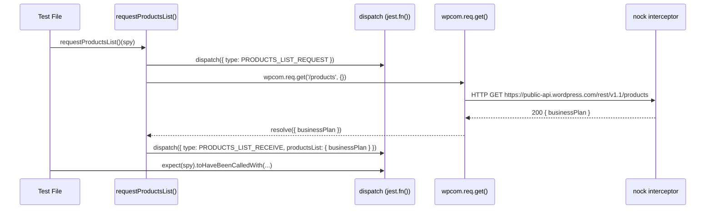
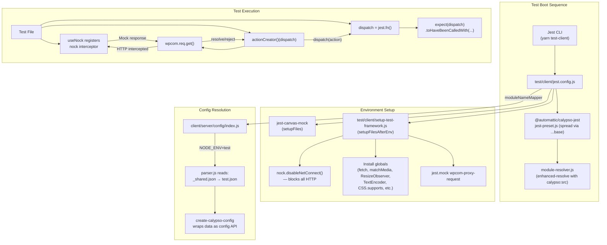

# wp-calypso Testing Infrastructure Investigation

This document is a comprehensive, evidence-based onboarding guide to the **wp-calypso** testing infrastructure. Every claim cites the specific source file and, where practical, includes the relevant code excerpt. It is designed so a new contributor can read it sequentially and progressively build an understanding of how Calypso's test environment works, how it differs from the development runtime, and how API mocking, config resolution, and feature flags are handled during tests.

---

## Table of Contents

1. [Development Server Verification](#1-development-server-verification)
2. [Test Environment Characterization](#2-test-environment-characterization)
   - [2.1 Jest Configuration Hierarchy](#21-jest-configuration-hierarchy)
   - [2.2 Shared Base Preset](#22-shared-base-preset)
   - [2.3 Setup File Chain](#23-setup-file-chain)
   - [2.4 Key Environment Variables at Test Time](#24-key-environment-variables-at-test-time)
   - [2.5 Module Resolution at Test Time](#25-module-resolution-at-test-time)
3. [Test-Only Globals, Polyfills, and Mocks](#3-test-only-globals-polyfills-and-mocks)
   - [3.1 Comprehensive Globals Inventory](#31-comprehensive-globals-inventory)
   - [3.2 Module-Level Mocks](#32-module-level-mocks)
   - [3.3 Comparison: Test vs. Development Runtime](#33-comparison-test-vs-development-runtime)
4. [Network Request Interception During Tests](#4-network-request-interception-during-tests)
   - [4.1 nock.disableNetConnect() — Global Network Isolation](#41-nock-disablenetconnect-global-network-isolation)
   - [4.2 The useNock Helper — Interceptor Lifecycle Management](#42-the-usenock-helper-interceptor-lifecycle-management)
   - [4.3 What Happens When an Unintercepted Request Is Made](#43-what-happens-when-an-unintercepted-request-is-made)
5. [End-to-End Mock Tracing of an API Call](#5-end-to-end-mock-tracing-of-an-api-call)
   - [5.1 The Test Setup](#51-the-test-setup)
   - [5.2 The Request Flow (Success Path)](#52-the-request-flow-success-path)
   - [5.3 The Request Flow (Failure Path)](#53-the-request-flow-failure-path)
   - [5.4 Flow Diagram](#54-flow-diagram)
6. [Configuration and Feature Flag Divergence](#6-configuration-and-feature-flag-divergence)
   - [6.1 Config Resolution Path](#61-config-resolution-path)
   - [6.2 config/test.json vs config/development.json Comparison](#62-configtestjson-vs-configdevelopmentjson-comparison)
   - [6.3 How Tests Read from test.json (Proof)](#63-how-tests-read-from-testjson-proof)
   - [6.4 Browser-Side Config (calypso-config) vs Test-Side Config](#64-browser-side-config-calypso-config-vs-test-side-config)
   - [6.5 Overriding Feature Flags in Tests](#65-overriding-feature-flags-in-tests)
7. [Summary: Test Boot Sequence](#7-summary-test-boot-sequence)

---

## 1. Development Server Verification

The Calypso development server establishes the **runtime baseline** — the environment against which the test environment can be compared. Understanding what the dev server provides helps clarify which globals and behaviors are "real" (browser-native) vs. "synthetic" (test-only polyfills/mocks).

### 1.1 Startup Sequence

The development server is started via `yarn start`. From `package.json` (line 110):

```json
"start": "npx check-node-version --package && node bin/welcome.js && yarn run build && yarn run start-build"
```

This runs four steps sequentially:

1. **`check-node-version --package`** — Validates that the active Node.js version satisfies the engine requirement.
2. **`node bin/welcome.js`** — Prints a welcome message.
3. **`yarn run build`** — Runs the full build pipeline: static assets, CSS, devdocs search index, then in parallel: server bundle and client bundle (if `CALYPSO_ENV=production`).
4. **`yarn run start-build`** — Launches the Node.js server.

The `start-build` script, from `package.json` (line 113):

```json
"start-build": "BROWSERSLIST_ENV=evergreen node build/server.js | bunyan -o short"
```

This starts the Node.js server process (`build/server.js`) with `BROWSERSLIST_ENV=evergreen`, piping output through `bunyan` for human-readable log formatting.

### 1.2 Engine Requirements

From `package.json` (lines 56–59):

```json
"engines": {
    "node": "^v22.9.0",
    "yarn": "^4.0.0"
}
```

Both the development server and the test runner require Node.js `^22.9.0`.

### 1.3 What the Dev Server Provides

The dev server serves a server-side rendered Calypso application. From `config/development.json` (lines 2–8):

```json
{
    "env": "development",
    "env_id": "development",
    "favicon_url": "/calypso/images/favicons/favicon-development.ico",
    "client_slug": "browser",
    "protocol": "http",
    "hostname": "calypso.localhost",
    "port": 3000
}
```

The application is accessible at `http://calypso.localhost:3000` and reads its configuration from `config/development.json` (with `config/_shared.json` merged in as a base).

### 1.4 Runtime Baseline

In the development runtime, browser globals such as `fetch`, `matchMedia`, `ResizeObserver`, `CSS.supports`, `TextEncoder`, `TextDecoder`, `ReadableStream`, `Worker`, `structuredClone`, and `crypto.subtle` are all provided **natively** by the browser engine. They are **not** polyfilled or mocked. This is the key distinction from the test environment, where many of these must be synthetically installed because Jest runs in Node.js (or jsdom), not a real browser.

---

## 2. Test Environment Characterization

### 2.1 Jest Configuration Hierarchy

wp-calypso maintains seven distinct test suites, each with its own Jest configuration. The test scripts are defined in `package.json` (lines 120–133):

```json
"test": "run-s -s test-client test-packages test-server test-build-tools",
"test-build-tools": "jest -c=test/build-tools/jest.config.js",
"test-client": "TZ=UTC jest -c=test/client/jest.config.js",
"test-integration": "jest -c=test/integration/jest.config.js",
"test-apps": "jest -c=test/apps/jest.config.js",
"test-packages": "jest -c=test/packages/jest.config.js",
"test-server": "jest -c=test/server/jest.config.js"
```

| Suite | Config File | Test Environment | rootDir | Spreads Base Preset? |
|-------|------------|-----------------|---------|---------------------|
| Client | `test/client/jest.config.js` | node (inherited from base) | `../../client` | Yes (`...base`) |
| Server | `test/server/jest.config.js` | node (inherited from base) | `../../client/server` | Yes (`...base`) |
| Packages | `test/packages/jest-preset.js` (preset) | node (inherited from base) | varies per package | Yes (`...base`) |
| Apps | `test/apps/jest-preset.js` | jsdom (explicitly set, line 7) | varies per app | Yes (`...base`) |
| Build-tools | `test/build-tools/jest.config.js` | node (inherited from base) | `../../build-tools` | Yes (`...base`) |
| Integration | `test/integration/jest.config.js` | node (explicitly set, line 7) | `../..` | **No** (standalone config) |
| E2E | `test/e2e/` | Playwright (separate from Jest) | — | N/A |

> **Note on the Packages suite**: The `test-packages` script in `package.json` (line 129) points to `test/packages/jest.config.js` — **not** the preset. That config file uses Jest's `projects` feature (`projects: ['<rootDir>/packages/*/jest.config.js']`) to discover per-package Jest configs. Individual packages then reference `test/packages/jest-preset.js` as their preset. The table above lists the preset because it defines the shared configuration (environment, globals, setup files) that all package-level configs inherit.

> **Note on the Client suite `testEnvironmentOptions.url`**: The client config sets `testEnvironmentOptions: { url: 'https://example.com' }` (line 17–18). This is a jsdom-specific option that configures the URL for test files that opt into jsdom via `@jest-environment jsdom` docblocks. It does **not** activate jsdom as the default environment — the default remains `node` (inherited from the base preset).

### 2.2 Shared Base Preset

All suites except Integration and E2E inherit from the shared base preset defined in `packages/calypso-jest/jest-preset.js`:

```javascript
const { defaults } = require( 'jest-config' );

module.exports = {
    resolver: require.resolve( './src/module-resolver.js' ),
    setupFilesAfterEnv: [ require.resolve( './src/setup.js' ) ],
    testEnvironment: 'node',
    testMatch: [ '<rootDir>/**/test/*.[jt]s?(x)', '!**/.eslintrc.*' ],
    transform: {
        '\\.[jt]sx?$': [ 'babel-jest', { rootMode: 'upward' } ],
        '\\.(gif|jpg|jpeg|png|svg|scss|sass|css)$': require.resolve( './src/asset-transform.js' ),
    },
    testPathIgnorePatterns: [ ...defaults.testPathIgnorePatterns, '/dist/' ],
    verbose: false,
    snapshotFormat: {
        escapeString: true,
        printBasicPrototype: true,
    },
};
```

Key configuration points:

| Property | Value | Purpose |
|----------|-------|---------|
| `resolver` | `./src/module-resolver.js` | Custom `enhanced-resolve` based resolver with `calypso:src` field priority |
| `setupFilesAfterEnv` | `[ ./src/setup.js ]` | Minimal shared setup (installs `global.CSS.supports` mock) |
| `testEnvironment` | `'node'` | Default environment; overridden by apps suite (to jsdom). The client suite inherits node and manually installs browser-like globals. |
| `testMatch` | `['<rootDir>/**/test/*.[jt]s?(x)', ...]` | Auto-discovers tests in `test/` subdirectories |
| `transform` | babel-jest with `rootMode: 'upward'` | Transpiles source using root-level Babel config; transforms image/style assets to empty modules |
| `testPathIgnorePatterns` | `[...defaults, '/dist/']` | Excludes built output from test discovery |

### 2.3 Setup File Chain

> **Critical detail**: When a suite-specific config does `{ ...base, setupFilesAfterEnv: [...] }`, the suite's `setupFilesAfterEnv` **replaces** (not merges with) the base preset's `setupFilesAfterEnv`. This means the base preset's `packages/calypso-jest/src/setup.js` only runs for suites that do **not** override `setupFilesAfterEnv`.

The base setup file (`packages/calypso-jest/src/setup.js`) contains only:

```javascript
// This is used by @wordpress/components in
// https://github.com/WordPress/gutenberg/blob/trunk/packages/components/src/ui/utils/space.ts#L33
// JSDOM or CSSDOM don't provide an implementation for it, so for now we have to mock it.
global.CSS = {
    supports: jest.fn(),
};
```

Here is the complete setup file chain for each suite:

**Client suite** (`test/client/jest.config.js`):
The client suite runs in the **node** environment (inherited from the base preset), not jsdom. Browser-like globals (`fetch`, `matchMedia`, `ResizeObserver`, etc.) are manually installed by the setup file rather than provided by a jsdom environment. Individual test files can opt into jsdom via `@jest-environment jsdom` docblocks when they need a full DOM environment.
1. `setupFiles: [ 'jest-canvas-mock' ]` (line 20) — Canvas API polyfill, primarily useful for test files that opt into the jsdom environment
2. `setupFilesAfterEnv: [ '<rootDir>/../test/client/setup-test-framework.js' ]` (line 21) — Installs ALL test-only globals/polyfills, nock network isolation, and `wpcom-proxy-request` mock. This **replaces** the base preset's `setupFilesAfterEnv`, so `packages/calypso-jest/src/setup.js` does NOT run. However, `test/client/setup-test-framework.js` independently re-installs `global.CSS = { supports: jest.fn() }` (lines 30–32).

**Server suite** (`test/server/jest.config.js`):
1. `setupFilesAfterEnv: [ require.resolve( './setup-test-framework.js' ) ]` (line 13) — nock network isolation and `wpcom-proxy-request` mock only. **Replaces** the base preset's `setupFilesAfterEnv`.

**Packages suite** (`test/packages/jest-preset.js`):
1. `setupFilesAfterEnv: [ '<rootDir>../../test/packages/setup.js' ]` (line 14) — `@testing-library/jest-dom`, `crypto.randomUUID → 'fake-uuid'`, `ResizeObserver` polyfill, `matchMedia` mock. **Replaces** the base preset's `setupFilesAfterEnv`. Note: `global.CSS.supports` is NOT installed by this setup.

**Apps suite** (`test/apps/jest-preset.js`):
1. `setupFiles: [ 'jest-canvas-mock' ]` (line 11) — Canvas API polyfill
2. `setupFilesAfterEnv: [ require.resolve( '../client/setup-test-framework.js' ) ]` (line 13) — Delegates to the **same** setup file as the Client suite. The comment on line 12 confirms: `// This includes a lot of globals that don't exist, like fetch, matchMedia, etc.`

**Build-tools suite** (`test/build-tools/jest.config.js`):
1. Does **not** override `setupFilesAfterEnv` — inherits the base preset's `packages/calypso-jest/src/setup.js`, which installs `global.CSS = { supports: jest.fn() }`.

**Integration suite** (`test/integration/jest.config.js`):
1. Does **not** spread `...base` at all — this is a standalone config. No `setupFilesAfterEnv` is specified, meaning **no setup files run**. The integration suite also does NOT disable network requests (see [Section 4](#4-network-request-interception-during-tests)).

### 2.4 Key Environment Variables at Test Time

| Variable | Value at Test Time | Set By | Source Evidence |
|----------|-------------------|--------|----------------|
| `NODE_ENV` | `test` | Jest | Jest automatically sets this |
| `TZ` | `UTC` | `test-client` script | `package.json` line 122: `"test-client": "TZ=UTC jest -c=test/client/jest.config.js"` |
| `CALYPSO_ENV` | unset | — | Falls through to `NODE_ENV` in `client/server/config/index.js` line 6 |

The `TZ=UTC` ensures date-dependent tests are timezone-deterministic. Note that only the `test-client` script explicitly sets `TZ`; other suites (server, packages, build-tools) do not.

### 2.5 Module Resolution at Test Time

Both `test/module-resolver.js` and `packages/calypso-jest/src/module-resolver.js` implement the same custom module resolver using `enhanced-resolve`.

From `test/module-resolver.js`:

```javascript
const enhancedResolve = require( 'enhanced-resolve' );

const resolver = enhancedResolve.create.sync( {
    extensions: [ '.json', '.js', '.jsx', '.ts', '.tsx' ],
    mainFields: [ 'calypso:src', 'main' ],
    conditionNames: [ 'calypso:src', 'node', 'require' ],
} );

module.exports = function ( request, options ) {
    return resolver( options.basedir, request ).replace( /\0#/g, '#' );
};
```

Key behaviors:

- **`mainFields: [ 'calypso:src', 'main' ]`** — Prefers the `calypso:src` field in `package.json`, which points to untranspiled source code (usually `./src/index.js`). This means tests resolve monorepo packages to their **untranspiled source** rather than built output, saving transpilation time.
- **`conditionNames: [ 'calypso:src', 'node', 'require' ]`** — Supports conditional exports with the `calypso:src` condition.
- **`extensions: [ '.json', '.js', '.jsx', '.ts', '.tsx' ]`** — Resolves TypeScript and JSX files without explicit extensions.
- **`.replace( /\0#/g, '#' )`** (line 23) — Normalizes escaped hash sequences that can appear in resolved paths.

The Integration suite uses the same resolver directly: `resolver: require.resolve( '@automattic/calypso-jest/src/module-resolver.js' )` (`test/integration/jest.config.js` line 8).

---

## 3. Test-Only Globals, Polyfills, and Mocks

### 3.1 Comprehensive Globals Inventory

Every global and polyfill installed during test execution is listed below, organized by the setup file that installs it.

#### From `packages/calypso-jest/src/setup.js` (Build-tools suite only)

> This only runs for build-tools because other suites override `setupFilesAfterEnv`.

| Global | Value | Code |
|--------|-------|------|
| `global.CSS` | `{ supports: jest.fn() }` | `global.CSS = { supports: jest.fn() };` |

#### From `test/client/setup-test-framework.js` (Client suite AND Apps suite)

This is the most comprehensive setup file, installing 12+ globals/polyfills:

| Global | Value | Lines | Code |
|--------|-------|-------|------|
| `global.TextEncoder` | Node.js `util.TextEncoder` | 5, 25 | `const { TextEncoder, TextDecoder } = require( 'util' );` then `global.TextEncoder = TextEncoder;` |
| `global.TextDecoder` | Node.js `util.TextDecoder` | 5, 26 | `global.TextDecoder = TextDecoder;` |
| `global.CSS` | `{ supports: jest.fn() }` | 30–32 | `global.CSS = { supports: jest.fn() };` |
| `global.ResizeObserver` | `resize-observer-polyfill` package | 34 | `global.ResizeObserver = require( 'resize-observer-polyfill' );` |
| `global.fetch` | `jest.fn()` returning resolved Promise | 36–40 | See below |
| `global.crypto.randomUUID` | Delegates to real Node.js `crypto.randomUUID()` | 52 | `global.crypto.randomUUID = () => nodeCrypto.randomUUID();` |
| `global.matchMedia` | `jest.fn()` returning mock `MediaQueryList` | 54–63 | See below |
| `global.ReadableStream` | Node.js `stream/web.ReadableStream` | 4, 66 | `const { ReadableStream, TransformStream } = require( 'node:stream/web' );` then `global.ReadableStream = ReadableStream;` |
| `global.TransformStream` | Node.js `stream/web.TransformStream` | 4, 67 | `global.TransformStream = TransformStream;` |
| `global.Worker` | Node.js `worker_threads.Worker` | 68 | `global.Worker = require( 'worker_threads' ).Worker;` |
| `global.structuredClone` | `(obj) => JSON.parse( JSON.stringify( obj ) )` | 71–73 | Conditional: only if `typeof global.structuredClone !== 'function'` |
| `global.crypto.subtle` | Node.js `crypto.subtle` | 76–79 | Conditional: only if `!global.crypto.subtle` |

**`global.fetch` mock** (lines 36–40):
```javascript
global.fetch = jest.fn( () =>
    Promise.resolve( {
        json: () => Promise.resolve(),
    } )
);
```
This is a no-op spy that returns a resolved Promise with a `.json()` method. It does NOT make any real network requests.

**`global.matchMedia` mock** (lines 54–63):
```javascript
global.matchMedia = jest.fn( ( query ) => ( {
    matches: false,
    media: query,
    onchange: null,
    addListener: jest.fn(), // deprecated
    removeListener: jest.fn(), // deprecated
    addEventListener: jest.fn(),
    removeEventListener: jest.fn(),
    dispatchEvent: jest.fn(),
} ) );
```
This mock always returns `matches: false` for any media query.

#### From `test/client/jest.config.js` (Jest globals — NOT runtime globals)

These are Jest `globals`, injected into the test file scope but not onto the `global` object:

| Global | Value | Lines | Code |
|--------|-------|-------|------|
| `google` | `{}` | 23 | `globals: { google: {} }` |
| `__i18n_text_domain__` | `'default'` | 24 | `globals: { __i18n_text_domain__: 'default' }` |

`google` is an empty object placeholder for the Google Maps SDK. `__i18n_text_domain__` is a build-time constant normally replaced by webpack.

#### From `test/packages/setup.js` (Packages suite only)

| Global | Value | Lines | Code |
|--------|-------|-------|------|
| `global.crypto.randomUUID` | `() => 'fake-uuid'` | 3 | `global.crypto.randomUUID = () => 'fake-uuid';` |
| `global.ResizeObserver` | `resize-observer-polyfill` | 5 | `global.ResizeObserver = require( 'resize-observer-polyfill' );` |
| `global.matchMedia` | `jest.fn()` returning mock `MediaQueryList` | 7–16 | Same structure as client setup |

> **Important difference**: The packages suite returns the constant string `'fake-uuid'` from `crypto.randomUUID`, while the client suite delegates to the real `nodeCrypto.randomUUID()` which returns actual UUIDs. This means snapshot tests in the packages suite produce deterministic UUIDs, while client suite tests get real (random) UUIDs.

#### From `test/packages/jest-preset.js` (Jest globals for Packages suite)

| Global | Value | Line | Code |
|--------|-------|------|------|
| `__i18n_text_domain__` | `'default'` | 12 | `globals: { __i18n_text_domain__: 'default' }` |

### 3.2 Module-Level Mocks

#### `wpcom-proxy-request` Mock

This module is mocked at the module level in both client and server setup files because the real implementation accesses `document.createElement('iframe')` for browser iframe-based API proxy communication, which crashes in Node.js/jsdom environments.

**Client suite** (`test/client/setup-test-framework.js`, lines 44–49):
```javascript
jest.mock( 'wpcom-proxy-request', () => ( {
    __esModule: true,
    canAccessWpcomApis: jest.fn(),
    reloadProxy: jest.fn(),
    requestAllBlogsAccess: jest.fn(),
} ) );
```
The client mock provides spy functions for `canAccessWpcomApis`, `reloadProxy`, and `requestAllBlogsAccess`.

**Server suite** (`test/server/setup-test-framework.js`, lines 21–23):
```javascript
jest.mock( 'wpcom-proxy-request', () => ( {
    __esModule: true,
} ) );
```
The server mock is minimal — just `__esModule: true` — because server-side code never calls the proxy API functions.

#### `@testing-library/jest-dom`

Both the client setup (`test/client/setup-test-framework.js`, line 1) and the packages setup (`test/packages/setup.js`, line 1) import `@testing-library/jest-dom`:

```javascript
import '@testing-library/jest-dom';
```

This extends Jest's `expect` with custom DOM matchers like `toBeInTheDocument()`, `toHaveTextContent()`, etc.

### 3.3 Comparison: Test vs. Development Runtime

| Global | Test (Client Suite) | Development (Browser) | Notes |
|--------|--------------------|-----------------------|-------|
| `fetch` | `jest.fn()` — no-op spy returning `Promise.resolve()` | Native browser `fetch` | Test version silently succeeds without making real requests |
| `matchMedia` | `jest.fn()` always returning `{ matches: false }` | Native browser `matchMedia` | Test never matches any media query |
| `ResizeObserver` | `resize-observer-polyfill` package | Native browser `ResizeObserver` | Polyfill in test, native in modern browsers |
| `CSS.supports` | `jest.fn()` | Native browser `CSS.supports()` | Real method in browser returns boolean, spy returns `undefined` |
| `TextEncoder` / `TextDecoder` | Node.js `util` module | Native browser APIs | Needed for `ReactDOMServer` in jsdom |
| `ReadableStream` / `TransformStream` | Node.js `stream/web` module | Native browser Streams API | Used by `@wp-playground/client` |
| `Worker` | Node.js `worker_threads.Worker` | Native browser `Worker` | Web Worker polyfill via Node.js worker threads |
| `structuredClone` | `JSON.parse(JSON.stringify(obj))` fallback | Native browser `structuredClone` | Conditional; lossy — no circular refs, no `Date`, `RegExp`, `Map`, `Set`, `ArrayBuffer` preservation |
| `crypto.subtle` | Node.js `crypto.subtle` | Native browser `SubtleCrypto` | Conditional installation; functionally equivalent |
| `crypto.randomUUID` | Node.js `crypto.randomUUID()` (real UUIDs) | Native browser `crypto.randomUUID()` | Functionally equivalent in client suite; constant `'fake-uuid'` in packages suite |
| `google` | `{}` (Jest global) | Google Maps SDK object (if script loaded) | Empty placeholder prevents `ReferenceError` |
| `__i18n_text_domain__` | `'default'` (Jest global) | Not present at runtime | Replaced at build time by webpack `DefinePlugin` |
| Canvas API | `jest-canvas-mock` package | Native browser Canvas API | Polyfilled via `setupFiles` in client and apps suites |

---

## 4. Network Request Interception During Tests

<a id="41-nock-disablenetconnect-global-network-isolation"></a>

### 4.1 nock.disableNetConnect() — Global Network Isolation

Network isolation is the first line of defense ensuring tests never make real HTTP calls. It is established in the setup files for both client and server suites.

**Client suite** (`test/client/setup-test-framework.js`):

```javascript
const nock = require( 'nock' );                    // line 6

// Disables all network requests for all tests.
nock.disableNetConnect();                           // line 9

beforeAll( () => {
    // reactivate nock on test start
    if ( ! nock.isActive() ) {
        nock.activate();
    }
} );                                                // lines 11-16

afterAll( () => {
    // helps clean up nock after each test run and avoid memory leaks
    nock.restore();
    nock.cleanAll();
} );                                                // lines 18-22
```

**How it works**:

1. **`nock.disableNetConnect()`** (line 9) is called at **module scope** — it executes the moment Jest loads this setup file, **before any test runs**. nock monkey-patches Node's `http.ClientRequest` and `https.ClientRequest` at the native module level. After this call, any code that uses `http.request()`, `https.request()`, or any library built on them (`fetch` polyfills, `superagent`, `wpcom.js`, `axios`) receives a `NetConnectNotAllowedError` unless a matching nock interceptor has been registered.

2. **`beforeAll`** (lines 11–16) re-enables nock if a previous test suite called `nock.restore()`. This ensures nock is always active when a new suite begins.

3. **`afterAll`** (lines 18–22) calls `nock.restore()` to remove the monkey-patches from `http`/`https` modules, and `nock.cleanAll()` to remove all registered interceptors. This prevents memory leaks between test suites.

**Server suite** (`test/server/setup-test-framework.js`) uses the identical pattern:

```javascript
import * as nock from 'nock';                       // line 1

// Disables all network requests for all tests.
nock.disableNetConnect();                           // line 4

beforeAll( () => {
    // reactivate nock on test start
    if ( ! nock.isActive() ) {
        nock.activate();
    }
} );                                                // lines 6-11

afterAll( () => {
    // helps clean up nock after each test run and avoid memory leaks
    nock.restore();
    nock.cleanAll();
} );                                                // lines 13-17
```

**Important exception**: The **Integration suite** (`test/integration/jest.config.js`) does NOT load any setup file that calls `nock.disableNetConnect()`. Its config is standalone (no `...base` spread) and has no `setupFilesAfterEnv`. This means integration tests **can make real network requests**, which is by design. As stated in `docs/testing/testing-overview.md` (line 60):

> "They run daily on continuous integration (TeamCity), because they can use network connection or memory intensive processing and therefore can have longer runtime."

<a id="42-the-usenock-helper-interceptor-lifecycle-management"></a>

### 4.2 The useNock Helper — Interceptor Lifecycle Management

Individual test files use the `useNock` helper from `client/test-helpers/use-nock/index.js` to register mock HTTP responses:

```javascript
import debug from 'debug';
import nock from 'nock';

export { nock };

const log = debug( 'calypso:test:use-nock' );

/**
 * @param {Function} setupCallback Function executed before all tests are run.
 * @deprecated Use nock directly instead.
 */
export const useNock = ( setupCallback ) => {
    if ( setupCallback ) {
        beforeAll( () => setupCallback( nock ) );   // line 14
    }
    afterAll( () => {
        log( 'Cleaning up nock' );
        nock.cleanAll();                             // line 18
    } );
};

export default useNock;
```

Key behaviors:

- **`beforeAll( () => setupCallback( nock ) )`** (line 14) — The callback receives the `nock` module and registers interceptors **before** any tests in the `describe` block run.
- **`afterAll( () => nock.cleanAll() )`** (line 18) — Removes all interceptors **after** all tests in the block complete, preventing interceptor leakage between `describe` blocks.
- **Deprecated** — The JSDoc on line 10 states `@deprecated Use nock directly instead.`

**Typical usage** from `client/state/products-list/test/actions.js` (lines 44–54):

```javascript
useNock( ( nock ) => {
    nock( 'https://public-api.wordpress.com:443' )
        .get( '/rest/v1.1/products' )
        .twice()
        .reply( 200, { businessPlan } )
        .get( '/rest/v1.1/products' )
        .reply( 500, {
            error: 'server_error',
            message: 'A server error occurred',
        } );
} );
```

This registers three interceptors on `https://public-api.wordpress.com:443/rest/v1.1/products`:
- First two `GET` requests → `200` response with `{ businessPlan }` (via `.twice()`)
- Third `GET` request → `500` response with error payload

### 4.3 What Happens When an Unintercepted Request Is Made

If test code makes an HTTP request without a matching nock interceptor, nock throws a `NetConnectNotAllowedError` with a message like:

```
Nock: Disallowed net connect for "example.com:443/path"
```

This causes the test to **fail immediately**, which is the desired behavior — it prevents tests from accidentally making real network calls to external services. This safety net catches:
- Missing mock interceptors
- Typos in mocked URLs
- Unexpected code paths that trigger network requests
- Third-party libraries making undocumented HTTP calls

---

## 5. End-to-End Mock Tracing of an API Call

This section traces a concrete test — `client/state/products-list/test/actions.js` — from test setup through mocked API response to final assertion.

### 5.1 The Test Setup

**Step 1: Import chain** (lines 1–7)

```javascript
import {
    PRODUCTS_LIST_RECEIVE,
    PRODUCTS_LIST_REQUEST,
    PRODUCTS_LIST_REQUEST_FAILURE,
} from 'calypso/state/action-types';
import useNock from 'calypso/test-helpers/use-nock';
import { receiveProductsList, requestProductsList } from '../actions';
```

The test imports action type constants, the `useNock` helper, and the action creators under test.

**Step 2: Dispatch spy creation** (lines 12–19)

```javascript
beforeEach( () => {
    spy = jest.fn();
    global.window = {
        location: {
            search: '',
        },
    };
} );
```

Before each test, a fresh `jest.fn()` spy is created to act as the Redux store's `dispatch` function. A mock `window.location.search` is set (used by `requestProductsList` to check for a `site` query parameter).

**Step 3: Mock data definition** (lines 21–29)

```javascript
const businessPlan = {
    product_id: 1008,
    product_name: 'WordPress.com Business',
    product_slug: 'business-bundle',
    is_domain_registration: false,
    description: '',
    cost: 300,
    cost_display: '$300',
};
```

**Step 4: nock interceptor registration** (lines 44–54 via `useNock`)

As shown in [Section 4.2](#42-the-usenock-helper-interceptor-lifecycle-management), three interceptors are registered on `https://public-api.wordpress.com:443` for `GET /rest/v1.1/products`.

### 5.2 The Request Flow (Success Path)

The test on lines 56–60:

```javascript
test( 'should dispatch fetch action when thunk triggered', () => {
    requestProductsList()( spy );

    expect( spy ).toHaveBeenCalledWith( { type: PRODUCTS_LIST_REQUEST } );
} );
```

Here is the complete flow:

1. **Test calls `requestProductsList()(spy)`** — This invokes the thunk action creator with `spy` as the `dispatch` function.

2. **Inside `client/state/products-list/actions.js`** (lines 52–57), the thunk executes:

```javascript
return ( dispatch ) => {
    dispatch( { type: PRODUCTS_LIST_REQUEST } );

    return wpcom.req
        .get( path, requestQuery )
        .then( ( productsList ) => dispatch( receiveProductsList( productsList, query.type ) ) )
        .catch( ( error ) => {
            // ...error handling...
            dispatch( {
                type: PRODUCTS_LIST_REQUEST_FAILURE,
                error,
            } );
        } );
};
```

3. **`dispatch({ type: PRODUCTS_LIST_REQUEST })`** — The spy receives its first call with `{ type: 'PRODUCTS_LIST_REQUEST' }`.

4. **`wpcom.req.get( '/products', {} )`** — The `wpcom` module (from `calypso/lib/wp`) makes an HTTP GET request to `https://public-api.wordpress.com:443/rest/v1.1/products`.

5. **nock intercepts** — The `http.ClientRequest` is intercepted by the nock interceptor registered in `useNock`. Instead of making a real network call, nock returns the mock response `{ businessPlan }` with status 200.

6. **The `.then()` handler** calls `dispatch( receiveProductsList( { businessPlan }, undefined ) )`. The `receiveProductsList` function (lines 12–29 of `actions.js`) processes the data and returns:
   ```javascript
   { type: PRODUCTS_LIST_RECEIVE, productsList: { businessPlan }, productsListType: null }
   ```

7. **`spy` now has two calls**: once with `PRODUCTS_LIST_REQUEST`, once with `PRODUCTS_LIST_RECEIVE`.

The second test (lines 62–70) explicitly asserts the receive action:

```javascript
test( 'should dispatch product list receive action when request completes', () => {
    return requestProductsList()( spy ).then( () => {
        expect( spy ).toHaveBeenCalledWith( {
            type: PRODUCTS_LIST_RECEIVE,
            productsList: { businessPlan },
            productsListType: null,
        } );
    } );
} );
```

### 5.3 The Request Flow (Failure Path)

The third test (lines 72–79):

```javascript
test( 'should dispatch fail action when request fails', () => {
    return requestProductsList()( spy ).then( () => {
        expect( spy ).toHaveBeenCalledWith( {
            type: PRODUCTS_LIST_REQUEST_FAILURE,
            error: expect.objectContaining( { message: 'A server error occurred' } ),
        } );
    } );
} );
```

After the first two `.twice()` reply interceptors are consumed (by the two previous tests), the third call hits the `500` interceptor. The flow:

1. `wpcom.req.get()` receives a 500 response from nock
2. The promise rejects → the `.catch()` handler executes
3. Since `window.location.search` is `''`, there is no `site` parameter, so the retry branch is skipped
4. `dispatch({ type: PRODUCTS_LIST_REQUEST_FAILURE, error })` is called
5. The test asserts the error object contains `{ message: 'A server error occurred' }`

### 5.4 Flow Diagram



---

## 6. Configuration and Feature Flag Divergence

### 6.1 Config Resolution Path

The configuration system uses a **module redirection** pattern to ensure tests read from `config/test.json` while the development server reads from `config/development.json`.

**Step 1: Jest `moduleNameMapper` redirects `@automattic/calypso-config`**

All Jest configs that need configuration access use `moduleNameMapper` to redirect the browser-side config module to the server-side config entry point:

| Suite | Config File | Mapper Rule |
|-------|------------|-------------|
| Client | `test/client/jest.config.js` (line 11) | `'^@automattic/calypso-config$': '<rootDir>/server/config/index.js'` |
| Server | `test/server/jest.config.js` (lines 10–11) | `'^@automattic/calypso-config$': 'calypso/server/config'` |
| Integration | `test/integration/jest.config.js` (line 3) | `'^@automattic/calypso-config$': '<rootDir>/client/server/config/index.js'` |

**Step 2: `client/server/config/index.js` determines the environment**

From `client/server/config/index.js`:

```javascript
const configPath = require( 'path' ).resolve( __dirname, '..', '..', '..', 'config' );
const { default: createConfig } = require( '@automattic/create-calypso-config' );
const parser = require( './parser' );

const { serverData, clientData } = parser( configPath, {
    env: process.env.CALYPSO_ENV || process.env.NODE_ENV || 'development',  // line 6
    enabledFeatures: process.env.ENABLE_FEATURES,                            // line 7
    disabledFeatures: process.env.DISABLE_FEATURES,                          // line 8
} );

module.exports = createConfig( serverData );
module.exports.clientData = clientData;
```

- At **test time**: `NODE_ENV=test` (set by Jest) → env resolves to `'test'`
- At **dev time**: `NODE_ENV=development` → env resolves to `'development'`
- `CALYPSO_ENV` takes precedence if set, but is typically unset in both environments

**Step 3: `client/server/config/parser.js` reads config files in cascade**

From `client/server/config/parser.js` (lines 31–35):

```javascript
const configFiles = [
    path.resolve( configPath, '_shared.json' ),
    path.resolve( configPath, opts.env + '.json' ),       // 'test.json' or 'development.json'
    path.resolve( configPath, opts.env + '.local.json' ),  // optional local overrides
];
```

The parser reads files in order and merges them, with later files overriding earlier ones. The `features` key is special — it is **deep-merged** rather than replaced (lines 44–46):

```javascript
assignWith( data, getDataFromFile( file ), ( objValue, srcValue, key ) =>
    key === 'features' ? { ...objValue, ...srcValue } : undefined
);
```

This means: `_shared.json` features are merged first, then `test.json` (or `development.json`) features are spread on top. Non-feature keys are simply replaced.

**Step 4: `packages/create-calypso-config/src/index.ts` wraps the data**

The parsed data is wrapped in a callable API (`packages/create-calypso-config/src/index.ts`, lines 132–140):

```typescript
export default ( data: ConfigData ): ConfigApi => {
    const configApi = config( data ) as ConfigApi;
    configApi.isEnabled = isEnabled( data );
    configApi.enabledFeatures = enabledFeatures( data );
    configApi.enable = enable( data );
    configApi.disable = disable( data );

    return configApi;
};
```

This provides: `config(key)`, `config.isEnabled(feature)`, `config.enabledFeatures()`, `config.enable(feature)`, `config.disable(feature)`.

### 6.2 config/test.json vs config/development.json Comparison

#### Top-Level Key Differences

| Key | `test.json` | `development.json` | Notes |
|-----|------------|--------------------|----|
| `env_id` | `"test"` | `"development"` | Primary environment identifier |
| `favicon_url` | *(absent)* | `"/calypso/images/favicons/favicon-development.ico"` | No favicon needed in test |
| `dsp_stripe_pub_key` | *(absent — inherited from `_shared.json`)* | Present (Stripe key) | development.json overrides _shared.json |
| `dsp_widget_js_src` | *(absent — inherited from `_shared.json`)* | Present (`https://dsp.wp.com/widget.js`) | development.json overrides _shared.json |
| `zendesk_presales_chat_key` | *(absent — inherited from `_shared.json` as `false`)* | Present (actual key) | development.json provides real Zendesk key |
| `google_recaptcha_site_key` | `""` (empty string) | *(absent — inherited from `_shared.json` as `false`)* | Explicitly emptied in test |

#### Feature Flag Comparison

| Metric | `test.json` | `development.json` |
|--------|------------|-------------------|
| Total feature flags | **101** | **178** |
| Only in development | — | **82 flags** |
| Only in test | **5 flags** | — |
| In both configs | **96 flags** | **96 flags** |
| Different values (shared flags) | **10 flags** | **10 flags** |

**Flags only in `test.json`** (not in `development.json`):

| Flag | Value |
|------|-------|
| `catch-js-errors` | `false` |
| `difm/allow-extra-pages` | `false` |
| `jetpack-social/advanced-plan` | `false` |
| `layout/site-level-user-profile` | `true` |
| `p2-enabled` | `false` |

**Flags with different values between test and development**:

| Flag | `test.json` | `development.json` |
|------|------------|-------------------|
| `checkout/checkout-version` | `false` | `true` |
| `google-my-business` | `false` | `true` |
| `individual-subscriber-stats` | `false` | `true` |
| `jetpack/sharing-buttons-block-enabled` | `false` | `true` |
| `lasagna` | `false` | `true` |
| `launchpad-updates` | `false` | `true` |
| `post-list/qr-code-link` | `false` | `true` |
| `redirect-fallback-browsers` | `true` | `false` |
| `rum-tracking/logstash` | `false` | `true` |
| `ssr/prefetch-timebox` | `true` | `false` |

**Notable categories only in development** include:
- All `dev/*` flags (6 flags: auth-helper, features-helper, etc.) — dev tools not needed in tests
- AI features (`calypso/ai-*`, `jetpack/ai-*`) — not tested at unit level
- `i18n/*` flags — internationalization features
- Multiple `stats/*`, `reader/*`, `themes/*` flags — broader feature coverage in dev

### 6.3 How Tests Read from test.json (Proof)

The proof chain:

1. **Jest sets `NODE_ENV=test`** automatically when running tests.
2. **`client/server/config/index.js` line 6**: `process.env.CALYPSO_ENV || process.env.NODE_ENV || 'development'` evaluates to `'test'`.
3. **`parser.js` receives `opts.env = 'test'`**, reads `config/test.json` (line 33: `path.resolve( configPath, opts.env + '.json' )`).
4. **`config/test.json` line 3**: `"env_id": "test"` — this is the definitive marker.
5. **Calling `config('env_id')` in a test returns `'test'`**, proving that the test environment config was loaded.

### 6.4 Browser-Side Config (calypso-config) vs Test-Side Config

The browser-side config module (`packages/calypso-config/src/index.ts`) is **never used in tests** because `moduleNameMapper` redirects all imports of `@automattic/calypso-config` to `client/server/config/index.js`.

Key differences in the browser-side module:

From `packages/calypso-config/src/index.ts`:

```typescript
if ( 'undefined' === typeof window ) {                              // line 17
    throw new Error( 'Trying to initialize the configuration outside of a browser context.' );
}

if ( ! window.configData ) {                                        // line 21
    // ... error handling ...
    window.configData = {};
}
```

- **Line 17**: Throws if `typeof window === 'undefined'` — designed ONLY for browser environments.
- **Line 21**: Reads from `window.configData`, which is injected by server-side rendering into the HTML page.
- **Lines 86–110**: In development/staging environments, applies feature flag overrides from cookies, `sessionStorage`, and URL `?flags=` query parameters.

In tests, none of this code runs. Instead, the server-side config entry point (`client/server/config/index.js`) reads config files directly from the filesystem.

### 6.5 Overriding Feature Flags in Tests

There are three mechanisms for overriding feature flags in tests:

#### Method 1: `jest.mock('@automattic/calypso-config')`

The most common approach in individual test files:

```javascript
jest.mock( '@automattic/calypso-config', () => {
    const config = () => 'mocked-value';
    config.isEnabled = ( feature ) => feature === 'my-feature';
    return { __esModule: true, default: config };
} );
```

This completely replaces the config module for the test file.

#### Method 2: `ACTIVE_FEATURE_FLAGS` Environment Variable

From `packages/create-calypso-config/src/index.ts` (lines 72–83):

```typescript
if (
    typeof process !== 'undefined' &&
    process?.env?.ACTIVE_FEATURE_FLAGS &&
    typeof process.env.ACTIVE_FEATURE_FLAGS === 'string'
) {
    const env_active_feature_flags = process.env.ACTIVE_FEATURE_FLAGS?.split( ',' );

    if ( env_active_feature_flags.includes( feature ) ) {
        return true;
    }
}
```

`ACTIVE_FEATURE_FLAGS` is checked **before** the config data's `features` object. Setting `ACTIVE_FEATURE_FLAGS=my-flag,other-flag` will force those flags to return `true` from `isEnabled()`, regardless of what `config/test.json` says.

#### Method 3: `ENABLE_FEATURES` / `DISABLE_FEATURES` Environment Variables

From `client/server/config/index.js` (lines 7–8):

```javascript
enabledFeatures: process.env.ENABLE_FEATURES,
disabledFeatures: process.env.DISABLE_FEATURES,
```

These are passed to the parser, which applies them after loading all config files. From `client/server/config/parser.js` (lines 39–40, 49–57):

```javascript
const enabledFeatures = opts.enabledFeatures ? opts.enabledFeatures.split( ',' ) : [];
const disabledFeatures = opts.disabledFeatures ? opts.disabledFeatures.split( ',' ) : [];

// ...after loading config files...

if ( data.hasOwnProperty( 'features' ) ) {
    enabledFeatures.forEach( function ( feature ) {
        data.features[ feature ] = true;
        // debug logging omitted
    } );
    disabledFeatures.forEach( function ( feature ) {
        data.features[ feature ] = false;
        // debug logging omitted
    } );
}
```

Usage: `ENABLE_FEATURES=my-flag DISABLE_FEATURES=other-flag yarn test-client`

---

## 7. Summary: Test Boot Sequence

The following diagram shows the complete boot sequence when Jest runs a test in the client suite:



### Key Takeaways

1. **Test isolation is multi-layered**: nock blocks all HTTP, `jest.fn()` mocks `fetch`, and `wpcom-proxy-request` is module-mocked. Tests cannot accidentally make real network calls.

2. **Configuration divergence is intentional**: Tests use `config/test.json` (101 feature flags, no service keys) while development uses `config/development.json` (178 flags, full service keys). The config parser's cascade mechanism (`_shared.json` → `<env>.json` → `<env>.local.json`) allows environment-specific overrides.

3. **Setup file inheritance is override-based**: When a suite specifies `setupFilesAfterEnv`, it **replaces** (not extends) the base preset's setup. Only the build-tools suite inherits the base `CSS.supports` mock directly.

4. **Module resolution prioritizes source**: The custom `enhanced-resolve` resolver uses `calypso:src` as the primary `mainField`, so monorepo packages resolve to untranspiled source during tests, avoiding a build step.

5. **The dispatch spy pattern**: Redux thunks are tested by passing a `jest.fn()` as `dispatch`, allowing assertions on the full sequence of dispatched actions — including intermediate states and error handling.
