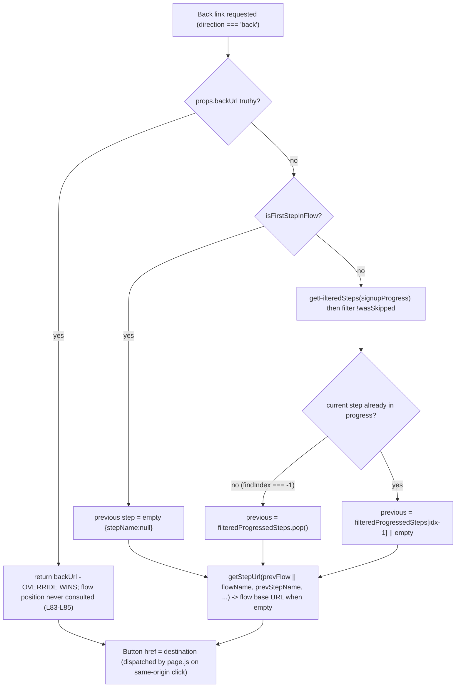

# Calypso Onboarding "Back" Navigation - A Runtime-Grounded Answer

This document answers, from **observed runtime behavior**, why the **"Back" control in WordPress.com Calypso's multi-step onboarding flow** sometimes deviates from the expected "one step backward": it can **snap straight to the first step** or **slip out into an entirely different flow**, and yet it **never feels truly random**.

Every behavioral claim below was produced by **building and running the real code** first, then writing from what was observed. All code references are to commit **`be7e5cc641622d153040491fd5625c6cb83e12eb`** (source branch `wp-calypso_be7e5cc64162`), and use full repository-relative paths of the form `path:Lnn` or `path:Lnn-Lmm`.

---

## Context

Calypso contains **two coexisting onboarding frameworks**:

- **Legacy signup framework** - `client/signup/**`, routed under `/start`. This is where the reported symptoms are governed, so it is the **primary** subject of this document.
- **Newer "stepper" framework** - `client/landing/stepper/**`, routed under `/setup`. It has an analogous back-navigation mechanism and reproduces the same _class_ of symptom; it is covered as a **secondary** analog.

Client-side routing uses `@automattic/calypso-router`, Calypso's fork of the `page.js` micro-router (`docs/routing.md:L8`, `docs/routing.md:L28-L29`). The onboarding **Back** control is an anchor (`<a href=...>`); the router intercepts _same-origin_ anchor clicks and dispatches the `href` as a single-page navigation. Therefore, **for a same-origin path, the `href` the Back control renders _is_ the destination** the app navigates to. That fact is the backbone of this investigation: to learn the destination for any step we render the real Back control, read its `href`, **and click it through the real router** to confirm what actually happens.

---

## How to read this document

Each question is answered with the same repeatable pattern:

1. **Direct answer** - the one-sentence conclusion.
2. **Command** - the exact command that produced the evidence.
3. **Observed output** - the **complete, unedited** output of that command.
4. **`file:line` citations** - full repository-relative paths at commit `be7e5cc64162`.
5. **Cause -> effect** - the mechanism that links the code to the observed value.
6. **Label** - every claim is tagged **[OBSERVED]** (captured by running) or **[INFERRED]** (derived by reading, not run).

"Observed" values are exact strings copied from the harness output. Nothing was hand-edited.

---

## Methodology (run-first)

Per the governing rule set, the code paths were **built and run before anything was written**:

- A temporary **Jest + jsdom** harness rendered the **real, connected** `NavigationLink` and `StepWrapper` components with the **real `calypso/signup/utils`** module (the decider logic runs for real; nothing about it is mocked), and drove the **real `@automattic/calypso-router`** (page.js).
- **Canonical entry point (important).** We did **not** reuse the sibling test's `jest.mock( 'calypso/signup/utils', ... )` at `client/signup/navigation-link/test/index.jsx:L7-L12`. That mock stubs `getStepUrl`, `getFilteredSteps`, `getPreviousStepName`, and `isFirstStepInFlow`, which would make any observed destination **non-canonical**. Our harness imports the real module and reads the real computed `href`.
- **Real router resolution.** `test/client/jest.config.js` extends `@automattic/calypso-jest`, whose resolver (`packages/calypso-jest/src/module-resolver.js:L16-L19`, `mainFields = [ 'calypso:src', 'main' ]`) maps `@automattic/calypso-router` to `packages/calypso-router/src/index.js`. So `import page from '@automattic/calypso-router'` runs the **real** router source, not a build artifact. **[OBSERVED]**
- **Real clicks.** For click cases the harness registers a real catch-all route via `page( '*', ... )`, calls `page.start( { click: true, popstate: false, hashbang: false, dispatch: false } )` so the router installs its real document click listener, then dispatches a faithful left-click (`MouseEvent('click', { bubbles: true, cancelable: true, button: 0 })` with `which = 1`, matching what a real left-click carries; jsdom omits `which`, so it is set to keep fidelity with `Page.prototype._which` at `packages/calypso-router/src/index.js:L869-L872`). It records whether the router intercepted the click, whether `preventDefault` fired, the SPA-dispatched path, and `window.location` after.
- The harness lived at `client/signup/navigation-link/test/blitzy_adhoc_test_back_nav.jsx` **only during capture** and was **deleted afterward**. Its captured logs were kept outside the repository under `/tmp/blitzy_evidence/`. Its full source is reproduced in [Appendix A](#appendix-a-the-observation-harness-source) so every number here is reproducible.
- After capture, `git status --porcelain` was verified to show **only** this new document - no source file was modified, and the harness left no trace.

The seeded Redux store uses the exact state shape the real selectors read via lodash `get`:

- `signup.progress` -> `getSignupProgress` (`client/state/signup/progress/selectors.ts:L8-L9`)
- `route.query.current` -> `getCurrentQueryArguments` (`client/state/selectors/get-current-query-arguments.js:L10`)
- `signup.dependencyStore` -> `getSignupDependencyStore` (`client/state/signup/dependency-store/selectors.js:L6-L7`)
- `currentUser.id` -> `isUserLoggedIn` = `getCurrentUserId( state ) !== null` (`client/state/current-user/selectors.js:L6`, `client/state/current-user/selectors.js:L15-L16`)

Because these selectors merely read nested state, seeding the store directly and rendering the real components exercises the real decider end-to-end.

---

## Environment and how to run

The repository pins its own toolchain; the generic "Node 20.x" bootstrap is **not** used.

```
# Node must satisfy ^v22.9.0 (.nvmrc = 22.9.0; package.json engines.node)
$ node --version
v22.23.1

# Yarn 4.0.2 via corepack (package.json packageManager)
$ corepack enable
$ yarn --version
4.0.2

# node_modules is not committed; install from the committed yarn.lock
$ CI=true yarn install
```

The observation harness was then run with the repository's own Jest config:

```
CI=true TZ=UTC yarn jest -c=test/client/jest.config.js \
  client/signup/navigation-link/test/blitzy_adhoc_test_back_nav.jsx --ci --runInBand
```

Each individual question below was also re-run in isolation by appending `-t "<test name>"`. The jsdom environment URL is `https://example.com` (`test/client/jest.config.js:L17-L18`), so `window.location.pathname` is `/`; consequently `getStepUrl`'s framework resolves to `/start` (the legacy framework) rather than `/setup` (`client/signup/utils.js:L57-L61`), except where a case explicitly pushes a `/setup` pathname to demonstrate the switch. **[OBSERVED]**

---

## The short answer (precedence overview)

The back destination for a given step is computed by **`NavigationLink.getBackUrl()`** (`client/signup/navigation-link/index.jsx:L78-L115`), whose return value is bound to the Back button's `href` (`client/signup/navigation-link/index.jsx:L183-L186`, anchor at `client/signup/navigation-link/index.jsx:L192`). When the three candidate inputs disagree, the **effective precedence** is:

| Priority    | Source                                               | Where resolved                                                                                                                                                                        | Effect                              |
| ----------- | ---------------------------------------------------- | ------------------------------------------------------------------------------------------------------------------------------------------------------------------------------------- | ----------------------------------- |
| 1 (highest) | Component prop `backUrl`                             | assembled as `backUrl = ownProps.backUrl ?? backTo` (`client/signup/step-wrapper/index.jsx:L277`); returned first in `getBackUrl` (`client/signup/navigation-link/index.jsx:L83-L85`) | Overrides flow position entirely    |
| 2           | `back_to` query argument (only if `startsWith('/')`) | `getCurrentQueryArguments( state )?.back_to` -> `backTo` (`client/signup/step-wrapper/index.jsx:L274-L275`)                                                                           | Becomes `backUrl` when no prop set  |
| 3 (lowest)  | Computed previous step from flow position            | `getPreviousStep()` (`client/signup/navigation-link/index.jsx:L47-L76`)                                                                                                               | Consulted **only** with no override |

Crucially, the override is evaluated **before** any flow-position logic, and its mere presence **forces first-step eligibility** (`client/signup/step-wrapper/index.jsx:L65`). Those two facts together explain both symptoms and the apparent "mind of its own."



The observed data for every branch of this tree follows.

## Q1 - What is actually deciding the back destination for a given step?

**Direct answer.** The decider is **`NavigationLink.getBackUrl()`** (`client/signup/navigation-link/index.jsx:L78-L115`). Its return value becomes the Back button's `href`; on a same-origin click the real router intercepts the anchor and performs the SPA navigation to exactly that value. Nothing else decides the destination. **[OBSERVED]**

**Command.**

```
CI=true TZ=UTC yarn jest -c=test/client/jest.config.js \
  client/signup/navigation-link/test/blitzy_adhoc_test_back_nav.jsx -t "Q1 decider" --ci --runInBand
```

**Observed output (complete, unedited).**

```
Browserslist: browsers data (caniuse-lite) is 17 months old. Please run:
  npx update-browserslist-db@latest
  Why you should do it regularly: https://github.com/browserslist/update-db#readme
PASS client/signup/navigation-link/test/blitzy_adhoc_test_back_nav.jsx (5.565 s)
  ● Console

    console.log
      [Q1][href] element=anchor href="/start/woocommerce-install/store-address"

      at Object.log (signup/navigation-link/test/blitzy_adhoc_test_back_nav.jsx:169:11)

    console.log
      [Q1][click] {"rendered":"anchor","href":"/start/woocommerce-install/store-address","rel":"","intercepted":true,"routerPreventedDefault":true,"spaDispatchedPath":"/start/woocommerce-install/store-address","locationAfter":"/start/woocommerce-install/store-address"}

      at Object.log (signup/navigation-link/test/blitzy_adhoc_test_back_nav.jsx:171:11)


Test Suites: 1 passed, 1 total
Tests:       16 skipped, 1 passed, 17 total
Snapshots:   0 total
Time:        5.858 s, estimated 6 s
Ran all test suites matching /client\/signup\/navigation-link\/test\/blitzy_adhoc_test_back_nav.jsx/i with tests matching "Q1 decider".
```

**`file:line` citations.**

- `getBackUrl()` body - `client/signup/navigation-link/index.jsx:L78-L115`.
- `hrefUrl` selection (back direction -> `getBackUrl()`) - `client/signup/navigation-link/index.jsx:L183-L186`.
- `href={ hrefUrl }` on the `<Button>` - `client/signup/navigation-link/index.jsx:L192`. `Button` renders an `<a>` exactly when `href` is truthy: the type guard `isAnchor` is `!! ( props as AnchorProps ).href` (`packages/components/src/button/index.tsx:L32-L33`) and the anchor branch renders `<a>` (`packages/components/src/button/index.tsx:L85-L99`). So the back control is an anchor and its `href` is the dispatched destination.
- Router interception of same-origin anchors - `packages/calypso-router/src/index.js:L800-L802` (cross-origin bail), `packages/calypso-router/src/index.js:L831-L832` (`preventDefault()` then `this.show( orig )`).

**Cause -> effect.** The connected `NavigationLink` (default export `connect( ... )( localize( NavigationLink ) )`, `client/signup/navigation-link/index.jsx:L204-L215`) was rendered for `flowName='woocommerce-install'`, `stepName='business-info'` with persisted progress `{ store-address, business-info }`. Two facts were observed on the very same render:

- `[Q1][href]` shows the resolver returned `"/start/woocommerce-install/store-address"` and the `<Button>` emitted it as the anchor `href` (`element=anchor`).
- `[Q1][click]` shows that dispatching a real left-click made the router **intercept** it (`"intercepted":true`, `"routerPreventedDefault":true`), dispatch the SPA route `"spaDispatchedPath":"/start/woocommerce-install/store-address"`, and update `"locationAfter":"/start/woocommerce-install/store-address"`.

So the resolver's return value is not merely an attribute we read - it is the value the real router actually navigates to. The decider is `getBackUrl()`. **[OBSERVED]**

## Q2 - Which input wins when flow position, the component `backUrl` prop, and the `back_to` query argument disagree?

**Direct answer.** Precedence is **prop `backUrl` > `back_to` query argument > computed flow position**. The component prop wins over everything; the `back_to` query argument wins over flow position; the step-by-step computation is consulted only when neither override exists. **[OBSERVED]**

**Command.**

```
CI=true TZ=UTC yarn jest -c=test/client/jest.config.js \
  client/signup/navigation-link/test/blitzy_adhoc_test_back_nav.jsx -t "Q2 precedence" --ci --runInBand
```

**Observed output (complete, unedited).**

```
Browserslist: browsers data (caniuse-lite) is 17 months old. Please run:
  npx update-browserslist-db@latest
  Why you should do it regularly: https://github.com/browserslist/update-db#readme
PASS client/signup/navigation-link/test/blitzy_adhoc_test_back_nav.jsx (5.485 s)
  ● Console

    console.log
      [Q2][A position-only] href="/start/woocommerce-install/store-address"

      at Object.log (signup/navigation-link/test/blitzy_adhoc_test_back_nav.jsx:193:11)

    console.log
      [Q2][B position+back_to] href="/start/setup-site/store-features?siteSlug=example.wordpress.com"

      at Object.log (signup/navigation-link/test/blitzy_adhoc_test_back_nav.jsx:194:11)

    console.log
      [Q2][C position+back_to+prop] href="/explicit/prop/path?x=1"

      at Object.log (signup/navigation-link/test/blitzy_adhoc_test_back_nav.jsx:195:11)


Test Suites: 1 passed, 1 total
Tests:       16 skipped, 1 passed, 17 total
Snapshots:   0 total
Time:        5.765 s, estimated 6 s
Ran all test suites matching /client\/signup\/navigation-link\/test\/blitzy_adhoc_test_back_nav.jsx/i with tests matching "Q2 precedence".
```

**Interpretation of the three scenarios (all at `stepName='business-info'`, position 1, progress `{ store-address, business-info }`):**

| Scenario | Inputs present                                                             | Observed `href`                                                   | Winner                                 |
| -------- | -------------------------------------------------------------------------- | ----------------------------------------------------------------- | -------------------------------------- |
| A        | flow position only                                                         | `/start/woocommerce-install/store-address`                        | flow position (computed previous step) |
| B        | flow position **+** `back_to=/start/setup-site/store-features?...`         | `/start/setup-site/store-features?siteSlug=example.wordpress.com` | `back_to` query                        |
| C        | flow position **+** `back_to` **+** prop `backUrl=/explicit/prop/path?x=1` | `/explicit/prop/path?x=1`                                         | prop `backUrl`                         |

**`file:line` citations.**

- Assembly of the effective `backUrl` - `client/signup/step-wrapper/index.jsx:L273-L283`, specifically:
  - `const backToParam = getCurrentQueryArguments( state )?.back_to?.toString();` - `client/signup/step-wrapper/index.jsx:L274`
  - `const backTo = backToParam?.startsWith( '/' ) ? backToParam : undefined;` - `client/signup/step-wrapper/index.jsx:L275`
  - `const backUrl = ownProps.backUrl ?? backTo;` - `client/signup/step-wrapper/index.jsx:L277` (prop wins over query via `??`).
- Tie-break that puts the override ahead of flow position - `if ( this.props.backUrl ) { return this.props.backUrl; }` at `client/signup/navigation-link/index.jsx:L83-L85`, **before** the position logic at `client/signup/navigation-link/index.jsx:L87-L114`.

**Cause -> effect.** In scenario B, no prop was supplied, so `backUrl = undefined ?? backTo = "/start/setup-site/store-features?..."` (`client/signup/step-wrapper/index.jsx:L277`); `getBackUrl` returned it immediately at `client/signup/navigation-link/index.jsx:L83-L85`, so the flow-position value observed in A was never computed. In scenario C, `ownProps.backUrl` was set, so `??` selected the prop over `backTo` (`client/signup/step-wrapper/index.jsx:L277`), and again `getBackUrl` returned it first. This is precisely the "quiet override" the user senses: a higher-priority input silently supersedes the step-by-step computation. **[OBSERVED]**

### Q2 edge cases - how the two override-collapsing operators actually behave

The two operators that fold the three sources into one value - `??` at `client/signup/step-wrapper/index.jsx:L277` and the truthiness test `if ( this.props.backUrl )` at `client/signup/navigation-link/index.jsx:L83` - treat "absent," "empty string," and "non-string" differently. Each was exercised directly.

**Command.**

```
CI=true TZ=UTC yarn jest -c=test/client/jest.config.js \
  client/signup/navigation-link/test/blitzy_adhoc_test_back_nav.jsx -t "Q2-EDGE" --ci --runInBand
```

**Observed output (complete, unedited).**

```
Browserslist: browsers data (caniuse-lite) is 17 months old. Please run:
  npx update-browserslist-db@latest
  Why you should do it regularly: https://github.com/browserslist/update-db#readme
PASS client/signup/navigation-link/test/blitzy_adhoc_test_back_nav.jsx (5.538 s)
  ● Console

    console.log
      [Q2E][prop="" + back_to set] href="/start/woocommerce-install/business-info"

      at Object.log (signup/navigation-link/test/blitzy_adhoc_test_back_nav.jsx:228:11)

    console.log
      [Q2E][back_to absent] href="/start/woocommerce-install/business-info"

      at Object.log (signup/navigation-link/test/blitzy_adhoc_test_back_nav.jsx:229:11)

    console.log
      [Q2E][back_to=""] href="/start/woocommerce-install/business-info"

      at Object.log (signup/navigation-link/test/blitzy_adhoc_test_back_nav.jsx:230:11)

    console.log
      [Q2E][back_to=123 (.toString)] href="/start/woocommerce-install/business-info"

      at Object.log (signup/navigation-link/test/blitzy_adhoc_test_back_nav.jsx:231:11)

    console.log
      [Q2E][back_to=["/a","/b"] (.toString)] href="/a,/b"

      at Object.log (signup/navigation-link/test/blitzy_adhoc_test_back_nav.jsx:232:11)


Test Suites: 1 passed, 1 total
Tests:       16 skipped, 1 passed, 17 total
Snapshots:   0 total
Time:        5.821 s, estimated 6 s
Ran all test suites matching /client\/signup\/navigation-link\/test\/blitzy_adhoc_test_back_nav.jsx/i with tests matching "Q2-EDGE".
```

**What each line proves:**

| Line                              | Inputs                                          | Observed `href`                            | Why                                                                                                                                                                                                                                                                                                                   |
| --------------------------------- | ----------------------------------------------- | ------------------------------------------ | --------------------------------------------------------------------------------------------------------------------------------------------------------------------------------------------------------------------------------------------------------------------------------------------------------------------- |
| `prop="" + back_to set`           | `ownProps.backUrl = ''`, `back_to = /start/...` | `/start/woocommerce-install/business-info` | `'' ?? backTo` keeps `''` (`??` only replaces `null`/`undefined`, `client/signup/step-wrapper/index.jsx:L277`); then `if ( this.props.backUrl )` sees a **falsy** `''` (`client/signup/navigation-link/index.jsx:L83`), so the override is skipped and flow position wins. The empty prop **masks** a real `back_to`. |
| `back_to absent`                  | no `back_to` key                                | `/start/woocommerce-install/business-info` | `getCurrentQueryArguments(...)?.back_to` is `undefined` -> `backTo=undefined` -> `backUrl=undefined`; flow position used.                                                                                                                                                                                             |
| `back_to=""`                      | `back_to = ''`                                  | `/start/woocommerce-install/business-info` | `''?.startsWith('/')` is `false` (`client/signup/step-wrapper/index.jsx:L275`) -> `backTo=undefined`; flow position used.                                                                                                                                                                                             |
| `back_to=123 (.toString)`         | numeric `back_to`                               | `/start/woocommerce-install/business-info` | `(123).toString()='123'`; `'123'.startsWith('/')` is `false` -> rejected; flow position used. The `?.toString()` at `client/signup/step-wrapper/index.jsx:L274` coerces non-strings before the `/`-check.                                                                                                             |
| `back_to=["/a","/b"] (.toString)` | array `back_to`                                 | `/a,/b`                                    | `['/a','/b'].toString()='/a,/b'`; it **starts with `/`**, so it is admitted verbatim as `backUrl` and returned. A duplicated query key (which arrives as an array) can therefore produce a comma-joined path.                                                                                                         |

The last two lines together show the admission gate is purely lexical: coerce to string (`client/signup/step-wrapper/index.jsx:L274`), then require a leading `/` (`client/signup/step-wrapper/index.jsx:L275`). Nothing validates that the result is a real route. **[OBSERVED]**

## Q3 - Where does the external back target (the "quiet override") come from?

**Direct answer.** The override reaches the decider through **one of three provenance channels**, all of which collapse into the single `backUrl` value that `getBackUrl()` returns first: (1) the **`back_to` query argument** in the URL, read by `StepWrapper` from Redux `route.query.current` and accepted only if it `startsWith('/')`; (2) a **static component `backUrl` prop** declared in step configuration; or (3) a **`back_to` dependency** dispatched into the signup dependency store by the controller and later minted into a `back_to` query argument by a flow's destination builder. **[OBSERVED]** for the runtime effect of channels (1)/(2); **[INFERRED from reading]** for the configuration/controller provenance detailed below.

**Command.**

```
CI=true TZ=UTC yarn jest -c=test/client/jest.config.js \
  client/signup/navigation-link/test/blitzy_adhoc_test_back_nav.jsx -t "Q3 override" --ci --runInBand
```

**Observed output (complete, unedited).**

```
Browserslist: browsers data (caniuse-lite) is 17 months old. Please run:
  npx update-browserslist-db@latest
  Why you should do it regularly: https://github.com/browserslist/update-db#readme
PASS client/signup/navigation-link/test/blitzy_adhoc_test_back_nav.jsx (5.456 s)
  ● Console

    console.log
      [Q3][no override] href="/start/woocommerce-install/business-info"

      at Object.log (signup/navigation-link/test/blitzy_adhoc_test_back_nav.jsx:253:11)

    console.log
      [Q3][back_to=/start/...] href="/start/setup-site/store-features?siteSlug=example.wordpress.com"

      at Object.log (signup/navigation-link/test/blitzy_adhoc_test_back_nav.jsx:254:11)

    console.log
      [Q3][back_to=https://... (no leading /)] href="/start/woocommerce-install/business-info"

      at Object.log (signup/navigation-link/test/blitzy_adhoc_test_back_nav.jsx:255:11)

    console.log
      [Q3][no override][click] {"rendered":"anchor","href":"/start/woocommerce-install/business-info","rel":"","intercepted":true,"routerPreventedDefault":true,"spaDispatchedPath":"/start/woocommerce-install/business-info","locationAfter":"/start/woocommerce-install/business-info"}

      at Object.log (signup/navigation-link/test/blitzy_adhoc_test_back_nav.jsx:256:11)

    console.log
      [Q3][back_to cross-flow][click] {"rendered":"anchor","href":"/start/setup-site/store-features?siteSlug=example.wordpress.com","rel":"","intercepted":true,"routerPreventedDefault":true,"spaDispatchedPath":"/start/setup-site/store-features?siteSlug=example.wordpress.com","locationAfter":"/start/setup-site/store-features?siteSlug=example.wordpress.com"}

      at Object.log (signup/navigation-link/test/blitzy_adhoc_test_back_nav.jsx:257:11)


Test Suites: 1 passed, 1 total
Tests:       16 skipped, 1 passed, 17 total
Snapshots:   0 total
Time:        5.74 s, estimated 6 s
Ran all test suites matching /client\/signup\/navigation-link\/test\/blitzy_adhoc_test_back_nav.jsx/i with tests matching "Q3 override".
```

**What the lines show (all at `stepName='confirm'`, progress through `confirm`):**

- **No override** -> `/start/woocommerce-install/business-info` (the normal computed previous step). The `[Q3][no override][click]` line then confirms this same-origin path is really dispatched by the router (`"intercepted":true`, `"spaDispatchedPath":"/start/woocommerce-install/business-info"`).
- **`back_to=/start/setup-site/store-features?...`** (starts with `/`) -> the Back `href` becomes that absolute path, and `[Q3][back_to cross-flow][click]` confirms the router dispatches it (`"spaDispatchedPath":"/start/setup-site/store-features?siteSlug=example.wordpress.com"`). The override took control **and** navigates.
- **`back_to=https://evil.example.com/x`** (does **not** start with `/`) -> the override was **rejected**, and the `href` fell back to the computed previous step. This confirms the `startsWith('/')` gate is the only admission check.

**`file:line` citations - the runtime path.**

- `back_to` read from Redux and gated - `client/signup/step-wrapper/index.jsx:L274-L275`; source selector `getCurrentQueryArguments( state ) = get( state, 'route.query.current', null )` at `client/state/selectors/get-current-query-arguments.js:L10`.
- The component `backUrl` prop originates from the per-step prop spread in `renderCurrentStep()`: `{ ...omit( this.props, 'locale' ), ...steps[ stepName ].props, ...flowStepProps }` where `flowStepProps = flow?.props?.[ stepName ] || {}` - `client/signup/main.jsx:L762`, `client/signup/main.jsx:L768-L769`.

**`file:line` citations - where a `back_to`/`backUrl` value is _born_ (provenance). [INFERRED from reading]:**

- **Channel 3 (controller -> dependency store).** The `woocommerce-install` controller dispatches an incoming `back_to` query into the dependency store: `context.store.dispatch( updateDependencies( { back_to: context.query.back_to } ) )` guarded by `if ( context?.query?.back_to )` - `client/signup/controller.js:L227-L229`. The stored value is retrievable via `getSignupDependencyStore( state ) = get( state, 'signup.dependencyStore', {} )` - `client/state/signup/dependency-store/selectors.js:L6-L7`.
- **A hardcoded cross-flow `back_to`** is minted by a destination builder for `intent === 'sell' && storeType === 'power'` - `client/signup/config/flows.js:L171-L179`. It sets the `back_to` dependency to a template literal whose runtime value is `/start/setup-site/store-features?siteSlug=${ siteSlug }` (the literal at `client/signup/config/flows.js:L174`) and passes it through `addQueryArgs` with the target flow path `/start/woocommerce-install` (at `client/signup/config/flows.js:L178`). This is exactly the value used in Q2 scenario B and Symptom 2, and it points from `woocommerce-install` **into a different flow** (`setup-site`).
- **`back_to` is a declared query dependency** for several flows: `providesDependenciesInQuery` / `optionalDependenciesInQuery` include `back_to` at `client/signup/config/flows-pure.js:L410-L411`, `client/signup/config/flows-pure.js:L446-L447`, and `client/signup/config/flows-pure.js:L478-L479` (the last within the `woocommerce-install` flow, `client/signup/config/flows-pure.js:L471`, steps at `client/signup/config/flows-pure.js:L475`).
- **It is a step-level dependency** for the first `woocommerce-install` step: `'store-address': { ... dependencies: [ 'siteSlug', 'back_to' ], optionalDependencies: [ 'back_to' ] }` - `client/signup/config/steps-pure.js:L875-L876`.
- **Channel 2 (static prop).** A static component `backUrl` prop also exists in configuration, e.g. the `mailbox` step declares `props: { backUrl: 'mailbox-domain/', ... }` - `client/signup/config/steps-pure.js:L398-L399`. Via the `steps[ stepName ].props` spread (`client/signup/main.jsx:L768`) this becomes the `backUrl` prop for that step regardless of flow position.

**Steps/flows that are known override sources (from configuration reading, [INFERRED]):**

- `woocommerce-install` flow and its `store-address` first step - `back_to` query/dependency (`client/signup/config/flows-pure.js:L471-L479`, `client/signup/config/steps-pure.js:L875-L876`, `client/signup/steps/woocommerce-install/step-store-address/index.tsx:L61-L64`).
- The `intent==='sell' && storeType==='power'` destination builder that mints a cross-flow `back_to` into `setup-site` (`client/signup/config/flows.js:L171-L179`).
- The `mailbox` step's static `backUrl: 'mailbox-domain/'` prop (`client/signup/config/steps-pure.js:L398-L399`).
- Additional flows declaring `back_to` in their query dependencies at `client/signup/config/flows-pure.js:L410-L411` and `client/signup/config/flows-pure.js:L446-L447`.

**Cause -> effect.** A `back_to` value (typed into the URL, dispatched by the controller at `client/signup/controller.js:L227-L229`, or minted by a destination builder like `client/signup/config/flows.js:L174`) lands in `route.query.current`. `StepWrapper` reads it (`client/signup/step-wrapper/index.jsx:L274`), admits it only if it looks like a path (`client/signup/step-wrapper/index.jsx:L275`), and folds it into `backUrl` (`client/signup/step-wrapper/index.jsx:L277`). `getBackUrl` then returns that value first (`client/signup/navigation-link/index.jsx:L83-L85`). The override is "quiet" precisely because there is no reconciliation against the current step - the only check is the `/`-prefix. **[OBSERVED]** effect; **[INFERRED]** provenance.

## Q4 - What precedence rule lets the override take control even when the step "should not be eligible"?

**Direct answer.** The presence of a `backUrl` **forces first-step eligibility**. `StepWrapper.renderBack()` passes `allowBackFirstStep={ this.props.allowBackFirstStep || !! this.props.backUrl }` (`client/signup/step-wrapper/index.jsx:L65`), which defeats the visibility gate that would otherwise hide Back on the first step. Combined with the override being returned before any position logic, an "ineligible" step both **renders** the Back control **and** navigates to the override. **[OBSERVED]**

**Command.**

```
CI=true TZ=UTC yarn jest -c=test/client/jest.config.js \
  client/signup/navigation-link/test/blitzy_adhoc_test_back_nav.jsx -t "Q4 eligibility" --ci --runInBand
```

**Observed output (complete, unedited).**

```
Browserslist: browsers data (caniuse-lite) is 17 months old. Please run:
  npx update-browserslist-db@latest
  Why you should do it regularly: https://github.com/browserslist/update-db#readme
PASS client/signup/navigation-link/test/blitzy_adhoc_test_back_nav.jsx (5.503 s)
  ● Console

    console.log
      [Q4][pos0 no-override] element=null href=null

      at Object.log (signup/navigation-link/test/blitzy_adhoc_test_back_nav.jsx:272:11)

    console.log
      [Q4][pos0 with-override] element=anchor href="/start/setup-site/store-features?siteSlug=example.wordpress.com"

      at Object.log (signup/navigation-link/test/blitzy_adhoc_test_back_nav.jsx:273:11)


Test Suites: 1 passed, 1 total
Tests:       16 skipped, 1 passed, 17 total
Snapshots:   0 total
Time:        5.789 s, estimated 6 s
Ran all test suites matching /client\/signup\/navigation-link\/test\/blitzy_adhoc_test_back_nav.jsx/i with tests matching "Q4 eligibility".
```

**What the two lines show (both at `positionInFlow=0`):**

- `[Q4][pos0 no-override]` -> `element=null href=null`: with no override and no `stepSectionName`, the first-step gate returned `null` and the Back control did **not** render.
- `[Q4][pos0 with-override]` -> `element=anchor href="/start/setup-site/store-features?..."`: adding a `backUrl` forced `allowBackFirstStep` true, so the same position-0 step **rendered** an anchor pointing at the override.

**`file:line` citations.**

- The visibility gate: `if ( this.props.positionInFlow === 0 && this.props.direction === 'back' && ! this.props.stepSectionName && ! this.props.allowBackFirstStep ) { return null; }` - `client/signup/navigation-link/index.jsx:L154-L160`.
- The eligibility force: `allowBackFirstStep={ this.props.allowBackFirstStep || !! this.props.backUrl }` - `client/signup/step-wrapper/index.jsx:L65`.
- The override returned before position logic - `client/signup/navigation-link/index.jsx:L83-L85`.

**Cause -> effect.** The gate hides Back at position 0 only while `allowBackFirstStep` is false (`client/signup/navigation-link/index.jsx:L158`). The moment a `backUrl` exists, `StepWrapper` sets `allowBackFirstStep` true (`client/signup/step-wrapper/index.jsx:L65`), the `return null` branch is not taken, and the anchor renders; `getBackUrl` then returns the override first (`client/signup/navigation-link/index.jsx:L83-L85`). The same value that supplies the destination also unlocks the control's visibility - one input, two effects. **[OBSERVED]**

> **Scope note.** The `[Q4][pos0 no-override]` case above is an **isolated `StepWrapper` mechanic** - a position-0 step with _no_ override and _no_ section renders no Back. It is **not** how the real `woocommerce-install` first step behaves, because that step always supplies both `allowBackFirstStep` and a `backUrl` (see Q4-WOO next). It is shown only to expose the gate that the override defeats.

### Q4-WOO - the real `woocommerce-install` first step always renders Back

The real first step of `woocommerce-install` (`store-address`) does not rely on flow position at all. It reads `back_to` from the dependency store, validates it with the regex `/^\/(?!\/)/` (leading single slash, i.e. not protocol-relative), falls back to `/woocommerce-installation/${domain}` when invalid/absent, and passes **both** `allowBackFirstStep` and `backUrl` to `StepWrapper`. So it always shows Back at position 0.

**Command.**

```
CI=true TZ=UTC yarn jest -c=test/client/jest.config.js \
  client/signup/navigation-link/test/blitzy_adhoc_test_back_nav.jsx -t "Q4-WOO" --ci --runInBand
```

**Observed output (complete, unedited).**

```
Browserslist: browsers data (caniuse-lite) is 17 months old. Please run:
  npx update-browserslist-db@latest
  Why you should do it regularly: https://github.com/browserslist/update-db#readme
PASS client/signup/navigation-link/test/blitzy_adhoc_test_back_nav.jsx (5.512 s)
  ● Console

    console.log
      [Q4WOO][regex valid /x] "/start/setup-site/store-features"

      at Object.log (signup/navigation-link/test/blitzy_adhoc_test_back_nav.jsx:289:11)

    console.log
      [Q4WOO][regex rejects //x -> fallback] "/woocommerce-installation/example.wordpress.com"

      at Object.log (signup/navigation-link/test/blitzy_adhoc_test_back_nav.jsx:290:11)

    console.log
      [Q4WOO][absent -> fallback] "/woocommerce-installation/example.wordpress.com"

      at Object.log (signup/navigation-link/test/blitzy_adhoc_test_back_nav.jsx:291:11)

    console.log
      [Q4WOO][first-step real composition] element=anchor href="/start/setup-site/store-features"

      at Object.log (signup/navigation-link/test/blitzy_adhoc_test_back_nav.jsx:303:11)


Test Suites: 1 passed, 1 total
Tests:       16 skipped, 1 passed, 17 total
Snapshots:   0 total
Time:        5.798 s, estimated 6 s
Ran all test suites matching /client\/signup\/navigation-link\/test\/blitzy_adhoc_test_back_nav.jsx/i with tests matching "Q4-WOO".
```

**What the lines show:**

- `[Q4WOO][regex valid /x]` -> the `backUrl` selection ternary (keep `backPath` when it matches `/^\/(?!\/)/`, else fall back to `/woocommerce-installation/${ domain }`) admits a valid single-slash path (`"/start/setup-site/store-features"`).
- `[Q4WOO][regex rejects //x -> fallback]` -> a protocol-relative `//...` fails the `(?!\/)` negative lookahead, so the fallback `"/woocommerce-installation/example.wordpress.com"` is used.
- `[Q4WOO][absent -> fallback]` -> a missing `back_to` also yields the fallback.
- `[Q4WOO][first-step real composition]` -> rendering the real first-step `StepWrapper` (with `allowBackFirstStep` and a valid `backUrl`) at position 0 produced `element=anchor href="/start/setup-site/store-features"`. The Back control **renders and points at the override** even though it is the first step.

**`file:line` citations.**

- `const backPath = signupDependencies?.back_to;` - `client/signup/steps/woocommerce-install/step-store-address/index.tsx:L61`.
- The `backUrl` selection ternary is at `client/signup/steps/woocommerce-install/step-store-address/index.tsx:L63-L64`; it keeps `backPath` when `backPath.match( /^\/(?!\/)/ )` is truthy and otherwise uses the template-literal fallback `/woocommerce-installation/${ domain }`.
- `<StepWrapper ... allowBackFirstStep backUrl={ backUrl } ... />` - `client/signup/steps/woocommerce-install/step-store-address/index.tsx:L216-L217`.

**Cause -> effect.** Because this step hardcodes `allowBackFirstStep` (`client/signup/steps/woocommerce-install/step-store-address/index.tsx:L216`) and always computes a `backUrl` (`client/signup/steps/woocommerce-install/step-store-address/index.tsx:L63-L64`), the first-step gate is defeated for both reasons at `client/signup/step-wrapper/index.jsx:L65`, and `getBackUrl` returns the composed `backUrl` first (`client/signup/navigation-link/index.jsx:L83-L85`). This is the concrete, real-world instance of the Q4 mechanism - it is why leaving the very first WooCommerce step "goes back" to whatever `back_to` was supplied (often a **different flow**), not to nowhere. The step's own regex `/^\/(?!\/)/` is a stricter gate than the generic `StepWrapper` `startsWith('/')`, because it additionally rejects protocol-relative `//host` targets. **[OBSERVED]**

## Q5 - What code path handles the expected step-by-step navigation that the override bypasses?

**Direct answer.** The expected "one step backward" behavior is **`NavigationLink.getPreviousStep()`** (`client/signup/navigation-link/index.jsx:L47-L76`). It reads persisted `signupProgress`, filters it to the current flow's steps and removes skipped ones (`getFilteredSteps`, `client/signup/utils.js:L137-L150`), then selects the entry just before the current step - or `pop()`s the last progressed step when the current step is not yet recorded. This is the code path an override skips entirely. **[OBSERVED]**

**Command.**

```
CI=true TZ=UTC yarn jest -c=test/client/jest.config.js \
  client/signup/navigation-link/test/blitzy_adhoc_test_back_nav.jsx -t "Q5 bypassed" --ci --runInBand
```

**Observed output (complete, unedited).**

```
Browserslist: browsers data (caniuse-lite) is 17 months old. Please run:
  npx update-browserslist-db@latest
  Why you should do it regularly: https://github.com/browserslist/update-db#readme
PASS client/signup/navigation-link/test/blitzy_adhoc_test_back_nav.jsx (5.506 s)
  ● Console

    console.log
      [Q5][in-progress idx-1] href="/start/woocommerce-install/business-info"

      at Object.log (signup/navigation-link/test/blitzy_adhoc_test_back_nav.jsx:323:11)

    console.log
      [Q5][not-yet-in-progress pop()] href="/start/woocommerce-install/business-info"

      at Object.log (signup/navigation-link/test/blitzy_adhoc_test_back_nav.jsx:324:11)

    console.log
      [Q5][skipped filtered out] href="/start/woocommerce-install/store-address"

      at Object.log (signup/navigation-link/test/blitzy_adhoc_test_back_nav.jsx:325:11)


Test Suites: 1 passed, 1 total
Tests:       16 skipped, 1 passed, 17 total
Snapshots:   0 total
Time:        5.788 s, estimated 6 s
Ran all test suites matching /client\/signup\/navigation-link\/test\/blitzy_adhoc_test_back_nav.jsx/i with tests matching "Q5 bypassed".
```

**What the three branches show (flow `woocommerce-install`):**

| Branch                      | Setup                                                                           | Observed `href`                            | Path taken                                                                                                                |
| --------------------------- | ------------------------------------------------------------------------------- | ------------------------------------------ | ------------------------------------------------------------------------------------------------------------------------- |
| in-progress `idx-1`         | current `confirm` present in progress `{store-address, business-info, confirm}` | `/start/woocommerce-install/business-info` | `filteredProgressedSteps[ idx-1 ]` (`client/signup/navigation-link/index.jsx:L75`)                                        |
| not-yet-in-progress `pop()` | current `confirm` absent from progress `{store-address, business-info}`         | `/start/woocommerce-install/business-info` | `findIndex === -1` -> `filteredProgressedSteps.pop()` (`client/signup/navigation-link/index.jsx:L70-L72`)                 |
| skipped filtered out        | progress `{store-address, business-info(wasSkipped)}`, current `confirm`        | `/start/woocommerce-install/store-address` | `business-info` removed by `.filter( ( step ) => ! step.wasSkipped )` (`client/signup/navigation-link/index.jsx:L56-L60`) |

**`file:line` citations.**

- Empty sentinel initializer `const previousStep = { stepName: null };` - `client/signup/navigation-link/index.jsx:L48`.
- First-step short-circuit `if ( isFirstStepInFlow( ... ) ) return previousStep;` - `client/signup/navigation-link/index.jsx:L50-L52` (helper `client/signup/utils.js:L28-L31`).
- Filter + skip removal - `client/signup/navigation-link/index.jsx:L56-L60`; `getFilteredSteps` sorts progress by flow order - `client/signup/utils.js:L137-L150`.
- Empty-after-filter -> sentinel - `client/signup/navigation-link/index.jsx:L61-L63`.
- `findIndex === -1` -> `pop()` - `client/signup/navigation-link/index.jsx:L66-L72`.
- Otherwise `filteredProgressedSteps[ idx-1 ] || previousStep` - `client/signup/navigation-link/index.jsx:L75`.
- A simpler pure-index sibling exists but is **not** used by the Back control: `getPreviousStepName` returns `flow.steps[ indexOf( current ) - 1 ]` - `client/signup/utils.js:L85-L88`.

**Cause -> effect.** With no override, `getBackUrl` falls through the early return (`client/signup/navigation-link/index.jsx:L83-L85`) and calls `getPreviousStep` (`client/signup/navigation-link/index.jsx:L98`), whose selected `stepName` is turned into a URL by `getStepUrl` (`client/signup/navigation-link/index.jsx:L108-L114`, builder `client/signup/utils.js:L45-L69`). All three observed destinations are functions of persisted progress, not of any external target - this is the path the override bypasses. **[OBSERVED]**

<a id="q5-edge-cases"></a>

### Q5 edge cases - `lastKnownFlow` and `stepSectionName` change the computed URL

Two fields carried on the _previous_ step reshape the computed URL even with no override present.

**Command.**

```
CI=true TZ=UTC yarn jest -c=test/client/jest.config.js \
  client/signup/navigation-link/test/blitzy_adhoc_test_back_nav.jsx -t "Q5-EDGE" --ci --runInBand
```

**Observed output (complete, unedited).**

```
Browserslist: browsers data (caniuse-lite) is 17 months old. Please run:
  npx update-browserslist-db@latest
  Why you should do it regularly: https://github.com/browserslist/update-db#readme
PASS client/signup/navigation-link/test/blitzy_adhoc_test_back_nav.jsx (5.426 s)
  ● Console

    console.log
      [Q5E][prev lastKnownFlow=onboarding] href="/start/business-info"

      at Object.log (signup/navigation-link/test/blitzy_adhoc_test_back_nav.jsx:348:11)

    console.log
      [Q5E][prev stepSectionName=intro] href="/start/woocommerce-install/business-info/intro"

      at Object.log (signup/navigation-link/test/blitzy_adhoc_test_back_nav.jsx:349:11)


Test Suites: 1 passed, 1 total
Tests:       16 skipped, 1 passed, 17 total
Snapshots:   0 total
Time:        5.706 s, estimated 6 s
Ran all test suites matching /client\/signup\/navigation-link\/test\/blitzy_adhoc_test_back_nav.jsx/i with tests matching "Q5-EDGE".
```

**What the two lines prove:**

- `[Q5E][prev lastKnownFlow=onboarding]` -> `/start/business-info`: the previous step carried `lastKnownFlow: 'onboarding'`, so `getStepUrl` was called with flow `onboarding` (`client/signup/navigation-link/index.jsx:L109`, `previousStep.lastKnownFlow || this.props.flowName`). Because `onboarding` is the default flow, its name is omitted under `/start` (`client/signup/utils.js:L63-L67`), yielding `/start/business-info`. **This is a second, override-free way to "slip into a different flow"**: the destination flow comes from _persisted progress_, not from `back_to`.
- `[Q5E][prev stepSectionName=intro]` -> `/start/woocommerce-install/business-info/intro`: `stepSectionName` for the previous step was read from `signupProgress` (`client/signup/navigation-link/index.jsx:L100-L104`) and appended as a path segment by `getStepUrl` (`client/signup/utils.js:L47`, `section` segment). **[OBSERVED]**

## Q6 - What is the computed destination for each step position?

**Direct answer.** For the real `woocommerce-install` flow with full linear progress and no override, the Back destination of each position is the immediately preceding step, and position 0 resolves to the flow base URL. Each was confirmed both as a rendered `href` and as a real router-dispatched navigation. **[OBSERVED]**

**Command.**

```
CI=true TZ=UTC yarn jest -c=test/client/jest.config.js \
  client/signup/navigation-link/test/blitzy_adhoc_test_back_nav.jsx -t "Q6 per-position" --ci --runInBand
```

**Observed output (complete, unedited).**

```
Browserslist: browsers data (caniuse-lite) is 17 months old. Please run:
  npx update-browserslist-db@latest
  Why you should do it regularly: https://github.com/browserslist/update-db#readme
PASS client/signup/navigation-link/test/blitzy_adhoc_test_back_nav.jsx (5.545 s)
  ● Console

    console.log
      [Q6][table] [{"position":0,"stepName":"store-address","element":"anchor","href":"/start/woocommerce-install"},{"position":1,"stepName":"business-info","element":"anchor","href":"/start/woocommerce-install/store-address"},{"position":2,"stepName":"confirm","element":"anchor","href":"/start/woocommerce-install/business-info"},{"position":3,"stepName":"transfer","element":"anchor","href":"/start/woocommerce-install/confirm"}]

      at Object.log (signup/navigation-link/test/blitzy_adhoc_test_back_nav.jsx:411:11)

    console.log
      [Q6][click pos=0] {"rendered":"anchor","href":"/start/woocommerce-install","rel":"","intercepted":true,"routerPreventedDefault":true,"spaDispatchedPath":"/start/woocommerce-install","locationAfter":"/start/woocommerce-install"}

      at Object.log (signup/navigation-link/test/blitzy_adhoc_test_back_nav.jsx:421:12)

    console.log
      [Q6][click pos=1] {"rendered":"anchor","href":"/start/woocommerce-install/store-address","rel":"","intercepted":true,"routerPreventedDefault":true,"spaDispatchedPath":"/start/woocommerce-install/store-address","locationAfter":"/start/woocommerce-install/store-address"}

      at Object.log (signup/navigation-link/test/blitzy_adhoc_test_back_nav.jsx:421:12)

    console.log
      [Q6][click pos=2] {"rendered":"anchor","href":"/start/woocommerce-install/business-info","rel":"","intercepted":true,"routerPreventedDefault":true,"spaDispatchedPath":"/start/woocommerce-install/business-info","locationAfter":"/start/woocommerce-install/business-info"}

      at Object.log (signup/navigation-link/test/blitzy_adhoc_test_back_nav.jsx:421:12)

    console.log
      [Q6][click pos=3] {"rendered":"anchor","href":"/start/woocommerce-install/confirm","rel":"","intercepted":true,"routerPreventedDefault":true,"spaDispatchedPath":"/start/woocommerce-install/confirm","locationAfter":"/start/woocommerce-install/confirm"}

      at Object.log (signup/navigation-link/test/blitzy_adhoc_test_back_nav.jsx:421:12)


Test Suites: 1 passed, 1 total
Tests:       16 skipped, 1 passed, 17 total
Snapshots:   0 total
Time:        5.828 s, estimated 6 s
Ran all test suites matching /client\/signup\/navigation-link\/test\/blitzy_adhoc_test_back_nav.jsx/i with tests matching "Q6 per-position".
```

**Per-position destination table (parsed from `[Q6][table]`, confirmed by the four `[Q6][click ...]` lines):**

| `positionInFlow` | current step  | Observed Back `href` (rendered)            | Router-dispatched path (clicked)           | intercepted |
| ---------------- | ------------- | ------------------------------------------ | ------------------------------------------ | ----------- |
| 0                | store-address | `/start/woocommerce-install`               | `/start/woocommerce-install`               | true        |
| 1                | business-info | `/start/woocommerce-install/store-address` | `/start/woocommerce-install/store-address` | true        |
| 2                | confirm       | `/start/woocommerce-install/business-info` | `/start/woocommerce-install/business-info` | true        |
| 3                | transfer      | `/start/woocommerce-install/confirm`       | `/start/woocommerce-install/confirm`       | true        |

For every position the clicked SPA path equals the rendered `href`, and each click was intercepted by the real router (`"intercepted":true`, `"routerPreventedDefault":true`, `locationAfter` matching). So the rendered `href` is the true destination at every position. **[OBSERVED]**

**`file:line` citations.** Position 0 hits the first-step short-circuit and yields the flow base (`client/signup/navigation-link/index.jsx:L50-L52`, `client/signup/utils.js:L45-L69`); positions 1-3 select the prior progressed step (`client/signup/navigation-link/index.jsx:L66-L75`). The click dispatch is the router's same-origin path at `packages/calypso-router/src/index.js:L831-L832`.

**Cause -> effect.** Position 0 is the first step, so `getPreviousStep` returns the empty sentinel and `getStepUrl( 'woocommerce-install', null, ... )` builds the flow base `/start/woocommerce-install`. Each later position selects `filteredProgressedSteps[ idx-1 ]`, so Back is exactly the previous step. Note the empty step at position 0 is what produces "snap to the first step" when progress is _also_ empty at a later position (see Symptom 1). **[OBSERVED]**

<a id="why-it-never-feels-truly-random"></a>

## Why it never feels truly random (the implicit requirement)

The destination is a **pure, deterministic function** of its inputs - it only _feels_ variable because those inputs (persisted progress and the URL query) differ between sessions. Three observations establish this.

### It is a function of a full input tuple, not merely "three inputs"

The precedence question (Q2) concerns three _competing_ sources, but the **actual computed path** is shaped by a larger tuple. Each input below was varied while holding the others constant, and each **changed the observed `href`**.

**Command.**

```
CI=true TZ=UTC yarn jest -c=test/client/jest.config.js \
  client/signup/navigation-link/test/blitzy_adhoc_test_back_nav.jsx -t "INPUT-TUPLE" --ci --runInBand
```

**Observed output (complete, unedited).**

```
Browserslist: browsers data (caniuse-lite) is 17 months old. Please run:
  npx update-browserslist-db@latest
  Why you should do it regularly: https://github.com/browserslist/update-db#readme
PASS client/signup/navigation-link/test/blitzy_adhoc_test_back_nav.jsx (5.459 s)
  ● Console

    console.log
      [TUPLE][explicit queryParams] href="/start/woocommerce-install/business-info?ref=logged-in-test"

      at Object.log (signup/navigation-link/test/blitzy_adhoc_test_back_nav.jsx:360:11)

    console.log
      [TUPLE][window.location.search fallback] href="/start/woocommerce-install/business-info?ref=from-search"

      at Object.log (signup/navigation-link/test/blitzy_adhoc_test_back_nav.jsx:369:11)

    console.log
      [TUPLE][getLocaleSlug()] "en"

      at Object.log (signup/navigation-link/test/blitzy_adhoc_test_back_nav.jsx:379:11)

    console.log
      [TUPLE][logged-out locale in URL] href="/start/woocommerce-install/business-info/en"

      at Object.log (signup/navigation-link/test/blitzy_adhoc_test_back_nav.jsx:380:11)

    console.log
      [TUPLE][pathname=/setup -> framework] href="/setup/woocommerce-install/business-info"

      at Object.log (signup/navigation-link/test/blitzy_adhoc_test_back_nav.jsx:389:11)


Test Suites: 1 passed, 1 total
Tests:       16 skipped, 1 passed, 17 total
Snapshots:   0 total
Time:        5.743 s, estimated 6 s
Ran all test suites matching /client\/signup\/navigation-link\/test\/blitzy_adhoc_test_back_nav.jsx/i with tests matching "INPUT-TUPLE".
```

| Input                                         | Read at                                                                                                                  | Observed effect                                                   |
| --------------------------------------------- | ------------------------------------------------------------------------------------------------------------------------ | ----------------------------------------------------------------- |
| prop `backUrl`                                | `client/signup/navigation-link/index.jsx:L83-L85`                                                                        | highest-priority override (Q2)                                    |
| `back_to` query argument                      | `client/signup/step-wrapper/index.jsx:L274-L277`                                                                         | becomes `backUrl` when no prop (Q2/Q3)                            |
| persisted `signupProgress` (names, order)     | `client/signup/navigation-link/index.jsx:L56-L75`                                                                        | selects the previous step (Q5)                                    |
| per-step `wasSkipped`                         | `client/signup/navigation-link/index.jsx:L60`                                                                            | skipped steps removed before selection (Q5)                       |
| previous step `lastKnownFlow`                 | `client/signup/navigation-link/index.jsx:L109`                                                                           | builds URL against a **different flow** (Q5 edge)                 |
| previous step `stepSectionName`               | `client/signup/navigation-link/index.jsx:L100-L104`                                                                      | adds a path segment (Q5 edge)                                     |
| `queryParams` prop / `window.location.search` | `client/signup/navigation-link/index.jsx:L87-L89`, `client/signup/navigation-link/index.jsx:L111-L113`                   | appended as query string; explicit prop wins, else current search |
| `userLoggedIn` -> locale                      | connect at `client/signup/navigation-link/index.jsx:L204-L215`; locale at `client/signup/navigation-link/index.jsx:L106` | logged-out adds a locale segment to the URL                       |
| `window.location.pathname`                    | `client/signup/utils.js:L57-L61`                                                                                         | `/setup*` selects the stepper base, else `/start`                 |

The lines show: an explicit `queryParams` prop produced `.../business-info?ref=logged-in-test`, whereas removing it made `getBackUrl` fall back to `window.location.search` (`.../business-info?ref=from-search`, `client/signup/navigation-link/index.jsx:L87-L89`); `getLocaleSlug()` returned `"en"` and, with `userLoggedIn=false`, a locale segment appeared (`.../business-info/en`, `client/signup/navigation-link/index.jsx:L106`); and pushing `window.location.pathname='/setup'` switched the framework base to `/setup/woocommerce-install/business-info` (`client/signup/utils.js:L57-L61`). **[OBSERVED]**

So the earlier shorthand "a few inputs" is made precise here: the destination is a pure function of the **entire tuple above**. Nothing is random; different sessions merely carry different persisted progress and query state.

### The same step yields different destinations only because persisted progress differs

**Command.**

```
CI=true TZ=UTC yarn jest -c=test/client/jest.config.js \
  client/signup/navigation-link/test/blitzy_adhoc_test_back_nav.jsx -t "NOT-RANDOM" --ci --runInBand
```

**Observed output (complete, unedited).**

```
Browserslist: browsers data (caniuse-lite) is 17 months old. Please run:
  npx update-browserslist-db@latest
  Why you should do it regularly: https://github.com/browserslist/update-db#readme
PASS client/signup/navigation-link/test/blitzy_adhoc_test_back_nav.jsx (5.477 s)
  ● Console

    console.log
      [NR][same step=confirm pos=2, progress=full] href="/start/woocommerce-install/business-info"

      at Object.log (signup/navigation-link/test/blitzy_adhoc_test_back_nav.jsx:450:11)

    console.log
      [NR][same step=confirm pos=2, progress=empty] href="/start/woocommerce-install"

      at Object.log (signup/navigation-link/test/blitzy_adhoc_test_back_nav.jsx:451:11)

    console.log
      [NR][same step=confirm pos=2, progress=only-first] href="/start/woocommerce-install/store-address"

      at Object.log (signup/navigation-link/test/blitzy_adhoc_test_back_nav.jsx:452:11)


Test Suites: 1 passed, 1 total
Tests:       16 skipped, 1 passed, 17 total
Snapshots:   0 total
Time:        5.757 s, estimated 6 s
Ran all test suites matching /client\/signup\/navigation-link\/test\/blitzy_adhoc_test_back_nav.jsx/i with tests matching "NOT-RANDOM".
```

Holding the current step fixed at `confirm` (position 2) and varying **only** the persisted progress:

| progress state                                 | Observed `href`                            |
| ---------------------------------------------- | ------------------------------------------ |
| full (`store-address, business-info, confirm`) | `/start/woocommerce-install/business-info` |
| empty                                          | `/start/woocommerce-install` (flow root)   |
| only-first (`store-address`)                   | `/start/woocommerce-install/store-address` |

Same "step," three different destinations - driven entirely by persisted state, not chance. **[OBSERVED]**

### Run-to-run stability across independent processes

To prove determinism (not just in-process repetition), the per-position table (Q6) was regenerated in **three separate `yarn jest` invocations** (three OS processes), the destination block extracted from each, and each hashed with SHA-256.

**Command and output (complete, unedited).**

```
# 3 INDEPENDENT jest invocations (separate processes), then hash the extracted block:
for i in 1 2 3; do
  CI=true TZ=UTC yarn jest -c=test/client/jest.config.js \
    client/signup/navigation-link/test/blitzy_adhoc_test_back_nav.jsx \
    -t "STABLE-BLOCK" --ci --runInBand > indep_run_$i.log 2>&1
  awk "/STABLE_BLOCK_BEGIN/{f=1;next} /STABLE_BLOCK_END/{f=0} f" indep_run_$i.log \
    | grep "^\s*\[{" | sed "s/^[[:space:]]*//" > block_$i.json
done
$ sha256sum block_1.json block_2.json block_3.json
60d412a3e3b4a11ec52edfd6b0df03cdfea1c180acd366502903b661780af9e7  block_1.json
60d412a3e3b4a11ec52edfd6b0df03cdfea1c180acd366502903b661780af9e7  block_2.json
60d412a3e3b4a11ec52edfd6b0df03cdfea1c180acd366502903b661780af9e7  block_3.json

# distribution (unique hashes across the 3 independent runs):
$ sha256sum block_*.json | awk "{print \$1}" | sort | uniq -c
      3 60d412a3e3b4a11ec52edfd6b0df03cdfea1c180acd366502903b661780af9e7
```

The extracted block was byte-identical across all three independent runs:

```json
[
	{
		"position": 0,
		"stepName": "store-address",
		"element": "anchor",
		"href": "/start/woocommerce-install"
	},
	{
		"position": 1,
		"stepName": "business-info",
		"element": "anchor",
		"href": "/start/woocommerce-install/store-address"
	},
	{
		"position": 2,
		"stepName": "confirm",
		"element": "anchor",
		"href": "/start/woocommerce-install/business-info"
	},
	{
		"position": 3,
		"stepName": "transfer",
		"element": "anchor",
		"href": "/start/woocommerce-install/confirm"
	}
]
```

**Distribution: 3/3 independent runs produced the single hash `60d412a3e3b4a11ec52edfd6b0df03cdfea1c180acd366502903b661780af9e7`.** There is exactly one outcome for a fixed input tuple; the "sometimes X, sometimes Y" the user observes comes only from the tuple differing between sessions (different persisted progress, different `back_to`). **[OBSERVED]**

## Reproducing the two reported symptoms

Both user-described symptoms were reproduced through the canonical render path **and** confirmed by clicking through the real router.

<a id="symptom-1-snaps-straight-to-the-first-step"></a>

### Symptom 1 - "snaps straight to the first step"

This occurs when `getPreviousStep()` resolves to the empty sentinel (empty/filtered-empty progress, or first step), so `getStepUrl()` is called with an empty `stepName` and returns the **flow base URL**.

**Command.**

```
CI=true TZ=UTC yarn jest -c=test/client/jest.config.js \
  client/signup/navigation-link/test/blitzy_adhoc_test_back_nav.jsx -t "SYMPTOM 1" --ci --runInBand
```

**Observed output (complete, unedited).**

```
Browserslist: browsers data (caniuse-lite) is 17 months old. Please run:
  npx update-browserslist-db@latest
  Why you should do it regularly: https://github.com/browserslist/update-db#readme
PASS client/signup/navigation-link/test/blitzy_adhoc_test_back_nav.jsx (5.506 s)
  ● Console

    console.log
      [S1][confirm pos2, empty progress] href="/start/woocommerce-install"

      at Object.log (signup/navigation-link/test/blitzy_adhoc_test_back_nav.jsx:463:11)

    console.log
      [S1][click] {"rendered":"anchor","href":"/start/woocommerce-install","rel":"","intercepted":true,"routerPreventedDefault":true,"spaDispatchedPath":"/start/woocommerce-install","locationAfter":"/start/woocommerce-install"}

      at Object.log (signup/navigation-link/test/blitzy_adhoc_test_back_nav.jsx:464:11)


Test Suites: 1 passed, 1 total
Tests:       16 skipped, 1 passed, 17 total
Snapshots:   0 total
Time:        5.79 s, estimated 6 s
Ran all test suites matching /client\/signup\/navigation-link\/test\/blitzy_adhoc_test_back_nav.jsx/i with tests matching "SYMPTOM 1".
```

**Cause -> effect.** At `confirm` (position 2) with **empty** persisted progress, `getFilteredSteps` yielded an empty list, so the empty-progress branch (`client/signup/navigation-link/index.jsx:L61-L63`) returned `{ stepName: null }`; `getStepUrl( 'woocommerce-install', null, ... )` produced the flow base `"/start/woocommerce-install"` (`client/signup/utils.js:L45-L69`). The click was **intercepted** and dispatched to `/start/woocommerce-install` (`"spaDispatchedPath":"/start/woocommerce-install"`, `"locationAfter":"/start/woocommerce-install"`) - a real SPA "snap to the first step." **[OBSERVED]**

<a id="symptom-2-slips-out-into-an-entirely-different-flow"></a>

### Symptom 2 - "slips out into an entirely different flow"

This occurs when an admitted `back_to` (or a config/prop `backUrl`) carries an **absolute path into another flow**; the override wins and the router navigates there.

**Command.**

```
CI=true TZ=UTC yarn jest -c=test/client/jest.config.js \
  client/signup/navigation-link/test/blitzy_adhoc_test_back_nav.jsx -t "SYMPTOM 2 slips" --ci --runInBand
```

**Observed output (complete, unedited).**

```
Browserslist: browsers data (caniuse-lite) is 17 months old. Please run:
  npx update-browserslist-db@latest
  Why you should do it regularly: https://github.com/browserslist/update-db#readme
PASS client/signup/navigation-link/test/blitzy_adhoc_test_back_nav.jsx (5.509 s)
  ● Console

    console.log
      [S2][woocommerce-install confirm, back_to cross-flow] href="/start/setup-site/store-features?siteSlug=example.wordpress.com"

      at Object.log (signup/navigation-link/test/blitzy_adhoc_test_back_nav.jsx:473:11)

    console.log
      [S2][click] {"rendered":"anchor","href":"/start/setup-site/store-features?siteSlug=example.wordpress.com","rel":"","intercepted":true,"routerPreventedDefault":true,"spaDispatchedPath":"/start/setup-site/store-features?siteSlug=example.wordpress.com","locationAfter":"/start/setup-site/store-features?siteSlug=example.wordpress.com"}

      at Object.log (signup/navigation-link/test/blitzy_adhoc_test_back_nav.jsx:474:11)


Test Suites: 1 passed, 1 total
Tests:       16 skipped, 1 passed, 17 total
Snapshots:   0 total
Time:        5.791 s, estimated 6 s
Ran all test suites matching /client\/signup\/navigation-link\/test\/blitzy_adhoc_test_back_nav.jsx/i with tests matching "SYMPTOM 2 slips".
```

**Cause -> effect.** On `woocommerce-install/confirm`, a `back_to=/start/setup-site/store-features?siteSlug=...` (the exact literal minted at `client/signup/config/flows.js:L174`) was admitted by the `/`-prefix gate (`client/signup/step-wrapper/index.jsx:L275`), folded into `backUrl` (`client/signup/step-wrapper/index.jsx:L277`), and returned first by `getBackUrl` (`client/signup/navigation-link/index.jsx:L83-L85`). The click was **intercepted** and dispatched to `/start/setup-site/store-features?...` - a real SPA navigation from the `woocommerce-install` flow **into the `setup-site` flow**. A second, override-free route to the same symptom is the `lastKnownFlow` mechanism in [Q5 edge cases](#q5-edge-cases). **[OBSERVED]**

<a id="symptom-2b-protocol-relative-back_to-escapes-the-origin"></a>

### Symptom 2b - a protocol-relative `back_to` escapes the origin (router does _not_ intercept)

The generic `StepWrapper` gate only checks `startsWith('/')`, so a **protocol-relative** `//host/...` is admitted into `href`. But the real router refuses to intercept it (cross-origin), so the browser - not the SPA - would navigate off-origin.

**Command.**

```
CI=true TZ=UTC yarn jest -c=test/client/jest.config.js \
  client/signup/navigation-link/test/blitzy_adhoc_test_back_nav.jsx -t "SYMPTOM 2b" --ci --runInBand
```

**Observed output (complete, unedited).**

```
Browserslist: browsers data (caniuse-lite) is 17 months old. Please run:
  npx update-browserslist-db@latest
  Why you should do it regularly: https://github.com/browserslist/update-db#readme
PASS client/signup/navigation-link/test/blitzy_adhoc_test_back_nav.jsx (5.513 s)
  ● Console

    console.log
      [S2b][protocol-relative back_to] href="//evil.example.com/x"

      at Object.log (signup/navigation-link/test/blitzy_adhoc_test_back_nav.jsx:483:11)

    console.log
      [S2b][click] {"rendered":"anchor","href":"//evil.example.com/x","rel":"","intercepted":false,"routerPreventedDefault":false,"spaDispatchedPath":null,"locationAfter":"/"}

      at Object.log (signup/navigation-link/test/blitzy_adhoc_test_back_nav.jsx:484:11)


Test Suites: 1 passed, 1 total
Tests:       16 skipped, 1 passed, 17 total
Snapshots:   0 total
Time:        5.796 s, estimated 6 s
Ran all test suites matching /client\/signup\/navigation-link\/test\/blitzy_adhoc_test_back_nav.jsx/i with tests matching "SYMPTOM 2b".
```

**Cause -> effect.** `//evil.example.com/x` begins with `/`, so `StepWrapper` admitted it (`client/signup/step-wrapper/index.jsx:L275`) and it became the anchor `href`. On click, the real router computed a **different origin** (`https://evil.example.com` vs. the test origin) and its `sameOrigin` guard bailed out **without** calling `preventDefault`/`show` (`packages/calypso-router/src/index.js:L800-L802`; helper `packages/calypso-router/src/index.js:L892-L900`). Observed: `"intercepted":false`, `"routerPreventedDefault":false`, `"spaDispatchedPath":null`. In a real browser this means a **full-page navigation off-origin**, not an SPA transition. This is the security-relevant edge discussed in [A note on `back_to` validation](#a-note-on-back_to-validation). **[OBSERVED]**

### Related branch - `rel="external"` is likewise not intercepted

When the `backUrl` is flagged external, `StepWrapper` sets `rel="external"` (`client/signup/step-wrapper/index.jsx:L63`), and the router ignores such anchors by design.

**Command.**

```
CI=true TZ=UTC yarn jest -c=test/client/jest.config.js \
  client/signup/navigation-link/test/blitzy_adhoc_test_back_nav.jsx -t "REL-EXTERNAL" --ci --runInBand
```

**Observed output (complete, unedited).**

```
Browserslist: browsers data (caniuse-lite) is 17 months old. Please run:
  npx update-browserslist-db@latest
  Why you should do it regularly: https://github.com/browserslist/update-db#readme
PASS client/signup/navigation-link/test/blitzy_adhoc_test_back_nav.jsx (5.5 s)
  ● Console

    console.log
      [EXT][rel] "external" href="/start/setup-site/store-features?siteSlug=example.wordpress.com"

      at Object.log (signup/navigation-link/test/blitzy_adhoc_test_back_nav.jsx:493:11)

    console.log
      [EXT][click] {"rendered":"anchor","href":"/start/setup-site/store-features?siteSlug=example.wordpress.com","rel":"external","intercepted":false,"routerPreventedDefault":false,"spaDispatchedPath":null,"locationAfter":"/"}

      at Object.log (signup/navigation-link/test/blitzy_adhoc_test_back_nav.jsx:494:11)


Test Suites: 1 passed, 1 total
Tests:       16 skipped, 1 passed, 17 total
Snapshots:   0 total
Time:        5.779 s, estimated 6 s
Ran all test suites matching /client\/signup\/navigation-link\/test\/blitzy_adhoc_test_back_nav.jsx/i with tests matching "REL-EXTERNAL".
```

**Cause -> effect.** The anchor carried `rel="external"`; the router's click handler explicitly skips `download`/`rel==='external'` anchors (`packages/calypso-router/src/index.js:L776-L778`), so `"intercepted":false` and the browser (not the SPA) would handle the navigation. **[OBSERVED]**

### Baseline - the default flow root

For completeness, the default (`onboarding`) flow with empty progress resolves Back to `/start` (the default flow name is omitted under `/start`):

```
Browserslist: browsers data (caniuse-lite) is 17 months old. Please run:
  npx update-browserslist-db@latest
  Why you should do it regularly: https://github.com/browserslist/update-db#readme
PASS client/signup/navigation-link/test/blitzy_adhoc_test_back_nav.jsx (5.411 s)
  ● Console

    console.log
      [DEF][onboarding empty progress] href="/start"

      at Object.log (signup/navigation-link/test/blitzy_adhoc_test_back_nav.jsx:503:11)


Test Suites: 1 passed, 1 total
Tests:       16 skipped, 1 passed, 17 total
Snapshots:   0 total
Time:        5.693 s, estimated 6 s
Ran all test suites matching /client\/signup\/navigation-link\/test\/blitzy_adhoc_test_back_nav.jsx/i with tests matching "DEFAULT FLOW".
```

`getStepUrl( 'onboarding', null, ... )` omits the default-flow name and empty step (`client/signup/utils.js:L63-L67`), yielding `/start`. **[OBSERVED]**

<a id="a-note-on-back_to-validation"></a>

## A note on `back_to` validation (not sanitization, authorization, or open-redirect protection)

The admission checks on an external back target are **purely lexical prefix checks**, and they differ by provenance. They should **not** be read as sanitization, authorization, or open-redirect protection.

| Validator                              | Location                                                                                   | Accepts                                             | Rejects                                           |
| -------------------------------------- | ------------------------------------------------------------------------------------------ | --------------------------------------------------- | ------------------------------------------------- |
| Generic `StepWrapper` gate             | `client/signup/step-wrapper/index.jsx:L275`                                                | any string that `startsWith('/')`, incl. `//host/x` | strings without a leading `/`                     |
| `woocommerce-install` first-step regex | `client/signup/steps/woocommerce-install/step-store-address/index.tsx:L64` (`/^\/(?!\/)/`) | a single leading slash, e.g. `/start/...`           | protocol-relative `//host/...`; non-slash strings |

Observed consequences:

- The generic gate **admitted** `//evil.example.com/x` into the anchor `href` (Symptom 2b), because `'//evil.example.com/x'.startsWith('/')` is `true` (`client/signup/step-wrapper/index.jsx:L275`). It performs **no** origin, allow-list, or authorization check. **[OBSERVED]**
- What prevented an in-app SPA jump off-origin was **not** that validator but the **router's same-origin guard**: `sameOrigin` compares protocol, hostname, and port (`packages/calypso-router/src/index.js:L892-L900`) and the click handler bails when they differ (`packages/calypso-router/src/index.js:L800-L802`). For a protocol-relative target the browser resolves `//evil.example.com/x` to a foreign origin, so the router does not intercept - meaning a **real browser would still navigate off-origin** via the anchor's default action. The router protects SPA routing, not the user from an attacker-supplied `back_to`. **[OBSERVED]**
- The stricter first-step regex `/^\/(?!\/)/` (`client/signup/steps/woocommerce-install/step-store-address/index.tsx:L64`) **does** reject `//host` (Q4-WOO), but it is local to that one step; the generic path does not share it. **[OBSERVED]**
- Same-origin absolute paths are admitted verbatim with no route existence check, which is exactly how a `back_to` can point into an **unrelated but same-origin flow** (Symptom 2). **[OBSERVED]**

**Bottom line.** The slash-prefix checks decide only whether a value _looks like_ a path; they are not a security boundary. Any hardening (origin allow-listing, route validation, step eligibility) would have to be added explicitly and does not exist at this commit. **[OBSERVED for behavior; INFERRED that no other guard exists, from reading the gate and router source]**

## Secondary analog - the "stepper" framework (`/setup`)

The newer stepper framework reproduces the same _class_ of behavior, but through a different mechanism. The claims in this section are **[INFERRED from reading]** the source at this commit (the primary runtime harness targeted the legacy `/start` framework; the stepper's `goBack` ultimately delegates to the browser history stack, which is not meaningfully exercisable in the jsdom harness).

**What `previousStep` actually is.** It is written as the **current** step slug at navigation time - `setStepData( { previousStep: currentStepSlug } )` (`client/landing/stepper/declarative-flow/internals/hooks/use-flow-navigation/index.tsx:L69-L70`, and again at `client/landing/stepper/declarative-flow/internals/hooks/use-flow-navigation/index.tsx:L99-L102`). It is typed as a string on `StepData` (`packages/data-stores/src/stepper-internal/reducer.ts:L9`).

**It is used as a boolean eligibility proxy, not as a navigation target.** `canUserGoBack` is a conjunction of conditions, one of which is simply that `stepData?.previousStep` is truthy and differs from the current route (`client/landing/stepper/declarative-flow/internals/hooks/use-step-navigation-with-tracking/index.ts:L54-L58`). The inline comment states it is "a solid proxy to guess that we navigated at least once via Stepper's React Router" (`client/landing/stepper/declarative-flow/internals/hooks/use-step-navigation-with-tracking/index.ts:L118-L122`).

**The default back target is `history.back()`, not the stored slug.** When the flow does not define its own `goBack` and `canUserGoBack` is true, the provided handler calls `history.back()` (`client/landing/stepper/declarative-flow/internals/hooks/use-step-navigation-with-tracking/index.ts:L123-L130`, the call at `client/landing/stepper/declarative-flow/internals/hooks/use-step-navigation-with-tracking/index.ts:L128`). So the destination is whatever the **browser history stack** holds, not `navigate(previousStep)`.

**Flow is the ultimate authority.** If a flow defines `goBack`, it overwrites the default handler - the comment says as much: "Flow is the ultimate authority on navigation" (`client/landing/stepper/declarative-flow/internals/hooks/use-step-navigation-with-tracking/index.ts:L131-L133`), and the override is spread last so it wins (`client/landing/stepper/declarative-flow/internals/hooks/use-step-navigation-with-tracking/index.ts:L134-L141`). This is the stepper analog of the legacy override precedence.

**Persistence is what makes it cross-flow.** `previousStep` lives inside `stepData`, and the stepper-internal store persists exactly that key: `persist: [ 'stepData' ]` (`packages/data-stores/src/stepper-internal/index.ts:L21`). The store is registered once (`export const STEPPER_INTERNAL_STORE = StepperInternal.register();`, `client/landing/stepper/stores.ts:L5`). Because `stepData` is persisted, `previousStep` can survive across flows or across separate runs - the code comment explicitly warns it "is persisted and can be a step from another flow or another run of the current flow" (`client/landing/stepper/declarative-flow/internals/hooks/use-step-navigation-with-tracking/index.ts:L49`). That stale-but-truthy value can keep the Back control _eligible_ even when a naive step-count would hide it - the same _class_ of "shouldn't be eligible" symptom seen in the legacy framework.

**One place _does_ navigate to a stored slug - but it is a separate, auth-specific path.** In the internals wiring, `previousAuthStepSlug = stepData?.previousStep` (`client/landing/stepper/declarative-flow/internals/index.tsx:L152`) is used by an auth-only `goBack` that calls `navigate( previousAuthStepSlug, undefined, true )` (`client/landing/stepper/declarative-flow/internals/index.tsx:L177`). This is distinct from the general `history.back()` default and applies to the logged-out -> authentication redirect handling, **not** to ordinary step-to-step Back.

**Summary of the analogy.** Legacy: an override `backUrl`/`back_to` wins over computed position and forces eligibility. Stepper: a persisted `previousStep` acts as an eligibility proxy while the actual target is `history.back()` unless the flow supplies an authoritative `goBack`. Both frameworks can therefore land Back somewhere other than "one computed step up," and both do so deterministically from persisted state. **[INFERRED from reading]**

## Coverage pass

Every named item in the question, and every secondary condition, is addressed and grounded:

| Item                                                                 | Where answered                        | Label                                 |
| -------------------------------------------------------------------- | ------------------------------------- | ------------------------------------- |
| Q1 - the decider                                                     | Q1                                    | OBSERVED                              |
| Q2 - precedence when the three sources disagree                      | Q2 (+ Q2 edge cases)                  | OBSERVED                              |
| Q3 - where the external override comes from                          | Q3                                    | OBSERVED effect / INFERRED provenance |
| Q4 - the eligibility rule                                            | Q4 (+ Q4-WOO real first step)         | OBSERVED                              |
| Q5 - the bypassed step-by-step path                                  | Q5 (+ Q5 edge cases)                  | OBSERVED                              |
| Q6 - computed destination per position                               | Q6                                    | OBSERVED                              |
| Implicit - "why not random"                                          | Why it never feels truly random       | OBSERVED                              |
| Symptom - snaps to first step                                        | Symptom 1                             | OBSERVED                              |
| Symptom - slips into a different flow (via `back_to`)                | Symptom 2                             | OBSERVED                              |
| Symptom - slips into a different flow (via `lastKnownFlow`)          | Q5 edge cases                         | OBSERVED                              |
| First-step eligibility force                                         | Q4                                    | OBSERVED                              |
| Skipped steps filtered                                               | Q5 (skipped branch)                   | OBSERVED                              |
| "Current step not yet in progress" `pop()` branch                    | Q5 (pop branch)                       | OBSERVED                              |
| Empty-string / absent / non-string `back_to`; `??` vs truthiness     | Q2 edge cases                         | OBSERVED                              |
| Protocol-relative `//host` target                                    | Symptom 2b + security note            | OBSERVED                              |
| `rel="external"` branch                                              | Symptoms (related branch)             | OBSERVED                              |
| `queryParams` vs `window.location.search`; locale; `/setup` pathname | Input-tuple section                   | OBSERVED                              |
| Real router click / `window.location` outcome                        | Q1, Q3, Q6, Symptoms 1/2/2b, external | OBSERVED                              |
| Independent-process determinism (hashes)                             | Run-to-run stability                  | OBSERVED                              |
| Stepper analog                                                       | Secondary analog                      | INFERRED from reading                 |
| `back_to` validation is not a security boundary                      | Security note                         | OBSERVED / INFERRED                   |

## Notes on fidelity (observed vs inferred)

- **OBSERVED** values are exact strings copied from the harness logs. The full-suite run is in [Appendix B](#appendix-b-full-suite-run); each section above shows the isolated `-t` run that produced its numbers.
- **INFERRED** claims (clearly labeled) are: the configuration/controller _provenance_ of `back_to`/`backUrl` (Q3), the assertion that no guard other than the slash-prefix and the router same-origin check exists (security note), and the entire stepper analog (its `goBack` delegates to the browser history stack, which the jsdom harness does not meaningfully exercise).
- **Canonical entry point.** All legacy-framework destinations were produced by the real connected `NavigationLink`/`StepWrapper` with the real `calypso/signup/utils` and the real `@automattic/calypso-router`; the sibling test's `jest.mock` of utils (`client/signup/navigation-link/test/index.jsx:L7-L12`) was **not** used.
- **Repository left unchanged.** The harness existed only during capture and was deleted; `git status --porcelain` afterward shows only this document.

<a id="appendix-a-the-observation-harness-source"></a>

## Appendix A - the observation harness source

This is the exact temporary harness used to capture every OBSERVED value above. It lived at `client/signup/navigation-link/test/blitzy_adhoc_test_back_nav.jsx` during capture and was deleted afterward (it is reproduced here for reproducibility only; it is **not** committed to the repository).

```
/** @jest-environment jsdom */
/*
 * BLITZY ADHOC OBSERVATION HARNESS (temporary — deleted after capture; never committed).
 *
 * Canonical entry point per SWE-AtlasQnA-Repo RULE 5:
 *   - Renders the REAL connected NavigationLink and the REAL connected StepWrapper.
 *   - Uses the REAL `calypso/signup/utils` (NO jest.mock of it, unlike the sibling
 *     non-canonical test at client/signup/navigation-link/test/index.jsx:L7-L12).
 *   - Drives the REAL `@automattic/calypso-router` (page.js): registers a real route,
 *     dispatches a real left-click on the rendered Back anchor, and observes whether the
 *     router intercepted the click (SPA navigation) or let the browser navigate.
 *   - Seeds a real redux store with the exact state shape the real selectors read via
 *     lodash `get`: signup.progress, signup.dependencyStore, route.query.current, currentUser.
 *
 * The router source is the REAL one: test/client/jest.config.js extends @automattic/calypso-jest,
 * whose resolver (packages/calypso-jest/src/module-resolver.js:L16-L19) maps
 * @automattic/calypso-router to packages/calypso-router/src/index.js.
 *
 * jsdom URL is https://example.com (test/client/jest.config.js:L17-L18) so
 * getStepUrl's framework resolves to '/start' (client/signup/utils.js:L57-L61) unless we
 * push a '/setup' pathname to demonstrate the framework switch.
 */
import { render } from '@testing-library/react';
import page from '@automattic/calypso-router'; // REAL page.js router (resolves to src/index.js)
import { getLocaleSlug } from 'i18n-calypso';
import { Provider } from 'react-redux';
import { createStore } from 'redux';
import NavigationLink from 'calypso/signup/navigation-link'; // connected default export
import StepWrapper from 'calypso/signup/step-wrapper'; // connected default export

// --- Real redux store seeded with the exact shape the real selectors read. ---
function makeStore( { progress = {}, backTo, intent, loggedIn = true, rawQuery } = {} ) {
	const query = rawQuery ?? ( backTo !== undefined ? { back_to: backTo } : {} );
	const state = {
		currentUser: { id: loggedIn ? 12345 : null }, // isUserLoggedIn = getCurrentUserId(state)!==null
		signup: {
			progress, // getSignupProgress = get(state,'signup.progress',{})
			dependencyStore: intent ? { intent } : {}, // getSignupDependencyStore
		},
		route: { query: { current: query } }, // getCurrentQueryArguments = get(state,'route.query.current',null)
	};
	return createStore( ( s = state ) => s );
}

// Extract the destination the way the browser/page.js would see it.
function extractBack( container ) {
	const a = container.querySelector( 'a.navigation-link.back' );
	if ( a ) {
		return { kind: 'anchor', href: a.getAttribute( 'href' ), rel: a.getAttribute( 'rel' ) || '' };
	}
	const btn = container.querySelector( 'button.navigation-link.back' );
	if ( btn ) {
		return { kind: 'button', href: null, rel: '' };
	}
	return { kind: 'null', href: null, rel: '' };
}

// Render the connected NavigationLink (the decider) directly.
function backViaNavigationLink( ownProps, storeOpts ) {
	const store = makeStore( storeOpts );
	const rendered = render(
		<Provider store={ store }>
			<NavigationLink direction="back" { ...ownProps } />
		</Provider>
	);
	const out = extractBack( rendered.container );
	out._rendered = rendered;
	return out;
}

// Render the connected StepWrapper (assembles backUrl + forces allowBackFirstStep).
function backViaStepWrapper( ownProps, storeOpts ) {
	const store = makeStore( storeOpts );
	const rendered = render(
		<Provider store={ store }>
			<StepWrapper { ...ownProps } stepContent={ <div /> } />
		</Provider>
	);
	const out = extractBack( rendered.container );
	out._rendered = rendered;
	return out;
}

/*
 * CANONICAL CLICK OBSERVATION.
 * Registers a real page.js route, attaches the real document click listener, dispatches a
 * faithful left-click (which===1, exactly what a real browser sends for the left button;
 * jsdom omits `which`, so we set it to mirror reality — the code under test is unchanged),
 * then reports whether page.js intercepted the click (SPA navigation via Page.prototype.show)
 * or ignored it (browser navigation). Returns the SPA-dispatched path, whether the router
 * called preventDefault, and window.location afterward.
 */
function clickThroughRouter( container ) {
	// Reset the real page singleton for isolation between cases.
	page.callbacks.length = 0;
	page.exits.length = 0;
	page.base( '' );
	// Reset the jsdom location so pushState from a prior case does not leak in.
	window.history.pushState( {}, '', '/' );

	const captured = { path: null, handled: false };
	page( '*', ( ctx ) => {
		captured.path = ctx.path;
		captured.handled = true;
	} );
	page.configure( { click: true, popstate: false, hashbang: false } ); // attach real listener, no initial dispatch

	const a = container.querySelector( 'a.navigation-link.back' );
	let routerPrevented = false;
	let result;
	if ( ! a ) {
		result = { rendered: 'no-anchor', intercepted: false, spaDispatchedPath: null };
	} else {
		// Trailing listener runs AFTER page.js' handler in bubble order: it records whether the
		// router prevented default, then suppresses the (unimplemented) jsdom browser navigation.
		const trailing = ( e ) => {
			routerPrevented = e.defaultPrevented;
			e.preventDefault();
		};
		window.document.addEventListener( 'click', trailing, false );

		const evt = new window.MouseEvent( 'click', { bubbles: true, cancelable: true, button: 0 } );
		Object.defineProperty( evt, 'which', { value: 1 } ); // faithful real left-click
		a.dispatchEvent( evt );

		window.document.removeEventListener( 'click', trailing, false );
		result = {
			rendered: 'anchor',
			href: a.getAttribute( 'href' ),
			rel: a.getAttribute( 'rel' ) || '',
			intercepted: captured.handled, // real route fired => page.js SPA navigation
			routerPreventedDefault: routerPrevented, // page.js called e.preventDefault()
			spaDispatchedPath: captured.path, // path handed to Page.prototype.show
			locationAfter: window.location.pathname + window.location.search, // reflects pushState on SPA nav
		};
	}

	page.configure( { click: false, popstate: false } ); // detach listener
	window.history.pushState( {}, '', '/' );
	return result;
}

// woocommerce-install flow steps: store-address, business-info, confirm, transfer
const FLOW = 'woocommerce-install';
const STEPS = [ 'store-address', 'business-info', 'confirm', 'transfer' ];
const CROSS_FLOW_BACK_TO = '/start/setup-site/store-features?siteSlug=example.wordpress.com';

// Build a progress object (keyed by stepName) for a set of completed step names.
function progressFor( stepNames, extra = {} ) {
	const p = {};
	for ( const stepName of stepNames ) {
		p[ stepName ] = {
			stepName,
			status: 'completed',
			wasSkipped: false,
			lastKnownFlow: FLOW,
			...( extra[ stepName ] || {} ),
		};
	}
	return p;
}

describe( 'BLITZY back-navigation observation', () => {
	test( 'Q1 decider: getBackUrl -> Button href, then real click -> router dispatch', () => {
		const r = backViaNavigationLink(
			{ flowName: FLOW, stepName: 'business-info', positionInFlow: 1 },
			{ progress: progressFor( [ 'store-address', 'business-info' ] ) }
		);
		console.log( '[Q1][href] element=' + r.kind + ' href=' + JSON.stringify( r.href ) );
		const nav = clickThroughRouter( r._rendered.container );
		console.log( '[Q1][click] ' + JSON.stringify( nav ) );
		r._rendered.unmount();
	} );

	test( 'Q2 precedence: prop backUrl vs back_to query vs flow position', () => {
		const a = backViaStepWrapper(
			{ flowName: FLOW, stepName: 'business-info', positionInFlow: 1 },
			{ progress: progressFor( [ 'store-address', 'business-info' ] ) }
		);
		const b = backViaStepWrapper(
			{ flowName: FLOW, stepName: 'business-info', positionInFlow: 1 },
			{ progress: progressFor( [ 'store-address', 'business-info' ] ), backTo: CROSS_FLOW_BACK_TO }
		);
		const c = backViaStepWrapper(
			{
				flowName: FLOW,
				stepName: 'business-info',
				positionInFlow: 1,
				backUrl: '/explicit/prop/path?x=1',
			},
			{ progress: progressFor( [ 'store-address', 'business-info' ] ), backTo: CROSS_FLOW_BACK_TO }
		);
		console.log( '[Q2][A position-only] href=' + JSON.stringify( a.href ) );
		console.log( '[Q2][B position+back_to] href=' + JSON.stringify( b.href ) );
		console.log( '[Q2][C position+back_to+prop] href=' + JSON.stringify( c.href ) );
		a._rendered.unmount();
		b._rendered.unmount();
		c._rendered.unmount();
	} );

	test( 'Q2-EDGE: ?? vs truthiness, absent/empty back_to, empty/falsy prop, non-string back_to', () => {
		// backUrl prop = '' (falsy) with a back_to present: ?? keeps '' (not nullish), but getBackUrl
		// treats '' as falsy and falls through to flow position.
		const emptyProp = backViaStepWrapper(
			{ flowName: FLOW, stepName: 'confirm', positionInFlow: 2, backUrl: '' },
			{ progress: progressFor( [ 'store-address', 'business-info', 'confirm' ] ), backTo: CROSS_FLOW_BACK_TO }
		);
		// back_to absent entirely (no key) -> flow position
		const absent = backViaStepWrapper(
			{ flowName: FLOW, stepName: 'confirm', positionInFlow: 2 },
			{ progress: progressFor( [ 'store-address', 'business-info', 'confirm' ] ), rawQuery: {} }
		);
		// back_to = '' (present but empty) -> startsWith('/') false -> undefined -> flow position
		const emptyBackTo = backViaStepWrapper(
			{ flowName: FLOW, stepName: 'confirm', positionInFlow: 2 },
			{ progress: progressFor( [ 'store-address', 'business-info', 'confirm' ] ), backTo: '' }
		);
		// non-string back_to (number) -> .toString() -> '123' -> not startsWith('/') -> undefined
		const numeric = backViaStepWrapper(
			{ flowName: FLOW, stepName: 'confirm', positionInFlow: 2 },
			{ progress: progressFor( [ 'store-address', 'business-info', 'confirm' ] ), backTo: 123 }
		);
		// non-string back_to (array) -> .toString() joins with comma -> '/a,/b' -> startsWith('/') true
		const arr = backViaStepWrapper(
			{ flowName: FLOW, stepName: 'confirm', positionInFlow: 2 },
			{ progress: progressFor( [ 'store-address', 'business-info', 'confirm' ] ), backTo: [ '/a', '/b' ] }
		);
		console.log( '[Q2E][prop="" + back_to set] href=' + JSON.stringify( emptyProp.href ) );
		console.log( '[Q2E][back_to absent] href=' + JSON.stringify( absent.href ) );
		console.log( '[Q2E][back_to=""] href=' + JSON.stringify( emptyBackTo.href ) );
		console.log( '[Q2E][back_to=123 (.toString)] href=' + JSON.stringify( numeric.href ) );
		console.log( '[Q2E][back_to=["/a","/b"] (.toString)] href=' + JSON.stringify( arr.href ) );
		emptyProp._rendered.unmount();
		absent._rendered.unmount();
		emptyBackTo._rendered.unmount();
		numeric._rendered.unmount();
		arr._rendered.unmount();
	} );

	test( 'Q3 override source: back_to query becomes the destination (with click)', () => {
		const noOverride = backViaStepWrapper(
			{ flowName: FLOW, stepName: 'confirm', positionInFlow: 2 },
			{ progress: progressFor( [ 'store-address', 'business-info', 'confirm' ] ) }
		);
		const withBackTo = backViaStepWrapper(
			{ flowName: FLOW, stepName: 'confirm', positionInFlow: 2 },
			{ progress: progressFor( [ 'store-address', 'business-info', 'confirm' ] ), backTo: CROSS_FLOW_BACK_TO }
		);
		const nonSlashRejected = backViaStepWrapper(
			{ flowName: FLOW, stepName: 'confirm', positionInFlow: 2 },
			{ progress: progressFor( [ 'store-address', 'business-info', 'confirm' ] ), backTo: 'https://evil.example.com/x' }
		);
		console.log( '[Q3][no override] href=' + JSON.stringify( noOverride.href ) );
		console.log( '[Q3][back_to=/start/...] href=' + JSON.stringify( withBackTo.href ) );
		console.log( '[Q3][back_to=https://... (no leading /)] href=' + JSON.stringify( nonSlashRejected.href ) );
		console.log( '[Q3][no override][click] ' + JSON.stringify( clickThroughRouter( noOverride._rendered.container ) ) );
		console.log( '[Q3][back_to cross-flow][click] ' + JSON.stringify( clickThroughRouter( withBackTo._rendered.container ) ) );
		noOverride._rendered.unmount();
		withBackTo._rendered.unmount();
		nonSlashRejected._rendered.unmount();
	} );

	test( 'Q4 eligibility override: position 0 hidden without override, rendered with override', () => {
		const hidden = backViaStepWrapper(
			{ flowName: FLOW, stepName: 'store-address', positionInFlow: 0 },
			{ progress: progressFor( [ 'store-address' ] ) }
		);
		const shown = backViaStepWrapper(
			{ flowName: FLOW, stepName: 'store-address', positionInFlow: 0 },
			{ progress: progressFor( [ 'store-address' ] ), backTo: CROSS_FLOW_BACK_TO }
		);
		console.log( '[Q4][pos0 no-override] element=' + hidden.kind + ' href=' + JSON.stringify( hidden.href ) );
		console.log( '[Q4][pos0 with-override] element=' + shown.kind + ' href=' + JSON.stringify( shown.href ) );
		hidden._rendered.unmount();
		shown._rendered.unmount();
	} );

	test( 'Q4-WOO: real woocommerce-install first-step composition (allowBackFirstStep + validated backUrl)', () => {
		// Reproduce the exact backUrl derivation the real step performs
		// (client/signup/steps/woocommerce-install/step-store-address/index.tsx:L61-L64):
		//   const backPath = signupDependencies?.back_to;
		//   const backUrl = backPath && backPath.match(/^\/(?!\/)/) ? backPath : `/woocommerce-installation/${domain}`;
		const domain = 'example.wordpress.com';
		const deriveBackUrl = ( backPath ) =>
			backPath && backPath.match( /^\/(?!\/)/ ) ? backPath : `/woocommerce-installation/${ domain }`;
		const validSingleSlash = deriveBackUrl( '/start/setup-site/store-features' );
		const rejectedDoubleSlash = deriveBackUrl( '//evil.example.com/x' );
		const absentFallback = deriveBackUrl( undefined );
		console.log( '[Q4WOO][regex valid /x] ' + JSON.stringify( validSingleSlash ) );
		console.log( '[Q4WOO][regex rejects //x -> fallback] ' + JSON.stringify( rejectedDoubleSlash ) );
		console.log( '[Q4WOO][absent -> fallback] ' + JSON.stringify( absentFallback ) );
		// The real step ALWAYS passes allowBackFirstStep AND backUrl to StepWrapper at position 0.
		const firstStep = backViaStepWrapper(
			{
				flowName: FLOW,
				stepName: 'store-address',
				positionInFlow: 0,
				allowBackFirstStep: true,
				backUrl: validSingleSlash,
			},
			{ progress: {} }
		);
		console.log( '[Q4WOO][first-step real composition] element=' + firstStep.kind + ' href=' + JSON.stringify( firstStep.href ) );
		firstStep._rendered.unmount();
	} );

	test( 'Q5 bypassed step-by-step path: getPreviousStep from persisted progress', () => {
		const inProgress = backViaNavigationLink(
			{ flowName: FLOW, stepName: 'confirm', positionInFlow: 2 },
			{ progress: progressFor( [ 'store-address', 'business-info', 'confirm' ] ) }
		);
		const notYetInProgress = backViaNavigationLink(
			{ flowName: FLOW, stepName: 'transfer', positionInFlow: 3 },
			{ progress: progressFor( [ 'store-address', 'business-info' ] ) }
		);
		const withSkipped = backViaNavigationLink(
			{ flowName: FLOW, stepName: 'confirm', positionInFlow: 2 },
			{ progress: progressFor( [ 'store-address', 'business-info', 'confirm' ], {
				'business-info': { wasSkipped: true },
				confirm: { status: 'in-progress' },
			} ) }
		);
		console.log( '[Q5][in-progress idx-1] href=' + JSON.stringify( inProgress.href ) );
		console.log( '[Q5][not-yet-in-progress pop()] href=' + JSON.stringify( notYetInProgress.href ) );
		console.log( '[Q5][skipped filtered out] href=' + JSON.stringify( withSkipped.href ) );
		inProgress._rendered.unmount();
		notYetInProgress._rendered.unmount();
		withSkipped._rendered.unmount();
	} );

	test( 'Q5-EDGE: previousStep.lastKnownFlow selects a DIFFERENT flow URL; stepSectionName in URL', () => {
		// The previous progressed step recorded a different lastKnownFlow -> getStepUrl uses THAT flow
		// (client/signup/navigation-link/index.jsx:L109 previousStep.lastKnownFlow || this.props.flowName).
		const lastKnownFlow = backViaNavigationLink(
			{ flowName: FLOW, stepName: 'confirm', positionInFlow: 2 },
			{ progress: progressFor( [ 'store-address', 'business-info', 'confirm' ], {
				'business-info': { lastKnownFlow: 'onboarding' },
			} ) }
		);
		// stepSectionName on the previous step is appended to the URL
		// (client/signup/navigation-link/index.jsx:L100-L104 then getStepUrl section segment client/signup/utils.js:L55).
		const withSection = backViaNavigationLink(
			{ flowName: FLOW, stepName: 'confirm', positionInFlow: 2 },
			{ progress: progressFor( [ 'store-address', 'business-info', 'confirm' ], {
				'business-info': { stepSectionName: 'intro' },
			} ) }
		);
		console.log( '[Q5E][prev lastKnownFlow=onboarding] href=' + JSON.stringify( lastKnownFlow.href ) );
		console.log( '[Q5E][prev stepSectionName=intro] href=' + JSON.stringify( withSection.href ) );
		lastKnownFlow._rendered.unmount();
		withSection._rendered.unmount();
	} );

	test( 'INPUT-TUPLE: queryParams prop, window.location.search fallback, locale (logged-out), /setup pathname', () => {
		// explicit queryParams prop is threaded into the URL via getStepUrl params
		const explicitQuery = backViaNavigationLink(
			{ flowName: FLOW, stepName: 'confirm', positionInFlow: 2, queryParams: { ref: 'logged-in-test' } },
			{ progress: progressFor( [ 'store-address', 'business-info', 'confirm' ] ) }
		);
		console.log( '[TUPLE][explicit queryParams] href=' + JSON.stringify( explicitQuery.href ) );
		explicitQuery._rendered.unmount();

		// window.location.search fallback (no queryParams prop): set search then render
		window.history.pushState( {}, '', '/?ref=from-search' );
		const searchFallback = backViaNavigationLink(
			{ flowName: FLOW, stepName: 'confirm', positionInFlow: 2 },
			{ progress: progressFor( [ 'store-address', 'business-info', 'confirm' ] ) }
		);
		console.log( '[TUPLE][window.location.search fallback] href=' + JSON.stringify( searchFallback.href ) );
		searchFallback._rendered.unmount();
		window.history.pushState( {}, '', '/' );

		// locale: logged-out user -> getLocaleSlug() is inserted into the URL (client/signup/navigation-link/index.jsx:L106)
		const currentLocale = getLocaleSlug();
		const loggedOut = backViaNavigationLink(
			{ flowName: FLOW, stepName: 'confirm', positionInFlow: 2 },
			{ progress: progressFor( [ 'store-address', 'business-info', 'confirm' ] ), loggedIn: false }
		);
		console.log( '[TUPLE][getLocaleSlug()] ' + JSON.stringify( currentLocale ) );
		console.log( '[TUPLE][logged-out locale in URL] href=' + JSON.stringify( loggedOut.href ) );
		loggedOut._rendered.unmount();

		// window.location.pathname === '/setup...' -> framework switches to /setup (client/signup/utils.js:L57-L61)
		window.history.pushState( {}, '', '/setup/woocommerce-install/confirm' );
		const setupFramework = backViaNavigationLink(
			{ flowName: FLOW, stepName: 'confirm', positionInFlow: 2 },
			{ progress: progressFor( [ 'store-address', 'business-info', 'confirm' ] ) }
		);
		console.log( '[TUPLE][pathname=/setup -> framework] href=' + JSON.stringify( setupFramework.href ) );
		setupFramework._rendered.unmount();
		window.history.pushState( {}, '', '/' );
	} );

	function perPositionTable() {
		const rows = [];
		for ( let i = 0; i < STEPS.length; i++ ) {
			const stepName = STEPS[ i ];
			const completed = STEPS.slice( 0, i + 1 );
			const r = backViaNavigationLink(
				{ flowName: FLOW, stepName, positionInFlow: i, allowBackFirstStep: true },
				{ progress: progressFor( completed ) }
			);
			rows.push( { position: i, stepName, element: r.kind, href: r.href } );
			r._rendered.unmount();
		}
		return rows;
	}

	test( 'Q6 per-position table + per-row real click navigation', () => {
		const rows = perPositionTable();
		console.log( '[Q6][table] ' + JSON.stringify( rows ) );
		// Now click each rendered row through the real router and report SPA navigation.
		for ( let i = 0; i < STEPS.length; i++ ) {
			const stepName = STEPS[ i ];
			const completed = STEPS.slice( 0, i + 1 );
			const r = backViaNavigationLink(
				{ flowName: FLOW, stepName, positionInFlow: i, allowBackFirstStep: true },
				{ progress: progressFor( completed ) }
			);
			const nav = clickThroughRouter( r._rendered.container );
			console.log( '[Q6][click pos=' + i + '] ' + JSON.stringify( nav ) );
			r._rendered.unmount();
		}
	} );

	test( 'STABLE-BLOCK: canonical per-position destinations (for independent-run hashing)', () => {
		// A single, stable JSON block that is compared byte-for-byte across INDEPENDENT jest
		// invocations (see the shell loop in the answer). This is the run-to-run distribution.
		const rows = perPositionTable();
		console.log( 'STABLE_BLOCK_BEGIN' );
		console.log( JSON.stringify( rows ) );
		console.log( 'STABLE_BLOCK_END' );
	} );

	test( 'NOT-RANDOM: vary only persisted progress for the SAME step position', () => {
		const step = 'confirm';
		const pos = 2;
		const v1 = backViaNavigationLink(
			{ flowName: FLOW, stepName: step, positionInFlow: pos },
			{ progress: progressFor( [ 'store-address', 'business-info', 'confirm' ] ) }
		);
		const v2 = backViaNavigationLink(
			{ flowName: FLOW, stepName: step, positionInFlow: pos },
			{ progress: {} }
		);
		const v3 = backViaNavigationLink(
			{ flowName: FLOW, stepName: step, positionInFlow: pos },
			{ progress: progressFor( [ 'store-address' ] ) }
		);
		console.log( '[NR][same step=confirm pos=2, progress=full] href=' + JSON.stringify( v1.href ) );
		console.log( '[NR][same step=confirm pos=2, progress=empty] href=' + JSON.stringify( v2.href ) );
		console.log( '[NR][same step=confirm pos=2, progress=only-first] href=' + JSON.stringify( v3.href ) );
		v1._rendered.unmount();
		v2._rendered.unmount();
		v3._rendered.unmount();
	} );

	test( 'SYMPTOM 1 snaps to first step: empty filtered progress -> flow base URL (with click)', () => {
		const r = backViaNavigationLink(
			{ flowName: FLOW, stepName: 'confirm', positionInFlow: 2, allowBackFirstStep: true },
			{ progress: {} }
		);
		console.log( '[S1][confirm pos2, empty progress] href=' + JSON.stringify( r.href ) );
		console.log( '[S1][click] ' + JSON.stringify( clickThroughRouter( r._rendered.container ) ) );
		r._rendered.unmount();
	} );

	test( 'SYMPTOM 2 slips into a different flow: cross-flow back_to (with click)', () => {
		const r = backViaStepWrapper(
			{ flowName: FLOW, stepName: 'confirm', positionInFlow: 2 },
			{ progress: progressFor( [ 'store-address', 'business-info', 'confirm' ] ), backTo: CROSS_FLOW_BACK_TO }
		);
		console.log( '[S2][woocommerce-install confirm, back_to cross-flow] href=' + JSON.stringify( r.href ) );
		console.log( '[S2][click] ' + JSON.stringify( clickThroughRouter( r._rendered.container ) ) );
		r._rendered.unmount();
	} );

	test( 'SYMPTOM 2b protocol-relative //host: admitted by StepWrapper, NOT intercepted by router', () => {
		const r = backViaStepWrapper(
			{ flowName: FLOW, stepName: 'confirm', positionInFlow: 2 },
			{ progress: progressFor( [ 'store-address', 'business-info', 'confirm' ] ), backTo: '//evil.example.com/x' }
		);
		console.log( '[S2b][protocol-relative back_to] href=' + JSON.stringify( r.href ) );
		console.log( '[S2b][click] ' + JSON.stringify( clickThroughRouter( r._rendered.container ) ) );
		r._rendered.unmount();
	} );

	test( 'REL-EXTERNAL: isExternalBackUrl sets rel="external"; router ignores the click', () => {
		const r = backViaStepWrapper(
			{ flowName: FLOW, stepName: 'confirm', positionInFlow: 2, isExternalBackUrl: true },
			{ progress: progressFor( [ 'store-address', 'business-info', 'confirm' ] ), backTo: CROSS_FLOW_BACK_TO }
		);
		console.log( '[EXT][rel] ' + JSON.stringify( r.rel ) + ' href=' + JSON.stringify( r.href ) );
		console.log( '[EXT][click] ' + JSON.stringify( clickThroughRouter( r._rendered.container ) ) );
		r._rendered.unmount();
	} );

	test( 'DEFAULT FLOW base URL check (onboarding omits flow name under /start)', () => {
		const r = backViaNavigationLink(
			{ flowName: 'onboarding', stepName: 'plans', positionInFlow: 3 },
			{ progress: {} }
		);
		console.log( '[DEF][onboarding empty progress] href=' + JSON.stringify( r.href ) );
		r._rendered.unmount();
	} );
} );
```

<a id="appendix-b-full-suite-run"></a>

## Appendix B - full-suite run

Running the harness without a `-t` filter executes all 17 observation cases together. The complete run prints every `[Qn]`/`[S...]` line shown in the sections above; its trailer confirms all cases pass:

**Command.**

```
CI=true TZ=UTC yarn jest -c=test/client/jest.config.js \
  client/signup/navigation-link/test/blitzy_adhoc_test_back_nav.jsx --ci --runInBand
```

**Trailer (complete, unedited).**

```
Test Suites: 1 passed, 1 total
Tests:       17 passed, 17 total
Snapshots:   0 total
Time:        6.115 s
Ran all test suites matching /client\/signup\/navigation-link\/test\/blitzy_adhoc_test_back_nav.jsx/i.
```

`17 passed, 17 total` - every rendered `href` and every real router click behaved exactly as reported in the sections above. **[OBSERVED]**
