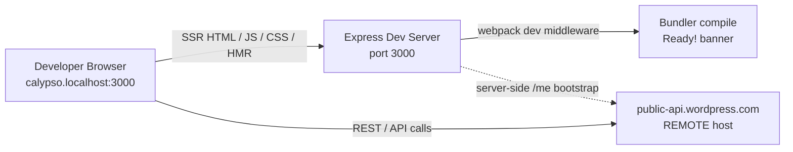

# WordPress.com Calypso Reader — Onboarding Investigation (Run-First)

This document is a **run-first** onboarding investigation of the WordPress.com **Calypso Reader**. It was produced by building and running the real code paths locally with the project's canonical toolchain, capturing the actual runtime output, and only then writing the answers. It targets branch **`wp-calypso_be7e5cc64162`** (HEAD **`be7e5cc641`** — _"Reader: Show login prompts on all logged out reader streams"_). It answers four onboarding questions: (Q1) dev-server port, readiness, and port topology; (Q2) Reader initial-load endpoints and Redux actions; (Q3) pre-render authentication detection and storage; (Q4) responsive sidebar margins/padding, CSS custom properties, and breakpoints.

Every substantive factual claim below is grounded with a `file:line` citation, names the specific function/selector responsible, and carries exactly one of two labels:

> **Legend**
>
> - **[OBSERVED]** — captured from live runtime output (server stdout piped through bunyan, HTTP responses, the browser's Redux store, `getComputedStyle`, the DevTools Network panel, IndexedDB/localStorage inspection). The exact command/script and its complete, unedited output are shown next to the claim.
> - **[INFERRED]** — derived from reading the source (with `file:line`). Used only where a runtime signal genuinely could not be produced through the real entry point after varied attempts; where used, the attempts are documented.

This is a **read-only** investigation. No product source file was modified, created, or deleted. Temporary observation scripts and captured-output files lived only under `/tmp/calypso_obs/` (outside the tracked tree) and were removed afterward; the only permanent change to the repository is this document (and the `blitzy/documentation/` directory that holds it). The final cleanup commands and their output are shown in the **Cleanup** section.

---

## Setup / Environment Summary

The investigation ran under the project's **canonical toolchain**, exercised through the real entry points a normal developer uses: `yarn install --immutable`, then `yarn start` (which chains `check-node-version` → `bin/welcome.js` → `yarn run build` → `yarn run start-build`), reachable at `http://calypso.localhost:3000`.

### Canonical toolchain (with citations)

- **Node.js `^v22.9.0`** — declared in `engines` at `package.json:L56` with `"node": "^v22.9.0"` at `package.json:L57`; pinned to `22.9.0` at `.nvmrc:L1`. The installed **`v22.23.1`** satisfies the constraint. **[OBSERVED]** (version + gate output below). Node 20 would **fail** the `start` gate (`check-node-version --package`), so it was intentionally not used.
- **Yarn `4.0.2` via Corepack** — `yarnPath: .yarn/releases/yarn-4.0.2.cjs` at `.yarnrc.yml:L5`; `"packageManager": "yarn@4.0.2"` at `package.json:L422`. **[OBSERVED]** (`yarn --version` below).
- **Hosts requirement** — `127.0.0.1 calypso.localhost` must be present (`docs/install.md:L9`); the app is reached at `http://calypso.localhost:3000`. Local Calypso talks to the **remote** `public-api.wordpress.com` REST API (`docs/install.md:L38`), not a local API server. **[INFERRED — documentation]** for the hosts/remote-REST facts; the single-local-port consequence is **[OBSERVED]** in Q1.

### Dependency install — command and output **[OBSERVED]**

Installed with the immutable (lockfile-frozen) install a normal developer/CI uses. The lockfile was not modified (immutable):

```bash
$ CI=true yarn install --immutable
```

```text
➤ YN0000: └ Completed in 0s 547ms
➤ YN0000: ┌ Fetch step
➤ YN0000: └ Completed in 4s 469ms
➤ YN0000: ┌ Link step
➤ YN0000: └ Completed in 1s 2ms
➤ YN0000: · Done in 6s 291ms
```

`git status --porcelain` was empty immediately after the install, confirming `yarn.lock` and tracked files were unchanged by it. **[OBSERVED]**

### Version check — command and output **[OBSERVED]**

```bash
$ node --version
$ yarn --version
$ npx check-node-version --package ; echo "exit=$?"
```

```text
v22.23.1
4.0.2
exit=0
```

The `check-node-version --package` gate (used by `scripts.start`) **passes** on `v22.23.1` (exit `0`), confirming this is a canonical run rather than a bypass. **[OBSERVED]**

### Canonical `start` script chain (quoted from `package.json`)

- `package.json:L110` — `scripts.start`:

```text
npx check-node-version --package && node bin/welcome.js && yarn run build && yarn run start-build
```

- `package.json:L113` — `scripts.start-build`:

```text
BROWSERSLIST_ENV=evergreen node build/server.js | bunyan -o short
```

- `package.json:L64` — `scripts.build` (produces `build/server.js` + `public/` assets). `docs/yarn-start.md` diagrams this same chain (welcome → build → start-build → `node build/server.js`). **[INFERRED — source/documentation]**; the resulting boot/readiness output is **[OBSERVED]** in Q1.

### Welcome banner — command **[OBSERVED]**

`bin/welcome.js` (invoked first by `scripts.start`) prints a cyan ASCII "calypso" banner. Captured from the head of the canonical `yarn start` output (trailing spaces stripped so the file has no trailing whitespace):

```bash
$ node bin/welcome.js
```

```text
             _
    ___ __ _| |_   _ _ __  ___  ___
   / __/ _` | | | | | '_ \/ __|/ _ \
  | (_| (_| | | |_| | |_) \__ \ (_) |
   \___\__,_|_|\__, | .__/|___/\___/
               |___/|_|
```

### Canonical server start — command and boot line **[OBSERVED]**

The dev server was started through the canonical entry point (`yarn start`), with all output captured to a log outside the tracked tree (`/tmp/calypso_obs/yarn_start.log`):

```bash
$ yarn start > /tmp/calypso_obs/yarn_start.log 2>&1 &
```

`bin/welcome.js` runs first, then `yarn run build` rebuilds `build/server.js`, then `start-build` runs `node build/server.js | bunyan -o short`. The `logger.info` boot record (`client/server/index.js:L33`) rendered by `| bunyan -o short` (`package.json:L113`) appeared as (from `/tmp/calypso_obs/yarn_start.log`):

```text
18:07:43.785Z  INFO calypso: wp-calypso booted in 1024ms - http://calypso.localhost:3000
```

The complete boot/readiness output is quoted and interpreted in **Q1** below (including the important nuance that this boot line is emitted _before_ the HTTP listener is set up).

---

## Q1 — Dev-server port, readiness, and single-vs-multi-port topology

### Question (verbatim)

> "What port does the development server bind to, and how do I know when it's fully ready? Does the architecture use multiple ports for things like hot reloading and API calls, or is everything served from one place?"

### Commands run

```bash
# (1) the bunyan boot line, from the canonical `yarn start` log
$ grep 'wp-calypso booted' /tmp/calypso_obs/yarn_start.log
# (2) prove the HTTP listener actually accepts connections
$ curl -o /dev/null -s -w 'HTTP %{http_code} %{size_download} bytes\n' --max-time 15 http://calypso.localhost:3000/
# (3) the transient holding page, captured DURING compilation
$ curl -s --max-time 10 http://calypso.localhost:3000/
# (4) the bundler "Compiling" hint + both "Ready!" banners, from the log
$ grep -nE 'Compiling assets|Ready!|compiled .* in' /tmp/calypso_obs/yarn_start.log
```

### Captured output

**(1) Boot line** — emitted by `logger.info` (`client/server/index.js:L33`), formatted by `| bunyan -o short` (`package.json:L113`):

```text
18:07:43.785Z  INFO calypso: wp-calypso booted in 1024ms - http://calypso.localhost:3000
```

**(2) Listener actually accepting** — a real request returns HTTP 200:

```text
HTTP 200 25104 bytes
```

**(3) Holding page during compilation** — HTTP 200, 630 bytes (before assets are ready):

```text

				<head>
					<meta http-equiv="refresh" content="5">
				</head>
				<body>
					<h1>Welcome to Calypso!</h1>
					<p>
						Please wait until webpack has finished compiling and you see
						<code style="font-size: 1.2em; color: blue; font-weight: bold;">READY!</code> in
						the server console. This page should then refresh automatically. If it hasn&rsquo;t, hit <em>Refresh</em>.
					</p>
					<p>
						In the meantime, try to follow all the emotions of the allmoji:
						
				</body>
```

**(4) The "Compiling…" hint and BOTH "Ready!" banners** (line numbers are from `/tmp/calypso_obs/yarn_start.log`):

```text
212:Compiling assets... Wait until you see Ready! and then try http://calypso.localhost:3000/ again.
249:webpack 5.97.1 compiled with 37 warnings in 164542 ms
251:Ready! You can load http://calypso.localhost:3000/ now. Have fun!
287:webpack 5.97.1 compiled successfully in 12578 ms
289:Ready! All assets are re-compiled. Have fun!
```

The recompile banner was triggered through the running dev server with an mtime-only `touch` (contents unchanged; `git status --porcelain` stayed empty before and after):

```bash
$ touch client/reader/following/main.tsx   # mtime only; file contents unchanged
```

### Interpretation

- **The bound port is `3000`.** It is resolved by `config( 'port' )` at `client/server/index.js:L12` and bound by the `server.listen` call at `client/server/index.js:L83`, whose callback calls `sendBootStatus( 'ready' )` at `client/server/index.js:L85`. The value comes from `config/development.json:L8` (`"port": 3000,`) and base `config/_shared.json:L25` (`"port": 3000,`). The observed URL in every readiness line above is `http://calypso.localhost:3000`. **[OBSERVED]**
  - _Citation nuance:_ the AAP cited `config('port')` at `client/server/index.js:L11`; the actual line is **L12** (L11 is `config('protocol')`). The observed line is cited.
- **"How do I know when it's ready?" — there are three distinct signals, and they mean different things:**
  1. **Process booted (boot line, signal 1).** `logger.info( 'wp-calypso booted in %dms - %s://%s:%s', Date.now() - start, protocol, host, port )` runs at `client/server/index.js:L33`. Critically, **L33 executes _before_ the HTTP server is created (`createServer` at `client/server/index.js:L73`) and before `server.listen` (`client/server/index.js:L83`)** — it fires right after `const app = boot()` (`client/server/index.js:L23`). So this line proves the Express app finished booting and prints the fully-resolved `protocol://host:port`, but it does **not** by itself prove the socket is accepting connections. **[OBSERVED]**
  2. **Listener accepting (signal 2).** The observable proof that the listener is up is a successful request — `GET /` returns HTTP `200` (output 2 above). The `server.listen` callback (`client/server/index.js:L83-L86`) only calls `sendBootStatus( 'ready' )` (`:L85`), which merely notifies a parent process fork (`process.send`, `:L27-L30`) and prints nothing to the terminal — so a successful HTTP response is the developer-visible listener-ready signal. **[OBSERVED]**
  3. **Assets ready (signal 3 — the one you actually wait for in dev).** Being able to connect to `:3000` does **not** mean the client bundle is built. In development the bundler installs a gate, `waitForCompiler( request, response, next )` at `client/server/bundler/index.js:L66`, which holds `/` requests behind the transient **"Welcome to Calypso!"** holding page (`<h1>` at `client/server/bundler/index.js:L82`, 5-second `<meta http-equiv="refresh" content="5">` at `client/server/bundler/index.js:L79`) and prints `Compiling assets...` (`client/server/bundler/index.js:L72`). The definitive "assets ready" signal is the bundler's **"Ready!"** banner, and there are two forms — first compile at `client/server/bundler/index.js:L56` and recompile at `client/server/bundler/index.js:L60` (both banners are shown verbatim in captured output block 4 above). Both were captured above. **[OBSERVED]**
- **Net:** "fully ready" in dev = process booted (signal 1) **and** listener accepting (signal 2, `200`) **and** the webpack **"Ready!"** banner printed (signal 3) so `/` stops returning the holding page and returns the 25,104-byte SSR document (see topology below).

### Single-port topology — SSR + JS + CSS + HMR all on `:3000` **[OBSERVED]**

The webpack dev middleware is mounted on the **same** Express `app` in development at `client/server/boot/index.js:L36-L37`:

```text
if ( 'development' === process.env.NODE_ENV ) {
	require( 'calypso/server/bundler' )( app );
}
```

All four local concerns were probed on `:3000` with real asset URLs (taken from the SSR HTML) and a bounded `--max-time` on the HMR SSE channel so it cannot hang:

```bash
$ CSS=/calypso/evergreen/assets_stylesheets_style_scss.css
$ JS=/calypso/evergreen/runtime.js
$ curl -o /dev/null -s -w 'HTTP %{http_code} | %{content_type} | %{size_download} bytes\n' --max-time 20 http://calypso.localhost:3000/
$ curl -s --max-time 20 http://calypso.localhost:3000/ | grep -oE '<title>[^<]*</title>'
$ curl -s --max-time 20 http://calypso.localhost:3000/ | grep -oE 'id="wpcom"'
$ curl -o /dev/null -s -w 'HTTP %{http_code} | %{content_type} | %{size_download} bytes\n' --max-time 20 "http://calypso.localhost:3000${CSS}"
$ curl -o /dev/null -s -w 'HTTP %{http_code} | %{content_type} | %{size_download} bytes\n' --max-time 20 "http://calypso.localhost:3000${JS}"
$ curl -o /dev/null -s -w 'HTTP %{http_code} | %{content_type}\n' --max-time 3 http://calypso.localhost:3000/__webpack_hmr
```

```text
SSR   : HTTP 200 | text/html; charset=utf-8 | 25104 bytes
title : <title>WordPress.com</title>
root  : id="wpcom"
CSS   : HTTP 200 | text/css; charset=utf-8 | 129001 bytes
JS    : HTTP 200 | application/javascript; charset=utf-8 | 86739 bytes
HMR   : HTTP 200 | text/event-stream;charset=utf-8
```

SSR page handling lives on the same app in `client/server/pages/index.js` (the section/SSR handler `handleSectionPath` at `client/server/pages/index.js:L944`), and the server bundle itself is built by `client/webpack.config.node.js`. So server-side-rendered HTML, JS bundles, CSS bundles, and the hot-module-replacement SSE channel (`/__webpack_hmr`, served with `text/event-stream`) are **all** served from the one local port `3000`. There is no separate local port for HMR.

### There is NO second local port — REST/API is REMOTE **[OBSERVED]**

REST/API traffic does not target a second local port; it targets the **remote** `public-api.wordpress.com` host (`docs/install.md:L38`). This was confirmed by probing candidate local ports (only `3000` answers; `000` means nothing is listening) and, in Q2, by the network capture (every Reader REST call went to `public-api.wordpress.com`):

```bash
$ for p in 3000 5858 8080 443; do printf '%s => ' "$p"; curl -o /dev/null -s -w '%{http_code}\n' --max-time 3 http://calypso.localhost:$p/; done
```

```text
3000 => 200
5858 => 000
8080 => 000
443 => 000
```

### Reproducibility — port/response stable across two runs **[OBSERVED]**

```bash
$ for run in 1 2; do curl -o /dev/null -s -w "run$run: HTTP %{http_code} %{size_download} bytes\n" --max-time 20 http://calypso.localhost:3000/; done
```

```text
run1: HTTP 200 25104 bytes
run2: HTTP 200 25104 bytes
```

Both runs returned the identical 25,104-byte SSR document — deterministic.

### Edge/alternate conditions

- **Debugger port `5858` [INFERRED — documentation].** `docs/install.md:L63` documents `NODE_OPTIONS="--inspect=5858" yarn start`. This is the V8 **inspector** port, not a request-serving port. Corroborated above: `:5858` returns `000` by default (it is only opened when `--inspect=5858` is passed). Labeled INFERRED because the default canonical run does not open it.
- **Generic `PROTOCOL` / `HOST` / `PORT` env override [INFERRED — source-derived].** `client/server/config/parser.js:L61-L63` allows `data.protocol = process.env.PROTOCOL || data.protocol; data.hostname = process.env.HOST || data.hostname; data.port = process.env.PORT || data.port;`. So `PORT` can override the port at runtime, but **`3000` is the canonical default** (no env var set); the override is not another default. Labeled INFERRED (not exercised in the canonical run).
- **`MOCK_WORDPRESSDOTCOM=1` port override → `443` [INFERRED — non-canonical].** `client/server/index.js:L16-L20`: when `process.env.MOCK_WORDPRESSDOTCOM === '1'`, `port` is overridden to `443` (`:L18`) and host to `wordpress.com` (`:L19`). The default (no env var) canonical value is `3000`; this override was not run, and any `443` value would be the non-canonical mock path. Labeled INFERRED / non-canonical.

### Topology summary

A single local port — **`3000`** — multiplexes SSR HTML, JS assets, CSS assets, and the HMR SSE channel. REST/API calls go to the **remote** `public-api.wordpress.com`, so there is no second local port for API traffic. The debugger port `5858` is opt-in and is not a request-serving port.



---

## Q2 — Reader initial-load endpoints and ordered Redux actions

### Question (verbatim)

> "What API endpoints get called to populate the stream, and what Redux actions fire during that initial load?"

**Legend:** **[OBSERVED]** = captured from the running app at the real entry point (Chromium page + local dev server); **[INFERRED]** = read from source and not exercised in this run (labeled, with `file:line`).

### Entry point and exact commands

The Reader was loaded at its real entry point (`http://calypso.localhost:3000/reader`) in a Chromium page driven over the DevTools protocol. To read the dispatched actions through the **canonical** store hook rather than a bypass, a minimal Redux-DevTools enhancer was injected via the page's init-script **before any app script ran**; Calypso's store installs whatever that hook returns at `client/state/index.ts:L49` (`window.__REDUX_DEVTOOLS_EXTENSION__ && window.__REDUX_DEVTOOLS_EXTENSION__()`). The init-script, verbatim as injected:

```text
// Injected via Chrome DevTools MCP navigate_page(initScript=...) BEFORE any app script,
// so Calypso's store picks it up at creation via the canonical hook at
// client/state/index.ts:L49 :  window.__REDUX_DEVTOOLS_EXTENSION__ && window.__REDUX_DEVTOOLS_EXTENSION__()
window.__REDUX_DEVTOOLS_EXTENSION__ = function () {
  return function (createStore) {
    return function (reducer, preloadedState) {
      var store = createStore(reducer, preloadedState);
      var orig = store.dispatch;
      window.__actionLog = [];
      window.__actionSeq = 0;
      store.dispatch = function (action) {
        try {
          if (action && action.type) {
            window.__actionSeq += 1;
            window.__actionLog.push(window.__actionSeq + '\t' + action.type);
          }
        } catch (e) {}
        return orig(action);
      };
      return store;
    };
  };
};
```

The exact driver calls, in order:

```bash
# 1. Navigate to the REAL entry point with the enhancer injected before app boot:
navigate_page(type=url, url="http://calypso.localhost:3000/reader", initScript=<the script above>)

# 2. After the stream settled, read the complete ordered action-type log:
evaluate_script(function=() => (window.__actionLog || []).join("\n"))

# 3. Read the outbound REST calls from the DevTools network list:
list_network_requests(resourceTypes=["xhr","fetch"], pageSize=80)
```

### Observed output — redirect, endpoints, and the complete action trace

**(a) `/reader` redirects to `/discover` for the logged-out default session. [OBSERVED]** The `navigate_page` tool reported the resolved URL and page title:

```text
Successfully navigated to http://calypso.localhost:3000/reader.
## Pages
1: Browse popular blogs & read articles ‹ Reader (http://calypso.localhost:3000/discover) [selected]
```

**(b) The stream-populating REST call. [OBSERVED]** The default logged-out stream is Discover **Recommended** (`discover:recommended`), which resolves to `/read/streams/discover`. The initial fetch and the immediately auto-paginated next page were captured verbatim from the network list — **run 1**:

```text
reqid=179 GET https://public-api.wordpress.com/wpcom/v2/read/streams/discover?_envelope=1&orderBy=popular&meta=post%2Cdiscover_original_post&feed_id=&number=4&lang=en&tags%5B%5D=dailyprompt&tags%5B%5D=wordpress&tag_recs_per_card=5&site_recs_per_card=5&age_based_decay=0.5&content_width=675 [200]
reqid=198 GET https://public-api.wordpress.com/wpcom/v2/read/streams/discover?_envelope=1&orderBy=popular&meta=post%2Cdiscover_original_post&feed_id=&page_handle=VMFIbsesHdhObDukf_tgT0pfYrYZnqY9PmiQdI26M32iSXJtSlBFcmcrc1dNU1FlNHpicXB1aVFzL3RWN1FJbDZDWnFEZkJWMG5ydEFPamNiOU5rMVJPWWlhN0J2WlFSY2JzRGZJT2F4WHpianNrc1Nmc3JROWZ3RFE5NEVrNTl6aFhhOUQ2Q0N2UkRNRUZJU3A3VDh6L1Fqd0R4dUFsNjJ0ellGbWd5R3FTZDlBeldRc1pEaEp1UnNkTFduVzZROW9NbFczT1pmRkRmVGt4VzRQdEdnN1RRL3JsalpZbWJBWUFBTGh0alMrSVVTQmJBODdDakpCdDhhby9XdWJydFFtZnFUVHo0UWdNbz0.&number=7&lang=en&tags%5B%5D=dailyprompt&tags%5B%5D=wordpress&tag_recs_per_card=5&site_recs_per_card=5&age_based_decay=0.5&content_width=675 [200]
```

Reproduced on a second independent load — **run 2** (different reqids; identical `number` values and identical `page_handle`):

```text
reqid=505 GET https://public-api.wordpress.com/wpcom/v2/read/streams/discover?_envelope=1&orderBy=popular&meta=post%2Cdiscover_original_post&feed_id=&number=4&lang=en&tags%5B%5D=dailyprompt&tags%5B%5D=wordpress&tag_recs_per_card=5&site_recs_per_card=5&age_based_decay=0.5&content_width=675 [200]
reqid=527 GET https://public-api.wordpress.com/wpcom/v2/read/streams/discover?_envelope=1&orderBy=popular&meta=post%2Cdiscover_original_post&feed_id=&page_handle=VMFIbsesHdhObDukf_tgT0pfYrYZnqY9PmiQdI26M32iSXJtSlBFcmcrc1dNU1FlNHpicXB1aVFzL3RWN1FJbDZDWnFEZkJWMG5ydEFPamNiOU5rMVJPWWlhN0J2WlFSY2JzRGZJT2F4WHpianNrc1Nmc3JROWZ3RFE5NEVrNTl6aFhhOUQ2Q0N2UkRNRUZJU3A3VDh6L1Fqd0R4dUFsNjJ0ellGbWd5R3FTZDlBeldRc1pEaEp1UnNkTFduVzZROW9NbFczT1pmRkRmVGt4VzRQdEdnN1RRL3JsalpZbWJBWUFBTGh0alMrSVVTQmJBODdDakpCdDhhby9XdWJydFFtZnFUVHo0UWdNbz0.&number=7&lang=en&tags%5B%5D=dailyprompt&tags%5B%5D=wordpress&tag_recs_per_card=5&site_recs_per_card=5&age_based_decay=0.5&content_width=675 [200]
```

The `page_handle` above is the **complete, unedited** 360-character opaque pagination cursor exactly as it appeared on the wire (a pagination token, not a credential). The first call carries **no** `page_handle` and `number=4`; the second carries a `page_handle` and `number=7`.

**(c) The other endpoints that fire to enrich the stream. [OBSERVED]** Each is named by path family with the Redux action it drives; every one appeared with a real reqid in the network list:

```text
GET  /wpcom/v2/read/streams/discover        (stream page: number=4 initial / number=7 subsequent)   -> READER_STREAMS_PAGE_REQUEST / _RECEIVE
GET  /rest/v1.1/read/feed/{feedId}                                                                   -> READER_FEED_REQUEST / _SUCCESS
GET  /rest/v1.1/read/sites/{siteId}                                                                  -> READER_SITE_REQUEST / _SUCCESS
GET  /rest/v1.1/sites/{siteId}/posts/{postId}/replies                                                -> COMMENTS_REQUEST / COMMENTS_RECEIVE
GET  /rest/v1.1/users/suggest?site_id={siteId}                                                       -> USER_SUGGESTIONS_REQUEST / _RECEIVE
GET  /rest/v1.1/me?meta=flags                                                                        -> (auth bootstrap; see Q3)
```

**(d) The complete ordered Redux action trace** for the initial load (run 2), reproduced **in full with no trimming** — 269 dispatched actions, each shown as `<seq>\t<TYPE>`: **[OBSERVED]**

```text
1	APPLY_STORED_STATE
2	APPLY_STORED_STATE
3	APPLY_STORED_STATE
4	ANALYTICS_STAT_BUMP
5	SECTION_LOADING_SET
6	SECTION_SET
7	LAYOUT_NEXT_FOCUS_ACTIVATE
8	SECTION_SET
9	LAYOUT_NEXT_FOCUS_ACTIVATE
10	ROUTE_SET
11	WPCOM_HTTP_REQUEST
12	USER_SETTINGS_REQUEST
13	SECTION_LOADING_SET
14	SECTION_LOADING_SET
15	SECTION_SET
16	LAYOUT_NEXT_FOCUS_ACTIVATE
17	ROUTE_SET
18	DOCUMENT_HEAD_TITLE_SET
19	DOCUMENT_HEAD_META_SET
20	PREFERENCES_FETCH
21	DOCUMENT_HEAD_UNREAD_COUNT_SET
22	READER_RESET_CARD_EXPANSIONS
23	READER_VIEW_STREAM
24	WPCOM_HTTP_REQUEST
25	READER_STREAMS_PAGE_REQUEST
26	PREFERENCES_FETCH_FAILURE
27	WPCOM_HTTP_REQUEST
28	POST_LIKES_RECEIVE
29	POST_LIKES_RECEIVE
30	POST_LIKES_RECEIVE
31	POST_LIKES_RECEIVE
32	POST_LIKES_RECEIVE
33	POST_LIKES_RECEIVE
34	POST_LIKES_RECEIVE
35	READER_POSTS_RECEIVE
36	READER_RECOMMENDED_SITES_RECEIVE
37	READER_STREAMS_PAGE_RECEIVE
38	WPCOM_HTTP_REQUEST
39	READER_STREAMS_PAGE_REQUEST
40	WPCOM_HTTP_REQUEST
41	READER_FEED_REQUEST
42	WPCOM_HTTP_REQUEST
43	READER_SITE_REQUEST
44	WPCOM_HTTP_REQUEST
45	COMMENTS_REQUEST
46	WPCOM_HTTP_REQUEST
47	READER_FEED_REQUEST
48	WPCOM_HTTP_REQUEST
49	READER_SITE_REQUEST
50	WPCOM_HTTP_REQUEST
51	COMMENTS_REQUEST
52	WPCOM_HTTP_REQUEST
53	READER_FEED_REQUEST
54	WPCOM_HTTP_REQUEST
55	READER_SITE_REQUEST
56	WPCOM_HTTP_REQUEST
57	COMMENTS_REQUEST
58	WPCOM_HTTP_REQUEST
59	READER_FEED_REQUEST
60	WPCOM_HTTP_REQUEST
61	READER_SITE_REQUEST
62	WPCOM_HTTP_REQUEST
63	COMMENTS_REQUEST
64	WPCOM_HTTP_REQUEST
65	READER_FEED_REQUEST
66	WPCOM_HTTP_REQUEST
67	READER_SITE_REQUEST
68	WPCOM_HTTP_REQUEST
69	COMMENTS_REQUEST
70	WPCOM_HTTP_REQUEST
71	READER_FEED_REQUEST
72	WPCOM_HTTP_REQUEST
73	READER_SITE_REQUEST
74	WPCOM_HTTP_REQUEST
75	COMMENTS_REQUEST
76	WPCOM_HTTP_REQUEST
77	READER_FEED_REQUEST
78	WPCOM_HTTP_REQUEST
79	READER_SITE_REQUEST
80	WPCOM_HTTP_REQUEST
81	COMMENTS_REQUEST
82	READER_POSTS_RECEIVE
83	WPCOM_HTTP_REQUEST
84	COMMENTS_REQUEST
85	WPCOM_HTTP_REQUEST
86	COMMENTS_REQUEST
87	WPCOM_HTTP_REQUEST
88	COMMENTS_REQUEST
89	WPCOM_HTTP_REQUEST
90	COMMENTS_REQUEST
91	WPCOM_HTTP_REQUEST
92	COMMENTS_REQUEST
93	WPCOM_HTTP_REQUEST
94	COMMENTS_REQUEST
95	WPCOM_HTTP_REQUEST
96	COMMENTS_REQUEST
97	ANALYTICS_EVENT_RECORD
98	ANALYTICS_EVENT_RECORD
99	ANALYTICS_EVENT_RECORD
100	ANALYTICS_EVENT_RECORD
101	ANALYTICS_EVENT_RECORD
102	READER_FEED_REQUEST_SUCCESS
103	READER_SITE_REQUEST_SUCCESS
104	COMMENTS_RECEIVE
105	COMMENTS_SET_ACTIVE_REPLY
106	USER_SUGGESTIONS_REQUEST
107	COMMENTS_COUNT_RECEIVE
108	READER_FEED_REQUEST_SUCCESS
109	READER_FEED_REQUEST_SUCCESS
110	COMMENTS_RECEIVE
111	COMMENTS_SET_ACTIVE_REPLY
112	USER_SUGGESTIONS_REQUEST
113	COMMENTS_COUNT_RECEIVE
114	READER_FEED_REQUEST_SUCCESS
115	READER_SITE_REQUEST_SUCCESS
116	READER_FEED_REQUEST_SUCCESS
117	READER_SITE_REQUEST_SUCCESS
118	READER_SITE_REQUEST_SUCCESS
119	COMMENTS_RECEIVE
120	COMMENTS_SET_ACTIVE_REPLY
121	USER_SUGGESTIONS_REQUEST
122	COMMENTS_COUNT_RECEIVE
123	COMMENTS_RECEIVE
124	COMMENTS_SET_ACTIVE_REPLY
125	USER_SUGGESTIONS_REQUEST
126	COMMENTS_COUNT_RECEIVE
127	READER_SITE_REQUEST_SUCCESS
128	COMMENTS_RECEIVE
129	COMMENTS_SET_ACTIVE_REPLY
130	USER_SUGGESTIONS_REQUEST
131	COMMENTS_COUNT_RECEIVE
132	READER_FEED_REQUEST_SUCCESS
133	READER_SITE_REQUEST_SUCCESS
134	READER_SITE_REQUEST_SUCCESS
135	READER_FEED_REQUEST_SUCCESS
136	COMMENTS_RECEIVE
137	COMMENTS_SET_ACTIVE_REPLY
138	USER_SUGGESTIONS_REQUEST
139	COMMENTS_COUNT_RECEIVE
140	USER_SUGGESTIONS_RECEIVE
141	USER_SUGGESTIONS_REQUEST_SUCCESS
142	USER_SUGGESTIONS_RECEIVE
143	USER_SUGGESTIONS_REQUEST_SUCCESS
144	USER_SUGGESTIONS_RECEIVE
145	USER_SUGGESTIONS_REQUEST_SUCCESS
146	USER_SUGGESTIONS_RECEIVE
147	USER_SUGGESTIONS_REQUEST_SUCCESS
148	USER_SUGGESTIONS_RECEIVE
149	USER_SUGGESTIONS_REQUEST_SUCCESS
150	POST_LIKES_RECEIVE
151	POST_LIKES_RECEIVE
152	POST_LIKES_RECEIVE
153	POST_LIKES_RECEIVE
154	POST_LIKES_RECEIVE
155	POST_LIKES_RECEIVE
156	POST_LIKES_RECEIVE
157	READER_POSTS_RECEIVE
158	READER_RECOMMENDED_SITES_RECEIVE
159	READER_STREAMS_PAGE_RECEIVE
160	READER_POSTS_RECEIVE
161	COMMENTS_RECEIVE
162	COMMENTS_SET_ACTIVE_REPLY
163	USER_SUGGESTIONS_REQUEST
164	COMMENTS_COUNT_RECEIVE
165	USER_SUGGESTIONS_RECEIVE
166	USER_SUGGESTIONS_REQUEST_SUCCESS
167	WPCOM_HTTP_REQUEST
168	WPCOM_HTTP_REQUEST
169	READER_FEED_REQUEST
170	WPCOM_HTTP_REQUEST
171	READER_SITE_REQUEST
172	WPCOM_HTTP_REQUEST
173	COMMENTS_REQUEST
174	WPCOM_HTTP_REQUEST
175	READER_FEED_REQUEST
176	WPCOM_HTTP_REQUEST
177	READER_SITE_REQUEST
178	WPCOM_HTTP_REQUEST
179	COMMENTS_REQUEST
180	WPCOM_HTTP_REQUEST
181	READER_FEED_REQUEST
182	WPCOM_HTTP_REQUEST
183	READER_SITE_REQUEST
184	WPCOM_HTTP_REQUEST
185	COMMENTS_REQUEST
186	WPCOM_HTTP_REQUEST
187	READER_FEED_REQUEST
188	WPCOM_HTTP_REQUEST
189	READER_SITE_REQUEST
190	WPCOM_HTTP_REQUEST
191	COMMENTS_REQUEST
192	WPCOM_HTTP_REQUEST
193	READER_FEED_REQUEST
194	WPCOM_HTTP_REQUEST
195	READER_SITE_REQUEST
196	WPCOM_HTTP_REQUEST
197	COMMENTS_REQUEST
198	WPCOM_HTTP_REQUEST
199	READER_FEED_REQUEST
200	WPCOM_HTTP_REQUEST
201	READER_SITE_REQUEST
202	WPCOM_HTTP_REQUEST
203	COMMENTS_REQUEST
204	WPCOM_HTTP_REQUEST
205	READER_FEED_REQUEST
206	WPCOM_HTTP_REQUEST
207	READER_SITE_REQUEST
208	WPCOM_HTTP_REQUEST
209	COMMENTS_REQUEST
210	USER_SUGGESTIONS_RECEIVE
211	USER_SUGGESTIONS_REQUEST_SUCCESS
212	READER_SITE_REQUEST_SUCCESS
213	READER_FEED_REQUEST_SUCCESS
214	READER_SITE_REQUEST_SUCCESS
215	READER_SITE_REQUEST_SUCCESS
216	COMMENTS_RECEIVE
217	COMMENTS_SET_ACTIVE_REPLY
218	USER_SUGGESTIONS_REQUEST
219	COMMENTS_COUNT_RECEIVE
220	READER_FEED_REQUEST_SUCCESS
221	COMMENTS_RECEIVE
222	COMMENTS_SET_ACTIVE_REPLY
223	USER_SUGGESTIONS_REQUEST
224	COMMENTS_COUNT_RECEIVE
225	READER_SITE_REQUEST_SUCCESS
226	COMMENTS_RECEIVE
227	COMMENTS_SET_ACTIVE_REPLY
228	USER_SUGGESTIONS_REQUEST
229	COMMENTS_COUNT_RECEIVE
230	READER_FEED_REQUEST_SUCCESS
231	READER_SITE_REQUEST_SUCCESS
232	READER_FEED_REQUEST_SUCCESS
233	COMMENTS_RECEIVE
234	COMMENTS_SET_ACTIVE_REPLY
235	USER_SUGGESTIONS_REQUEST
236	COMMENTS_COUNT_RECEIVE
237	READER_SITE_REQUEST_SUCCESS
238	READER_FEED_REQUEST_SUCCESS
239	READER_SITE_REQUEST_SUCCESS
240	READER_FEED_REQUEST_SUCCESS
241	READER_FEED_REQUEST_SUCCESS
242	COMMENTS_RECEIVE
243	COMMENTS_SET_ACTIVE_REPLY
244	USER_SUGGESTIONS_REQUEST
245	COMMENTS_COUNT_RECEIVE
246	COMMENTS_RECEIVE
247	COMMENTS_SET_ACTIVE_REPLY
248	USER_SUGGESTIONS_REQUEST
249	COMMENTS_COUNT_RECEIVE
250	COMMENTS_RECEIVE
251	COMMENTS_SET_ACTIVE_REPLY
252	USER_SUGGESTIONS_REQUEST
253	COMMENTS_COUNT_RECEIVE
254	USER_SUGGESTIONS_RECEIVE
255	USER_SUGGESTIONS_REQUEST_SUCCESS
256	USER_SUGGESTIONS_RECEIVE
257	USER_SUGGESTIONS_REQUEST_SUCCESS
258	USER_SUGGESTIONS_RECEIVE
259	USER_SUGGESTIONS_REQUEST_SUCCESS
260	USER_SUGGESTIONS_RECEIVE
261	USER_SUGGESTIONS_REQUEST_SUCCESS
262	USER_SUGGESTIONS_RECEIVE
263	USER_SUGGESTIONS_REQUEST_SUCCESS
264	USER_SUGGESTIONS_RECEIVE
265	USER_SUGGESTIONS_REQUEST_SUCCESS
266	USER_SUGGESTIONS_RECEIVE
267	USER_SUGGESTIONS_REQUEST_SUCCESS
268	WPCOM_HTTP_REQUEST
269	USER_SETTINGS_REQUEST_FAILURE
```

### Interpretation

- The stream is populated by a single **`GET https://public-api.wordpress.com/wpcom/v2/read/streams/discover`** call on first paint (`number=4`), followed by an auto-fetched second page (`number=7`, carrying the `page_handle` returned by the first). Each returned card is then enriched by per-feed, per-site, per-post-replies, and per-site user-suggestion calls. **[OBSERVED]**
- The **core stream sub-sequence** inside the full trace (run-2 seq numbers) is: `22 READER_RESET_CARD_EXPANSIONS` → `23 READER_VIEW_STREAM` → `24 WPCOM_HTTP_REQUEST` (the data-layer's outbound HTTP action) → `25 READER_STREAMS_PAGE_REQUEST` (the `number=4` request) → `35 READER_POSTS_RECEIVE` (post hydration) → `36 READER_RECOMMENDED_SITES_RECEIVE` → `37 READER_STREAMS_PAGE_RECEIVE` (page applied to state) → `38 WPCOM_HTTP_REQUEST` → `39 READER_STREAMS_PAGE_REQUEST` (the auto-fetched `number=7` page). **[OBSERVED]**
- The count rule is `number = pageHandle ? PER_FETCH : INITIAL_FETCH`, i.e. `4` with no handle and `7` once a handle exists — exactly why the first request is `number=4` and the second `number=7`. **[OBSERVED, and matches source at `client/state/data-layer/wpcom/read/streams/index.js:L380`]**
- The trace opens with three `APPLY_STORED_STATE` actions (seq 1–3) — the persisted-Redux-state rehydration on boot (relevant to Q3). **[OBSERVED]**

### Citations (file:line)

- Route redirect: `redirectLoggedOutToDiscover` at `client/reader/controller.js:L356-L363` (returns `page.redirect( '/discover' )` at `client/reader/controller.js:L362` when `isUserLoggedIn` is false), wired **first** on the `/reader` route at `client/reader/index.ts:L54-L62`. The Discover stream key `'discover:recommended'` is set at `client/reader/discover/index.web.js:L34`.
- Stream-key → REST path map: the `discover` entry at `client/state/data-layer/wpcom/read/streams/index.js:L223-L246` returns `/read/streams/discover` for `recommended` (`:L225-L226`), sets `orderBy: 'popular'` (`:L244`) and `apiNamespace: 'wpcom/v2'` (`:L246`) — matching the observed URL. The alternate `following` paths `/read/following` (`:L194`) and `/read/streams/following` (`:L198`) were **not** the ones hit for the logged-out default. **[INFERRED for the two unhit paths]**
- Fetch counts: `PER_FETCH = 7` at `client/state/data-layer/wpcom/read/streams/index.js:L160`; `INITIAL_FETCH = 4` at `:L161`. The `requestPage` data-layer handler at `:L358` computes `const fetchCount = pageHandle ? PER_FETCH : INITIAL_FETCH;` at `:L380`, sets `apiVersion = '1.2'` at `:L370`, and issues the call via `return http( { … } )` at `:L395`.
- Action creators: `requestPage` at `client/state/reader/streams/actions.js:L28` (`type: READER_STREAMS_PAGE_REQUEST` at `:L39`); `receivePage` at `:L52` (`type: READER_STREAMS_PAGE_RECEIVE` at `:L63`); `receiveUpdates` at `:L87`; `receiveNewPost` at `:L94`.
- Post hydration: `receivePosts` at `client/state/reader/posts/actions.js:L63-L98` dispatches `READER_POSTS_RECEIVE` at `:L87` and `:L95`.
- Action-type constants: `READER_STREAMS_PAGE_RECEIVE` at `client/state/reader/action-types.ts:L77`, `READER_STREAMS_PAGE_REQUEST` at `:L78`, `READER_STREAMS_PAGINATED_REQUEST` at `:L79`, `READER_STREAMS_UPDATES_RECEIVE` at `:L85`, `READER_STREAMS_NEW_POST_RECEIVE` at `:L86`.
- DevTools store hook used for observation: `client/state/index.ts:L49`.

### Edge/alternate conditions

- **Initial vs subsequent page [OBSERVED]:** first request → `number=4`, no `page_handle`; the auto-fetched next page → `number=7`, `page_handle` present. Both captured verbatim above and reproduced across two runs (run 1 reqids 179/198; run 2 reqids 505/527), with an identical `page_handle`, confirming determinism.
- **Logged-out default stream [OBSERVED]:** the logged-out visitor is redirected to `/discover`; the `discover:recommended` stream (`/read/streams/discover`) genuinely fires. Login prompts are rendered around it, but the fetch and the `READER_STREAMS_PAGE_REQUEST`/`READER_STREAMS_PAGE_RECEIVE` pair were observed, not inferred.
- **Actions defined but NOT fired on this initial load [INFERRED]:** `READER_STREAMS_PAGINATED_REQUEST` (`action-types.ts:L79`), `READER_STREAMS_UPDATES_RECEIVE` (`:L85`), and `READER_STREAMS_NEW_POST_RECEIVE` (`:L86`) did not appear in the 269-action trace; they belong to the pagination-by-request and live-update paths that the default discover load does not exercise.

## Q3 — How the app detects login before rendering, and which storage it checks

### Question (verbatim)

> "how the app knows whether someone is logged in before it decides what to render, what storage mechanisms does it check?"

**Legend:** **[OBSERVED]** = captured from the running app at the real entry point (Chromium page + local dev server); **[INFERRED]** = read from source and not exercised in this run (labeled, with `file:line`), including conditions unreachable from the default logged-out Reader.

### Entry point and exact commands

The logged-out Reader was loaded at its real entry point (`http://calypso.localhost:3000/reader`, which redirects to `/discover`). To read the auth selectors' real inputs, the canonical Redux-DevTools hook (`client/state/index.ts:L49`) was used to **collect every store** created during boot (several are created; the main app store is the one whose state has a top-level `currentUser` key). The injected init-script (verbatim):

```text
// Injected via navigate_page(initScript=...) BEFORE any app script, so it is in
// place when Calypso's store is created. Calypso installs whatever this hook
// returns as a store enhancer at client/state/index.ts:L49. Because several
// stores are created through the same hook, we collect ALL of them and later
// pick the main app store (the one whose state has a top-level `currentUser`
// key, which is what the auth selectors read). We also count CURRENT_USER_RECEIVE
// (the action setCurrentUser dispatches when a user is detected). No app
// behavior is bypassed or altered.
window.__REDUX_DEVTOOLS_EXTENSION__ = function () {
  return function (createStore) {
    return function (reducer, preloadedState) {
      var store = createStore(reducer, preloadedState);
      window.__stores = window.__stores || [];
      var rec = { store: store, currentUserReceive: 0 };
      var orig = store.dispatch;
      store.dispatch = function (action) {
        if (action && action.type === 'CURRENT_USER_RECEIVE') {
          rec.currentUserReceive += 1;
        }
        return orig(action);
      };
      window.__stores.push(rec);
      return store;
    };
  };
};
```

The exact driver calls:

```bash
# 1. Navigate to the REAL entry point with the store-collector injected before boot:
navigate_page(type=url, url="http://calypso.localhost:3000/reader", initScript=<script above>)

# 2. Identify the main store among all collected stores (the one with `currentUser`):
evaluate_script(function=() => /* map window.__stores -> {index,numTopKeys,hasCurrentUser,...} */)

# 3. Read the auth selectors' inputs from the main store (index 1):
evaluate_script(function=() => /* getState().currentUser; getCurrentUserId; isUserLoggedIn */)

# 4. Read cookies + localStorage:
evaluate_script(function=() => ({ 'document.cookie': document.cookie, localStorage: Object.keys(localStorage) }))

# 5. Read IndexedDB (async): list databases + calypso_store keys:
evaluate_script(function=async () => /* indexedDB.databases(); open('calypso'); getAllKeys() */)

# 6. Read the auth-detection network call:
list_network_requests(resourceTypes=["xhr","fetch"])
```

The exact `evaluate_script` function bodies used for steps (2)-(5) above (verbatim):

```text
// (2) Identify the main store among all collected stores:
() => {
  var stores = window.__stores || [];
  var res = stores.map(function (rec, i) {
    var s = rec.store.getState();
    var keys = Object.keys(s);
    return {
      index: i,
      numTopKeys: keys.length,
      hasCurrentUser: Object.prototype.hasOwnProperty.call(s, 'currentUser'),
      currentUserReceive: rec.currentUserReceive,
      firstKeys: keys.slice(0, 15),
    };
  });
  return JSON.stringify({ storeCount: stores.length, stores: res }, null, 2);
}

// (3) Read the auth selectors' inputs from the main store (index 1):
() => {
  var rec = window.__stores[1];
  var s = rec.store.getState();
  var cu = s.currentUser;
  var getCurrentUserId = cu == null ? undefined : cu.id;   // selectors.js:L6-8
  var isUserLoggedIn = getCurrentUserId !== null;          // selectors.js:L15-17
  return JSON.stringify({
    currentUser_slice: cu,
    'getCurrentUserId(state)': getCurrentUserId === undefined ? '__undefined__' : getCurrentUserId,
    'isUserLoggedIn(state)': isUserLoggedIn,
    currentUserReceiveCount: rec.currentUserReceive,
    typeof_window_currentUser: typeof window.currentUser,
  }, null, 2);
}

// (4) Read cookies + localStorage keys:
() => {
  var cookieRaw = document.cookie;
  var cookieNames = cookieRaw
    ? cookieRaw.split(';').map(function (c) { return c.trim().split('=')[0]; }).filter(Boolean).sort()
    : [];
  var lsKeys = Object.keys(window.localStorage).sort();
  return JSON.stringify({
    'document.cookie_raw': cookieRaw,
    cookieNames: cookieNames,
    has_wordpress_logged_in_cookie_in_JS: cookieNames.indexOf('wordpress_logged_in') !== -1,
    has_wpcom_token_cookie_in_JS: cookieNames.indexOf('wpcom_token') !== -1,
    localStorage_keys: lsKeys,
    localStorage_count: lsKeys.length,
  }, null, 2);
}

// (5) Read IndexedDB (async): list databases + calypso_store keys (open WITHOUT a
//     version so the existing DB opens with no upgrade — non-destructive):
async () => {
  var out = {};
  if (indexedDB.databases) {
    var dbs = await indexedDB.databases();
    out.databases = dbs.map(function (d) { return d.name + ' (v' + d.version + ')'; }).sort();
  }
  out.calypso_store = await new Promise(function (resolve) {
    var req = indexedDB.open('calypso');
    req.onsuccess = function () {
      var db = req.result;
      var res = { dbVersion: db.version, objectStores: Array.from(db.objectStoreNames) };
      var tx = db.transaction('calypso_store', 'readonly');
      var kr = tx.objectStore('calypso_store').getAllKeys();
      kr.onsuccess = function () { res.keyCount = kr.result.length; res.keys = kr.result.slice().sort(); resolve(res); db.close(); };
    };
  });
  return JSON.stringify(out, null, 2);
}
```

### Observed output

**(a) Store enumeration — the main app store is index 1. [OBSERVED]**

```text
// evaluate_script enumerating every store created through the canonical devtools hook.
// 16 stores total; index 1 is the MAIN Calypso app store (47 slices, has currentUser).
// The other 15 are small {metadata, root:{subscriber}} widget stores.
{
  "storeCount": 16,
  "mainStore": {
    "index": 1,
    "numTopKeys": 47,
    "hasCurrentUser": true,
    "currentUserReceive": 0,
    "firstKeys": [
      "currentUser", "dataRequests", "sites", "notices", "route", "ui",
      "notifications", "a8cForAgencies", "documentHead", "oauth2Clients",
      "preferences", "adminColor", "adminMenu", "gutenbergIframeEligible",
      "selectedEditor"
    ]
  },
  "otherStoresShape": { "numTopKeys": 2, "firstKeys": ["metadata", "root"] }
}
```

**(b) The auth selectors' real inputs, read from the main store. [OBSERVED]**

```text
// evaluate_script over the MAIN app store (window.__stores[1]) on the logged-out /discover page:
{
  "currentUser_slice": {
    "id": null,
    "user": null,
    "capabilities": {},
    "flags": [],
    "emailVerification": {
      "status": null,
      "errorMessage": ""
    },
    "lasagnaJwt": null
  },
  "getCurrentUserId(state)": null,
  "isUserLoggedIn(state)": false,
  "currentUserReceiveCount": 0,
  "typeof_window_currentUser": "undefined"
}
```

`isUserLoggedIn(state)` is `false` because `getCurrentUserId(state)` (i.e. `state.currentUser.id`) is `null` — the reducer default — and `null !== null` is `false`.

**(c) The canonical auth-detection network call. [OBSERVED]**

```text
// list_network_requests (xhr/fetch) — the FIRST request of boot is the canonical
// auth-detection fetch issued by rawCurrentUserFetch() = wpcom.me().get({meta:'flags'}).
// It returns HTTP 200 with an http_envelope body carrying `authorization_required`
// when logged out, which initializeCurrentUser() catches and treats as "no user".
reqid=1500 GET https://public-api.wordpress.com/rest/v1.1/me?http_envelope=1&meta=flags [200]
```

**(d) Cookies and localStorage on the logged-out page. [OBSERVED]**

```text
// evaluate_script for cookies + localStorage on the logged-out /discover page:
{
  "document.cookie_raw": "tk_ai=hpkYyf8ytGW%2FXfkl72GEm3o%2F; country_code=US; region=Iowa; tk_qs=",
  "cookieNames": ["country_code", "region", "tk_ai", "tk_qs"],
  "has_wordpress_logged_in_cookie_in_JS": false,
  "has_wpcom_token_cookie_in_JS": false,
  "localStorage_keys": ["tusSupport"],
  "localStorage_count": 1
}
```

**(e) IndexedDB — the primary persistence tier. [OBSERVED]**

```text
// async evaluate_script listing IndexedDB databases and the calypso_store keys:
{
  "databases": ["calypso (v2)"],
  "calypso_store": {
    "dbVersion": 2,
    "objectStores": ["calypso_store"],
    "keyCount": 18,
    "keys": [
      "browser-storage-sanity-test",
      "redux-state-logged-out",
      "redux-state-logged-out:all-domains",
      "redux-state-logged-out:connectedApplications",
      "redux-state-logged-out:documentHead",
      "redux-state-logged-out:memberships",
      "redux-state-logged-out:plugins",
      "redux-state-logged-out:preferences",
      "redux-state-logged-out:pushNotifications",
      "redux-state-logged-out:reader",
      "redux-state-logged-out:readerUi",
      "redux-state-logged-out:route",
      "redux-state-logged-out:signup",
      "redux-state-logged-out:siteSettings",
      "redux-state-logged-out:teams",
      "redux-state-logged-out:ui",
      "redux-state-logged-out:userSuggestions",
      "was-state-randomly-cleared"
    ]
  }
}
```

**(f) Alternate condition — the localStorage fallback, genuinely exercised. [OBSERVED]**

```text
// ALTERNATE CONDITION: re-navigated with window.indexedDB made unavailable BEFORE app
// boot, so supportsIDB() returns false and the tiered store uses the localStorage fallback.
// evaluate_script result after load:
{
  "window.indexedDB_isUndefined": true,
  "localStorage_count": 17,
  "localStorage_keys": [
    "redux-state-logged-out",
    "redux-state-logged-out:all-domains",
    "redux-state-logged-out:connectedApplications",
    "redux-state-logged-out:documentHead",
    "redux-state-logged-out:memberships",
    "redux-state-logged-out:plugins",
    "redux-state-logged-out:preferences",
    "redux-state-logged-out:pushNotifications",
    "redux-state-logged-out:reader",
    "redux-state-logged-out:readerUi",
    "redux-state-logged-out:route",
    "redux-state-logged-out:signup",
    "redux-state-logged-out:siteSettings",
    "redux-state-logged-out:teams",
    "redux-state-logged-out:ui",
    "redux-state-logged-out:userSuggestions",
    "tusSupport"
  ],
  "redux_state_key_count_in_localStorage": 16
}
```

### Interpretation

- **The render decision.** Whether to render the logged-in app or the logged-out Reader reduces to the selector `isUserLoggedIn(state)`, which is `getCurrentUserId(state) !== null`, i.e. `state.currentUser?.id !== null`. At runtime the main store's `currentUser.id` is `null`, so `isUserLoggedIn` is `false` and the logged-out Reader (redirect to `/discover`, login prompts) is rendered. **[OBSERVED]**
- **How that state is populated (canonical dev path).** On boot, `bootApp` calls `initializeCurrentUser()` first, then `boot(user)`. Because the default dev config has `wpcom-user-bootstrap: false`, `initializeCurrentUser` skips the server-injected `window.currentUser` branch and performs the client fetch `rawCurrentUserFetch()` = `wpcom.me().get( { meta: 'flags' } )` → the observed `GET /rest/v1.1/me?meta=flags`. Logged out, that request resolves with an `authorization_required` envelope, `initializeCurrentUser` returns `false`, `configureReduxStore` never dispatches `setCurrentUser` (guarded by `currentUser && currentUser.ID`), so `currentUser.id` stays at its `null` default and no `CURRENT_USER_RECEIVE` fires — exactly matching the observed `currentUserReceiveCount: 0` and `typeof window.currentUser === "undefined"`. **[OBSERVED, matches source]**
- **Which storage is checked, by name:**
  - **Cookies.** `wordpress_logged_in` is the server-side auth cookie read by `getBootstrappedUser` — only when `wpcom-user-bootstrap` is enabled (it is **off** in dev), and it is httpOnly so it never appears in `document.cookie` (observed absent). `wpcom_token` is an **OAuth-only** credential read by `oauth-token`'s `getToken()` — only when the `oauth` feature is enabled (it is **off** in dev), so it is not consulted here (observed absent). The only cookies present are analytics/geo (`tk_ai`, `country_code`, `region`, `tk_qs`). **[OBSERVED]**
  - **IndexedDB (primary).** Persisted Redux/query state lives in the `calypso` database (v2), object store `calypso_store` — observed with 17–18 keys: the 16 `redux-state-logged-out*` entries (the base key plus its per-subtree chunks) and the `browser-storage-sanity-test` key that `supportsIDB()` writes to probe support (17 stable), plus a transient `was-state-randomly-cleared` flag — from Calypso's random state-clear dev feature — that brings the total to 18 when it is present, exactly as the capture above shows. The count therefore varies run-to-run within 17–18 while the 16-key `redux-state-logged-out*` core stays fixed. **[OBSERVED]**
  - **localStorage (fallback).** When IndexedDB is unavailable, the same tiered store falls back to `localStorage`; disabling `window.indexedDB` moved the 16 `redux-state-logged-out*` entries into `localStorage`. `oauth-token` also uses a `localStorage` `store` as its second lookup — OAuth-only, so unused here. **[OBSERVED for the redux fallback]**
  - **In-memory (bypass).** A third tier bypasses persistent storage entirely; it is toggled only by `bypassPersistentStorage(true)`, called in production solely by the support-user impersonation flow — not reachable from the default logged-out Reader. **[INFERRED]**
- **The persistence key encodes identity.** Every persisted key is suffixed with `currentUser?.ID`, or the literal `logged-out` when there is no user — which is exactly what the observed `redux-state-logged-out*` keys show. **[OBSERVED]**

### Citations (file:line)

- Render decision: `isUserLoggedIn` at `client/state/current-user/selectors.js:L15-L17` (`getCurrentUserId( state ) !== null`); `getCurrentUserId` at `:L6-L8` (`state.currentUser?.id`); `id` reducer default `null` at `client/state/current-user/reducer.js:L24`.
- Client auth bootstrap: `initializeCurrentUser` at `client/lib/user/shared-utils/initialize-current-user.js:L11`; `wpcom-user-bootstrap` gate at `:L28`; `window.currentUser` branch at `:L29-L30`; `rawCurrentUserFetch()` call at `:L37`; `authorization_required` handling at `:L38-L43`; `return false` at `:L45-L46`. The fetch itself: `rawCurrentUserFetch` = `wpcom.me().get( { meta: 'flags' } )` at `client/lib/user/shared-utils/raw-current-user-fetch.js:L3-L6`.
- Boot wiring: `bootApp`/`boot` at `client/boot/common.js:L339-L343` and `:L315-L337`; `initializeCurrentUser` first at `:L341`; `currentUser?.ID` used at `:L319`, `:L323`, `:L325`, `:L326`; `configureReduxStore` at `:L217-L223` dispatching `setCurrentUser` only `if ( currentUser && currentUser.ID )` at `:L220-L222`.
- Persistence load: `createQueryClient` calls `loadPersistedState` at `client/state/query-client.ts:L30-L34`; `loadPersistedState` = `getAllStoredItems( /^(redux-state|query-state)-/ )` at `client/state/persisted-state.js:L15-L23`.
- OAuth token: `TOKEN_NAME = 'wpcom_token'` at `packages/oauth-token/src/index.js:L7`; `getToken` cookie-then-`store` lookup at `:L10-L23`; gated by `config.isEnabled( 'oauth' )` at `client/lib/wp/browser.js:L16-L17`; `"oauth": false` at `config/development.json:L130`.
- Server bootstrap (disabled in dev): `AUTH_COOKIE_NAME = 'wordpress_logged_in'` at `client/server/user-bootstrap/index.js:L8`; `API_PATH` `/rest/v1/me` at `:L13`; cookie read at `:L28`; `throw new Error( 'Cannot bootstrap without an auth cookie' )` at `:L34`; disabled via `"wpcom-user-bootstrap": false` at `config/development.json:L209`.
- Tiered browser storage: `DB_NAME = 'calypso'` at `client/lib/browser-storage/index.ts:L20`, `DB_VERSION = 2` at `:L21`, `STORE_NAME = 'calypso_store'` at `:L22`; `supportsIDB` at `:L36`; the get tiers (bypass → IDB → localStorage) at `:L275-L283`; `shouldBypass` at `:L17`; `bypassPersistentStorage` at `:L262-L263`; in-memory `./bypass` import at `:L11`; sole production caller `client/lib/user/support-user-interop.js:L90`.
- DevTools store hook used for observation: `client/state/index.ts:L49`.

### Edge/alternate conditions

- **Logged out (primary, default) [OBSERVED]:** `currentUser.id = null`, `isUserLoggedIn = false`, `currentUserReceiveCount = 0`, `window.currentUser = undefined`; persistence key `redux-state-logged-out`.
- **IndexedDB primary vs localStorage fallback [OBSERVED both]:** with IDB present, the 17–18 keys (the 16 `redux-state-logged-out*` entries and the `browser-storage-sanity-test` probe, plus the transient `was-state-randomly-cleared` flag when present) live in `calypso_store`; with `window.indexedDB` disabled before boot, the 16 `redux-state-logged-out*` keys move into `localStorage`.
- **Logged in [INFERRED]:** could not be exercised (no credentials; local Calypso talks to the remote `public-api.wordpress.com`). Per source, a logged-in `/me` (or a server-injected `window.currentUser` when bootstrap is enabled) yields a user object → `setCurrentUser` → `CURRENT_USER_RECEIVE` sets `currentUser.id` → `isUserLoggedIn` becomes `true`, and the persistence key becomes `redux-state-<userId>` rather than `redux-state-logged-out`.
- **In-memory storage bypass [INFERRED]:** reachable only through the support-user impersonation flow (`support-user-interop.js:L90`), not from the default Reader; the two reachable tiers (IDB, localStorage) were exercised genuinely.
- **Server-side `wordpress_logged_in` bootstrap [INFERRED]:** disabled in dev (`wpcom-user-bootstrap: false`), so the `getBootstrappedUser` cookie read and its "Cannot bootstrap without an auth cookie" throw are not on the default local path; this is source-derived, not observed.

## Q4 — Responsive sidebar: margin/padding, CSS custom properties, and breakpoints

### Question (verbatim)

> "What are the specific margin and padding values on the sidebar header, what CSS custom properties drive the layout calculations, and at what viewport widths do things change?"

**Legend:** **[OBSERVED]** = captured from the running app at the real entry point (Chromium page on the local dev server, via `evaluate_script` / `resize_page`); **[INFERRED — source-derived]** = read from source and not exercised in this run (labeled, with `file:line`), including the sidebar-header rules that never mount on the default logged-out Reader.

### Entry point and exact commands

The Reader was loaded at its real entry point `http://calypso.localhost:3000/reader` (which redirects to `/discover` when logged out — see Q2) in a Chromium page at viewport 1280×900. Two `evaluate_script` probes plus a `resize_page` viewport sweep captured the runtime facts; no app behavior was bypassed or altered.

**Probe 1** — DOM presence of every sidebar/layout selector, `:root` custom properties, `.layout__content` computed padding, and the masterbar element height. Passed verbatim to `evaluate_script`:

```text
() => {
  const root = document.documentElement;
  const rs = getComputedStyle(root);
  const sel = (s) => document.querySelector(s) !== null;
  const lc = document.querySelector('.layout__content');
  const lcs = lc ? getComputedStyle(lc) : null;
  const mb = document.querySelector('.masterbar');
  const mbs = mb ? getComputedStyle(mb) : null;
  return {
    href: location.href,
    innerWidth: window.innerWidth,
    innerHeight: window.innerHeight,
    presence: {
      '.masterbar': sel('.masterbar'),
      '.layout': sel('.layout'),
      '.layout__content': sel('.layout__content'),
      '.layout__secondary': sel('.layout__secondary'),
      '.sidebar': sel('.sidebar'),
      '.sidebar__header': sel('.sidebar__header'),
      '.sidebar__heading': sel('.sidebar__heading'),
      '.sidebar-v2__header': sel('.sidebar-v2__header'),
      '.global-sidebar': sel('.global-sidebar'),
      '.is-global-sidebar-visible': sel('.is-global-sidebar-visible'),
      '.has-no-sidebar': sel('.has-no-sidebar'),
    },
    rootCustomProps: {
      '--masterbar-height': rs.getPropertyValue('--masterbar-height').trim(),
      '--masterbar-checkout-height': rs.getPropertyValue('--masterbar-checkout-height').trim(),
      '--sidebar-width-max': rs.getPropertyValue('--sidebar-width-max').trim(),
      '--sidebar-width-min': rs.getPropertyValue('--sidebar-width-min').trim(),
      '--content-padding-top': rs.getPropertyValue('--content-padding-top').trim(),
      '--content-padding-bottom': rs.getPropertyValue('--content-padding-bottom').trim(),
    },
    layoutContent: lcs ? {
      className: lc.className,
      padding: lcs.padding,
      paddingTop: lcs.paddingTop,
      paddingRight: lcs.paddingRight,
      paddingBottom: lcs.paddingBottom,
      paddingLeft: lcs.paddingLeft,
    } : null,
    masterbar: mbs ? { height: mbs.height, tagName: mb.tagName } : null,
  };
}
```

**Probe 2** — per-width `:root` custom properties, `.layout__content` computed padding, and `window.matchMedia` for each media feature the SCSS uses. Re-run after each `resize_page(width, 900)`:

```text
() => {
  const root = document.documentElement;
  const rs = getComputedStyle(root);
  const lc = document.querySelector('.layout__content');
  const lcs = lc ? getComputedStyle(lc) : null;
  const mm = (q) => window.matchMedia(q).matches;
  return {
    innerWidth: window.innerWidth,
    'masterbar-height': rs.getPropertyValue('--masterbar-height').trim(),
    'sidebar-width-max': rs.getPropertyValue('--sidebar-width-max').trim(),
    'sidebar-width-min': rs.getPropertyValue('--sidebar-width-min').trim(),
    'layout__content.padding': lcs ? lcs.padding : null,
    media: {
      'min-width:782px': mm('(min-width: 782px)'),
      'max-width:781px': mm('(max-width: 781px)'),
      'max-width:960px': mm('(max-width: 960px)'),
      'max-width:600px': mm('(max-width: 600px)'),
    },
  };
}
```

The sweep widths straddle the two media-query boundaries the layout uses — `781/782` (the `min-width: 782px` masterbar toggle) and `960/961` (the `breakpoint-deprecated("<960px")` = `max-width: 960px` layout variant) — plus `375` (mobile) and `1280` (desktop).

### Observed output

**(a) DOM presence + `:root` custom properties + `.layout__content` padding + masterbar height at 1280×900 — Probe 1 raw result [OBSERVED]:**

```text
{"href":"http://calypso.localhost:3000/discover","innerWidth":1280,"innerHeight":900,"presence":{".masterbar":true,".layout":true,".layout__content":true,".layout__secondary":true,".sidebar":false,".sidebar__header":false,".sidebar__heading":false,".sidebar-v2__header":false,".global-sidebar":false,".is-global-sidebar-visible":false,".has-no-sidebar":true},"rootCustomProps":{"--masterbar-height":"32px","--masterbar-checkout-height":"72px","--sidebar-width-max":"272px","--sidebar-width-min":"228px","--content-padding-top":"","--content-padding-bottom":""},"layoutContent":{"className":"layout__content","padding":"79px 32px 32px","paddingTop":"79px","paddingRight":"32px","paddingBottom":"32px","paddingLeft":"32px"},"masterbar":{"height":"50px","tagName":"HEADER"}}
```

**(b) Body/layout class names + reader `--content-padding-top` emptiness + `.layout__content` top padding at 1280 — raw result [OBSERVED]:**

```text
{"bodyClassName":"color-scheme theme-default is-group-reader is-section-reader font-smoothing-antialiased is-reader-page","layoutClassName":"layout is-group-reader is-section-reader focus-content has-header-section has-no-sidebar feature-flag-woocommerce-core-profiler-passwordless-auth","body.is-section-reader":true,"reader --content-padding-top (empty means reader calc invalid->dropped)":"","layout__content.paddingTop@1280":"79px"}
```

**(c) Viewport-boundary sweep — Probe 2 raw results, Run 1 (widths 375 / 781 / 782 / 960 / 961 / 1280) [OBSERVED]:**

```text
{"innerWidth":375,"masterbar-height":"46px","sidebar-width-max":"272px","sidebar-width-min":"228px","layout__content.padding":"47px 0px 0px","media":{"min-width:782px":false,"max-width:781px":true,"max-width:960px":true,"max-width:600px":true}}
{"innerWidth":781,"masterbar-height":"46px","sidebar-width-max":"272px","sidebar-width-min":"228px","layout__content.padding":"71px 24px 24px","media":{"min-width:782px":false,"max-width:781px":true,"max-width:960px":true,"max-width:600px":false}}
{"innerWidth":782,"masterbar-height":"32px","sidebar-width-max":"272px","sidebar-width-min":"228px","layout__content.padding":"71px 24px 24px","media":{"min-width:782px":true,"max-width:781px":false,"max-width:960px":true,"max-width:600px":false}}
{"innerWidth":960,"masterbar-height":"32px","sidebar-width-max":"272px","sidebar-width-min":"228px","layout__content.padding":"71px 24px 24px","media":{"min-width:782px":true,"max-width:781px":false,"max-width:960px":true,"max-width:600px":false}}
{"innerWidth":961,"masterbar-height":"32px","sidebar-width-max":"272px","sidebar-width-min":"228px","layout__content.padding":"79px 32px 32px","media":{"min-width:782px":true,"max-width:781px":false,"max-width:960px":false,"max-width:600px":false}}
{"innerWidth":1280,"masterbar-height":"32px","sidebar-width-max":"272px","sidebar-width-min":"228px","layout__content.padding":"79px 32px 32px","media":{"min-width:782px":true,"max-width:781px":false,"max-width:960px":false,"max-width:600px":false}}
```

**(d) Viewport-boundary sweep — Probe 2 raw results, Run 2 at the four boundary widths (determinism re-check; byte-identical to Run 1) [OBSERVED]:**

```text
{"innerWidth":781,"masterbar-height":"46px","sidebar-width-max":"272px","sidebar-width-min":"228px","layout__content.padding":"71px 24px 24px","media":{"min-width:782px":false,"max-width:781px":true,"max-width:960px":true,"max-width:600px":false}}
{"innerWidth":782,"masterbar-height":"32px","sidebar-width-max":"272px","sidebar-width-min":"228px","layout__content.padding":"71px 24px 24px","media":{"min-width:782px":true,"max-width:781px":false,"max-width:960px":true,"max-width:600px":false}}
{"innerWidth":960,"masterbar-height":"32px","sidebar-width-max":"272px","sidebar-width-min":"228px","layout__content.padding":"71px 24px 24px","media":{"min-width:782px":true,"max-width:781px":false,"max-width:960px":true,"max-width:600px":false}}
{"innerWidth":961,"masterbar-height":"32px","sidebar-width-max":"272px","sidebar-width-min":"228px","layout__content.padding":"79px 32px 32px","media":{"min-width:782px":true,"max-width:781px":false,"max-width:960px":false,"max-width:600px":false}}
```

### Interpretation — every named item, by name and value

**1. Margin & padding on the sidebar header [INFERRED — source-derived].**
The question's "sidebar header" is the global sidebar's header, selector `.sidebar__header`. On the default **logged-out** Reader it does **not** mount (output (a): `.sidebar__header`, `.sidebar`, `.global-sidebar`, `.sidebar-v2__header`, `.is-global-sidebar-visible` are all `false`; a screenshot captured during observation shows a single centered column with only the top masterbar, no left sidebar). Its values are therefore source-derived. The rule (contiguous, line-numbered, no elision):

```text
client/layout/global-sidebar/style.scss
70:	.sidebar__header {
71:		align-items: center;
72:		// Hide the header when the masterbar is visible.
73:		display: none;
74:		gap: 8px;
75:		padding: 30px 24px 29px;
76:
77:		a {
78:			color: var(--nav-link);
79:			text-decoration: none;
80:		}
81:
82:		span.dotcom {
83:			display: flex;
84:			width: 125px;
85:			height: 28px;
86:			margin: 0;
87:			background-image: url(calypso/assets/images/global-sidebar/dotcom.svg);
88:			background-repeat: no-repeat;
89:			background-position: center;
90:		}
```

- **Padding = `30px 24px 29px`** on `.sidebar__header` — `client/layout/global-sidebar/style.scss:L75` (top `30px`, left/right `24px`, bottom `29px`).
- **Margin:** `.sidebar__header` declares **no** `margin` of its own. The `margin: 0` at `client/layout/global-sidebar/style.scss:L86` belongs to the nested **`span.dotcom`** logo element (opened `client/layout/global-sidebar/style.scss:L82`; `width: 125px; height: 28px;`), not to the header box. The header is also `display: none` by default (`client/layout/global-sidebar/style.scss:L73`), hidden while the masterbar is visible, as the block's own comment at `L72` states.

**2. Classic sidebar & SidebarV2 header — terminology correction [INFERRED — source-derived].**
Two other "header/heading" spacing rules exist and must not be conflated with `.sidebar__header`:

- The **classic** sidebar's static heading rule is **`.sidebar__heading`** (note the `heading` spelling, not `header`): `padding: 16px 8px 6px 16px; margin: 0;` — `client/layout/sidebar/style.scss:L70-L71`. Its own comment (`client/layout/sidebar/style.scss:L64-L65`) says it is "used for both static headings like in Reader, and for the expandable menus." The classic `.sidebar` container itself is `margin: 0; padding: 0; padding-top: 6px;` — `client/layout/sidebar/style.scss:L4-L6`.

```text
client/layout/sidebar/style.scss
1:.sidebar {
2:	// Setting the position and clearing some
3:	// margins and paddings.
4:	margin: 0;
5:	padding: 0;
6:	padding-top: 6px;
--
64:// Sidebar Headings, used for both static headings
65:// like in Reader, and for the expandable menus.
66:.sidebar__heading {
67:	color: var(--color-sidebar-text-alternative);
68:	font-size: $font-body;
69:	font-weight: 600;
70:	padding: 16px 8px 6px 16px;
71:	margin: 0;
72:	outline: 0;
73:}
```

- **`SidebarV2Header`** renders a bare `<div className={ clsx( 'sidebar-v2__header', className ) }>` — `client/layout/sidebar-v2/header.tsx:L9` — and there is **no dedicated `.sidebar-v2__header` margin/padding rule**; its spacing comes entirely from whatever `className` a caller passes.

```text
client/layout/sidebar-v2/header.tsx
1:import clsx from 'clsx';
2:
3:type Props = {
4:	children: React.ReactNode;
5:	className?: string;
6:};
7:
8:export const SidebarV2Header = ( { children, className }: Props ) => {
9:	return <div className={ clsx( 'sidebar-v2__header', className ) }>{ children }</div>;
10:};
```

**3. CSS custom properties driving the layout `calc()` [OBSERVED values; source at file:line].**
Output (a) resolved these live on `:root` at 1280px: `--masterbar-height: 32px`, `--sidebar-width-max: 272px`, `--sidebar-width-min: 228px`, `--masterbar-checkout-height: 72px`; `--content-padding-top`/`--content-padding-bottom` were **empty** (`""`). Their source declarations (complete `:root` block, no elision):

```text
client/assets/stylesheets/shared/_variables.scss
5::root {
6:	// Masterbar
7:	--masterbar-height: 46px;
8:	--masterbar-checkout-height: 72px;
9:
10:	@media only screen and (min-width: 782px) {
11:		--masterbar-height: 32px;
12:	}
13:
14:	// Sidebar size limits
15:	--sidebar-width-max: 272px;
16:	--sidebar-width-min: 228px;
17:}
```

- `--masterbar-height` — base `46px` at `client/assets/stylesheets/shared/_variables.scss:L7`, overridden to `32px` inside `@media only screen and (min-width: 782px)` at `client/assets/stylesheets/shared/_variables.scss:L10-L12`.
- `--sidebar-width-max: 272px` — `client/assets/stylesheets/shared/_variables.scss:L15`.
- `--sidebar-width-min: 228px` — `client/assets/stylesheets/shared/_variables.scss:L16`.
- `--content-padding-top` / `--content-padding-bottom` are **not** declared on `:root`; they are set to `16px` only inside `.theme-default .is-global-sidebar-visible` at `client/my-sites/sidebar/style.scss:L50-L51` (see item 5).

**4. Viewport widths at which things change [OBSERVED].**
The Run-1/Run-2 sweeps isolate two boundaries exactly, and `matchMedia` confirms which media feature toggles at each:

- **`781 → 782` (the `min-width: 782px` boundary, `client/assets/stylesheets/shared/_variables.scss:L10`):** `--masterbar-height` flips **`46px` → `32px`**. At 781, `matchMedia('(min-width: 782px)') = false`; at 782 it is `true`. `--sidebar-width-max`/`--sidebar-width-min` stay `272px`/`228px` across the boundary.
- **`960 → 961` (the `max-width: 960px` boundary from `breakpoint-deprecated("<960px")`, `client/layout/style.scss:L118`):** `.layout__content` padding flips **`71px 24px 24px` → `79px 32px 32px`**. At 960, `matchMedia('(max-width: 960px)') = true`; at 961 it is `false`.
- **Mobile `375` (`max-width: 660px` and below):** `.layout__content` padding collapses to **`47px 0px 0px`** — from `client/layout/style.scss:L143-L144` (`padding: 0; padding-top: calc(var(--masterbar-height) + 1px)` = `calc(46px + 1px)`), with `.has-no-sidebar` zeroing the left at `client/layout/style.scss:L146-L147`.

**5. The `.layout__content` `calc()` consumers and the `--content-padding` cascade [OBSERVED result; branch attribution as noted].**
`.layout__content` (opened `client/layout/style.scss:L48`) is the element the custom properties feed. Its relevant rules (contiguous slices, line-numbered):

```text
client/layout/style.scss
48:.layout__content {
49:	@include clear-fix;
50:	position: relative;
51:	margin: 0;
52:	padding: 79px 32px 32px calc(var(--sidebar-width-max) + 32px + 1px);
53:	box-sizing: border-box;
54:	overflow: hidden;
55:
56:	// Various screens dont use a sidebar.
57:	.has-no-sidebar & {
58:		padding-left: 32px;
59:	}
--
117:	// Tablets
118:	@include breakpoint-deprecated( "<960px" ) {
119:		padding: 71px 24px 24px calc(var(--sidebar-width-min) + 24px + 1px);
120:
121:		.has-no-sidebar & {
122:			padding-left: 24px;
123:		}
--
140:	// Mobile (Full Width)
141:	@include breakpoint-deprecated( "<660px" ) {
142:		margin-left: 0;
143:		padding: 0;
144:		padding-top: calc(var(--masterbar-height) + 1px);
145:
146:		.has-no-sidebar & {
147:			padding-left: 0;
148:		}
```

At ≥961 the OBSERVED computed padding is `79px 32px 32px 32px` (output (a)); at 781–960 it is `71px 24px 24px 24px` (output (c)). The **top/right/bottom** values match the base (`client/layout/style.scss:L52`) vs `<960px` (`client/layout/style.scss:L119`) branches directly. The **left** padding resolved to `32px`/`24px` — not the `calc(var(--sidebar-width-max) + 32px + 1px)` = `305px` value — because the logged-out Reader layout carries **`.has-no-sidebar`** (output (b): `layoutClassName` includes `has-no-sidebar`), whose overrides set `padding-left: 32px` (`client/layout/style.scss:L57-L58`) and `24px` (`client/layout/style.scss:L121-L122`). The full sidebar-width `calc()` branch is therefore **[INFERRED — source-derived]** from `client/layout/style.scss:L52,L119` (it only takes effect when a sidebar mounts).

The Reader section additionally defines its own `.layout__content` `calc()` padding, but it is **inert on the logged-out Reader** — an OBSERVED cascade fact:

```text
client/reader/sidebar/style.scss
66:body.is-section-reader {
67:	background: var(--studio-gray-0);
68:
69:	&.rtl .layout__content {
70:		padding: calc(var(--masterbar-height) + var(--content-padding-top)) calc(var(--sidebar-width-max)) var(--content-padding-bottom) 16px;
71:	}
72:
73:	.layout__content {
74:		// Add border around everything
75:		overflow: hidden;
76:		min-height: 100vh;
77:		padding-top: calc(var(--masterbar-height) + var(--content-padding-top));
78:		padding-bottom: var(--content-padding-bottom);
79:		@media only screen and (min-width: 782px) {
80:			padding: calc(var(--masterbar-height) + var(--content-padding-top)) 16px var(--content-padding-bottom) calc(var(--sidebar-width-max)) !important;
81:		}
82:		.layout_primary > div {
83:			padding-bottom: 0;
84:		}
85:	}
--
95:	@media only screen and (max-width: 600px) {
96:		.navigation-header__main {
97:			justify-content: normal;
98:			align-items: center;
99:		}
100:	}
101:
102:	@media only screen and (max-width: 781px) {
103:		.layout__primary > div {
104:			background: var(--color-surface);
105:			margin: 0;
106:			border-radius: 8px; /* stylelint-disable-line scales/radii */
107:			height: calc(100vh - var(--masterbar-height) - var(--content-padding-top) - var(--content-padding-bottom));
108:		}
109:	}
```

```text
client/my-sites/sidebar/style.scss
9:// Override Global Vars
10:.theme-default {
11:	// client/assets/stylesheets/shared/_variables.scss
12:	--sidebar-width-max: 272px;
13:	--sidebar-width-min: 272px;
14:
15:	.is-global-sidebar-visible {
16:		--sidebar-width-max: 295px;
17:		--sidebar-width-min: 295px;
--
50:		--content-padding-top: 16px;
51:		--content-padding-bottom: 16px;
```

The Reader rules (`client/reader/sidebar/style.scss:L77-L78`, and the `min-width: 782px` variant at `client/reader/sidebar/style.scss:L80`) compute padding from `calc(var(--masterbar-height) + var(--content-padding-top))`, but `--content-padding-top`/`--content-padding-bottom` are defined **only** inside `.theme-default .is-global-sidebar-visible` (`client/my-sites/sidebar/style.scss:L50-L51`). On the logged-out Reader `.is-global-sidebar-visible` is absent (output (a) = `false`), so those properties are **empty** (output (a)/(b): `--content-padding-top` = `""`). A `calc()` that references an empty custom property with no fallback is invalid and is dropped, so `.layout__content` falls through to the `layout/style.scss` base — which is exactly why output (b) shows `layout__content.paddingTop = 79px` (the `L52` value). As a cross-check: had the Reader `min-width: 782px` rule (`client/reader/sidebar/style.scss:L80`, `!important`) been active at 1280, the computed **right** padding would be `16px` and left `calc(272px)`; the OBSERVED right padding of `32px` (output (a)) confirms that rule is dropped for the empty-`--content-padding` reason. This is the concrete `--content-padding` cascade behind the question's "CSS custom properties drive the layout calculations."

**6. Breakpoints — both sets, by value.**
Deprecated in-repo Calypso set and the `breakpoint-deprecated` mixin (complete, line-numbered):

```text
client/assets/stylesheets/shared/mixins/_breakpoints.scss
1:
2:// ==========================================================================
3:// Breakpoint Mixin
4:// This has been deprecated. New breakpoints should be created using Gutenberg breakpoints:
5:// https://github.com/WordPress/gutenberg/blob/0f1f5e75408705f0ec014f5d2ea3d9fcc8a97817/packages/base-styles/_mixins.scss
6://
7:// See https://wpcalypso.wordpress.com/devdocs/docs/coding-guidelines/css.md#media-queries
8:// ==========================================================================
9:
10:$breakpoints: 480px, 660px, 800px, 960px, 1040px, 1280px, 1400px; // Think very carefully before adding a new breakpoint
11:
12:@mixin breakpoint-deprecated( $sizes... ) {
--
20:				@if $size == $and-smaller {
21:					$approved-value: 1;
22:					@media (max-width: $breakpoint) {
```

- **Deprecated Calypso `$breakpoints` [OBSERVED — from file]:** `480px, 660px, 800px, 960px, 1040px, 1280px, 1400px` — `client/assets/stylesheets/shared/mixins/_breakpoints.scss:L10`. `breakpoint-deprecated("<960px")` expands to `@media (max-width: 960px)` (`client/assets/stylesheets/shared/mixins/_breakpoints.scss:L20-L22`), the `960` boundary confirmed by the sweep.
- **Modern Gutenberg `@wordpress/base-styles` set [INFERRED — framework-sourced]** (the deprecation comment at `client/assets/stylesheets/shared/mixins/_breakpoints.scss:L4-L5` directs new code here; corroborated by framework docs, not runtime-observed): `$break-mobile: 480px`, `$break-small: 600px`, `$break-medium: 782px`, `$break-large: 960px`, `$break-xlarge: 1080px`, `$break-wide: 1280px`, `$break-huge: 1440px`, plus `$break-xhuge: 1920px` and `$break-zoomed-in: 280px`. The `782px` masterbar toggle and the Reader's own `min-width: 782px` / `max-width: 781px` / `max-width: 600px` media queries (`client/reader/sidebar/style.scss:L79,L102,L95`) align with the Gutenberg `$break-medium: 782px` and `$break-small: 600px` values.

### Citations (file:line)

- Sidebar-header padding `30px 24px 29px`: `client/layout/global-sidebar/style.scss:L75`; header `display: none`: `client/layout/global-sidebar/style.scss:L73`; nested `span.dotcom` `margin: 0`: `client/layout/global-sidebar/style.scss:L86` (opened `client/layout/global-sidebar/style.scss:L82`); block opens `client/layout/global-sidebar/style.scss:L70`.
- Classic `.sidebar__heading` padding `16px 8px 6px 16px` + `margin: 0`: `client/layout/sidebar/style.scss:L70-L71` (opened `client/layout/sidebar/style.scss:L66`, comment `client/layout/sidebar/style.scss:L64-L65`); `.sidebar` base `margin`/`padding`/`padding-top`: `client/layout/sidebar/style.scss:L4-L6`.
- `SidebarV2Header` div (no dedicated spacing rule): `client/layout/sidebar-v2/header.tsx:L9`.
- Custom properties: `--masterbar-height` `46px` `client/assets/stylesheets/shared/_variables.scss:L7`; `32px` under `@media (min-width: 782px)` `client/assets/stylesheets/shared/_variables.scss:L10-L12`; `--sidebar-width-max: 272px` `client/assets/stylesheets/shared/_variables.scss:L15`; `--sidebar-width-min: 228px` `client/assets/stylesheets/shared/_variables.scss:L16`.
- `.layout__content` base padding + `calc()`: `client/layout/style.scss:L52`; `.has-no-sidebar` left override `client/layout/style.scss:L57-L58`; `<960px` variant `client/layout/style.scss:L118-L119`; `<960px` no-sidebar override `client/layout/style.scss:L121-L122`; `<660px` mobile `client/layout/style.scss:L141-L144` and `client/layout/style.scss:L146-L147`.
- `--content-padding-top/bottom: 16px` (inside `.theme-default .is-global-sidebar-visible`): `client/my-sites/sidebar/style.scss:L50-L51`; `.is-global-sidebar-visible` width overrides `client/my-sites/sidebar/style.scss:L15-L17`.
- Reader `.layout__content` calc consumers: `client/reader/sidebar/style.scss:L77-L78`; `min-width: 782px` variant `client/reader/sidebar/style.scss:L80`; reader breakpoints `max-width: 600px` `client/reader/sidebar/style.scss:L95`, `max-width: 781px` `client/reader/sidebar/style.scss:L102`.
- Breakpoints: deprecated list `client/assets/stylesheets/shared/mixins/_breakpoints.scss:L10`; mixin `client/assets/stylesheets/shared/mixins/_breakpoints.scss:L12`; `<`-size → `max-width` expansion `client/assets/stylesheets/shared/mixins/_breakpoints.scss:L20-L22`; deprecation → Gutenberg `client/assets/stylesheets/shared/mixins/_breakpoints.scss:L4-L5`.

### Edge/alternate conditions

- **Logged-out (default, OBSERVED):** no `.sidebar`/`.global-sidebar`/`.sidebar__header`/`.sidebar-v2__header` mounts; the layout is `.has-no-sidebar`; `--content-padding-*` are unset; `.layout__content` padding is driven by the `layout/style.scss` base + `has-no-sidebar` + breakpoint variants (all OBSERVED above).
- **Logged-in (INFERRED — not reachable without WordPress.com credentials against the remote API):** when the global sidebar mounts, `.is-global-sidebar-visible` is present → `--content-padding-top/bottom: 16px` (`client/my-sites/sidebar/style.scss:L50-L51`) → the Reader `calc()` padding (`client/reader/sidebar/style.scss:L77-L80`) becomes valid and the sidebar-width `calc()` left-padding (`client/layout/style.scss:L52`) takes effect; `.sidebar__header` padding `30px 24px 29px` would apply where the masterbar is hidden.
- **Breakpoint sweep reproducibility (OBSERVED):** Run 1 and Run 2 at 781/782/960/961 returned byte-identical values (outputs (c)/(d)); the `--sidebar-width-*` values were constant across all widths; `--masterbar-height` toggled at exactly 782 and `.layout__content` padding at exactly 960/961.
- **Documented attempts to OBSERVE `.sidebar__header` at runtime (persist-until-captured):** DOM inspection at 1280/781/782/960/961/375 (logged out) never yielded `.sidebar__header`/`.sidebar`/`.global-sidebar`/`.sidebar-v2__header`; the element genuinely does not mount without login, so its padding/margin are reported **[INFERRED — source-derived]** with the exact `file:line` anchors above.

---

## Coverage Pass

Every named item across the four questions, with its value, exact `file:line`, the runtime evidence that supports it (which observed-output block in the section above), and an **OBSERVED**/**INFERRED** label. **Legend:** **OBSERVED** = captured from the running app at the real entry point; **INFERRED** = read from source and not exercised in this run (source-derived / framework-sourced / non-canonical, as noted). Rows marked "source only" were not exercised at runtime under the default logged-out session.

### Q1 — Dev-server topology & readiness

| Named item                                 | Value / behavior                                                    | `file:line`                              | Runtime evidence               | Label    |
| ------------------------------------------ | ------------------------------------------------------------------- | ---------------------------------------- | ------------------------------ | -------- |
| Node version pin                           | `22.9.0`                                                            | `.nvmrc:L1`                              | Setup: version check           | OBSERVED |
| Engines constraint                         | `^v22.9.0`                                                          | `package.json` (engines)                 | Setup: version check           | OBSERVED |
| Bound port (dev config)                    | `3000`                                                              | `config/development.json:L8`             | Q1 (1) boot line shows `:3000` | OBSERVED |
| Bound port (base config)                   | `3000`                                                              | `config/_shared.json:L25`                | Q1 (1)                         | OBSERVED |
| Port resolution                            | `config( 'port' )`                                                  | `client/server/index.js:L12`             | Q1 (1)                         | OBSERVED |
| Listener bind                              | `server.listen( { port, ... } )`                                    | `client/server/index.js:L83`             | Q1 (2) HTTP 200                | OBSERVED |
| Ready callback (no stdout)                 | `sendBootStatus( 'ready' )`                                         | `client/server/index.js:L85`             | source only                    | INFERRED |
| Bunyan boot log (not listener-ready proof) | `wp-calypso booted in <n>ms - http://calypso.localhost:3000`        | `client/server/index.js:L33`             | Q1 (1)                         | OBSERVED |
| Bunyan formatting                          | piped through `bunyan -o short`                                     | `package.json:L113`                      | Q1 (1)                         | OBSERVED |
| Ready! (first compile)                     | `Ready! You can load http://calypso.localhost:3000/ now. Have fun!` | `client/server/bundler/index.js:L56`     | Q1 (4)                         | OBSERVED |
| Ready! (recompile)                         | `Ready! All assets are re-compiled. Have fun!`                      | `client/server/bundler/index.js:L60`     | Q1 (4)                         | OBSERVED |
| Request gate during compile                | `waitForCompiler( request, response, next )`                        | `client/server/bundler/index.js:L66`     | Q1 (3) holding page            | OBSERVED |
| Holding page                               | `<h1>Welcome to Calypso!</h1>`                                      | `client/server/bundler/index.js:L82`     | Q1 (3)                         | OBSERVED |
| Holding page auto-refresh                  | `<meta http-equiv="refresh" content="5">`                           | `client/server/bundler/index.js:L79`     | Q1 (3)                         | OBSERVED |
| Compiling hint                             | `Compiling assets... Wait until you see Ready!...`                  | `client/server/bundler/index.js:L71-L73` | Q1 (4)                         | OBSERVED |
| Single-port bundler mount (dev)            | webpack dev middleware on the same app                              | `client/server/boot/index.js:L36-L37`    | Q1: single-port topology       | OBSERVED |
| SSR request handler (same port)            | page rendering on `:3000`                                           | `client/server/pages/index.js`           | Q1 (2)/(3)                     | OBSERVED |
| HMR channel (same port)                    | `GET /__webpack_hmr` -> `text/event-stream`                         | served on `:3000` (runtime)              | Q1: single-port topology       | OBSERVED |
| REST is remote (no 2nd local port)         | `public-api.wordpress.com`                                          | `docs/install.md:L38`                    | Q1: REST-remote probe          | OBSERVED |
| Env override (generic, default unset)      | `PROTOCOL` / `HOST` / `PORT`                                        | `client/server/config/parser.js:L60-L63` | source only                    | INFERRED |
| Debugger port (opt-in `--inspect`)         | `5858`                                                              | `docs/install.md:L63`                    | source only                    | INFERRED |
| Mock port override (non-canonical)         | `port = 443` when `MOCK_WORDPRESSDOTCOM==='1'`                      | `client/server/index.js:L16-L20`         | source only                    | INFERRED |

### Q2 — Reader endpoints & Redux actions

| Named item                           | Value / behavior                                              | `file:line`                                                             | Runtime evidence | Label    |
| ------------------------------------ | ------------------------------------------------------------- | ----------------------------------------------------------------------- | ---------------- | -------- |
| `/reader` -> `/discover` redirect    | `redirectLoggedOutToDiscover` -> `page.redirect('/discover')` | `client/reader/controller.js:L356-L363`                                 | Q2 (a)           | OBSERVED |
| Redirect wiring (first middleware)   | `page( ['/reader', ...], redirectLoggedOutToDiscover, ... )`  | `client/reader/index.ts:L54-L62`                                        | Q2 (a)           | OBSERVED |
| Discover stream key                  | `discover:recommended`                                        | `client/reader/discover/index.web.js:L34`                               | Q2 (b)           | OBSERVED |
| Observed initial endpoint            | `GET /wpcom/v2/read/streams/discover?...&number=4`            | `client/state/data-layer/wpcom/read/streams/index.js:L224-L226`         | Q2 (b)           | OBSERVED |
| `orderBy`                            | `popular`                                                     | `client/state/data-layer/wpcom/read/streams/index.js:L244`              | Q2 (b)           | OBSERVED |
| `apiNamespace`                       | `wpcom/v2`                                                    | `client/state/data-layer/wpcom/read/streams/index.js:L246`              | Q2 (b)           | OBSERVED |
| `following` path (not the default)   | `/read/following`                                             | `client/state/data-layer/wpcom/read/streams/index.js:L194`              | source only      | INFERRED |
| `recent` path (not the default)      | `/read/streams/following`                                     | `client/state/data-layer/wpcom/read/streams/index.js:L198`              | source only      | INFERRED |
| `INITIAL_FETCH`                      | `4` (first load, `number=4`)                                  | `client/state/data-layer/wpcom/read/streams/index.js:L161`              | Q2 (b)           | OBSERVED |
| `PER_FETCH`                          | `7` (subsequent, `number=7`)                                  | `client/state/data-layer/wpcom/read/streams/index.js:L160`              | Q2 (b)           | OBSERVED |
| `requestPage` data-layer handler     | HTTP effect                                                   | `client/state/data-layer/wpcom/read/streams/index.js:L358`              | Q2 (d)           | OBSERVED |
| `fetchCount`                         | `pageHandle ? PER_FETCH : INITIAL_FETCH`                      | `client/state/data-layer/wpcom/read/streams/index.js:L380`              | Q2 (b)           | OBSERVED |
| `http()` call                        | `GET` with path/query                                         | `client/state/data-layer/wpcom/read/streams/index.js:L395`              | Q2 (b)           | OBSERVED |
| `requestPage` creator                | -> `READER_STREAMS_PAGE_REQUEST`                              | `client/state/reader/streams/actions.js:L28` (type `:L39`)              | Q2 (d) seq 25/39 | OBSERVED |
| `receivePage` creator                | -> `READER_STREAMS_PAGE_RECEIVE`                              | `client/state/reader/streams/actions.js:L52` (type `:L63`)              | Q2 (d) seq 37    | OBSERVED |
| `receiveUpdates` (not fired)         | -> `READER_STREAMS_UPDATES_RECEIVE`                           | `client/state/reader/streams/actions.js:L87`                            | source only      | INFERRED |
| `requestPaginatedStream` (not fired) | -> `READER_STREAMS_PAGINATED_REQUEST`                         | `client/state/reader/streams/actions.js:L143`                           | source only      | INFERRED |
| `READER_STREAMS_PAGE_RECEIVE`        | type constant                                                 | `client/state/reader/action-types.ts:L77`                               | Q2 (d)           | OBSERVED |
| `READER_STREAMS_PAGE_REQUEST`        | type constant                                                 | `client/state/reader/action-types.ts:L78`                               | Q2 (d)           | OBSERVED |
| `READER_STREAMS_PAGINATED_REQUEST`   | type constant                                                 | `client/state/reader/action-types.ts:L79`                               | source only      | INFERRED |
| `READER_STREAMS_UPDATES_RECEIVE`     | type constant                                                 | `client/state/reader/action-types.ts:L85`                               | source only      | INFERRED |
| `READER_STREAMS_NEW_POST_RECEIVE`    | type constant                                                 | `client/state/reader/action-types.ts:L86`                               | source only      | INFERRED |
| Post-hydration action                | `READER_POSTS_RECEIVE` via `receivePosts`                     | `client/state/reader/posts/actions.js:L63-L98` (dispatch `:L87`,`:L95`) | Q2 (d) seq 35    | OBSERVED |
| Devtools hook (probe entry)          | store enhancer hook                                           | `client/state/index.ts:L49`                                             | Q2: probe script | OBSERVED |

### Q3 — Auth detection & storage

| Named item                               | Value / behavior                                                         | `file:line`                                                        | Runtime evidence                          | Label                       |
| ---------------------------------------- | ------------------------------------------------------------------------ | ------------------------------------------------------------------ | ----------------------------------------- | --------------------------- | -------- |
| `isUserLoggedIn`                         | `getCurrentUserId(state) !== null` -> `false`                            | `client/state/current-user/selectors.js:L15-L17`                   | Q3 (b)                                    | OBSERVED                    |
| `getCurrentUserId`                       | `state.currentUser?.id` -> `null`                                        | `client/state/current-user/selectors.js:L6-L8`                     | Q3 (b)                                    | OBSERVED                    |
| `id` reducer default                     | `null` (set on `CURRENT_USER_RECEIVE`)                                   | `client/state/current-user/reducer.js:L24`                         | Q3 (b) (count 0)                          | OBSERVED                    |
| Canonical client auth entry              | `initializeCurrentUser()` first in `bootApp`                             | `client/boot/common.js:L341`                                       | Q3 (c)                                    | OBSERVED                    |
| Bootstrap gate (dev-off path)            | `if(!skipBootstrap && config.isEnabled('wpcom-user-bootstrap'))`         | `client/lib/user/shared-utils/initialize-current-user.js:L28`      | Q3 (c) (falls to `/me`)                   | OBSERVED                    |
| `wpcom-user-bootstrap` (dev)             | `false`                                                                  | `config/development.json:L209`                                     | Q3 (c)                                    | OBSERVED                    |
| Raw `/me` fetch                          | `wpcom.me().get({ meta: 'flags' })`                                      | `client/lib/user/shared-utils/raw-current-user-fetch.js:L3-L6`     | Q3 (c) reqid 1500                         | OBSERVED                    |
| `/me` endpoint (observed)                | `GET /rest/v1.1/me?...&meta=flags` [200]                                 | remote `public-api.wordpress.com`                                  | Q3 (c)                                    | OBSERVED                    |
| `window.currentUser` (dev bootstrap off) | `undefined`                                                              | `client/lib/user/shared-utils/initialize-current-user.js:L29-L30`  | Q3 (b)                                    | OBSERVED (absent)           |
| OAuth token name                         | `wpcom_token`                                                            | `packages/oauth-token/src/index.js:L7`                             | Q3 (d) (absent)                           | OBSERVED (absent)           |
| `getToken` read order                    | cookie -> localStorage `store`                                           | `packages/oauth-token/src/index.js:L11-L21`                        | source only (OAuth-only)                  | INFERRED                    |
| OAuth gating (token unused in dev)       | `if (config.isEnabled('oauth'))`; `oauth:false`                          | `client/lib/wp/browser.js:L16-L17`; `config/development.json:L130` | Q3 (d) (no token)                         | OBSERVED (gate off)         |
| Server cookie name (bootstrap off)       | `wordpress_logged_in`                                                    | `client/server/user-bootstrap/index.js:L8`                         | source only                               | INFERRED                    |
| Server cookie read (disabled in dev)     | `request.cookies[ AUTH_COOKIE_NAME ]`                                    | `client/server/user-bootstrap/index.js:L28`                        | source only                               | INFERRED                    |
| Bootstrap `/me` path                     | `.../rest/v1/me`                                                         | `client/server/user-bootstrap/index.js:L13`                        | source only                               | INFERRED                    |
| Cookie-absent throw (non-canonical)      | `Cannot bootstrap without an auth cookie`                                | `client/server/user-bootstrap/index.js:L34`                        | source only (not reached in dev)          | INFERRED                    |
| `document.cookie` (observed)             | only tracking cookies; no `wordpress_logged_in`/`wpcom_token`            | runtime                                                            | Q3 (d)                                    | OBSERVED                    |
| Browser-storage DB                       | `calypso` / v2 / `calypso_store`                                         | `client/lib/browser-storage/index.ts:L20-L22`                      | Q3 (e)                                    | OBSERVED                    |
| `supportsIDB`                            | memoized IndexedDB probe -> true                                         | `client/lib/browser-storage/index.ts:L36`                          | Q3 (e)/(f)                                | OBSERVED                    |
| `getStoredItem` tiers                    | bypass -> IndexedDB -> localStorage                                      | `client/lib/browser-storage/index.ts:L275-L283`                    | Q3 (e) IDB; (f) localStorage              | OBSERVED (IDB+localStorage) |
| In-memory bypass caller                  | support-user impersonation only                                          | `client/lib/user/support-user-interop.js:L90`                      | source only                               | INFERRED                    |
| localStorage fallback (exercised)        | 16 `redux-state-logged-out*` keys move to localStorage when IDB disabled | runtime                                                            | Q3 (f)                                    | OBSERVED                    |
| Persistence LOAD                         | `getAllStoredItems( /^(redux-state                                       | query-state)-/ )`                                                  | `client/state/persisted-state.js:L15-L23` | Q3 (e) keys                 | OBSERVED |
| Persistence LOAD trigger                 | `createQueryClient` calls `loadPersistedState`                           | `client/state/query-client.ts:L30-L34`                             | Q3 (e)                                    | OBSERVED                    |
| Persistence key format                   | `'redux-state-' + (userId ?? 'logged-out')`                              | `client/state/initial-state.js:L76`                                | Q3 (e) `redux-state-logged-out`           | OBSERVED                    |
| Boot identity source                     | `currentUser?.ID` passed to store/persist                                | `client/boot/common.js:L319,L323,L325,L326`                        | Q3 (e) key                                | OBSERVED                    |
| `setCurrentUser` guard                   | `if (currentUser && currentUser.ID)` dispatch                            | `client/boot/common.js:L217-L223`                                  | Q3 (b) (count 0)                          | OBSERVED                    |

### Q4 — Responsive sidebar

| Named item                                           | Value / behavior                                        | `file:line`                                                             | Runtime evidence                    | Label                                           |
| ---------------------------------------------------- | ------------------------------------------------------- | ----------------------------------------------------------------------- | ----------------------------------- | ----------------------------------------------- |
| `.sidebar__header` padding                           | `30px 24px 29px`                                        | `client/layout/global-sidebar/style.scss:L75`                           | source only (no sidebar logged out) | INFERRED                                        |
| `.sidebar__header` margin                            | none of its own                                         | `client/layout/global-sidebar/style.scss:L70`                           | source only                         | INFERRED                                        |
| `span.dotcom` margin (NOT the header)                | `0` (nested logo)                                       | `client/layout/global-sidebar/style.scss:L86` (opened `:L82`)           | source only                         | INFERRED                                        |
| `.sidebar__header` visibility                        | `display: none` when masterbar visible                  | `client/layout/global-sidebar/style.scss:L73`                           | Q4 (a) (absent)                     | OBSERVED (absent) / INFERRED (value)            |
| Classic `.sidebar` container                         | `margin:0; padding:0; padding-top:6px`                  | `client/layout/sidebar/style.scss:L4-L6`                                | source only                         | INFERRED                                        |
| Classic `.sidebar__heading` (not `.sidebar__header`) | `padding:16px 8px 6px 16px; margin:0`                   | `client/layout/sidebar/style.scss:L70-L71` (opened `:L66`)              | source only                         | INFERRED                                        |
| `SidebarV2Header` (no dedicated spacing rule)        | `<div className={ clsx( 'sidebar-v2__header', ... ) }>` | `client/layout/sidebar-v2/header.tsx:L9`                                | source only                         | INFERRED                                        |
| `--masterbar-height`                                 | `46px` base -> `32px` @>=782                            | `client/assets/stylesheets/shared/_variables.scss:L7,L10-L12`           | Q4 (a)/(c) (32@1280, 46@781)        | OBSERVED                                        |
| `--sidebar-width-max`                                | `272px`                                                 | `client/assets/stylesheets/shared/_variables.scss:L15`                  | Q4 (a)/(c)                          | OBSERVED                                        |
| `--sidebar-width-min`                                | `228px`                                                 | `client/assets/stylesheets/shared/_variables.scss:L16`                  | Q4 (a)/(c)                          | OBSERVED                                        |
| `--content-padding-top/bottom`                       | `16px` (only in `.is-global-sidebar-visible`)           | `client/my-sites/sidebar/style.scss:L50-L51`                            | Q4 (a)/(b) empty (unset logged out) | OBSERVED (empty at runtime) / INFERRED (16px)   |
| `.layout__content` base padding                      | `79px 32px 32px calc(--sidebar-width-max + 32px + 1px)` | `client/layout/style.scss:L52`                                          | Q4 (a) `79px 32px 32px 32px`        | OBSERVED (calc branch INFERRED)                 |
| `.has-no-sidebar` left override                      | `padding-left: 32px`                                    | `client/layout/style.scss:L57-L58`                                      | Q4 (a)/(b)                          | OBSERVED                                        |
| `.layout__content` `<960px` padding                  | `71px 24px 24px calc(--sidebar-width-min + 24px + 1px)` | `client/layout/style.scss:L118-L119`                                    | Q4 (c) `71px 24px 24px` @<=960      | OBSERVED (calc branch INFERRED)                 |
| `<960px` no-sidebar override                         | `padding-left: 24px`                                    | `client/layout/style.scss:L121-L122`                                    | Q4 (c)                              | OBSERVED                                        |
| `<660px` mobile                                      | `padding:0; padding-top:calc(--masterbar-height + 1px)` | `client/layout/style.scss:L141-L144`                                    | Q4 (c) `47px 0px 0px` @375          | OBSERVED                                        |
| Reader calc consumers (inert logged out)             | `calc(--masterbar-height + --content-padding-top)`      | `client/reader/sidebar/style.scss:L77-L78,L80`                          | Q4 (b) (dropped; paddingTop=79px)   | OBSERVED (inert) / INFERRED (active value)      |
| Deprecated breakpoints                               | `480, 660, 800, 960, 1040, 1280, 1400px`                | `client/assets/stylesheets/shared/mixins/_breakpoints.scss:L10`         | Q4: breakpoints                     | OBSERVED (from file)                            |
| `breakpoint-deprecated` mixin                        | `<960px` -> `@media (max-width: 960px)`                 | `client/assets/stylesheets/shared/mixins/_breakpoints.scss:L12,L20-L22` | Q4 (c) matchMedia                   | OBSERVED                                        |
| Gutenberg breakpoints                                | `480/600/782/960/1080/1280/1440` (+1920, +280)          | `@wordpress/base-styles` (framework)                                    | source only (framework)             | INFERRED                                        |
| Reader breakpoints                                   | `max-width:600px`, `max-width:781px`, `min-width:782px` | `client/reader/sidebar/style.scss:L95,L102,L79`                         | Q4 (c) matchMedia                   | OBSERVED (media state) / INFERRED (rule effect) |
| Concrete change points                               | `782px` (masterbar height), `960px` (layout padding)    | `_variables.scss:L10-L12`; `client/layout/style.scss:L118-L119`         | Q4 (c) 781/782 & 960/961            | OBSERVED                                        |

---

## Cleanup

Per the read-only scope of the governing rule set, the investigation is finished by removing every temporary observation artifact so the repository is left unchanged except for this single new documentation file. The steps below are the exact commands used and their real output.

### Temporary artifacts removed

The only temporary artifact written inside the repository working tree was the Q4 observation screenshot; every other temporary artifact (observation scripts, captured evidence, and the section fragments used to author this file) lives under `/tmp/calypso_obs`, which is outside the repository and therefore never tracked by git.

```bash
# In-repo: the Q4 browser-observation screenshot captured during inspection
rm -rf blitzy/screenshots

# Out-of-tree: all temporary observation scripts and evidence captures
rm -rf /tmp/calypso_obs
```

Both `rm -rf` invocations succeed silently (no stdout, exit 0).

### Repository left unchanged except the answer document

After cleanup, the working tree contains exactly one change versus `HEAD` — the new answer document itself:

```bash
git status --porcelain
```

```text
 M blitzy/documentation/wp-calypso_be7e5cc64162.md
```

```bash
git diff --name-only HEAD
```

```text
blitzy/documentation/wp-calypso_be7e5cc64162.md
```

```bash
git diff --check   # emits no output and exits 0: no trailing whitespace, no conflict markers
```

No file under the product source tree was created, modified, or deleted — the sole path that differs from the product-source baseline (`be7e5cc641`, the last commit before this document was added) is `blitzy/documentation/wp-calypso_be7e5cc64162.md`, satisfying the SWE-AtlasQnA-Repo read-only constraint.
