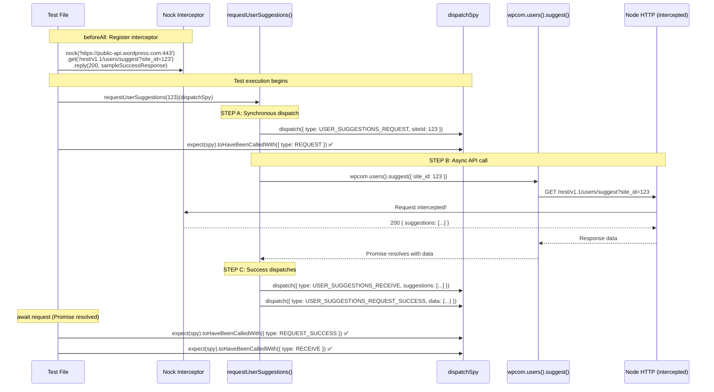
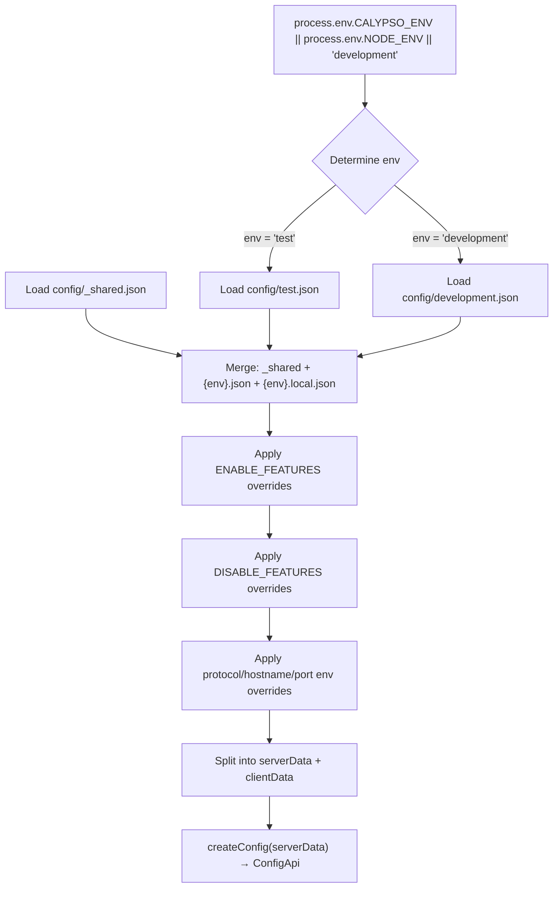

# Calypso Testing Infrastructure: An Evidence-Based Investigation

> **Branch:** `wp-calypso_be7e5cc64162`
> **Methodology:** Every claim in this document is based on source code analysis. No assumptions are made. File paths and line numbers reference actual repository files.

---

## Table of Contents

1. [Development Server Verification](#1-development-server-verification)
2. [Test Environment Anatomy](#2-test-environment-anatomy)
3. [Network Isolation During Tests](#3-network-isolation-during-tests)
4. [API Mock Trace: Action Creator Test Walkthrough](#4-api-mock-trace-action-creator-test-walkthrough)
5. [Configuration and Feature Flag Divergence](#5-configuration-and-feature-flag-divergence)
6. [Summary: Test Environment vs. Development at a Glance](#6-summary-test-environment-vs-development-at-a-glance)

---

## 1. Development Server Verification

### 1.1 Boot Command and Expected Process

The development server is started via the root `package.json` `start` script:

```bash
yarn start
```

This command expands to the following pipeline:

```
npx check-node-version --package && node bin/welcome.js && yarn run build && yarn run start-build
```

> Source: `package.json` — `scripts.start`

**What this does, step by step:**

1. **`npx check-node-version --package`** — Reads the `engines` field from `package.json` and verifies the current Node.js and Yarn versions match. The required versions are:
   - Node.js: `^v22.9.0`
   - Yarn: `^4.0.0`

   > Source: `package.json` — `engines` field

2. **`node bin/welcome.js`** — Prints a welcome message with diagnostic info.

3. **`yarn run build`** — Executes the full build pipeline:
   ```
   ./bin/build-packages-if-needed.sh && yarn run build-static && yarn run build-css && \
   run-p -s 'build-devdocs:*' && run-p -s build-server build-client-if-prod
   ```
   This pre-builds monorepo packages, generates static assets, compiles CSS, builds devdocs, and runs server + client builds.

   > Source: `package.json` — `scripts.build`

4. **`yarn run start-build`** — Starts the Node.js server serving the compiled client and SSR pages.

### 1.2 How the Dev Server Resolves Configuration

When the server boots, it loads configuration through `client/server/config/index.js`:

```js
const configPath = require( 'path' ).resolve( __dirname, '..', '..', '..', 'config' );
const { default: createConfig } = require( '@automattic/create-calypso-config' );
const parser = require( './parser' );

const { serverData, clientData } = parser( configPath, {
    env: process.env.CALYPSO_ENV || process.env.NODE_ENV || 'development',
    enabledFeatures: process.env.ENABLE_FEATURES,
    disabledFeatures: process.env.DISABLE_FEATURES,
} );

module.exports = createConfig( serverData );
module.exports.clientData = clientData;
```

> Source: `client/server/config/index.js:1-12`

**Key observation:** The environment defaults to `'development'` when neither `CALYPSO_ENV` nor `NODE_ENV` is set. This means the dev server reads `config/development.json`, which has `env_id: "development"`.

**Thinking / Rationale:**
The env selection uses a fallback chain: `CALYPSO_ENV` → `NODE_ENV` → `'development'`. During normal `yarn start`, `NODE_ENV` is typically `'development'`, so the parser loads `config/_shared.json`, then `config/development.json`, then optionally `config/development.local.json`. This layered approach lets developers override individual values without modifying tracked files.

---

## 2. Test Environment Anatomy

### 2.1 How Jest Boots the Test Environment (Jest Config Chain)

Calypso maintains separate Jest configurations for different test suites. Each config inherits from a shared preset.

**The inheritance chain:**

```
@automattic/calypso-jest (packages/calypso-jest/jest-preset.js)
    ↓ spread via ...base
test/client/jest.config.js    (client unit + component tests)
test/server/jest.config.js    (server unit tests)
test/packages/jest-preset.js  (monorepo package tests)
test/apps/jest-preset.js      (app tests)
test/integration/jest.config.js (integration tests — standalone, no preset)
```

**Test commands and their configs:**

| Command | Config File | Root Dir |
|---------|------------|----------|
| `yarn test-client` | `test/client/jest.config.js` | `client/` |
| `yarn test-server` | `test/server/jest.config.js` | `client/server/` |
| `yarn test-packages` | `test/packages/jest.config.js` → per-package | per-package |
| `yarn test-integration` | `test/integration/jest.config.js` | repo root |

> Source: `package.json` — `scripts.test-client`, `scripts.test-server`, `scripts.test-packages`

### 2.2 Shared Preset: `@automattic/calypso-jest`

The shared Jest preset (`packages/calypso-jest/jest-preset.js`) establishes the baseline configuration for all suites:

```js
const { defaults } = require( 'jest-config' );

module.exports = {
    resolver: require.resolve( './src/module-resolver.js' ),
    setupFilesAfterEnv: [ require.resolve( './src/setup.js' ) ],
    testEnvironment: 'node',
    testMatch: [ '<rootDir>/**/test/*.[jt]s?(x)', '!**/.eslintrc.*' ],
    transform: {
        '\\.[jt]sx?$': [ 'babel-jest', { rootMode: 'upward' } ],
        '\\.(gif|jpg|jpeg|png|svg|scss|sass|css)$': require.resolve( './src/asset-transform.js' ),
    },
    testPathIgnorePatterns: [ ...defaults.testPathIgnorePatterns, '/dist/' ],
    verbose: false,
    snapshotFormat: {
        escapeString: true,
        printBasicPrototype: true,
    },
};
```

> Source: `packages/calypso-jest/jest-preset.js:1-23`

**What this provides to all suites:**

| Setting | Value | Purpose |
|---------|-------|---------|
| `resolver` | Custom `enhanced-resolve` based | Resolves `calypso:src` field in package.json for monorepo packages |
| `setupFilesAfterEnv` | `packages/calypso-jest/src/setup.js` | Injects `global.CSS.supports` mock |
| `testEnvironment` | `node` | Default environment (suites override to `jsdom` as needed) |
| `transform` | `babel-jest` + asset transform | Transpiles JS/TS via Babel; replaces images/CSS with filenames |
| `testMatch` | `**/test/*.[jt]s?(x)` | Auto-discovers test files in `test/` subdirectories |

**The shared `setup.js` file:**

```js
// packages/calypso-jest/src/setup.js
global.CSS = {
    supports: jest.fn(),
};
```

> Source: `packages/calypso-jest/src/setup.js:1-4`

**Thinking / Rationale:**
This minimal shared setup exists because `@wordpress/components` calls `CSS.supports()` in module-level code. JSDOM doesn't provide `CSS.supports`, so it must be stubbed globally for any test that transitively imports Gutenberg components. This is the *only* global injected by the shared preset — all other globals are suite-specific.

### 2.3 Client Test Setup vs. Server Test Setup vs. Packages Setup

Each suite adds its own setup on top of the shared preset. The differences are significant and reveal what each environment needs.

#### Client Test Setup (`test/client/setup-test-framework.js`)

This is the most extensive setup file, installing 14+ globals and mocks:

```js
import '@testing-library/jest-dom';                          // Line 1

const nodeCrypto = require( 'node:crypto' );                 // Line 3
const { ReadableStream, TransformStream } = require( 'node:stream/web' ); // Line 4
const { TextEncoder, TextDecoder } = require( 'util' );      // Line 5
const nock = require( 'nock' );                               // Line 6

nock.disableNetConnect();                                     // Line 9

beforeAll( () => {                                            // Lines 11-16
    if ( ! nock.isActive() ) {
        nock.activate();
    }
} );

afterAll( () => {                                             // Lines 18-22
    nock.restore();
    nock.cleanAll();
} );

global.TextEncoder = TextEncoder;                             // Line 25
global.TextDecoder = TextDecoder;                             // Line 26
global.CSS = { supports: jest.fn() };                         // Lines 30-32
global.ResizeObserver = require( 'resize-observer-polyfill' );// Line 34
global.fetch = jest.fn( () => Promise.resolve( {              // Lines 36-40
    json: () => Promise.resolve(),
} ) );
jest.mock( 'wpcom-proxy-request', () => ( { /*...*/ } ) );   // Lines 44-49
global.crypto.randomUUID = () => nodeCrypto.randomUUID();     // Line 52
global.matchMedia = jest.fn( ( query ) => ( { /*...*/ } ) );  // Lines 54-63
global.ReadableStream = ReadableStream;                       // Line 66
global.TransformStream = TransformStream;                     // Line 67
global.Worker = require( 'worker_threads' ).Worker;           // Line 68
global.structuredClone = ( obj ) => JSON.parse( JSON.stringify( obj ) ); // Lines 71-73
global.crypto.subtle = nodeCrypto.subtle;                     // Lines 76-79
```

> Source: `test/client/setup-test-framework.js:1-79`

Additionally, the client Jest config (`test/client/jest.config.js`) adds:

```js
setupFiles: [ 'jest-canvas-mock' ],        // Line 20 — mocks Canvas API before tests
globals: {
    google: {},                             // Line 23 — Google Maps API stub
    __i18n_text_domain__: 'default',        // Line 24 — i18n text domain
},
testEnvironmentOptions: {
    url: 'https://example.com',             // Line 18 — JSDOM base URL
},
```

> Source: `test/client/jest.config.js:17-25`

**Note:** The client config does NOT explicitly set `testEnvironment: 'jsdom'`. However, it uses the default `jsdom` environment inherited from `jest-canvas-mock`'s requirements and the JSDOM-specific setup it provides. The `testEnvironmentOptions.url` confirms JSDOM is the intended environment.

#### Server Test Setup (`test/server/setup-test-framework.js`)

The server setup is dramatically simpler — only network isolation and the wpcom-proxy mock:

```js
import * as nock from 'nock';

nock.disableNetConnect();

beforeAll( () => {
    if ( ! nock.isActive() ) {
        nock.activate();
    }
} );

afterAll( () => {
    nock.restore();
    nock.cleanAll();
} );

jest.mock( 'wpcom-proxy-request', () => ( {
    __esModule: true,
} ) );
```

> Source: `test/server/setup-test-framework.js:1-23`

**Key differences from client setup:**
- No `@testing-library/jest-dom` (no DOM assertions needed)
- No `global.fetch` mock (server code uses `wpcom-xhr-request`, not browser fetch)
- No `global.matchMedia` / `ResizeObserver` / `ReadableStream` (no browser APIs)
- No `TextEncoder` / `TextDecoder` globals (available natively in Node.js)
- No `jest-canvas-mock` (no HTML Canvas)
- The `wpcom-proxy-request` mock is a minimal `{ __esModule: true }` stub, not a full function mock

**Thinking / Rationale:**
Server-side tests run in a Node.js environment. They don't need browser API polyfills because Node.js already provides `TextEncoder`, `crypto`, etc. The only shared concern is network isolation (nock) and mocking the browser-only `wpcom-proxy-request` module so server-side code that conditionally imports it doesn't crash.

#### Packages Test Setup (`test/packages/setup.js`)

```js
import '@testing-library/jest-dom';

global.crypto.randomUUID = () => 'fake-uuid';
global.ResizeObserver = require( 'resize-observer-polyfill' );
global.matchMedia = jest.fn( ( query ) => ( {
    matches: false,
    media: query,
    onchange: null,
    addListener: jest.fn(),
    removeListener: jest.fn(),
    addEventListener: jest.fn(),
    removeEventListener: jest.fn(),
    dispatchEvent: jest.fn(),
} ) );
```

> Source: `test/packages/setup.js:1-16`

**Key differences from client setup:**
- **No nock** — packages tests do NOT disable network connections
- **No `global.fetch` mock** — packages can use real fetch
- **No `wpcom-proxy-request` mock** — packages don't depend on it
- **Deterministic UUID** — `crypto.randomUUID` returns `'fake-uuid'` always (client setup uses real `nodeCrypto.randomUUID()`)
- **No `ReadableStream`/`TransformStream`/`Worker`/`structuredClone`/`crypto.subtle`** — packages don't use `@wp-playground/client`

**Thinking / Rationale:**
Packages are self-contained libraries that should be testable without the full Calypso infrastructure. They don't need network isolation because they shouldn't be making HTTP calls in the first place. The deterministic UUID (`'fake-uuid'`) ensures snapshot stability.

#### Apps Test Setup (`test/apps/jest-preset.js`)

```js
module.exports = {
    ...base,
    testEnvironment: 'jsdom',
    transformIgnorePatterns: [
        'node_modules[\\/\\\\](?!.*\\.(?:gif|jpg|jpeg|png|svg|scss|sass|css)$)',
    ],
    setupFiles: [ 'jest-canvas-mock' ],
    // This includes a lot of globals that don't exist, like fetch, matchMedia, etc.
    setupFilesAfterEnv: [ require.resolve( '../client/setup-test-framework.js' ) ],
};
```

> Source: `test/apps/jest-preset.js:1-14`

**Key observation:** Apps tests *reuse* the client setup file entirely. The code comment on line 12 explicitly acknowledges this: "This includes a lot of globals that don't exist, like fetch, matchMedia, etc." This means apps get the same full browser-simulation environment as client tests.

### 2.4 Complete Catalog: Test-Only Globals, Polyfills, and Environment Variables

The following table catalogs every global, polyfill, mock, and environment variable that exists **only during test execution**, cross-referenced by which test suite installs them:

#### Test-Only Globals

| Global | Value / Mock | Client | Server | Packages | Why It Exists |
|--------|-------------|--------|--------|----------|---------------|
| `global.CSS` | `{ supports: jest.fn() }` | ✅ (shared preset) | ✅ (shared preset) | ✅ (shared preset) | `@wordpress/components` calls `CSS.supports()` |
| `global.fetch` | `jest.fn()` → resolves `{ json: () => Promise.resolve() }` | ✅ | ❌ | ❌ | Browser Fetch API doesn't exist in JSDOM |
| `global.TextEncoder` | Node.js `util.TextEncoder` | ✅ | ❌ | ❌ | Needed by `ReactDOMServer` in JSDOM |
| `global.TextDecoder` | Node.js `util.TextDecoder` | ✅ | ❌ | ❌ | Needed by `ReactDOMServer` in JSDOM |
| `global.ResizeObserver` | `resize-observer-polyfill` | ✅ | ❌ | ✅ | JSDOM doesn't implement `ResizeObserver` |
| `global.matchMedia` | `jest.fn()` → returns `MediaQueryList` stub | ✅ | ❌ | ✅ | JSDOM doesn't implement `matchMedia` |
| `global.crypto.randomUUID` | `nodeCrypto.randomUUID()` | ✅ | ❌ | ✅ (`'fake-uuid'`) | JSDOM's `crypto` lacks `randomUUID` |
| `global.crypto.subtle` | `nodeCrypto.subtle` | ✅ | ❌ | ❌ | Used by `@wp-playground/client` |
| `global.ReadableStream` | Node.js `stream/web` | ✅ | ❌ | ❌ | Used by `@wp-playground/client` |
| `global.TransformStream` | Node.js `stream/web` | ✅ | ❌ | ❌ | Used by `@wp-playground/client` |
| `global.Worker` | Node.js `worker_threads.Worker` | ✅ | ❌ | ❌ | Used by `@wp-playground/client` |
| `global.structuredClone` | `JSON.parse(JSON.stringify(obj))` | ✅ (if missing) | ❌ | ❌ | Used by `@wp-playground/client` |

> Sources: `test/client/setup-test-framework.js:25-79`, `test/packages/setup.js:1-16`, `packages/calypso-jest/src/setup.js:1-4`

#### Test-Only Jest Globals (via `jest.config.js`)

| Global | Value | Suite | Source |
|--------|-------|-------|--------|
| `google` | `{}` | Client | `test/client/jest.config.js:23` |
| `__i18n_text_domain__` | `'default'` | Client, Packages | `test/client/jest.config.js:24`, `test/packages/jest-preset.js:12` |

#### Test-Only Module Mocks

| Module | Mock Value | Client | Server | Source |
|--------|-----------|--------|--------|--------|
| `wpcom-proxy-request` | `{ canAccessWpcomApis, reloadProxy, requestAllBlogsAccess }` as `jest.fn()` | ✅ | ✅ (minimal) | `test/client/setup-test-framework.js:44-49`, `test/server/setup-test-framework.js:21-23` |
| `jest-canvas-mock` | Full Canvas API mock | ✅ | ❌ | `test/client/jest.config.js:20` |

#### Test-Only Setup Libraries

| Library | Purpose | Client | Server | Packages |
|---------|---------|--------|--------|----------|
| `@testing-library/jest-dom` | Extended DOM matchers (`.toBeInTheDocument()`, etc.) | ✅ | ❌ | ✅ |
| `nock` | HTTP interception and network isolation | ✅ | ✅ | ❌ |

#### Environment Variables Relevant to Tests

| Variable | Effect in Tests | Source |
|----------|----------------|--------|
| `NODE_ENV` | When `'test'`, the config parser loads `config/test.json` | `client/server/config/index.js:6` |
| `CALYPSO_ENV` | Overrides `NODE_ENV` for config selection | `client/server/config/index.js:6` |
| `TZ=UTC` | Enforced in `test-client` script for deterministic date handling | `package.json` scripts |
| `ENABLE_FEATURES` | Comma-separated list of features to force-enable | `client/server/config/index.js:8` |
| `DISABLE_FEATURES` | Comma-separated list of features to force-disable | `client/server/config/index.js:9` |
| `ACTIVE_FEATURE_FLAGS` | Comma-separated list checked at runtime by `isEnabled()` | `packages/create-calypso-config/src/index.ts:75-83` |

---

## 3. Network Isolation During Tests

### 3.1 `nock.disableNetConnect()` Enforcement

Both the client and server test setups disable all outgoing network connections at the module level — meaning the disable happens before any test file runs:

**Client setup:**
```js
const nock = require( 'nock' );
// Disables all network requests for all tests.
nock.disableNetConnect();
```
> Source: `test/client/setup-test-framework.js:6,9`

**Server setup:**
```js
import * as nock from 'nock';
// Disables all network requests for all tests.
nock.disableNetConnect();
```
> Source: `test/server/setup-test-framework.js:1,4`

**What `nock.disableNetConnect()` does:**
Nock is an HTTP interceptor for Node.js. When `disableNetConnect()` is called, it monkey-patches Node.js's `http.ClientRequest` so that any outgoing HTTP/HTTPS request that doesn't match a registered nock interceptor will **throw an error** instead of reaching the network.

**What happens when code tries to make a real network request:**
If test code (or code under test) attempts an HTTP request that has no nock interceptor registered, nock throws a `NetConnectNotAllowedError` with a message like:

```
Nock: Disallowed net connect for "api.example.com:443/some/path"
```

This causes the test to fail immediately with an unhandled error, making it obvious that the test needs a mock.

**Thinking / Rationale:**
Network isolation is critical for test reliability and speed. Without it, tests would depend on external services being available, making them flaky and slow. By failing hard when an unmocked request is attempted, nock forces developers to explicitly declare every HTTP interaction their code makes.

### 3.2 Lifecycle Hooks: `beforeAll` / `afterAll`

Both client and server setups use identical lifecycle hooks to manage nock state:

```js
beforeAll( () => {
    // reactivate nock on test start
    if ( ! nock.isActive() ) {
        nock.activate();
    }
} );

afterAll( () => {
    // helps clean up nock after each test run and avoid memory leaks
    nock.restore();
    nock.cleanAll();
} );
```

> Source: `test/client/setup-test-framework.js:11-22`, `test/server/setup-test-framework.js:6-17`

**What these hooks do and why:**

| Hook | Function | Purpose |
|------|----------|---------|
| `beforeAll → nock.activate()` | Re-enables nock's HTTP interceptor if it was previously deactivated | Ensures nock is active at the start of each test file's `describe` block |
| `afterAll → nock.restore()` | Removes nock's monkey-patch from `http.ClientRequest` | Prevents state leakage between test files; restores Node.js's real HTTP behavior |
| `afterAll → nock.cleanAll()` | Removes all registered interceptors | Prevents one test file's nock setup from affecting the next file |

**Thinking / Rationale:**
Because `setupFilesAfterEnv` runs once per test file, these hooks ensure a clean nock state for every test file. The `beforeAll`/`afterAll` at the setup-framework level wraps around every `describe` block in the file. This pattern means:
- Each test file starts with nock active and no interceptors registered
- Each test file ends with nock cleaned up
- No interceptors leak between files

### 3.3 `wpcom-proxy-request` Mock

Both client and server setups mock the `wpcom-proxy-request` module, but with different levels of detail:

**Client mock (full):**
```js
jest.mock( 'wpcom-proxy-request', () => ( {
    __esModule: true,
    canAccessWpcomApis: jest.fn(),
    reloadProxy: jest.fn(),
    requestAllBlogsAccess: jest.fn(),
} ) );
```
> Source: `test/client/setup-test-framework.js:44-49`

**Server mock (minimal):**
```js
jest.mock( 'wpcom-proxy-request', () => ( {
    __esModule: true,
} ) );
```
> Source: `test/server/setup-test-framework.js:21-23`

**Why this mock exists:**
The `wpcom-proxy-request` module is the browser-side transport for WordPress.com API calls. It uses `postMessage` to communicate with an iframe proxy at `public-api.wordpress.com`. In a test environment (JSDOM or Node.js), there's no iframe proxy available, and the module tries to access `document` at import time. The mock prevents this from crashing tests.

The client mock provides stub functions (`canAccessWpcomApis`, `reloadProxy`, `requestAllBlogsAccess`) because client-side code may import and call them. The server mock only needs `{ __esModule: true }` because server code doesn't use these browser-specific functions.

**Thinking / Rationale:**
The code comment on line 42-43 of the client setup explains this: "Don't need to mock specific functions for any tests, but mocking module because it accesses the `document` global." Even though individual tests don't assert against these mocks, the module must be mocked to prevent a crash.

### 3.4 Global Fetch Mock

Only the client setup mocks `global.fetch`:

```js
global.fetch = jest.fn( () =>
    Promise.resolve( {
        json: () => Promise.resolve(),
    } )
);
```

> Source: `test/client/setup-test-framework.js:36-40`

**What this does:**
It replaces the browser's Fetch API with a Jest mock function that:
1. Always resolves (never rejects)
2. Returns a Response-like object with a `.json()` method that also resolves with `undefined`

**Implications:**
- Any code calling `fetch()` in client tests will receive an empty successful response by default
- Tests that need specific fetch responses should override this with their own mock or use nock
- The server setup does NOT mock fetch because server-side code uses `wpcom-xhr-request` (Node.js HTTP), not the Fetch API

### 3.5 What Happens When Code Makes a Network Request (Complete Picture)

During client tests, there are **three layers** of network interception:

```
Layer 1: global.fetch → jest.fn() mock
    ↓ (if code uses fetch)
    Returns Promise.resolve({ json: () => Promise.resolve() })

Layer 2: nock → HTTP interceptors
    ↓ (if code uses http/https directly, e.g., via wpcom library)
    Must match a registered nock interceptor, or throws NetConnectNotAllowedError

Layer 3: wpcom-proxy-request → jest.mock
    ↓ (if code imports wpcom-proxy-request)
    Returns mock functions that do nothing
```

During server tests, only layers 2 and 3 apply (no fetch mock).

During packages tests, **none of these layers exist** — packages are expected to not make network calls.

---

## 4. API Mock Trace: Action Creator Test Walkthrough

### 4.1 Test Under Analysis: `user-suggestions/test/actions.js`

This section traces through a real test that mocks an API call, showing exactly how the mocked response flows through the action creator back to the test assertion.

**File:** `client/state/user-suggestions/test/actions.js`

> Source: `client/state/user-suggestions/test/actions.js:1-57`

### 4.2 Step 1: Nock Interceptor Setup

```js
// client/state/user-suggestions/test/actions.js:27-31
beforeAll( () => {
    nock( 'https://public-api.wordpress.com:443' )
        .get( '/rest/v1.1/users/suggest?site_id=' + siteId )
        .reply( 200, deepFreeze( sampleSuccessResponse ) );
} );
```

**What this does:**
1. `nock('https://public-api.wordpress.com:443')` — Creates an interceptor scoped to the WordPress.com API domain
2. `.get('/rest/v1.1/users/suggest?site_id=123')` — Matches GET requests to this exact path and query
3. `.reply(200, deepFreeze(sampleSuccessResponse))` — When matched, returns HTTP 200 with the fixture data
4. `deepFreeze()` — Prevents the test from accidentally mutating the fixture object

**The fixture data** (`client/state/user-suggestions/test/sample-response.json`):
```json
{
    "suggestions": [
        { "user_login": "wordpress1" },
        { "user_login": "wordpress2" }
    ]
}
```

> Source: `client/state/user-suggestions/test/sample-response.json:1-8`

**Thinking / Rationale:**
The nock interceptor is set up in `beforeAll`, meaning it's registered once before all tests in the `#requestUserSuggestions` describe block. When the action creator's HTTP request matches this path, nock intercepts it and returns the fixture data instead of hitting the real WordPress.com API. The `deepFreeze` call is defensive programming — if the code under test tried to modify the response, the test would throw, catching mutation bugs early.

### 4.3 Step 2: Thunk Invocation and Dispatch Spy

```js
// client/state/user-suggestions/test/actions.js:33-35
test( 'should dispatch properly when receiving a valid response', async () => {
    const dispatchSpy = jest.fn( ( arg ) => arg );
    const request = requestUserSuggestions( siteId )( dispatchSpy );
```

**What this does:**
1. `jest.fn( (arg) => arg )` — Creates a spy function that records every call and returns its argument (pass-through behavior)
2. `requestUserSuggestions( siteId )` — Calls the action creator, which returns a thunk (function)
3. `( dispatchSpy )` — Manually invokes the thunk, passing the spy as the `dispatch` function

**Why manual thunk invocation?**
Instead of using a Redux store with `redux-thunk` middleware, this test manually calls the thunk with a spy. This isolates the test to just the action creator logic without needing a full Redux store setup.

### 4.4 Step 3: Inside the Action Creator — Request Lifecycle

Now let's trace what happens inside `requestUserSuggestions` when it's called:

```js
// client/state/user-suggestions/actions.js:34-56
export function requestUserSuggestions( siteId ) {
    return ( dispatch ) => {
        // STEP A: Dispatch REQUEST action (synchronous)
        dispatch( {
            type: USER_SUGGESTIONS_REQUEST,
            siteId,
        } );

        // STEP B: Make API call via wpcom library
        return wpcom
            .users()
            .suggest( { site_id: siteId } )
            .then( ( data ) => {
                // STEP C: On success, dispatch RECEIVE and REQUEST_SUCCESS
                dispatch( receiveUserSuggestions( siteId, data.suggestions ) );
                dispatch( {
                    type: USER_SUGGESTIONS_REQUEST_SUCCESS,
                    siteId,
                    data,
                } );
            } )
            .catch( ( error ) =>
                dispatch( {
                    type: USER_SUGGESTIONS_REQUEST_FAILURE,
                    siteId,
                    error,
                } )
            );
    };
}
```

> Source: `client/state/user-suggestions/actions.js:34-56`

**The API call chain:**

The `wpcom` object comes from `calypso/lib/wp`, which in the test environment (via the module resolver and `wpcom-proxy-request` mock) provides a `WPCOM` instance. The call chain is:

```
wpcom.users()           → creates a Users instance
    .suggest({site_id: 123}) → calls this.wpcom.req.get('/users/suggest', {site_id: 123})
```

> Source: `packages/wpcom.js/src/lib/users.js:20-21`

**What `wpcom.req.get` does under the hood:**
It constructs an HTTPS request to `https://public-api.wordpress.com:443/rest/v1.1/users/suggest?site_id=123`. But because nock has intercepted this URL, nock catches the request and returns the fixture data instead.

### 4.5 Step 4: Assertions — Verifying the Dispatch Sequence

```js
// client/state/user-suggestions/test/actions.js:37-54

// Assert STEP A: synchronous REQUEST dispatch
expect( dispatchSpy ).toHaveBeenCalledWith( {
    type: USER_SUGGESTIONS_REQUEST,
    siteId,
} );

// Wait for the async API call to resolve
await request;

// Assert STEP C-1: REQUEST_SUCCESS dispatch
expect( dispatchSpy ).toHaveBeenCalledWith( {
    type: USER_SUGGESTIONS_REQUEST_SUCCESS,
    data: sampleSuccessResponse,
    siteId,
} );

// Assert STEP C-2: RECEIVE dispatch
expect( dispatchSpy ).toHaveBeenCalledWith( {
    type: USER_SUGGESTIONS_RECEIVE,
    suggestions: sampleSuccessResponse.suggestions,
    siteId,
} );
```

> Source: `client/state/user-suggestions/test/actions.js:37-54`

### 4.6 Flow Diagram: Mock → Thunk → Dispatch → Assertion



**Thinking / Rationale:**
This test demonstrates the canonical pattern for testing Redux thunks with external API calls in Calypso:
1. Set up nock interceptor with expected URL and response
2. Create a dispatch spy
3. Invoke the thunk manually with the spy
4. Assert synchronous dispatches immediately
5. `await` the returned promise
6. Assert async dispatches after resolution

The pattern avoids a full Redux store, middleware chain, or real HTTP calls while still verifying the complete action lifecycle.

### 4.7 The `useNock` Helper (Deprecated Alternative)

Some older tests use the `useNock` helper instead of direct nock calls:

```js
// client/test-helpers/use-nock/index.js
export const useNock = ( setupCallback ) => {
    if ( setupCallback ) {
        beforeAll( () => setupCallback( nock ) );
    }
    afterAll( () => {
        log( 'Cleaning up nock' );
        nock.cleanAll();
    } );
};
```

> Source: `client/test-helpers/use-nock/index.js:12-20`

**This helper is explicitly deprecated** (line 10: `@deprecated Use nock directly instead.`). It wraps nock's `beforeAll` / `afterAll` lifecycle but doesn't add meaningful functionality. New tests should use nock directly, as the `user-suggestions` test does.

---

## 5. Configuration and Feature Flag Divergence

### 5.1 How Config Resolution Works (`parser.js` + `index.js`)

The configuration system uses a **layered merge** strategy:



**The parser** (`client/server/config/parser.js`) loads configuration files in order:

```js
// client/server/config/parser.js:31-35
const configFiles = [
    path.resolve( configPath, '_shared.json' ),      // 1. Base defaults
    path.resolve( configPath, opts.env + '.json' ),   // 2. Environment-specific
    path.resolve( configPath, opts.env + '.local.json' ), // 3. Local overrides (gitignored)
];
```

> Source: `client/server/config/parser.js:31-35`

The merge uses Lodash's `assignWith` with special handling for the `features` key:

```js
// client/server/config/parser.js:42-47
configFiles.forEach( function ( file ) {
    assignWith( data, getDataFromFile( file ), ( objValue, srcValue, key ) =>
        key === 'features' ? { ...objValue, ...srcValue } : undefined
    );
} );
```

> Source: `client/server/config/parser.js:42-47`

**Thinking / Rationale:**
For most keys, later files completely override earlier values (standard `Object.assign` behavior). But for `features`, the merge is *additive* — features from `_shared.json` persist unless explicitly overridden by the environment file. This means `config/test.json` only needs to list features that differ from the shared defaults, and all other shared features carry through.

### 5.2 `moduleNameMapper`: How Tests See `config/test.json`

The critical link between "running tests" and "loading test.json" is the Jest `moduleNameMapper` in each test config:

**Client tests:**
```js
// test/client/jest.config.js:10-13
moduleNameMapper: {
    '^@automattic/calypso-config$': '<rootDir>/server/config/index.js',
    'react-markdown': '<rootDir>/node_modules/react-markdown/react-markdown.min.js',
},
```

> Source: `test/client/jest.config.js:10-13`

**Server tests:**
```js
// test/server/jest.config.js:9-12
moduleNameMapper: {
    '^@automattic/calypso-config$': 'calypso/server/config',
    '^@automattic/calypso-config/(.*)$': 'calypso/server/config/$1',
},
```

> Source: `test/server/jest.config.js:9-12`

**Integration tests:**
```js
// test/integration/jest.config.js:2-4
moduleNameMapper: {
    '^@automattic/calypso-config$': '<rootDir>/client/server/config/index.js',
},
```

> Source: `test/integration/jest.config.js:2-4`

**What this means:**
When any test file does `import config from '@automattic/calypso-config'`, Jest doesn't load the browser-side package (`packages/calypso-config/src/index.ts`, which reads from `window.configData`). Instead, it loads `client/server/config/index.js`, which:
1. Reads `process.env.CALYPSO_ENV || process.env.NODE_ENV || 'development'`
2. Passes that env to the parser
3. The parser loads `config/_shared.json` + `config/{env}.json`

When Jest runs, `NODE_ENV` is set to `'test'` by Jest itself. Therefore, the parser loads `config/test.json`.

**Thinking / Rationale:**
This is a clever architecture. In the browser, `@automattic/calypso-config` reads from `window.configData` (which was injected by the server into the HTML payload). In tests, the `moduleNameMapper` redirects to the server-side config loader, which reads directly from the JSON files. The bridge that makes it "test" instead of "development" is simply `NODE_ENV=test`, which Jest sets automatically.

The browser-side package (`packages/calypso-config/src/index.ts`) would throw an error in tests because it checks for `typeof window` and `window.configData`, neither of which exist in a Node.js test environment. The moduleNameMapper elegantly avoids this problem.

### 5.3 Side-by-Side Proof: Test vs. Development Values

Here is concrete evidence that tests and development resolve different configuration:

#### Top-Level Key Differences

| Key | `test.json` | `development.json` |
|-----|-------------|---------------------|
| `env_id` | `"test"` | `"development"` |
| `favicon_url` | *(not set, inherits from _shared.json)* | `"/calypso/images/favicons/favicon-development.ico"` |
| `google_recaptcha_site_key` | `""` (empty string) | *(not set, inherits from _shared.json `false`)* |
| `dsp_stripe_pub_key` | *(not set)* | `"pk_live_51LYYzQ..."` |
| `dsp_widget_js_src` | *(not set)* | `"https://dsp.wp.com/widget.js"` |
| `blaze_pro_back_link` | *(not set)* | `"http://blaze.pro:3005/app"` |
| `zendesk_presales_chat_key` | *(not set)* | `"beefd4ad-db79-..."` |
| `zendesk_support_chat_key` | *(not set)* | `"715f17a8-4a28-..."` |

> Sources: `config/test.json`, `config/development.json`

**Proof:** The test environment has `env_id: "test"` while development has `env_id: "development"`. A test calling `config('env_id')` gets `"test"`, while the dev server gets `"development"`.

### 5.4 Feature Flag Divergence Table

The following feature flags have **different boolean values** between test and development:

| Feature Flag | `test.json` | `development.json` | Impact |
|-------------|-------------|---------------------|--------|
| `checkout/checkout-version` | `false` | `true` | Checkout V2 disabled in tests |
| `google-my-business` | `false` | `true` | GMB features disabled in tests |
| `individual-subscriber-stats` | `false` | `true` | Subscriber stats disabled in tests |
| `jetpack/sharing-buttons-block-enabled` | `false` | `true` | Sharing block disabled in tests |
| `lasagna` | `false` | `true` | WebSocket features disabled in tests |
| `launchpad-updates` | `false` | `true` | Launchpad disabled in tests |
| `post-list/qr-code-link` | `false` | `true` | QR code links disabled in tests |
| `redirect-fallback-browsers` | `true` | `false` | Browser redirect enabled in tests only |
| `rum-tracking/logstash` | `false` | `true` | RUM tracking disabled in tests |
| `ssr/prefetch-timebox` | `true` | `false` | SSR prefetch enabled in tests only |

> Source: Programmatic comparison of `config/test.json` features vs. `config/development.json` features

Additionally, **82 feature flags exist only in `development.json`** (not in `test.json`). These include developer tools like `dev/auth-helper`, `dev/features-helper`, `dev/react-query-devtools`, and integration features like `jetpack/ai-assistant-request-limit`, `push-notifications`, etc.

**5 feature flags exist only in `test.json`** (not in `development.json`):
- `catch-js-errors: false`
- `difm/allow-extra-pages: false`
- `jetpack-social/advanced-plan: false`
- `layout/site-level-user-profile: true`
- `p2-enabled: false`

**Thinking / Rationale:**
The test config intentionally disables features that have external side effects (analytics, WebSocket connections, tracking) because those would either fail in isolation or produce noise. Features that are test-only (like `catch-js-errors: false`) are defensive — they ensure error-catching infrastructure doesn't interfere with Jest's error handling.

### 5.5 How Tests Control What Config Returns

There are three mechanisms for controlling config in tests, used for different scenarios:

#### Mechanism 1: `jest.mock('@automattic/calypso-config')` with Auto-Mock

```js
// Example: client/lib/analytics/test/statsd-utils.js:5
jest.mock( '@automattic/calypso-config' );

// Later in tests:
config.mockReturnValue( 'development' );  // Controls what config('key') returns
```

> Source: `client/lib/analytics/test/statsd-utils.js:5,11`

**When to use:** When you need to control the return value of `config(key)` for specific test scenarios. The auto-mock replaces the entire config module with Jest mock functions.

#### Mechanism 2: `jest.mock('@automattic/calypso-config', () => factory)` with Factory

```js
// Example: client/lib/logmein/test/index.js:14-18
jest.mock( '@automattic/calypso-config', () => {
    const fn = () => '';
    fn.isEnabled = jest.fn( () => true );
    return fn;
} );

// Later in tests:
config.isEnabled.mockImplementation( () => true );
```

> Source: `client/lib/logmein/test/index.js:14-18`

**When to use:** When you need `config()` to be callable as a function AND need `config.isEnabled()` to be independently controllable. The factory creates a custom mock where both the default export (a function) and its `isEnabled` method are separately mockable.

#### Mechanism 3: Environment Variable Override (`ACTIVE_FEATURE_FLAGS`)

```js
// packages/create-calypso-config/src/index.ts:72-83
const isEnabled =
    ( data: ConfigData ) =>
    ( feature: string ): boolean => {
        if (
            typeof process !== 'undefined' &&
            process?.env?.ACTIVE_FEATURE_FLAGS &&
            typeof process.env.ACTIVE_FEATURE_FLAGS === 'string'
        ) {
            const env_active_feature_flags = process.env.ACTIVE_FEATURE_FLAGS?.split( ',' );
            if ( env_active_feature_flags.includes( feature ) ) {
                return true;
            }
        }
        return ( data.features && !! data.features[ feature ] ) || false;
    };
```

> Source: `packages/create-calypso-config/src/index.ts:69-86`

**When to use:** When you want to force-enable specific feature flags without mocking the entire config module. Set `process.env.ACTIVE_FEATURE_FLAGS = 'my-feature,other-feature'` and `config.isEnabled('my-feature')` will return `true` regardless of what `config/test.json` says.

#### Mechanism 4: `ENABLE_FEATURES` / `DISABLE_FEATURES` (at parser level)

```js
// client/server/config/parser.js:49-57
if ( data.hasOwnProperty( 'features' ) ) {
    enabledFeatures.forEach( function ( feature ) {
        data.features[ feature ] = true;
    } );
    disabledFeatures.forEach( function ( feature ) {
        data.features[ feature ] = false;
    } );
}
```

> Source: `client/server/config/parser.js:49-57`

These are read from:
```js
// client/server/config/index.js:8-9
enabledFeatures: process.env.ENABLE_FEATURES,
disabledFeatures: process.env.DISABLE_FEATURES,
```

> Source: `client/server/config/index.js:8-9`

**When to use:** When you want to override feature flags at the config-loading level, before `createConfig` is called. This affects all code that uses the real config module (not mocked). Typically used for development builds (`ENABLE_FEATURES=some/flag yarn start`) rather than in test files.

---

## 6. Summary: Test Environment vs. Development at a Glance

| Aspect | Development Server | Client Tests | Server Tests | Packages Tests |
|--------|-------------------|--------------|--------------|----------------|
| **Runtime** | Node.js server + browser client | Jest + JSDOM | Jest + Node.js | Jest + Node.js |
| **Config file** | `config/development.json` | `config/test.json` | `config/test.json` | *(none — packages don't use calypso-config)* |
| **Config loaded via** | `client/server/config/index.js` (server) → `window.configData` (client) | `moduleNameMapper` → `client/server/config/index.js` | `moduleNameMapper` → `client/server/config/index.js` | N/A |
| **`env_id`** | `"development"` | `"test"` | `"test"` | N/A |
| **Network** | Real HTTP | **Blocked** (nock) | **Blocked** (nock) | Unrestricted |
| **`fetch`** | Browser native | `jest.fn()` mock | Not mocked | Not mocked |
| **`wpcom-proxy-request`** | Real iframe proxy | Full mock (3 fns) | Minimal mock | Not mocked |
| **`matchMedia`** | Browser native | `jest.fn()` mock | Not available | `jest.fn()` mock |
| **`ResizeObserver`** | Browser native | Polyfill | Not available | Polyfill |
| **`Canvas`** | Browser native | `jest-canvas-mock` | Not available | Not available |
| **`crypto.randomUUID`** | Browser native | `nodeCrypto.randomUUID()` | Native Node.js | `'fake-uuid'` |
| **`ReadableStream`** | Browser native | Node.js polyfill | Native Node.js | Not mocked |
| **`google` global** | Google Maps SDK | `{}` stub | Not set | Not set |
| **Feature flags** | 167+ flags from `development.json` | 102 flags from `test.json` | Same as client tests | N/A |
| **Dev-only features** | `dev/*` helpers, `logmein`, `push-notifications`, etc. | ❌ Not available | ❌ Not available | N/A |
| **DOM assertions** | N/A | `@testing-library/jest-dom` | ❌ Not available | `@testing-library/jest-dom` |

### Key Takeaways

1. **The test environment is intentionally minimal.** It provides just enough browser simulation for code to execute without crashing, but intentionally omits real network access, analytics, and external service integrations.

2. **Network isolation is enforced, not optional.** Both client and server tests call `nock.disableNetConnect()` at the framework level. Any unmocked HTTP request causes an immediate test failure. This is deliberate — it forces tests to explicitly declare their external dependencies.

3. **Configuration divergence is by design.** The test config disables tracking, analytics, WebSocket features, and developer tools. This ensures tests run in a controlled, deterministic environment without side effects.

4. **There are three levels of config control in tests:** (a) the `test.json` file provides default test values, (b) `jest.mock` lets individual tests override the entire config module, and (c) environment variables (`ACTIVE_FEATURE_FLAGS`, `ENABLE_FEATURES`) provide runtime overrides.

5. **The `moduleNameMapper` is the bridge.** It redirects `@automattic/calypso-config` from the browser-side package (which reads `window.configData`) to the server-side loader (which reads JSON files). Combined with Jest setting `NODE_ENV=test`, this ensures tests automatically load `config/test.json`.

---

*This document was generated through read-only investigation of the Calypso monorepo. No repository files were modified.*
