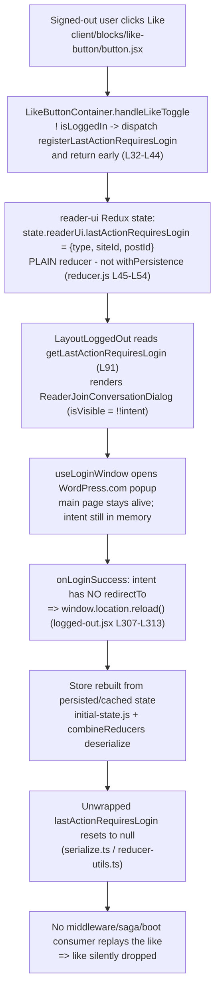

# Logged-Out Reader "Like" Intent Across the Authentication Boundary — Root-Cause Analysis

> **Abstract.** When a signed-out visitor clicks **Like** on a post in the WordPress.com Reader (Calypso), the application records a "this action requires login" intent, prompts the visitor to sign up / log in, and then — once authenticated — the like silently disappears. This document traces that intent's complete lifecycle end-to-end in the source, answers five investigative questions with exact `file:line` citations, and explains _why_ the like is dropped. The conclusion: the intent lives only in **volatile in-memory Redux**, the post-authentication handoff is a **hard page reload**, and **no replay path exists** to re-issue the like after the store is rebuilt.

This analysis is **code-as-truth**: every factual claim below is backed by an exact citation that was re-verified against the source. No behavior is assumed.

## Context

| Fact        | Value                                                                | Source                            |
| ----------- | -------------------------------------------------------------------- | --------------------------------- |
| Repository  | `wp-calypso` (Calypso — WordPress.com's React/Redux single-page app) | —                                 |
| Version     | **18.13.0**                                                          | `package.json` (`version`)        |
| Branch      | **`wp-calypso_be7e5cc64162`**                                        | `git rev-parse --abbrev-ref HEAD` |
| HEAD commit | **`be7e5cc641622d153040491fd5625c6cb83e12eb`**                       | `git log -1`                      |
| HEAD title  | **"Reader: Show login prompts on all logged out reader streams"**    | `git log -1`                      |

The tip commit is directly relevant to this investigation: it **broadens where the logged-out join-conversation prompt appears** — the very surface that captures the `lastActionRequiresLogin` intent analyzed here. As more logged-out Reader streams gain the login prompt, more logged-out interactions funnel into the same non-persisted, never-replayed intent, making the dropped-like behavior more visible.

**Architectural conventions referenced throughout:**

- Calypso is a Yarn monorepo. Reader UI lives under `client/reader/`, shared UI blocks under `client/blocks/`, and Redux domain slices under `client/state/`.
- It uses a dual data model: Redux (90+ slices) plus React Query for newer data fetching.
- **Redux persistence is explicit opt-in.** A child reducer participates in persistence only when it is wrapped in `withPersistence`, and a slice is keyed for storage with `withStorageKey`. The client rehydrates state from cached storage (IndexedDB / localStorage) on boot. This convention is the crux of the root cause and is documented in `docs/data-persistence.md` and `docs/modularized-state.md`.

---

## Overview of the Logged-Out Like Flow

At a high level, the lifecycle of a logged-out like crosses five distinct subsystems:

1. **Capture site** — the shared `LikeButtonContainer` (`client/blocks/like-button/index.jsx`). When the user is not logged in, a click is intercepted here: the container dispatches an action describing the intent and **returns early**, so the actual like never fires.
2. **The `reader-ui` Redux slice** (`client/state/reader-ui/`) — the intent is written to `state.readerUi.lastActionRequiresLogin` as `{ type, siteId, postId }`. This is the **source of truth**, and it is a **plain (non-persisted) reducer**.
3. **The sole consumer** — `client/layout/logged-out.jsx` reads the intent to render a `ReaderJoinConversationDialog`, feed analytics, and decide between a redirect and a reload after login. It **never** re-dispatches the like.
4. **The auth handoff** — `client/data/reader/use-login-window.ts` opens a **popup** WordPress.com login window and listens for a `postMessage`. The main Reader page stays alive during authentication, so the intent is still in memory when login succeeds.
5. **Persistence / rehydration** — on the post-login `window.location.reload()`, the store is rebuilt by deserializing cached state (`client/state/initial-state.js`). Because `lastActionRequiresLogin` is not wrapped in `withPersistence`, it deserializes back to its initial value `null` — the intent is gone, and nothing replays it.

The diagram below summarizes the traced path and the point of failure:



### Key players at a glance

| Role                      | File                                                               | What it does                                                                              |
| ------------------------- | ------------------------------------------------------------------ | ----------------------------------------------------------------------------------------- |
| Click origin              | `client/blocks/like-button/button.jsx`                             | Presentational button; `toggleLiked` invokes the `onLikeToggle` prop                      |
| Capture site              | `client/blocks/like-button/index.jsx`                              | `handleLikeToggle` dispatches the intent and returns early when logged out                |
| Reader wrapper            | `client/reader/like-button/index.jsx`                              | Supplies `onLikeToggle`; its own logged-out redirect is **dead code** in this composition |
| Action creators           | `client/state/reader-ui/actions.js`                                | `registerLastActionRequiresLogin` / `clearLastActionRequiresLogin`                        |
| Storage (source of truth) | `client/state/reader-ui/reducer.js`                                | `lastActionRequiresLogin` **plain** reducer (not persisted)                               |
| Selector                  | `client/state/reader-ui/selectors.js`                              | `getLastActionRequiresLogin`                                                              |
| Sole consumer             | `client/layout/logged-out.jsx`                                     | Renders the dialog; reloads or redirects on login success; never replays the like         |
| Dialog                    | `client/blocks/reader-join-conversation/dialog.jsx`                | Uses the intent only for analytics; invokes `onLoginSuccess`                              |
| Auth handoff              | `client/data/reader/use-login-window.ts`                           | Popup login + `postMessage`; keeps the page alive                                         |
| Persistence utils         | `client/state/utils/{with-persistence,serialize,reducer-utils}.ts` | Define opt-in persistence and the reset-to-initial-state semantics                        |
| Boot rehydration          | `client/state/initial-state.js`                                    | Rebuilds the store from cached state on load                                              |
| Handoff URL               | `client/lib/paths/index.js`                                        | `createAccountUrl` carries only a pathname + ref, never the like                          |

---

## Q1 — Where does the intent go?

**Answer:** The like intent goes into **volatile in-memory Redux**, at `state.readerUi.lastActionRequiresLogin`, as an object `{ type, siteId, postId }`. It is written by the logged-out branch of `handleLikeToggle` in the shared `LikeButtonContainer`.

### The capture chain

1. **The click originates** in the presentational button. `LikeButton.toggleLiked` calls the `onLikeToggle` prop with the toggled state (`client/blocks/like-button/button.jsx:L45-L52`, specifically `this.props.onLikeToggle( ! this.props.liked )` at `L50`).

2. **The shared container intercepts it.** `LikeButtonContainer.handleLikeToggle` begins at `client/blocks/like-button/index.jsx:L32`. Its first statement guards on the logged-out case at `L33` and, when the user is **not** logged in, dispatches the intent and **returns early** (`client/blocks/like-button/index.jsx:L34-L38`):

   ```jsx
   if ( ! this.props.isLoggedIn ) {
   	return this.props.registerLastActionRequiresLogin( {
   		type: liked ? 'like' : 'unlike',
   		siteId: this.props.siteId,
   		postId: this.props.postId,
   	} );
   }
   ```

   The dependencies are wired by `connect`: `isLoggedIn` comes from `isUserLoggedIn( state )` (`client/blocks/like-button/index.jsx:L76`), and `registerLastActionRequiresLogin` is provided through `mapDispatchToProps` alongside `like` / `unlike` (`client/blocks/like-button/index.jsx:L79`; imports at `L6`, `L7`, `L10`).

3. **The action creator** returns a plain action carrying the descriptor (`client/state/reader-ui/actions.js:L26-L29`):

   ```javascript
   export const registerLastActionRequiresLogin = ( lastAction ) => ( {
   	type: READER_REGISTER_LAST_ACTION_REQUIRES_LOGIN,
   	lastAction,
   } );
   ```

4. **The reducer stores it.** The `lastActionRequiresLogin` reducer returns `action.lastAction` on the REGISTER action (`client/state/reader-ui/reducer.js:L47-L48`), placing the `{ type, siteId, postId }` descriptor at `state.readerUi.lastActionRequiresLogin`.

### Why the Reader's own logged-out redirect does _not_ fire (superseded / dead code)

The Reader-specific wrapper `ReaderLikeButton` defines its own `onLikeToggle` (`client/reader/like-button/index.jsx:L34-L50`) containing **two** branches: a logged-in branch that records the like (`if ( this.props.isLoggedIn ) { return this.recordLikeToggle( liked ); }` at `L35-L37`) and a logged-out branch that would redirect to `createAccountUrl` via `window.open` / `navigate` (`client/reader/like-button/index.jsx:L38-L49`). It passes this handler down to the shared container as the `onLikeToggle` prop (`client/reader/like-button/index.jsx:L97-L105`, prop at `L102`) and maps `isLoggedIn` (`L131`).

**Crucially, that logged-out redirect branch is dead in this composition.** The shared `LikeButtonContainer` invokes the `onLikeToggle` prop **only in its logged-in branch** (`client/blocks/like-button/index.jsx:L43`). When the user is logged **out**, the container short-circuits at `client/blocks/like-button/index.jsx:L34` (dispatch + early `return`) and never calls the Reader's `onLikeToggle`. When the user is logged **in**, the Reader's `onLikeToggle` takes its `recordLikeToggle` path at `client/reader/like-button/index.jsx:L35-L37`. Therefore the Reader's `L38-L49` logged-out redirect is **never reached** — the container's capture wins in every case.

### Rationale

This is the true capture point because the early `return` at `client/blocks/like-button/index.jsx:L34` has two consequences for the logged-out path:

- It **suppresses the `like` / `unlike` thunk**, which only runs in the logged-in branch (`client/blocks/like-button/index.jsx:L41-L42`), so no network request is issued.
- It **suppresses the `onLikeToggle` prop**, which only runs at `client/blocks/like-button/index.jsx:L43`, so the Reader wrapper's redirect cannot fire.

The single observable effect of a logged-out click is therefore the dispatch of `registerLastActionRequiresLogin`. The intent's destination is purely **in-memory Redux state** — there is no navigation, no network call, and no persistence at this step.

---

## Q2 — What is meant to bring it back?

**Answer:** **Nothing replays the like.** The intent has exactly one consumer — `client/layout/logged-out.jsx` — and that component uses the stored value only to (a) make a dialog visible, (b) pass data to the dialog for analytics, (c) clean up on dismissal, and (d) choose between a redirect and a reload after login. It **never** calls `like( siteId, postId )`.

### What the sole consumer actually does

`LayoutLoggedOut` reads the intent with a selector (`client/layout/logged-out.jsx:L91`):

```jsx
const loggedInAction = useSelector( getLastActionRequiresLogin );
```

It then renders `ReaderJoinConversationDialog` (only when `! isLoggedIn && ! isReaderTagEmbed`) in the block at `client/layout/logged-out.jsx:L302-L315`. The intent flows into four — and only four — props:

- **Visibility:** `isVisible={ !! loggedInAction }` (`client/layout/logged-out.jsx:L305`) — the dialog appears precisely when an intent is pending.
- **Cleanup on close:** `onClose={ () => clearLastActionRequiresLogin() }` (`client/layout/logged-out.jsx:L304`) — clears the intent if the visitor dismisses the dialog.
- **Analytics (via the dialog):** `loggedInAction={ loggedInAction }` (`client/layout/logged-out.jsx:L306`) — the dialog uses it only for tracking (see below).
- **Redirect-vs-reload decision:** `onLoginSuccess` reads `loggedInAction?.redirectTo` and either navigates or reloads (`client/layout/logged-out.jsx:L307-L313`).

The dialog itself, `ReaderJoinConversationDialog`, destructures `{ onClose, isVisible, loggedInAction, onLoginSuccess }` (`client/blocks/reader-join-conversation/dialog.jsx:L12`) and uses `loggedInAction` **only** to build a `recordTracksEvent` analytics payload with `type` / `blog_id` / `post_id` / `tag` fields (`client/blocks/reader-join-conversation/dialog.jsx:L18-L29`, fields at `L22-L25`). On success it simply forwards to the callback: `handleLoginSuccess` calls `onLoginSuccess()` (`client/blocks/reader-join-conversation/dialog.jsx:L31-L35`, call at `L34`), wired through `useLoginWindow` (`client/blocks/reader-join-conversation/dialog.jsx:L44-L47`). It does **not** replay the like.

### Rationale

A genuine "bring it back" mechanism would, after authentication succeeds, **re-issue the captured action** — for a like, that means re-dispatching `like( siteId, postId )` using the stored descriptor. No such call exists anywhere in the consumer or the dialog (verified by grep: there is no `like(` invocation in either `client/layout/logged-out.jsx` or `client/blocks/reader-join-conversation/dialog.jsx`).

Instead, the only post-login behavior is a navigation choice (`client/layout/logged-out.jsx:L307-L313`). The intent is treated as a _signal that a dialog should be shown and that the user wanted to do something_, not as a _deferred command to be executed_. That distinction is the heart of Q2: the architecture captures the intent but provides no replay actor to consume it as a command.

---

## Q3 — What is the source of truth?

**Answer:** The source of truth is **in-memory Redux** — specifically the `reader-ui` slice. The intent is **not persisted** to localStorage / IndexedDB, and it is **not** carried as a URL / handoff token.

### Evidence that it is in-memory Redux

- The intent is stored by the `lastActionRequiresLogin` reducer and exposed through the slice key `readerUi`. The selector reads `state.readerUi?.lastActionRequiresLogin` (`client/state/reader-ui/selectors.js:L15-L21`, return at `L20`, null-guard at `L17`).
- The slice is registered at the `['readerUi']` key as a side effect (`client/state/reader-ui/init.js:L4`) and exported with a storage key (`export default withStorageKey( 'readerUi', combinedReducer );` at `client/state/reader-ui/reducer.js:L65`).

### Evidence that it is _not_ persisted — the load-bearing asymmetry

Within the very same slice, two sibling reducers make **opposite** persistence choices, and this contrast is the single most telling piece of evidence in the entire analysis:

- `lastPath` **opts into** persistence — it is wrapped in `withPersistence` (`client/state/reader-ui/reducer.js:L19`, block `L19-L28`).
- `lastActionRequiresLogin` is a **plain** reducer — it is **not** wrapped in `withPersistence` (`client/state/reader-ui/reducer.js:L45-L54`):

  ```javascript
  export const lastActionRequiresLogin = ( state = null, action ) => {
  	switch ( action.type ) {
  		case READER_REGISTER_LAST_ACTION_REQUIRES_LOGIN:
  			return action.lastAction;
  		case READER_CLEAR_LAST_ACTION_REQUIRES_LOGIN:
  			return null;
  		default:
  			return state;
  	}
  };
  ```

Both are combined into the slice together (`client/state/reader-ui/reducer.js:L56-L63`; `lastPath` at `L59`, `lastActionRequiresLogin` at `L61`), so the only difference between them is the `withPersistence` wrapper. Because persistence in Calypso is explicit opt-in, `lastPath` survives a reload while `lastActionRequiresLogin` does not.

### Evidence that it is _not_ a URL / handoff token

The signup URL builder `createAccountUrl( { redirectTo, ref } )` returns `` `/start/account?redirect_to=${ redirectTo }&ref=${ ref }` `` (`client/lib/paths/index.js:L24-L26`). It carries only a destination pathname and a referrer tag — never the like descriptor (`siteId`, `postId`, or `type`). So even on the paths that do navigate, the like intent is not smuggled through the URL.

### Rationale

Calypso's persistence model is opt-in by design: the `combineReducers` contract states **"Persistence must be enabled explicitly with the `withPersistence` helper."** (`client/state/utils/reducer-utils.ts:L106`). The repository's own documentation describes the same principle — `docs/data-persistence.md` explains that reducers opt in by wrapping (and "opt-out … combine reducers without any attached schema"), and `docs/modularized-state.md` describes the `withStorageKey` + `init`-module pattern that the `reader-ui` slice follows.

Given that convention, the unwrapped `lastActionRequiresLogin` reducer is, by definition, a memory-only value: it is excluded from what gets serialized to storage and is reset to its initial state on rehydration (the precise mechanism is detailed in Q4). Therefore the only place the intent ever truly "lives" is the running Redux store — making the source of truth in-memory Redux, with no durable backup anywhere.

---

## Q4 — What exact condition causes the replay to skip?

**Answer:** For a like, the stored intent has **no `redirectTo` property**, so the post-login success handler takes the `else` branch and runs **`window.location.reload()`** (`client/layout/logged-out.jsx:L307-L313`, specifically `L310-L312`). That hard reload reinitializes the Redux store, and because `lastActionRequiresLogin` is an unwrapped reducer, it deserializes back to its initial value `null`. After the reload there is no pending intent and no consumer that could replay the like — so the like is silently dropped.

### The exact branch that runs

The success callback wired into the dialog is (`client/layout/logged-out.jsx:L307-L313`):

```jsx
onLoginSuccess={ () => {
    if ( loggedInAction?.redirectTo ) {
        window.location = loggedInAction.redirectTo;
    } else {
        window.location.reload();
    }
} }
```

A like's descriptor is `{ type, siteId, postId }` — it contains **no `redirectTo`**. This is corroborated by the slice's own unit-test fixture, `{ type: 'like', siteId: 123, postId: 456 }` (`client/state/reader-ui/test/reducer.js:L8-L12`), which has no redirect target. Consequently `loggedInAction?.redirectTo` is falsy and the `else` branch — `window.location.reload()` at `client/layout/logged-out.jsx:L310-L312` — is the one that executes for a like.

> Note: a _different_, non-like surface (the `isReaderTagEmbed` landing page) does perform a `window.open( createAccountUrl( { redirectTo: pathname, ref: 'reader-lp' } ) )` at `client/layout/logged-out.jsx:L169-L171`. That is **not** the like path and is called out here only to avoid confusion — the like path is the dialog's `onLoginSuccess` reload branch above.

### Why the reload erases the intent (the reset mechanism)

On a full page reload the store is rebuilt by deserializing cached/persisted state. The relevant boot path in `client/state/initial-state.js` includes `deserializeStored` (`L24-L27`, which calls `deserialize` at `L26`), `getInitialState` (`L140-L144`), and the modularized-slice rehydration entry point `getStateFromCache` (`L233`). Because the `reader-ui` slice is a modularized slice registered via `registerReducer( [ 'readerUi' ] )`, its state is reconstructed through this cache-deserialization path.

The decisive detail is what `deserialize` does for an **unwrapped** reducer. Persistence behavior is attached only by the wrapper: `withPersistence` sets `wrappedReducer.serialize` and `wrappedReducer.deserialize` (`client/state/utils/with-persistence.ts:L16-L24`, assignments at `L21` and `L22`). For a reducer **without** those methods:

- `serialize()` returns `undefined` — the value is omitted from what is written to storage (`client/state/utils/serialize.ts:L10-L12`).
- `deserialize()` returns the reducer's **initial state** via `getInitialState` (`client/state/utils/serialize.ts:L18-L27`, key lines `L22-L23`).

Since `lastActionRequiresLogin` is unwrapped (`client/state/reader-ui/reducer.js:L45-L54`), it has neither `.serialize` nor `.deserialize`. Therefore, on the post-login reload, it is **never written to storage** and is **rehydrated to its initial value `null`** (its initial state per `client/state/reader-ui/reducer.js:L45`). The `combineReducers` contract makes this explicit: **"Persistence must be enabled explicitly with the `withPersistence` helper."** (`client/state/utils/reducer-utils.ts:L106`).

### Rationale

The "replay" is skipped because of the intersection of two facts:

1. The like intent carries no `redirectTo`, so the handler chooses the **reload** branch (`client/layout/logged-out.jsx:L310-L312`) rather than a same-document navigation.
2. The reload rebuilds the store with `lastActionRequiresLogin === null` (unwrapped reducer → `getInitialState` → `null`), so even if a replay actor existed, the descriptor it would need is already gone.

And critically, the sole consumer (`client/layout/logged-out.jsx`) renders the dialog and its `onLoginSuccess` callback **only while logged out** (the `! isLoggedIn` condition at `client/layout/logged-out.jsx:L302`). After the reload the visitor is authenticated, the logged-out layout no longer mounts that block, and nothing re-issues the like. The skip is therefore deterministic: every logged-out like that completes via the reload branch is dropped.

---

## Q5 — Timing, initialization order, or cleanup?

**Answer:** It is **primarily a persistence / initialization-order gap, compounded by a missing replay path** — _not_ a classic asynchronous race, and _not_ a premature-cleanup bug. The intent is volatile in-memory state; the post-auth handoff is a **hard reload** that reinitializes the store without it; and there is **no middleware, saga, or boot logic anywhere** that re-issues the like.

### Why it is an initialization-order / persistence gap

The loss happens at a specific, deterministic moment: the `window.location.reload()` in `onLoginSuccess` (`client/layout/logged-out.jsx:L310-L312`). The reload triggers store re-initialization (`client/state/initial-state.js:L24-L27`, `L140-L144`, `L233`), during which the unwrapped `lastActionRequiresLogin` is deserialized to `null` (`client/state/utils/serialize.ts:L18-L27`; `client/state/utils/reducer-utils.ts:L106`). The intent is lost because it was never part of the persisted state that initialization restores — an initialization-order / persistence problem, not a scheduling problem.

### Why it is compounded by a missing replay path (grep proof)

There is no actor that listens for the intent's action types and re-issues the like. A read-only search across `client/` confirms:

- The action-type constants `READER_REGISTER_LAST_ACTION_REQUIRES_LOGIN` and `READER_CLEAR_LAST_ACTION_REQUIRES_LOGIN` appear **only** in `client/state/reader-ui/action-types.js`, `client/state/reader-ui/actions.js`, `client/state/reader-ui/reducer.js`, and the slice's unit tests (`client/state/reader-ui/test/actions.js`, `client/state/reader-ui/test/reducer.js`).
- The state key `lastActionRequiresLogin` appears **only** in `client/state/reader-ui/reducer.js`, `client/state/reader-ui/selectors.js`, and the tests (`client/state/reader-ui/test/reducer.js`, `client/state/reader-ui/test/selectors.js`).
- The consumer `client/layout/logged-out.jsx` reaches the state **indirectly**, through the selector `getLastActionRequiresLogin` and the action creator `clearLastActionRequiresLogin` — never through the raw constants.
- The `client/state/reader-ui/` directory contains **no `middleware.js` and no saga file**. There is therefore no listener that could replay the action.

This exposes a structural **asymmetry**: there are **nine** dispatch sites that register a "requires login" intent — `client/blocks/like-button/index.jsx`, `client/blocks/comments/comment-likes.jsx`, `client/blocks/comments/form.jsx`, `client/blocks/comments/post-comment.jsx`, `client/blocks/follow-button/index.jsx`, `client/blocks/reader-subscription-list-item/index.jsx`, `client/reader/stream/reader-list-followed-sites/item.jsx`, `client/reader/stream/reader-tag-sidebar/index.jsx`, and `client/reader/tag-stream/main.jsx` — but exactly **one** consumer (`client/layout/logged-out.jsx`) and **zero** replay handlers. Many writers, one reader, no replayer.

### Why the explicit `clear` is _not_ the cause

The slice does include a cleanup action, and `client/layout/logged-out.jsx:L304` calls `clearLastActionRequiresLogin()` on dialog close. But this is the cleanup for the **cancel / dismiss** case only — it runs when the visitor closes the dialog without logging in, returning the reducer to `null` (`client/state/reader-ui/reducer.js:L49-L50`). On the successful-login path the handler runs `reload()` instead, so the loss is caused by the reload, not by this cleanup firing prematurely.

### Why it is _not_ a race

The popup-based authentication keeps the main Reader page alive throughout login. `useLoginWindow` opens a separate WordPress.com window with `window.open` (`client/data/reader/use-login-window.ts:L62-L78`, call at `L63`) and listens for a `postMessage`; only on a verified message (origin `https://wordpress.com` at `L53`, service `wordpress` at `L57`) does it invoke `onLoginSuccess()` (`client/data/reader/use-login-window.ts:L52-L60`, call at `L58`). Because the page is never torn down _during_ authentication, the intent is reliably still in memory at the instant `onLoginSuccess` fires. There is no window in which two asynchronous operations contend for the value; the value is present and then is deterministically discarded by the reload that the success handler itself triggers. Hence the failure is deterministic and ordering-based, not a timing race.

### Rationale

Classifying against the prompt's taxonomy:

- **Timing / race?** No — the intent is reliably in memory at `onLoginSuccess` because the popup keeps the page alive (`client/data/reader/use-login-window.ts:L52-L78`). The loss is deterministic.
- **Cleanup?** Only incidentally — `clearLastActionRequiresLogin()` (`client/layout/logged-out.jsx:L304`) handles the cancel case, not the success path.
- **Initialization order / persistence?** **Yes — this is the primary cause.** The volatile in-memory intent is wiped when the post-login `window.location.reload()` rebuilds the store from persisted state that never contained it (`client/state/utils/serialize.ts:L18-L27`; `client/state/initial-state.js:L24-L27`). This is **compounded by the missing replay path** proven above.

---

## Root-Cause Synthesis

Reading the trace end-to-end, the dropped like is the deterministic result of a five-step chain:

1. **Capture.** A signed-out click is intercepted by `LikeButtonContainer.handleLikeToggle`, which dispatches `registerLastActionRequiresLogin( { type, siteId, postId } )` and returns early before any like is issued (`client/blocks/like-button/index.jsx:L32-L44`). The Reader wrapper's own logged-out redirect is dead code here because the container short-circuits first (`client/reader/like-button/index.jsx:L34-L50` vs. `client/blocks/like-button/index.jsx:L43`).
2. **In-memory only.** The descriptor lands at `state.readerUi.lastActionRequiresLogin` via a **plain, non-persisted** reducer (`client/state/reader-ui/reducer.js:L45-L54`), in pointed contrast to its persisted sibling `lastPath` (`client/state/reader-ui/reducer.js:L19`). It is not written to storage and is not carried in any URL (`client/lib/paths/index.js:L24-L26`).
3. **Page stays alive during auth.** The visitor authenticates through a **popup** window driven by `useLoginWindow` (`client/data/reader/use-login-window.ts:L52-L78`); the main Reader page is never torn down, so the intent is still in memory when login succeeds.
4. **Hard reload on success.** The sole consumer's `onLoginSuccess` finds no `redirectTo` on a like and runs **`window.location.reload()`** (`client/layout/logged-out.jsx:L307-L313`).
5. **Reset + no replay.** The reload rebuilds the store; the unwrapped reducer deserializes to its initial `null` (`client/state/utils/serialize.ts:L18-L27`; `client/state/utils/reducer-utils.ts:L106`; `client/state/initial-state.js:L24-L27`). No middleware, saga, or boot logic re-issues the like (Q5 grep proof). The like is silently dropped.

The single deepest cause is the **mismatch between a volatile in-memory intent and an authentication handoff that destroys volatile memory (a full reload)** — with the absence of any replay actor turning a recoverable situation into a permanent loss. The `lastPath`-vs-`lastActionRequiresLogin` persistence asymmetry (`client/state/reader-ui/reducer.js:L19` vs. `L45-L54`) is the smoking gun: the codebase already knows how to make a `reader-ui` value survive a reload, and simply did not apply that treatment to the like intent.

---

## Industry Best-Practice Framing

> The external sources below are **conceptual framing only**. The code citations above remain the sole source of truth for Calypso's behavior.

The behavior observed here matches a well-known single-page-application pitfall. Common React/Redux guidance notes that, by default, "the state stored in the Redux store is reset on page refresh" — in-memory state simply does not survive a full reload. The same lesson recurs in SPA authentication write-ups, where in-memory tokens are described as vanishing on reload: "when your app reloads, those tokens vanish."

The standard remedies are equally well established:

- **Persist the pending state** to `localStorage` / `sessionStorage` / IndexedDB, then **restore and replay it on page load**; or
- **Carry the pending state through the redirect** (e.g., in a URL parameter or a server-retained session) so it can be reconstructed after the handoff.

Calypso implements neither for the like intent: it is not persisted (`client/state/reader-ui/reducer.js:L45-L54`), it is not URL-carried (`client/lib/paths/index.js:L24-L26`), and the post-auth step is a hard reload (`client/layout/logged-out.jsx:L307-L313`). The root cause is thus a textbook instance of the in-memory-state-lost-on-reload pattern, with no compensating persist-or-replay step.

---

## (Optional) Remediation Discussion

> **OUT OF SCOPE — narrative only, no code.** The task is to _explain_ the behavior, not to _fix_ it. Implementing any of the following is explicitly excluded by the `SWE-AtlasQnA-Repo` rule (no source modifications). This section is provided solely to make the root-cause concrete.

Two natural remediation directions follow directly from the root cause:

1. **Replay before reloading.** Because the popup-based auth keeps the page alive, the intent is still present in memory at `onLoginSuccess` (`client/data/reader/use-login-window.ts:L52-L78`; consumer at `client/layout/logged-out.jsx:L307-L313`). A fix could re-dispatch the captured action — for a like, `like( siteId, postId )` from the descriptor — _before_ (or instead of) the `window.location.reload()`. This requires no persistence change; it only needs the consumer to act on the intent as a command rather than discarding it.
2. **Persist and replay on rehydration.** Alternatively, `lastActionRequiresLogin` could be wrapped in `withPersistence` (mirroring its sibling `lastPath` at `client/state/reader-ui/reducer.js:L19`) so the descriptor survives the reload, paired with boot-time or middleware logic that detects a now-authenticated session, replays the pending like, and then clears the intent.

Either approach closes the gap identified in Q4/Q5. Both are described here only to illuminate the analysis; **no such change is made to the repository.**

---

## Appendix: Citation Index

All citations were re-verified against the source at commit `be7e5cc641622d153040491fd5625c6cb83e12eb` (branch `wp-calypso_be7e5cc64162`). No line-number drift was found.

### Capture path

| Claim                                                                          | File                                   | Lines                                              |
| ------------------------------------------------------------------------------ | -------------------------------------- | -------------------------------------------------- |
| `handleLikeToggle` logged-out early-return dispatch                            | `client/blocks/like-button/index.jsx`  | L32–L44 (guard L33; dispatch L34–L38)              |
| Logged-in branch (`toggler`, `onLikeToggle`)                                   | `client/blocks/like-button/index.jsx`  | L41–L43                                            |
| `onLikeToggle` prop wiring                                                     | `client/blocks/like-button/index.jsx`  | L63                                                |
| `connect`: `isLoggedIn` / `mapDispatchToProps`                                 | `client/blocks/like-button/index.jsx`  | L76 / L79                                          |
| Imports (`isUserLoggedIn`, `like`/`unlike`, `registerLastActionRequiresLogin`) | `client/blocks/like-button/index.jsx`  | L6 / L7 / L10                                      |
| `toggleLiked` → `onLikeToggle`                                                 | `client/blocks/like-button/button.jsx` | L45–L52 (call L50)                                 |
| Reader `onLikeToggle` (logged-in vs. superseded redirect)                      | `client/reader/like-button/index.jsx`  | L34–L50 (logged-in L35–L37; dead redirect L38–L49) |
| Render `<LikeButtonContainer>` / `isLoggedIn` map                              | `client/reader/like-button/index.jsx`  | L97–L105 (prop L102) / L131                        |

### State / storage

| Claim                                            | File                                     | Lines                                                      |
| ------------------------------------------------ | ---------------------------------------- | ---------------------------------------------------------- |
| `registerLastActionRequiresLogin` action creator | `client/state/reader-ui/actions.js`      | L26–L29                                                    |
| `clearLastActionRequiresLogin` action creator    | `client/state/reader-ui/actions.js`      | L35–L37                                                    |
| Action-type constants                            | `client/state/reader-ui/action-types.js` | REGISTER L14–L15; CLEAR L16                                |
| `lastPath` **is** persisted (`withPersistence`)  | `client/state/reader-ui/reducer.js`      | L19 (block L19–L28)                                        |
| `lastActionRequiresLogin` **plain** reducer      | `client/state/reader-ui/reducer.js`      | L45–L54 (REGISTER L47–L48; CLEAR L49–L50; default L51–L52) |
| `combineReducers` of the slice                   | `client/state/reader-ui/reducer.js`      | L56–L63 (`lastPath` L59; `lastActionRequiresLogin` L61)    |
| `withStorageKey( 'readerUi', … )`                | `client/state/reader-ui/reducer.js`      | L65                                                        |
| `getLastActionRequiresLogin` selector            | `client/state/reader-ui/selectors.js`    | L15–L21 (guard L17; return L20)                            |
| Slice registered at `['readerUi']`               | `client/state/reader-ui/init.js`         | L4                                                         |

### Consumer / replay decision

| Claim                                                                  | File                                                | Lines                        |
| ---------------------------------------------------------------------- | --------------------------------------------------- | ---------------------------- |
| Imports (`clearLastActionRequiresLogin`, `getLastActionRequiresLogin`) | `client/layout/logged-out.jsx`                      | L43 / L44                    |
| `useSelector` reads (`isLoggedIn`, `loggedInAction`)                   | `client/layout/logged-out.jsx`                      | L89 / L91                    |
| Non-like `isReaderTagEmbed` `window.open`                              | `client/layout/logged-out.jsx`                      | L169–L171                    |
| Dialog block (rendered while logged out)                               | `client/layout/logged-out.jsx`                      | L302–L315 (condition L302)   |
| `onClose` → `clearLastActionRequiresLogin()`                           | `client/layout/logged-out.jsx`                      | L304                         |
| `isVisible` / `loggedInAction` props                                   | `client/layout/logged-out.jsx`                      | L305 / L306                  |
| `onLoginSuccess` redirect-vs-`reload()`                                | `client/layout/logged-out.jsx`                      | L307–L313 (reload L310–L312) |
| Dialog signature                                                       | `client/blocks/reader-join-conversation/dialog.jsx` | L12                          |
| Analytics-only use of `loggedInAction`                                 | `client/blocks/reader-join-conversation/dialog.jsx` | L18–L29 (fields L22–L25)     |
| `handleLoginSuccess` → `onLoginSuccess()`; `useLoginWindow`            | `client/blocks/reader-join-conversation/dialog.jsx` | L31–L35 (call L34); L44–L47  |

### Auth handoff

| Claim                                                      | File                                     | Lines                                       |
| ---------------------------------------------------------- | ---------------------------------------- | ------------------------------------------- |
| `onLoginSuccess` interface field                           | `client/data/reader/use-login-window.ts` | L6                                          |
| `waitForLogin` (origin/service checks; `onLoginSuccess()`) | `client/data/reader/use-login-window.ts` | L52–L60 (origin L53; service L57; call L58) |
| `openWindow` (`window.open`; `message` listener)           | `client/data/reader/use-login-window.ts` | L62–L78 (open L63; listener L66)            |
| `login()` / `createAccount()`                              | `client/data/reader/use-login-window.ts` | L80–L82 / L84–L86                           |

### Persistence semantics

| Claim                                                                          | File                                     | Lines                    |
| ------------------------------------------------------------------------------ | ---------------------------------------- | ------------------------ |
| `serialize()` → `undefined` for unwrapped reducer                              | `client/state/utils/serialize.ts`        | L10–L12                  |
| `deserialize()` → initial state for unwrapped reducer                          | `client/state/utils/serialize.ts`        | L18–L27 (key L22–L23)    |
| `withPersistence` attaches `.serialize` / `.deserialize`                       | `client/state/utils/with-persistence.ts` | L16–L24 (L21 / L22)      |
| "Persistence must be enabled explicitly with the `withPersistence` helper."    | `client/state/utils/reducer-utils.ts`    | L106                     |
| Boot rehydration (`deserializeStored`, `getInitialState`, `getStateFromCache`) | `client/state/initial-state.js`          | L24–L27; L140–L144; L233 |

### Handoff URL

| Claim                                          | File                        | Lines   |
| ---------------------------------------------- | --------------------------- | ------- |
| `createAccountUrl` carries only pathname + ref | `client/lib/paths/index.js` | L24–L26 |

### Behavioral evidence (tests)

| Claim                                                               | File                                       | Lines                           |
| ------------------------------------------------------------------- | ------------------------------------------ | ------------------------------- |
| Fixture `{ type:'like', siteId:123, postId:456 }` — no `redirectTo` | `client/state/reader-ui/test/reducer.js`   | L8–L12                          |
| REGISTER stores `lastAction`; CLEAR → `null`                        | `client/state/reader-ui/test/reducer.js`   | L15–L22 / L24–L32               |
| Action creators return expected shapes                              | `client/state/reader-ui/test/actions.js`   | register L16–L19; clear L25–L27 |
| Selector null / value cases                                         | `client/state/reader-ui/test/selectors.js` | L15, L21 / L34                  |

### Corroborating dispatch sites (nine total — proves the pattern is general)

| File                                                       | Lines (import / dispatch)    |
| ---------------------------------------------------------- | ---------------------------- |
| `client/blocks/comments/comment-likes.jsx`                 | L13 / L23                    |
| `client/blocks/comments/form.jsx`                          | L13 / L64, L88               |
| `client/blocks/comments/post-comment.jsx`                  | L25 / L131                   |
| `client/blocks/follow-button/index.jsx`                    | L8 / L24                     |
| `client/blocks/reader-subscription-list-item/index.jsx`    | L24 / L93 (aliased prop L44) |
| `client/reader/stream/reader-list-followed-sites/item.jsx` | L14 / L45                    |
| `client/reader/stream/reader-tag-sidebar/index.jsx`        | L14 / L67 (aliased prop L20) |
| `client/reader/tag-stream/main.jsx`                        | L20 / L80                    |

### Documentation conventions referenced

| Convention                                                                | File                        |
| ------------------------------------------------------------------------- | --------------------------- |
| Explicit opt-in persistence (wrap to persist; combine plainly to opt out) | `docs/data-persistence.md`  |
| `withStorageKey` + `init`-module side-effect registration pattern         | `docs/modularized-state.md` |
