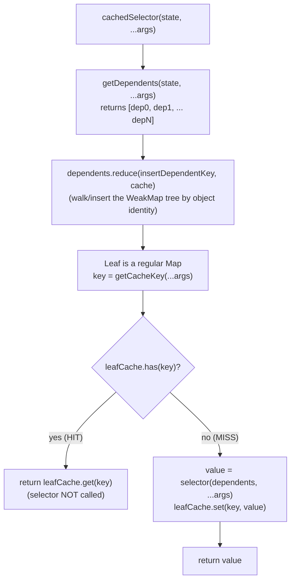

# Caching Behavior of `@automattic/tree-select` — Investigation & Q&A

> **Scope of this document.** This is a read-only, code-grounded investigation of the monorepo's
> memoized state-selector mechanism, the `@automattic/tree-select` package. It answers six specific
> questions about its caching behavior, diagnoses a reported "stale results" symptom, and contrasts
> `tree-select` with the sibling `createSelector` utility so the two are not confused.
>
> **Source of truth.** Every behavioral claim below cites a specific file and line range in the
> repository at branch `wp-calypso_be7e5cc64162` (HEAD `be7e5cc641622d153040491fd5625c6cb83e12eb`).
> External references are used only to corroborate, never to substitute for the code. No source file
> was modified, created, or deleted during this investigation; the only new file is this document.

## Executive summary

You reported: _"I have a component that retrieves filtered data from a central store, and I'm seeing
stale results being returned in certain conditions even after the underlying data has changed."_ In
Calypso, that "central store" is the Redux global state tree, and the "filtered data" is produced by
a **cached selector**. The cached-selector primitive used throughout `client/state` is
`@automattic/tree-select` — a memoizer built on a tree of `WeakMap` nodes that decides cache
hits/misses by **reference identity** of the state slices a selector depends on, not by deep value
comparison [packages/tree-select/src/index.ts:L84-92, packages/tree-select/README.md:L38-40]. The
short version of the diagnosis (expanded in **Section D**): a `tree-select` cache is only invalidated
when a dependent's **object reference** changes, so stale reads almost always mean either the
selector's `getDependents` is **under-declaring** a slice of state it actually reads, a custom
`getCacheKey` is **colliding** for distinct queries, or upstream code is **mutating state in place**
and defeating the reference-equality contract.

## About the package

`@automattic/tree-select` is described in its manifest as _"A selector library for Redux,"_ published
at version `2.0.0` under `GPL-2.0-or-later`, with a single runtime dependency (`tslib ^2.3.0`) and
`typescript ^5.8.2` for builds [packages/tree-select/package.json]. The source of truth is
`src/index.ts` (the `calypso:src` entry); it compiles to `dist/cjs/index.js` (main),
`dist/esm/index.js` (module), and `dist/types` (types), and is marked `sideEffects: false`
[packages/tree-select/package.json]. The entire implementation is 131 lines
[packages/tree-select/src/index.ts:L1-131] and the test suite is 266 lines
[packages/tree-select/test/index.js:L1-266].

---

## ⚠️ Critical caveat — the README documents a REVERSED argument order

Before anything else: **the package README shows the arguments in the wrong order.** The usage
examples document `treeSelect( selector, getDependents )`
[packages/tree-select/README.md:L19, packages/tree-select/README.md:L49], but the **actual
implementation signature is `treeSelect( getDependents, selector, options = {} )` — `getDependents`
comes FIRST** [packages/tree-select/src/index.ts:L42-56]. The JSDoc on the function confirms the real
order: `getDependents` is documented as the first parameter, `selector` second, and `options` third
[packages/tree-select/src/index.ts:L34-41]. The test suite also uses the correct order, e.g.
`treeSelect( getDependents, selector )` [packages/tree-select/test/index.js:L18].

**Treat the source code as authoritative.** If you copy the README examples verbatim you will pass
the functions in the wrong slots. Because both parameters are functions, the development-only
type guard will _not_ catch the mistake [packages/tree-select/src/index.ts:L57-63]; instead your
"selector" will be invoked as `getDependents` (its return value is reduced into the WeakMap tree as
the dependents array) and your "getDependents" will be invoked as the `selector`, producing
incorrect caching and results. Every example in this document uses the **real** order:
`treeSelect( getDependents, selector, options )`.

---

## Section 0 — Overview of the `treeSelect` mechanism

A cached selector built by `treeSelect` performs the same work on every call. Understanding this flow
is the key to every answer that follows.

**Per-call flow of `cachedSelector( state, ...args )`:**

1. Compute the dependents: `const dependents = getDependents( state, ...args )` returns an array
   `[ dep0, dep1, … depN ]` of the state slices the selector reads
   [packages/tree-select/src/index.ts:L73]. The README is explicit that these elements _"are all
   return values of other selectors -- no computations allowed here"_
   [packages/tree-select/README.md:L10].
2. Walk/insert into a dependency tree: `const leafCache = dependents.reduce( insertDependentKey, cache )`
   reduces the dependents left-to-right into a **nested tree of `WeakMap` nodes**, where each
   dependent object is itself a `WeakMap` **key** (by reference identity)
   [packages/tree-select/src/index.ts:L84, packages/tree-select/src/index.ts:L116-131].
3. Reach the leaf and key it by the arguments: the **final** node returned by the reduce is a regular
   `Map`, and the cache entry is stored under the string `getCacheKey( ...args )`
   [packages/tree-select/src/index.ts:L86, packages/tree-select/src/index.ts:L128].
4. Hit or miss: if the leaf `Map` already has that key, return the cached value (HIT); otherwise call
   the real `selector( dependents, ...args )`, store the result, and return it (MISS)
   [packages/tree-select/src/index.ts:L87-93].

**The core hit/miss block, quoted verbatim** [packages/tree-select/src/index.ts:L84-93]:

```ts
const leafCache: Map< string, Result > = dependents.reduce( insertDependentKey, cache );

const key = getCacheKey( ...args );
if ( leafCache.has( key ) ) {
	return leafCache.get( key ) as Result;
}

const value = selector( dependents, ...( args as SArgs ) );
leafCache.set( key, value );
return value;
```

**Why a tree of `WeakMap`s?** The name is literal: _"It is called `treeSelect` because it internally
uses a tree of dependencies to allow the gc to free memory without explicitly clearing the cache"_
[packages/tree-select/README.md:L4]. The source echoes this rationale inline: the dependency tree is
_"beneficial over standard memoization techniques so that we can garbage collect any values that are
based on outdated dependents"_ [packages/tree-select/src/index.ts:L81-83]. Because interior nodes are
`WeakMap`s keyed by the dependent objects themselves, once a dependent object is no longer referenced
anywhere (a new state slice replaced it), the corresponding subtree of cached results becomes eligible
for garbage collection automatically — no manual eviction needed.

**Leaf vs. interior node.** The interior nodes are `WeakMap`s (keys are objects), but the **last**
node is a regular `Map` because its key is the _string_ produced by the cache-key generator:
`const newMap = currentIndex === arr.length - 1 ? new Map() : new WeakMap()`
[packages/tree-select/src/index.ts:L128]. The accompanying comment states the reason directly: the
last map is a regular one _"because the … key for the last map is the string results of args.join()"_
[packages/tree-select/src/index.ts:L113-114].

**The dependency tree, as drawn in the README** [packages/tree-select/README.md:L54-70]. For a
selector whose `getDependents` returns `[ state.comments[ siteId ], state.sites[ siteId ] ]`, the
internal structure looks like:

```
                    comments
                       +
                       |
            +--------------------+
            |                    |
            v                    v
          site1                site2
            +                    +
      +------                   ...
      v
  "siteId1"
      +
      |
      v
    "Site...."
```

Reading top-to-bottom: the first dependent (`comments`) keys the root `WeakMap`; the next dependent
(`site1`/`site2`) keys the next `WeakMap` level; and the leaf `Map` is keyed by the args string
(`"siteId1"`), under which the computed value (`"Site…."`) lives.

**HIT vs. MISS, as a flowchart:**



With this model in hand, each of the six questions has a precise, code-anchored answer.

---

## R1 — The precise comparison mechanism that determines cache hits and misses

**Your question:** _"the precise comparison mechanism that determines cache hits and misses."_

**Direct answer.** A cache **HIT** requires **both** of the following to be true; if either fails, it
is a **MISS** and the underlying `selector` runs:

1. **Every dependent returned by `getDependents` is the same object reference as on the prior call.**
   The dependents are walked into the `WeakMap` tree where each dependent _is_ a key, and `WeakMap`
   keys are matched by **reference identity** — not by value or deep equality
   [packages/tree-select/src/index.ts:L84, packages/tree-select/src/index.ts:L116-131]. Concretely,
   `insertDependentKey` does `map.get( weakMapKey )`; if a node already exists for that exact object
   it is reused, otherwise a fresh child map is created
   [packages/tree-select/src/index.ts:L121-130]. A changed reference therefore lands on a _different_
   branch of the tree, where no prior result exists.
2. **The string `getCacheKey( ...args )` already exists in the leaf `Map`.** After reaching the leaf,
   the code computes `const key = getCacheKey( ...args )` and checks `leafCache.has( key )`
   [packages/tree-select/src/index.ts:L86-89]. This is ordinary `Map` key equality on a string
   (default: `args.join()` — see R6) [packages/tree-select/src/index.ts:L11-12].

**The rationale (the "why").** The design intentionally relies on referential equality rather than a
deep equality check. The README states it plainly: _"Because Redux discourages us from mutating
objects within state directly, we only need to verify that a piece of state is no longer referentially
equal to its previous state (as opposed to a deep equality check)"_
[packages/tree-select/README.md:L40]. In a correctly-implemented Redux store, any change to a slice of
state produces a **new object reference** for that slice, so a cheap `===`-style identity check on the
dependents is sufficient to know whether a recompute is needed. This is what makes the cache fast — it
never deep-compares state — and it is also the root of the stale-results failure mode (see **Section
D**) when the immutability contract is violated.

**Proof in the suite.** The behavioral tests that exercise this are cited under R2 and R3 below (e.g.
"should bust the cache when watched state changes" forces a dependent reference to change and observes a
recompute [packages/tree-select/test/index.js:L142-159]).

---

## R2 — How many times the underlying selector actually runs when dependent state changes (concrete numbers)

**Your question:** _"how many times the underlying selector function actually gets called when
dependent state changes between calls with concrete numbers from test runs."_

**Direct answer.** The package's own jest suite pins these counts with
`expect( …mock.calls ).toHaveLength( N )` assertions. The authoritative numbers are below; each row
cites the test that asserts it. (Section V documents how these were re-confirmed by running the suite
and an independent reproduction.)

| #   | Scenario                                              | Calls made | Underlying `selector` invocations | Citation (assertion)                                        |
| --- | ----------------------------------------------------- | :--------: | :-------------------------------: | ----------------------------------------------------------- |
| 1   | Same state, same args, called twice                   |     2      |               **1**               | [packages/tree-select/test/index.js:L33-46] (assert L45)    |
| 2   | Two dependents, same args, called twice               |     2      |               **1**               | [packages/tree-select/test/index.js:L48-76] (assert L75)    |
| 3   | Two distinct (non-cached) args                        |     2      |               **2**               | [packages/tree-select/test/index.js:L126-140] (assert L139) |
| 4   | A watched dependent's reference changes between calls |     2      |               **2**               | [packages/tree-select/test/index.js:L142-159] (assert L158) |
| 5   | Unique dependents `post1, post2, post1`               |     3      |     **2** (3rd reuses cache)      | [packages/tree-select/test/index.js:L161-186] (assert L185) |

**The key insight for your situation.** When a dependent's reference **changes** between two otherwise
identical calls, the selector runs **2** times — the second call lands on a new tree branch and the
cache busts (row 4). When the dependent reference is **stable**, repeated calls run the selector only
**1** time no matter how often you invoke it (rows 1–2). And calling with a **third** argument value
whose dependents match an earlier call reuses that earlier entry (row 5: the repeat of `post1` is a
HIT, so only 2 computations occur across 3 calls).

**Rationale (the "why").** Rows 1–2 are HITs on the second call because both conditions in R1 hold
(same dependent references, same args key). Rows 3–5 are governed by which condition fails: row 3
changes the _args key_ (different leaf `Map` entry); row 4 changes the _dependent reference_ (different
tree branch); row 5 mixes both — `post1` and `post2` produce different dependent references (2 misses),
but the second `post1` reuses the first `post1` branch and leaf entry (a hit), yielding 2 total
computations.

---

## R3 — Separate entries per argument vs. argument-driven invalidation

**Your question:** _"whether the cache maintains separate entries for each unique filter argument or
if calling with different arguments invalidates the previous cached result."_

**Direct answer.** The cache **maintains a separate entry for each unique argument key and does NOT
invalidate a prior result when called with a different argument.** Each distinct
`getCacheKey( ...args )` becomes its own entry in the leaf `Map` via `leafCache.set( key, value )`
[packages/tree-select/src/index.ts:L92], and there is no eviction-on-different-argument logic anywhere
in the implementation — different argument keys simply coexist as separate keys in the same `Map`
(or on different branches of the tree when the dependents differ)
[packages/tree-select/src/index.ts:L84-92].

**Proof in the suite.** The test _"should maintain the cache for unique dependents simultaneously"_
calls a selector with `post1`, then `post2`, then `post1` again against the same state, and asserts the
underlying spy ran exactly **2** times — i.e., the first `post1` result _survived_ the intervening
`post2` call and was reused on the third call
[packages/tree-select/test/index.js:L161-186] (assertion at L185). If a different argument had
invalidated the previous result, the third call would have recomputed and the count would be 3.

**When do entries go away, then?** Only in two situations:

- The parent dependent branch becomes **garbage-collected** because the dependent object it was keyed
  on is no longer referenced (the `WeakMap`-tree design that gives the package its name)
  [packages/tree-select/README.md:L4, packages/tree-select/src/index.ts:L81-83]; or
- You explicitly call `clearCache()`, which discards everything (see R4)
  [packages/tree-select/src/index.ts:L96-99].

**Practical consequence.** The cache size is effectively unbounded — one entry per unique args key per
live dependent branch — bounded in practice only by garbage collection of dependent references. This is
a deliberate trade-off (favoring hit rate and relying on GC) rather than a fixed-size LRU.

---

## R4 — Programmatically clearing the entire cache for a selector

**Your question:** _"if there's any way to programmatically clear the entire cache for a selector when
needed."_

**Direct answer.** Yes. Every selector returned by `treeSelect` carries a `clearCache()` method that
resets the root cache to a brand-new `WeakMap`, discarding all cached entries for that selector. The
public type advertises it (`clearCache: () => void`)
[packages/tree-select/src/index.ts:L29-32], and the implementation is
[packages/tree-select/src/index.ts:L96-99]:

```ts
cachedSelector.clearCache = () => {
	// WeakMap doesn't have `clear` method, so we need to recreate it
	cache = new WeakMap();
};
```

**Rationale (the "why").** Because the root cache is a `WeakMap` and `WeakMap` has no `clear()` method,
the only way to purge it wholesale is to replace it with a fresh instance — exactly what the inline
comment notes [packages/tree-select/src/index.ts:L97-98]. After this runs, the next call rebuilds the
tree from scratch, so the first call after `clearCache()` is guaranteed to be a MISS.

**Proof in the suite.** The test _"should bust the cache when clearCache() method is called"_ shows that
a repeated call returns a **referentially identical** result (a HIT), then calls `clearCache()`, then
asserts the subsequent result is **not** the same reference (a forced recompute)
[packages/tree-select/test/index.js:L197-217].

**Real production usage.** The method is used in real test setup to isolate cases:

- `client/state/stats/lists/test/selectors.js` calls `getSiteStatsPostStreakData.clearCache()` and
  `getSiteStatsNormalizedData.clearCache()` in `beforeEach`
  [client/state/stats/lists/test/selectors.js:L12-15].
- `client/state/sites/test/selectors.js` is especially instructive: in one `beforeEach` it calls
  `getSite.clearCache()` (a `tree-select` selector) **alongside**
  `getSiteCollisions.memoizedSelector.cache.clear()` and `getSiteBySlug.memoizedSelector.cache.clear()`
  (which are `createSelector` selectors) — a perfect side-by-side illustration that the two memoizers
  have **different** clearing APIs [client/state/sites/test/selectors.js:L72-76] (and `getSite.clearCache()`
  again at L141). See **Section C** for the contrast.

---

## R5 — Nullish vs. primitive returns from the dependency getter

**Your question:** _"what happens when the dependency getter returns nullish values versus primitive
values like numbers or booleans."_

**Direct answer.** The two cases diverge sharply, and both are governed by `insertDependentKey`
[packages/tree-select/src/index.ts:L116-131]:

- **Nullish dependents (`null` / `undefined`) are ALLOWED and MEMOIZED.** They cannot be `WeakMap` keys
  directly, so they are coalesced to a single shared, module-level sentinel object
  `const NULLISH_KEY = {}` [packages/tree-select/src/index.ts:L104-107] via
  `const weakMapKey = key || NULLISH_KEY` [packages/tree-select/src/index.ts:L121]. Because every
  nullish dependent maps to the _same_ sentinel object, results keyed on nullish dependents are cached
  normally.
- **Non-nullish primitive dependents (numbers, booleans, strings) THROW a `TypeError`.** The guard
  `if ( key != null && Object( key ) !== key ) throw new TypeError( 'key must be an object, \`null\`,
  or \`undefined\`' )` rejects anything that is non-null but not an object — i.e., any primitive
[packages/tree-select/src/index.ts:L118-120]. (`Object( key ) !== key`is true exactly for
primitives; for objects,`Object( obj ) === obj`.)

**Rationale (the "why").** `WeakMap` keys _must_ be objects. The implementation accommodates the common
"this slice of state may be absent" case by treating nullish as a legitimate, memoizable placeholder
(the sentinel), while refusing primitives outright rather than silently mis-caching them — a primitive
can't be a `WeakMap` key and there is no safe identity for it in this tree, so the code fails fast.

**Proof in the suite.**

- _"should memoize a nullish value returned by getDependents"_ uses a `getDependents` returning
  `[ null, undefined ]` and asserts the two results are referentially identical (memoized via the
  sentinel) [packages/tree-select/test/index.js:L219-229] (assertion at L228).
- _"throws on a non-nullish primitive value returned by getDependents"_ iterates
  `[ true, 1, 'a', false, '', 0 ]` and asserts **every one** throws
  [packages/tree-select/test/index.js:L231-241] (assertion at L239). Note this includes the
  "falsy-but-primitive" values `false`, `''`, and `0`: they are not nullish, so the `key != null`
  half of the guard is true and they throw.

**Keep "dependents" distinct from "arguments."** This restriction applies to values **returned by
`getDependents`**, not to the selector's **arguments**. Passing a primitive as an _argument_ is
perfectly fine — the suite confirms development does **not** throw when given primitive arguments such
as `1`, `''`, `'foo'`, `true`, `null`, `undefined`
[packages/tree-select/test/index.js:L115-124]. (Object _arguments_ are a separate matter, handled in
R6.)

**Practical rule for you.** `getDependents` must return **objects** (or nullish placeholders), never
bare numbers/booleans/strings. If a selector logically depends on a primitive value, **wrap it** —
return the containing state object (or an object that holds the primitive) so the dependency remains a
reference-comparable object that changes identity when the value changes.

---

## R6 — Customizing how cache keys are generated for complex query objects

**Your question:** _"whether there's a way to customize how cache keys are generated when I need to
pass complex query objects as arguments."_

**Direct answer.** Yes — supply a `getCacheKey` function in the third `options` argument
[packages/tree-select/src/index.ts:L24-27, packages/tree-select/src/index.ts:L67,
packages/tree-select/src/index.ts:L86]. By default, `getCacheKey` is
`( ...args ) => args.join()` [packages/tree-select/src/index.ts:L11-12], and in development a guard
**throws** `'Do not pass objects as arguments to a treeSelector'` if any argument is an object _while
the default key generator is still in use_
[packages/tree-select/src/index.ts:L75-79]. Supplying a custom `getCacheKey` both **removes that
restriction** (the guard only fires when `getCacheKey === defaultGetCacheKey`) and lets you map a
complex object to a **stable string** key.

**Rationale (the "why").** The default `args.join()` would stringify an object as `[object Object]`,
collapsing _every_ distinct query to the same key — a silent correctness bug. Rather than guess at how
to serialize an arbitrary object, the package refuses object arguments under the default generator (in
development) and instead asks you to declare a deterministic serialization that is **injective** over
the fields that matter for your query.

**Proof in the suite.** The test _"accepts a getCacheKey option that enables object arguments"_ passes
`{ getCacheKey: ( query ) => \`key:${ query.siteId }\` }`and then calls the selector with two
**different** objects,`{ siteId: 'site1', foo: 'bar' }`and`{ siteId: 'site1', foo: 'baz' }`. Because
both produce the identical generated key (`key:site1`), the second result is the **same reference** as
the first — they collapse to one cache entry
[packages/tree-select/test/index.js:L243-264] (assertion at L263). This also demonstrates the hazard:
if your `getCacheKey` ignores a field that genuinely distinguishes two queries, they will collide (see
**Section D**).

**The production pattern — `getSerializedStatsQuery`.** Real selectors pair a complex query object with
a serializing key generator that is **order-independent and stable**
[client/state/stats/lists/utils.js:L122-124]:

```js
export function getSerializedStatsQuery( query = {} ) {
	return JSON.stringify( sortBy( Object.entries( query ), ( pair ) => pair[ 0 ] ) );
}
```

Sorting the entries by key before stringifying makes `{ a: 1, b: 2 }` and `{ b: 2, a: 1 }` serialize
identically — the same logical query yields the same cache key regardless of property order. It is
wired into real `tree-select` selectors like so:

- `getSiteStatsPostStreakData` — a single dependent, with
  `getCacheKey: ( siteId, query ) => [ siteId, getSerializedStatsQuery( query ) ].join()`
  [client/state/stats/lists/selectors.js:L80-105] (key at L103).
- `getVideoPressPlaysComplete` — **two** dependents `[ getSiteStatsForQuery(…), getSite(…) ]`, with the
  same serialized-key approach [client/state/stats/lists/selectors.js:L116-128] (key at L125-126).
- `getSiteStatsNormalizedData` — **two** dependents, serialized key
  [client/state/stats/lists/selectors.js:L139-159] (key at L156-157).

**An array-argument example.** `getPostsByKeys` shows the same idea for an array argument, mapping each
key to a string and joining: `getCacheKey: ( postKeys ) => postKeys.map( keyToString ).join()`
[client/state/reader/posts/selectors.js:L52-61] (key at L60).

**Practical rule for you.** When passing complex query objects, always provide a `getCacheKey` that
serializes **every meaningful field** (and only those) into a stable string — mirror
`getSerializedStatsQuery` so equivalent queries share a key and distinct queries never collide.

---

## Section D — Diagnosing your "stale results" symptom

**Your symptom (verbatim):** _"I have a component that retrieves filtered data from a central store,
and I'm seeing stale results being returned in certain conditions even after the underlying data has
changed."_

This is the classic failure mode of a reference-equality cache. Recall from R1 that a `tree-select`
entry is invalidated **only** when a dependent's **object reference** changes; the selector never deep-
compares state [packages/tree-select/src/index.ts:L84-89, packages/tree-select/README.md:L40]. So
"data changed but the selector returned a stale value" means the cache did **not** observe a reference
change (or a key change) for the data you altered. There are three concrete mechanisms, in rough order
of likelihood:

1. **`getDependents` under-declares a slice of state the `selector` actually reads.** The cache only
   busts when one of the objects in the **returned dependents array** changes identity
   [packages/tree-select/src/index.ts:L73, packages/tree-select/src/index.ts:L84-89]. If your selector
   reads some piece of state that is _not_ present in that array, then changes to that hidden state
   never change a dependent reference, so the cache never busts and you keep getting the old value.
   **This is the most common cause of stale filtered results.**
   _Fix:_ make `getDependents` enumerate **every** state slice the `selector` body reads. The README
   stresses this is the whole point of the design — passing the dependents (not raw `state`) to the
   selector _"forces you to declare all of your state-dependencies"_
   [packages/tree-select/README.md:L11].

2. **A custom `getCacheKey` collides for genuinely distinct queries.** If your key generator omits a
   field that distinguishes two queries, both map to the same leaf-`Map` key and the second query reads
   the first query's cached result [packages/tree-select/src/index.ts:L86-89]. The suite demonstrates
   exactly this collapse: two different objects with the same generated key return the identical cached
   value [packages/tree-select/test/index.js:L243-264].
   _Fix:_ ensure `getCacheKey` is **injective** over the meaningful query fields — serialize all of
   them, order-independently, the way `getSerializedStatsQuery` does
   [client/state/stats/lists/utils.js:L122-124].

3. **Upstream code mutates state in place, defeating the reference-equality contract.** The entire
   correctness model assumes Redux-style immutable updates, where any change yields a **new** reference.
   The README is explicit that it relies on referential, not deep, equality
   [packages/tree-select/README.md:L40]. If a reducer (or other code) mutates an existing object
   instead of producing a new one, the dependent reference stays the same, the cache treats it as
   unchanged, and you read stale data.
   _Fix:_ ensure the relevant reducers return new references on every change (no in-place mutation).

**Recommended checklist for your component's selector:**

- Confirm `getDependents` returns **every** state slice the selector reads — nothing it depends on is
  computed from `state` inside the selector without being declared
  [packages/tree-select/src/index.ts:L73].
- If you pass a complex query object, confirm `getCacheKey` serializes **all** distinguishing fields
  and is order-independent [client/state/stats/lists/utils.js:L122-124].
- Confirm the upstream reducers produce **new references** for the data you expect to invalidate the
  cache [packages/tree-select/README.md:L40].
- As a targeted escape hatch when you must force a refresh, call `selector.clearCache()` (R4)
  [packages/tree-select/src/index.ts:L96-99] — but treat a _need_ to call it routinely as a signal that
  one of the three causes above is present.

---

## Section C — `tree-select` vs. `createSelector` (disambiguation)

The monorepo has **two** memoized-selector utilities, and they behave differently. The package your
description matches — a dependency getter, a `clearCache()` method, divergent nullish/primitive
handling, and a customizable `getCacheKey` for object arguments — is **`@automattic/tree-select`**. The
sibling `createSelector` (from `@automattic/state-utils`) is a _different_ memoizer with a _different_
API; the table below contrasts them so you do not apply one's behavior to the other.

| Aspect                             | `@automattic/tree-select`                                                                                                                                                       | `createSelector` (`@automattic/state-utils`)                                                                                                                                                                                                        |
| ---------------------------------- | ------------------------------------------------------------------------------------------------------------------------------------------------------------------------------- | --------------------------------------------------------------------------------------------------------------------------------------------------------------------------------------------------------------------------------------------------- |
| Signature / argument order         | `treeSelect( getDependents, selector, options )` — **getDependents first** [packages/tree-select/src/index.ts:L42-56]                                                           | `createSelector( selector, getDependants, getCacheKey )` — **selector first** [packages/state-utils/src/create-selector/index.ts:L74-89]                                                                                                            |
| Dependent comparison               | **Reference identity** via `WeakMap` keys (no deep/shallow compare) [packages/tree-select/src/index.ts:L84, packages/tree-select/src/index.ts:L116-131]                         | **Shallow** equality: `! isShallowEqual( currentDependants, lastDependants )` [packages/state-utils/src/create-selector/index.ts:L103-105]                                                                                                          |
| Cache structure                    | Nested `WeakMap` tree → leaf `Map`; **many entries coexist** per live branch [packages/tree-select/src/index.ts:L84-92, packages/tree-select/src/index.ts:L128]                 | lodash `memoize( selector, getCacheKey )` — a single cache keyed by the cache key [packages/state-utils/src/create-selector/index.ts:L90]                                                                                                           |
| Invalidation on dependent change   | Per-branch; stale branches are **auto-GC'd** (the `WeakMap`-tree design) [packages/tree-select/README.md:L4, packages/tree-select/src/index.ts:L81-83]                          | **Wholesale**: clears the entire cache when dependants change [packages/state-utils/src/create-selector/index.ts:L103-105]                                                                                                                          |
| Object/primitive **arguments**     | Dev **throws** on object args under the default key generator [packages/tree-select/src/index.ts:L75-79]; primitive args are fine [packages/tree-select/test/index.js:L115-124] | Primitive args are valid (`VALID_ARG_TYPES = [ 'number', 'boolean', 'string' ]`) [packages/state-utils/src/create-selector/index.ts:L13]; dev **warns** (does not throw) on complex args [packages/state-utils/src/create-selector/index.ts:L36-52] |
| **Dependents** that are primitives | Non-nullish primitives **throw**; nullish memoized via sentinel [packages/tree-select/src/index.ts:L118-121]                                                                    | N/A in the same way — comparison is shallow-equality over the dependants array [packages/state-utils/src/create-selector/index.ts:L103-105]                                                                                                         |
| Programmatic clear API             | `selector.clearCache()` [packages/tree-select/src/index.ts:L96-99]                                                                                                              | `selector.memoizedSelector.cache.clear()` [packages/state-utils/src/create-selector/index.ts:L103-105, packages/state-utils/src/create-selector/index.ts:L111]                                                                                      |
| Backing libraries                  | none beyond `tslib` [packages/tree-select/package.json]                                                                                                                         | `@wordpress/is-shallow-equal`, `@wordpress/warning`, lodash `memoize` [packages/state-utils/src/create-selector/index.ts:L1-3]                                                                                                                      |

**Takeaway.** If your selector is declared as
`export const getX = treeSelect( getDependents, selector, options )` and you clear it with
`getX.clearCache()`, you are using `tree-select` — the package this document analyzes. If instead it
is `createSelector( selector, … )` and you clear it with `getX.memoizedSelector.cache.clear()`, you are
using the _other_ utility, whose dependent comparison is **shallow equality** and whose invalidation is
**wholesale** — a materially different caching model.

---

## Section P — Development vs. production behavior (important guards are dev-only)

Two of the guards discussed above run **only when `NODE_ENV !== 'production'`** and are silently
skipped in production builds:

- **Function-type guard.** The check that both `getDependents` and `selector` are functions (throwing
  `'treeSelect: invalid arguments passed, …'`) is wrapped in
  `if ( process.env.NODE_ENV !== 'production' )` [packages/tree-select/src/index.ts:L57-63].
- **Object-argument guard.** The check that throws `'Do not pass objects as arguments to a
treeSelector'` (when the default key generator is in use) is likewise dev-only
  [packages/tree-select/src/index.ts:L75-79].

**Why this matters for stale/incorrect caching in production.** In production, an object argument used
with the **default** `getCacheKey` is no longer rejected — it flows into `args.join()`
[packages/tree-select/src/index.ts:L11-12], which stringifies objects as `[object Object]`. Every
distinct object argument then collapses to the **same** key, so different queries silently share one
cache entry — a subtle source of stale/wrong results that never surfaces in development because the dev
guard would have thrown first. The suite confirms the production no-throw behavior directly: _"should
not throw an error in production even when given object arguments"_
[packages/tree-select/test/index.js:L103-113].

**Implication.** Always pair object arguments with a real `getCacheKey` (R6); do not rely on the
development guard to catch the mistake, because production will not.

---

## Section V — Validation / reproduction appendix

This section documents how the R2 invocation counts (and the R4/R5/R6 behaviors) were verified, in
keeping with the rule to _build and run the code_ rather than assume.

**Authoritative source — the suite's own assertions.** The counts are encoded directly as
`expect( …mock.calls ).toHaveLength( N )` assertions in the package tests
[packages/tree-select/test/index.js:L33-46, packages/tree-select/test/index.js:L48-76,
packages/tree-select/test/index.js:L126-140, packages/tree-select/test/index.js:L142-159,
packages/tree-select/test/index.js:L161-186].

**Official run.** The package's jest suite was executed from the repository root with the workspace's
configured runner (run-to-verify only; **no source file was edited**):

```
CI=true yarn jest -c test/packages/jest.config.js packages/tree-select --ci
```

Result: **17 passed, 17 total** (1 suite). The passing test names map 1:1 to the answers above —
"should cache the result of a selector function" (R2 #1), "…that has multiple dependents" (R2 #2),
"should call selector when making non-cached calls" (R2 #3), "should bust the cache when watched state
changes" (R2 #4), "should maintain the cache for unique dependents simultaneously" (R3 / R2 #5),
"should bust the cache when clearCache() method is called" (R4), "should memoize a nullish value
returned by getDependents" (R5), "throws on a non-nullish primitive value returned by getDependents"
(R5), and "accepts a getCacheKey option that enables object arguments" (R6).

> Note: the run emits two harmless, pre-existing warnings unrelated to `tree-select` — a
> `jest-haste-map` "duplicate manual mock" notice (built `dist/` vs `src/` copies elsewhere in the
> monorepo) and a Browserslist "caniuse-lite is N months old" notice. Neither affects the results, and
> neither was "fixed" because doing so would modify repository files, which is out of scope.

**Independent reproduction (outside the repository).** To confirm the counts without relying on the
suite, a faithful standalone port of the algorithm in `packages/tree-select/src/index.ts` was written
and run from a temporary directory **outside** the repo tree (so no repository file was added or
changed). It asserts the same five counts plus the clearCache, nullish-memoization, primitive-throw,
and `getCacheKey`-collapse behaviors. Result: **9 / 9 checks passed**, on Node `v22.23.1` (the repo's
toolchain) and again on Node `v24.x` — counts confirmed as **(1, 1, 2, 2, 2)**, nullish memoized to the
same reference, all six non-nullish primitives threw, and the two distinct objects collapsed to one
entry under a shared `getCacheKey`.

For transparency, the standalone reproduction (run **outside** the repository, then deleted; never
`git add`-ed) was structured as follows:

```js
// Faithful port of packages/tree-select/src/index.ts — run OUTSIDE the repo.
const defaultGetCacheKey = ( ...args ) => args.join();
const isObject = ( o ) => !! o && typeof o === 'object';
const isFunction = ( fn ) => !! fn && typeof fn === 'function';
const NULLISH_KEY = {};
function insertDependentKey( map, key, currentIndex, arr ) {
	if ( key != null && Object( key ) !== key ) {
		throw new TypeError( 'key must be an object, `null`, or `undefined`' );
	}
	const weakMapKey = key || NULLISH_KEY;
	const existingMap = map.get( weakMapKey );
	if ( existingMap ) return existingMap;
	const newMap = currentIndex === arr.length - 1 ? new Map() : new WeakMap();
	map.set( weakMapKey, newMap );
	return newMap;
}
function treeSelect( getDependents, selector, options = {} ) {
	let cache = new WeakMap();
	const { getCacheKey = defaultGetCacheKey } = options;
	const cachedSelector = function ( state, ...args ) {
		const dependents = getDependents( state, ...args );
		const leafCache = dependents.reduce( insertDependentKey, cache );
		const key = getCacheKey( ...args );
		if ( leafCache.has( key ) ) return leafCache.get( key );
		const value = selector( dependents, ...args );
		leafCache.set( key, value );
		return value;
	};
	cachedSelector.clearCache = () => {
		cache = new WeakMap();
	};
	return cachedSelector;
}
// ... 9 assertions: counts (1,1,2,2,2), clearCache busts, nullish memoized,
//     6/6 primitives throw, getCacheKey object-collapse → all PASS.
```

This corroborates the suite: the numbers in R2 are exactly what the code produces.

---

## Caveats & final QA

**Reversed-signature caveat (restated).** The README usage examples show
`treeSelect( selector, getDependents )` [packages/tree-select/README.md:L19,
packages/tree-select/README.md:L49], but the implementation and tests use
`treeSelect( getDependents, selector, options )` — `getDependents` first
[packages/tree-select/src/index.ts:L42-56, packages/tree-select/test/index.js:L18]. **The source code
is authoritative.** Follow the source order, not the README examples.

**Answer index (each answered above with citations + rationale):**

- **R1** — Cache hit/miss = reference identity of _all_ dependents (WeakMap keys) **and** string match
  of `getCacheKey(...args)` in the leaf `Map`
  [packages/tree-select/src/index.ts:L84-89, packages/tree-select/src/index.ts:L116-131].
- **R2** — Concrete invocation counts **(1, 1, 2, 2, 2)**, each pinned by a `toHaveLength` assertion
  [packages/tree-select/test/index.js:L33-46, packages/tree-select/test/index.js:L48-76,
  packages/tree-select/test/index.js:L126-140, packages/tree-select/test/index.js:L142-159,
  packages/tree-select/test/index.js:L161-186].
- **R3** — Separate entry per unique argument key; no argument-driven invalidation
  [packages/tree-select/src/index.ts:L92, packages/tree-select/test/index.js:L161-186].
- **R4** — `selector.clearCache()` recreates the root `WeakMap`
  [packages/tree-select/src/index.ts:L96-99, packages/tree-select/test/index.js:L197-217].
- **R5** — Nullish dependents memoized via the `NULLISH_KEY` sentinel; non-nullish primitives throw
  [packages/tree-select/src/index.ts:L107, packages/tree-select/src/index.ts:L118-121,
  packages/tree-select/test/index.js:L219-241].
- **R6** — Custom `options.getCacheKey` enables stable keys for object arguments; production pattern is
  `getSerializedStatsQuery` [packages/tree-select/src/index.ts:L24-27,
  packages/tree-select/test/index.js:L243-264, client/state/stats/lists/utils.js:L122-124].

**Final QA checklist:**

- [x] All six questions (R1–R6) answered with source citations and rationale.
- [x] Stale-results diagnosis present and tied to the reported symptom (Section D).
- [x] `tree-select` vs. `createSelector` comparison table present (Section C).
- [x] Every behavioral claim cites a file path + line range; counts match **(1, 1, 2, 2, 2)**.
- [x] Reversed-signature caveat called out prominently (top) and restated at the end.
- [x] Development-vs-production behavior documented (Section P).
- [x] Validation/reproduction documented; official suite **17/17** and standalone **9/9** (Section V).
- [x] This document is the only new file; no source file was modified, created, or deleted.
- [x] Filename is exactly `wp-calypso_be7e5cc64162.md`, under `blitzy/documentation/`.
