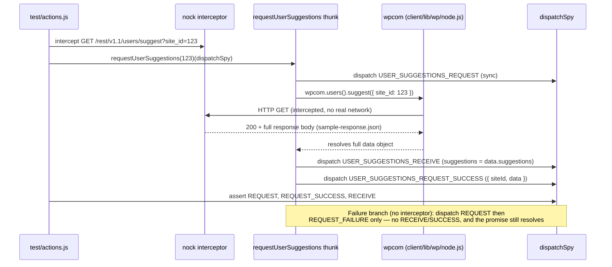

# wp-calypso Testing Infrastructure — Onboarding Q&A

This document answers seven onboarding questions about how **wp-calypso**'s Jest
test environment is constructed and how it diverges from the normal development
runtime. Every behavioral claim is backed by an **actual command** and its
**real, unedited output**, plus a `file:line` citation into the source. Output is
reproduced verbatim from live runs. Two kinds of *shown, fully reproducible*
processing are applied, and only where explicitly noted: (1) when a command emits
a block that repeats **identically** many times — e.g. the three-line
Browserslist advisory printed repeatedly during the `yarn start` build — that
block is collapsed with the exact `grep` filter shown beside it, the repeat count
is stated, and the **complete** unfiltered transcript is preserved verbatim in
**Appendix A**; and (2) the verbose `jest --showConfig` JSON is projected to the
keys under discussion and its absolute paths normalized to `<REPO>` by the small
extractor script shown inline in Q2, whose full raw JSON is preserved in
**Appendix B**. Nothing else is summarized or paraphrased. Run-specific values
(timestamps, webpack build hashes, ports, and durations) naturally vary from run
to run, so the same command shown in different sections may carry different such
values. The
investigation is strictly **read-only**: the only file written to the repository
is this document. All investigative probes were created **outside the source
tree** — each in a private `mktemp -d` directory under `/tmp`, created with
`umask 077` — and removed when done. The working tree was verified clean after
every probe: throughout the investigation `git status --porcelain
--untracked-files=all` showed **only this deliverable itself** — ` M …md` while
the document was being authored (uncommitted) and empty once it is committed at
`HEAD` — and **never** any source file or investigative probe (see the
Environment section below, and the ` M` snapshots in the Q4 and Q7 sections).

Statements that could not be observed at runtime and are derived from reading
code are explicitly labelled **(inferred)**.

---

## Environment

All observations were captured on the repository's canonical toolchain. The
repository requires Node `^v22.9.0` (`package.json:57`) and yarn `4.0.2`
(`package.json:422`); the `yarn start` chain runs `npx check-node-version
--package`, which fails on Node 20, so Node 22.x is authoritative.

```
$ node --version
v22.23.1

$ yarn --version
4.0.2

$ npx check-node-version --package; echo "EXIT=$?"
EXIT=0
```

`check-node-version` v4 is **silent on success**, so the `EXIT=0` is itself the
gate-pass signal. (`check-node-version` is a devDependency at
`package.json:267`; the `engines.node "^v22.9.0"` requirement is at
`package.json:56-57` and `packageManager "yarn@4.0.2"` at `package.json:422`.)

Workspace dependencies are installed with the immutable (CI) install, which
verifies the lockfile without mutating it:

```
$ CI=true yarn install --immutable
➤ YN0000: · Yarn 4.0.2
➤ YN0000: ┌ Resolution step
➤ YN0000: └ Completed in 0s 488ms
➤ YN0000: ┌ Fetch step
➤ YN0000: └ Completed in 4s 430ms
➤ YN0000: ┌ Link step
➤ YN0000: └ Completed in 1s 3ms
➤ YN0000: · Done in 6s 451ms
$ echo "EXIT=$?"
EXIT=0
```

**True baseline.** At a clean baseline — with this deliverable
(`blitzy/documentation/wp-calypso_be7e5cc64162.md`) committed to the
documentation branch's `HEAD` — the working tree is byte-for-byte clean, so the
exhaustive untracked-file listing and the diff are both empty:

```
$ git status --porcelain --untracked-files=all
$ echo "EXIT=$?"
EXIT=0

$ git diff --stat
$ echo "EXIT=$?"
EXIT=0
```

Every probe below is created under a private `/tmp` directory and removed
afterwards, so after each probe `git status --porcelain` shows **only this
deliverable** and **no** source or probe file (re-verified per section). The
` M blitzy/documentation/wp-calypso_be7e5cc64162.md` snapshots shown later in the
Q4 and Q7 sections are exactly that status captured while the document was still
being authored (the deliverable uncommitted); once the deliverable is committed
the status is empty, precisely as the baseline above shows. `node_modules` is
installed (git-ignored) and `build/server.js` (7.9 MB) is pre-built by
`yarn run build` (`package.json:64`).

Key dependency versions (from `package.json`): `jest ^29.7.0`
(`package.json:290`), `nock ^13.5.6` (`package.json:299`), and `bunyan ^1.8.15`
(`package.json:265`).

**One host-resolution note** applies to the canonical dev-server URL used later
(the dev server advertises and serves itself at `http://calypso.localhost:3000`,
and the Q6 dev-side curl targets that host). `calypso.localhost` is **not**
resolved automatically here: `/etc/nsswitch.conf` uses `hosts: files dns` (no
`myhostname`/auto-`.localhost` NSS module), so the host resolves **only** if it is
mapped to loopback:

```
$ grep -E '^hosts' /etc/nsswitch.conf
hosts:          files dns
```

**Preferred (no host-file mutation).** Every dev-side `curl` in this document
maps the name to loopback **for that request only** with `--resolve`, so **no**
change to `/etc/hosts` is required and nothing global is left behind:

```
$ curl --resolve calypso.localhost:3000:127.0.0.1 http://calypso.localhost:3000/log-in
```

**Optional, idempotent alternative.** If you prefer the browser to resolve the
name too, add the entry with a guard so repeated runs never duplicate it (this is
the only command in this document that touches a file outside the repo, and it is
opt-in):

```
$ grep -qxF '127.0.0.1 calypso.localhost' /etc/hosts \
    || echo '127.0.0.1 calypso.localhost' | sudo tee -a /etc/hosts
$ getent hosts calypso.localhost
127.0.0.1       calypso.localhost
```

Q1's health check below uses `http://127.0.0.1:3000/` directly and needs neither
approach; the Q6 dev-side curl uses `--resolve` as shown above.

---

## Investigation methodology — outside-tree Jest probe harness

Several answers below require running code **inside Jest** to observe test-only
behaviour (injected globals, the custom module resolver, the config swap, mocked
network). To keep the source tree byte-for-byte unchanged, none of these probes
live in the repository. Instead, a single reusable shell function — `jest_probe`
— runs each probe through a suite's **real** Jest config. Every call creates a
private `mktemp -d` workspace (`umask 077`), writes a thin *wrapper* config plus
the probe file, runs the probe, prints its output, and removes **all** scratch on
exit via a `trap`. Nothing is written under the repository.

**How the wrapper stays faithful.** The wrapper `require()`s the suite's real
config or preset and spreads it verbatim, changing only *test discovery* so Jest
runs our probe instead of the repo's own tests:

- `projects: undefined` collapses multi-project runners (apps/packages) to a
  single config so a probe can target one profile;
- `rootDir` is set to the suite's real rootDir, so every `<rootDir>`-relative
  path inside the spread config (setup files, mappers) still resolves;
- `roots` + `testMatch` point **only** at the private probe dir;
- `modulePaths` adds the repo's `node_modules` so an out-of-tree probe can resolve
  repo packages and Babel runtime helpers.

Everything else — `testEnvironment`, `setupFiles`, `setupFilesAfterEnv`,
`moduleNameMapper`, `testEnvironmentOptions`, `globals`, `transform`, `resolver` —
is inherited **unchanged** from the suite, so what a probe observes is exactly
what that suite installs.

**Paste this once** into a shell whose working directory is the repository root;
every probe in the sections below calls it:

```
# jest_probe <suite-config> <rootDir> <node|jsdom>   < probe-body.js
#   <suite-config> : suite's real Jest config/preset, relative to repo root
#                    (e.g. test/client/jest.config.js)
#   <rootDir>      : suite's real rootDir, relative to repo root (e.g. client)
#   <node|jsdom>   : probe environment (jsdom prepends the @jest-environment docblock)
# The probe body is read from stdin. It MUST use CommonJS require() — NOT ESM
# `import` of a repo package: the probe lives outside the tree, so Babel's
# injected ESM-interop helper (@babel/runtime/helpers/interopRequireWildcard)
# would fail to resolve there. moduleNameMapper still applies to require().
jest_probe() {
  local suite_cfg="$1" root_dir="$2" env="$3"
  local repo; repo="$(pwd)"
  (
    umask 077
    work="$(mktemp -d "${TMPDIR:-/tmp}/wpcalypso-probe.XXXXXX")"
    trap 'rm -rf "$work"' EXIT          # remove ONLY this workspace, on any exit
    mkdir -p "$work/t"
    cat > "$work/wrapper.js" <<'JS'
const path = require( 'path' );
const base = require( process.env.WRAP_SRC );          // the suite's REAL config/preset
module.exports = {
  ...base,
  projects: undefined,                                 // collapse multi-project runners
  rootDir: process.env.WRAP_ROOTDIR,                   // the suite's real rootDir
  roots: [ process.env.WRAP_ROOTS ],                   // discover ONLY the probe dir
  testMatch: [ '**/*.probe.js' ],
  testPathIgnorePatterns: [],
  testRegex: undefined,
  modulePaths: [ path.join( process.env.WRAP_REPO, 'node_modules' ) ],
};
JS
    if [ "$env" = jsdom ]; then
      printf '/** @jest-environment jsdom */\n' > "$work/t/x.probe.js"
    else
      : > "$work/t/x.probe.js"
    fi
    cat >> "$work/t/x.probe.js"                         # append the probe body from stdin
    WRAP_REPO="$repo" WRAP_SRC="$repo/$suite_cfg" \
    WRAP_ROOTDIR="$repo/$root_dir" WRAP_ROOTS="$work/t" \
      TZ=UTC node "$repo/node_modules/jest-cli/bin/jest.js" \
        --config "$work/wrapper.js" --rootDir "$repo/$root_dir" --runInBand 2>&1
  )
}
```

**Proof run.** Two trivial probes — one in the default `node` environment, one
opting into `jsdom` — confirm the harness loads the suite's real setup framework
and custom resolver. The `node` probe
([Jest test environments](https://jestjs.io/docs/test-environment)):

```
$ jest_probe test/client/jest.config.js client node <<'PROBE' | grep -E 'NODE_PROBE|PASS|Tests:'
test( 'node-env sanity', () => {
	console.log( 'NODE_PROBE=' + JSON.stringify( {
		NODE_ENV: process.env.NODE_ENV, TZ: process.env.TZ,
		typeof_window: typeof window,
		ResizeObserver: typeof global.ResizeObserver,
		fetch_isMock: !! ( global.fetch && global.fetch.mock ),
		CSS_supports: typeof ( global.CSS && global.CSS.supports ),
	} ) );
	expect( process.env.NODE_ENV ).toBe( 'test' );
} );
PROBE
PASS ../../../wpcalypso-probe.J0TVKL/t/x.probe.js
NODE_PROBE={"NODE_ENV":"test","TZ":"UTC","typeof_window":"undefined","ResizeObserver":"function","fetch_isMock":true,"CSS_supports":"function"}
Tests:       1 passed, 1 total
```

The `jsdom` probe (the page URL comes from the client suite's
`testEnvironmentOptions.url`,
[Jest testEnvironmentOptions](https://jestjs.io/docs/configuration#testenvironmentoptions-object)):

```
$ jest_probe test/client/jest.config.js client jsdom <<'PROBE' | grep -E 'JSDOM_PROBE|PASS|Tests:'
const path = require( 'path' );
test( 'jsdom-env sanity + resolver', () => {
	const resolved = require.resolve( path.join( process.cwd(), 'client/lib/wp' ) );
	console.log( 'JSDOM_PROBE=' + JSON.stringify( {
		typeof_window: typeof window, typeof_document: typeof document,
		page_url: window.location.href,
		wp_resolved: resolved.replace( process.cwd(), '<REPO>' ),
	} ) );
	expect( typeof window ).toBe( 'object' );
} );
PROBE
PASS ../../../wpcalypso-probe.z9LNGv/t/x.probe.js
JSDOM_PROBE={"typeof_window":"object","typeof_document":"object","page_url":"https://example.com/","wp_resolved":"<REPO>/client/lib/wp/node.js"}
Tests:       1 passed, 1 total
```

The `node` probe shows the setup framework's globals are present even in the
default `node` environment (`ResizeObserver`, the `fetch` mock, `CSS.supports`)
while `window` is `undefined`; the `jsdom` probe shows `window`/`document` exist,
the page URL is the configured `https://example.com/`, and the custom resolver
resolves `client/lib/wp` to **`node.js`** (not `browser.js`) — the mechanism
revisited in Q5.

**Self-cleaning, verified.** Each `jest_probe` call removes its `mktemp`
workspace on exit (the `PASS` line shows a different random `wpcalypso-probe.XXXXXX`
suffix per run), so nothing accumulates and the working tree is untouched:

```
$ ls -d /tmp/wpcalypso-probe.* 2>/dev/null || echo "(no probe dirs remain)"
(no probe dirs remain)
$ git status --porcelain --untracked-files=all
 M blitzy/documentation/wp-calypso_be7e5cc64162.md
```

Every probe in the sections below is created and run exactly this way; only the
probe body and the `<suite-config> <rootDir> <env>` arguments change, so those
sections show just the probe, its `jest_probe` invocation, and the output.

---

## Q1 — Does the development server boot?

**Direct answer: Yes.** The dev server boots at the default
`CALYPSO_ENV=development` and listens on **port 3000**. Observed listening log
from the canonical final step (`start-build`):

```
21:01:11.764Z  INFO calypso: wp-calypso booted in 991ms - http://calypso.localhost:3000
```

### Mechanism (cause → effect)

`yarn start` chains four steps (`package.json:110`):

```
start = npx check-node-version --package && node bin/welcome.js && yarn run build && yarn run start-build
```

1. **Version gate** — `npx check-node-version --package` (exits 0 on Node 22.x, above).
2. **Welcome banner** — `node bin/welcome.js` prints a cyan "calypso" ASCII banner
   via `console.log( chalk.cyan( ... ) )` (`bin/welcome.js:6-11`).
3. **Build** — `yarn run build` (`package.json:64`) produces `build/server.js`
   (it does not exist before a build; here it was pre-built at 7.9 MB).
4. **Serve** — `yarn run start-build` (`package.json:113`) =
   `BROWSERSLIST_ENV=evergreen node build/server.js | bunyan -o short`, i.e. it
   launches the Express SSR server and formats its JSON logs through `bunyan`.

The listening port comes from `config/development.json` (`"port": 3000`), which
matches the boot URL above.

> Note: the `MOCK_WORDPRESSDOTCOM` branch in `bin/welcome.js:13-34` only runs when
> that env var equals `'1'`; it was **not** triggered here (**inferred**, from the
> `if` guard).

### Evidence

**1. Version gate + welcome banner.** `check-node-version` is silent on success;
`bin/welcome.js` prints the cyan "calypso" banner (plain text here because stdout
is piped to a non-TTY; trailing padding trimmed):

```
$ npx check-node-version --package; echo "EXIT=$?"
EXIT=0

$ node bin/welcome.js; echo "EXIT=$?"
             _
    ___ __ _| |_   _ _ __  ___  ___
   / __/ _` | | | | | '_ \/ __|/ _ \
  | (_| (_| | | |_| | |_) \__ \ (_) |
   \___\__,_|_|\__, | .__/|___/\___/
               |___/|_|

EXIT=0
```

**2. Full canonical `yarn start` chain.** Run end-to-end (version gate → banner →
`yarn run build` → `yarn run start-build`, `package.json:110`). The webpack build
of the Node server is the heavy step (~165 s on this run). The complete transcript
is **245 lines**, of which the identical three-line Browserslist advisory repeats
**67 times** (3 × 67 = 201 lines). The complete, unfiltered transcript is
reproduced verbatim in **Appendix A**; below, those 201 advisory lines are removed
with the exact `grep` filter shown, leaving the **44** signal lines — each one
verbatim (the leading ASCII banner keeps its original trailing-space padding):

```
$ CALYPSO_ENV=development yarn start > /tmp/ys_full_transcript.txt 2>&1   # full transcript → Appendix A
$ wc -l < /tmp/ys_full_transcript.txt
245
$ grep -c '^Browserslist: browsers data (caniuse-lite) is 17 months old\. Please run:$' /tmp/ys_full_transcript.txt
67
$ grep -vE '^(Browserslist: browsers data \(caniuse-lite\) is 17 months old\. Please run:|  npx update-browserslist-db@latest|  Why you should do it regularly: https://github\.com/browserslist/update-db#readme)$' /tmp/ys_full_transcript.txt
             _                           
    ___ __ _| |_   _ _ __  ___  ___      
   / __/ _` | | | | | '_ \/ __|/ _ \ 
  | (_| (_| | | |_| | |_) \__ \ (_) |  
   \___\__,_|_|\__, | .__/|___/\___/ 
               |___/|_|                

Packages are built.
Failed to load ./.env.
02:48:06.399Z  INFO calypso: wp-calypso booted in 1001ms - http://calypso.localhost:3000
webpack built ffbed822f4031b955414 in 165120ms
assets by path *.js 146 MiB
  assets by chunk 37.4 MiB (id hint: vendors)
    asset vendors-node_modules_wordpress_block-editor_build-module_index_js.js 4.64 MiB [emitted] (id hint: vendors)
    asset vendors-node_modules_wordpress_block-library_build-module_index_js-node_modules_wordpress_ico-1077c4.js 2.84 MiB [emitted] (id hint: vendors)
    asset vendors-node_modules_tannin_sprintf_index_js-node_modules_cookie_index_js-node_modules_core-j-244a9e.js 1.48 MiB [emitted] (id hint: vendors)
    + 227 assets
  + 746 assets
assets by path *.css 48.7 MiB 806 assets
assets by info 20.6 MiB [immutable]
  assets by path images/*.svg 5.1 MiB 600 assets
  assets by path images/*.png 10.1 MiB 76 assets
  assets by path images/*.jpg 5.37 MiB 34 assets
  asset images/loader-0855308317756931a4f5.gif 81.9 KiB [emitted] [immutable] [from: ../packages/jetpack-ai-calypso/src/logo-generator/assets/images/loader.gif] (auxiliary name: home)
  asset 3e15b3f4f51c5f0ca392.webp 3.62 KiB [emitted] [immutable] [from: assets/images/hundred-year-plan-onboarding/stars-solo.webp]
orphan modules 1.65 MiB (javascript) 51.7 KiB (css/mini-extract) 11.7 KiB (asset) [orphan] 1301 modules
runtime modules 65.2 KiB 25 modules
javascript modules 68.2 MiB
  modules by path ./ 36.5 MiB 9453 modules
  modules by path ../ 31.7 MiB 7055 modules
  + 3 modules
css modules 14.6 MiB
  modules by path ./ 12.4 MiB 1376 modules
  modules by path ../ 2.15 MiB 185 modules
asset modules 19.4 MiB (asset) 31.2 KiB (javascript) 696 modules
json modules 218 KiB
  modules by path ./ 5.89 KiB 9 modules
  modules by path ../ 212 KiB
    modules by path ../node_modules/ 126 KiB 3 modules
    + 3 modules
37 WARNINGS in child compilations (Use 'stats.children: true' resp. '--stats-children' for more details)
webpack 5.97.1 compiled with 37 warnings in 165120 ms

Ready! You can load http://calypso.localhost:3000/ now. Have fun!
```

The final `Ready!` line is emitted by the long-running Express SSR server
(`yarn run start-build`, `package.json:113`). The earlier bunyan `booted in 1001ms`
line is **not** that server: it appears before the webpack build finishes, so it
is a transient server booted during the build phase to generate the docs index
(`build-devdocs:search-index` = `node bin/generate-devdocs-search-index.js`,
`package.json`) (**inferred** from the log ordering and the build script).

**3. Unambiguous listening signal + health check + safe shutdown.** To capture a
listening line attributable to the SSR server alone, the canonical final step was
run on the already-built `build/server.js`, health-checked, then shut down by the
**exact process group we spawned** — via `setsid` plus the captured session-leader
PID — so the shutdown can never target another checkout's server. The log goes to
a private, unpredictable `mktemp` file. The bunyan timestamp and the `booted in
NNNms` value are **run-specific** and differ on each boot; the `Content-Length`
(630) and `ETag` are deterministic for this loopback stub response:

```
$ umask 077
$ LOG="$(mktemp /tmp/wpcalypso-startbuild.XXXXXX.log)"   # private (0600), unpredictable name
$ setsid env CALYPSO_ENV=development yarn run start-build > "$LOG" 2>&1 &
$ SRV_PGID=$!            # setsid makes the child a session leader, so its PID == its process-group id
$ until grep -q "booted in" "$LOG"; do sleep 1; done        # poll the private log for the listening line
$ grep -E "booted in" "$LOG"
03:00:32.705Z  INFO calypso: wp-calypso booted in 985ms - http://calypso.localhost:3000

$ curl -sSI --max-time 20 http://127.0.0.1:3000/ | head -8
HTTP/1.1 200 OK
X-Powered-By: Express
Content-Type: text/html; charset=utf-8
Content-Length: 630
ETag: W/"276-y4FD3FW7f3NaD0Hx62TOsuGEP2M"
Date: Wed, 15 Jul 2026 03:00:32 GMT
Connection: keep-alive
Keep-Alive: timeout=5

$ kill -TERM -"$SRV_PGID"       # SIGTERM to the whole group we spawned — never a stray pattern match
$ sleep 2
$ curl -sS -o /dev/null -w "POST_SHUTDOWN_HTTP=%{http_code}\n" --max-time 5 http://127.0.0.1:3000/
POST_SHUTDOWN_HTTP=000
$ ss -ltn | grep ':3000' || echo "(nothing on :3000)"
(nothing on :3000)
$ rm -f "$LOG"                  # remove the private log
```

`HTTP/1.1 200 OK` with `X-Powered-By: Express` confirms the SSR server served a
real request on port **3000** (matching `config/development.json:8`
`"port": 3000`). After `kill -TERM` on the exact server PID,
`POST_SHUTDOWN_HTTP=000` (connection refused) and the empty `:3000` listener set
confirm it was that server. The benign `Browserslist ... 17 months old` advisory
and the non-fatal `Failed to load ./.env.` notice accompany every boot.

The working tree is unchanged after the run:

```
$ git status --porcelain --untracked-files=all
$ echo "EXIT=$?"
EXIT=0
```

---

## Q2 — What does the test runtime look like vs. the dev server?

**Direct answer.** When Jest boots a suite, the runtime differs from the dev
server in four observable ways: (1) the **test environment** is Node by default
(`jsdom` only when a file opts in via docblock) — the dev server is a real
browser + Node SSR process; (2) Jest injects **setup files** — for the client
suite `jest-canvas-mock` (`setupFiles`) and `setup-test-framework.js`
(`setupFilesAfterEnv`), the latter **replacing** the preset's base `setup.js`
rather than adding to it — that the dev server never loads; (3) **environment
variables** `NODE_ENV=test` (Jest's default) and, for the client suite, `TZ=UTC`
are present only under Jest, whereas the dev server runs `CALYPSO_ENV=development`
with no forced `TZ`; and (4) a **config-module swap** (`moduleNameMapper`)
redirects `@automattic/calypso-config` to the server config module — this never
happens for the dev server (full detail in Q6).

### Mechanism (cause → effect)

- **Test-environment selection.** The shared preset sets
  `testEnvironment: 'node'` (`packages/calypso-jest/jest-preset.js:11`) and
  `testMatch: '<rootDir>/**/test/*.[jt]s?(x)'` (`:12`). The client config does
  **not** override `testEnvironment` (`test/client/jest.config.js` has no such
  key) so it **inherits `node`**. Component tests opt into a browser-like
  environment **per file** with a docblock, e.g.
  `client/jetpack-cloud/sections/partner-portal/credit-card-fields/test/credit-card-submit-button.jsx:2`
  (`* @jest-environment jsdom`). This matches Jest's documented behaviour: the
  [default `testEnvironment` is `node`](https://jestjs.io/docs/configuration#testenvironment-node--jsdom--string),
  and a [per-file `@jest-environment` docblock](https://jestjs.io/docs/test-environment)
  overrides it.
- **Injected setup (replace, not merge).** The base preset declares
  `setupFilesAfterEnv: [ require.resolve( './src/setup.js' ) ]`
  (`packages/calypso-jest/jest-preset.js:10`). The client config spreads the
  preset with `...base` (`test/client/jest.config.js:5`) but then **re-declares**
  `setupFilesAfterEnv: [ '<rootDir>/../test/client/setup-test-framework.js' ]`
  (`:21`); because the later key wins in an object spread, the client's array
  _replaces_ the base one — so `src/setup.js` does **not** run in the client
  suite (`jest --showConfig` confirms this in Evidence). The client also adds
  `setupFiles: [ 'jest-canvas-mock' ]` (`:20`). The server suite replaces the
  array the same way (`test/server/jest.config.js:13`); only suites that do not
  re-declare `setupFilesAfterEnv` — e.g. build-tools
  (`test/build-tools/jest.config.js`, no override) — inherit the base
  `src/setup.js`. (Consequently the `global.CSS.supports` shim used in client
  tests comes from `setup-test-framework.js:30-32`, not the identical shim in the
  unused base `src/setup.js:3-5`.)
- **Environment variables.** `TZ=UTC` comes from the `test-client` script
  (`package.json:122`: `TZ=UTC jest -c=test/client/jest.config.js`); `NODE_ENV=test`
  is Jest's default.
- **Config-module swap.** Client `moduleNameMapper` maps
  `^@automattic/calypso-config$` → `<rootDir>/server/config/index.js`
  (`test/client/jest.config.js:10-13`, mapping at `:11`); the server suite maps
  it → `calypso/server/config` (`test/server/jest.config.js:10`).

The seven Jest suites, with the **effective** test environment, setup framework,
and config swap for each (the setup-framework column for client/server/build-tools
is verified via `jest --showConfig` in Evidence):

| Suite       | Config                            | Test env                                                                | Effective `setupFilesAfterEnv`                                            | `@automattic/calypso-config` →          | `TZ`                       |
| ----------- | --------------------------------- | ----------------------------------------------------------------------- | ------------------------------------------------------------------------- | --------------------------------------- | -------------------------- |
| **client**  | `test/client/jest.config.js`      | `node` (jsdom per-file docblock)                                        | `test/client/setup-test-framework.js` (replaces base)                     | `client/server/config/index.js` (`:11`) | `UTC` (`package.json:122`) |
| server      | `test/server/jest.config.js`      | `node`                                                                  | `test/server/setup-test-framework.js` (replaces base)                     | `calypso/server/config` (`:10-11`)      | — (`package.json:131`)     |
| packages    | `test/packages/jest.config.js`    | per sub-project                                                         | multi-project: `projects: ['<rootDir>/packages/*/jest.config.js']` (`:4`) | per sub-project                         | — (`package.json:129`)     |
| apps        | `test/apps/jest.config.js`        | per sub-project                                                         | multi-project: `projects: ['<rootDir>/apps/*/jest.config.js']` (`:4`)     | per sub-project                         | —                          |
| build-tools | `test/build-tools/jest.config.js` | `node`                                                                  | `packages/calypso-jest/src/setup.js` (inherits base)                      | — (no swap; inherits base)              | — (`package.json:121`)     |
| integration | `test/integration/jest.config.js` | `node` (`:7`)                                                           | **none** → **real network** (see Q4)                                      | `client/server/config/index.js` (`:3`)  | — (`package.json:125`)     |
| e2e         | `test/e2e/jest.config.js`         | Playwright (`@automattic/calypso-e2e/src/jest-playwright-config`, `:1`) | Playwright base                                                           | Playwright base                         | —                          |

Only the `test-client` script sets `TZ=UTC` (`package.json:122`); the other
`test-*` scripts do not force `TZ`. The rest of this answer focuses on the
**client** suite (the one a front-end contributor runs most often); the other
suites differ only as the table notes.

### Evidence

**Effective config for all seven suites (proves the setup-file replacement).**
`jest --showConfig` prints the fully-resolved config as JSON — for a multi-project
suite (packages, apps) it prints one config object per sub-project. To compare all
seven suites at once, each suite's `--showConfig` JSON is piped through the small
extractor below, which **projects** just the keys this answer discusses and
**normalizes** absolute repo paths to `<REPO>`, collapsing multi-project suites to
their *distinct* effective profiles. The extractor summarizes nothing else; the
complete raw client JSON it consumes is reproduced verbatim in **Appendix B**.
Extractor source (created under `/tmp`, removed afterward):

```
// Reads `jest --showConfig` JSON on stdin; prints the effective keys the Q2
// answer discusses, grouped into DISTINCT profiles (so multi-project suites
// collapse to their distinct effective configs), with the absolute repo path
// normalized to <REPO>. Reproducible: node extract_effcfg.js < showconfig.json
const REPO = process.env.REPO || process.cwd();
const norm = ( s ) => typeof s === 'string' ? s.split( REPO ).join( '<REPO>' ) : s;
const chunks = [];
process.stdin.on( 'data', ( c ) => chunks.push( c ) );
process.stdin.on( 'end', () => {
  const j = JSON.parse( chunks.join( '' ) );
  const cfgs = j.configs || [];
  const groups = new Map();
  cfgs.forEach( ( c ) => {
    const mnm = ( c.moduleNameMapper || [] ).find( ( p ) => String( p[0] ).includes( 'calypso-config' ) );
    const prof = {
      testEnvironment: norm( c.testEnvironment ),
      testEnvironmentOptions: c.testEnvironmentOptions || {},
      setupFiles: ( c.setupFiles || [] ).map( norm ),
      setupFilesAfterEnv: ( c.setupFilesAfterEnv || [] ).map( norm ),
      globals: c.globals || {},
      calypsoConfig: mnm ? norm( mnm[1] ) : '(no mapping)',
    };
    const key = JSON.stringify( prof );
    if ( ! groups.has( key ) ) groups.set( key, { prof, count: 0, sample: norm( c.rootDir ) } );
    groups.get( key ).count++;
  } );
  console.log( 'projectConfigs=' + cfgs.length + '  distinctProfiles=' + groups.size + '  jestVersion=' + j.version );
  let i = 0;
  for ( const { prof, count, sample } of groups.values() ) {
    console.log( '--- profile[' + ( i++ ) + ']  (applies to ' + count + ' project config' + ( count === 1 ? '' : 's' ) + '; e.g. ' + sample + ') ---' );
    console.log( '  testEnvironment:        ' + prof.testEnvironment.replace( /.*\/(jest-environment-\w+)\/.*/, '$1' ) + '   (' + prof.testEnvironment + ')' );
    console.log( '  testEnvironmentOptions: ' + JSON.stringify( prof.testEnvironmentOptions ) );
    console.log( '  setupFiles:             ' + JSON.stringify( prof.setupFiles ) );
    console.log( '  setupFilesAfterEnv:     ' + JSON.stringify( prof.setupFilesAfterEnv ) );
    console.log( '  globals:                ' + JSON.stringify( prof.globals ) );
    console.log( '  calypso-config →:       ' + prof.calypsoConfig );
  }
} );
```

Effective config for every suite (one `for` loop over all seven configs, each
piped through the extractor):

```
$ REPO="$(pwd)"
$ for s in client server packages apps build-tools integration e2e; do
>   echo "############################## $s (test/$s/jest.config.js) ##############################"
>   TZ=UTC node node_modules/jest-cli/bin/jest.js -c=test/$s/jest.config.js --showConfig 2>/dev/null \
>     | REPO="$REPO" node /tmp/extract_effcfg.js
>   echo
> done
############################## client (test/client/jest.config.js) ##############################
projectConfigs=1  distinctProfiles=1  jestVersion=29.7.0
--- profile[0]  (applies to 1 project config; e.g. <REPO>/client) ---
  testEnvironment:        jest-environment-node   (<REPO>/node_modules/jest-environment-node/build/index.js)
  testEnvironmentOptions: {"url":"https://example.com"}
  setupFiles:             ["<REPO>/node_modules/jest-canvas-mock/lib/index.js"]
  setupFilesAfterEnv:     ["<REPO>/test/client/setup-test-framework.js"]
  globals:                {"google":{},"__i18n_text_domain__":"default"}
  calypso-config →:       <REPO>/client/server/config/index.js

############################## server (test/server/jest.config.js) ##############################
projectConfigs=1  distinctProfiles=1  jestVersion=29.7.0
--- profile[0]  (applies to 1 project config; e.g. <REPO>/client/server) ---
  testEnvironment:        jest-environment-node   (<REPO>/node_modules/jest-environment-node/build/index.js)
  testEnvironmentOptions: {}
  setupFiles:             []
  setupFilesAfterEnv:     ["<REPO>/test/server/setup-test-framework.js"]
  globals:                {}
  calypso-config →:       calypso/server/config

############################## packages (test/packages/jest.config.js) ##############################
projectConfigs=58  distinctProfiles=9  jestVersion=29.7.0
--- profile[0]  (applies to 34 project configs; e.g. <REPO>/packages/accessible-focus) ---
  testEnvironment:        jest-environment-node   (<REPO>/node_modules/jest-environment-node/build/index.js)
  testEnvironmentOptions: {}
  setupFiles:             []
  setupFilesAfterEnv:     ["<REPO>/test/packages/setup.js"]
  globals:                {"__i18n_text_domain__":"default"}
  calypso-config →:       (no mapping)
--- profile[1]  (applies to 4 project configs; e.g. <REPO>/packages/block-renderer) ---
  testEnvironment:        jest-environment-jsdom   (<REPO>/node_modules/jest-environment-jsdom/build/index.js)
  testEnvironmentOptions: {}
  setupFiles:             []
  setupFilesAfterEnv:     ["<REPO>/test/packages/setup.js","<REPO>/packages/calypso-build/jest/mocks/match-media.js"]
  globals:                {"__i18n_text_domain__":"default"}
  calypso-config →:       (no mapping)
--- profile[2]  (applies to 1 project config; e.g. <REPO>/packages/calypso-codemods) ---
  testEnvironment:        jest-environment-node   (<REPO>/node_modules/jest-environment-node/build/index.js)
  testEnvironmentOptions: {}
  setupFiles:             ["<REPO>/packages/calypso-codemods/setup-tests.js"]
  setupFilesAfterEnv:     ["<REPO>/test/packages/setup.js"]
  globals:                {"__i18n_text_domain__":"default"}
  calypso-config →:       (no mapping)
--- profile[3]  (applies to 2 project configs; e.g. <REPO>/packages/calypso-products) ---
  testEnvironment:        jest-environment-jsdom   (<REPO>/node_modules/jest-environment-jsdom/build/index.js)
  testEnvironmentOptions: {}
  setupFiles:             []
  setupFilesAfterEnv:     ["<REPO>/test/packages/setup.js"]
  globals:                {"__i18n_text_domain__":"default","configData":{}}
  calypso-config →:       (no mapping)
--- profile[4]  (applies to 10 project configs; e.g. <REPO>/packages/calypso-sentry) ---
  testEnvironment:        jest-environment-jsdom   (<REPO>/node_modules/jest-environment-jsdom/build/index.js)
  testEnvironmentOptions: {}
  setupFiles:             []
  setupFilesAfterEnv:     ["<REPO>/test/packages/setup.js"]
  globals:                {"__i18n_text_domain__":"default"}
  calypso-config →:       (no mapping)
--- profile[5]  (applies to 4 project configs; e.g. <REPO>/packages/calypso-url) ---
  testEnvironment:        jest-environment-jsdom   (<REPO>/node_modules/jest-environment-jsdom/build/index.js)
  testEnvironmentOptions: {}
  setupFiles:             []
  setupFilesAfterEnv:     ["<REPO>/test/packages/setup.js"]
  globals:                {"__i18n_text_domain__":"default","window":{"navigator":{"userAgent":"jest"}}}
  calypso-config →:       (no mapping)
--- profile[6]  (applies to 1 project config; e.g. <REPO>/packages/command-palette) ---
  testEnvironment:        jest-environment-jsdom   (<REPO>/node_modules/jest-environment-jsdom/build/index.js)
  testEnvironmentOptions: {}
  setupFiles:             []
  setupFilesAfterEnv:     ["<REPO>/test/packages/setup.js","<REPO>/test/client/setup-test-framework.js"]
  globals:                {"__i18n_text_domain__":"default","window":{"navigator":{"userAgent":"jest"}}}
  calypso-config →:       (no mapping)
--- profile[7]  (applies to 1 project config; e.g. <REPO>/packages/domains-table) ---
  testEnvironment:        jest-environment-node   (<REPO>/node_modules/jest-environment-node/build/index.js)
  testEnvironmentOptions: {}
  setupFiles:             []
  setupFilesAfterEnv:     ["<REPO>/test/packages/setup.js","<REPO>/packages/calypso-build/jest/mocks/match-media.js"]
  globals:                {"__i18n_text_domain__":"default"}
  calypso-config →:       (no mapping)
--- profile[8]  (applies to 1 project config; e.g. <REPO>/packages/help-center) ---
  testEnvironment:        jest-environment-jsdom   (<REPO>/node_modules/jest-environment-jsdom/build/index.js)
  testEnvironmentOptions: {}
  setupFiles:             ["<REPO>/packages/help-center/jestSetup.ts"]
  setupFilesAfterEnv:     ["<REPO>/test/packages/setup.js"]
  globals:                {"__i18n_text_domain__":"default"}
  calypso-config →:       (no mapping)

############################## apps (test/apps/jest.config.js) ##############################
projectConfigs=3  distinctProfiles=1  jestVersion=29.7.0
--- profile[0]  (applies to 3 project configs; e.g. <REPO>/apps/notifications) ---
  testEnvironment:        jest-environment-jsdom   (<REPO>/node_modules/jest-environment-jsdom/build/index.js)
  testEnvironmentOptions: {}
  setupFiles:             ["<REPO>/node_modules/jest-canvas-mock/lib/index.js"]
  setupFilesAfterEnv:     ["<REPO>/test/client/setup-test-framework.js"]
  globals:                {}
  calypso-config →:       (no mapping)

############################## build-tools (test/build-tools/jest.config.js) ##############################
projectConfigs=1  distinctProfiles=1  jestVersion=29.7.0
--- profile[0]  (applies to 1 project config; e.g. <REPO>/build-tools) ---
  testEnvironment:        jest-environment-node   (<REPO>/node_modules/jest-environment-node/build/index.js)
  testEnvironmentOptions: {}
  setupFiles:             []
  setupFilesAfterEnv:     ["<REPO>/packages/calypso-jest/src/setup.js"]
  globals:                {}
  calypso-config →:       (no mapping)

############################## integration (test/integration/jest.config.js) ##############################
projectConfigs=1  distinctProfiles=1  jestVersion=29.7.0
--- profile[0]  (applies to 1 project config; e.g. <REPO>) ---
  testEnvironment:        jest-environment-node   (<REPO>/node_modules/jest-environment-node/build/index.js)
  testEnvironmentOptions: {}
  setupFiles:             []
  setupFilesAfterEnv:     []
  globals:                {}
  calypso-config →:       <REPO>/client/server/config/index.js

############################## e2e (test/e2e/jest.config.js) ##############################
projectConfigs=1  distinctProfiles=1  jestVersion=29.7.0
--- profile[0]  (applies to 1 project config; e.g. <REPO>/test/e2e) ---
  testEnvironment:        <REPO>/packages/calypso-e2e/src/jest-playwright-config/environment.ts   (<REPO>/packages/calypso-e2e/src/jest-playwright-config/environment.ts)
  testEnvironmentOptions: {}
  setupFiles:             []
  setupFilesAfterEnv:     []
  globals:                {}
  calypso-config →:       (no mapping)

```

Reading this output: the **client** profile's `setupFilesAfterEnv` resolves to
**only** `<REPO>/test/client/setup-test-framework.js` — the base `src/setup.js` is
absent, confirming the replace-not-merge behaviour above. The **server** profile
likewise shows only `test/server/setup-test-framework.js` (it replaces the base
too), whereas **build-tools** — which declares no override — shows
`packages/calypso-jest/src/setup.js` (it inherits the base). The **packages** suite
is heterogeneous: its 58 project configs collapse to **9** distinct profiles (a mix
of `node` and `jsdom` environments), and only its `command-palette` project pulls
in `test/client/setup-test-framework.js`. Only **client**, **server**, and
**integration** carry the `@automattic/calypso-config` → server-config mapping;
every other suite shows `(no mapping)`.

**Boot environment (node vs jsdom).** Two probes run through the `jest_probe`
harness (see methodology) — one in the default `node` env (no docblock), one
opting into `jsdom`. First the `node` env:

```
$ jest_probe test/client/jest.config.js client node <<'PROBE' | grep -E 'BOOT_NODE=|PASS|Tests:'
test( 'boot: node env', () => {
	console.log( 'BOOT_NODE=' + JSON.stringify( {
		NODE_ENV: process.env.NODE_ENV, TZ: process.env.TZ,
		typeof_window: typeof window, typeof_document: typeof document,
		typeof_navigator: typeof navigator, typeof_matchMedia: typeof matchMedia,
	} ) );
	expect( true ).toBe( true );
} );
PROBE
PASS ../../../wpcalypso-probe.ARgLcH/t/x.probe.js
      BOOT_NODE={"NODE_ENV":"test","TZ":"UTC","typeof_window":"undefined","typeof_document":"undefined","typeof_navigator":"object","typeof_matchMedia":"function"}
Tests:       1 passed, 1 total
```

Then the same probe opting into `jsdom` (adds `window.location.href`):

```
$ jest_probe test/client/jest.config.js client jsdom <<'PROBE' | grep -E 'BOOT_JSDOM=|PASS|Tests:'
test( 'boot: jsdom env', () => {
	console.log( 'BOOT_JSDOM=' + JSON.stringify( {
		NODE_ENV: process.env.NODE_ENV, TZ: process.env.TZ,
		typeof_window: typeof window, typeof_document: typeof document,
		typeof_navigator: typeof navigator, typeof_matchMedia: typeof matchMedia,
		location_href: window.location.href,
	} ) );
	expect( true ).toBe( true );
} );
PROBE
PASS ../../../wpcalypso-probe.onLW0q/t/x.probe.js
      BOOT_JSDOM={"NODE_ENV":"test","TZ":"UTC","typeof_window":"object","typeof_document":"object","typeof_navigator":"object","typeof_matchMedia":"function","location_href":"https://example.com/"}
Tests:       1 passed, 1 total
```

The `node` probe has `window`/`document` `undefined` (no browser global set)
while `navigator` is `object` (Node 22 provides a global `navigator`) and
`matchMedia` is `function` (injected by the setup framework, not the
environment). The `jsdom` probe has `window`/`document` as `object` and
`window.location.href` = `https://example.com/`, reflecting
`testEnvironmentOptions.url` (`test/client/jest.config.js:17-19`). Both show
`NODE_ENV=test` and `TZ=UTC`.

**Contrast — a plain Node process** (no Jest) has neither variable set:

```
$ node -e "console.log(process.env.NODE_ENV, process.env.TZ)"
undefined undefined
```

Each `jest_probe` call created and removed its own `mktemp` workspace on exit, so
the working tree stayed clean afterwards (`git status --porcelain
--untracked-files=all` empty — only this deliverable shows as modified).

---

## Q3 — Which globals, environment variables, and polyfills exist only during tests?

**Direct answer.** The client suite adds a set of globals, two environment
variables, one module mock, and one jsdom-only stub that do not exist in a plain
Node process or the dev server. Because Node 22 already provides several of these
natively, the honest split is: **(A)** genuinely test-only globals, **(B)**
natives that Jest **replaces/reassigns**, **(C)** natives the setup touches
redundantly (a "no difference"), plus a **module mock** and a **jsdom-only**
stub. Every cell below is read from the three-baseline probe in Evidence (plain
Node vs Jest `node` env vs Jest `jsdom` env); source lines are in
`test/client/setup-test-framework.js` unless noted.

**Environment variables (test-only):** `NODE_ENV=test` (Jest's default) and — for
the client suite — `TZ=UTC` (`package.json:122`). Both are `undefined` in plain
Node.

| Item                                       | Plain node            | Jest `node`             | Jest `jsdom`            | Category            | Source                                                             |
| ------------------------------------------ | --------------------- | ----------------------- | ----------------------- | ------------------- | ------------------------------------------------------------------ |
| `CSS` / `CSS.supports`                     | `undefined` / n/a     | `object` / `function`   | `object` / `function`   | A injected          | `:30-32`                                                           |
| `ResizeObserver`                           | `undefined`           | `function`              | `function`              | A injected          | `:34` (`resize-observer-polyfill`)                                 |
| `matchMedia`                               | `undefined`           | `function`              | `function`              | A injected          | `:54-63` (`jest.fn`)                                               |
| `Worker`                                   | `undefined`           | `function`              | `function`              | A injected          | `:68` (`worker_threads`)                                           |
| `google`                                   | `undefined`           | `object`                | `object`                | A injected (global) | `test/client/jest.config.js:22-25`                                 |
| `__i18n_text_domain__`                     | `undefined`           | `string`                | `string`                | A injected (global) | `test/client/jest.config.js:22-25`                                 |
| jest-dom `toBeInTheDocument`               | `no-expect`           | `function`              | `function`              | A matcher           | `:1` (`@testing-library/jest-dom`)                                 |
| `fetch`                                    | `function` (not-mock) | `function` (**mock**)   | `function` (**mock**)   | B replaced          | `:36-40`                                                           |
| `crypto.randomUUID`                        | `function` (native)   | `function` (reassigned) | `function` (reassigned) | B reassigned        | `:52`                                                              |
| `TextEncoder` / `TextDecoder`              | `function`            | `function`              | `function`              | C redundant         | `:25-26`                                                           |
| `crypto` / `crypto.subtle`                 | `object` / `object`   | `object` / `object`     | `object` / `object`     | C redundant (guard) | `:76-78`                                                           |
| `ReadableStream` / `TransformStream`       | `function`            | `function`              | `function`              | C redundant         | `:66-67`                                                           |
| `structuredClone`                          | `function`            | `function`              | `function`              | C redundant (guard) | `:71-73`                                                           |
| `wpcom-proxy-request` `canAccessWpcomApis` | error / real          | `function` (**mock**)   | `function` (**mock**)   | module mock         | `:44-49` (`jest.mock`)                                             |
| canvas `getContext('2d')`                  | `no-document`         | `no-document`           | `function` (**stub**)   | **jsdom-only**      | `test/client/jest.config.js:20` `setupFiles: ['jest-canvas-mock']` |

Two rows warrant emphasis:

- **`jest-canvas-mock` is jsdom-only.** Although registered via `setupFiles` for
  every client test, it only takes effect when an `HTMLCanvasElement` exists. In
  the default `node` env there is no `document`, so `getContext` is never reached
  (`no-document`); only under a `jsdom` docblock does `canvas.getContext('2d')`
  return the stubbed context (`function`). It is a **jsdom-only** effect, not a
  generic "under Jest" global.
- **`wpcom-proxy-request` is a module mock, not a global.** The setup replaces the
  entire module with `jest.mock(...)` (`:44-49`) because the real module touches
  the `document` global at import time; under Jest `require('wpcom-proxy-request')`
  returns `{ canAccessWpcomApis, reloadProxy, requestAllBlogsAccess }` as
  `jest.fn`s (observed `function (mock)`), whereas plain Node loads (or, as here,
  fails to load the built `main` of) the real package.

### Mechanism (cause → effect)

All the injected client globals/polyfills come from
`test/client/setup-test-framework.js`, which Jest loads via the client
`setupFilesAfterEnv` (`test/client/jest.config.js:21`). As shown in Q2 that array
**replaces** the base preset's `src/setup.js`, so the `global.CSS` shim in client
tests is the one at `setup-test-framework.js:30-32` (the identical shim in
`packages/calypso-jest/src/setup.js:3-5` is **not** loaded for the client suite).
`google` and `__i18n_text_domain__` are injected via the Jest `globals` key
(`test/client/jest.config.js:22-25`). `jest-canvas-mock` is registered via
`setupFiles` (`:20`) but patches `HTMLCanvasElement.prototype.getContext`, so it
stays inert until a `jsdom` document exists. None of these files run in a plain
Node process or in the dev server — hence the `undefined`/`no-*` plain-Node
column.

### Evidence

One checks module records the type/state of every named item; it is run three
ways — directly under plain Node, and through the `jest_probe` harness in the
`node` and `jsdom` environments. Create the checks module once under a private
temp file (removed at the end):

```
$ umask 077
$ CHECKS="$(mktemp /tmp/wpcalypso-q3checks.XXXXXX.js)"
$ cat > "$CHECKS" <<'JS'
module.exports.run = function () {
	const g = globalThis, out = {};
	const hasExpect = ( typeof expect === 'function' );
	if ( process.env.NODE_ENV ) { out.NODE_ENV = process.env.NODE_ENV; out.TZ = process.env.TZ; }
	out.window = typeof g.window;
	out.document = typeof g.document;
	out.navigator = typeof g.navigator;
	out.CSS = typeof g.CSS;
	out[ 'CSS.supports' ] = ( g.CSS && typeof g.CSS.supports === 'function' ) ? 'function' : 'n/a';
	out.ResizeObserver = typeof g.ResizeObserver;
	out.matchMedia = typeof g.matchMedia;
	out.fetch = typeof g.fetch + ( g.fetch && g.fetch._isMockFunction ? ' (mock)' : ' (not-mock)' );
	out.TextEncoder = typeof g.TextEncoder;
	out.TextDecoder = typeof g.TextDecoder;
	out.crypto = typeof g.crypto;
	out[ 'crypto.randomUUID' ] = typeof ( g.crypto && g.crypto.randomUUID );
	out[ 'crypto.subtle' ] = typeof ( g.crypto && g.crypto.subtle );
	out.ReadableStream = typeof g.ReadableStream;
	out.TransformStream = typeof g.TransformStream;
	out.Worker = typeof g.Worker;
	out.structuredClone = typeof g.structuredClone;
	out.google = typeof g.google;
	out.__i18n_text_domain__ = typeof g.__i18n_text_domain__;
	out.jestDom_toBeInTheDocument = hasExpect ? typeof expect( null ).toBeInTheDocument : 'no-expect';
	out.canvas_getContext = ( typeof document !== 'undefined' )
		? typeof document.createElement( 'canvas' ).getContext( '2d' ).fillRect : 'no-document';
	try {
		// process.cwd() is the repo root in both plain-Node and jest_probe runs, so the
		// absolute package path resolves to the same module jest.mock() patches -> the mock.
		const w = require( process.cwd() + '/node_modules/wpcom-proxy-request' );
		out.wpcomProxy_canAccessWpcomApis = typeof w.canAccessWpcomApis
			+ ( w.canAccessWpcomApis && w.canAccessWpcomApis._isMockFunction ? ' (mock)' : ' (real)' );
	} catch ( e ) { out.wpcomProxy_canAccessWpcomApis = 'err:' + e.message.split( '\n' )[ 0 ]; }
	return out;
};
JS
$ export CHECKS
```

**Baseline (a) — plain Node** (no Jest); run the checks module directly
(`NODE_PATH` lets the bare `require` inside the module find repo packages):

```
$ NODE_PATH="$(pwd)/node_modules" node -e "console.log('PLAIN3='+JSON.stringify(require(process.env.CHECKS).run()))"
PLAIN3={"window":"undefined","document":"undefined","navigator":"object","CSS":"undefined","CSS.supports":"n/a","ResizeObserver":"undefined","matchMedia":"undefined","fetch":"function (not-mock)","TextEncoder":"function","TextDecoder":"function","crypto":"object","crypto.randomUUID":"function","crypto.subtle":"object","ReadableStream":"function","TransformStream":"function","Worker":"undefined","structuredClone":"function","google":"undefined","__i18n_text_domain__":"undefined","jestDom_toBeInTheDocument":"no-expect","canvas_getContext":"no-document","wpcomProxy_canAccessWpcomApis":"err:Cannot find module '/tmp/blitzy/wp-calypso/blitzy-e67e617f-30bf-4353-8b16-286c2ccf3ffe_db96c2/node_modules/wpcom-proxy-request/dist/cjs/index.js'. Please verify that the package.json has a valid \"main\" entry"}
```

**Baseline (b) — `node` env via `jest_probe`** (the client suite's real config,
so its setup framework runs):

```
$ printf '%s\n' "const c = require( process.env.CHECKS ); test( 'globals: node env', () => { console.log( 'NODE3=' + JSON.stringify( c.run() ) ); expect( true ).toBe( true ); } );" \
    | jest_probe test/client/jest.config.js client node | grep -E 'NODE3=|PASS|Tests:'
PASS ../../../wpcalypso-probe.0uf1pZ/t/x.probe.js
      NODE3={"NODE_ENV":"test","TZ":"UTC","window":"undefined","document":"undefined","navigator":"object","CSS":"object","CSS.supports":"function","ResizeObserver":"function","matchMedia":"function","fetch":"function (mock)","TextEncoder":"function","TextDecoder":"function","crypto":"object","crypto.randomUUID":"function","crypto.subtle":"object","ReadableStream":"function","TransformStream":"function","Worker":"function","structuredClone":"function","google":"object","__i18n_text_domain__":"string","jestDom_toBeInTheDocument":"function","canvas_getContext":"no-document","wpcomProxy_canAccessWpcomApis":"function (mock)"}
Tests:       1 passed, 1 total
```

**Baseline (c) — `jsdom` env via `jest_probe`** (same config, `jsdom` docblock
prepended by the harness):

```
$ printf '%s\n' "const c = require( process.env.CHECKS ); test( 'globals: jsdom env', () => { console.log( 'JSDOM3=' + JSON.stringify( c.run() ) ); expect( true ).toBe( true ); } );" \
    | jest_probe test/client/jest.config.js client jsdom | grep -E 'JSDOM3=|PASS|Tests:'
PASS ../../../wpcalypso-probe.ZMfumw/t/x.probe.js
      JSDOM3={"NODE_ENV":"test","TZ":"UTC","window":"object","document":"object","navigator":"object","CSS":"object","CSS.supports":"function","ResizeObserver":"function","matchMedia":"function","fetch":"function (mock)","TextEncoder":"function","TextDecoder":"function","crypto":"object","crypto.randomUUID":"function","crypto.subtle":"object","ReadableStream":"function","TransformStream":"function","Worker":"function","structuredClone":"function","google":"object","__i18n_text_domain__":"string","jestDom_toBeInTheDocument":"function","canvas_getContext":"function","wpcomProxy_canAccessWpcomApis":"function (mock)"}
Tests:       1 passed, 1 total
```

Reading across the three baselines: `CSS`/`CSS.supports`, `ResizeObserver`,
`matchMedia`, `Worker`, `google`, `__i18n_text_domain__`, and the jest-dom
matcher flip from absent in plain Node to present in **both** Jest envs (group
**A**); `fetch` flips from native `not-mock` to a `jest.fn` `mock` (group **B**);
`crypto.randomUUID` stays `function` but is reassigned to Node's implementation
at `:52` (group **B**); `TextEncoder`/`TextDecoder`, `crypto`/`crypto.subtle`,
`ReadableStream`/`TransformStream`, and `structuredClone` are identical across
all three — group **C** "no difference" (Node 22 provides them, and the guarded
assignments at `:71-73`/`:76-78` are not taken). `wpcom-proxy-request` is a
`jest.fn` mock under Jest only. `canvas.getContext` is stubbed **only** in the
`jsdom` env — the `node` env reports `no-document`, proving `jest-canvas-mock` is
jsdom-specific. `NODE_ENV`/`TZ` are `test`/`UTC` under Jest and `undefined` in
plain Node.

Each `jest_probe` call removed its `mktemp` workspace on exit (note the distinct
`wpcalypso-probe.XXXXXX` suffixes); the checks module was removed with
`rm -f "$CHECKS"`, so the working tree stayed clean afterwards.

---

## Q4 — What happens when code makes a network request during a test?

**Direct answer.** It depends on the **suite** and the **transport** — there is
no single "requests are blocked" rule. Two *independent* isolation mechanisms
exist, and each is installed only by the suites whose setup files add it:

1. **`nock.disableNetConnect()`** patches Node's classic `http`/`https` **client**
   so any request to a host without a registered interceptor throws
   **`NetConnectNotAllowedError`**. Installed by the **client**
   (`test/client/setup-test-framework.js:9`), **server**
   (`test/server/setup-test-framework.js:4`), and **apps** suites (apps reuses the
   client framework, `test/apps/jest-preset.js:13`), plus the one package that
   opts into the client framework (`packages/command-palette/jest.config.js:10`).
2. **`global.fetch = jest.fn(...)`** replaces `fetch` with a mock that resolves to
   an empty JSON body, so `fetch` never reaches the network at all. Installed by
   the **client** suite (`test/client/setup-test-framework.js:36-40`) and hence by
   **apps** and **command-palette** (which load the same file) — but **not** by
   the server suite.

The two only co-occur in **client**, **apps**, and the **command-palette**
package. Therefore:

- **client / apps / `command-palette`** — fully isolated: `http`/`https` throw
  `NetConnectNotAllowedError`, and `fetch` returns the mock's empty body. Neither
  transport touches the network.
- **server** — `http`/`https` are blocked by nock, **but** Node 22's native
  `fetch` (undici) **bypasses nock** (nock patches only the classic `http` client,
  not undici) and, with **no** `fetch` mock in the server setup, a real `fetch`
  reaches the network.
- **build-tools, ordinary packages (the dominant `test/packages/setup.js`
  profile), and integration** — **no** nock and **no** `fetch` mock, so **both**
  `http` and `fetch` reach the real network.
- **e2e** — a Playwright environment that loads neither the client nor the server
  nock setup (established by config inspection below).

**Important caveat — test isolation ≠ production transport security.** The
blocking above is a *test-authoring* convenience (fail fast on unmocked calls),
not a network sandbox: it is per-suite, and even where nock is active it does not
cover `fetch`/undici (as the server suite proves). It must not be relied on as a
security boundary.

The complete suite × transport matrix (every cell observed at runtime below,
except e2e which is config-derived):

| Suite                          | `http.get`/`https.get`       | native `fetch`          | Reaches real network? | Isolation source                                             |
| ------------------------------ | ---------------------------- | ----------------------- | --------------------- | ------------------------------------------------------------ |
| **client**                     | `NetConnectNotAllowedError`  | mock → empty JSON       | **No** (both blocked) | nock `:9` + fetch mock `:36-40`                              |
| **apps**                       | `NetConnectNotAllowedError`  | mock → empty JSON       | **No** (both blocked) | client framework via `test/apps/jest-preset.js:13`           |
| **server**                     | `NetConnectNotAllowedError`  | **HTTP 200 (undici)**   | **fetch only**        | nock `:4`; **no** fetch mock                                 |
| **build-tools**                | HTTP 200                     | HTTP 200                | **Yes** (both)        | base `src/setup.js` (no nock/mock)                           |
| **packages** (dominant)        | HTTP 200                     | HTTP 200                | **Yes** (both)        | `test/packages/setup.js` (no nock/mock)                      |
| **packages** (`command-palette`) | `NetConnectNotAllowedError` | mock → empty JSON       | **No** (both blocked) | adds client framework (`packages/command-palette/jest.config.js:10`) |
| **integration**                | HTTP 200                     | HTTP 200                | **Yes** (both)        | no `setupFilesAfterEnv`                                      |
| **e2e**                        | Playwright-managed           | Playwright-managed      | Playwright-managed    | Playwright env; no nock setup (`setupFilesAfterEnv: []`)     |

### Mechanism (cause → effect)

- **nock blocks the classic HTTP client only.** `nock.disableNetConnect()`
  overrides `http.ClientRequest`/`http.request`, so an unmatched request throws
  `NetConnectNotAllowedError` originating in `node_modules/nock/lib/intercept.js`
  (canonical nock behaviour —
  [nock: disabling requests](https://github.com/nock/nock#disabling-requests)).
  The client setup calls it at load (`test/client/setup-test-framework.js:9`) and
  manages the lifecycle: `beforeAll` reactivates nock if inactive (`:11-16`),
  `afterAll` calls `nock.restore()` + `nock.cleanAll()` (`:18-22`). The server
  setup does the same at `test/server/setup-test-framework.js:4`.
- **The `fetch` mock is a *separate* mechanism, present only in client/apps.**
  `test/client/setup-test-framework.js:36-40` sets
  `global.fetch = jest.fn( () => Promise.resolve( { json: () => Promise.resolve() } ) )`,
  which is why `fetch` returns an empty body **without** engaging nock. The server
  suite has no such line, so its `fetch` is Node's real undici implementation,
  which nock does not intercept — hence a real network call.
- **Suites without setup reach the network.** build-tools inherits the base
  `packages/calypso-jest/src/setup.js` (only `global.CSS.supports`); the dominant
  packages profile uses `test/packages/setup.js` (jest-dom, `crypto.randomUUID`,
  `ResizeObserver`, `matchMedia`); integration declares no `setupFilesAfterEnv` at
  all. None of them install nock or a `fetch` mock.

### Evidence

All results come from the `jest_probe` harness (Investigation methodology) run
against a **local** ephemeral HTTP server, so no external host is contacted and
the two transports are measured independently. Start the local server and define
the probe body — both under private `mktemp` dirs, auto-removed by their traps:

```
# local HTTP server in a separate process (nock only patches the in-Jest client)
$ umask 077
$ SRVDIR="$(mktemp -d /tmp/wpcalypso-netsrv.XXXXXX)"
$ trap 'kill "$SRV" 2>/dev/null; rm -rf "$SRVDIR"' EXIT
$ cat > "$SRVDIR/server.js" <<'JS'
const http = require( 'node:http' ), fs = require( 'node:fs' );
const srv = http.createServer( ( req, res ) => { console.log( 'HIT ' + req.url ); res.writeHead( 200 ); res.end( 'LOCAL_SERVER_HIT' ); } );
srv.listen( 0, '127.0.0.1', () => fs.writeFileSync( process.env.PORT_FILE, String( srv.address().port ) ) );
JS
$ PORT_FILE="$SRVDIR/port" node "$SRVDIR/server.js" > "$SRVDIR/log" 2>&1 &
$ SRV=$!; until [ -s "$SRVDIR/port" ]; do sleep 0.1; done; PORT="$(cat "$SRVDIR/port")"
```

The probe reports the outcome for `http.get()` and native `fetch()` without
failing the suite; assign it to `$PROBE` so it can be fed to `jest_probe` on
stdin:

```
$ read -r -d '' PROBE <<'JS'
const http = require( 'node:http' );
const target = process.env.PROBE_URL;
function tryHttp() {
	return new Promise( ( resolve ) => {
		try {
			const req = http.get( target, ( res ) => {
				let d = ''; res.on( 'data', ( c ) => ( d += c ) );
				res.on( 'end', () => resolve( { outcome: 'REACHED_NETWORK', status: res.statusCode, body: d } ) );
			} );
			req.on( 'error', ( e ) => resolve( { outcome: 'ERROR', errorName: e.constructor.name, code: e.code, message: e.message } ) );
		} catch ( e ) { resolve( { outcome: 'THROW_SYNC', errorName: e.constructor.name, message: e.message } ); }
	} );
}
async function tryFetch() {
	try {
		const res = await fetch( target );
		const isJestMock = typeof res.status === 'undefined' && typeof res.json === 'function' && typeof res.text !== 'function';
		return { outcome: isJestMock ? 'RESOLVED_JEST_MOCK' : 'REACHED_NETWORK', status: res.status };
	} catch ( e ) { return { outcome: 'ERROR', errorName: e.constructor.name, code: e.code, message: e.message }; }
}
test( 'http.get()',     async () => { console.log( 'PROBE_HTTP '  + JSON.stringify( await tryHttp()  ) ); expect( true ).toBe( true ); } );
test( 'global fetch()', async () => { console.log( 'PROBE_FETCH ' + JSON.stringify( await tryFetch() ) ); expect( true ).toBe( true ); } );
JS
```

Running the probe through each suite's real config (`$PROBE` holds the body
assigned above; `PROBE_URL` targets the local server, whose ephemeral port was
`32959` in this run):

```
$ run() { export PROBE_URL="http://127.0.0.1:$PORT/?suite=$1"; echo "==== $1 ===="; \
    printf '%s\n' "$PROBE" | jest_probe "$2" "$3" "$4" 2>&1 | grep -E 'PROBE_HTTP|PROBE_FETCH'; }

$ run client                  test/client/jest.config.js               client                    node
==== client ====
    PROBE_HTTP {"outcome":"ERROR","errorName":"NetConnectNotAllowedError","code":"ENETUNREACH","message":"Nock: Disallowed net connect for \"127.0.0.1:32959/?suite=client\""}
    PROBE_FETCH {"outcome":"RESOLVED_JEST_MOCK"}

$ run apps                    test/apps/jest-preset.js                  .                         jsdom
==== apps ====
    PROBE_HTTP {"outcome":"ERROR","errorName":"NetConnectNotAllowedError","code":"ENETUNREACH","message":"Nock: Disallowed net connect for \"127.0.0.1:32959/?suite=apps\""}
    PROBE_FETCH {"outcome":"RESOLVED_JEST_MOCK"}

$ run server                  test/server/jest.config.js                client/server             node
==== server ====
    PROBE_HTTP {"outcome":"ERROR","errorName":"NetConnectNotAllowedError","code":"ENETUNREACH","message":"Nock: Disallowed net connect for \"127.0.0.1:32959/?suite=server\""}
    PROBE_FETCH {"outcome":"REACHED_NETWORK","status":200}

$ run build-tools             test/build-tools/jest.config.js           build-tools               node
==== build-tools ====
    PROBE_HTTP {"outcome":"REACHED_NETWORK","status":200,"body":"LOCAL_SERVER_HIT"}
    PROBE_FETCH {"outcome":"REACHED_NETWORK","status":200}

$ run packages-dominant       test/packages/jest-preset.js              packages/calypso-url      node
==== packages-dominant ====
    PROBE_HTTP {"outcome":"REACHED_NETWORK","status":200,"body":"LOCAL_SERVER_HIT"}
    PROBE_FETCH {"outcome":"REACHED_NETWORK","status":200}

$ run packages-commandpalette packages/command-palette/jest.config.js  packages/command-palette  jsdom
==== packages-commandpalette ====
    PROBE_HTTP {"outcome":"ERROR","errorName":"NetConnectNotAllowedError","code":"ENETUNREACH","message":"Nock: Disallowed net connect for \"127.0.0.1:32959/?suite=packages-commandpalette\""}
    PROBE_FETCH {"outcome":"RESOLVED_JEST_MOCK"}

$ run integration             test/integration/jest.config.js           .                         node
==== integration ====
    PROBE_HTTP {"outcome":"REACHED_NETWORK","status":200,"body":"LOCAL_SERVER_HIT"}
    PROBE_FETCH {"outcome":"REACHED_NETWORK","status":200}
```

The local server's own log independently attributes exactly which suites reached
it — note `server` is hit **once** (its `fetch`, since its `http.get` was blocked),
while build-tools/packages-dominant/integration are hit **twice** (both
transports), and client/apps/command-palette are **absent**:

```
$ grep '^HIT' "$SRVDIR/log"
HIT /?suite=server
HIT /?suite=build-tools
HIT /?suite=build-tools
HIT /?suite=packages-dominant
HIT /?suite=packages-dominant
HIT /?suite=integration
HIT /?suite=integration
```

Cause → effect: in **client/apps/command-palette**, `nock.disableNetConnect()`
converts the `http.get` into a `NetConnectNotAllowedError` and the `fetch` mock
returns without a network call, so the local server logs nothing. In **server**,
nock still blocks `http.get`, but native `fetch` (undici) is not intercepted and
there is no `fetch` mock, so it reaches the server (one `HIT`). In
**build-tools/packages-dominant/integration**, neither mechanism is installed, so
both transports reach the server (two `HIT`s each).

**e2e (config-derived).** The e2e suite is a Playwright runner whose effective
config loads neither the client nor the server nock setup. `jest --showConfig`
confirms a Playwright test environment and an empty `setupFilesAfterEnv`
(so there is no `nock.disableNetConnect()` and no `fetch` mock):

```
$ node node_modules/jest-cli/bin/jest.js -c=test/e2e/jest.config.js --showConfig 2>/dev/null \
    | node -e 'let s="";process.stdin.on("data",d=>s+=d).on("end",()=>{const c=JSON.parse(s).configs[0];console.log("testEnvironment    :",c.testEnvironment.replace(process.cwd(),"<REPO>"));console.log("setupFilesAfterEnv :",JSON.stringify(c.setupFilesAfterEnv));});'
testEnvironment    : <REPO>/packages/calypso-e2e/src/jest-playwright-config/environment.ts
setupFilesAfterEnv : []
```

Every probe above ran in a private `mktemp` dir removed by its `trap`; the local
server and its dir were removed likewise. Afterward, the only tree change is the
intended deliverable and there are no untracked files:

```
$ git status --porcelain --untracked-files=all
 M blitzy/documentation/wp-calypso_be7e5cc64162.md
```

---

## Q5 — Trace a mocked API call from the interceptor to the assertion

**Direct answer.** `client/state/user-suggestions/test/actions.js` mocks the
WordPress.com REST endpoint with `nock`, invokes the `requestUserSuggestions`
Redux thunk, and asserts the dispatched actions. Running it passes **2/2**:

```
$ TZ=UTC yarn jest -c=test/client/jest.config.js client/state/user-suggestions/test/actions.js --verbose
Browserslist: browsers data (caniuse-lite) is 17 months old. Please run:
  npx update-browserslist-db@latest
  Why you should do it regularly: https://github.com/browserslist/update-db#readme
PASS client/state/user-suggestions/test/actions.js
  actions
    #receiveUserSuggestions()
      ✓ should return an action object (2 ms)
    #requestUserSuggestions
      ✓ should dispatch properly when receiving a valid response (13 ms)

Test Suites: 1 passed, 1 total
Tests:       2 passed, 2 total
Snapshots:   0 total
Time:        0.938 s, estimated 1 s
Ran all test suites matching /client\/state\/user-suggestions\/test\/actions.js/i.
```

(The three-line Browserslist warning is benign stderr noise emitted before the
Jest result.)

### The four action types (all named)

From `client/state/action-types.ts`:

- `USER_SUGGESTIONS_RECEIVE` — `client/state/action-types.ts:1094`
- `USER_SUGGESTIONS_REQUEST` — `client/state/action-types.ts:1095`
- `USER_SUGGESTIONS_REQUEST_FAILURE` — `client/state/action-types.ts:1096`
- `USER_SUGGESTIONS_REQUEST_SUCCESS` — `client/state/action-types.ts:1097`

### Mechanism (cause → effect)

1. **Interceptor.** In `beforeAll`, the test intercepts the REST call and replies
   with a deep-frozen fixture
   (`client/state/user-suggestions/test/actions.js:27-31`):
   `nock( 'https://public-api.wordpress.com:443' ).get(
'/rest/v1.1/users/suggest?site_id=123' ).reply( 200, deepFreeze(
sampleSuccessResponse ) )`. The fixture
   (`client/state/user-suggestions/test/sample-response.json`) is
   `{"suggestions":[{"user_login":"wordpress1"},{"user_login":"wordpress2"}]}`.
2. **Invocation.** The test calls the thunk with a `jest.fn` dispatch spy
   (`:34-35`): `requestUserSuggestions( 123 )( dispatchSpy )`.
3. **Thunk.** `client/state/user-suggestions/actions.js:32-57`:
   - dispatches `USER_SUGGESTIONS_REQUEST` **synchronously** (`:34-37`);
   - calls `wpcom.users().suggest({ site_id: siteId })` (`:39-41`) — `wpcom` is
     imported from `calypso/lib/wp` (`:1`);
   - on resolve, dispatches `receiveUserSuggestions(...)` =
     `USER_SUGGESTIONS_RECEIVE` (`:43`, factory at `:18-24`) then
     `USER_SUGGESTIONS_REQUEST_SUCCESS` with `{ siteId, data }` (`:44-48`);
   - on error, the `.catch` dispatches `USER_SUGGESTIONS_REQUEST_FAILURE`
     (`:50-56`) — the error path.
4. **Data layer — why nock intercepts.** `calypso/lib/wp` has
   `main: "node.js"` / `browser: "browser.js"` (`client/lib/wp/package.json:5-6`).
   The custom resolver's `mainFields: ['calypso:src', 'main']`
   (`packages/calypso-jest/src/module-resolver.js:18`) does **not** include
   `browser`, so under Jest the module resolves to
   `client/lib/wp/node.js`, which is `new WPCOM( wpcomXhrRequest )`
   (`client/lib/wp/node.js:4`) — a client that issues a **real** HTTP GET that
   nock intercepts. (`browser.js` instead uses the `wpcom-proxy-request` transport
   at `client/lib/wp/browser.js:21`, which is separately mocked at
   `test/client/setup-test-framework.js:44-49`.)
5. **Assertions.** The test asserts `USER_SUGGESTIONS_REQUEST` **before**
   `await` (`:37-40`), then after `await request` (`:42`) asserts
   `USER_SUGGESTIONS_REQUEST_SUCCESS` (`:44-48`) and `USER_SUGGESTIONS_RECEIVE`
   (`:50-54`). Because `toHaveBeenCalledWith` is order-independent, the test can
   assert SUCCESS before RECEIVE even though the thunk dispatches RECEIVE first.

### Evidence — the resolver picks `node.js`, and the failure branch

Two `jest_probe` probes (Investigation methodology) establish the two claims that
code-reading alone cannot: **(1)** which `wp` entrypoint Jest actually loads, and
**(2)** what the thunk dispatches when the request fails. Both run in the default
`node` env — the same env as the real test, which carries no `@jest-environment`
docblock.

The first probe invokes the repo's **own** custom resolver with a basedir inside
the repo (the thunk's directory), exactly as Jest resolves the thunk's
`import wpcom from 'calypso/lib/wp'`, then requires `node.js` directly
(`RESOLVED_PATH` is shown with the repo root normalized to `<REPO>`):

```
$ jest_probe test/client/jest.config.js client node <<'PROBE' | grep -E 'RESOLVED_PATH=|ends_node_js=|ends_browser_js=|node_has_|PASS|Tests:'
const REPO = process.cwd();
const customResolver = require( REPO + '/packages/calypso-jest/src/module-resolver.js' );
test( 'calypso/lib/wp resolves to node.js via the repo custom resolver', () => {
	const resolved = customResolver( 'calypso/lib/wp', { basedir: REPO + '/client/state/user-suggestions' } );
	console.log( 'RESOLVED_PATH=' + resolved.replace( REPO, '<REPO>' ) );
	console.log( 'ends_node_js=' + resolved.endsWith( '/client/lib/wp/node.js' ) );
	console.log( 'ends_browser_js=' + resolved.endsWith( '/client/lib/wp/browser.js' ) );
	const node = require( REPO + '/client/lib/wp/node.js' );
	console.log( 'node_has_wpcomJetpackLicensing=' + typeof node.wpcomJetpackLicensing );
	expect( resolved.endsWith( '/client/lib/wp/node.js' ) ).toBe( true );
} );
PROBE
PASS ../../../wpcalypso-probe.FwCiZA/t/x.probe.js
      RESOLVED_PATH=<REPO>/client/lib/wp/node.js
      ends_node_js=true
      ends_browser_js=false
      node_has_wpcomJetpackLicensing=object
Tests:       1 passed, 1 total
```

The second probe invokes the real thunk with **no** interceptor registered, so
`nock.disableNetConnect()` blocks the request and the thunk's `.catch` runs:

```
$ jest_probe test/client/jest.config.js client node <<'PROBE' | grep -E 'thunk_promise=|dispatched_types=|failure_error_name=|saw_RECEIVE=|saw_SUCCESS=|PASS|Tests:'
const REPO = process.cwd();
const { requestUserSuggestions } = require( REPO + '/client/state/user-suggestions/actions.js' );
test( 'failed request dispatches REQUEST then REQUEST_FAILURE (no RECEIVE/SUCCESS)', async () => {
	const types = [];
	const dispatchSpy = jest.fn( ( arg ) => { types.push( arg.type ); return arg; } );
	const request = requestUserSuggestions( 123 )( dispatchSpy );
	const settled = await request.then( () => 'resolved', () => 'rejected' );
	console.log( 'thunk_promise=' + settled );
	console.log( 'dispatched_types=' + JSON.stringify( types ) );
	const failure = dispatchSpy.mock.calls.map( ( c ) => c[ 0 ] ).find( ( a ) => a.type === 'USER_SUGGESTIONS_REQUEST_FAILURE' );
	console.log( 'failure_error_name=' + ( failure && failure.error && failure.error.name ) );
	console.log( 'saw_RECEIVE=' + types.includes( 'USER_SUGGESTIONS_RECEIVE' ) );
	console.log( 'saw_SUCCESS=' + types.includes( 'USER_SUGGESTIONS_REQUEST_SUCCESS' ) );
	expect( types ).toEqual( [ 'USER_SUGGESTIONS_REQUEST', 'USER_SUGGESTIONS_REQUEST_FAILURE' ] );
} );
PROBE
PASS ../../../wpcalypso-probe.n2zkpJ/t/x.probe.js
      thunk_promise=resolved
      dispatched_types=["USER_SUGGESTIONS_REQUEST","USER_SUGGESTIONS_REQUEST_FAILURE"]
      failure_error_name=NetConnectNotAllowedError
      saw_RECEIVE=false
      saw_SUCCESS=false
Tests:       1 passed, 1 total
```

Both probes ran in their own private `mktemp` workspace, removed by `jest_probe`'s
`trap` on exit; the working tree stayed clean.

**Which entrypoint loaded.** `RESOLVED_PATH` ends in `client/lib/wp/node.js`
(`ends_node_js=true`, `ends_browser_js=false`) — the custom resolver's
`mainFields: ['calypso:src', 'main']`
(`packages/calypso-jest/src/module-resolver.js:18`) picks `main` = `node.js`
(`client/lib/wp/package.json:5`), never the `browser` field. **The resolved
`node.js` path is the discriminator; `wpcomJetpackLicensing` is not**, because it
is exported by **both** entrypoints — a plain source check confirms it:

```
$ grep -n 'export const wpcomJetpackLicensing' client/lib/wp/node.js client/lib/wp/browser.js
client/lib/wp/node.js:9:export const wpcomJetpackLicensing = new WPCOM( wpcomXhrRequest );
client/lib/wp/browser.js:61:export const wpcomJetpackLicensing = new WPCOM( wpcomXhrWrapper );
```

**Failure branch (cause → effect).** With no interceptor, the thunk dispatched
exactly `["USER_SUGGESTIONS_REQUEST","USER_SUGGESTIONS_REQUEST_FAILURE"]` — and
**neither** `USER_SUGGESTIONS_RECEIVE` nor `USER_SUGGESTIONS_REQUEST_SUCCESS`
(`saw_RECEIVE=false`, `saw_SUCCESS=false`). The failure action carried the
`NetConnectNotAllowedError` (`failure_error_name=NetConnectNotAllowedError`) as
its `error` field (`client/state/user-suggestions/actions.js:50-56`). Crucially,
`thunk_promise=resolved`: because the `.catch` **returns** the `dispatch(...)`
result instead of rethrowing (`actions.js:50-56`), the promise the thunk returns
**resolves** even though the request failed — so a caller `await`-ing it never
sees a rejection.

Both probes lived only under a private `/tmp` harness dir (auto-removed by the
`trap`); `git status --porcelain` afterward showed only the deliverable edit.

### Flow diagram



---

## Q6 — How does config (e.g. feature flags) resolve differently in tests vs. development?

**Direct answer.** In **tests**, `@automattic/calypso-config` is swapped (via
`moduleNameMapper`) for the server config module, which resolves the environment
from `NODE_ENV=test` and loads `config/test.json`. On the **dev server**, the
browser bundle's `@automattic/calypso-config` reads `window.configData`, which the
server builds from `config/development.json`. Both paths ultimately run the same
core factory; only the **data** differs.

### Mechanism (cause → effect)

**Test path:**

1. `moduleNameMapper` maps `^@automattic/calypso-config$` →
   `<rootDir>/server/config/index.js` (`test/client/jest.config.js:10-13`, mapping
   at `:11`). (Server suite → `calypso/server/config`,
   `test/server/jest.config.js:10`; integration →
   `<rootDir>/client/server/config/index.js`, `test/integration/jest.config.js:3`.)
2. `client/server/config/index.js` resolves the env as
   `process.env.CALYPSO_ENV || process.env.NODE_ENV || 'development'`
   (`client/server/config/index.js:6`) → under Jest, `NODE_ENV=test` → env =
   `test`. It calls `parser(configPath, {...})` (`:5-9`) then
   `module.exports = createConfig( serverData )` (`:11`).
3. `parser.js` merges, in order, `_shared.json`, `<env>.json`, `<env>.local.json`
   (`client/server/config/parser.js:31-35`), deep-merging the `features` object
   and simple-assigning other fields (`:42-47`). So tests read `config/test.json`.

**Dev path** — the dev server resolves config **server-side**, serializes it into
the HTML, and the browser bundle reads it back. The full injection chain:

1. **Server resolves and builds `clientData`.** The same
   `client/server/config/index.js` runs server-side; `parser.js` builds a
   browser-safe copy `clientData = Object.assign( {}, data )`
   (`client/server/config/parser.js:66`), adjusts a flag or two (e.g.
   `wpcom-user-bootstrap`, `:84`), and returns `{ serverData, clientData }`
   (`:87`). `index.js` re-exports it as `module.exports.clientData`
   (`client/server/config/index.js:12`). With `CALYPSO_ENV` unset the env is
   `development`, so `clientData` is built from `config/development.json`.
2. **Render attaches it to the response context.** The SSR renderer copies it onto
   the render context: `context.clientData = config.clientData`
   (`client/server/render/index.js:284`).
3. **Document injects it as a global `<script>`.** The HTML document template
   serializes it into an inline script — `var configData = ${ jsonStringifyForHtml(
clientData ) };` — emitted into the page head
   (`client/document/index.jsx:92`; the `clientData` prop is destructured at
   `:40`).
4. **Browser reads it back.** In the browser, `packages/calypso-config/src/index.ts`
   throws if there is no `window` (`:17-19`), then reads the injected global:
   `configData = window.configData` (`:46`; `Window.configData` declared `:6-11`;
   `{}` fallback `:36`). It may apply runtime flag overrides from
   cookies/sessionStorage/URL when `NODE_ENV=development`, the `env_id` is a flag
   environment, or the host is `*.calypso.live` (`:78-110`, via `applyFlags`
   `:59-76`).
5. **Same core factory.** It calls `createConfig( configData )` (`:111`) and
   exports `isEnabled`, `enabledFeatures`, `enable`, `disable` (`:113-116`).

**Shared core factory** — only the data differs, not the code:
`packages/create-calypso-config/src/index.ts` provides the `config(key)` getter
(`:28-62`; it throws a `ReferenceError` for a missing key only when
`NODE_ENV=development`, `:35-40`) and `isEnabled(feature)` (`:69-86`, which reads
`data.features[feature]` at `:85`). The default export currys all helpers onto
the API object (`:132-140`).

### Evidence

**Assumptions** (the default a normal contributor sees): `CALYPSO_ENV` is unset,
so the dev server env is `development` and the Jest env is `test`; no
`config/<env>.local.json` files exist (`ls config/*.local.json` → none), so that
merge layer is empty; and no runtime flag override (cookie/URL/`*.calypso.live`)
is applied.

Feature-key counts and top-level identity for the three config files, read at
runtime:

```
$ node -e '
const fs = require( "fs" );
for ( const f of [ "_shared", "development", "test" ] ) {
  const j = JSON.parse( fs.readFileSync( "config/" + f + ".json", "utf8" ) );
  console.log(
    f + ".json: env=" + JSON.stringify( j.env ) +
    " env_id=" + JSON.stringify( j.env_id ) +
    " port=" + j.port +
    " feature_keys=" + Object.keys( j.features || {} ).length
  );
}
'
_shared.json: env="shared" env_id="shared" port=3000 feature_keys=0
development.json: env="development" env_id="development" port=3000 feature_keys=178
test.json: env="development" env_id="test" port=3000 feature_keys=101
```

**Dev-side observation (the injected global, from the live server).** With the
canonical dev server running (`yarn start`, Q1), the served HTML for a
server-rendered route contains the `var configData` global built from
`config/development.json` — confirming hops 1–4 of the dev path end to end:

```
$ curl -sS -o /tmp/q6_login.html -w 'HTTP_STATUS=%{http_code} bytes=%{size_download}\n' http://calypso.localhost:3000/log-in
HTTP_STATUS=200 bytes=42397
$ grep -o 'var configData = {.*' /tmp/q6_login.html | head -c 120
var configData = {"env":"development","env_id":"development","favicon_url":"\x2Fcalypso\x2Fimages\x2Ffavicons\x2Ffavicon
```

Parsing the injected object (un-escaping the HTML-safe `\xNN` sequences that
`jsonStringifyForHtml` emits) shows it carries the **development** values —
`env_id=development`, **178** feature keys (the same count as
`config/development.json` above), and dev-side flag values that are the opposite
of the test path:

```
$ python3 -c '
import re, json
html = open("/tmp/q6_login.html", encoding="utf-8").read()
raw = re.search(r"var configData = (\{.*?\});\n", html, re.S).group(1)
data = json.loads(re.sub(r"\\x([0-9A-Fa-f]{2})", lambda m: chr(int(m.group(1),16)), raw))
feats = data["features"]
print("env_id         =", data["env_id"])
print("features_count =", len(feats))
for k in ["checkout/checkout-version","google-my-business","individual-subscriber-stats","layout/site-level-user-profile"]:
    print(f"  features[{k!r}] = {feats.get(k)}")
'
env_id         = development
features_count = 178
  features['checkout/checkout-version'] = True
  features['google-my-business'] = True
  features['individual-subscriber-stats'] = True
  features['layout/site-level-user-profile'] = None
```

(`True`/`None` are Python's rendering of the JSON `true` and of an absent key.)

The first two flags are `false` in `config/test.json`, and
`layout/site-level-user-profile` is **absent** in dev (`None`) yet enabled in
test — the exact divergence proven flag-by-flag in Q7.

Note the **"no difference" on `env`**: both `development.json` and `test.json`
set top-level `"env": "development"`, so `config('env')` returns `"development"`
in **both** runtimes. The distinguishing top-level key is `env_id`
(`development` vs `test`). The concrete proof that flag _values_ differ is in Q7.

The divergence at a glance:

```mermaid
graph TD
    subgraph TEST["Test runtime (Jest)"]
        A["NODE_ENV=test"] --> B["moduleNameMapper swaps<br/>@automattic/calypso-config"]
        B --> C["client/server/config/index.js"]
        C --> D["parser.js merges config/test.json"]
        D --> E["isEnabled('flag') -> TEST value"]
    end
    subgraph DEV["Dev server runtime"]
        F["CALYPSO_ENV=development"] --> G["packages/calypso-config<br/>reads window.configData"]
        G --> H["built from config/development.json"]
        H --> I["isEnabled('flag') -> DEV value"]
    end
```



---

## Q7 — How do tests control config values, and can you prove divergence?

**Direct answer: Yes.** A test resolves **different feature-flag values** than the
dev server would. Using the very same canonical server-config module, two
runtime-verified flags flip: `checkout/checkout-version` and `google-my-business`
are both **`false`** under `NODE_ENV=test` and both **`true`** under
`CALYPSO_ENV=development`. Overall, **82 feature flags resolve differently**
between the two runtimes (computed below). Tests control values via four
mechanisms: `config.enable()`/`config.disable()`, the `ENABLE_FEATURES` /
`DISABLE_FEATURES` env vars, the `ACTIVE_FEATURE_FLAGS` env var, and
`jest.mock('@automattic/calypso-config', …)`.

### PROOF #1 — the same module, two runtimes, different values

The plain-Node probes in this section live in a private `mktemp -d` directory
under `/tmp` (`$Q7DIR`), created once and removed on exit; each probe reads the
repository root from `process.cwd()` (every run below is launched from the repo
root). Set up the directory once:

```
$ umask 077
$ Q7DIR="$(mktemp -d /tmp/wpcalypso-q7.XXXXXX)"
$ trap 'rm -rf "$Q7DIR"' EXIT
```

`config-probe.js` requires the canonical server-config module and prints
`config('env')`, `config('env_id')`, and two flags:

```
// config-probe.js
const REPO = process.cwd();
const config = require( REPO + '/client/server/config' );
console.log( JSON.stringify( {
	resolved_by: process.env.CALYPSO_ENV ? 'CALYPSO_ENV=' + process.env.CALYPSO_ENV : 'NODE_ENV=' + process.env.NODE_ENV,
	'config(env)': config( 'env' ),
	'config(env_id)': config( 'env_id' ),
	'isEnabled(checkout/checkout-version)': config.isEnabled( 'checkout/checkout-version' ),
	'isEnabled(google-my-business)': config.isEnabled( 'google-my-business' ),
}, null, 2 ) );
```

It is run once per runtime in **separate processes** — a fresh module load each
time, because `client/server/config/index.js` reads the environment at `require`
time (`:6-8`):

```
$ env -u CALYPSO_ENV NODE_ENV=test node "$Q7DIR/config-probe.js"
{
  "resolved_by": "NODE_ENV=test",
  "config(env)": "development",
  "config(env_id)": "test",
  "isEnabled(checkout/checkout-version)": false,
  "isEnabled(google-my-business)": false
}

$ env -u NODE_ENV CALYPSO_ENV=development node "$Q7DIR/config-probe.js"
{
  "resolved_by": "CALYPSO_ENV=development",
  "config(env)": "development",
  "config(env_id)": "development",
  "isEnabled(checkout/checkout-version)": true,
  "isEnabled(google-my-business)": true
}
```

Both flags differ (test `false` vs dev `true`). `config('env')` is identical
(`"development"`) — an explicit **"no difference"** — because both files set the
top-level `env: "development"` (`config/test.json:2`, `config/development.json:2`);
the distinguishing key is `config('env_id')`, which differs (`test` vs
`development`).

### PROOF #2 — exact count of flags that resolve differently

`flag-diff.js` reads the `features` maps of `config/development.json` and
`config/test.json` and applies the same "absent key ⇒ disabled" rule that
`isEnabled()` itself uses (`packages/create-calypso-config/src/index.ts:85`,
`return ( data.features && !! data.features[ feature ] ) || false`), then
partitions — over the **union** of keys — the flags that resolve differently:

```
// flag-diff.js
const REPO = process.cwd();
const fs = require( 'fs' );
const read = ( f ) => JSON.parse( fs.readFileSync( REPO + '/config/' + f + '.json', 'utf8' ) ).features || {};
const dev = read( 'development' );
const test = read( 'test' );
const union = new Set( [ ...Object.keys( dev ), ...Object.keys( test ) ] );
const bool = ( m, k ) => !! m[ k ];               // absent key -> disabled (false)
const opposite = [];        // present in BOTH files, differing boolean
const devOnlyEnabled = [];  // enabled in dev, absent in test
const testOnlyEnabled = []; // enabled in test, absent in dev
for ( const k of union ) {
	const d = bool( dev, k ), t = bool( test, k );
	if ( d === t ) continue;                        // resolves the same -> skip
	const inDev = Object.prototype.hasOwnProperty.call( dev, k );
	const inTest = Object.prototype.hasOwnProperty.call( test, k );
	if ( inDev && inTest ) opposite.push( k );
	else if ( d && ! inTest ) devOnlyEnabled.push( k );
	else if ( t && ! inDev ) testOnlyEnabled.push( k );
}
// prints the counts + lists shown below
```

```
$ node "$Q7DIR/flag-diff.js"
dev_feature_keys=178
test_feature_keys=101
union_feature_keys=183
opposite_in_both=10
opposite_list=["checkout/checkout-version","google-my-business","individual-subscriber-stats","jetpack/sharing-buttons-block-enabled","lasagna","launchpad-updates","post-list/qr-code-link","redirect-fallback-browsers","rum-tracking/logstash","ssr/prefetch-timebox"]
dev_only_enabled=71
test_only_enabled=1
test_only_enabled_list=["layout/site-level-user-profile"]
resolve_differently_total=82
```

So **82** flags resolve differently, composed as **10 + 71 + 1**:

- **10** are present in _both_ files with **opposite** boolean values (the
  `opposite_list` above — e.g. `checkout/checkout-version` and
  `google-my-business`, both `true` in `development.json` / `false` in
  `test.json`);
- **71** are enabled in `development.json` but **absent** from `test.json`
  (absent ⇒ disabled), so they are on for the dev server and off in tests;
- **1** is the reverse — `layout/site-level-user-profile` is enabled in
  `test.json` but **absent** from `development.json`, so it is on in tests and
  off for the dev server.

The remaining `183 − 82 = 101` union keys resolve **identically** in both
runtimes.

### PROOF #3 — the swap is observed inside Jest (ties Q6 + Q7)

Run through the `jest_probe` harness (§ Investigation methodology) on the client
suite — whose `moduleNameMapper` maps `^@automattic/calypso-config$` to
`client/server/config/index.js` (`test/client/jest.config.js:10`) — this probe
confirms that inside a test, `@automattic/calypso-config` **is** the server
config module reading `config/test.json` (`RESOLVED` is shown with the repo root
normalized to `<REPO>`):

```
$ jest_probe test/client/jest.config.js client node <<'PROBE' | grep -E 'RESOLVED=|is_server_config=|config\(env\)=|config\(env_id\)=|isEnabled\(|PASS|Tests:'
test( '@automattic/calypso-config is swapped for the server config reading test.json', () => {
	const resolved = require.resolve( '@automattic/calypso-config' );
	const config = require( '@automattic/calypso-config' );
	console.log( 'RESOLVED=' + resolved.replace( process.cwd(), '<REPO>' ) );
	console.log( 'is_server_config=' + resolved.endsWith( '/client/server/config/index.js' ) );
	console.log( 'config(env)=' + config( 'env' ) );
	console.log( 'config(env_id)=' + config( 'env_id' ) );
	console.log( 'isEnabled(checkout/checkout-version)=' + config.isEnabled( 'checkout/checkout-version' ) );
	console.log( 'isEnabled(google-my-business)=' + config.isEnabled( 'google-my-business' ) );
	expect( resolved.endsWith( '/client/server/config/index.js' ) ).toBe( true );
} );
PROBE
PASS ../../../wpcalypso-probe.bAUnGU/t/x.probe.js
      RESOLVED=<REPO>/client/server/config/index.js
      is_server_config=true
      config(env)=development
      config(env_id)=test
      isEnabled(checkout/checkout-version)=false
      isEnabled(google-my-business)=false
Tests:       1 passed, 1 total
```

The mapped module is the server config (`is_server_config=true`), and its values
match the `NODE_ENV=test` column of PROOF #1 exactly (`config(env_id)=test`, both
flags `false`). The `jest_probe` workspace is removed by its `trap` on exit.

### Control mechanisms (each demonstrated at runtime)

`config-toggle.js` loads the canonical module, reads the current value of
`google-my-business`, then calls `config.enable()` and `config.disable()`,
printing the value at each step alongside the active env vars:

```
// config-toggle.js
const REPO = process.cwd();
const config = require( REPO + '/client/server/config' );
const F = 'google-my-business';
const label =
	( process.env.CALYPSO_ENV ? 'CALYPSO_ENV=' + process.env.CALYPSO_ENV + ' ' : '' ) +
	( process.env.NODE_ENV ? 'NODE_ENV=' + process.env.NODE_ENV : '' );
const atLoad = config.isEnabled( F );
config.enable( F );
const afterEnable = config.isEnabled( F );
config.disable( F );
const afterDisable = config.isEnabled( F );
console.log( JSON.stringify( {
	runtime: label.trim(),
	ENABLE_FEATURES: process.env.ENABLE_FEATURES || null,
	DISABLE_FEATURES: process.env.DISABLE_FEATURES || null,
	ACTIVE_FEATURE_FLAGS: process.env.ACTIVE_FEATURE_FLAGS || null,
	'config(env_id)': config( 'env_id' ),
	isEnabled_at_load: atLoad,
	after_config_enable: afterEnable,
	after_config_disable: afterDisable,
} ) );
```

Five separate processes (each a fresh module load) exercise every mechanism:

```
$ # Run A — baseline NODE_ENV=test
$ env -u CALYPSO_ENV -u ENABLE_FEATURES -u DISABLE_FEATURES -u ACTIVE_FEATURE_FLAGS \
    NODE_ENV=test node "$Q7DIR/config-toggle.js"
{"runtime":"NODE_ENV=test","ENABLE_FEATURES":null,"DISABLE_FEATURES":null,"ACTIVE_FEATURE_FLAGS":null,"config(env_id)":"test","isEnabled_at_load":false,"after_config_enable":true,"after_config_disable":false}

$ # Run B — ENABLE_FEATURES=google-my-business
$ env -u CALYPSO_ENV -u DISABLE_FEATURES -u ACTIVE_FEATURE_FLAGS \
    NODE_ENV=test ENABLE_FEATURES=google-my-business node "$Q7DIR/config-toggle.js"
{"runtime":"NODE_ENV=test","ENABLE_FEATURES":"google-my-business","DISABLE_FEATURES":null,"ACTIVE_FEATURE_FLAGS":null,"config(env_id)":"test","isEnabled_at_load":true,"after_config_enable":true,"after_config_disable":false}

$ # Run C — ENABLE_FEATURES + DISABLE_FEATURES on the same key (DISABLE wins)
$ env -u CALYPSO_ENV -u ACTIVE_FEATURE_FLAGS \
    NODE_ENV=test ENABLE_FEATURES=google-my-business DISABLE_FEATURES=google-my-business node "$Q7DIR/config-toggle.js"
{"runtime":"NODE_ENV=test","ENABLE_FEATURES":"google-my-business","DISABLE_FEATURES":"google-my-business","ACTIVE_FEATURE_FLAGS":null,"config(env_id)":"test","isEnabled_at_load":false,"after_config_enable":true,"after_config_disable":false}

$ # Run D — ACTIVE_FEATURE_FLAGS=google-my-business (call-time short-circuit)
$ env -u CALYPSO_ENV -u ENABLE_FEATURES -u DISABLE_FEATURES \
    NODE_ENV=test ACTIVE_FEATURE_FLAGS=google-my-business node "$Q7DIR/config-toggle.js"
{"runtime":"NODE_ENV=test","ENABLE_FEATURES":null,"DISABLE_FEATURES":null,"ACTIVE_FEATURE_FLAGS":"google-my-business","config(env_id)":"test","isEnabled_at_load":true,"after_config_enable":true,"after_config_disable":true}

$ # Run E — CALYPSO_ENV=development beats NODE_ENV=test
$ env -u ENABLE_FEATURES -u DISABLE_FEATURES -u ACTIVE_FEATURE_FLAGS \
    CALYPSO_ENV=development NODE_ENV=test node "$Q7DIR/config-toggle.js"
{"runtime":"CALYPSO_ENV=development NODE_ENV=test","ENABLE_FEATURES":null,"DISABLE_FEATURES":null,"ACTIVE_FEATURE_FLAGS":null,"config(env_id)":"development","isEnabled_at_load":true,"after_config_enable":true,"after_config_disable":false}
```

Mapping each run to its mechanism (cause → effect), with `file:line`:

- **`config.enable()` / `config.disable()`** mutate `data.features[feature]` in
  place (`packages/create-calypso-config/src/index.ts:107-111` for `enable` —
  `data.features[ feature ] = true`; `:118-122` for `disable` —
  `data.features[ feature ] = false`). **Run A** shows the full cycle on the
  `test.json` default: `false → enable → true → disable → false`.
- **`ENABLE_FEATURES`** is read at config **load** time
  (`client/server/config/index.js:7`), split on commas
  (`client/server/config/parser.js:39`) and applied as
  `data.features[ feature ] = true` (loop at `parser.js:50-53`). **Run B** shows
  `isEnabled_at_load=true`, overriding the `test.json` default of `false`.
- **`DISABLE_FEATURES`** is likewise read at load time
  (`client/server/config/index.js:8`, split at `parser.js:40`) and applied as
  `data.features[ feature ] = false` (loop at `parser.js:54-57`). Because the
  **disable loop runs _after_ the enable loop** (`parser.js:50-57`),
  **`DISABLE_FEATURES` wins** when the same key appears in both: **Run C** sets
  both env vars to `google-my-business` and resolves `isEnabled_at_load=false`.
- **`ACTIVE_FEATURE_FLAGS`** is checked at `isEnabled()` **call** time and
  short-circuits with `return true` **before** the `data.features` read
  (`packages/create-calypso-config/src/index.ts:73-83`; the `includes` check is
  `:80-82`, the normal read is `:85`). **Run D** shows the flag stays `true`
  **even after `config.disable()`** — proving it is a distinct, call-time
  mechanism that ignores the mutated `data.features`.
- **`CALYPSO_ENV` beats `NODE_ENV`** in env resolution
  (`client/server/config/index.js:6`,
  `env: process.env.CALYPSO_ENV || process.env.NODE_ENV || 'development'`).
  **Run E** sets both `CALYPSO_ENV=development` and `NODE_ENV=test`; the module
  resolves `config('env_id')="development"` and `google-my-business=true` — i.e.
  it loads `development.json`, not `test.json`.
- **`jest.mock('@automattic/calypso-config', …)`** replaces the module at the
  test-module level. Real examples in the suite:
  `client/jetpack-cloud/sections/agency-dashboard/sites-overview/hooks/test/use-default-site-columns.js:8`
  (auto-mock) and
  `client/jetpack-cloud/sections/agency-dashboard/downtime-monitoring/toggle-activate-monitoring/test/toggle-activate-monitoring.tsx:14`
  (factory form). A representative `config.enable`/`config.disable` pair inside a
  test is
  `client/landing/stepper/declarative-flow/internals/steps-repository/site-migration-identify/test/index.tsx:49` (enable)
  and `:51` (disable).

All `/tmp` probes were deleted after use; afterward `git status --porcelain`
reported only the intended deliverable edit and **no** untracked files in the
source tree:

```
$ git status --porcelain --untracked-files=all
 M blitzy/documentation/wp-calypso_be7e5cc64162.md
```

---

## Coverage summary

| Question | Direct answer                                                                                                                                                                                                                                                                          |
| -------- | -------------------------------------------------------------------------------------------------------------------------------------------------------------------------------------------------------------------------------------------------------------------------------------- |
| Q1       | Dev server boots at `CALYPSO_ENV=development` on port 3000 (observed listening log + HTTP 200).                                                                                                                                                                                        |
| Q2       | Test runtime differs by env selection (`node` default / `jsdom` opt-in), injected setup files, `NODE_ENV=test`+`TZ=UTC`, and the config-module swap.                                                                                                                                   |
| Q3       | Test-only: `CSS`/`CSS.supports`, `ResizeObserver`, `matchMedia`, `Worker`, `google`, `__i18n_text_domain__`, jest-dom matchers, jest-canvas-mock; `fetch`+`crypto.randomUUID` replaced; `NODE_ENV`/`TZ` env vars. Several Node-22 natives are re-assigned redundantly (no difference). |
| Q4       | Depends on suite × transport. `nock.disableNetConnect()` throws `NetConnectNotAllowedError` for `http`/`https` in client/apps/server/`command-palette`; a separate `global.fetch` mock (empty JSON) exists only in client/apps/`command-palette`. **server** `fetch` (undici) bypasses nock and reaches the network; build-tools/dominant-packages/integration reach the network on both transports; e2e is Playwright (no nock). Test isolation ≠ production transport security.  |
| Q5       | `user-suggestions` test passes 2/2; nock reply flows through the `requestUserSuggestions` thunk (`REQUEST` → `RECEIVE` + `REQUEST_SUCCESS`; `FAILURE` on error) back to order-independent assertions; `calypso/lib/wp` resolves to `node.js`.                                          |
| Q6       | Tests swap `@automattic/calypso-config` → server config reading `config/test.json`; dev reads `window.configData` from `config/development.json`; same factory, different data.                                                                                                        |
| Q7       | Proven: `checkout/checkout-version` & `google-my-business` are `false` in test / `true` in dev; 82 flags differ overall; controlled via `enable`/`disable`, `ENABLE_FEATURES`/`DISABLE_FEATURES`, `ACTIVE_FEATURE_FLAGS`, and `jest.mock`.                                             |

---

## Appendix A — Complete, unfiltered `yarn start` transcript (245 lines)

The full transcript referenced by Q1 Evidence 2, reproduced **verbatim** with
nothing collapsed. The identical three-line Browserslist advisory block appears 67
times (201 lines); the remaining 44 are the signal lines shown inline in Q1. The
run-specific values (the bunyan timestamp, `booted in NNNms`, the webpack build
hash, and the compile duration) are from this particular run and differ on every
boot:

```
             _                           
    ___ __ _| |_   _ _ __  ___  ___      
   / __/ _` | | | | | '_ \/ __|/ _ \ 
  | (_| (_| | | |_| | |_) \__ \ (_) |  
   \___\__,_|_|\__, | .__/|___/\___/ 
               |___/|_|                

Packages are built.
Browserslist: browsers data (caniuse-lite) is 17 months old. Please run:
  npx update-browserslist-db@latest
  Why you should do it regularly: https://github.com/browserslist/update-db#readme
Browserslist: browsers data (caniuse-lite) is 17 months old. Please run:
  npx update-browserslist-db@latest
  Why you should do it regularly: https://github.com/browserslist/update-db#readme
Browserslist: browsers data (caniuse-lite) is 17 months old. Please run:
  npx update-browserslist-db@latest
  Why you should do it regularly: https://github.com/browserslist/update-db#readme
Browserslist: browsers data (caniuse-lite) is 17 months old. Please run:
  npx update-browserslist-db@latest
  Why you should do it regularly: https://github.com/browserslist/update-db#readme
Browserslist: browsers data (caniuse-lite) is 17 months old. Please run:
  npx update-browserslist-db@latest
  Why you should do it regularly: https://github.com/browserslist/update-db#readme
Browserslist: browsers data (caniuse-lite) is 17 months old. Please run:
  npx update-browserslist-db@latest
  Why you should do it regularly: https://github.com/browserslist/update-db#readme
Browserslist: browsers data (caniuse-lite) is 17 months old. Please run:
  npx update-browserslist-db@latest
  Why you should do it regularly: https://github.com/browserslist/update-db#readme
Browserslist: browsers data (caniuse-lite) is 17 months old. Please run:
  npx update-browserslist-db@latest
  Why you should do it regularly: https://github.com/browserslist/update-db#readme
Browserslist: browsers data (caniuse-lite) is 17 months old. Please run:
  npx update-browserslist-db@latest
  Why you should do it regularly: https://github.com/browserslist/update-db#readme
Browserslist: browsers data (caniuse-lite) is 17 months old. Please run:
  npx update-browserslist-db@latest
  Why you should do it regularly: https://github.com/browserslist/update-db#readme
Browserslist: browsers data (caniuse-lite) is 17 months old. Please run:
  npx update-browserslist-db@latest
  Why you should do it regularly: https://github.com/browserslist/update-db#readme
Browserslist: browsers data (caniuse-lite) is 17 months old. Please run:
  npx update-browserslist-db@latest
  Why you should do it regularly: https://github.com/browserslist/update-db#readme
Browserslist: browsers data (caniuse-lite) is 17 months old. Please run:
  npx update-browserslist-db@latest
  Why you should do it regularly: https://github.com/browserslist/update-db#readme
Browserslist: browsers data (caniuse-lite) is 17 months old. Please run:
  npx update-browserslist-db@latest
  Why you should do it regularly: https://github.com/browserslist/update-db#readme
Browserslist: browsers data (caniuse-lite) is 17 months old. Please run:
  npx update-browserslist-db@latest
  Why you should do it regularly: https://github.com/browserslist/update-db#readme
Browserslist: browsers data (caniuse-lite) is 17 months old. Please run:
  npx update-browserslist-db@latest
  Why you should do it regularly: https://github.com/browserslist/update-db#readme
Browserslist: browsers data (caniuse-lite) is 17 months old. Please run:
  npx update-browserslist-db@latest
  Why you should do it regularly: https://github.com/browserslist/update-db#readme
Browserslist: browsers data (caniuse-lite) is 17 months old. Please run:
  npx update-browserslist-db@latest
  Why you should do it regularly: https://github.com/browserslist/update-db#readme
Browserslist: browsers data (caniuse-lite) is 17 months old. Please run:
  npx update-browserslist-db@latest
  Why you should do it regularly: https://github.com/browserslist/update-db#readme
Browserslist: browsers data (caniuse-lite) is 17 months old. Please run:
  npx update-browserslist-db@latest
  Why you should do it regularly: https://github.com/browserslist/update-db#readme
Browserslist: browsers data (caniuse-lite) is 17 months old. Please run:
  npx update-browserslist-db@latest
  Why you should do it regularly: https://github.com/browserslist/update-db#readme
Browserslist: browsers data (caniuse-lite) is 17 months old. Please run:
  npx update-browserslist-db@latest
  Why you should do it regularly: https://github.com/browserslist/update-db#readme
Browserslist: browsers data (caniuse-lite) is 17 months old. Please run:
  npx update-browserslist-db@latest
  Why you should do it regularly: https://github.com/browserslist/update-db#readme
Browserslist: browsers data (caniuse-lite) is 17 months old. Please run:
  npx update-browserslist-db@latest
  Why you should do it regularly: https://github.com/browserslist/update-db#readme
Browserslist: browsers data (caniuse-lite) is 17 months old. Please run:
  npx update-browserslist-db@latest
  Why you should do it regularly: https://github.com/browserslist/update-db#readme
Browserslist: browsers data (caniuse-lite) is 17 months old. Please run:
  npx update-browserslist-db@latest
  Why you should do it regularly: https://github.com/browserslist/update-db#readme
Browserslist: browsers data (caniuse-lite) is 17 months old. Please run:
  npx update-browserslist-db@latest
  Why you should do it regularly: https://github.com/browserslist/update-db#readme
Browserslist: browsers data (caniuse-lite) is 17 months old. Please run:
  npx update-browserslist-db@latest
  Why you should do it regularly: https://github.com/browserslist/update-db#readme
Browserslist: browsers data (caniuse-lite) is 17 months old. Please run:
  npx update-browserslist-db@latest
  Why you should do it regularly: https://github.com/browserslist/update-db#readme
Browserslist: browsers data (caniuse-lite) is 17 months old. Please run:
  npx update-browserslist-db@latest
  Why you should do it regularly: https://github.com/browserslist/update-db#readme
Browserslist: browsers data (caniuse-lite) is 17 months old. Please run:
  npx update-browserslist-db@latest
  Why you should do it regularly: https://github.com/browserslist/update-db#readme
Browserslist: browsers data (caniuse-lite) is 17 months old. Please run:
  npx update-browserslist-db@latest
  Why you should do it regularly: https://github.com/browserslist/update-db#readme
Browserslist: browsers data (caniuse-lite) is 17 months old. Please run:
  npx update-browserslist-db@latest
  Why you should do it regularly: https://github.com/browserslist/update-db#readme
Browserslist: browsers data (caniuse-lite) is 17 months old. Please run:
  npx update-browserslist-db@latest
  Why you should do it regularly: https://github.com/browserslist/update-db#readme
Browserslist: browsers data (caniuse-lite) is 17 months old. Please run:
  npx update-browserslist-db@latest
  Why you should do it regularly: https://github.com/browserslist/update-db#readme
Failed to load ./.env.
02:48:06.399Z  INFO calypso: wp-calypso booted in 1001ms - http://calypso.localhost:3000
Browserslist: browsers data (caniuse-lite) is 17 months old. Please run:
  npx update-browserslist-db@latest
  Why you should do it regularly: https://github.com/browserslist/update-db#readme
Browserslist: browsers data (caniuse-lite) is 17 months old. Please run:
  npx update-browserslist-db@latest
  Why you should do it regularly: https://github.com/browserslist/update-db#readme
Browserslist: browsers data (caniuse-lite) is 17 months old. Please run:
  npx update-browserslist-db@latest
  Why you should do it regularly: https://github.com/browserslist/update-db#readme
Browserslist: browsers data (caniuse-lite) is 17 months old. Please run:
  npx update-browserslist-db@latest
  Why you should do it regularly: https://github.com/browserslist/update-db#readme
Browserslist: browsers data (caniuse-lite) is 17 months old. Please run:
  npx update-browserslist-db@latest
  Why you should do it regularly: https://github.com/browserslist/update-db#readme
Browserslist: browsers data (caniuse-lite) is 17 months old. Please run:
  npx update-browserslist-db@latest
  Why you should do it regularly: https://github.com/browserslist/update-db#readme
Browserslist: browsers data (caniuse-lite) is 17 months old. Please run:
  npx update-browserslist-db@latest
  Why you should do it regularly: https://github.com/browserslist/update-db#readme
Browserslist: browsers data (caniuse-lite) is 17 months old. Please run:
  npx update-browserslist-db@latest
  Why you should do it regularly: https://github.com/browserslist/update-db#readme
Browserslist: browsers data (caniuse-lite) is 17 months old. Please run:
  npx update-browserslist-db@latest
  Why you should do it regularly: https://github.com/browserslist/update-db#readme
Browserslist: browsers data (caniuse-lite) is 17 months old. Please run:
  npx update-browserslist-db@latest
  Why you should do it regularly: https://github.com/browserslist/update-db#readme
Browserslist: browsers data (caniuse-lite) is 17 months old. Please run:
  npx update-browserslist-db@latest
  Why you should do it regularly: https://github.com/browserslist/update-db#readme
Browserslist: browsers data (caniuse-lite) is 17 months old. Please run:
  npx update-browserslist-db@latest
  Why you should do it regularly: https://github.com/browserslist/update-db#readme
Browserslist: browsers data (caniuse-lite) is 17 months old. Please run:
  npx update-browserslist-db@latest
  Why you should do it regularly: https://github.com/browserslist/update-db#readme
Browserslist: browsers data (caniuse-lite) is 17 months old. Please run:
  npx update-browserslist-db@latest
  Why you should do it regularly: https://github.com/browserslist/update-db#readme
Browserslist: browsers data (caniuse-lite) is 17 months old. Please run:
  npx update-browserslist-db@latest
  Why you should do it regularly: https://github.com/browserslist/update-db#readme
Browserslist: browsers data (caniuse-lite) is 17 months old. Please run:
  npx update-browserslist-db@latest
  Why you should do it regularly: https://github.com/browserslist/update-db#readme
Browserslist: browsers data (caniuse-lite) is 17 months old. Please run:
  npx update-browserslist-db@latest
  Why you should do it regularly: https://github.com/browserslist/update-db#readme
Browserslist: browsers data (caniuse-lite) is 17 months old. Please run:
  npx update-browserslist-db@latest
  Why you should do it regularly: https://github.com/browserslist/update-db#readme
Browserslist: browsers data (caniuse-lite) is 17 months old. Please run:
  npx update-browserslist-db@latest
  Why you should do it regularly: https://github.com/browserslist/update-db#readme
Browserslist: browsers data (caniuse-lite) is 17 months old. Please run:
  npx update-browserslist-db@latest
  Why you should do it regularly: https://github.com/browserslist/update-db#readme
Browserslist: browsers data (caniuse-lite) is 17 months old. Please run:
  npx update-browserslist-db@latest
  Why you should do it regularly: https://github.com/browserslist/update-db#readme
Browserslist: browsers data (caniuse-lite) is 17 months old. Please run:
  npx update-browserslist-db@latest
  Why you should do it regularly: https://github.com/browserslist/update-db#readme
Browserslist: browsers data (caniuse-lite) is 17 months old. Please run:
  npx update-browserslist-db@latest
  Why you should do it regularly: https://github.com/browserslist/update-db#readme
Browserslist: browsers data (caniuse-lite) is 17 months old. Please run:
  npx update-browserslist-db@latest
  Why you should do it regularly: https://github.com/browserslist/update-db#readme
Browserslist: browsers data (caniuse-lite) is 17 months old. Please run:
  npx update-browserslist-db@latest
  Why you should do it regularly: https://github.com/browserslist/update-db#readme
Browserslist: browsers data (caniuse-lite) is 17 months old. Please run:
  npx update-browserslist-db@latest
  Why you should do it regularly: https://github.com/browserslist/update-db#readme
Browserslist: browsers data (caniuse-lite) is 17 months old. Please run:
  npx update-browserslist-db@latest
  Why you should do it regularly: https://github.com/browserslist/update-db#readme
Browserslist: browsers data (caniuse-lite) is 17 months old. Please run:
  npx update-browserslist-db@latest
  Why you should do it regularly: https://github.com/browserslist/update-db#readme
Browserslist: browsers data (caniuse-lite) is 17 months old. Please run:
  npx update-browserslist-db@latest
  Why you should do it regularly: https://github.com/browserslist/update-db#readme
Browserslist: browsers data (caniuse-lite) is 17 months old. Please run:
  npx update-browserslist-db@latest
  Why you should do it regularly: https://github.com/browserslist/update-db#readme
Browserslist: browsers data (caniuse-lite) is 17 months old. Please run:
  npx update-browserslist-db@latest
  Why you should do it regularly: https://github.com/browserslist/update-db#readme
Browserslist: browsers data (caniuse-lite) is 17 months old. Please run:
  npx update-browserslist-db@latest
  Why you should do it regularly: https://github.com/browserslist/update-db#readme
webpack built ffbed822f4031b955414 in 165120ms
assets by path *.js 146 MiB
  assets by chunk 37.4 MiB (id hint: vendors)
    asset vendors-node_modules_wordpress_block-editor_build-module_index_js.js 4.64 MiB [emitted] (id hint: vendors)
    asset vendors-node_modules_wordpress_block-library_build-module_index_js-node_modules_wordpress_ico-1077c4.js 2.84 MiB [emitted] (id hint: vendors)
    asset vendors-node_modules_tannin_sprintf_index_js-node_modules_cookie_index_js-node_modules_core-j-244a9e.js 1.48 MiB [emitted] (id hint: vendors)
    + 227 assets
  + 746 assets
assets by path *.css 48.7 MiB 806 assets
assets by info 20.6 MiB [immutable]
  assets by path images/*.svg 5.1 MiB 600 assets
  assets by path images/*.png 10.1 MiB 76 assets
  assets by path images/*.jpg 5.37 MiB 34 assets
  asset images/loader-0855308317756931a4f5.gif 81.9 KiB [emitted] [immutable] [from: ../packages/jetpack-ai-calypso/src/logo-generator/assets/images/loader.gif] (auxiliary name: home)
  asset 3e15b3f4f51c5f0ca392.webp 3.62 KiB [emitted] [immutable] [from: assets/images/hundred-year-plan-onboarding/stars-solo.webp]
orphan modules 1.65 MiB (javascript) 51.7 KiB (css/mini-extract) 11.7 KiB (asset) [orphan] 1301 modules
runtime modules 65.2 KiB 25 modules
javascript modules 68.2 MiB
  modules by path ./ 36.5 MiB 9453 modules
  modules by path ../ 31.7 MiB 7055 modules
  + 3 modules
css modules 14.6 MiB
  modules by path ./ 12.4 MiB 1376 modules
  modules by path ../ 2.15 MiB 185 modules
asset modules 19.4 MiB (asset) 31.2 KiB (javascript) 696 modules
json modules 218 KiB
  modules by path ./ 5.89 KiB 9 modules
  modules by path ../ 212 KiB
    modules by path ../node_modules/ 126 KiB 3 modules
    + 3 modules
37 WARNINGS in child compilations (Use 'stats.children: true' resp. '--stats-children' for more details)
webpack 5.97.1 compiled with 37 warnings in 165120 ms

Ready! You can load http://calypso.localhost:3000/ now. Have fun!
```

## Appendix B — Raw `jest --showConfig` for the client suite (unprojected)

The client project config object (`configs[0]`) exactly as emitted by
`jest --showConfig`, with **only** the absolute repo path normalized to `<REPO>`
(re-serialized with two-space indentation; no keys dropped). This is the faithful
source from which the projected client profile in Q2's extractor output is derived
— every projected key (`testEnvironment`, `testEnvironmentOptions`, `setupFiles`,
`setupFilesAfterEnv`, `globals`, and the `@automattic/calypso-config` mapping under
`moduleNameMapper`) appears here unchanged:

```
$ TZ=UTC node node_modules/jest-cli/bin/jest.js -c=test/client/jest.config.js --showConfig 2>/dev/null \
    | REPO="$(pwd)" node -e 'let s="";process.stdin.on("data",d=>s+=d).on("end",()=>{const j=JSON.parse(s);const repo=process.env.REPO;const norm=o=>JSON.parse(JSON.stringify(o).split(repo).join("<REPO>"));const c=norm(j.configs[0]);console.log(JSON.stringify({version:j.version, config:c},null,2));})'
{
  "version": "29.7.0",
  "config": {
    "automock": false,
    "cache": true,
    "cacheDirectory": "<REPO>/.cache/jest",
    "clearMocks": false,
    "collectCoverageFrom": [],
    "coverageDirectory": "<REPO>/client/coverage",
    "coveragePathIgnorePatterns": [
      "/node_modules/"
    ],
    "cwd": "<REPO>",
    "detectLeaks": false,
    "detectOpenHandles": false,
    "errorOnDeprecated": false,
    "extensionsToTreatAsEsm": [],
    "fakeTimers": {
      "enableGlobally": false
    },
    "forceCoverageMatch": [],
    "globals": {
      "google": {},
      "__i18n_text_domain__": "default"
    },
    "haste": {
      "computeSha1": false,
      "enableSymlinks": false,
      "forceNodeFilesystemAPI": true,
      "throwOnModuleCollision": false
    },
    "id": "d32dcf09fee8423e59317c94eebbed5b",
    "injectGlobals": true,
    "moduleDirectories": [
      "node_modules"
    ],
    "moduleFileExtensions": [
      "js",
      "mjs",
      "cjs",
      "jsx",
      "ts",
      "tsx",
      "json",
      "node"
    ],
    "moduleNameMapper": [
      [
        "^@automattic/calypso-config$",
        "<REPO>/client/server/config/index.js"
      ],
      [
        "react-markdown",
        "<REPO>/client/node_modules/react-markdown/react-markdown.min.js"
      ]
    ],
    "modulePathIgnorePatterns": [],
    "openHandlesTimeout": 1000,
    "prettierPath": "prettier",
    "resetMocks": false,
    "resetModules": false,
    "resolver": "<REPO>/packages/calypso-jest/src/module-resolver.js",
    "restoreMocks": false,
    "rootDir": "<REPO>/client",
    "roots": [
      "<REPO>/client"
    ],
    "runner": "<REPO>/node_modules/jest-runner/build/index.js",
    "sandboxInjectedGlobals": [],
    "setupFiles": [
      "<REPO>/node_modules/jest-canvas-mock/lib/index.js"
    ],
    "setupFilesAfterEnv": [
      "<REPO>/test/client/setup-test-framework.js"
    ],
    "skipFilter": false,
    "slowTestThreshold": 5,
    "snapshotFormat": {
      "escapeString": true,
      "printBasicPrototype": true
    },
    "snapshotSerializers": [],
    "testEnvironment": "<REPO>/node_modules/jest-environment-node/build/index.js",
    "testEnvironmentOptions": {
      "url": "https://example.com"
    },
    "testLocationInResults": false,
    "testMatch": [
      "<REPO>/client/**/test/*.[jt]s?(x)",
      "!**/.eslintrc.*"
    ],
    "testPathIgnorePatterns": [
      "<REPO>/client/server/"
    ],
    "testRegex": [],
    "testRunner": "<REPO>/node_modules/jest-circus/runner.js",
    "transform": [
      [
        "\\.[jt]sx?$",
        "<REPO>/node_modules/babel-jest/build/index.js",
        {
          "rootMode": "upward"
        }
      ],
      [
        "\\.(gif|jpg|jpeg|png|svg|scss|sass|css)$",
        "<REPO>/packages/calypso-jest/src/asset-transform.js",
        {}
      ]
    ],
    "transformIgnorePatterns": [
      "node_modules[\\/\\\\](?!.*\\.(?:gif|jpg|jpeg|png|svg|scss|sass|css)$)"
    ],
    "watchPathIgnorePatterns": []
  }
}
```
