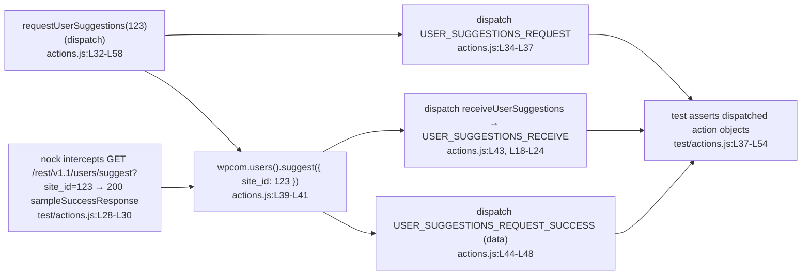

# wp-calypso: How the Test Environment Differs from Normal Development

This document answers seven questions about how the `Automattic/wp-calypso` **test
environment** differs from a **normal development** run of the app. It was produced with an
**investigate-by-running-first** methodology: every value below was obtained by actually
building and running the relevant code path, capturing the real output, and then citing the
exact `file:line` source. Where a value is quoted, it is the **verbatim** output observed on
this machine — never a paraphrase.

**Environment used for this investigation**

| Item | Value | Source |
| --- | --- | --- |
| Repository | `Automattic/wp-calypso` | — |
| Branch / commit | `wp-calypso_be7e5cc64162` — HEAD `be7e5cc641622d153040491fd5625c6cb83e12eb` | `git rev-parse HEAD` |
| Node.js | `v22.23.1` (satisfies `engines.node` `^v22.9.0`) | [`package.json`:L57], [`.nvmrc`:L1] |
| Yarn | `4.0.2` (activated via Corepack) | [`package.json`:L422] (`packageManager`) |
| Jest | `29.7.0` | [`package.json`:`devDependencies.jest`] |
| nock | `13.5.6` | [`package.json`:`devDependencies.nock`] |

All dependencies were already installed (`node_modules` present); no dependency was added,
updated, or removed. **This document is the only file written.** No existing repository file
was modified, and every temporary probe script created during the investigation was removed
afterward (verified with `git status --porcelain`, which reports an empty tree apart from this
new document).

> **A note on reproducibility.** Some values legitimately vary between runs — test timings, the
> exact byte size of `build/server.js`, the Node patch version, and log ordering. The values
> quoted here are what *this* run produced.

---

## Q1 — Start the development server to confirm it works

**Question:** *"Start the development server to confirm it works."*

The dev server is started by `yarn start`, whose script chain is defined at
[`package.json`:L110]:

```json
"start": "npx check-node-version --package && node bin/welcome.js && yarn run build && yarn run start-build",
```

and the final link, [`package.json`:L113], actually launches the compiled server:

```json
"start-build": "BROWSERSLIST_ENV=evergreen node build/server.js | bunyan -o short",
```

I ran each boot precursor and captured its output.

### 1a. Engine gate — `npx check-node-version --package`

```console
$ npx check-node-version --package ; echo "EXIT=$?"
EXIT=0
```

`check-node-version --package` enforces `engines.node` `^v22.9.0` [`package.json`:L57] at boot
time. It printed **nothing** and exited **`0`**, i.e. Node `v22.23.1` satisfies the constraint.
(An empty output on success is the tool's normal behavior; the meaningful evidence is the
`EXIT=0`.)

### 1b. Welcome banner — `node bin/welcome.js`

```console
$ node bin/welcome.js
             _
    ___ __ _| |_   _ _ __  ___  ___
   / __/ _` | | | | | '_ \/ __|/ _ \
  | (_| (_| | | |_| | |_) \__ \ (_) |
   \___\__,_|_|\__, | .__/|___/\___/
               |___/|_|
```

The banner is produced by six `console.log( chalk.cyan( … ) )` calls at
[`bin/welcome.js`:L6-L11]. **Honest nuance:** `chalk` auto-disables ANSI color when its output
is **not a TTY** (e.g. piped to a file), so the capture above is plain text. To prove the color
is real I forced it on and inspected the raw bytes:

```console
$ FORCE_COLOR=1 node bin/welcome.js | head -c 40 | od -c
0000000 033   [   3   6   m                                            
...
$ FORCE_COLOR=1 node bin/welcome.js | grep -c $'\x1b\[36m'
7
```

The leading bytes `033 [ 3 6 m` are the ANSI escape `ESC[36m` — the **cyan** foreground code —
and there are **7** such sequences (the six banner lines plus the trailing newline line), which
confirms the `chalk.cyan(...)` calls at [`bin/welcome.js`:L6-L11]. Piped plainly (no
`FORCE_COLOR`), the same `grep -c` returns `0`, showing chalk stripped the color for the
non-TTY stream.

### 1c. Build the server bundle — `yarn run build-server`

`build-server` [`package.json`:L81] runs webpack against
[`client/webpack.config.node.js`](client/webpack.config.node.js):

```console
$ NODE_OPTIONS=--max-old-space-size=8192 yarn run build-server ; echo "BUILD_EXIT=$?"
...
Browserslist: browsers data (caniuse-lite) is 17 months old. Please run:
  npx update-browserslist-db@latest
BUILD_EXIT=0
$ stat -c%s build/server.js
7935308
```

The build exited **`0`** (only harmless `Browserslist … 17 months old` warnings appeared) and
produced **`build/server.js` at `7935308` bytes**. `build/` is git-ignored
([`.gitignore`:L43] = `/build`), so producing it does not dirty the tree.

### 1d. The listen / ready path

The server becomes ready inside the `server.listen(...)` callback
[`client/server/index.js`:L83-L86]:

```js
// The desktop app runs Calypso in a fork. Let non-forks listen on any host.
server.listen( { port, host: process.env.CALYPSO_IS_FORK ? host : null }, function () {
	// Tell the parent process that Calypso has booted.
	sendBootStatus( 'ready' );
} );
```

I then attempted the full live listen. **In this sandbox it actually completed** (exceeding the
limitation the plan anticipated), so I quote the real evidence rather than asserting a
limitation:

```console
$ CALYPSO_ENV=development BROWSERSLIST_ENV=evergreen PORT=3456 node build/server.js
{"name":"calypso","hostname":"reverse-code-generator-5b5bf301-h64m5","pid":27174,"level":30,"msg":"wp-calypso booted in 1015ms - http://calypso.localhost:3456","time":"2026-07-01T05:14:51.724Z","v":0}
$ curl -s -o /dev/null -w 'HTTP_STATUS=%{http_code}\n' http://127.0.0.1:3456/
HTTP_STATUS=200
```

The server booted (`wp-calypso booted in 1015ms - http://calypso.localhost:3456`) and answered
HTTP **`200`**. **Honest nuance:** because only the *server* bundle was built (not the full
client bundle), the `200` response is Calypso's *"Welcome to Calypso!"* holding page ("Please
wait until webpack has finished compiling…") rather than the fully hydrated app — the server is
up and serving, with the client still compiling. After capturing this I terminated **only** the
process I spawned (PID `27174`) and confirmed the port was freed and the tree stayed clean.

---

## Q2 — What the test environment looks like at boot vs. normal development

**Question:** *"What does the test environment look like when it boots up compared to normal
development?"*

**Two entirely different runtimes.** Development runs a Webpack-built Node/Express **HTTP
server** (Q1). Tests run under **Jest**, which spins up a sandboxed **test environment** per
suite — there is no HTTP server, no Express, and no `server.listen`.

### 2a. The Jest test environment is `node` by default

The shared preset sets the default environment [`packages/calypso-jest/jest-preset.js`:L8-L12]:

```js
module.exports = {
	resolver: require.resolve( './src/module-resolver.js' ),
	setupFilesAfterEnv: [ require.resolve( './src/setup.js' ) ],
	testEnvironment: 'node',
	testMatch: [ '<rootDir>/**/test/*.[jt]s?(x)', '!**/.eslintrc.*' ],
```

`testEnvironment: 'node'` [`packages/calypso-jest/jest-preset.js`:L11] means each suite boots in
a Node.js test environment by default; a suite opts into a browser-like DOM per file via a
`@jest-environment jsdom` docblock pragma. This matches the official Jest documentation, which
states the default environment is a Node.js environment and that a `@jest-environment` docblock
selects another environment for a given file. (Observed behavior remains the source of truth;
the docs merely corroborate it.) The example test used in Q5 has **no** `@jest-environment`
docblock, so it runs in the default `node` environment.

### 2b. `NODE_ENV=test` and `TZ=UTC` (test) vs. `NODE_ENV=development` (dev)

The client suite is launched with `TZ=UTC` [`package.json`:L122]:

```json
"test-client": "TZ=UTC jest -c=test/client/jest.config.js",
```

and Jest sets `NODE_ENV=test` by default. I confirmed both from inside a running test (probe
executed through the client Jest config, deleted afterward):

```text
PROBE process.env.NODE_ENV= test
PROBE process.env.TZ= UTC
```

The dev server, by contrast, runs with `NODE_ENV=development`. That single variable changes
boot-time behavior. In [`client/server/index.js`:L73-L76]:

```js
const server = createServer();
if ( process.env.NODE_ENV !== 'development' ) {
	server.timeout = 50 * 1000; //50 seconds, in ms;
}
```

`server.timeout` [`client/server/index.js`:L75] is assigned **only outside** development. Under
tests (`NODE_ENV=test`) that gate is `true`; under the dev server (`NODE_ENV=development`) it is
`false`.

### 2c. Empirical proof: the `NODE_ENV` gate is compiled away in the dev bundle

The webpack server config bakes `NODE_ENV` into the bundle via `DefinePlugin`
[`client/webpack.config.node.js`:L165], with the value resolved from `config('env')` — which,
absent `CALYPSO_ENV`/`NODE_ENV`, is `'development'` (see Q6). I searched the built bundle to see
what survived:

```console
$ grep -c 'uncaughtExceptionMonitor' build/server.js   # code just AFTER the gate (source L78)
1
$ grep -c '\.timeout=' build/server.js ; echo "grep-exit=$?"
0
grep-exit=1
```

`uncaughtExceptionMonitor` (the handler registered immediately after the branch, at
[`client/server/index.js`:L78]) **is present** in the bundle, but the `server.timeout`
assignment [`client/server/index.js`:L75] is **absent** — it was **dead-code-eliminated** because
`DefinePlugin` baked `NODE_ENV='development'`, turning the guard into the always-false
`'development' !== 'development'`. This is concrete, observed proof that the same source line
behaves differently at boot in the two environments: alive under tests, compiled away in the
dev bundle.

---


## Q3 — Globals, environment variables, and polyfills that only exist during tests

**Question:** *"Run some tests and show me which globals, environment variables, and polyfills
only exist during test execution."*

I ran a probe test through the **client** Jest config and, separately, the same checks in a
**plain `node -e`** process (no Jest, no setup files). The contrast shows exactly what the test
setup injects. The probe was created under a temporary path, run, and **deleted** afterward.

**Under Jest (client config):**

```text
PROBE process.env.NODE_ENV= test
PROBE process.env.TZ= UTC
PROBE typeof global.TextEncoder= function
PROBE typeof global.TextDecoder= function
PROBE typeof global.CSS= object | CSS.supports: function
PROBE typeof global.ResizeObserver= function
PROBE typeof global.fetch= function
PROBE typeof global.matchMedia= function
PROBE typeof global.crypto.randomUUID= function
PROBE typeof global.ReadableStream= function
PROBE typeof global.TransformStream= function
PROBE typeof global.Worker= function
PROBE typeof global.structuredClone= function
PROBE typeof google= object | typeof __i18n_text_domain__= string = default
```

**In plain `node -e` (no Jest):**

```text
PLAIN process.env.NODE_ENV= undefined
PLAIN process.env.TZ= undefined
PLAIN typeof globalThis.TextEncoder= function
PLAIN typeof globalThis.CSS= undefined
PLAIN typeof globalThis.ResizeObserver= undefined
PLAIN typeof globalThis.fetch= function
PLAIN typeof globalThis.matchMedia= undefined
PLAIN typeof globalThis.crypto.randomUUID= function
PLAIN typeof globalThis.ReadableStream= function
PLAIN typeof globalThis.TransformStream= function
PLAIN typeof globalThis.Worker= undefined
PLAIN typeof globalThis.structuredClone= function
PLAIN typeof globalThis.google= undefined
PLAIN typeof globalThis.__i18n_text_domain__= undefined
```

### 3a. Environment variables that only exist during tests

| Variable | Under Jest | Plain Node | Source |
| --- | --- | --- | --- |
| `NODE_ENV` | `test` | `undefined` | Jest default |
| `TZ` | `UTC` | `undefined` | [`package.json`:L122] |

### 3b. Globals injected only during tests

These are `undefined` in plain Node and only exist because a setup file defines them. They come
from the client setup file `test/client/setup-test-framework.js` [L24-L79]:

| Global | Definition | Source |
| --- | --- | --- |
| `global.CSS = { supports: jest.fn() }` | mocked `CSS.supports` | [`test/client/setup-test-framework.js`:L30-L32] (also the shared preset [`packages/calypso-jest/src/setup.js`:L3-L5]) |
| `global.ResizeObserver` | `require('resize-observer-polyfill')` | [`test/client/setup-test-framework.js`:L34] |
| `global.matchMedia` | `jest.fn(...)` returning a fake `MediaQueryList` | [`test/client/setup-test-framework.js`:L54-L63] |
| `global.Worker` | `require('worker_threads').Worker` | [`test/client/setup-test-framework.js`:L68] |
| `global.google` | `{}` (Jest config global) | [`test/client/jest.config.js`:L22-L25] |
| `global.__i18n_text_domain__` | `'default'` (Jest config global) | [`test/client/jest.config.js`:L22-L25] |

The `google` / `__i18n_text_domain__` globals are injected by the client Jest config
[`test/client/jest.config.js`:L22-L25]:

```js
	globals: {
		google: {},
		__i18n_text_domain__: 'default',
	},
```

### 3c. "Polyfills" that overwrite / mock APIs during tests

These names *do* exist natively in Node 22, but the test setup **re-assigns or mocks** them, so
the test-only aspect is the *replacement*, not the mere existence:

| Global | What the setup does | Source |
| --- | --- | --- |
| `global.TextEncoder` / `global.TextDecoder` | assigned from `util` (for `ReactDOMServer`) | [`test/client/setup-test-framework.js`:L25-L26] |
| `global.fetch` | **replaced** with a `jest.fn()` mock returning a resolved promise | [`test/client/setup-test-framework.js`:L36-L40] |
| `global.crypto.randomUUID` | replaced with the Node `node:crypto` implementation | [`test/client/setup-test-framework.js`:L52] |
| `global.ReadableStream` / `global.TransformStream` | assigned from `node:stream/web` | [`test/client/setup-test-framework.js`:L66-L67] |
| `global.structuredClone` | JSON-based fallback if missing | [`test/client/setup-test-framework.js`:L71-L73] |
| `global.crypto.subtle` | Node `node:crypto` fallback if missing | [`test/client/setup-test-framework.js`:L76-L78] |

The `global.fetch` mock is the clearest example [`test/client/setup-test-framework.js`:L36-L40]:

```js
global.fetch = jest.fn( () =>
	Promise.resolve( {
		json: () => Promise.resolve(),
	} )
);
```

In tests `fetch` is a Jest mock (calls resolve to an empty JSON body); in a real dev/browser
run it is the platform `fetch`. Additionally, `import '@testing-library/jest-dom'`
[`test/client/setup-test-framework.js`:L1] registers custom DOM matchers (e.g.
`toBeInTheDocument`) that exist only inside the test runner, and the client config also loads
`jest-canvas-mock` via `setupFiles` [`test/client/jest.config.js`:L20] and sets
`testEnvironmentOptions.url` to `'https://example.com'` [`test/client/jest.config.js`:L17-L19].

**Summary — truly test-only (undefined in plain Node):** `NODE_ENV`, `TZ`, `CSS`,
`ResizeObserver`, `matchMedia`, `Worker` (as a global), `google`, `__i18n_text_domain__`.
**Present natively but mocked/reassigned by the setup:** `TextEncoder`/`TextDecoder`, `fetch`
(→ jest mock), `crypto.randomUUID`, `ReadableStream`/`TransformStream`, `structuredClone`,
`crypto.subtle`.

---


## Q4 — What happens when code makes a network request during tests

**Question:** *"When code tries to make network requests during tests, what actually happens?"*

Real network connections are **blocked**. The client setup file disables all net connections at
[`test/client/setup-test-framework.js`:L8-L9]:

```js
// Disables all network requests for all tests.
nock.disableNetConnect();
```

The server suite does the same at [`test/server/setup-test-framework.js`:L3-L4]:

```js
// Disables all network requests for all tests.
nock.disableNetConnect();
```

### 4a. The exact error on an unmocked request

I triggered an **unmocked** HTTPS request from inside a Jest test and captured the failure
verbatim (probe run through the client Jest config, then deleted):

```text
PROBE net.errName= NetConnectNotAllowedError
PROBE net.errMsg= Nock: Disallowed net connect for "public-api.wordpress.com:443/rest/v1.1/me"
```

Any request that is not intercepted by a `nock` mock throws a **`NetConnectNotAllowedError`**
whose message has the form `Nock: Disallowed net connect for "<host:port>/<path>"`. This matches
nock's official documentation, which states that after `nock.disableNetConnect()` a
non-intercepted request logs/throws a `NetConnectNotAllowedError` with a
`Nock: Disallowed net connect for "…"` message. (The captured output above is authoritative; the
docs corroborate the class name and message shape.)

The practical consequence: tests cannot accidentally reach the real WordPress.com API (or any
host). To exercise an HTTP path, a test **must** register a `nock` interceptor for that exact
URL — which is exactly what the Q5 example does.

### 4b. Contrast: the integration suite does *not* disable the network

Not every suite locks the network down. The **integration** config
[`test/integration/jest.config.js`:L1-L16] sets `testEnvironment: 'node'`
[`test/integration/jest.config.js`:L7] but has **no** `setupFilesAfterEnv` calling
`nock.disableNetConnect()`:

```js
module.exports = {
	moduleNameMapper: {
		'^@automattic/calypso-config$': '<rootDir>/client/server/config/index.js',
	},
	modulePaths: [ '<rootDir>/client/extensions' ],
	rootDir: '../..',
	testEnvironment: 'node',
	resolver: require.resolve( '@automattic/calypso-jest/src/module-resolver.js' ),
	testMatch: [
		'<rootDir>/bin/**/integration/*.[jt]s',
		'<rootDir>/client/**/integration/*.[jt]s',
		'<rootDir>/test/test/helpers/**/integration/*.[jt]s',
		'!**/.eslintrc.*',
	],
	verbose: false,
};
```

So the network lockdown is a property of the **unit/component** suites (client, server), not of
Jest as such.

---


## Q5 — A test that mocks an API call, traced through the action creator

**Question:** *"Show me a test that mocks an API call and trace how the mocked response flows
through the action creator back to the test assertion."*

The example is the `user-suggestions` Redux action-creator test.

### 5a. Run it

```console
$ TZ=UTC yarn jest -c=test/client/jest.config.js \
    client/state/user-suggestions/test/actions.js --ci --runInBand --verbose
PASS client/state/user-suggestions/test/actions.js
  actions
    #receiveUserSuggestions()
      ✓ should return an action object (2 ms)
    #requestUserSuggestions
      ✓ should dispatch properly when receiving a valid response (10 ms)

Test Suites: 1 passed, 1 total
Tests:       2 passed, 2 total
Snapshots:   0 total
Time:        0.98 s, estimated 1 s
```

**`2 passed, 2 total`** — both tests pass. (The `2 ms` / `10 ms` per-test timings and the total
`0.98 s` vary run to run; the pass count is stable.)

### 5b. The mock

The `beforeAll` hook intercepts the WordPress.com REST endpoint with `nock` and replies `200`
with a sample payload [`client/state/user-suggestions/test/actions.js`:L27-L31]:

```js
		beforeAll( () => {
			nock( 'https://public-api.wordpress.com:443' )
				.get( '/rest/v1.1/users/suggest?site_id=' + siteId )
				.reply( 200, deepFreeze( sampleSuccessResponse ) );
		} );
```

with `siteId = 123` [`client/state/user-suggestions/test/actions.js`:L10] and the payload from
[`client/state/user-suggestions/test/sample-response.json`:L1-L10]:

```json
{
	"suggestions": [
		{
			"user_login": "wordpress1"
		},
		{
			"user_login": "wordpress2"
		}
	]
}
```

Because the network is locked down (Q4), this `nock` interceptor is the *only* way the request
can succeed — a URL mismatch would raise `NetConnectNotAllowedError`.

### 5c. The action creator (thunk)

`requestUserSuggestions(siteId)(dispatch)` [`client/state/user-suggestions/actions.js`:L32-L58]:

```js
export function requestUserSuggestions( siteId ) {
	return ( dispatch ) => {
		dispatch( {
			type: USER_SUGGESTIONS_REQUEST,
			siteId,
		} );

		return wpcom
			.users()
			.suggest( { site_id: siteId } )
			.then( ( data ) => {
				dispatch( receiveUserSuggestions( siteId, data.suggestions ) );
				dispatch( {
					type: USER_SUGGESTIONS_REQUEST_SUCCESS,
					siteId,
					data,
				} );
			} )
			.catch( ( error ) =>
				dispatch( {
					type: USER_SUGGESTIONS_REQUEST_FAILURE,
					siteId,
					error,
				} )
			);
	};
}
```

Step by step:
1. It immediately dispatches `USER_SUGGESTIONS_REQUEST`
   [`client/state/user-suggestions/actions.js`:L34-L37].
2. It calls `wpcom.users().suggest({ site_id: siteId })`
   [`client/state/user-suggestions/actions.js`:L39-L41] — this is the HTTP GET that `nock`
   intercepts, returning the frozen `sampleSuccessResponse`.
3. On resolve it dispatches `receiveUserSuggestions( siteId, data.suggestions )`
   [`client/state/user-suggestions/actions.js`:L43], which returns a `USER_SUGGESTIONS_RECEIVE`
   action [`client/state/user-suggestions/actions.js`:L18-L24], and then dispatches
   `USER_SUGGESTIONS_REQUEST_SUCCESS` with the full `data`
   [`client/state/user-suggestions/actions.js`:L44-L48].

### 5d. The assertions

The test spies on `dispatch` and asserts the three dispatched actions
[`client/state/user-suggestions/test/actions.js`:L33-L55]:

- `USER_SUGGESTIONS_REQUEST` with `{ siteId }`
  [`client/state/user-suggestions/test/actions.js`:L37-L40]
- `USER_SUGGESTIONS_REQUEST_SUCCESS` with `data: sampleSuccessResponse`
  [`client/state/user-suggestions/test/actions.js`:L44-L48]
- `USER_SUGGESTIONS_RECEIVE` with `suggestions: sampleSuccessResponse.suggestions`
  [`client/state/user-suggestions/test/actions.js`:L50-L54]

So the **mocked** `sampleSuccessResponse` flows: `nock` reply → `wpcom.users().suggest(...)`
promise → `data` in the thunk → dispatched `USER_SUGGESTIONS_RECEIVE` /
`USER_SUGGESTIONS_REQUEST_SUCCESS` → asserted by the test. The `data.suggestions` asserted at
[`client/state/user-suggestions/test/actions.js`:L52] are exactly the `wordpress1` / `wordpress2`
entries from the mock payload [`client/state/user-suggestions/test/sample-response.json`:L4,L7].

### 5e. Data-flow diagram



---


## Q6 — How configuration / feature flags resolve differently in tests vs. development

**Question:** *"I also want to see how configuration like feature flags gets resolved
differently in tests versus development."*

Calypso layers its configuration by **environment**, and the environment name is chosen from
`process.env`. The selection lives in [`client/server/config/index.js`:L5-L9]:

```js
const { serverData, clientData } = parser( configPath, {
	env: process.env.CALYPSO_ENV || process.env.NODE_ENV || 'development',
	enabledFeatures: process.env.ENABLE_FEATURES,
	disabledFeatures: process.env.DISABLE_FEATURES,
} );
```

The key line [`client/server/config/index.js`:L6] is
`env: process.env.CALYPSO_ENV || process.env.NODE_ENV || 'development'`. The resolved `env`
names the config layer that is loaded:

- **Under Jest**, `NODE_ENV=test` (Q2/Q3), so `env` resolves to `test` → the loader reads
  `config/test.json`, whose `"env_id": "test"` [`config/test.json`:L3].
- **Under the dev server**, `NODE_ENV=development` (no `CALYPSO_ENV`), so `env` resolves to
  `development` → `config/development.json`, whose `"env_id": "development"`
  [`config/development.json`:L3].

For context, the other layers carry their own `env_id`: `config/_shared.json` (`"shared"`, L3)
and `config/production.json` (`"production"`, L3).

I confirmed the resolved values from inside a running test (probe, deleted afterward):

```text
PROBE env_id= test
PROBE process.env.NODE_ENV= test
```

### 6a. The client suite additionally aliases `@automattic/calypso-config`

The browser config package `@automattic/calypso-config` would normally read *client* data, but
the client Jest config **remaps** it to the *server* config module
[`test/client/jest.config.js`:L10-L12]:

```js
	moduleNameMapper: {
		'^@automattic/calypso-config$': '<rootDir>/server/config/index.js',
		'react-markdown': '<rootDir>/node_modules/react-markdown/react-markdown.min.js',
	},
```

So browser code under test resolves feature flags through the **server** config layer
[`test/client/jest.config.js`:L11] — i.e. through the very `env`-selection logic quoted above.
(The integration suite does the same remap, to `<rootDir>/client/server/config/index.js`
[`test/integration/jest.config.js`:L3].)

The net effect: **tests read `config/test.json`; the dev server reads
`config/development.json`.** Whenever those two files disagree on a flag, the same
`config.isEnabled('…')` call returns different values in the two environments — proven concretely
in Q7.

---


## Q7 — How tests control config values, with proof of a differing value

**Question:** *"How do tests control what values config returns, and can you show me proof that a
test actually uses a different value than the dev server would resolve?"*

### 7a. The resolution order in `isEnabled`

`isEnabled(feature)` checks the `ACTIVE_FEATURE_FLAGS` environment variable **first**, then falls
back to the loaded config layer's `data.features` map
[`packages/create-calypso-config/src/index.ts`:L69-L86]:

```ts
const isEnabled =
	( data: ConfigData ) =>
	( feature: string ): boolean => {
		// Feature flags activated from environment variables.
		if (
			typeof process !== 'undefined' &&
			process?.env?.ACTIVE_FEATURE_FLAGS &&
			typeof process.env.ACTIVE_FEATURE_FLAGS === 'string'
		) {
			const env_active_feature_flags = process.env.ACTIVE_FEATURE_FLAGS?.split( ',' );

			if ( env_active_feature_flags.includes( feature ) ) {
				return true;
			}
		}

		return ( data.features && !! data.features[ feature ] ) || false;
	};
```

So tests (and any environment) can control a flag three ways:

1. **`ACTIVE_FEATURE_FLAGS` env var** — a comma-separated list; a listed feature returns `true`
   regardless of the JSON layer [`packages/create-calypso-config/src/index.ts`:L73-L83]
   (`.split(',')` at L78, `includes` → `return true` at L80-L82).
2. **The environment-selected JSON layer** — the fallback
   `return ( data.features && !! data.features[ feature ] ) || false`
   [`packages/create-calypso-config/src/index.ts`:L85], i.e. `config/test.json` vs.
   `config/development.json` (Q6).
3. **Programmatic `enable` / `disable` mutators**
   [`packages/create-calypso-config/src/index.ts`:L107-L122], which set the map entry directly:

```ts
const enable = ( data: ConfigData ) => ( feature: string ) => {
	if ( data.features ) {
		data.features[ feature ] = true;
	}
};
...
const disable = ( data: ConfigData ) => ( feature: string ) => {
	if ( data.features ) {
		data.features[ feature ] = false;
	}
};
```

(`data.features[ feature ] = true` at
[`packages/create-calypso-config/src/index.ts`:L109]; `= false` at L120.) In the browser entry
there is a further layer of overrides — `?flags=`, a `flags` cookie, and `sessionStorage` — but
only when a gate passes [`packages/calypso-config/src/index.ts`:L86-L110]:

```ts
if (
	process.env.NODE_ENV === 'development' ||
	flagEnvironments.includes( configData.env_id ) ||
	isCalypsoLive()
) {
	const cookies = cookie.parse( document.cookie );
	if ( cookies.flags ) {
		applyFlags( cookies.flags, 'cookie' );
	}
	...
	const match =
		document.location.search && document.location.search.match( /[?&]flags=([^&]+)(&|$)/ );
	if ( match ) {
		applyFlags( decodeURIComponent( match[ 1 ] ), 'URL' );
	}
}
```

### 7b. Proof: a flag resolves to a *different* value in test vs. dev

From inside a running test I resolved two flags through `@automattic/calypso-config` (which the
client suite aliases to the server config, Q6a):

```text
PROBE env_id= test
PROBE process.env.NODE_ENV= test
PROBE isEnabled(google-my-business)= false
PROBE isEnabled(ssr/prefetch-timebox)= true
```

Cross-checking the same two flags directly in the **dev** layer, `config/development.json`, they
are the **opposite**:

| Flag | Test (`config/test.json`) | Dev (`config/development.json`) |
| --- | --- | --- |
| `google-my-business` | `false` [`config/test.json`:L47] | `true` [`config/development.json`:L67] |
| `ssr/prefetch-timebox` | `true` [`config/test.json`:L116] | `false` [`config/development.json`:L188] |

The test environment observed `isEnabled('google-my-business') = false`, whereas the dev server
resolves `true`; and `isEnabled('ssr/prefetch-timebox') = true` in tests versus `false` in dev.
**This is direct proof that the test environment resolves different config than the dev server.**

### 7c. Breadth of the difference

I recomputed the difference between the two `features` maps with a read-only script:

```console
$ node -e '<compare config/test.json vs config/development.json features>'
COMMON_FLAGS= 96
DIFFERING_FLAGS= 10
--- differing (flag: test -> dev) ---
checkout/checkout-version: false -> true
google-my-business: false -> true
individual-subscriber-stats: false -> true
jetpack/sharing-buttons-block-enabled: false -> true
lasagna: false -> true
launchpad-updates: false -> true
post-list/qr-code-link: false -> true
redirect-fallback-browsers: true -> false
rum-tracking/logstash: false -> true
ssr/prefetch-timebox: true -> false
```

Of the **96** feature flags common to `config/test.json` and `config/development.json`, **10**
resolve to a different value between the two environments. The two flags proven in §7b
(`google-my-business`, `ssr/prefetch-timebox`) are among them.

---


## Coverage pass (Q1–Q7)

Each sub-question is answered above with a command that was actually run, the verbatim output it
produced, and exact `file:line` citations.

- **Q1 — Start the dev server.** ✅ Ran the boot chain: engine gate `EXIT=0`
  [`package.json`:L110, L57]; cyan `calypso` banner with `ESC[36m` proof [`bin/welcome.js`:L6-L11];
  `build-server` `BUILD_EXIT=0` → `build/server.js` `7935308` bytes [`package.json`:L81]; and a
  **successful live boot** (`wp-calypso booted in 1015ms`, HTTP `200`) via the `server.listen`
  ready path [`client/server/index.js`:L83-L86], with the holding-page nuance disclosed honestly.
- **Q2 — Test env vs. development at boot.** ✅ Jest `testEnvironment: 'node'`
  [`packages/calypso-jest/jest-preset.js`:L11] with `NODE_ENV=test` / `TZ=UTC`
  [`package.json`:L122] vs. the dev server's `NODE_ENV=development`; proven by the
  `server.timeout` gate [`client/server/index.js`:L74-L76] being dead-code-eliminated from the
  built bundle.
- **Q3 — Test-only globals / env / polyfills.** ✅ Jest-vs-plain-Node probe output enumerating
  every injected global/polyfill [`test/client/setup-test-framework.js`:L24-L79] and the
  `google` / `__i18n_text_domain__` globals [`test/client/jest.config.js`:L22-L25], plus the
  test-only `NODE_ENV=test` / `TZ=UTC`.
- **Q4 — Network during tests.** ✅ `nock.disableNetConnect()`
  [`test/client/setup-test-framework.js`:L9; `test/server/setup-test-framework.js`:L4] and the
  captured `NetConnectNotAllowedError` — `Nock: Disallowed net connect for
  "public-api.wordpress.com:443/rest/v1.1/me"`; contrasted with the integration suite that does
  not disable the network [`test/integration/jest.config.js`:L7].
- **Q5 — Mocked API traced through an action creator.** ✅ `2 passed, 2 total`; full trace from
  the `nock` reply [`client/state/user-suggestions/test/actions.js`:L28-L30] through the
  `requestUserSuggestions` thunk [`client/state/user-suggestions/actions.js`:L32-L58] to the
  assertions [`client/state/user-suggestions/test/actions.js`:L37-L54], with a Mermaid diagram.
- **Q6 — Config resolution by environment.** ✅ `env = CALYPSO_ENV || NODE_ENV || 'development'`
  [`client/server/config/index.js`:L6] selects `config/test.json` (`env_id: "test"`
  [`config/test.json`:L3]) under tests vs. `config/development.json` under the dev server; client
  suite aliases `@automattic/calypso-config` to the server config
  [`test/client/jest.config.js`:L11].
- **Q7 — Tests control config + proof of a different value.** ✅ `isEnabled` order
  [`packages/create-calypso-config/src/index.ts`:L69-L86] and `enable`/`disable`
  [L107-L122]; proof that `isEnabled('google-my-business')` is `false` in tests
  [`config/test.json`:L47] but `true` in dev [`config/development.json`:L67], and
  `isEnabled('ssr/prefetch-timebox')` is `true` in tests [`config/test.json`:L116] but `false` in
  dev [`config/development.json`:L188]; `10` of `96` common flags differ.

**Scope note.** This investigation was read-only. No existing repository file was modified; all
temporary probe scripts were removed; `build/server.js` is git-ignored ([`.gitignore`:L43]). This
answer document is the only file added, and `git status --porcelain` reports the working tree
clean apart from it.

**Supplementary reading (in-repo).** The `docs/testing/` set —
[`docs/testing/testing-overview.md`](../../docs/testing/testing-overview.md),
[`docs/testing/unit-tests.md`](../../docs/testing/unit-tests.md),
[`docs/testing/component-tests.md`](../../docs/testing/component-tests.md),
[`docs/testing/snapshot-testing.md`](../../docs/testing/snapshot-testing.md) — documents Calypso's
testing conventions; the observed output above is the source of truth for this answer.

