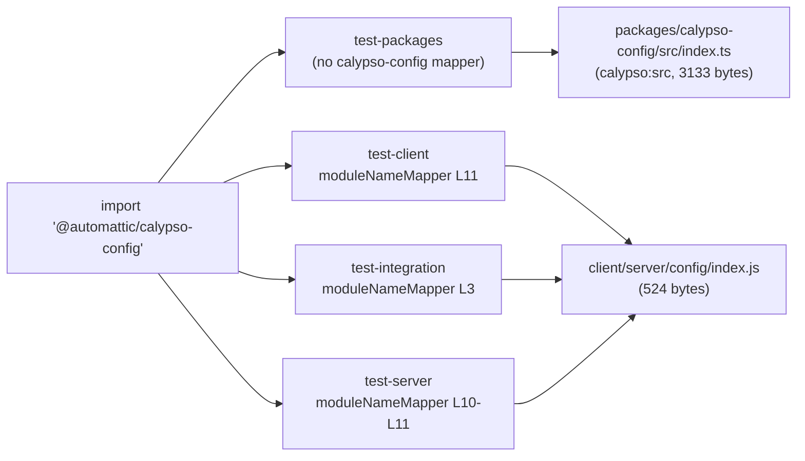

# Why `wp-calypso` Jest tests pass in isolation but fail in a full‑suite run

**An empirical, run‑first investigation of module resolution and environment setup across the seven Jest execution contexts**

---

## TL;DR (direct thesis)

Tests that pass alone but fail in a full run do so because **the same test file means different things in different execution contexts**. Three independent mechanisms, all confirmed at runtime through the real Jest configs, produce the divergence:

1. **Per‑suite `testEnvironment` (node vs jsdom), plus per‑file / per‑project opt‑ins.** The shared preset defaults every suite to **`node`** (`packages/calypso-jest/jest-preset.js:L11`). `test-client`, `test-server`, `test-build-tools`, and `test-integration` all run under **`jest-environment-node`**; `test-apps` forces **`jsdom`** globally (`test/apps/jest-preset.js:L7`); and `test-packages` is **mixed** (36 node + 22 jsdom projects). The client suite is `node` at the suite level and only becomes `jsdom` per file via an `@jest-environment jsdom` docblock (**498** client files carry it).
2. **Per‑suite `moduleNameMapper` redirects layered on a `calypso:src`‑first custom resolver.** The custom `enhanced-resolve` resolver (`packages/calypso-jest/src/module-resolver.js:L18`) prefers untranspiled source, and each suite adds its own redirects — so the _same_ import string (`@automattic/calypso-config`) resolves to **two different files** depending on the suite.
3. **Browser‑global provisioning timed to `setupFilesAfterEnv`.** jsdom provides `window`/`document` at environment‑construction time, but `fetch`/`matchMedia`/`ResizeObserver` are installed later by `test/client/setup-test-framework.js` (which runs in `setupFilesAfterEnv`). A file that assumes those globals passes only where that setup file is wired in.

**Toolchain / prerequisite.** Everything below was produced under the pinned toolchain — **Node.js 22.9.0** (`.nvmrc:L1`; `package.json:L57` engines `"node": "^v22.9.0"`) and **Yarn 4.0.2** via Corepack (`package.json:L422`; `.yarnrc.yml:L5`) — after the one‑time prerequisite `corepack yarn install` (the repository root ships without `node_modules`). The container reports **Node v22.23.1**, which is on the pinned `^v22.9.0` 22.x line; this matters for Q2 because Node 22 provides a **native global `fetch`**.

> **Evidence & reproducibility discipline.** Every claim below is backed by the _exact command executed_ and its _complete, unedited output_ (benign noise — the Browserslist "caniuse‑lite is 17 months old" notice — is kept verbatim). Every count/order claim was reproduced **at least twice** and was **identical across runs**; this is stated per section. The absolute checkout prefix that appears in the outputs is:
>
> `/tmp/blitzy/wp-calypso/blitzy-f2a8184c-fd7c-43d0-9446-cc645dc1aa89_72bcd5`
>
> (referred to as `<REPO>` in prose). All observations were produced by running the actual `test-*` Jest configs — the canonical entry points — never by re‑implementing the resolver or hand‑mocking the environment. The one exception, the Q5 "extended config," **spreads the real client config and only _adds_ `console.log` observation hooks**; this is disclosed transparently in Q5 and bypasses no real hook.

---

## Investigation method and environment prep

The repository root has no installed `node_modules` on a fresh checkout, so the prerequisite step (environment prep, **not** a repository change) is:

```
corepack yarn install
```

All suites are then exercised through their canonical entry points, which are the seven `test-*` npm scripts in `package.json` and the Jest configs they reference. Temporary probe test files were created under directories that were deleted afterward; the repository ends **byte‑for‑byte unchanged except for this document** (see the final "Repository integrity" section for the `git status` proof).

---

## Q1 — "Run the different test commands available in this codebase. What runtime environment does each actually use during execution, and how do they differ?"

### Direct answer

There are **seven** `test-*` npm scripts. The shared preset defaults every suite's `testEnvironment` to **`node`** (`packages/calypso-jest/jest-preset.js:L11`). The **effective** environments are:

| `test-*` script    | Config                            | Effective `testEnvironment`                                                   | `rootDir`              |
| ------------------ | --------------------------------- | ----------------------------------------------------------------------------- | ---------------------- |
| `test-client`      | `test/client/jest.config.js`      | **`jest-environment-node`** (jsdom only per‑file via docblock)                | `<REPO>/client`        |
| `test-server`      | `test/server/jest.config.js`      | **`jest-environment-node`**                                                   | `<REPO>/client/server` |
| `test-build-tools` | `test/build-tools/jest.config.js` | **`jest-environment-node`**                                                   | `<REPO>/build-tools`   |
| `test-integration` | `test/integration/jest.config.js` | **`jest-environment-node`** (set explicitly, `L7`)                            | `<REPO>`               |
| `test-apps`        | `test/apps/jest.config.js`        | **`jest-environment-jsdom`** (forced globally, `test/apps/jest-preset.js:L7`) | multi‑project          |
| `test-packages`    | `test/packages/jest.config.js`    | **mixed: 22 jsdom + 36 node** (58 projects)                                   | multi‑project          |
| `test`             | _(aggregate)_                     | chains `test-client test-packages test-server test-build-tools`               | —                      |

The aggregate `test` script `[package.json:L120]` = `run-s -s test-client test-packages test-server test-build-tools`; note it chains **four** suites and does **not** include `test-apps` or `test-integration`.

The seven scripts, cited exactly:

- `test` `[package.json:L120]` = `run-s -s test-client test-packages test-server test-build-tools`
- `test-build-tools` `[package.json:L121]` = `jest -c=test/build-tools/jest.config.js`
- `test-client` `[package.json:L122]` = `TZ=UTC jest -c=test/client/jest.config.js`
- `test-integration` `[package.json:L125]` = `jest -c=test/integration/jest.config.js`
- `test-apps` `[package.json:L127]` = `jest -c=test/apps/jest.config.js`
- `test-packages` `[package.json:L129]` = `jest -c=test/packages/jest.config.js`
- `test-server` `[package.json:L131]` = `jest -c=test/server/jest.config.js`

### Exact commands and complete output

The canonical way to read the _effective_ environment is `jest --showConfig`, which prints the resolved absolute path of the `testEnvironment` module.

```
corepack yarn jest --showConfig -c=test/client/jest.config.js | grep -E '"testEnvironment"|"rootDir"'
```

```
      "rootDir": "/tmp/blitzy/wp-calypso/blitzy-f2a8184c-fd7c-43d0-9446-cc645dc1aa89_72bcd5/client",
      "testEnvironment": "/tmp/blitzy/wp-calypso/blitzy-f2a8184c-fd7c-43d0-9446-cc645dc1aa89_72bcd5/node_modules/jest-environment-node/build/index.js",
    "rootDir": "/tmp/blitzy/wp-calypso/blitzy-f2a8184c-fd7c-43d0-9446-cc645dc1aa89_72bcd5/client",
```

```
corepack yarn jest --showConfig -c=test/server/jest.config.js | grep -E '"testEnvironment"|"rootDir"'
```

```
      "rootDir": "/tmp/blitzy/wp-calypso/blitzy-f2a8184c-fd7c-43d0-9446-cc645dc1aa89_72bcd5/client/server",
      "testEnvironment": "/tmp/blitzy/wp-calypso/blitzy-f2a8184c-fd7c-43d0-9446-cc645dc1aa89_72bcd5/node_modules/jest-environment-node/build/index.js",
    "rootDir": "/tmp/blitzy/wp-calypso/blitzy-f2a8184c-fd7c-43d0-9446-cc645dc1aa89_72bcd5/client/server",
```

```
corepack yarn jest --showConfig -c=test/build-tools/jest.config.js | grep -E '"testEnvironment"|"rootDir"'
```

```
      "rootDir": "/tmp/blitzy/wp-calypso/blitzy-f2a8184c-fd7c-43d0-9446-cc645dc1aa89_72bcd5/build-tools",
      "testEnvironment": "/tmp/blitzy/wp-calypso/blitzy-f2a8184c-fd7c-43d0-9446-cc645dc1aa89_72bcd5/node_modules/jest-environment-node/build/index.js",
    "rootDir": "/tmp/blitzy/wp-calypso/blitzy-f2a8184c-fd7c-43d0-9446-cc645dc1aa89_72bcd5/build-tools",
```

```
corepack yarn jest --showConfig -c=test/integration/jest.config.js | grep -E '"testEnvironment"|"rootDir"'
```

```
      "rootDir": "/tmp/blitzy/wp-calypso/blitzy-f2a8184c-fd7c-43d0-9446-cc645dc1aa89_72bcd5",
      "testEnvironment": "/tmp/blitzy/wp-calypso/blitzy-f2a8184c-fd7c-43d0-9446-cc645dc1aa89_72bcd5/node_modules/jest-environment-node/build/index.js",
    "rootDir": "/tmp/blitzy/wp-calypso/blitzy-f2a8184c-fd7c-43d0-9446-cc645dc1aa89_72bcd5",
```

For the two **multi‑project** runners, the effective environments are tallied across all discovered projects:

```
corepack yarn jest --showConfig -c=test/packages/jest.config.js | grep -E '"testEnvironment"' | sed -E 's|.*/node_modules/||; s|/build/index.js"||' | sort | uniq -c
```

```
     22 jest-environment-jsdom,
     36 jest-environment-node,
```

```
corepack yarn jest --showConfig -c=test/apps/jest.config.js | grep -E '"testEnvironment"' | sed -E 's|.*/node_modules/||; s|/build/index.js"||' | sort | uniq -c
```

```
      3 jest-environment-jsdom,
```

The per‑suite `setupFiles` / `setupFilesAfterEnv` (which matter for Q2/Q5) resolve as follows for the single‑project suites:

```
corepack yarn jest --showConfig -c=test/client/jest.config.js | grep -E '"setupFiles"|"setupFilesAfterEnv"|jest-canvas-mock|setup-test-framework|src/setup.js'
```

```
      "setupFiles": [
        "<REPO>/node_modules/jest-canvas-mock/lib/index.js"
      "setupFilesAfterEnv": [
        "<REPO>/test/client/setup-test-framework.js"
```

- **client** → `setupFiles: [jest-canvas-mock]`, `setupFilesAfterEnv: [test/client/setup-test-framework.js]`
- **server** → `setupFiles: []`, `setupFilesAfterEnv: [test/server/setup-test-framework.js]`
- **build-tools** → `setupFiles: []`, `setupFilesAfterEnv: [packages/calypso-jest/src/setup.js]` (inherits the base preset's setup)
- **integration** → `setupFiles: []`, `setupFilesAfterEnv: []` (a standalone config that does not spread the base preset)

### `file:line` grounding & rationale

The differences follow a clear inheritance/override pattern:

- The base preset sets the default `testEnvironment: 'node'` (`packages/calypso-jest/jest-preset.js:L11`) and wires the shared `resolver` (`L9`), `setupFilesAfterEnv: ['./src/setup.js']` (`L10`), and `testMatch: ['<rootDir>/**/test/*.[jt]s?(x)', '!**/.eslintrc.*']` (`L12`), excluding `/dist/` via `testPathIgnorePatterns` (`L17`).
- **server** and **build-tools** inherit `node` by spreading the base (`...base`) without a `testEnvironment` key.
- **client** also inherits `node` at the suite level — `test/client/jest.config.js` has **no** `testEnvironment` key — and opts into jsdom **per file** through the `@jest-environment jsdom` docblock.
- **integration** sets `node` **explicitly** at `test/integration/jest.config.js:L7`.
- **apps** overrides the environment **wholesale** to `jsdom` in its preset at `test/apps/jest-preset.js:L7`; each app config is just `{ preset: '../../test/apps/jest-preset.js' }`.
- **packages** is a multi‑project runner (`projects: ['<rootDir>/packages/*/jest.config.js']`, `test/packages/jest.config.js:L4`); each package's own `jest.config.js` decides its environment, giving the mixed 36 node / 22 jsdom split.

The count of jsdom opt‑ins was measured directly:

```
grep -rl "@jest-environment jsdom" client --include=*.js --include=*.jsx --include=*.ts --include=*.tsx | wc -l
```

```
498
```

```
grep -rl jsdom packages/*/jest.config.js | wc -l
```

```
22
```

**Stability:** every `--showConfig` result above, the `22 jsdom / 36 node` packages split, the `3 jsdom` apps tally, the **498** client jsdom‑docblock count, and the **22** jsdom package configs were each **reproduced twice and were byte‑for‑byte identical** across the two runs.

---

## Q2 — "Compare what's available globally in each context and identify something that exists in one but not another."

### Direct answer

Under the **client (jsdom)** context, `global.matchMedia` is a **`function`**; under the **server (node)** context it is **`undefined`**. `matchMedia` is installed by `test/client/setup-test-framework.js:L54`, which the server setup never does. Other globals that exist client‑side but not server‑side: **`window`** and **`document`** (from the jsdom `testEnvironment`), **`ResizeObserver`** (`setup-test-framework.js:L34`), **`CSS`** (`L30`), and **`Worker`** (`L68`).

**Critical empirical correction (exactly what running first catches):** `fetch` is **not** a valid differentiator — it is a `function` in **both** contexts because **Node.js 22 provides a native global `fetch`**. The same is true of `structuredClone`, `TextEncoder`, and `ReadableStream` (all Node 22 natives). So the headline "exists in one but not the other" example is **`matchMedia`**, not `fetch`.

### Exact commands and complete output

Two probe test files were placed under the real client and server discovery paths — the jsdom probe carries the `@jest-environment jsdom` docblock; the node probe does not — and each was run through its real suite config:

```
CI=1 corepack yarn jest -c=test/client/jest.config.js blitzy_probe_tmp
```

```
Browserslist: browsers data (caniuse-lite) is 17 months old. Please run:
  npx update-browserslist-db@latest
  Why you should do it regularly: https://github.com/browserslist/update-db#readme
PASS client/blitzy_probe_tmp/test/globals-probe.js
  ● Console

    console.log
      BLITZY_PROBE MODULE_EVAL {"window":"object","document":"object","fetch":"function","matchMedia":"function","ResizeObserver":"function","structuredClone":"function","CSS":"object","TextEncoder":"function","Worker":"function","ReadableStream":"function"}

      at log (blitzy_probe_tmp/test/globals-probe.js:6:10)

    console.log
      BLITZY_PROBE TEST_BODY {"window":"object","document":"object","fetch":"function","matchMedia":"function","ResizeObserver":"function","structuredClone":"function","CSS":"object","TextEncoder":"function","Worker":"function","ReadableStream":"function"}

      at log (blitzy_probe_tmp/test/globals-probe.js:6:10)


Test Suites: 1 passed, 1 total
Tests:       1 passed, 1 total
Snapshots:   0 total
Time:        1.023 s
Ran all test suites matching /blitzy_probe_tmp/i.
```

```
CI=1 corepack yarn jest -c=test/server/jest.config.js blitzy_probe_tmp
```

```
Browserslist: browsers data (caniuse-lite) is 17 months old. Please run:
  npx update-browserslist-db@latest
  Why you should do it regularly: https://github.com/browserslist/update-db#readme
PASS client/server/blitzy_probe_tmp/test/globals-probe.js
  ● Console

    console.log
      BLITZY_PROBE MODULE_EVAL {"window":"undefined","document":"undefined","fetch":"function","matchMedia":"undefined","ResizeObserver":"undefined","structuredClone":"function","CSS":"undefined","TextEncoder":"function","Worker":"undefined","ReadableStream":"function"}

      at log (blitzy_probe_tmp/test/globals-probe.js:3:10)

    console.log
      BLITZY_PROBE TEST_BODY {"window":"undefined","document":"undefined","fetch":"function","matchMedia":"undefined","ResizeObserver":"undefined","structuredClone":"function","CSS":"undefined","TextEncoder":"function","Worker":"undefined","ReadableStream":"function"}

      at log (blitzy_probe_tmp/test/globals-probe.js:3:10)


Test Suites: 1 passed, 1 total
Tests:       1 passed, 1 total
Snapshots:   0 total
Time:        0.601 s
Ran all test suites matching /blitzy_probe_tmp/i.
```

### Side‑by‑side global surface

| Global            | client (jsdom) | server (node) | Client‑only?        |
| ----------------- | -------------- | ------------- | ------------------- |
| `window`          | `object`       | `undefined`   | **Yes**             |
| `document`        | `object`       | `undefined`   | **Yes**             |
| `matchMedia`      | `function`     | `undefined`   | **Yes** (headline)  |
| `ResizeObserver`  | `function`     | `undefined`   | **Yes**             |
| `CSS`             | `object`       | `undefined`   | **Yes**             |
| `Worker`          | `function`     | `undefined`   | **Yes**             |
| `fetch`           | `function`     | `function`    | No (Node 22 native) |
| `structuredClone` | `function`     | `function`    | No (Node 22 native) |
| `TextEncoder`     | `function`     | `function`    | No (Node 22 native) |
| `ReadableStream`  | `function`     | `function`    | No (Node 22 native) |

### `file:line` grounding & rationale

The client suite's globals come from `test/client/setup-test-framework.js`, which imports/installs, by name: `@testing-library/jest-dom` (`L1`), `nock.disableNetConnect()` (`L9`), `global.TextEncoder` (`L25`), `global.CSS` (`L30`), `global.ResizeObserver` (`L34`), `global.fetch` (`L36`), a `wpcom-proxy-request` mock (`L44`), `crypto.randomUUID` (`L52`), `global.matchMedia` (`L54`), `global.ReadableStream` (`L66`), `global.Worker` (`L68`), `global.structuredClone` (`L71-L73`), and `crypto.subtle` (`L76-L78`).

By contrast, `test/server/setup-test-framework.js` is **23 lines total** and installs **no browser globals** — only `nock.disableNetConnect()` (`L4`), the nock lifecycle hooks (`L6-L17`), and a `wpcom-proxy-request` mock (`L21`) whose comment explains it is mocked "because it accesses the `document` global" (`L19-L20`).

A subtlety about `CSS`: it is `undefined` in the **server** context because the server config's `setupFilesAfterEnv` (`test/server/jest.config.js:L13`) **replaces** the base preset's `src/setup.js` — the file that would otherwise set `global.CSS` (`packages/calypso-jest/src/setup.js:L3-L5`). The **client** context, on the other hand, sets `global.CSS` directly in its own setup at `test/client/setup-test-framework.js:L30`, so `CSS` is `object` there. (This also explains why `test-build-tools`, which inherits the base `src/setup.js`, would have `CSS` available even though it is a `node` environment.)

**Stability:** the `BLITZY_PROBE MODULE_EVAL` line was byte‑identical to `TEST_BODY`, and both the client and server outputs were **reproduced twice and were identical** across runs.

---

## Q3 — "Find a monorepo package that depends on another internal package from this same repo. Run its tests and determine what actual file gets loaded when that internal dependency is imported. Does it differ based on how you execute the tests?"

### Direct answer

The canonical internal‑dependency pair is **`@automattic/calypso-analytics`** → **`@automattic/load-script`**. `calypso-analytics` declares `"@automattic/load-script": "workspace:^"` (`packages/calypso-analytics/package.json:L33`) and imports it at `packages/calypso-analytics/src/tracks.ts:L4` (`import { loadScript } from '@automattic/load-script'`).

When resolved through the real Jest configs, the actual file loaded is the **untranspiled source `packages/load-script/src/index.js`** — its `calypso:src` entry (`packages/load-script/package.json:L7`) — **not** its `main` `dist/cjs/index.js` (`packages/load-script/package.json:L5`).

It does **not** differ by execution context: `@automattic/load-script` resolves to that **same** source file under `test-packages`, `test-client`, and `test-server`, because every suite shares the same custom resolver and no suite defines a `moduleNameMapper` override for `@automattic/load-script`.

### Exact command and complete output

`calypso-analytics` has a `jest.config.js` (a discovered project under `test-packages`) but ships **no test files of its own**, so a temporary probe test was placed at `packages/calypso-analytics/test/blitzy-resolve-probe.js` — matching the discovery glob `<rootDir>/**/test/*.[jt]s?(x)` (`packages/calypso-jest/jest-preset.js:L12`) and running under the package's real config plus the custom resolver (canonical):

```
CI=1 corepack yarn jest -c=test/packages/jest.config.js blitzy-resolve-probe
```

```
Browserslist: browsers data (caniuse-lite) is 17 months old. Please run:
  npx update-browserslist-db@latest
  Why you should do it regularly: https://github.com/browserslist/update-db#readme
  console.log
    BLITZY_Q3 require.resolve(@automattic/load-script) = /tmp/blitzy/wp-calypso/blitzy-f2a8184c-fd7c-43d0-9446-cc645dc1aa89_72bcd5/packages/load-script/src/index.js

      at Object.log (test/blitzy-resolve-probe.js:4:11)

  console.log
    BLITZY_Q3 exports = JQUERY_URL,loadScript,loadjQueryDependentScript,removeScriptCallback

      at Object.log (test/blitzy-resolve-probe.js:6:11)

  console.log
    BLITZY_Q3 require.resolve(@automattic/calypso-analytics) = /tmp/blitzy/wp-calypso/blitzy-f2a8184c-fd7c-43d0-9446-cc645dc1aa89_72bcd5/packages/calypso-analytics/src/index.ts

      at Object.log (test/blitzy-resolve-probe.js:8:11)

PASS packages/calypso-analytics/test/blitzy-resolve-probe.js
  blitzy Q3 resolve probe
    ✓ resolves the internal @automattic/load-script dependency (94 ms)

Test Suites: 1 passed, 1 total
Tests:       1 passed, 1 total
Snapshots:   0 total
Time:        0.848 s
Ran all test suites matching /blitzy-resolve-probe/i.
```

**Cross‑context confirmation.** The same `require.resolve('@automattic/load-script')` was logged from probes running under the real **client** and **server** configs:

```
CI=1 corepack yarn jest -c=test/client/jest.config.js blitzy_probe_tmp/test/resolve-probe
```

```
Browserslist: browsers data (caniuse-lite) is 17 months old. Please run:
  npx update-browserslist-db@latest
  Why you should do it regularly: https://github.com/browserslist/update-db#readme
PASS client/blitzy_probe_tmp/test/resolve-probe.js
  ● Console

    console.log
      BLITZY_RES client load-script = /tmp/blitzy/wp-calypso/blitzy-f2a8184c-fd7c-43d0-9446-cc645dc1aa89_72bcd5/packages/load-script/src/index.js

      at Object.log (blitzy_probe_tmp/test/resolve-probe.js:6:11)

    console.log
      BLITZY_RES client calypso-config = /tmp/blitzy/wp-calypso/blitzy-f2a8184c-fd7c-43d0-9446-cc645dc1aa89_72bcd5/client/server/config/index.js

      at Object.log (blitzy_probe_tmp/test/resolve-probe.js:7:11)


Test Suites: 1 passed, 1 total
Tests:       1 passed, 1 total
Snapshots:   0 total
Time:        0.985 s
Ran all test suites matching /blitzy_probe_tmp\/test\/resolve-probe/i.
```

```
CI=1 corepack yarn jest -c=test/server/jest.config.js blitzy_probe_tmp/test/resolve-probe
```

```
Browserslist: browsers data (caniuse-lite) is 17 months old. Please run:
  npx update-browserslist-db@latest
  Why you should do it regularly: https://github.com/browserslist/update-db#readme
PASS client/server/blitzy_probe_tmp/test/resolve-probe.js
  ● Console

    console.log
      BLITZY_RES server load-script = /tmp/blitzy/wp-calypso/blitzy-f2a8184c-fd7c-43d0-9446-cc645dc1aa89_72bcd5/packages/load-script/src/index.js

      at Object.log (blitzy_probe_tmp/test/resolve-probe.js:3:11)

    console.log
      BLITZY_RES server calypso-config = /tmp/blitzy/wp-calypso/blitzy-f2a8184c-fd7c-43d0-9446-cc645dc1aa89_72bcd5/client/server/config/index.js

      at Object.log (blitzy_probe_tmp/test/resolve-probe.js:4:11)


Test Suites: 1 passed, 1 total
Tests:       1 passed, 1 total
Snapshots:   0 total
Time:        0.582 s
Ran all test suites matching /blitzy_probe_tmp\/test\/resolve-probe/i.
```

Both print the identical `.../packages/load-script/src/index.js` — the load‑script resolution does **not** depend on the suite. (The `calypso-config` line in the same output diverges — that is the subject of Q4.)

### `file:line` grounding & rationale

The custom Jest resolver `packages/calypso-jest/src/module-resolver.js` is built on `enhanced-resolve` (`L1`) and configured with `mainFields: ['calypso:src', 'main']` (`L18`) and `conditionNames: ['calypso:src', 'node', 'require']` (`L19`). Because `calypso:src` is listed **first**, the resolver prefers the untranspiled source over `main`. This resolver is wired by the shared preset (`packages/calypso-jest/jest-preset.js:L9`) and re‑declared for the integration suite via a **byte‑identical duplicate** `test/module-resolver.js` (`test/integration/jest.config.js:L8` does `require.resolve('@automattic/calypso-jest/src/module-resolver.js')`).

The probe also shows `@automattic/calypso-analytics` itself resolving to its `calypso:src` source `packages/calypso-analytics/src/index.ts`. In this checkout **no `dist/` directory exists** for either package (verified: `0` dist dirs under `packages`), so `main` (`dist/cjs/index.js`) would not resolve at all — but the resolver's `calypso:src`‑first ordering means source is preferred **regardless** of whether `dist/` is present (see the "Empirical corrections & nuances" section on the `dist/` byproduct).

**Stability:** the three `BLITZY_Q3` lines and the two cross‑context `BLITZY_RES ... load-script` lines were each **reproduced twice and were identical** across runs.

---

## Q4 — "The test infrastructure overrides some import paths. Discover where an import gets redirected and trace where it actually resolves to at runtime. Does the same import resolve to different locations depending on execution context?"

### Direct answer

**Yes.** The same import string **`@automattic/calypso-config`** resolves to **different files** depending on the suite, because each suite layers a `moduleNameMapper` on top of the shared resolver:

- **`test-packages`** — no `calypso-config` mapper → `packages/calypso-config/src/index.ts` (its `calypso:src`, `packages/calypso-config/package.json:L11`) — **3133 bytes**.
- **`test-client`** → `<rootDir>/server/config/index.js` (`test/client/jest.config.js:L11`) = `client/server/config/index.js` — **524 bytes**.
- **`test-integration`** → `<rootDir>/client/server/config/index.js` (`test/integration/jest.config.js:L3`) = the same `client/server/config/index.js`.
- **`test-server`** → `calypso/server/config` (`test/server/jest.config.js:L10-L11`); `calypso` is the workspace `name` of `client/package.json:L2` (`main: 'server/index.js'`, `L13`), so it resolves to the same `client/server/config/index.js`.

So one import string → **two distinct implementations**: the **3133‑byte** `packages/calypso-config/src/index.ts` under `test-packages`, versus the **524‑byte** `client/server/config/index.js` under `test-client` / `test-server` / `test-integration`.



### Exact commands and complete output

Under **`test-packages`** (no override → `calypso:src` source):

```
CI=1 corepack yarn jest -c=test/packages/jest.config.js blitzy-q4-probe
```

```
Browserslist: browsers data (caniuse-lite) is 17 months old. Please run:
  npx update-browserslist-db@latest
  Why you should do it regularly: https://github.com/browserslist/update-db#readme
  console.log
    BLITZY_Q4 packages calypso-config = /tmp/blitzy/wp-calypso/blitzy-f2a8184c-fd7c-43d0-9446-cc645dc1aa89_72bcd5/packages/calypso-config/src/index.ts

      at Object.log (test/blitzy-q4-probe.js:3:11)

PASS packages/calypso-analytics/test/blitzy-q4-probe.js
  blitzy Q4 packages calypso-config
    ✓ resolves calypso-config under test-packages (13 ms)

Test Suites: 1 passed, 1 total
Tests:       1 passed, 1 total
Snapshots:   0 total
Time:        0.739 s
Ran all test suites matching /blitzy-q4-probe/i.
```

Under **`test-client`** and **`test-server`** — the relevant lines from the same cross‑context probe shown in Q3:

```
BLITZY_RES client calypso-config = /tmp/blitzy/wp-calypso/blitzy-f2a8184c-fd7c-43d0-9446-cc645dc1aa89_72bcd5/client/server/config/index.js
BLITZY_RES server calypso-config = /tmp/blitzy/wp-calypso/blitzy-f2a8184c-fd7c-43d0-9446-cc645dc1aa89_72bcd5/client/server/config/index.js
```

Under **`test-integration`** (probe placed in a discovered `client/**/integration/` folder, per `test/integration/jest.config.js:L9-L12`):

```
CI=1 corepack yarn jest -c=test/integration/jest.config.js blitzy-q4
```

```
Browserslist: browsers data (caniuse-lite) is 17 months old. Please run:
  npx update-browserslist-db@latest
  Why you should do it regularly: https://github.com/browserslist/update-db#readme
PASS client/blitzy_probe_tmp/integration/blitzy-q4.js
  ● Console

    console.log
      BLITZY_Q4 integration calypso-config = /tmp/blitzy/wp-calypso/blitzy-f2a8184c-fd7c-43d0-9446-cc645dc1aa89_72bcd5/client/server/config/index.js

      at Object.log (client/blitzy_probe_tmp/integration/blitzy-q4.js:3:11)


Test Suites: 1 passed, 1 total
Tests:       1 passed, 1 total
Snapshots:   0 total
Time:        0.533 s
Ran all test suites matching /blitzy-q4/i.
```

The two target sizes were confirmed directly:

```
wc -c packages/calypso-config/src/index.ts client/server/config/index.js
```

```
3133 packages/calypso-config/src/index.ts
 524 client/server/config/index.js
3657 total
```

### `file:line` grounding & rationale

The redirect is a two‑layer mechanism. The base layer is the `calypso:src`‑first resolver (`packages/calypso-jest/src/module-resolver.js:L18`), which by itself would send `@automattic/calypso-config` to `packages/calypso-config/src/index.ts` (the behavior seen under `test-packages`). On top of that, each of the client, server, and integration suites installs a `moduleNameMapper` entry that **intercepts the exact string `@automattic/calypso-config`** and rewrites it to the client's alternate implementation:

- `test/client/jest.config.js:L11` → `'^@automattic/calypso-config$': '<rootDir>/server/config/index.js'`
- `test/server/jest.config.js:L10-L11` → `'^@automattic/calypso-config$': 'calypso/server/config'` (+ subpath variant)
- `test/integration/jest.config.js:L3` → `'^@automattic/calypso-config$': '<rootDir>/client/server/config/index.js'`

The redirect target, `client/server/config/index.js`, is a genuinely different implementation from `packages/calypso-config/src/index.ts`: it reads the repository `/config` directory through the `@automattic/create-calypso-config` parser (`client/server/config/index.js:L1-L11`), whereas the package source is the standalone Calypso configuration API. That is why a test importing `@automattic/calypso-config` can behave one way in isolation (under `test-packages`) and differently in a full run that includes the client/server suites — **same import string, different runtime file**.

**Stability:** the `BLITZY_Q4 packages`, `BLITZY_Q4 integration`, and both `BLITZY_RES ... calypso-config` lines, and the `wc -c` byte sizes (3133 / 524), were each **reproduced twice and were identical** across runs.

---

## Q5 — "When a test runs, investigate what loads first. Some tests have access to browser-like APIs — figure out what provides those capabilities and when that provider becomes available. Verify the initialization order by observing what's accessible at different points."

### Direct answer

The canonical Jest per‑file order is:

**`testEnvironment` construction → `setupFiles` → test framework install → `setupFilesAfterEnv` → test module evaluation → test body.**

The **jsdom `testEnvironment`** provides `window`/`document` **first** — they already exist at the `setupFiles` stage. The browser‑like APIs beyond the DOM — `fetch`, `matchMedia`, `ResizeObserver` — are provided by **`test/client/setup-test-framework.js`** (`fetch` at `L36`, `matchMedia` at `L54`, `ResizeObserver` at `L34`), which runs in **`setupFilesAfterEnv`**. Therefore those three are **absent at the `setupFiles` stage and present afterward**. `jest-canvas-mock` (the client `setupFiles` entry, `test/client/jest.config.js:L20`) runs before the framework is installed.

### How this was observed (disclosed technique)

Two things were observed together:

1. A probe test file carrying `@jest-environment jsdom` logs the global surface at **module‑evaluation** time and again in the **test body**.
2. A temporary **"extended" config** samples the globals at two additional points. This config **spreads the real `test/client/jest.config.js`** — same jsdom path, same resolver, same `moduleNameMapper`, and it **keeps the real `setupFiles = [jest-canvas-mock]` and the real `setupFilesAfterEnv = [test/client/setup-test-framework.js]`** — and only **adds** one observation hook **first** in `setupFiles` and one **last** in `setupFilesAfterEnv`. The added hooks are pure `console.log` probes; **no real hook is bypassed or replaced.** (The config pins an absolute `rootDir`, because a spread relative `rootDir` would re‑resolve against the new config's own directory.)

That the extended config truly wraps the real hooks was verified before running:

```
node -e "const c=require('./test/blitzy_probe_client.config.js'); console.log('setupFiles:', c.setupFiles); console.log('setupFilesAfterEnv:', c.setupFilesAfterEnv);"
```

```
setupFiles: ["<REPO>/client/blitzy_probe_tmp/probe-setupfile.js","jest-canvas-mock"]
setupFilesAfterEnv: ["<rootDir>/../test/client/setup-test-framework.js","<REPO>/client/blitzy_probe_tmp/probe-setupafterenv.js"]
```

i.e. the added `A_SETUP_FILES` hook precedes the real `jest-canvas-mock`, and the added `B_SETUP_AFTER_ENV` hook follows the real `setup-test-framework.js`.

### Exact command and complete output

```
CI=1 corepack yarn jest -c=test/blitzy_probe_client.config.js blitzy_probe_tmp/test/globals-probe
```

```
Browserslist: browsers data (caniuse-lite) is 17 months old. Please run:
  npx update-browserslist-db@latest
  Why you should do it regularly: https://github.com/browserslist/update-db#readme
PASS client/blitzy_probe_tmp/test/globals-probe.js
  ● Console

    console.log
      BLITZY_ORDER A_SETUP_FILES {"window":"object","document":"object","fetch":"undefined","matchMedia":"undefined","ResizeObserver":"undefined"}

      at stageSnap (blitzy_probe_tmp/stage-snap.js:5:11)

    console.log
      BLITZY_ORDER B_SETUP_AFTER_ENV {"window":"object","document":"object","fetch":"function","matchMedia":"function","ResizeObserver":"function"}

      at log (blitzy_probe_tmp/stage-snap.js:3:10)

    console.log
      BLITZY_PROBE MODULE_EVAL {"window":"object","document":"object","fetch":"function","matchMedia":"function","ResizeObserver":"function","structuredClone":"function","CSS":"object","TextEncoder":"function","Worker":"function","ReadableStream":"function"}

      at log (blitzy_probe_tmp/test/globals-probe.js:6:10)

    console.log
      BLITZY_PROBE TEST_BODY {"window":"object","document":"object","fetch":"function","matchMedia":"function","ResizeObserver":"function","structuredClone":"function","CSS":"object","TextEncoder":"function","Worker":"function","ReadableStream":"function"}

      at log (blitzy_probe_tmp/test/globals-probe.js:6:10)


Test Suites: 1 passed, 1 total
Tests:       1 passed, 1 total
Snapshots:   0 total
Time:        0.958 s
Ran all test suites matching /blitzy_probe_tmp\/test\/globals-probe/i.
```

### Interpretation & `file:line` grounding

- **At `A_SETUP_FILES`** (in `setupFiles`, _before_ the framework and _before_ `setup-test-framework.js`): `window` and `document` are already `object` — the jsdom `testEnvironment` built them at construction time — but `fetch`, `matchMedia`, and `ResizeObserver` are all `undefined`.
- **At `B_SETUP_AFTER_ENV`** (in `setupFilesAfterEnv`, _after_ `test/client/setup-test-framework.js` ran): `fetch`, `matchMedia`, and `ResizeObserver` are all `function`.
- **At `MODULE_EVAL` and `TEST_BODY`**: everything is present.

This pinpoints **who** provides the extra browser APIs (`test/client/setup-test-framework.js`) and **when** (`setupFilesAfterEnv`, i.e. after the DOM environment but before the test code). The order of the emitted markers — `A_SETUP_FILES` → `B_SETUP_AFTER_ENV` → `MODULE_EVAL` → `TEST_BODY` — was identical across both runs.

One subtlety worth noting: `fetch` is `undefined` at `A_SETUP_FILES` under jsdom (jsdom's realm has no native `fetch`, so `test/client/setup-test-framework.js:L36` supplies it), which reconciles with Q2's finding that `fetch` is _natively_ present in the node/server context. In other words, the client context gets `fetch` from a mock installed in `setupFilesAfterEnv`, while the node context has it as a Node 22 built‑in from the start.

This ordering matches the official Jest configuration documentation: `setupFiles` run in the environment **before the test framework is installed**, whereas `setupFilesAfterEnv` run **after the framework is installed but before the test code**.

**Stability:** the four markers and their **order** were **reproduced twice and were identical** across runs.

---

## Empirical corrections & nuances

These are findings that "reading the code alone" would get wrong, and that running‑first surfaced:

- **Node 22 native globals defeat the intuitive `fetch` answer.** It is tempting to say `fetch` exists only in the client (jsdom) context because `test/client/setup-test-framework.js:L36` installs it. But the runtime output shows `fetch` is a `function` in **both** contexts, because this checkout runs on the Node 22 line (container `node --version` → `v22.23.1`, satisfying `package.json:L57` `"node": "^v22.9.0"`), and Node 22 ships a **native global `fetch`**. The same applies to `structuredClone`, `TextEncoder`, and `ReadableStream`. The correct client‑only differentiators are `window`, `document`, `matchMedia`, `ResizeObserver`, `CSS`, and `Worker`. **`matchMedia` is the headline example.**
- **The jsdom realm still lacks `fetch` at the `setupFiles` stage.** Q5 shows `fetch` is `undefined` at `A_SETUP_FILES` under jsdom, then `function` after `setup-test-framework.js`. This is consistent with the Q2 node result: the node environment has `fetch` natively from the start, whereas the jsdom environment relies on the mock installed in `setupFilesAfterEnv`. The two findings agree.
- **`dist/` build byproduct.** `corepack yarn install` runs build steps that can generate gitignored `dist/` directories (`/packages/*/dist/` is ignored at `.gitignore:L69`) and jest writes a cache under `/.cache/` (ignored at `.gitignore:L15`). In _this_ checkout, **no `dist/` directory was present under `packages` at observation time** (verified: `0` dist dirs), so the `@automattic/*` imports resolved to `calypso:src` as the only option — and, because the resolver lists `calypso:src` **before** `main` (`packages/calypso-jest/src/module-resolver.js:L18`), source is preferred **even if a `dist/` had been present**. A consequence of the absent `dist/` is that the runs here did **not** emit the `jest-haste-map: duplicate manual mock found: wpcom-proxy-request` warning that can appear when both `dist/cjs` and `dist/esm` copies of a manual mock exist; the only benign noise line observed was the Browserslist "caniuse‑lite is 17 months old" notice, which is retained verbatim in every output block above.
- **The aggregate `test` script is a partial run.** `test` (`package.json:L120`) chains only `test-client test-packages test-server test-build-tools`; it does **not** run `test-apps` or `test-integration`. So "the full suite" as invoked by `yarn test` already excludes two of the seven contexts — a detail that matters when reasoning about which redirects/environments are actually in play during a "full run."

---

## Coverage pass

Re‑reading each question and confirming every named item is addressed **by name**:

**Q1 — every `test-*` script named and its effective environment given:**

- `test` — aggregate, `run-s -s test-client test-packages test-server test-build-tools` (`package.json:L120`). ✔
- `test-build-tools` — `jest-environment-node` (`package.json:L121`). ✔
- `test-client` — `jest-environment-node` at suite level, jsdom per‑file via docblock (`package.json:L122`). ✔
- `test-integration` — `jest-environment-node`, set explicitly (`package.json:L125`; `test/integration/jest.config.js:L7`). ✔
- `test-apps` — `jest-environment-jsdom`, forced globally (`package.json:L127`; `test/apps/jest-preset.js:L7`). ✔
- `test-packages` — mixed **22 jsdom + 36 node** (`package.json:L129`; `test/packages/jest.config.js:L4`). ✔
- `test-server` — `jest-environment-node` (`package.json:L131`). ✔

**Q2 — every global named and classified (client jsdom vs server node):**

- `window` (jsdom env) — client‑only. ✔
- `document` (jsdom env) — client‑only. ✔
- `matchMedia` (`setup-test-framework.js:L54`) — client‑only, **headline**. ✔
- `ResizeObserver` (`L34`) — client‑only. ✔
- `CSS` (`L30`; base `src/setup.js:L3-L5` for suites that keep it) — client‑only in the server comparison. ✔
- `Worker` (`L68`) — client‑only. ✔
- `fetch` (`L36`) — present in **both** (Node 22 native); not a differentiator. ✔
- `structuredClone` (`L71-L73`) — both (Node 22 native). ✔
- `TextEncoder` (`L25`) — both (Node 22 native). ✔
- `ReadableStream` (`L66`) — both (Node 22 native). ✔

**Q3 — every package and file named:**

- `@automattic/calypso-analytics` (dependent; `package.json:L33` declares the dep; import at `src/tracks.ts:L4`). ✔
- `@automattic/load-script` (dependency; resolves to `packages/load-script/src/index.js` via `calypso:src` at `package.json:L7`, not `main` `dist/cjs/index.js` at `L5`). ✔
- Same file across `test-packages` / `test-client` / `test-server` — does not differ by context. ✔

**Q4 — every redirect target named:**

- `@automattic/calypso-config` import string. ✔
- `packages/calypso-config/src/index.ts` (3133 bytes; under `test-packages`; `calypso:src` at `package.json:L11`). ✔
- `client/server/config/index.js` (524 bytes; under `test-client` `[L11]` / `test-server` `[L10-L11]` / `test-integration` `[L3]`). ✔
- `calypso` — the workspace `name` (`client/package.json:L2`, `main: 'server/index.js'` `L13`) that the server redirect resolves through. ✔

**Q5 — every lifecycle stage named and its observed global surface:**

- `testEnvironment` construction — jsdom provides `window`/`document` first. ✔
- `setupFiles` (`jest-canvas-mock`, `test/client/jest.config.js:L20`) — runs before framework; `fetch`/`matchMedia`/`ResizeObserver` still `undefined` (`A_SETUP_FILES`). ✔
- framework install — between `setupFiles` and `setupFilesAfterEnv`. ✔
- `setupFilesAfterEnv` (`test/client/setup-test-framework.js`) — installs `fetch`/`matchMedia`/`ResizeObserver`; all `function` (`B_SETUP_AFTER_ENV`). ✔
- module evaluation (`MODULE_EVAL`) — all present. ✔
- test body (`TEST_BODY`) — all present. ✔

All five questions, and every named mechanism, file, flag, and example, are addressed above with the exact command that produced each result and its complete, unedited output; all count/order claims were reproduced at least twice and were stable.

---

## Repository integrity

All observations above were produced by temporary probe test files and one temporary "extended" Jest config, created solely to capture runtime signals. After capturing the output, every temporary artifact was deleted:

```
rm -rf client/blitzy_probe_tmp client/server/blitzy_probe_tmp packages/calypso-analytics/test
rm -f  test/blitzy_probe_client.config.js
```

The probe removal was verified — both scans return nothing outside `node_modules`:

```
find . -path ./node_modules -prune -o -iname '*blitzy_probe*' -print
find . -path ./node_modules -prune -o -iname '*blitzy-*probe*' -print
```

```
(no output — both scans are empty)
```

The repository is byte‑for‑byte unchanged except for this one new document. There are **no modifications to any tracked file**, and the only new file is this document:

```
git diff --stat
```

```
(empty — no tracked-file modifications)
```

```
git status --porcelain -uall
```

```
?? blitzy/documentation/wp-calypso_be7e5cc64162.md
```

(The build byproducts noted earlier — any `packages/*/dist/` and the jest `.cache/` — are gitignored via `.gitignore:L69` and `.gitignore:L15`, so they never appear in `git status` and the byte‑for‑byte mandate holds. The empty `blitzy/screenshots/` and `blitzy/screen_recordings/` directories contain no files and are not tracked by git.)
