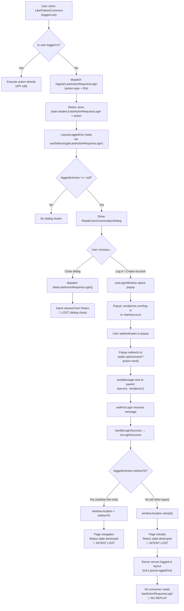
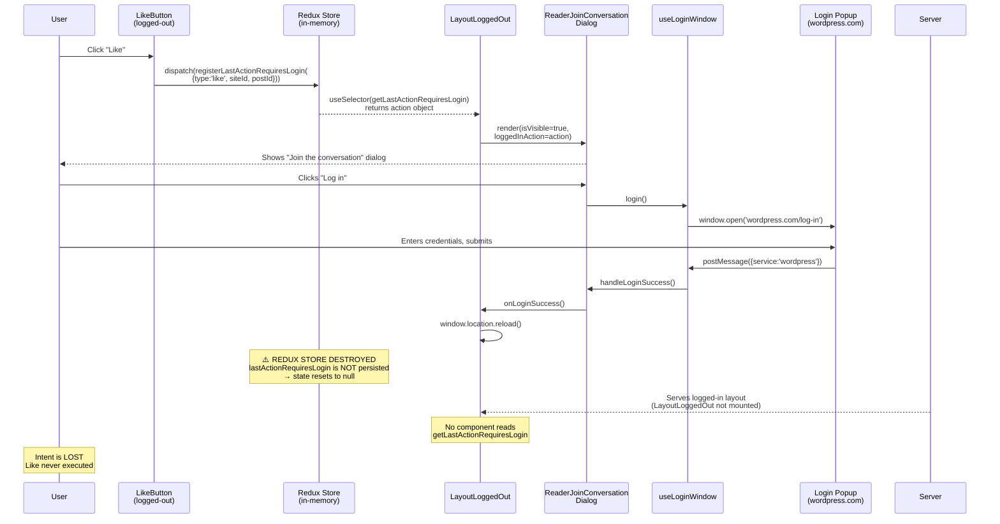

# Calypso Reader: Logged-Out Intent Lifecycle Investigation

| Field | Value |
|-------|-------|
| **Date** | 2026-04-09 |
| **Branch** | `wp-calypso_be7e5cc64162` |
| **Scope** | Read-only investigative analysis of the Reader logged-out intent mechanism |
| **Methodology** | Static code analysis — every claim traces to a specific file and line number |

---

## Executive Summary

**The four questions answered:**

1. **Where does a logged-out intent go?** — It is captured by dispatching `registerLastActionRequiresLogin(lastAction)` into an in-memory Redux reducer at `state.readerUi.lastActionRequiresLogin`. The action object contains the intent type (e.g., `'like'`, `'follow-site'`) and relevant IDs.

2. **What is the source of truth?** — The source of truth is **in-memory Redux state only**. The `lastActionRequiresLogin` reducer is NOT wrapped with `withPersistence`, so its data exists only in volatile JavaScript memory. It is not persisted to IndexedDB, `localStorage`, `sessionStorage`, cookies, or URL parameters.

3. **What exact condition causes the replay path to skip?** — The `onLoginSuccess` handler in `LayoutLoggedOut` (line 311 of `client/layout/logged-out.jsx`) calls `window.location.reload()`, which destroys the entire JavaScript execution context — including the Redux store and the pending intent within it. After reload, the server serves the logged-in layout, which has **no consumer** for `lastActionRequiresLogin`. No replay mechanism exists anywhere in the codebase.

4. **Is the skip caused by timing, initialization order, or cleanup?** — It is caused by a **persistence gap** (primary) combined with an **absence of replay logic** (secondary). The reducer lacks the `withPersistence` wrapper that would save its state to IndexedDB across page reloads. Even if persistence were added, no code on the authenticated side reads or replays the stored action. The `clearLastActionRequiresLogin` cleanup only fires on dialog close, not on the authentication success path — so it is not the cause of the loss.

---

## 1. The Intent Registration Mechanism

### 1.1 Action Creators

When an unauthenticated user performs an action that requires login (like, comment, follow, etc.), the interaction component dispatches `registerLastActionRequiresLogin` with an action descriptor object.

**`registerLastActionRequiresLogin(lastAction)`** creates a Redux action that stores the intent:

```
{ type: READER_REGISTER_LAST_ACTION_REQUIRES_LOGIN, lastAction }
```

Source: `client/state/reader-ui/actions.js:26-29`

**`clearLastActionRequiresLogin()`** creates a Redux action that clears the stored intent:

```
{ type: READER_CLEAR_LAST_ACTION_REQUIRES_LOGIN }
```

Source: `client/state/reader-ui/actions.js:35-37`

**Observation:** Both action creators also trigger a side-effect import of `calypso/state/reader-ui/init` (line 7), which ensures the `readerUi` reducer slice is registered with the Redux store before any dispatch occurs.

**Implication:** This side-effect import pattern means the reducer is dynamically registered — it does not exist in the Redux store until a component that imports from this module is loaded. This is consistent with the modularized state pattern documented in `docs/modularized-state.md`.

### 1.2 Action Type Constants

The Redux action type strings are defined as named exports:

- `READER_REGISTER_LAST_ACTION_REQUIRES_LOGIN = 'READER_REGISTER_LAST_ACTION_REQUIRES_LOGIN'`
- `READER_CLEAR_LAST_ACTION_REQUIRES_LOGIN = 'READER_CLEAR_LAST_ACTION_REQUIRES_LOGIN'`

Source: `client/state/reader-ui/action-types.js:14-16`

### 1.3 Store Bootstrap

The reducer is registered dynamically via:

```js
registerReducer( [ 'readerUi' ], reducer );
```

Source: `client/state/reader-ui/init.js:1-4`

**Observation:** The `registerReducer` call uses a path array `['readerUi']`, which means the reducer is mounted at `state.readerUi` in the Redux tree. This registration occurs as a side-effect when the module is first imported.

**Implication:** Because this is a dynamic registration (not a static part of the root reducer), the `readerUi` slice only exists in the store after a component or action creator from this module has been imported. In the Reader context, this happens early in the page lifecycle when Reader components load.

---

## 2. The Complete Action-Type Catalog

Every interaction component that gates an action behind authentication dispatches `registerLastActionRequiresLogin` with a specific action shape. The following table catalogs **every** dispatch site found in the codebase:

| Action Type | Payload Shape | Source File | Lines |
|---|---|---|---|
| `like` | `{ type: 'like', siteId, postId }` | `client/blocks/like-button/index.jsx` | 34-38 |
| `unlike` | `{ type: 'unlike', siteId, postId }` | `client/blocks/like-button/index.jsx` | 34-38 |
| `comment-like` | `{ type: 'comment-like', siteId, postId, commentId }` | `client/blocks/comments/comment-likes.jsx` | 23-28 |
| `comment-unlike` | `{ type: 'comment-unlike', siteId, postId, commentId }` | `client/blocks/comments/comment-likes.jsx` | 23-28 |
| `reply` | `{ type: 'reply', siteId, postId, commentId }` | `client/blocks/comments/post-comment.jsx` | 131-136 |
| `comment` | `{ type: 'comment', siteId, postId, commentId }` | `client/blocks/comments/form.jsx` | 64-69 |
| `comment-submit` | `{ type: 'comment-submit', siteId, postId, commentId, commentText }` | `client/blocks/comments/form.jsx` | 88-94 |
| `follow-site` | `{ type: 'follow-site', siteId }` | `client/blocks/follow-button/index.jsx` | 23-28 |
| `sidebar-link` | `{ type: 'sidebar-link', redirectTo }` | `client/blocks/reader-subscription-list-item/index.jsx` | 93-96, 109-112 |
| `sidebar-link` | `{ type: 'sidebar-link', redirectTo: streamLink }` | `client/reader/stream/reader-list-followed-sites/item.jsx` | 45-48 |
| `sidebar-signup` | `{ type: 'sidebar-signup', tag }` | `client/reader/stream/reader-tag-sidebar/index.jsx` | 67-70 |
| `follow-tag` | `{ type: 'follow-tag', tag: decodedTagSlug }` | `client/reader/tag-stream/main.jsx` | 80-83 |

### Notable Payload Variations

- **`siteId` and `postId`** are numeric WordPress REST API identifiers, passed as props in each component. They identify the target post or site for the intended action.

- **`sidebar-link`** is unique: it carries a `redirectTo` property (a URL path string like `/reader/feeds/123`) instead of `siteId`/`postId`. This is because the intent is to navigate to a specific stream page after authentication, not to perform an API action. Source: `client/blocks/reader-subscription-list-item/index.jsx:93-96`

- **`comment-submit`** is the only action type that carries `commentText` — the actual text the user typed before being prompted to log in. This represents user-generated content that is lost along with the intent when state is destroyed. Source: `client/blocks/comments/form.jsx:88-94`

- **`sidebar-signup`** and **`follow-tag`** carry a `tag` property (a decoded tag slug string) rather than numeric IDs, reflecting their tag-based context.

---

## 3. The Source of Truth

### 3.1 In-Memory Redux State (Confirmed)

The source of truth for the logged-out intent is the Redux state at path:

```
state.readerUi.lastActionRequiresLogin
```

The `lastActionRequiresLogin` reducer handles this state slice:

```js
export const lastActionRequiresLogin = ( state = null, action ) => {
    switch ( action.type ) {
        case READER_REGISTER_LAST_ACTION_REQUIRES_LOGIN:
            return action.lastAction;
        case READER_CLEAR_LAST_ACTION_REQUIRES_LOGIN:
            return null;
        default:
            return state;
    }
};
```

Source: `client/state/reader-ui/reducer.js:45-54`

**Key characteristics:**
- Default state is `null` (no pending action)
- On `REGISTER`: stores the entire `lastAction` object as-is
- On `CLEAR`: resets to `null`
- **CRITICAL: This reducer is a plain function — it is NOT wrapped with `withPersistence`**

### 3.2 Persistence Analysis (NOT Persisted)

This is the central finding of this investigation. The `lastActionRequiresLogin` reducer lacks the `withPersistence` wrapper that would enable it to survive page reloads.

**Direct comparison within the same file (`client/state/reader-ui/reducer.js`):**

Line 19 — `lastPath` **IS** persisted:
```js
export const lastPath = withPersistence( ( state = null, action ) => { ... } );
```

Line 45 — `lastActionRequiresLogin` is **NOT** persisted:
```js
export const lastActionRequiresLogin = ( state = null, action ) => { ... };
```

The absence of `withPersistence` on `lastActionRequiresLogin` while its sibling `lastPath` uses it is a clear architectural gap — both sub-reducers store ephemeral Reader state, but only one survives page reloads.

### 3.3 Persistence Comparison Table

The following table shows the persistence status of every sub-reducer within the `readerUi` slice:

| Sub-Reducer | Persisted? | Wrapper | Source |
|---|---|---|---|
| `lastPath` | ✅ YES | `withPersistence` | `client/state/reader-ui/reducer.js:19` |
| `sidebar.isListsOpen` | ✅ YES | `withPersistence` | `client/state/reader-ui/sidebar/reducer.js:10` |
| `sidebar.isTagsOpen` | ✅ YES | `withPersistence` | `client/state/reader-ui/sidebar/reducer.js:19` |
| `sidebar.isFollowingOpen` | ✅ YES | `withPersistence` | `client/state/reader-ui/sidebar/reducer.js:28` |
| `sidebar.openOrganizations` | ✅ YES | `withPersistence` | `client/state/reader-ui/sidebar/reducer.js:37` |
| `sidebar.selectedRecentSite` | ❌ NO | None | `client/state/reader-ui/sidebar/reducer.js:48` |
| `currentStream` | ❌ NO | None | `client/state/reader-ui/reducer.js:33` |
| `lastActionRequiresLogin` | ❌ NO | None | `client/state/reader-ui/reducer.js:45` |
| `cardExpansions` | ❌ NO | None | `client/state/reader-ui/card-expansions/reducer.js` |
| `hasUnseenPosts` | ❌ NO | None | `client/state/reader-ui/seen-posts/reducer.js` |

**Observation:** 6 out of 10 sub-reducers in `readerUi` are NOT persisted. The ones that ARE persisted (`lastPath` and the four sidebar toggles) represent long-lived user preferences that should survive across sessions.

**Implication:** The persistence decision for `lastActionRequiresLogin` is consistent with a design assumption that the intent is short-lived and will be consumed within the same page session. However, this assumption breaks down when the consumption path itself triggers a page reload.

### 3.4 The Persistence Model

Per the repository's own documentation, Calypso persists Redux state to browser storage (IndexedDB) to avoid rebuilding the Redux tree on each page load. Persistence is opt-in: "the reducer must be wrapped with `withSchemaValidation`" to be saved (line 7). For custom serialization behavior, a reducer can further be wrapped with `withPersistence` to implement its own `serialize` and `deserialize` methods (line 168).

Source: `docs/data-persistence.md:7, 168`

The `combineReducers` from `calypso/state/utils` handles persistence coordination. The `withStorageKey('readerUi', combinedReducer)` at `reducer.js:65` namespaces the entire slice under `readerUi` in IndexedDB, but **only sub-reducers individually wrapped with `withPersistence` are actually serialized and saved**. Unwrapped sub-reducers within the combined reducer are initialized to their default state on deserialization.

**Conclusion:** Without the `withPersistence` wrapper, `lastActionRequiresLogin` is purely in-memory. Any page reload, hard navigation, or tab close destroys it irrecoverably.

### 3.5 The Selector

The selector that reads the pending action provides null-safety:

```js
export function getLastActionRequiresLogin( state ) {
    if ( ! state.readerUi?.lastActionRequiresLogin ) {
        return null;
    }
    return state.readerUi?.lastActionRequiresLogin;
}
```

Source: `client/state/reader-ui/selectors.js:15-21`

**Observation:** The optional chaining (`?.`) guards against `readerUi` being undefined (possible if the reducer hasn't been registered yet) and against `lastActionRequiresLogin` being falsy. This defensive approach is necessary because of the dynamic reducer registration pattern.

### 3.6 Test Contract Validation

The unit tests confirm the expected behavior of the state contract:

- **Action shape test:** Validates the fixture `{ type: 'like', siteId: 123, postId: 456 }` is correctly wrapped in the Redux action envelope.
  Source: `client/state/reader-ui/test/actions.js:8-12`

- **Reducer store test:** Validates that dispatching `READER_REGISTER_LAST_ACTION_REQUIRES_LOGIN` with a `lastAction` stores that exact object in state.
  Source: `client/state/reader-ui/test/reducer.js:15-22`

- **Reducer clear test:** Validates that dispatching `READER_CLEAR_LAST_ACTION_REQUIRES_LOGIN` resets state to `null`.
  Source: `client/state/reader-ui/test/reducer.js:24-32`

- **Selector null-safety tests:** Validates the selector returns `null` for both `{ readerUi: { lastActionRequiresLogin: null } }` and `{ readerUi: {} }`.
  Source: `client/state/reader-ui/test/selectors.js:10-22`

---

## 4. The Authentication Boundary

### 4.1 LayoutLoggedOut — The Sole Consumer

The `LayoutLoggedOut` component at `client/layout/logged-out.jsx` is the **only component in the entire codebase** that reads `getLastActionRequiresLogin`. This makes it the single point of consumption for logged-out intents.

**Key selector reads (lines 89-91):**
```js
const isLoggedIn = useSelector( isUserLoggedIn );
const currentRoute = useSelector( getCurrentRoute );
const loggedInAction = useSelector( getLastActionRequiresLogin );
```

Source: `client/layout/logged-out.jsx:89-91`

**Import connections (lines 43-44):**
```js
import { clearLastActionRequiresLogin } from 'calypso/state/reader-ui/actions';
import { getLastActionRequiresLogin } from 'calypso/state/reader-ui/selectors';
```

Source: `client/layout/logged-out.jsx:43-44`

**Redux connect (line 401):**
```js
{ clearLastActionRequiresLogin }
```

Source: `client/layout/logged-out.jsx:401`

### 4.2 The Dialog Rendering

`LayoutLoggedOut` conditionally renders the `ReaderJoinConversationDialog` when there is a pending action:

```jsx
{ ! isLoggedIn && ! isReaderTagEmbed && (
    <ReaderJoinConversationDialog
        onClose={ () => clearLastActionRequiresLogin() }
        isVisible={ !! loggedInAction }
        loggedInAction={ loggedInAction }
        onLoginSuccess={ () => {
            if ( loggedInAction?.redirectTo ) {
                window.location = loggedInAction.redirectTo;
            } else {
                window.location.reload();
            }
        } }
    />
) }
```

Source: `client/layout/logged-out.jsx:302-315`

**Breakdown of the four props:**

1. **`onClose`** (line 304): Dispatches `clearLastActionRequiresLogin()` — this clears the intent from Redux state. Called when the user explicitly closes the dialog without logging in.

2. **`isVisible`** (line 305): Boolean coercion of `loggedInAction`. The dialog appears when and only when a pending action exists in Redux.

3. **`loggedInAction`** (line 306): Passes the raw action object to the dialog for analytics tracking (it logs the action `type`, `siteId`, `postId`, and `tag` in track events).

4. **`onLoginSuccess`** (lines 307-312): **The critical callback.** It has two branches:
   - If `loggedInAction.redirectTo` exists → `window.location = loggedInAction.redirectTo` (hard navigation to the redirect URL)
   - Otherwise → `window.location.reload()` (full page reload)

**CRITICAL FINDING:** Both branches of `onLoginSuccess` destroy the current page context. Whether it's a redirect or a reload, the JavaScript execution context is terminated, the Redux store is destroyed, and the pending intent — stored only in volatile memory — is lost.

### 4.3 ReaderJoinConversationDialog — The Authentication Gate

The `ReaderJoinConversationDialog` component at `client/blocks/reader-join-conversation/dialog.jsx` orchestrates the popup-based login flow.

**Component lifecycle:**

1. **Initialization (line 16):** Manages `isLoginPopupOpen` state to track popup visibility.
   ```js
   const [ isLoginPopupOpen, setIsLoginPopupOpen ] = useState( false );
   ```

2. **Hook setup (lines 44-47):** Initializes `useLoginWindow` with callbacks:
   ```js
   const { login, createAccount, close } = useLoginWindow( {
       onLoginSuccess: handleLoginSuccess,
       onWindowClose: () => setIsLoginPopupOpen( false ),
   } );
   ```

3. **Login success handler (lines 31-35):**
   ```js
   const handleLoginSuccess = () => {
       setIsLoginPopupOpen( false );
       trackEvent( 'calypso_reader_dialog_login_success' );
       onLoginSuccess();  // ← This calls LayoutLoggedOut's reload handler
   };
   ```

4. **User clicks "Log in" (lines 49-53):** Sets popup state to open, tracks event, calls `login()` to open popup.

5. **User clicks "Create a new account" (lines 55-59):** Sets popup state to open, tracks event, calls `createAccount()` to open popup.

6. **User closes dialog (lines 67-72):**
   ```js
   const onCloseClick = () => {
       setIsLoginPopupOpen( false );
       trackEvent( 'calypso_reader_dialog_close_clicked' );
       close();
       onClose();  // ← This dispatches clearLastActionRequiresLogin()
   };
   ```

Source: `client/blocks/reader-join-conversation/dialog.jsx:12-121`

**Observation:** The dialog tracks analytics events with the action type and IDs (`calypso_reader_dialog_shown`, `calypso_reader_dialog_login_clicked`, etc.) at lines 18-29, but this tracking is purely observational — it does not preserve or forward the intent.

### 4.4 useLoginWindow — The Popup Authentication Hook

The `useLoginWindow` hook at `client/data/reader/use-login-window.ts` manages the browser popup window for authentication.

**URL Construction (lines 31-47):**
- `redirectTo` → `https://wordpress.com/public.api/connect/?action=verify&service=wordpress` (plus optional `origin` in dev)
- `loginURL` → `https://wordpress.com/log-in?redirect_to={redirectTo}`
- `createAccountURL` → `https://wordpress.com/start/account?redirect_to={redirectTo}&ref=reader-lp`

Source: `client/data/reader/use-login-window.ts:31-47`

**Popup Window Configuration (lines 48-50):**
```
status=0, toolbar=0, location=1, menubar=0, directories=0, resizable=1, scrollbars=0, height=980, width=500
```

**The postMessage Listener — `waitForLogin` (lines 52-60):**
```typescript
const waitForLogin = ( event: MessageEvent ) => {
    if ( 'https://wordpress.com' !== event?.origin ) {
        return;
    }
    if ( event?.data?.service === 'wordpress' ) {
        onLoginSuccess();
    }
};
```

Source: `client/data/reader/use-login-window.ts:52-60`

**Observation:** The `waitForLogin` function performs two security checks:
1. Origin validation: Only accepts messages from `https://wordpress.com`
2. Service check: Only triggers on `event.data.service === 'wordpress'`

When both checks pass, it calls `onLoginSuccess()` — which propagates up through the dialog's `handleLoginSuccess` to `LayoutLoggedOut`'s reload handler.

**CRITICAL:** The `postMessage` payload contains only `{ service: 'wordpress' }` — it does NOT carry the pending intent. The intent is not transferred through the popup communication channel.

**Popup Management — `openWindow` (lines 62-78):**
```typescript
const openWindow = ( url: string ) => {
    const popupWindow = window.open( url, windowName, windowFeatures );
    window.addEventListener( 'message', waitForLogin );
    const loginWindowClosed = setInterval( () => {
        if ( popupWindow?.closed ) {
            onWindowClose();
            removeEventListener( 'message', waitForLogin );
            clearInterval( loginWindowClosed );
        }
    }, 100 );
    setLoginWindow( popupWindow );
};
```

Source: `client/data/reader/use-login-window.ts:62-78`

**Observation:** The hook polls the popup window's `closed` property every 100ms. If the user closes the popup without completing authentication, `onWindowClose` fires, which sets `isLoginPopupOpen` to `false` in the dialog. This does NOT clear the pending intent — the dialog is still visible, and the user can try again.

**`login()` and `createAccount()` (lines 80-86):** Simply call `openWindow` with the respective URL.

**`close()` (lines 88-90):** Calls `loginWindow?.close()` to programmatically close the popup.

---

## 5. Where the Intent Is Lost

This section traces the exact sequence of events that causes the logged-out intent to be irrecoverably lost.

### 5.1 Step 1: `window.location.reload()` Destroys State

When `onLoginSuccess` fires in `LayoutLoggedOut` (line 311), it calls `window.location.reload()`.

Source: `client/layout/logged-out.jsx:311`

**What happens:**
- `window.location.reload()` triggers a full browser page reload
- The browser terminates all JavaScript execution
- The JavaScript heap is freed — all objects in memory are destroyed
- The Redux store, which is a JavaScript object in memory, is destroyed
- Since `lastActionRequiresLogin` is NOT wrapped with `withPersistence`, its value has no IndexedDB backing
- The pending action object (e.g., `{ type: 'like', siteId: 123, postId: 456 }`) ceases to exist

**Reasoning:** Persisted sub-reducers (like `lastPath`) survive this reload because the `combineReducers` utility serializes their state to IndexedDB before the page unloads, and deserializes it back on the next load. But `lastActionRequiresLogin` has no serialization step — it initializes to `null` on every fresh load.

### 5.2 Step 2: Layout Swap Eliminates the Consumer

After the reload:
- The browser sends a new HTTP request to the server
- The server detects the user is now authenticated (cookies were set during the popup login flow)
- The server renders the logged-IN layout instead of `LayoutLoggedOut`
- `LayoutLoggedOut` is never mounted in the logged-in layout

**CRITICAL:** `LayoutLoggedOut` was the **only** component in the codebase that calls `useSelector(getLastActionRequiresLogin)` (line 91). No other component, in any layout, reads this state slice.

Source: `client/layout/logged-out.jsx:91`

**Implication:** Even if the `lastActionRequiresLogin` state WERE persisted to IndexedDB and rehydrated on reload, there would be **no component to read it**. The intent would exist in the store but never be consumed.

### 5.3 Step 3: No Replay Mechanism Exists

A comprehensive search of the codebase reveals:

- **No code** reads `lastActionRequiresLogin` after authentication succeeds
- **No startup logic** checks for a pending action and converts it into an API call
- **No middleware** watches for the `READER_REGISTER_LAST_ACTION_REQUIRES_LOGIN` action and queues it for replay
- **No side-effect** (saga, thunk, or observable) processes the stored intent

The `clearLastActionRequiresLogin` action is only dispatched in `LayoutLoggedOut`'s `onClose` handler (line 304) — it never fires after authentication because `LayoutLoggedOut` is unmounted.

Source: `client/layout/logged-out.jsx:304`

### 5.4 Step 4: No Handoff Token

The intent is never serialized to any medium that survives the page reload:

| Medium | Used? | Evidence |
|---|---|---|
| URL parameters | ❌ No | `window.location.reload()` reloads the current URL without modification |
| Cookies | ❌ No | No `document.cookie` writes in the intent flow |
| `localStorage` | ❌ No | No `localStorage.setItem` calls in the intent flow |
| `sessionStorage` | ❌ No | No `sessionStorage.setItem` calls in the intent flow |
| Popup window URL | ❌ No | Popup URLs only carry auth redirect parameters |
| `postMessage` payload | ❌ No | The `postMessage` carries only `{ service: 'wordpress' }` |
| IndexedDB (Redux persistence) | ❌ No | Reducer lacks `withPersistence` wrapper |

**One exception:** The `redirectTo` branch (lines 308-309) does use `window.location = loggedInAction.redirectTo` for `sidebar-link` actions. This navigates to the target URL, achieving the intent through navigation rather than API replay. But this only works for `sidebar-link` — all other action types (`like`, `comment`, `follow-site`, etc.) hit the `else` branch and are lost.

Source: `client/layout/logged-out.jsx:308-311`

### 5.5 Step 5: Dialog Close Clears Intent

If the user closes the dialog instead of logging in:

1. `onCloseClick` fires in the dialog (line 67-72)
2. It calls `onClose()` which is `() => clearLastActionRequiresLogin()` (line 304)
3. `clearLastActionRequiresLogin()` dispatches `{ type: READER_CLEAR_LAST_ACTION_REQUIRES_LOGIN }`
4. The reducer sets `state.readerUi.lastActionRequiresLogin` to `null`
5. The pending action is erased from Redux

Source: `client/blocks/reader-join-conversation/dialog.jsx:67-72`, `client/layout/logged-out.jsx:304`

**Implication:** If the user closes the dialog and later decides to log in through the standard login page (not through the popup), the intent is already gone. The dialog's close action is a point-of-no-return for the intent.

---

## 6. Root Cause Analysis

### 6.1 Root Cause 1: Persistence Gap (Primary)

**Observation:** The `lastActionRequiresLogin` reducer at `client/state/reader-ui/reducer.js:45` is a plain function:
```js
export const lastActionRequiresLogin = ( state = null, action ) => { ... };
```

Compare with `lastPath` at line 19, which IS wrapped:
```js
export const lastPath = withPersistence( ( state = null, action ) => { ... } );
```

Compare with sidebar sub-reducers at `client/state/reader-ui/sidebar/reducer.js`, which ARE wrapped:
- `isListsOpen` — `withPersistence` at line 10
- `isTagsOpen` — `withPersistence` at line 19
- `isFollowingOpen` — `withPersistence` at line 28
- `openOrganizations` — `withPersistence` at line 37

**Implication:** Per `docs/data-persistence.md`, persistence is opt-in. Without the `withPersistence` wrapper, the state is purely in-memory and is initialized to the default value (`null`) on every page load.

**Conclusion:** The intent survives only as long as the JavaScript execution context exists. Any page reload, hard navigation, or tab close destroys it irrecoverably. This is the primary root cause.

### 6.2 Root Cause 2: Page Reload Destroys In-Memory State

**Observation:** `window.location.reload()` at `client/layout/logged-out.jsx:311` is a hard browser reload that destroys the JavaScript heap, the Redux store, and all in-memory state.

**Reasoning:** The Calypso persistence system works by serializing opt-in reducer state to IndexedDB and deserializing it back during store initialization. This serialize/deserialize cycle only preserves sub-reducers wrapped with `withPersistence`. The `lastActionRequiresLogin` reducer has no serialization handler, so its state is not saved before the reload and initializes to `null` after.

**Conclusion:** The page reload is the triggering event that exposes the persistence gap. Without the reload (e.g., if the login were handled via an in-page AJAX call without navigation), the in-memory state would survive and could be consumed.

### 6.3 Root Cause 3: No Replay Mechanism on Authenticated Side

**Observation:** After reload, the user sees the logged-in layout. No component in the logged-in layout reads `getLastActionRequiresLogin`. No startup logic, middleware, saga, or effect checks for a pending action and replays it.

**Reasoning:** Even if the persistence gap were fixed (i.e., `lastActionRequiresLogin` were wrapped with `withPersistence`), the action would be rehydrated into the Redux store but never consumed. There is no code that:
1. Reads the pending action on the authenticated side
2. Maps the action type to an API call (e.g., `like` → `POST /sites/{siteId}/posts/{postId}/likes/new`)
3. Dispatches the API call
4. Clears the pending action after successful replay

**Conclusion:** Fixing the persistence gap alone is insufficient. A complete solution would require both persistence AND a replay mechanism on the logged-in side.

### 6.4 Root Cause 4: Feature Flag Ambiguity (`reader/login-window`)

**Observation:** The feature flag `reader/login-window` appears in exactly two source files:

1. `client/reader/like-button/index.jsx:47`:
   ```js
   if ( ! config.isEnabled( 'reader/login-window' ) ) {
       return navigate( createAccountUrl( { redirectTo: pathname, ref: 'reader-lp' } ) );
   }
   ```

2. `client/blocks/comments/post-comment.jsx:123`:
   ```js
   if ( ! config.isEnabled( 'reader/login-window' ) ) {
       return navigate( createAccountUrl( { redirectTo: pathname, ref: 'reader-lp' } ) );
   }
   ```

Source: `client/reader/like-button/index.jsx:47`, `client/blocks/comments/post-comment.jsx:123`

**Observation:** The flag is NOT found in any `config/*.json` static configuration file. This means it is controlled server-side or at runtime, not in the static config bundle shipped to the browser.

**Behavioral impact:**
- **When flag is OFF:** The Reader like-button and post-comment components fall back to a **full redirect** to the account creation page (`/start/account?redirect_to=...`). This bypasses the `registerLastActionRequiresLogin` → dialog → popup flow entirely for likes and comment replies. The intent is captured in the `redirectTo` URL parameter, but only as a path to return to — not as a specific action to replay.
- **When flag is ON:** The popup flow is used, and the intent loss described in this document occurs.

**Conclusion:** The feature flag introduces a bifurcation in the authentication flow. Neither path successfully replays the original intent, but they fail differently: the redirect path loses the intent because it only preserves the return URL (not the action), while the popup path loses the intent because of the persistence gap and page reload.

---

## 7. Intent Lifecycle Diagram

### 7.1 Complete Intent Lifecycle Flowchart



### 7.2 Authentication Sequence Diagram



---

## 8. The Feature Flag Detail: `reader/login-window`

The `reader/login-window` feature flag gates whether the popup-based authentication flow (and thus the `registerLastActionRequiresLogin` mechanism) is used for certain interactions.

### 8.1 Usage in `client/reader/like-button/index.jsx`

The `ReaderLikeButton` component wraps the base `LikeButtonContainer`. When a logged-out user clicks "Like":

1. **Line 34-37:** If the user IS logged in, call `recordLikeToggle` directly
2. **Lines 39-45:** If on a Reader tag embed page, open a new tab to the account creation URL
3. **Line 47-49:** If the `reader/login-window` flag is OFF, navigate to the account creation URL
4. **If the flag is ON:** The function returns without navigating — control falls through to the underlying `LikeButtonContainer`, which dispatches `registerLastActionRequiresLogin`

Source: `client/reader/like-button/index.jsx:34-49`

### 8.2 Usage in `client/blocks/comments/post-comment.jsx`

The same pattern exists in `PostComment`:

1. **Lines 115-121:** If on a Reader tag embed page, open a new tab to account creation
2. **Lines 123-125:** If `reader/login-window` is OFF, navigate to account creation
3. **If the flag is ON:** `onLikeToggle` returns without navigating — the underlying `LikeButtonContainer` handles logged-out likes via the popup flow. The `handleReply` method (lines 129-136) operates independently and always dispatches `registerLastActionRequiresLogin` for reply actions when the user is not logged in, regardless of the flag.

Source: `client/blocks/comments/post-comment.jsx:112-136`

### 8.3 Absence from Static Configuration

The flag `reader/login-window` was searched across all `config/*.json` files and is **not present in any of them**. This means the flag is not controlled by the static configuration bundle — it is either:
- Set server-side in the WordPress.com configuration
- Controlled by a feature flag service at runtime
- Potentially always-on or always-off depending on the environment

This ambiguity means the popup flow behavior (and thus the intent loss) cannot be predicted from the client-side configuration alone.

---

## 9. File Reference Index

### 9.1 State Management Layer

| File | Role in Investigation | Key Lines |
|---|---|---|
| `client/state/reader-ui/action-types.js` | Defines Redux action type string constants for intent registration and clearing | 14-16 |
| `client/state/reader-ui/actions.js` | Action creators: `registerLastActionRequiresLogin`, `clearLastActionRequiresLogin`, `viewStream`; side-effect import of `init` | 7, 26-29, 35-37 |
| `client/state/reader-ui/reducer.js` | Root reducer combining all sub-reducers; `lastActionRequiresLogin` NOT persisted (line 45), `lastPath` IS persisted (line 19), `withStorageKey` namespace (line 65) | 19, 33, 45-54, 56-65 |
| `client/state/reader-ui/selectors.js` | `getLastActionRequiresLogin` selector with optional chaining null-safety; `getLastPath` selector | 6-8, 15-21 |
| `client/state/reader-ui/init.js` | Registers `readerUi` reducer slice via `registerReducer(['readerUi'], reducer)` | 1-4 |
| `client/state/reader-ui/sidebar/reducer.js` | Sidebar sub-reducers — 4 out of 5 wrapped with `withPersistence` | 10, 19, 28, 37, 48 |
| `client/state/reader-ui/card-expansions/reducer.js` | Card expansion reducer — NOT persisted | entire file |
| `client/state/reader-ui/seen-posts/reducer.js` | Unseen posts reducer — NOT persisted | entire file |

### 9.2 Test Files

| File | Role in Investigation | Key Lines |
|---|---|---|
| `client/state/reader-ui/test/actions.js` | Validates action creator shapes; fixture `{ type: 'like', siteId: 123, postId: 456 }` | 8-12, 15-20, 23-29 |
| `client/state/reader-ui/test/reducer.js` | Validates reducer correctly stores and clears `lastAction` | 15-22, 24-32 |
| `client/state/reader-ui/test/selectors.js` | Validates selector returns `null` for empty/missing state; returns data when present | 10-16, 18-22, 24-35 |

### 9.3 Intent Dispatch Sites

| File | Role in Investigation | Key Lines |
|---|---|---|
| `client/blocks/like-button/index.jsx` | `like`/`unlike` intent dispatch in `handleLikeToggle` | 32-38 |
| `client/blocks/comments/comment-likes.jsx` | `comment-like`/`comment-unlike` intent dispatch in `handleLikeToggle` | 21-29 |
| `client/blocks/comments/post-comment.jsx` | `reply` intent dispatch in `handleReply`; `reader/login-window` feature flag check | 123-126, 129-136 |
| `client/blocks/comments/form.jsx` | `comment` intent dispatch in `handleTextChange`; `comment-submit` dispatch in `handleSubmit` | 62-69, 86-94 |
| `client/blocks/follow-button/index.jsx` | `follow-site` intent dispatch in `handleFollowToggle` | 21-28 |
| `client/blocks/reader-subscription-list-item/index.jsx` | `sidebar-link` intent dispatch in `streamClicked` and `avatarClicked` | 92-97, 107-113 |
| `client/reader/stream/reader-tag-sidebar/index.jsx` | `sidebar-signup` intent dispatch in `trackSignupClick` | 63-71 |
| `client/reader/tag-stream/main.jsx` | `follow-tag` intent dispatch in `toggleFollowing` | 79-83 |
| `client/reader/stream/reader-list-followed-sites/item.jsx` | `sidebar-link` intent dispatch in `handleSidebarClick` | 43-49 |

### 9.4 Authentication Boundary

| File | Role in Investigation | Key Lines |
|---|---|---|
| `client/layout/logged-out.jsx` | **Sole consumer** of `getLastActionRequiresLogin` (line 91); renders `ReaderJoinConversationDialog` (lines 302-315); `onLoginSuccess` calls `window.location.reload()` (line 311); Redux `connect` maps `clearLastActionRequiresLogin` (line 401) | 43-44, 89-91, 302-315, 401 |
| `client/blocks/reader-join-conversation/dialog.jsx` | Authentication gate dialog; coordinates popup login flow via `useLoginWindow`; `handleLoginSuccess` propagates to layout's reload handler | 12-121, esp. 16, 31-35, 44-47, 49-53, 55-59, 67-72 |
| `client/data/reader/use-login-window.ts` | Popup authentication hook; constructs auth URLs; `postMessage` listener (`waitForLogin`); popup window lifecycle management | 16-93, esp. 31-47, 52-60, 62-78 |
| `client/reader/like-button/index.jsx` | Reader-specific like-button wrapper with `reader/login-window` feature flag check | 34-49, esp. 47 |

### 9.5 Reference Documentation

| File | Role in Investigation |
|---|---|
| `docs/data-persistence.md` | Explains opt-in persistence model via `withSchemaValidation`/`withPersistence`; IndexedDB storage; serialize/deserialize cycle; combineReducers coordination |

---

## 10. Summary of Findings

| Question | Answer | Primary Evidence |
|---|---|---|
| Where does the logged-out intent go? | Dispatched via `registerLastActionRequiresLogin` into `state.readerUi.lastActionRequiresLogin` | `client/state/reader-ui/actions.js:26-29` |
| What is the source of truth? | In-memory Redux state — NOT persisted to IndexedDB, storage, cookies, or URL | `client/state/reader-ui/reducer.js:45-54` (no `withPersistence` wrapper) |
| What causes the replay path to skip? | `window.location.reload()` destroys Redux store; no consumer exists on the logged-in side | `client/layout/logged-out.jsx:311` (reload); line 91 (sole consumer) |
| Timing, init order, or cleanup? | **Persistence gap** (primary) + **absence of replay logic** (secondary) | `reducer.js:19` vs `reducer.js:45` (persistence comparison); no replay code found anywhere |

The logged-out intent lifecycle contains two independent but compounding failures:

1. **The state is not persisted** — it lives only in volatile memory and is destroyed by the very action that should mark its fulfillment (the authentication success handler's page reload).

2. **No replay mechanism exists** — even if the state survived the reload, nothing on the authenticated side would read it, interpret it, and execute the intended API call.

Both failures must be addressed for the intent to be successfully replayed after authentication. Fixing only one (e.g., adding persistence) would leave the intent stored but unconsumed. Fixing only the other (e.g., adding replay logic) would find no intent to replay because it was already destroyed.
