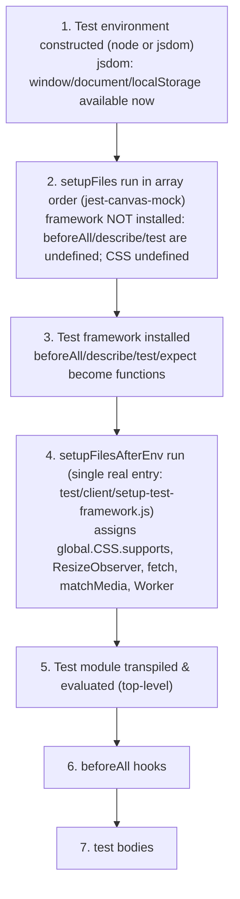

# Why some `wp-calypso` tests pass in isolation but fail in the full suite

**An evidence-backed investigation of module resolution and test-environment setup across the repository's Jest execution contexts.**

This document answers six questions about the `wp-calypso` monorepo's test infrastructure. Every behavioural claim below is grounded in **captured runtime output** produced by running the repository's *real* test commands and small temporary probe tests through the pinned toolchain. Each section shows the exact command, the complete unedited output it produced, and the `file:line` reference that explains it. Values that are inferred rather than observed are labelled as such.

> **Reproducibility note.** All evidence was captured on the checked-out source commit `be7e5cc641622d153040491fd5625c6cb83e12eb`. Temporary probe files were created only to observe runtime behaviour and were removed afterwards; the tracked source tree is byte-for-byte unchanged (see §14 Read-only mandate & provenance).

---

## 1. Canonical execution environment

All commands were run through the repository's pinned toolchain. The exact versions were captured, not assumed:

```
$ node --version
v22.23.1
$ yarn --version
4.0.2
$ yarn jest --version
29.7.0
$ node -e "console.log(require('./node_modules/jsdom/package.json').version)"
20.0.3
$ node -e "console.log(require('./node_modules/jest-environment-jsdom/package.json').version)"
29.7.0
$ yarn bin jest
<repo>/node_modules/jest/bin/jest.js
```

| Component | Version | Source of truth |
|-----------|---------|-----------------|
| Node.js | `22.23.1` | satisfies `engines.node` (literal value `"^v22.9.0"`) [package.json:L57]; `.nvmrc` pins `22.9.0` |
| Yarn | `4.0.2` | `packageManager: "yarn@4.0.2"` [package.json:L422] |
| Jest | `29.7.0` | dev-dependency [package.json:L290] |
| jest-environment-jsdom | `29.7.0` (bundles jsdom `20.0.3`) | dev-dependency [package.json:L292] |
| enhanced-resolve | `5.9.3` | dev-dependency [package.json:L213] |

**Version reconciliation.** The environment-setup instructions suggested installing Node `20.x`, but the repository's `engines.node` field is the literal string `"^v22.9.0"` [package.json:L56-L59] (the leading `v` is unusual but semver-tolerated by npm/Yarn and parses as `^22.9.0`). The repository requirement takes precedence for correctness, so the investigation ran on the installed **Node `22.23.1`** (which satisfies `^v22.9.0`). Where any earlier draft referenced `22.22.2`, the captured, canonical value is `22.23.1` as shown above.

**Invocation policy.** Every command below uses the **pinned Yarn entry point** (`yarn <script>` for the six declared test commands, and `yarn jest -c=<config> …` for probes). `yarn bin jest` resolves to `<repo>/node_modules/jest/bin/jest.js`, confirming the local pinned binary is used. `npx` is never used, so no probe can trigger a package download.

> Throughout this document `<repo>` abbreviates the ephemeral absolute capture path `/tmp/blitzy/wp-calypso/blitzy-b582062f-11a3-4649-94b2-c58559cb5cff_9e5da8`. Only the **repo-relative suffix** is meaningful; the prefix changes per checkout.

---

## 2. How this document was produced (methodology)

1. **Run first.** The six real test commands defined in `package.json` were executed and their complete output captured (§12 Validation).
2. **Probe with real configs.** To observe per-context behaviour, tiny temporary tests (prefixed `blitzy_adhoc_test_`) were placed where each real Jest config's `testMatch` discovers them, and were run through the *actual* per-context config via `yarn jest -c=<config> --runTestsByPath <probe>`. No debug hook, mock, or synthetic config bypassed the real resolver, `moduleNameMapper`, or environment selection.
3. **Confirm stability.** Every timing- and environment-sensitive observation (globals matrix, initialization order, reproduction) was run at least twice; outputs were byte-identical across runs.
4. **Clean up.** All probes and temporary configs were deleted after capture; `git status` confirms an unchanged tree (§14 Read-only mandate & provenance).

The complete list of probe/logger/config sources and the exact commands appear in §13 Reproduction appendix.

---

## 3. Direct answers

| # | Question | Direct answer |
|---|----------|---------------|
| **Q1** | What runtime environment does each test command use, and how do they differ? | The base preset defaults to **`node`** [packages/calypso-jest/jest-preset.js:L11]. `test-build-tools`, `test-server`, `test-integration`, and the **majority** of `test-packages` projects run in **node**; `test-apps` and 22 of 58 `test-packages` projects force **`jsdom`**; `test-client` runs **node by default but individual files opt into `jsdom`** via a `/** @jest-environment jsdom */` docblock. `test-packages` is therefore **mixed**, not node-only. |
| **Q2** | What is available globally in one context but not another? | `window`/`document`/`localStorage` exist **only** in jsdom contexts; `google` exists **only** in the client context; `__i18n_text_domain__` exists in client and packages but not server/build-tools/integration/apps; `Worker` and a callable `CSS.supports` exist only where a setup file assigns them. See the 9-context matrix in [§5](#5-q2--globals-that-differ-across-contexts). |
| **Q3** | What file is loaded when an internal dependency is imported, and does it differ by execution method? | Under Jest, `@automattic/load-script` (imported by `@automattic/calypso-analytics`) loads its **untranspiled `calypso:src`** entry `packages/load-script/src/index.js`. Under plain Node it is `MODULE_NOT_FOUND` (its built `main`/`dist` does not exist). **Yes — it differs by execution method.** |
| **Q4** | Where does an overridden import resolve, and does the same import resolve differently per context? | `@automattic/calypso-config` resolves to the in-repo file `client/server/config/index.js` under client/server/integration (three different `moduleNameMapper` spellings), but to `packages/calypso-config/src/index.ts` under packages (no mapper → custom resolver). **Yes — the same import resolves to different files.** |
| **Q5** | What loads first when a test runs? | Environment constructed (node or jsdom) → `setupFiles` (`jest-canvas-mock`) run **before the framework is installed** → framework installed → `setupFilesAfterEnv` run → test module top-level → `beforeAll` hooks → test bodies. |
| **Q6** | What provides browser-like APIs, and when? | **`jest-environment-jsdom`** provides `window`/`document`/`localStorage` from **environment construction** (before any setup file). The **setup file** (`test/client/setup-test-framework.js`) provides `CSS.supports`, `ResizeObserver`, `fetch`, `matchMedia`, `Worker` **after `setupFilesAfterEnv` runs** — and these appear under **node or jsdom**, because they are assigned to `global.*`. |

---

## 4. Q1 — Runtime environment per test command

**Direct answer.** The shared base preset defines `testEnvironment: 'node'` [packages/calypso-jest/jest-preset.js:L11], so **node is the default** everywhere. Contexts diverge by *overriding* that default:

| Command (`package.json`) | Config | Environment in effect |
|--------------------------|--------|-----------------------|
| `test-build-tools` [L121] | `test/build-tools/jest.config.js` | **node** (spreads base; keeps base `setupFilesAfterEnv`) |
| `test-client` [L122] | `test/client/jest.config.js` | **node by default; per-file `jsdom`** via docblock |
| `test-server` [L131] | `test/server/jest.config.js` | **node** (own `setupFilesAfterEnv`) |
| `test-integration` [L125] | `test/integration/jest.config.js` | **node** (explicit `testEnvironment:'node'` [L7]; manual config) |
| `test-apps` [L127] | `test/apps/jest.config.js` → per-app projects | **jsdom** (apps preset `testEnvironment:'jsdom'`) |
| `test-packages` [L129] | `test/packages/jest.config.js` → per-package projects | **mixed: node + jsdom** |

The root wrapper `test` runs only four of the six suites:

```
$ sed -n '120,120p' package.json
        "test": "run-s -s test-client test-packages test-server test-build-tools",
```
So `yarn test` [package.json:L120] runs `test-client`, `test-packages`, `test-server`, `test-build-tools` via `npm-run-all`'s `run-s`; it does **not** include `test-apps` or `test-integration`.

### 4.1 `test-packages` is a mixed multi-project run

`test/packages/jest.config.js` aggregates one project per package [test/packages/jest.config.js:L4]. The environment split was enumerated directly:

```
$ ls packages/*/jest.config.js | wc -l
58
$ grep -lE "testEnvironment:\s*'jsdom'" packages/*/jest.config.js | wc -l
22
# node-default remainder: 58 - 22 = 36
$ grep -rlE "@jest-environment[[:space:]]+jsdom" packages --include='*.js' --include='*.jsx' --include='*.ts' --include='*.tsx' | grep -vE '/dist/' | wc -l
76
```

So of the **58** package project configs, **22** force `testEnvironment:'jsdom'` and **36** inherit the node default; additionally **76** individual package test files opt into jsdom with a `/** @jest-environment jsdom */` docblock. A single "packages = node" classification is therefore incorrect.

The 22 jsdom package configs are: `block-renderer, calypso-products, calypso-sentry, calypso-url, command-palette, composite-checkout, dataviews, design-picker, design-preview, domain-picker, global-styles, help-center, launchpad, odie-client, onboarding, search, shopping-cart, site-admin, sites, subscriber, verbum-block-editor, wpcom-checkout`.

### 4.2 The environment observed at runtime

The `navigator.userAgent` captured by the shared probe ([§5](#5-q2--globals-that-differ-across-contexts)) is the clearest environment fingerprint:

- **node** contexts report `userAgent: "Node.js/22"`.
- **jsdom** contexts report `userAgent: "Mozilla/5.0 (linux) AppleWebKit/537.36 (KHTML, like Gecko) jsdom/20.0.3"` — confirming the environment is `jest-environment-jsdom` bundling jsdom `20.0.3`.

The client file's per-file switch is visible directly: the same probe run **without** a docblock reports `Node.js/22`, and **with** `/** @jest-environment jsdom */` reports the jsdom UA — see the client rows in [§5](#5-q2--globals-that-differ-across-contexts).

---

## 5. Q2 — Globals that differ across contexts

**Direct answer.** Several globals exist in one context but not another. The table below is the `typeof` reported by one byte-identical probe run through **nine** real context/config combinations. Every cell is captured output (stable across three runs); the exact per-context commands and full lines are in §13.2.

Legend: `–` = `undefined`; `obj` = object; `fn` = function.

| Global | client<br>(node) | client<br>(jsdom) | server | build-<br>tools | integ-<br>ration | packages<br>node | packages<br>jsdom<br>(search) | command-<br>palette | apps |
|--------|:---:|:---:|:---:|:---:|:---:|:---:|:---:|:---:|:---:|
| `window` | – | obj | – | – | – | – | obj | obj | obj |
| `document` | – | obj | – | – | – | – | obj | obj | obj |
| `localStorage` | – | obj | – | – | – | – | obj | obj | obj |
| `navigator` | obj | obj | obj | obj | obj | obj | obj | obj | obj |
| `navigator.userAgent` | Node.js/22 | jsdom/20.0.3 | Node.js/22 | Node.js/22 | Node.js/22 | Node.js/22 | jsdom/20.0.3 | jsdom/20.0.3 | jsdom/20.0.3 |
| `google` | obj | obj | – | – | – | – | – | – | – |
| `__i18n_text_domain__` | string | string | – | – | – | string | string | string | – |
| `CSS` | obj | obj | – | obj | – | obj | obj | obj | obj |
| `CSS.supports` (callable?) | ✅ | ✅ | ❌ | ✅ | ❌ | ❌ | ❌ | ✅ | ✅ |
| `ResizeObserver` | fn | fn | – | – | – | fn | fn | fn | fn |
| `fetch` | fn | fn | fn | fn | fn | fn | – | fn | fn |
| `matchMedia` | fn | fn | – | – | – | fn | fn | fn | fn |
| `Worker` | fn | fn | – | – | – | – | – | fn | fn |
| `structuredClone` | fn | fn | fn | fn | fn | fn | – | fn | fn |

### 5.1 Concrete "exists in one but not another" cases

1. **`window` / `document` / `localStorage`** — present only in the jsdom contexts (client-jsdom, packages-jsdom, command-palette, apps); `undefined` in every node context. Provided by `jest-environment-jsdom` (see [Q6](#9-q6--browser-like-api-provider-and-timing)).
2. **`google`** — present **only** in the client context (both modes), because `test/client/jest.config.js:L23` injects `globals: { google: {} }`. Absent everywhere else.
3. **`__i18n_text_domain__`** — a string in client [test/client/jest.config.js:L24] and in all packages projects [test/packages/jest-preset.js:L12], but `undefined` in server, build-tools, integration, and apps.
4. **A callable `CSS.supports`** — present in client, build-tools, command-palette, apps; **not** in server/integration (where `CSS` itself is `undefined`) nor in packages node/jsdom (where `CSS` exists but has no `supports`). See [§5.2](#52-why-csssupports-differs--the-setup-file-layering).
5. **`fetch` / `structuredClone`** — `function` in every node context (Node 22 built-ins) and in the jsdom contexts whose setup re-adds them (client, command-palette, apps), but **`undefined`** in packages-jsdom (`search`): the jsdom environment does not expose Node's built-ins and the packages setup does not re-add them.
6. **`Worker`** — `function` only where the client setup file runs (client, command-palette, apps); `undefined` in server, build-tools, integration, and both packages variants.

### 5.2 Why `CSS.supports` differs — the setup-file layering

`CSS` appears as three distinct states, each traced to a setup file:

- **Callable** (`{ supports: jest.fn() }`) — assigned by `test/client/setup-test-framework.js:L30-L32` (client, command-palette, apps, all of which use that file) or by the base `packages/calypso-jest/src/setup.js:L3-L5` (build-tools, which keeps the base `setupFilesAfterEnv`).
- **Object without `supports`** — in packages node/jsdom, `CSS` is `{ escape }`, the `css.escape` shim pulled in by `@testing-library/jest-dom` (imported at `test/packages/setup.js:L1`). Captured directly:

  ```
  $ yarn jest -c=packages/calypso-analytics/jest.config.js --runTestsByPath \
      packages/calypso-analytics/blitzy_adhoc_test_probe/test/css_origin.js --no-coverage
        CSS_ORIGIN={"CSS_type":"object","CSS_ctor":"Object","CSS_keys":["escape"],"has_supports":"undefined"}
  ```
- **Undefined** — in server and integration, whose setups import no `jest-dom` and set no `CSS` mock.

Because the client/base setup files assign `global.CSS = { supports: jest.fn() }` **after** `jest-dom` runs, they overwrite the `{ escape }` object; contexts without that assignment keep whichever earlier state applied.

**Consequence (qualified).** An **unguarded** call to `CSS.supports(...)` — one that assumes the global exists without checking — succeeds in client/build-tools/command-palette/apps and throws in server/integration/packages. This is exactly the reproduction in §10.1 (synthesis). (A test that guards the call, or never calls it, is unaffected.)

---

## 6. Q3 — Which file an internal dependency loads, and whether execution method matters

**Direct answer.** `packages/calypso-analytics` depends on the internal package `@automattic/load-script` — `import { loadScript } from '@automattic/load-script';` [packages/calypso-analytics/src/tracks.ts:L4]. When its tests run under Jest, `@automattic/load-script` loads its **untranspiled `calypso:src` entry**, `packages/load-script/src/index.js`. Under plain Node the same specifier fails with `MODULE_NOT_FOUND`. **So yes, the file that loads depends on how the tests are executed.**

### 6.1 Under Jest — the `calypso:src` file actually loads

`calypso-analytics` ships no committed Jest tests of its own, so the demonstration runs a probe **under its real project config** (`packages/calypso-analytics/jest.config.js`) that actually `require`s the dependency:

```
$ yarn jest -c=packages/calypso-analytics/jest.config.js --runTestsByPath \
    packages/calypso-analytics/blitzy_adhoc_test_probe/test/loadscript_import.js --no-coverage
PASS packages/calypso-analytics/blitzy_adhoc_test_probe/test/loadscript_import.js
      LOADSCRIPT_RESOLVED=<repo>/packages/load-script/src/index.js
      LOADSCRIPT_EXPORTS=["JQUERY_URL","loadScript","loadjQueryDependentScript","removeScriptCallback"]
Tests:       1 passed, 1 total
```

The module resolves to `packages/load-script/src/index.js` and its real exports (including `loadScript`) are present. This is driven by the custom resolver's field ordering `mainFields: ['calypso:src', 'main']` [test/module-resolver.js:L18], which prefers the `calypso:src` entry `src/index.js` [packages/load-script/package.json:L7] over the `main` entry `dist/cjs/index.js` [packages/load-script/package.json:L5].

### 6.2 Under plain Node — the same import fails

Plain Node has no custom resolver; it honours only the package `main` field:

```
$ node -e "try{console.log(require.resolve('@automattic/load-script'))}catch(e){console.log(e.code,'-',e.message.split('\n')[0])}"
MODULE_NOT_FOUND - Cannot find module '<repo>/node_modules/@automattic/load-script/dist/cjs/index.js'. Please verify that the package.json has a valid "main" entry
$ node -e "try{console.log(require.resolve('@automattic/calypso-config'))}catch(e){console.log(e.code,'-',e.message.split('\n')[0])}"
<repo>/packages/calypso-config/dist/cjs/index.js
```

The asymmetry has a captured cause:

```
$ node -e "console.log(!!(require('./packages/load-script/package.json').scripts||{}).prepare)"
false
$ node -e "console.log(!!(require('./packages/calypso-config/package.json').scripts||{}).prepare)"
true
$ test -e packages/load-script/dist && echo YES || echo NO
NO
$ test -e packages/calypso-config/dist/cjs/index.js && echo YES || echo NO
YES
```

`@automattic/calypso-config` declares a `prepare` script (`"yarn run build"` [packages/calypso-config/package.json:L29]), so its `dist/cjs/index.js` is built on install and plain Node resolves it. `@automattic/load-script` has **no** `prepare` script, so its `dist` is never built and plain Node cannot resolve its `main`. **Precision:** the resolver's `mainFields` is an *ordered fallback* — for both observed packages `calypso:src` is present so Jest uses it; a package that declared no `calypso:src` would fall back to `main`. The claim is therefore scoped to these two observed packages, not a blanket "Jest never uses `main`."

Summary for the internal dependency:

| Execution method | `@automattic/load-script` resolves to |
|------------------|----------------------------------------|
| Jest (custom resolver, `calypso:src` first) | `packages/load-script/src/index.js` ✅ loads |
| Plain Node (`main` field only) | `dist/cjs/index.js` → **`MODULE_NOT_FOUND`** |

---

## 7. Q4 — Import redirection and per-context resolution

**Direct answer.** Two redirection tiers act on internal imports: (1) the custom `enhanced-resolve` resolver that prefers `calypso:src` [test/module-resolver.js:L18-L19]; and (2) each config's `moduleNameMapper`. For `@automattic/calypso-config`, the **same import resolves to different files depending on the execution context** — proven by running one byte-identical `require.resolve` probe through each real config:

| Context (config) | `require.resolve('@automattic/calypso-config')` | Redirect source |
|------------------|--------------------------------------------------|-----------------|
| client | `client/server/config/index.js` | `moduleNameMapper` `'^@automattic/calypso-config$' → '<rootDir>/server/config/index.js'`, `rootDir = client` [test/client/jest.config.js:L11, L6] |
| server | `client/server/config/index.js` | `moduleNameMapper` → `'calypso/server/config'` [test/server/jest.config.js:L10-L11]; `calypso` is the client workspace name [client/package.json:L2] |
| integration | `client/server/config/index.js` | `moduleNameMapper` → `'<rootDir>/client/server/config/index.js'`, `rootDir = repo root` [test/integration/jest.config.js:L3, L6] |
| packages (calypso-analytics, i18n-utils) | `packages/calypso-config/src/index.ts` | **no mapper** → custom resolver picks `calypso:src` [packages/calypso-config/package.json:L11] |

Captured output (repo-relative suffixes; the `<repo>` prefix is the ephemeral capture path):

```
# client
BLITZY_RESOLVE={"@automattic/calypso-config":"<repo>/client/server/config/index.js","@automattic/load-script":"<repo>/packages/load-script/src/index.js"}
# server
BLITZY_RESOLVE={"@automattic/calypso-config":"<repo>/client/server/config/index.js","@automattic/load-script":"<repo>/packages/load-script/src/index.js"}
# integration
BLITZY_RESOLVE={"@automattic/calypso-config":"<repo>/client/server/config/index.js","@automattic/load-script":"<repo>/packages/load-script/src/index.js"}
# packages (calypso-analytics — i18n-utils identical)
BLITZY_RESOLVE={"@automattic/calypso-config":"<repo>/packages/calypso-config/src/index.ts","@automattic/load-script":"<repo>/packages/load-script/src/index.js"}
```

So the identical specifier `@automattic/calypso-config` is redirected — via **three different mapper spellings that all target the one in-repo file** `client/server/config/index.js` [client/server/config/index.js:L11] under client/server/integration — but is left to the custom resolver under packages, where it becomes `packages/calypso-config/src/index.ts`. `@automattic/load-script`, which no config maps, resolves to `packages/load-script/src/index.js` in every Jest context.

> **Resolution vs. mocking.** `require.resolve` reflects the real resolved path and is independent of `jest.mock`. The `i18n-utils` unit test additionally *mocks* the dependency at runtime — `jest.mock( '@automattic/calypso-config', … )` [packages/i18n-utils/src/test/utils.js:L7] — which substitutes the module's exports **inside that suite only**; it does not change where the specifier resolves. This is why the canonical Q3 demonstration uses `calypso-analytics` (which does not mock its dependency), not `i18n-utils`.

---

## 8. Q5 — Initialization order

**Direct answer.** For a test run the load order is: **(1)** test environment constructed (node or jsdom) → **(2)** `setupFiles` run (here `jest-canvas-mock`) **while the test framework is not yet installed** → **(3)** the test framework is installed (`beforeAll`/`describe`/`test`/`expect` become functions) → **(4)** `setupFilesAfterEnv` run (here the single `test/client/setup-test-framework.js`) → **(5)** the test module is transpiled and evaluated at top level → **(6)** `beforeAll` hooks → **(7)** test bodies.

This was captured by wrapping logger modules around the **real** client `setupFiles`/`setupFilesAfterEnv` entries (preserving `jest-canvas-mock` and `test/client/setup-test-framework.js` unchanged) and logging `typeof` of framework and DOM signals at each point. Output was byte-identical across two runs in **both** node and jsdom mode; the node-mode run:

```
INIT|01 setupFiles[0] BEFORE jest-canvas-mock|beforeAll=undefined|test=undefined|jest=object|window=undefined|document=undefined|CSS=undefined|CSS.supports=n/a
INIT|02 setupFiles[2] AFTER  jest-canvas-mock|beforeAll=undefined|test=undefined|jest=object|window=undefined|document=undefined|CSS=undefined|CSS.supports=n/a
INIT|03 setupFilesAfterEnv[0] BEFORE client setup-test-framework|beforeAll=function|test=function|jest=object|window=undefined|document=undefined|CSS=undefined|CSS.supports=n/a
INIT|04 setupFilesAfterEnv[2] AFTER  client setup-test-framework|beforeAll=function|test=function|jest=object|window=undefined|document=undefined|CSS=object|CSS.supports=function
INIT|05 TEST MODULE top-level|beforeAll=function|window=undefined|document=undefined|CSS=object
INIT|06 beforeAll hook|window=undefined|document=undefined|CSS=object
INIT|07 TEST body|window=undefined|document=undefined|CSS=object|CSS.supports=function
```

Key facts visible in the trace:
- At the **`setupFiles`** stage (lines 01–02), `beforeAll`/`test` are `undefined` — the framework is not yet installed — although the `jest` object is already available.
- The framework becomes available **between `setupFiles` and `setupFilesAfterEnv`** (line 03: `beforeAll=function`).
- `CSS.supports` becomes callable **only after** `test/client/setup-test-framework.js` runs (line 04), confirming the client's own `global.CSS` assignment [test/client/setup-test-framework.js:L30-L32] — **not** the base `setup.js`, which the client config does not run (see below).

### 8.1 The client config replaces, not appends, `setupFilesAfterEnv`

`test/client/jest.config.js` spreads the base preset [L5] and then **overrides** `setupFilesAfterEnv` with a single entry [L21]:

```
setupFilesAfterEnv: [ '<rootDir>/../test/client/setup-test-framework.js' ],
```

Because arrays are replaced (not merged), the base `setupFilesAfterEnv: [ './src/setup.js' ]` [packages/calypso-jest/jest-preset.js:L10] does **not** run in the client context. Hence the client's `CSS.supports` comes from `test/client/setup-test-framework.js:L30`, and the initialization diagram has a single `setupFilesAfterEnv` entry:



Official Jest documentation corroborates the ordering — `setupFiles` run *"before executing setupFilesAfterEnv and before the test code itself"* (jestjs.io/docs/configuration), which matches `beforeAll` being `undefined` at the `setupFiles` stage and a function by `setupFilesAfterEnv`.

---

## 9. Q6 — Browser-like API provider and timing

**Direct answer.** Two different providers supply "browser-like" capabilities, at two different times:

1. **`jest-environment-jsdom` (jsdom 20.0.3)** provides the core DOM globals `window`, `document`, `localStorage` (and the jsdom `navigator.userAgent`) as part of **environment construction**, which happens **before any setup file** and before the framework is installed.
2. **The setup file** `test/client/setup-test-framework.js` provides the additional browser-like APIs by assigning them to `global.*`: `CSS.supports` [L30-L32], `ResizeObserver` [L34], `fetch` [L36-L40], `crypto.randomUUID` [L52], `matchMedia` [L54-L63], `ReadableStream`/`TransformStream` [L66-L67], `Worker` [L68]. These appear **after `setupFilesAfterEnv` runs**.

### 9.1 Timing, verified by observation at different points

The initialization trace ([§8](#8-q5--initialization-order)) verifies *when* each provider becomes available. In **jsdom** mode, `window`/`document` are already `object` at the very first `setupFile` (line 01), i.e. before any setup logic and before the framework — proving they come from the environment, not a setup file:

```
INIT|01 setupFiles[0] BEFORE jest-canvas-mock|beforeAll=undefined|test=undefined|jest=object|window=object|document=object|CSS=undefined|CSS.supports=n/a
INIT|04 setupFilesAfterEnv[2] AFTER  client setup-test-framework|beforeAll=function|window=object|document=object|CSS=object|CSS.supports=function
```

By contrast, `CSS.supports` is still absent at line 01 and only appears at line 04 — from the setup file.

### 9.2 The setup-provided APIs do **not** require jsdom

Because `test/client/setup-test-framework.js` assigns to `global.*`, its APIs are present under the **node** environment too. The client **node-mode** globals probe shows `CSS.supports`, `ResizeObserver`, `fetch`, `matchMedia`, and `Worker` all present even though `window`/`document` are `undefined`:

```
# client, NODE mode (no docblock)
BLITZY_GLOBALS={"window":"undefined","document":"undefined","localStorage":"undefined","navigator":"object","google":"object","i18nTextDomain":"string","CSS":"object","ResizeObserver":"function","fetch":"function","matchMedia":"function","Worker":"function","structuredClone":"function","CSS_supports":"callable","userAgent":"Node.js/22"}
```

Therefore the accurate statement is: **jsdom is required only for `window`/`document`/`localStorage`; the other browser-like APIs depend on the setup file and exist under node or jsdom alike.** The command-palette package is the concrete cross-over: it is a *packages* project that opts into jsdom **and** reuses the client setup file [packages/command-palette/jest.config.js:L4, L10], so it is the one packages context with a callable `CSS.supports` and a `Worker`.

---

## 10. Synthesis — why isolation passes but the full suite fails

**Direct answer.** The divergence is **deterministic**, not the result of run-order scheduling. Jest selects each file's environment deterministically from its project config plus any per-file `/** @jest-environment … */` docblock, and each test file runs in its **own sandboxed environment**. What actually causes "passes in isolation, fails in full suite" is that a piece of code can carry an **implicit assumption** — an available global, or a particular resolved file — that is satisfied in the context it is usually exercised in, but **not** satisfied in another context that the full suite also exercises.

This investigation surfaced three concrete, deterministic divergences that can produce that symptom:

1. **Globals that only some contexts provide** (§5): a file that calls `CSS.supports(...)`, uses `window`, or expects `Worker`/`fetch` passes under a context that supplies them (client, apps, command-palette, build-tools for `CSS`) and fails under one that does not (server, integration, packages node/jsdom).
2. **The same import resolving to different files** (§7): `@automattic/calypso-config` is the in-repo `client/server/config/index.js` under client/server/integration but the package source `packages/calypso-config/src/index.ts` under packages — different modules with potentially different behaviour.
3. **The same dependency loading a different physical file by execution method** (§6): `calypso:src` under Jest vs a missing `dist` under plain Node.

### 10.1 A controlled, deterministic reproduction

One byte-identical test that makes an **unguarded** `CSS.supports('display','grid')` call was run through two real contexts. It passes under the client config and fails under the packages (`i18n-utils`) config — reproducibly:

```
# SAME file under CLIENT (CSS.supports is a jest.fn())
$ TZ=UTC yarn jest -c=test/client/jest.config.js --runTestsByPath \
    client/blitzy_adhoc_test_probe/test/repro_css.js --no-coverage
PASS client/blitzy_adhoc_test_probe/test/repro_css.js
      REPRO_OK CSS.supports returned: undefined
Tests:       1 passed, 1 total

# SAME file under PACKAGES i18n-utils (CSS is {escape}; no supports)
$ yarn jest -c=packages/i18n-utils/jest.config.js --runTestsByPath \
    packages/i18n-utils/blitzy_adhoc_test_probe/test/repro_css.js --no-coverage
FAIL packages/i18n-utils/blitzy_adhoc_test_probe/test/repro_css.js
  ● unguarded CSS.supports() call
    TypeError: CSS.supports is not a function

# SAME file under SERVER (CSS undefined) — a third, distinct failure mode
$ yarn jest -c=test/server/jest.config.js --runTestsByPath \
    client/server/blitzy_adhoc_test_probe/test/repro_css.js --no-coverage
FAIL client/server/blitzy_adhoc_test_probe/test/repro_css.js
  ● unguarded CSS.supports() call
Tests:       1 failed, 1 total
```

Re-running confirmed stability (`client: 1 passed`, `packages: 1 failed`). The takeaway: because the multi-project `test-packages` run and the `test-client` run exercise code under **different** environments/setups/resolutions, code that implicitly assumes the client context's globals or the client/server mapper target will pass when exercised there in isolation and fail when the same assumption is exercised under a packages/server/integration project. No scheduling nondeterminism is involved.

---

## 11. Official Jest documentation corroboration

The empirical findings above are corroborated by version-appropriate official Jest documentation (short quotes; see each URL for full text):

- **Default environment is node; jsdom is opt-in.** The configuration reference states you *"can use a browser-like environment through jsdom instead"* and that a `@jest-environment` docblock selects an environment per file (jestjs.io/docs/configuration). This matches Q1/Q6.
- **When the default changed.** Jest 27 announced *"changing the default test environment from 'jsdom' to 'node'"* (jestjs.io/blog/2021/05/25/jest-27) — jsdom was still bundled; only the default changed. This is the correct history (not "jsdom became a separate package in v27").
- **When jsdom was unbundled.** Jest 28 announced that *"Jest no longer ships jest-environment-jsdom in the default installation"* (jestjs.io/blog/2022/04/25/jest-28) — it must be installed explicitly, which is why it is a dev-dependency here [package.json:L292].
- **Which jsdom this Jest bundles.** The v29 upgrade notes state *"jest-environment-jsdom has upgraded jsdom from v19 to v20"* (jestjs.io/docs/upgrading-to-jest29) — consistent with the observed `jsdom/20.0.3`.
- **Setup ordering.** `setupFiles` run *"before executing setupFilesAfterEnv and before the test code itself"* (jestjs.io/docs/configuration), and `setupFilesAfterEnv` run after the framework is installed — matching the Q5 trace where `beforeAll` is `undefined` during `setupFiles` and a function during `setupFilesAfterEnv`.

---

## 12. Validation

The six real test commands were executed on Node `22.23.1` / Yarn `4.0.2` / Jest `29.7.0`. Captured summaries and exit codes:

| Command | Exit | Result summary |
|---------|:---:|----------------|
| `yarn test-build-tools` | 0 | `Test Suites: 1 passed, 1 total` · `Tests: 3 passed, 3 total` |
| `yarn test-apps` | 0 | `Test Suites: 4 passed, 4 total` (3 projects) · `Tests: 28 passed, 28 total` |
| `yarn test-client` | 0 | `Test Suites: 1 skipped, 1391 passed, 1391 of 1392 total` · `Tests: 16 skipped, 12010 passed, 12026 total` |
| `yarn test-server` | 1 | `Test Suites: 1 failed, 11 passed, 12 total` · `Tests: 4 failed, 321 passed, 325 total` |
| `yarn test-packages` | 1 | `Test Suites: 6 failed, 210 passed, 216 total` (48 projects) · `Tests: 23 failed, 2 skipped, 2848 passed, 2873 total` |
| `yarn test-integration` | 1 | `Test Suites: 2 failed, 1 passed, 3 total` · `Tests: 5 failed, 2 passed, 7 total` |

**The server (4), packages (23), and integration (5) failures are pre-existing code failures** in the repository baseline (e.g. `client/server/lib/logger/test/index.js`; `packages/format-currency/test/index.ts`; `client/test-helpers/use-nock/integration/index.js`). They are **unrelated to this investigation**, which adds only this one documentation file and changes no source, test, or configuration. `test-client`, `test-apps`, and `test-build-tools` are green.

**Citation accuracy.** Every `file:line` reference in this document was re-verified against the checked-out source at HEAD `be7e5cc641622d153040491fd5625c6cb83e12eb`.

**Cleanup & tree state.** After capture, all temporary probes were removed and the working tree verified clean:

```
$ find . -path ./node_modules -prune -o -name 'blitzy_adhoc_test_*' -print
(no output)
$ git status --porcelain
(no output — clean except the single deliverable when staged)
```

---

## 13. Reproduction appendix

All commands below are runnable from the repository root through the pinned toolchain. Each probe is a temporary file placed where the target config's `testMatch` discovers it; all are deleted afterward.

### 13.1 Canonical suites

```
export NODE_OPTIONS='--max-old-space-size=3072'
yarn test-build-tools --ci --maxWorkers=2
yarn test-apps        --ci --maxWorkers=2
yarn test-client      --ci --maxWorkers=4     # TZ=UTC is applied by the script
yarn test-server      --ci --maxWorkers=2
yarn test-packages    --ci --maxWorkers=4
yarn test-integration --ci --maxWorkers=2
```

### 13.2 Globals matrix — commands & output

Probe body `globals.js` (a `.ts` copy is used for command-palette; the jsdom-mode client copy prepends `/** @jest-environment jsdom */`):

```js
/* eslint-disable */
test( 'blitzy globals probe', () => {
	const rep = {
		window: typeof window, document: typeof document, localStorage: typeof localStorage,
		navigator: typeof navigator, google: typeof google, i18nTextDomain: typeof __i18n_text_domain__,
		CSS: typeof CSS, ResizeObserver: typeof ResizeObserver, fetch: typeof fetch,
		matchMedia: typeof matchMedia, Worker: typeof Worker, structuredClone: typeof structuredClone,
	};
	let cssSupports;
	try { cssSupports = ( typeof CSS !== 'undefined' && typeof CSS.supports === 'function' ) ? 'callable' : 'not-callable'; }
	catch ( e ) { cssSupports = 'threw:' + e.message; }
	rep.CSS_supports = cssSupports;
	rep.userAgent = ( typeof navigator !== 'undefined' && navigator && navigator.userAgent ) ? String( navigator.userAgent ) : 'no-navigator';
	console.log( 'BLITZY_GLOBALS=' + JSON.stringify( rep ) );
	expect( true ).toBe( true );
} );
```

Commands (one per column of the [§5](#5-q2--globals-that-differ-across-contexts) matrix):

```
TZ=UTC yarn jest -c=test/client/jest.config.js            --runTestsByPath client/blitzy_adhoc_test_probe/test/globals.js         --no-coverage
TZ=UTC yarn jest -c=test/client/jest.config.js            --runTestsByPath client/blitzy_adhoc_test_probe/test/globals_jsdom.js   --no-coverage
       yarn jest -c=test/server/jest.config.js            --runTestsByPath client/server/blitzy_adhoc_test_probe/test/globals.js  --no-coverage
       yarn jest -c=test/build-tools/jest.config.js       --runTestsByPath build-tools/blitzy_adhoc_test_probe/test/globals.js    --no-coverage
       yarn jest -c=test/integration/jest.config.js       --runTestsByPath client/blitzy_adhoc_test_probe/integration/globals.js  --no-coverage
       yarn jest -c=packages/calypso-analytics/jest.config.js --runTestsByPath packages/calypso-analytics/blitzy_adhoc_test_probe/test/globals.js --no-coverage
       yarn jest -c=packages/i18n-utils/jest.config.js    --runTestsByPath packages/i18n-utils/blitzy_adhoc_test_probe/test/globals.js --no-coverage
       yarn jest -c=packages/search/jest.config.js        --runTestsByPath packages/search/blitzy_adhoc_test_probe/test/globals.js --no-coverage
       yarn jest -c=packages/command-palette/jest.config.js --runTestsByPath packages/command-palette/test/blitzy_adhoc_test_probe/globals.ts --no-coverage
       yarn jest -c=test/apps/jest.config.js              --runTestsByPath apps/notifications/blitzy_adhoc_test_probe/test/globals.js --no-coverage
```

Representative captured lines (complete `typeof` maps; the matrix in §5 is a transposition of these):

```
client-node   BLITZY_GLOBALS={"window":"undefined","document":"undefined","localStorage":"undefined","navigator":"object","google":"object","i18nTextDomain":"string","CSS":"object","ResizeObserver":"function","fetch":"function","matchMedia":"function","Worker":"function","structuredClone":"function","CSS_supports":"callable","userAgent":"Node.js/22"}
client-jsdom  BLITZY_GLOBALS={"window":"object","document":"object","localStorage":"object","navigator":"object","google":"object","i18nTextDomain":"string","CSS":"object","ResizeObserver":"function","fetch":"function","matchMedia":"function","Worker":"function","structuredClone":"function","CSS_supports":"callable","userAgent":"Mozilla/5.0 (linux) AppleWebKit/537.36 (KHTML, like Gecko) jsdom/20.0.3"}
server        BLITZY_GLOBALS={"window":"undefined","document":"undefined","localStorage":"undefined","navigator":"object","google":"undefined","i18nTextDomain":"undefined","CSS":"undefined","ResizeObserver":"undefined","fetch":"function","matchMedia":"undefined","Worker":"undefined","structuredClone":"function","CSS_supports":"not-callable","userAgent":"Node.js/22"}
build-tools   BLITZY_GLOBALS={"window":"undefined","document":"undefined","localStorage":"undefined","navigator":"object","google":"undefined","i18nTextDomain":"undefined","CSS":"object","ResizeObserver":"undefined","fetch":"function","matchMedia":"undefined","Worker":"undefined","structuredClone":"function","CSS_supports":"callable","userAgent":"Node.js/22"}
integration   BLITZY_GLOBALS={"window":"undefined","document":"undefined","localStorage":"undefined","navigator":"object","google":"undefined","i18nTextDomain":"undefined","CSS":"undefined","ResizeObserver":"undefined","fetch":"function","matchMedia":"undefined","Worker":"undefined","structuredClone":"function","CSS_supports":"not-callable","userAgent":"Node.js/22"}
packages-node BLITZY_GLOBALS={"window":"undefined","document":"undefined","localStorage":"undefined","navigator":"object","google":"undefined","i18nTextDomain":"string","CSS":"object","ResizeObserver":"function","fetch":"function","matchMedia":"function","Worker":"undefined","structuredClone":"function","CSS_supports":"not-callable","userAgent":"Node.js/22"}
packages-jsdom(search) BLITZY_GLOBALS={"window":"object","document":"object","localStorage":"object","navigator":"object","google":"undefined","i18nTextDomain":"string","CSS":"object","ResizeObserver":"function","fetch":"undefined","matchMedia":"function","Worker":"undefined","structuredClone":"undefined","CSS_supports":"not-callable","userAgent":"Mozilla/5.0 (linux) AppleWebKit/537.36 (KHTML, like Gecko) jsdom/20.0.3"}
command-palette BLITZY_GLOBALS={"window":"object","document":"object","localStorage":"object","navigator":"object","google":"undefined","i18nTextDomain":"string","CSS":"object","ResizeObserver":"function","fetch":"function","matchMedia":"function","Worker":"function","structuredClone":"function","CSS_supports":"callable","userAgent":"Mozilla/5.0 (linux) AppleWebKit/537.36 (KHTML, like Gecko) jsdom/20.0.3"}
apps          BLITZY_GLOBALS={"window":"object","document":"object","localStorage":"object","navigator":"object","google":"undefined","i18nTextDomain":"undefined","CSS":"object","ResizeObserver":"function","fetch":"function","matchMedia":"function","Worker":"function","structuredClone":"function","CSS_supports":"callable","userAgent":"Mozilla/5.0 (linux) AppleWebKit/537.36 (KHTML, like Gecko) jsdom/20.0.3"}
```

### 13.3 Resolution probes (Q3/Q4)

`resolve.js`:

```js
/* eslint-disable */
test( 'blitzy resolve probe', () => {
	const out = {};
	for ( const spec of [ '@automattic/calypso-config', '@automattic/load-script' ] ) {
		try { out[ spec ] = require.resolve( spec ); }
		catch ( e ) { out[ spec ] = ( e && e.code ) ? e.code : ( 'ERR:' + ( e && e.message ) ); }
	}
	console.log( 'BLITZY_RESOLVE=' + JSON.stringify( out ) );
	expect( true ).toBe( true );
} );
```

```
TZ=UTC yarn jest -c=test/client/jest.config.js      --runTestsByPath client/blitzy_adhoc_test_probe/test/resolve.js        --no-coverage
       yarn jest -c=test/server/jest.config.js      --runTestsByPath client/server/blitzy_adhoc_test_probe/test/resolve.js --no-coverage
       yarn jest -c=test/integration/jest.config.js --runTestsByPath client/blitzy_adhoc_test_probe/integration/resolve.js --no-coverage
       yarn jest -c=packages/calypso-analytics/jest.config.js --runTestsByPath packages/calypso-analytics/blitzy_adhoc_test_probe/test/resolve.js --no-coverage
       yarn jest -c=packages/i18n-utils/jest.config.js        --runTestsByPath packages/i18n-utils/blitzy_adhoc_test_probe/test/resolve.js --no-coverage
# plain-Node negative (no Jest resolver):
node -e "try{console.log(require.resolve('@automattic/load-script'))}catch(e){console.log(e.code,'-',e.message.split('\n')[0])}"
node -e "try{console.log(require.resolve('@automattic/calypso-config'))}catch(e){console.log(e.code,'-',e.message.split('\n')[0])}"
```

`loadscript_import.js` (Q3 actual-load proof, run under `packages/calypso-analytics/jest.config.js`):

```js
/* eslint-disable */
const path = require( 'path' );
test( 'load-script actually loads from calypso:src under Jest', () => {
	const resolved = require.resolve( '@automattic/load-script' );
	const mod = require( '@automattic/load-script' );
	console.log( 'LOADSCRIPT_RESOLVED=' + resolved );
	console.log( 'LOADSCRIPT_EXPORTS=' + JSON.stringify( Object.keys( mod ) ) );
	expect( resolved.endsWith( path.join( 'packages', 'load-script', 'src', 'index.js' ) ) ).toBe( true );
	expect( typeof mod.loadScript ).toBe( 'function' );
} );
```

### 13.4 Initialization-order harness (Q5/Q6)

A temporary config spreads the **real** client config and interleaves logger modules around the real entries (preserving `jest-canvas-mock` and `test/client/setup-test-framework.js`):

```js
// test/client/blitzy_adhoc_test_initorder/jest.config.js
const path = require( 'path' );
const clientConfig = require( '../jest.config.js' );      // the REAL client config
const here = ( f ) => path.resolve( __dirname, f );
module.exports = {
	...clientConfig,
	rootDir: path.resolve( __dirname, '../../../client' ),  // real client rootDir (absolute)
	setupFiles: [ here( 'log1_setupfile_before.js' ), 'jest-canvas-mock', here( 'log2_setupfile_after.js' ) ],
	setupFilesAfterEnv: [ here( 'log3_afterenv_before.js' ), here( '../setup-test-framework.js' ), here( 'log4_afterenv_after.js' ) ],
};
```

Each `logN_*.js` prints a phase label with `typeof beforeAll/test/jest/window/document/CSS`. The test file logs at top-level, in `beforeAll`, and in the body; a jsdom variant prepends `/** @jest-environment jsdom */`. Commands (run twice each):

```
TZ=UTC yarn jest -c=test/client/blitzy_adhoc_test_initorder/jest.config.js --runTestsByPath client/blitzy_adhoc_test_probe/test/initorder.js       --no-coverage
TZ=UTC yarn jest -c=test/client/blitzy_adhoc_test_initorder/jest.config.js --runTestsByPath client/blitzy_adhoc_test_probe/test/initorder_jsdom.js --no-coverage
```

### 13.5 Controlled reproduction (§10)

`repro_css.js`:

```js
/* eslint-disable */
test( 'unguarded CSS.supports() call', () => {
	const result = CSS.supports( 'display', 'grid' );
	console.log( 'REPRO_OK CSS.supports returned: ' + String( result ) );
	expect( true ).toBe( true );
} );
```

```
TZ=UTC yarn jest -c=test/client/jest.config.js   --runTestsByPath client/blitzy_adhoc_test_probe/test/repro_css.js        --no-coverage   # PASS
       yarn jest -c=packages/i18n-utils/jest.config.js --runTestsByPath packages/i18n-utils/blitzy_adhoc_test_probe/test/repro_css.js --no-coverage   # FAIL
       yarn jest -c=test/server/jest.config.js   --runTestsByPath client/server/blitzy_adhoc_test_probe/test/repro_css.js --no-coverage   # FAIL
```

### 13.6 Cleanup

```
find . -path ./node_modules -prune -o -type d -name 'blitzy_adhoc_test_*' -print -exec rm -rf {} +
find . -path ./node_modules -prune -o -type d -name 'blitzy_adhoc_test_initorder' -print -exec rm -rf {} +
git status --porcelain            # expect: only blitzy/documentation/wp-calypso_be7e5cc64162.md
```

---

## 14. Read-only mandate & provenance

This task created exactly one file and modified no existing source. Provenance, captured:

```
$ git rev-parse HEAD~1
be7e5cc641622d153040491fd5625c6cb83e12eb      # source commit — parent of the delivery commit, unchanged
$ git diff be7e5cc641622d153040491fd5625c6cb83e12eb..HEAD --name-status
A	blitzy/documentation/wp-calypso_be7e5cc64162.md   # exactly one file added on top of source
$ git status --porcelain
(empty — clean working tree)
```

The delivery commit (`HEAD`) is the single commit that adds this document; its parent (`HEAD~1`) is the source commit `be7e5cc641622d153040491fd5625c6cb83e12eb`. The delivery commit's own SHA is assigned at commit time and is therefore not pinned here; the stable, meaningful invariants are the source SHA above and the one-file `A` delta.

Three distinct states, kept separate:

1. **Source tree** — the tracked repository at `be7e5cc641622d153040491fd5625c6cb83e12eb`, byte-for-byte unchanged. All `file:line` citations in this document are valid against it.
2. **During investigation** — temporary `blitzy_adhoc_test_*` probes and one temporary logger config existed transiently in the working tree to capture runtime output, then were deleted.
3. **Final delivery** — a single added file, `blitzy/documentation/wp-calypso_be7e5cc64162.md` (this document); the only delta between the source commit and HEAD.
