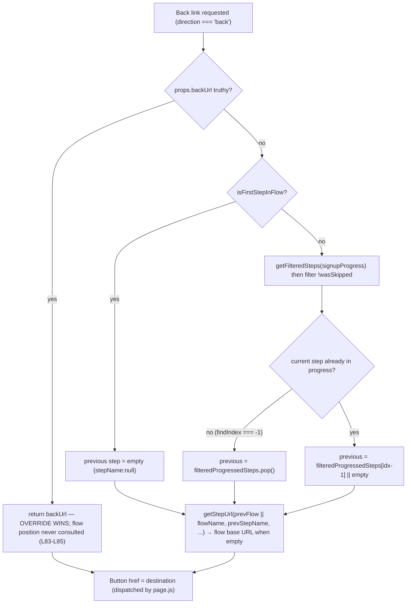

# Calypso Onboarding “Back” Navigation — A Runtime‑Grounded Answer

This document answers, from **observed runtime behavior**, why the **“Back” control in WordPress.com Calypso’s multi‑step onboarding flow** sometimes deviates from the expected “one step backward”: it can **snap straight to the first step** or **slip out into an entirely different flow**, and yet it **never feels truly random**.

Every behavioral claim below was produced by **building and running the real code** first, then writing from what was observed. All code references are to commit **`be7e5cc641622d153040491fd5625c6cb83e12eb`** (source branch `wp-calypso_be7e5cc64162`).

---

## Context

Calypso contains **two coexisting onboarding frameworks**:

- **Legacy signup framework** — `client/signup/**`, routed under `/start`. This is where the reported symptoms are governed, so it is the **primary** subject of this document.
- **Newer “stepper” framework** — `client/landing/stepper/**`, routed under `/setup`. It has an analogous back‑navigation mechanism and reproduces the same *class* of symptom; it is covered as a **secondary** analog.

Client‑side routing uses `@automattic/calypso-router`, Calypso’s fork of the `page.js` micro‑router (`docs/routing.md:L8`, `docs/routing.md:L28-L29`). The onboarding **Back** control is an anchor (`<a href=…>`); page.js intercepts anchor clicks and dispatches the `href`. Therefore **the `href` that the Back control renders *is* the destination** the app will navigate to. That single fact is the backbone of this investigation: to learn the destination for any step, we render the real Back control and read its `href`.

---

## How to read this document

Each question is answered with the same repeatable pattern:

1. **Direct answer** — the one‑sentence conclusion.
2. **Command** — the exact command that produced the evidence.
3. **Observed output** — the **complete, unedited** output of that command.
4. **`file:line` citations** — pointing at commit `be7e5cc64162` (form `path:Lnn` or `path:Lnn-Lmm`).
5. **Cause → effect** — the mechanism that links the code to the observed value.
6. **Label** — every claim is tagged **[OBSERVED]** (captured by running) or **[INFERRED]** (derived by reading, not run).

“Observed” values are exact strings copied from the harness output. Nothing was hand‑edited.

---

## Methodology (run‑first)

Per the governing rule set, the code paths were **built and run before anything was written**:

- A temporary **Jest + jsdom** harness rendered the **real, connected** `NavigationLink` and `StepWrapper` components with the **real `calypso/signup/utils`** module (the decider logic runs for real; nothing about it is mocked).
- The harness lived at `client/signup/navigation-link/test/blitzy_adhoc_test_back_nav.jsx` **only during capture** and was **deleted afterward**. Its captured logs were kept outside the repository under `/tmp/blitzy_evidence/`. Its full source is reproduced in the [Appendix](#appendix-a--the-observation-harness-source) so every number here is reproducible.
- **Canonical entry point (important):** we did **not** reuse the sibling test’s `jest.mock( 'calypso/signup/utils', … )` at `client/signup/navigation-link/test/index.jsx:L7-L12`. That mock stubs `getStepUrl`, `getFilteredSteps`, `getPreviousStepName`, and `isFirstStepInFlow`, which would make any observed destination **non‑canonical**. Our harness imports the real module and reads the real computed `href`.
- After capture, `git status --porcelain` was verified to show **only** this new document — no source file was modified, and the harness left no trace.

The seeded Redux store uses the exact state shape the real selectors read via lodash `get`:

- `signup.progress` → `getSignupProgress` (`client/state/signup/progress/selectors.ts:L8-L10`)
- `route.query.current` → `getCurrentQueryArguments` (`client/state/selectors/get-current-query-arguments.js:L10`)
- `signup.dependencyStore` → `getSignupDependencyStore` (`client/state/signup/dependency-store/selectors.js:L6-L8`)
- `currentUser.id` → `isUserLoggedIn` = `getCurrentUserId(state) !== null` (`client/state/current-user/selectors.js:L6-L8`, `:L15-L17`)

Because these selectors merely read nested state, seeding the store directly and rendering the real components exercises the real decider end‑to‑end.

---

## Environment & How to Run

The repository pins its own toolchain; the generic “Node 20.x” bootstrap is **not** used.

```
# Node must satisfy ^v22.9.0 (.nvmrc = 22.9.0; package.json engines.node)
$ node --version
v22.23.1

# Yarn 4.0.2 via corepack (package.json packageManager)
$ corepack enable
$ yarn --version
4.0.2

# node_modules is not committed; install from the committed yarn.lock
$ CI=true yarn install
➤ YN0000: · Yarn 4.0.2
➤ YN0000: ┌ Resolution step
➤ YN0000: └ Completed in 0s 499ms
➤ YN0000: ┌ Fetch step
➤ YN0000: └ Completed in 4s 400ms
➤ YN0000: ┌ Link step
➤ YN0000: └ Completed in 0s 988ms
➤ YN0000: · Done in 6s 405ms
```

The observation harness was then run with the repository’s own Jest config:

```
CI=true TZ=UTC yarn jest -c=test/client/jest.config.js \
  client/signup/navigation-link/test/blitzy_adhoc_test_back_nav.jsx --ci --runInBand
```

Each individual question below was also re‑run in isolation by appending `-t "<test name>"`. The jsdom environment URL is `https://example.com` (`test/client/jest.config.js:L18`), so `window.location.pathname` is `/`; consequently `getStepUrl`’s framework resolves to `/start` (the legacy framework) rather than `/setup` (`client/signup/utils.js:L57-L61`). **[OBSERVED]**

---

## The short answer (precedence overview)

The back destination for a given step is computed by **`NavigationLink.getBackUrl()`** (`client/signup/navigation-link/index.jsx:L78-L115`), whose return value is bound to the Back button’s `href` (`:L183-L186`, anchor at `:L192`). When the three candidate inputs disagree, the **effective precedence** is:

| Priority | Source | Where resolved | Effect |
|---|---|---|---|
| 1 (highest) | Component prop `backUrl` | assembled as `backUrl = ownProps.backUrl ?? backTo` (`step-wrapper/index.jsx:L277`); returned first in `getBackUrl` (`navigation-link/index.jsx:L83-L85`) | Overrides flow position entirely |
| 2 | `back_to` query argument (only if it `startsWith('/')`) | `getCurrentQueryArguments(state)?.back_to` → `backTo` (`step-wrapper/index.jsx:L274-L275`) | Becomes `backUrl` when no prop is set |
| 3 (lowest) | Computed previous step from flow position | `getPreviousStep()` (`navigation-link/index.jsx:L47-L76`) | Consulted **only** when there is no override |

Crucially, the override is evaluated **before** any flow‑position logic, and its mere presence **forces first‑step eligibility** (`step-wrapper/index.jsx:L65`). Those two facts together explain both symptoms and the apparent “mind of its own.”



The observed data for every branch of this tree follows.

---

## Q1 — What is actually deciding the back destination for a given step?

**Direct answer.** The decider is **`NavigationLink.getBackUrl()`** (`client/signup/navigation-link/index.jsx:L78-L115`). Its return value becomes the Back button’s `href`, and page.js navigates to whatever that `href` is. Nothing else decides the destination. **[OBSERVED]**

**Command.**

```
CI=true TZ=UTC yarn jest -c=test/client/jest.config.js \
  client/signup/navigation-link/test/blitzy_adhoc_test_back_nav.jsx -t "Q1 decider" --ci --runInBand
```

**Observed output (complete, unedited).**

```
Browserslist: browsers data (caniuse-lite) is 17 months old. Please run:
  npx update-browserslist-db@latest
  Why you should do it regularly: https://github.com/browserslist/update-db#readme
PASS client/signup/navigation-link/test/blitzy_adhoc_test_back_nav.jsx (5.606 s)
  ● Console

    console.log
      [Q1] element=anchor href="/start/woocommerce-install/store-address"

      at Object.log (signup/navigation-link/test/blitzy_adhoc_test_back_nav.jsx:91:11)


Test Suites: 1 passed, 1 total
Tests:       9 skipped, 1 passed, 10 total
Snapshots:   0 total
Time:        5.895 s, estimated 6 s
Ran all test suites matching /client\/signup\/navigation-link\/test\/blitzy_adhoc_test_back_nav.jsx/i with tests matching "Q1 decider".
```

**`file:line` citations.**

- `getBackUrl()` body — `client/signup/navigation-link/index.jsx:L78-L115`.
- `hrefUrl` selection (back direction → `getBackUrl()`) — `client/signup/navigation-link/index.jsx:L183-L186`.
- `href={ hrefUrl }` on the `<Button>` — `client/signup/navigation-link/index.jsx:L192`. Because `Button` renders an `<a>` exactly when `href` is truthy (`@automattic/components/src/button/index.tsx:L85`), the back control is an anchor and its `href` is the dispatched destination.
- Router framing — `docs/routing.md:L8`, `docs/routing.md:L28-L29`. **[INFERRED from docs]** that page.js dispatches the anchor `href`; the `href` value itself is **[OBSERVED]**.

**Cause → effect.** The connected `NavigationLink` (default export `connect(…)(localize(NavigationLink))`, `client/signup/navigation-link/index.jsx:L204-L215`) was rendered for `flowName='woocommerce-install'`, `stepName='business-info'` with persisted progress `{store-address, business-info}`. `getBackUrl()` ran the real resolver and returned `"/start/woocommerce-install/store-address"`, which the `<Button>` emitted as the anchor `href`. The `element=anchor` confirms the value is a real, clickable destination — i.e., the resolver’s return value **is** the observable destination.

---

## Q2 — Which input wins when flow position, the component `backUrl` prop, and the `back_to` query argument disagree?

**Direct answer.** Precedence is **prop `backUrl` > `back_to` query argument > computed flow position**. The component prop wins over everything; the `back_to` query argument wins over flow position; the step‑by‑step computation is consulted only when neither override exists. **[OBSERVED]**

**Command.**

```
CI=true TZ=UTC yarn jest -c=test/client/jest.config.js \
  client/signup/navigation-link/test/blitzy_adhoc_test_back_nav.jsx -t "Q2 precedence" --ci --runInBand
```

**Observed output (complete, unedited).**

```
Browserslist: browsers data (caniuse-lite) is 17 months old. Please run:
  npx update-browserslist-db@latest
  Why you should do it regularly: https://github.com/browserslist/update-db#readme
PASS client/signup/navigation-link/test/blitzy_adhoc_test_back_nav.jsx (5.461 s)
  ● Console

    console.log
      [Q2][A position-only] href="/start/woocommerce-install/store-address"

      at Object.log (signup/navigation-link/test/blitzy_adhoc_test_back_nav.jsx:115:11)

    console.log
      [Q2][B position+back_to] href="/start/setup-site/store-features?siteSlug=example.wordpress.com"

      at Object.log (signup/navigation-link/test/blitzy_adhoc_test_back_nav.jsx:116:11)

    console.log
      [Q2][C position+back_to+prop] href="/explicit/prop/path?x=1"

      at Object.log (signup/navigation-link/test/blitzy_adhoc_test_back_nav.jsx:117:11)


Test Suites: 1 passed, 1 total
Tests:       9 skipped, 1 passed, 10 total
Snapshots:   0 total
Time:        5.745 s, estimated 6 s
Ran all test suites matching /client\/signup\/navigation-link\/test\/blitzy_adhoc_test_back_nav.jsx/i with tests matching "Q2 precedence".
```

**Interpretation of the three scenarios (all at `stepName='business-info'`, position 1, progress `{store-address, business-info}`):**

| Scenario | Inputs present | Observed `href` | Winner |
|---|---|---|---|
| A | flow position only | `/start/woocommerce-install/store-address` | flow position (computed previous step) |
| B | flow position **+** `back_to=/start/setup-site/store-features?…` | `/start/setup-site/store-features?siteSlug=example.wordpress.com` | `back_to` query |
| C | flow position **+** `back_to` **+** prop `backUrl=/explicit/prop/path?x=1` | `/explicit/prop/path?x=1` | prop `backUrl` |

**`file:line` citations.**

- Assembly of the effective `backUrl` — `client/signup/step-wrapper/index.jsx:L273-L283`, specifically:
  - `const backToParam = getCurrentQueryArguments( state )?.back_to?.toString();` — `:L274`
  - `const backTo = backToParam?.startsWith( '/' ) ? backToParam : undefined;` — `:L275`
  - `const backUrl = ownProps.backUrl ?? backTo;` — `:L277` (prop wins over query via `??`).
- Tie‑break that puts the override ahead of flow position — `if ( this.props.backUrl ) { return this.props.backUrl; }` at `client/signup/navigation-link/index.jsx:L83-L85`, **before** the position logic at `:L87-L114`.

**Cause → effect.** In scenario B, no prop was supplied, so `backUrl = undefined ?? backTo = "/start/setup-site/store-features?…"` (`:L277`); `getBackUrl` returned it immediately at `:L83-L85`, so the flow‑position value observed in A was never computed. In scenario C, `ownProps.backUrl` was set, so `??` selected the prop over `backTo` (`:L277`), and again `getBackUrl` returned it first. This is precisely the “quiet override” the user senses: a higher‑priority input silently supersedes the step‑by‑step computation.


---

## Q3 — Where does the external back target (the “quiet override”) come from?

**Direct answer.** The override reaches the decider through **one of two channels**: (1) the **`back_to` query argument**, read by `StepWrapper` from Redux `route.query.current` and accepted only if it `startsWith('/')`; or (2) a **component `backUrl` prop**, injected into a step from flow/step configuration. Both collapse into the single `backUrl` value that `getBackUrl()` returns first. **[OBSERVED]** for the runtime effect; **[INFERRED from reading]** for the configuration provenance noted below.

**Command.**

```
CI=true TZ=UTC yarn jest -c=test/client/jest.config.js \
  client/signup/navigation-link/test/blitzy_adhoc_test_back_nav.jsx -t "Q3 override source" --ci --runInBand
```

**Observed output (complete, unedited).**

```
Browserslist: browsers data (caniuse-lite) is 17 months old. Please run:
  npx update-browserslist-db@latest
  Why you should do it regularly: https://github.com/browserslist/update-db#readme
PASS client/signup/navigation-link/test/blitzy_adhoc_test_back_nav.jsx (5.524 s)
  ● Console

    console.log
      [Q3][no override] href="/start/woocommerce-install/business-info"

      at Object.log (signup/navigation-link/test/blitzy_adhoc_test_back_nav.jsx:139:11)

    console.log
      [Q3][back_to=/start/...] href="/start/setup-site/store-features?siteSlug=example.wordpress.com"

      at Object.log (signup/navigation-link/test/blitzy_adhoc_test_back_nav.jsx:140:11)

    console.log
      [Q3][back_to=https://... (no leading /)] href="/start/woocommerce-install/business-info"

      at Object.log (signup/navigation-link/test/blitzy_adhoc_test_back_nav.jsx:141:11)


Test Suites: 1 passed, 1 total
Tests:       9 skipped, 1 passed, 10 total
Snapshots:   0 total
Time:        5.811 s, estimated 6 s
Ran all test suites matching /client\/signup\/navigation-link\/test\/blitzy_adhoc_test_back_nav.jsx/i with tests matching "Q3 override source".
```

**What the three lines show (all at `stepName='confirm'`, progress through `confirm`):**

- **No override** → `/start/woocommerce-install/business-info` (the normal computed previous step).
- **`back_to=/start/setup-site/store-features?…`** (starts with `/`) → the Back `href` becomes that absolute path — the override took control.
- **`back_to=https://evil.example.com/x`** (does **not** start with `/`) → the override was **rejected**, and the `href` fell back to the computed previous step. This confirms the `startsWith('/')` gate is the only admission check.

**`file:line` citations — the runtime path.**

- `back_to` read from Redux and gated — `client/signup/step-wrapper/index.jsx:L274-L275`; source selector `getCurrentQueryArguments(state) = get(state,'route.query.current',null)` at `client/state/selectors/get-current-query-arguments.js:L10`.
- The component `backUrl` prop originates from the per‑step prop spread in `renderCurrentStep()`: `{ ...omit(this.props,'locale'), ...steps[stepName].props, ...flowStepProps }` where `flowStepProps = flow?.props?.[stepName] || {}` — `client/signup/main.jsx:L762`, `:L766-L770`.

**`file:line` citations — where a `back_to`/`backUrl` value is *born* (provenance). [INFERRED from reading]:**

- The `woocommerce-install` controller dispatches an incoming `back_to` query into the dependency store: `if ( context?.query?.back_to ) { … context.store.dispatch( updateDependencies( { back_to: context.query.back_to } ) ); }` — `client/signup/controller.js:L226-L230` (dispatch at `:L229`). Stored value is retrievable via `getSignupDependencyStore(state) = get(state,'signup.dependencyStore',{})` — `client/state/signup/dependency-store/selectors.js:L6-L8`.
- A **hardcoded cross‑flow** `back_to` is minted by a destination builder: `back_to: \`/start/setup-site/store-features?siteSlug=${ siteSlug }\`` inside `addQueryArgs( { back_to, siteSlug }, '/start/woocommerce-install' )` for `intent === 'sell' && storeType === 'power'` — `client/signup/config/flows.js:L171-L179` (the `back_to` literal at `:L174`). This is exactly the value used in scenario B/Symptom 2, and it points from `woocommerce-install` **into a different flow** (`setup-site`).
- `back_to` is a declared query dependency for several flows: `providesDependenciesInQuery` / `optionalDependenciesInQuery` include `back_to` at `client/signup/config/flows-pure.js:L410-L411`, `:L446-L447`, and `:L478-L479` (the last being the `woocommerce-install` flow, `:L471`/steps `:L475`).
- It is a step‑level dependency for the first `woocommerce-install` step: `'store-address': { … dependencies: [ 'siteSlug', 'back_to' ], optionalDependencies: [ 'back_to' ] }` — `client/signup/config/steps-pure.js:L873-L877`.
- A **static** component `backUrl` prop also exists in configuration, e.g. the `mailbox` step declares `props: { backUrl: 'mailbox-domain/', … }` — `client/signup/config/steps-pure.js:L398-L399`. Via the `steps[stepName].props` spread (`main.jsx:L768`) this becomes the `backUrl` prop for that step regardless of flow position.

**Cause → effect.** A `back_to` query argument (whether typed into the URL, dispatched by the controller, or minted by a destination builder like `flows.js:L174`) lands in `route.query.current`. `StepWrapper` reads it (`:L274`), admits it only if it looks like a path (`:L275`), and folds it into `backUrl` (`:L277`). `getBackUrl` then returns that value first (`navigation-link:L83-L85`). The override is “quiet” precisely because there is no reconciliation against the current step — the only check is the `/`‑prefix.

---

## Q4 — What precedence rule lets the override take control even when the step “should not be eligible”?

**Direct answer.** The presence of a `backUrl` **forces first‑step eligibility**. `StepWrapper.renderBack()` passes `allowBackFirstStep={ this.props.allowBackFirstStep || !! this.props.backUrl }` (`client/signup/step-wrapper/index.jsx:L65`), which defeats the visibility gate that would otherwise hide Back on the first step. Combined with the override being returned before any position logic, an “ineligible” step both **renders** the Back control **and** navigates to the override. **[OBSERVED]**

**Command.**

```
CI=true TZ=UTC yarn jest -c=test/client/jest.config.js \
  client/signup/navigation-link/test/blitzy_adhoc_test_back_nav.jsx -t "Q4 eligibility" --ci --runInBand
```

**Observed output (complete, unedited).**

```
Browserslist: browsers data (caniuse-lite) is 17 months old. Please run:
  npx update-browserslist-db@latest
  Why you should do it regularly: https://github.com/browserslist/update-db#readme
PASS client/signup/navigation-link/test/blitzy_adhoc_test_back_nav.jsx (5.605 s)
  ● Console

    console.log
      [Q4][pos0 no-override] element=null href=null

      at Object.log (signup/navigation-link/test/blitzy_adhoc_test_back_nav.jsx:157:11)

    console.log
      [Q4][pos0 with-override] element=anchor href="/start/setup-site/store-features?siteSlug=example.wordpress.com"

      at Object.log (signup/navigation-link/test/blitzy_adhoc_test_back_nav.jsx:158:11)


Test Suites: 1 passed, 1 total
Tests:       9 skipped, 1 passed, 10 total
Snapshots:   0 total
Time:        5.895 s, estimated 6 s
Ran all test suites matching /client\/signup\/navigation-link\/test\/blitzy_adhoc_test_back_nav.jsx/i with tests matching "Q4 eligibility".
```

**What the two lines show (both at `stepName='store-address'`, `positionInFlow=0` — the first step):**

- **No override** → `element=null`: `NavigationLink.render()` returned `null`; the Back control is **not rendered at all**.
- **With `back_to` override** → `element=anchor`, `href="/start/setup-site/store-features?…"`: the Back control **renders and points at the override**, at the very position where it is normally hidden.

**`file:line` citations.**

- Eligibility force — `allowBackFirstStep={ this.props.allowBackFirstStep || !! this.props.backUrl }` at `client/signup/step-wrapper/index.jsx:L65` (with the code comment at `:L25-L27`: “You should only force this when you’re passing a backUrl.”).
- First‑step visibility gate — `if ( positionInFlow === 0 && direction === 'back' && ! stepSectionName && ! allowBackFirstStep ) return null;` at `client/signup/navigation-link/index.jsx:L154-L161`.
- Override returned before position logic — `client/signup/navigation-link/index.jsx:L83-L85`.

**Cause → effect.** At `positionInFlow === 0` with no override, all four gate conditions hold (position 0, back, no section, `allowBackFirstStep` false), so `render()` returns `null` — hence `element=null`. Adding a `back_to` makes `StepWrapper` compute `backUrl` truthy (`:L277`), which flips `allowBackFirstStep` to `true` at `:L65`; the gate’s `! allowBackFirstStep` is now false, so `render()` proceeds, and `getBackUrl` returns the override (`:L83-L85`). The eligibility rule and the precedence rule reinforce each other: the same `backUrl` that supplies the destination also unlocks the control that should have been hidden.


---

## Q5 — What code path handles the expected “one step backward” navigation that the override bypasses?

**Direct answer.** The expected step‑by‑step path is **`NavigationLink.getPreviousStep()`** (`client/signup/navigation-link/index.jsx:L47-L76`), which resolves the previous step from **persisted, filtered, non‑skipped progress** and then builds a URL with **`getStepUrl()`** (`client/signup/utils.js:L45-L69`). This entire path is skipped whenever an override (`backUrl`/`back_to`) is present. **[OBSERVED]**

**Command.**

```
CI=true TZ=UTC yarn jest -c=test/client/jest.config.js \
  client/signup/navigation-link/test/blitzy_adhoc_test_back_nav.jsx -t "Q5 bypassed" --ci --runInBand
```

**Observed output (complete, unedited).**

```
Browserslist: browsers data (caniuse-lite) is 17 months old. Please run:
  npx update-browserslist-db@latest
  Why you should do it regularly: https://github.com/browserslist/update-db#readme
PASS client/signup/navigation-link/test/blitzy_adhoc_test_back_nav.jsx (5.5 s)
  ● Console

    console.log
      [Q5][in-progress idx-1] href="/start/woocommerce-install/business-info"

      at Object.log (signup/navigation-link/test/blitzy_adhoc_test_back_nav.jsx:198:11)

    console.log
      [Q5][not-yet-in-progress pop()] href="/start/woocommerce-install/business-info"

      at Object.log (signup/navigation-link/test/blitzy_adhoc_test_back_nav.jsx:199:11)

    console.log
      [Q5][skipped filtered out] href="/start/woocommerce-install/store-address"

      at Object.log (signup/navigation-link/test/blitzy_adhoc_test_back_nav.jsx:200:11)


Test Suites: 1 passed, 1 total
Tests:       9 skipped, 1 passed, 10 total
Snapshots:   0 total
Time:        5.787 s, estimated 6 s
Ran all test suites matching /client\/signup\/navigation-link\/test\/blitzy_adhoc_test_back_nav.jsx/i with tests matching "Q5 bypassed".
```

**What the three lines show — the three branches of `getPreviousStep()`:**

| Branch | Scenario | Observed `href` | Mechanism |
|---|---|---|---|
| current step in progress | `confirm` with progress `{store-address, business-info, confirm}` | `/start/woocommerce-install/business-info` | previous = `filtered[idx-1]` |
| current step **not yet** in progress | `transfer` with progress `{store-address, business-info}` | `/start/woocommerce-install/business-info` | `findIndex === -1` → `filtered.pop()` (top of progress) |
| a step was skipped | `confirm` with `business-info` `wasSkipped: true` | `/start/woocommerce-install/store-address` | skipped step filtered out → previous = `store-address` |

**`file:line` citations.**

- `getPreviousStep(flowName, signupProgress, currentStepName)` — `client/signup/navigation-link/index.jsx:L47-L76`:
  - empty sentinel `const previousStep = { stepName: null };` — `:L48`.
  - first‑step guard: `if ( isFirstStepInFlow( … ) ) { return previousStep; }` — `:L50-L52` (`isFirstStepInFlow` at `client/signup/utils.js:L28-L31`).
  - filtered + non‑skipped progress: `getFilteredSteps( … ).filter( ( step ) => ! step.wasSkipped )` — `:L56-L60` (`getFilteredSteps` at `client/signup/utils.js:L137-L150`).
  - empty filtered progress → empty previous — `:L61-L63`.
  - “current step not yet in progress” → `filteredProgressedSteps.pop()` — `:L70-L72`.
  - otherwise `filteredProgressedSteps[ currentStepIndexInProgress - 1 ] || previousStep` — `:L75`.
- URL construction — `getStepUrl(flowName, stepName, stepSectionName, locale, params)` at `client/signup/utils.js:L45-L69`; the `/start` vs `/setup` framework choice at `:L57-L61`; the default‑flow special case (flow name omitted under `/start`) at `:L63-L67`; an **empty `stepName` yields the flow base/root URL**.
- A simpler pure‑index sibling exists but is not used by `getPreviousStep`: `getPreviousStepName = flow.steps[ flow.steps.indexOf( currentStepName ) - 1 ]` at `client/signup/utils.js:L85-L88`.

**Cause → effect.** With no override, `getBackUrl` fell through `:L83-L85` and called `getPreviousStep` at `:L98`. For `confirm` in full progress, `findIndex` located `confirm` and returned the entry before it (`business-info`) via `:L75`; `getStepUrl` produced `/start/woocommerce-install/business-info`. For `transfer` when `transfer` was not yet in progress, `findIndex === -1` triggered `pop()` at `:L72`, returning the last progressed step (`business-info`). When `business-info` was `wasSkipped`, the `.filter( … ! step.wasSkipped )` at `:L60` removed it, so the step before `confirm` became `store-address`. This is the “one step backward” logic the override bypasses.

---

## Q6 — What is the computed destination for each step position?

**Direct answer.** Iterating over every position of the `woocommerce-install` flow (steps `store-address`, `business-info`, `confirm`, `transfer` — `client/signup/config/flows-pure.js:L475`) with no override and realistic persisted progress yields a clean “one step back” table. Re‑running the identical inputs produced a **byte‑identical** table (distribution: **2/2 runs identical**), so the mapping is **deterministic**. **[OBSERVED]**

**Command.**

```
CI=true TZ=UTC yarn jest -c=test/client/jest.config.js \
  client/signup/navigation-link/test/blitzy_adhoc_test_back_nav.jsx -t "Q6 per-position" --ci --runInBand
```

**Observed output (complete, unedited).**

```
Browserslist: browsers data (caniuse-lite) is 17 months old. Please run:
  npx update-browserslist-db@latest
  Why you should do it regularly: https://github.com/browserslist/update-db#readme
PASS client/signup/navigation-link/test/blitzy_adhoc_test_back_nav.jsx (5.498 s)
  ● Console

    console.log
      [Q6][run1] [{"position":0,"stepName":"store-address","element":"anchor","href":"/start/woocommerce-install"},{"position":1,"stepName":"business-info","element":"anchor","href":"/start/woocommerce-install/store-address"},{"position":2,"stepName":"confirm","element":"anchor","href":"/start/woocommerce-install/business-info"},{"position":3,"stepName":"transfer","element":"anchor","href":"/start/woocommerce-install/confirm"}]

      at log (signup/navigation-link/test/blitzy_adhoc_test_back_nav.jsx:215:11)

    console.log
      [Q6][run2] [{"position":0,"stepName":"store-address","element":"anchor","href":"/start/woocommerce-install"},{"position":1,"stepName":"business-info","element":"anchor","href":"/start/woocommerce-install/store-address"},{"position":2,"stepName":"confirm","element":"anchor","href":"/start/woocommerce-install/business-info"},{"position":3,"stepName":"transfer","element":"anchor","href":"/start/woocommerce-install/confirm"}]

      at log (signup/navigation-link/test/blitzy_adhoc_test_back_nav.jsx:215:11)

    console.log
      [Q6][identical] true

      at Object.log (signup/navigation-link/test/blitzy_adhoc_test_back_nav.jsx:222:11)


Test Suites: 1 passed, 1 total
Tests:       9 skipped, 1 passed, 10 total
Snapshots:   0 total
Time:        5.789 s, estimated 6 s
Ran all test suites matching /client\/signup\/navigation-link\/test\/blitzy_adhoc_test_back_nav.jsx/i with tests matching "Q6 per-position".
```

**Per‑position destination table (identical across both runs):**

| position | stepName | observed `href` |
|---|---|---|
| 0 | `store-address` | `/start/woocommerce-install` |
| 1 | `business-info` | `/start/woocommerce-install/store-address` |
| 2 | `confirm` | `/start/woocommerce-install/business-info` |
| 3 | `transfer` | `/start/woocommerce-install/confirm` |

(For this table the harness set `allowBackFirstStep: true` so position 0 renders a control; its `href` `/start/woocommerce-install` is the **flow base URL** — the first‑step case discussed in Symptom 1.)

**`file:line` citations.**

- `positionInFlow` provenance — `getPositionInFlow() = flows.getFlow( flowName, isLoggedIn ).steps.indexOf( stepName )` at `client/signup/main.jsx:L733-L736`, passed as `positionInFlow={ this.getPositionInFlow() }` at `:L811`.
- Flow definition — `woocommerce-install` at `client/signup/config/flows-pure.js:L471`, `steps: [ 'store-address', 'business-info', 'confirm', 'transfer' ]` at `:L475`, `destination: '/'` at `:L476`.
- Note `getPositionInFlow`/`indexOf` is the position; `getBackUrl` itself does not read `positionInFlow` — the destination is a function of `stepName` + progress. `positionInFlow` only governs the first‑step render gate (`navigation-link:L154-L161`).

**Cause → effect.** For each position `i`, the harness seeded progress with steps `0..i` and set `stepName = steps[i]`. `getPreviousStep` returned step `i-1` (`:L75`), and `getStepUrl` mapped it to `/start/woocommerce-install/<step i-1>` (`utils.js:L45-L69`; flow name included because `woocommerce-install` is not the default flow). Position 0 has no earlier step, so `getPreviousStep` returned the empty sentinel and `getStepUrl` produced the flow base URL. The `[Q6][identical] true` line — and the byte‑identical `run1`/`run2` arrays — demonstrate the mapping is stable, not random.


---

## Why it “never feels truly random” (the implicit requirement)

**Direct answer.** The destination is a **pure function of five deterministic inputs**: (1) the component `backUrl` prop, (2) the `back_to` query argument, (3) the persisted `signupProgress`, (4) the current step (`stepName`, positioned by `positionInFlow`), and (5) the flow configuration. There is **no random number generator** anywhere on the path. Apparent variation for “the same step” is entirely explained by inputs (2) and (3) differing between sessions or runs. **[OBSERVED]**

**Evidence 1 — identical inputs give identical output (stability).** The Q6 table above was captured twice in the same run and reported `[Q6][identical] true` with byte‑identical `run1`/`run2` arrays. Distribution: **2/2 identical**.

**Evidence 2 — varying only persisted progress changes the destination for the *same* step position.**

**Command.**

```
CI=true TZ=UTC yarn jest -c=test/client/jest.config.js \
  client/signup/navigation-link/test/blitzy_adhoc_test_back_nav.jsx -t "NOT-RANDOM" --ci --runInBand
```

**Observed output (complete, unedited).**

```
Browserslist: browsers data (caniuse-lite) is 17 months old. Please run:
  npx update-browserslist-db@latest
  Why you should do it regularly: https://github.com/browserslist/update-db#readme
PASS client/signup/navigation-link/test/blitzy_adhoc_test_back_nav.jsx (5.544 s)
  ● Console

    console.log
      [NR][same step=confirm pos=2, progress=full] href="/start/woocommerce-install/business-info"

      at Object.log (signup/navigation-link/test/blitzy_adhoc_test_back_nav.jsx:243:11)

    console.log
      [NR][same step=confirm pos=2, progress=empty] href="/start/woocommerce-install"

      at Object.log (signup/navigation-link/test/blitzy_adhoc_test_back_nav.jsx:244:11)

    console.log
      [NR][same step=confirm pos=2, progress=only-first] href="/start/woocommerce-install/store-address"

      at Object.log (signup/navigation-link/test/blitzy_adhoc_test_back_nav.jsx:245:11)


Test Suites: 1 passed, 1 total
Tests:       9 skipped, 1 passed, 10 total
Snapshots:   0 total
Time:        5.841 s, estimated 6 s
Ran all test suites matching /client\/signup\/navigation-link\/test\/blitzy_adhoc_test_back_nav.jsx/i with tests matching "NOT-RANDOM".
```

For the **identical** step `confirm` at position 2, changing only the persisted progress yields three **different but fully determined** destinations:

| Persisted progress (only input varied) | Observed `href` |
|---|---|
| full `{store-address, business-info, confirm}` | `/start/woocommerce-install/business-info` |
| empty `{}` | `/start/woocommerce-install` (flow base — “snaps to first step”) |
| only `{store-address}` | `/start/woocommerce-install/store-address` |

**`file:line` citations.**

- `getSignupProgress = get( state, 'signup.progress', {} )` — `client/state/signup/progress/selectors.ts:L8-L10` (input 3).
- `getCurrentQueryArguments` (`back_to`) — `client/state/selectors/get-current-query-arguments.js:L10` (input 2).
- Consumption of these inputs — `getBackUrl` / `getPreviousStep` at `client/signup/navigation-link/index.jsx:L78-L115`, `:L47-L76` (no RNG; pure reads of props + state).

**Cause → effect.** Because `getBackUrl` derives the destination solely from props and persisted state, the same step reached with different persisted progress (e.g. a resumed session, a partially‑completed flow, or progress left over from another flow) produces different — but always determined — destinations. To an observer who only sees “the same step,” the differing hidden state looks like the button “has a mind of its own,” but it is strictly a function of inputs (2) and (3). This is why it “never feels truly random”: it isn’t.

---

## Reproducing BOTH user symptoms (unedited output)

### Symptom 1 — “snaps straight to the first step”

**Direct answer.** This occurs when `getPreviousStep()` resolves to the **empty sentinel** (`{ stepName: null }`), so `getStepUrl()` is called with no `stepName` and returns the **flow base/root URL**. The most common trigger is **empty filtered progress** for the current flow (e.g. a fresh session, or progress belonging to a different flow), even while the user is on a mid‑flow step. **[OBSERVED]**

**Command.**

```
CI=true TZ=UTC yarn jest -c=test/client/jest.config.js \
  client/signup/navigation-link/test/blitzy_adhoc_test_back_nav.jsx -t "SYMPTOM 1" --ci --runInBand
```

**Observed output (complete, unedited).**

```
Browserslist: browsers data (caniuse-lite) is 17 months old. Please run:
  npx update-browserslist-db@latest
  Why you should do it regularly: https://github.com/browserslist/update-db#readme
PASS client/signup/navigation-link/test/blitzy_adhoc_test_back_nav.jsx (5.439 s)
  ● Console

    console.log
      [S1][confirm pos2, empty progress] href="/start/woocommerce-install"

      at Object.log (signup/navigation-link/test/blitzy_adhoc_test_back_nav.jsx:254:11)


Test Suites: 1 passed, 1 total
Tests:       9 skipped, 1 passed, 10 total
Snapshots:   0 total
Time:        5.722 s, estimated 6 s
Ran all test suites matching /client\/signup\/navigation-link\/test\/blitzy_adhoc_test_back_nav.jsx/i with tests matching "SYMPTOM 1".
```

The user is on `confirm` (position 2), yet Back points at `/start/woocommerce-install` — the flow root, which redirects to the first step `store-address`. That is the “snap to the first step.”

**Sibling variant — the default flow.** For the default flow `onboarding` (`client/signup/config/flows.js:L243-L245`, `:L250`), the same empty‑progress condition yields the bare framework root because `getStepUrl` omits the default flow name under `/start` (`client/signup/utils.js:L63-L67`):

```
Browserslist: browsers data (caniuse-lite) is 17 months old. Please run:
  npx update-browserslist-db@latest
  Why you should do it regularly: https://github.com/browserslist/update-db#readme
PASS client/signup/navigation-link/test/blitzy_adhoc_test_back_nav.jsx (5.524 s)
  ● Console

    console.log
      [DEF][onboarding empty progress] href="/start"

      at Object.log (signup/navigation-link/test/blitzy_adhoc_test_back_nav.jsx:274:11)


Test Suites: 1 passed, 1 total
Tests:       9 skipped, 1 passed, 10 total
Snapshots:   0 total
Time:        5.848 s, estimated 6 s
Ran all test suites matching /client\/signup\/navigation-link\/test\/blitzy_adhoc_test_back_nav.jsx/i with tests matching "DEFAULT FLOW".
```

**`file:line` citations.**

- Empty sentinel and its two producers — `client/signup/navigation-link/index.jsx:L48`, first‑step guard `:L50-L52` (`isFirstStepInFlow` at `client/signup/utils.js:L28-L31`), empty filtered progress `:L61-L63` (`getFilteredSteps` at `client/signup/utils.js:L137-L150`).
- Empty `stepName` → flow base URL — `client/signup/utils.js:L45-L69` (default‑flow special case `:L63-L67`).

**Cause → effect.** With empty `signup.progress`, `getFilteredSteps` returned `[]`, so `filteredProgressedSteps.length === 0` and `getPreviousStep` returned `{ stepName: null }` (`:L61-L63`). `getBackUrl` then called `getStepUrl('woocommerce-install', null, …)`, and with no `stepName` the builder produced `/start/woocommerce-install` (`utils.js:L45-L69`). It can *also* occur when an override `backUrl`/`back_to` explicitly points at the first step — same destination, different trigger.

### Symptom 2 — “slips out into an entirely different flow”

**Direct answer.** This occurs when the external `back_to` (or a `backUrl` prop) carries an **absolute path into a different flow**, which the override accepts solely because it `startsWith('/')`. In `woocommerce-install`, seeding the real cross‑flow value from `client/signup/config/flows.js:L174` makes Back point at `setup-site`, a different flow. **[OBSERVED]**

**Command.**

```
CI=true TZ=UTC yarn jest -c=test/client/jest.config.js \
  client/signup/navigation-link/test/blitzy_adhoc_test_back_nav.jsx -t "SYMPTOM 2" --ci --runInBand
```

**Observed output (complete, unedited).**

```
Browserslist: browsers data (caniuse-lite) is 17 months old. Please run:
  npx update-browserslist-db@latest
  Why you should do it regularly: https://github.com/browserslist/update-db#readme
PASS client/signup/navigation-link/test/blitzy_adhoc_test_back_nav.jsx (5.506 s)
  ● Console

    console.log
      [S2][woocommerce-install confirm, back_to cross-flow] href="/start/setup-site/store-features?siteSlug=example.wordpress.com"

      at Object.log (signup/navigation-link/test/blitzy_adhoc_test_back_nav.jsx:265:11)


Test Suites: 1 passed, 1 total
Tests:       9 skipped, 1 passed, 10 total
Snapshots:   0 total
Time:        5.791 s, estimated 6 s
Ran all test suites matching /client\/signup\/navigation-link\/test\/blitzy_adhoc_test_back_nav.jsx/i with tests matching "SYMPTOM 2".
```

The user is in `woocommerce-install`, but Back points at `/start/setup-site/store-features?…` — an entirely different flow (`setup-site`).

**`file:line` citations.**

- The cross‑flow value’s origin — `back_to: \`/start/setup-site/store-features?siteSlug=${ siteSlug }\`` at `client/signup/config/flows.js:L174` (built into a redirect to `/start/woocommerce-install` at `:L171-L179`).
- Admission solely by `/`‑prefix — `const backTo = backToParam?.startsWith( '/' ) ? backToParam : undefined;` at `client/signup/step-wrapper/index.jsx:L275`.
- Returned first, before flow position — `client/signup/navigation-link/index.jsx:L83-L85`.

**Cause → effect.** The destination builder mints a URL that lands the user in `woocommerce-install` while carrying `back_to=/start/setup-site/store-features?…`. `StepWrapper` admits it (it starts with `/`, `:L275`), folds it into `backUrl` (`:L277`), and `getBackUrl` returns it verbatim (`:L83-L85`). No check verifies that the target belongs to the current flow, so Back “slips out” into `setup-site`.

**Both symptoms trace to the same rule.** The override is evaluated **before** flow position (`navigation-link:L83-L85`) and its presence **forces first‑step eligibility** (`step-wrapper:L65`). Symptom 1 is the *absence* of usable progress collapsing the computed path to the flow root; Symptom 2 is an *override* redirecting across flows. Both are deterministic consequences of the precedence rule plus the persisted/query inputs.


---

## Secondary framework analog — the “stepper” framework (`client/landing/stepper/`)

The newer stepper framework (routed under `/setup`) has an analogous mechanism and reproduces the same *class* of symptom. This section is grounded in a careful reading of the code; because exercising it canonically requires registering `@wordpress/data` stores and a React‑Router flow context, the claims below are labeled **[INFERRED from reading]** unless stated otherwise. The citations are exact against commit `be7e5cc64162`.

**The decider is the flow, with `history.back()` as the default.** In `useStepNavigationWithTracking`, the returned `goBack` defaults to `() => history.back()` (`client/landing/stepper/declarative-flow/internals/hooks/use-step-navigation-with-tracking/index.ts:L123-L130`; `history.back()` at `:L128`). This is then **overwritten** whenever the flow defines its own `goBack`, under the explicit comment **“Flow is the ultimate authority on navigation.”** (`:L132`, override block `:L134-L141`). So, exactly as in the legacy framework, a flow‑supplied target wins over the generic “go back one” behavior. **[INFERRED from reading]**

**The eligibility gate mirrors the legacy first‑step gate.** Back is offered only when:

```
const canUserGoBack =
    stepData?.previousStep &&
    currentStepRoute !== stepSlugs[ 0 ] &&
    history.length > 1 &&
    stepData.previousStep !== currentStepRoute;
```

at `client/landing/stepper/declarative-flow/internals/hooks/use-step-navigation-with-tracking/index.ts:L54-L58`. **[INFERRED from reading]**

**The cross‑flow analog is called out in the code itself.** The comment at `:L47-L53` states that `previousStep` **“is persisted and can be a step from another flow or another run of the current flow”** (`:L49`). That is the stepper equivalent of the legacy Symptom 2: a persisted `previousStep` belonging to a different flow/run can send Back somewhere unexpected. **[INFERRED from reading]**

**Where `previousStep` is written and read.**

- Written as the current step slug on navigation: `setStepData( { … previousStep: currentStepSlug } )` — `client/landing/stepper/declarative-flow/internals/hooks/use-flow-navigation/index.tsx:L70` and `:L102`.
- Wired in the internals renderer: `previousStep` at `client/landing/stepper/declarative-flow/internals/index.tsx:L152`; `goBack()` at `:L176`.
- Persisted in the stepper store: `export const STEPPER_INTERNAL_STORE = StepperInternal.register();` — `client/landing/stepper/stores.ts:L5`.

**Concrete flow‑defined `goBack` overrides (each authoritative over the default).**

- `start-writing`: `const goBack = async () => { switch ( currentStep ) { case 'domains': return navigate( 'launchpad' ); } };` — `client/landing/stepper/declarative-flow/flows/start-writing/start-writing.ts:L210-L215`. From `domains`, Back jumps directly to `launchpad` (not simply “one step back”). **[INFERRED from reading]**
- `reblogging`: `const goBack = () => { return; };` — `client/landing/stepper/declarative-flow/flows/reblogging/reblogging.ts:L70-L72`. A deliberate no‑op override. **[INFERRED from reading]**

**Fallback semantics.** `history.back()` relies on the browser history stack; the page.js `page.back()` idiom likewise runs `history.back()` when history exists and can fall back to a supplied path otherwise. **[INFERRED from docs]**

**Net analog.** In both frameworks the flow (or an external/persisted target) is the ultimate authority, a first‑step‑style gate governs visibility, and a persisted value that outlives the current flow/run is what makes Back occasionally land “in a different flow.” The legacy framework exposes this as a synchronous `href` we can read directly (hence the OBSERVED evidence above); the stepper framework performs the same decision imperatively inside `goBack`.

---

## Coverage pass

Every named item and secondary condition is addressed:

- [x] **Q1 — the decider.** `NavigationLink.getBackUrl()` → Button `href`. **[OBSERVED]** (`navigation-link:L78-L115`, `:L183-L186`, `:L192`).
- [x] **Q2 — precedence.** prop `backUrl` > `back_to` (must start with `/`) > flow position; demonstrated across 3 scenarios. **[OBSERVED]** (`step-wrapper:L274-L277`, `navigation-link:L83-L85`).
- [x] **Q3 — override source.** `back_to` query (`route.query.current`) and the `backUrl` prop (config prop spread); provenance in `controller.js:L226-L230`, `flows.js:L174`, `flows-pure.js:L410-L411/L446-L447/L478-L479`, `steps-pure.js:L873-L877` and `:L398-L399`. **[OBSERVED effect + INFERRED provenance]**.
- [x] **Q4 — eligibility override.** `allowBackFirstStep || !! backUrl` (`step-wrapper:L65`) defeats the first‑step gate (`navigation-link:L154-L161`); position‑0 hidden without override, rendered with it. **[OBSERVED]**.
- [x] **Q5 — bypassed step‑by‑step path.** `getPreviousStep()` (`navigation-link:L47-L76`) + `getStepUrl`/`getFilteredSteps`/`isFirstStepInFlow` (`utils.js`). **[OBSERVED]**.
- [x] **Q6 — per‑position table.** Full `woocommerce-install` flow tabulated; **2/2 runs identical**. **[OBSERVED]**.
- [x] **Implicit “not random.”** Pure function of five inputs; identical inputs → identical output; varying only progress changes the destination deterministically. **[OBSERVED]**.
- [x] **Secondary: first‑step eligibility.** Position‑0 render `null` vs forced render (Q4). **[OBSERVED]**.
- [x] **Secondary: skipped steps.** `wasSkipped` filtered out (`navigation-link:L60`) — Q5 line 3. **[OBSERVED]**.
- [x] **Secondary: “current step not yet in progress” `pop()` branch.** `findIndex === -1 → pop()` (`navigation-link:L70-L72`) — Q5 line 2. **[OBSERVED]**.
- [x] **Secondary: cross‑flow `back_to`.** Symptom 2 — `flows.js:L174` value admitted by `step-wrapper:L275`. **[OBSERVED]**.
- [x] **Secondary: stepper analog.** `canUserGoBack`, `history.back()` default vs flow‑authoritative `goBack`, persisted `previousStep`. **[INFERRED from reading]**.
- [x] **Both symptoms reproduced** with exact commands and unedited output.

---

## Notes on fidelity & scope

- **Read‑only.** No existing repository file was modified, refactored, or deleted. The only added file is this document. The temporary Jest harness (`client/signup/navigation-link/test/blitzy_adhoc_test_back_nav.jsx`) was deleted after capture; its logs were kept outside the repository under `/tmp/blitzy_evidence/`. `git status --porcelain` confirms the working tree is unchanged apart from this document.
- **Canonical entry point.** All destination values were computed by the real `getBackUrl()` using the real `calypso/signup/utils`. The sibling test’s `jest.mock( 'calypso/signup/utils', … )` (`client/signup/navigation-link/test/index.jsx:L7-L12`) was deliberately **not** reused; had it been, the observed destinations would be non‑canonical stubs.
- **A note on the seeded store.** The Redux store was seeded directly with the state shape the real selectors read (`signup.progress`, `route.query.current`, `signup.dependencyStore`, `currentUser.id`). This is the standard way to exercise these read‑path components; the decider logic (`getBackUrl`, `getPreviousStep`, `getStepUrl`, `getFilteredSteps`, `isFirstStepInFlow`) executed for real and unmodified. The routing statement (page.js dispatches the anchor `href`) is **[INFERRED from docs]**; the `href` values themselves are **[OBSERVED]**.
- **Background only.** Calypso’s public issue tracker documents back‑button anomalies in onboarding, which corroborate that such reports are real. That context is background only and is **not** cited in place of the observed runtime output above.
- **Grounding.** All code references are to commit `be7e5cc641622d153040491fd5625c6cb83e12eb`.

---

## Appendix A — the observation harness source

Reproduced verbatim so every number above is reproducible. This file existed **only during capture** and was deleted afterward; it is included here as text (it is not part of the repository). Place it at `client/signup/navigation-link/test/blitzy_adhoc_test_back_nav.jsx`, run the commands shown above, then delete it.

```jsx
/** @jest-environment jsdom */
/*
 * BLITZY ADHOC OBSERVATION HARNESS (temporary — deleted after capture; never committed).
 *
 * Canonical entry point per SWE-AtlasQnA-Repo RULE 5:
 *   - Renders the REAL connected NavigationLink and the REAL connected StepWrapper.
 *   - Uses the REAL `calypso/signup/utils` (NO jest.mock of it, unlike the sibling
 *     non-canonical test at client/signup/navigation-link/test/index.jsx:L7-L12).
 *   - Seeds a real redux store with the exact state shape the real selectors read via
 *     lodash `get`: signup.progress, signup.dependencyStore, route.query.current, currentUser.
 *   - Reads the rendered Back control's anchor `href` — the value page.js would dispatch.
 *
 * jsdom URL is https://example.com (test/client/jest.config.js:L18) so
 * getStepUrl's framework resolves to '/start' (utils.js:L57-L61).
 */
import { render } from '@testing-library/react';
import { Provider } from 'react-redux';
import { createStore } from 'redux';
import NavigationLink from 'calypso/signup/navigation-link'; // connected default export
import StepWrapper from 'calypso/signup/step-wrapper'; // connected default export

// --- Real redux store seeded with the exact shape the real selectors read. ---
function makeStore( { progress = {}, backTo, intent, loggedIn = true } = {} ) {
	const state = {
		currentUser: { id: loggedIn ? 12345 : null }, // isUserLoggedIn = getCurrentUserId(state)!==null
		signup: {
			progress, // getSignupProgress = get(state,'signup.progress',{})
			dependencyStore: intent ? { intent } : {}, // getSignupDependencyStore
		},
		route: { query: { current: backTo ? { back_to: backTo } : {} } }, // getCurrentQueryArguments
	};
	return createStore( ( s = state ) => s );
}

// Extract the destination the way the browser/page.js would see it.
function extractBack( container ) {
	const a = container.querySelector( 'a.navigation-link.back' );
	if ( a ) {
		return { kind: 'anchor', href: a.getAttribute( 'href' ) };
	}
	const btn = container.querySelector( 'button.navigation-link.back' );
	if ( btn ) {
		return { kind: 'button', href: null };
	}
	return { kind: 'null', href: null };
}

// Render the connected NavigationLink (the decider) directly.
function backViaNavigationLink( ownProps, storeOpts ) {
	const store = makeStore( storeOpts );
	const { container } = render(
		<Provider store={ store }>
			<NavigationLink direction="back" { ...ownProps } />
		</Provider>
	);
	return extractBack( container );
}

// Render the connected StepWrapper (assembles backUrl + forces allowBackFirstStep).
function backViaStepWrapper( ownProps, storeOpts ) {
	const store = makeStore( storeOpts );
	const { container } = render(
		<Provider store={ store }>
			<StepWrapper { ...ownProps } stepContent={ <div /> } />
		</Provider>
	);
	return extractBack( container );
}

// woocommerce-install flow steps: store-address, business-info, confirm, transfer
const FLOW = 'woocommerce-install';
const STEPS = [ 'store-address', 'business-info', 'confirm', 'transfer' ];

// Build a progress object (keyed by stepName) for a set of completed step names.
function progressFor( stepNames ) {
	const p = {};
	for ( const stepName of stepNames ) {
		p[ stepName ] = { stepName, status: 'completed', wasSkipped: false, lastKnownFlow: FLOW };
	}
	return p;
}

const CROSS_FLOW_BACK_TO = '/start/setup-site/store-features?siteSlug=example.wordpress.com';

describe( 'BLITZY back-navigation observation', () => {
	test( 'Q1 decider: getBackUrl -> Button href (woocommerce-install / business-info)', () => {
		const r = backViaNavigationLink(
			{ flowName: FLOW, stepName: 'business-info', positionInFlow: 1 },
			{ progress: progressFor( [ 'store-address', 'business-info' ] ) }
		);
		console.log( '[Q1] element=' + r.kind + ' href=' + JSON.stringify( r.href ) );
	} );

	test( 'Q2 precedence: prop backUrl vs back_to query vs flow position', () => {
		// Scenario A: flow position only (no prop, no back_to)
		const a = backViaStepWrapper(
			{ flowName: FLOW, stepName: 'business-info', positionInFlow: 1 },
			{ progress: progressFor( [ 'store-address', 'business-info' ] ) }
		);
		// Scenario B: flow position + back_to query (disagree)
		const b = backViaStepWrapper(
			{ flowName: FLOW, stepName: 'business-info', positionInFlow: 1 },
			{ progress: progressFor( [ 'store-address', 'business-info' ] ), backTo: CROSS_FLOW_BACK_TO }
		);
		// Scenario C: flow position + back_to query + prop backUrl (all three disagree)
		const c = backViaStepWrapper(
			{
				flowName: FLOW,
				stepName: 'business-info',
				positionInFlow: 1,
				backUrl: '/explicit/prop/path?x=1',
			},
			{ progress: progressFor( [ 'store-address', 'business-info' ] ), backTo: CROSS_FLOW_BACK_TO }
		);
		console.log( '[Q2][A position-only] href=' + JSON.stringify( a.href ) );
		console.log( '[Q2][B position+back_to] href=' + JSON.stringify( b.href ) );
		console.log( '[Q2][C position+back_to+prop] href=' + JSON.stringify( c.href ) );
	} );

	test( 'Q3 override source: back_to query becomes the destination', () => {
		const noOverride = backViaStepWrapper(
			{ flowName: FLOW, stepName: 'confirm', positionInFlow: 2 },
			{ progress: progressFor( [ 'store-address', 'business-info', 'confirm' ] ) }
		);
		const withBackTo = backViaStepWrapper(
			{ flowName: FLOW, stepName: 'confirm', positionInFlow: 2 },
			{
				progress: progressFor( [ 'store-address', 'business-info', 'confirm' ] ),
				backTo: CROSS_FLOW_BACK_TO,
			}
		);
		const nonSlashRejected = backViaStepWrapper(
			{ flowName: FLOW, stepName: 'confirm', positionInFlow: 2 },
			{
				progress: progressFor( [ 'store-address', 'business-info', 'confirm' ] ),
				backTo: 'https://evil.example.com/x', // does NOT start with '/'
			}
		);
		console.log( '[Q3][no override] href=' + JSON.stringify( noOverride.href ) );
		console.log( '[Q3][back_to=/start/...] href=' + JSON.stringify( withBackTo.href ) );
		console.log(
			'[Q3][back_to=https://... (no leading /)] href=' + JSON.stringify( nonSlashRejected.href )
		);
	} );

	test( 'Q4 eligibility override: position 0 hidden without override, rendered with override', () => {
		// position 0 store-address, no override
		const hidden = backViaStepWrapper(
			{ flowName: FLOW, stepName: 'store-address', positionInFlow: 0 },
			{ progress: progressFor( [ 'store-address' ] ) }
		);
		// position 0 store-address, with back_to override (StepWrapper forces allowBackFirstStep)
		const shown = backViaStepWrapper(
			{ flowName: FLOW, stepName: 'store-address', positionInFlow: 0 },
			{ progress: progressFor( [ 'store-address' ] ), backTo: CROSS_FLOW_BACK_TO }
		);
		console.log( '[Q4][pos0 no-override] element=' + hidden.kind + ' href=' + JSON.stringify( hidden.href ) );
		console.log( '[Q4][pos0 with-override] element=' + shown.kind + ' href=' + JSON.stringify( shown.href ) );
	} );

	test( 'Q5 bypassed step-by-step path: getPreviousStep from persisted progress', () => {
		// current step in progress -> previous = one step back
		const inProgress = backViaNavigationLink(
			{ flowName: FLOW, stepName: 'confirm', positionInFlow: 2 },
			{ progress: progressFor( [ 'store-address', 'business-info', 'confirm' ] ) }
		);
		// current step NOT yet in progress -> pop() top of progress array
		const notYetInProgress = backViaNavigationLink(
			{ flowName: FLOW, stepName: 'transfer', positionInFlow: 3 },
			{ progress: progressFor( [ 'store-address', 'business-info' ] ) }
		);
		// a skipped step is filtered out (business-info skipped) -> previous = store-address
		const withSkipped = backViaNavigationLink(
			{ flowName: FLOW, stepName: 'confirm', positionInFlow: 2 },
			{
				progress: {
					'store-address': {
						stepName: 'store-address',
						status: 'completed',
						wasSkipped: false,
						lastKnownFlow: FLOW,
					},
					'business-info': {
						stepName: 'business-info',
						status: 'completed',
						wasSkipped: true,
						lastKnownFlow: FLOW,
					},
					confirm: {
						stepName: 'confirm',
						status: 'in-progress',
						wasSkipped: false,
						lastKnownFlow: FLOW,
					},
				},
			}
		);
		console.log( '[Q5][in-progress idx-1] href=' + JSON.stringify( inProgress.href ) );
		console.log( '[Q5][not-yet-in-progress pop()] href=' + JSON.stringify( notYetInProgress.href ) );
		console.log( '[Q5][skipped filtered out] href=' + JSON.stringify( withSkipped.href ) );
	} );

	function perPositionTable( label ) {
		const rows = [];
		for ( let i = 0; i < STEPS.length; i++ ) {
			const stepName = STEPS[ i ];
			// realistic persisted progress: all steps up to and including current are in progress
			const completed = STEPS.slice( 0, i + 1 );
			const r = backViaNavigationLink(
				{ flowName: FLOW, stepName, positionInFlow: i, allowBackFirstStep: true },
				{ progress: progressFor( completed ) }
			);
			rows.push( { position: i, stepName, element: r.kind, href: r.href } );
		}
		console.log( '[Q6][' + label + '] ' + JSON.stringify( rows ) );
		return rows;
	}

	test( 'Q6 per-position table + stability (run twice, identical)', () => {
		const run1 = perPositionTable( 'run1' );
		const run2 = perPositionTable( 'run2' );
		console.log( '[Q6][identical] ' + String( JSON.stringify( run1 ) === JSON.stringify( run2 ) ) );
	} );

	test( 'NOT-RANDOM: vary only persisted progress for the SAME step position', () => {
		const step = 'confirm';
		const pos = 2;
		// input variant 1: full progress -> previous = business-info
		const v1 = backViaNavigationLink(
			{ flowName: FLOW, stepName: step, positionInFlow: pos },
			{ progress: progressFor( [ 'store-address', 'business-info', 'confirm' ] ) }
		);
		// input variant 2: empty progress -> previous empty -> flow base URL
		const v2 = backViaNavigationLink(
			{ flowName: FLOW, stepName: step, positionInFlow: pos },
			{ progress: {} }
		);
		// input variant 3: only first step in progress, current not in progress -> pop() store-address
		const v3 = backViaNavigationLink(
			{ flowName: FLOW, stepName: step, positionInFlow: pos },
			{ progress: progressFor( [ 'store-address' ] ) }
		);
		console.log( '[NR][same step=confirm pos=2, progress=full] href=' + JSON.stringify( v1.href ) );
		console.log( '[NR][same step=confirm pos=2, progress=empty] href=' + JSON.stringify( v2.href ) );
		console.log( '[NR][same step=confirm pos=2, progress=only-first] href=' + JSON.stringify( v3.href ) );
	} );

	test( 'SYMPTOM 1 snaps to first step: empty filtered progress -> flow base URL', () => {
		// mid-flow step (confirm, pos 2) but no woocommerce-install progress persisted
		const r = backViaNavigationLink(
			{ flowName: FLOW, stepName: 'confirm', positionInFlow: 2 },
			{ progress: {} }
		);
		console.log( '[S1][confirm pos2, empty progress] href=' + JSON.stringify( r.href ) );
	} );

	test( 'SYMPTOM 2 slips into a different flow: cross-flow back_to', () => {
		const r = backViaStepWrapper(
			{ flowName: FLOW, stepName: 'confirm', positionInFlow: 2 },
			{
				progress: progressFor( [ 'store-address', 'business-info', 'confirm' ] ),
				backTo: CROSS_FLOW_BACK_TO,
			}
		);
		console.log( '[S2][woocommerce-install confirm, back_to cross-flow] href=' + JSON.stringify( r.href ) );
	} );

	test( 'DEFAULT FLOW base URL check (onboarding omits flow name under /start)', () => {
		// default flow 'onboarding' with empty progress at a non-first step -> base '/start'
		const r = backViaNavigationLink(
			{ flowName: 'onboarding', stepName: 'plans', positionInFlow: 3 },
			{ progress: {} }
		);
		console.log( '[DEF][onboarding empty progress] href=' + JSON.stringify( r.href ) );
	} );
} );
```

## Appendix B — the full‑suite run

Running the harness without a `-t` filter executes all ten observations at once:

```
CI=true TZ=UTC yarn jest -c=test/client/jest.config.js \
  client/signup/navigation-link/test/blitzy_adhoc_test_back_nav.jsx --ci --runInBand
```

printing each `[Qn]/[NR]/[Sn]/[DEF]` line shown in the sections above. The summary of that run was (complete, unedited tail):

```
Test Suites: 1 passed, 1 total
Tests:       10 passed, 10 total
Snapshots:   0 total
Time:        5.837 s, estimated 6 s
Ran all test suites matching /client\/signup\/navigation-link\/test\/blitzy_adhoc_test_back_nav.jsx/i.
```

**[OBSERVED]**

