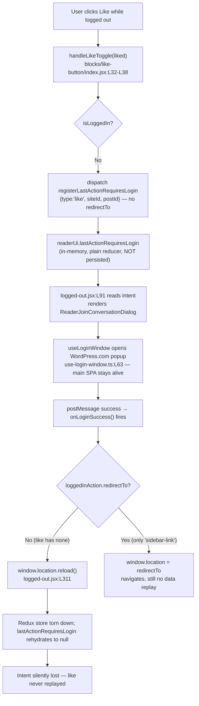

# How a logged-out "like" intent is meant to survive the authentication boundary in the WordPress.com Reader — and why it is lost after login

- **Repository:** `Automattic/wp-calypso`
- **Source branch:** `wp-calypso_be7e5cc64162`
- **Pinned commit:** `be7e5cc641622d153040491fd5625c6cb83e12eb`
- **Task type:** Read-only code investigation (root-cause analysis). **No source file was modified, created, or deleted.** The only artifact produced is this Markdown document. A temporary Jest observation spec was used to capture runtime evidence and then deleted; `git status` was confirmed clean afterward (see the Appendix).
- **Evidence labeling convention used throughout:** every behavioral claim is tagged either **[observed-at-runtime]** (backed by the captured Jest output in §2 / the Appendix) or **[inferred-from-reading]** (backed by an exact `file:line` citation at the pinned commit). Full-page reload / popup OAuth behavior is **[inferred-from-reading]** because a live logged-in WordPress.com OAuth session and its popup cannot be exercised in the sandbox; the pure Redux state model that decides the outcome **is** exercised for real.

---

## 1. TL;DR — Direct answers to the five sub-questions

The click **does** trigger a "requires login" decision, and the intent is captured — but into a **session-only, in-memory** slot that the recovery path throws away. In one line: **the like is captured in the in-memory world, and the recovery path abandons that world with a full-page reload without ever promoting the intent into the persisted world or a handoff token, so on rehydration the intent is `null` and nothing replays it.**

| # | Sub-question | Direct answer |
|---|--------------|---------------|
| **R1** | Where does the "requires login" intent go? | Into **Redux in-memory state** at `readerUi.lastActionRequiresLogin`, dispatched by the **logged-out early-return** of the active like handler `LikeButtonContainer.handleLikeToggle`. The payload is `{ type: 'like' \| 'unlike', siteId, postId }` and **carries no `redirectTo`**. [inferred-from-reading; `client/blocks/like-button/index.jsx:L32-L38`] |
| **R2** | What is *meant* to bring it back once the session is valid? | The **logged-out layout** is the **only** consumer of the intent. It reads the intent and renders a *join-conversation dialog*; the dialog opens a WordPress.com login popup and, on success, invokes an `onLoginSuccess` callback that is *meant* to return the user to an authenticated view. **It never re-dispatches the like.** [inferred-from-reading; `client/layout/logged-out.jsx:L91,L302-L315`] |
| **R3** | Which "world" is the source of truth — (a) in-memory, (b) persisted, or (c) a short-lived handoff token? | **(a) in-memory Redux state → YES (operative).** **(b) persisted → NO.** **(c) handoff token → NO** (for the like). Proven at runtime: after a serialize→deserialize round-trip the intent returns to `null` and is absent from the serialized blob, while the persistence-wrapped sibling `lastPath` survives. [observed-at-runtime, §2] |
| **R4** | What exact condition causes the replay to skip? | The like payload has **no `redirectTo`**, so `onLoginSuccess` takes the **`else` branch → `window.location.reload()`**. The full-page reload tears down the SPA and its Redux store; the **non-persisted** `lastActionRequiresLogin` rehydrates to `null`, and nothing re-dispatches the like. [inferred-from-reading; `client/layout/logged-out.jsx:L307-L313`] |
| **R5** | Is the skip caused by timing, initialization order, or cleanup? | **Cleanup — specifically cleanup-by-teardown** (the reload discards non-persisted in-memory state), compounded by two design gaps (the intent is **never persisted** and is **never replayed**). It is **NOT** a timing/race bug (the outcome is deterministic across ≥2 runs) and **NOT** an initialization-order bug (the reducer registers normally). [observed-at-runtime for determinism, §2; inferred-from-reading for the mechanism] |

**The user's own framing, resolved:** the intent "slips through a crack between those worlds" because it is only ever placed in the **in-memory** world; the recovery path (reload) destroys that world without first copying the intent into the **persisted** world or encoding it as a **handoff token** (only the unrelated `sidebar-link` variant uses such a token).

---

## 2. Methodology & observed output (run-code-first)

### 2.1 What was actually run

Per the run-code-first requirement, the *source-of-truth* question (R3) was settled by **executing the real production `readerUi` reducer together with the real `serialize`/`deserialize` utilities** under the repository's own client Jest runner — not by reading alone.

- **Toolchain used (exact versions):** `node --version` → `v22.23.1` (satisfies the repo's canonical `engines.node` `"^v22.9.0"`; `.nvmrc` pins `22.9.0`); `yarn --version` → `4.0.2` (the `packageManager` pin), enabled via `corepack enable`.
- **Dependencies:** `yarn install` had already populated `node_modules` (git-ignored); no tracked file was changed by installing.
- **Runner:** the `test-client` script is `TZ=UTC jest -c=test/client/jest.config.js` [`package.json:L122`]; `test/client/jest.config.js` sets `rootDir: '../../client'` [`test/client/jest.config.js:L6`], so the temporary spec was placed **under a `client/**/test/` path** (`client/state/reader-ui/test/blitzy_adhoc_test_persistence_observation.js`) so Jest would discover it. It was modeled on the existing `client/state/reader-ui/test/reducer.js` (which already uses the exact like payload `{ type: 'like', siteId: 123, postId: 456 }` [`client/state/reader-ui/test/reducer.js:L8-L12`]) and **added** the serialize/deserialize round-trip that the existing test omits.
- **Exact command:**
  ```
  CI=true yarn test-client state/reader-ui/test/blitzy_adhoc_test_persistence_observation
  ```
- **Stability:** the spec was run **twice**; the two runs were **byte-identical except the volatile `Time:` line** (`0.759 s` vs `0.764 s`) — i.e. the observed values are **deterministic and stable across ≥2 runs**. This directly rebuts any "timing/race" hypothesis (R5).
- **Self-cleaning:** the temporary spec was **deleted** and `git status` / `git status --porcelain` confirmed a **clean working tree** afterward (Appendix §A.3).

### 2.2 What is real vs. documented-from-code

- **[observed-at-runtime]** The `readerUi` reducer, `serialize`, and `deserialize` are the **real production functions** (imported via `calypso/state/utils` and `../reducer`). This is the canonical unit-level entry point for these pure state functions, and it is exactly the code that decides whether the intent survives persistence.
- **[inferred-from-reading]** The full end-to-end sequence *click → dialog → WordPress.com login popup → `postMessage` success → `window.location.reload()`* is documented **from the code paths only**. A live logged-in WordPress.com OAuth session and its popup are impractical to drive in the sandbox, so the E2E is *not* presented as observed; the deterministic in-memory state model that governs the outcome **is** observed.

### 2.3 The decisive observed values

The following are the exact console values printed by the run (complete unedited output in Appendix §A.1). They map one-to-one onto the before/during/after state transition:

| Boundary | `lastActionRequiresLogin` | `lastPath` (control: persistence-wrapped sibling) |
|----------|---------------------------|---------------------------------------------------|
| **BEFORE** (fresh store) | `null` | `null` |
| **DURING** (after register + view stream) | `{ type: 'like', siteId: 123, postId: 456 }` | `/reader/feeds/123` |
| **serialized blob** (`.root()`) | **absent** (`has …Login key? = false`) | present (`"lastPath":"/reader/feeds/123"`) |
| **AFTER** (deserialize = rehydrate-after-reload) | **`null`** — intent lost | `/reader/feeds/123` — survives |

Corroborating sub-reducer facts (also observed): `typeof lastActionRequiresLogin.serialize = undefined`, `serialize(lastActionRequiresLogin, like) = undefined`, `deserialize(lastActionRequiresLogin, like) = null`; whereas `typeof lastPath.serialize = function` and `serialize(lastPath, "/reader/feeds/123") = /reader/feeds/123`.

---

## 3. R1 — The "requires login" decision and the intent's destination

**Direct answer:** A like click while logged out is intercepted by the **active** like handler `LikeButtonContainer.handleLikeToggle`, which — on its logged-out branch — **returns early after dispatching** `registerLastActionRequiresLogin({ type: liked ? 'like' : 'unlike', siteId, postId })`. That action stores the payload in the **in-memory** Redux slice `readerUi.lastActionRequiresLogin`. The payload deliberately **does not include a `redirectTo`**. [inferred-from-reading]

### 3.1 The capture point, line by line

The handler and its wiring [`client/blocks/like-button/index.jsx`]:

- `handleLikeToggle = ( liked ) => { … }` is defined at **L32-L44**. Its first statement is the logged-out guard `if ( ! this.props.isLoggedIn )` at **L33**, whose body is the early return:
  ```js
  return this.props.registerLastActionRequiresLogin( {
      type: liked ? 'like' : 'unlike',
      siteId: this.props.siteId,
      postId: this.props.postId,
  } );
  ```
  at **L34-L38**. Note there is **no `redirectTo`** key — only `type`, `siteId`, `postId`.
- Only on the **logged-in** path (reached because the guard returned) does it call the real like toggler and the parent callback: `const toggler = liked ? this.props.like : this.props.unlike;` … `this.props.onLikeToggle( liked );` at **L41-L43**.
- The presentational button is bound to this handler via `onLikeToggle={ this.handleLikeToggle }` at **L63**.
- `connect` maps the action creator into props: `{ like, unlike, registerLastActionRequiresLogin }` at **L79**; the import is at **L10**; `isUserLoggedIn` is imported at **L6** and mapped at **L76**.

The click actually reaches `handleLikeToggle` because the presentational button calls its `onLikeToggle` prop on click [`client/blocks/like-button/button.jsx`]: `toggleLiked( event ) { … this.props.onLikeToggle( ! this.props.liked ); }` at **L45-L52** (the call at **L50**), wired as the element's `onClick: ! isLink ? this.toggleLiked : null` at **L97**.

### 3.2 The action → action-type → reducer chain

- The action creator `registerLastActionRequiresLogin = ( lastAction ) => ( { type: READER_REGISTER_LAST_ACTION_REQUIRES_LOGIN, lastAction } )` is at [`client/state/reader-ui/actions.js:L26-L29`].
- The action-type constant `READER_REGISTER_LAST_ACTION_REQUIRES_LOGIN` is at [`client/state/reader-ui/action-types.js:L14-L15`] (its sibling `READER_CLEAR_LAST_ACTION_REQUIRES_LOGIN` at **L16**).
- The reducer stores the payload: `case READER_REGISTER_LAST_ACTION_REQUIRES_LOGIN: return action.lastAction;` inside `lastActionRequiresLogin` at [`client/state/reader-ui/reducer.js:L45-L54`] (store at **L47-L48**, clear-to-`null` at **L49-L50**, default pass-through at **L51-L52**). The slice is registered normally via `registerReducer( [ 'readerUi' ], reducer )` at [`client/state/reader-ui/init.js:L4`].

### 3.3 Critical nuance — the Reader *wrapper*'s logged-out branch is bypassed (guard against a misread)

There are **two** files named `like-button`, and a code reader who inspects only the Reader wrapper will misidentify the path:

- The **Reader wrapper** `client/reader/like-button/index.jsx` has its **own** logged-out branch inside `onLikeToggle` at **L34-L50**: a logged-in early return `if ( this.props.isLoggedIn ) return this.recordLikeToggle( liked );` at **L35-L37**; a tag-embed `window.open( createAccountUrl( … ), '_blank' )` at **L40-L45**; and, gated by the `reader/login-window` config flag, `navigate( createAccountUrl( … ) )` at **L46-L49**.
- **But that branch is not reached on a normal logged-out click.** The wrapper renders `<LikeButtonContainer … onLikeToggle={ this.onLikeToggle } />` at **L97-L105** (the wiring at **L102**), so the wrapper's `onLikeToggle` is passed *down as a prop*. The child block (§3.1) **overrides the button's click handler with its own `handleLikeToggle`** at **L63**, and `handleLikeToggle` **returns early when logged out** (§3.1), invoking the wrapper's `onLikeToggle` **only on the logged-in path** (at `client/blocks/like-button/index.jsx:L43`). Therefore, on a logged-out click, control flows child-block → early-return-dispatch, and the wrapper's `window.open`/`navigate` logged-out branch is **never** executed. [inferred-from-reading]

This is why the operative capture point is the **block** (`client/blocks/like-button/index.jsx`), not the **wrapper** (`client/reader/like-button/index.jsx`).

---

## 4. R2 — The replay / restore mechanism (what is *meant* to bring it back)

**Direct answer:** The intent is read back by the selector `getLastActionRequiresLogin`, whose **only** production consumer is the **logged-out layout**. That layout renders a *join-conversation dialog*; the dialog opens a WordPress.com login **popup** (which keeps the main SPA and its Redux store alive) and, on a successful `postMessage`, calls an `onLoginSuccess` callback. The mechanism that is *meant* to recover the session therefore exists — **but it recovers by reloading/redirecting, and it never re-dispatches the captured like.** [inferred-from-reading]

### 4.1 The selector and its single consumer

- Selector: `getLastActionRequiresLogin( state )` returns `state.readerUi?.lastActionRequiresLogin` (or `null`) at [`client/state/reader-ui/selectors.js:L15-L21`].
- Only production consumer: the logged-out layout reads it into `loggedInAction`: `const loggedInAction = useSelector( getLastActionRequiresLogin );` at [`client/layout/logged-out.jsx:L91`] (import at **L44**). (§10 proves this is the *only* consumer via `grep`.)

### 4.2 The join-conversation dialog

The layout renders the dialog at [`client/layout/logged-out.jsx:L302-L315`]:

```jsx
{ ! isLoggedIn && ! isReaderTagEmbed && (
    <ReaderJoinConversationDialog
        onClose={ () => clearLastActionRequiresLogin() }
        isVisible={ !! loggedInAction }
        loggedInAction={ loggedInAction }
        onLoginSuccess={ () => {
            if ( loggedInAction?.redirectTo ) {
                window.location = loggedInAction.redirectTo;
            } else {
                window.location.reload();
            }
        } }
    />
) }
```

Inside the dialog [`client/blocks/reader-join-conversation/dialog.jsx`], the intent is used **only for analytics and visibility — it is never re-dispatched**:

- Props `{ onClose, isVisible, loggedInAction, onLoginSuccess }` at **L12**.
- `trackEvent` reads the intent purely to build analytics props: `type: loggedInAction?.type` (**L22**), `blog_id: loggedInAction?.siteId` (**L23**), `post_id: loggedInAction?.postId` (**L24**), `tag: loggedInAction?.tag` (**L25**), within the block at **L18-L29**.
- `handleLoginSuccess = () => { setIsLoginPopupOpen( false ); trackEvent( 'calypso_reader_dialog_login_success' ); onLoginSuccess(); }` at **L31-L35** — it fires an analytics event and then calls the **parent-supplied** `onLoginSuccess()` (the reload/redirect closure above). There is **no** call to `like`, `unlike`, or `registerLastActionRequiresLogin` anywhere in the dialog.
- The hook is wired at **L44-L47**: `useLoginWindow( { onLoginSuccess: handleLoginSuccess, onWindowClose: … } )`.

### 4.3 The WordPress.com login popup

Authentication runs in a popup coordinated by `postMessage` [`client/data/reader/use-login-window.ts`]:

- Login URL `https://wordpress.com/log-in` (with a `redirect_to`) at **L40**; account-creation URL `https://wordpress.com/start/account` at **L46** (built **L41-L47**).
- Strict origin guard: `if ( 'https://wordpress.com' !== event?.origin ) { return; }` at **L53**.
- Success path: `if ( event?.data?.service === 'wordpress' ) { onLoginSuccess(); }` at **L57-L58**.
- The popup itself: `window.open( url, windowName, windowFeatures )` at **L63**, with `window.addEventListener( 'message', waitForLogin )` at **L66**.

Because authentication happens in a **popup**, the main Calypso SPA and its Redux store remain alive during login — so the in-memory `lastActionRequiresLogin` **could**, in principle, be replayed after success. The code does not do so; instead `onLoginSuccess` reloads or redirects (§5, §6). [inferred-from-reading]


---

## 5. R3 — The source of truth: resolving each of the three "worlds" individually

**Direct answer:** The source of truth is **(a) in-memory Redux state**, exclusively. **(b) persisted storage — ruled out.** **(c) short-lived handoff token — ruled out for the like.** Each candidate is resolved below with the runtime evidence from §2 (complete output in Appendix §A.1).

### 5.1 (a) In-memory state → **YES, operative**

The intent lives only in `readerUi.lastActionRequiresLogin`, a **plain** reducer whose default state is `null` [`client/state/reader-ui/reducer.js:L45-L54`]. **[observed-at-runtime]** it is `null` before the click and becomes `{ type: 'like', siteId: 123, postId: 456 }` after the register action:

```
BEFORE  lastActionRequiresLogin = null
AFTER REGISTER lastActionRequiresLogin = { type: 'like', siteId: 123, postId: 456 }
```

### 5.2 (b) Something persisted → **RULED OUT**

Calypso persistence is **opt-in**: a reducer is persisted only if it carries a `.serialize`/`.deserialize` method (normally attached by `withPersistence`). The primitives make this explicit:

- `serialize()` returns `undefined` for any reducer lacking a `.serialize` method [`client/state/utils/serialize.ts:L10-L16`].
- In the combined reducer, `serializeState` **omits** any sub-key whose `serialize()` returned `undefined` — guarded by `if ( serialized !== undefined )` at [`client/state/utils/reducer-utils.ts:L225`], and stated in the comment at **L203-L212** ("if a particular subreducer serializes to `undefined`, then that property won't be included in the result object at all"). `combineReducers` attaches `.serialize = serializeState` / `.deserialize = deserializeState` at **L155-L156**.
- `deserialize()` returns the reducer's **initial state** when there is no `.deserialize` method [`client/state/utils/serialize.ts:L18-L27`], where "initial state" is `reducer( undefined, { type: '@@calypso/INIT' } )` [`packages/state-utils/src/get-initial-state/index.ts:L3-L4`] — i.e. `null` for `lastActionRequiresLogin`.
- `lastActionRequiresLogin` is a **plain** reducer (it is **not** wrapped) [`client/state/reader-ui/reducer.js:L45-L54`], whereas its sibling `lastPath` **opts in** via `withPersistence` [`client/state/reader-ui/reducer.js:L19`], which attaches `.serialize` (**L21**) and `.deserialize` (**L22**) [`client/state/utils/with-persistence.ts:L16-L23`]. The persistence utilities are re-exported from the barrel [`client/state/utils/index.ts:L4-L6`].

**[observed-at-runtime]** the serialized blob has **no** `lastActionRequiresLogin` key, and after deserialize the value is `null`, while `lastPath` survives:

```
SERIALIZED .root() persisted object = {"sidebar":{"isListsOpen":false,"isTagsOpen":false,"isFollowingOpen":false,"openOrganizations":[]},"lastPath":"/reader/feeds/123"}
SERIALIZED root has lastActionRequiresLogin key? = false
SERIALIZED root has lastPath key?                = true
AFTER DESERIALIZE lastActionRequiresLogin = null
AFTER DESERIALIZE lastPath                = /reader/feeds/123
```

And at the sub-reducer level: **[observed-at-runtime]** `typeof lastActionRequiresLogin.serialize = undefined`, `serialize(lastActionRequiresLogin, like) = undefined`, `deserialize(lastActionRequiresLogin, like) = null`; contrasted with `typeof lastPath.serialize = function` and `serialize(lastPath, "/reader/feeds/123") = /reader/feeds/123`. This is the exact persistence gap the existing `client/state/reader-ui/test/reducer.js` never exercises (it tests register→store and clear→null only, at **L15-L32**).

> Note on realism: the client persistence layer targets browser storage (IndexedDB/localStorage) via this same `serialize`/`deserialize` machinery; the unit-level round-trip reproduces exactly the transform that a real store-persist-then-reload performs on this slice. [inferred-from-reading]

### 5.3 (c) A short-lived handoff token → **RULED OUT for the like**

A "handoff token that lives just long enough to be replayed" would be something like an OAuth `state` value or a `redirect_to`/query-parameter carrying the action across the boundary. The **like/unlike** payload carries no such token — it is `{ type, siteId, postId }` with **no `redirectTo`** [`client/blocks/like-button/index.jsx:L34-L38`]. The **only** requires-login variant that embeds a URL handoff is `sidebar-link` (`{ type: 'sidebar-link', redirectTo: streamLink }`) [`client/reader/stream/reader-list-followed-sites/item.jsx:L45-L48`], and even that carries a *location*, not the *action* — see the full enumeration in §8.

### 5.4 Tying back to the user's phrasing

The intent "slips through a crack between those worlds" because it is only ever placed in the **in-memory** world (§5.1); the recovery path destroys that world with a reload (§6) **without first** copying the intent into the **persisted** world (§5.2) or encoding it as a **handoff token** (§5.3).

---

## 6. R4 — The exact condition that causes the replay to skip

**Direct answer:** The skip is a **branch selection driven by the payload shape**. `onLoginSuccess` navigates only when the intent carries a `redirectTo`; otherwise it reloads. The like payload never sets `redirectTo`, so the **`else` → `window.location.reload()`** branch is always taken, the store is torn down, and the non-persisted intent rehydrates to `null`. [inferred-from-reading]

The exact code [`client/layout/logged-out.jsx:L307-L313`]:

```js
onLoginSuccess={ () => {
    if ( loggedInAction?.redirectTo ) {
        window.location = loggedInAction.redirectTo;   // L308-L309
    } else {
        window.location.reload();                       // L311
    }
} }
```

Cause → effect:

1. The like payload is `{ type: 'like', siteId, postId }` with **no `redirectTo`** [`client/blocks/like-button/index.jsx:L34-L38`], so `loggedInAction?.redirectTo` is falsy and the **`else` branch** (`window.location.reload()`, **L311**) runs.
2. A full-page reload **tears down the SPA and its Redux store**. On rehydration, the non-persisted `lastActionRequiresLogin` returns to its initial `null` — the same transition observed directly in §2 (`AFTER DESERIALIZE lastActionRequiresLogin = null`). [observed-at-runtime for the state transition; inferred-from-reading for the reload trigger]
3. Nothing re-dispatches the like: the dialog only tracked analytics and called the reload closure (§4.2), and **no** middleware/saga/data-layer consumes the action types (§10). The like is therefore **silently dropped** — the observable "disappears after login" symptom.

By contrast, when `loggedInAction.redirectTo` **is** present (only `sidebar-link`), the `if` branch runs `window.location = loggedInAction.redirectTo` (**L308-L309**) and the browser navigates to that URL — still a full document load, and still **no data replay** of any like.

---

## 7. R5 — Classifying the skip cause: resolving each of the three candidates

**Direct answer:** The cause is **cleanup — specifically cleanup-by-teardown**: `window.location.reload()` discards the non-persisted in-memory intent. It is compounded by two design gaps (the intent is **never persisted** and is **never replayed**). It is **not** timing/race and **not** initialization-order. Each candidate:

### 7.1 timing / race → **RULED OUT** [observed-at-runtime]

The outcome is **deterministic**. The observation was run **twice** and the two runs were **byte-identical except the `Time:` line** (`0.759 s` vs `0.764 s`); the same input reliably yields `null → { like } → null`. A race would surface as run-to-run variation, of which there was none (Appendix §A.2). The loss is a fixed consequence of the reload, not a scheduling coincidence.

### 7.2 initialization order → **RULED OUT** [inferred-from-reading]

The slice registers in the ordinary way: `registerReducer( [ 'readerUi' ], reducer )` [`client/state/reader-ui/init.js:L4`]. There is no ordering dependency, lazy-registration timing, or reducer-registration sequence that governs the loss; the intent is stored and read correctly *within* a session (§2 shows register→store works). The failure occurs only across the reload boundary, which is unrelated to reducer registration order.

### 7.3 cleanup → **YES, the primary cause (cleanup-by-teardown)** [observed-at-runtime + inferred-from-reading]

`window.location.reload()` [`client/layout/logged-out.jsx:L311`] destroys the entire in-memory store; because `lastActionRequiresLogin` is not persisted (§5.2), it rehydrates to `null` (§2). Two design gaps compound this:

- **Never persisted** — the reducer opts out of persistence (§5.2), so the reload wipes it.
- **Never replayed** — no consumer re-issues the like after login (§4.2, §10).

There is also a **second, deliberate** cleanup path: the dialog's `onClose` dispatches `clearLastActionRequiresLogin()` [`client/layout/logged-out.jsx:L304`], so **cancelling the dialog** likewise discards the intent (by design). Both discard routes are "cleanup," confirming R5's classification.


---

## 8. Exhaustive enumeration of sibling "requires-login" intents

The like is one of eight sibling interactions that use the **same** `registerLastActionRequiresLogin` mechanism. Enumerating them shows the like is not special: **only `sidebar-link` carries a `redirectTo`**, so only `sidebar-link` takes the navigate branch on login success — every other intent (including `like`) hits the `else → window.location.reload()` branch and is lost in exactly the same way. All anchors verified at commit `be7e5cc641622d153040491fd5625c6cb83e12eb`. [inferred-from-reading]

| Intent `type` | Payload shape | Carries `redirectTo`? | On login success | Location |
|---|---|---|---|---|
| `like` / `unlike` | `{ type, siteId, postId }` | **No** | `reload()` → **lost** | `client/blocks/like-button/index.jsx:L34-L38` |
| `comment-like` / `comment-unlike` | `{ type, siteId, postId, commentId }` | **No** | `reload()` → **lost** | `client/blocks/comments/comment-likes.jsx:L23-L28` |
| `reply` | `{ type, siteId, postId, commentId }` | **No** | `reload()` → **lost** | `client/blocks/comments/post-comment.jsx:L131-L136` |
| `comment` | `{ type, siteId, postId, commentId }` | **No** | `reload()` → **lost** | `client/blocks/comments/form.jsx:L64-L69` |
| `comment-submit` | `{ type, siteId, postId, commentId, commentText }` | **No** | `reload()` → **lost** | `client/blocks/comments/form.jsx:L88-L94` |
| `follow-site` | `{ type, siteId }` | **No** | `reload()` → **lost** | `client/blocks/follow-button/index.jsx:L24-L27` |
| `follow-tag` | `{ type, tag }` | **No** | `reload()` → **lost** | `client/reader/tag-stream/main.jsx:L80-L83` |
| `sidebar-link` | `{ type, redirectTo }` | **Yes** (sole variant) | `window.location = redirectTo` → navigates (still no data replay) | `client/reader/stream/reader-list-followed-sites/item.jsx:L45-L48`; `client/blocks/reader-subscription-list-item/index.jsx:L93-L95,L109-L111` |

**Cause → effect, by name:**

- `like` / `unlike` — the subject of this investigation; no `redirectTo`, so `reload()` discards the non-persisted intent.
- `comment-like` / `comment-unlike` — same shape plus `commentId`; no `redirectTo` → `reload()` → lost.
- `reply` — dispatched by `handleReply` when logged out; no `redirectTo` → `reload()` → lost.
- `comment` — dispatched by `handleTextChange` (first keystroke in the comment box); no `redirectTo` → `reload()` → lost.
- `comment-submit` — dispatched by `handleSubmit`; uniquely also carries `commentText`, but still **no `redirectTo`** → `reload()` → lost (even the typed comment text is not replayed).
- `follow-site` — `{ type, siteId }`; no `redirectTo` → `reload()` → lost.
- `follow-tag` — `{ type, tag }` (note: `tag`, not `siteId`/`postId`); no `redirectTo` → `reload()` → lost.
- `sidebar-link` — the **only** variant that sets `redirectTo` (to `streamLink`); on success `onLoginSuccess` runs `window.location = loggedInAction.redirectTo`, navigating to the target stream. This changes the destination URL only; it does **not** replay a like/comment/follow action's data.

---

## 9. Secondary, edge, and transitional branches (beyond the happy path)

### 9.1 Reader-tag-embed popup branch (a different logged-out route)

On a Reader **tag-embed** page, the layout does **not** show the dialog; instead it opens the account-creation URL in a **new tab** [`client/layout/logged-out.jsx:L169-L172`]:

```js
if ( ! isLoggedIn && loggedInAction && isReaderTagEmbed ) {
    const { pathname } = getUrlParts( window.location.href );
    window.open( createAccountUrl( { redirectTo: pathname, ref: 'reader-lp' } ), '_blank' );
}
```

Here `isReaderTagEmbed` is computed at **L107** via `isReaderTagEmbedPage( window.location )`, which is true when the pathname includes `/tag/` **and** the `type` query param equals `embed` [`client/lib/reader/is-reader-tag-embed-page.js:L4`]. Crucially, `createAccountUrl( { redirectTo, ref } )` encodes a **location**, not the action: it returns `` `/start/account?redirect_to=${ redirectTo }&ref=${ ref }` `` [`client/lib/paths/index.js:L24-L25`]. So even this edge route carries where to *return*, never *what to replay*. The dialog itself is additionally suppressed on tag-embed pages by the render guard `! isReaderTagEmbed` at **L302**. [inferred-from-reading]

### 9.2 `sidebar-link` navigate-on-success variant (the one non-reload branch)

Because `sidebar-link` carries `redirectTo` (§8), `onLoginSuccess` takes the `if` branch `window.location = loggedInAction.redirectTo` [`client/layout/logged-out.jsx:L308-L309`]. This navigates the browser to the intended stream URL after login. It is still a full document navigation and still performs **no data replay**; it only preserves the *destination*, not a pending mutation. [inferred-from-reading]

### 9.3 Dialog-cancel cleanup (a deliberate second discard path)

Closing the dialog runs `onClose={ () => clearLastActionRequiresLogin() }` [`client/layout/logged-out.jsx:L304`], which dispatches `clearLastActionRequiresLogin()` [`client/state/reader-ui/actions.js:L35-L37`]; the reducer's `case READER_CLEAR_LAST_ACTION_REQUIRES_LOGIN: return null;` [`client/state/reader-ui/reducer.js:L49-L50`] resets the slot. So cancelling is a second, intentional way the intent is cleared — reinforcing the R5 "cleanup" classification. [inferred-from-reading]

---

## 10. Decisive negatives (verified by code search)

Two `grep` searches bound the scope and rule out any hidden replay path. Commands and **actual output** below.

### 10.1 The selector has exactly one production consumer

```
$ grep -rn "getLastActionRequiresLogin" client/
client/state/reader-ui/test/selectors.js:1:import { getLastActionRequiresLogin } from '../selectors';
client/state/reader-ui/test/selectors.js:9:	describe( 'getLastActionRequiresLogin()', () => {
client/state/reader-ui/test/selectors.js:11:			const lastActionRequiresLogin = getLastActionRequiresLogin( {
client/state/reader-ui/test/selectors.js:19:			const lastActionRequiresLogin = getLastActionRequiresLogin( { readerUi: {} } );
client/state/reader-ui/test/selectors.js:25:			const lastActionRequiresLogin = getLastActionRequiresLogin(
client/state/reader-ui/selectors.js:15:export function getLastActionRequiresLogin( state ) {
client/layout/logged-out.jsx:44:import { getLastActionRequiresLogin } from 'calypso/state/reader-ui/selectors';
client/layout/logged-out.jsx:91:	const loggedInAction = useSelector( getLastActionRequiresLogin );
```

Interpretation: apart from the **definition** (`selectors.js:15`) and its **unit test** (`test/selectors.js`), the selector is consumed by exactly **one** production file — `client/layout/logged-out.jsx` (import at L44, use at L91). There is **no alternate replay path** elsewhere in the codebase.

### 10.2 No middleware/saga/data-layer consumes the action types

```
$ grep -rn "READER_REGISTER_LAST_ACTION_REQUIRES_LOGIN\|READER_CLEAR_LAST_ACTION_REQUIRES_LOGIN" client/
client/state/reader-ui/reducer.js:4:	READER_CLEAR_LAST_ACTION_REQUIRES_LOGIN,
client/state/reader-ui/reducer.js:5:	READER_REGISTER_LAST_ACTION_REQUIRES_LOGIN,
client/state/reader-ui/reducer.js:47:		case READER_REGISTER_LAST_ACTION_REQUIRES_LOGIN:
client/state/reader-ui/reducer.js:49:		case READER_CLEAR_LAST_ACTION_REQUIRES_LOGIN:
client/state/reader-ui/actions.js:3:	READER_REGISTER_LAST_ACTION_REQUIRES_LOGIN,
client/state/reader-ui/actions.js:4:	READER_CLEAR_LAST_ACTION_REQUIRES_LOGIN,
client/state/reader-ui/actions.js:27:	type: READER_REGISTER_LAST_ACTION_REQUIRES_LOGIN,
client/state/reader-ui/actions.js:36:	type: READER_CLEAR_LAST_ACTION_REQUIRES_LOGIN,
client/state/reader-ui/action-types.js:14:export const READER_REGISTER_LAST_ACTION_REQUIRES_LOGIN =
client/state/reader-ui/action-types.js:15:	'READER_REGISTER_LAST_ACTION_REQUIRES_LOGIN';
client/state/reader-ui/action-types.js:16:export const READER_CLEAR_LAST_ACTION_REQUIRES_LOGIN = 'READER_CLEAR_LAST_ACTION_REQUIRES_LOGIN';
client/state/reader-ui/test/reducer.js:2:	READER_REGISTER_LAST_ACTION_REQUIRES_LOGIN,
client/state/reader-ui/test/reducer.js:3:	READER_CLEAR_LAST_ACTION_REQUIRES_LOGIN,
client/state/reader-ui/test/reducer.js:17:				type: READER_REGISTER_LAST_ACTION_REQUIRES_LOGIN,
client/state/reader-ui/test/reducer.js:28:				type: READER_CLEAR_LAST_ACTION_REQUIRES_LOGIN,
client/state/reader-ui/test/actions.js:2:	READER_REGISTER_LAST_ACTION_REQUIRES_LOGIN,
client/state/reader-ui/test/actions.js:3:	READER_CLEAR_LAST_ACTION_REQUIRES_LOGIN,
client/state/reader-ui/test/actions.js:17:				type: READER_REGISTER_LAST_ACTION_REQUIRES_LOGIN,
client/state/reader-ui/test/actions.js:26:				type: READER_CLEAR_LAST_ACTION_REQUIRES_LOGIN,
```

Interpretation: the two action types appear **only** in the **action-type definitions** (`action-types.js`), the **action creators** (`actions.js`), the **reducer** switch (`reducer.js`), and the **existing unit tests** (`test/reducer.js`, `test/actions.js`). There is **no middleware, saga, or data-layer handler** that observes `READER_REGISTER_LAST_ACTION_REQUIRES_LOGIN` to re-issue the like after login. This proves there is **no hidden re-dispatch/replay mechanism**: the action types exist solely to *store* and *clear* the value.


---

## 11. End-to-end trace and control-flow diagram

Reconciling the three regions — **capture** (`client/blocks/like-button/index.jsx`), **store** (`client/state/reader-ui/*`), and **replay surface** (`client/layout/logged-out.jsx`, `client/blocks/reader-join-conversation/dialog.jsx`, `client/data/reader/use-login-window.ts`) — into one account, the **point of loss** is the `else → window.location.reload()` branch, which tears down the store holding a value that was never persisted and is never replayed.

1. **Capture.** Logged-out like click → `handleLikeToggle` early-return dispatches `registerLastActionRequiresLogin({ type:'like', siteId, postId })` (no `redirectTo`) [`client/blocks/like-button/index.jsx:L32-L38`].
2. **Store.** The reducer writes the payload to `readerUi.lastActionRequiresLogin`, an in-memory, **non-persisted** slot [`client/state/reader-ui/reducer.js:L45-L54`]. **[observed-at-runtime]** value becomes `{ type:'like', siteId:123, postId:456 }`.
3. **Read.** `logged-out.jsx` reads it via `useSelector( getLastActionRequiresLogin )` [`client/layout/logged-out.jsx:L91`] and renders `ReaderJoinConversationDialog` (`isVisible={ !! loggedInAction }`) [`L302-L315`].
4. **Authenticate.** The dialog opens the WordPress.com login popup [`client/data/reader/use-login-window.ts:L63`], keeping the SPA + store alive; on `postMessage` success it calls `onLoginSuccess()` [`L57-L58`].
5. **Skip.** `onLoginSuccess` finds no `redirectTo` and runs `window.location.reload()` [`client/layout/logged-out.jsx:L311`].
6. **Loss.** The reload tears down the store; the non-persisted `lastActionRequiresLogin` rehydrates to `null`. **[observed-at-runtime]** `AFTER DESERIALIZE lastActionRequiresLogin = null`. No re-dispatch exists (§10) → the like is silently dropped.



---

## 12. Framing from canonical SPA patterns (frames — does not substitute for — the code evidence)

The standard ways a single-page app preserves a pending action across an authentication boundary, and how Calypso compares:

- **OAuth 2.0 `state` parameter** — a browser app encodes "what to do / where to return" into the authorization request and reads it back after redirect. Calypso's like path has **no such token** — the like payload lacks any `redirectTo`/state value [`client/blocks/like-button/index.jsx:L34-L38`].
- **Stored return-URL / return-action pattern** — persist the intended destination or action, then replay it after auth completes. Calypso persists neither for the like: `lastActionRequiresLogin` is not persisted (§5.2) and no code replays it (§10).
- **Popup preserves application state** — when auth happens in a popup, the main SPA (and its store) keeps running, so an in-memory intent *could* be replayed. Calypso **does** use the popup approach [`client/data/reader/use-login-window.ts:L63`], which keeps the store alive during login — yet the success handler then forces `window.location.reload()` [`client/layout/logged-out.jsx:L311`], discarding exactly the in-memory intent the popup preserved.
- **SPA state must be serializable to survive a reload** — in-memory/location state that is not serialized is `null` after a full reload. This is precisely what the runtime observation demonstrates for `lastActionRequiresLogin` (§2).

**Relevance:** Calypso adopts the popup pattern (which *preserves* the store) but then negates its benefit for the like by reloading, and it implements **neither** an OAuth-`state`/return-action handoff **nor** persistence for the pending like. The canonical remedy — persist the pending action, or replay it after auth instead of reloading — is exactly what is absent. (Remedy is **out of scope**; see §13.2.)

---

## 13. Appendix

### A.1 Complete, unedited runtime output (Run 1)

Command:

```
CI=true yarn test-client state/reader-ui/test/blitzy_adhoc_test_persistence_observation
```

Output (verbatim; the leading Browserslist notice is an unrelated environmental warning about the age of `caniuse-lite`, not part of the finding):

```
Browserslist: browsers data (caniuse-lite) is 17 months old. Please run:
  npx update-browserslist-db@latest
  Why you should do it regularly: https://github.com/browserslist/update-db#readme
PASS client/state/reader-ui/test/blitzy_adhoc_test_persistence_observation.js
  ● Console

    console.log
      BEFORE  lastActionRequiresLogin = null

      at Object.log (state/reader-ui/test/blitzy_adhoc_test_persistence_observation.js:20:11)

    console.log
      BEFORE  lastPath                = null

      at Object.log (state/reader-ui/test/blitzy_adhoc_test_persistence_observation.js:21:11)

    console.log
      AFTER REGISTER lastActionRequiresLogin = { type: 'like', siteId: 123, postId: 456 }

      at Object.log (state/reader-ui/test/blitzy_adhoc_test_persistence_observation.js:33:11)

    console.log
      AFTER REGISTER lastPath                = /reader/feeds/123

      at Object.log (state/reader-ui/test/blitzy_adhoc_test_persistence_observation.js:34:11)

    console.log
      SERIALIZED (raw ctor) = SerializationResult

      at Object.log (state/reader-ui/test/blitzy_adhoc_test_persistence_observation.js:38:11)

    console.log
      SERIALIZED .get()     = {"root":{"sidebar":{"isListsOpen":false,"isTagsOpen":false,"isFollowingOpen":false,"openOrganizations":[]},"lastPath":"/reader/feeds/123"}}

      at Object.log (state/reader-ui/test/blitzy_adhoc_test_persistence_observation.js:39:11)

    console.log
      SERIALIZED .root() persisted object = {"sidebar":{"isListsOpen":false,"isTagsOpen":false,"isFollowingOpen":false,"openOrganizations":[]},"lastPath":"/reader/feeds/123"}

      at Object.log (state/reader-ui/test/blitzy_adhoc_test_persistence_observation.js:42:11)

    console.log
      SERIALIZED root has lastActionRequiresLogin key? = false

      at Object.log (state/reader-ui/test/blitzy_adhoc_test_persistence_observation.js:43:11)

    console.log
      SERIALIZED root has lastPath key?                = true

      at Object.log (state/reader-ui/test/blitzy_adhoc_test_persistence_observation.js:47:11)

    console.log
      AFTER DESERIALIZE lastActionRequiresLogin = null

      at Object.log (state/reader-ui/test/blitzy_adhoc_test_persistence_observation.js:53:11)

    console.log
      AFTER DESERIALIZE lastPath                = /reader/feeds/123

      at Object.log (state/reader-ui/test/blitzy_adhoc_test_persistence_observation.js:54:11)

    console.log
      typeof lastActionRequiresLogin.serialize   = undefined

      at Object.log (state/reader-ui/test/blitzy_adhoc_test_persistence_observation.js:63:11)

    console.log
      typeof lastActionRequiresLogin.deserialize = undefined

      at Object.log (state/reader-ui/test/blitzy_adhoc_test_persistence_observation.js:64:11)

    console.log
      typeof lastPath.serialize                  = function

      at Object.log (state/reader-ui/test/blitzy_adhoc_test_persistence_observation.js:65:11)

    console.log
      typeof lastPath.deserialize                = function

      at Object.log (state/reader-ui/test/blitzy_adhoc_test_persistence_observation.js:66:11)

    console.log
      serialize(lastActionRequiresLogin, like)   = undefined

      at Object.log (state/reader-ui/test/blitzy_adhoc_test_persistence_observation.js:67:11)

    console.log
      deserialize(lastActionRequiresLogin, like) = null

      at Object.log (state/reader-ui/test/blitzy_adhoc_test_persistence_observation.js:68:11)

    console.log
      serialize(lastPath, "/reader/feeds/123")   = /reader/feeds/123

      at Object.log (state/reader-ui/test/blitzy_adhoc_test_persistence_observation.js:69:11)

    console.log
      deserialize(lastPath, "/reader/feeds/123") = /reader/feeds/123

      at Object.log (state/reader-ui/test/blitzy_adhoc_test_persistence_observation.js:70:11)


Test Suites: 1 passed, 1 total
Tests:       2 passed, 2 total
Snapshots:   0 total
Time:        0.759 s, estimated 1 s
Ran all test suites matching /state\/reader-ui\/test\/blitzy_adhoc_test_persistence_observation/i.
```

### A.2 Stability across two runs

The identical command was run a second time. The two runs' outputs were **byte-identical except the `Time:` line**:

```
Run 1:  Time:        0.759 s, estimated 1 s
Run 2:  Time:        0.764 s, estimated 1 s
```

Both runs reported `Test Suites: 1 passed, 1 total` and `Tests: 2 passed, 2 total`, with identical `console.log` values. The result is therefore **deterministic and stable across ≥2 runs** — the basis for ruling out timing/race in §7.1.

### A.3 Working tree cleanliness (temporary spec removed)

The temporary observation spec was deleted and the working tree confirmed clean:

```
$ rm client/state/reader-ui/test/blitzy_adhoc_test_persistence_observation.js
$ git status
On branch blitzy-86b269e0-17ba-4075-9310-6c345cfb19c5
nothing to commit, working tree clean
$ git status --porcelain
(empty)
```

(The temporary spec lived under `client/state/reader-ui/test/` only so that Jest's `rootDir: client/` would discover it; it was never committed.)

### A.4 The temporary observation spec (for reproducibility)

For transparency, the exact spec that produced the output above is reproduced here. It was **not** committed — it was created, run twice, and deleted. To reproduce, recreate it at `client/state/reader-ui/test/blitzy_adhoc_test_persistence_observation.js`, run the command in §A.1, then delete it.

```js
/**
 * TEMPORARY observation spec — DELETE after capturing output.
 * Placed under client/state/reader-ui/test/ so Jest (rootDir=client/) discovers it.
 * Exercises the REAL production readerUi reducer + REAL serialize/deserialize utils
 * to prove where the pending logged-out "like" intent lives (source of truth).
 */
import { serialize, deserialize } from 'calypso/state/utils';
import readerUiReducer, { lastActionRequiresLogin, lastPath } from '../reducer';
import {
	READER_REGISTER_LAST_ACTION_REQUIRES_LOGIN,
	READER_VIEW_STREAM,
} from '../action-types';

describe( 'reader-ui pending-login-intent persistence observation', () => {
	const likeAction = { type: 'like', siteId: 123, postId: 456 };

	test( 'combined reducer: lastActionRequiresLogin is NOT persisted across serialize/deserialize; lastPath IS', () => {
		// BEFORE: initial combined state (as on a fresh in-memory store)
		let state = readerUiReducer( undefined, { type: '@@OBSERVE_INIT' } );
		console.log( 'BEFORE  lastActionRequiresLogin =', state.lastActionRequiresLogin );
		console.log( 'BEFORE  lastPath                =', state.lastPath );

		// DURING: register the like intent (exactly as the logged-out click handler does) + set a lastPath
		state = readerUiReducer( state, {
			type: READER_REGISTER_LAST_ACTION_REQUIRES_LOGIN,
			lastAction: likeAction,
		} );
		state = readerUiReducer( state, {
			type: READER_VIEW_STREAM,
			path: '/reader/feeds/123',
			streamKey: 'feed:123',
		} );
		console.log( 'AFTER REGISTER lastActionRequiresLogin =', state.lastActionRequiresLogin );
		console.log( 'AFTER REGISTER lastPath                =', state.lastPath );

		// Persist-to-storage (serialize) then rehydrate-after-reload (deserialize)
		const serialized = serialize( readerUiReducer, state );
		console.log( 'SERIALIZED (raw ctor) =', serialized && serialized.constructor && serialized.constructor.name );
		console.log( 'SERIALIZED .get()     =', JSON.stringify( serialized && serialized.get ? serialized.get() : serialized ) );
		const persistedData =
			serialized && typeof serialized.root === 'function' ? serialized.root() : serialized;
		console.log( 'SERIALIZED .root() persisted object =', JSON.stringify( persistedData ) );
		console.log(
			'SERIALIZED root has lastActionRequiresLogin key? =',
			persistedData ? Object.prototype.hasOwnProperty.call( persistedData, 'lastActionRequiresLogin' ) : false
		);
		console.log(
			'SERIALIZED root has lastPath key?                =',
			persistedData ? Object.prototype.hasOwnProperty.call( persistedData, 'lastPath' ) : false
		);

		const rehydrated = deserialize( readerUiReducer, persistedData );
		console.log( 'AFTER DESERIALIZE lastActionRequiresLogin =', rehydrated.lastActionRequiresLogin );
		console.log( 'AFTER DESERIALIZE lastPath                =', rehydrated.lastPath );

		// Assertions capturing the finding
		expect( state.lastActionRequiresLogin ).toEqual( likeAction ); // populated after click
		expect( rehydrated.lastActionRequiresLogin ).toBeNull(); // LOST on rehydrate (not persisted)
		expect( rehydrated.lastPath ).toEqual( '/reader/feeds/123' ); // survives (withPersistence)
	} );

	test( 'sub-reducer: plain lastActionRequiresLogin has no .serialize (→undefined; deserialize→null); lastPath (withPersistence) does', () => {
		console.log( 'typeof lastActionRequiresLogin.serialize   =', typeof lastActionRequiresLogin.serialize );
		console.log( 'typeof lastActionRequiresLogin.deserialize =', typeof lastActionRequiresLogin.deserialize );
		console.log( 'typeof lastPath.serialize                  =', typeof lastPath.serialize );
		console.log( 'typeof lastPath.deserialize                =', typeof lastPath.deserialize );
		console.log( 'serialize(lastActionRequiresLogin, like)   =', serialize( lastActionRequiresLogin, likeAction ) );
		console.log( 'deserialize(lastActionRequiresLogin, like) =', deserialize( lastActionRequiresLogin, likeAction ) );
		console.log( 'serialize(lastPath, "/reader/feeds/123")   =', serialize( lastPath, '/reader/feeds/123' ) );
		console.log( 'deserialize(lastPath, "/reader/feeds/123") =', deserialize( lastPath, '/reader/feeds/123' ) );

		expect( lastActionRequiresLogin.serialize ).toBeUndefined();
		expect( serialize( lastActionRequiresLogin, likeAction ) ).toBeUndefined();
		expect( deserialize( lastActionRequiresLogin, likeAction ) ).toBeNull();
		expect( typeof lastPath.serialize ).toBe( 'function' );
		expect( serialize( lastPath, '/reader/feeds/123' ) ).toEqual( '/reader/feeds/123' );
	} );
} );
```

### A.5 Scope statement

This is a **read-only investigation**: its purpose is to **explain**, not to repair. No `wp-calypso` source file was modified, created, or deleted; the sole persistent artifact is this document. Remediation — e.g. persisting `lastActionRequiresLogin` via `withPersistence`, replaying the like after `onLoginSuccess`, attaching a `redirectTo`/handoff to the like payload, or replacing `window.location.reload()` with a re-dispatch — is explicitly **out of scope**.

### A.6 Note on citation accuracy

All `file:line` citations were re-verified with `sed -n`/`grep -n` against commit `be7e5cc641622d153040491fd5625c6cb83e12eb`. Where earlier planning notes carried slightly different end-lines, the ranges in this document reflect the **verified** values (e.g. the `lastActionRequiresLogin` reducer spans `client/state/reader-ui/reducer.js:L45-L54`; the Reader wrapper's `onLikeToggle` spans `client/reader/like-button/index.jsx:L34-L50`; the tag-embed popup branch spans `client/layout/logged-out.jsx:L169-L172`).

