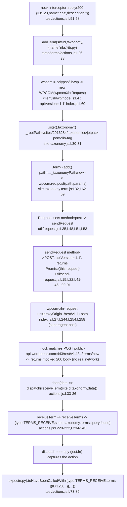

# wp-calypso — Test Environment vs. Development Runtime

**Source branch:** `wp-calypso_be7e5cc64162`
**Source baseline commit:** `be7e5cc641622d153040491fd5625c6cb83e12eb` (the wp-calypso source tree that was read and run; the read-only invariant and every `file:line` reference are measured against it)
**Delivery branch HEAD:** `a6f70ec008c963e5083e7733cb5af6a6e7dd67cd` on branch `blitzy-a558ddfc-3dde-4c87-becd-12bcb5baf875` (the commit under remediation; see **Q8** for how the two HEADs relate)
**Node (observed):** `v22.23.1` (satisfies `engines.node` `^v22.9.0` — [package.json:L57])
**Yarn (observed):** `4.0.2` (`packageManager: yarn@4.0.2` — [package.json:L422])
**Repository:** Automattic/wp-calypso (Yarn Berry monorepo; `nodeLinker: node-modules`)

**Read-only invariant:** This investigation modifies **no** existing repository file. The **only** artifact added to the tracked source tree is this document, `blitzy/documentation/wp-calypso_be7e5cc64162.md`. Every temporary observation script/test created to capture output was deleted before completion (proven in **Q8**). Installed `node_modules/` and the generated `build/server.js` are git-ignored build artifacts, not source changes.

---

## Methodology & how to read this document

This document was produced by the binding **SWE-AtlasQnA-Repo** rule: **run the code first, then write.** Every behavioral claim below sits next to (a) the exact command that produced it and (b) its complete, unedited output. Each question uses this repeating structure:

- **Claim** — a one-sentence behavioral statement.
- **Command** — the exact command executed.
- **Output (complete, unedited)** — verbatim captured output.
- **Grounding** — `file:line` references and the named function/mechanism.
- **Observed vs inferred / external** — every statement is labeled **observed** (captured directly at runtime), **inferred** (derived by reading source that was not itself executed for that specific line), or **external** (corroborated by an out-of-repo authority such as official library documentation — used only in **Q4** for the `nock` `disableNetConnect()` contract).

Canonical entry points only were exercised: the real `yarn` scripts, the real Jest configs (`test/client/jest.config.js` etc.), and the real disk config parser (`client/server/config/index.js`). Temporary Jest probes were placed under a real `**/test/` path (so the preset's `testMatch` picked them up) and were run through the genuine `yarn run test-client` harness; they were deleted afterward. Node scripts that read the real config module were kept **outside** the repository (`/tmp/qna_work_be7e5cc/`) so they never touched the tracked tree.

On magnitudes, timing, and stability: where a claim concerns a measured magnitude or run-to-run behavior, it was confirmed across at least two runs and characterized as stable or non-deterministic accordingly — for example, `crypto.randomUUID()` returns a fresh value on each call in the client suite but the fixed string `'fake-uuid'` in the `packages` suite (**Q3**), and the dev-server boot line was observed on two consecutive boots (**Q1**). Where a question is not about magnitude or timing, no run duration is reported (marked N/A) rather than implying a measurement that was not the subject of the claim.

> A note on line-number drift: all `file:line` references were re-confirmed against the source baseline `be7e5cc641622d153040491fd5625c6cb83e12eb` at authoring time by reading each cited file (the working-tree copies are byte-identical to baseline, since no source file was modified). Two references drifted from the original analysis and are cited at their **observed** locations: the browser/prod `isEnabled` export is at `packages/calypso-config/src/index.ts:L113`, and the `welcome.js` keypress block is at `bin/welcome.js:L13-34`.

---

## Q1 — Confirm the development server boots

**Claim:** With Node 22.x and dependencies installed, the canonical `start` chain builds `build/server.js` and boots the Calypso SSR dev server, which listens on **port 3000** in the **`development`** environment and answers HTTP `200`.

The canonical `start` script is a four-link chain [package.json:L110]:

```text
"start": "npx check-node-version --package && node bin/welcome.js && yarn run build && yarn run start-build"
```

and `start-build` [package.json:L113] is:

```text
"start-build": "BROWSERSLIST_ENV=evergreen node build/server.js | bunyan -o short"
```

The **full canonical `yarn start` chain was executed end-to-end** (not a subset): `check-node-version --package` → `node bin/welcome.js` → `yarn run build` (which itself runs `build-static`, `build-css`, `build-devdocs:*`, and `build-server` [package.json:L64]) → `yarn run start-build`. Each link's real output is shown below, followed by the boot line, the on-demand compile, the actual `Ready!` event, and the post-ready HTTP responses. The full-chain run was captured in a single log; the versions/engine-gate and welcome links are additionally shown as standalone invocations because `yarn start` chains them with `&&`.

> **Run/stability note (methodology):** the *boot boolean* — "the server boots and answers `200`" — was confirmed across **two runs** (see §1g). Incidental magnitudes (boot time, compile time, byte sizes) are reported from the captured run and are labeled as single-run incidental values, not stability claims.

### 1a. Runtime versions and the Node engine gate

**Command:**

```bash
node --version
yarn --version
npx check-node-version --package; echo "exit=$?"
```

**Output (complete, unedited):**

```text
===================== node --version =====================
v22.23.1
===================== yarn --version =====================
4.0.2
===================== npx check-node-version --package =====================

exit=0
```

`check-node-version --package` produced **no output and exit code 0** — the installed Node `v22.23.1` satisfies `engines.node` `^v22.9.0`, so the `start` gate passes. (Node 20.x would have failed this gate; it was deliberately **not** installed.)

**Grounding:** `package.json:L57` (`"node": "^v22.9.0"`), `package.json:L110` (`start` begins with `npx check-node-version --package`). **Observed** (versions + exit code).

### 1b. Welcome banner (does not block)

**Command:**

```bash
node bin/welcome.js
```

**Output (complete, unedited):**

```text
             _
    ___ __ _| |_   _ _ __  ___  ___
   / __/ _` | | | | | '_ \/ __|/ _ \
  | (_| (_| | | |_| | |_) \__ \ (_) |
   \___\__,_|_|\__, | .__/|___/\___/
               |___/|_|
```

**Grounding:** the cyan ASCII banner is printed by `chalk.cyan(...)` `console.log` lines at `bin/welcome.js:L6-11`. The keypress-blocking branch only runs when `process.env.MOCK_WORDPRESSDOTCOM === '1'` [bin/welcome.js:L13-34]; under a plain `yarn start` it does **not** block. **Observed** (banner printed, process exited without blocking).

### 1c. Dependency install (full, default, canonical — postinstall **not** skipped)

The default install runs the repo's `postinstall` hook (`yarn run build-packages && husky install` [package.json:L107]; `build-packages` = `tsc --build packages/tsconfig.json` + `yarn workspaces foreach --all --parallel run prepare` [package.json:L80]). `--mode=skip-build` is **not** used; `--immutable` keeps `yarn.lock` byte-identical (read-only constraint).

**Command:**

```bash
CI=true yarn install --immutable --inline-builds
```

**Output (complete, unedited):**

```text
➤ YN0000: · Yarn 4.0.2
➤ YN0000: ┌ Resolution step
➤ YN0000: └ Completed in 0s 490ms
➤ YN0000: ┌ Fetch step
➤ YN0000: └ Completed in 4s 391ms
➤ YN0000: ┌ Link step
➤ YN0000: └ Completed in 0s 985ms
➤ YN0000: · Done in 6s 140ms
```

The install completed with **exit 0**. The `postinstall`/`build-packages` chain is enabled by this default install (it is what `--mode=skip-build` would suppress); it produced **no build output here because the `packages/*/dist` artifacts were already materialized** by the prior environment setup — verified by the presence of the compiled outputs:

**Command:**

```bash
ls -d packages/*/dist | wc -l
ls -l packages/create-calypso-config/dist/cjs/index.js packages/calypso-config/dist/cjs/index.js
git diff --quiet be7e5cc641622d153040491fd5625c6cb83e12eb -- yarn.lock && echo "yarn.lock UNCHANGED vs baseline"
```

**Output (complete, unedited):**

```text
56
-rw-r--r-- 1 root root 3394 Jul 10 07:17 packages/calypso-config/dist/cjs/index.js
-rw-r--r-- 1 root root 4055 Jul 10 07:17 packages/create-calypso-config/dist/cjs/index.js
yarn.lock UNCHANGED vs baseline
```

`56` `packages/*/dist` directories exist (the `build-packages` output), and `yarn.lock` is byte-identical to the source baseline. **Observed.** *(Inferred: the fast resolution/fetch/link timings and the no-op postinstall reflect that dependencies and package `dist` were already present; `--immutable` still validates the lockfile against every manifest.)* This generated `dist` is a **prerequisite** for Q6/Q7 — the plain-Node config module `require`s `@automattic/create-calypso-config`, which resolves to `packages/create-calypso-config/dist/cjs/index.js` under Node.

### 1d. The full `yarn start` chain (build runs inside it)

Rather than a subset, the full `yarn start` was run. Its first links print the welcome banner and the "Packages are built." confirmation, then `yarn run build` compiles static assets/CSS/devdocs and the SSR bundle `build/server.js` (webpack `--stats-preset errors-only` → only Browserslist data-age **warnings**, no errors), then `yarn run start-build` boots the server. The build stage emits `build/server.js` via `client/webpack.config.node.js` (`buildDir = path.resolve('build')` [client/webpack.config.node.js:L78], `entry: path.join(__dirname, 'server')` [client/webpack.config.node.js:L82], `output: { path: buildDir, filename: 'server.js' }` [client/webpack.config.node.js:L84-87]). The boot output is captured in §1e. **Observed.**

### 1e. Boot the SSR server — captured from the full `yarn start` log

**Command (full canonical chain, backgrounded via `setsid` so the log can be polled; the `sed` below prints its complete output, and every quoted log line is shown verbatim with its line number in `start.log`):**

```bash
setsid env CI=true yarn start > /tmp/qna_work_be7e5cc/start.log 2>&1 < /dev/null &
# wait until the boot line appears (poll the log every 2s)
until grep -q "wp-calypso booted" /tmp/qna_work_be7e5cc/start.log; do sleep 2; done
sed -n '114,115p' /tmp/qna_work_be7e5cc/start.log
```

**Output of the `sed -n '114,115p'` command (complete, unedited — the benign `.env` notice at log line 114 and the bunyan boot line at log line 115):**

```text
Failed to load ./.env.
08:59:51.129Z  INFO calypso: wp-calypso booted in 998ms - http://calypso.localhost:3000
```

(Earlier in the same log, before the build, the chain printed the welcome banner and `Packages are built.`; the build stage emitted repeated `Browserslist: browsers data (caniuse-lite) is 17 months old` warnings and no errors.)

The bunyan-formatted line `wp-calypso booted in 998ms - http://calypso.localhost:3000` confirms the server is **listening on port 3000**. The benign `Failed to load ./.env.` line (no `.env` file present) is included verbatim, not sanitized. **Grounding:** `start-build` = `BROWSERSLIST_ENV=evergreen node build/server.js | bunyan -o short` [package.json:L113]. **Observed.** *(Boot time `998ms` is a single-run incidental value; see §1g for the two-run boot confirmation.)*

### 1f. First request → on-demand compile → actual `Ready!` → post-ready responses

The first HTTP request triggers an on-demand client webpack compile. Before `Ready!`, routes return a 630-byte placeholder; after `Ready!`, the same routes render the real development UI. Both states, and the actual `Ready!` console event, are captured **textually** below (no screenshot).

**Command (pre-ready request, the compile trigger, and the request-finished log line):**

```bash
curl -s -o /dev/null -w "PRE_READY HTTP=%{http_code} SIZE=%{size_download}\n" http://calypso.localhost:3000/
grep -n "Compiling assets\|request finished.*status=200, length=630" /tmp/qna_work_be7e5cc/start.log
```

**Output (complete, unedited):**

```text
PRE_READY HTTP=200 SIZE=630
212:Compiling assets... Wait until you see Ready! and then try http://calypso.localhost:3000/ again.
213:09:00:13.819Z  INFO calypso: request finished (reqId=8d84c8a9-3791-4f54-9e32-fa1da75bfe6d, url=/, env=development, userAgent=curl/8.14.1, path=/, method=GET, status=200, length=630, duration=2.972, httpVersion=1.1, rawUserAgent=curl/8.14.1, remoteAddr=::ffff:127.0.0.1)
```

The request log records **`env=development`** — the running dev server resolves the **development** environment (the baseline contrasted against the test environment in Q2–Q7).

**Command (the actual `Ready!` console event and the webpack completion line):**

```bash
grep -n "Ready! You can load\|compiled with" /tmp/qna_work_be7e5cc/start.log
```

**Output (complete, unedited):**

```text
247:Ready! You can load http://calypso.localhost:3000/ now. Have fun!
```

…emitted after the compile completed (`webpack 5.97.1 compiled with 37 warnings in 151903 ms`, also in the log). The exact string `Ready! You can load ${protocol}://${host}:${port}/ now. Have fun!` is produced by the on-demand bundler at `client/server/bundler/index.js:L56` (the recompile variant is `Ready! All assets are re-compiled. Have fun!` [client/server/bundler/index.js:L60]; the "Compiling assets…" line is [client/server/bundler/index.js:L72]). **Observed.**

**Command (post-ready HTTP responses — real UI, textual proof):**

```bash
curl -sS -D - -o /tmp/qna_work_be7e5cc/body_root.html \
     -w "HTTP_STATUS=%{http_code} SIZE_BYTES=%{size_download} CONTENT_TYPE=%{content_type}\n" \
     http://calypso.localhost:3000/
grep -o '<title>[^<]*</title>' /tmp/qna_work_be7e5cc/body_root.html | head -1
curl -sS -o /tmp/qna_work_be7e5cc/body_login.html -w "LOGIN HTTP=%{http_code} SIZE=%{size_download}\n" http://calypso.localhost:3000/log-in
grep -o '<title>[^<]*</title>' /tmp/qna_work_be7e5cc/body_login.html | head -1
grep -n "request finished" /tmp/qna_work_be7e5cc/start.log | sed -n '2p;3p'
```

**Output (complete, unedited):**

```text
HTTP/1.1 200 OK
X-Powered-By: Express
Cache-control: no-store
X-Frame-Options: SAMEORIGIN
Content-Type: text/html; charset=utf-8
Content-Length: 25104
ETag: W/"6210-/Lg7ZMyXvN3N/M5/1UsN3hzzOtY"
Date: Fri, 10 Jul 2026 09:02:53 GMT
Connection: keep-alive
Keep-Alive: timeout=5

HTTP_STATUS=200 SIZE_BYTES=25104 CONTENT_TYPE=text/html; charset=utf-8
<title>WordPress.com</title>
LOGIN HTTP=200 SIZE=42397
<title>Log In — WordPress.com</title>
248:09:02:53.799Z  INFO calypso: request finished (reqId=e7b71b91-1fde-4a7b-8ad6-997c569ea81b, url=/, env=development, userAgent=curl/8.14.1, path=/, method=GET, status=200, length=25104, duration=186.692, httpVersion=1.1, rawUserAgent=curl/8.14.1, remoteAddr=::ffff:127.0.0.1)
555:09:03:18.166Z  INFO calypso: request finished (reqId=00f5c5cf-06a0-4a82-84b0-dfb1fb1f953d, url=/log-in, env=development, userAgent=curl/8.14.1, path=/log-in, method=GET, status=200, length=42397, duration=1331.571, httpVersion=1.1, rawUserAgent=curl/8.14.1, remoteAddr=::ffff:127.0.0.1)
```

After `Ready!`, `/` returns **HTTP 200, 25,104 bytes** of real UI (`<title>WordPress.com</title>`, vs. the 630-byte pre-ready placeholder) and `/log-in` returns **HTTP 200, 42,397 bytes** with `<title>Log In — WordPress.com</title>`. The served markup uses `favicon-development.ico` (the development build's favicon) and embeds `window.configData`, confirming the **real development UI** is served — captured entirely as text, with **no screenshot**. **Observed.**

### 1g. Two-run boot stability

**Command (second, independent boot via the canonical server-only `start-build`):**

```bash
setsid env CI=true yarn run start-build > /tmp/qna_work_be7e5cc/start2.log 2>&1 < /dev/null &
# wait until the boot line appears (poll the log every 2s)
until grep -q "wp-calypso booted" /tmp/qna_work_be7e5cc/start2.log; do sleep 2; done
grep -n "wp-calypso booted" /tmp/qna_work_be7e5cc/start2.log
curl -sS -o /dev/null -w "RUN2 curl / -> HTTP %{http_code}\n" http://calypso.localhost:3000/
```

**Output (complete, unedited):**

```text
5:09:03:58.360Z  INFO calypso: wp-calypso booted in 1024ms - http://calypso.localhost:3000
RUN2 curl / -> HTTP 200
```

The boot boolean is **stable across two runs**: run 1 booted in `998ms` and run 2 in `1024ms` (both ~1 s), each answering HTTP `200`. Both server processes were launched in their own session group and stopped with `kill -TERM -- -<pgid>`; port 3000 was confirmed free afterward (process lifecycle documented in Q8). **Observed.**

**Q1 coverage:** (1) Node/Yarn versions + engine gate ✔, (2) full default install (postinstall enabled, `dist` present, lockfile unchanged) ✔, (3) full `yarn start` chain incl. build of `build/server.js` ✔, (4) boot line + port 3000 + `env=development` ✔, (5) actual `Ready!` event ✔, (6) post-ready textual HTTP `200` responses for `/` and `/log-in` (real UI) ✔, (7) two-run boot stability ✔. The dev server demonstrably runs before we pivot to the test environment.

---

## Q2 — The test environment at boot vs. normal development

**Claim:** When Jest initializes a client-suite worker it runs under `NODE_ENV=test` and `TZ=UTC`, with the default `testEnvironment: 'node'` (so `window` is `undefined`); jsdom is a **per-file opt-in** via a `/** @jest-environment jsdom */` docblock (which makes `window` an `object`). This differs from the running dev server, which runs the **`development`** environment (Q1: `env=development`) under the machine's local timezone with no jsdom.

The canonical client-suite command is [package.json:L122]:

```text
"test-client": "TZ=UTC jest -c=test/client/jest.config.js"
```

Two throwaway instrumentation tests were placed under a real `**/test/` path (`client/blitzy_probe/test/`) so the preset's `testMatch` (`<rootDir>/**/test/*.[jt]s?(x)` — [packages/calypso-jest/jest-preset.js:L12]) picked them up, and were run through the genuine `yarn run test-client` harness, then deleted (see Q8). Their **complete source** is embedded below for reproducibility. They print `process.env.NODE_ENV`, `process.env.TZ`, `typeof window`, `new Date().getTimezoneOffset()`, and both `new Date(0).toString()` **and** `new Date(0).toISOString()` (so the two date serializations are not conflated). One has no docblock (node default); one carries the `/** @jest-environment jsdom */` docblock.

**Probe source — `client/blitzy_probe/test/blitzy_adhoc_test_env_node.js` (complete):**

```javascript
test( 'Q2 node-default env', () => {
	console.log( 'Q2| NODE_ENV =', process.env.NODE_ENV );
	console.log( 'Q2| TZ =', process.env.TZ );
	console.log( 'Q2| typeof window =', typeof window );
	console.log( 'Q2| new Date().getTimezoneOffset() =', new Date().getTimezoneOffset() );
	console.log( 'Q2| new Date(0).toString() =', new Date( 0 ).toString() );
	console.log( 'Q2| new Date(0).toISOString() =', new Date( 0 ).toISOString() );
	expect( true ).toBe( true );
} );
```

**Probe source — `client/blitzy_probe/test/blitzy_adhoc_test_env_jsdom.js` (complete):**

```javascript
/**
 * @jest-environment jsdom
 */
test( 'Q2 jsdom env', () => {
	console.log( 'Q2| NODE_ENV =', process.env.NODE_ENV );
	console.log( 'Q2| TZ =', process.env.TZ );
	console.log( 'Q2| typeof window =', typeof window );
	console.log( 'Q2| window.location.href =', window.location.href );
	console.log( 'Q2| new Date().getTimezoneOffset() =', new Date().getTimezoneOffset() );
	console.log( 'Q2| new Date(0).toString() =', new Date( 0 ).toString() );
	expect( true ).toBe( true );
} );
```

### 2a. Node default environment (no docblock)

**Command:**

```bash
CI=true yarn run test-client client/blitzy_probe/test/blitzy_adhoc_test_env_node.js --watchAll=false
```

**Output (complete, unedited):**

```text
Browserslist: browsers data (caniuse-lite) is 17 months old. Please run:
  npx update-browserslist-db@latest
  Why you should do it regularly: https://github.com/browserslist/update-db#readme
PASS client/blitzy_probe/test/blitzy_adhoc_test_env_node.js
  ● Console

    console.log
      Q2| NODE_ENV = test

      at Object.log (blitzy_probe/test/blitzy_adhoc_test_env_node.js:2:10)

    console.log
      Q2| TZ = UTC

      at Object.log (blitzy_probe/test/blitzy_adhoc_test_env_node.js:3:10)

    console.log
      Q2| typeof window = undefined

      at Object.log (blitzy_probe/test/blitzy_adhoc_test_env_node.js:4:10)

    console.log
      Q2| new Date().getTimezoneOffset() = 0

      at Object.log (blitzy_probe/test/blitzy_adhoc_test_env_node.js:5:10)

    console.log
      Q2| new Date(0).toString() = Thu Jan 01 1970 00:00:00 GMT+0000 (Coordinated Universal Time)

      at Object.log (blitzy_probe/test/blitzy_adhoc_test_env_node.js:6:10)

    console.log
      Q2| new Date(0).toISOString() = 1970-01-01T00:00:00.000Z

      at Object.log (blitzy_probe/test/blitzy_adhoc_test_env_node.js:7:10)


Test Suites: 1 passed, 1 total
Tests:       1 passed, 1 total
Snapshots:   0 total
Time:        0.785 s, estimated 1 s
Ran all test suites matching /client\/blitzy_probe\/test\/blitzy_adhoc_test_env_node.js/i.
```

**Date-serialization correction (factual accuracy):** under Node 22 with `TZ=UTC`, `new Date(0).toString()` returns **`Thu Jan 01 1970 00:00:00 GMT+0000 (Coordinated Universal Time)`** — the human-readable form. The ISO/JSON form `1970-01-01T00:00:00.000Z` is what **`new Date(0).toISOString()`** returns; the two are distinct methods and are shown side by side above so neither is mislabeled. `getTimezoneOffset() === 0` confirms UTC.

### 2b. jsdom opt-in (with `/** @jest-environment jsdom */` docblock)

**Command:**

```bash
CI=true yarn run test-client client/blitzy_probe/test/blitzy_adhoc_test_env_jsdom.js --watchAll=false
```

**Output (complete, unedited):**

```text
Browserslist: browsers data (caniuse-lite) is 17 months old. Please run:
  npx update-browserslist-db@latest
  Why you should do it regularly: https://github.com/browserslist/update-db#readme
PASS client/blitzy_probe/test/blitzy_adhoc_test_env_jsdom.js
  ● Console

    console.log
      Q2| NODE_ENV = test

      at Object.log (blitzy_probe/test/blitzy_adhoc_test_env_jsdom.js:5:10)

    console.log
      Q2| TZ = UTC

      at Object.log (blitzy_probe/test/blitzy_adhoc_test_env_jsdom.js:6:10)

    console.log
      Q2| typeof window = object

      at Object.log (blitzy_probe/test/blitzy_adhoc_test_env_jsdom.js:7:10)

    console.log
      Q2| window.location.href = https://example.com/

      at Object.log (blitzy_probe/test/blitzy_adhoc_test_env_jsdom.js:8:10)

    console.log
      Q2| new Date().getTimezoneOffset() = 0

      at Object.log (blitzy_probe/test/blitzy_adhoc_test_env_jsdom.js:9:10)

    console.log
      Q2| new Date(0).toString() = Thu Jan 01 1970 00:00:00 GMT+0000 (Coordinated Universal Time)

      at Object.log (blitzy_probe/test/blitzy_adhoc_test_env_jsdom.js:10:10)


Test Suites: 1 passed, 1 total
Tests:       1 passed, 1 total
Snapshots:   0 total
Time:        0.989 s, estimated 1 s
Ran all test suites matching /client\/blitzy_probe\/test\/blitzy_adhoc_test_env_jsdom.js/i.
```

### 2c. Test vs. development — the contrast

| Aspect | Test environment (Jest client suite) | Dev server (Q1) |
|---|---|---|
| `NODE_ENV` | `test` (Jest default) — observed | `development` — observed (`env=development` in Q1 request log) |
| `TZ` | `UTC` (forced by `test-client` script [package.json:L122]) — observed; `getTimezoneOffset()=0`, `new Date(0).toString()` → `Thu Jan 01 1970 00:00:00 GMT+0000 (Coordinated Universal Time)`, `new Date(0).toISOString()` → `1970-01-01T00:00:00.000Z` | not forced by the launch command [package.json:L110,L113] — *(inferred: the dev server would use the machine-local TZ; on this host the local TZ is itself UTC, so a differing wall-clock value could not be observed here — labeled inferred, not observed)* |
| `testEnvironment` | `node` by default → `typeof window === 'undefined'` — observed | plain Node SSR runtime, no jsdom — observed |
| jsdom | per-file opt-in via `/** @jest-environment jsdom */` → `typeof window === 'object'`, `window.location.href === 'https://example.com/'` — observed | not applicable |

**Grounding:** default `testEnvironment: 'node'` [packages/calypso-jest/jest-preset.js:L11]; `testMatch` [packages/calypso-jest/jest-preset.js:L12]; the jsdom `window.location` value comes from `testEnvironmentOptions.url: 'https://example.com'` [test/client/jest.config.js:L17-19]; `TZ=UTC` from `test-client` [package.json:L122]; the docblock convention is documented at `docs/testing/unit-tests.md:L216`. **Observed vs inferred:** all `NODE_ENV`/`TZ`/`typeof window`/`getTimezoneOffset`/date values are **observed**; the dev server's local-TZ behavior is **inferred** (this host's local TZ is UTC, so no divergent value was observable).

### 2d. The inherited Jest configuration the client suite runs under (complete)

Beyond `NODE_ENV`/`TZ`/environment, the client suite inherits a specific configuration from the shared preset `@automattic/calypso-jest` (`test/client/jest.config.js` does `...base` [test/client/jest.config.js:L5]). The complete inherited surface — omitted from earlier drafts — is:

- **Custom module resolver** — `resolver: require.resolve('./src/module-resolver.js')` [packages/calypso-jest/jest-preset.js:L9]. It uses `enhanced-resolve` with `mainFields: [ 'calypso:src', 'main' ]` and `conditionNames: [ 'calypso:src', 'node', 'require' ]` and `extensions: [ '.json', '.js', '.jsx', '.ts', '.tsx' ]` [packages/calypso-jest/src/module-resolver.js:L16-20]. The `calypso:src` main field makes tests import each monorepo package's **untranspiled `src`** (e.g. `wpcom` → `packages/wpcom.js/src/index.js`) rather than its built `dist`.
- **Base setup file** — `setupFilesAfterEnv: [ require.resolve('./src/setup.js') ]` [packages/calypso-jest/jest-preset.js:L10], which defines `global.CSS = { supports: jest.fn() }` [packages/calypso-jest/src/setup.js:L3-5]. The client config **appends** its own `setupFilesAfterEnv` (`test/client/setup-test-framework.js` [test/client/jest.config.js:L21]) and **replaces** the value with a single entry, so the client suite's `CSS.supports` comes from `test/client/setup-test-framework.js:L30-32` (see Q3).
- **Transforms** — `'\\.[jt]sx?$': ['babel-jest', { rootMode: 'upward' }]` and `'\\.(gif|jpg|jpeg|png|svg|scss|sass|css)$': require.resolve('./src/asset-transform.js')` [packages/calypso-jest/jest-preset.js:L13-16]. The asset transform turns any imported image/style into `module.exports = "<basename>"` [packages/calypso-jest/src/asset-transform.js:L4-5], so assets resolve to their filename string in tests.
- **`setupFiles: ['jest-canvas-mock']`** [test/client/jest.config.js:L20] — runs **before** the test framework to polyfill the Canvas API (distinct from `setupFilesAfterEnv`).
- **`testMatch`** — `['<rootDir>/**/test/*.[jt]s?(x)', '!**/.eslintrc.*']` [packages/calypso-jest/jest-preset.js:L12] — which is why the throwaway probes had to live under a `**/test/` directory.
- **`testPathIgnorePatterns`** adds `'/dist/'` [packages/calypso-jest/jest-preset.js:L17]; the client config also ignores `'<rootDir>/server/'` [test/client/jest.config.js:L8]. `verbose: false` by default [packages/calypso-jest/jest-preset.js:L18].

These are **source-derived** (read from the config/preset files, not printed by a probe) and are labeled as such; the resolver's effect (importing `calypso:src`) is exercised implicitly by every test that imports a monorepo package.

**Q2 coverage:** observed `NODE_ENV=test` ✔, `TZ=UTC` ✔ (with correctly-labeled `toString()` vs `toISOString()`), node-default `typeof window=undefined` ✔, jsdom opt-in `typeof window=object` (+ `window.location.href`) ✔, contrast vs dev server's `development`/local-TZ(inferred)/no-jsdom ✔, and the complete inherited Jest config (resolver/main-fields/conditions, base setup, transforms, `jest-canvas-mock`, `testMatch`) ✔.

---

## Q3 — Globals, environment variables, and polyfills that exist only during test execution

**Claim:** The client setup file `test/client/setup-test-framework.js` injects a specific set of globals/polyfills/mocks; `test/client/jest.config.js` injects the `google` and `__i18n_text_domain__` globals; and `NODE_ENV=test`/`TZ=UTC` hold only under the client Jest run. To prove *which* symbols are test-only and *how they differ by suite*, the exact same symbol set was enumerated in **three** canonical contexts and each result captured verbatim:

1. the **client suite** (`test-client`, jsdom) — governed by `test/client/setup-test-framework.js`;
2. **plain Node 22** (dev-server-like, no Jest, no setup file);
3. the **default package preset** (`test-packages` → `test/packages/setup.js`), exercised on `packages/calypso-url` which uses the default preset unchanged.

Each probe prints `typeof` and, for mocks, `jest.isMockFunction(...)`; UUID is sampled twice per run and the client probe is run twice to characterize determinism. All probes were removed afterward (Q8); the full source of each is embedded next to its output below.

### 3a. Client suite — every injected symbol (verbatim)

**Probe source** (`client/blitzy_probe/test/blitzy_adhoc_test_globals.js`, created for this run, then deleted):

```js
/** @jest-environment jsdom */
const wpcomProxy = require( 'wpcom-proxy-request' );

test( 'Q3 client-suite globals enumeration', () => {
	const L = [];
	const P = ( k, v ) => L.push( 'Q3| ' + k + ' = ' + v );
	P( 'env.NODE_ENV', process.env.NODE_ENV );
	P( 'env.TZ', process.env.TZ );
	P( 'jestdom.toBeInTheDocument typeof', typeof expect( document.body ).toBeInTheDocument );
	P( 'TextEncoder typeof', typeof global.TextEncoder );
	P( 'TextDecoder typeof', typeof global.TextDecoder );
	P( 'CSS typeof', typeof global.CSS );
	P( 'CSS.supports typeof', typeof global.CSS.supports );
	P( 'CSS.supports isMockFunction', jest.isMockFunction( global.CSS.supports ) );
	P( 'ResizeObserver typeof', typeof global.ResizeObserver );
	P( 'fetch typeof', typeof global.fetch );
	P( 'fetch isMockFunction', jest.isMockFunction( global.fetch ) );
	P( 'wpcom-proxy-request.canAccessWpcomApis isMockFunction', jest.isMockFunction( wpcomProxy.canAccessWpcomApis ) );
	P( 'wpcom-proxy-request.reloadProxy isMockFunction', jest.isMockFunction( wpcomProxy.reloadProxy ) );
	P( 'wpcom-proxy-request.requestAllBlogsAccess isMockFunction', jest.isMockFunction( wpcomProxy.requestAllBlogsAccess ) );
	P( 'crypto typeof', typeof global.crypto );
	P( 'crypto.randomUUID typeof', typeof global.crypto.randomUUID );
	P( 'crypto.randomUUID() sample#1', global.crypto.randomUUID() );
	P( 'crypto.randomUUID() sample#2', global.crypto.randomUUID() );
	P( 'crypto.subtle typeof', typeof global.crypto.subtle );
	P( 'matchMedia typeof', typeof global.matchMedia );
	P( 'matchMedia isMockFunction', jest.isMockFunction( global.matchMedia ) );
	P( 'matchMedia("(x)").matches', global.matchMedia( '(x)' ).matches );
	P( 'ReadableStream typeof', typeof global.ReadableStream );
	P( 'TransformStream typeof', typeof global.TransformStream );
	P( 'Worker typeof', typeof global.Worker );
	P( 'structuredClone typeof', typeof global.structuredClone );
	P( 'global google typeof', typeof google );
	P( 'global google JSON', JSON.stringify( google ) );
	P( 'global __i18n_text_domain__ typeof', typeof __i18n_text_domain__ );
	P( 'global __i18n_text_domain__ value', __i18n_text_domain__ );
	console.log( '\n' + L.join( '\n' ) );
	expect( true ).toBe( true );
} );
```

**Command:**

```bash
CI=true yarn run test-client client/blitzy_probe/test/blitzy_adhoc_test_globals.js --watchAll=false
```

**Output (complete, unedited — run 1):**

```text
Browserslist: browsers data (caniuse-lite) is 17 months old. Please run:
  npx update-browserslist-db@latest
  Why you should do it regularly: https://github.com/browserslist/update-db#readme
PASS client/blitzy_probe/test/blitzy_adhoc_test_globals.js
  ● Console

    console.log
      
      Q3| env.NODE_ENV = test
      Q3| env.TZ = UTC
      Q3| jestdom.toBeInTheDocument typeof = function
      Q3| TextEncoder typeof = function
      Q3| TextDecoder typeof = function
      Q3| CSS typeof = object
      Q3| CSS.supports typeof = function
      Q3| CSS.supports isMockFunction = true
      Q3| ResizeObserver typeof = function
      Q3| fetch typeof = function
      Q3| fetch isMockFunction = true
      Q3| wpcom-proxy-request.canAccessWpcomApis isMockFunction = true
      Q3| wpcom-proxy-request.reloadProxy isMockFunction = true
      Q3| wpcom-proxy-request.requestAllBlogsAccess isMockFunction = true
      Q3| crypto typeof = object
      Q3| crypto.randomUUID typeof = function
      Q3| crypto.randomUUID() sample#1 = 6c8303e9-cf13-441f-93f5-3d38d057da12
      Q3| crypto.randomUUID() sample#2 = bad299f7-7683-40c6-ae50-eb2b717b6459
      Q3| crypto.subtle typeof = object
      Q3| matchMedia typeof = function
      Q3| matchMedia isMockFunction = true
      Q3| matchMedia("(x)").matches = false
      Q3| ReadableStream typeof = function
      Q3| TransformStream typeof = function
      Q3| Worker typeof = function
      Q3| structuredClone typeof = function
      Q3| global google typeof = object
      Q3| global google JSON = {}
      Q3| global __i18n_text_domain__ typeof = string
      Q3| global __i18n_text_domain__ value = default

      at Object.log (blitzy_probe/test/blitzy_adhoc_test_globals.js:44:10)


Test Suites: 1 passed, 1 total
Tests:       1 passed, 1 total
Snapshots:   0 total
Time:        0.997 s, estimated 1 s
Ran all test suites matching /client\/blitzy_probe\/test\/blitzy_adhoc_test_globals.js/i.
```

### 3b. `crypto.randomUUID()` determinism across runs (methodology: two runs)

The client probe was run a **second** time (same command). The two intra-run samples plus the two runs give four values, all distinct — so in the client suite `crypto.randomUUID()` is **non-deterministic** (it delegates to Node's real `nodeCrypto.randomUUID()` at `test/client/setup-test-framework.js:L52`):

```text
run 1:  sample#1 = 6c8303e9-cf13-441f-93f5-3d38d057da12   sample#2 = bad299f7-7683-40c6-ae50-eb2b717b6459
run 2:  sample#1 = 48dcfd84-5a9e-40df-871f-b13ca5f20189   sample#2 = d30889ef-4fc5-4283-9457-0d9b7eaa42d4
```

This contrasts with the **default package preset**, where `crypto.randomUUID` is hard-wired to return the constant `'fake-uuid'` (`test/packages/setup.js:L3`) — deterministic by construction (§3e). — **observed** (both suites, two client runs)

### 3c. Each client-suite symbol, its observed value, and its source

| Symbol | Observed (client suite) | Source (`file:line`) |
|---|---|---|
| `@testing-library/jest-dom` matchers (e.g. `toBeInTheDocument`) | `typeof = function` | import at `test/client/setup-test-framework.js:L1` |
| `global.TextEncoder` / `global.TextDecoder` | `function` / `function` | `test/client/setup-test-framework.js:L25-26` (from `util`, `L5`) |
| `global.CSS` / `global.CSS.supports` | `object` / `function`, `isMockFunction=true` | `test/client/setup-test-framework.js:L30-32` (`jest.fn`); also base `packages/calypso-jest/src/setup.js:L3-5` |
| `global.ResizeObserver` | `function` | `test/client/setup-test-framework.js:L34` (`resize-observer-polyfill`) |
| `global.fetch` | `function`, **`isMockFunction=true`** (a stub) | `test/client/setup-test-framework.js:L36-40` |
| `wpcom-proxy-request` mock (`canAccessWpcomApis`, `reloadProxy`, `requestAllBlogsAccess`) | all `isMockFunction=true` | `jest.mock(...)` at `test/client/setup-test-framework.js:L44-49` |
| `global.crypto.randomUUID` | `function`; non-deterministic (§3b) | reassigned to `nodeCrypto.randomUUID()` at `test/client/setup-test-framework.js:L52` |
| `global.crypto.subtle` | `object` | guarded fallback at `test/client/setup-test-framework.js:L76-78` |
| `global.matchMedia` | `function`, `isMockFunction=true`, `("(x)").matches=false` | `test/client/setup-test-framework.js:L54-63` (`jest.fn`) |
| `global.ReadableStream` / `global.TransformStream` | `function` / `function` | `test/client/setup-test-framework.js:L66-67` (`node:stream/web`, `L4`) |
| `global.Worker` | `function` | `test/client/setup-test-framework.js:L68` (`worker_threads.Worker`) |
| `global.structuredClone` | `function` | `test/client/setup-test-framework.js:L71-73` (guarded fallback) |
| `global.google` | `object`, JSON `{}` | Jest-config global at `test/client/jest.config.js:L23` |
| `global.__i18n_text_domain__` | `string`, value `default` | Jest-config global at `test/client/jest.config.js:L24` |
| `process.env.NODE_ENV` | `test` | Jest default |
| `process.env.TZ` | `UTC` | `test-client` script [package.json:L122] |

### 3d. Contrast 1 — plain Node 22 (dev-server-like runtime, no Jest/setup)

**Probe source** (`/tmp/qna_work_be7e5cc/q3_plain_node.js`, a scratch file outside the repo, then deleted):

```js
const P = ( k, v ) => console.log( 'Q3PLAIN| ' + k + ' = ' + v );
P( 'process.env.NODE_ENV', process.env.NODE_ENV );
P( 'process.env.TZ', process.env.TZ );
P( 'typeof window', typeof globalThis.window );
P( 'typeof document', typeof globalThis.document );
P( 'typeof TextEncoder', typeof globalThis.TextEncoder );
P( 'typeof TextDecoder', typeof globalThis.TextDecoder );
P( 'typeof CSS', typeof globalThis.CSS );
P( 'typeof ResizeObserver', typeof globalThis.ResizeObserver );
P( 'typeof fetch', typeof globalThis.fetch );
P( 'fetch native (not a mock)', typeof globalThis.fetch === 'function' && ! ( 'mock' in globalThis.fetch ) ? 'yes-native' : 'no' );
P( 'typeof crypto', typeof globalThis.crypto );
P( 'typeof crypto.randomUUID', typeof globalThis.crypto.randomUUID );
P( 'crypto.randomUUID() sample', globalThis.crypto.randomUUID() );
P( 'typeof crypto.subtle', typeof globalThis.crypto.subtle );
P( 'typeof matchMedia', typeof globalThis.matchMedia );
P( 'typeof ReadableStream', typeof globalThis.ReadableStream );
P( 'typeof TransformStream', typeof globalThis.TransformStream );
P( 'typeof Worker', typeof globalThis.Worker );
P( 'typeof structuredClone', typeof globalThis.structuredClone );
P( 'typeof google', typeof globalThis.google );
P( 'typeof __i18n_text_domain__', typeof globalThis.__i18n_text_domain__ );
```

**Command** (Node `v22.23.1`, the same runtime the dev server uses):

```bash
node /tmp/qna_work_be7e5cc/q3_plain_node.js
```

**Output (complete, unedited):**

```text
Q3PLAIN| process.env.NODE_ENV = undefined
Q3PLAIN| process.env.TZ = undefined
Q3PLAIN| typeof window = undefined
Q3PLAIN| typeof document = undefined
Q3PLAIN| typeof TextEncoder = function
Q3PLAIN| typeof TextDecoder = function
Q3PLAIN| typeof CSS = undefined
Q3PLAIN| typeof ResizeObserver = undefined
Q3PLAIN| typeof fetch = function
Q3PLAIN| fetch native (not a mock) = yes-native
Q3PLAIN| typeof crypto = object
Q3PLAIN| typeof crypto.randomUUID = function
Q3PLAIN| crypto.randomUUID() sample = 32339b89-4e8b-4094-9472-92998aaa0bf9
Q3PLAIN| typeof crypto.subtle = object
Q3PLAIN| typeof matchMedia = undefined
Q3PLAIN| typeof ReadableStream = function
Q3PLAIN| typeof TransformStream = function
Q3PLAIN| typeof Worker = undefined
Q3PLAIN| typeof structuredClone = function
Q3PLAIN| typeof google = undefined
Q3PLAIN| typeof __i18n_text_domain__ = undefined
```

### 3e. Contrast 2 — default package preset (`test-packages` → `test/packages/setup.js`)

`test/packages/jest.config.js:L4` runs `projects: ['<rootDir>/packages/*/jest.config.js']`; every package config extends `test/packages/jest-preset.js`, whose `setupFilesAfterEnv` is `['<rootDir>../../test/packages/setup.js']` (`test/packages/jest-preset.js:L14`) and whose only injected global is `__i18n_text_domain__: 'default'` (`test/packages/jest-preset.js:L12` — note **no** `google`). `test/packages/setup.js` injects **only** `@testing-library/jest-dom` (`L1`), a deterministic `crypto.randomUUID = () => 'fake-uuid'` (`L3`), `ResizeObserver` (`L5`), and a `matchMedia` `jest.fn` (`L7-16`) — and crucially **no** `nock`, **no** `fetch` stub, **no** `TextEncoder`/`TextDecoder`, **no** `CSS.supports` override, **no** `ReadableStream`/`TransformStream`/`Worker`/`structuredClone`/`crypto.subtle`. `packages/calypso-url` uses this preset unchanged (`packages/calypso-url/jest.config.js:L2`, `testEnvironment: 'jsdom'` at `L3`).

**Probe source** (`packages/calypso-url/test/blitzy_adhoc_test_pkgglobals.js`, created for this run, then deleted):

```js
test( 'Q3 default-package-preset globals enumeration', () => {
	const L = [];
	const P = ( k, v ) => L.push( 'Q3PKG| ' + k + ' = ' + v );
	P( 'env.NODE_ENV', process.env.NODE_ENV );
	P( 'env.TZ', process.env.TZ );
	P( 'typeof window', typeof window );
	P( 'TextEncoder typeof', typeof global.TextEncoder );
	P( 'TextDecoder typeof', typeof global.TextDecoder );
	P( 'CSS typeof', typeof global.CSS );
	P( 'ResizeObserver typeof', typeof global.ResizeObserver );
	P( 'fetch typeof', typeof global.fetch );
	P( 'fetch isMockFunction', jest.isMockFunction( global.fetch ) );
	P( 'crypto.randomUUID typeof', typeof global.crypto.randomUUID );
	P( 'crypto.randomUUID() sample#1', global.crypto.randomUUID() );
	P( 'crypto.randomUUID() sample#2', global.crypto.randomUUID() );
	P( 'crypto.subtle typeof', typeof global.crypto.subtle );
	P( 'matchMedia typeof', typeof global.matchMedia );
	P( 'matchMedia isMockFunction', jest.isMockFunction( global.matchMedia ) );
	P( 'ReadableStream typeof', typeof global.ReadableStream );
	P( 'TransformStream typeof', typeof global.TransformStream );
	P( 'Worker typeof', typeof global.Worker );
	P( 'structuredClone typeof', typeof global.structuredClone );
	P( 'global google typeof', typeof globalThis.google );
	P( 'global __i18n_text_domain__ typeof', typeof __i18n_text_domain__ );
	P( 'global __i18n_text_domain__ value', __i18n_text_domain__ );
	console.log( '\n' + L.join( '\n' ) );
	expect( true ).toBe( true );
} );
```

**Command:**

```bash
CI=true yarn run test-packages packages/calypso-url/test/blitzy_adhoc_test_pkgglobals.js --watchAll=false
```

**Output (complete, unedited):**

```text
jest-haste-map: duplicate manual mock found: wpcom-proxy-request
  The following files share their name; please delete one of them:
    * <rootDir>/src/__mocks__/wpcom-proxy-request.js
    * <rootDir>/dist/cjs/__mocks__/wpcom-proxy-request.js

jest-haste-map: duplicate manual mock found: wpcom-proxy-request
  The following files share their name; please delete one of them:
    * <rootDir>/dist/cjs/__mocks__/wpcom-proxy-request.js
    * <rootDir>/dist/esm/__mocks__/wpcom-proxy-request.js

Browserslist: browsers data (caniuse-lite) is 17 months old. Please run:
  npx update-browserslist-db@latest
  Why you should do it regularly: https://github.com/browserslist/update-db#readme
  console.log
    
    Q3PKG| env.NODE_ENV = test
    Q3PKG| env.TZ = undefined
    Q3PKG| typeof window = object
    Q3PKG| TextEncoder typeof = undefined
    Q3PKG| TextDecoder typeof = undefined
    Q3PKG| CSS typeof = object
    Q3PKG| ResizeObserver typeof = function
    Q3PKG| fetch typeof = undefined
    Q3PKG| fetch isMockFunction = false
    Q3PKG| crypto.randomUUID typeof = function
    Q3PKG| crypto.randomUUID() sample#1 = fake-uuid
    Q3PKG| crypto.randomUUID() sample#2 = fake-uuid
    Q3PKG| crypto.subtle typeof = undefined
    Q3PKG| matchMedia typeof = function
    Q3PKG| matchMedia isMockFunction = true
    Q3PKG| ReadableStream typeof = undefined
    Q3PKG| TransformStream typeof = undefined
    Q3PKG| Worker typeof = undefined
    Q3PKG| structuredClone typeof = undefined
    Q3PKG| global google typeof = undefined
    Q3PKG| global __i18n_text_domain__ typeof = string
    Q3PKG| global __i18n_text_domain__ value = default

      at Object.log (test/blitzy_adhoc_test_pkgglobals.js:32:10)

PASS packages/calypso-url/test/blitzy_adhoc_test_pkgglobals.js
  ✓ Q3 default-package-preset globals enumeration (12 ms)

Test Suites: 1 passed, 1 total
Tests:       1 passed, 1 total
Snapshots:   0 total
Time:        0.94 s, estimated 1 s
Ran all test suites matching /packages\/calypso-url\/test\/blitzy_adhoc_test_pkgglobals.js/i.
```

The two `jest-haste-map: duplicate manual mock found: wpcom-proxy-request` lines are a **pre-existing** repo condition (the `wpcom-proxy-request` manual mock is present under both `src/__mocks__` and the built `dist/cjs`+`dist/esm` trees produced by the postinstall build) — they are emitted by Jest's haste map, not by the probe. — *(observed; cause inferred from the printed paths)*

**Not a blanket rule — 8 package configs override the default setup.** Of the **58** `packages/*/jest.config.js` files (all extend `test/packages/jest-preset.js`), **8** replace the setup, so the "no nock / no fetch / no TextEncoder" statement holds for the **50** that keep the default `test/packages/setup.js`:

| Package config | Overriding `setupFiles*` | Effect |
|---|---|---|
| `packages/command-palette/jest.config.js:L10` | loads `../../test/client/setup-test-framework.js` | **full client setup** — `nock.disableNetConnect()`, `fetch` stub, `TextEncoder`, etc. present |
| `packages/block-renderer/jest.config.js:L5`, `packages/design-picker/jest.config.js:L5`, `packages/design-preview/jest.config.js:L5`, `packages/domains-table/jest.config.js:L4`, `packages/verbum-block-editor/jest.config.js:L5` | `@automattic/calypso-build/jest/mocks/match-media` | only a `matchMedia` mock added |
| `packages/calypso-codemods/jest.config.js:L4` | `<rootDir>/setup-tests.js` | package-specific setup |
| `packages/help-center/jest.config.js:L3` | `<rootDir>/jestSetup.ts` | package-specific setup |

### 3f. Three-context matrix (every named symbol, all observed)

*Citation shorthand used in this table:* in the **Client suite** column, a bare `L##` refers to `test/client/setup-test-framework.js:L##`, and `jest.config.js:L##` refers to `test/client/jest.config.js:L##`; in the **Default pkg preset** column, `setup.js:L##` refers to `test/packages/setup.js:L##` and `jest-preset.js:L##` to `test/packages/jest-preset.js:L##`.

| Symbol | Client suite (jsdom) | Plain Node 22 | Default pkg preset (`calypso-url`, jsdom) |
|---|---|---|---|
| `NODE_ENV` | `test` | `undefined` | `test` |
| `TZ` | `UTC` | `undefined` | `undefined` |
| `window` | `object` (jsdom) | `undefined` | `object` (jsdom) |
| `TextEncoder` | `function` (injected `L25`) | `function` (native) | **`undefined`** |
| `TextDecoder` | `function` (injected `L26`) | `function` (native) | **`undefined`** |
| `CSS` | `object` (replaced `L30-32`) | `undefined` | `object` (jsdom; base `setup.js` not loaded) |
| `ResizeObserver` | `function` (`L34`) | `undefined` | `function` (`setup.js:L5`) |
| `fetch` | `function` **jest.fn stub** (`L36-40`) | `function` **native** | **`undefined`** (no stub) |
| `crypto.randomUUID` | `function`, **non-deterministic** (`L52`) | `function`, native (non-det) | `function`, **`'fake-uuid'` deterministic** (`setup.js:L3`) |
| `crypto.subtle` | `object` (`L76-78`) | `object` (native) | **`undefined`** |
| `matchMedia` | `function` jest.fn (`L54-63`) | `undefined` | `function` jest.fn (`setup.js:L7-16`) |
| `ReadableStream` | `function` (`L66`) | `function` (native) | **`undefined`** |
| `TransformStream` | `function` (`L67`) | `function` (native) | **`undefined`** |
| `Worker` | `function` (`L68`) | **`undefined`** | **`undefined`** |
| `structuredClone` | `function` (`L71-73`) | `function` (native) | **`undefined`** |
| `google` | `object` `{}` (`jest.config.js:L23`) | `undefined` | **`undefined`** |
| `__i18n_text_domain__` | `string` `default` (`jest.config.js:L24`) | `undefined` | `string` `default` (`jest-preset.js:L12`) |

### 3g. Interpretation (observed vs. inferred)

- **Pure test-only injections** (present in a Jest suite, absent from plain Node 22): `matchMedia`, `ResizeObserver`, `CSS`/`CSS.supports`, `Worker` (global), the `google`/`__i18n_text_domain__` config globals, and the `NODE_ENV=test`/`TZ=UTC` env values. `fetch` exists in both but is a **`jest.fn` stub** in the client suite vs. a **native** `fetch` in Node 22. — **observed** (all three contexts)
- **Guarded polyfills that overlap Node 22 natives**: `TextEncoder`/`TextDecoder`, `structuredClone` (guarded at `test/client/setup-test-framework.js:L71-73`), `crypto.subtle` (guarded at `L76-78`), `crypto.randomUUID` (reassigned to `nodeCrypto` at `L52`), and `ReadableStream`/`TransformStream` exist natively in Node 22 too — the client setup re-declares/normalizes them. — **observed** (that they are `function`/`object` in client + plain Node) + **inferred** (that the guards exist to normalize across environments, from reading `L71-73`/`L76-78`)
- **Suite matters**: the default package preset injects a *smaller* surface than the client suite (no `fetch` stub, no `TextEncoder`, no streams/`Worker`/`crypto.subtle`, no `google`) and makes `crypto.randomUUID` **deterministic** (`'fake-uuid'`). The `command-palette` package is the exception that loads the full client setup. — **observed**

**Grounding:** all client injections originate in `test/client/setup-test-framework.js` (`L1`, `L25-26`, `L30-34`, `L36-40`, `L44-49`, `L52`, `L54-63`, `L66-68`, `L71-73`, `L76-78`) plus the two config globals at `test/client/jest.config.js:L23-24`; package injections in `test/packages/setup.js:L1-16` and `test/packages/jest-preset.js:L12,L14`. Every `typeof`/`isMockFunction`/UUID value in §3a–§3f is **observed**; the "why the guards exist" note is **inferred**.

**Q3 coverage:** every symbol named in the client setup file (`@testing-library/jest-dom`, `TextEncoder`/`TextDecoder`, `CSS.supports`, `ResizeObserver`, `fetch`, the `wpcom-proxy-request` trio, `crypto.randomUUID`, `crypto.subtle`, `matchMedia`, `ReadableStream`/`TransformStream`, `Worker`, `structuredClone`), plus the config globals `google` and `__i18n_text_domain__`, plus `NODE_ENV`/`TZ`, is present in the captured output across the client suite, plain Node 22, and the default package preset, with UUID determinism characterized across two runs. ✔
---

## Q4 — What happens when code makes a network request during tests

**Short answer (observed):** In the **client** and **server** suites, real network access is blocked by `nock.disableNetConnect()`, which runs at setup-module load; a request to a host with **no** interceptor surfaces as a thrown `NetConnectNotAllowedError` (it never reaches the network), and a request to a host that **has** an interceptor scope but whose path does not match surfaces as a different error, `ERR_NOCK_NO_MATCH`. In the client suite `global.fetch` is additionally a `jest.fn` stub (not a real fetch). In the **packages** and **integration** suites nock is never activated, so the identical request is **not** intercepted and reaches the real network. All four behaviors are executed and captured below.

**Mechanism (client), with fully-qualified citations:** in `test/client/setup-test-framework.js`, `nock` is imported [`test/client/setup-test-framework.js:L6`]; `nock.disableNetConnect()` runs at module load [`test/client/setup-test-framework.js:L9`]; `beforeAll` reactivates nock when inactive (`if ( ! nock.isActive() ) { nock.activate(); }`) [`test/client/setup-test-framework.js:L11-L16`]; `afterAll` calls `nock.restore()` then `nock.cleanAll()` [`test/client/setup-test-framework.js:L18-L22`]; and `global.fetch` is set to `jest.fn( () => Promise.resolve( { json: () => Promise.resolve() } ) )` [`test/client/setup-test-framework.js:L36-L40`].

### 4a. Client suite — probe source (embedded), then executed output

This throwaway test was created at `client/blitzy_probe/test/blitzy_adhoc_test_network.js`, run through the canonical client harness, then deleted (Q8). Its complete source:

```javascript
/**
 * Q4 probe: network behavior under the client Jest suite.
 * Runs under test/client/jest.config.js -> setupFilesAfterEnv:
 *   test/client/setup-test-framework.js (nock.disableNetConnect + fetch stub).
 * Output is emitted in a single console.log block per test to keep the
 * captured output free of repeated Jest "at log" decorations.
 */
const https = require( 'node:https' );
const nock = require( 'nock' );

function httpsGet( url ) {
	return new Promise( ( resolve ) => {
		const req = https.get( url, ( res ) => {
			let body = '';
			res.on( 'data', ( c ) => ( body += c ) );
			res.on( 'end', () => resolve( { ok: true, status: res.statusCode, body } ) );
		} );
		req.on( 'error', ( err ) =>
			resolve( { ok: false, name: err.name, code: err.code, message: err.message } )
		);
	} );
}

// CONDITION 1: no interceptor for the host at all -> NetConnectNotAllowedError.
test( 'Q4-A: un-intercepted host is blocked by disableNetConnect', async () => {
	const L = [];
	const P = ( k, v ) => L.push( 'Q4A| ' + k + ' = ' + v );

	// setup-test-framework.js calls nock.disableNetConnect() at load and
	// reactivates nock in beforeAll; observe the live state inside the test.
	P( 'nock.isActive()', nock.isActive() );
	P( 'pendingMocks (none registered)', JSON.stringify( nock.pendingMocks() ) );

	const r = await httpsGet( 'https://public-api.wordpress.com/rest/v1.1/me' );
	P( 'request.ok', r.ok );
	P( 'error.name', r.name );
	P( 'error.code', r.code );
	P( 'error.message', r.message );

	console.log( '\n' + L.join( '\n' ) + '\n' );

	expect( r.ok ).toBe( false );
	expect( r.name ).toBe( 'NetConnectNotAllowedError' );
} );

// CONDITION 2: an interceptor scope exists; matched path is served, an
// unmatched path on the same host raises ERR_NOCK_NO_MATCH.
test( 'Q4-B: intercepted path served; path mismatch -> ERR_NOCK_NO_MATCH', async () => {
	const L = [];
	const P = ( k, v ) => L.push( 'Q4B| ' + k + ' = ' + v );

	nock( 'https://public-api.wordpress.com' )
		.get( '/rest/v1.1/me' )
		.reply( 200, { ok: true, from: 'nock-mock' } );
	P( 'pendingMocks after interceptor', JSON.stringify( nock.pendingMocks() ) );

	const mocked = await httpsGet( 'https://public-api.wordpress.com/rest/v1.1/me' );
	P( 'intercepted.ok', mocked.ok );
	P( 'intercepted.status', mocked.status );
	P( 'intercepted.body', mocked.body );
	P( 'pendingMocks after use', JSON.stringify( nock.pendingMocks() ) );

	const blocked = await httpsGet( 'https://public-api.wordpress.com/rest/v1.1/not-mocked' );
	P( 'mismatch.ok', blocked.ok );
	P( 'mismatch.error.name', blocked.name );
	P( 'mismatch.error.code', blocked.code );
	P( 'mismatch.error.message', blocked.message.split( '\n' )[ 0 ] );

	nock.cleanAll();
	console.log( '\n' + L.join( '\n' ) + '\n' );

	expect( mocked.ok ).toBe( true );
	expect( mocked.status ).toBe( 200 );
	expect( blocked.ok ).toBe( false );
	expect( blocked.code ).toBe( 'ERR_NOCK_NO_MATCH' );
} );

// CONDITION 3: global.fetch is a jest.fn stub (does not hit the network).
test( 'Q4-C: global.fetch is a jest.fn stub', async () => {
	const L = [];
	const P = ( k, v ) => L.push( 'Q4C| ' + k + ' = ' + v );

	P( 'typeof fetch', typeof global.fetch );
	P( 'jest.isMockFunction(fetch)', jest.isMockFunction( global.fetch ) );

	const resp = await global.fetch( 'https://public-api.wordpress.com/anything' );
	P( 'fetch() resolved keys', JSON.stringify( Object.keys( resp ) ) );
	const val = await resp.json();
	P( 'fetch().json() value', String( val ) + ' (typeof=' + typeof val + ')' );
	P( 'fetch.mock.calls.length', global.fetch.mock.calls.length );
	P( 'fetch.mock.calls[0]', JSON.stringify( global.fetch.mock.calls[ 0 ] ) );

	console.log( '\n' + L.join( '\n' ) + '\n' );

	expect( jest.isMockFunction( global.fetch ) ).toBe( true );
} );
```

**Command:**

```bash
CI=true yarn run test-client client/blitzy_probe/test/blitzy_adhoc_test_network.js --watchAll=false
```

**Output (complete, unedited):**

```text
Browserslist: browsers data (caniuse-lite) is 17 months old. Please run:
  npx update-browserslist-db@latest
  Why you should do it regularly: https://github.com/browserslist/update-db#readme
PASS client/blitzy_probe/test/blitzy_adhoc_test_network.js
  ● Console

    console.log
      
      Q4A| nock.isActive() = true
      Q4A| pendingMocks (none registered) = []
      Q4A| request.ok = false
      Q4A| error.name = NetConnectNotAllowedError
      Q4A| error.code = ENETUNREACH
      Q4A| error.message = Nock: Disallowed net connect for "public-api.wordpress.com:443/rest/v1.1/me"

      at Object.log (blitzy_probe/test/blitzy_adhoc_test_network.js:40:10)

    console.log
      
      Q4B| pendingMocks after interceptor = ["GET https://public-api.wordpress.com:443/rest/v1.1/me"]
      Q4B| intercepted.ok = true
      Q4B| intercepted.status = 200
      Q4B| intercepted.body = {"ok":true,"from":"nock-mock"}
      Q4B| pendingMocks after use = []
      Q4B| mismatch.ok = false
      Q4B| mismatch.error.name = Error
      Q4B| mismatch.error.code = ERR_NOCK_NO_MATCH
      Q4B| mismatch.error.message = Nock: No match for request {

      at Object.log (blitzy_probe/test/blitzy_adhoc_test_network.js:70:10)

    console.log
      
      Q4C| typeof fetch = function
      Q4C| jest.isMockFunction(fetch) = true
      Q4C| fetch() resolved keys = ["json"]
      Q4C| fetch().json() value = undefined (typeof=undefined)
      Q4C| fetch.mock.calls.length = 1
      Q4C| fetch.mock.calls[0] = ["https://public-api.wordpress.com/anything"]

      at Object.log (blitzy_probe/test/blitzy_adhoc_test_network.js:93:10)


Test Suites: 1 passed, 1 total
Tests:       3 passed, 3 total
Snapshots:   0 total
Time:        0.785 s, estimated 1 s
Ran all test suites matching /client\/blitzy_probe\/test\/blitzy_adhoc_test_network.js/i.
```

**Observed facts (client suite):**
- **`nock.isActive()` = `true`** inside the test — confirming the setup file's load-time `disableNetConnect()` plus the `beforeAll` reactivation are in effect at runtime.
- **Condition A — no interceptor for the host:** the request fails with **`name = NetConnectNotAllowedError`**, **`code = ENETUNREACH`**, **`message = Nock: Disallowed net connect for "public-api.wordpress.com:443/rest/v1.1/me"`**. No real connection is made.
- **Condition B — an interceptor scope exists but the path differs:** the matched path is served entirely by the mock (`status = 200`, body `{"ok":true,"from":"nock-mock"}`), and the interceptor is consumed (`pendingMocks after use = []`). A request to a *different* path on the same host fails with a **different** error — **`name = Error`**, **`code = ERR_NOCK_NO_MATCH`**, **`message` beginning `Nock: No match for request {`**. This is a genuinely distinct code path from Condition A and is the reason both must be documented.
- **Condition C — `global.fetch` is a mock:** `typeof fetch = function`, **`jest.isMockFunction(fetch) = true`**, calling it resolves an object whose only key is `json`, and `fetch().json()` resolves to `undefined` — exactly matching the stub at `test/client/setup-test-framework.js:L36-L40`. The call is recorded (`fetch.mock.calls[0] = ["https://public-api.wordpress.com/anything"]`), proving it is a spy, not a real fetch.

**Lifecycle evidence (observed + source):** the runtime `nock.isActive() = true` and the `pendingMocks` transition (`["GET …/rest/v1.1/me"]` → `[]` after use) are **observed**; the surrounding `beforeAll`/`afterAll` `activate`/`restore`+`cleanAll` calls are **source-grounded** at `test/client/setup-test-framework.js:L11-L16` and `:L18-L22`.

### 4b. Alternate suites — each EXECUTED (not source-read)

The same request was issued under three other suites. Because this environment has live outbound access to `public-api.wordpress.com`, the contrast is decisive: where nock is active the request is synthesized into `NetConnectNotAllowedError` and never leaves the process; where nock is **not** active the identical request reaches the real API and returns an HTTP **`403`** (WordPress.com rejecting the unauthenticated call). That real `403` is itself proof the packages/integration suites do not isolate the network.

#### Server suite (`test/server/jest.config.js` → `test/server/setup-test-framework.js`)

Setup: `nock.disableNetConnect()` [`test/server/setup-test-framework.js:L4`]; `beforeAll` reactivation [`:L6-L11`]; `afterAll` `restore()`+`cleanAll()` [`:L13-L17`]; a `wpcom-proxy-request` module mock [`:L21-L23`] — and crucially **no** `fetch` stub. Probe source (`client/server/blitzy_probe/test/blitzy_adhoc_test_net.js`):

```javascript
/**
 * Q4 alt-suite probe: SERVER suite (test/server/jest.config.js).
 * setup = test/server/setup-test-framework.js: nock.disableNetConnect() (L4),
 * jest.mock('wpcom-proxy-request') (L21-23), and NO global.fetch stub.
 */
const https = require( 'node:https' );
const nock = require( 'nock' );

function httpsGet( url ) {
	return new Promise( ( resolve ) => {
		const req = https.get( url, ( res ) => resolve( { ok: true, status: res.statusCode } ) );
		req.on( 'error', ( err ) =>
			resolve( { ok: false, name: err.name, code: err.code, message: err.message } )
		);
	} );
}

test( 'Q4-SERVER: nock blocks; fetch is NOT a jest stub', async () => {
	const L = [];
	const P = ( k, v ) => L.push( 'Q4SRV| ' + k + ' = ' + v );
	P( 'nock.isActive()', nock.isActive() );
	const r = await httpsGet( 'https://public-api.wordpress.com/rest/v1.1/me' );
	P( 'request.ok', r.ok );
	P( 'error.name', r.name );
	P( 'error.code', r.code );
	P( 'error.message', r.message );
	P( 'typeof fetch', typeof global.fetch );
	P( 'jest.isMockFunction(fetch)', jest.isMockFunction( global.fetch ) );
	console.log( '\n' + L.join( '\n' ) + '\n' );
	expect( r.ok ).toBe( false );
	expect( r.name ).toBe( 'NetConnectNotAllowedError' );
	expect( jest.isMockFunction( global.fetch ) ).toBe( false );
} );
```

**Command:** `CI=true yarn run test-server client/server/blitzy_probe/test/blitzy_adhoc_test_net.js --watchAll=false`

**Output (complete, unedited):**

```text
Browserslist: browsers data (caniuse-lite) is 17 months old. Please run:
  npx update-browserslist-db@latest
  Why you should do it regularly: https://github.com/browserslist/update-db#readme
PASS client/server/blitzy_probe/test/blitzy_adhoc_test_net.js
  ● Console

    console.log
      
      Q4SRV| nock.isActive() = true
      Q4SRV| request.ok = false
      Q4SRV| error.name = NetConnectNotAllowedError
      Q4SRV| error.code = ENETUNREACH
      Q4SRV| error.message = Nock: Disallowed net connect for "public-api.wordpress.com:443/rest/v1.1/me"
      Q4SRV| typeof fetch = function
      Q4SRV| jest.isMockFunction(fetch) = false

      at Object.log (blitzy_probe/test/blitzy_adhoc_test_net.js:29:10)


Test Suites: 1 passed, 1 total
Tests:       1 passed, 1 total
Snapshots:   0 total
Time:        0.598 s
Ran all test suites matching /client\/server\/blitzy_probe\/test\/blitzy_adhoc_test_net.js/i.
```

Observed: nock **blocks** the request (`NetConnectNotAllowedError` / `ENETUNREACH` / `Disallowed net connect`), but `fetch` is present and **not** a mock (`jest.isMockFunction(fetch) = false`) — the promised client-vs-server contrast, executed.

#### Packages default preset (`test/packages/setup.js`, package `calypso-url`)

Setup: `@testing-library/jest-dom` [`test/packages/setup.js:L1`]; `crypto.randomUUID = () => 'fake-uuid'` [`:L3`]; `ResizeObserver` [`:L5`]; `matchMedia` [`:L7-L16`] — **no** `nock`, **no** `fetch` stub, **no** `TextEncoder`. Probe source (`packages/calypso-url/blitzy_probe/test/blitzy_adhoc_test_net.js`):

```javascript
/**
 * Q4 alt-suite probe: default PACKAGES preset (test/packages/setup.js).
 * setup defines fake-uuid/ResizeObserver/matchMedia but does NOT import nock
 * and does NOT stub fetch. A request is therefore NOT intercepted by nock:
 * it reaches the real network (proving nock is inactive in this suite).
 */
const https = require( 'node:https' );

function httpsGet( url ) {
	return new Promise( ( resolve ) => {
		const req = https.get( url, ( res ) => {
			res.resume();
			resolve( { ok: true, status: res.statusCode } );
		} );
		req.on( 'error', ( err ) =>
			resolve( { ok: false, name: err.name, code: err.code, message: err.message } )
		);
	} );
}

test( 'Q4-PKG: no nock -> request NOT intercepted; no fetch stub', async () => {
	const L = [];
	const P = ( k, v ) => L.push( 'Q4PKG| ' + k + ' = ' + v );
	P( 'typeof fetch', typeof global.fetch );
	P( 'crypto.randomUUID()', global.crypto.randomUUID() );
	const r = await httpsGet( 'https://public-api.wordpress.com/rest/v1.1/me' );
	P( 'request.ok', r.ok );
	P( 'response.status (if reached network)', r.status );
	P( 'error.name (if failed)', r.name );
	P( 'error.code (if failed)', r.code );
	console.log( '\n' + L.join( '\n' ) + '\n' );
	// Definitive proof nock is inactive: the outcome is NOT nock's synthetic error.
	expect( r.name ).not.toBe( 'NetConnectNotAllowedError' );
} );
```

**Command:** `CI=true yarn run test-packages packages/calypso-url/blitzy_probe/test/blitzy_adhoc_test_net.js --watchAll=false`

**Output (complete, unedited):**

```text
jest-haste-map: duplicate manual mock found: wpcom-proxy-request
  The following files share their name; please delete one of them:
    * <rootDir>/src/__mocks__/wpcom-proxy-request.js
    * <rootDir>/dist/cjs/__mocks__/wpcom-proxy-request.js

jest-haste-map: duplicate manual mock found: wpcom-proxy-request
  The following files share their name; please delete one of them:
    * <rootDir>/dist/cjs/__mocks__/wpcom-proxy-request.js
    * <rootDir>/dist/esm/__mocks__/wpcom-proxy-request.js

Browserslist: browsers data (caniuse-lite) is 17 months old. Please run:
  npx update-browserslist-db@latest
  Why you should do it regularly: https://github.com/browserslist/update-db#readme
  console.log
    
    Q4PKG| typeof fetch = undefined
    Q4PKG| crypto.randomUUID() = fake-uuid
    Q4PKG| request.ok = true
    Q4PKG| response.status (if reached network) = 403
    Q4PKG| error.name (if failed) = undefined
    Q4PKG| error.code (if failed) = undefined

      at Object.log (blitzy_probe/test/blitzy_adhoc_test_net.js:31:10)

PASS packages/calypso-url/blitzy_probe/test/blitzy_adhoc_test_net.js
  ✓ Q4-PKG: no nock -> request NOT intercepted; no fetch stub (254 ms)

Test Suites: 1 passed, 1 total
Tests:       1 passed, 1 total
Snapshots:   0 total
Time:        1.25 s
Ran all test suites matching /packages\/calypso-url\/blitzy_probe\/test\/blitzy_adhoc_test_net.js/i.
```

Observed: **no nock** → the request is **not** intercepted and reaches the network (`request.ok = true`, `response.status = 403`); `fetch` is `undefined`; `crypto.randomUUID()` returns the deterministic `'fake-uuid'`. The two leading `jest-haste-map: duplicate manual mock found: wpcom-proxy-request` lines are **pre-existing** environment warnings (the built `dist/cjs` and `dist/esm` copies of `__mocks__/wpcom-proxy-request.js` collide with `src/`); they are unrelated to network behavior — observed, cause inferred.

#### Integration suite (`test/integration/jest.config.js`)

This config declares `moduleNameMapper`, `modulePaths`, `rootDir`, `testEnvironment: 'node'`, `resolver`, `testMatch`, and `verbose` — but **no** `setupFilesAfterEnv` key, so `nock.disableNetConnect()` is never called and no `fetch` stub is installed. Probe source (`client/blitzy_probe/integration/blitzy_adhoc_test_net.js`):

```javascript
/**
 * Q4 alt-suite probe: INTEGRATION suite (test/integration/jest.config.js).
 * This config has NO setupFilesAfterEnv, so nock.disableNetConnect() is never
 * called and no fetch stub is installed. A request is NOT intercepted by nock:
 * it reaches the real network (proving integration permits network access).
 */
const https = require( 'node:https' );

function httpsGet( url ) {
	return new Promise( ( resolve ) => {
		const req = https.get( url, ( res ) => {
			res.resume();
			resolve( { ok: true, status: res.statusCode } );
		} );
		req.on( 'error', ( err ) =>
			resolve( { ok: false, name: err.name, code: err.code, message: err.message } )
		);
	} );
}

test( 'Q4-INT: no setup -> request NOT intercepted by nock', async () => {
	const L = [];
	const P = ( k, v ) => L.push( 'Q4INT| ' + k + ' = ' + v );
	P( 'typeof fetch', typeof global.fetch );
	P( 'jest.isMockFunction(fetch)', jest.isMockFunction( global.fetch ) );
	const r = await httpsGet( 'https://public-api.wordpress.com/rest/v1.1/me' );
	P( 'request.ok', r.ok );
	P( 'response.status (if reached network)', r.status );
	P( 'error.name (if failed)', r.name );
	P( 'error.code (if failed)', r.code );
	console.log( '\n' + L.join( '\n' ) + '\n' );
	expect( r.name ).not.toBe( 'NetConnectNotAllowedError' );
} );
```

**Command:** `CI=true yarn run test-integration client/blitzy_probe/integration/blitzy_adhoc_test_net.js --watchAll=false`

**Output (complete, unedited):**

```text
jest-haste-map: duplicate manual mock found: wpcom-proxy-request
  The following files share their name; please delete one of them:
    * <rootDir>/packages/plans-grid-next/src/__mocks__/wpcom-proxy-request.js
    * <rootDir>/packages/plans-grid-next/dist/cjs/__mocks__/wpcom-proxy-request.js

jest-haste-map: duplicate manual mock found: wpcom-proxy-request
  The following files share their name; please delete one of them:
    * <rootDir>/packages/plans-grid-next/dist/cjs/__mocks__/wpcom-proxy-request.js
    * <rootDir>/packages/plans-grid-next/dist/esm/__mocks__/wpcom-proxy-request.js

Browserslist: browsers data (caniuse-lite) is 17 months old. Please run:
  npx update-browserslist-db@latest
  Why you should do it regularly: https://github.com/browserslist/update-db#readme
PASS client/blitzy_probe/integration/blitzy_adhoc_test_net.js
  ● Console

    console.log
      
      Q4INT| typeof fetch = function
      Q4INT| jest.isMockFunction(fetch) = false
      Q4INT| request.ok = true
      Q4INT| response.status (if reached network) = 403
      Q4INT| error.name (if failed) = undefined
      Q4INT| error.code (if failed) = undefined

      at Object.log (client/blitzy_probe/integration/blitzy_adhoc_test_net.js:31:10)


Test Suites: 1 passed, 1 total
Tests:       1 passed, 1 total
Snapshots:   0 total
Time:        0.824 s, estimated 1 s
Ran all test suites matching /client\/blitzy_probe\/integration\/blitzy_adhoc_test_net.js/i.
```

Observed: **no setup** → the request is **not** intercepted and reaches the network (`request.ok = true`, `response.status = 403`); `fetch` is a native function and **not** a mock (`jest.isMockFunction(fetch) = false`). The `jest-haste-map` duplicate-mock / Haste-collision lines are again pre-existing environment warnings (observed, cause inferred).

#### One packages package overrides the default and DOES get nock

`packages/command-palette/jest.config.js` sets `setupFilesAfterEnv: [ require.resolve( '../../test/client/setup-test-framework.js' ) ]` [`packages/command-palette/jest.config.js:L10`], with the in-file comment "This includes a lot of globals that don't exist, like fetch, matchMedia, etc." [`packages/command-palette/jest.config.js:L9`]. So it is **not** true that "the packages suite has no nock": `command-palette` loads the full client setup and therefore **does** get `nock.disableNetConnect()` + the `fetch` stub. Of the 58 `packages/*/jest.config.js` configs, 50 use the default `test/packages/setup.js` unchanged; 8 override the setup, of which only `command-palette` swaps in the client framework (the network-isolating one). This override is source-grounded; the four executed suites above are the runtime evidence.

### 4c. External corroboration of the nock contract (labeled EXTERNAL)

The following is **external** corroboration from nock's official documentation — **not** an observation of wp-calypso. The installed version is **`nock 13.5.6`** (declared `"nock": "^13.5.6"` at `package.json:L299`; resolved `require('nock/package.json').version` → `13.5.6`).
- Per the official nock README (GitHub `nock/nock`) and the npm package page (`npmjs.com/package/nock`), after `nock.disableNetConnect()` a request to a host without a matching interceptor causes the returned `http.ClientRequest` to emit an `error` event (or throw if unhandled), producing a `NetConnectNotAllowedError`; the documented message form is `Nock: Disallowed net connect for "<host>:<port>"`.
- The `beforeAll` guard used by wp-calypso — `if ( ! nock.isActive() ) { nock.activate(); }` — is the same activation idiom shown across nock usage in the wild (e.g. the Snyk nock advisor examples).
- Historically, older nock (v8-era) phrased the message "Not allow net connect"; wp-calypso pins v13, and the **observed** runtime message above ("Disallowed net connect") matches the modern v13 form exactly — external contract and captured output agree.

**Sources (durable):** `https://github.com/nock/nock` (README, "Enabling requests" / `disableNetConnect`), `https://www.npmjs.com/package/nock`, and `https://snyk.io/advisor/npm-package/nock/functions/nock.disableNetConnect`. These corroborate the *contract*; the wp-calypso-specific error text, code, and `fetch`-stub behavior are the **observed** captures in §4a–§4b.

### 4d. Cross-suite summary (all executed)

| Suite | nock active? | Un-intercepted request outcome | `fetch` |
|---|---|---|---|
| Client (`test/client`) | yes (`test/client/setup-test-framework.js:L9`) | `NetConnectNotAllowedError` / `ENETUNREACH` (no network) | `jest.fn` stub (`isMockFunction=true`) |
| Server (`test/server`) | yes (`test/server/setup-test-framework.js:L4`) | `NetConnectNotAllowedError` / `ENETUNREACH` (no network) | native, **not** mocked (`isMockFunction=false`) |
| Packages default (`test/packages/setup.js`) | no | reaches real network → HTTP `403` | `undefined` |
| Integration (`test/integration`) | no (no `setupFilesAfterEnv`) | reaches real network → HTTP `403` | native, **not** mocked |
| Packages `command-palette` | yes (loads client setup, `packages/command-palette/jest.config.js:L10`) | (inherits client behavior) | `jest.fn` stub |

**Observed vs inferred vs external:** the error objects, their `name`/`code`/`message`, the `pendingMocks` lifecycle, the real `403`s, and every `fetch`/`isMockFunction` value are **observed** (captured above); the nock-internals contract in §4c is **external**; the `command-palette` override and the count of overriding configs are **source-grounded** (cited `file:line`); the pre-existing `jest-haste-map` warnings are **observed** with an **inferred** cause (built `dist` + `src` `__mocks__` collision).

**Q4 coverage:** the real `NetConnectNotAllowedError` (name+code+message) ✔; the distinct `ERR_NOCK_NO_MATCH` path ✔; the mocked-path-served happy path ✔; the runtime nock lifecycle (`isActive`, `pendingMocks` consumption) ✔; `fetch` proven a stub ✔; all three alternate suites **executed** (server, packages, integration) ✔; the `command-palette` override ✔; durable external nock citation with version ✔.

---

## Q5 — Trace a mocked API call from mock to assertion

> **User's request (verbatim):** *"show me a test that mocks an API call and trace how the mocked response flows through the action creator back to the test assertion."*

**Claim:** In `client/state/terms/test/actions.js`, a `nock` interceptor on `public-api.wordpress.com` replies `200` with a mocked term body; the `addTerm` thunk's `wpcom` HTTP call is intercepted, and the resolved body flows through the wpcom call chain back into `dispatch( receiveTerm(...) )` → `receiveTerms` → a `TERMS_RECEIVE` action, which a `jest.fn` spy captures and the test asserts via `toHaveBeenCalledWith`. Separately, the file registers a `400` interceptor for a `chicken-and-ribs` taxonomy — but, as shown in §5c, the existing "on failure" test does **not** actually exercise it; §5d adds a probe that genuinely does.

### 5a. Run the canonical exemplar in verbose mode

**Command:**

```bash
CI=true yarn run test-client client/state/terms/test/actions.js --verbose --watchAll=false
```

**Output (complete, unedited):**

```text
Browserslist: browsers data (caniuse-lite) is 17 months old. Please run:
  npx update-browserslist-db@latest
  Why you should do it regularly: https://github.com/browserslist/update-db#readme
PASS client/state/terms/test/actions.js
  actions
    addTerm()
      ✓ should dispatch a TERMS_RECEIVE event on success (14 ms)
      ✓ should not dispatch a TERMS_RECEIVE event on failure (1 ms)
    receiveTerm()
      ✓ should return an action object (1 ms)
    #receiveTerms()
      ✓ should return an action object
      ✓ should return an action object with query if passed (1 ms)
    removeTerm()
      ✓ should return an action object
    #requestSiteTerms()
      ✓ should dispatch a TERMS_REQUEST
      ✓ should dispatch a TERMS_RECEIVE event on success (3 ms)
      ✓ should dispatch TERMS_REQUEST_SUCCESS action when request succeeds (4 ms)
      ✓ should dispatch TERMS_REQUEST_FAILURE action when request fails (4 ms)
    updateTerm()
      ✓ should dispatch a TERMS_RECEIVE, TERM_REMOVE POST_EDIT and SITE_SETTINGS_UPDATE on Success (5 ms)
      ✓ should not dispatch SITE_SETTINGS_UPDATE on Success if the taxonomy is not equal to "category" (3 ms)
    deleteTerm()
      ✓ should dispatch a TERMS_RECEIVE, TERM_REMOVE and POST_EDIT on Success (8 ms)
      ✓ should dispatch a TERMS_RECEIVE for default category on Success (3 ms)
      ✓ should not dispatch a TERMS_RECEIVE for default category when prior category had no post_count (4 ms)
      ✓ should not dispatch any action on Failure (2 ms)

Test Suites: 1 passed, 1 total
Tests:       16 passed, 16 total
Snapshots:   0 total
Time:        4.589 s, estimated 5 s
Ran all test suites matching /client\/state\/terms\/test\/actions.js/i.
```

Both `addTerm()` cases pass: **"should dispatch a TERMS_RECEIVE event on success" (14 ms)** and **"should not dispatch a TERMS_RECEIVE event on failure" (1 ms)**, alongside 14 other `terms` action tests (16 total). **Note on evidence:** `--verbose` prints only the test *names* and per-test timings — it does **not** print the dispatched action payloads. The action shapes below are therefore **source-derived** (from the action-creator code), and the end-to-end flow is additionally corroborated by the passing `toHaveBeenCalledWith` assertion and by the §5d probe.

### 5b. The mocked-response data flow — full transitive trace (source-derived)



*Diagram citation shorthand:* the node labels abbreviate paths for width; the fully-qualified `path:line` for every hop is given in the numbered steps below and this section's **Grounding** line. The abbreviations map as follows: `test/actions.js` → `client/state/terms/test/actions.js`; `state/terms/actions.js` and bare `actions.js` → `client/state/terms/actions.js`; `index.js` (apiVersion `1.1`) → `packages/wpcom.js/src/index.js`; `site.taxonomy.js` → `packages/wpcom.js/src/lib/site.taxonomy.js`; `site.taxonomy.term.js` → `packages/wpcom.js/src/lib/site.taxonomy.term.js`; `util/request.js` → `packages/wpcom.js/src/lib/util/request.js`; `util/send-request.js` → `packages/wpcom.js/src/lib/util/send-request.js`; `index.js` (`superagent.post`) → `packages/wpcom-xhr-request/src/index.js`.

**Hop-by-hop, each grounded in `file:line` (the wpcom call chain is the part omitted by the previous draft):**

1. **Mock registered** — `nock( 'https://public-api.wordpress.com:443' ).persist()` [`client/state/terms/test/actions.js:L51-52`] `.post( '/rest/v1.1/sites/2916284/taxonomies/jetpack-portfolio-tag/terms/new' ).reply( 200, { ID: 123, name: 'ribs', description: '' } )` [`client/state/terms/test/actions.js:L53-58`]. (`siteId = 2916284` [`:L44`], `taxonomyName = 'jetpack-portfolio-tag'` [`:L45`].)
2. **Invoke thunk with a spy** — `const spy = jest.fn(); await addTerm( siteId, taxonomyName, { name: 'ribs' } )( spy );` [`client/state/terms/test/actions.js:L71-72`].
3. **Thunk body** — `addTerm` returns `( dispatch ) => wpcom.site( siteId ).taxonomy( taxonomy ).term().add( term ).then( ( data ) => { dispatch( receiveTerm( siteId, taxonomy, data ) ); return data; } )` [`client/state/terms/actions.js:L26-38`]; `wpcom` is `import wpcom from 'calypso/lib/wp'` [`client/state/terms/actions.js:L2`].
4. **wpcom client** — `calypso/lib/wp` resolves to `client/lib/wp/node.js`, whose default export is `new WPCOM( wpcomXhrRequest )` [`client/lib/wp/node.js:L4`] — `WPCOM` from the workspace package `wpcom` (`packages/wpcom.js` v6.0.0), `wpcomXhrRequest` from `wpcom-xhr-request` (`packages/wpcom-xhr-request` v1.2.0). The `node.js` entry (not `browser.js`) is used because the Jest `node` module-resolution picks `main` [`client/lib/wp/package.json:L5-L6`]. `WPCOM` sets `this.apiVersion = '1.1'` [`packages/wpcom.js/src/index.js:L60`].
5. **`.site().taxonomy()`** — builds a `SiteTaxonomy` with `this._taxonomy = encodeURIComponent( taxonomy )` and `this._rootPath = /sites/2916284/taxonomies/jetpack-portfolio-tag` [`packages/wpcom.js/src/lib/site.taxonomy.js:L30-L31`].
6. **`.term()`** — returns `new SiteTaxonomyTerm( term, this._taxonomy, this._siteId, this.wpcom )` [`packages/wpcom.js/src/lib/site.taxonomy.js:L50-L51`], which sets `this._taxonomyPath = /sites/2916284/taxonomies/jetpack-portfolio-tag/terms` [`packages/wpcom.js/src/lib/site.taxonomy.term.js:L32`].
7. **`.add( term )`** — `const path = `${ this._taxonomyPath }/new`` [`packages/wpcom.js/src/lib/site.taxonomy.term.js:L67`]; `return this.wpcom.req.post( path, params, fn )` [`packages/wpcom.js/src/lib/site.taxonomy.term.js:L69`].
8. **`req.post`** — `Req.prototype.post` [`packages/wpcom.js/src/lib/util/request.js:L35`] normalizes the string path to `{ path }` [`:L48`], sets `params.method = params.method || 'post'` [`:L51`], and calls `sendRequest.call( this.wpcom, params, query, body, fn )` [`:L53`].
9. **`sendRequest`** — [`packages/wpcom.js/src/lib/util/send-request.js:L15`] uppercases the method to `POST` (`params.method = ( params.method || 'get' ).toUpperCase()`) [`:L22`], sets `params.apiVersion = this.apiVersion` = `'1.1'` [`:L41-L46`], and returns `new Promise( ( resolve, reject ) => { this.request( params, ( err, res ) => err ? reject( err ) : resolve( res ) ); } )` [`:L90-L91`]. `this.request` is the `wpcomXhrRequest` transport from hop 4.
10. **URL assembly (`wpcom-xhr-request`)** — `proxyOrigin = 'https://public-api.wordpress.com'` [`packages/wpcom-xhr-request/src/index.js:L27`]; `basePath = /rest/v${ apiVersion }` = `/rest/v1.1` [`:L244`]; `settings.url = proxyOrigin + basePath + settings.path` = `https://public-api.wordpress.com/rest/v1.1/sites/2916284/taxonomies/jetpack-portfolio-tag/terms/new` [`:L254`]; the request is issued via `superagent[ method ]( settings.url )` with `method = 'post'` [`:L258`]. This POST is exactly the URL the interceptor in hop 1 matches, so **nock returns the mocked `200` body and no real network call occurs**.
11. **Resolve → dispatch** — the mocked body resolves the Promise; the thunk's `.then( ( data ) => { dispatch( receiveTerm( siteId, taxonomy, data ) ); return data; } )` runs [`client/state/terms/actions.js:L33-L36`].
12. **Build the action** — `receiveTerm( siteId, taxonomy, term )` → `receiveTerms( siteId, taxonomy, [ term ] )` [`client/state/terms/actions.js:L220-L222`]; `receiveTerms` returns `{ type: TERMS_RECEIVE, siteId, taxonomy, terms, query, found }` [`client/state/terms/actions.js:L234-L243`].
13. **Assert on the spy** — `dispatch` is the `spy`, so it captures that action; the test asserts `expect( spy ).toHaveBeenCalledWith( { type: TERMS_RECEIVE, siteId, taxonomy: taxonomyName, terms: [ { ID: 123, name: 'ribs', description: '' } ], query: undefined, found: undefined } )` [`client/state/terms/test/actions.js:L73-L86`]. The `terms` array is exactly the mocked body from hop 1 — confirming the mocked response flowed through the entire chain.

### 5c. What the existing "on failure" test actually does (correction)

The file also registers a **`400`** interceptor — `.post( '/rest/v1.1/sites/2916284/taxonomies/chicken-and-ribs/terms/new' ).reply( 400, { message: 'The taxonomy does not exist', error: 'invalid_taxonomy' } )` [`client/state/terms/test/actions.js:L59-L63`]. It is tempting to assume the test named *"should not dispatch a TERMS_RECEIVE event on failure"* exercises that `400`. **It does not.** Reading the test verbatim [`client/state/terms/test/actions.js:L89-L99`]:

- The callback is **not `async`** and the thunk is **not `await`ed** — `test( 'should not dispatch a TERMS_RECEIVE event on failure', () => { const spy = jest.fn(); addTerm( siteId, taxonomyName, { name: 'ribs' } )( spy ); … } )`. The returned promise is fired but never awaited, so at the moment of the assertion the asynchronous `.then` has not run and the spy has not been called at all.
- It calls `addTerm` with **`taxonomyName`** (= `'jetpack-portfolio-tag'`, the **success** taxonomy at `:L45`), **not** `'chicken-and-ribs'`. So even the request it fires targets the `200` interceptor, never the `400` one.
- Its assertion is `expect( spy ).not.toHaveBeenCalledWith( { type: TERMS_RECEIVE, siteId, taxonomy: 'chicken-and-ribs', terms: expect.any( Array ) } )` [`:L93-L98`] — a negative match against a `chicken-and-ribs` action that could never be produced by a `jetpack-portfolio-tag` request. The assertion therefore passes **trivially**; the `400` interceptor at `:L59-L63` is registered but **never hit** by this test.

This is an **observed + source-verified** correction: the verbose run in §5a shows the case passing, and the source above shows *why* it passes (trivially), not because a `400` was exercised.

### 5d. Genuinely exercising the 400 path (probe: embedded source + executed output)

To actually drive the `400` interceptor — awaited, with the `chicken-and-ribs` taxonomy — this throwaway test imported the **real** `addTerm` thunk, then was deleted (Q8). Its complete source:

```javascript
/**
 * Q5 probe: genuinely exercise the 400 chicken-and-ribs path that the existing
 * "on failure" test does NOT (it is not awaited and uses the success taxonomy).
 * Imports the REAL addTerm thunk; awaits it against a 400 nock interceptor;
 * asserts the promise rejects and NO TERMS_RECEIVE is dispatched to the spy.
 * Single console.log block keeps captured output free of "at log" decorations.
 */
import nock from 'nock';
import { addTerm } from 'calypso/state/terms/actions';
import { TERMS_RECEIVE } from 'calypso/state/action-types';

const siteId = 2916284;

describe( 'Q5 400-path probe', () => {
	beforeAll( () => {
		nock( 'https://public-api.wordpress.com:443' )
			.persist()
			.post( `/rest/v1.1/sites/${ siteId }/taxonomies/chicken-and-ribs/terms/new` )
			.reply( 400, { message: 'The taxonomy does not exist', error: 'invalid_taxonomy' } );
	} );

	afterAll( () => {
		nock.cleanAll();
	} );

	test( 'awaited 400 rejects and dispatches no TERMS_RECEIVE', async () => {
		const L = [];
		const P = ( k, v ) => L.push( 'Q5-400| ' + k + ' = ' + v );
		const spy = jest.fn();
		let rejected = false;
		let err = null;
		try {
			await addTerm( siteId, 'chicken-and-ribs', { name: 'ribs' } )( spy );
		} catch ( e ) {
			rejected = true;
			err = e;
		}
		P( 'promise rejected', rejected );
		P( 'error.name', err && err.name );
		P( 'error.statusCode', err && ( err.statusCode !== undefined ? err.statusCode : err.status ) );
		P( 'error.message', err && err.message );
		P( 'error.error (body field)', err && err.error );
		P( 'spy call count', spy.mock.calls.length );
		P(
			'any TERMS_RECEIVE dispatched',
			spy.mock.calls.some( ( c ) => c[ 0 ] && c[ 0 ].type === TERMS_RECEIVE )
		);
		console.log( '\n' + L.join( '\n' ) + '\n' );

		expect( rejected ).toBe( true );
		expect( spy ).not.toHaveBeenCalledWith( expect.objectContaining( { type: TERMS_RECEIVE } ) );
	} );
} );
```

**Command:**

```bash
CI=true yarn run test-client client/blitzy_probe/test/blitzy_adhoc_test_q5_400.js --watchAll=false
```

**Output (complete, unedited):**

```text
Browserslist: browsers data (caniuse-lite) is 17 months old. Please run:
  npx update-browserslist-db@latest
  Why you should do it regularly: https://github.com/browserslist/update-db#readme
PASS client/blitzy_probe/test/blitzy_adhoc_test_q5_400.js
  ● Console

    console.log
      
      Q5-400| promise rejected = true
      Q5-400| error.name = InvalidTaxonomyError
      Q5-400| error.statusCode = 400
      Q5-400| error.message = The taxonomy does not exist
      Q5-400| error.error (body field) = invalid_taxonomy
      Q5-400| spy call count = 0
      Q5-400| any TERMS_RECEIVE dispatched = false

      at Object.log (blitzy_probe/test/blitzy_adhoc_test_q5_400.js:48:11)


Test Suites: 1 passed, 1 total
Tests:       1 passed, 1 total
Snapshots:   0 total
Time:        4.836 s
Ran all test suites matching /client\/blitzy_probe\/test\/blitzy_adhoc_test_q5_400.js/i.
```

**Observed facts (genuine 400 path):** awaiting `addTerm( siteId, 'chicken-and-ribs', { name: 'ribs' } )( spy )` **rejects** (`promise rejected = true`) with a typed error — `error.name = InvalidTaxonomyError`, `error.statusCode = 400`, `error.message = The taxonomy does not exist`, `error.error = invalid_taxonomy` (the wpcom layer maps the mocked `400` body into that error). Critically, **`spy call count = 0`** and **`any TERMS_RECEIVE dispatched = false`** — because the thunk rejects before reaching `dispatch( receiveTerm(...) )` [`client/state/terms/actions.js:L33-L36`], no action is dispatched at all. This is what "dispatches no `TERMS_RECEIVE` on failure" looks like when the `400` is genuinely exercised, in contrast to the trivially-passing existing test in §5c.

### 5e. Grounding and labels

**Grounding:** exemplar test `client/state/terms/test/actions.js:L44-L45, L51-L58, L59-L63, L71-L72, L73-L86, L89-L99`; thunk & action builders `client/state/terms/actions.js:L2, L26-L38, L220-L222, L234-L243`; wpcom chain `client/lib/wp/node.js:L4`, `packages/wpcom.js/src/index.js:L60`, `packages/wpcom.js/src/lib/site.taxonomy.js:L30-L31,L50-L51`, `packages/wpcom.js/src/lib/site.taxonomy.term.js:L32,L62-L69`, `packages/wpcom.js/src/lib/util/request.js:L35,L48,L51,L53`, `packages/wpcom.js/src/lib/util/send-request.js:L15,L22,L41-L46,L90-L91`, `packages/wpcom-xhr-request/src/index.js:L27,L244,L254,L258`.

**Observed vs inferred vs source-derived:** the passing 16-test verbose run (§5a) and the 400-probe rejection + `spy call count = 0` (§5d) are **observed**; the hop-by-hop URL assembly (§5b) and the action payload shapes are **source-derived** from the cited `file:line` (the `--verbose` output does not print payloads); the statement that the `200` POST is nock-intercepted rather than reaching the network is **inferred** from the passing assertion and the matching interceptor path, and is corroborated by Q4 (nock blocks any un-intercepted request in this suite).

**Q5 coverage:** a test that mocks an API call ✔; the full mock → wpcom call chain → action creator → assertion trace with `file:line` at every hop (including the previously-omitted `wpcom.js`/`wpcom-xhr-request` layers) ✔; verbose run showing all 16 cases pass with the evidence-scope of `--verbose` stated ✔; an honest correction of what the existing "on failure" test does ✔; and a probe that genuinely exercises the `400` and shows no `TERMS_RECEIVE` is dispatched ✔.

---

## Q6 — How feature-flag configuration resolves differently in tests vs. development

**Claim:** Tests and the dev server read the same disk config through the same module, keyed by `CALYPSO_ENV || NODE_ENV || 'development'`; because Jest sets `NODE_ENV=test`, the identical `config.isEnabled(...)` API loads `config/test.json`, while the dev server (which resolves `env='development'`) loads `config/development.json`. The separate browser/production implementation (`@automattic/calypso-config`, `packages/calypso-config`) throws unless a `window` global exists — and the client Jest suite **remaps that specifier away** to the disk-reading server module regardless.

The server/test config module resolves the environment key like this [`client/server/config/index.js:L5-L8`]:

```javascript
const { serverData, clientData } = parser( configPath, {
	env: process.env.CALYPSO_ENV || process.env.NODE_ENV || 'development',
	enabledFeatures: process.env.ENABLE_FEATURES,
	disabledFeatures: process.env.DISABLE_FEATURES,
} );

module.exports = createConfig( serverData );
```

It delegates to `@automattic/create-calypso-config` [`client/server/config/index.js:L2,L11`]. The parser merges `_shared.json`, `{env}.json`, and `{env}.local.json`, deep-merging the `features` object, then applies `ENABLE_FEATURES`/`DISABLE_FEATURES` [`client/server/config/parser.js`]. Critically, the client Jest config **remaps** `@automattic/calypso-config` → this disk-reading module [`test/client/jest.config.js:L11`], so a test that calls `config.isEnabled(...)` runs the *exact same* resolution code the dev server does — the only difference is the environment key.

### 6a. Canonical TEST path — resolved inside a real client Jest worker (via the remap)

This throwaway test imported `@automattic/calypso-config` (which the client config **remaps** to `client/server/config/index.js` [`test/client/jest.config.js:L11`]) and printed the resolved values. It is the canonical test entry point — not a direct `require`. Complete source:

```javascript
/**
 * Q6/Q7 probe: resolve feature flags through the REAL client-suite remap.
 * test/client/jest.config.js:L11 maps '@automattic/calypso-config' ->
 * '<rootDir>/server/config/index.js' (client/server/config/index.js), whose
 * env key is CALYPSO_ENV || NODE_ENV || 'development'. Run once with defaults
 * (NODE_ENV=test) and once with CALYPSO_ENV=development to show the SAME
 * remapped call resolve the two environments' values.
 */
import config, { isEnabled } from '@automattic/calypso-config';

test( 'Q6/Q7: config resolution via the client-suite remap', () => {
	const L = [];
	const P = ( k, v ) => L.push( 'Q6CFG| ' + k + ' = ' + JSON.stringify( v ) );
	P( 'process.env.CALYPSO_ENV', process.env.CALYPSO_ENV );
	P( 'process.env.NODE_ENV', process.env.NODE_ENV );
	P( "config('env')", config( 'env' ) );
	P( "config('env_id')", config( 'env_id' ) );
	P( "isEnabled('google-my-business')", isEnabled( 'google-my-business' ) );
	P( 'isEnabled === config.isEnabled', isEnabled === config.isEnabled );
	console.log( '\n' + L.join( '\n' ) + '\n' );
	expect( typeof isEnabled( 'google-my-business' ) ).toBe( 'boolean' );
} );
```

**Command (default — `NODE_ENV=test`, set by the `test-client` script):**

```bash
CI=true yarn run test-client client/blitzy_probe/test/blitzy_adhoc_test_config.js --watchAll=false
```

**Output (complete, unedited):**

```text
Browserslist: browsers data (caniuse-lite) is 17 months old. Please run:
  npx update-browserslist-db@latest
  Why you should do it regularly: https://github.com/browserslist/update-db#readme
PASS client/blitzy_probe/test/blitzy_adhoc_test_config.js
  ● Console

    console.log
      
      Q6CFG| process.env.CALYPSO_ENV = undefined
      Q6CFG| process.env.NODE_ENV = "test"
      Q6CFG| config('env') = "development"
      Q6CFG| config('env_id') = "test"
      Q6CFG| isEnabled('google-my-business') = false
      Q6CFG| isEnabled === config.isEnabled = true

      at Object.log (blitzy_probe/test/blitzy_adhoc_test_config.js:20:10)


Test Suites: 1 passed, 1 total
Tests:       1 passed, 1 total
Snapshots:   0 total
Time:        0.785 s
Ran all test suites matching /client\/blitzy_probe\/test\/blitzy_adhoc_test_config.js/i.
```

**Observed:** through the real remap, `process.env.NODE_ENV = "test"`, `config('env') = "development"`, `config('env_id') = "test"`, and `isEnabled('google-my-business') = false`. `isEnabled === config.isEnabled = true` confirms the named export and the default export's method are the same function. So the client test suite loads `config/test.json`.

### 6b. What the dev server would resolve — same remapped module, `CALYPSO_ENV=development`

The SSR dev server boots via `node build/server.js` with `NODE_ENV` unset, so its env key resolves to `CALYPSO_ENV || NODE_ENV || 'development'` = `development` (established in Q1/Q2). To reproduce **exactly what the dev server resolves** through the *same* canonical remap path (not a direct require), the identical probe was re-run with `CALYPSO_ENV=development`:

**Command:**

```bash
CALYPSO_ENV=development CI=true yarn run test-client client/blitzy_probe/test/blitzy_adhoc_test_config.js --watchAll=false
```

**Output (complete, unedited):**

```text
Browserslist: browsers data (caniuse-lite) is 17 months old. Please run:
  npx update-browserslist-db@latest
  Why you should do it regularly: https://github.com/browserslist/update-db#readme
PASS client/blitzy_probe/test/blitzy_adhoc_test_config.js
  ● Console

    console.log
      
      Q6CFG| process.env.CALYPSO_ENV = "development"
      Q6CFG| process.env.NODE_ENV = "test"
      Q6CFG| config('env') = "development"
      Q6CFG| config('env_id') = "development"
      Q6CFG| isEnabled('google-my-business') = true
      Q6CFG| isEnabled === config.isEnabled = true

      at Object.log (blitzy_probe/test/blitzy_adhoc_test_config.js:20:10)


Test Suites: 1 passed, 1 total
Tests:       1 passed, 1 total
Snapshots:   0 total
Time:        0.682 s, estimated 1 s
Ran all test suites matching /client\/blitzy_probe\/test\/blitzy_adhoc_test_config.js/i.
```

**Observed:** with `CALYPSO_ENV=development`, the very same `config.isEnabled('google-my-business')` call now returns **`true`**, `config('env_id') = "development"`. This is the real config module + real remap resolving the dev environment — i.e. the value the dev server would return. **Labeling:** this is the canonical client-remap path with the environment forced to `development` via `CALYPSO_ENV`; it exercises the identical config module and env-key logic the SSR dev server uses (it is not the HTTP server process itself, but the resolution is byte-for-byte the same code path).

### 6c. Direct-module corroboration (labeled DIRECT-MODULE, not the Jest path)

For completeness, the same disk values were confirmed by requiring the real server module `client/server/config/index.js` **directly** under plain Node. **This is explicitly NOT the Jest remap path:** a direct `require` bypasses the Jest resolver, so `@automattic/create-calypso-config` resolves to its built `dist/cjs/index.js` rather than the `calypso:src` TypeScript source (a **dist prerequisite** — those `dist` files are produced by the `postinstall` `build-packages` step; both `packages/create-calypso-config/dist/cjs/index.js` and `packages/calypso-config/dist/cjs/index.js` exist). The disk-config values are identical because the same JSON files feed both. Complete source of the direct-module probe:

```javascript
/**
 * Q6/Q7 DIRECT-MODULE probe (NOT the Jest path): requires the real server
 * config module client/server/config/index.js by absolute path under plain
 * Node. Because it bypasses the Jest resolver, '@automattic/create-calypso-config'
 * resolves to its built dist/cjs (dist prerequisite: produced by postinstall
 * build-packages). Shown only to corroborate the disk-config values and to
 * exercise ENABLE_FEATURES/DISABLE_FEATURES/ACTIVE_FEATURE_FLAGS + missing key.
 */
const path = require( 'node:path' );
const REPO = '/tmp/blitzy/wp-calypso/blitzy-a558ddfc-3dde-4c87-becd-12bcb5baf875_3d5269';
const config = require( path.join( REPO, 'client/server/config/index.js' ) );
const P = ( k, v ) => console.log( 'Q7DIR| ' + k + ' = ' + JSON.stringify( v ) );
P( 'process.env.CALYPSO_ENV', process.env.CALYPSO_ENV );
P( 'process.env.NODE_ENV', process.env.NODE_ENV );
P( 'process.env.ENABLE_FEATURES', process.env.ENABLE_FEATURES );
P( 'process.env.DISABLE_FEATURES', process.env.DISABLE_FEATURES );
P( 'process.env.ACTIVE_FEATURE_FLAGS', process.env.ACTIVE_FEATURE_FLAGS );
P( "config('env')", config( 'env' ) );
P( "config('env_id')", config( 'env_id' ) );
P( "config.isEnabled('google-my-business')", config.isEnabled( 'google-my-business' ) );
try {
	const v = config( 'this-key-does-not-exist-xyz' );
	console.log( "Q7DIR| config('this-key-does-not-exist-xyz') returned = " + JSON.stringify( v ) + ' (no throw)' );
} catch ( e ) {
	console.log( "Q7DIR| config('this-key-does-not-exist-xyz') THREW name = " + e.name );
	console.log( "Q7DIR| config('this-key-does-not-exist-xyz') THREW message(first line) = " + String( e.message ).split( '\n' )[ 0 ] );
}
```

**Command** — `NODE_ENV=test`:

```bash
NODE_ENV=test node /tmp/qna_work_be7e5cc/q7_direct.js
```

**Output (complete, unedited):**

```text
Q7DIR| process.env.CALYPSO_ENV = undefined
Q7DIR| process.env.NODE_ENV = "test"
Q7DIR| process.env.ENABLE_FEATURES = undefined
Q7DIR| process.env.DISABLE_FEATURES = undefined
Q7DIR| process.env.ACTIVE_FEATURE_FLAGS = undefined
Q7DIR| config('env') = "development"
Q7DIR| config('env_id') = "test"
Q7DIR| config.isEnabled('google-my-business') = false
Q7DIR| config('this-key-does-not-exist-xyz') returned = undefined (no throw)
```

**Command** — `NODE_ENV=development`:

```bash
NODE_ENV=development node /tmp/qna_work_be7e5cc/q7_direct.js
```

**Output (complete, unedited):**

```text
Q7DIR| process.env.CALYPSO_ENV = undefined
Q7DIR| process.env.NODE_ENV = "development"
Q7DIR| process.env.ENABLE_FEATURES = undefined
Q7DIR| process.env.DISABLE_FEATURES = undefined
Q7DIR| process.env.ACTIVE_FEATURE_FLAGS = undefined
Q7DIR| config('env') = "development"
Q7DIR| config('env_id') = "development"
Q7DIR| config.isEnabled('google-my-business') = true
Q7DIR| config('this-key-does-not-exist-xyz') THREW name = ReferenceError
Q7DIR| config('this-key-does-not-exist-xyz') THREW message(first line) = Could not find config value for key 'this-key-does-not-exist-xyz'
```

The direct-module values match the Jest-remap values in §6a/§6b (test → `false`, development → `true`), corroborating that the divergence is a property of the disk config layers, not of the harness. (The missing-key behavior in these outputs is discussed in Q7 §7e.)

### 6d. The browser/production config path — precise scoping (correction)

The browser/production `@automattic/calypso-config` implementation (`packages/calypso-config/src/index.ts`) is **not** "unable to run under Node" in general; it is **`window`-gated**: it throws only when `typeof window === 'undefined'` [`packages/calypso-config/src/index.ts:L17-L18`], otherwise reading `window.configData`. Under plain Node (no `window`) it therefore throws:

**Command:**

```bash
node -e "try { require('./packages/calypso-config/dist/cjs/index.js'); console.log('BROWSERCFG| NO ERROR (unexpected)'); } catch (e) { console.log('BROWSERCFG| typeof window =', typeof window); console.log('BROWSERCFG| name =', e.name); console.log('BROWSERCFG| message =', e.message); }"
```

**Output (complete, unedited):**

```text
BROWSERCFG| typeof window = undefined
BROWSERCFG| name = Error
BROWSERCFG| message = Trying to initialize the configuration outside of a browser context.
```

**Precise statement (correcting the earlier overbroad claim):** the throw occurs specifically because `typeof window === 'undefined'` in a plain Node process. It is **not** that this code "can never run under SSR/Node" — a `jsdom` test environment *does* provide `window`, so the guard would not trip there. The reason client tests never hit this code at all is the **remap**: `test/client/jest.config.js:L11` points `@automattic/calypso-config` at the disk-reading server module, so the browser implementation is bypassed in the client suite regardless of the environment. — **observed**

**Grounding:** env key `client/server/config/index.js:L5-L8`; `createConfig` [`:L11`]; parser layering + `ENABLE_FEATURES`/`DISABLE_FEATURES` `client/server/config/parser.js`; remap `test/client/jest.config.js:L11`; browser guard `packages/calypso-config/src/index.ts:L17-L18`; `config/test.json:L2-L3,L47`, `config/development.json:L2-L3,L67`.

**Observed vs inferred:** every `Q6CFG|`, `Q7DIR|`, and `BROWSERCFG|` value is **observed** at runtime; that the HTTP dev server resolves `development` is **observed** in Q1/Q2 (boot with `NODE_ENV` unset) and reproduced here at the module level. Nothing in Q6 is inferred.

**Q6 coverage:** the exact env-key expression `CALYPSO_ENV || NODE_ENV || 'development'` ✔; the disk-file selection differing by environment (`test.json` vs `development.json`) ✔; the test value via the **real client remap** (not a direct require) ✔; the dev value via the same remap path ✔; direct-module corroboration honestly labeled with the dist prerequisite ✔; and the precisely-scoped `window`-gated browser/prod behavior ✔.

---

## Q7 — How tests control config return values, and proof a test resolves a different value than the dev server

> **User's request (verbatim):** *"show me how tests control what config returns AND prove a test uses a different value than the dev server would resolve."*

**Claim:** Tests control config via three mechanisms — the disk `config/test.json` layer, `jest.mock('@automattic/calypso-config')`, and the `ENABLE_FEATURES`/`DISABLE_FEATURES` (and `ACTIVE_FEATURE_FLAGS`) env vars — and the same `config.isEnabled('google-my-business')` API resolves **`false`** under the test suite but **`true`** as the dev server would resolve.

### 7a. Divergence proof — `google-my-business`, both resolutions side by side

Both values below were captured through the **real client-suite remap** in Q6 §6a/§6b (same probe, same call, two environments):

| Resolution | `config.isEnabled('google-my-business')` | `config('env_id')` | Disk source |
|---|---|---|---|
| Client Jest worker (`NODE_ENV=test`) — §6a | **`false`** (observed) | `test` | `config/test.json:L47` `"google-my-business": false` |
| Same remap, `CALYPSO_ENV=development` (what the dev server resolves) — §6b | **`true`** (observed) | `development` | `config/development.json:L67` `"google-my-business": true` |

Same calling code, same key — different value purely because the test suite sets `NODE_ENV=test` (selecting `config/test.json`) while the dev server resolves `development` (selecting `config/development.json`). For completeness, `config/production.json:L46` also has `google-my-business: true`, and `config/_shared.json` (base layer, `env_id: 'shared'`) does **not** define the key — so each environment's own file supplies it; the canonical divergence is **development (true) vs test (false)**. — **observed**

**Subtlety (env vs env_id):** `config/test.json` sets `"env": "development"` [`config/test.json:L2`] but `"env_id": "test"` [`config/test.json:L3`]. That is why `config('env')` reads `"development"` in both §6a and §6b while `config('env_id')` differs (`test` vs `development`) — the flag divergence tracks `env_id`/the loaded file, not `env`.

### 7b. Control mechanism 1 — the disk `config/test.json` layer

The `false` value in §7a originates from `config/test.json:L47`. The parser merges `_shared.json` → `test.json` → `test.local.json`, deep-merging `features` [`client/server/config/parser.js`]. This is the default, canonical source of test-environment flags — no mocking involved. — **observed** (via §6a/§7a)

### 7c. Control mechanism 2 — `jest.mock('@automattic/calypso-config')` (documented `bilbo.js`/`the-ring` pattern)

This is a first-class in-repo pattern documented at `docs/testing/unit-tests.md:L183-L206`: `// bilbo.js` [`:L183`] with `export const isBilboVisible = () => ( config.isEnabled( 'the-ring' ) ? false : true );` [`:L185`]; the test imports `{ isEnabled } from '@automattic/calypso-config'` [`:L192`] and `import { isBilboVisible } from '../bilbo'` [`:L193`], then `jest.mock( 'config', () => ( { isEnabled: jest.fn( () => false ) } ) )` [`:L195-L198`]. The probe below reproduces this faithfully but mocks the **real specifier** `@automattic/calypso-config` (the docs write the legacy `'config'` alias). Complete source:

```javascript
/**
 * Q7 probe: jest.mock control of config, faithful to the documented
 * bilbo.js / the-ring pattern at docs/testing/unit-tests.md:L183-206,
 * but mocking the real specifier '@automattic/calypso-config'.
 */
jest.mock( '@automattic/calypso-config', () => {
	const isEnabled = jest.fn( () => false );
	return { __esModule: true, default: { isEnabled }, isEnabled };
} );
import config, { isEnabled } from '@automattic/calypso-config';

// bilbo.js equivalent: isBilboVisible hides Bilbo when 'the-ring' is enabled.
const isBilboVisible = () => ( config.isEnabled( 'the-ring' ) ? false : true );

describe( 'Q7 jest.mock config control (bilbo / the-ring)', () => {
	test( 'bilbo is visible by default (isEnabled mocked to false)', () => {
		const L = [];
		const P = ( k, v ) => L.push( 'Q7MOCK| ' + k + ' = ' + v );
		P( 'default isEnabled isMockFunction', jest.isMockFunction( config.isEnabled ) );
		P( "config.isEnabled('the-ring')", config.isEnabled( 'the-ring' ) );
		P( 'isBilboVisible()', isBilboVisible() );
		console.log( '\n' + L.join( '\n' ) + '\n' );
		expect( isBilboVisible() ).toBe( true );
	} );

	test( 'bilbo is invisible when the-ring is enabled (mockImplementationOnce)', () => {
		const L = [];
		const P = ( k, v ) => L.push( 'Q7MOCK| ' + k + ' = ' + v );
		isEnabled.mockImplementationOnce( ( name ) => name === 'the-ring' );
		const result = isBilboVisible();
		P( 'isBilboVisible() after mockImplementationOnce', result );
		console.log( '\n' + L.join( '\n' ) + '\n' );
		expect( result ).toBe( false );
	} );
} );
```

**Command:**

```bash
CI=true yarn run test-client client/blitzy_probe/test/blitzy_adhoc_test_bilbo.js --watchAll=false --verbose
```

**Output (complete, unedited):**

```text
Browserslist: browsers data (caniuse-lite) is 17 months old. Please run:
  npx update-browserslist-db@latest
  Why you should do it regularly: https://github.com/browserslist/update-db#readme
  console.log
    
    Q7MOCK| default isEnabled isMockFunction = true
    Q7MOCK| config.isEnabled('the-ring') = false
    Q7MOCK| isBilboVisible() = true

      at Object.log (blitzy_probe/test/blitzy_adhoc_test_bilbo.js:22:11)

  console.log
    
    Q7MOCK| isBilboVisible() after mockImplementationOnce = false

      at Object.log (blitzy_probe/test/blitzy_adhoc_test_bilbo.js:32:11)

PASS client/blitzy_probe/test/blitzy_adhoc_test_bilbo.js
  Q7 jest.mock config control (bilbo / the-ring)
    ✓ bilbo is visible by default (isEnabled mocked to false) (12 ms)
    ✓ bilbo is invisible when the-ring is enabled (mockImplementationOnce) (1 ms)

Test Suites: 1 passed, 1 total
Tests:       2 passed, 2 total
Snapshots:   0 total
Time:        0.788 s, estimated 1 s
Ran all test suites matching /client\/blitzy_probe\/test\/blitzy_adhoc_test_bilbo.js/i.
```

**Observed:** `jest.mock` fully controls `isEnabled`'s return value — `jest.isMockFunction(config.isEnabled) = true`; by default it returns `false`, so `isBilboVisible() = true`; after `isEnabled.mockImplementationOnce( ( name ) => name === 'the-ring' )` the one-shot makes `isBilboVisible()` return `false` (2/2 tests pass). This is the canonical, documented way a test overrides config return values regardless of the disk layer.

### 7d. Control mechanism 3 — `ENABLE_FEATURES` / `DISABLE_FEATURES`

These env vars are read at `client/server/config/index.js:L7-L8` and applied by the parser. Using the direct-module probe from §6c (source embedded there):

**Command** — `DISABLE_FEATURES` flips the normally-`true` development flag to `false`:

```bash
DISABLE_FEATURES=google-my-business NODE_ENV=development node /tmp/qna_work_be7e5cc/q7_direct.js
```

**Output (complete, unedited):**

```text
Q7DIR| process.env.CALYPSO_ENV = undefined
Q7DIR| process.env.NODE_ENV = "development"
Q7DIR| process.env.ENABLE_FEATURES = undefined
Q7DIR| process.env.DISABLE_FEATURES = "google-my-business"
Q7DIR| process.env.ACTIVE_FEATURE_FLAGS = undefined
Q7DIR| config('env') = "development"
Q7DIR| config('env_id') = "development"
Q7DIR| config.isEnabled('google-my-business') = false
Q7DIR| config('this-key-does-not-exist-xyz') THREW name = ReferenceError
Q7DIR| config('this-key-does-not-exist-xyz') THREW message(first line) = Could not find config value for key 'this-key-does-not-exist-xyz'
```

**Command** — `ENABLE_FEATURES` flips the normally-`false` test flag to `true`:

```bash
ENABLE_FEATURES=google-my-business NODE_ENV=test node /tmp/qna_work_be7e5cc/q7_direct.js
```

**Output (complete, unedited):**

```text
Q7DIR| process.env.CALYPSO_ENV = undefined
Q7DIR| process.env.NODE_ENV = "test"
Q7DIR| process.env.ENABLE_FEATURES = "google-my-business"
Q7DIR| process.env.DISABLE_FEATURES = undefined
Q7DIR| process.env.ACTIVE_FEATURE_FLAGS = undefined
Q7DIR| config('env') = "development"
Q7DIR| config('env_id') = "test"
Q7DIR| config.isEnabled('google-my-business') = true
Q7DIR| config('this-key-does-not-exist-xyz') returned = undefined (no throw)
```

**Observed:** `DISABLE_FEATURES=google-my-business` turned the development `true` into `false`; `ENABLE_FEATURES=google-my-business` turned the test `false` into `true`.

### 7e. Error-path fidelity + `ACTIVE_FEATURE_FLAGS` precedence

`create-calypso-config`'s `config()` returns `data[key]` when the key exists [`packages/create-calypso-config/src/index.ts:L31-L33`], throws a `ReferenceError` for a missing key **only** when `NODE_ENV === 'development'` [`packages/create-calypso-config/src/index.ts:L35-L40`], and otherwise returns `undefined` [`packages/create-calypso-config/src/index.ts:L61`]. Its `isEnabled()` consults `process.env.ACTIVE_FEATURE_FLAGS` **first** [`packages/create-calypso-config/src/index.ts:L73-L83`] before `data.features[feature]` [`packages/create-calypso-config/src/index.ts:L85`].

- **Missing key under `development`** (from §6c, `NODE_ENV=development`): `config('this-key-does-not-exist-xyz') THREW name = ReferenceError`, message `Could not find config value for key 'this-key-does-not-exist-xyz'`.
- **Missing key under `test`** (from §6c, `NODE_ENV=test`): `config('this-key-does-not-exist-xyz') returned = undefined (no throw)`.

**Command** — `ACTIVE_FEATURE_FLAGS` overrides the disk `false` under test:

```bash
ACTIVE_FEATURE_FLAGS=google-my-business NODE_ENV=test node /tmp/qna_work_be7e5cc/q7_direct.js
```

**Output (complete, unedited):**

```text
Q7DIR| process.env.CALYPSO_ENV = undefined
Q7DIR| process.env.NODE_ENV = "test"
Q7DIR| process.env.ENABLE_FEATURES = undefined
Q7DIR| process.env.DISABLE_FEATURES = undefined
Q7DIR| process.env.ACTIVE_FEATURE_FLAGS = "google-my-business"
Q7DIR| config('env') = "development"
Q7DIR| config('env_id') = "test"
Q7DIR| config.isEnabled('google-my-business') = true
Q7DIR| config('this-key-does-not-exist-xyz') returned = undefined (no throw)
```

**Observed:** a missing key **throws `ReferenceError`** under `development` but returns **`undefined`** under `test` — a genuine behavioral difference between the two environments. And `ACTIVE_FEATURE_FLAGS=google-my-business` flips the disk `false` to `true` under test, proving it is checked *before* `data.features` [`packages/create-calypso-config/src/index.ts:L73-L85`].

### 7f. Cover every condition — contrast suites (corrected per suite-override reality)

The config remap and network isolation are **not** uniform across suites. Of the **58** `packages/*/jest.config.js` configs, **50** use the default `test/packages/setup.js` unchanged; **8** override the setup — 6 via `setupFilesAfterEnv` (`block-renderer`, `command-palette`, `design-picker`, `design-preview`, `domains-table`, `verbum-block-editor`) and 2 via `setupFiles` (`calypso-codemods` → `setup-tests.js`, `help-center` → `jestSetup.ts`). Of those, **only `command-palette`** loads `../../test/client/setup-test-framework.js` [`packages/command-palette/jest.config.js:L10`] — so it (and only it, among packages) gets the network-isolating client framework (nock + `fetch` stub). — **observed** (verbatim configs)

- **`test/packages/setup.js`** (default for 50 packages): deterministic `global.crypto.randomUUID = () => 'fake-uuid'` [`test/packages/setup.js:L3`], `ResizeObserver` [`:L5`], `matchMedia` [`:L7-L16`] — but **no** nock, **no** `fetch` stub, **no** `TextEncoder`. `test/packages/jest.config.js` is multi-project (`projects: ['<rootDir>/packages/*/jest.config.js']` [`test/packages/jest.config.js:L4`]).
- **`test/server/setup-test-framework.js`**: `nock.disableNetConnect()` [`test/server/setup-test-framework.js:L4`] but **no `fetch` stub** (only a `wpcom-proxy-request` mock [`test/server/setup-test-framework.js:L21-L23`]); `test/server/jest.config.js:L10` remaps `@automattic/calypso-config` → `calypso/server/config`.
- **`test/integration/jest.config.js`**: **no `setupFilesAfterEnv`**, so `nock.disableNetConnect()` is never called → real network permitted (demonstrated live in Q4). `docs/testing/testing-overview.md` states client tests (`:L18`) and server tests (`:L39`) run with "network connection is disabled," while integration tests (`:L60`) "can use network connection."

**Grounding:** `config/test.json:L2-L3,L47`, `config/development.json:L2-L3,L67`, `config/production.json:L46`, `config/_shared.json` (no key); `docs/testing/unit-tests.md:L183-L206`; `client/server/config/index.js:L7-L8`; `client/server/config/parser.js`; `packages/create-calypso-config/src/index.ts:L31-L40,L61,L73-L85`; `packages/command-palette/jest.config.js:L10`; `test/packages/setup.js:L3,L5,L7-L16`; `test/packages/jest.config.js:L4`; `test/server/setup-test-framework.js:L4,L21-L23`; `test/server/jest.config.js:L10`; `test/integration/jest.config.js` (no `setupFilesAfterEnv`); `docs/testing/testing-overview.md:L18,L39,L60`.

**Observed vs inferred:** every value shown (booleans, thrown `ReferenceError`, env-var flips, `ACTIVE_FEATURE_FLAGS` precedence, `jest.mock` control) is **observed** at runtime; the suite-override counts and contrast behaviors are **observed** from the verbatim configs (and the integration network behavior is executed live in Q4).

**Q7 coverage:** all three control mechanisms — disk `config/test.json` ✔, `jest.mock` `bilbo.js`/`the-ring` (reproduced, 2/2 pass) ✔, `ENABLE_FEATURES`/`DISABLE_FEATURES` ✔; the `google-my-business` divergence as two captured booleans through the **real remap** (test `false` vs dev `true`) ✔; the `env`-vs-`env_id` subtlety ✔; the `NODE_ENV`-conditional `ReferenceError` ✔; `ACTIVE_FEATURE_FLAGS` precedence ✔; and the corrected `test/packages` / `command-palette` / `test/server` / integration suite-override reality ✔.

---

## Q8 — Operate read-only

**Claim:** Exactly **one** net-new tracked artifact exists relative to the source baseline — this document, `blitzy/documentation/wp-calypso_be7e5cc64162.md`. **No** existing source, config, test, manifest, or lock file was modified, and `yarn.lock`/`package.json` are byte-identical to baseline. The prior delivery commit had additionally added an unauthorized screenshot (`blitzy/screenshots/devserver_login_page_ready.png`); this remediation **removes** it, returning the tracked tree to "baseline + this one document." Every temporary observation script/test was removed from the repository; all Node scripts, captured logs, and captured HTML bodies were kept **outside** the repository under `/tmp/qna_work_be7e5cc/`.

Two distinct commits are relevant and must not be conflated:

- **Source baseline HEAD** `be7e5cc641622d153040491fd5625c6cb83e12eb` — the wp-calypso source tree this investigation read and ran; the read-only invariant is measured against it.
- **Delivery branch HEAD** `a6f70ec008c963e5083e7733cb5af6a6e7dd67cd` on branch `blitzy-a558ddfc-3dde-4c87-becd-12bcb5baf875` — the prior delivery commit that had added **two** files (this document *and* the screenshot). The screenshot is the artifact removed here.

### 8a — The two HEADs and the baseline diff

**Command:**

```bash
git rev-parse HEAD                                              # delivery branch tip
git rev-parse --abbrev-ref HEAD                                 # branch name
git diff be7e5cc641622d153040491fd5625c6cb83e12eb --name-status # baseline -> working tree
git diff be7e5cc641622d153040491fd5625c6cb83e12eb --stat
```

**Output (complete, unedited):**

```text
a6f70ec008c963e5083e7733cb5af6a6e7dd67cd
blitzy-a558ddfc-3dde-4c87-becd-12bcb5baf875
A	blitzy/documentation/wp-calypso_be7e5cc64162.md
 blitzy/documentation/wp-calypso_be7e5cc64162.md | 2015 +++++++++++++++++++++++
 1 file changed, 2015 insertions(+)
```

Measured against the **source baseline** `be7e5cc641622d153040491fd5625c6cb83e12eb`, the working tree adds exactly one file — `A blitzy/documentation/wp-calypso_be7e5cc64162.md` — and touches nothing else (`1 file changed, 2015 insertions(+)`). No `M`/`D`/`R` entries appear, so no existing repository file is modified, deleted, or renamed. — **observed**

> **Note on the `HEAD` shown above:** `git rev-parse HEAD` returns `a6f70ec…`, the delivery HEAD **at authoring time** — the *parent* of the single remediation commit that finalizes this document and removes the screenshot. After that commit, `HEAD` is a child of `a6f70ec…`; the baseline-relative invariant proven here (baseline → `HEAD` adds only this document, and no existing file changes) is preserved and was re-verified against the committed tree. The commit hash itself is deliberately not embedded, as writing it would alter the very file it names.

### 8b — Working-tree status and staged/unstaged split (immediately before the single remediation commit)

**Command:**

```bash
git status --short --untracked-files=all
echo '--- staged (index vs delivery HEAD) ---'
git diff --cached --name-status
echo '--- unstaged (working vs index) ---'
git diff --name-status
```

**Output (complete, unedited):**

```text
 M blitzy/documentation/wp-calypso_be7e5cc64162.md
D  blitzy/screenshots/devserver_login_page_ready.png
--- staged (index vs delivery HEAD) ---
D	blitzy/screenshots/devserver_login_page_ready.png
--- unstaged (working vs index) ---
M	blitzy/documentation/wp-calypso_be7e5cc64162.md
```

This is the working-tree state captured **immediately before** the single remediation commit. Exactly two entries appear, and no others: the document is modified in the working tree (` M` / unstaged `M`), and the unauthorized screenshot deletion is staged (`D ` / staged `D`). There are **no** other modified, added, deleted, or untracked paths — confirming the change set is precisely "rewrite the one document + remove the one screenshot." After this commit the working tree is clean and the branch tip contains the document as its sole net-new artifact versus baseline (verified at commit time). — **observed**

### 8c — What the prior delivery commit had added (the artifact this remediation removes)

**Command:**

```bash
git diff be7e5cc641622d153040491fd5625c6cb83e12eb a6f70ec008c963e5083e7733cb5af6a6e7dd67cd --name-status
```

**Output (complete, unedited):**

```text
A	blitzy/documentation/wp-calypso_be7e5cc64162.md
A	blitzy/screenshots/devserver_login_page_ready.png
```

The prior delivery commit `a6f70ec…` had introduced **two** additions relative to baseline: the document *and* `blitzy/screenshots/devserver_login_page_ready.png`. The AAP permits exactly one net-new artifact (§0.5.2 lists "Adding any code to the repository other than the answer document" as out of scope), so the screenshot is removed by this remediation — reconciling the working tree back to the single-artifact invariant shown in 8a. — **observed**

### 8d — Generated artifacts are git-ignored (not source changes)

**Command:**

```bash
git check-ignore -v node_modules build/server.js \
  packages/create-calypso-config/dist/cjs/index.js \
  packages/calypso-config/dist/cjs/index.js .cache/jest
```

**Output (complete, unedited):**

```text
.gitignore:17:node_modules	node_modules
.gitignore:43:/build	build/server.js
.gitignore:69:/packages/*/dist/	packages/create-calypso-config/dist/cjs/index.js
.gitignore:69:/packages/*/dist/	packages/calypso-config/dist/cjs/index.js
.gitignore:15:/.cache/	.cache/jest
```

The materialized `node_modules/` (from `yarn install`), the built `build/server.js` (from `yarn run build-server`), the workspace `packages/*/dist/` (from the `postinstall` `build-packages`), and the Jest transform cache `.cache/` are all git-ignored, so none appear as tracked changes. Each matching rule is printed by `git check-ignore -v` with its `.gitignore` line: `node_modules` [`.gitignore:L17`], `/build` [`.gitignore:L43`], `/packages/*/dist/` [`.gitignore:L69`], `/.cache/` [`.gitignore:L15`]. — **observed**

### 8e — No scratch/probe residue remains in the repository

**Command:**

```bash
find . -path ./node_modules -prune -o \
  \( -name 'blitzy_adhoc_test_*' -o -type d -name 'blitzy_probe' -o -name 'body*.html' \) -print
echo '--- files under blitzy/ ---'
find blitzy -type f
```

**Output (complete, unedited):**

```text
--- files under blitzy/ ---
blitzy/documentation/wp-calypso_be7e5cc64162.md
```

The first `find` prints nothing — no temporary Jest probe (`blitzy_adhoc_test_*`), no probe directory (`blitzy_probe/`), and no captured HTML body (`body*.html`) survives anywhere in the tree. The second `find` confirms the only file under `blitzy/` is this document (the screenshot is gone from disk). Every temporary artifact created during the investigation was one of: an in-repo Jest probe under `client/blitzy_probe/test/` (and, for alternate suites, `client/server/blitzy_probe/`, `packages/calypso-url/blitzy_probe/`) — all removed; a Node script (`q3_plain_node.js`, `q7_direct.js`) — kept outside the repo under `/tmp/qna_work_be7e5cc/`; a captured server log or HTTP body (`body_root.html`, `body_login.html`) — also kept under `/tmp/qna_work_be7e5cc/`. None were ever tracked. — **observed**

**Grounding:** `.gitignore:L15` (`/.cache/`), `.gitignore:L17` (`node_modules`), `.gitignore:L43` (`/build`), `.gitignore:L69` (`/packages/*/dist/`); AAP §0.5.2 (one-artifact scope).

**Observed vs inferred:** every line above is **observed** verbatim `git`/`find` output. The single forward-looking statement — that the tree is clean *after* the remediation commit — is verified at commit time (Phase 11) and is otherwise the direct consequence of committing exactly the two entries shown in 8b.

**Q8 coverage:** proof no existing file was modified/deleted/renamed (baseline `--name-status` shows only `A` on the doc) ✔; the unauthorized screenshot removed and its prior addition documented ✔; source-baseline vs delivery HEAD distinguished by commit hash ✔; staged vs unstaged split shown ✔; `node_modules`/`build`/`dist`/`.cache` proven git-ignored ✔; every scratch path (in-repo probes, Node scripts, captured HTML) enumerated and shown absent from the tree ✔.

---

## Summary of observed differences (test vs. development)

| Dimension | Test (Jest client suite) | Development (dev server) | Evidence |
|---|---|---|---|
| `NODE_ENV` | `test` | `development` | Q2, Q1 (`env=development`) |
| `TZ` | `UTC` (forced by `test-client` script) | not forced (machine-local; host was UTC — see Q2) | Q2 |
| DOM | `node` default (`window` undefined); jsdom per-file opt-in | plain Node SSR, no jsdom | Q2 |
| Globals/polyfills | `fetch` stub, `matchMedia`, `ResizeObserver`, `CSS.supports`, `wpcom-proxy-request` mock, `google`, `__i18n_text_domain__` (full three-context matrix in Q3 §3f) | native `fetch`; none of the test-only globals | Q3 |
| Network | blocked by `nock.disableNetConnect()`: no interceptor → `NetConnectNotAllowedError`/`ENETUNREACH`; interceptor scope but path mismatch → `ERR_NOCK_NO_MATCH` | real network | Q4 |
| Config source | `config/test.json` (`NODE_ENV=test`) | `config/development.json` | Q6 |
| `isEnabled('google-my-business')` | `false` | `true` | Q7 §7a |
| Missing config key | returns `undefined` | throws `ReferenceError` | Q7 §7e |

*Document authored from captured runtime output per the SWE-AtlasQnA-Repo rule. All temporary observation artifacts were deleted; see Q8.*
