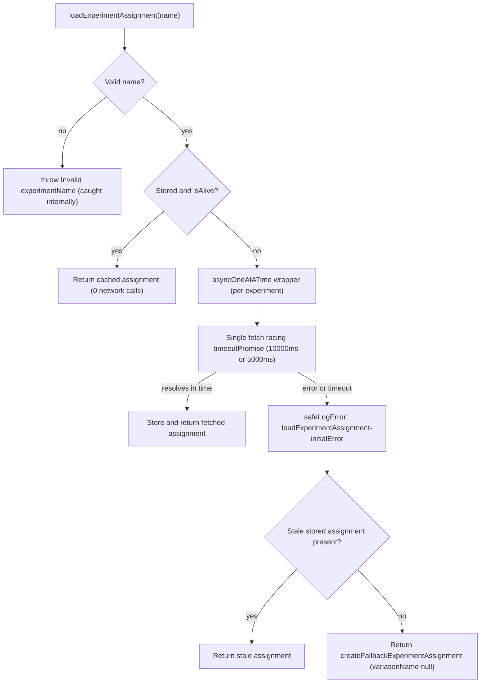

# `@automattic/explat-client` — Behavioral Analysis (Failure, Concurrency, Caching & Method-Ordering)

An authoritative, empirically-grounded behavioral analysis of the ExPlat experiment-assignment
client. Every behavioral claim below was produced by **running the code first** and quoting the
observed output verbatim; every value is grounded in a `file:line` citation into the source. This
document was produced under ruleset `SWE-AtlasQnA-Repo`.

---

## Subject & Scope

- **Subject:** the standalone client package `@automattic/explat-client` at `packages/explat-client`,
  version `0.1.0` [`packages/explat-client/package.json:L3`].
- **Out of scope** (these are *consumers* of the client, not the client itself, and the user's
  questions target the client's own behavior):
  - `packages/explat-client-react-helpers` — the `useExperiment` React-hook wrapper.
  - `client/lib/explat` — the Calypso-platform implementation of `createExPlatClient`.
  - `client/state/explat-experiments` — the Redux actions/reducers/selectors layer.

## Reproducibility Anchor

- **Branch:** `wp-calypso_be7e5cc64162`
- **HEAD commit:** `be7e5cc641622d153040491fd5625c6cb83e12eb`
  — all `file:line` locators in this document are anchored to this revision and can be re-verified against it.
- **Toolchain observed at run time:** Node `v22.23.1`, Yarn `4.0.2`.
  - The repository declares `engines.node = "^v22.9.0"` and `packageManager = "yarn@4.0.2"` in the
    **root** `package.json`, and `.nvmrc` pins `22.9.0`. Note that the package manifest
    `packages/explat-client/package.json` itself has **no** `engines` field; the engine constraint is
    inherited from the monorepo root.

## Methodology — Run-First

Nothing here is asserted from reading alone. The methodology was:

1. Run the package's existing test suite and capture the verbatim runner summary (answers **R1**).
2. Author **one temporary** jest observation test at `packages/explat-client/src/test/zz_observation.ts`,
   drive the real client through each scenario, and capture the verbatim `console.log` output
   (answers **R2–R6**).
3. Delete the temporary test and confirm the working tree is clean (read-only integrity).
4. Write each answer from the captured evidence.

**Network boundary.** The client performs **no real I/O itself**. It calls the injected
`config.fetchExperimentAssignment` callback [`packages/explat-client/src/types.ts:L28-L39`], so every
behavior below is fully observable by mocking that single function — no live experiment server,
credentials, or connectivity is required.

**Read-only integrity.** This document is the *only* file added to the repository. It was authored
purely from read-only inspection of `packages/explat-client/**` plus captured runtime output. The
temporary observation test was **created, run, and deleted**; `git status --porcelain` is empty and no
existing source file was modified. See [§ Methodology, Reproduction & Integrity](#methodology-reproduction--integrity).

---

## Quick Answers (TL;DR)

| # | Question | Answer |
|---|----------|--------|
| **R1** | Are the package tests passing? | **Yes.** `Test Suites: 9 passed, 9 total` / `Tests: 81 passed, 81 total` / `Snapshots: 23 passed, 23 total`. |
| **R2** | Is it "designed to never throw"? | **Yes for instance methods** (`loadExperimentAssignment`, both getters wrap everything in `try/catch`). The **one** exception is the *constructor* `createExPlatClient`, which throws `Running outside of a browser context.` when `window` is undefined. |
| **R3** | Server unavailable / too slow? | Request is timed out after **`10000`ms** (or **`5000`ms** under an A/B experiment). On timeout *or* rejection the user gets the **fallback** assignment `{ variationName: null, ttl: 60, isFallbackExperimentAssignment: true }` → the **default (control)** experience. Nothing throws. |
| **R4** | Concurrent identical loads? | **Exactly one** network call for N simultaneous loads of the same experiment (single-flight de-duplication); all callers receive the same resolved assignment. |
| **R5** | Repeated loads / cache TTL? | Repeated loads within the TTL make **zero** additional network calls; after the TTL expires, **one** new call is made. Minimum interval per experiment is `minimumTtl = 60`s; production server TTL is ~`3600`s. |
| **R6** | Sync getter before async load? | **Graceful degradation, not breakage.** `dangerouslyGetExperimentAssignment` returns a fallback (default experience) and logs **only in development mode**; `dangerouslyGetMaybeLoadedExperimentAssignment` returns `null`. |

> **On the observed timestamps below.** The `retrievedTimestamp` integers in the quoted output are real
> `monotonicNow()` / `Date.now()` values captured during the run and therefore **differ from run to
> run**. Everything else the questions ask for — call counts, timeout milliseconds, log messages,
> object shapes, `variationName`, `ttl`, and log `source` tags — is stable and reproduced verbatim.

---

## R1 — "First make sure the package tests are passing."

**Answer: they pass.** All 9 suites, 81 tests, and 23 snapshots pass.

### Command

The package `test` script is `"test": "yarn jest"` [`packages/explat-client/package.json:L25`]. For a
deterministic, non-interactive run (no watch mode, single process) the suite was executed from inside
`packages/explat-client` as:

```bash
CI=true yarn jest --ci --runInBand
```

### Why 9 suites?

The package delegates to a shared preset — `module.exports = { preset: '../../test/packages/jest-preset.js' }`
[`packages/explat-client/jest.config.js`] — which spreads `@automattic/calypso-jest`. That base preset sets
`testEnvironment: 'node'` and `testMatch: [ '<rootDir>/**/test/*.[jt]s?(x)', '!**/.eslintrc.*' ]`
[`packages/calypso-jest/jest-preset.js:L11-L12`]. Exactly **9** files match that glob:

- `src/test/create-explat-client.ts`
- `src/test/create-ssr-safe-dummy-explat-client.ts`
- `src/test/index.ts`
- `src/internal/test/experiment-assignment-store.ts`
- `src/internal/test/experiment-assignments.ts`
- `src/internal/test/local-storage.ts`
- `src/internal/test/requests.ts`
- `src/internal/test/timing.ts`
- `src/internal/test/validations.ts`

(This same auto-discovery rule is why the temporary observation test — placed under `src/test/` — was
picked up automatically, and why it had to be removed afterward.)

### Observed output

Verbatim runner summary (exit code `0`):

```text
Test Suites: 9 passed, 9 total
Tests:       81 passed, 81 total
Snapshots:   23 passed, 23 total
Time:        2.636 s, estimated 3 s
Ran all test suites.
```

Verbatim `PASS` lines:

```text
PASS src/test/create-explat-client.ts
PASS src/internal/test/requests.ts
PASS src/internal/test/experiment-assignment-store.ts
PASS src/internal/test/timing.ts
PASS src/test/create-ssr-safe-dummy-explat-client.ts
PASS src/internal/test/validations.ts
PASS src/test/index.ts
PASS src/internal/test/experiment-assignments.ts
PASS src/internal/test/local-storage.ts
```

> **`Time` is not a fixed constant.** A second run reported `Time: 2.859 s`. The elapsed time varies
> run-to-run; the **pass counts** (`9/9`, `81/81`, `23/23`) are stable.

### Benign warnings (do **not** fail the run)

Two non-fatal notices were emitted (exit code still `0`):

```text
Browserslist: browsers data (caniuse-lite) is 17 months old. Please run:
  npx update-browserslist-db@latest
  Why you should do it regularly: https://github.com/browserslist/update-db#readme
```

```text
Jest did not exit one second after the test run has completed.

'This usually means that there are asynchronous operations that weren't stopped in your tests. Consider running Jest with `--detectOpenHandles` to troubleshoot this issue.
```

- The Browserslist "N months old" figure is environmental and grows over time (it read `17 months old`
  in this run); it is a data-freshness notice, not a failure.
- The "Jest did not exit…" notice comes from open async handles (pending `setTimeout` timers created by
  the timeout mechanism described in **R3**); it does not affect the pass/fail result.
- A Node `[DEP0040] punycode` deprecation warning is Node-version dependent; it did **not** surface in
  this Node `v22.23.1` run.

**Conclusion:** the package is healthy — all suites pass before any behavioral claim below is made.

---


## R2 — "Designed to never throw": verifying the guarantee

The README states the design goal plainly: **`Designed to never throw`**
[`packages/explat-client/README.md:L44`]. The guarantee holds for **instance methods**, with **one**
documented exception — the **constructor**.

### Code evidence

**All three instance methods swallow errors and return a value instead of throwing:**

- `loadExperimentAssignment` wraps its *entire* body in `try/catch` with a **double fallback**
  [`packages/explat-client/src/create-explat-client.ts:L113-L183`]:
  1. Primary `try` begins at L114.
  2. On any error, `safeLogError` records it with `source: 'loadExperimentAssignment-initialError'`
     [`...create-explat-client.ts:L151-L156`].
  3. A second `try` returns a **stale stored** assignment if one exists (important for offline users)
     [`...create-explat-client.ts:L160-L165`]; otherwise it creates, stores, and returns a fallback
     [`...create-explat-client.ts:L170-L172`].
  4. The innermost `catch` logs `source: 'loadExperimentAssignment-fallbackError'`
     [`...create-explat-client.ts:L173-L178`] and returns a last-resort fallback
     [`...create-explat-client.ts:L181`].
- `dangerouslyGetExperimentAssignment` catches and returns a fallback rather than throwing
  [`...create-explat-client.ts:L184-L224`] (dev-only logging at L215-L220; `return createFallbackExperimentAssignment(...)` at L222).
- `dangerouslyGetMaybeLoadedExperimentAssignment` likewise catches
  [`...create-explat-client.ts:L225-L249`].
- Even the logger is defensive: `safeLogError` swallows any error thrown by the injected logger
  [`...create-explat-client.ts:L96-L100`].

**The one documented nuance — the *constructor* can throw:**

`createExPlatClient` guards against server-side use and throws when there is no browser `window`:

```ts
if ( typeof window === 'undefined' ) {
    throw new Error( 'Running outside of a browser context.' );
}
```

[`packages/explat-client/src/create-explat-client.ts:L72-L74`]. This is a **constructor-time** guard,
not an instance-method behavior.

**Why the constructor throw rarely bites real apps (SSR safety):** the package entrypoint selects an
SSR-safe *dummy* client when `window` is undefined —
`const createExPlatClient = typeof window === 'undefined' ? createSsrSafeDummyExPlatClient : createBrowserExPlatClient;`
[`packages/explat-client/src/index.ts:L8-L9`] — whose methods simply log and return fallbacks
[`...create-explat-client.ts:L258-L283`]. Storage is SSR-safe too: an in-memory `localStorage` polyfill
is used when `window.localStorage` is unavailable
[`packages/explat-client/src/internal/local-storage.ts:L33-L38`].

### Observed output

From the temporary observation test (scenario **OBS_F**), where the injected `fetchExperimentAssignment`
throws **synchronously**, and a second sub-scenario that constructs the client with `window` undefined:

```text
OBS_F load_threw=false variation=null
OBS_F ctor_outside_browser_threw=true msg="Running outside of a browser context."
```

**Interpretation:** even when the network callback throws synchronously, `loadExperimentAssignment`
resolves to a fallback (`variation=null`) instead of rejecting (`load_threw=false`). The **only** throw
is the constructor, and **only** outside a browser context (`ctor_outside_browser_threw=true` with the
exact message `Running outside of a browser context.`).

### JSDoc reconciliation (a stale comment vs. observed behavior)

There is a genuine discrepancy in the source that must be surfaced and resolved:

- **Stale JSDoc:** the doc comment on `dangerouslyGetExperimentAssignment` still reads
  `Get an already loaded Experiment Assignment, will throw if there is an error, e.g. if it hasn't been loaded.`
  [`packages/explat-client/src/create-explat-client.ts:L32`]. Taken at face value, this says the method
  **throws**.
- **Actual behavior:** the implementation logs (dev-only) and **returns a fallback** — it does not throw
  (see the `try/catch` at L184-L224 and **OBS_E** in **R6**, where `dangerouslyGet_threw=false`).
- **Reconciliation via changelog + README:** the behavior was deliberately changed. `CHANGELOG.md`
  records under `0.0.2`: `Change dangerouslyGetExperimentAssignment to log rather than throw`
  [`packages/explat-client/CHANGELOG.md:L21`]. The README was updated accordingly:
  `~~MUST be wrapped in a try-catch block.~~ It now logs and won't throw.`
  [`packages/explat-client/README.md:L65`].

**Verdict:** the JSDoc at `create-explat-client.ts:L32` is **out of date**. The authoritative,
empirically-confirmed behavior is *log-then-fallback*, never throw. (This is a documentation nit in the
source, noted here for accuracy; per the read-only constraint it is **not** modified.)

---


## R3 — Server unavailable or too slow: what the response looks like and which variation the user gets

**Answer:** a slow *or* failing fetch is timed out / caught, the user receives the **fallback**
assignment whose `variationName` is `null` (the **default / control** experience), and **nothing
throws**.

### Code evidence

**Timeout constant and A/B halving.** The base timeout is 10 seconds:

```ts
const EXPERIMENT_FETCH_TIMEOUT = 10000;
```

[`packages/explat-client/src/create-explat-client.ts:L16`]. A temporary A/B experiment on the timeout
itself halves it to `5000` for roughly half of loads:

```ts
let experimentFetchTimeout = EXPERIMENT_FETCH_TIMEOUT;
if ( Math.random() > 0.5 ) {
    experimentFetchTimeout = 5000;
}
```

[`...create-explat-client.ts:L134-L138`]. So the **effective timeout is either `10000`ms or `5000`ms**.

**Timeout mechanism & message.** `timeoutPromise` races the fetch against a `setTimeout` that rejects:

```ts
setTimeout(
    () => rej( new Error( `Promise has timed-out after ${ timeoutMilliseconds }ms.` ) ),
    timeoutMilliseconds
)
```

[`packages/explat-client/src/internal/timing.ts:L23-L36`; message at `L31`]; it is invoked at
[`...create-explat-client.ts:L142-L145`].

**Fallback object shape.** On the failure path the client returns
`createFallbackExperimentAssignment(experimentName)`:

```ts
export const createFallbackExperimentAssignment = (
    experimentName: string,
    ttl: number = minimumTtl
): ExperimentAssignment => ( {
    experimentName: experimentName,
    variationName: null,
    retrievedTimestamp: Timing.monotonicNow(),
    ttl: Math.max( minimumTtl, ttl ),
    isFallbackExperimentAssignment: true,
} );
```

[`packages/explat-client/src/internal/experiment-assignments.ts:L29-L38`], where `minimumTtl = 60`
[`...experiment-assignments.ts:L21`]. On the load-failure path the default `ttl` is therefore **`60`**.

**Which variation the user is assigned.** `variationName: null`, which the README defines as the
**default experience**: `variationName === null: This means you should return the default experience.`
[`packages/explat-client/README.md:L22`]. (A non-null value is the treatment experience, currently
always `treatment` [`README.md:L23`].)

### Observed output

**Timeout scenario (OBS_C)** — a hung server (a fetch that never resolves), `Math.random` forced to
`0.3` (≤ 0.5, so the timeout stays `10000`), fake timers advanced by 10 s:

```text
OBS_C result={"experimentName":"my_experiment","variationName":null,"retrievedTimestamp":1782883688710,"ttl":60,"isFallbackExperimentAssignment":true}
OBS_C logged_message=Promise has timed-out after 10000ms.
OBS_C logged_source=loadExperimentAssignment-initialError
```

**A/B-halved branch (OBS_C2)** — identical setup but `Math.random` forced to `0.7` (> 0.5) and fake
timers advanced by 5 s:

```text
OBS_C2 logged_message=Promise has timed-out after 5000ms.
```

This deterministically demonstrates the halving to `5000`ms; the two scenarios together exhibit both the
`10000`ms and `5000`ms branches.

**Outright rejection scenario (OBS_D)** — the fetch rejects with `new Error( 'Network unavailable' )`:

```text
OBS_D load_threw=false
OBS_D result={"experimentName":"my_experiment","variationName":null,"retrievedTimestamp":1782883678714,"ttl":60,"isFallbackExperimentAssignment":true}
OBS_D logged=[{"message":"Network unavailable","experimentName":"my_experiment","source":"loadExperimentAssignment-initialError"}]
```

- The returned object shape is exactly the fallback: `variationName: null`, `ttl: 60`,
  `isFallbackExperimentAssignment: true` — produced by `createFallbackExperimentAssignment`
  [`packages/explat-client/src/internal/experiment-assignments.ts:L29-L38`].
- The timeout message text originates in `timeoutPromise`
  [`packages/explat-client/src/internal/timing.ts:L31`].
- The `retrievedTimestamp` integers (`1782883688710`, `1782883678714`) are real `monotonicNow()` values
  captured this run and will differ on other runs; treat them as "the retrieval timestamp," not a fixed
  constant.

### Conclusion & offline nuance

A failed **or** slow fetch yields the fallback (`variationName: null`) → the user sees the **default /
control** experience, and the promise resolves normally (never rejects). One important nuance for
offline resilience: if a (possibly stale) assignment is already stored, it is returned **in preference**
to a fresh fallback [`...create-explat-client.ts:L160-L165`], so returning users keep a consistent
assignment even while offline.

---


## R4 — Concurrency: how many network calls for N simultaneous identical loads?

**Answer: exactly one.** N simultaneous loads of the *same* experiment cause a single network call, and
all callers receive the same resolved assignment.

### Code evidence

**Single-flight primitive.** `asyncOneAtATime` wraps an async function so that repeated invocations
return the **same** in-flight promise until it settles, then resets:

```ts
export function asyncOneAtATime< T >( f: () => Promise< T > ): () => Promise< T > {
    let lastPromise: Promise< T > | null = null;
    return () => {
        if ( ! lastPromise ) {
            lastPromise = f().finally( () => {
                lastPromise = null;
            } );
        }
        return lastPromise;
    };
}
```

[`packages/explat-client/src/internal/timing.ts:L44-L54`].

**Applied per experiment.** The fetch-and-store is wrapped in `asyncOneAtATime` and memoized per
experiment name:

- `createWrappedExperimentAssignmentFetchAndStore = ( experimentName ) => Timing.asyncOneAtATime( async () => { fetch; store; return } )`
  [`packages/explat-client/src/create-explat-client.ts:L82-L90`].
- The per-experiment wrapper is cached in
  `experimentNameToWrappedExperimentAssignmentFetchAndStore` [`...create-explat-client.ts:L91-L94`],
  created on first use for a given name [`...create-explat-client.ts:L127-L132`].

The result: while a fetch for `"my_experiment"` is in flight, every other `loadExperimentAssignment('my_experiment')`
awaits that same promise instead of starting a new request.

### Observed output

**Concurrency scenario (OBS_A)** — five simultaneous `loadExperimentAssignment('my_experiment')` calls
against a mock that resolves `{ variations: { my_experiment: 'treatment' }, ttl: 3600 }`:

```text
OBS_A concurrent_calls=5 network_calls=1
OBS_A all_treatment=true
OBS_A result0={"experimentName":"my_experiment","variationName":"treatment","retrievedTimestamp":1782883678702,"ttl":3600}
```

- `concurrent_calls=5` loads produced `network_calls=1` — the mock's call count was exactly **1**.
- `all_treatment=true` — every one of the five resolved to the same `variationName: 'treatment'`.
- The resolved assignment carries `ttl: 3600` — the server-returned TTL (see **R5** for the flooring rule).

### Corroboration from the existing suite

The shipped test `ExPlatClient.loadExperimentAssignment multiple-use` fires four concurrent loads and
asserts the fetch mock was called once:

```ts
expect(
    ( mockedConfig.fetchExperimentAssignment as MockedFunction ).mock.calls
).toHaveLength( 1 );
```

[`packages/explat-client/src/test/create-explat-client.ts:L321-L323`] (within the `multiple-use`
`describe` at L292). This independently confirms the single-flight de-duplication.

---


## R5 — Caching & TTL: does each repeated request hit the network, and what happens after expiry?

**Answer:** repeated loads **within** the TTL window make **zero** additional network calls; after the
TTL **expires**, exactly **one** new call is made.

### Code evidence

**TTL gate.** A stored assignment is reused only while it is "alive":

```ts
export function isAlive( experimentAssignment: ExperimentAssignment ): boolean {
    return (
        Timing.monotonicNow() <
        experimentAssignment.ttl * Timing.MILLISECONDS_PER_SECOND +
            experimentAssignment.retrievedTimestamp
    );
}
```

[`packages/explat-client/src/internal/experiment-assignments.ts:L8-L14`], with
`MILLISECONDS_PER_SECOND = 1000` [`packages/explat-client/src/internal/timing.ts:L1`]. The cache-hit
short-circuit inside `loadExperimentAssignment` returns the stored assignment without fetching:

```ts
if ( storedExperimentAssignment && ExperimentAssignments.isAlive( storedExperimentAssignment ) ) {
    return storedExperimentAssignment;
}
```

[`packages/explat-client/src/create-explat-client.ts:L119-L125`].

**Floors & server TTL.** The minimum TTL — "the minimum amount of time in-between requests per
experiment" — is `minimumTtl = 60` seconds [`...experiment-assignments.ts:L16-L21`]. The server-returned
TTL is floored to that minimum:

```ts
const ttl = Math.max( ExperimentAssignments.minimumTtl, responseTtl );
```

[`packages/explat-client/src/internal/requests.ts:L93`]. In production the server TTL is ~`3600` seconds
[`packages/explat-client/README.md:L42`].

**Persistence & race guard.** Assignments are persisted in LocalStorage (or the in-memory polyfill)
under the key prefix `explat-experiment-`
[`packages/explat-client/src/internal/experiment-assignment-store.ts:L9`]. A guard refuses to overwrite
a **newer** stored assignment with an **older** one (a race-condition guard):

```ts
if (
    previousExperimentAssignment &&
    experimentAssignment.retrievedTimestamp < previousExperimentAssignment.retrievedTimestamp
) {
    throw new Error(
        'Trying to store an older experiment assignment than is present in the store, likely a race condition.'
    );
}
```

[`...experiment-assignment-store.ts:L27-L34`].

### Observed output

**Caching/TTL scenario (OBS_B)** — one initial load, then two more quick loads within the `3600`s TTL,
then a load after advancing the monotonic clock just past the TTL:

```text
OBS_B network_after_first_load=1
OBS_B network_after_2_more_quick_loads=1 (ttl=3600s, within TTL)
OBS_B network_after_TTL_expiry=2
```

- After the first load the network call count is `1`.
- Two more loads **within** the TTL leave it at `1` — i.e., **zero** additional network calls (served
  from the `isAlive` cache).
- After advancing time past the TTL, the next load makes exactly **one** new call, taking the count to
  `2`.

### Corroboration from the existing suite

The same `multiple-use` test advances the mocked clock past the TTL and asserts the count becomes `2`:

```ts
expect(
    ( mockedConfig.fetchExperimentAssignment as MockedFunction ).mock.calls
).toHaveLength( 2 );
```

[`packages/explat-client/src/test/create-explat-client.ts:L354-L356`] — after asserting length `1`
within the TTL at L321-L323. This independently confirms the TTL cache behavior.

---


## R6 — Synchronous getter called *before* the async load finishes

**Answer: graceful degradation, not breakage.** `dangerouslyGetExperimentAssignment` returns a fallback
(the default experience) and does **not** throw; it logs the not-loaded condition **only in development
mode**. Its companion `dangerouslyGetMaybeLoadedExperimentAssignment` returns `null`.

### Code evidence

**`dangerouslyGetExperimentAssignment` — log-then-fallback.** When nothing is stored yet, it throws
*internally*:

```ts
throw new Error(
    "Trying to dangerously get an ExperimentAssignment that hasn't loaded."
);
```

[`packages/explat-client/src/create-explat-client.ts:L192-L194`]. That throw is **caught** by the
method's own `catch` (L214). The catch logs via `safeLogError` **only** when
`config.isDevelopmentMode`, with `source: 'dangerouslyGetExperimentAssignment-error'`
[`...create-explat-client.ts:L215-L220`], then returns `createFallbackExperimentAssignment(...)`
[`...create-explat-client.ts:L222`]. So callers always get a valid `ExperimentAssignment` back and no
exception escapes.

**`dangerouslyGetMaybeLoadedExperimentAssignment` — returns `null`.** The getter intended for the
`useExperiment` hook returns `null` when nothing is loaded:

```ts
if ( ! storedExperimentAssignment ) {
    return null;
}
```

[`packages/explat-client/src/create-explat-client.ts:L234-L235`] (method spans L225-L249). It was added
in `0.1.0` — `Add dangerouslyGetMaybeLoadedExperimentAssignment for use in useExperiment`
[`packages/explat-client/CHANGELOG.md:L3-L5`].

### Observed output

**Sync-before-load scenario (OBS_E)** — a freshly-constructed client, calling the getters *before* any
`loadExperimentAssignment` has run, in production mode; and the dev-mode logging sub-scenario:

```text
OBS_E dangerouslyGet_threw=false
OBS_E dangerouslyGet_result={"experimentName":"my_experiment","variationName":null,"retrievedTimestamp":1782883678715,"ttl":60,"isFallbackExperimentAssignment":true}
OBS_E dangerouslyGet_logged_in_prod=[]
OBS_E maybeLoaded_result=null
OBS_E dev_logged=[{"message":"Trying to dangerously get an ExperimentAssignment that hasn't loaded.","experimentName":"my_experiment","source":"dangerouslyGetExperimentAssignment-error"}]
```

- `dangerouslyGet_threw=false` — the synchronous getter does **not** throw before load.
- `dangerouslyGet_result=…` — it returns the fallback (`variationName: null`, `ttl: 60`,
  `isFallbackExperimentAssignment: true`) → the default experience.
- `dangerouslyGet_logged_in_prod=[]` — with `isDevelopmentMode: false`, **no** error is logged.
- `dev_logged=[{…}]` — with `isDevelopmentMode: true`, the message
  `Trying to dangerously get an ExperimentAssignment that hasn't loaded.` is logged with
  `source: 'dangerouslyGetExperimentAssignment-error'`.
- `maybeLoaded_result=null` — `dangerouslyGetMaybeLoadedExperimentAssignment` returns `null` when nothing
  is loaded.

### Corroboration from the existing suite

- Dev-mode logging of the not-loaded condition (message + `source: dangerouslyGetExperimentAssignment-error`)
  is asserted at [`packages/explat-client/src/test/create-explat-client.ts:L503-L526`] (message at L520,
  source at L521).
- `dangerouslyGetMaybeLoadedExperimentAssignment` returning `null` with **zero** log calls when not
  loaded is asserted at [`...test/create-explat-client.ts:L631-L640`] (`toBeNull()` at L636-L638; zero
  log calls at L639).

**Conclusion:** calling the synchronous getter too early does not break the app — it degrades to the
default experience (`dangerouslyGetExperimentAssignment`) or an explicit `null`
(`dangerouslyGetMaybeLoadedExperimentAssignment`), with developer-facing logging gated behind
`isDevelopmentMode`.

---


## Control-Flow Summary of `loadExperimentAssignment`

The failure/concurrency/caching behaviors above compose into one control flow. Validate the name →
return the cached assignment if it is stored and still alive (0 network calls) → otherwise run the
single-flight fetch racing the timeout (`10000`ms or `5000`ms) → on success, store and return → on error
or timeout, log and return a stale stored assignment if present, else a fresh fallback
(`variationName: null`).



Line anchors for each node: name validation
[`packages/explat-client/src/create-explat-client.ts:L115-L117`]; cache-hit short-circuit
[`...L119-L125`]; per-experiment single-flight wrapper [`...L82-L90`, `...L127-L132`]; timeout race
[`...L142-L145`]; initial-error log [`...L151-L156`]; stale-stored-else-fallback [`...L160-L172`].

---

## Industry Framing — the three resilience patterns are standard practice

The client's three core resilience mechanisms are well-established, widely-used patterns in
feature-flag and experimentation SDKs. This framing situates the findings; the specific line-level
behavior is as cited above.

- **Fallback-to-control on error.** Mature feature-flag / experiment SDKs are designed to serve a
  *consistent fallback variation* — not `null`-as-error or an exception — when resolution fails. For
  example, Split's SDKs return the `control` treatment when a flag cannot be resolved, and LaunchDarkly
  serves a code-defined default value (one of the flag's variations) when the service is unreachable or
  the key is missing. This is exactly what `createFallbackExperimentAssignment` does by returning
  `variationName: null` — the default/control experience
  [`packages/explat-client/src/internal/experiment-assignments.ts:L29-L38`;
  `packages/explat-client/README.md:L22`].

- **Request de-duplication / single-flight.** The "singleflight" pattern ensures that only one execution
  per key is in flight at a time while duplicate callers await the same result; the recommended
  composition is *cache-first, single-flight-on-miss*. That is precisely how this client is structured:
  an `isAlive` cache check first [`...create-explat-client.ts:L119-L125`], and `Timing.asyncOneAtATime`
  wrapping the per-experiment fetch on a miss
  [`packages/explat-client/src/internal/timing.ts:L44-L54`; `...create-explat-client.ts:L82-L90`].

- **Client-side caching with TTL.** Client SDKs commonly cache results so that a fresh cache serves with
  no network request and a refetch occurs only after the TTL elapses; a small default TTL (on the order
  of ~60 seconds) is typical. This matches the client's `isAlive` gating plus the `minimumTtl = 60`
  floor [`...experiment-assignments.ts:L8-L14`, `L21`], with a ~`3600`-second production server TTL
  [`packages/explat-client/README.md:L42`].

---


## Methodology, Reproduction & Integrity

### Commands used

- **R1 (full suite):** from inside `packages/explat-client`:
  ```bash
  CI=true yarn jest --ci --runInBand
  ```
- **R2–R6 (temporary observation test):**
  ```bash
  CI=true yarn jest zz_observation --ci --runInBand
  ```

`--ci --runInBand` (with `CI=true`) prevents watch mode and forces a deterministic, single-process run.

### The temporary observation test

A single temporary jest test was authored at `packages/explat-client/src/test/zz_observation.ts`
(auto-discovered via the preset's `testMatch '<rootDir>/**/test/*.[jt]s?(x)'`), mirroring the existing
test conventions in `src/test/create-explat-client.ts`:

- `import '@automattic/calypso-polyfills';` first (matches `src/test/create-explat-client.ts:L2`).
- A local `createMockedConfig` returning jest mocks for `logError` / `fetchExperimentAssignment` /
  `getAnonId` with `isDevelopmentMode: false` (mirrors `src/test/create-explat-client.ts:L21-L27`).
- `const spiedMonotonicNow = jest.spyOn( Timing, 'monotonicNow' );`.
- `beforeEach( () => { jest.resetAllMocks(); setBrowserContext(); localStorage.clear(); } )` and then
  restoring a real clock via `spiedMonotonicNow.mockImplementation( () => Date.now() )` so observed
  timestamps reflect real behavior rather than a blanked-spy artifact.
- Helpers `delayedValue`, `ONE_DELAY`, `setBrowserContext`, `setSsrContext` from
  `src/internal/test-common.ts`.
- Fake timers for the timeout scenarios (`jest.useFakeTimers()` + `jest.advanceTimersByTimeAsync(...)`),
  and `jest.spyOn( Math, 'random' ).mockReturnValue( 0.3 | 0.7 )` to force each A/B timeout branch
  deterministically.

The seven scenarios map to the questions: **OBS_A** → R4, **OBS_B** → R5, **OBS_C** / **OBS_C2** /
**OBS_D** → R3, **OBS_E** → R6, **OBS_F** → R2.

The observation run reported:

```text
Test Suites: 1 passed, 1 total
Tests:       7 passed, 7 total
Snapshots:   0 total
Time:        0.931 s
Ran all test suites matching /zz_observation/i.
```

### Integrity (read-only, clean tree)

After capturing the output, the temporary test was **deleted**. `git status --porcelain` is empty, the
working tree is clean, and HEAD is unchanged at `be7e5cc641622d153040491fd5625c6cb83e12eb`. **No
existing source file was modified**; the only file added to the repository is this document.

### Verifiability note

All `file:line` locators are anchored to HEAD `be7e5cc641622d153040491fd5625c6cb83e12eb`. The
`retrievedTimestamp` integers in the observed output are real `monotonicNow()` / `Date.now()` values and
will differ per run; the counts, timeout milliseconds, log messages, object shapes, and log `source`
tags are stable and reproduce exactly.

---

## Coverage Pass

| Requirement | Answered in | `file:line` citations | Verbatim observed output |
|-------------|-------------|-----------------------|--------------------------|
| **R1** — tests passing | [R1](#r1--first-make-sure-the-package-tests-are-passing) | `package.json:L25`; `jest.config.js`; `calypso-jest/jest-preset.js:L11-L12` | `9 passed, 9 total` / `81 passed, 81 total` / `23 passed, 23 total` |
| **R2** — never throws | [R2](#r2--designed-to-never-throw-verifying-the-guarantee) | `create-explat-client.ts:L72-L74, L96-L100, L113-L183, L184-L224, L225-L249, L32`; `README.md:L44, L65`; `CHANGELOG.md:L21`; `index.ts:L8-L9`; `local-storage.ts:L33-L38` | `OBS_F load_threw=false variation=null` / `OBS_F ctor_outside_browser_threw=true msg="Running outside of a browser context."` |
| **R3** — failure/timeout fallback | [R3](#r3--server-unavailable-or-too-slow-what-the-response-looks-like-and-which-variation-the-user-gets) | `create-explat-client.ts:L16, L134-L138, L142-L145, L160-L165`; `timing.ts:L23-L36` (msg L31); `experiment-assignments.ts:L29-L38, L21`; `README.md:L22-L23` | `OBS_C … 10000ms.` / `OBS_C2 … 5000ms.` / `OBS_D … variationName:null … ttl:60 … isFallbackExperimentAssignment:true` |
| **R4** — concurrency de-dup | [R4](#r4--concurrency-how-many-network-calls-for-n-simultaneous-identical-loads) | `timing.ts:L44-L54`; `create-explat-client.ts:L82-L90, L91-L94, L127-L132`; `test/create-explat-client.ts:L321-L323` | `OBS_A concurrent_calls=5 network_calls=1` |
| **R5** — caching/TTL | [R5](#r5--caching--ttl-does-each-repeated-request-hit-the-network-and-what-happens-after-expiry) | `experiment-assignments.ts:L8-L14, L21`; `timing.ts:L1`; `create-explat-client.ts:L119-L125`; `requests.ts:L93`; `experiment-assignment-store.ts:L9, L27-L34`; `README.md:L42`; `test/create-explat-client.ts:L354-L356` | `OBS_B network_after_first_load=1` / `network_after_2_more_quick_loads=1` / `network_after_TTL_expiry=2` |
| **R6** — sync-before-load | [R6](#r6--synchronous-getter-called-before-the-async-load-finishes) | `create-explat-client.ts:L192-L194, L215-L220, L222, L234-L235, L225-L249`; `CHANGELOG.md:L3-L5`; `test/create-explat-client.ts:L503-L526, L631-L640` | `OBS_E dangerouslyGet_threw=false` / `dangerouslyGet_logged_in_prod=[]` / `maybeLoaded_result=null` / `dev_logged=[{…}]` |

**Sub-part checklist:**

- [x] R1 answered with command, why-9-suites, verbatim summary, benign warnings.
- [x] R2 — instance methods never throw; the **constructor** is the single exception
      (`Running outside of a browser context.`); SSR-safe dummy noted.
- [x] R2 — stale JSDoc at `create-explat-client.ts:L32` surfaced **and** reconciled via
      `CHANGELOG.md:L21` (`0.0.2`) and `README.md:L65`.
- [x] R3 — timeout `10000` **and** A/B-halved `5000`; verbatim timeout message
      `Promise has timed-out after ${ms}ms.`; fallback shape (`variationName: null`, `ttl: 60`,
      `isFallbackExperimentAssignment: true`); variation = default/control.
- [x] R4 — `network_calls=1` for N=5 concurrent loads; existing-suite corroboration.
- [x] R5 — 0 additional calls within TTL, count `2` after expiry; `minimumTtl = 60`; server TTL ~`3600`.
- [x] R6 — graceful degradation; dev-only logging; `maybeLoaded` → `null`; existing-suite corroboration.
- [x] Industry framing covers all three patterns (fallback-to-control, single-flight, TTL cache).
- [x] HEAD anchor recorded; read-only / clean-tree statement present.
- [x] No value the questions ask for is paraphrased (timeouts `10000`/`5000`, the timeout message,
      `variationName: null` / `ttl: 60` / `isFallbackExperimentAssignment: true`, `network_calls=1`,
      `network_after_TTL_expiry=2`, the constructor message, and the log `source` tags
      `loadExperimentAssignment-initialError` / `dangerouslyGetExperimentAssignment-error` are all quoted
      exactly).

---

*End of analysis. This document is the sole persisted artifact of the task; the repository is otherwise
unchanged.*

