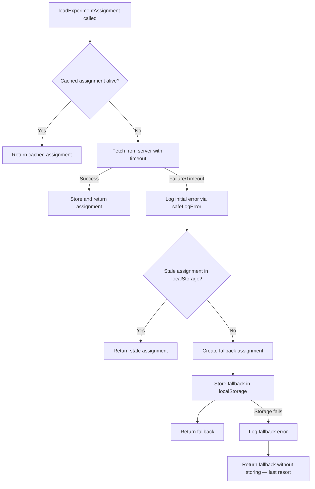
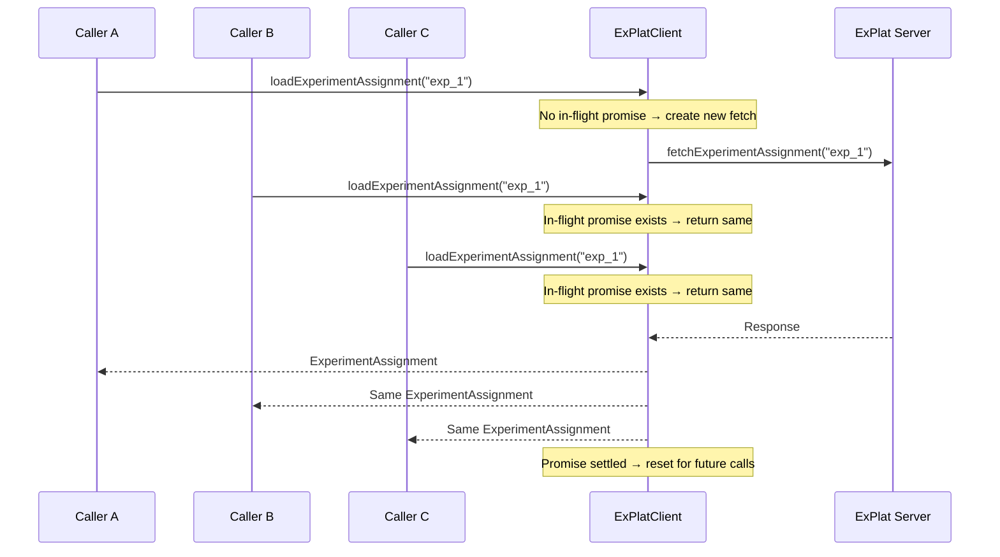
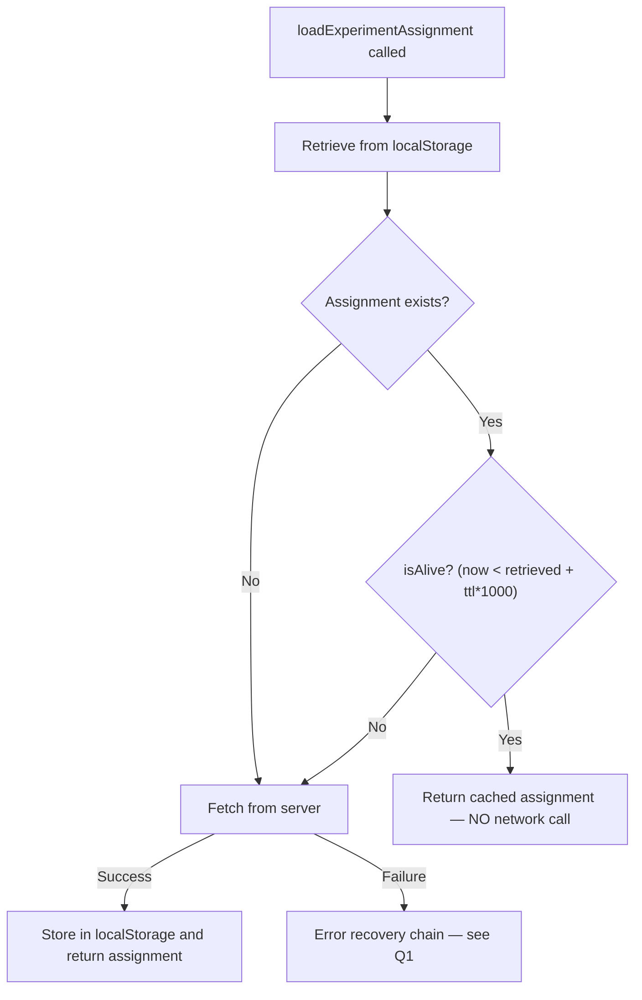

# @automattic/explat-client — Behavioral Reference

This document provides detailed behavioral answers for the `@automattic/explat-client` package (version 0.1.0), Automattic's standalone experiment assignment client used in the `wp-calypso` monorepo.

It covers four critical behavioral domains:

1. **Failure Handling** — What happens when the ExPlat server is unavailable or takes too long to respond?
2. **Concurrent Request Deduplication** — How many network calls are actually made when multiple callers request the same experiment?
3. **Caching Behavior** — Does each request trigger a network call? What happens after the cache TTL expires?
4. **Sync/Async API Interplay** — What happens if the synchronous getter is called before the async loader has completed?

All answers are **evidence-based**, derived from source code analysis of the package implementation and corroborated by the passing test suite. No assumptions are made; the code is the source of truth.

> **Generated from:** `packages/explat-client/` in the `wp-calypso` repository, branch `wp-calypso_be7e5cc64162`

---

## Test Verification

Before relying on the test suite as behavioral evidence, we verified that all tests pass:

| Metric | Result |
|--------|--------|
| **Test Suites** | 9 passed, 9 total |
| **Tests** | 81 passed, 81 total |
| **Snapshots** | 23 passed, 23 total |
| **Time** | ~3.755s |

**Environment:** Node v22.9.0, Jest 29.7.0, Yarn 4.0.2

**Command:**

```bash
cd packages/explat-client && npx jest --ci --watchAll=false --verbose
```

### Test Suites

| # | File Path | Coverage Area |
|---|-----------|--------------|
| 1 | `src/test/create-explat-client.ts` | Client factory, loading, caching, fallback, dangerous getters |
| 2 | `src/test/create-ssr-safe-dummy-explat-client.ts` | SSR dummy client behavior |
| 3 | `src/test/index.ts` | Entry point environment routing |
| 4 | `src/internal/test/timing.ts` | Monotonic clock, timeouts, `asyncOneAtATime` |
| 5 | `src/internal/test/requests.ts` | Fetch workflow, response validation, anonId caching |
| 6 | `src/internal/test/experiment-assignments.ts` | TTL boundary, fallback creation |
| 7 | `src/internal/test/experiment-assignment-store.ts` | localStorage persistence, cleanup |
| 8 | `src/internal/test/local-storage.ts` | Polyfilled storage semantics |
| 9 | `src/internal/test/validations.ts` | Validation rules |

**All 81 tests pass, confirming the behavioral contracts documented below are valid.**

---

## Q1: What happens when the ExPlat server is unavailable or takes too long to respond?

### Short Answer

The client **NEVER throws in production**. It follows a multi-level error recovery chain and returns a fallback `ExperimentAssignment` with `variationName: null`. The user sees the **default/control experience**. The fallback is cached for at least 60 seconds, preventing retry storms against an unresponsive server.

### Detailed Analysis

#### The Error Recovery Chain

The `loadExperimentAssignment` method (Source: `packages/explat-client/src/create-explat-client.ts:113–183`) implements a five-level error recovery chain. Every level is wrapped in try/catch blocks so that no error can propagate to the caller:

**Level 1 — Try: Fetch from server**

The method first checks for a cached alive assignment (lines 119–125). If none exists, it calls `fetchExperimentAssignment` wrapped with `timeoutPromise` (lines 142–145):

```typescript
const fetchedExperimentAssignment = await Timing.timeoutPromise(
    experimentNameToWrappedExperimentAssignmentFetchAndStore[ experimentName ](),
    experimentFetchTimeout
);
```

If the fetch succeeds, the assignment is stored and returned.

**Level 2 — Catch initial error → Log**

If the fetch fails (network error, timeout, invalid response), the error is caught at line 151 and logged via `safeLogError`:

```typescript
} catch ( initialError ) {
    safeLogError( {
        message: ( initialError as Error ).message,
        experimentName,
        source: 'loadExperimentAssignment-initialError',
    } );
}
```

Source: `packages/explat-client/src/create-explat-client.ts:151–157`

Execution then falls through to the stale cache recovery path.

**Level 3 — Try: Stale cache recovery**

The method attempts to retrieve a stale (expired TTL) assignment from localStorage (lines 160–165):

```typescript
const storedExperimentAssignment = retrieveExperimentAssignment( experimentName );
if ( storedExperimentAssignment ) {
    return storedExperimentAssignment;
}
```

Source: `packages/explat-client/src/create-explat-client.ts:160–165`

This is critical for **offline users** — if a previously-fetched assignment exists in localStorage (even if expired), it is returned rather than generating a brand-new fallback.

**Level 4 — Create and store fallback**

If no stale cache exists, a new fallback is created and stored synchronously (lines 170–172):

```typescript
const fallbackExperimentAssignment = createFallbackExperimentAssignment( experimentName );
storeExperimentAssignment( fallbackExperimentAssignment );
return fallbackExperimentAssignment;
```

Source: `packages/explat-client/src/create-explat-client.ts:170–172`

Storing the fallback is deliberate — it prevents concurrent callers from all independently generating fallbacks and avoids a "run on the server" when the server comes back online.

**Level 5 — Last resort fallback**

If even the stale cache retrieval or fallback storage throws (e.g., localStorage is full or corrupted), the final catch (lines 173–182) logs the error and returns a bare fallback without storing it:

```typescript
} catch ( fallbackError ) {
    safeLogError( {
        message: ( fallbackError as Error ).message,
        experimentName,
        source: 'loadExperimentAssignment-fallbackError',
    } );

    // As a last resort we just keep it very simple
    return createFallbackExperimentAssignment( experimentName );
}
```

Source: `packages/explat-client/src/create-explat-client.ts:173–182`

#### Error Recovery Flowchart



#### The Fetch Timeout Mechanism

The `timeoutPromise` function (Source: `packages/explat-client/src/internal/timing.ts:23–36`) uses `Promise.race` between the actual fetch promise and a `setTimeout` that **rejects** with an error:

```typescript
export function timeoutPromise< T >(
    promise: Promise< T >,
    timeoutMilliseconds: number
): Promise< T | null > {
    return Promise.race( [
        promise,
        new Promise< null >( ( _res, rej ) =>
            setTimeout(
                () => rej( new Error( `Promise has timed-out after ${ timeoutMilliseconds }ms.` ) ),
                timeoutMilliseconds
            )
        ),
    ] );
}
```

Key details:

- The timeout **rejects** (throws), it does not silently return `null`
- The default `EXPERIMENT_FETCH_TIMEOUT` is 10,000ms (Source: `create-explat-client.ts:16`)
- **A/B experiment on timeout duration:** At runtime, `Math.random() > 0.5` halves the timeout to 5,000ms (Source: `create-explat-client.ts:134–138`). This means the effective timeout is randomly either **5 seconds or 10 seconds** per request.

```typescript
// Temporarilly running an A/B experiment on the timeout, see https://github.com/Automattic/wp-calypso/pull/54507
let experimentFetchTimeout = EXPERIMENT_FETCH_TIMEOUT;
if ( Math.random() > 0.5 ) {
    experimentFetchTimeout = 5000;
}
```

**Important:** The timeout is applied **after** the `asyncOneAtATime` wrapper (Source: `create-explat-client.ts:140–145`), meaning the background fetch+store continues even if the caller times out. Future calls to `loadExperimentAssignment` can still receive the result of the in-flight fetch once it completes.

#### The Fallback ExperimentAssignment Shape

When a fallback is created by `createFallbackExperimentAssignment` (Source: `packages/explat-client/src/internal/experiment-assignments.ts:29–38`), the exact object returned is:

```typescript
{
    experimentName: string,                    // The requested experiment name
    variationName: null,                       // Always null — means "show default experience"
    retrievedTimestamp: number,                 // monotonicNow() at creation time
    ttl: 60,                                   // Math.max(minimumTtl, ttl), minimum 60 seconds
    isFallbackExperimentAssignment: true        // Marker to detect degraded state
}
```

Key implications:

- **`variationName: null`** means integration code should show the default/control experience
- **`isFallbackExperimentAssignment: true`** allows integration code to detect when the client is in a degraded state (e.g., to show a loading indicator instead of committing to the default)
- **`ttl: 60`** (the `minimumTtl` constant at line 21) means the client **won't retry for at least 60 seconds** after a failure, preventing retry storms

#### The `safeLogError` Wrapper

The user-provided `config.logError` function is wrapped in `safeLogError` (Source: `create-explat-client.ts:96–100`):

```typescript
const safeLogError: typeof config.logError = ( ...args ) => {
    try {
        config.logError( ...args );
    } catch ( e ) {}
};
```

This catches and swallows any error thrown by the logging function itself, preventing a broken logging implementation from crashing the experiment client.

#### Test Evidence

**Test: "Could not fetch ExperimentAssignment: should store and return fallback, and log"**
(Source: `packages/explat-client/src/test/create-explat-client.ts:184–214`)

- Mocks `fetchExperimentAssignment` to reject with `new Error('some-error-123')`
- Verifies the resolved value matches the fallback shape: `variationName: null`, `isFallbackExperimentAssignment: true`, `ttl: 60`
- Verifies `logError` was called once with source `'loadExperimentAssignment-initialError'`

**Test: "Timed-out fetch: should return fallback and log"**
(Source: `packages/explat-client/src/test/create-explat-client.ts:216–249`)

- Mocks `fetchExperimentAssignment` to return a **never-resolving** promise
- Advances fake timers by 10 seconds
- Verifies the fallback shape is returned
- Verifies the log message matches `/Promise has timed-out after [0-9]+ms\./`

**Test: "logError throws/secondary error: should attempt to log secondary error and return fallback"**
(Source: `packages/explat-client/src/test/create-explat-client.ts:250–289`)

- Mocks `logError` to throw `new Error('Error logging.')`
- Verifies the fallback is still returned — `safeLogError` prevents the cascade

---

## Q2: If multiple parts of the application request the same experiment assignment simultaneously, how many network calls are made?

### Short Answer

**Exactly ONE network call per experiment**, regardless of how many concurrent callers request it. All concurrent callers share the same Promise. Different experiments get independent fetchers (no cross-experiment interference).

### Detailed Analysis

#### The `asyncOneAtATime` Wrapper

The `asyncOneAtATime` function (Source: `packages/explat-client/src/internal/timing.ts:44–54`) is a single-flight Promise wrapper:

```typescript
export function asyncOneAtATime< T >( f: () => Promise< T > ): () => Promise< T > {
    let lastPromise: Promise< T > | null = null;
    return () => {
        if ( ! lastPromise ) {
            lastPromise = f().finally( () => {
                lastPromise = null;
            } );
        }
        return lastPromise;
    };
}
```

How it works:

1. **First call:** `lastPromise` is `null`, so `f()` is called and the resulting Promise is stored in `lastPromise`
2. **Subsequent calls while in-flight:** `lastPromise` is not `null`, so the **same Promise** is returned — no new fetch is initiated
3. **After settlement:** `.finally()` resets `lastPromise = null`, so the next call after settlement starts a fresh fetch
4. **Both resolve and reject settle the promise**, meaning a failed fetch also resets the wrapper for the next attempt

#### Per-Experiment Deduplication Map

In `createExPlatClient` (Source: `packages/explat-client/src/create-explat-client.ts:82–94`), each experiment name gets its own `asyncOneAtATime`-wrapped fetcher:

```typescript
const createWrappedExperimentAssignmentFetchAndStore = ( experimentName: string ) =>
    Timing.asyncOneAtATime( async () => {
        const fetchedExperimentAssignment = await Request.fetchExperimentAssignment(
            config,
            experimentName
        );
        storeExperimentAssignment( fetchedExperimentAssignment );
        return fetchedExperimentAssignment;
    } );
const experimentNameToWrappedExperimentAssignmentFetchAndStore: Record<
    string,
    () => Promise< ExperimentAssignment >
> = {};
```

On the first call for an experiment, a new wrapped fetcher is lazily created and stored in the map (Source: `create-explat-client.ts:127–132`):

```typescript
if ( experimentNameToWrappedExperimentAssignmentFetchAndStore[ experimentName ] === undefined ) {
    experimentNameToWrappedExperimentAssignmentFetchAndStore[ experimentName ] =
        createWrappedExperimentAssignmentFetchAndStore( experimentName );
}
```

This means:
- **Same experiment:** All callers share the same wrapped fetcher → same in-flight Promise
- **Different experiments:** Independent fetchers with independent deduplication

#### Concurrent Request Sequence



#### Failed Request Sharing

When a fetch fails, **all concurrent callers** receive the same rejection. Each caller then independently falls through the error recovery chain (stale cache → fallback). However, the **first caller's fallback is stored** in localStorage, so subsequent callers' stale cache recovery path picks up that stored fallback — they all end up with the same result.

#### Test Evidence

**Test: "should respect the ttl (including developmentMode)"**
(Source: `packages/explat-client/src/test/create-explat-client.ts:292–368`)

- Makes 4 concurrent calls: `experimentAssignmentA` through `experimentAssignmentD`
- Asserts all resolve to equal values: `expect(await A).toEqual(await B)`, etc.
- Asserts `fetchExperimentAssignment` was called exactly **1 time**: `.toHaveLength(1)`
- After advancing time past TTL, makes 4 more concurrent calls (`E` through `H`)
- All again equal, and fetch count is now **2** (one new fetch triggered after TTL expiry)

**Test: "should only make one request even if it fails, returning the same fallback - until ttl is over"**
(Source: `packages/explat-client/src/test/create-explat-client.ts:370–474`)

- Simulates a failed fetch (server returns an invalid experiment assignment response with `experimentName: ''`)
- 4 concurrent calls all get the same fallback
- `fetchExperimentAssignment` called exactly **1 time**
- After TTL expires, a new successful fetch is made (total fetch count = 1 after reset)

---

## Q3: When the same experiment is requested multiple times in quick succession, does each request trigger a network call? What happens after the cache TTL expires?

### Short Answer

**No**, within-TTL requests return the cached assignment with **zero network calls**. After TTL expires, the **next request triggers a fresh fetch**. There is a 60-second minimum TTL floor that applies to all assignments, including fallbacks.

### Detailed Analysis

#### The `isAlive` Predicate

The TTL check is implemented by `isAlive` (Source: `packages/explat-client/src/internal/experiment-assignments.ts:8–14`):

```typescript
export function isAlive( experimentAssignment: ExperimentAssignment ): boolean {
    return (
        Timing.monotonicNow() <
        experimentAssignment.ttl * Timing.MILLISECONDS_PER_SECOND +
            experimentAssignment.retrievedTimestamp
    );
}
```

Key details:

- Uses **strict less-than** (`<`), NOT less-than-or-equal — an assignment is dead at the exact expiry moment
- `monotonicNow()` ensures monotonically increasing timestamps (even if the system clock regresses backward)
- TTL is in **seconds**, converted to milliseconds via `MILLISECONDS_PER_SECOND` (1000)
- An assignment expires when: `now >= retrievedTimestamp + (ttl × 1000)`

#### Two-Phase Cache Check

The caching operates in two phases, both using localStorage as the single underlying storage mechanism:

**Phase 1 — Read and check (cache hit path)**

When `loadExperimentAssignment` is called (Source: `create-explat-client.ts:119–125`), it first reads from localStorage:

```typescript
const storedExperimentAssignment = retrieveExperimentAssignment( experimentName );
if (
    storedExperimentAssignment &&
    ExperimentAssignments.isAlive( storedExperimentAssignment )
) {
    return storedExperimentAssignment;
}
```

If the assignment exists AND `isAlive()` returns `true`, it returns **immediately** with **NO network call**.

**Phase 2 — Write and persist (cache store path)**

Assignments are stored via `storeExperimentAssignment()` (Source: `packages/explat-client/src/internal/experiment-assignment-store.ts:21–40`) using keys prefixed with `explat-experiment--` followed by the experiment name.

The store includes **race condition protection** (lines 27–34): it rejects writes of older assignments (based on `retrievedTimestamp`) to prevent a slow-returning fetch from overwriting a newer assignment:

```typescript
const previousExperimentAssignment = retrieveExperimentAssignment(
    experimentAssignment.experimentName
);
if (
    previousExperimentAssignment &&
    experimentAssignment.retrievedTimestamp < previousExperimentAssignment.retrievedTimestamp
) {
    throw new Error(
        'Trying to store an older experiment assignment than is present in the store, likely a race condition.'
    );
}
```

`retrieveExperimentAssignment` (Source: `experiment-assignment-store.ts:46–57`) parses JSON from localStorage and re-validates the assignment shape via `validateExperimentAssignment`, ensuring corrupted data doesn't propagate.

#### The 60-Second Minimum TTL Floor

The constant `minimumTtl = 60` (Source: `experiment-assignments.ts:21`) is enforced in **two places**:

1. **In `createFallbackExperimentAssignment`** (Source: `experiment-assignments.ts:36`):
   ```typescript
   ttl: Math.max( minimumTtl, ttl )
   ```

2. **In `fetchExperimentAssignment`** (Source: `packages/explat-client/src/internal/requests.ts:93`):
   ```typescript
   const ttl = Math.max( ExperimentAssignments.minimumTtl, responseTtl );
   ```

This means:
- Even if the server returns a TTL less than 60 seconds, it gets **clamped up to 60**
- During failures, fallbacks always have `ttl: 60`, preventing retry storms
- The minimum interval between requests for the same experiment is always at least 60 seconds

#### Cache Lifecycle Flowchart



#### Startup Cleanup

On client initialization, `removeExpiredExperimentAssignments()` is called (Source: `create-explat-client.ts:103–110`) to garbage-collect expired and invalid assignments from localStorage:

```typescript
try {
    removeExpiredExperimentAssignments();
} catch ( error ) {
    safeLogError( {
        message: ( error as Error ).message,
        source: 'removeExpiredExperimentAssignments-error',
    } );
}
```

This function (Source: `experiment-assignment-store.ts:85–103`) iterates all localStorage keys prefixed with `explat-experiment-`, checks each assignment with `isAlive()`, and removes expired or invalid entries.

#### Test Evidence

**Test: "should respect the ttl (including developmentMode)"**
(Source: `packages/explat-client/src/test/create-explat-client.ts:292–368`)

- **First batch** of 4 concurrent calls: triggers a single fetch, all return the same assignment
- `fetchExperimentAssignment` call count: **1**
- Time is advanced past TTL: `validExperimentAssignment.ttl * 1000 + 1` milliseconds
- **Second batch** of 4 concurrent calls: triggers exactly **1 new fetch** (total call count: **2**)
- Confirms `retrievedTimestamp` of the first batch is less than the second batch, proving a fresh fetch occurred

---

## Q4: What happens if the synchronous getter is called before the async loader has completed?

### Short Answer

It does **NOT** break the application. Both synchronous getters handle this gracefully:

- `dangerouslyGetExperimentAssignment` → returns a **fallback** with `variationName: null`
- `dangerouslyGetMaybeLoadedExperimentAssignment` → returns **`null`**

Neither method throws to the caller in production. Errors are caught internally and, in development mode only, logged for debugging.

### Detailed Analysis

#### `dangerouslyGetExperimentAssignment` Behavior

This method (Source: `packages/explat-client/src/create-explat-client.ts:184–224`) follows this logic:

1. **Validates** the experiment name — throws on invalid name (caught by outer catch)
2. **Reads** from localStorage via `retrieveExperimentAssignment(experimentName)` (line 190)
3. **If NOT found** (experiment not yet loaded): throws `"Trying to dangerously get an ExperimentAssignment that hasn't loaded."` — caught by the outer catch at line 214
4. **If found and in development mode**: checks if the assignment was retrieved within the last 1 second and, if so, logs a "too soon" warning (lines 198–210) — but still returns the real assignment
5. **If found**: returns the stored assignment (line 213)

The outer catch (lines 214–223) handles all error paths:

```typescript
} catch ( error ) {
    if ( config.isDevelopmentMode ) {
        safeLogError( {
            message: ( error as Error ).message,
            experimentName,
            source: 'dangerouslyGetExperimentAssignment-error',
        } );
    }
    return createFallbackExperimentAssignment( experimentName );
}
```

- In **development mode**: logs the error via `safeLogError` with source `'dangerouslyGetExperimentAssignment-error'`
- In **ALL modes**: returns `createFallbackExperimentAssignment(experimentName)` — the fallback with `variationName: null`
- **NEVER throws to the caller** — errors are always caught internally

#### `dangerouslyGetMaybeLoadedExperimentAssignment` Behavior

This method (Source: `packages/explat-client/src/create-explat-client.ts:225–249`) is designed for the `useExperiment` React hook:

1. **Validates** the experiment name — throws on invalid (caught by outer catch)
2. **Reads** from localStorage via `retrieveExperimentAssignment(experimentName)` (line 233)
3. **If NOT found**: returns `null` (line 235) — **NOT** a fallback, just `null`
4. **If found**: returns the stored assignment

The outer catch (lines 239–248):
- In development mode: logs via `safeLogError`
- Returns `createFallbackExperimentAssignment(experimentName)` (only reached if validation or retrieval throws)

**Key difference from `dangerouslyGetExperimentAssignment`:** Returns `null` instead of a fallback when the assignment hasn't loaded yet.

#### Three States Summary

| State | `dangerouslyGetExperimentAssignment` | `dangerouslyGetMaybeLoadedExperimentAssignment` |
|---|---|---|
| **Not loaded yet** | Returns fallback (`variationName: null`) | Returns `null` |
| **Currently loading (in-flight)** | Returns fallback (`variationName: null`) | Returns `null` |
| **Loaded** | Returns the real `ExperimentAssignment` | Returns the real `ExperimentAssignment` |
| **Invalid experiment name** | Returns fallback (logs in dev mode) | Returns fallback (logs in dev mode) |

#### Developer Mode "Too Soon" Warning

In `isDevelopmentMode: true`, calling `dangerouslyGetExperimentAssignment` within **1 second** of loading an experiment triggers a warning (Source: `create-explat-client.ts:198–210`):

```typescript
if (
    storedExperimentAssignment &&
    Timing.monotonicNow() - storedExperimentAssignment.retrievedTimestamp < 1000
) {
    safeLogError( {
        message: 'Warning: Trying to dangerously get an ExperimentAssignment too soon after loading it.',
        experimentName,
        source: 'dangerouslyGetExperimentAssignment',
    } );
}
```

This is a **development-only** reminder to load experiments early enough. It does **NOT** affect the return value — the real assignment is still returned.

#### Test Evidence

**Test: "should log and return fallback when the matching experiment hasn't loaded yet"**
(Source: `packages/explat-client/src/test/create-explat-client.ts:503–526`)

- Calls `dangerouslyGetExperimentAssignment('experiment_name_a')` without any prior load
- Returns fallback shape: `variationName: null`, `isFallbackExperimentAssignment: true`
- In dev mode, logs: `"Trying to dangerously get an ExperimentAssignment that hasn't loaded."`

**Test: "should log and return fallback when the matching experiment hasn't loaded yet but is currently loading"**
(Source: `packages/explat-client/src/test/create-explat-client.ts:528–558`)

- Starts `loadExperimentAssignment` but **immediately** (synchronously) calls `dangerouslyGetExperimentAssignment`
- Returns fallback — the load hasn't completed yet
- Same log message as above

**Test: "should return a loaded ExperimentAssignment"**
(Source: `packages/explat-client/src/test/create-explat-client.ts:560–574`)

- After `await loadExperimentAssignment(...)`, `dangerouslyGetExperimentAssignment` returns the **real assignment** (not a fallback)

**Test: "[developerMode] should log error when run too soon after loading"**
(Source: `packages/explat-client/src/test/create-explat-client.ts:576–602`)

- Loads then immediately gets — warning about "too soon" is logged
- The real assignment is still returned (the warning is informational only)

**Test: "return null when the matching experiment hasn't loaded yet"**
(Source: `packages/explat-client/src/test/create-explat-client.ts:631–640`)

- `dangerouslyGetMaybeLoadedExperimentAssignment` returns `null` (not a fallback)
- `logError` call count is **0** — no error logged for this expected case

**Test: "return null when the matching experiment hasn't loaded yet but is currently loading"**
(Source: `packages/explat-client/src/test/create-explat-client.ts:642–658`)

- Returns `null` during an in-flight load
- No error logged

**Test: "should return a loaded ExperimentAssignment"**
(Source: `packages/explat-client/src/test/create-explat-client.ts:660–677`)

- After load completes, returns the **real assignment**

---

## Summary: Key Behavioral Guarantees

1. **Never throws in production:** `loadExperimentAssignment` and both `dangerouslyGet*` methods catch all errors internally and return fallbacks.

2. **Fallback = default experience:** Any fallback has `variationName: null`, meaning the user sees the control/default experience.

3. **Fallback detection:** The `isFallbackExperimentAssignment: true` flag lets integration code detect degraded state.

4. **One fetch per experiment at a time:** `asyncOneAtATime` ensures exactly one in-flight request per experiment; concurrent callers share the same Promise.

5. **TTL-based caching:** Alive assignments (within TTL) are returned from cache with zero network cost.

6. **60-second minimum TTL:** Even failures and fallbacks won't trigger a retry for at least 60 seconds.

7. **Stale cache recovery:** Expired (but stored) assignments are preferred over generating a new fallback during server outages.

8. **SSR safety:** In non-browser contexts, the package automatically provides a dummy client that returns fallbacks without touching the network or localStorage.

9. **Background fetch continues on timeout:** The `timeoutPromise` applies only to the caller; the underlying fetch+store continues so future callers may benefit.

10. **Monotonic timestamps:** `monotonicNow()` prevents clock regression from causing premature cache invalidation.

---

## Additional Insight: SSR Context Safety

The `index.ts` entry point (Source: `packages/explat-client/src/index.ts:8–9`) selects the appropriate client factory based on the runtime context:

```typescript
const createExPlatClient =
    typeof window === 'undefined' ? createSsrSafeDummyExPlatClient : createBrowserExPlatClient;
```

- **Browser context (`typeof window !== 'undefined'`):** Uses the real `createExPlatClient` (the browser factory)
- **SSR context (`typeof window === 'undefined'`):** Uses `createSsrSafeDummyExPlatClient`

The SSR dummy client (Source: `packages/explat-client/src/create-explat-client.ts:258–283`) provides safe stubs for all three API methods:

- `loadExperimentAssignment`: Logs `"Attempting to load ExperimentAssignment in SSR context"` and returns a fallback
- `dangerouslyGetExperimentAssignment`: Logs `"Attempting to dangerously get ExperimentAssignment in SSR context"` and returns a fallback
- `dangerouslyGetMaybeLoadedExperimentAssignment`: Logs the same message and returns a fallback

**No network calls, no localStorage access, no state mutations** — the SSR dummy is completely inert. Server-rendered code will always see `variationName: null` (the default experience).

---

## Source Reference Index

All source citations in this document refer to files within `packages/explat-client/` in the `wp-calypso` repository:

| File | Key Content |
|------|-------------|
| `src/create-explat-client.ts` | Client factory, `loadExperimentAssignment`, `dangerouslyGetExperimentAssignment`, `dangerouslyGetMaybeLoadedExperimentAssignment`, SSR dummy |
| `src/types.ts` | `ExperimentAssignment` and `Config` TypeScript interfaces |
| `src/index.ts` | Environment-aware factory selection |
| `src/internal/timing.ts` | `monotonicNow`, `timeoutPromise`, `asyncOneAtATime` |
| `src/internal/experiment-assignments.ts` | `isAlive`, `minimumTtl`, `createFallbackExperimentAssignment` |
| `src/internal/experiment-assignment-store.ts` | localStorage persistence layer (`storeExperimentAssignment`, `retrieveExperimentAssignment`, `removeExpiredExperimentAssignments`) |
| `src/internal/requests.ts` | `fetchExperimentAssignment`, response validation, TTL normalization |
| `src/test/create-explat-client.ts` | Main behavioral test suite (all cited test evidence) |
