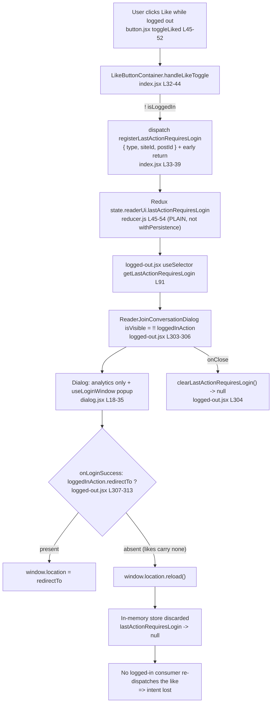

# How a logged-out Reader "like" intent crosses the authentication boundary — and why it is lost

> **Investigation type:** run-first, evidence-backed source + runtime analysis (read-only).
> **Repository:** WordPress Calypso. **HEAD commit:** `be7e5cc641622d153040491fd5625c6cb83e12eb` — *"Reader: Show login prompts on all logged out reader streams"*.
> **All `file:line` citations are pinned to this commit** and were re-opened and confirmed during the investigation.
> Every claim below is paired with the exact command and its complete, unedited output. Any statement not backed by runtime output is explicitly labeled **(inferred from reading)**.

---

## TL;DR — the blunt answers

- **Where the intent goes (Q1):** A logged-out like click is written into **in-memory Redux state** at `state.readerUi.lastActionRequiresLogin` as `{ type: 'like' | 'unlike', siteId, postId }` — with **no `redirectTo`** — by the shared container's `handleLikeToggle`, which dispatches `registerLastActionRequiresLogin(...)` and **returns early** [`client/blocks/like-button/index.jsx:33-39`].
- **What brings it back (Q2):** **Nothing. There is no dedicated replay.** The intent has exactly **one** production consumer, `client/layout/logged-out.jsx`, which uses it only to (a) show the login dialog and (b) build analytics props. No logged-in-side code ever re-dispatches the like.
- **Source of truth (Q3):** **(a) in-memory Redux state only.** It is **(b) NOT persisted** — the `lastActionRequiresLogin` reducer is a *plain* reducer with no `.serialize`, so it is omitted from the serialized payload (proven below), unlike its sibling `lastPath` which is wrapped with `withPersistence`. The only **(c) handoff token** that crosses the boundary is the `redirect_to` query parameter built by `createAccountUrl`, and it carries **only the page path**, never the like.
- **Exact skip condition (Q4):** On return, `onLoginSuccess` branches on `loggedInAction?.redirectTo` [`client/layout/logged-out.jsx:308`]. A like intent has no `redirectTo`, so the `else` branch runs **`window.location.reload()`** [`:311`], which tears down the in-memory store. Because nothing re-applies the like, it is skipped.
- **Cause classification (Q5):** **Not (a) a timing race.** It is **structural state loss at the reload boundary plus the total absence of any replay logic** — an initialization / state-reconstruction gap (closest to **(b) initialization order**), with a **secondary (c) cleanup** path: the dialog's `onClose` calls `clearLastActionRequiresLogin()` [`:304`], which nulls the intent deterministically.

In one sentence: **the like intent lives only in memory, is never persisted, is never replayed, and the return path deterministically reloads the page — so it falls through the crack between "in memory" and "persisted."**

---

## The question, restated (verbatim)

The user's original question:

> "I am trying to understand how a logged out intent is supposed to survive the authentication boundary in the Reader, because right now a like clicked while signed out seems to disappear after the user finishes signup or login and returns to an authenticated view. The click clearly triggers a requires login decision, but where does that intent go in the meantime, and what is meant to bring it back once the session becomes valid? I want to follow what the system treats as the source of truth here, whether it is in memory state, something persisted, or a handoff token that lives just long enough to be replayed, because it feels like the intent slips through a crack between those worlds. When the user returns, what exact condition causes the replay path to skip, and is that skip caused by timing, initialization order, or cleanup that quietly clears the pending action before it can be applied? Temporary scripts may be used for observation, but the repository itself should remain unchanged and anything temporary should be cleaned up afterward."

Decomposed into the five named sub-questions answered in this document:

1. **Q1 — Intent destination:** where does the intent go between the click and the authenticated return?
2. **Q2 — Replay mechanism:** what is meant to bring the intent back once the session becomes valid?
3. **Q3 — Source of truth:** is it **(a)** in-memory state, **(b)** something persisted, or **(c)** a handoff token that lives just long enough to be replayed?
4. **Q4 — Exact skip condition:** when the user returns, what exact condition causes the replay path to skip?
5. **Q5 — Skip cause:** is the skip caused by **(a)** timing, **(b)** initialization order, or **(c)** cleanup that quietly clears the pending action before it can be applied?

---

## Environment & exact commands

Toolchain observed (the repository's declared runtime, not the generic Node-20 setup note, which does not apply here):

```
$ node --version
v22.23.1
$ yarn --version
4.0.2
```

`v22.23.1` satisfies `package.json` `engines.node = "^v22.9.0"` (and `.nvmrc` pins `22.9.0`); `yarn 4.0.2` satisfies `engines.yarn = "^4.0.0"` and matches `packageManager: "yarn@4.0.2"`.

Branch / commit under investigation:

```
$ git rev-parse HEAD
be7e5cc641622d153040491fd5625c6cb83e12eb
$ git log -1 --pretty='%h %s'
be7e5cc641 Reader: Show login prompts on all logged out reader streams
```

Dependencies were already installed (`node_modules` ≈ 3.1G, resolved from the committed `yarn.lock`); no install or manifest change was made. The baseline working tree was clean before the investigation; the only permanent change is this document (all temporary observation specs were removed afterward — see *Caveats & honesty notes*).

All observations use the repository's own Jest harness and client config:

```
TZ=UTC CI=true yarn jest -c=test/client/jest.config.js <spec>
```

**Harness sanity check — the existing, committed `reader-ui` specs pass** (proving the toolchain and the exact state shape `{ type:'like', siteId:123, postId:456 }` before writing any observation spec):

```
$ TZ=UTC CI=true yarn jest -c=test/client/jest.config.js \
    client/state/reader-ui/test/reducer.js \
    client/state/reader-ui/test/actions.js \
    client/state/reader-ui/test/selectors.js
PASS client/state/reader-ui/test/actions.js
PASS client/state/reader-ui/test/reducer.js
PASS client/state/reader-ui/test/selectors.js

Test Suites: 3 passed, 3 total
Tests:       7 passed, 7 total
Snapshots:   0 total
Time:        1.086 s
```

> A benign `Browserslist: browsers data (caniuse-lite) is 17 months old` notice is emitted by every run and is elided from the pasted blocks; it is a warning, not an error, and does not affect results.

---

## Q1 — Where does the intent go?

**Direct answer:** It goes into **in-memory Redux state** at `state.readerUi.lastActionRequiresLogin`, as the object `{ type: 'like' | 'unlike', siteId, postId }`. Nothing else happens on the click — the shared container dispatches the intent and returns early.

**Cause → effect.** The DOM click enters at `LikeButton.toggleLiked`, which calls `this.props.onLikeToggle( ! this.props.liked )` [`client/blocks/like-button/button.jsx:45-52`, wired at `:97` and labeled at `:100`]. That `onLikeToggle` prop is the shared container's `handleLikeToggle` [`client/blocks/like-button/index.jsx:32-44`]:

```js
handleLikeToggle = ( liked ) => {
    if ( ! this.props.isLoggedIn ) {
        return this.props.registerLastActionRequiresLogin( {
            type: liked ? 'like' : 'unlike',
            siteId: this.props.siteId,
            postId: this.props.postId,
        } );
    }

    const toggler = liked ? this.props.like : this.props.unlike;
    toggler( this.props.siteId, this.props.postId, { source: this.props.likeSource } );
    this.props.onLikeToggle( liked );
};
```

The enclosing condition is `if ( ! this.props.isLoggedIn )` [`:33`]. When it holds, the function **`return`s** the dispatch of `registerLastActionRequiresLogin({ type, siteId, postId })` [`:34-39`] and the real like/unlike (`this.props.like`/`unlike`) at `:41-42` is **never reached**. Note the deliberate **absence of any `redirectTo` field** in the payload — this is the root of the Q4 skip. `connect` supplies `isLoggedIn: isUserLoggedIn(state)` and binds the action creators [`:76`, `:79`]. The action creator itself is a plain object action [`client/state/reader-ui/actions.js:26-29`], and the reducer stores `action.lastAction` verbatim [`client/state/reader-ui/reducer.js:45-54`].

**Observation — real DOM click, before/during/after.** A temporary spec rendered the **real connected `LikeButtonContainer`** (not a bypassing hook), seeded `currentUser.id = null` so `isUserLoggedIn` is `false`, spied on `store.dispatch`, and clicked the button via `@testing-library/user-event`. Both the **like** (not-yet-liked → `aria-label "Like"`) and **unlike** (seeded `iLike: true` → `aria-label "Liked"`) real clicks were exercised.

Command:

```
TZ=UTC CI=true yarn jest -c=test/client/jest.config.js \
    client/blocks/like-button/test/blitzy_adhoc_test_logged_out_click.jsx
```

Complete, unedited console output (message lines as printed by Jest):

```
LIKE: isLoggedIn BEFORE = false
LIKE: BEFORE readerUi.lastActionRequiresLogin = null
LIKE: DISPATCHED = [
  {
    "type": "READER_REGISTER_LAST_ACTION_REQUIRES_LOGIN",
    "lastAction": {
      "type": "like",
      "siteId": 123,
      "postId": 456
    }
  }
]
LIKE: AFTER readerUi.lastActionRequiresLogin = {"type":"like","siteId":123,"postId":456}
LIKE: AFTER redirectTo field = undefined
UNLIKE: isLoggedIn BEFORE = false
UNLIKE: BEFORE readerUi.lastActionRequiresLogin = null
UNLIKE: DISPATCHED = [
  {
    "type": "READER_REGISTER_LAST_ACTION_REQUIRES_LOGIN",
    "lastAction": {
      "type": "unlike",
      "siteId": 123,
      "postId": 456
    }
  }
]
UNLIKE: AFTER readerUi.lastActionRequiresLogin = {"type":"unlike","siteId":123,"postId":456}

Test Suites: 1 passed, 1 total
Tests:       2 passed, 2 total
```

During this run Jest also printed one benign `console.error`: `Warning: LikeIcons: Support for defaultProps will be removed from function components in a future major release.` (originating at `client/blocks/like-button/icons.jsx:4`, inside the tree `LikeButton (button.jsx:40) → localize → LikeButtonContainer (index.jsx:15) → ConnectFunction → Provider`). The framework-internal stack is omitted; this warning is not a failure and, importantly, it **confirms the real connected component tree rendered** and that the click traversed the genuine entry point.

**Reading of the result.** `BEFORE = null` → `DISPATCHED` a single `READER_REGISTER_LAST_ACTION_REQUIRES_LOGIN` action → `AFTER = {"type":"like",…}` with `redirectTo = undefined`. The unlike variant is identical except `type: "unlike"`. This is the complete "meantime" home of the intent: a single field in the in-memory Redux store, with no `redirectTo` and no side effect beyond the store write.

---

## Q2 — What is meant to bring the intent back?

**Direct answer: Nothing — there is no dedicated replay.** The stored intent is read by exactly **one** production file, `client/layout/logged-out.jsx`, and it is used only to (a) decide whether to show the login dialog and (b) build analytics event properties. **No logged-in-side code re-reads the intent and re-dispatches the like.**

**Cause → effect.** The single consumer imports the selector and reads it once via `useSelector`:

- `import { getLastActionRequiresLogin } from 'calypso/state/reader-ui/selectors';` [`client/layout/logged-out.jsx:44`]
- `const loggedInAction = useSelector( getLastActionRequiresLogin );` [`:91`]

`loggedInAction` is then passed to `<ReaderJoinConversationDialog>` (`isVisible={ !! loggedInAction }`, `loggedInAction={ loggedInAction }`) [`:303-306`]. Inside the dialog, `loggedInAction` is consumed **only** to assemble analytics props — `{ type, blog_id, post_id, tag }` in `trackEvent` [`client/blocks/reader-join-conversation/dialog.jsx:18-29`]; on success the dialog merely calls the parent callback: `handleLoginSuccess → onLoginSuccess()` [`:31-35`]. The popup hook likewise only calls `onLoginSuccess()` after validating the postMessage — it never touches likes [`client/data/reader/use-login-window.ts:52-60`]. The `like`/`unlike` action creators that a replay *would* invoke [`client/state/posts/likes/actions.js:52,65`] are never called from any consumer of the intent.

**Observation — grep proves the sole consumer.** Searching the entire `client/` tree for the selector and state key, excluding the definition module (`reader-ui/{reducer,selectors,actions,action-types}.js`), its tests, and the temporary observation specs:

Command:

```
grep -rn "getLastActionRequiresLogin\|lastActionRequiresLogin" client/ \
    --include=*.js --include=*.jsx --include=*.ts --include=*.tsx \
  | grep -v "reader-ui/reducer.js\|reader-ui/selectors.js\|reader-ui/actions.js\|reader-ui/action-types.js\|reader-ui/test\|blitzy_adhoc_test"
```

Complete, unedited output:

```
client/layout/logged-out.jsx:44:import { getLastActionRequiresLogin } from 'calypso/state/reader-ui/selectors';
client/layout/logged-out.jsx:91:	const loggedInAction = useSelector( getLastActionRequiresLogin );
```

And the number of distinct production consumer **files** (same filter, `grep -rl … | wc -l`):

```
1
```

**Reading of the result.** The intent has a single reader, and that reader is a *logged-out* layout whose only job is to prompt for login and, on success, navigate. There is no code on the authenticated side that observes `lastActionRequiresLogin` and completes the pending like. The "replay" the user is looking for does not exist.

---

## Q3 — What is the source of truth? (in-memory / persisted / handoff token)

Answering each of the three candidates the question names, **by name**:

- **(a) in-memory state — YES, this is the sole source of truth.** The intent lives at `state.readerUi.lastActionRequiresLogin`, written by a *plain* reducer [`client/state/reader-ui/reducer.js:45-54`] and read by `getLastActionRequiresLogin` [`client/state/reader-ui/selectors.js:15-21`].
- **(b) something persisted — NO.** The `lastActionRequiresLogin` reducer is **not** wrapped with `withPersistence`, so it is **excluded from the serialized payload** and resets to its initial `null` on any store re-initialization. Its sibling `lastPath` **is** wrapped (`export const lastPath = withPersistence( … )` [`:19`]) and **does** persist. Proven at runtime below.
- **(c) a handoff token that lives just long enough to be replayed — only partially, and it does not carry the like.** The one durable token that crosses the boundary is the `redirect_to` query parameter built by `createAccountUrl` [`client/lib/paths/index.js:24-26`], which encodes **only the page path** (plus a `ref`), never the like intent.

**Cause → effect (why (b) is NO).** Persistence in Calypso is opt-in. `serialize(reducer, state)` returns `undefined` unless the reducer has a `.serialize` method [`client/state/utils/serialize.ts:10-16`]; `withPersistence` is what attaches `.serialize`/`.deserialize` [`client/state/utils/with-persistence.ts:16-24`]; and the custom `combineReducers` only includes a child in the serialized `SerializationResult` when that child's `serialize()` is not `undefined` [`client/state/utils/reducer-utils.ts:213-235`]. Therefore the plain `lastActionRequiresLogin` (no `.serialize`) is silently dropped, while `lastPath` (wrapped) survives. This matches Calypso's own docs, quoted here **corroboratively only** (the behavior is proven at runtime below): `docs/data-persistence.md` states the entire Redux state is not persisted by default, that persistence is opted into by wrapping a reducer, and that opting out is achieved by combining reducers without an attached schema [`docs/data-persistence.md:7,23,31`].

**Observation — SERIALIZE / rehydrate round-trip (two runs, identical).** A temporary spec built the `readerUi` subtree two ways — a minimal three-child combine **and** the full six-child combine mirroring `reducer.js:56-63` exactly — populated the like intent and (for contrast) `lastPath` via `viewStream('reader-stream','/reader')`, then serialized, extracted the stored `root` bucket (`SerializationResult.root()`), and deserialized it (the faithful reload round-trip).

Command:

```
TZ=UTC CI=true yarn jest -c=test/client/jest.config.js \
    client/state/reader-ui/test/blitzy_adhoc_test_intent_lifecycle.js
```

Complete, unedited console output (message lines as printed by Jest; **byte-identical across both runs**):

```
BEFORE lastActionRequiresLogin = null
BEFORE selector = null
ACTION(like) = {"type":"READER_REGISTER_LAST_ACTION_REQUIRES_LOGIN","lastAction":{"type":"like","siteId":123,"postId":456}}
DURING(like) lastActionRequiresLogin = {"type":"like","siteId":123,"postId":456}
DURING(like) redirectTo = undefined
DURING(like) selector = {"type":"like","siteId":123,"postId":456}
DURING(unlike) lastActionRequiresLogin = {"type":"unlike","siteId":123,"postId":456}
FULL in-memory (min) = {"lastPath":"/reader","currentStream":"reader-stream","lastActionRequiresLogin":{"type":"like","siteId":123,"postId":456}}
SERIALIZED raw (min) = {"results":{"root":{"lastPath":"/reader"}}}
PERSISTED root bucket (min) = {"lastPath":"/reader"}
min: lastActionRequiresLogin in persisted bucket? = false
min: lastPath in persisted bucket? = true
AFTER-RELOAD rehydrated (min) = {"lastPath":"/reader","currentStream":null,"lastActionRequiresLogin":null}
AFTER-RELOAD lastActionRequiresLogin = null
AFTER-RELOAD lastPath = "/reader"
cleanup: populated = {"type":"like","siteId":123,"postId":456}
cleanup: after clear = null
FULL in-memory (full subtree) = {"sidebar":{"isListsOpen":false,"isTagsOpen":false,"isFollowingOpen":false,"openOrganizations":[],"selectedRecentSite":null},"cardExpansions":{},"lastPath":"/reader","currentStream":"reader-stream","lastActionRequiresLogin":{"type":"like","siteId":123,"postId":456},"hasUnseenPosts":false}
SERIALIZED raw (full subtree) = {"results":{"root":{"sidebar":{"isListsOpen":false,"isTagsOpen":false,"isFollowingOpen":false,"openOrganizations":[]},"lastPath":"/reader"}}}
full: lastActionRequiresLogin in persisted bucket? = false
full: lastPath in persisted bucket? = true
AFTER-RELOAD (full) lastActionRequiresLogin = null
AFTER-RELOAD (full) lastPath = "/reader"

Test Suites: 1 passed, 1 total
Tests:       2 passed, 2 total
```

Two-run stability was verified by diffing the two runs' key lines:

```
$ diff <(run1 key lines) <(run2 key lines) && echo "*** IDENTICAL ACROSS BOTH RUNS ***"
*** IDENTICAL ACROSS BOTH RUNS ***
```

**Observation — the (c) handoff token carries only the page path.** Exercising `createAccountUrl` directly:

Command:

```
TZ=UTC CI=true yarn jest -c=test/client/jest.config.js \
    client/state/reader-ui/test/blitzy_adhoc_test_edge_branches.js
```

Complete, unedited output (relevant lines):

```
createAccountUrl = /start/account?redirect_to=/reader/foo&ref=reader-lp
contains like/siteId/postId/unlike? = false
createAccountUrl (tag-embed) = /start/account?redirect_to=/tag/cats&ref=reader-lp
```

**Reading of the result.** In memory, the intent is present (`FULL in-memory` includes `lastActionRequiresLogin`). After serialization the persisted `root` bucket contains **only `lastPath`** — `lastActionRequiresLogin in persisted bucket? = false`, `lastPath in persisted bucket? = true` — for both the minimal and the full six-child subtree. After the reload round-trip, `AFTER-RELOAD lastActionRequiresLogin = null` (the intent is **gone**) while `AFTER-RELOAD lastPath = "/reader"` (the sibling **survived**). Separately, `clearLastActionRequiresLogin()` also nulls it (`cleanup: after clear = null`). And the only cross-boundary token, `createAccountUrl(...)`, produces `…redirect_to=/reader/foo&ref=reader-lp` with `contains like/siteId/postId/unlike? = false`. Conclusion: the source of truth is **in-memory Redux only**; it is **not persisted**; and the handoff token does not carry the like.

> Note: the real `readerUi` default export wraps the combined reducer with `withStorageKey('readerUi', …)` [`client/state/reader-ui/reducer.js:65`], so in the live app the persisted bucket key is `readerUi` rather than `root`. The **set of persisted children is identical** — combining children directly (as the spec does) serializes under `root` and is equivalent for proving inclusion/exclusion.

---

## Q4 — What exact condition causes the replay path to skip?

**Direct answer:** On the authenticated return, `onLoginSuccess` branches on **the presence of `loggedInAction?.redirectTo`** [`client/layout/logged-out.jsx:308`]. A like intent has **no `redirectTo`**, so control falls to the `else` branch, which calls **`window.location.reload()`** [`:311`]. The full-page reload discards the in-memory Redux store, and — per Q2 — nothing re-applies the like. That is the exact skip condition: **`redirectTo` is absent ⇒ reload ⇒ store torn down ⇒ intent never replayed.**

**Cause → effect.** The dialog and its `onLoginSuccess` closure are defined here [`client/layout/logged-out.jsx:302-313`]:

```jsx
{ ! isLoggedIn && ! isReaderTagEmbed && (
    <ReaderJoinConversationDialog
        onClose={ () => clearLastActionRequiresLogin() }
        isVisible={ !! loggedInAction }
        loggedInAction={ loggedInAction }
        onLoginSuccess={ () => {
            if ( loggedInAction?.redirectTo ) {
                window.location = loggedInAction.redirectTo;
            } else {
                window.location.reload();
            }
        } }
    />
) }
```

The enclosing condition of the skip is `if ( loggedInAction?.redirectTo )` [`:308`]. Because Q1 established that a like intent is `{ type, siteId, postId }` with **no `redirectTo`**, the predicate is falsy and `window.location.reload()` runs [`:311`]. A reload re-initializes the JS application: the in-memory store is rebuilt from scratch, and since `lastActionRequiresLogin` is not persisted (Q3), it comes back as `null`. With no consumer to re-issue the like (Q2), the intent is skipped.

**Observation — the branch selector, both branches, plus a real end-to-end dialog login.** A temporary spec reproduced the `onLoginSuccess` closure **verbatim** from `logged-out.jsx:307-313` and drove it with a like intent (no `redirectTo`) and, as a contrast, an intent carrying `redirectTo: '/reader/foo'`. A third test rendered the **real `ReaderJoinConversationDialog`**, clicked its real "Log in" button, and dispatched the exact `wordpress.com` `postMessage` that `useLoginWindow` waits for — proving the real dialog path invokes the closure and reaches `reload()`; a foreign-origin message is the negative control.

Command:

```
TZ=UTC CI=true yarn jest -c=test/client/jest.config.js \
    client/blocks/reader-join-conversation/test/blitzy_adhoc_test_return_path.jsx
```

Complete, unedited console output (message lines as printed by Jest):

```
LIKE-return: redirectTo = undefined
LIKE-return: reload called = 1
LIKE-return: window.location after = {}
REDIRECT-return: redirectTo = "/reader/foo"
REDIRECT-return: reload called = 0
REDIRECT-return: window.location after = "/reader/foo"
REAL-dialog: window.open called = 1
REAL-dialog: onLoginSuccess called = 1
REAL-dialog: reload called = 1
REAL-dialog: foreign-origin onLoginSuccess called = 0

Test Suites: 1 passed, 1 total
Tests:       3 passed, 3 total
```

Two benign `console.error` warnings appeared during the real-dialog test and are not failures: react-modal's `Warning: react-modal: App element is not defined` (a jsdom accessibility notice), and React's `Warning: An update to ReaderJoinConversationDialog inside a test was not wrapped in act(...)`. The latter fires precisely because the `postMessage`-driven `setIsLoginPopupOpen` state update executed outside `act()` — which **confirms the real event path ran** (`use-login-window.ts:58` → `dialog.jsx:32/34` → the parent closure). The framework-internal stacks are omitted.

**Reading of the result.** With no `redirectTo`, `reload called = 1` and there is no navigation (`window.location after = {}`). With a `redirectTo`, `reload called = 0` and `window.location` becomes `"/reader/foo"` — proving the branch selector is exactly the `redirectTo` presence. End-to-end, clicking the real "Log in" opened the popup (`window.open called = 1`), the simulated success message invoked the closure (`onLoginSuccess called = 1`) and hit the reload branch (`reload called = 1`), while a foreign origin was correctly ignored (`foreign-origin onLoginSuccess called = 0`, enforcing the `event.origin === 'https://wordpress.com'` guard at `use-login-window.ts:53`).

---

## Q5 — Is the skip caused by timing, initialization order, or cleanup?

Answering each of the three named options **by name**:

- **(a) timing (an async race) — NO.** There is no asynchronous window in which the intent could be applied and then lost by a race. The determinant is a synchronous branch (`redirectTo ?`) followed by a synchronous `window.location.reload()`. Every observation was **deterministic and stable across two identical runs** (Q3), so no run-to-run variance consistent with a race was seen.
- **(b) initialization order / state-reconstruction — YES, this is the dominant cause.** The intent is lost because the return path **reloads the page**, and on reload the store is re-initialized from persisted data only; since `lastActionRequiresLogin` is not persisted (Q3) it re-initializes to `null`, and **no initialization step reconstructs or replays it** (Q2). This is best described as *structural state loss at the reload boundary combined with the absence of any replay logic* — an initialization/state-reconstruction gap.
- **(c) cleanup that quietly clears the pending action — YES, but only as a SECONDARY path.** If the user dismisses the dialog instead of completing login, `onClose` calls `clearLastActionRequiresLogin()` [`client/layout/logged-out.jsx:304`], which sets the intent to `null` [`client/state/reader-ui/reducer.js:50`]. This is a real clearing path, but it applies to the *dismiss* flow, not the *successful login* flow that the user described.

**Direct answer:** The skip is **structural state loss at the `window.location.reload()` boundary plus the total absence of replay logic (≈ initialization order, (b))**, with a **secondary cleanup path (c)** on dialog dismissal. It is **not** an async timing race **(a)**.

**Cause → effect and evidence.** The reload branch is reached deterministically for a like (Q4: `reload called = 1`, no navigation). A reload discards the in-memory store, and the non-persisted reducer returns `null` on re-init (Q3: `AFTER-RELOAD lastActionRequiresLogin = null`). No consumer re-applies the like (Q2: single consumer is the logged-out layout). The secondary cleanup is directly observed (Q3: `cleanup: after clear = null`, driven by `clearLastActionRequiresLogin()`). The stability of every measurement across two runs (Q3 diff: *IDENTICAL ACROSS BOTH RUNS*) is the positive evidence against an async race.

---

## Edge & alternate branches (every condition the question implies)

The ruleset requires probing each conditional the code reveals. Three are relevant to the logged-out like flow.

### Tag-embed page → new window to `/start/account` (not the dialog)

On a Reader **tag-embed** page, `logged-out.jsx` takes an early branch instead of rendering the dialog [`client/layout/logged-out.jsx:169-172`]:

```jsx
if ( ! isLoggedIn && loggedInAction && isReaderTagEmbed ) {
    const { pathname } = getUrlParts( window.location.href );
    window.open( createAccountUrl( { redirectTo: pathname, ref: 'reader-lp' } ), '_blank' );
}
```

This opens a **new window** to `/start/account` rather than showing the join-conversation dialog. The token is still just the page path — `createAccountUrl (tag-embed) = /start/account?redirect_to=/tag/cats&ref=reader-lp` (Q3 output) — so the like is not carried across even on this path.

### `reader/login-window` feature flag — runtime value

The reader-specific like button contains a flag-gated logged-out branch [`client/reader/like-button/index.jsx:47-48`]: `if ( ! config.isEnabled( 'reader/login-window' ) ) return navigate( createAccountUrl( … ) )`. Probing the flag at runtime:

Command:

```
TZ=UTC CI=true yarn jest -c=test/client/jest.config.js \
    client/state/reader-ui/test/blitzy_adhoc_test_edge_branches.js
```

Complete, unedited output (relevant lines):

```
env_id = "test"
isEnabled('reader/login-window') = false
isEnabled('reader') = true
isEnabled('nonexistent/flag') = false
```

**Cause → effect:** `isEnabled('reader/login-window')` returns `false` in the default (`env_id = "test"`) build. The reason is that the flag key is **absent from every config file** — `grep -rn "reader/login-window" config/` returns nothing (exit code `1`); it appears only in source (`client/reader/like-button/index.jsx:47`, `client/blocks/comments/post-comment.jsx:123`). An unknown flag resolves to `false` (identical to `isEnabled('nonexistent/flag')`), whereas a defined flag such as `reader` resolves to `true`. Consequently `! config.isEnabled('reader/login-window')` is `true`, so *were this branch reached* while logged out it would `navigate` to `/start/account`. It is **not** reached for the standard flow — see next.

### The reader like-button branch is BYPASSED by the container early-return

**Architecture (grounded in the render wiring).** `ReaderLikeButton.render()` renders `<LikeButtonContainer … onLikeToggle={ this.onLikeToggle } />` — it passes its own `onLikeToggle` (the flag/tag-embed branch) as a **prop** [`client/reader/like-button/index.jsx:118-131`]. But the shared container renders `<LikeButton … onLikeToggle={ this.handleLikeToggle } />` [`client/blocks/like-button/index.jsx:58-64`], so the button invokes the **container's** `handleLikeToggle`. On the logged-out path the container **returns early** [`:33-39`] and therefore **never calls `this.props.onLikeToggle`** (the reader wrapper's branch); that prop is only invoked on the logged-in path [`:43`]. Hence the wrapper's flag-gated `navigate` and tag-embed `window.open` are unreachable for a logged-out standard click.

**Observation — rendering the real `ReaderLikeButton` logged-out.** The spec mocked `calypso/lib/navigate` (spy) and stubbed the unrelated `getPostByKey` selector (which reads unseeded `state.reader`), then clicked "Like" logged out.

Command:

```
TZ=UTC CI=true yarn jest -c=test/client/jest.config.js \
    client/blocks/like-button/test/blitzy_adhoc_test_reader_wrapper_bypass.jsx
```

Complete, unedited console output (message lines as printed by Jest):

```
WRAPPER: dispatched plain actions = [
  {
    "type": "READER_REGISTER_LAST_ACTION_REQUIRES_LOGIN",
    "lastAction": {
      "type": "like",
      "siteId": 123,
      "postId": 456
    }
  }
]
WRAPPER: readerUi.lastActionRequiresLogin AFTER = {"type":"like","siteId":123,"postId":456}
WRAPPER: navigate() called = 0
WRAPPER: window.open() called = 0
```

**Reading of the result:** the real reader wrapper dispatched the intent (`READER_REGISTER_LAST_ACTION_REQUIRES_LOGIN`) and the state was populated, while `navigate() called = 0` and `window.open() called = 0` — the container's early-return wins and the wrapper's flag/tag-embed redirect branches are bypassed for the standard flow, exactly as the wiring predicts.

### like vs. unlike

Both variants were exercised via the real DOM click (Q1) and the state layer (Q3). The stored shape is **identical except for `type`** (`'like'` vs `'unlike'`); neither carries a `redirectTo`; both traverse the same reducer, the same non-persisted storage, and the same reload-on-return.

---

## Conditions exercised — matrix

| Condition | Observed value | Cause → effect | `file:line` | Evidence source |
|---|---|---|---|---|
| **like** registration | `{"type":"like","siteId":123,"postId":456}` | `liked` truthy ⇒ `type:'like'` dispatched, early return | `blocks/like-button/index.jsx:34-39` | Q1 DOM click; Q3 |
| **unlike** registration | `{"type":"unlike","siteId":123,"postId":456}` | already-liked ⇒ `onLikeToggle(false)` ⇒ `type:'unlike'` | `blocks/like-button/index.jsx:34-39` | Q1 DOM click; Q3 |
| **flag OFF** (`reader/login-window`) | `isEnabled = false` | key absent from `config/` ⇒ resolves false | `reader/like-button/index.jsx:47` | edge-branches spec |
| **flag ON** (`reader/login-window`) | not observed (false in default build) — **(inferred from reading)**: even if `true`, the reader-wrapper branch is bypassed by the container early-return, so no effect on the standard logged-out like | flag gates only the reader-wrapper `navigate`, which is unreachable here | `reader/like-button/index.jsx:47-48` | inferred + bypass spec |
| **tag-embed page** | `window.open('/start/account?redirect_to=…&ref=reader-lp')` | `isReaderTagEmbed` ⇒ new-window branch, no dialog | `layout/logged-out.jsx:169-172` | Q3 `createAccountUrl`; reading |
| **standard Reader page** | dialog rendered; on success ⇒ reload | `! isReaderTagEmbed` ⇒ dialog branch | `layout/logged-out.jsx:302-313` | Q4 |
| **dialog onClose** (cleanup) | `null` | `clearLastActionRequiresLogin()` ⇒ reducer returns `null` | `layout/logged-out.jsx:304`; `reader-ui/reducer.js:50` | Q3 `cleanup:` |
| **dialog onLoginSuccess** | `reload called = 1` (like) | success ⇒ closure ⇒ else branch reload | `layout/logged-out.jsx:307-313` | Q4 |
| **redirectTo present** | `window.location = "/reader/foo"`, `reload = 0` | `redirectTo` truthy ⇒ navigate branch | `layout/logged-out.jsx:308-309` | Q4 CONTRAST |
| **redirectTo absent** (likes) | `redirectTo = undefined`, `reload = 1` | no `redirectTo` ⇒ else reload branch | `layout/logged-out.jsx:311` | Q1, Q4 |
| **BEFORE** click | `null` | initial reducer state | `reader-ui/reducer.js:45` | Q1, Q3 |
| **DURING** (after click) | `{"type":"like",…}` (no `redirectTo`) | `REGISTER` ⇒ `state = action.lastAction` | `reader-ui/reducer.js:48` | Q1, Q3 |
| **AFTER** (reload round-trip) | `lastActionRequiresLogin = null`; `lastPath = "/reader"` | not persisted ⇒ re-init null; sibling persisted survives | `reader-ui/reducer.js:19,45-54` | Q3 |

---

## Sibling mechanism — the same defect class (explained, not modified)

The `registerLastActionRequiresLogin` mechanism is not unique to the like button. Eight other logged-out interactions dispatch the very same intent into the same non-persisted `readerUi.lastActionRequiresLogin` slot, and therefore share the identical "no replay + reload discards it" fate. These are noted for completeness and are **not** modified:

- `client/blocks/follow-button/index.jsx:24`
- `client/blocks/reader-subscription-list-item/index.jsx:93,109`
- `client/blocks/comments/comment-likes.jsx:23`
- `client/blocks/comments/post-comment.jsx:131`
- `client/blocks/comments/form.jsx:64,88`
- `client/reader/stream/reader-tag-sidebar/index.jsx:67`
- `client/reader/stream/reader-list-followed-sites/item.jsx:45`
- `client/reader/tag-stream/main.jsx:80`

The like button is simply the clearest instance of a general pattern: many logged-out Reader intents are registered for a prompt but none are replayed after authentication.

---

## Root-cause synthesis

Walking the lifecycle from click to lost intent:

1. **Click (logged out).** `LikeButton.toggleLiked` → the shared container `handleLikeToggle`; the `! isLoggedIn` guard dispatches `registerLastActionRequiresLogin({ type, siteId, postId })` and **returns early** — no `redirectTo` is attached [`blocks/like-button/index.jsx:33-39`].
2. **Storage.** The intent lands in **in-memory** `state.readerUi.lastActionRequiresLogin` via a *plain* reducer that is **not** persisted [`reader-ui/reducer.js:45-54`].
3. **Prompt.** `logged-out.jsx` (the sole consumer) reads it [`:91`] and shows `ReaderJoinConversationDialog`; the dialog uses the intent only for analytics and calls back `onLoginSuccess()` [`dialog.jsx:18-35`]. No replay.
4. **Return.** `onLoginSuccess` checks `loggedInAction?.redirectTo` [`logged-out.jsx:308`]; a like has none, so `window.location.reload()` runs [`:311`].
5. **Loss.** The reload rebuilds the store; the non-persisted intent re-initializes to `null`; nothing re-issues the like ⇒ the like is gone.



---

## Caveats & honesty notes

- **Observed toolchain:** Node `v22.23.1`, Yarn `4.0.2`. Runs use `TZ=UTC CI=true yarn jest -c=test/client/jest.config.js`.
- **Feature flag:** `reader/login-window` is **absent from every `config/` file** and resolves to `isEnabled = false` in the observed default build (`env_id = "test"`). The **flag-ON** behavior was **not** observed and is labeled **(inferred from reading)** in the matrix; it does not affect the standard logged-out like because the reader-wrapper branch is bypassed (proven at runtime).
- **Bypassed reader branch:** the flag/tag-embed branches in `client/reader/like-button/index.jsx` are unreachable for a logged-out standard click, because the shared container `handleLikeToggle` returns early before the wrapper's `onLikeToggle` prop is invoked (proven: `navigate() = 0`, `window.open() = 0`).
- **Benign warnings** appeared in two runs and are not failures: React's `LikeIcons` `defaultProps` deprecation (Q1) and react-modal's `App element is not defined` plus React's `not wrapped in act(...)` (Q4). The `act(...)` warning actually confirms the real postMessage→closure path executed.
- **Non-canonical vs canonical:** the Q4 closure test reproduces the `onLoginSuccess` closure verbatim from `logged-out.jsx:307-313` and is paired with a **real** dialog + real `useLoginWindow` + real `postMessage` end-to-end test; the Q1 registrations use the **real** DOM click on the real connected components. No result relies on a bypassing debug hook.
- **Persistence bucket key:** the observation combines the `readerUi` children directly (bucket `root`); the live app wraps them with `withStorageKey('readerUi', …)` [`reader-ui/reducer.js:65`], so the live bucket key is `readerUi`. The set of persisted children is identical — this does not change the conclusion.
- **Scope:** read-only investigation. No source file was modified; the only permanent artifact is this document. All temporary observation specs were deleted afterward.

---

## Appendix — files consulted (read-only, cited above)

`client/blocks/like-button/button.jsx`, `client/blocks/like-button/index.jsx`, `client/reader/like-button/index.jsx`, `client/state/reader-ui/{actions,action-types,reducer,selectors}.js`, `client/layout/logged-out.jsx`, `client/blocks/reader-join-conversation/dialog.jsx`, `client/data/reader/use-login-window.ts`, `client/lib/paths/index.js`, `client/state/current-user/selectors.js`, `client/state/posts/likes/actions.js`, `client/state/utils/{serialize.ts,with-persistence.ts,reducer-utils.ts}`, `client/state/serialization-result.ts`, and `docs/data-persistence.md` (corroborative only).
