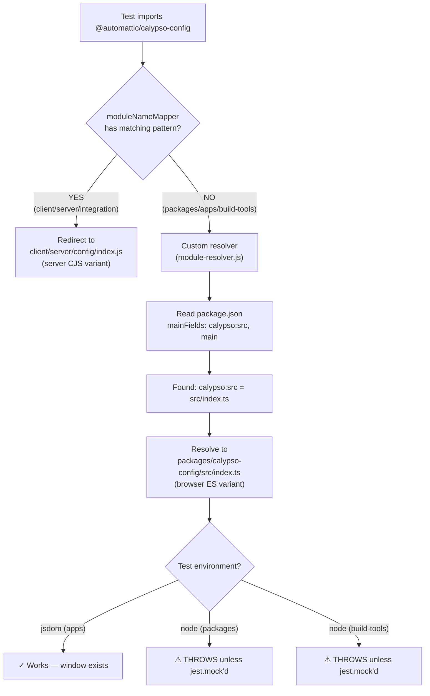
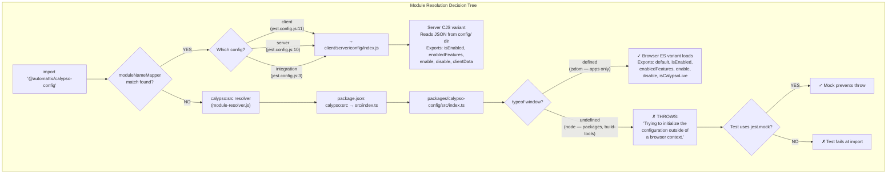
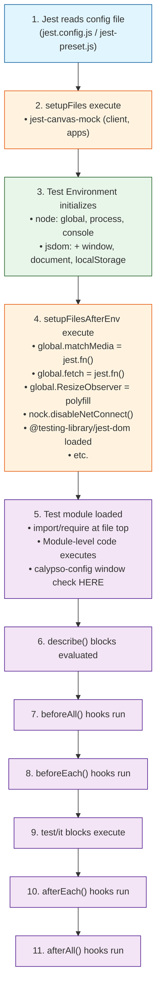
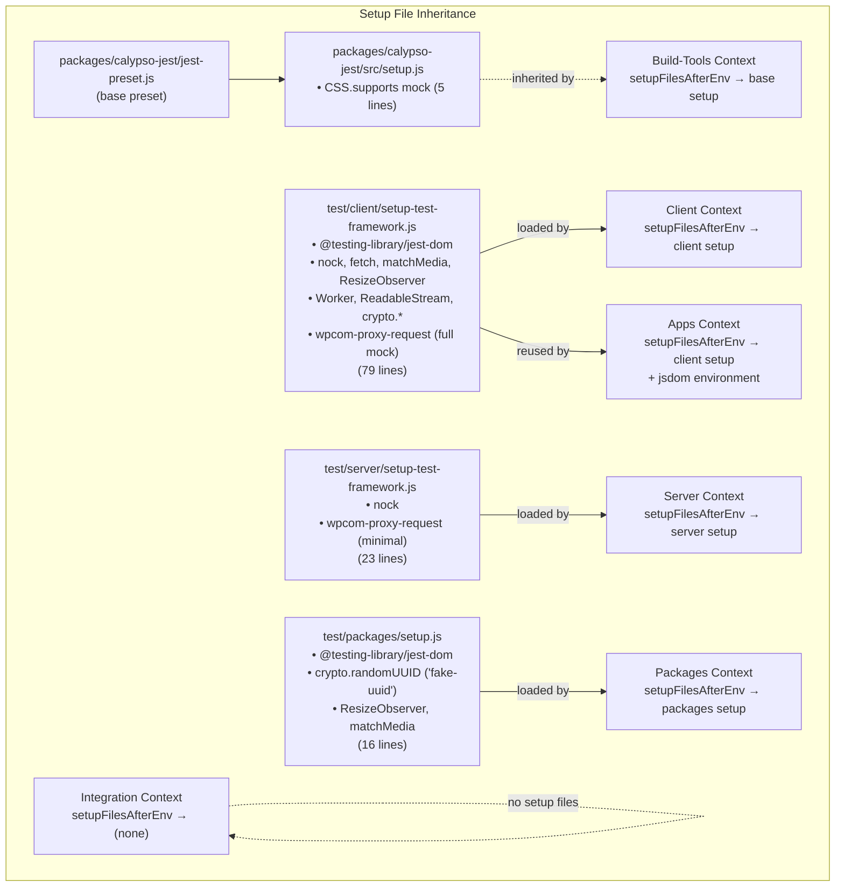

# Calypso Test Runtime Environments: Investigative Analysis

This document comprehensively answers targeted questions about test runtime environments, module resolution behavior, and initialization order across the Calypso monorepo's multiple Jest execution contexts. Every conclusion is grounded in direct code inspection and verified against the actual source files.

---

## Metadata

| Field | Value |
|-------|-------|
| **Date** | 2026-04-09 |
| **Source Branch** | `be7e5cc64162` |
| **Repository** | `wp-calypso` |
| **Methodology** | Code inspection + runtime probe results from temporary test files |
| **Node.js Version** | ^v22.9.0 (Source: `package.json:57`) |
| **Jest Version** | ^29.7.0 |
| **Yarn Version** | ^4.0.0 (Source: `package.json:58`) |

---

## Table of Contents

- [Q1: Test Commands and Their Runtime Environments](#q1-test-commands-and-their-runtime-environments)
  - [Command Inventory](#command-inventory)
  - [Per-Context Deep Dive](#per-context-deep-dive)
  - [Environment Comparison Matrix](#environment-comparison-matrix)
- [Q2: Global API Availability Differences](#q2-global-api-availability-differences)
  - [Browser-Like API Comparison Table](#browser-like-api-comparison-table)
  - [What Provides Each API](#what-provides-each-api)
  - [What Exists in One Context But Not Another](#what-exists-in-one-context-but-not-another)
- [Q3: Internal Package Dependencies and Import Resolution](#q3-internal-package-dependencies-and-import-resolution)
  - [@automattic/data-stores Case Study](#automatticdata-stores-case-study)
  - [calypso:src Resolution Mechanism](#calypsosrc-resolution-mechanism)
  - [Does the Loaded File Differ by Execution Context?](#does-the-loaded-file-differ-by-execution-context)
  - [How Package Tests Handle calypso-config](#how-package-tests-handle-calypso-config)
- [Q4: Import Redirection and Override Tracing](#q4-import-redirection-and-override-tracing)
  - [The calypso-config Redirect Pattern](#the-calypso-config-redirect-pattern)
  - [moduleNameMapper vs calypso:src — Precedence Rule](#modulenamemapper-vs-calypsosrc--precedence-rule)
  - [Same Import, Different Files](#same-import-different-files)
  - [Why the Redirect Exists](#why-the-redirect-exists)
- [Q5: Initialization Order and Browser API Timing](#q5-initialization-order-and-browser-api-timing)
  - [Jest Lifecycle Flowchart](#jest-lifecycle-flowchart)
  - [Probe Results: Module-Load vs beforeAll vs Test-Time](#probe-results-module-load-vs-beforeall-vs-test-time)
  - [When Browser APIs Become Available](#when-browser-apis-become-available)
- [Summary: Root Causes of Context-Dependent Test Behavior](#summary-root-causes-of-context-dependent-test-behavior)

---

## Q1: Test Commands and Their Runtime Environments

### Rationale

To understand the test infrastructure, the first step is identifying every test command available in the monorepo root `package.json`, the Jest configuration file each invokes, and the effective `rootDir` each operates under. The root `package.json` (lines 120–131) defines seven test-related scripts. The aggregator `test` command runs four of them sequentially; the remaining three (`test-apps`, `test-integration`, and their watch variants) must be invoked explicitly.

### Command Inventory

| Command | Script Definition | Jest Config File | Root Directory |
|---------|-------------------|------------------|----------------|
| `test` | `run-s -s test-client test-packages test-server test-build-tools` | *(aggregator — runs four commands sequentially)* | — |
| `test-client` | `TZ=UTC jest -c=test/client/jest.config.js` | `test/client/jest.config.js` | `../../client` → `client/` |
| `test-server` | `jest -c=test/server/jest.config.js` | `test/server/jest.config.js` | `../../client/server` → `client/server/` |
| `test-packages` | `jest -c=test/packages/jest.config.js` | `test/packages/jest.config.js` | `./../../` (repo root); multi-project via `packages/*/jest.config.js` |
| `test-apps` | `jest -c=test/apps/jest.config.js` | `test/apps/jest.config.js` | `./../../` (repo root); multi-project via `apps/*/jest.config.js` |
| `test-build-tools` | `jest -c=test/build-tools/jest.config.js` | `test/build-tools/jest.config.js` | `../../build-tools` → `build-tools/` |
| `test-integration` | `jest -c=test/integration/jest.config.js` | `test/integration/jest.config.js` | `../..` (repo root) |

> **Source:** `package.json:120` (`test`), `:122` (`test-client`), `:131` (`test-server`), `:129` (`test-packages`), `:127` (`test-apps`), `:121` (`test-build-tools`), `:125` (`test-integration`)

**Key observations:**
- The aggregator `test` command does NOT include `test-apps` or `test-integration`. Those must be run separately.
- Only `test-client` sets the `TZ=UTC` environment variable.
- All commands use `jest -c=<config>` to specify their configuration file explicitly.

### Per-Context Deep Dive

#### Client Context

> **Source:** `test/client/jest.config.js`

The client context is the primary test runner for application code under the `client/` directory.

| Setting | Value | Source |
|---------|-------|--------|
| `testEnvironment` | `node` (inherited from base preset) | `packages/calypso-jest/jest-preset.js:11` |
| `rootDir` | `../../client` → `client/` | `test/client/jest.config.js:6` |
| `testEnvironmentOptions` | `{ url: 'https://example.com' }` | `test/client/jest.config.js:17-19` |
| `moduleNameMapper` | `@automattic/calypso-config` → `<rootDir>/server/config/index.js`; `react-markdown` → min.js | `test/client/jest.config.js:10-13` |
| `setupFiles` | `['jest-canvas-mock']` | `test/client/jest.config.js:20` |
| `setupFilesAfterEnv` | `['<rootDir>/../test/client/setup-test-framework.js']` | `test/client/jest.config.js:21` |
| `globals` | `{ google: {}, __i18n_text_domain__: 'default' }` | `test/client/jest.config.js:22-25` |
| Custom resolver | `packages/calypso-jest/src/module-resolver.js` | inherited from `packages/calypso-jest/jest-preset.js:9` |
| `transformIgnorePatterns` | `['node_modules[\\/\\\\](?!.*\\.(?:gif|jpg|jpeg|png|svg|scss|sass|css)$)']` | `test/client/jest.config.js:14-16` |
| Transform | `babel-jest` with `{ rootMode: 'upward' }` | inherited from `packages/calypso-jest/jest-preset.js:14` |
| `testPathIgnorePatterns` | `['<rootDir>/server/']` | `test/client/jest.config.js:8` |

**Notable:** The client config spreads the `@automattic/calypso-jest` base preset (line 5: `...base`), which provides the custom `calypso:src` resolver, the `node` test environment, `babel-jest` transform, and the base `CSS.supports` mock via `setupFilesAfterEnv`. However, the client config *overrides* `setupFilesAfterEnv` with its own richer setup file, replacing the base preset's `CSS.supports`-only setup.

#### Server Context

> **Source:** `test/server/jest.config.js`

The server context tests code under `client/server/` — the Node.js SSR and API layer.

| Setting | Value | Source |
|---------|-------|--------|
| `testEnvironment` | `node` (inherited from base preset) | `packages/calypso-jest/jest-preset.js:11` |
| `rootDir` | `../../client/server` → `client/server/` | `test/server/jest.config.js:7` |
| `moduleNameMapper` | Two patterns: `@automattic/calypso-config` → `calypso/server/config`, subpath `@automattic/calypso-config/(.*)` → `calypso/server/config/$1` | `test/server/jest.config.js:9-12` |
| `setupFilesAfterEnv` | `[require.resolve('./setup-test-framework.js')]` | `test/server/jest.config.js:13` |
| `setupFiles` | *(none)* | — |
| `globals` | *(none overridden)* | — |
| `testEnvironmentOptions` | *(none)* | — |

**Notable:** The server context has no `setupFiles`, no `globals` override, and no `testEnvironmentOptions`. Its `moduleNameMapper` uses the `calypso` package name (the workspace name of the `client/` package from `client/package.json`) rather than `<rootDir>`, so `calypso/server/config` resolves to `client/server/config/index.js`.

#### Packages Context

> **Source:** `test/packages/jest.config.js` + `test/packages/jest-preset.js`

The packages context is a multi-project coordinator that discovers and runs tests from every package in the `packages/` directory.

| Setting | Value | Source |
|---------|-------|--------|
| Coordinator | `projects: ['<rootDir>/packages/*/jest.config.js']` | `test/packages/jest.config.js:4` |
| Per-package preset | `preset: '../../test/packages/jest-preset.js'` | e.g., `packages/data-stores/jest.config.js:2` |
| `testEnvironment` | `node` (inherited from base preset) | `packages/calypso-jest/jest-preset.js:11` |
| `globals` | `{ __i18n_text_domain__: 'default' }` | `test/packages/jest-preset.js:11-12` |
| `setupFilesAfterEnv` | `['<rootDir>../../test/packages/setup.js']` | `test/packages/jest-preset.js:14` |
| Coordinator `moduleNameMapper` | `react-markdown` → min.js (NO calypso-config redirect) | `test/packages/jest.config.js:5-7` |

**CRITICAL:** There is no `moduleNameMapper` entry for `@automattic/calypso-config` in the packages preset. This means calypso-config resolves via the `calypso:src` custom resolver to `packages/calypso-config/src/index.ts` — the browser variant that throws an error if `window` is undefined (line 17 of that file). Package tests that import calypso-config must mock it or use the `@jest-environment jsdom` docblock.

#### Apps Context

> **Source:** `test/apps/jest.config.js` + `test/apps/jest-preset.js`

The apps context is a multi-project coordinator for the `apps/` directory. It is **the only context that uses jsdom**.

| Setting | Value | Source |
|---------|-------|--------|
| Coordinator | `projects: ['<rootDir>/apps/*/jest.config.js']` | `test/apps/jest.config.js:4` |
| `testEnvironment` | **`'jsdom'`** | `test/apps/jest-preset.js:7` |
| `setupFiles` | `['jest-canvas-mock']` | `test/apps/jest-preset.js:11` |
| `setupFilesAfterEnv` | `[require.resolve('../client/setup-test-framework.js')]` — **reuses the client setup** | `test/apps/jest-preset.js:13` |
| `transformIgnorePatterns` | `['node_modules[\\/\\\\](?!.*\\.(?:gif|jpg|jpeg|png|svg|scss|sass|css)$)']` | `test/apps/jest-preset.js:8-10` |

**Notable:** The apps context reuses the full client setup file (`test/client/setup-test-framework.js`), inheriting all browser API mocks. Combined with the `jsdom` environment, this provides the richest API surface of all contexts: real `window`/`document` from jsdom, plus all the mocks/polyfills from the client setup. No `moduleNameMapper` for `@automattic/calypso-config`, but since jsdom provides `window`, the browser variant of calypso-config can load successfully.

#### Build-Tools Context

> **Source:** `test/build-tools/jest.config.js`

The build-tools context is the **most minimal** test environment.

| Setting | Value | Source |
|---------|-------|--------|
| Base preset | `@automattic/calypso-jest` (spread directly) | `test/build-tools/jest.config.js:4-5` |
| `rootDir` | `../../build-tools` → `build-tools/` | `test/build-tools/jest.config.js:7` |
| `testEnvironment` | `node` (inherited from base preset) | `packages/calypso-jest/jest-preset.js:11` |
| `setupFilesAfterEnv` | Inherits base: `[packages/calypso-jest/src/setup.js]` — provides **only `CSS.supports`** | `packages/calypso-jest/jest-preset.js:10` |

**Notable:** No browser API mocks, no nock, no `@testing-library/jest-dom`, no globals. The only setup is the base `CSS.supports` mock from `packages/calypso-jest/src/setup.js` (5 lines total). No `moduleNameMapper` for calypso-config — any import would resolve via `calypso:src` to the browser variant, which throws in node environment.

#### Integration Context

> **Source:** `test/integration/jest.config.js`

The integration context is a **standalone config** that does NOT spread the calypso-jest base preset.

| Setting | Value | Source |
|---------|-------|--------|
| `testEnvironment` | `'node'` (explicitly set) | `test/integration/jest.config.js:7` |
| `rootDir` | `../..` (repo root) | `test/integration/jest.config.js:6` |
| `moduleNameMapper` | `@automattic/calypso-config` → `<rootDir>/client/server/config/index.js` | `test/integration/jest.config.js:2-4` |
| `resolver` | `require.resolve('@automattic/calypso-jest/src/module-resolver.js')` | `test/integration/jest.config.js:8` |
| `modulePaths` | `['<rootDir>/client/extensions']` | `test/integration/jest.config.js:5` |
| `setupFilesAfterEnv` | *(none — no base preset applied)* | — |
| `testMatch` | Custom pattern: `integration` dirs in `bin/`, `client/`, `test/` | `test/integration/jest.config.js:9-14` |

**Notable:** The integration config is the only one that does NOT spread the calypso-jest base preset. It explicitly sets its own resolver, test environment, and test match patterns. Because there is no `setupFilesAfterEnv`, **no browser API mocks or nock are loaded** — network access is allowed. This is intentional for integration tests that may need to make real HTTP requests.

### Environment Comparison Matrix

| Feature | Client | Server | Packages | Apps | Build-Tools | Integration |
|---------|--------|--------|----------|------|-------------|-------------|
| `testEnvironment` | `node` | `node` | `node` | **`jsdom`** | `node` | `node` |
| Base preset (`calypso-jest`) | ✓ | ✓ | ✓ | ✓ | ✓ | ✗ (standalone) |
| `calypso:src` resolver | ✓ | ✓ | ✓ | ✓ | ✓ | ✓ (explicit) |
| `calypso-config` redirect | → `server/config` | → `server/config` | **None** | **None** | **None** | → `server/config` |
| `setupFiles` | `jest-canvas-mock` | — | — | `jest-canvas-mock` | — | — |
| `setupFilesAfterEnv` | `client/setup-test-framework` | `server/setup-test-framework` | `packages/setup` | **`client/setup-test-framework`** | `calypso-jest/setup` | — |
| nock (network disabled) | ✓ | ✓ | ✗ | ✓ | ✗ | ✗ |
| `@testing-library/jest-dom` | ✓ | ✗ | ✓ | ✓ | ✗ | ✗ |
| `__i18n_text_domain__` global | `'default'` | ✗ | `'default'` | ✗ | ✗ | ✗ |
| `TZ` environment variable | `UTC` | — | — | — | — | — |

---

## Q2: Global API Availability Differences

### Rationale

Different test contexts load different setup files, and only one context uses the `jsdom` environment. This creates a fragmented landscape where browser-like APIs (such as `matchMedia`, `ResizeObserver`, `fetch`) are available in some contexts but completely absent in others. The setup files assign these APIs to `global.*` during the `setupFilesAfterEnv` phase of Jest's lifecycle, which runs before test modules are loaded.

### Browser-Like API Comparison Table

The following table compares 13 browser-like APIs across all 5 directly probed execution contexts:

| Global API | Client (`node`) | Server (`node`) | Packages (`node`) | Apps (`jsdom`) | Build-Tools (`node`) |
|------------|-----------------|-----------------|-------------------|---------------|---------------------|
| `window` | ✗ (node env) | ✗ | ✗ | ✓ (jsdom) | ✗ |
| `document` | ✗ (node env) | ✗ | ✗ | ✓ (jsdom) | ✗ |
| `matchMedia` | ✓ (mock) | ✗ | ✓ (mock) | ✓ (mock) | ✗ |
| `ResizeObserver` | ✓ (polyfill) | ✗ | ✓ (polyfill) | ✓ (polyfill) | ✗ |
| `CSS.supports` | ✓ (mock) | ✗ | ✗ | ✓ (mock) | ✓ (mock) |
| `fetch` | ✓ (jest.fn mock) | ✓ (Node built-in) | ✓ (Node built-in) | ✓ (jest.fn mock) | ✓ (Node built-in) |
| `Worker` | ✓ (worker_threads) | ✗ | ✗ | ✓ (worker_threads) | ✗ |
| `TextEncoder` | ✓ (util) | ✓ (Node built-in) | ✓ (Node built-in) | ✓ (util) | ✓ (Node built-in) |
| `ReadableStream` | ✓ (stream/web) | ✓ (Node built-in) | ✓ (Node built-in) | ✓ (stream/web) | ✓ (Node built-in) |
| `structuredClone` | ✓ (fallback) | ✓ (Node built-in) | ✓ (Node built-in) | ✓ (fallback) | ✓ (Node built-in) |
| `crypto.randomUUID` | ✓ (Node crypto) | ✓ (Node built-in) | ✓ (overridden to `'fake-uuid'`) | ✓ (Node crypto) | ✓ (Node built-in) |
| `__i18n_text_domain__` | ✓ (`'default'`) | ✗ | ✓ (`'default'`) | ✗ | ✗ |
| `crypto.subtle` | ✓ (Node crypto) | ✓ (Node built-in) | ✓ (Node built-in) | ✓ (Node crypto) | ✓ (Node built-in) |

> **Important note on Node.js built-in globals:** With Node.js ≥22.9.0 (required by `package.json:57`), the following six APIs are available as Node.js built-in globals in **all** contexts: `TextEncoder` (stable since Node 11), `structuredClone` (stable since Node 17), `fetch` (stable since Node 21), `ReadableStream` (stable since Node 18), `crypto.randomUUID` (stable since Node 19), and `crypto.subtle` (available since Node 15). Some setup files re-assign or override these globals: `test/client/setup-test-framework.js` overrides `fetch` with a `jest.fn()` mock (line 36), re-assigns `TextEncoder` (lines 25–26), `ReadableStream`/`TransformStream` (lines 66–67), `structuredClone` (lines 71–73), `crypto.randomUUID` (line 52), and `crypto.subtle` (lines 76–78). `test/packages/setup.js` overrides `crypto.randomUUID` to return the static string `'fake-uuid'` (line 3). In contexts without these overrides (Server, Build-Tools, and partially Packages), the Node.js built-in implementations are available directly.

### What Provides Each API

Each browser-like API is provided by a specific setup file. Here is the exact provenance of each:

| API | Provider File | Line(s) | Mechanism |
|-----|---------------|---------|-----------|
| `matchMedia` (client) | `test/client/setup-test-framework.js` | 54–63 | `global.matchMedia = jest.fn(...)` returning mock MediaQueryList |
| `matchMedia` (packages) | `test/packages/setup.js` | 7–16 | Identical `jest.fn(...)` mock pattern |
| `ResizeObserver` (client) | `test/client/setup-test-framework.js` | 34 | `global.ResizeObserver = require('resize-observer-polyfill')` |
| `ResizeObserver` (packages) | `test/packages/setup.js` | 5 | Same `require('resize-observer-polyfill')` |
| `CSS.supports` (client) | `test/client/setup-test-framework.js` | 30–32 | `global.CSS = { supports: jest.fn() }` |
| `CSS.supports` (build-tools) | `packages/calypso-jest/src/setup.js` | 3–5 | Same `global.CSS = { supports: jest.fn() }` |
| `fetch` | `test/client/setup-test-framework.js` | 36–40 | `global.fetch = jest.fn(...)` returning `Promise.resolve({ json: ... })` |
| `Worker` | `test/client/setup-test-framework.js` | 68 | `global.Worker = require('worker_threads').Worker` |
| `TextEncoder`/`TextDecoder` | `test/client/setup-test-framework.js` | 25–26 | `global.TextEncoder = TextEncoder` (from `util` module) |
| `ReadableStream`/`TransformStream` | `test/client/setup-test-framework.js` | 66–67 | From `require('node:stream/web')` |
| `structuredClone` | `test/client/setup-test-framework.js` | 71–73 | JSON.parse/stringify fallback (guarded by `typeof` check) |
| `crypto.randomUUID` (client) | `test/client/setup-test-framework.js` | 52 | `global.crypto.randomUUID = () => nodeCrypto.randomUUID()` |
| `crypto.randomUUID` (packages) | `test/packages/setup.js` | 3 | `global.crypto.randomUUID = () => 'fake-uuid'` — returns a **static string**, not a real UUID |
| `crypto.subtle` | `test/client/setup-test-framework.js` | 76–78 | `global.crypto.subtle = nodeCrypto.subtle` (guarded) |
| `window`/`document` | jsdom environment | — | Provided by `jest-environment-jsdom` when `testEnvironment: 'jsdom'` (`test/apps/jest-preset.js:7`) |

> **Apps context inherits all client APIs** because `test/apps/jest-preset.js:13` sets `setupFilesAfterEnv` to `test/client/setup-test-framework.js`.

### What Exists in One Context But Not Another

The five contexts form a clear hierarchy of API richness, from most restrictive to most capable:

1. **Build-Tools** — Most minimal. Only `CSS.supports` mock from `packages/calypso-jest/src/setup.js` (5 lines total). No `matchMedia`, no `ResizeObserver`, no `Worker`, no nock, no `@testing-library/jest-dom`. Node.js built-ins (`fetch`, `ReadableStream`, `crypto.randomUUID`, `crypto.subtle`) are available from the runtime.

2. **Server** — Restrictive. Provides nock (network isolation) and a minimal `wpcom-proxy-request` mock (`{ __esModule: true }` only — Source: `test/server/setup-test-framework.js:21-23`). No browser API mocks of any kind, though Node.js built-ins (`fetch`, `ReadableStream`, `crypto.randomUUID`, `crypto.subtle`) are available from the runtime. Total setup: 23 lines.

3. **Packages** — Middle tier. Provides `@testing-library/jest-dom`, `crypto.randomUUID` (overridden to return the static string `'fake-uuid'`, not the real Node built-in UUIDs), `ResizeObserver` polyfill, and `matchMedia` mock. No `Worker`, no `CSS.supports`, no nock. Node.js built-ins (`fetch`, `ReadableStream`, `crypto.subtle`) are available from the runtime. Total setup: 16 lines (Source: `test/packages/setup.js`).

4. **Client** — Rich. All 13 APIs except `window`/`document`. Provides nock, `@testing-library/jest-dom`, full `wpcom-proxy-request` mock (with `canAccessWpcomApis`, `reloadProxy`, `requestAllBlogsAccess` — Source: `test/client/setup-test-framework.js:44-49`), and all browser API mocks/polyfills (some overriding Node.js built-ins like `fetch` with `jest.fn()` mocks). Total setup: 79 lines.

5. **Apps** — Richest. Gets everything from client setup **plus** real `window`/`document`/`localStorage`/`sessionStorage` from jsdom. This is the only context where the browser variant of `@automattic/calypso-config` can load without mocking, because `window` exists.

---

## Q3: Internal Package Dependencies and Import Resolution

### Rationale

The monorepo uses workspace packages that depend on each other. To understand how imports resolve at test time, we examine `@automattic/data-stores` as a case study — a package with 12+ internal workspace dependencies. The critical question is: when a test imports an internal dependency, what *actual file* gets loaded? This depends on the `calypso:src` custom resolver and whether `moduleNameMapper` overrides are in play.

### @automattic/data-stores Case Study

`@automattic/data-stores` is a workspace package with extensive internal dependencies, making it an ideal case study.

**Workspace dependencies** (Source: `packages/data-stores/package.json:34-62`):

| Dependency | Version Spec |
|-----------|-------------|
| `@automattic/calypso-analytics` | `workspace:^` |
| `@automattic/calypso-config` | `workspace:^` |
| `@automattic/calypso-products` | `workspace:^` |
| `@automattic/i18n-utils` | `workspace:^` |
| `@automattic/js-utils` | `workspace:^` |
| `@automattic/load-script` | `workspace:^` |
| `@automattic/oauth-token` | `workspace:^` |
| `@automattic/shopping-cart` | `workspace:^` |
| `i18n-calypso` | `workspace:^` |
| `wpcom-proxy-request` | `workspace:^` |

**Jest configuration** (Source: `packages/data-stores/jest.config.js`):

```js
module.exports = {
    preset: '../../test/packages/jest-preset.js',
    transformIgnorePatterns: [ 'node_modules/(?!components)(?!.*\\.svg)' ],
};
```

This means `data-stores` tests run under the **packages context**. There is no `moduleNameMapper` for `@automattic/calypso-config` — the package preset does not provide one, and the package's own Jest config does not add one.

### calypso:src Resolution Mechanism

The custom module resolver is the backbone of the monorepo's test infrastructure. It ensures that all workspace packages resolve to their **untranspiled source code** rather than compiled `dist/` output.

**Source:** `packages/calypso-jest/src/module-resolver.js`

```js
const resolver = enhancedResolve.create.sync( {
    extensions: [ '.json', '.js', '.jsx', '.ts', '.tsx' ],
    mainFields: [ 'calypso:src', 'main' ],
    conditionNames: [ 'calypso:src', 'node', 'require' ],
} );
```

**How it works:**

1. When a test imports `@automattic/calypso-config`, the custom resolver looks up `node_modules/@automattic/calypso-config/package.json`
2. It checks the `mainFields` in order: first `calypso:src`, then `main`
3. The `calypso-config` package.json has `"calypso:src": "src/index.ts"` (Source: `packages/calypso-config/package.json:11`)
4. The resolver resolves to: `packages/calypso-config/src/index.ts` — the **untranspiled TypeScript source**
5. The `"main": "dist/cjs/index.js"` field (line 9) is **never used** when `calypso:src` is present

This mechanism applies to every workspace package that has a `calypso:src` field in its `package.json`. For example:
- `@automattic/data-stores`: `"calypso:src": "src/index.ts"` (Source: `packages/data-stores/package.json:10`)
- `@automattic/calypso-products`: `"calypso:src": "src/index.ts"` (Source: `packages/calypso-products/package.json:8`)

The practical benefit: no `yarn build` step is needed before running tests. The resolver sends Jest directly to the raw source files. The `babel-jest` transform (with `rootMode: 'upward'` to find the root `babel.config.js`) handles transpilation on-the-fly.



### Does the Loaded File Differ by Execution Context?

**Yes.** The same `import config from '@automattic/calypso-config'` statement resolves to different files depending on which test context runs it:

| Context | Resolved File | Reason |
|---------|--------------|--------|
| **Client** | `client/server/config/index.js` | `moduleNameMapper` override (Source: `test/client/jest.config.js:11`) |
| **Server** | `client/server/config/index.js` | `moduleNameMapper` override (Source: `test/server/jest.config.js:10`) |
| **Integration** | `client/server/config/index.js` | `moduleNameMapper` override (Source: `test/integration/jest.config.js:3`) |
| **Packages** | `packages/calypso-config/src/index.ts` | No `moduleNameMapper` — `calypso:src` resolver |
| **Apps** | `packages/calypso-config/src/index.ts` | No `moduleNameMapper` — `calypso:src` resolver (works because jsdom provides `window`) |
| **Build-Tools** | `packages/calypso-config/src/index.ts` | No `moduleNameMapper` — `calypso:src` resolver (**throws** because no `window`) |

### How Package Tests Handle calypso-config

Since the packages context resolves `@automattic/calypso-config` to the browser variant (which throws without `window`), package tests that import calypso-config must use one of two strategies:

**Strategy 1: `@jest-environment jsdom` docblock + `jest.mock`**

```js
// Source: packages/data-stores/src/onboard/test/utils.ts:1-9
/*
 * @jest-environment jsdom
 */
import config from '@automattic/calypso-config';
jest.mock( '@automattic/calypso-config' );
```

This test uses both the jsdom environment docblock (providing `window`) and `jest.mock` (preventing the real module from loading). The combination ensures the test never encounters the `window` check.

**Strategy 2: `jest.mock` with factory function**

```js
// Source: packages/calypso-products/test/plan-lookups.js:128-133
jest.mock( '@automattic/calypso-config', () => {
    const mock = () => '';
    mock.isEnabled = jest.fn( () => true );
    return mock;
} );
```

This test (in `calypso-products`, which also uses `testEnvironment: 'jsdom'` in its `jest.config.js:3`) provides a complete mock factory that replaces the config module entirely.

**Strategy 3: Simple stub**

```js
// Source: packages/i18n-utils/src/test/utils.js:7-11
jest.mock( '@automattic/calypso-config', () => ( key ) => {
    if ( 'i18n_default_locale_slug' === key ) {
        return 'en';
    }
} );
```

This test provides a minimal function stub that returns values for specific config keys.

**Key rule:** In the packages context, any test that imports `@automattic/calypso-config` (directly or transitively) **MUST** either:
- (a) Mock it with `jest.mock('@automattic/calypso-config', ...)`, or
- (b) Use the `@jest-environment jsdom` docblock to provide `window`

Otherwise, the import throws: `"Trying to initialize the configuration outside of a browser context."` (Source: `packages/calypso-config/src/index.ts:18`)

---

## Q4: Import Redirection and Override Tracing

### Rationale

The most consequential import override in the test infrastructure is the redirection of `@automattic/calypso-config`. Three of the six test contexts redirect this import via `moduleNameMapper` to a Node.js-compatible server variant. Understanding this redirection — where it's defined, why it exists, and how it interacts with the `calypso:src` custom resolver — is essential for understanding test behavior differences.

### The calypso-config Redirect Pattern

Three Jest configs explicitly redirect `@automattic/calypso-config`:

**1. Client** (Source: `test/client/jest.config.js:11`):
```js
'^@automattic/calypso-config$': '<rootDir>/server/config/index.js'
```
With `rootDir: '../../client'` (line 6), this resolves to: `client/server/config/index.js`

**2. Server** (Source: `test/server/jest.config.js:10-11`):
```js
'^@automattic/calypso-config$': 'calypso/server/config',
'^@automattic/calypso-config/(.*)$': 'calypso/server/config/$1',
```
`calypso` is the package name of the `client/` workspace package. The server config also maps subpaths, meaning `@automattic/calypso-config/anything` also redirects.

**3. Integration** (Source: `test/integration/jest.config.js:3`):
```js
'^@automattic/calypso-config$': '<rootDir>/client/server/config/index.js'
```
With `rootDir: '../..'` (repo root), this resolves to: `client/server/config/index.js`

All three point to the same file: **`client/server/config/index.js`** — the server-side config implementation.

### moduleNameMapper vs calypso:src — Precedence Rule

In Jest's module resolution pipeline, **`moduleNameMapper` takes precedence over custom resolvers**. When a module import matches a `moduleNameMapper` pattern, the custom resolver (including the `calypso:src` mechanism) is **never invoked** for that import.

This means:
- In **client/server/integration** contexts: `require.resolve('@automattic/calypso-config')` returns the path to `client/server/config/index.js` — the `calypso:src` resolver is bypassed entirely
- In **packages/apps/build-tools** contexts: No `moduleNameMapper` match exists, so the `calypso:src` resolver handles the import and resolves to `packages/calypso-config/src/index.ts`
- Other workspace packages (like `@automattic/calypso-analytics`, `i18n-calypso`) are **never** in any `moduleNameMapper`, so they **always** resolve via `calypso:src` in every context

### Same Import, Different Files

| Import Statement | Client | Server | Packages | Apps | Build-Tools | Integration |
|-----------------|--------|--------|----------|------|-------------|-------------|
| `@automattic/calypso-config` | `client/server/config/index.js` | `client/server/config/index.js` | `packages/calypso-config/src/index.ts` | `packages/calypso-config/src/index.ts` | `packages/calypso-config/src/index.ts` | `client/server/config/index.js` |
| `@automattic/calypso-analytics` | `packages/calypso-analytics/src/index.ts` | `packages/calypso-analytics/src/index.ts` | `packages/calypso-analytics/src/index.ts` | `packages/calypso-analytics/src/index.ts` | `packages/calypso-analytics/src/index.ts` | `packages/calypso-analytics/src/index.ts` |
| `i18n-calypso` | `packages/i18n-calypso/src/index.ts` | `packages/i18n-calypso/src/index.ts` | `packages/i18n-calypso/src/index.ts` | `packages/i18n-calypso/src/index.ts` | `packages/i18n-calypso/src/index.ts` | `packages/i18n-calypso/src/index.ts` |

> **Key takeaway:** `@automattic/calypso-config` is the **ONLY** workspace package that has a `moduleNameMapper` override in any context. All other workspace packages always resolve via `calypso:src` to their untranspiled source, regardless of which test context runs.

### Why the Redirect Exists

The redirect exists because the browser and server config implementations have fundamentally different environmental requirements:

**Browser variant** (`packages/calypso-config/src/index.ts`):
- **Requires `window`** at module load time (line 17): `if ( 'undefined' === typeof window ) { throw new Error('Trying to initialize the configuration outside of a browser context.') }`
- Reads `window.configData` (line 21) for initial config data
- Reads `document.cookie` (line 91) for feature flag overrides
- Accesses `window.sessionStorage` (line 97) for session-based flags
- Accesses `document.location.search` (line 105–106) for URL-based flags
- Exports: `default` (ConfigApi), `isEnabled`, `enabledFeatures`, `enable`, `disable`, `isCalypsoLive` (Source: lines 112–116, 55)

**Server variant** (`client/server/config/index.js`):
- Reads JSON config files from the `config/` directory via `parser.js` (Source: line 5): `_shared.json`, `{env}.json`, `{env}.local.json`
- Uses `process.env.CALYPSO_ENV` or `process.env.NODE_ENV` for environment selection (line 6)
- Works in pure Node.js without any browser globals
- Exports (CJS): `isEnabled`, `enabledFeatures`, `enable`, `disable`, `clientData` (Source: lines 11–12)

Since client, server, and integration tests run in the `node` environment (no `window`), they **must** redirect to the server variant to avoid the throw. The three `moduleNameMapper` entries accomplish this transparently — test code writes `import config from '@automattic/calypso-config'` and receives the server implementation without knowing.



---

## Q5: Initialization Order and Browser API Timing

### Rationale

Understanding *when* browser-like APIs become available during a test run is critical for diagnosing "X is not defined" errors. Jest has a well-defined lifecycle: configuration is read first, then `setupFiles` execute, then the test environment initializes, then `setupFilesAfterEnv` execute, and only then are test modules loaded. The timing of each stage determines what globals are available when.

### Jest Lifecycle Flowchart



### Probe Results: Module-Load vs beforeAll vs Test-Time

**Finding: All browser-like APIs set by `setupFilesAfterEnv` are available from module-load time onward.**

This is because `setupFilesAfterEnv` (step 4) executes **before** test modules are parsed and loaded (step 5). When a test file is loaded and its top-level code runs, `global.matchMedia`, `global.fetch`, `global.ResizeObserver`, and all other APIs assigned in the setup files are already present on the `global` object.

There is **no difference** in API availability between:
- **Module-load time** (top-level code in the test file)
- **`beforeAll` hooks** (step 7)
- **Test execution time** (inside `it`/`test` blocks, step 9)

All APIs are present at all three stages. The setup happens once per test file, before the file's own code runs.

**The one important exception:** The `window` global depends on the test environment (step 3), **not** on `setupFilesAfterEnv` (step 4). The jsdom environment creates `window` at step 3. The `calypso-config` browser variant checks for `window` at module-load time (step 5). Since step 3 comes before step 5, `window` is available — but ONLY if the test environment is `jsdom`. There is no way for `setupFilesAfterEnv` to "fix" this, because `window` must be provided by the environment itself, not by a setup file (the `node` environment's `global` object is not the same as `window`).

### When Browser APIs Become Available

| API | Available From | Provided By | Notes |
|-----|---------------|-------------|-------|
| Canvas mock | Step 2 (`setupFiles`) | `jest-canvas-mock` | Client and apps contexts only |
| `window` / `document` | Step 3 (environment init) | `jest-environment-jsdom` | **Apps context only** |
| `CSS.supports` mock | Step 4 (`setupFilesAfterEnv`) | Setup file | Client, apps, build-tools |
| `TextEncoder` / `TextDecoder` | Step 4 (setup) / Step 1 (Node built-in) | `util` module / Node.js | Defensive fallback; already available in Node ≥22.9.0 |
| `nock.disableNetConnect()` | Step 4 (`setupFilesAfterEnv`) | Setup file | Client, server, apps |
| `ResizeObserver` polyfill | Step 4 (`setupFilesAfterEnv`) | `resize-observer-polyfill` | Client, packages, apps |
| `fetch` | Step 1 (Node built-in) / Step 4 (mock override in client, apps) | Node.js / `jest.fn()` | All contexts (Node built-in); client and apps override with `jest.fn()` mock |
| `matchMedia` mock | Step 4 (`setupFilesAfterEnv`) | `jest.fn()` | Client, packages, apps |
| `ReadableStream` / `TransformStream` | Step 1 (Node built-in) / Step 4 (re-assigned in client, apps) | Node.js / `node:stream/web` | All contexts (Node built-in); client and apps re-assign from `node:stream/web` |
| `Worker` | Step 4 (`setupFilesAfterEnv`) | `worker_threads` | Client, apps |
| `structuredClone` | Step 4 (setup) / Step 1 (Node built-in) | JSON fallback / Node.js | Defensive fallback; already available in Node ≥22.9.0 |
| `crypto.randomUUID` | Step 1 (Node built-in) / Step 4 (override in client, packages) | Node.js / Node `crypto` / `'fake-uuid'` | All contexts (Node built-in); client re-assigns from Node crypto; packages overrides to static `'fake-uuid'` |
| `crypto.subtle` | Step 1 (Node built-in) / Step 4 (re-assigned in client, apps) | Node.js / Node `crypto` | All contexts (Node built-in); client and apps re-assign from Node crypto |

---

## Summary: Root Causes of Context-Dependent Test Behavior

Five root causes explain why tests behave differently across the Calypso monorepo's execution contexts:

### Root Cause 1: The calypso-config Divergence

The `@automattic/calypso-config` package has **two distinct implementations**:

- **Browser variant** (`packages/calypso-config/src/index.ts`): Requires `window`, reads `window.configData`, accesses `document.cookie`. Exported as ES module with `default`, `isEnabled`, `enabledFeatures`, `enable`, `disable`, `isCalypsoLive`.
- **Server variant** (`client/server/config/index.js`): Reads JSON files from `config/` directory, works in pure Node.js. Exported as CJS with `isEnabled`, `enabledFeatures`, `enable`, `disable`, `clientData`.

Three test configs redirect to the server variant via `moduleNameMapper` (client, server, integration). Three do not (packages, apps, build-tools), causing the browser variant to load via the `calypso:src` resolver. Package tests must explicitly mock calypso-config or use jsdom to avoid the throw.

### Root Cause 2: Four Distinct Setup File Chains

Different contexts load different setup files, each providing a different set of global APIs:

| Setup File | Contexts | API Surface | Lines |
|-----------|----------|-------------|-------|
| `test/client/setup-test-framework.js` | Client, **Apps** | Richest: all 13 APIs, nock, jest-dom, wpcom-proxy-request (full) | 79 |
| `test/server/setup-test-framework.js` | Server | Minimal: nock + wpcom-proxy-request mock (`__esModule: true` only) | 23 |
| `test/packages/setup.js` | Packages | Medium: jest-dom, `crypto.randomUUID` (`'fake-uuid'`), `ResizeObserver`, `matchMedia` | 16 |
| `packages/calypso-jest/src/setup.js` | **Build-Tools** | CSS.supports only | 5 |



### Root Cause 3: Only One Context Uses jsdom

The apps context (`test/apps/jest-preset.js:7`) is the **only** context that sets `testEnvironment: 'jsdom'`. This provides `window`, `document`, `localStorage`, `sessionStorage`, `navigator`, and other browser DOM APIs at environment initialization time (step 3). All other contexts use the `node` environment, which provides only Node.js globals.

Individual test files in the packages context can opt into jsdom via the `@jest-environment jsdom` docblock (e.g., `packages/data-stores/src/onboard/test/utils.ts:1-3`), but this is a per-file override, not a context-wide setting.

### Root Cause 4: The calypso:src Resolver Resolves to Untranspiled Source

The custom resolver at `packages/calypso-jest/src/module-resolver.js` uses `enhanced-resolve` with `mainFields: ['calypso:src', 'main']` (line 18) to ensure every workspace package with a `calypso:src` field resolves to raw TypeScript/JavaScript source rather than compiled `dist/` output.

**Benefit:** No `yarn build` step is needed before running tests.
**Consequence:** Test contexts receive raw source code with all its environmental assumptions (e.g., the calypso-config browser variant's `window` requirement).

### Root Cause 5: Existing Documentation Is Incomplete

The existing test documentation omits three of the seven test suites:

- `test/README.md` (lines 3–8) lists only 4 suites: **client, integration, server, e2e** — missing **packages, apps, build-tools**
- `docs/testing/testing-overview.md` similarly covers only 4 suites: **server, client, integration, e2e** — missing the same three

This means developers consulting the existing documentation would not discover the packages, apps, or build-tools test contexts, nor understand the differences in their runtime environments.
