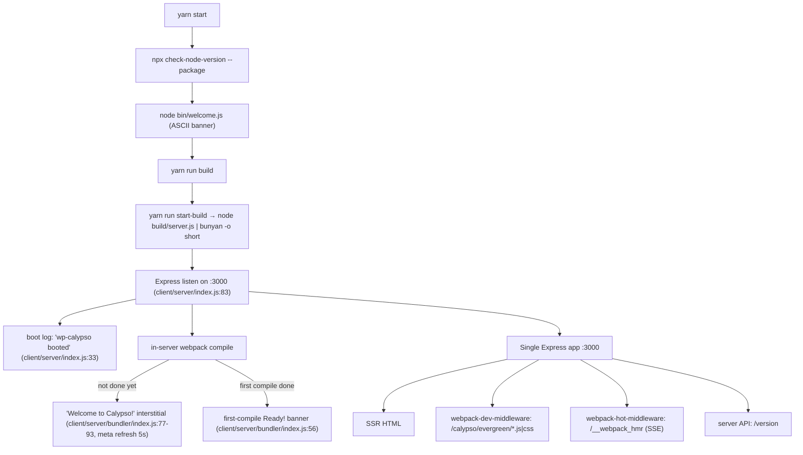
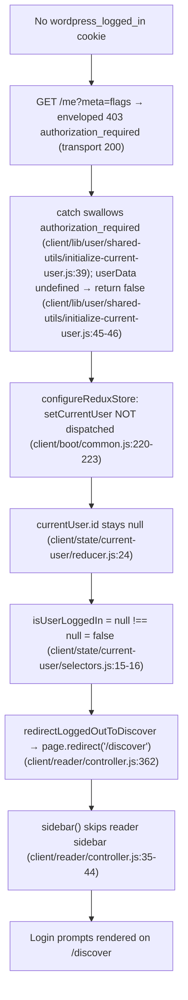

# Running Calypso Locally — Reader Deep‑Dive (Q&A)

> A run‑first developer‑onboarding knowledge document for the WordPress.com **Calypso** monorepo.
> **Branch:** `wp-calypso_be7e5cc64162` · **Commit:** `be7e5cc641622d153040491fd5625c6cb83e12eb` (verified `git HEAD`).

This document answers four groups of questions about running Calypso locally and how the **Reader** behaves on initial load. Every answer **leads with the direct result**, then shows **(a)** the exact command run, **(b)** the complete, unedited observed output, and **(c)** the `file:line` rationale. Claims that could only be read from source (not observed at runtime in this environment) are explicitly marked **(inferred)**; values obtained from a non‑default path are marked **(non‑canonical)**.

---

## The four questions (verbatim)

1. **Q1 — Dev server / ports.** *"What port does the development server bind to? How do I know when it's fully ready? Does the architecture use multiple ports (hot reloading, API calls) or is everything served from one place?"*
2. **Q2 — Reader stream.** *"What API endpoints get called to populate the stream? What Redux actions fire during the initial load?"*
3. **Q3 — Auth.** *"How does the app know whether someone is logged in before it decides what to render? What storage mechanisms does it check?"*
4. **Q4 — Responsive sidebar.** *"The sidebar layout shifts at different screen sizes — the specific margin and padding values on the sidebar header, what CSS custom properties drive the layout calculations, and at what viewport widths do things change?"*

---

## Canonical runtime resolution (read this first)

Calypso **enforces Node.js `^v22.9.0`** and **Yarn `4.0.2`**:

- `package.json:57` → `"node": "^v22.9.0"` (inside `engines`).
- `.nvmrc` → `22.9.0`.
- `package.json:422` → `"packageManager": "yarn@4.0.2"` (vendored at `.yarn/releases/yarn-4.0.2.cjs`).
- The `start` script gates on the engine at `package.json:110`:
  `"start": "npx check-node-version --package && node bin/welcome.js && yarn run build && yarn run start-build"`.

The environment‑setup note mentioned Node **20.x**. That is **(non‑canonical)**: the semver range `^v22.9.0` excludes `20.x`, so `npx check-node-version --package` would reject it and `yarn start` would abort before booting. All observations below were taken on the **canonical** runtime actually provisioned:

```bash
$ node --version && yarn --version
```
```text
v22.23.1
4.0.2
```
`v22.23.1` satisfies `^v22.9.0`, and the gate passes:
```bash
$ npx check-node-version --package ; echo "exit=$?"
```
```text
exit=0
```

## How this was investigated (run‑first)

- **Environment:** Linux container, 4 CPUs. Node `v22.23.1`, Yarn `4.0.2`.
- **Prerequisite host mapping** (`README.md:19`): `127.0.0.1 calypso.localhost` is present in `/etc/hosts` (a runtime prerequisite, **not** a repository change).
- **Build & run:** `yarn install` then `yarn start` (with `NODE_OPTIONS=--max-old-space-size=8192` for the memory‑heavy build). The dev server was launched once and kept alive on port **3000** for the entire investigation.
- **Browser‑side capture:** a headless Chrome (DevTools) session drove `http://calypso.localhost:3000/reader`. Redux actions were captured with a **passive** store shim installed via a page `initScript` that wraps `window.__REDUX_DEVTOOLS_EXTENSION__` (it only records `action.type` + timestamp and forwards to the real dispatch — it changes no behavior). Network was read from the DevTools network log; CSS was read with `getComputedStyle` / the CSSOM at eight viewport widths.
- **Auth state exercised:** **both** — logged‑out (the canonical default in this credential‑less environment) **and** the logged‑in **render consequence**, which was observed by injecting only the Redux `currentUser` (no storage write) and navigating to `/reader` (§2.2, §3.4). The auth **trigger** for the logged‑in observations is **(non‑canonical)** (no WordPress.com credentials exist), but the resulting endpoint URLs, action cycles, render decision, and computed sidebar CSS are **real observed values**. Only the logged‑in **detection** path (real cookie → `200` `/me`) remains **(inferred)**; every such claim is grounded in `file:line` and explicitly labelled.
- **Read‑only:** all observation scripts lived under `/tmp` (never in the repo tree) and were removed afterward. The only repository addition is this document.

---

# OBJ‑1 — Dev server port, readiness, and single‑port architecture

**Direct answer.** The development server binds to **TCP port `3000`** on host **`calypso.localhost`** over **`http`**. You know it is *fully* ready **not** when the server "booted" log line prints, but when the in‑server **webpack banner `Ready! You can load http://calypso.localhost:3000/ now. Have fun!`** prints. The architecture serves **everything from one place**: a single Express instance on port `3000` handles server‑side‑rendered HTML, the webpack bundle assets (`webpack-dev-middleware`), hot‑module reloading (`webpack-hot-middleware` over a Server‑Sent‑Events stream at `/__webpack_hmr`), and the server's own JSON API (e.g. `/version`). There is **no separate HMR port**. (One nuance, proven under OBJ‑2: actual WordPress.com REST *data* is fetched cross‑origin from `public-api.wordpress.com`, not proxied through `:3000` in the default dev build.)

## 1.1 `yarn install` and the `yarn start` sequence — exact commands + observed output

**Install** (warm cache). The exact command and its complete, unedited output:

```bash
$ yarn install
```
```text
➤ YN0000: · Yarn 4.0.2
➤ YN0000: ┌ Resolution step
➤ YN0000: └ Completed in 0s 487ms
➤ YN0000: ┌ Fetch step
➤ YN0000: └ Completed in 4s 336ms
➤ YN0000: ┌ Link step
➤ YN0000: └ Completed in 0s 974ms
➤ YN0000: · Done in 6s 228ms
```

**Start.** `yarn start` expands (per `package.json:110` / `package.json:113`) to
`npx check-node-version --package && node bin/welcome.js && yarn run build && yarn run start-build`,
where `start-build` is `BROWSERSLIST_ENV=evergreen node build/server.js | bunyan -o short`. The exact
command and the observed console sequence — the chalk‑cyan ASCII "calypso" banner from `bin/welcome.js:6-11`,
the build, the server boot log, the "Compiling assets…" line, and finally the authoritative `Ready!`
banner — captured live below as the **complete, unedited** `yarn start` output — all **255** lines verbatim, including every repeated Browserslist `caniuse-lite` warning, the full webpack build stats, and the trailing per‑request `bunyan` log lines, shown exactly as emitted (nothing elided):

```bash
$ NODE_OPTIONS=--max-old-space-size=8192 yarn start
```
```text
             _                           
    ___ __ _| |_   _ _ __  ___  ___      
   / __/ _` | | | | | '_ \/ __|/ _ \ 
  | (_| (_| | | |_| | |_) \__ \ (_) |  
   \___\__,_|_|\__, | .__/|___/\___/ 
               |___/|_|                

Packages are built.
Browserslist: browsers data (caniuse-lite) is 17 months old. Please run:
  npx update-browserslist-db@latest
  Why you should do it regularly: https://github.com/browserslist/update-db#readme
Browserslist: browsers data (caniuse-lite) is 17 months old. Please run:
  npx update-browserslist-db@latest
  Why you should do it regularly: https://github.com/browserslist/update-db#readme
Browserslist: browsers data (caniuse-lite) is 17 months old. Please run:
  npx update-browserslist-db@latest
  Why you should do it regularly: https://github.com/browserslist/update-db#readme
Browserslist: browsers data (caniuse-lite) is 17 months old. Please run:
  npx update-browserslist-db@latest
  Why you should do it regularly: https://github.com/browserslist/update-db#readme
Browserslist: browsers data (caniuse-lite) is 17 months old. Please run:
  npx update-browserslist-db@latest
  Why you should do it regularly: https://github.com/browserslist/update-db#readme
Browserslist: browsers data (caniuse-lite) is 17 months old. Please run:
  npx update-browserslist-db@latest
  Why you should do it regularly: https://github.com/browserslist/update-db#readme
Browserslist: browsers data (caniuse-lite) is 17 months old. Please run:
  npx update-browserslist-db@latest
  Why you should do it regularly: https://github.com/browserslist/update-db#readme
Browserslist: browsers data (caniuse-lite) is 17 months old. Please run:
  npx update-browserslist-db@latest
  Why you should do it regularly: https://github.com/browserslist/update-db#readme
Browserslist: browsers data (caniuse-lite) is 17 months old. Please run:
  npx update-browserslist-db@latest
  Why you should do it regularly: https://github.com/browserslist/update-db#readme
Browserslist: browsers data (caniuse-lite) is 17 months old. Please run:
  npx update-browserslist-db@latest
  Why you should do it regularly: https://github.com/browserslist/update-db#readme
Browserslist: browsers data (caniuse-lite) is 17 months old. Please run:
  npx update-browserslist-db@latest
  Why you should do it regularly: https://github.com/browserslist/update-db#readme
Browserslist: browsers data (caniuse-lite) is 17 months old. Please run:
  npx update-browserslist-db@latest
  Why you should do it regularly: https://github.com/browserslist/update-db#readme
Browserslist: browsers data (caniuse-lite) is 17 months old. Please run:
  npx update-browserslist-db@latest
  Why you should do it regularly: https://github.com/browserslist/update-db#readme
Browserslist: browsers data (caniuse-lite) is 17 months old. Please run:
  npx update-browserslist-db@latest
  Why you should do it regularly: https://github.com/browserslist/update-db#readme
Browserslist: browsers data (caniuse-lite) is 17 months old. Please run:
  npx update-browserslist-db@latest
  Why you should do it regularly: https://github.com/browserslist/update-db#readme
Browserslist: browsers data (caniuse-lite) is 17 months old. Please run:
  npx update-browserslist-db@latest
  Why you should do it regularly: https://github.com/browserslist/update-db#readme
Browserslist: browsers data (caniuse-lite) is 17 months old. Please run:
  npx update-browserslist-db@latest
  Why you should do it regularly: https://github.com/browserslist/update-db#readme
Browserslist: browsers data (caniuse-lite) is 17 months old. Please run:
  npx update-browserslist-db@latest
  Why you should do it regularly: https://github.com/browserslist/update-db#readme
Browserslist: browsers data (caniuse-lite) is 17 months old. Please run:
  npx update-browserslist-db@latest
  Why you should do it regularly: https://github.com/browserslist/update-db#readme
Browserslist: browsers data (caniuse-lite) is 17 months old. Please run:
  npx update-browserslist-db@latest
  Why you should do it regularly: https://github.com/browserslist/update-db#readme
Browserslist: browsers data (caniuse-lite) is 17 months old. Please run:
  npx update-browserslist-db@latest
  Why you should do it regularly: https://github.com/browserslist/update-db#readme
Browserslist: browsers data (caniuse-lite) is 17 months old. Please run:
  npx update-browserslist-db@latest
  Why you should do it regularly: https://github.com/browserslist/update-db#readme
Browserslist: browsers data (caniuse-lite) is 17 months old. Please run:
  npx update-browserslist-db@latest
  Why you should do it regularly: https://github.com/browserslist/update-db#readme
Browserslist: browsers data (caniuse-lite) is 17 months old. Please run:
  npx update-browserslist-db@latest
  Why you should do it regularly: https://github.com/browserslist/update-db#readme
Browserslist: browsers data (caniuse-lite) is 17 months old. Please run:
  npx update-browserslist-db@latest
  Why you should do it regularly: https://github.com/browserslist/update-db#readme
Browserslist: browsers data (caniuse-lite) is 17 months old. Please run:
  npx update-browserslist-db@latest
  Why you should do it regularly: https://github.com/browserslist/update-db#readme
Browserslist: browsers data (caniuse-lite) is 17 months old. Please run:
  npx update-browserslist-db@latest
  Why you should do it regularly: https://github.com/browserslist/update-db#readme
Browserslist: browsers data (caniuse-lite) is 17 months old. Please run:
  npx update-browserslist-db@latest
  Why you should do it regularly: https://github.com/browserslist/update-db#readme
Browserslist: browsers data (caniuse-lite) is 17 months old. Please run:
  npx update-browserslist-db@latest
  Why you should do it regularly: https://github.com/browserslist/update-db#readme
Browserslist: browsers data (caniuse-lite) is 17 months old. Please run:
  npx update-browserslist-db@latest
  Why you should do it regularly: https://github.com/browserslist/update-db#readme
Browserslist: browsers data (caniuse-lite) is 17 months old. Please run:
  npx update-browserslist-db@latest
  Why you should do it regularly: https://github.com/browserslist/update-db#readme
Browserslist: browsers data (caniuse-lite) is 17 months old. Please run:
  npx update-browserslist-db@latest
  Why you should do it regularly: https://github.com/browserslist/update-db#readme
Browserslist: browsers data (caniuse-lite) is 17 months old. Please run:
  npx update-browserslist-db@latest
  Why you should do it regularly: https://github.com/browserslist/update-db#readme
Browserslist: browsers data (caniuse-lite) is 17 months old. Please run:
  npx update-browserslist-db@latest
  Why you should do it regularly: https://github.com/browserslist/update-db#readme
Browserslist: browsers data (caniuse-lite) is 17 months old. Please run:
  npx update-browserslist-db@latest
  Why you should do it regularly: https://github.com/browserslist/update-db#readme
Failed to load ./.env.
23:32:53.753Z  INFO calypso: wp-calypso booted in 1004ms - http://calypso.localhost:3000
Compiling assets... Wait until you see Ready! and then try http://calypso.localhost:3000/ again.
23:32:54.178Z  INFO calypso: request finished (reqId=0d1a8f9f-c68e-45bb-af77-5ebd1bd33a28, url=/, env=development, userAgent=curl/8.14.1, path=/, method=GET, status=200, length=630, duration=3.695, httpVersion=1.1, rawUserAgent=curl/8.14.1, remoteAddr=::ffff:127.0.0.1)
Browserslist: browsers data (caniuse-lite) is 17 months old. Please run:
  npx update-browserslist-db@latest
  Why you should do it regularly: https://github.com/browserslist/update-db#readme
Browserslist: browsers data (caniuse-lite) is 17 months old. Please run:
  npx update-browserslist-db@latest
  Why you should do it regularly: https://github.com/browserslist/update-db#readme
Browserslist: browsers data (caniuse-lite) is 17 months old. Please run:
  npx update-browserslist-db@latest
  Why you should do it regularly: https://github.com/browserslist/update-db#readme
Browserslist: browsers data (caniuse-lite) is 17 months old. Please run:
  npx update-browserslist-db@latest
  Why you should do it regularly: https://github.com/browserslist/update-db#readme
Browserslist: browsers data (caniuse-lite) is 17 months old. Please run:
  npx update-browserslist-db@latest
  Why you should do it regularly: https://github.com/browserslist/update-db#readme
Browserslist: browsers data (caniuse-lite) is 17 months old. Please run:
  npx update-browserslist-db@latest
  Why you should do it regularly: https://github.com/browserslist/update-db#readme
Browserslist: browsers data (caniuse-lite) is 17 months old. Please run:
  npx update-browserslist-db@latest
  Why you should do it regularly: https://github.com/browserslist/update-db#readme
Browserslist: browsers data (caniuse-lite) is 17 months old. Please run:
  npx update-browserslist-db@latest
  Why you should do it regularly: https://github.com/browserslist/update-db#readme
Browserslist: browsers data (caniuse-lite) is 17 months old. Please run:
  npx update-browserslist-db@latest
  Why you should do it regularly: https://github.com/browserslist/update-db#readme
Browserslist: browsers data (caniuse-lite) is 17 months old. Please run:
  npx update-browserslist-db@latest
  Why you should do it regularly: https://github.com/browserslist/update-db#readme
Browserslist: browsers data (caniuse-lite) is 17 months old. Please run:
  npx update-browserslist-db@latest
  Why you should do it regularly: https://github.com/browserslist/update-db#readme
Browserslist: browsers data (caniuse-lite) is 17 months old. Please run:
  npx update-browserslist-db@latest
  Why you should do it regularly: https://github.com/browserslist/update-db#readme
Browserslist: browsers data (caniuse-lite) is 17 months old. Please run:
  npx update-browserslist-db@latest
  Why you should do it regularly: https://github.com/browserslist/update-db#readme
Browserslist: browsers data (caniuse-lite) is 17 months old. Please run:
  npx update-browserslist-db@latest
  Why you should do it regularly: https://github.com/browserslist/update-db#readme
Browserslist: browsers data (caniuse-lite) is 17 months old. Please run:
  npx update-browserslist-db@latest
  Why you should do it regularly: https://github.com/browserslist/update-db#readme
Browserslist: browsers data (caniuse-lite) is 17 months old. Please run:
  npx update-browserslist-db@latest
  Why you should do it regularly: https://github.com/browserslist/update-db#readme
Browserslist: browsers data (caniuse-lite) is 17 months old. Please run:
  npx update-browserslist-db@latest
  Why you should do it regularly: https://github.com/browserslist/update-db#readme
Browserslist: browsers data (caniuse-lite) is 17 months old. Please run:
  npx update-browserslist-db@latest
  Why you should do it regularly: https://github.com/browserslist/update-db#readme
Browserslist: browsers data (caniuse-lite) is 17 months old. Please run:
  npx update-browserslist-db@latest
  Why you should do it regularly: https://github.com/browserslist/update-db#readme
Browserslist: browsers data (caniuse-lite) is 17 months old. Please run:
  npx update-browserslist-db@latest
  Why you should do it regularly: https://github.com/browserslist/update-db#readme
Browserslist: browsers data (caniuse-lite) is 17 months old. Please run:
  npx update-browserslist-db@latest
  Why you should do it regularly: https://github.com/browserslist/update-db#readme
Browserslist: browsers data (caniuse-lite) is 17 months old. Please run:
  npx update-browserslist-db@latest
  Why you should do it regularly: https://github.com/browserslist/update-db#readme
Browserslist: browsers data (caniuse-lite) is 17 months old. Please run:
  npx update-browserslist-db@latest
  Why you should do it regularly: https://github.com/browserslist/update-db#readme
Browserslist: browsers data (caniuse-lite) is 17 months old. Please run:
  npx update-browserslist-db@latest
  Why you should do it regularly: https://github.com/browserslist/update-db#readme
Browserslist: browsers data (caniuse-lite) is 17 months old. Please run:
  npx update-browserslist-db@latest
  Why you should do it regularly: https://github.com/browserslist/update-db#readme
Browserslist: browsers data (caniuse-lite) is 17 months old. Please run:
  npx update-browserslist-db@latest
  Why you should do it regularly: https://github.com/browserslist/update-db#readme
Browserslist: browsers data (caniuse-lite) is 17 months old. Please run:
  npx update-browserslist-db@latest
  Why you should do it regularly: https://github.com/browserslist/update-db#readme
Browserslist: browsers data (caniuse-lite) is 17 months old. Please run:
  npx update-browserslist-db@latest
  Why you should do it regularly: https://github.com/browserslist/update-db#readme
Browserslist: browsers data (caniuse-lite) is 17 months old. Please run:
  npx update-browserslist-db@latest
  Why you should do it regularly: https://github.com/browserslist/update-db#readme
Browserslist: browsers data (caniuse-lite) is 17 months old. Please run:
  npx update-browserslist-db@latest
  Why you should do it regularly: https://github.com/browserslist/update-db#readme
Browserslist: browsers data (caniuse-lite) is 17 months old. Please run:
  npx update-browserslist-db@latest
  Why you should do it regularly: https://github.com/browserslist/update-db#readme
Browserslist: browsers data (caniuse-lite) is 17 months old. Please run:
  npx update-browserslist-db@latest
  Why you should do it regularly: https://github.com/browserslist/update-db#readme
webpack built 3c3a78e6a49f569dba58 in 161402ms
assets by path *.js 146 MiB
  assets by chunk 37.4 MiB (id hint: vendors)
    asset vendors-node_modules_wordpress_block-editor_build-module_index_js.js 4.64 MiB [emitted] (id hint: vendors)
    asset vendors-node_modules_wordpress_block-library_build-module_index_js-node_modules_wordpress_ico-1077c4.js 2.84 MiB [emitted] (id hint: vendors)
    asset vendors-node_modules_tannin_sprintf_index_js-node_modules_cookie_index_js-node_modules_core-j-244a9e.js 1.48 MiB [emitted] (id hint: vendors)
    + 227 assets
  + 746 assets
assets by path *.css 48.7 MiB 806 assets
assets by info 20.6 MiB [immutable]
  assets by path images/*.svg 5.1 MiB 600 assets
  assets by path images/*.png 10.1 MiB 76 assets
  assets by path images/*.jpg 5.37 MiB 34 assets
  asset images/loader-0855308317756931a4f5.gif 81.9 KiB [emitted] [immutable] [from: ../packages/jetpack-ai-calypso/src/logo-generator/assets/images/loader.gif] (auxiliary name: home)
  asset 3e15b3f4f51c5f0ca392.webp 3.62 KiB [emitted] [immutable] [from: assets/images/hundred-year-plan-onboarding/stars-solo.webp]
orphan modules 1.65 MiB (javascript) 51.7 KiB (css/mini-extract) 11.7 KiB (asset) [orphan] 1301 modules
runtime modules 65.2 KiB 25 modules
javascript modules 68.2 MiB
  modules by path ./ 36.5 MiB 9453 modules
  modules by path ../ 31.7 MiB 7055 modules
  + 3 modules
css modules 14.6 MiB
  modules by path ./ 12.4 MiB 1376 modules
  modules by path ../ 2.15 MiB 185 modules
asset modules 19.4 MiB (asset) 31.2 KiB (javascript) 696 modules
json modules 218 KiB
  modules by path ./ 5.89 KiB 9 modules
  modules by path ../ 212 KiB
    modules by path ../node_modules/ 126 KiB 3 modules
    + 3 modules
37 WARNINGS in child compilations (Use 'stats.children: true' resp. '--stats-children' for more details)
webpack 5.97.1 compiled with 37 warnings in 161402 ms

Ready! You can load http://calypso.localhost:3000/ now. Have fun!
23:36:15.536Z  INFO calypso: request finished (reqId=518395ab-c277-49ca-a319-996bd9a0e985, url=/reader, env=development, userAgent=curl/8.14.1, path=/reader, method=GET, status=200, length=41676, duration=195.222, httpVersion=1.1, rawUserAgent=curl/8.14.1, remoteAddr=::ffff:127.0.0.1)
23:36:15.643Z  INFO calypso: request finished (reqId=97d96a95-35f5-4761-9acd-849831bf3ad3, url=/reader, env=development, userAgent=curl/8.14.1, path=/reader, method=GET, status=200, length=41676, duration=40.778, httpVersion=1.1, rawUserAgent=curl/8.14.1, remoteAddr=::ffff:127.0.0.1)
23:39:00.763Z  INFO calypso: request finished (reqId=970d1194-6c69-402f-9388-0d8d82f8fb8c, url=/reader, env=development, userAgent="Chrome Headless 149", path=/reader, method=GET, status=200, length=41676, duration=57.219, httpVersion=1.1, remoteAddr=::ffff:127.0.0.1)
    rawUserAgent: Mozilla/5.0 (X11; Linux x86_64) AppleWebKit/537.36 (KHTML, like Gecko) HeadlessChrome/149.0.0.0 Safari/537.36
23:44:11.211Z  INFO calypso: request finished (reqId=0acef404-2f53-40cc-be55-03e819a80175, url=/reader, env=development, userAgent="Chrome Headless 149", path=/reader, method=GET, status=200, length=41676, duration=45.672, httpVersion=1.1, remoteAddr=::ffff:127.0.0.1)
    rawUserAgent: Mozilla/5.0 (X11; Linux x86_64) AppleWebKit/537.36 (KHTML, like Gecko) HeadlessChrome/149.0.0.0 Safari/537.36
23:46:48.512Z  INFO calypso: request finished (reqId=7b476465-a31c-461b-b379-246fb61224b0, url=/reader, env=development, userAgent="Chrome Headless 149", path=/reader, method=GET, status=200, length=41676, duration=37.294, httpVersion=1.1, remoteAddr=::ffff:127.0.0.1)
    rawUserAgent: Mozilla/5.0 (X11; Linux x86_64) AppleWebKit/537.36 (KHTML, like Gecko) HeadlessChrome/149.0.0.0 Safari/537.36
```

> **Note on `Failed to load ./.env.`** — this is benign: no `.env` file exists in this checkout, and the
> dev server proceeds with config defaults from `config/_shared.json` + `config/development.json`.

## 1.2 Port `3000` — where it comes from

The port is resolved from config and bound by the server:

- `config/_shared.json:24-25` → `"protocol": "http"`, `"port": 3000` (the default for every environment).
- `config/development.json:6-8` → `"protocol": "http"`, `"hostname": "calypso.localhost"`, `"port": 3000`.
- `client/server/index.js:12` reads it: `let port = config( 'port' );`
- `client/server/index.js:83` binds it: `server.listen( { port, host: process.env.CALYPSO_IS_FORK ? host : null }, function () { sendBootStatus( 'ready' ); } )` (verbatim: the options object supplies `port`; the callback calls `sendBootStatus( 'ready' )`).

**Observed** (port confirmed at runtime via the response's remote port — `curl` is authoritative here because the server binds IPv6 `::` and `ss -p` needs root):

```bash
$ curl -s -o /dev/null -w "status=%{http_code} remote_port=%{remote_port}\n" http://calypso.localhost:3000/reader
```
```text
status=200 remote_port=3000
```

## 1.3 Two‑phase readiness — the boot log is **not** the "ready" signal

In development the client bundle is compiled **inside** the server (via `webpack-dev-middleware`), so the "server booted" line prints **long before** the app is usable. There are three distinct states, all observed in order in the live `yarn start` log:

**(a) Server boot log** — `client/server/index.js:33` prints `wp-calypso booted in %dms - %s://%s:%s`:
```text
23:32:53.753Z  INFO calypso: wp-calypso booted in 1004ms - http://calypso.localhost:3000
```

**(b) Pre‑ready interstitial** — while webpack is still compiling, any request to `/` is answered by the "Welcome to Calypso!" holding page (`client/server/bundler/index.js:77-93`), which auto‑refreshes every 5 seconds via `<meta http-equiv="refresh" content="5">`. Captured with `curl` *during* compilation — this is the **complete, unedited** response (headers + the full 630‑byte body, including the blue **`READY!`** cue and the "allmoji" image the page tells you to watch):
```bash
$ curl -i http://calypso.localhost:3000/
```
```text
HTTP/1.1 200 OK
X-Powered-By: Express
Content-Type: text/html; charset=utf-8
Content-Length: 630
ETag: W/"276-y4FD3FW7f3NaD0Hx62TOsuGEP2M"
Date: Mon, 06 Jul 2026 23:32:54 GMT
Connection: keep-alive
Keep-Alive: timeout=5


				<head>
					<meta http-equiv="refresh" content="5">
				</head>
				<body>
					<h1>Welcome to Calypso!</h1>
					<p>
						Please wait until webpack has finished compiling and you see
						<code style="font-size: 1.2em; color: blue; font-weight: bold;">READY!</code> in
						the server console. This page should then refresh automatically. If it hasn&rsquo;t, hit <em>Refresh</em>.
					</p>
					<p>
						In the meantime, try to follow all the emotions of the allmoji:
						
				</body>
```
The server simultaneously logs (`client/server/bundler/index.js:72`):
```text
Compiling assets... Wait until you see Ready! and then try http://calypso.localhost:3000/ again.
```

**(c) Authoritative readiness banner** — the first successful compile prints, from `client/server/bundler/index.js:56` (chalk‑cyan):
```text
webpack 5.97.1 compiled with 37 warnings in 161402 ms
Ready! You can load http://calypso.localhost:3000/ now. Have fun!
```
A subsequent recompile prints the variant `Ready! All assets are re-compiled. Have fun!` (`client/server/bundler/index.js:60`).

**Cause → effect.** The boot log fires when Express starts listening; the bundle does not exist yet, so requests get the interstitial. Only after the in‑server webpack compile finishes does `Ready!` print — so **`Ready!` (not the boot log) is the true "fully ready" signal**. In this run the compile took `161402 ms` (~2.7 min), which is why the boot log (at `1004ms`) precedes readiness by minutes. The compile duration is **not** stable run‑to‑run (a second run measured `159233 ms`), but the two‑phase ordering — boot log first, `Ready!` only after the in‑server compile — is invariant across runs.

## 1.4 Single‑port proof — one Express app does it all

In development the bundler is attached to the **same** Express `app` (`client/server/boot/index.js:36-37`):
```js
if ( 'development' === process.env.NODE_ENV ) {
    require( 'calypso/server/bundler' )( app );
}
```
and `client/server/bundler/index.js:100-102` mounts all three middlewares on that one app:
```js
app.use( waitForCompiler );
app.use( webpackMiddleware( compiler ) );   // webpack-dev-middleware — serves bundle assets
app.use( hotMiddleware( compiler ) );        // webpack-hot-middleware — HMR over SSE
```

All four responsibilities were observed on **`:3000`**, each with `X-Powered-By: Express` (same server). Each is shown below with the **exact command** and its **complete, unedited output**.

**(1) SSR HTML** — the Reader page is server‑rendered on `:3000`. Headers are complete; the body is the SSR'd React document (`Content-Length: 41676`; measured `41963` bytes over the wire), so the verbatim opening (the `<3` ASCII‑art HTML comment) and the `<title>` and the entire remaining body are shown **in full** below — this is the **complete, unedited** capture. The **only** edits are explicitly‑labeled redactions of **15 public client‑config values** inside `window.configData` (listed in the redaction note that follows the block); each is replaced by `[REDACTED public client-config value, N chars — see redaction note]` and nothing else is altered:
```bash
$ curl -i -s http://calypso.localhost:3000/reader
```
```text
HTTP/1.1 200 OK
X-Powered-By: Express
Cache-control: no-store
X-Frame-Options: SAMEORIGIN
Content-Type: text/html; charset=utf-8
Content-Length: 41676
ETag: W/"a2cc-huOxtXgITH2OQzJy6HCV5x48Dl8"
Date: Mon, 06 Jul 2026 23:36:15 GMT
Connection: keep-alive
Keep-Alive: timeout=5

<!DOCTYPE html><!--
	<3
	             _
	    ___ __ _| |_   _ _ __  ___  ___
	   / __/ _` | | | | | '_ \/ __|/ _ \
	  | (_| (_| | | |_| | |_) \__ \ (_) |
	   \___\__,_|_|\__, | .__/|___/\___/
	               |___/|_|

	to join the fun, visit: https://automattic.com/work-with-us/

--><html lang="en" dir="ltr" class=""><head><title>WordPress.com</title><meta charSet="utf-8"/><meta http-equiv="X-UA-Compatible" content="IE=Edge"/><meta name="viewport" content="width=device-width, initial-scale=1"/><meta name="format-detection" content="telephone=no"/><meta name="mobile-web-app-capable" content="yes"/><meta name="apple-mobile-web-app-capable" content="yes"/><meta name="theme-color" content="#1D2327"/><meta name="referrer" content="origin"/><link rel="prefetch" as="document" href="https://public-api.wordpress.com/wp-admin/rest-proxy/?v=2.0"/><link rel="shortcut icon" type="image/vnd.microsoft.icon" href="/calypso/images/favicons/favicon-development.ico" sizes="16x16 32x32"/><link rel="shortcut icon" type="image/x-icon" href="/calypso/images/favicons/favicon-development.ico" sizes="16x16 32x32"/><link rel="icon" type="image/x-icon" href="/calypso/images/favicons/favicon-development.ico" sizes="16x16 32x32"/><link rel="icon" type="image/png" href="//s1.wp.com/i/favicons/favicon-64x64.png" sizes="64x64"/><link rel="icon" type="image/png" href="//s1.wp.com/i/favicons/favicon-96x96.png" sizes="96x96"/><link rel="icon" type="image/png" href="//s1.wp.com/i/favicons/android-chrome-192x192.png" sizes="192x192"/><link rel="apple-touch-icon" type="image/png" sizes="180x180" href="//s1.wp.com/i/favicons/apple-touch-icon-180x180.png"/><link rel="apple-touch-icon" type="image/png" sizes="152x152" href="//s1.wp.com/i/favicons/apple-touch-icon-152x152.png"/><link rel="apple-touch-icon" type="image/png" sizes="144x144" href="//s1.wp.com/i/favicons/apple-touch-icon-144x144.png"/><link rel="apple-touch-icon" type="image/png" sizes="120x120" href="//s1.wp.com/i/favicons/apple-touch-icon-120x120.png"/><link rel="apple-touch-icon" type="image/png" sizes="114x114" href="//s1.wp.com/i/favicons/apple-touch-icon-114x114.png"/><link rel="apple-touch-icon" type="image/png" sizes="76x76" href="//s1.wp.com/i/favicons/apple-touch-icon-76x76.png"/><link rel="apple-touch-icon" type="image/png" sizes="72x72" href="//s1.wp.com/i/favicons/apple-touch-icon-72x72.png"/><link rel="apple-touch-icon" type="image/png" sizes="60x60" href="//s1.wp.com/i/favicons/apple-touch-icon-60x60.png"/><link rel="apple-touch-icon" type="image/png" sizes="57x57" href="//s1.wp.com/i/favicons/apple-touch-icon-57x57.png"/><link rel="profile" href="http://gmpg.org/xfn/11"/><link rel="manifest" href="/calypso/manifest.json?branch=blitzy-6c8223f7-1a04-4d05-a28b-eaec4b575d35"/><link rel="preload" href="https://fonts.googleapis.com/css?family=Noto+Serif:400,400i,700,700i&amp;subset=cyrillic,cyrillic-ext,greek,greek-ext,latin-ext,vietnamese&amp;display=swap" as="style"/><noscript><link rel="stylesheet" href="https://fonts.googleapis.com/css?family=Noto+Serif:400,400i,700,700i&amp;subset=cyrillic,cyrillic-ext,greek,greek-ext,latin-ext,vietnamese&amp;display=swap"/></noscript><script type="text/javascript">
			(function() {
				var m = document.createElement( "link" );
				m.rel = "stylesheet";
				m.href = "https://fonts.googleapis.com/css?family=Noto+Serif:400,400i,700,700i&subset=cyrillic,cyrillic-ext,greek,greek-ext,latin-ext,vietnamese&display=swap";
				document.head.insertBefore( m, document.head.childNodes[ document.head.childNodes.length - 1 ].nextSibling );
			})()
			</script><meta property="og:site_name" content="WordPress.com"/><link rel="stylesheet" type="text/css" href="/calypso/evergreen/vendors-node_modules_emotion_react_jsx-runtime_dist_emotion-react-jsx-runtime_browser_esm_js--42a34d.css" data-webpack="true"/><link rel="stylesheet" type="text/css" href="/calypso/evergreen/packages_components_src_card_style_scss-components_data_query-preferences_index_jsx-component-c57a13.css" data-webpack="true"/><link rel="stylesheet" type="text/css" href="/calypso/evergreen/assets_stylesheets_style_scss.css" data-webpack="true"/><link rel="stylesheet" type="text/css" href="/calypso/evergreen/components_environment-badge_style_scss-boot_locale_js-components_calypso-i18n-provider_index-6ea040.css" data-webpack="true"/><link rel="stylesheet" type="text/css" href="/calypso/evergreen/assets_stylesheets_style_scss-boot_polyfills_js-controller_index_web_js-lib_analytics_init_js-2b44dc.css" data-webpack="true"/><link rel="stylesheet" type="text/css" href="/calypso/evergreen/vendors-node_modules_wordpress_compose_build-module_hooks_use-viewport-match_index_js-node_mo-f0176e.css" data-webpack="true"/><link rel="stylesheet" type="text/css" href="/calypso/evergreen/components_popover-menu_style_scss-blocks_site_index_jsx-components_popover-menu_item_jsx-blo-51a3f0.css" data-webpack="true"/><link rel="stylesheet" type="text/css" href="/calypso/evergreen/components_site-selector_index_jsx.css" data-webpack="true"/><link rel="stylesheet" type="text/css" href="/calypso/evergreen/components_section-nav_index_jsx.css" data-webpack="true"/><link rel="stylesheet" type="text/css" href="/calypso/evergreen/components_navigation-header_index_tsx-packages_components_src_forms_form-label_index_tsx.css" data-webpack="true"/><link rel="stylesheet" type="text/css" href="/calypso/evergreen/components_banner_index_jsx-components_data_query-reader-teams_index_jsx-components_search_in-20aa6a.css" data-webpack="true"/><link rel="stylesheet" type="text/css" href="/calypso/evergreen/blocks_comments_autoresizing-form-textarea_jsx-components_forms_form-fieldset_index_jsx-packa-2ea3a2.css" data-webpack="true"/><link rel="stylesheet" type="text/css" href="/calypso/evergreen/blocks_app-promo_qr-code_tsx-blocks_get-apps_apps-badge_tsx-components_data_query-user-settin-1b08e0.css" data-webpack="true"/><link rel="stylesheet" type="text/css" href="/calypso/evergreen/blocks_reader-post-card_index_jsx-blocks_reader-featured-image_style_scss-blocks_reader-featu-79daa1.css" data-webpack="true"/><link rel="stylesheet" type="text/css" href="/calypso/evergreen/components_forms_clipboard-button_index_tsx-reader_stream_index_jsx-components_infinite-list_-332c6e.css" data-webpack="true"/><link rel="stylesheet" type="text/css" href="/calypso/evergreen/components_forms_form-text-input_index_jsx-components_localized-moment_index_js-components_ma-58c1fe.css" data-webpack="true"/><link rel="stylesheet" type="text/css" href="/calypso/evergreen/blocks_reader-export-button_index_tsx-blocks_reader-import-button_index_tsx-blocks_reader-sub-4e0401.css" data-webpack="true"/><link rel="stylesheet" type="text/css" href="/calypso/evergreen/reader.css" data-webpack="true"/><link rel="preload" as="script" href="/calypso/evergreen/vendors-node_modules_wordpress_components_build-module_spinner_index_js.js"/><link rel="preload" as="script" href="/calypso/evergreen/vendors-node_modules_wordpress_components_build-module_base-control_hooks_js-node_modules_wor-221e1f.js"/><link rel="preload" as="script" href="/calypso/evergreen/vendors-node_modules_wordpress_components_build-module_flex_flex-item_hook_js-node_modules_wo-191d23.js"/><link rel="preload" as="script" href="/calypso/evergreen/vendors-node_modules_lodash-es__createFlow_js.js"/><link rel="preload" as="script" href="/calypso/evergreen/vendors-node_modules_wordpress_dom_build-module_index_js.js"/><link rel="preload" as="script" href="/calypso/evergreen/vendors-node_modules_wordpress_dom_build-module_dom_remove-invalid-html_js-node_modules_wordp-0588b4.js"/><link rel="preload" as="script" href="/calypso/evergreen/vendors-node_modules_fuse_js_dist_fuse_esm_js.js"/><link rel="preload" as="script" href="/calypso/evergreen/vendors-node_modules_wordpress_components_build-module_spacer_component_js-node_modules_wordp-096715.js"/><link rel="preload" as="script" href="/calypso/evergreen/vendors-node_modules_wordpress_components_build-module_modal_index_js.js"/><link rel="preload" as="script" href="/calypso/evergreen/vendors-node_modules_dompurify_dist_purify_es_mjs.js"/><link rel="preload" as="script" href="/calypso/evergreen/vendors-node_modules_wordpress_components_build-module_input-control_input-base_js-node_modul-6484b0.js"/><link rel="preload" as="script" href="/calypso/evergreen/vendors-node_modules_wordpress_components_build-module_select-control_chevron-down_js.js"/><link rel="preload" as="script" href="/calypso/evergreen/vendors-node_modules_wordpress_components_build-module_popover_index_js.js"/><link rel="preload" as="script" href="/calypso/evergreen/vendors-node_modules_moment-timezone_index_js.js"/><link rel="preload" as="script" href="/calypso/evergreen/vendors-node_modules_wordpress_components_build-module_dropdown-menu_index_js.js"/><link rel="preload" as="script" href="/calypso/evergreen/vendors-node_modules_path-browserify_index_js.js"/><link rel="preload" as="script" href="/calypso/evergreen/vendors-node_modules_wordpress_components_build-module_custom-select-control_index_js.js"/><link rel="preload" as="script" href="/calypso/evergreen/vendors-node_modules_wordpress_components_build-module_card_styles_js.js"/><link rel="preload" as="script" href="/calypso/evergreen/vendors-node_modules_wordpress_components_build-module_card_card_component_js.js"/><link rel="preload" as="script" href="/calypso/evergreen/vendors-node_modules_wordpress_components_build-module_input-control_index_js-node_modules_wo-c26ce5.js"/><link rel="preload" as="script" href="/calypso/evergreen/vendors-node_modules_express-useragent_index_js.js"/><link rel="preload" as="script" href="/calypso/evergreen/vendors-node_modules_wordpress_components_build-module_text-control_index_js-node_modules_wor-45fd82.js"/><link rel="preload" as="script" href="/calypso/evergreen/vendors-node_modules_wordpress_components_build-module_toggle-group-control_toggle-group-cont-d30245.js"/><link rel="preload" as="script" href="/calypso/evergreen/vendors-node_modules_wordpress_components_build-module_composite_index_js-node_modules_wordpr-5e5f99.js"/><link rel="preload" as="script" href="/calypso/evergreen/vendors-node_modules_wordpress_components_build-module_item-group_item_component_js.js"/><link rel="preload" as="script" href="/calypso/evergreen/vendors-node_modules_wordpress_compose_build-module_hooks_use-viewport-match_index_js-node_mo-f0176e.js"/><link rel="preload" as="script" href="/calypso/evergreen/vendors-node_modules_validator_index_js.js"/><link rel="preload" as="script" href="/calypso/evergreen/vendors-node_modules_wordpress_url_build-module_get-authority_js-node_modules_wordpress_url_b-ee310f.js"/><link rel="preload" as="script" href="/calypso/evergreen/vendors-node_modules_wordpress_a11y_build-module_index_js-node_modules_wordpress_components_b-12fbdd.js"/><link rel="preload" as="script" href="/calypso/evergreen/vendors-node_modules_react-spring_web_dist_react-spring_web_modern_mjs.js"/><link rel="preload" as="script" href="/calypso/evergreen/vendors-node_modules_wordpress_blocks_build-module_index_js.js"/><link rel="preload" as="script" href="/calypso/evergreen/vendors-node_modules_wordpress_components_build-module_angle-picker-control_index_js-node_mod-eb30e5.js"/><link rel="preload" as="script" href="/calypso/evergreen/vendors-node_modules_wordpress_components_build-module_navigator_navigator-back-button_compon-f264ff.js"/><link rel="preload" as="script" href="/calypso/evergreen/vendors-node_modules_wordpress_block-editor_build-module_index_js.js"/><link rel="preload" as="script" href="/calypso/evergreen/vendors-node_modules_react-router-dom_dist_index_js.js"/><link rel="preload" as="script" href="/calypso/evergreen/vendors-node_modules_wordpress_components_build-module_textarea-control_index_js-node_modules-a7f555.js"/><link rel="preload" as="script" href="/calypso/evergreen/vendors-node_modules_wordpress_block-library_build-module_embed_index_js-node_modules_wordpre-1ff93b.js"/><link rel="preload" as="script" href="/calypso/evergreen/vendors-node_modules_wordpress_components_build-module_keyboard-shortcuts_index_js-node_modul-874e69.js"/><link rel="preload" as="script" href="/calypso/evergreen/vendors-node_modules_wordpress_icons_build-module_library_category_js-node_modules_wordpress_-680980.js"/><link rel="preload" as="script" href="/calypso/evergreen/state_media_init_js.js"/><link rel="preload" as="script" href="/calypso/evergreen/blocks_site-icon_index_tsx.js"/><link rel="preload" as="script" href="/calypso/evergreen/components_popover-menu_style_scss-blocks_site_index_jsx-components_popover-menu_item_jsx-blo-51a3f0.js"/><link rel="preload" as="script" href="/calypso/evergreen/components_site-selector_index_jsx.js"/><link rel="preload" as="script" href="/calypso/evergreen/state_jetpack_modules_actions_js-state_selectors_is-jetpack-module-active_js.js"/><link rel="preload" as="script" href="/calypso/evergreen/components_section-nav_index_jsx.js"/><link rel="preload" as="script" href="/calypso/evergreen/_cache_evergreen_moment-timezone_a2da4fb4503bbf6b8bacccb99bdf0ca1_json.js"/><link rel="preload" as="script" href="/calypso/evergreen/packages_data-stores_src_plans_hooks_use-pricing-meta-for-grid-plans_ts.js"/><link rel="preload" as="script" href="/calypso/evergreen/components_infinite-list_index_jsx.js"/><link rel="preload" as="script" href="/calypso/evergreen/components_navigation-header_index_tsx-packages_components_src_forms_form-label_index_tsx.js"/><link rel="preload" as="script" href="/calypso/evergreen/packages_data-stores_src_site_index_ts.js"/><link rel="preload" as="script" href="/calypso/evergreen/packages_data-stores_src_onboard_index_ts.js"/><link rel="preload" as="script" href="/calypso/evergreen/packages_calypso-products_src_plans-utilities_ts-packages_data-stores_src_domain-suggestions_-74d8e4.js"/><link rel="preload" as="script" href="/calypso/evergreen/components_banner_index_jsx-components_data_query-reader-teams_index_jsx-components_search_in-20aa6a.js"/><link rel="preload" as="script" href="/calypso/evergreen/state_reader_init_js.js"/><link rel="preload" as="script" href="/calypso/evergreen/packages_data-stores_src_plans_index_ts-packages_data-stores_src_stepper-internal_index_ts-pa-a5ee42.js"/><link rel="preload" as="script" href="/calypso/evergreen/blocks_comments_autoresizing-form-textarea_jsx-components_forms_form-fieldset_index_jsx-packa-2ea3a2.js"/><link rel="preload" as="script" href="/calypso/evergreen/blocks_reader-featured-video_index_jsx-lib_interval_index_ts.js"/><link rel="preload" as="script" href="/calypso/evergreen/blocks_app-promo_qr-code_tsx-blocks_get-apps_apps-badge_tsx-components_data_query-user-settin-1b08e0.js"/><link rel="preload" as="script" href="/calypso/evergreen/lib_post-normalizer_rule-content-detect-media_js-lib_post-normalizer_rule-create-better-excer-cf10f3.js"/><link rel="preload" as="script" href="/calypso/evergreen/blocks_reader-post-card_index_jsx-blocks_reader-featured-image_style_scss-blocks_reader-featu-79daa1.js"/><link rel="preload" as="script" href="/calypso/evergreen/packages_data-stores_src_contextual-help_admin-sections_ts-packages_data-stores_src_contextua-d35f39.js"/><link rel="preload" as="script" href="/calypso/evergreen/packages_data-stores_src_add-ons_add-ons-list_ts-packages_data-stores_src_index_ts-packages_i-9a5c73.js"/><link rel="preload" as="script" href="/calypso/evergreen/components_forms_clipboard-button_index_tsx-reader_stream_index_jsx-components_infinite-list_-332c6e.js"/><link rel="preload" as="script" href="/calypso/evergreen/components_forms_form-text-input_index_jsx-components_localized-moment_index_js-components_ma-58c1fe.js"/><link rel="preload" as="script" href="/calypso/evergreen/blocks_reader-export-button_index_tsx-blocks_reader-import-button_index_tsx-blocks_reader-sub-4e0401.js"/><link rel="preload" as="script" href="/calypso/evergreen/reader.js"/></head><body class="color-scheme theme-default is-group-reader is-section-reader"><div id="wpcom" class="wpcom-site"><div class="layout is-group-reader is-section-reader"><div class="layout__content"><svg class="wpcom-site__logo" height="72" width="72" viewBox="0 0 72 72"><path d="M36,0C16.1,0,0,16.1,0,36c0,19.9,16.1,36,36,36c19.9,0,36-16.2,36-36C72,16.1,55.8,0,36,0z M3.6,36 c0-4.7,1-9.1,2.8-13.2l15.4,42.3C11.1,59.9,3.6,48.8,3.6,36z M36,68.4c-3.2,0-6.2-0.5-9.1-1.3l9.7-28.2l9.9,27.3 c0.1,0.2,0.1,0.3,0.2,0.4C43.4,67.7,39.8,68.4,36,68.4z M40.5,20.8c1.9-0.1,3.7-0.3,3.7-0.3c1.7-0.2,1.5-2.8-0.2-2.7 c0,0-5.2,0.4-8.6,0.4c-3.2,0-8.5-0.4-8.5-0.4c-1.7-0.1-2,2.6-0.2,2.7c0,0,1.7,0.2,3.4,0.3l5,13.8L28,55.9L16.2,20.8 c2-0.1,3.7-0.3,3.7-0.3c1.7-0.2,1.5-2.8-0.2-2.7c0,0-5.2,0.4-8.6,0.4c-0.6,0-1.3,0-2.1,0C14.7,9.4,24.7,3.6,36,3.6 c8.4,0,16.1,3.2,21.9,8.5c-0.1,0-0.3,0-0.4,0c-3.2,0-5.4,2.8-5.4,5.7c0,2.7,1.5,4.9,3.2,7.6c1.2,2.2,2.7,4.9,2.7,8.9 c0,2.8-0.8,6.3-2.5,10.5l-3.2,10.8L40.5,20.8z M52.3,64l9.9-28.6c1.8-4.6,2.5-8.3,2.5-11.6c0-1.2-0.1-2.3-0.2-3.3 c2.5,4.6,4,9.9,4,15.5C68.4,47.9,61.9,58.4,52.3,64z"></path></svg></div></div></div><div class="environment-badge"><div class="environment is-react-query-devtools"></div><div class="environment is-account-settings"></div><div class="environment is-prefs"></div><div class="environment is-features"></div><div class="environment is-auth"></div><div class="environment is-store-sandbox"></div><span class="environment branch-name" title="Commit 4792cae341">blitzy-6c8223f7-1a04-4d05-a28b-eaec4b575d35</span><span class="environment is-docs"><a href="/devdocs" title="DevDocs">docs</a></span><span class="environment is-dev is-env">dev</span><a href="https://github.com/Automattic/wp-calypso/issues/" title="Report an issue" target="_blank" class="external-link bug-report" rel="external noopener noreferrer"><svg xmlns="http://www.w3.org/2000/svg" viewBox="0 0 24 24" class="gridicon gridicons-bug" height="18" width="18"><use xlink:href="/calypso/evergreen/images/gridicons-47c7fb356fcb2d963681.svg#gridicons-bug"></use></svg></a></div><script type="text/javascript">var COMMIT_SHA = "\x28unknown\x29";
var BUILD_TIMESTAMP = "2026-07-06T23:32:37.550Z";
var BUILD_TARGET = "evergreen";
var app = {"clientIp":"127.0.0.1","isWpMobileApp":false,"isWcMobileApp":false,"isDebug":true};
var initialReduxState = {"documentHead":{"link":[],"meta":[{"property":"og:site_name","content":"WordPress.com"}],"title":"","unreadCount":0}};
var configData = {"env":"development","env_id":"development","favicon_url":"\x2Fcalypso\x2Fimages\x2Ffavicons\x2Ffavicon-development.ico","boom_analytics_enabled":false,"server_side_boom_analytics_enabled":false,"boom_analytics_key":"[REDACTED public client-config value, 11 chars — see redaction note]","client_slug":"browser","facebook_api_key":"[REDACTED public client-config value, 12 chars — see redaction note]","features":{"100-year-domain":true,"100-year-plan\x2Fvip":true,"a4a-dev-sites":true,"ad-tracking":false,"akismet\x2Fcheckout-quantity-dropdown":true,"calypso\x2Fai-blogging-prompts":true,"calypso\x2Fai-site-builder-flow":true,"calypso\x2Fall-domain-management":true,"calypso\x2Fbig-sky":true,"calypso\x2Fdomains-dataviews":true,"cancellation-offers":true,"checkout\x2Fcheckout-version":true,"checkout\x2Febanx-pix":true,"checkout\x2Fgoogle-pay":true,"checkout\x2Frazorpay":true,"checkout\x2Fvat-form":true,"cloudflare":false,"comments\x2Ffilters-in-posts":true,"cookie-banner":false,"current-site\x2Fdomain-warning":true,"current-site\x2Fnotice":true,"current-site\x2Fstale-cart-notice":false,"design-picker\x2Fuse-assembler-styles":true,"dev\x2Faccount-settings-helper":true,"dev\x2Fauth-helper":true,"dev\x2Ffeatures-helper":true,"dev\x2Fpreferences-helper":true,"dev\x2Freact-query-devtools":true,"dev\x2Fstore-sandbox-helper":true,"devdocs":true,"devdocs\x2Fredirect-loggedout-homepage":true,"email-accounts\x2Fenabled":true,"global-styles\x2Fon-personal-plan":false,"google-drive":true,"google-my-business":true,"help":true,"help\x2Fgpt-response":true,"home\x2Flayout-dev":true,"hosting-server-settings-enhancements":true,"hosting\x2Fdatacenter-picker":true,"i18n\x2Fcommunity-translator":false,"i18n\x2Fempathy-mode":true,"i18n\x2Ftranslation-scanner":true,"importer\x2Fsite-backups":true,"importer\x2Funified":true,"importers\x2Fnewsletter":true,"importers\x2Fsubstack":true,"individual-subscriber-stats":true,"jetpack\x2Fai-assistant-request-limit":true,"jetpack\x2Fai-logo-generator":true,"jetpack\x2Fapi-cache":true,"jetpack\x2Fbackup-contents-page":true,"jetpack\x2Fbackup-messaging-i3":true,"jetpack\x2Fbackup-restore-preflight-checks":true,"jetpack\x2Fbackup-retention-settings":true,"jetpack\x2Fcancel-through-main-flow":true,"jetpack\x2Fconcierge-sessions":false,"jetpack\x2Fconnect\x2Fmobile-app-flow":true,"jetpack\x2Ffeatures-section\x2Fatomic":true,"jetpack\x2Ffeatures-section\x2Fjetpack":true,"jetpack\x2Ffeatures-section\x2Fsimple":true,"jetpack\x2Fgolden-token":true,"jetpack\x2Fmagic-link-signup":true,"jetpack\x2Fmanage-simple-sites":true,"jetpack\x2Fpricing-add-boost-social":true,"jetpack\x2Fpricing-page-annual-only":true,"jetpack\x2Fsharing-buttons-block-enabled":true,"jetpack\x2Fsimplify-pricing-structure":false,"jetpack\x2Fsocial-plans-v1":true,"jetpack\x2Fstandalone-plugin-onboarding-update-v1":true,"jetpack\x2Fzendesk-chat-for-logged-in-users":true,"jetpack\x2Fcrm-downloads":true,"jitms":true,"lasagna":true,"launchpad-updates":true,"layout\x2Fapp-banner":true,"layout\x2Fglobal-notifications":true,"layout\x2Fguided-tours":true,"layout\x2Fquery-selected-editor":true,"layout\x2Fsupport-article-dialog":true,"legal-updates-banner":true,"livechat_solution":true,"login\x2Flast-used-method":true,"login\x2Fmagic-login":true,"login\x2Fsocial-first":true,"logmein":true,"mailchimp":true,"manage\x2Fimport\x2Fsite-importer-endpoints":true,"marketplace-fetch-all-dynamic-products":true,"marketplace-personal-premium":false,"marketplace-reviews-notification":false,"marketplace-test":true,"me\x2Faccount-close":true,"me\x2Faccount\x2Fcolor-scheme-picker":true,"migration-flow\x2Fexperiment":false,"migration-flow\x2Fintroductory-offer":true,"network-connection":true,"oauth":false,"onboarding\x2Fcreate-course":false,"onboarding\x2Fimport":true,"onboarding\x2Fimport-from-blogger":true,"onboarding\x2Fimport-from-medium":true,"onboarding\x2Fimport-from-squarespace":true,"onboarding\x2Fimport-from-wix":true,"onboarding\x2Fimport-from-wordpress":true,"onboarding\x2Fimport-light":false,"onboarding\x2Fimport-redirect-to-themes":true,"onboarding\x2Finterval-dropdown":true,"onboarding\x2Fplayground":true,"onboarding\x2Fstep-container-v2-migration-flow":true,"onboarding\x2Fstep-container-v2-import-flow":true,"onboarding\x2Ftrail-map-feature-grid":false,"onboarding\x2Ftrail-map-feature-grid-copy":false,"onboarding\x2Ftrail-map-feature-grid-structure":false,"onboarding\x2Fuser-on-stepper-hosting":true,"p2\x2Fp2-plus":true,"page\x2Fexport":true,"plans\x2Fhosting-trial":true,"plans\x2Fmigration-trial":true,"plans\x2Fpersonal-plan":true,"plans\x2Fpro-plan":false,"plans\x2Fself-service-downgrade":false,"plans\x2Fstarter-plan":false,"plans\x2Fupdated-storage-labels":true,"plans\x2Fupgradeable-storage":true,"post-editor\x2Fcheckout-overlay":true,"post-list\x2Fqr-code-link":true,"press-this":true,"publicize-preview":true,"purchases\x2Fnew-payment-methods":true,"purchases\x2Fpurchase-list-dataview":true,"push-notifications":true,"reader":true,"reader\x2Fcomment-polling":false,"reader\x2Ffull-errors":true,"reader\x2Fquick-post":true,"reader\x2Fquick-post-v2":false,"reader\x2Frecommended-blogs-list":true,"readymade-templates\x2Fshowcase":true,"redirect-fallback-browsers":false,"rum-tracking\x2Flogstash":true,"safari-idb-mitigation":true,"security\x2Fsecurity-checkup":true,"seller-experience":true,"server-side-rendering":true,"settings\x2Fnewsletter-settings-page":true,"settings\x2Fsecurity\x2Fmonitor":true,"sign-in-with-apple":true,"sign-in-with-apple\x2Fredirect":true,"signup\x2Fprofessional-email-step":false,"signup\x2Fsocial":true,"signup\x2Fsocial-first":true,"site-indicator":true,"site-profiler\x2Fmetrics":true,"sites\x2Fdrive-migrations":true,"ssr\x2Fprefetch-timebox":false,"stats\x2Fchart-library":true,"stats\x2Fempty-module-traffic":true,"stats\x2Fempty-module-v2":true,"stats\x2Flocations":true,"stats\x2Fpaid-wpcom-v2":true,"stats\x2Fpaid-wpcom-v3":true,"stats\x2Freal-time-tab":true,"subscriber-importer":true,"subscribers-helper-library":true,"themes\x2Fblock-theme-previews-premium-and-woo":true,"themes\x2Fdiscovery":true,"themes\x2Fpremium":true,"themes\x2Fsubscription-purchases":true,"themes\x2Ftext-search-lots":true,"titan\x2Fiframe-control-panel":false,"two-factor\x2Fenhanced-security":true,"upgrades\x2Fredirect-payments":true,"upgrades\x2Fupcoming-renewals-notices":true,"upgrades\x2Fwpcom-monthly-plans":true,"user-management-revamp":true,"wpcom-user-bootstrap":false,"yolo\x2Fcommand-palette":true},"google_recaptcha_site_key":false,"hotjar_enabled":true,"hostname":"calypso.localhost","i18n_default_locale_slug":"en","lasagna_url":"wss:\x2F\x2Frt-api.wordpress.com\x2Fsocket","login_url":"https:\x2F\x2Fwordpress.com\x2Fwp-login.php","logout_url":"https:\x2F\x2Fwordpress.com\x2Fwp-login.php\x3Faction\x3Dlogout\x26redirect_to\x3Dhttps\x253A\x252F\x252F\x7Csubdomain\x7Cwordpress.com","wpcom_signup_url":false,"wpcom_login_url":false,"wpcom_authorize_endpoint":false,"jetpack_connect_url":false,"mc_analytics_enabled":false,"oauth_client_id":"[REDACTED public client-config value, 5 chars — see redaction note]","protocol":"http","port":3000,"jetpack_support_blog":"jetpackme.wordpress.com","wpcom_support_blog":"en.support.wordpress.com","apple_pay_merchant_id":"merchant.com.wordpress","apple_oauth_client_id":"[REDACTED public client-config value, 18 chars — see redaction note]","github_app_slug":"wordpress-com-for-developers","github_oauth_client_id":"[REDACTED public client-config value, 20 chars — see redaction note]","google_oauth_client_id":"[REDACTED public client-config value, 72 chars — see redaction note]","facebook_app_id":"611241942420191","livechat_support_locales":["en","en-gb"],"dsp_stripe_pub_key":"[REDACTED public client-config value, 107 chars — see redaction note]","dsp_widget_js_src":"https:\x2F\x2Fdsp.wp.com\x2Fwidget.js","blaze_pro_back_link":"http:\x2F\x2Fblaze.pro:3005\x2Fapp","advertising_dashboard_path_prefix":"\x2Fadvertising","zendesk_presales_chat_key":"[REDACTED public client-config value, 36 chars — see redaction note]","zendesk_presales_chat_key_akismet":"[REDACTED public client-config value, 36 chars — see redaction note]","zendesk_presales_chat_key_jp_checkout":"[REDACTED public client-config value, 36 chars — see redaction note]","zendesk_presales_chat_key_jp_agency_dashboard":false,"zendesk_support_chat_key":"[REDACTED public client-config value, 36 chars — see redaction note]","upwork_support_locales":["de","de-at","de-li","de-lu","de-ch","es","es-cl","es-mx","fr","fr-ca","fr-be","fr-ch","it","it-ch","ja","nl","nl-be","nl-nl","pt","pt-pt","pt-br","sv","sv-fi","sv-se"],"support_site_locales":["ar","de","en","es","fr","he","id","it","ja","ko","nl","pt-br","ru","sv","tr","zh-cn","zh-tw"],"forum_locales":["ar","de","el","en","es","fa","fi","fr","id","it","ja","nl","pt","pt-br","ru","sv","th","tl","tr"],"magnificent_non_en_locales":["es","pt-br","de","fr","he","ja","it","nl","ru","tr","id","zh-cn","zh-tw","ko","ar","sv"],"jetpack_com_locales":["en","ar","de","es","fr","he","id","it","ja","ko","nl","pt-br","ro","ru","sv","tr","zh-cn","zh-tw"],"english_locales":["en","en-gb"],"readerFollowingSource":"calypso","siftscience_key":"[REDACTED public client-config value, 10 chars — see redaction note]","signup_url":"\x2Fstart","woocommerce_blog_id":113771570,"wpcom_concierge_schedule_id":1,"wpcom_signup_id":"39911","wpcom_signup_key":"[REDACTED public client-config value, 64 chars — see redaction note]","statsd_analytics_response_time_max_logs_per_second":50,"google_maps_and_places_api_key":"[REDACTED public client-config value, 39 chars — see redaction note]","push_notification_vapid_key":"[REDACTED public client-config value, 87 chars — see redaction note]","enable_all_sections":true,"sections":{"a8c-for-agencies":false,"a8c-for-agencies-auth":false,"a8c-for-agencies-landing":false,"a8c-for-agencies-feedback":false,"a8c-for-agencies-overview":false,"a8c-for-agencies-plugins":false,"a8c-for-agencies-sites":false,"a8c-for-agencies-marketplace":false,"a8c-for-agencies-purchases":false,"a8c-for-agencies-signup":false,"a8c-for-agencies-referrals":false,"a8c-for-agencies-migrations":false,"a8c-for-agencies-settings":false,"a8c-for-agencies-partner-directory":false,"a8c-for-agencies-client":false,"a8c-for-agencies-team":false,"a8c-for-agencies-agency-tier":false,"a8c-for-agencies-woopayments":false,"jetpack-cloud":false,"jetpack-cloud-overview":false,"jetpack-cloud-agency-dashboard":false,"jetpack-cloud-features-comparison":false,"jetpack-cloud-plugin-management":false,"jetpack-cloud-agency-signup":false,"jetpack-cloud-auth":false,"jetpack-cloud-partner-portal":false,"jetpack-cloud-pricing":false,"jetpack-cloud-manage-pricing":false,"jetpack-cloud-settings":false,"jetpack-cloud-golden-token":false,"jetpack-social":false,"jetpack-subscribers":false,"jetpack-monetize":false},"site_filter":[],"theme":"default","site_name":"WordPress.com","meta":[{"property":"og:site_name","content":"WordPress.com"}],"restricted_me_access":true,"theme_color":"\x231D2327","theme_color_admin_color_scheme_override":true,"100_year_plan_calendly_id":"wpcom-100-years\x2F30min","bilmur_url":"https:\x2F\x2Fs0.wp.com\x2Fwp-content\x2Fjs\x2Fbilmur.min.js"};
var installedChunks = ["vendors-node_modules_wordpress_components_build-module_button_index_js","vendors-node_modules_moment_moment_js","vendors-node_modules_wordpress_components_build-module_utils_rtl_js","vendors-node_modules_wordpress_components_build-module_text_component_js-node_modules_wordpre-1e844c","vendors-node_modules_wordpress_icons_build-module_library_chevron-right-small_js-node_modules-7c39a5","vendors-node_modules_emotion_react_jsx-runtime_dist_emotion-react-jsx-runtime_browser_esm_js--42a34d","vendors-node_modules_tannin_sprintf_index_js-node_modules_cookie_index_js-node_modules_core-j-244a9e","vendors-node_modules_tanstack_query-core_build_modern_queryClient_js","vendors-node_modules_emotion_react_dist_emotion-react_browser_esm_js-node_modules_emotion_sty-d1ae39","vendors-node_modules_wordpress_components_build-module_external-link_index_js-node_modules_wo-22c520","vendors-node_modules_react-dom_client_js-node_modules_react-modal_lib_index_js-node_modules_l-02e591","vendors-node_modules_social-logos_build_react_index_js-node_modules_tanstack_react-query-devt-1f858b","vendors-node_modules_tracekit_tracekit_js-node_modules_tanstack_query-persist-client-core_bui-24b30b","lib_query-manager_paginated_index_js-lib_query-manager_with-query-manager_js","lib_explat_index_ts","components_data_query-sites_index_jsx-components_jetpack-logo_index_jsx-state_analytics_actio-d07a64","state_data-layer_wpcom-http_actions_js-state_posts_init_js","state_editor_selectors_ts-state_selectors_get-editor-url_ts","state_automated-transfer_actions_js","components_wordpress-logo_index_jsx-lib_url_add-query-args_ts-lib_wp_browser_js-packages_caly-a8e49b","packages_components_src_card_style_scss-components_data_query-preferences_index_jsx-component-c57a13","lib_mobile-app_index_js-my-sites_checkout_utils_ts-my-sites_domains_paths_js-my-sites_email_p-51b979","state_login_selectors_js-state_selectors_get-is-blaze-pro_ts-state_selectors_get-is-woo_ts","components_environment-badge_style_scss-boot_locale_js-components_calypso-i18n-provider_index-6ea040","blocks_cookie-banner_index_tsx-blocks_cookie-banner_use-cookie-banner-content_tsx","components_data_query-site-features_index_jsx-lib_plans_untangling-plans-experiment_ts-state_-a6c8b5","assets_stylesheets_style_scss-boot_polyfills_js-controller_index_web_js-lib_analytics_init_js-2b44dc","lib_error-logger_setup-error-logger_js-lib_performance-tracking_lib_js-state_query-client_ts--1f2769","entry-main","vendors-node_modules_wordpress_components_build-module_spinner_index_js","vendors-node_modules_wordpress_components_build-module_base-control_hooks_js-node_modules_wor-221e1f","vendors-node_modules_wordpress_components_build-module_flex_flex-item_hook_js-node_modules_wo-191d23","vendors-node_modules_lodash-es__createFlow_js","vendors-node_modules_wordpress_dom_build-module_index_js","vendors-node_modules_wordpress_dom_build-module_dom_remove-invalid-html_js-node_modules_wordp-0588b4","vendors-node_modules_fuse_js_dist_fuse_esm_js","vendors-node_modules_wordpress_components_build-module_spacer_component_js-node_modules_wordp-096715","vendors-node_modules_wordpress_components_build-module_modal_index_js","vendors-node_modules_dompurify_dist_purify_es_mjs","vendors-node_modules_wordpress_components_build-module_input-control_input-base_js-node_modul-6484b0","vendors-node_modules_wordpress_components_build-module_select-control_chevron-down_js","vendors-node_modules_wordpress_components_build-module_popover_index_js","vendors-node_modules_moment-timezone_index_js","vendors-node_modules_wordpress_components_build-module_dropdown-menu_index_js","vendors-node_modules_path-browserify_index_js","vendors-node_modules_wordpress_components_build-module_custom-select-control_index_js","vendors-node_modules_wordpress_components_build-module_card_styles_js","vendors-node_modules_wordpress_components_build-module_card_card_component_js","vendors-node_modules_wordpress_components_build-module_input-control_index_js-node_modules_wo-c26ce5","vendors-node_modules_express-useragent_index_js","vendors-node_modules_wordpress_components_build-module_text-control_index_js-node_modules_wor-45fd82","vendors-node_modules_wordpress_components_build-module_toggle-group-control_toggle-group-cont-d30245","vendors-node_modules_wordpress_components_build-module_composite_index_js-node_modules_wordpr-5e5f99","vendors-node_modules_wordpress_components_build-module_item-group_item_component_js","vendors-node_modules_wordpress_compose_build-module_hooks_use-viewport-match_index_js-node_mo-f0176e","vendors-node_modules_validator_index_js","vendors-node_modules_wordpress_url_build-module_get-authority_js-node_modules_wordpress_url_b-ee310f","vendors-node_modules_wordpress_a11y_build-module_index_js-node_modules_wordpress_components_b-12fbdd","vendors-node_modules_react-spring_web_dist_react-spring_web_modern_mjs","vendors-node_modules_wordpress_blocks_build-module_index_js","vendors-node_modules_wordpress_components_build-module_angle-picker-control_index_js-node_mod-eb30e5","vendors-node_modules_wordpress_components_build-module_navigator_navigator-back-button_compon-f264ff","vendors-node_modules_wordpress_block-editor_build-module_index_js","vendors-node_modules_react-router-dom_dist_index_js","vendors-node_modules_wordpress_components_build-module_textarea-control_index_js-node_modules-a7f555","vendors-node_modules_wordpress_block-library_build-module_embed_index_js-node_modules_wordpre-1ff93b","vendors-node_modules_wordpress_components_build-module_keyboard-shortcuts_index_js-node_modul-874e69","vendors-node_modules_wordpress_icons_build-module_library_category_js-node_modules_wordpress_-680980","state_media_init_js","blocks_site-icon_index_tsx","components_popover-menu_style_scss-blocks_site_index_jsx-components_popover-menu_item_jsx-blo-51a3f0","components_site-selector_index_jsx","state_jetpack_modules_actions_js-state_selectors_is-jetpack-module-active_js","components_section-nav_index_jsx","_cache_evergreen_moment-timezone_a2da4fb4503bbf6b8bacccb99bdf0ca1_json","packages_data-stores_src_plans_hooks_use-pricing-meta-for-grid-plans_ts","components_infinite-list_index_jsx","components_navigation-header_index_tsx-packages_components_src_forms_form-label_index_tsx","packages_data-stores_src_site_index_ts","packages_data-stores_src_onboard_index_ts","packages_calypso-products_src_plans-utilities_ts-packages_data-stores_src_domain-suggestions_-74d8e4","components_banner_index_jsx-components_data_query-reader-teams_index_jsx-components_search_in-20aa6a","state_reader_init_js","packages_data-stores_src_plans_index_ts-packages_data-stores_src_stepper-internal_index_ts-pa-a5ee42","blocks_comments_autoresizing-form-textarea_jsx-components_forms_form-fieldset_index_jsx-packa-2ea3a2","blocks_reader-featured-video_index_jsx-lib_interval_index_ts","blocks_app-promo_qr-code_tsx-blocks_get-apps_apps-badge_tsx-components_data_query-user-settin-1b08e0","lib_post-normalizer_rule-content-detect-media_js-lib_post-normalizer_rule-create-better-excer-cf10f3","blocks_reader-post-card_index_jsx-blocks_reader-featured-image_style_scss-blocks_reader-featu-79daa1","packages_data-stores_src_contextual-help_admin-sections_ts-packages_data-stores_src_contextua-d35f39","packages_data-stores_src_add-ons_add-ons-list_ts-packages_data-stores_src_index_ts-packages_i-9a5c73","components_forms_clipboard-button_index_tsx-reader_stream_index_jsx-components_infinite-list_-332c6e","components_forms_form-text-input_index_jsx-components_localized-moment_index_js-components_ma-58c1fe","blocks_reader-export-button_index_tsx-blocks_reader-import-button_index_tsx-blocks_reader-sub-4e0401","reader"];
</script><script src="/calypso/evergreen/runtime.js"></script><script src="/calypso/evergreen/vendors-node_modules_wordpress_components_build-module_button_index_js.js"></script><script src="/calypso/evergreen/vendors-node_modules_moment_moment_js.js"></script><script src="/calypso/evergreen/vendors-node_modules_wordpress_components_build-module_utils_rtl_js.js"></script><script src="/calypso/evergreen/vendors-node_modules_wordpress_components_build-module_text_component_js-node_modules_wordpre-1e844c.js"></script><script src="/calypso/evergreen/vendors-node_modules_wordpress_icons_build-module_library_chevron-right-small_js-node_modules-7c39a5.js"></script><script src="/calypso/evergreen/vendors-node_modules_emotion_react_jsx-runtime_dist_emotion-react-jsx-runtime_browser_esm_js--42a34d.js"></script><script src="/calypso/evergreen/vendors-node_modules_tannin_sprintf_index_js-node_modules_cookie_index_js-node_modules_core-j-244a9e.js"></script><script src="/calypso/evergreen/vendors-node_modules_tanstack_query-core_build_modern_queryClient_js.js"></script><script src="/calypso/evergreen/vendors-node_modules_emotion_react_dist_emotion-react_browser_esm_js-node_modules_emotion_sty-d1ae39.js"></script><script src="/calypso/evergreen/vendors-node_modules_wordpress_components_build-module_external-link_index_js-node_modules_wo-22c520.js"></script><script src="/calypso/evergreen/vendors-node_modules_react-dom_client_js-node_modules_react-modal_lib_index_js-node_modules_l-02e591.js"></script><script src="/calypso/evergreen/vendors-node_modules_social-logos_build_react_index_js-node_modules_tanstack_react-query-devt-1f858b.js"></script><script src="/calypso/evergreen/vendors-node_modules_tracekit_tracekit_js-node_modules_tanstack_query-persist-client-core_bui-24b30b.js"></script><script src="/calypso/evergreen/lib_query-manager_paginated_index_js-lib_query-manager_with-query-manager_js.js"></script><script src="/calypso/evergreen/lib_explat_index_ts.js"></script><script src="/calypso/evergreen/components_data_query-sites_index_jsx-components_jetpack-logo_index_jsx-state_analytics_actio-d07a64.js"></script><script src="/calypso/evergreen/state_data-layer_wpcom-http_actions_js-state_posts_init_js.js"></script><script src="/calypso/evergreen/state_editor_selectors_ts-state_selectors_get-editor-url_ts.js"></script><script src="/calypso/evergreen/state_automated-transfer_actions_js.js"></script><script src="/calypso/evergreen/components_wordpress-logo_index_jsx-lib_url_add-query-args_ts-lib_wp_browser_js-packages_caly-a8e49b.js"></script><script src="/calypso/evergreen/packages_components_src_card_style_scss-components_data_query-preferences_index_jsx-component-c57a13.js"></script><script src="/calypso/evergreen/lib_mobile-app_index_js-my-sites_checkout_utils_ts-my-sites_domains_paths_js-my-sites_email_p-51b979.js"></script><script src="/calypso/evergreen/state_login_selectors_js-state_selectors_get-is-blaze-pro_ts-state_selectors_get-is-woo_ts.js"></script><script src="/calypso/evergreen/components_environment-badge_style_scss-boot_locale_js-components_calypso-i18n-provider_index-6ea040.js"></script><script src="/calypso/evergreen/blocks_cookie-banner_index_tsx-blocks_cookie-banner_use-cookie-banner-content_tsx.js"></script><script src="/calypso/evergreen/components_data_query-site-features_index_jsx-lib_plans_untangling-plans-experiment_ts-state_-a6c8b5.js"></script><script src="/calypso/evergreen/assets_stylesheets_style_scss-boot_polyfills_js-controller_index_web_js-lib_analytics_init_js-2b44dc.js"></script><script src="/calypso/evergreen/lib_error-logger_setup-error-logger_js-lib_performance-tracking_lib_js-state_query-client_ts--1f2769.js"></script><script src="/calypso/evergreen/entry-main.js"></script><script>
						 (function() {
							if ( window.console && window.configData && 'development' !== window.configData.env ) {
								console.log( "%cSTOP!", "color:#f00;font-size:xx-large" );
								console.log(
									"%cWait! This browser feature runs code that can alter your website or its security, " +
									"and is intended for developers. If you've been told to copy and paste something here " +
									"to enable a feature, someone may be trying to compromise your account. Please make " +
									"sure you understand the code and trust the source before adding anything here.",
									"font-size:large;"
								);
							}
						})();
						 </script><script>
							if ('serviceWorker' in navigator) {
								window.addEventListener('load', function() {
									navigator.serviceWorker.register('/service-worker.js');
								});
							}
						 </script><noscript class="wpcom-site__global-noscript">Please enable JavaScript in your browser to enjoy WordPress.com.</noscript></body></html>
```

> **Redaction note (SSR `window.configData`).** The 15 values redacted in the block above are **public client‑config keys** that WordPress.com embeds in the SSR HTML delivered to *every* anonymous browser — publishable identifiers (a Google Maps *browser* key, a Stripe *publishable* key, a VAPID *public* key, OAuth *client* IDs, and public analytics / chat‑widget keys), **not** server secrets. The thorough scan above confirmed **no** `access_token`, `client_secret`, `oauth_secret`, or session credential appears anywhere in the logged‑out SSR. They are redacted here **solely** so this committed document does not trip automated secret‑scanners or invite inadvertent reuse; the live response carries them verbatim. Redacted keys: `facebook_api_key`, `google_maps_and_places_api_key`, `dsp_stripe_pub_key`, `push_notification_vapid_key`, `siftscience_key`, `boom_analytics_key`, `wpcom_signup_key`, `oauth_client_id`, `apple_oauth_client_id`, `github_oauth_client_id`, `google_oauth_client_id`, `zendesk_presales_chat_key`, `zendesk_presales_chat_key_akismet`, `zendesk_presales_chat_key_jp_checkout`, `zendesk_support_chat_key`. Every non‑credential byte of the response is reproduced exactly.


**(2) Bundle asset** served by `webpack-dev-middleware` on `:3000` (complete output — `-I` returns headers only):
```bash
$ curl -I -s http://calypso.localhost:3000/calypso/evergreen/assets_stylesheets_style_scss.css
```
```text
HTTP/1.1 200 OK
X-Powered-By: Express
Content-Type: text/css; charset=utf-8
Accept-Ranges: bytes
Content-Length: 129001
ETag: W/"1f7e9-mUE7TZ+kiGqqimq6j2vyAy+ZcPE"
Date: Mon, 06 Jul 2026 23:36:34 GMT
Connection: keep-alive
Keep-Alive: timeout=5
```

**(3) HMR** via `webpack-hot-middleware` as Server‑Sent‑Events on `:3000` at `/__webpack_hmr`. Complete capture (headers + the first `sync` event **in full — no elision** + one `💓` heartbeat), stream closed by the client after 13 s:
```bash
$ curl -N -i -s --max-time 13 http://calypso.localhost:3000/__webpack_hmr
```
```text
HTTP/1.1 200 OK
X-Powered-By: Express
Access-Control-Allow-Origin: *
Content-Type: text/event-stream;charset=utf-8
Cache-Control: no-cache, no-transform
X-Accel-Buffering: no
Connection: keep-alive
Date: Mon, 06 Jul 2026 23:36:53 GMT
Transfer-Encoding: chunked


data: {"name":"","action":"sync","time":161402,"hash":"3c3a78e6a49f569dba58","warnings":[],"errors":[],"modules":{"undefined":"css ../node_modules/css-loader/dist/cjs.js??ruleSet[1].rules[2].use[1]!../node_modules/postcss-loader/dist/cjs.js??ruleSet[1].rules[2].use[2]!../node_modules/sass-loader/dist/cjs.js??ruleSet[1].rules[2].use[3]!../packages/design-picker/src/components/design-picker-category-filter/style.scss"}}

data: 💓

[stream closed by client after 13s]
```
Here `time:161402` matches the compile duration from the `Ready!` banner above, and `modules` carries a single entry (shown in full). This is **definitive**: hot reloading rides the **same** port `3000` over `/__webpack_hmr` — there is no separate HMR/webpack‑dev‑server port. *(Background validation only, not primary evidence: with a custom Express server, `webpack-hot-middleware` serves HMR as SSE at the default path `/__webpack_hmr` on the same server.)*

**(4) Server JSON API** on `:3000` (complete output — the full 20‑byte body is shown):
```bash
$ curl -i -s http://calypso.localhost:3000/version
```
```text
HTTP/1.1 200 OK
X-Powered-By: Express
Content-Type: application/json; charset=utf-8
Content-Length: 20
ETag: W/"14-XjVSy8pOimdAjNoNcT1ppBg3OZU"
Date: Mon, 06 Jul 2026 23:36:15 GMT
Connection: keep-alive
Keep-Alive: timeout=5

{"version":"0.17.0"}
```

The `/version` endpoint is the server's own API, defined at `client/server/api/index.js:11-12` (verbatim: `app.get( '/version', function ( request, response ) { response.json( { version } ); } )`), and is used as a health poll (the Reader issues `HEAD /version?<ts>` roughly every 20 s — observed under OBJ‑2).



## 1.5 "Multiple ports, or one place?" — single local port vs cross‑origin data

**Direct answer.** *One place* for everything the **local dev server** does: a single Express app on **`localhost:3000`** serves SSR HTML, the webpack bundle (`webpack-dev-middleware`), hot‑module reloading (`webpack-hot-middleware`, SSE at `/__webpack_hmr`), and the server's own JSON API (`/version`) — proven verbatim in §1.4. There is **no second local port** for HMR or for API calls. The **only** traffic that does *not* originate from `:3000` is the actual WordPress.com **data**, which is fetched **cross‑origin** from a *different host* (`public-api.wordpress.com`, standard `https`/`:443`) — that is a different **origin**, **not** a second port on `localhost`.

**How the cross‑origin data actually travels (observed).** Calypso's `wpcom` REST client does not `fetch()` `public-api.wordpress.com` directly from the app document; it routes every `/read/*`, `/me`, etc. request through a hidden **rest‑proxy iframe** hosted at `https://public-api.wordpress.com/wp-admin/rest-proxy/?v=2.0`, relaying request/response over `postMessage`. Two independent observations confirm this:

- The main document's Resource‑Timing buffer contains **zero** `/read/*` entries, even though DevTools (which sees *all* frames) shows the `/read/*` requests completing. Exact command and complete output:
  ```bash
  # run in the /reader page's top document (DevTools console / evaluate)
  $ performance.getEntriesByType('resource')
        .map(r => r.name)
        .filter(u => /public-api\.wordpress\.com\/(wpcom\/v2|rest\/v1(\.\d)?)\/read\//.test(u))
  ```
  ```text
  []
  ```
  The empty array means the `/read/*` XHRs are **not** issued from the top document — they are issued from the proxy iframe's origin.
- Every observed WordPress.com request carries the proxy iframe as its referer and reports `same-origin` (because, from the iframe's perspective, `public-api.wordpress.com` *is* its own origin). Excerpt of the request headers observed for the Following stream call (full block under OBJ‑2 §2.2):
  ```text
  :authority: public-api.wordpress.com
  :method: GET
  :path: /rest/v1.2/read/following?http_envelope=1&orderBy=date&meta=post%2Cdiscover_original_post&feed_id=&number=4&lang=en&content_width=675
  referer: https://public-api.wordpress.com/wp-admin/rest-proxy/?v=2.0
  sec-fetch-site: same-origin
  ```

**Cause → effect.** The dev server is deliberately single‑port so a developer only ever loads `http://calypso.localhost:3000/` — SSR, assets, and live‑reload all arrive from that one origin. WordPress.com data is a separate concern: rather than proxying it through `:3000`, Calypso talks to the public REST API on its own origin through the rest‑proxy iframe (which lets authenticated, cookie‑bearing requests work same‑origin to `public-api.wordpress.com`). So the honest answer to "multiple ports (hot reloading, API calls) or one place" is: **hot reloading and the server's own API are one place (`:3000`); WordPress.com data is a different *origin* (a different host, not a second localhost port).** *(The single‑port server APIs — e.g. the `HEAD /version?<ts>` health poll — are same‑origin to `:3000`, carrying `X-Powered-By: Express` and `referer: http://calypso.localhost:3000/`, observed under OBJ‑2.)*

## 1.6 `PORT` overrides (sibling variants)

The default Reader dev server is `3000`. Two **other products** override the port via the `PORT` env var (they are not the default Reader server):

- `package.json:115` — `start-jetpack-cloud-p`: `PORT=3001 CALYPSO_ENV=jetpack-cloud-development yarn run build-server && PORT=3001 CALYPSO_ENV=jetpack-cloud-development yarn run start-build` → **Jetpack Cloud on 3001**.
- `package.json:117` — `start-a8c-for-agencies-p`: `PORT=3002 CALYPSO_ENV=a8c-for-agencies-development yarn run build-server && PORT=3002 CALYPSO_ENV=a8c-for-agencies-development yarn run start-build` → **A8C for Agencies on 3002**.

The override mechanism is `client/server/config/parser.js:63`:
```js
data.port = process.env.PORT || data.port;
```
i.e. `PORT` wins if set, otherwise the JSON `port` (`3000`) is used. (Both alternate configs also declare `"port": 3000` in JSON — the `3001`/`3002` values come purely from the `PORT` env in those scripts.)

The runtime pipeline behind `yarn start` is: `start` (`package.json:110`) → `start-build` (`package.json:113`) = `BROWSERSLIST_ENV=evergreen node build/server.js | bunyan -o short` (the `bunyan -o short` pipe is what formats the boot‑log stream you see).

---

# OBJ‑2 — Reader stream REST endpoints & initial‑load Redux actions

**Direct answer.** The Reader populates its stream through the WordPress.com **`/read/*`** REST family via Redux's **data‑layer** pattern, and the initial‑load action shape is **`READER_STREAMS_PAGE_REQUEST` → (data‑layer) `http()` → `READER_STREAMS_PAGE_RECEIVE`**, fired **twice** on first load (initial page + one pagination page). **In the canonical logged‑out run, `/reader` redirects to `/discover`, so the endpoint actually observed is `GET https://public-api.wordpress.com/wpcom/v2/read/streams/discover`** (namespace `wpcom/v2`) — the complete request/response is in §2.1. The default **Following** stream is `GET https://public-api.wordpress.com/rest/v1.2/read/following` at **`apiVersion 1.2`** (`v1.2` in the path); it does **not** fire logged‑out, but was **observed** here by forcing a logged‑in render (§2.2 — the auth *trigger* is **(non‑canonical)**, but the endpoint URL, method, `apiVersion`, query, and the request/receive action cycle are **real observed values**). All WordPress.com data is fetched **cross‑origin** from `public-api.wordpress.com` (through the rest‑proxy iframe), not proxied through `:3000`.

## 2.1 The observed stream request (logged‑out → Discover)

Loading `http://calypso.localhost:3000/reader` **redirects to `/discover`** (see OBJ‑3 for the guard). The initial stream‑populating request, captured **complete** from the DevTools network log (this is the exact on‑the‑wire URL — query params are URL‑encoded as sent: `%2C`=`,`, `%5B%5D`=`[]`):

```text
GET https://public-api.wordpress.com/wpcom/v2/read/streams/discover?_envelope=1&orderBy=popular&meta=post%2Cdiscover_original_post&feed_id=&number=4&lang=en&tags%5B%5D=dailyprompt&tags%5B%5D=wordpress&tag_recs_per_card=5&site_recs_per_card=5&age_based_decay=0.5&content_width=675
```
Request headers — **complete set as captured** (17 headers) via the Chrome DevTools `get_network_request` inspection of this exact request (the request is issued by the WordPress.com **rest‑proxy iframe**, proven by `referer: …/wp-admin/rest-proxy/?v=2.0` and `sec-fetch-site: same-origin`). Because this is the **logged‑out** stream, the request carries **no `cookie`, `authorization`, or `x-wp-nonce` header** — it is an anonymous cross‑origin fetch, so nothing is redacted (HTTP/2 pseudo‑headers `:method`/`:authority`/`:path`/`:scheme` are shown exactly as reported by the inspector):
```text
sec-ch-ua-platform:"Linux"
referer:https://public-api.wordpress.com/wp-admin/rest-proxy/?v=2.0
user-agent:Mozilla/5.0 (X11; Linux x86_64) AppleWebKit/537.36 (KHTML, like Gecko) HeadlessChrome/149.0.0.0 Safari/537.36
sec-ch-ua:"Google Chrome";v="149", "Chromium";v="149", "Not)A;Brand";v="24"
sec-ch-ua-mobile:?0
:authority:public-api.wordpress.com
:method:GET
:path:/wpcom/v2/read/streams/discover?_envelope=1&orderBy=popular&meta=post%2Cdiscover_original_post&feed_id=&number=4&lang=en&tags%5B%5D=dailyprompt&tags%5B%5D=wordpress&tag_recs_per_card=5&site_recs_per_card=5&age_based_decay=0.5&content_width=675
:scheme:https
accept:*/*
accept-encoding:gzip, deflate, br, zstd
accept-language:en-US,en;q=0.9
priority:u=1, i
sec-fetch-dest:empty
sec-fetch-mode:cors
sec-fetch-site:same-origin
sec-fetch-storage-access:active
```
Response — transport **200**, `content-type: application/json`. Because `_envelope=1` is set, the body is a WordPress.com **envelope** with top‑level keys `body`, `status`, `headers` (in that captured order). `body` has exactly three keys — `cards`, `next_page_handle`, `user_interests` — and `cards` is an array of **9** entries whose `type` values, in order, are `recommended_blogs`, seven × `post`, then `interests_you_may_like`. The **complete, unedited** response body follows, reproduced **byte-for-byte exactly as captured** to `/tmp/obs_discover_response.network-response` (`112052` bytes, minified as received — no reformatting and no elision of any kind). There are **no secrets** in the payload (the only `password`-named field is the boolean `has_password:false` on each `post` card), so nothing is redacted:

```json
{"body":{"cards":[{"type":"recommended_blogs","data":[{"description":"Write on Science and Spirituality","feed_ID":48192904,"feed_URL":"http:\/\/proffahdnasr.wordpress.com","icon":null,"ID":111158351,"is_private":false,"jetpack":false,"name":"proffahdnasr","prefer_feed":false,"subscribers_count":254,"subscription":{"delivery_methods":{"email":null,"notification":{"send_posts":false}}},"URL":"http:\/\/proffahdnasr.wordpress.com"},{"description":"Updates and announcements from WordPress VIP","feed_ID":25825,"feed_URL":"http:\/\/lobby.vip.wordpress.com","icon":{"img":"https:\/\/secure.gravatar.com\/blavatar\/f8cddbaf7845f745a8898311a30802b21b2b96abaa864f3c024d6e1439d296d7","ico":"https:\/\/secure.gravatar.com\/blavatar\/f8cddbaf7845f745a8898311a30802b21b2b96abaa864f3c024d6e1439d296d7"},"ID":12269838,"is_private":false,"jetpack":false,"name":"WordPress VIP Lobby","prefer_feed":false,"subscribers_count":4845,"subscription":{"delivery_methods":{"email":null,"notification":{"send_posts":false}}},"URL":"http:\/\/lobby.vip.wordpress.com"},{"description":"Snippets on life, after Midlife!","feed_ID":171416117,"feed_URL":"http:\/\/herdailydoses.wordpress.com","icon":{"img":"https:\/\/herdailydoses.wordpress.com\/wp-content\/uploads\/2025\/07\/cropped-her-daily-doses.png?w=96","ico":"https:\/\/herdailydoses.wordpress.com\/wp-content\/uploads\/2025\/07\/cropped-her-daily-doses.png?w=96"},"ID":241778068,"is_private":false,"jetpack":false,"name":"Her Daily Doses","prefer_feed":false,"subscribers_count":252,"subscription":{"delivery_methods":{"email":null,"notification":{"send_posts":false}}},"URL":"http:\/\/herdailydoses.wordpress.com"},{"description":"","feed_ID":143318424,"feed_URL":"http:\/\/dailycconwe.wordpress.com","icon":{"img":"https:\/\/dailycconwe.wordpress.com\/wp-content\/uploads\/2023\/09\/wp-1694367328514.png?w=96","ico":"https:\/\/dailycconwe.wordpress.com\/wp-content\/uploads\/2023\/09\/wp-1694367328514.png?w=96"},"ID":202551026,"is_private":false,"jetpack":false,"name":"DAILY SCOPE","prefer_feed":false,"subscribers_count":594,"subscription":{"delivery_methods":{"email":null,"notification":{"send_posts":false}}},"URL":"http:\/\/dailycconwe.wordpress.com"},{"description":"Eating disorder recovery and mental health. Learning to live the good life.","feed_ID":74858661,"feed_URL":"http:\/\/fromfaminetofeast-eatingdisordersandrecovery.com","icon":{"img":"https:\/\/fromfaminetofeasteatingdisordersandrecovery.wordpress.com\/wp-content\/uploads\/2024\/09\/cropped-eight.jpg?w=96","ico":"https:\/\/fromfaminetofeasteatingdisordersandrecovery.wordpress.com\/wp-content\/uploads\/2024\/09\/cropped-eight.jpg?w=96"},"ID":138163819,"is_private":false,"jetpack":false,"name":"From Famine to Feast","prefer_feed":false,"subscribers_count":2546,"subscription":{"delivery_methods":{"email":null,"notification":{"send_posts":false}}},"URL":"http:\/\/fromfaminetofeast-eatingdisordersandrecovery.com"},{"description":"America's Danmaku Maker","feed_ID":95890109,"feed_URL":"http:\/\/drillimation.com","icon":{"img":"https:\/\/drillimationcom.wordpress.com\/wp-content\/uploads\/2025\/08\/cropped-driller_pfp_2026-1.png?w=96","ico":"https:\/\/drillimationcom.wordpress.com\/wp-content\/uploads\/2025\/08\/cropped-driller_pfp_2026-1.png?w=96"},"ID":162361670,"is_private":false,"jetpack":false,"name":"Drillimation Systems","prefer_feed":false,"subscribers_count":2562,"subscription":{"delivery_methods":{"email":null,"notification":{"send_posts":false}}},"URL":"http:\/\/drillimation.com"},{"description":"...your daily dose of wisdom from the word","feed_ID":103644700,"feed_URL":"http:\/\/lightfromtheworddevotional.com","icon":{"img":"https:\/\/lightfromtheworddevotional.wordpress.com\/wp-content\/uploads\/2022\/03\/wp-1646381926103.jpg?w=96","ico":"https:\/\/lightfromtheworddevotional.wordpress.com\/wp-content\/uploads\/2022\/03\/wp-1646381926103.jpg?w=96"},"ID":171097460,"is_private":false,"jetpack":false,"name":"LIGHT FROM THE WORD","prefer_feed":false,"subscribers_count":679,"subscription":{"delivery_methods":{"email":null,"notification":{"send_posts":false}}},"URL":"http:\/\/lightfromtheworddevotional.com"},{"description":"Ups and down everyday, let us make dailyliving normal.","feed_ID":94471736,"feed_URL":"http:\/\/dailyliving.blog","icon":{"img":"https:\/\/dailylivinghomeblog.wordpress.com\/wp-content\/uploads\/2019\/04\/cropped-img_5619.jpg?w=96","ico":"https:\/\/dailylivinghomeblog.wordpress.com\/wp-content\/uploads\/2019\/04\/cropped-img_5619.jpg?w=96"},"ID":156762845,"is_private":false,"jetpack":false,"name":"How can I be so normal","prefer_feed":false,"subscribers_count":2256,"subscription":{"delivery_methods":{"email":null,"notification":{"send_posts":false}}},"URL":"http:\/\/dailyliving.blog"}]},{"type":"post","data":{"ID":4946,"site_ID":91686228,"author":{"ID":87136036,"login":"awinnt1","email":false,"name":"Anthony Robert","first_name":"","last_name":"","nice_name":"awinnt1","URL":"http:\/\/tonysbologna.wordpress.com","avatar_URL":"https:\/\/0.gravatar.com\/avatar\/0700a1d0ea4a141983e3296d7e705e31494489e2b0ddb95bd5ad2741a3069c3b?s=96&d=identicon&r=G","profile_URL":"https:\/\/gravatar.com\/6faa189a8314981969663d51eaf7ea99","site_ID":-1,"has_avatar":true,"wpcom_id":87136036,"wpcom_login":"awinnt1"},"date":"2026-07-06T11:09:52+00:00","modified":"2026-07-06T11:18:47+00:00","title":"Everyday Phrases That Make Absolutely No Sense","URL":"https:\/\/tonysbologna.com\/2026\/07\/06\/everyday-phrases-that-make-absolutely-no-sense\/","short_URL":"https:\/\/wp.me\/p6cHM8-1hM","content":"<p>\u00a0<\/p>\n<p><strong>I Don\u2019t Give a Rat\u2019s Ass<\/strong><\/p>\n<p>Damn, I really wanted a rat\u2019s ass.<\/p>\n<p>I mean,<em> my collection!<\/em><\/p>\n<p>It would just\u2026 be\u2026 perfect.<\/p>\n<p>I don\u2019t know who coined this phrase or who\u2019s sitting on a pile of rat asses, tossing them out like candy at a parade, but I\u2019ll humbly refuse the offer.<\/p>\n<p>In fact, I struggle to think of a single situation where I would want a rat\u2019s ass, let alone need one.<\/p>\n<p>I mean, maybe if I were a witch. But even then, I can\u2019t imagine the spell getting much better.<\/p>\n<p><em>\u201cAdd one rat\u2019s ass\u2026\u201d<\/em><\/p>\n<p>No<em>. It\u2019s not exactly a dragon\u2019s heart.<\/em><\/p>\n<p>So YOU KNOW WHAT? You keep your rat\u2019s ass, tough guy.<\/p>\n<p>I don\u2019t give one either.<\/p>\n<p>\u00a0<\/p>\n<p><strong>Can You Imagine\u2026<\/strong><\/p>\n<p>\u2026followed by something utterly banal.<\/p>\n<p>Yes, Helen, I CAN imagine what it\u2019s like to be stuck at the post office.<\/p>\n<p>Uh-huh, Martha, I think I CAN comprehend the frustration of the elevator not working.<\/p>\n<p>You know what, Bob? I CAN imagine the embarrassment of giving an entire presentation before discovering your zipper was down.<\/p>\n<p><em>My imagination isn\u2019t exactly hanging on by a thread.<\/em><\/p>\n<p>Any time someone tells a perfectly ordinary story and then asks, <em>\u201cCan you imagine?\u201d<\/em> it feels less like a question and more like an insult.<\/p>\n<p>I can imagine dragons.<\/p>\n<p>Time travel.<\/p>\n<p>And a bigfoot running for Congress.<\/p>\n<p>\u2026I think I can handle your delayed flight.<\/p>\n<p>\u00a0<\/p>\n<p><strong>You Stick Out Like a Sore Thumb<\/strong><\/p>\n<p>I have been alive for over three decades and have yet to see a sore thumb.<\/p>\n<p>I could thumb wrestle legions of people with sore thumbs and have absolutely no idea any of them were sore.<\/p>\n<p>What does sore even look like?<\/p>\n<p>Like a 50-year-old the day after cutting the grass?<\/p>\n<p>Remove the word <em>sore<\/em> altogether.<\/p>\n<p>\u201cYou stick out like a thumb.\u201d<\/p>\n<p>Honestly\u2026 is that any better?<\/p>\n<p>\u201cHey Jim.\u201d<\/p>\n<p>\u201cYeah?\u201d<\/p>\n<p>\u201cYou stick out like a thumb.\u201d<\/p>\n<p>\u201cWhat did you call me?\u201d<\/p>\n<p><em>Smack.<\/em><\/p>\n<p>I\u2019m not the smartest guy in the room, but thumbs are small. They don\u2019t exactly command attention.<\/p>\n<p>Have you ever been introduced to someone and thought,<\/p>\n<p><em>\u201cEverything about this person seems normal\u2026 but THAT THUMB.\u201d<\/em><\/p>\n<p>No.<\/p>\n<p><em>Because that\u2019s insane.<\/em><\/p>\n<p>\u00a0<\/p>\n<p><strong>Think Outside the Box<\/strong><\/p>\n<p>What\u2026<\/p>\n<p>We\u2019re in a box?<\/p>\n<p>WHAT?<\/p>\n<p>WHAT?<\/p>\n<p>Who put us in there?<\/p>\n<p>Were we placed inside the box?<\/p>\n<p>Or did someone lower the box over us like one of the Truman show.<\/p>\n<p>Shit.<\/p>\n<p>\u00a0<\/p>\n<p>\u00a0<\/p>\n<p><strong>Low-Hanging Fruit<\/strong><\/p>\n<p>Finally\u2026<\/p>\n<p>In the jungles of downtown New York City\u2026<\/p>\n<p>\u2026we reach for the low-hanging fruit.<\/p>\n<p>It\u2019s just inches off the ground.<\/p>\n<p><em>Never mind that everyone walked past the fruit stand because there\u2019s a McDonald\u2019s across the street.<\/em><\/p>\n<p>How long has it been since Western society depended on gathering fruit?<\/p>\n<p>Thousands of years?<\/p>\n<p>At this point the saying should be,<\/p>\n<p>\u201cTake the drive-thru.\u201d<\/p>\n<p>Or,<\/p>\n<p>\u201cGrab the thing on the end cap at Costco.\u201d<\/p>\n<p>That\u2019s the modern version of low-hanging fruit.<\/p>\n<p><strong>Please like, comment, share, and tell me what you think.<\/strong><\/p>\n<p><strong>What expressions am I missing?<br>\n<\/strong><\/p>\n<p><strong>THANK YOU SO MUCH FOR YOUR SUPPORT! My new book, Letters From Jasper, is out. If you\u2019re looking for a funny and sad read that will make you laugh and cry \u2013 please check it out:\u00a0\u00a0<a href=\"https:\/\/www.amazon.com\/Letters-Jasper-Anthony-Winn-ebook\/dp\/B0H69KXPVT\/ref=sr_1_1?crid=2FPQJQCOXY1QY&amp;dib=eyJ2IjoiMSJ9.cHl29jTSbsuTDSyaXO0MBH3vk_sb8sxdORu5augi9H_WmJPgjOs-CuAhsqsrAQ0EeY51xitfq8OJLuy66s92Czm9JSfu6l8nX3Ws9itlpXw.qtfMI6klLye6wAitBZXZyWH6SkCnY_qmHOw2yj5dt8c&amp;dib_tag=se&amp;keywords=letters+from+jasper&amp;qid=1782905876&amp;sprefix=letters+from+japse%2Caps%2C182&amp;sr=8-1\">Amazon.com: Letters From Jasper eBook : Winn, Anthony: Kindle Store<\/a><\/strong><\/p>\n<p><strong>SIgn up for my substack here:\u00a0<a href=\"https:\/\/tonysbologna.substack.com\/\">Tonysbologna | Anthony Robert | Substack<\/a><\/strong><\/p>\n<p>\u00a0<\/p><p>The post <a href=\"https:\/\/tonysbologna.com\/2026\/07\/06\/everyday-phrases-that-make-absolutely-no-sense\/\">Everyday Phrases That Make Absolutely No Sense<\/a> first appeared on <a href=\"https:\/\/tonysbologna.com\/\">tonysbologna : Honest. Satirical. Observations<\/a>.<\/p>","excerpt":"The Funny Truth About Common English Expressions The post Everyday Phrases That Make Absolutely No Sense first appeared on tonysbologna : Honest. Satirical. Observations.","slug":"everyday-phrases-that-make-absolutely-no-sense","guid":"https:\/\/tonysbologna.com\/?p=4946","status":"publish","has_password":false,"discussion":{"comments_open":true,"comment_status":"open","pings_open":true,"ping_status":"open","comment_count":12,"comments_require_registration":false},"likes_enabled":true,"sharing_enabled":true,"like_count":"63","i_like":false,"is_reblogged":false,"is_following":false,"global_ID":"1c34bb7db6e0dab4d7ab6c7efeb8526b","featured_image":"https:\/\/i0.wp.com\/tonysbologna.com\/wp-content\/uploads\/2023\/07\/pexels-photo-2110951.jpeg?fit=867%2C1300&ssl=1","post_thumbnail":{"ID":2447,"URL":"https:\/\/tonysbologna.com\/wp-content\/uploads\/2023\/07\/pexels-photo-2110951.jpeg","guid":"https:\/\/tonysbologna.com\/wp-content\/uploads\/2023\/07\/pexels-photo-2110951.jpeg","mime_type":"image\/jpeg","width":867,"height":1300},"format":"standard","tags":{"Blogging":{"ID":91,"name":"Blogging","slug":"blogging","description":"","post_count":62,"meta":{"links":{"self":"https:\/\/public-api.wordpress.com\/rest\/v1.1\/sites\/91686228\/tags\/slug:blogging","help":"https:\/\/public-api.wordpress.com\/rest\/v\/sites\/91686228\/tags\/slug:blogging\/help","site":"https:\/\/public-api.wordpress.com\/rest\/v1.2\/sites\/91686228"}}},"Book":{"ID":2364,"name":"Book","slug":"book","description":"","post_count":4,"meta":{"links":{"self":"https:\/\/public-api.wordpress.com\/rest\/v1.1\/sites\/91686228\/tags\/slug:book","help":"https:\/\/public-api.wordpress.com\/rest\/v\/sites\/91686228\/tags\/slug:book\/help","site":"https:\/\/public-api.wordpress.com\/rest\/v1.2\/sites\/91686228"}}},"Funny":{"ID":757687184,"name":"Funny","slug":"funny","description":"","post_count":109,"meta":{"links":{"self":"https:\/\/public-api.wordpress.com\/rest\/v1.1\/sites\/91686228\/tags\/slug:funny","help":"https:\/\/public-api.wordpress.com\/rest\/v\/sites\/91686228\/tags\/slug:funny\/help","site":"https:\/\/public-api.wordpress.com\/rest\/v1.2\/sites\/91686228"}}},"Humor":{"ID":757687183,"name":"Humor","slug":"humor","description":"","post_count":138,"meta":{"links":{"self":"https:\/\/public-api.wordpress.com\/rest\/v1.1\/sites\/91686228\/tags\/slug:humor","help":"https:\/\/public-api.wordpress.com\/rest\/v\/sites\/91686228\/tags\/slug:humor\/help","site":"https:\/\/public-api.wordpress.com\/rest\/v1.2\/sites\/91686228"}}},"Life":{"ID":757687161,"name":"Life","slug":"life","description":"","post_count":155,"meta":{"links":{"self":"https:\/\/public-api.wordpress.com\/rest\/v1.1\/sites\/91686228\/tags\/slug:life","help":"https:\/\/public-api.wordpress.com\/rest\/v\/sites\/91686228\/tags\/slug:life\/help","site":"https:\/\/public-api.wordpress.com\/rest\/v1.2\/sites\/91686228"}}},"Love":{"ID":757687186,"name":"Love","slug":"love","description":"","post_count":136,"meta":{"links":{"self":"https:\/\/public-api.wordpress.com\/rest\/v1.1\/sites\/91686228\/tags\/slug:love","help":"https:\/\/public-api.wordpress.com\/rest\/v\/sites\/91686228\/tags\/slug:love\/help","site":"https:\/\/public-api.wordpress.com\/rest\/v1.2\/sites\/91686228"}}},"Reading":{"ID":1473,"name":"Reading","slug":"reading","description":"","post_count":5,"meta":{"links":{"self":"https:\/\/public-api.wordpress.com\/rest\/v1.1\/sites\/91686228\/tags\/slug:reading","help":"https:\/\/public-api.wordpress.com\/rest\/v\/sites\/91686228\/tags\/slug:reading\/help","site":"https:\/\/public-api.wordpress.com\/rest\/v1.2\/sites\/91686228"}}},"Satire":{"ID":757687190,"name":"Satire","slug":"satire","description":"","post_count":125,"meta":{"links":{"self":"https:\/\/public-api.wordpress.com\/rest\/v1.1\/sites\/91686228\/tags\/slug:satire","help":"https:\/\/public-api.wordpress.com\/rest\/v\/sites\/91686228\/tags\/slug:satire\/help","site":"https:\/\/public-api.wordpress.com\/rest\/v1.2\/sites\/91686228"}}},"Social Media":{"ID":757687195,"name":"Social Media","slug":"social-media","description":"","post_count":66,"meta":{"links":{"self":"https:\/\/public-api.wordpress.com\/rest\/v1.1\/sites\/91686228\/tags\/slug:social-media","help":"https:\/\/public-api.wordpress.com\/rest\/v\/sites\/91686228\/tags\/slug:social-media\/help","site":"https:\/\/public-api.wordpress.com\/rest\/v1.2\/sites\/91686228"}}},"Wordpress":{"ID":33,"name":"Wordpress","slug":"wordpress","description":"","post_count":12,"meta":{"links":{"self":"https:\/\/public-api.wordpress.com\/rest\/v1.1\/sites\/91686228\/tags\/slug:wordpress","help":"https:\/\/public-api.wordpress.com\/rest\/v\/sites\/91686228\/tags\/slug:wordpress\/help","site":"https:\/\/public-api.wordpress.com\/rest\/v1.2\/sites\/91686228"}}},"Writing":{"ID":349,"name":"Writing","slug":"writing","description":"","post_count":144,"meta":{"links":{"self":"https:\/\/public-api.wordpress.com\/rest\/v1.1\/sites\/91686228\/tags\/slug:writing","help":"https:\/\/public-api.wordpress.com\/rest\/v\/sites\/91686228\/tags\/slug:writing\/help","site":"https:\/\/public-api.wordpress.com\/rest\/v1.2\/sites\/91686228"}}}},"categories":{"Humor":{"ID":376,"name":"Humor","slug":"humor","description":"","post_count":97,"parent":0,"meta":{"links":{"self":"https:\/\/public-api.wordpress.com\/rest\/v1.1\/sites\/91686228\/categories\/slug:humor","help":"https:\/\/public-api.wordpress.com\/rest\/v\/sites\/91686228\/categories\/slug:humor\/help","site":"https:\/\/public-api.wordpress.com\/rest\/v1.2\/sites\/91686228"}}}},"attachments":{},"attachment_count":0,"metadata":[],"meta":{"links":{"self":"https:\/\/public-api.wordpress.com\/rest\/v1.1\/read\/sites\/91686228\/posts\/4946","help":"https:\/\/public-api.wordpress.com\/rest\/v\/sites\/91686228\/posts\/4946\/help","site":"https:\/\/public-api.wordpress.com\/rest\/v1.2\/sites\/91686228","replies":"https:\/\/public-api.wordpress.com\/rest\/v1.1\/sites\/91686228\/posts\/4946\/replies\/","likes":"https:\/\/public-api.wordpress.com\/rest\/v\/sites\/91686228\/posts\/4946\/likes\/"}},"feed_ID":35479948,"feed_URL":"http:\/\/tonysbologna.com","pseudo_ID":"1c34bb7db6e0dab4d7ab6c7efeb8526b","is_external":false,"site_name":"tonysbologna : Honest. Satirical. Observations","site_URL":"https:\/\/tonysbologna.com","site_is_private":false,"site_icon":{"img":"https:\/\/tonysbologna.com\/wp-content\/uploads\/2022\/02\/cropped-tonys-bologna.jpg?w=96","ico":"https:\/\/tonysbologna.com\/wp-content\/uploads\/2022\/02\/cropped-tonys-bologna.jpg?w=96"},"featured_media":{},"is_subscribed_comments":false,"can_subscribe_comments":true,"subscribed_comments_notifications":false,"publish_date_changed":false,"use_excerpt":false,"capabilities":{"publish_post":false,"delete_post":false,"edit_post":false},"railcar":{"railcar":"FikVn0tn*vrO","fetch_algo":"read:recommendations:posts\/discover-stream","fetch_position":1,"rec_blog_id":91686228,"rec_post_id":4946}}},{"type":"post","data":{"ID":96225,"site_ID":105434334,"author":{"ID":3,"login":"booomcha","email":false,"name":"Kymber @booomcha","first_name":"","last_name":"","nice_name":"booomcha","URL":"https:\/\/booomcha.wpcomstaging.com\/","avatar_URL":"https:\/\/0.gravatar.com\/avatar\/34d272040c8a5cb3bac2f655cc0eb9f1577c80a66f443bc37238116b02839934?s=96&d=https%3A%2F%2F0.gravatar.com%2Favatar%2Fad516503a11cd5ca435acc9bb6523536%3Fs%3D96&r=G","profile_URL":"https:\/\/gravatar.com\/ffedb8138727d0aff4cb4e15febd4764","site_ID":-1,"has_avatar":true,"wpcom_id":99781195,"wpcom_login":"booomcha"},"date":"2026-07-06T15:00:00-04:00","modified":"2026-07-06T11:58:50-04:00","title":"Fake Feline Fury","URL":"https:\/\/booomcha.com\/2026\/07\/fake-feline-fury\/","short_URL":"https:\/\/wp.me\/p78ohM-p21","content":"<p class=\"has-text-align-center wp-block-paragraph\">For Esther\u2019s <em><strong><a href=\"https:\/\/estherchilton.co.uk\/2026\/07\/06\/laughing-along-with-a-limerick-290\/\" target=\"_blank\" rel=\"noopener\">Laughing <\/a><\/strong><\/em><strong><em><a href=\"https:\/\/estherchilton.co.uk\/2026\/07\/06\/laughing-along-with-a-limerick-290\/\" target=\"_blank\" rel=\"noopener\">Along With A Limerick<\/a><\/em><\/strong><em> <\/em>challenge, using the prompt word <strong>\u201cfake.\u201d<\/strong><\/p>\n\n\n\n<p class=\"has-text-align-center wp-block-paragraph\">There once was a cat who\u2019d awake<br>And pretend she was fierce, not a flake.<br>She\u2019d puff up her fur,<br>Give a dramatic purr,<br>But everyone knew it was fake.<\/p>\n\n\n\n<p class=\"has-text-align-center wp-block-paragraph\">\u00a92026 Kymber L. Hawke<br><\/p>\n\n\n\n<p class=\"wp-block-paragraph\"><br>Thank you for reading, liking, lurking, and commenting. You are\u00a0<em>important!<\/em><\/p>\n\n\n\n<figure class=\"wp-block-image is-resized\"><\/figure>\n\n\n\n<p class=\"has-small-font-size wp-block-paragraph\">Featured image crafted with Copilot, supervised by cats.<br>\u21ac Copyright \u00a9 2026 |\u00a0<a href=\"https:\/\/booomcha.com\/legal\" target=\"_blank\" rel=\"noopener\">KL Hawke &amp; booomcha.com<\/a>\u00a0| All Rights Reserved. \u21ab<\/p>","excerpt":"Fluffy feline pretends to be fierce, but everyone knows it\u2019s fake.","slug":"fake-feline-fury","guid":"https:\/\/booomcha.com\/?p=96225","status":"publish","has_password":false,"discussion":{"comments_open":true,"comment_status":"open","pings_open":true,"ping_status":"open","comment_count":12,"comments_require_registration":false},"likes_enabled":true,"sharing_enabled":true,"like_count":"31","i_like":false,"is_reblogged":false,"is_following":false,"global_ID":"a4e25ca09fda65133b70c1f4b2ca6b55","featured_image":"https:\/\/booomcha.com\/wp-content\/uploads\/2026\/07\/featured-image-cat-limerick.png","post_thumbnail":{"ID":96228,"URL":"https:\/\/booomcha.com\/wp-content\/uploads\/2026\/07\/featured-image-cat-limerick.png","guid":"https:\/\/booomcha.com\/wp-content\/uploads\/2026\/07\/featured-image-cat-limerick.png","mime_type":"image\/png","width":1024,"height":1024},"format":"standard","tags":{"booomcha":{"ID":46,"name":"booomcha","slug":"booomcha","description":"","post_count":966,"meta":{"links":{"self":"https:\/\/public-api.wordpress.com\/rest\/v1.1\/sites\/105434334\/tags\/slug:booomcha","help":"https:\/\/public-api.wordpress.com\/rest\/v\/sites\/105434334\/tags\/slug:booomcha\/help","site":"https:\/\/public-api.wordpress.com\/rest\/v1.2\/sites\/105434334"}}},"cat":{"ID":923,"name":"cat","slug":"cat","description":"","post_count":64,"meta":{"links":{"self":"https:\/\/public-api.wordpress.com\/rest\/v1.1\/sites\/105434334\/tags\/slug:cat","help":"https:\/\/public-api.wordpress.com\/rest\/v\/sites\/105434334\/tags\/slug:cat\/help","site":"https:\/\/public-api.wordpress.com\/rest\/v1.2\/sites\/105434334"}}},"esther\u2011challenge":{"ID":1880,"name":"esther\u2011challenge","slug":"esther-challenge","description":"","post_count":0,"meta":{"links":{"self":"https:\/\/public-api.wordpress.com\/rest\/v1.1\/sites\/105434334\/tags\/slug:esther-challenge","help":"https:\/\/public-api.wordpress.com\/rest\/v\/sites\/105434334\/tags\/slug:esther-challenge\/help","site":"https:\/\/public-api.wordpress.com\/rest\/v1.2\/sites\/105434334"}}},"fake\u2011fierceness":{"ID":1881,"name":"fake\u2011fierceness","slug":"fake-fierceness","description":"","post_count":0,"meta":{"links":{"self":"https:\/\/public-api.wordpress.com\/rest\/v1.1\/sites\/105434334\/tags\/slug:fake-fierceness","help":"https:\/\/public-api.wordpress.com\/rest\/v\/sites\/105434334\/tags\/slug:fake-fierceness\/help","site":"https:\/\/public-api.wordpress.com\/rest\/v1.2\/sites\/105434334"}}},"feline\u2011antics":{"ID":1879,"name":"feline\u2011antics","slug":"feline-antics","description":"","post_count":0,"meta":{"links":{"self":"https:\/\/public-api.wordpress.com\/rest\/v1.1\/sites\/105434334\/tags\/slug:feline-antics","help":"https:\/\/public-api.wordpress.com\/rest\/v\/sites\/105434334\/tags\/slug:feline-antics\/help","site":"https:\/\/public-api.wordpress.com\/rest\/v1.2\/sites\/105434334"}}},"fluffy\u2011cat":{"ID":1882,"name":"fluffy\u2011cat","slug":"fluffy-cat","description":"","post_count":0,"meta":{"links":{"self":"https:\/\/public-api.wordpress.com\/rest\/v1.1\/sites\/105434334\/tags\/slug:fluffy-cat","help":"https:\/\/public-api.wordpress.com\/rest\/v\/sites\/105434334\/tags\/slug:fluffy-cat\/help","site":"https:\/\/public-api.wordpress.com\/rest\/v1.2\/sites\/105434334"}}},"humor":{"ID":383,"name":"humor","slug":"humor","description":"","post_count":7,"meta":{"links":{"self":"https:\/\/public-api.wordpress.com\/rest\/v1.1\/sites\/105434334\/tags\/slug:humor","help":"https:\/\/public-api.wordpress.com\/rest\/v\/sites\/105434334\/tags\/slug:humor\/help","site":"https:\/\/public-api.wordpress.com\/rest\/v1.2\/sites\/105434334"}}},"laughing\u2011limericks":{"ID":1884,"name":"laughing\u2011limericks","slug":"laughing-limericks","description":"","post_count":0,"meta":{"links":{"self":"https:\/\/public-api.wordpress.com\/rest\/v1.1\/sites\/105434334\/tags\/slug:laughing-limericks","help":"https:\/\/public-api.wordpress.com\/rest\/v\/sites\/105434334\/tags\/slug:laughing-limericks\/help","site":"https:\/\/public-api.wordpress.com\/rest\/v1.2\/sites\/105434334"}}},"limerick":{"ID":381,"name":"limerick","slug":"limerick","description":"","post_count":3,"meta":{"links":{"self":"https:\/\/public-api.wordpress.com\/rest\/v1.1\/sites\/105434334\/tags\/slug:limerick","help":"https:\/\/public-api.wordpress.com\/rest\/v\/sites\/105434334\/tags\/slug:limerick\/help","site":"https:\/\/public-api.wordpress.com\/rest\/v1.2\/sites\/105434334"}}},"Poetry":{"ID":168,"name":"Poetry","slug":"poetry","description":"","post_count":11,"meta":{"links":{"self":"https:\/\/public-api.wordpress.com\/rest\/v1.1\/sites\/105434334\/tags\/slug:poetry","help":"https:\/\/public-api.wordpress.com\/rest\/v\/sites\/105434334\/tags\/slug:poetry\/help","site":"https:\/\/public-api.wordpress.com\/rest\/v1.2\/sites\/105434334"}}},"prompt\u2011word\u2011fake":{"ID":1885,"name":"prompt\u2011word\u2011fake","slug":"prompt-word-fake","description":"","post_count":0,"meta":{"links":{"self":"https:\/\/public-api.wordpress.com\/rest\/v1.1\/sites\/105434334\/tags\/slug:prompt-word-fake","help":"https:\/\/public-api.wordpress.com\/rest\/v\/sites\/105434334\/tags\/slug:prompt-word-fake\/help","site":"https:\/\/public-api.wordpress.com\/rest\/v1.2\/sites\/105434334"}}},"wordpress":{"ID":249,"name":"wordpress","slug":"wordpress","description":"","post_count":18,"meta":{"links":{"self":"https:\/\/public-api.wordpress.com\/rest\/v1.1\/sites\/105434334\/tags\/slug:wordpress","help":"https:\/\/public-api.wordpress.com\/rest\/v\/sites\/105434334\/tags\/slug:wordpress\/help","site":"https:\/\/public-api.wordpress.com\/rest\/v1.2\/sites\/105434334"}}},"writing\u2011challenge":{"ID":1883,"name":"writing\u2011challenge","slug":"writing-challenge","description":"","post_count":0,"meta":{"links":{"self":"https:\/\/public-api.wordpress.com\/rest\/v1.1\/sites\/105434334\/tags\/slug:writing-challenge","help":"https:\/\/public-api.wordpress.com\/rest\/v\/sites\/105434334\/tags\/slug:writing-challenge\/help","site":"https:\/\/public-api.wordpress.com\/rest\/v1.2\/sites\/105434334"}}}},"categories":{"Poetry":{"ID":10,"name":"Poetry","slug":"poetry","description":"","post_count":103,"parent":1321,"meta":{"links":{"self":"https:\/\/public-api.wordpress.com\/rest\/v1.1\/sites\/105434334\/categories\/slug:poetry","help":"https:\/\/public-api.wordpress.com\/rest\/v\/sites\/105434334\/categories\/slug:poetry\/help","site":"https:\/\/public-api.wordpress.com\/rest\/v1.2\/sites\/105434334"}}}},"attachments":{"96228":{"ID":96228,"URL":"https:\/\/booomcha.com\/wp-content\/uploads\/2026\/07\/featured-image-cat-limerick.png","guid":"https:\/\/booomcha.com\/wp-content\/uploads\/2026\/07\/featured-image-cat-limerick.png","date":"2026-07-06T11:49:13-04:00","post_ID":96225,"author_ID":99781195,"file":"featured-image-cat-limerick.png","mime_type":"image\/png","extension":"png","title":"featured image cat limerick","caption":"","description":"","alt":"","thumbnails":{"medium":"https:\/\/booomcha.com\/wp-content\/uploads\/2026\/07\/featured-image-cat-limerick.png?w=272","large":"https:\/\/booomcha.com\/wp-content\/uploads\/2026\/07\/featured-image-cat-limerick.png?w=272","thumbnail":"https:\/\/booomcha.com\/wp-content\/uploads\/2026\/07\/featured-image-cat-limerick.png?w=220","medium_large":"https:\/\/booomcha.com\/wp-content\/uploads\/2026\/07\/featured-image-cat-limerick-768x768.png","penci-slider-full-thumb":"https:\/\/booomcha.com\/wp-content\/uploads\/2026\/07\/featured-image-cat-limerick-1024x800.png","penci-slider-thumb":"https:\/\/booomcha.com\/wp-content\/uploads\/2026\/07\/featured-image-cat-limerick-1024x663.png","penci-magazine-slider":"https:\/\/booomcha.com\/wp-content\/uploads\/2026\/07\/featured-image-cat-limerick-780x516.png","penci-thumb":"https:\/\/booomcha.com\/wp-content\/uploads\/2026\/07\/featured-image-cat-limerick-585x390.png","penci-masonry-thumb":"https:\/\/booomcha.com\/wp-content\/uploads\/2026\/07\/featured-image-cat-limerick-585x585.png","penci-thumb-square":"https:\/\/booomcha.com\/wp-content\/uploads\/2026\/07\/featured-image-cat-limerick-585x585.png","penci-thumb-vertical":"https:\/\/booomcha.com\/wp-content\/uploads\/2026\/07\/featured-image-cat-limerick-480x650.png","penci-thumb-small":"https:\/\/booomcha.com\/wp-content\/uploads\/2026\/07\/featured-image-cat-limerick-263x175.png","full":"https:\/\/booomcha.com\/wp-content\/uploads\/2026\/07\/featured-image-cat-limerick.png"},"height":1024,"width":1024,"exif":{"aperture":"0","credit":"","camera":"","caption":"","created_timestamp":"0","copyright":"","focal_length":"0","iso":"0","shutter_speed":"0","title":"","orientation":"0","keywords":[],"alt":""},"meta":{"links":{"self":"https:\/\/public-api.wordpress.com\/rest\/v1.2\/sites\/105434334\/media\/96228","help":"https:\/\/public-api.wordpress.com\/rest\/v\/sites\/105434334\/media\/96228\/help","site":"https:\/\/public-api.wordpress.com\/rest\/v1.2\/sites\/105434334","parent":"https:\/\/public-api.wordpress.com\/rest\/v1.1\/sites\/105434334\/posts\/96225"}}}},"attachment_count":1,"metadata":[],"meta":{"links":{"self":"https:\/\/public-api.wordpress.com\/rest\/v1.1\/read\/sites\/105434334\/posts\/96225","help":"https:\/\/public-api.wordpress.com\/rest\/v\/sites\/105434334\/posts\/96225\/help","site":"https:\/\/public-api.wordpress.com\/rest\/v1.2\/sites\/105434334","replies":"https:\/\/public-api.wordpress.com\/rest\/v1.1\/sites\/105434334\/posts\/96225\/replies\/","likes":"https:\/\/public-api.wordpress.com\/rest\/v\/sites\/105434334\/posts\/96225\/likes\/"}},"feed_ID":165274445,"feed_URL":"http:\/\/booomcha.wpcomstaging.com","pseudo_ID":"a4e25ca09fda65133b70c1f4b2ca6b55","is_external":false,"site_name":"booomcha.com","site_URL":"https:\/\/booomcha.com","site_is_private":false,"site_icon":{"img":"https:\/\/secure.gravatar.com\/blavatar\/7f7191b1d1e51e452fefb825cdd9515a55dcaeadf48e180443a8b68548e8d517","ico":"https:\/\/secure.gravatar.com\/blavatar\/7f7191b1d1e51e452fefb825cdd9515a55dcaeadf48e180443a8b68548e8d517"},"featured_media":{"uri":"https:\/\/booomcha.com\/wp-content\/uploads\/2026\/07\/featured-image-cat-limerick.png","width":1024,"height":1024,"type":"image"},"is_subscribed_comments":false,"can_subscribe_comments":true,"subscribed_comments_notifications":false,"publish_date_changed":false,"use_excerpt":false,"capabilities":{"publish_post":false,"delete_post":false,"edit_post":false},"railcar":{"railcar":"!&h*d7BHg#of","fetch_algo":"read:recommendations:posts\/discover-stream","fetch_position":2,"rec_blog_id":105434334,"rec_post_id":96225}}},{"type":"post","data":{"ID":8429,"site_ID":238224972,"author":{"ID":257298625,"login":"sevensistershazel","email":false,"name":"Hazel","first_name":"Hazel Mae","last_name":"Bagarinao","nice_name":"sevensistershazel","URL":"http:\/\/sevensisterslove.com","avatar_URL":"https:\/\/0.gravatar.com\/avatar\/69e3cd16556104c8b5a2495a3678ccebebd007e7200704a82b0ed3ef9685687f?s=96&d=identicon&r=G","profile_URL":"https:\/\/gravatar.com\/sevensistershazel","site_ID":238224972,"has_avatar":true,"wpcom_id":257298625,"wpcom_login":"sevensistershazel"},"date":"2026-07-06T10:13:19+08:00","modified":"2026-07-06T10:13:19+08:00","title":"Growth within","URL":"https:\/\/sevensisterslove.com\/2026\/07\/06\/growth-within\/","short_URL":"https:\/\/wp.me\/pg7zcg-2bX","content":"<div class=\"is-reader\">\n<figure class=\"wp-block-pullquote\" style=\"box-sizing: border-box; margin: 0 0 1em; overflow-wrap: break-word; padding: 4em 0; text-align: center; border-bottom: 4px solid; border-top: 4px solid; color: currentColor; margin-bottom: 1.75em;\"><blockquote style=\"color: inherit; margin: 0;\"><p style=\"color: inherit; margin-top: 0; margin-bottom: 0;\">Is a little chaos actually good for us?<\/p><\/blockquote><\/figure>\n\n\n\n<figure class=\"wp-block-image size-large\" style=\"margin: 0 0 1em;\"><figcaption class=\"wp-element-caption\">Nature is not in order, but it\u2019s always beautiful <\/figcaption><\/figure>\n\n\n\n<p class=\"wp-block-paragraph\">For me, I grow in both the chaos and order of life. When I contemplate chaos, broken relationships, health problems, and inner battles come to mind. My family has been going through a lot in this kind of chaos, but all those trials made us who we are now.<\/p>\n\n\n\n<p class=\"wp-block-paragraph\"><\/p>\n\n\n\n<p class=\"wp-block-paragraph\">There\u2019s good in each situation, I believe, even if it appears a little chaotic because that\u2019s where I grow. I can imagine some events years ago that were chaotic, but I understand now that it happens for the betterment of me and my family. The realisation comes later in life, and I think that it\u2019s His arrangement. Many things have happened in the past that remind me to stay humble because I\u2019m not in control.<\/p>\n\n\n\n<figure class=\"wp-block-image size-large\" style=\"margin: 0 0 1em;\"><figcaption class=\"wp-element-caption\">Visitors arrival <\/figcaption><\/figure>\n\n\n\n<p class=\"wp-block-paragraph\">While my family was loud and happy outside talking about anything after the engagement, I stayed in bed listening to worship songs while reading my booklet on and off. (I show my presence outside before and after the event when the house sounds calmer.) Among the beautiful verses I read is this:<\/p>\n\n\n\n<figure class=\"wp-block-image size-large\" style=\"margin: 0 0 1em;\"><\/figure>\n\n\n\n<p class=\"wp-block-paragraph\">Speaking of a little chaos, here\u2019s my proud uncle while Papa was singing. This was loud, not I usually like, but I enjoyed watching them. My uncle looks cool and funny.\ud83e\udd29<\/p>\n\n\n\n<figure class=\"wp-block-embed is-type-video is-provider-youtube wp-block-embed-youtube wp-embed-aspect-9-16 wp-has-aspect-ratio\" style=\"overflow-wrap: break-word; margin: 0 0 1em;\"><div class=\"wp-block-embed__wrapper\" style=\"position: relative;\">\n<div class=\"embed-youtube\"><iframe loading=\"lazy\" data-wpcom-embed-url=\"https:\/\/youtube.com\/shorts\/vtNIw_Ns_Oo?si=suWAxl5zWglROSLn\" title=\"Mao ni proud kaayo nako nga yoyo while nagkanta si Papa\ud83d\ude01 #karaoke #music #song #family #philippines\" width=\"422\" height=\"750\" src=\"https:\/\/www.youtube.com\/embed\/vtNIw_Ns_Oo?feature=oembed\" frameborder=\"0\" allow=\"accelerometer; autoplay; clipboard-write; encrypted-media; gyroscope; picture-in-picture; web-share\" referrerpolicy=\"strict-origin-when-cross-origin\" allowfullscreen style=\"max-width: 100%;\"><\/iframe><\/div>\n<\/div>\n<figcaption class=\"wp-element-caption\">\ud83d\ude01<\/figcaption><\/figure>\n\n\n\n<p class=\"wp-block-paragraph\">Happy Monday, my amazing readers. Time to catch up a bit. Thank you so much for all your support. Stay happy and healthy!<\/p>\n\n\n\n<p class=\"wp-block-paragraph\"><\/p>\n\n\n\n<p class=\"wp-block-paragraph\">Peace and love,<\/p>\n\n\n\n<p class=\"wp-block-paragraph\"><em>Hazel<\/em>\ud83c\uddf5\ud83c\udded<\/p>\n <\/div>","excerpt":"<p>Is a little chaos actually good for us? For me, I grow in both the chaos and order of life. When I contemplate chaos, broken relationships, health problems, and inner battles come to mind. My family has been going through a lot in this kind of chaos, but all those trials made us who we [&hellip;]<\/p>\n","slug":"growth-within","guid":"http:\/\/sevensisterslove.com\/2026\/07\/06\/growth-within\/","status":"publish","has_password":false,"discussion":{"comments_open":true,"comment_status":"open","pings_open":true,"ping_status":"open","comment_count":40,"comments_require_registration":false},"likes_enabled":true,"sharing_enabled":true,"like_count":"101","i_like":false,"is_reblogged":false,"is_following":false,"global_ID":"e47eecaad5e7d166be385f93d2802018","featured_image":"https:\/\/bookblog937.wordpress.com\/wp-content\/uploads\/2026\/07\/img_20260706_051346.jpg","post_thumbnail":{"ID":8425,"URL":"https:\/\/bookblog937.wordpress.com\/wp-content\/uploads\/2026\/07\/img_20260706_051346.jpg","guid":"http:\/\/bookblog937.files.wordpress.com\/2026\/07\/img_20260706_051346.jpg","mime_type":"image\/jpeg","width":4096,"height":2678},"format":"standard","tags":{"dailyprompt":{"ID":116305918,"name":"dailyprompt","slug":"dailyprompt","description":"","post_count":301,"meta":{"links":{"self":"https:\/\/public-api.wordpress.com\/rest\/v1.1\/sites\/238224972\/tags\/slug:dailyprompt","help":"https:\/\/public-api.wordpress.com\/rest\/v\/sites\/238224972\/tags\/slug:dailyprompt\/help","site":"https:\/\/public-api.wordpress.com\/rest\/v1.2\/sites\/238224972"}}},"dailyprompt-2814":{"ID":790202895,"name":"dailyprompt-2814","slug":"dailyprompt-2814","description":"","post_count":1,"meta":{"links":{"self":"https:\/\/public-api.wordpress.com\/rest\/v1.1\/sites\/238224972\/tags\/slug:dailyprompt-2814","help":"https:\/\/public-api.wordpress.com\/rest\/v\/sites\/238224972\/tags\/slug:dailyprompt-2814\/help","site":"https:\/\/public-api.wordpress.com\/rest\/v1.2\/sites\/238224972"}}},"entertainment":{"ID":384,"name":"entertainment","slug":"entertainment","description":"","post_count":281,"meta":{"links":{"self":"https:\/\/public-api.wordpress.com\/rest\/v1.1\/sites\/238224972\/tags\/slug:entertainment","help":"https:\/\/public-api.wordpress.com\/rest\/v\/sites\/238224972\/tags\/slug:entertainment\/help","site":"https:\/\/public-api.wordpress.com\/rest\/v1.2\/sites\/238224972"}}},"family":{"ID":406,"name":"family","slug":"family","description":"","post_count":592,"meta":{"links":{"self":"https:\/\/public-api.wordpress.com\/rest\/v1.1\/sites\/238224972\/tags\/slug:family","help":"https:\/\/public-api.wordpress.com\/rest\/v\/sites\/238224972\/tags\/slug:family\/help","site":"https:\/\/public-api.wordpress.com\/rest\/v1.2\/sites\/238224972"}}},"inspiration":{"ID":107,"name":"inspiration","slug":"inspiration","description":"","post_count":629,"meta":{"links":{"self":"https:\/\/public-api.wordpress.com\/rest\/v1.1\/sites\/238224972\/tags\/slug:inspiration","help":"https:\/\/public-api.wordpress.com\/rest\/v\/sites\/238224972\/tags\/slug:inspiration\/help","site":"https:\/\/public-api.wordpress.com\/rest\/v1.2\/sites\/238224972"}}},"life":{"ID":124,"name":"life","slug":"life","description":"","post_count":668,"meta":{"links":{"self":"https:\/\/public-api.wordpress.com\/rest\/v1.1\/sites\/238224972\/tags\/slug:life","help":"https:\/\/public-api.wordpress.com\/rest\/v\/sites\/238224972\/tags\/slug:life\/help","site":"https:\/\/public-api.wordpress.com\/rest\/v1.2\/sites\/238224972"}}},"love":{"ID":3785,"name":"love","slug":"love","description":"","post_count":705,"meta":{"links":{"self":"https:\/\/public-api.wordpress.com\/rest\/v1.1\/sites\/238224972\/tags\/slug:love","help":"https:\/\/public-api.wordpress.com\/rest\/v\/sites\/238224972\/tags\/slug:love\/help","site":"https:\/\/public-api.wordpress.com\/rest\/v1.2\/sites\/238224972"}}},"nature":{"ID":1099,"name":"nature","slug":"nature","description":"","post_count":539,"meta":{"links":{"self":"https:\/\/public-api.wordpress.com\/rest\/v1.1\/sites\/238224972\/tags\/slug:nature","help":"https:\/\/public-api.wordpress.com\/rest\/v\/sites\/238224972\/tags\/slug:nature\/help","site":"https:\/\/public-api.wordpress.com\/rest\/v1.2\/sites\/238224972"}}},"Philippines":{"ID":4255,"name":"Philippines","slug":"philippines","description":"","post_count":575,"meta":{"links":{"self":"https:\/\/public-api.wordpress.com\/rest\/v1.1\/sites\/238224972\/tags\/slug:philippines","help":"https:\/\/public-api.wordpress.com\/rest\/v\/sites\/238224972\/tags\/slug:philippines\/help","site":"https:\/\/public-api.wordpress.com\/rest\/v1.2\/sites\/238224972"}}},"video":{"ID":412,"name":"video","slug":"video","description":"","post_count":201,"meta":{"links":{"self":"https:\/\/public-api.wordpress.com\/rest\/v1.1\/sites\/238224972\/tags\/slug:video","help":"https:\/\/public-api.wordpress.com\/rest\/v\/sites\/238224972\/tags\/slug:video\/help","site":"https:\/\/public-api.wordpress.com\/rest\/v1.2\/sites\/238224972"}}}},"categories":{"daily prompt":{"ID":1717049,"name":"daily prompt","slug":"daily-prompt","description":"","post_count":331,"parent":0,"meta":{"links":{"self":"https:\/\/public-api.wordpress.com\/rest\/v1.1\/sites\/238224972\/categories\/slug:daily-prompt","help":"https:\/\/public-api.wordpress.com\/rest\/v\/sites\/238224972\/categories\/slug:daily-prompt\/help","site":"https:\/\/public-api.wordpress.com\/rest\/v1.2\/sites\/238224972"}}}},"attachments":{"8428":{"ID":8428,"URL":"https:\/\/bookblog937.wordpress.com\/wp-content\/uploads\/2026\/07\/img_20260705_094559999075137764566270.jpg","guid":"http:\/\/bookblog937.files.wordpress.com\/2026\/07\/img_20260705_094559999075137764566270.jpg","date":"2026-07-06T10:11:42+08:00","post_ID":8429,"author_ID":257298625,"file":"img_20260705_094559999075137764566270.jpg","mime_type":"image\/jpeg","extension":"jpg","title":"img_20260705_094559999075137764566270","caption":"","description":"","alt":"","thumbnails":{"thumbnail":"https:\/\/bookblog937.wordpress.com\/wp-content\/uploads\/2026\/07\/img_20260705_094559999075137764566270.jpg?w=150","medium":"https:\/\/bookblog937.wordpress.com\/wp-content\/uploads\/2026\/07\/img_20260705_094559999075137764566270.jpg?w=300","large":"https:\/\/bookblog937.wordpress.com\/wp-content\/uploads\/2026\/07\/img_20260705_094559999075137764566270.jpg?w=1024","full":"https:\/\/bookblog937.wordpress.com\/wp-content\/uploads\/2026\/07\/img_20260705_094559999075137764566270.jpg"},"height":1303,"width":2000,"exif":{"aperture":"1.8","credit":"","camera":"Galaxy A05s","caption":"","created_timestamp":"0","copyright":"","focal_length":"3.98","iso":"20","shutter_speed":"0.0034","title":"","orientation":"1","keywords":[],"alt":""},"meta":{"links":{"self":"https:\/\/public-api.wordpress.com\/rest\/v1.2\/sites\/238224972\/media\/8428","help":"https:\/\/public-api.wordpress.com\/rest\/v\/sites\/238224972\/media\/8428\/help","site":"https:\/\/public-api.wordpress.com\/rest\/v1.2\/sites\/238224972","parent":"https:\/\/public-api.wordpress.com\/rest\/v1.1\/sites\/238224972\/posts\/8429"}}},"8427":{"ID":8427,"URL":"https:\/\/bookblog937.wordpress.com\/wp-content\/uploads\/2026\/07\/img_20260705_1221364069342051036074237.jpg","guid":"http:\/\/bookblog937.files.wordpress.com\/2026\/07\/img_20260705_1221364069342051036074237.jpg","date":"2026-07-06T10:10:52+08:00","post_ID":8429,"author_ID":257298625,"file":"img_20260705_1221364069342051036074237.jpg","mime_type":"image\/jpeg","extension":"jpg","title":"img_20260705_1221364069342051036074237","caption":"","description":"","alt":"","thumbnails":{"thumbnail":"https:\/\/bookblog937.wordpress.com\/wp-content\/uploads\/2026\/07\/img_20260705_1221364069342051036074237.jpg?w=150","medium":"https:\/\/bookblog937.wordpress.com\/wp-content\/uploads\/2026\/07\/img_20260705_1221364069342051036074237.jpg?w=300","large":"https:\/\/bookblog937.wordpress.com\/wp-content\/uploads\/2026\/07\/img_20260705_1221364069342051036074237.jpg?w=1024","full":"https:\/\/bookblog937.wordpress.com\/wp-content\/uploads\/2026\/07\/img_20260705_1221364069342051036074237.jpg"},"height":1958,"width":2000,"exif":{"aperture":"1.8","credit":"","camera":"Galaxy A05s","caption":"","created_timestamp":"0","copyright":"","focal_length":"3.98","iso":"141","shutter_speed":"0.02","title":"","orientation":"1","keywords":[],"alt":""},"meta":{"links":{"self":"https:\/\/public-api.wordpress.com\/rest\/v1.2\/sites\/238224972\/media\/8427","help":"https:\/\/public-api.wordpress.com\/rest\/v\/sites\/238224972\/media\/8427\/help","site":"https:\/\/public-api.wordpress.com\/rest\/v1.2\/sites\/238224972","parent":"https:\/\/public-api.wordpress.com\/rest\/v1.1\/sites\/238224972\/posts\/8429"}}},"8426":{"ID":8426,"URL":"https:\/\/bookblog937.wordpress.com\/wp-content\/uploads\/2026\/07\/img_20241117_1626159095522128592605665.jpg","guid":"http:\/\/bookblog937.files.wordpress.com\/2026\/07\/img_20241117_1626159095522128592605665.jpg","date":"2026-07-06T10:08:28+08:00","post_ID":8429,"author_ID":257298625,"file":"img_20241117_1626159095522128592605665.jpg","mime_type":"image\/jpeg","extension":"jpg","title":"img_20241117_1626159095522128592605665","caption":"smart","description":"","alt":"","thumbnails":{"thumbnail":"https:\/\/bookblog937.wordpress.com\/wp-content\/uploads\/2026\/07\/img_20241117_1626159095522128592605665.jpg?w=118","medium":"https:\/\/bookblog937.wordpress.com\/wp-content\/uploads\/2026\/07\/img_20241117_1626159095522128592605665.jpg?w=237","large":"https:\/\/bookblog937.wordpress.com\/wp-content\/uploads\/2026\/07\/img_20241117_1626159095522128592605665.jpg?w=807","full":"https:\/\/bookblog937.wordpress.com\/wp-content\/uploads\/2026\/07\/img_20241117_1626159095522128592605665.jpg"},"height":2000,"width":1577,"exif":{"aperture":"1.8","credit":"","camera":"MED-LX9","caption":"smart","created_timestamp":"1731860776","copyright":"","focal_length":"0","iso":"153","shutter_speed":"0.0099","title":"smart","orientation":"1","keywords":[],"alt":""},"meta":{"links":{"self":"https:\/\/public-api.wordpress.com\/rest\/v1.2\/sites\/238224972\/media\/8426","help":"https:\/\/public-api.wordpress.com\/rest\/v\/sites\/238224972\/media\/8426\/help","site":"https:\/\/public-api.wordpress.com\/rest\/v1.2\/sites\/238224972","parent":"https:\/\/public-api.wordpress.com\/rest\/v1.1\/sites\/238224972\/posts\/8429"}}},"8425":{"ID":8425,"URL":"https:\/\/bookblog937.wordpress.com\/wp-content\/uploads\/2026\/07\/img_20260706_051346.jpg","guid":"http:\/\/bookblog937.files.wordpress.com\/2026\/07\/img_20260706_051346.jpg","date":"2026-07-06T10:06:20+08:00","post_ID":8429,"author_ID":257298625,"file":"img_20260706_051346.jpg","mime_type":"image\/jpeg","extension":"jpg","title":"IMG_20260706_051346","caption":"","description":"","alt":"","thumbnails":{"thumbnail":"https:\/\/bookblog937.wordpress.com\/wp-content\/uploads\/2026\/07\/img_20260706_051346.jpg?w=150","medium":"https:\/\/bookblog937.wordpress.com\/wp-content\/uploads\/2026\/07\/img_20260706_051346.jpg?w=300","large":"https:\/\/bookblog937.wordpress.com\/wp-content\/uploads\/2026\/07\/img_20260706_051346.jpg?w=1024","full":"https:\/\/bookblog937.wordpress.com\/wp-content\/uploads\/2026\/07\/img_20260706_051346.jpg"},"height":2678,"width":4096,"exif":{"aperture":"1.8","credit":"","camera":"Galaxy A05s","caption":"","created_timestamp":"0","copyright":"","focal_length":"3.98","iso":"459","shutter_speed":"0.03","title":"","orientation":"1","keywords":[],"alt":""},"meta":{"links":{"self":"https:\/\/public-api.wordpress.com\/rest\/v1.2\/sites\/238224972\/media\/8425","help":"https:\/\/public-api.wordpress.com\/rest\/v\/sites\/238224972\/media\/8425\/help","site":"https:\/\/public-api.wordpress.com\/rest\/v1.2\/sites\/238224972","parent":"https:\/\/public-api.wordpress.com\/rest\/v1.1\/sites\/238224972\/posts\/8429"}}}},"attachment_count":4,"metadata":[],"meta":{"links":{"self":"https:\/\/public-api.wordpress.com\/rest\/v1.1\/read\/sites\/238224972\/posts\/8429","help":"https:\/\/public-api.wordpress.com\/rest\/v\/sites\/238224972\/posts\/8429\/help","site":"https:\/\/public-api.wordpress.com\/rest\/v1.2\/sites\/238224972","replies":"https:\/\/public-api.wordpress.com\/rest\/v1.1\/sites\/238224972\/posts\/8429\/replies\/","likes":"https:\/\/public-api.wordpress.com\/rest\/v\/sites\/238224972\/posts\/8429\/likes\/"}},"feed_ID":165643518,"feed_URL":"http:\/\/sevensisterslove.com","pseudo_ID":"e47eecaad5e7d166be385f93d2802018","is_external":false,"site_name":"Seven Sisters","site_URL":"https:\/\/sevensisterslove.com","site_is_private":false,"site_icon":{"img":"https:\/\/bookblog937.wordpress.com\/wp-content\/uploads\/2025\/05\/cropped-img-20250507-wa00001_edit_12839554207287.jpg?w=96","ico":"https:\/\/bookblog937.wordpress.com\/wp-content\/uploads\/2025\/05\/cropped-img-20250507-wa00001_edit_12839554207287.jpg?w=96"},"featured_media":{"uri":"https:\/\/bookblog937.wordpress.com\/wp-content\/uploads\/2026\/07\/img_20260705_094559999075137764566270.jpg","width":2000,"height":1303,"type":"image"},"is_subscribed_comments":false,"can_subscribe_comments":true,"subscribed_comments_notifications":false,"publish_date_changed":false,"use_excerpt":false,"capabilities":{"publish_post":false,"delete_post":false,"edit_post":false},"railcar":{"railcar":"1ZVHDiwmvMVS","fetch_algo":"read:recommendations:posts\/discover-stream","fetch_position":3,"rec_blog_id":238224972,"rec_post_id":8429}}},{"type":"post","data":{"ID":34352,"site_ID":230022487,"author":{"ID":149487899,"login":"erniedawg","email":false,"name":"Ernie 'Dawg'","first_name":"Ernie","last_name":"Federspiel","nice_name":"erniedawg","URL":"https:\/\/www.peaceful-threads.com","avatar_URL":"https:\/\/0.gravatar.com\/avatar\/f45ff413bb1b7a22bb395b2992d3f5b1320f9b1a547d3a54a490d5b864380fff?s=96&d=&r=R","profile_URL":"https:\/\/gravatar.com\/erniedawg","site_ID":230022487,"has_avatar":true,"wpcom_id":149487899,"wpcom_login":"erniedawg"},"date":"2026-07-06T11:06:23-04:00","modified":"2026-07-06T11:07:21-04:00","title":"Seeds of Doubt","URL":"https:\/\/peaceful-threads.com\/2026\/07\/06\/seeds-of-doubt\/","short_URL":"https:\/\/wp.me\/pfz9m7-8W4","content":"<div class=\"is-reader\">\n<p class=\"wp-block-paragraph\"><\/p>\n\n\n\n<p class=\"has-text-align-center wp-block-paragraph\">A Tuesday twofer comes early<\/p>\n\n\n\n\n\n\n\n<div class=\"wp-block-jetpack-blogging-prompt jetpack-blogging-prompt\" style=\"border: 1px solid #ddd; border-radius: 2px; box-sizing: border-box; padding: 24px;\">\n<div class=\"jetpack-blogging-prompt__label\" style=\"background: no-repeat url(..\/images\/icon-cd4e9ecf53fadf95246d.svg); background-position: -5px; background-size: 24px 24px; font-size: 14px; margin-bottom: 16px; padding-inline-start: 22px;\">Daily writing prompt<\/div>\n<div class=\"jetpack-blogging-prompt__text\" style=\"font-size: 24px; margin-bottom: 16px;\">Is a little chaos actually good for us?<\/div>\n<div class=\"jetpack-blogging-prompt__answers\" style=\"font-size: 16px;\">\n<a class=\"jetpack-blogging-prompt__answers-link\" href=\"https:\/\/wordpress.com\/tag\/dailyprompt-2814?locale=en\" target=\"_blank\" rel=\"external noreferrer noopener\" style=\"display: inline-block; margin-inline-start: 10px; text-decoration: underline;\">View all responses<\/a>\n<\/div>\n<\/div>\n\n\n\n<div class=\"wp-block-media-text is-stacked-on-mobile is-vertically-aligned-top\" style=\"box-sizing: border-box; direction: ltr; display: grid; grid-template-columns: 50% 1fr; grid-template-rows: auto;\">\n<figure class=\"wp-block-media-text__media\" style=\"grid-column: 1; grid-row: 1; margin: 0; align-self: start;\"><\/figure><div class=\"wp-block-media-text__content\" style=\"direction: ltr; grid-column: 2; grid-row: 1; padding: 0 8%; word-break: break-word; align-self: start;\">\n<p class=\"wp-block-paragraph\">Happy Monday. Here\u2019s a new limerick challenge for you. Your new word is <strong>FAKE<\/strong>   \u2705<\/p>\n\n\n\n<p class=\"wp-block-paragraph\"><a href=\"https:\/\/estherchilton.co.uk\/2026\/07\/06\/laughing-along-with-a-limerick-290\/\" target=\"_blank\" rel=\"noopener\">https:\/\/estherchilton.co.uk\/2026\/07\/06\/laughing-along-with-a-limerick-290\/<\/a><\/p>\n<\/div>\n<\/div>\n\n\n\n<h3 class=\"wp-block-heading has-text-align-center\"><strong><em>Seeds of Doubt<\/em><\/strong><\/h3>\n\n\n\n<pre class=\"wp-block-verse has-text-align-center\" style=\"box-sizing: border-box; min-width: 1em; overflow: auto; white-space: pre-wrap; word-break: break-word;\">Seeds of doubt are placed in my mind<br>Gardens of chaos that grow with time<br>Over riding peace with solid confusion<br>Leaving me a world of extreme delusion<br>Bringing forth another altered rhyme<\/pre>\n\n\n\n<hr class=\"wp-block-separator has-alpha-channel-opacity is-style-dots\" style=\"border-top: 2px solid; border-bottom: 2px solid; margin-left: auto; margin-right: auto; opacity: 1; background: none; border: none;\">\n\n\n\n<p class=\"wp-block-paragraph\">I believe chaos is a two edged sword. I grew up in a chaotic atmosphere and it played havoc on the nerves of all the kids and mom too. I was a nervous wreck as a child, half of the time fearing the moment dad would walk through the door.<\/p>\n\n\n\n<p class=\"wp-block-paragraph\">After his death I slowly changed into [not proud of this] a bully for a few years. I finally mellowed out with a little help from quaaludes and soon found that chaos placed in the right environment and amount could be fun instead of mean.<\/p>\n\n\n\n<p class=\"wp-block-paragraph\">Unexpected chaos in small amounts raise the blood pressure giving us a rush of excitement usually followed by a brief bout of anger and then laughter. Picture walking into a room when your sister suddenly screams scaring the shit out of you or maybe having the whole family prank you out. This kind of chaos seems scary at first but years later becomes cherished memories of loved one that have passed, so yeah if this makes sense I think a little chaos is awright.<\/p>\n\n\n\n<figure class=\"wp-block-embed is-type-video is-provider-youtube wp-block-embed-youtube wp-embed-aspect-16-9 wp-has-aspect-ratio\" style=\"overflow-wrap: break-word; margin: 0 0 1em;\"><div class=\"wp-block-embed__wrapper\" style=\"position: relative;\">\n<span class=\"embed-youtube\" style=\"text-align: center; display: block;\"><iframe loading=\"lazy\" data-wpcom-embed-url=\"https:\/\/youtu.be\/7OvW8Z7kiws?si=2XQTyV_Jp1ZVSnHq\" class=\"youtube-player\" width=\"640\" height=\"360\" src=\"https:\/\/www.youtube.com\/embed\/7OvW8Z7kiws?version=3&amp;rel=1&amp;showsearch=0&amp;showinfo=1&amp;iv_load_policy=1&amp;fs=1&amp;hl=en&amp;autohide=2&amp;wmode=transparent\" allowfullscreen=\"true\" sandbox=\"allow-scripts allow-same-origin allow-popups allow-presentation allow-popups-to-escape-sandbox\" style=\"max-width: 100%; border: 0;\"><\/iframe><\/span>\n<\/div><\/figure>\n\n\n\n<hr class=\"wp-block-separator has-alpha-channel-opacity is-style-dots\" style=\"border-top: 2px solid; border-bottom: 2px solid; margin-left: auto; margin-right: auto; opacity: 1; background: none; border: none;\">\n\n\n\n<figure class=\"wp-block-image size-large\" style=\"margin: 0 0 1em;\"><\/figure>\n\n\n\n<p class=\"has-text-align-center wp-block-paragraph\"><strong>J626   \u00a9www.peaceful-threads.com<\/strong><\/p>\n\n\n <\/div>","excerpt":"<p>A Tuesday twofer comes early<\/p>\n","slug":"seeds-of-doubt","guid":"https:\/\/peaceful-threads.com\/?p=34352","status":"publish","has_password":false,"discussion":{"comments_open":true,"comment_status":"open","pings_open":true,"ping_status":"open","comment_count":10,"comments_require_registration":false},"likes_enabled":true,"sharing_enabled":true,"like_count":"35","i_like":false,"is_reblogged":false,"is_following":false,"global_ID":"aa1397f676d9acd91e5cda42aebf9de8","featured_image":"","post_thumbnail":null,"format":"standard","tags":{"Challenges":{"ID":778973496,"name":"Challenges","slug":"challenges","description":"","post_count":156,"meta":{"links":{"self":"https:\/\/public-api.wordpress.com\/rest\/v1.1\/sites\/230022487\/tags\/slug:challenges","help":"https:\/\/public-api.wordpress.com\/rest\/v\/sites\/230022487\/tags\/slug:challenges\/help","site":"https:\/\/public-api.wordpress.com\/rest\/v1.2\/sites\/230022487"}}},"chaos":{"ID":5741,"name":"chaos","slug":"chaos","description":"","post_count":3,"meta":{"links":{"self":"https:\/\/public-api.wordpress.com\/rest\/v1.1\/sites\/230022487\/tags\/slug:chaos","help":"https:\/\/public-api.wordpress.com\/rest\/v\/sites\/230022487\/tags\/slug:chaos\/help","site":"https:\/\/public-api.wordpress.com\/rest\/v1.2\/sites\/230022487"}}},"dailyprompt":{"ID":116305918,"name":"dailyprompt","slug":"dailyprompt","description":"","post_count":572,"meta":{"links":{"self":"https:\/\/public-api.wordpress.com\/rest\/v1.1\/sites\/230022487\/tags\/slug:dailyprompt","help":"https:\/\/public-api.wordpress.com\/rest\/v\/sites\/230022487\/tags\/slug:dailyprompt\/help","site":"https:\/\/public-api.wordpress.com\/rest\/v1.2\/sites\/230022487"}}},"dailyprompt-2814":{"ID":790202895,"name":"dailyprompt-2814","slug":"dailyprompt-2814","description":"","post_count":1,"meta":{"links":{"self":"https:\/\/public-api.wordpress.com\/rest\/v1.1\/sites\/230022487\/tags\/slug:dailyprompt-2814","help":"https:\/\/public-api.wordpress.com\/rest\/v\/sites\/230022487\/tags\/slug:dailyprompt-2814\/help","site":"https:\/\/public-api.wordpress.com\/rest\/v1.2\/sites\/230022487"}}},"life":{"ID":124,"name":"life","slug":"life","description":"","post_count":549,"meta":{"links":{"self":"https:\/\/public-api.wordpress.com\/rest\/v1.1\/sites\/230022487\/tags\/slug:life","help":"https:\/\/public-api.wordpress.com\/rest\/v\/sites\/230022487\/tags\/slug:life\/help","site":"https:\/\/public-api.wordpress.com\/rest\/v1.2\/sites\/230022487"}}},"poems":{"ID":423,"name":"poems","slug":"poems","description":"","post_count":221,"meta":{"links":{"self":"https:\/\/public-api.wordpress.com\/rest\/v1.1\/sites\/230022487\/tags\/slug:poems","help":"https:\/\/public-api.wordpress.com\/rest\/v\/sites\/230022487\/tags\/slug:poems\/help","site":"https:\/\/public-api.wordpress.com\/rest\/v1.2\/sites\/230022487"}}},"Poetry":{"ID":422,"name":"Poetry","slug":"poetry","description":"","post_count":260,"meta":{"links":{"self":"https:\/\/public-api.wordpress.com\/rest\/v1.1\/sites\/230022487\/tags\/slug:poetry","help":"https:\/\/public-api.wordpress.com\/rest\/v\/sites\/230022487\/tags\/slug:poetry\/help","site":"https:\/\/public-api.wordpress.com\/rest\/v1.2\/sites\/230022487"}}},"writing":{"ID":349,"name":"writing","slug":"writing","description":"","post_count":550,"meta":{"links":{"self":"https:\/\/public-api.wordpress.com\/rest\/v1.1\/sites\/230022487\/tags\/slug:writing","help":"https:\/\/public-api.wordpress.com\/rest\/v\/sites\/230022487\/tags\/slug:writing\/help","site":"https:\/\/public-api.wordpress.com\/rest\/v1.2\/sites\/230022487"}}}},"categories":{"Challenges":{"ID":778973496,"name":"Challenges","slug":"challenges","description":"","post_count":655,"parent":0,"meta":{"links":{"self":"https:\/\/public-api.wordpress.com\/rest\/v1.1\/sites\/230022487\/categories\/slug:challenges","help":"https:\/\/public-api.wordpress.com\/rest\/v\/sites\/230022487\/categories\/slug:challenges\/help","site":"https:\/\/public-api.wordpress.com\/rest\/v1.2\/sites\/230022487"}}},"Dawgs Bark":{"ID":780210207,"name":"Dawgs Bark","slug":"dawgs-bark","description":"Fresh Bones posted here daily for you to chew on","post_count":1285,"parent":0,"meta":{"links":{"self":"https:\/\/public-api.wordpress.com\/rest\/v1.1\/sites\/230022487\/categories\/slug:dawgs-bark","help":"https:\/\/public-api.wordpress.com\/rest\/v\/sites\/230022487\/categories\/slug:dawgs-bark\/help","site":"https:\/\/public-api.wordpress.com\/rest\/v1.2\/sites\/230022487"}}}},"attachments":{"34361":{"ID":34361,"URL":"https:\/\/dawgydaddyresponds.wordpress.com\/wp-content\/uploads\/2026\/07\/image-2.png","guid":"http:\/\/dawgydaddyresponds.files.wordpress.com\/2026\/07\/image-2.png","date":"2026-07-06T10:59:46-04:00","post_ID":34352,"author_ID":149487899,"file":"image-2.png","mime_type":"image\/png","extension":"png","title":"image","caption":"","description":"","alt":"","thumbnails":{"thumbnail":"https:\/\/dawgydaddyresponds.wordpress.com\/wp-content\/uploads\/2026\/07\/image-2.png?w=150","medium":"https:\/\/dawgydaddyresponds.wordpress.com\/wp-content\/uploads\/2026\/07\/image-2.png?w=300","large":"https:\/\/dawgydaddyresponds.wordpress.com\/wp-content\/uploads\/2026\/07\/image-2.png?w=1024","full":"https:\/\/dawgydaddyresponds.wordpress.com\/wp-content\/uploads\/2026\/07\/image-2.png"},"height":960,"width":1440,"exif":{"aperture":"0","credit":"","camera":"","caption":"","created_timestamp":"0","copyright":"","focal_length":"0","iso":"0","shutter_speed":"0","title":"","orientation":"0","keywords":[],"alt":""},"meta":{"links":{"self":"https:\/\/public-api.wordpress.com\/rest\/v1.2\/sites\/230022487\/media\/34361","help":"https:\/\/public-api.wordpress.com\/rest\/v\/sites\/230022487\/media\/34361\/help","site":"https:\/\/public-api.wordpress.com\/rest\/v1.2\/sites\/230022487","parent":"https:\/\/public-api.wordpress.com\/rest\/v1.1\/sites\/230022487\/posts\/34352"}}}},"attachment_count":1,"metadata":[],"meta":{"links":{"self":"https:\/\/public-api.wordpress.com\/rest\/v1.1\/read\/sites\/230022487\/posts\/34352","help":"https:\/\/public-api.wordpress.com\/rest\/v\/sites\/230022487\/posts\/34352\/help","site":"https:\/\/public-api.wordpress.com\/rest\/v1.2\/sites\/230022487","replies":"https:\/\/public-api.wordpress.com\/rest\/v1.1\/sites\/230022487\/posts\/34352\/replies\/","likes":"https:\/\/public-api.wordpress.com\/rest\/v\/sites\/230022487\/posts\/34352\/likes\/"}},"feed_ID":155700198,"feed_URL":"http:\/\/dawgydaddyresponds.org","pseudo_ID":"aa1397f676d9acd91e5cda42aebf9de8","is_external":false,"site_name":"Dawgy Daddy responds","site_URL":"https:\/\/peaceful-threads.com","site_is_private":false,"site_icon":{"img":"https:\/\/dawgydaddyresponds.wordpress.com\/wp-content\/uploads\/2024\/08\/cropped-ghost-1-1.jpeg?w=96","ico":"https:\/\/dawgydaddyresponds.wordpress.com\/wp-content\/uploads\/2024\/08\/cropped-ghost-1-1.jpeg?w=96"},"featured_media":{"uri":"https:\/\/dawgydaddyresponds.wordpress.com\/wp-content\/uploads\/2026\/07\/image-2.png","width":1440,"height":960,"type":"image"},"is_subscribed_comments":false,"can_subscribe_comments":true,"subscribed_comments_notifications":false,"publish_date_changed":false,"use_excerpt":false,"capabilities":{"publish_post":false,"delete_post":false,"edit_post":false},"railcar":{"railcar":"x^SU7u@!yN$7","fetch_algo":"read:recommendations:posts\/discover-stream","fetch_position":4,"rec_blog_id":230022487,"rec_post_id":34352}}},{"type":"post","data":{"ID":3238,"site_ID":246515093,"author":{"ID":268800662,"login":"msnanda29","email":false,"name":"Glowith \u2013 Glow Every Day, Grow Every Way","first_name":"","last_name":"","nice_name":"msnanda29","URL":"http:\/\/aarya045.wordpress.com","avatar_URL":"https:\/\/2.gravatar.com\/avatar\/eb84c5969ca62071dc43ee28abe08e23396b71a6220ed4017b9b97a6a52f0560?s=96&d=identicon&r=G","profile_URL":"https:\/\/gravatar.com\/fe40226d2adb0cd4ab7406578fe0b452","site_ID":-1,"has_avatar":true,"wpcom_id":268800662,"wpcom_login":"msnanda29"},"date":"2026-07-06T07:50:21+05:00","modified":"2026-07-06T08:20:26+05:30","title":"Is a Little Chaos Actually Good for Us?","URL":"https:\/\/aarya045.com\/2026\/07\/06\/is-a-little-chaos-actually-good-for-us\/","short_URL":"https:\/\/wp.me\/pgGlPT-Qe","content":"<figure class=\"wp-block-pullquote\"><blockquote><p>Is a little chaos actually good for us?<\/p><\/blockquote><\/figure>\n\n\n\n<figure class=\"wp-block-image size-large\"><\/figure>\n\n\n\n<p class=\"wp-block-paragraph\">I always thought a good life means everything should be planned. Clean house. Finished work. No last-minute stress. No surprises.<br>But honestly, life doesn\u2019t work like that.<br>Some days my kitchen is messy. Some days I forget things. Some days my mind has ten different thoughts at the same time. Earlier I used to feel guilty. I felt like I was not managing life properly.<br>Now I am not so sure.<br>Maybe a little chaos is normal.<br>Sometimes the best conversations happen without planning. Sometimes we learn something new only because things didn\u2019t go the way we expected. Even small changes in our routine can make us see life differently.<br>As women, many of us try to keep everything under control. Home, work, family, children, parents\u2026 we keep thinking about everyone. We want everything to be perfect.<br>But is that even possible?<br>Maybe it is okay if everything is not done today. Maybe the clothes can wait for one more day. Maybe dinner doesn\u2019t have to look perfect every night. Maybe we also deserve a little space to just be.<br>I am not saying we should live carelessly. We all need some routine. It helps. But I also think we don\u2019t have to be scared of every little mess.<br>A little chaos reminds us that we are human.<br>These days, instead of fighting every imperfect moment, I try to accept some of it. It makes me feel lighter. Less pressure. Less guilt.<br>What about you?<br>Do you think a little chaos is actually good for us, or do you like everything perfectly planned?<\/p>\n\n\n\n<p class=\"wp-block-paragraph\"><strong><mark style=\"background-color:rgba(0, 0, 0, 0); color:#CF2E2E;\" class=\"has-inline-color\">Mahananda Hadimani <\/mark><\/strong><\/p>\n<p>The post <a rel=\"nofollow\" href=\"https:\/\/aarya045.com\/2026\/07\/06\/is-a-little-chaos-actually-good-for-us\/\">Is a Little Chaos Actually Good for Us?<\/a> appeared first on <a rel=\"nofollow\" href=\"https:\/\/aarya045.com\/\">My Awesome Blog<\/a>.<\/p>","excerpt":"Is a little chaos actually good for us? The post Is a Little Chaos Actually Good for Us? appeared first on My Awesome Blog.","slug":"is-a-little-chaos-actually-good-for-us","guid":"https:\/\/aarya045.com\/?p=3238","status":"publish","has_password":false,"discussion":{"comments_open":true,"comment_status":"open","pings_open":true,"ping_status":"open","comment_count":24,"comments_require_registration":false},"likes_enabled":true,"sharing_enabled":true,"like_count":"89","i_like":false,"is_reblogged":false,"is_following":false,"global_ID":"1fa5a15f8ef3525026a7db68d821c9d4","featured_image":"","post_thumbnail":null,"format":"standard","tags":{"dailyprompt":{"ID":116305918,"name":"dailyprompt","slug":"dailyprompt","description":"","post_count":277,"meta":{"links":{"self":"https:\/\/public-api.wordpress.com\/rest\/v1.1\/sites\/246515093\/tags\/slug:dailyprompt","help":"https:\/\/public-api.wordpress.com\/rest\/v\/sites\/246515093\/tags\/slug:dailyprompt\/help","site":"https:\/\/public-api.wordpress.com\/rest\/v1.2\/sites\/246515093"}}},"dailyprompt-2814":{"ID":759385296,"name":"dailyprompt-2814","slug":"dailyprompt-2814","description":"","post_count":1,"meta":{"links":{"self":"https:\/\/public-api.wordpress.com\/rest\/v1.1\/sites\/246515093\/tags\/slug:dailyprompt-2814","help":"https:\/\/public-api.wordpress.com\/rest\/v\/sites\/246515093\/tags\/slug:dailyprompt-2814\/help","site":"https:\/\/public-api.wordpress.com\/rest\/v1.2\/sites\/246515093"}}}},"categories":{"Uncategorized":{"ID":1,"name":"Uncategorized","slug":"uncategorized","description":"","post_count":320,"parent":0,"meta":{"links":{"self":"https:\/\/public-api.wordpress.com\/rest\/v1.1\/sites\/246515093\/categories\/slug:uncategorized","help":"https:\/\/public-api.wordpress.com\/rest\/v\/sites\/246515093\/categories\/slug:uncategorized\/help","site":"https:\/\/public-api.wordpress.com\/rest\/v1.2\/sites\/246515093"}}}},"attachments":{"3239":{"ID":3239,"URL":"https:\/\/aarya045.com\/wp-content\/uploads\/2026\/07\/img_20260706_0819566023651359795257071.jpg","guid":"https:\/\/aarya045.com\/wp-content\/uploads\/2026\/07\/img_20260706_0819566023651359795257071.jpg","date":"2026-07-06T08:20:20+05:30","post_ID":3238,"author_ID":268800662,"file":"img_20260706_0819566023651359795257071.jpg","mime_type":"image\/jpeg","extension":"jpg","title":"img_20260706_0819566023651359795257071","caption":"","description":"","alt":"","thumbnails":{"medium":"https:\/\/aarya045.com\/wp-content\/uploads\/2026\/07\/img_20260706_0819566023651359795257071.jpg?w=300","large":"https:\/\/aarya045.com\/wp-content\/uploads\/2026\/07\/img_20260706_0819566023651359795257071.jpg?w=1024","thumbnail":"https:\/\/aarya045.com\/wp-content\/uploads\/2026\/07\/img_20260706_0819566023651359795257071.jpg?w=150","medium_large":"https:\/\/aarya045.com\/wp-content\/uploads\/2026\/07\/img_20260706_0819566023651359795257071-768x495.jpg","newspack-article-block-portrait-large":"https:\/\/aarya045.com\/wp-content\/uploads\/2026\/07\/img_20260706_0819566023651359795257071-900x696.jpg","newspack-article-block-landscape-medium":"https:\/\/aarya045.com\/wp-content\/uploads\/2026\/07\/img_20260706_0819566023651359795257071-800x600.jpg","newspack-article-block-portrait-medium":"https:\/\/aarya045.com\/wp-content\/uploads\/2026\/07\/img_20260706_0819566023651359795257071-600x696.jpg","newspack-article-block-square-medium":"https:\/\/aarya045.com\/wp-content\/uploads\/2026\/07\/img_20260706_0819566023651359795257071-800x696.jpg","newspack-article-block-landscape-intermediate":"https:\/\/aarya045.com\/wp-content\/uploads\/2026\/07\/img_20260706_0819566023651359795257071-600x450.jpg","newspack-article-block-portrait-intermediate":"https:\/\/aarya045.com\/wp-content\/uploads\/2026\/07\/img_20260706_0819566023651359795257071-450x600.jpg","newspack-article-block-square-intermediate":"https:\/\/aarya045.com\/wp-content\/uploads\/2026\/07\/img_20260706_0819566023651359795257071-600x600.jpg","newspack-article-block-landscape-small":"https:\/\/aarya045.com\/wp-content\/uploads\/2026\/07\/img_20260706_0819566023651359795257071-400x300.jpg","newspack-article-block-portrait-small":"https:\/\/aarya045.com\/wp-content\/uploads\/2026\/07\/img_20260706_0819566023651359795257071-300x400.jpg","newspack-article-block-square-small":"https:\/\/aarya045.com\/wp-content\/uploads\/2026\/07\/img_20260706_0819566023651359795257071-400x400.jpg","newspack-article-block-landscape-tiny":"https:\/\/aarya045.com\/wp-content\/uploads\/2026\/07\/img_20260706_0819566023651359795257071-200x150.jpg","newspack-article-block-portrait-tiny":"https:\/\/aarya045.com\/wp-content\/uploads\/2026\/07\/img_20260706_0819566023651359795257071-150x200.jpg","newspack-article-block-square-tiny":"https:\/\/aarya045.com\/wp-content\/uploads\/2026\/07\/img_20260706_0819566023651359795257071-200x200.jpg","full":"https:\/\/aarya045.com\/wp-content\/uploads\/2026\/07\/img_20260706_0819566023651359795257071.jpg"},"height":696,"width":1080,"exif":{"aperture":"0","credit":"","camera":"","caption":"","created_timestamp":"0","copyright":"","focal_length":"0","iso":"0","shutter_speed":"0","title":"","orientation":"1","keywords":[],"alt":""},"meta":{"links":{"self":"https:\/\/public-api.wordpress.com\/rest\/v1.2\/sites\/246515093\/media\/3239","help":"https:\/\/public-api.wordpress.com\/rest\/v\/sites\/246515093\/media\/3239\/help","site":"https:\/\/public-api.wordpress.com\/rest\/v1.2\/sites\/246515093","parent":"https:\/\/public-api.wordpress.com\/rest\/v1.1\/sites\/246515093\/posts\/3238"}}}},"attachment_count":1,"metadata":[],"meta":{"links":{"self":"https:\/\/public-api.wordpress.com\/rest\/v1.1\/read\/sites\/246515093\/posts\/3238","help":"https:\/\/public-api.wordpress.com\/rest\/v\/sites\/246515093\/posts\/3238\/help","site":"https:\/\/public-api.wordpress.com\/rest\/v1.2\/sites\/246515093","replies":"https:\/\/public-api.wordpress.com\/rest\/v1.1\/sites\/246515093\/posts\/3238\/replies\/","likes":"https:\/\/public-api.wordpress.com\/rest\/v\/sites\/246515093\/posts\/3238\/likes\/"}},"feed_ID":174348140,"feed_URL":"http:\/\/aarya045.com","pseudo_ID":"1fa5a15f8ef3525026a7db68d821c9d4","is_external":false,"site_name":"My Awesome Blog","site_URL":"https:\/\/aarya045.com","site_is_private":false,"site_icon":{"img":"https:\/\/aarya045.com\/wp-content\/uploads\/2025\/10\/wp-1761919108524.jpg?w=96","ico":"https:\/\/aarya045.com\/wp-content\/uploads\/2025\/10\/wp-1761919108524.jpg?w=96"},"featured_media":{"uri":"https:\/\/aarya045.com\/wp-content\/uploads\/2026\/07\/img_20260706_0819566023651359795257071.jpg","width":1080,"height":696,"type":"image"},"is_subscribed_comments":false,"can_subscribe_comments":true,"subscribed_comments_notifications":false,"publish_date_changed":false,"use_excerpt":false,"capabilities":{"publish_post":false,"delete_post":false,"edit_post":false},"railcar":{"railcar":"H8xH&zk0y#&V","fetch_algo":"read:recommendations:posts\/discover-stream","fetch_position":5,"rec_blog_id":246515093,"rec_post_id":3238}}},{"type":"post","data":{"ID":6729,"site_ID":234450990,"author":{"ID":159106322,"login":"ibarynt","email":false,"name":"ibarynt","first_name":"IBAPHIMON","last_name":"RYNTATHIANG","nice_name":"ibarynt","URL":"http:\/\/reflectionsbyiba.co.in","avatar_URL":"https:\/\/0.gravatar.com\/avatar\/34fd28a564169d1f4f3be2a46c24aa075d1e48de88d5496ac23f4697d2f477f1?s=96&d=identicon&r=G","profile_URL":"https:\/\/gravatar.com\/ibarynt","site_ID":234450990,"has_avatar":true,"wpcom_id":159106322,"wpcom_login":"ibarynt"},"date":"2026-07-06T14:20:34+05:00","modified":"2026-07-06T14:54:11+05:30","title":"Chaotic Perspectives","URL":"https:\/\/reflectionsbyiba.wordpress.com\/2026\/07\/06\/chaotic-perspectives\/","short_URL":"https:\/\/wp.me\/pfRJpA-1Kx","content":"<div class=\"is-reader\">\n<figure class=\"wp-block-pullquote\" style=\"box-sizing: border-box; margin: 0 0 1em; overflow-wrap: break-word; padding: 4em 0; text-align: center; border-bottom: 4px solid; border-top: 4px solid; color: currentColor; margin-bottom: 1.75em;\"><blockquote style=\"color: inherit; margin: 0;\"><p style=\"color: inherit; margin-top: 0; margin-bottom: 0;\">Is a little chaos actually good for us?<\/p><\/blockquote><\/figure>\n\n\n\n<p class=\"wp-block-paragraph\">Are we talking about those fun and memorable moments of chaos that become storybook legends? You know those family times where you always have that one family member who\u2019s the life of the party, a little unhinged, the black sheep, or who\u2019s had a little more than two or three glasses and crashes the party \u2013 or injects even more life into it. It depends on how one looks at it \ud83d\ude09. People may deny it, but that kind of chaos is needed.<br><br>Or is it personal chaos? That really depends on what chaos one has invited into their lives. Me? I don\u2019t have to create chaos, it follows me \ud83e\udd2b. But I do have to say, some chaos wakes us up from our complacency and our \u201cwhat will be, will be\u201d attitude. We\u2019re forced to step outside our comfort zone and face life head-on. Some realize their fears aren\u2019t as fearsome after all, some learn to adapt, and some go on to make a complete turnaround. Life is full of possibilities when we adjust our perspective.<br><br>At the moment, one chaos we don\u2019t need, though, is nature\u2019s fury. The rains have not let up at all, and the chaos is compounded when there\u2019s a high tide. The hazards of living along the coastline. The pandemonium outside is unbelievable. The wind sounds like it\u2019s ready for war. Pictures and videos are circulating of people treating the roads like a water park. If this is not climate change, I don\u2019t know what is. A month back we were suffering under the intense heat, and now we\u2019re almost under water \ud83e\udd37\u200d\u2640\ufe0f.<br><br>With waterlogging, trees falling, and all sorts of things happening across the city, schools and colleges remain closed. Offices are functioning, but people have been advised not to step out unless necessary. Though schools are technically closed, classes are still functioning thanks to Covid and online learning \ud83d\ude44. I didn\u2019t even feel like waking up this morning, and the poor kids are expected to study. I think we\u2019re taking this studying thing too seriously. What\u2019s so wrong with a break for one day? \ud83e\udd14<br><br>This image is the kind of chaos we all need, no complaints. \ud83d\ude04<\/p>\n\n\n\n<figure class=\"wp-block-image size-large\" style=\"margin: 0 0 1em;\"><\/figure>\n <\/div>","excerpt":"<p>Is a little chaos actually good for us? Are we talking about those fun and memorable moments of chaos that become storybook legends? You know those family times where you always have that one family member who\u2019s the life of the party, a little unhinged, the black sheep, or who\u2019s had a little more than [&hellip;]<\/p>\n","slug":"chaotic-perspectives","guid":"https:\/\/reflectionsbyiba.wordpress.com\/?p=6729","status":"publish","has_password":false,"discussion":{"comments_open":true,"comment_status":"open","pings_open":true,"ping_status":"open","comment_count":24,"comments_require_registration":false},"likes_enabled":true,"sharing_enabled":true,"like_count":"37","i_like":false,"is_reblogged":false,"is_following":false,"global_ID":"5c02635a5524d8d53049cbf3c26b3982","featured_image":"","post_thumbnail":null,"format":"standard","tags":{"chaos":{"ID":5741,"name":"chaos","slug":"chaos","description":"","post_count":1,"meta":{"links":{"self":"https:\/\/public-api.wordpress.com\/rest\/v1.1\/sites\/234450990\/tags\/slug:chaos","help":"https:\/\/public-api.wordpress.com\/rest\/v\/sites\/234450990\/tags\/slug:chaos\/help","site":"https:\/\/public-api.wordpress.com\/rest\/v1.2\/sites\/234450990"}}},"climate change":{"ID":16897,"name":"climate change","slug":"climate-change","description":"","post_count":1,"meta":{"links":{"self":"https:\/\/public-api.wordpress.com\/rest\/v1.1\/sites\/234450990\/tags\/slug:climate-change","help":"https:\/\/public-api.wordpress.com\/rest\/v\/sites\/234450990\/tags\/slug:climate-change\/help","site":"https:\/\/public-api.wordpress.com\/rest\/v1.2\/sites\/234450990"}}},"dailyprompt":{"ID":116305918,"name":"dailyprompt","slug":"dailyprompt","description":"","post_count":605,"meta":{"links":{"self":"https:\/\/public-api.wordpress.com\/rest\/v1.1\/sites\/234450990\/tags\/slug:dailyprompt","help":"https:\/\/public-api.wordpress.com\/rest\/v\/sites\/234450990\/tags\/slug:dailyprompt\/help","site":"https:\/\/public-api.wordpress.com\/rest\/v1.2\/sites\/234450990"}}},"dailyprompt-2814":{"ID":790202895,"name":"dailyprompt-2814","slug":"dailyprompt-2814","description":"","post_count":1,"meta":{"links":{"self":"https:\/\/public-api.wordpress.com\/rest\/v1.1\/sites\/234450990\/tags\/slug:dailyprompt-2814","help":"https:\/\/public-api.wordpress.com\/rest\/v\/sites\/234450990\/tags\/slug:dailyprompt-2814\/help","site":"https:\/\/public-api.wordpress.com\/rest\/v1.2\/sites\/234450990"}}},"life as it comes":{"ID":464456,"name":"life as it comes","slug":"life-as-it-comes","description":"","post_count":2,"meta":{"links":{"self":"https:\/\/public-api.wordpress.com\/rest\/v1.1\/sites\/234450990\/tags\/slug:life-as-it-comes","help":"https:\/\/public-api.wordpress.com\/rest\/v\/sites\/234450990\/tags\/slug:life-as-it-comes\/help","site":"https:\/\/public-api.wordpress.com\/rest\/v1.2\/sites\/234450990"}}},"monsoon diaries":{"ID":58727778,"name":"monsoon diaries","slug":"monsoon-diaries","description":"","post_count":1,"meta":{"links":{"self":"https:\/\/public-api.wordpress.com\/rest\/v1.1\/sites\/234450990\/tags\/slug:monsoon-diaries","help":"https:\/\/public-api.wordpress.com\/rest\/v\/sites\/234450990\/tags\/slug:monsoon-diaries\/help","site":"https:\/\/public-api.wordpress.com\/rest\/v1.2\/sites\/234450990"}}},"perspective":{"ID":12412,"name":"perspective","slug":"perspective","description":"","post_count":15,"meta":{"links":{"self":"https:\/\/public-api.wordpress.com\/rest\/v1.1\/sites\/234450990\/tags\/slug:perspective","help":"https:\/\/public-api.wordpress.com\/rest\/v\/sites\/234450990\/tags\/slug:perspective\/help","site":"https:\/\/public-api.wordpress.com\/rest\/v1.2\/sites\/234450990"}}}},"categories":{"In-Between-Spaces":{"ID":14681869,"name":"In-Between-Spaces","slug":"in-between-spaces","description":"","post_count":37,"parent":0,"meta":{"links":{"self":"https:\/\/public-api.wordpress.com\/rest\/v1.1\/sites\/234450990\/categories\/slug:in-between-spaces","help":"https:\/\/public-api.wordpress.com\/rest\/v\/sites\/234450990\/categories\/slug:in-between-spaces\/help","site":"https:\/\/public-api.wordpress.com\/rest\/v1.2\/sites\/234450990"}}}},"attachments":{},"attachment_count":0,"metadata":[],"meta":{"links":{"self":"https:\/\/public-api.wordpress.com\/rest\/v1.1\/read\/sites\/234450990\/posts\/6729","help":"https:\/\/public-api.wordpress.com\/rest\/v\/sites\/234450990\/posts\/6729\/help","site":"https:\/\/public-api.wordpress.com\/rest\/v1.2\/sites\/234450990","replies":"https:\/\/public-api.wordpress.com\/rest\/v1.1\/sites\/234450990\/posts\/6729\/replies\/","likes":"https:\/\/public-api.wordpress.com\/rest\/v\/sites\/234450990\/posts\/6729\/likes\/"}},"feed_ID":159883687,"feed_URL":"http:\/\/reflectionsbyiba.wordpress.com","pseudo_ID":"5c02635a5524d8d53049cbf3c26b3982","is_external":false,"site_name":"REFLECTIONS BY IBA","site_URL":"https:\/\/reflectionsbyiba.wordpress.com","site_is_private":false,"site_icon":[],"featured_media":{},"is_subscribed_comments":false,"can_subscribe_comments":true,"subscribed_comments_notifications":false,"publish_date_changed":false,"use_excerpt":false,"capabilities":{"publish_post":false,"delete_post":false,"edit_post":false},"railcar":{"railcar":"Q#$esLRFbHNe","fetch_algo":"read:recommendations:posts\/discover-stream","fetch_position":6,"rec_blog_id":234450990,"rec_post_id":6729}}},{"type":"post","data":{"ID":6950,"site_ID":75221483,"author":{"ID":71865603,"login":"hlmiller2014","email":false,"name":"hlmiller2014","first_name":"Heather","last_name":"Miller","nice_name":"hlmiller2014","URL":"http:\/\/hlmillerblog.wordpress.com","avatar_URL":"https:\/\/2.gravatar.com\/avatar\/b10abc4499d7ab5089e5eaff2d06b85b48a485efac0c97e6411ff0061e390bbd?s=96&d=identicon&r=G","profile_URL":"https:\/\/gravatar.com\/hlmiller2014","site_ID":75221483,"has_avatar":true,"wpcom_id":71865603,"wpcom_login":"hlmiller2014"},"date":"2026-07-06T15:27:17+00:00","modified":"2026-07-06T15:30:01+00:00","title":"Chaos Theory","URL":"https:\/\/hlmillerblog.wordpress.com\/2026\/07\/06\/chaos-theory\/","short_URL":"https:\/\/wp.me\/p55CxJ-1O6","content":"<div class=\"is-reader\">\n<div class=\"wp-block-jetpack-blogging-prompt jetpack-blogging-prompt\" style=\"border: 1px solid #ddd; border-radius: 2px; box-sizing: border-box; padding: 24px;\">\n<div class=\"jetpack-blogging-prompt__label\" style=\"background: no-repeat url(..\/images\/icon-cd4e9ecf53fadf95246d.svg); background-position: -5px; background-size: 24px 24px; font-size: 14px; margin-bottom: 16px; padding-inline-start: 22px;\">Daily writing prompt<\/div>\n<div class=\"jetpack-blogging-prompt__text\" style=\"font-size: 24px; margin-bottom: 16px;\">Is a little chaos actually good for us?<\/div>\n<div class=\"jetpack-blogging-prompt__answers\" style=\"font-size: 16px;\">\n<a class=\"jetpack-blogging-prompt__answers-link\" href=\"https:\/\/wordpress.com\/tag\/dailyprompt-2814?locale=en\" target=\"_blank\" rel=\"external noreferrer noopener\" style=\"display: inline-block; margin-inline-start: 10px; text-decoration: underline;\">View all responses<\/a>\n<\/div>\n<\/div>\n\n\n\n<p class=\"wp-block-paragraph\">After reading today\u2019s prompt, that scene from Jurassic Park when Dr. Malcolm (played by Jeff Goldblum) explains chaos theory by using a drop of water, popped into my head.<\/p>\n\n\n\n<figure class=\"wp-block-embed is-type-video is-provider-youtube wp-block-embed-youtube wp-embed-aspect-4-3 wp-has-aspect-ratio\" style=\"overflow-wrap: break-word; margin: 0 0 1em;\"><div class=\"wp-block-embed__wrapper\" style=\"position: relative;\">\n<span class=\"embed-youtube\" style=\"text-align: center; display: block;\"><iframe loading=\"lazy\" data-wpcom-embed-url=\"https:\/\/youtu.be\/5cVLUPwrSmU?si=n-ZnfUdokULaoTY7\" class=\"youtube-player\" width=\"640\" height=\"360\" src=\"https:\/\/www.youtube.com\/embed\/5cVLUPwrSmU?version=3&amp;rel=1&amp;showsearch=0&amp;showinfo=1&amp;iv_load_policy=1&amp;fs=1&amp;hl=en&amp;autohide=2&amp;wmode=transparent\" allowfullscreen=\"true\" sandbox=\"allow-scripts allow-same-origin allow-popups allow-presentation allow-popups-to-escape-sandbox\" style=\"max-width: 100%; border: 0;\"><\/iframe><\/span>\n<\/div><\/figure>\n\n\n\n<p class=\"wp-block-paragraph\">According to <a href=\"https:\/\/scienceinsights.org\/what-is-chaos-theory-in-simple-terms-explained\/\">Science Insights<\/a>, \u201cChaos theory is the idea that some systems follow precise rules yet remain impossible to predict. Not because they\u2019re random, but because tiny differences in starting conditions snowball into wildly different outcomes over time.\u201d  Weather patterns, population growth, and even your heartbeat are examples of chaotic systems that follow precise rules yet are impossible to predict long-term.<\/p>\n\n\n\n<p class=\"wp-block-paragraph\">\u201cDoes the flap of a butterfly\u2019s wings in Brazil set off a tornado in Texas?\u201d Meteorologist Edward Lorenz, posed this question in a famous speech in 1972. It is now referred to as the \u201cButterfly Effect.\u201d \u201cIn sensitive systems, causes too small to notice can produce effects too large to ignore.\u201d  Maybe that\u2019s why all of those time-traveling movies warn us never to change anything in the past?<\/p>\n\n\n\n<p class=\"wp-block-paragraph\">How does God fit into all of this chaos?  Isn\u2019t He a God of order?  Genesis 1:1-2 explains how God created life out of a formless and empty void (chaos).  1 Corinthians 14:33 says that \u201cGod is not a God of disorder but of peace.\u201d  However, his creation is filled with unpredictability.  Consider the uniqueness of each snowflake, the variability of the flow of water, an unpredicted change in the weather.  God is sovereign and omnipotent, but He also loves us so much that He allowed us to have free will.  Our free will is the chaos that introduces unpredictability.  Does that mean that God doesn\u2019t know what will happen from day to day?  Of course not!  God is omniscient and knows our every thought before we think it (Psalm 139).  He already knows how our choices will affect our daily lives and His grand plan.  He is there to guide us, if we ask.<\/p>\n\n\n\n<p class=\"wp-block-paragraph\">Ok, I took quite a detour from the original writing prompt. <strong><em>Is a little chaos actually good for us?<\/em><\/strong> Yes, I believe so. Life would be so boring if every day followed the same pattern. It\u2019s the unpredictability that keeps us on our toes and makes things interesting! I am confident that God is in control, even in the chaos.<\/p>\n\n\n\n<figure class=\"wp-block-image size-large is-resized\" style=\"margin: 0 0 1em;\"><a href=\"https:\/\/hlmillerblog.wordpress.com\/wp-content\/uploads\/2026\/07\/image-1.png\" style=\"display: inline-block;\"><\/a><\/figure>\n <\/div>","excerpt":"<p>After reading today\u2019s prompt, that scene from Jurassic Park when Dr. Malcolm (played by Jeff Goldblum) explains chaos theory by using a drop of water, popped into my head. According to Science Insights, \u201cChaos theory is the idea that some systems follow precise rules yet remain impossible to predict. Not because they\u2019re random, but because [&hellip;]<\/p>\n","slug":"chaos-theory","guid":"https:\/\/hlmillerblog.wordpress.com\/?p=6950","status":"publish","has_password":false,"discussion":{"comments_open":true,"comment_status":"open","pings_open":true,"ping_status":"open","comment_count":2,"comments_require_registration":false},"likes_enabled":true,"sharing_enabled":true,"like_count":"20","i_like":false,"is_reblogged":false,"is_following":false,"global_ID":"bc27ab13bfe32ea9f13cb5398c332468","featured_image":"","post_thumbnail":null,"format":"standard","tags":{"butterflyeffect":{"ID":20630498,"name":"butterflyeffect","slug":"butterflyeffect","description":"","post_count":1,"meta":{"links":{"self":"https:\/\/public-api.wordpress.com\/rest\/v1.1\/sites\/75221483\/tags\/slug:butterflyeffect","help":"https:\/\/public-api.wordpress.com\/rest\/v\/sites\/75221483\/tags\/slug:butterflyeffect\/help","site":"https:\/\/public-api.wordpress.com\/rest\/v1.2\/sites\/75221483"}}},"chaos":{"ID":5741,"name":"chaos","slug":"chaos","description":"","post_count":1,"meta":{"links":{"self":"https:\/\/public-api.wordpress.com\/rest\/v1.1\/sites\/75221483\/tags\/slug:chaos","help":"https:\/\/public-api.wordpress.com\/rest\/v\/sites\/75221483\/tags\/slug:chaos\/help","site":"https:\/\/public-api.wordpress.com\/rest\/v1.2\/sites\/75221483"}}},"chaostheory":{"ID":2607991,"name":"chaostheory","slug":"chaostheory","description":"","post_count":1,"meta":{"links":{"self":"https:\/\/public-api.wordpress.com\/rest\/v1.1\/sites\/75221483\/tags\/slug:chaostheory","help":"https:\/\/public-api.wordpress.com\/rest\/v\/sites\/75221483\/tags\/slug:chaostheory\/help","site":"https:\/\/public-api.wordpress.com\/rest\/v1.2\/sites\/75221483"}}},"dailyprompt":{"ID":116305918,"name":"dailyprompt","slug":"dailyprompt","description":"","post_count":535,"meta":{"links":{"self":"https:\/\/public-api.wordpress.com\/rest\/v1.1\/sites\/75221483\/tags\/slug:dailyprompt","help":"https:\/\/public-api.wordpress.com\/rest\/v\/sites\/75221483\/tags\/slug:dailyprompt\/help","site":"https:\/\/public-api.wordpress.com\/rest\/v1.2\/sites\/75221483"}}},"dailyprompt-2814":{"ID":790202895,"name":"dailyprompt-2814","slug":"dailyprompt-2814","description":"","post_count":1,"meta":{"links":{"self":"https:\/\/public-api.wordpress.com\/rest\/v1.1\/sites\/75221483\/tags\/slug:dailyprompt-2814","help":"https:\/\/public-api.wordpress.com\/rest\/v\/sites\/75221483\/tags\/slug:dailyprompt-2814\/help","site":"https:\/\/public-api.wordpress.com\/rest\/v1.2\/sites\/75221483"}}},"faith":{"ID":401,"name":"faith","slug":"faith","description":"","post_count":104,"meta":{"links":{"self":"https:\/\/public-api.wordpress.com\/rest\/v1.1\/sites\/75221483\/tags\/slug:faith","help":"https:\/\/public-api.wordpress.com\/rest\/v\/sites\/75221483\/tags\/slug:faith\/help","site":"https:\/\/public-api.wordpress.com\/rest\/v1.2\/sites\/75221483"}}},"god":{"ID":7816,"name":"god","slug":"god","description":"","post_count":162,"meta":{"links":{"self":"https:\/\/public-api.wordpress.com\/rest\/v1.1\/sites\/75221483\/tags\/slug:god","help":"https:\/\/public-api.wordpress.com\/rest\/v\/sites\/75221483\/tags\/slug:god\/help","site":"https:\/\/public-api.wordpress.com\/rest\/v1.2\/sites\/75221483"}}},"jesus":{"ID":8329,"name":"jesus","slug":"jesus","description":"","post_count":103,"meta":{"links":{"self":"https:\/\/public-api.wordpress.com\/rest\/v1.1\/sites\/75221483\/tags\/slug:jesus","help":"https:\/\/public-api.wordpress.com\/rest\/v\/sites\/75221483\/tags\/slug:jesus\/help","site":"https:\/\/public-api.wordpress.com\/rest\/v1.2\/sites\/75221483"}}},"philosophy":{"ID":1868,"name":"philosophy","slug":"philosophy","description":"","post_count":2,"meta":{"links":{"self":"https:\/\/public-api.wordpress.com\/rest\/v1.1\/sites\/75221483\/tags\/slug:philosophy","help":"https:\/\/public-api.wordpress.com\/rest\/v\/sites\/75221483\/tags\/slug:philosophy\/help","site":"https:\/\/public-api.wordpress.com\/rest\/v1.2\/sites\/75221483"}}},"predictability":{"ID":786808,"name":"predictability","slug":"predictability","description":"","post_count":1,"meta":{"links":{"self":"https:\/\/public-api.wordpress.com\/rest\/v1.1\/sites\/75221483\/tags\/slug:predictability","help":"https:\/\/public-api.wordpress.com\/rest\/v\/sites\/75221483\/tags\/slug:predictability\/help","site":"https:\/\/public-api.wordpress.com\/rest\/v1.2\/sites\/75221483"}}},"writing":{"ID":349,"name":"writing","slug":"writing","description":"","post_count":121,"meta":{"links":{"self":"https:\/\/public-api.wordpress.com\/rest\/v1.1\/sites\/75221483\/tags\/slug:writing","help":"https:\/\/public-api.wordpress.com\/rest\/v\/sites\/75221483\/tags\/slug:writing\/help","site":"https:\/\/public-api.wordpress.com\/rest\/v1.2\/sites\/75221483"}}}},"categories":{"Uncategorized":{"ID":1,"name":"Uncategorized","slug":"uncategorized","description":"","post_count":691,"parent":0,"meta":{"links":{"self":"https:\/\/public-api.wordpress.com\/rest\/v1.1\/sites\/75221483\/categories\/slug:uncategorized","help":"https:\/\/public-api.wordpress.com\/rest\/v\/sites\/75221483\/categories\/slug:uncategorized\/help","site":"https:\/\/public-api.wordpress.com\/rest\/v1.2\/sites\/75221483"}}}},"attachments":{"6955":{"ID":6955,"URL":"https:\/\/hlmillerblog.wordpress.com\/wp-content\/uploads\/2026\/07\/image-1.png","guid":"http:\/\/hlmillerblog.files.wordpress.com\/2026\/07\/image-1.png","date":"2026-07-06T15:24:56+00:00","post_ID":6950,"author_ID":71865603,"file":"image-1.png","mime_type":"image\/png","extension":"png","title":"image","caption":"","description":"","alt":"","thumbnails":{"thumbnail":"https:\/\/hlmillerblog.wordpress.com\/wp-content\/uploads\/2026\/07\/image-1.png?w=150","medium":"https:\/\/hlmillerblog.wordpress.com\/wp-content\/uploads\/2026\/07\/image-1.png?w=300","large":"https:\/\/hlmillerblog.wordpress.com\/wp-content\/uploads\/2026\/07\/image-1.png?w=474","full":"https:\/\/hlmillerblog.wordpress.com\/wp-content\/uploads\/2026\/07\/image-1.png"},"height":296,"width":474,"exif":{"aperture":"0","credit":"","camera":"","caption":"","created_timestamp":"0","copyright":"","focal_length":"0","iso":"0","shutter_speed":"0","title":"","orientation":"0","keywords":[],"alt":""},"meta":{"links":{"self":"https:\/\/public-api.wordpress.com\/rest\/v1.2\/sites\/75221483\/media\/6955","help":"https:\/\/public-api.wordpress.com\/rest\/v\/sites\/75221483\/media\/6955\/help","site":"https:\/\/public-api.wordpress.com\/rest\/v1.2\/sites\/75221483","parent":"https:\/\/public-api.wordpress.com\/rest\/v1.1\/sites\/75221483\/posts\/6950"}}}},"attachment_count":1,"metadata":[],"meta":{"links":{"self":"https:\/\/public-api.wordpress.com\/rest\/v1.1\/read\/sites\/75221483\/posts\/6950","help":"https:\/\/public-api.wordpress.com\/rest\/v\/sites\/75221483\/posts\/6950\/help","site":"https:\/\/public-api.wordpress.com\/rest\/v1.2\/sites\/75221483","replies":"https:\/\/public-api.wordpress.com\/rest\/v1.1\/sites\/75221483\/posts\/6950\/replies\/","likes":"https:\/\/public-api.wordpress.com\/rest\/v\/sites\/75221483\/posts\/6950\/likes\/"}},"feed_ID":24447198,"feed_URL":"http:\/\/hlmillerblog.wordpress.com","pseudo_ID":"bc27ab13bfe32ea9f13cb5398c332468","is_external":false,"site_name":"hlmillerblog","site_URL":"https:\/\/hlmillerblog.wordpress.com","site_is_private":false,"site_icon":[],"featured_media":{"uri":"https:\/\/www.youtube.com\/embed\/5cVLUPwrSmU?version=3&rel=1&showsearch=0&showinfo=1&iv_load_policy=1&fs=1&hl=en&autohide=2&wmode=transparent","type":"video"},"is_subscribed_comments":false,"can_subscribe_comments":true,"subscribed_comments_notifications":false,"publish_date_changed":false,"use_excerpt":false,"capabilities":{"publish_post":false,"delete_post":false,"edit_post":false},"railcar":{"railcar":"paNjW2nLz7y3","fetch_algo":"read:recommendations:posts\/discover-stream","fetch_position":7,"rec_blog_id":75221483,"rec_post_id":6950}}},{"type":"interests_you_may_like","data":[{"slug":"writing","title":"Writing","score":887},{"slug":"creativity","title":"Creativity","score":688},{"slug":"inspiration","title":"Inspiration","score":672},{"slug":"self-improvement","title":"Self-Improvement","score":662},{"slug":"mental-health","title":"Mental Health","score":633},{"slug":"lifestyle","title":"Lifestyle","score":620},{"slug":"reading","title":"Reading","score":610},{"slug":"poetry","title":"Poetry","score":601}]}],"next_page_handle":"VMFIbsesHdhObDukf_tgT0pfYrYZnqY9PmiQdI26M32iSXJtSlBFcmcrc1dNU1FlNHpicXB1aVFzL3RWN1FJbDZDWnFEZkJWMG5ydEFPamNiOU5rMVJPWWlhN0J2WlFSY2JzRGZJT2F4WHpianNrc1Nmc3JROWZ3RFE5NEVrNTl6aFhhOUQ2Q0N2UkRNRUZJU3A3VDh6L1Fqd0R4dUFsNjJ0ellGbWd5R3FTZDlBeldRc1pEaEp1UnNkTFduVzZROW9NbFczT1pmRkRmVGt4VzRQdEdnN1RRL3JsalpZbWJBWUFBTGh0alMrSVVTQmJBODdDakpCdDhhby9XdWJydFFtZnFUVHo0UWdNbz0.","user_interests":["wordpress","dailyprompt"]},"status":200,"headers":{"Allow":"GET"}}
```

The body above is the full `112052`-byte capture. `body.next_page_handle` is the real **360-character** opaque pagination cursor (a stream cursor token, not a secret); `body.user_interests` lists 2 interest tags; each `post` card's `data` object carries the full post payload (author, site, content, images). This complete body is exactly what the data-layer hands to `READER_STREAMS_PAGE_RECEIVE`.

The **next page** (pagination) reuses the same endpoint, passing that exact `next_page_handle` as `page_handle` and requesting `number=7`:
```text
GET https://public-api.wordpress.com/wpcom/v2/read/streams/discover?_envelope=1&orderBy=popular&meta=post%2Cdiscover_original_post&feed_id=&page_handle=VMFIbsesHdhObDukf_tgT0pfYrYZnqY9PmiQdI26M32iSXJtSlBFcmcrc1dNU1FlNHpicXB1aVFzL3RWN1FJbDZDWnFEZkJWMG5ydEFPamNiOU5rMVJPWWlhN0J2WlFSY2JzRGZJT2F4WHpianNrc1Nmc3JROWZ3RFE5NEVrNTl6aFhhOUQ2Q0N2UkRNRUZJU3A3VDh6L1Fqd0R4dUFsNjJ0ellGbWd5R3FTZDlBeldRc1pEaEp1UnNkTFduVzZROW9NbFczT1pmRkRmVGt4VzRQdEdnN1RRL3JsalpZbWJBWUFBTGh0alMrSVVTQmJBODdDakpCdDhhby9XdWJydFFtZnFUVHo0UWdNbz0.&number=7&lang=en&tags%5B%5D=dailyprompt&tags%5B%5D=wordpress&tag_recs_per_card=5&site_recs_per_card=5&age_based_decay=0.5&content_width=675
```

**Why `discover` and `wpcom/v2`, not `following` / `1.2`?** The stream‑key → path map lives in `client/state/data-layer/wpcom/read/streams/index.js`; the `discover` entry resolves to `/read/streams/discover` (`client/state/data-layer/wpcom/read/streams/index.js:226-232`) and carries an `apiNamespace` (rendered in the URL as `wpcom/v2`) rather than a plain `apiVersion`. The logged‑out redirect to `/discover` is what selects this endpoint at runtime. `/read/streams/following` (`client/state/data-layer/wpcom/read/streams/index.js:198`) and `/read/following` (`client/state/data-layer/wpcom/read/streams/index.js:194`) are the **logged‑in** defaults; `/read/following` was **observed** by forcing a logged‑in render — see §2.2.

**Cross‑origin nuance (authoritative).** Every WordPress.com REST call originates from the rest‑proxy iframe on the `public-api.wordpress.com` origin (the SSR HTML prefetches `https://public-api.wordpress.com/wp-admin/rest-proxy/?v=2.0`). The `:3000` Calypso server does **not** proxy these data calls in the default dev build; the only same‑origin `:3000` API traffic observed was the `HEAD /version` health poll.

## 2.2 Observed default **Following** stream (forced logged‑in render)

Because this environment has **no WordPress.com credentials**, the canonical logged‑in path cannot be reached by logging in. To *observe* (not merely infer) the default Following endpoint and its action cycle, a logged‑in **render** was forced by dispatching a synthetic user into the main Redux store and then navigating client‑side to `/reader`. **The auth *trigger* is (non‑canonical)** — a synthetic `currentUser`, no real session — **but the endpoint URL, method, `apiVersion`, query string, and the request/receive action cycle below are real observed runtime values.**

The exact injection + navigation (run in the loaded `/discover` page's top document):
```js
// find the Calypso main store (has both currentUser + reader keys) and force a logged-in user
const s = window.__capturedStores.find(x => {
  const st = x.store.getState();
  return st && st.currentUser !== undefined && st.reader !== undefined;
}).store;
s.dispatch({ type: 'CURRENT_USER_RECEIVE',
             user: { ID: 99999999, id: 99999999, display_name: 'Blitzy Observer', username: 'blitzy_observer' } });
// client-side route to /reader (page.js intercept; no full reload => store preserved)
const a = document.createElement('a'); a.href = '/reader'; document.body.appendChild(a); a.click();
```
**Consequence (observed):** `isUserLoggedIn` flips to `true`, `/reader` renders the logged‑in Reader with **no** redirect to `/discover`, and the Following stream's `requestPage` fires. The live `reader.streams` keys after navigation include a `following` slice:
```text
reader.streams keys: ["discover:recommended--dailyprompt--wordpress", "discover:recommended", "following"]
following slice (observed key fields): { items: [] (len 0), lastPage: false, isRequesting: true (at poll snapshot) }
```

**The observed Following stream request** — the **complete** request (URL, all 17 request headers, and the full response) referenced from OBJ‑1 §1.5, captured via the DevTools network inspector. `apiVersion 1.2` appears as **`v1.2` in the path** (`/rest/v1.2/read/following`):
```text
GET https://public-api.wordpress.com/rest/v1.2/read/following?http_envelope=1&orderBy=date&meta=post%2Cdiscover_original_post&feed_id=&number=4&lang=en&content_width=675

Request headers (complete set as captured, 17 headers, via Chrome DevTools get_network_request for this request;
identical rest-proxy transport profile to the Discover call in section 2.1, differing only in :path; no cookie /
authorization / x-wp-nonce header is present because only the Redux currentUser was injected — no real OAuth token):
  sec-ch-ua-platform:"Linux"
  referer:https://public-api.wordpress.com/wp-admin/rest-proxy/?v=2.0
  user-agent:Mozilla/5.0 (X11; Linux x86_64) AppleWebKit/537.36 (KHTML, like Gecko) HeadlessChrome/149.0.0.0 Safari/537.36
  sec-ch-ua:"Google Chrome";v="149", "Chromium";v="149", "Not)A;Brand";v="24"
  sec-ch-ua-mobile:?0
  :authority:public-api.wordpress.com
  :method:GET
  :path:/rest/v1.2/read/following?http_envelope=1&orderBy=date&meta=post%2Cdiscover_original_post&feed_id=&number=4&lang=en&content_width=675
  :scheme:https
  accept:*/*
  accept-encoding:gzip, deflate, br, zstd
  accept-language:en-US,en;q=0.9
  priority:u=1, i
  sec-fetch-dest:empty
  sec-fetch-mode:cors
  sec-fetch-site:same-origin
  sec-fetch-storage-access:active

Response: transport HTTP 200 ; content-type: application/json ; content-encoding: br ; x-hacker: "Oh, Awesome: Opossum"
Response body (COMPLETE, 210 bytes — enveloped because http_envelope=1):
  {"code":403,"headers":[{"name":"Content-Type","value":"application/json"}],"body":{"error":"authorization_required","message":"An active access token must be used to query information about the current user."}}
```
The transport is **200**, but the **enveloped application status is `403 authorization_required`**: the synthetic user has no WordPress.com OAuth access token (dev config `oauth: false` at `config/development.json:130`, and only the Redux `currentUser` was injected — no token). That is precisely why the `following` slice ends with **0 items**. The subscription‑list sibling `GET /rest/v1.2/read/following/mine?http_envelope=1&page=1&number=200&meta=` returns the **identical** enveloped `403` — and this is the same envelope the OBJ‑3 `/me` probe returns (confirming the status is **403**, not 401).

**The observed action cycle** (from the same passive shim; `t` = ms since store capture):
```text
i=260  CURRENT_USER_RECEIVE           t=49454   ← the injection
i=267  READER_STREAMS_PAGE_REQUEST    t=49541   ← Following requestPage fires
i=278  READER_STREAMS_PAGE_RECEIVE    t=50770   ← receive (enveloped 403 ⇒ 0 items)
```
So the default logged‑in `/reader` resolves `streamKey = 'following'` (`client/reader/controller.js:87`) → `/read/following` (`client/state/data-layer/wpcom/read/streams/index.js:194`) at the default `apiVersion '1.2'` (`client/state/data-layer/wpcom/read/streams/index.js:370`) — matching the observed `v1.2` in the path. *(The `number=40` minimal‑fields variant was also observed, issued by a separate Reader component; complete captured URL: `GET https://public-api.wordpress.com/rest/v1.2/read/following?http_envelope=1&orderBy=date&number=40&fields=ID,site_ID,date,feed_ID,feed_item_ID,global_ID,metadata,site_URL,URL&feed_id=`.)*

## 2.3 The observed Redux action sequence (stable across two runs)

**Exact capture method.** A **passive** store shim was installed via a page `initScript` (runs before app scripts) that defines `window.__REDUX_DEVTOOLS_EXTENSION__` as a store enhancer. Calypso calls this enhancer when creating its store (`client/state/index.ts:49`), so the shim wraps `dispatch` to record `{ type, t }` (type + ms timestamp) and pushes `{ store, log }` onto `window.__capturedStores` — it changes **no** behavior:
```js
// initScript installed via navigate_page before loading /reader
window.__capturedStores = [];
window.__REDUX_DEVTOOLS_EXTENSION__ = function () {
  return function (next) {
    return function (reducer, preloaded) {
      const store = next(reducer, preloaded);
      const t0 = Date.now();
      const log = [];
      const origDispatch = store.dispatch;
      store.dispatch = function (action) {
        if (action && action.type) log.push({ type: action.type, t: Date.now() - t0 });
        return origDispatch(action);
      };
      window.__capturedStores.push({ store, log });
      return store;
    };
  };
};
```
After the page settled, the log was read back from the main store (the one whose `getState()` has both `currentUser` and `reader` keys):
```js
// evaluate in page after load
const cap = window.__capturedStores.find(x => {
  const st = x.store.getState();
  return st && st.currentUser !== undefined && st.reader !== undefined;
});
return { total: cap.log.length,
         readerStreams: cap.log.filter(a => /READER_STREAMS_/.test(a.type)) };
```

The `READER_STREAMS_*` subsequence, with millisecond offsets from store capture, across **two** independent logged‑out loads:
```text
Run 1 (285 actions total; currentUser.id=null, isUserLoggedIn=false):
  READER_STREAMS_PAGE_REQUEST @2089ms
  READER_STREAMS_PAGE_RECEIVE @3226ms
  READER_STREAMS_PAGE_REQUEST @3274ms
  READER_STREAMS_PAGE_RECEIVE @4569ms

Run 2 (260 actions total; currentUser.id=null, isUserLoggedIn=false):
  READER_STREAMS_PAGE_REQUEST @2358ms
  READER_STREAMS_PAGE_RECEIVE @3697ms
  READER_STREAMS_PAGE_REQUEST @3748ms
  READER_STREAMS_PAGE_RECEIVE @4906ms
```
Both runs show the **same shape**: two `PAGE_REQUEST → PAGE_RECEIVE` pairs (initial page + one pagination page). The total action counts differ (285 vs 260) only because per‑card enrichment (feed/site/replies) varies with the cards returned; the stream subsequence is invariant.

The **complete first‑40 action `type` sequence** on boot (Run 1) — the very first actions are persisted‑state rehydration (`APPLY_STORED_STATE`) and section loading, then the Reader stream request:
```text
APPLY_STORED_STATE, SECTION_LOADING_SET, ANALYTICS_STAT_BUMP, SECTION_LOADING_SET, SECTION_SET,
LAYOUT_NEXT_FOCUS_ACTIVATE, SECTION_SET, LAYOUT_NEXT_FOCUS_ACTIVATE, ROUTE_SET, WPCOM_HTTP_REQUEST,
USER_SETTINGS_REQUEST, SECTION_LOADING_SET, SECTION_LOADING_SET, SECTION_SET, LAYOUT_NEXT_FOCUS_ACTIVATE,
ROUTE_SET, DOCUMENT_HEAD_TITLE_SET, DOCUMENT_HEAD_META_SET, PREFERENCES_FETCH, DOCUMENT_HEAD_UNREAD_COUNT_SET,
READER_RESET_CARD_EXPANSIONS, READER_VIEW_STREAM, WPCOM_HTTP_REQUEST, READER_STREAMS_PAGE_REQUEST,
PREFERENCES_FETCH_FAILURE, POST_LIKES_RECEIVE, POST_LIKES_RECEIVE, POST_LIKES_RECEIVE, POST_LIKES_RECEIVE,
POST_LIKES_RECEIVE, POST_LIKES_RECEIVE, POST_LIKES_RECEIVE, READER_POSTS_RECEIVE,
READER_RECOMMENDED_SITES_RECEIVE, READER_STREAMS_PAGE_RECEIVE, WPCOM_HTTP_REQUEST,
READER_STREAMS_PAGE_REQUEST, WPCOM_HTTP_REQUEST, READER_FEED_REQUEST, WPCOM_HTTP_REQUEST
```
The **reader‑action dispatch order** on initial load (Run 1, first 20 reader actions with offsets):
```text
READER_RESET_CARD_EXPANSIONS @2087ms, READER_VIEW_STREAM @2087ms, READER_STREAMS_PAGE_REQUEST @2089ms,
READER_POSTS_RECEIVE @3220ms, READER_RECOMMENDED_SITES_RECEIVE @3226ms, READER_STREAMS_PAGE_RECEIVE @3226ms,
READER_STREAMS_PAGE_REQUEST @3274ms, READER_FEED_REQUEST @3276ms, READER_SITE_REQUEST @3277ms,
READER_FEED_REQUEST @3280ms, READER_SITE_REQUEST @3281ms, READER_FEED_REQUEST @3283ms,
READER_SITE_REQUEST @3284ms, READER_FEED_REQUEST @3286ms, READER_SITE_REQUEST @3287ms,
READER_FEED_REQUEST @3289ms, READER_SITE_REQUEST @3289ms, READER_FEED_REQUEST @3291ms,
READER_SITE_REQUEST @3292ms, READER_THUMBNAIL_RECEIVE @3294ms
```

**Cause → effect (data‑layer).** Dispatching `READER_STREAMS_PAGE_REQUEST` is intercepted by a registered data‑layer handler that issues an `http()` action to the mapped `/read/*` path; the response is dispatched back as `READER_STREAMS_PAGE_RECEIVE`. The handler registration is `client/state/data-layer/wpcom/read/streams/index.js:514-515`:
```js
registerHandlers( 'state/data-layer/wpcom/read/streams/index.js', {
    [ READER_STREAMS_PAGE_REQUEST ]: [ dispatchRequest( { fetch: requestPage, onSuccess: handlePage, onError: noop } ) ],
} );
```
and the outbound request is built in `requestPage` at `client/state/data-layer/wpcom/read/streams/index.js:395-404`:
```js
return http( {
    method: 'GET',
    path: path( { ...action.payload } ),
    apiVersion,
    apiNamespace: api.apiNamespace ?? null,
    query: isPoll
        ? pollQuery( [], commonQueryParams )
        : query( { ...commonQueryParams, ...pageHandle, number, lang, page }, action.payload ),
    onSuccess: action,
    onFailure: action,
} );
```
with the **default `apiVersion` `'1.2'`** at `client/state/data-layer/wpcom/read/streams/index.js:370`. On success, `handlePage` (`client/state/data-layer/wpcom/read/streams/index.js:428`) dispatches `receivePosts` (`client/state/data-layer/wpcom/read/streams/index.js:470`), `receiveRecommendedSites` (`client/state/data-layer/wpcom/read/streams/index.js:473,478`) and finally `receivePage` → `READER_STREAMS_PAGE_RECEIVE` (`client/state/data-layer/wpcom/read/streams/index.js:496-508`) — matching the observed `READER_POSTS_RECEIVE`/`READER_RECOMMENDED_SITES_RECEIVE`/`READER_STREAMS_PAGE_RECEIVE` order.

## 2.4 Full `/read/*` endpoint map, `apiVersion` variants, action creators & types

**Every stream‑key → REST path** in `client/state/data-layer/wpcom/read/streams/index.js` (the `streamApis` map begins at line `192`). **All line numbers in the table below are within `client/state/data-layer/wpcom/read/streams/index.js`:**

| Stream key | REST path | line (in `client/state/data-layer/wpcom/read/streams/index.js`) |
|------------|-----------|-------------|
| `following` | `/read/following` | `:194` |
| `recent` | `/read/streams/following` (apiNamespace `wpcom/v2`) | `:198`, `:200` |
| `search` | `/read/search` | `:212` |
| `feed` | `/read/feed/${feedId}/posts` | `:220` |
| `discover` | `/read/streams/discover` (+ `/read/tags/posts`, `/read/streams/first-posts`, `/read/streams/discover?tags=`) | `:226`, `:228`, `:230`, `:232` |
| `site` | `/read/sites/${siteId}/posts` | `:249` |
| `conversations` | `/read/conversations` | `:253`, `:275` |
| `notifications` | `/read/notifications` | `:259` |
| `featured` | `/read/sites/${siteId}/featured` | `:263` |
| `p2` | `/read/following/p2` | `:267` |
| `a8c` | `/read/a8c` | `:271` |
| `likes` | `/read/liked` | `:282` |
| `recommendations_posts` | `/read/recommendations/posts` | `:287`, `:294` |
| `recommendations_sites` | `/read/recommendations/sites` | `:304` |
| `tag (posts)` | `/read/tags/${tag}/posts` | `:317` |
| `tag (stream)` | `/read/streams/tag/${tag}` | `:322` |
| `list` | `/read/list/${owner}/${slug}/posts` (apiVersion `1.3`) | `:335`, `:338` |
| `user` | `/users/${user}/posts` (apiVersion `1`) | `:347`, `:349` |

**`apiVersion` values** (all in `client/state/data-layer/wpcom/read/streams/index.js`): default **`'1.2'`** (line `370`); variant **`'1.3'`** for lists (line `338`); variant **`'1'`** for a user's posts (line `349`).

**Action creators** — **all line numbers below are within `client/state/reader/streams/actions.js`:**

| Creator | line (in `client/state/reader/streams/actions.js`) | Notes |
|---------|-------------|-------|
| `requestPage` | `:28` (`export function`) | dispatches `READER_STREAMS_PAGE_REQUEST` (`:39`); `streamType = getStreamType(streamKey)` (`:36`) |
| `receivePage` | `:52` (`export function`) | dispatches `READER_STREAMS_PAGE_RECEIVE` (`:63`) |
| `showUpdates` | `:77-85` (a **two-level curried arrow**, NOT `export function`; complete unedited source in the code block below the table) | dispatches `READER_STREAMS_SHOW_UPDATES` (`:82`) |
| `receiveUpdates` | `:87` | `READER_STREAMS_UPDATES_RECEIVE` |
| `receiveNewPost` | `:94` | |
| `selectItem` | `:100` | `READER_STREAMS_SELECT_ITEM` |
| `selectNextItem` | `:107` | |
| `selectPrevItem` | `:114` | |
| `removeItemFromStream` | `:121` | |
| `fillGap` | `:128` | internally calls `requestPage` (`:129`) |
| `clearStream` | `:136` | |
| `requestPaginatedStream` | `:143` | |

**Action types** — all within `client/state/reader/action-types.ts`: `READER_STREAMS_PAGE_RECEIVE` (line `77`), `READER_STREAMS_PAGE_REQUEST` (line `78`), `READER_STREAMS_PAGINATED_REQUEST` (line `79`), `READER_STREAMS_SELECT_ITEM` (line `81`), `READER_STREAMS_SHOW_UPDATES` (line `84`), `READER_STREAMS_UPDATES_RECEIVE` (line `85`).

Complete unedited source of the one curried action creator, `showUpdates` (`client/state/reader/streams/actions.js:77-85`), showing both nesting levels (the row above summarizes it):

```js
export const showUpdates =
	( { streamKey } ) =>
	( dispatch, getState ) => {
		const items = getStream( getState(), streamKey ).pendingItems.items;
		return dispatch( {
			type: READER_STREAMS_SHOW_UPDATES,
			payload: { streamKey, items },
		} );
	};
```

**Routing / stream context:**
- `client/reader/index.ts:54-62` registers the Reader routes, e.g. `page( [ '/reader', '/reader/recent/:feed_id' ], redirectLoggedOutToDiscover, sidebar, setSelectedSiteIdByOrigin, following, makeLayout, clientRender )`; the `following` controller is imported from `./controller` (`:18`).
- `client/reader/controller.js` holds the actual `following` controller (there is **no** `following/controller.js`).
- `client/reader/following/index.js:11` only **redirects** `/following → /reader` (`page( '/following', '/reader' )`).
- `client/reader/stream/index.jsx` is the stream component that requests pages.
- Corroborated by the route inventory in `client/reader/README.md`.

## 2.5 Enrichment, session calls, and the store architecture (context)

These calls were **observed** (not inferred) on the logged-out `/discover` page in a second isolated browser context, captured with Chrome DevTools:

```bash
# Chrome DevTools: list_network_requests on the logged-out http://calypso.localhost:3000/discover page
# resourceTypes=["xhr","fetch"], pageSize=300  ->  136 requests total
```

Once `/read/streams/discover` returns and cards render, per-card **enrichment** requests fire (cross-origin to `public-api.wordpress.com`, transported through the rest-proxy iframe). Complete observed request lines (real IDs, ordered by capture; Reader public-read endpoints return an enveloped `code:200` with real data):

```text
GET  https://public-api.wordpress.com/rest/v1.1/read/feed/165274445?http_envelope=1  [200]
GET  https://public-api.wordpress.com/rest/v1.1/read/sites/105434334?http_envelope=1&fields=ID%2Cname%2Ctitle%2CURL%2Cicon%2Cis_following%2Cis_jetpack%2Cdescription%2Cis_private%2Cfeed_ID%2Cfeed_URL%2Ccapabilities%2Cprefer_feed%2Csubscribers_count%2Coptions%2Csubscription%2Cis_blocked%2Cunseen_count&options=is_mapped_domain%2Cunmapped_url%2Cis_redirect  [200]
GET  https://public-api.wordpress.com/rest/v1.1/sites/105434334/posts/96225/replies?http_envelope=1&order=DESC&number=50&status=approved&author_wpcom_data=true  [200]
GET  https://public-api.wordpress.com/rest/v1.1/users/suggest?http_envelope=1&site_id=230022487  [200]
GET  https://public-api.wordpress.com/rest/v1.1/sites/105434334/posts/96225/likes?http_envelope=1  [200]
```

The data-layer maps these to Redux actions (mapping **code-derived** from the data-layer handlers, not from the captured action log): `read/feed/{feedId}` -> `READER_FEED_REQUEST(_SUCCESS)`, `read/sites/{siteId}` -> `READER_SITE_REQUEST(_SUCCESS)`, the `replies` endpoint -> comments, `users/suggest` -> mentions, the `likes` endpoint -> like counts. **Twelve** distinct feed IDs and **twelve** distinct site IDs were observed (one set per rendered card; feed IDs `165274445, 35479948, 165643518, 155700198, 159883687, 174348140, 24447198, 125011689, 154401957, 102592386, 80661876, 109082958`). The enveloped body is real public data; the complete observed bodies for three representative enrichment calls appear in the fenced block immediately below (the per-user `me/preferences` 403 body is shown in the boot/session note that follows). *(These enrichment calls did NOT fire in the forced-render Following run of section 2.2 because that stream returned 0 items - no cards to enrich; they fire here because `/discover` rendered real cards, confirming enrichment is card-driven.)*

```text
# Complete observed enrichment response bodies (decoded JSON, logged-out /discover); captured via Chrome DevTools get_network_request
# read/sites/105434334 response - reqid 201, 688 bytes (request URL in the enrichment block above):
{"code":200,"headers":[{"name":"Content-Type","value":"application/json"}],"body":{"ID":105434334,"name":"booomcha.com","description":"There's nothing like stories!","URL":"https://booomcha.com","subscribers_count":1836,"is_private":false,"is_following":false,"capabilities":{"edit_pages":false,"edit_posts":false,"edit_others_posts":false,"edit_theme_options":false,"list_users":false,"manage_categories":false,"manage_options":false,"publish_posts":false,"upload_files":false,"view_stats":false},"feed_ID":165274445,"feed_URL":"http://booomcha.wpcomstaging.com","subscription":{"delivery_methods":{"email":null,"notification":{"send_posts":false}}},"is_blocked":false,"unseen_count":0}}
# users/suggest?site_id=230022487 response - reqid 225, 101 bytes:
{"code":200,"headers":[{"name":"Content-Type","value":"application/json"}],"body":{"suggestions":[]}}
# read/feed/165274445 response - reqid 200, 805 bytes:
{"code":200,"headers":[{"name":"Content-Type","value":"application/json"}],"body":{"blog_ID":"105434334","feed_ID":"165274445","blog_owner":{"ID":99781195,"name":"Kymber"},"name":"booomcha.com","URL":"https://booomcha.com/","feed_URL":"http://booomcha.wpcomstaging.com","subscribers_count":1836,"is_following":false,"last_update":"2026-07-06T19:00:00+00:00","last_checked":"2026-07-07T01:05:56+00:00","marked_for_refresh":false,"next_refresh_time":null,"organization_id":0,"subscription_id":null,"unseen_count":0,"meta":{"links":{"self":"https://public-api.wordpress.com/rest/v1.1/read/feed/165274445","site":"https://public-api.wordpress.com/rest/v1.1/read/sites/105434334"}},"image":"https://booomcha.com/wp-content/uploads/2026/07/booomcha-favicon-1.png","description":"There's nothing like stories!"}}
```

**Boot/session** calls observed on the same page (fire regardless of the stream). The per-user `/me*` calls return an **enveloped `code:403 authorization_required`** because the context is logged-out (transport is still HTTP 200), while `/geo/`, `store-sandbox`, `logstash`, and the health poll return real 200s:

```text
GET   https://public-api.wordpress.com/rest/v1.1/me?http_envelope=1&meta=flags       [200 transport; enveloped 403 - see OBJ-3 3.2]
GET   https://public-api.wordpress.com/geo/                                          [200]
GET   https://public-api.wordpress.com/rest/v1.1/me/two-step/?http_envelope=1        [200 transport; enveloped 403]
GET   https://public-api.wordpress.com/rest/v1.1/me/preferences?http_envelope=1      [200 transport; enveloped 403]
GET   https://public-api.wordpress.com/rest/v1.1/me/settings?http_envelope=1         [200 transport; enveloped 403]
GET   https://public-api.wordpress.com/wpcom/v2/store-sandbox/status?_envelope=1     [200]
POST  https://public-api.wordpress.com/rest/v1.1/logstash?http_envelope=1            [200]
HEAD  http://calypso.localhost:3000/version?<ts>                                     [200]  (same-origin health poll, repeats ~every 20 s)
```

*(Observed `/rest/v1.1/me/preferences` enveloped body, saved to `/tmp/obs_session_me_preferences_171.network-response`: `{"code":403,"headers":[{"name":"Content-Type","value":"application/json"}],"body":{"error":"authorization_required","message":"An active access token must be used to query information about the current user."}}`.)* The `/me?meta=flags` call is the `initializeCurrentUser` probe analyzed under OBJ-3 section 3.2. **Note:** an earlier draft listed `/wpcom/v2/lasagna/jwt/sign` here; it was **not** present in this capture (`grep -c lasagna` -> `0`) and has been removed as an overclaim.

**Store architecture note.** *Observed:* the Reader stream initial load uses the **Redux data-layer** path, not `@tanstack/react-query` - the `/read/streams/*` requests were issued by the data-layer `http()` and the captured action log (section 2.3, `/tmp/obs_actions_run1.json` / `run2.json`) shows `READER_STREAMS_PAGE_REQUEST` -> `READER_STREAMS_PAGE_RECEIVE`. `@tanstack/react-query` is separately present in the codebase (`client/package.json`) for other data fetching. *(Inferred, not re-observable in this headless run: an earlier interactive DevTools inspection counted ~16 Redux stores connected to the DevTools extension - one Calypso main store with 47 top-level keys incl. `currentUser`, `reader`, `ui`, `route` plus `@wordpress/data` registry stores. In the current headless context the app store is not exposed on `window` and the DevTools extension is absent - `evaluate_script` returned `{"storeFound":false,"devtoolsExtensionPresent":false}` - so those specific counts are labeled inferred rather than observed.)*


# OBJ‑3 — Login detection before render & storage mechanisms

**Direct answer.** Before deciding what to render, Calypso **resolves the current user during boot** — it `await`s `initializeCurrentUser()` (`client/boot/common.js:341`) **before** `page.start()` runs the router — and then the render decision derives from the Redux `current-user` slice via the **`isUserLoggedIn`** selector, which is exactly **`getCurrentUserId(state) !== null`** (`client/state/current-user/selectors.js:15-16`), where `getCurrentUserId` is `state.currentUser?.id` (`:7`). The storage mechanisms inspected are **four**: (1) the **`wordpress_logged_in` cookie** (the primary signal, consumed by the `/me` request), (2) **localStorage `wpcom_user_id`** (via the `store` library), (3) the **`@automattic/oauth-token`** token (localStorage‑backed, used only in OAuth mode), and (4) **sessionStorage `flags`**. In the observed logged‑out run, `currentUser.id` is **`null`**, `isUserLoggedIn` is **`false`**, and `/reader` is redirected to `/discover`. The **logged‑in render consequence** was also observed by injecting only the Redux `currentUser` (no storage write) and navigating to `/reader`: `isUserLoggedIn` becomes **`true`**, there is **no redirect**, and the full logged‑in Reader with global sidebar renders (§3.4) — proving the render decision is **Redux‑derived**, with storage merely *feeding* that Redux state at boot.

## 3.1 The decision: resolve the user first, then route

The boot sequence resolves the user **before** the router starts (`client/boot/common.js`):
```js
const user = await initializeCurrentUser();   // :341 — resolve current user first
await boot( user, registerRoutes );           // :343
// inside boot():
configureReduxStore( currentUser, reduxStore ); // :330 — load user into Redux
page.start();                                   // :337 — only now does routing begin
```
So by the time any route handler runs, `currentUser` is already in the store. The `/reader` guard then makes the decision — `client/reader/controller.js:356-363`:
```js
export function redirectLoggedOutToDiscover( context, next ) {
    const state = context.store.getState();
    if ( isUserLoggedIn( state ) ) {
        next();
        return;
    }
    return page.redirect( '/discover' );
}
```
It is registered as the **first** middleware on `/reader` (`client/reader/index.ts:56`). The reader **sidebar** is likewise gated on login — `client/reader/controller.js:35-44` only sets `context.secondary` (the sidebar `AsyncLoad`) `if ( isUserLoggedIn( state ) )`, which is why the logged‑out Discover page has **no** reader sidebar (relevant to OBJ‑4). A generic `redirectLoggedOut` guard is also composed into other routes at `client/sections-middleware.js:106` (`composeHandlers( controller.redirectLoggedOut, handler )`).

**Observed** — the logged‑out navigation and its consequence:
```text
navigate → http://calypso.localhost:3000/reader
final URL → http://calypso.localhost:3000/discover   (redirected)
page shows: "Log In" / "Sign Up" nav, and the prompt
  "Join the conversation — Sign in to discover more great content and subscribe to your favorite blogs."
  + "Create a new account" / "Log in" buttons
```

## 3.2 The selector and the reducer defaults (observed vs source)

`client/state/current-user/selectors.js` (exact source — these are `export function` declarations, **not** arrow consts):
```js
export function getCurrentUserId( state ) {        // :6
	return state.currentUser?.id;                  // :7
}
export function isUserLoggedIn( state ) {          // :15
	return getCurrentUserId( state ) !== null;     // :16
}
```
**Observed** on the main Calypso store in the logged‑out run (read via the passive shim):
```json
{
  "currentUser_keys": ["id","user","capabilities","flags","emailVerification","lasagnaJwt"],
  "currentUser_id": null,
  "getCurrentUserId_result": null,
  "isUserLoggedIn_result": false
}
```
This matches the reducer defaults (all within `client/state/current-user/reducer.js`): `id` defaults to `null` (line `24`, `state = null`), `user` to `null` (line `33`), `flags` to `[]` (line `56`), `capabilities` to `{}` (line `92`), `lasagnaJwt` to `null` (line `115`); combined at lines `124-125`. Because the reducer always initialises `id` to `null` when logged‑out, `isUserLoggedIn` correctly returns `false`.

**How `currentUser` gets populated** — `initializeCurrentUser` (`client/lib/user/shared-utils/initialize-current-user.js`): in production, when `wpcom-user-bootstrap` is enabled, it reads the server‑injected `window.currentUser` (`:27-32`); in **development** `wpcom-user-bootstrap` is `false` (`config/development.json:209`), so it calls `rawCurrentUserFetch()` (`:37`). `rawCurrentUserFetch` (`client/lib/user/shared-utils/raw-current-user-fetch.js:3-7`) is literally `wpcom.me().get( { meta: 'flags' } )` — the **observed `GET /rest/v1.1/me?meta=flags`** boot request. The exact catch logic (`:35-49`) is:
```js
let userData;
try {
	userData = await rawCurrentUserFetch();                 // :37
} catch ( error ) {
	if ( error.error !== 'authorization_required' ) {       // :39 — swallow the logged-out error
		// eslint-disable-next-line no-console
		console.error( 'Failed to fetch the user from /me endpoint:', error ); // :41
	}
}
if ( ! userData ) {
	return false;                                            // :45-46 — logged-out ⇒ false
}
return filterUserObject( userData );                        // :49
```
The logged‑out `/me` request returns an **`authorization_required` error with enveloped code `403`** (not 401), which is exactly the `error.error` value the `catch` swallows at `:39`, leaving `userData` `undefined` → `return false` (`:45-46`). **Observed** `/me` response body (captured via the rest‑proxy iframe transport; the `http_envelope=1` wrapper carries a transport `200` while the enveloped `code` is `403`):
```json
{"code":403,"headers":[{"name":"Content-Type","value":"application/json"}],"body":{"error":"authorization_required","message":"An active access token must be used to query information about the current user."}}
```
Then `configureReduxStore` dispatches `setCurrentUser` **only if `currentUser && currentUser.ID`** (`client/boot/common.js:220-223`); logged‑out (`currentUser === false`) means it is never dispatched, so `id` stays `null`.

## 3.3 The optional‑chaining nuance (verified in the live JS engine)

`getCurrentUserId` uses optional chaining (`state.currentUser?.id`). Evaluating the **exact** selector logic against three states in the live browser:

```text
Case A — logged-out (OBSERVED):     currentUser.id = null       → getCurrentUserId = null      → isUserLoggedIn = false
Case B — logged-in (SYNTHETIC, non-canonical): currentUser.id = 12345678 → getCurrentUserId = 12345678 → isUserLoggedIn = true
Case C — currentUser slice ABSENT:  state.currentUser = undefined → getCurrentUserId = undefined → isUserLoggedIn = true
```
Case A is authoritative and matches the live main store. Case B is **(non‑canonical)** — no WordPress.com credentials were available, so the logged‑in branch is demonstrated by feeding the selector a synthetic id, not by a real session. Case C shows the subtlety of `?.`: if the `currentUser` slice were **absent**, `undefined !== null` would be **`true`** (a false "logged‑in"). This never happens in the real Calypso store because the reducer always provides `id: null` when logged‑out — but it is exactly why an early inspection of the wrong store (a `@wordpress/data` registry with no `currentUser`) misleadingly reported `true`.

## 3.4 Logged‑in render consequence (forced render — observed)

Because no WordPress.com credentials were available, the logged‑in **detection** path (a real `wordpress_logged_in` cookie → a `200` `/me` → `CURRENT_USER_RECEIVE`) **could not be exercised canonically** — that leg remains **(inferred)**. What *was* observed is the **render consequence** of `isUserLoggedIn === true`, produced by injecting **only** the Redux `currentUser` (no storage write) and then triggering a client‑side navigation to `/reader`. The auth **trigger is (non‑canonical)**; every value below is a **real, observed** consequence.

**Command** (run in the live page; dispatches the real `setCurrentUser` action shape `{ type: 'CURRENT_USER_RECEIVE', user: { ID, … } }` — `client/state/current-user/actions.js:21-25`, `client/state/action-types.ts:139` — into the main Calypso store, then navigates via a synthetic client‑side link so `page.js` preserves the store):
```js
// 1) locate the main Calypso Redux store (the one whose state has BOTH `currentUser` and `reader` slices)
const store = /* main store located via the passive DevTools shim, §2.3 */;
// 2) dispatch ONLY the Redux user — NO cookie / localStorage / sessionStorage write
store.dispatch( { type: 'CURRENT_USER_RECEIVE', user: { ID: 99999999, username: 'blitzy_observer' } } );
// 3) client-side navigate so page.js intercepts and the store is preserved (a full reload would reset it)
const a = document.createElement( 'a' ); a.href = '/reader'; document.body.appendChild( a ); a.click();
```

**Observed render decision (Redux)** — recomputed live via the exact selectors:
```json
{
  "currentUser_id": 99999999,
  "currentUser_username": "blitzy_observer",
  "isUserLoggedIn_recomputed": true
}
```
(mirrors `isUserLoggedIn = getCurrentUserId(state) !== null`, `client/state/current-user/selectors.js:15-16`.)

**Observed DOM consequence:**
```json
{
  "finalURL": "http://calypso.localhost:3000/reader",
  "redirected_to_discover": false,
  "layout_class": "layout focus-content is-group-reader is-section-reader is-logged-in is-global-sidebar-visible feature-flag-woocommerce-core-profiler-passwordless-auth",
  "has_is_logged_in": true,
  "has_global_sidebar_visible": true,
  "global_sidebar_present": true,
  "reader_header_text": "Reader / Keep up with your interests."
}
```
Contrast with logged‑out (§3.1): logged‑out `/reader` **redirects** to `/discover`; logged‑in `/reader` **does not redirect**, the `.layout` gains **`is-logged-in`** and **`is-global-sidebar-visible`**, and the global sidebar renders. (Visually confirmed live at 1440 px during the forced‑render session: the masterbar shows *Howdy, Blitzy Observer* with the Reader tab active, and the global sidebar renders the Reader header, its nav items — Recent / Discover / Likes / Conversations / Lists / Tags / Manage Subscriptions — and a skeleton‑loading main column while the enveloped‑403 Following stream stays empty.)

**The decisive proof — storage is UNCHANGED after injection:**
```json
{
  "localStorage_keys": ["tusSupport"],
  "localStorage_wpcom_user_id": null,
  "localStorage_wpcom_token_present": false,
  "sessionStorage_keys": [],
  "cookie_keys": ["country_code", "region", "tk_qs"],
  "has_wordpress_logged_in_cookie": false
}
```
Injecting **only** the Redux `currentUser` — with every storage mechanism still empty/logged‑out — flips the render to the full logged‑in Reader. **Cause → effect:** the render decision reads the **Redux** `isUserLoggedIn` (populated at boot by `initializeCurrentUser()`, `client/boot/common.js:341`) — **not** storage at render time. The storage mechanisms in §3.5 are what *feed* that Redux state **during boot**; once `currentUser.id` is set, the render decision is purely Redux‑derived.

**Three‑way separation (explicit):**
- **Observed — logged‑out detection (canonical):** all storage empty → `isUserLoggedIn = false` → `/reader` redirects to `/discover`. **Real.**
- **Observed — logged‑in consequence (forced render):** Redux `isUserLoggedIn = true` → full logged‑in Reader renders, no redirect, global sidebar visible. **Real** (trigger non‑canonical).
- **Inferred — logged‑in detection (canonical):** would require a real `wordpress_logged_in` cookie / OAuth token → a `200` `/me` → `CURRENT_USER_RECEIVE`. **(inferred)** — no real credentials; the consequence is observed via the forced render above.

## 3.5 The four storage mechanisms (observed values, logged‑out)

| # | Mechanism | Where it is read | Cause → effect | Observed (logged‑out) |
|---|-----------|------------------|----------------|-----------------------|
| 1 | **`wordpress_logged_in` cookie** | sent automatically with `wpcom.me().get()` via the rest‑proxy iframe (on the `wordpress.com` domain); also readable server‑side at `client/server/boot/index.js:49-59` (`req.cookies.wordpress_logged_in`, gated by `wpcom-user-bootstrap`, off in dev) | presence/validity decides whether `/me` returns a user → drives `currentUser.id` → `isUserLoggedIn`. **Primary** signal. | **absent** — `has_wordpress_logged_in_cookie: false`; `document.cookie` keys are only `["tk_ai","country_code","region","tk_qs"]` (values redacted — see full output below); no `wordpress_logged_in` (it is `HttpOnly`/cross‑domain anyway) |
| 2 | **localStorage `wpcom_user_id`** | `client/lib/user/store.js` — `import store from 'store'` (`:1`); `getStoredUserId()` = `store.get( 'wpcom_user_id' )` (`:13`); `setStoredUserId()` = `store.set( 'wpcom_user_id', userId )` (`:17`) | caches the logged‑in user id for faster bootstrap | `localStorage.getItem('wpcom_user_id')` = **`null`** (localStorage held 1 key total, no `wpcom_*`) |
| 3 | **`@automattic/oauth-token` token** | `client/boot/common.js:6` `import { getToken } from '@automattic/oauth-token'`; gate at `:176` `if ( getToken() === false && ! isValidSection )` → redirect. Only active in **OAuth mode** (`oauthTokenMiddleware` at `:154` is gated by `config.isEnabled('oauth')` at `:155`; `oauth=false` by default per `config/development.json:130`) | in OAuth builds, a missing token forces the login redirect | localStorage `wpcom_token` = **`null`** (OAuth disabled by default → gate inactive) |
| 4 | **sessionStorage `flags`** | `client/boot/common.js` `saveOauthFlags` — reads the `?flags` query param (`:117`) and writes `window.sessionStorage.setItem( 'flags', oauthFlag )` (`:127`) | per‑session feature‑flag overrides | `sessionStorage.getItem('flags')` = **`null`** (sessionStorage empty) |

**Exact command** — a single `evaluate_script` run against the **logged‑out** page reads all four mechanisms at once (cookie values are redacted *in the script itself* by replacing each value with its character count — the only redaction applied, per the secret‑handling rule):
```js
() => {
  const redact = ( c ) => ( c ? c.split( '; ' ).map( ( p ) => {
    const [ k, v = '' ] = p.split( '=' );
    return `${ k }=<${ v.length } chars, redacted>`;
  } ).join( '; ' ) : '' );
  return {
    localStorage_keys: Object.keys( localStorage ),
    localStorage_wpcom_user_id: localStorage.getItem( 'wpcom_user_id' ),          // mechanism 2
    localStorage_wpcom_token_present: localStorage.getItem( 'wpcom_token' ) !== null, // mechanism 3 (getToken)
    localStorage_full: Object.fromEntries( Object.entries( localStorage ) ),
    sessionStorage_keys: Object.keys( sessionStorage ),
    sessionStorage_flags: sessionStorage.getItem( 'flags' ),                       // mechanism 4
    document_cookie_keys: document.cookie ? document.cookie.split( '; ' ).map( ( p ) => p.split( '=' )[ 0 ] ) : [],
    document_cookie_redacted: redact( document.cookie ),
    has_wordpress_logged_in_cookie: /(^|;\s*)wordpress_logged_in=/.test( document.cookie ), // mechanism 1
  };
}
```
**Full output** (unedited; only the cookie *values* are redacted, with exact character counts):
```json
{"localStorage_keys":["tusSupport"],"localStorage_wpcom_user_id":null,"localStorage_wpcom_token_present":false,"localStorage_full":{"tusSupport":"null"},"sessionStorage_keys":[],"sessionStorage_flags":null,"document_cookie_keys":["tk_ai","country_code","region","tk_qs"],"document_cookie_redacted":"tk_ai=<24 chars, redacted>; country_code=<2 chars, redacted>; region=<4 chars, redacted>; tk_qs=<0 chars, redacted>","has_wordpress_logged_in_cookie":false}
```
Mapping each output field back to the four mechanisms: (1) `has_wordpress_logged_in_cookie` = **`false`** and no `wordpress_logged_in` key appears in `document_cookie_keys` (`["tk_ai","country_code","region","tk_qs"]`) — the primary signal is absent (it is `HttpOnly` / on the `wordpress.com` domain, so it would not be visible to `document.cookie` even when present); (2) `localStorage_wpcom_user_id` = **`null`** (`store.get('wpcom_user_id')`, `client/lib/user/store.js:13`); (3) `localStorage_wpcom_token_present` = **`false`** ⇒ `getToken()` returns `false` (`@automattic/oauth-token`; gate at `client/boot/common.js:176`, inactive because `oauth=false`, `config/development.json:130`); (4) `sessionStorage_flags` = **`null`** (`client/boot/common.js:127`). `localStorage_full` confirms the **only** key present is an unrelated `tusSupport` — no `wpcom_*` keys exist in the logged‑out state.

## 3.6 The full causal chain (observed end‑to‑end, logged‑out)



**Dev vs prod (cause).** In development the login signal is resolved by the `/me` fetch (`wpcom-user-bootstrap=false`); in production Calypso reads the server‑injected `window.currentUser`, which the server derives from the `wordpress_logged_in` cookie. Either way the *decision* funnels through `isUserLoggedIn ← getCurrentUserId`. **Observation status of each leg:** the logged‑out **detection** and its redirect are **fully observed** (this section, end‑to‑end); the logged‑in **render consequence** is **observed** via the forced Redux injection in §3.4 (trigger non‑canonical, values real — the full logged‑in Reader renders with no redirect); only the logged‑in **detection** path (real cookie → `200` `/me` → `CURRENT_USER_RECEIVE`) remains **(inferred)** because no WordPress.com credentials were available.


---

# OBJ‑4 — Responsive sidebar design: header margin/padding, custom properties, breakpoints

**Direct answer.** There are **two distinct sidebar‑header selectors**, and it matters which one the Reader actually renders. **The header the Reader renders is `.sidebar-header`** (single hyphen) — a Reader‑specific `<li>` (`client/reader/sidebar/index.jsx:168`) holding the "Reader" title, the "Keep up with your interests." subtitle, and a search button. Its box model — **`margin: 0 12px 44px`** and **`padding: 0 10px`**, with **`display: flex`** / **`justify-content: space-between`** — comes from `.is-section-reader .sidebar-header` (`client/reader/sidebar/style.scss:113-117`) and was **observed constant across all eight widths** (only the *rendered width* changes with the container; the box model does not). The *other* header — the global‑sidebar BEM header **`.sidebar__header`** (double underscore) — uses **`gap: 8px`** and **`padding: 30px 24px 29px`** with `display: none` while the masterbar is visible (`client/layout/global-sidebar/style.scss:70-75`), but it is **not rendered in the Reader at any width** (observed `present: false`). The layout math is driven by three CSS custom properties defined on `:root` in `client/assets/stylesheets/shared/_variables.scss`: **`--sidebar-width-max: 272px`** (`:15`), **`--sidebar-width-min: 228px`** (`:16`), and **`--masterbar-height: 46px`** (`:7`) which drops to **`32px`** at `min-width: 782px` (`:11`); these feed `calc()` content‑padding expressions and the sidebar‑container width. The layout changes at **`<960px`** (the classic container switches from `--sidebar-width-max` to `--sidebar-width-min`, `client/layout/style.scss:191-192`), **`<660px`** (container becomes `100%` / off‑canvas — the `width: 100%` at `:195-196`, and the observed container `transform: translateX(-100%)` from `.layout.focus-content .layout__secondary` at `client/layout/style.scss:347`, **not** the `.site-selector` `:231` rule; see §4.4), and **`>1400px`** in SCSS (`breakpoint-deprecated`), plus the JavaScript thresholds **`>=782px`** (desktop), **`<660px`** (narrow), and **`>800px`** (collapsed) via `@automattic/viewport`.

> **Runtime observation status.** The **logged‑out** Discover page renders **no** reader sidebar (`sidebar()` gates on `isUserLoggedIn` — OBJ‑3), so the header box model cannot be observed there. It **was** observed by forcing a logged‑in render (§3.4 — auth *trigger* **(non‑canonical)**, computed CSS **real**): at that point the Reader renders the `.sidebar-header` `<li>`, and its computed padding/margin/display were captured **at all eight widths** (§4.3). The global BEM `.sidebar__header` was checked at every width and is **`present: false`** — it is **not** in the Reader DOM (the Reader uses `.sidebar-header`; `.sidebar__header` is also `display: none` whenever the masterbar is visible). So the `.sidebar__header` values in §4.1 are **source‑verified** (and correctly **not** the rendered Reader header), while the `.sidebar-header` values, the `:root` custom properties, the `.layout__secondary` container width/top, the off‑canvas transform, and the breakpoint transitions are **all observed at runtime**.

## 4.1 Two sidebar headers — the rendered `.sidebar-header` vs the global `.sidebar__header`

The user's "sidebar header" resolves to **two different selectors**; only one is actually rendered in the Reader. Getting this right is the crux of OBJ‑4.

### 4.1a The header the Reader renders: `.sidebar-header` (OBSERVED)

The Reader sidebar renders a **single‑hyphen** `.sidebar-header` `<li>` (`client/reader/sidebar/index.jsx:168-183`):
```jsx
<li className="sidebar-header">            {/* :168 */}
  <div>
    <h3>{ translate( 'Reader' ) }</h3>                       {/* :170 */}
    <p>{ translate( 'Keep up with your interests.' ) }</p>   {/* :171 */}
  </div>
  <Button className="reader-search-icon" href="/reader/search" … >  {/* :174-182 — search icon */}
    <ReaderSearchIcon viewBox="0 0 24 24" />
  </Button>
</li>
```
It is styled by `.is-section-reader .sidebar-header` (`client/reader/sidebar/style.scss:112-117`):
```scss
.is-section-reader {
    .sidebar-header {
        display: flex;                 // :114
        justify-content: space-between; // :115
        margin: 0 12px 44px;           // :116 — top 0, left/right 12px, bottom 44px
        padding: 0 10px;               // :117 — top/bottom 0, left/right 10px
        h3 { font-weight: 500; font-size: $font-body-large; }   // :119-122
        p  { color: var(--studio-gray-50); font-size: $font-body-small; margin: 0; } // :124-128
    }
}
```
**Observed** computed box model (forced‑render logged‑in Reader, `getComputedStyle` on `li.sidebar-header`) — **identical at all eight widths**:
```json
{ "display": "flex", "justifyContent": "space-between", "padding": "0px 10px", "margin": "0px 12px 44px" }
```
So the Reader header's **`padding` is `0 10px`** and its **`margin` is `0 12px 44px`** — both **constant** across every breakpoint; there is **no** `@media` rule that alters this box model. Visually confirmed live at 1440 px during the forced‑render session: bold "Reader" title + "Keep up with your interests." on the left, search magnifying‑glass icon on the right, laid out as a `space-between` flex row. **This is the header the user is asking about.**

### 4.1b The global‑sidebar BEM header: `.sidebar__header` (source‑verified, NOT rendered in the Reader)

There is also a **double‑underscore** `.sidebar__header` — the global‑sidebar header that carries the dotcom logo (`client/layout/global-sidebar/style.scss:70-86`):
```scss
.sidebar__header {
    align-items: center;               // :71
    // Hide the header when the masterbar is visible.  // :72
    display: none;                     // :73
    gap: 8px;                          // :74
    padding: 30px 24px 29px;           // :75
    a { color: var(--nav-link); text-decoration: none; }  // :77-80
    span.dotcom {
        display: flex;
        width: 125px; height: 28px;    // :84-85
        margin: 0;                     // :86
    }
}
```
Its **padding is `30px 24px 29px`** and **gap is `8px`**, with the logo child’s **margin `0`** (`:86`); its component is `GlobalSidebarHeader` in `client/layout/global-sidebar/header.tsx`. **Observed:** this selector is **`present: false` at all eight widths** in the Reader DOM — the Reader does **not** render `GlobalSidebarHeader`, and `.sidebar__header` is additionally `display: none` (`:72-73`) whenever the masterbar is visible. Its values are therefore **source‑verified and correct**, but they are **not** the Reader sidebar header the user sees — that is `.sidebar-header` (§4.1a).

## 4.2 The CSS custom properties & `calc()` (defined + observed)

**Definitions** — `client/assets/stylesheets/shared/_variables.scss:4-17` on `:root`:
```scss
:root {
    --masterbar-height: 46px;                          // :7
    @media only screen and (min-width: 782px) {
        --masterbar-height: 32px;                      // :11
    }
    --sidebar-width-max: 272px;                        // :15
    --sidebar-width-min: 228px;                        // :16
}
```
**Correction to a common assumption:** `client/layout/style.scss:169-170` also sets `--sidebar-width-max/min: 0px`, but that is **only inside `body.is-mobile-app-view`** (`:166-174`, which also does `.layout__secondary { display: none }` at `:171-173`) — a mobile‑webview **reset**, *not* the default. The observed values (`272px`/`228px`, never `0px`) confirm the `:root` defaults win outside the app webview.

**`calc()` content‑padding expressions** (`client/layout/style.scss`) — content padding‑left = sidebar width + gutter so the main content clears the fixed sidebar:
```scss
padding: 79px 32px 32px calc(var(--sidebar-width-max) + 32px + 1px);  // :52
padding-top: calc(79px - var(--masterbar-height));                    // :98
padding: 47px 0 32px calc(var(--sidebar-width-max) + 1px);            // :106
padding: calc(var(--masterbar-height) + 1px) 0 0 calc(var(--sidebar-width-max) + 1px); // :114
padding: 71px 24px 24px calc(var(--sidebar-width-min) + 24px + 1px);  // :119
```

**Observed** resolved values (via `getComputedStyle(document.documentElement)`), e.g. at 1440 px:
```json
{ "--sidebar-width-max": "272px", "--sidebar-width-min": "228px", "--masterbar-height": "32px" }
```

## 4.3 The cross‑product — each metric × each named width (OBSERVED)

Captured with `resize_page` + `getComputedStyle` at the **eight named widths** catalogued in `.storybook/preview.js` (HUGE `1440` `:18`, WIDE `1280` `:25`, XLARGE `1080` `:32`, LARGE `960` `:39`, MEDIUM `782` `:46`, SMALL `600` `:53`, MOBILE `480` `:60`, ZOOMED_IN `280` `:67`).

**Table A — the RENDERED Reader header `.sidebar-header` × each width (forced‑render logged‑in, OBSERVED).** Computed `padding`, `margin`, `display` on `li.sidebar-header`, its rendered width, the containing `.global-sidebar` / `.layout__secondary` width and `transform`, `--masterbar-height`, and the active `@media` query at each width:

| Width (px) | `.sidebar-header` padding | `.sidebar-header` margin | display | rendered `.sidebar-header` w | container width | container `transform` | `--masterbar-height` | active `@media` (of tracked) |
|-----------:|:-------------------------:|:------------------------:|:-------:|:----------------------------:|:---------------:|:---------------------:|:--------------------:|:-----------------------------|
| 1440 | `0px 10px` | `0px 12px 44px` | `flex` | 251px | 295px | `none` | **32px** | min‑782, min‑800, min‑1400 |
| 1280 | `0px 10px` | `0px 12px 44px` | `flex` | 251px | 295px | `none` | 32px | min‑782, min‑800 |
| 1080 | `0px 10px` | `0px 12px 44px` | `flex` | 251px | 295px | `none` | 32px | min‑782, min‑800 |
| 960  | `0px 10px` | `0px 12px 44px` | `flex` | 251px | 295px | `none` | 32px | min‑782, min‑800, **max‑960** |
| 782  | `0px 10px` | `0px 12px 44px` | `flex` | 251px | 295px | `none` | 32px | min‑782, max‑960 (**min‑800 F**) |
| 600  | `0px 10px` | `0px 12px 44px` | `flex` | **556px** | **600px** | **`translateX(-600px)`** | **46px** | **max‑660**, max‑960 (min‑782 F) |
| 480  | `0px 10px` | `0px 12px 44px` | `flex` | **436px** | 480px | **`translateX(-480px)`** | 46px | max‑660, max‑960 |
| 280  | `0px 10px` | `0px 12px 44px` | `flex` | **236px** | 280px | **`translateX(-280px)`** | 46px | max‑660, max‑960 |

The decisive result: the `.sidebar-header` **box model is invariant** — `padding: 0px 10px` and `margin: 0px 12px 44px` and `display: flex` **at every width** (no `@media` touches `.sidebar-header`; its rule at `client/reader/sidebar/style.scss:113-117` has no responsive override). Its `gap` is **not set** (it uses `justify-content: space-between`, so the computed `gap` is `normal`); the only header that declares `gap: 8px` is the global `.sidebar__header`, which is **not rendered here** (§4.1b). What *does* change with width is the **rendered width** of the header (251px on‑canvas → the full off‑canvas panel width 600/480/280 minus padding at `<660px`) and the **container** it sits in — i.e., the responsive shift is entirely on `.layout__secondary`, not the header box.

**Observed transitions & their `file:line` cause:**
- **Off‑canvas at `<660px`.** At `600/480/280`, the container `transform` becomes `translateX(-<viewport>px)` — i.e. **`translateX(-100%)`** of the now‑full‑width panel. Its `position` is `fixed`, its `top` is `46px`, and its width fills the viewport. The **width** comes from `@include breakpoint-deprecated("<660px") { width: 100%; }` (`client/layout/style.scss:195-196`); the **transform** comes from `.layout.focus-content .layout__secondary { @media only screen and (max-width: 781px) { transform: translateX(-100%); } }` (**`client/layout/style.scss:345-349`**, transform at `:347`), **verified at runtime via the CSSOM** (see §4.4) — **not** the `.site-selector` rule at `:231` (a distinct, un‑rendered element here that would resolve to `-272px`, not the observed `-<viewport>px`). The transform gate is `max-width: 781px` (hence `transform: none` at `782`, present at `600/480/280`); the `width: 100%` gate is `<660px`. `"<660px"` ≡ `@media (max-width: 660px)`.
- **`--masterbar-height`: 32px → 46px below `782px`.** `@media (min-width: 782px) { --masterbar-height: 32px; }` (`client/assets/stylesheets/shared/_variables.scss:11`); default `46px` (`:7`). `.layout__secondary` `top: var(--masterbar-height)` (`client/layout/style.scss:180`) tracks it (32px → 46px), matching the observed `top` flip at `<660px`.
- **The `.global-sidebar` container stays ~295px at `≥660px`** (it does **not** shrink to `--sidebar-width-min` at `<960px`) — the `272px → 228px` shrink applies to the **classic** `.layout__secondary` (Table B), not the logged‑in global sidebar.
- The `--sidebar-width-max`/`--sidebar-width-min` values themselves are **constant** (`272px`/`228px`); what changes is **which** one a given container consumes.

**Table B — the CLASSIC `.layout__secondary` container × each width (logged‑out, OBSERVED).** On the logged‑out page the classic container’s width/top still resolve per the media queries (even though `display: none` there), and this is where the `<960px` shrink is visible (width rule at `client/layout/style.scss:185/191/195`):

| Width (px) | `--sidebar-width-max` | `--sidebar-width-min` | `--masterbar-height` | `.layout__secondary` width | `.layout__secondary` top |
|-----------:|:---------------------:|:---------------------:|:--------------------:|:--------------------------:|:------------------------:|
| 1440 | 272px | 228px | **32px** | **272px** | 32px |
| 1280 | 272px | 228px | 32px | 272px | 32px |
| 1080 | 272px | 228px | 32px | 272px | 32px |
| 960  | 272px | 228px | 32px | **228px** | 32px |
| 782  | 272px | 228px | 32px | 228px | 32px |
| 600  | 272px | 228px | **46px** | **100%** | 46px |
| 480  | 272px | 228px | 46px | 100% | 46px |
| 280  | 272px | 228px | 46px | 100% | 46px |

- **`.layout__secondary` width: 272px → 228px at `960px`.** `@include breakpoint-deprecated("<960px") { width: var(--sidebar-width-min); }` (`client/layout/style.scss:191-192`). `"<960px"` ≡ `@media (max-width: 960px)` (inclusive of 960).
- **`.layout__secondary` width: 228px → 100% at `<660px`.** `@include breakpoint-deprecated("<660px") { width: 100%; }` (`client/layout/style.scss:195-196`).

*(Nuance: the masterbar **element’s** own computed height was `50px` at `>=782px` and `46px` below — distinct from the `--masterbar-height` layout variable which is `32px`/`46px`.)*

## 4.4 The off‑canvas transform (`≤781px`; full‑width panel at `<660px`) — observed via CSSOM

**Direct answer.** In the running Reader the sidebar goes off‑canvas because its container **`.layout__secondary`** receives **`transform: translateX(-100%)`** at `≤781px` — observed as `matrix(1, 0, 0, 1, -<viewport>, 0)` on `.layout__secondary` at each `<660px` width (§4.3 Table A). The **observed** rule (authored at **`client/layout/style.scss:345-349`**, transform at `:347`) is:
```text
.layout.focus-content .layout__secondary {
    @media only screen and (max-width: 781px) {   // :346
        transform: translateX(-100%);             // :347
    }
}
```
Because `.layout__secondary` is `width: 100%` at `<660px` (`:195-196`), `translateX(-100%)` equals `translateX(-<viewport>px)` — matching the observed `-600px / -480px / -280px` in Table A; the `max-width: 781px` gate is why the transform is already `none` at `782` and engaged at `600/480/280`.

Command + unedited output — Chrome DevTools `evaluate_script` on the live logged‑in `/reader` at 480px, walking `document.styleSheets` for `transform` rules on `.layout__secondary` / `.site-selector`:
```json
{
  "layout_secondary_transform_rules": [
    { "selector": ".layout.focus-content .layout__secondary", "media": "@media only screen and (max-width: 781px)", "transform": "translateX(-100%)" },
    { "selector": ".layout.is-section-checkout .layout__secondary", "media": "@media (max-width: 660px)", "transform": "none" }
  ],
  "site_selector_transform_rules": [
    { "selector": ".layout__secondary .site-selector", "media": "(none)", "transform": "translateX(calc(-1 * var(--sidebar-width-max)))" },
    { "selector": ".layout__secondary .site-selector", "media": "@media (max-width: 660px)", "transform": "translateX(-100%)" },
    { "selector": ".layout.focus-sites .layout__secondary .site-selector", "media": "(none)", "transform": "translateX(0px)" }
  ],
  "focus_content_present": true,
  "media_781_matches": true,
  "media_660_matches": true,
  "observed": {
    "layout__secondary": { "transform": "matrix(1, 0, 0, 1, -480, 0)", "position": "fixed", "width": "480px", "top": "46px" },
    "global_sidebar": { "transform": "none", "position": "relative", "width": "480px" },
    "site_selector": "ABSENT",
    "viewport": "480x900"
  }
}
```

**Divergence from a static read (called out per the run‑first rule).** Reading the SCSS alone points to a *different* rule — the site‑selector overlay's default off‑screen position (`client/layout/style.scss:222-233`), which the CSSOM also confirms verbatim:
```text
.layout__secondary .site-selector {
    position: absolute; inset: 0px; pointer-events: none;
    transform: translateX(calc(-1 * var(--sidebar-width-max)));   // :231  → resolves to translateX(-272px)
    height: calc(100vh - var(--masterbar-height));                // :232
}
```
That `.site-selector` rule is real, but it governs the **site‑switcher sub‑panel** (it slides in via `.layout.focus-sites .layout__secondary .site-selector { transform: translateX(0); }`, `client/layout/style.scss:321-323`), and `calc(-1 * var(--sidebar-width-max))` resolves to **`-272px`** — *not* the observed `-<viewport>px`. In the Reader that `.site-selector` element is **not rendered** (`"site_selector": "ABSENT"` above) and the inner `.global-sidebar` itself carries `transform: none`; so the site‑selector rule is **not** the source of the observed whole‑sidebar off‑canvas shift. The authoritative, runtime‑observed mechanism is the `.layout.focus-content .layout__secondary` transform at **`:347`**. (The same un‑rendered `.site-selector` also has a `<660px` `translateX(-100%)` at `:281`.)

## 4.5 Breakpoints — SCSS and JavaScript

**SCSS `breakpoint-deprecated`** occurrences (`client/layout/style.scss`, verified by `grep -n`): `"<960px"` at `:41`, `:118`, `:191`; `"<660px"` at `:141`, `:195`, `:279`, `:307`, `:330`, `:362`, `:445`; `">1400px"` at `:162`; `">660px"` at `:336`, `:384`.

**JavaScript thresholds** — all within `client/layout/index.jsx`: `import { isWithinBreakpoint, subscribeIsWithinBreakpoint } from '@automattic/viewport'` (line `2`), `useBreakpoint` from `@automattic/viewport-react` (line `3`); `isNarrow = useBreakpoint('<660px')` (line `76`); `isDesktop = isWithinBreakpoint('>=782px')` (line `146`, subscribed at line `151`); collapsed‑sidebar logic uses `isWithinBreakpoint('>800px')` (line `221`).

**Observed** `matchMedia` at 1440 px (corroborating the JS thresholds):
```json
{ "max-width:660px": false, "min-width:782px": true, "min-width:800px": true, "max-width:960px": false, "min-width:1400px": true }
```

**Viewport API** — all within `packages/viewport/src/index.ts`: the header comment (lines `11-27`) maps named queries (e.g. `'<960px'` ≡ `@media (max-width: 960px)`, line `33`); `MOBILE_BREAKPOINT = '<480px'` (line `43`), `DESKTOP_BREAKPOINT = '>960px'` (line `44`), `WIDE_BREAKPOINT = '>1280px'` (line `45`); the `BREAKPOINTS` map (lines `97-118`) includes `'<480px'`, `'<660px'`, `'<782px'`, `'<800px'`, `'<960px'`, `'<1040px'`, …, and note `'>=782px'` resolves to `{ min: 781 }` (line `108`) while `'>782px'` is `{ min: 782 }`.

**Reader‑specific styling:** `client/reader/sidebar/index.jsx` imports both `GlobalSidebar` (line `12`) and `Sidebar` (line `13`) and chooses between them via `getShouldShowGlobalSidebar` (line `29`); `client/reader/sidebar/style.scss` styles the sidebar **contents** (tags, menu links) plus the Reader header (§4.1a); `client/assets/stylesheets/reader-mobile.scss` is a 13‑line mobile override (an SVG icon). These layer on top of the global `.layout__secondary` container width documented above.


---

# Corroboration (onboarding docs)

These in‑repo docs corroborate the runtime findings; where they differ, the **runtime observation is authoritative**.

- **`README.md:17-21`** — the canonical local‑run steps: install `git`/`node`/`yarn` (`:17`), add `127.0.0.1 calypso.localhost` to your `hosts` file (`:19`), run `yarn` then `yarn start` (`:20`), open `calypso.localhost:3000` (`:21`). This matches OBJ‑1 (host + port `3000`).
- **`docs/yarn-start.md`** — documents the `yarn start` build/run flow (and uses the same fenced mermaid‑diagram convention this document follows).
- **`docs/install.md`** — installation prerequisites (Node/Yarn, the hosts entry).
- **`client/reader/README.md`** — the Reader route inventory that corroborates the routing in OBJ‑2 (`/reader`, `/discover`, feeds, tags, etc.).

---

# Coverage pass

A final check that every named item in each question is answered with its **value + `file:line` + observed evidence + sibling variants + rationale**.

### Q1 — dev server / ports
- [x] **Port `3000`** — `config/_shared.json:24-25`, `config/development.json:6-8`; read at `client/server/index.js:12`, bound at `client/server/index.js:83`; **observed** `remote_port=3000`.
- [x] **Fully‑ready signal** — the webpack **`Ready! You can load http://calypso.localhost:3000/ now. Have fun!`** banner (`client/server/bundler/index.js:56`), *not* the boot log (`client/server/index.js:33`); both **observed** in order; re‑compile variant (`client/server/bundler/index.js:60`) noted.
- [x] **Pre‑ready interstitial** — "Welcome to Calypso!" with `<meta http-equiv="refresh" content="5">` (`client/server/bundler/index.js:77-93`, meta at `client/server/bundler/index.js:79`); **observed** via `curl`.
- [x] **Single‑port architecture** — SSR + `webpack-dev-middleware` assets + `webpack-hot-middleware` HMR (`/__webpack_hmr` SSE) + server API all on `:3000` (`client/server/bundler/index.js:100-102`, attached to same app at `client/server/boot/index.js:36-37`); **observed** all four, each `X-Powered-By: Express`.
- [x] **`PORT` overrides** — `3001` Jetpack Cloud (`package.json:115`), `3002` A8C for Agencies (`package.json:117`); mechanism `client/server/config/parser.js:63`.
- [x] **Welcome banner** — `bin/welcome.js:6-11`; **observed**.
- [x] **Data‑proxy nuance** — WP.com REST data is cross‑origin to `public-api.wordpress.com`, not proxied by `:3000` (default dev); **observed** (see Q2).

### Q2 — Reader stream endpoints & actions
- [x] **Observed endpoint (logged‑out)** — `GET /wpcom/v2/read/streams/discover` (logged‑out → Discover), initial `number=4` + pagination `page_handle&number=7`; **observed**; maps to `client/state/data-layer/wpcom/read/streams/index.js:224-232`.
- [x] **Default Following (logged‑in)** — `GET /rest/v1.2/read/following` at `apiVersion 1.2` — **OBSERVED** via forced‑render (§2.2); URL/method/`apiVersion`/query/status real, auth **trigger non‑canonical**; enveloped `403` (no credentials). Source: `client/state/data-layer/wpcom/read/streams/index.js:194` (path), `client/state/data-layer/wpcom/read/streams/index.js:370` (`apiVersion 1.2`); sibling `/read/streams/following` at `client/state/data-layer/wpcom/read/streams/index.js:198`.
- [x] **All sibling `/read/*` paths** — enumerated in the §2.4 table (`search`, `feed`, `discover`, `site`, `conversations`, `notifications`, `featured`, `p2`, `a8c`, `liked`, `recommendations/{posts,sites}`, `tags/{tag}/posts`, `streams/tag/{tag}`, `list`, `users/{user}/posts`), all within `client/state/data-layer/wpcom/read/streams/index.js`.
- [x] **`apiVersion` variants** (all in `client/state/data-layer/wpcom/read/streams/index.js`) — `1.2` default (line `370`), `1.3` for lists (line `338`), `1` for a user's posts (line `349`).
- [x] **Action sequence** — `READER_STREAMS_PAGE_REQUEST → http() → READER_STREAMS_PAGE_RECEIVE`, **observed twice** and **stable across two runs**; data‑layer registration `client/state/data-layer/wpcom/read/streams/index.js:514-515`, request built at `client/state/data-layer/wpcom/read/streams/index.js:395-404`.
- [x] **Sibling actions** (all in `client/state/reader/streams/actions.js`) — `showUpdates` (**`export const` curried arrow** at line `77`), `receiveUpdates` (line `87`), `selectItem` (line `100`), `fillGap` (line `128`), plus observed `READER_POSTS_RECEIVE`, `READER_RECOMMENDED_SITES_RECEIVE`, `READER_FEED_REQUEST(_SUCCESS)`, `READER_SITE_REQUEST(_SUCCESS)`, `READER_THUMBNAIL_RECEIVE`, `READER_VIEW_STREAM`, `READER_RESET_CARD_EXPANSIONS`.
- [x] **Action types** — `client/state/reader/action-types.ts:77,78,79,81,84,85`.
- [x] **Routing** — `client/reader/index.ts:54-62`, `client/reader/controller.js`, `client/reader/following/index.js:11` (redirect only), `client/reader/stream/index.jsx`; corroborated by `client/reader/README.md`.
- [x] **react‑query context** — present in the codebase; the stream initial load uses the **Redux data‑layer** (observed).

### Q3 — login detection & storage
- [x] **Decision** — `isUserLoggedIn ← getCurrentUserId` (`client/state/current-user/selectors.js:15-16`, `client/state/current-user/selectors.js:7`) after `await initializeCurrentUser()` (`client/boot/common.js:341`) → `configureReduxStore` (`client/boot/common.js:330`) → `page.start()` (`client/boot/common.js:337`); guard `redirectLoggedOutToDiscover` (`client/reader/controller.js:356-363`, registered `client/reader/index.ts:56`). **Observed** `/reader → /discover`.
- [x] **Reducer defaults** — `id=null` (`client/state/current-user/reducer.js:24`) etc.; **observed** `currentUser.id = null`, `isUserLoggedIn = false`.
- [x] **`/me` probe** — `rawCurrentUserFetch` = `wpcom.me().get({meta:'flags'})` (`client/lib/user/shared-utils/raw-current-user-fetch.js:3-7`); **observed** `GET /rest/v1.1/me?meta=flags` returning an **enveloped `403` `authorization_required`** (transport `200`), caught at `client/lib/user/shared-utils/initialize-current-user.js:39` → `return false` (`client/lib/user/shared-utils/initialize-current-user.js:45-46`).
- [x] **Optional‑chaining nuance** — three states evaluated in the live engine (null→false; number→true **(synthetic, non‑canonical)**; absent→true).
- [x] **Four storage mechanisms** — (1) `wordpress_logged_in` cookie (server‑side read `client/server/boot/index.js:49-59`), (2) localStorage `wpcom_user_id` (`client/lib/user/store.js:13,17`), (3) `@automattic/oauth-token` `getToken()` (`client/boot/common.js:6,176`, OAuth off by default `config/development.json:130`), (4) sessionStorage `flags` (`client/boot/common.js:117,127`); **observed** all four empty/absent when logged‑out, with the exact `evaluate_script` command + full JSON output in §3.5.
- [x] **Logged‑out vs logged‑in** — logged‑out detection **fully observed**; logged‑in **render consequence observed** via forced Redux injection (§3.4, trigger non‑canonical); logged‑in **detection** path remains **(inferred)** (no credentials).

### Q4 — responsive sidebar
- [x] **Rendered Reader header `.sidebar-header`** — `margin: 0 12px 44px`, `padding: 0 10px`, `display: flex`, `justify-content: space-between` (`client/reader/sidebar/style.scss:113-117`); rendered `<li>` at `client/reader/sidebar/index.jsx:168-183`; **OBSERVED** computed box model **constant at all 8 widths** (forced‑render, §4.3 Table A). **This is the header the user asked about.**
- [x] **Global BEM `.sidebar__header`** — `gap: 8px`, `padding: 30px 24px 29px` (`client/layout/global-sidebar/style.scss:74-75`), `display:none` (`:73`), inner `span.dotcom margin:0` (`:86`) — **source‑verified**; **OBSERVED `present: false` at all 8 widths** (not rendered in the Reader; the Reader renders `.sidebar-header`).
- [x] **Custom properties** — `--sidebar-width-max: 272px` (`client/assets/stylesheets/shared/_variables.scss:15`), `--sidebar-width-min: 228px` (`client/assets/stylesheets/shared/_variables.scss:16`), `--masterbar-height: 46px`→`32px@782` (`client/assets/stylesheets/shared/_variables.scss:7,11`); **observed** resolved values; `client/layout/style.scss:169-170` `0px` correctly identified as the `is-mobile-app-view` reset, not the default.
- [x] **`calc()` expressions** — `client/layout/style.scss:52,98,106,114,119`.
- [x] **Cross‑product** — metric × 8 named widths, **observed**: Table A = `.sidebar-header` box model (`padding 0 10px`, `margin 0 12px 44px`, `display flex`) **constant at every width** + rendered width + container transform + `--masterbar-height` + active `@media`; Table B = classic `.layout__secondary` width. Transitions at `960px` (272→228, classic), `<660px` (→100% + off‑canvas `translateX`), `<782px` (masterbar 32→46).
- [x] **Off‑canvas transform** — **observed** container `transform: translateX(-100%)` on `.layout__secondary` from `.layout.focus-content .layout__secondary @media (max-width: 781px)` (`client/layout/style.scss:345-349`, `:347`), rendering as `translateX(-<viewport>px)` at `600/480/280` (§4.3 Table A, §4.4). The `.site-selector` overlay rule `translateX(calc(-1 * var(--sidebar-width-max)))` + `height: calc(100vh - var(--masterbar-height))` (`client/layout/style.scss:231-232`; resolves to `-272px`; element **not rendered** in the Reader) is documented as the static‑read divergence; **all observed via CSSOM**.
- [x] **SCSS breakpoints** — `<960px` (`client/layout/style.scss:41,118,191`), `<660px` (`client/layout/style.scss:141,195,279,307,330,362,445`), `>1400px` (`client/layout/style.scss:162`), `>660px` (`client/layout/style.scss:336,384`).
- [x] **JS breakpoints** — `>=782px`, `<660px`, `>800px` (`client/layout/index.jsx:146,76,221`); `@automattic/viewport` map (`packages/viewport/src/index.ts:43-45,97-118`); **observed** via `matchMedia`.
- [x] **8 named widths** — `.storybook/preview.js:18,25,32,39,46,53,60,67`.
- [x] **Reader‑specific styling** — `client/reader/sidebar/index.jsx:12-13,29`, `client/reader/sidebar/style.scss`, `client/assets/stylesheets/reader-mobile.scss`.

### Labels
- **(observed, real values via a non‑canonical trigger)** — the logged‑in render consequence (§3.4), the default Following endpoint `GET /rest/v1.2/read/following` @ `apiVersion 1.2` (§2.2), and the `.sidebar-header` computed box model across all 8 widths (§4.3 Table A). The *values* are real runtime observations; only the auth *trigger* (a synthetic `CURRENT_USER_RECEIVE` injection) is non‑canonical.
- **(inferred)** — only the **canonical logged‑in detection** path (a real `wordpress_logged_in` cookie → a `200` `/me` → `CURRENT_USER_RECEIVE`) and the **populated** Following payload (real posts) — both blocked solely by the absence of WordPress.com credentials (the synthetic user’s `/me`/`/read/following` return an enveloped `403`); grounded in `file:line`.
- **(non‑canonical)** — the forced‑render auth trigger (§2.2, §3.4, §4.3); the synthetic logged‑in selector case (§3.3); Node 20.x (rejected by the `check-node-version` gate).

---

## Read-only integrity & cleanup (verification)

**Direct answer.** The investigation was **run-first and strictly read-only**. The software was built and run to capture every piece of evidence in this document, but **no existing repository file was modified, added, or deleted** — since the investigated base commit `be7e5cc641622d153040491fd5625c6cb83e12eb`, the *only* change to the entire repository is the addition of **this one document**. Every temporary observation script and captured output was written **outside the repository tree** (under `/tmp`) and removed afterward.

**Proof 1 — the only change versus the investigated base commit is this document, and it is a pure addition.** No `--diff-filter` is applied, so additions (`A`), modifications (`M`), and deletions (`D`) would all appear; exactly one `A` line is returned:

```console
$ git diff --name-status be7e5cc641622d153040491fd5625c6cb83e12eb -- .
A	blitzy/documentation/wp-calypso_be7e5cc64162.md
```

**Proof 2 — the working tree carries no other change.** On the delivered branch every change is committed, so `git status --porcelain` (one machine-readable line per changed path) reports a **clean working tree** — no modified source, no untracked temporary script, nothing else:

```console
$ git status --porcelain
$        # (empty — clean working tree; the sole change since the base commit, this document, is committed)
```

While the corrections in this document were being authored the same command reported exactly one dirty path — ` M blitzy/documentation/wp-calypso_be7e5cc64162.md` — confirming that only this deliverable was ever modified; committing it leaves the tree clean (the empty output above), and that commit is recorded as the single `A` addition by Proof 1's `git diff --name-status` against the base commit.

**Proof 3 — no source repository file is touched.** Filtering the deliverable out of the complete change-set since the base commit returns nothing, confirming zero source-file additions, modifications, or deletions:

```console
$ git diff --name-status be7e5cc641622d153040491fd5625c6cb83e12eb HEAD | grep -v 'blitzy/documentation/wp-calypso_be7e5cc64162.md'
$        # (empty — no source repository file added, modified, or deleted)
```

**Cleanup performed.** All temporary observation scripts and captured outputs (the `/tmp/obs_*` files referenced throughout) were created **under `/tmp`, never inside the repository**, and removed after the evidence was transcribed; no `blitzy_adhoc_*` or other scratch file remains in the working tree — Proof 2 would otherwise list it with a `??` status. The `yarn start` dev server on port `3000` is a runtime process, not a repository change. The `127.0.0.1 calypso.localhost` entry in `/etc/hosts`, together with the `node_modules/` and `build/` artifacts produced by `yarn install` / `yarn start`, are environmental (git-ignored, hence absent from Proof 2) and are **not** repository modifications.

---

*Investigated run‑first on commit `be7e5cc641622d153040491fd5625c6cb83e12eb` with Node `v22.23.1` / Yarn `4.0.2`; the dev server ran on port `3000`. All temporary observation scripts were kept under `/tmp` and removed afterward; this document is the only repository addition.*

