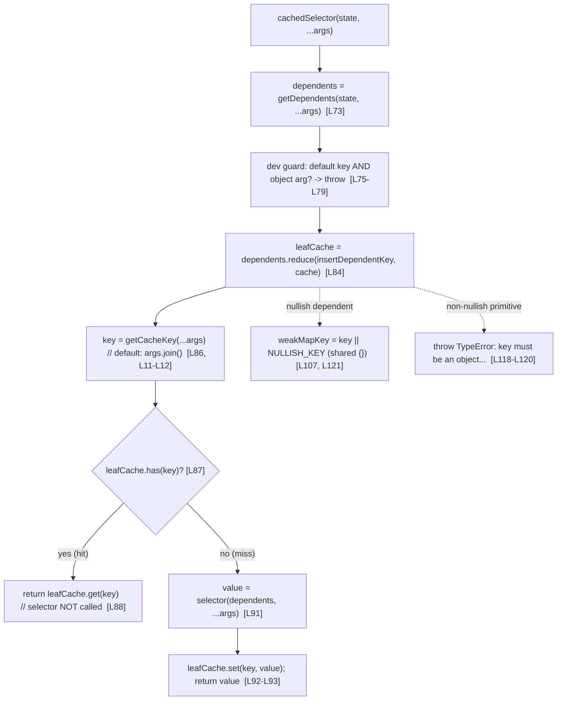

# Investigating stale results from the `@automattic/tree-select` memoized-selector layer

> **Reported symptom.** _"A component retrieves filtered data from a central store and observes stale results returned even after the underlying data changed."_ Six sub-questions (Q1–Q6) follow. Constraint (verbatim): _"Please don't modify any source files during your investigation."_

This document answers all six questions **from executed code**, not from reading alone. Every claim carries an exact `file:line` citation or an _observed-output_ citation. The primary evidence is a temporary probe (`/tmp/ts_probe.mjs`) that imports the **actual** package source `packages/tree-select/src/index.ts` and runs each scenario with an instrumented call counter under `NODE_ENV=development` (so the package's development guards are active). The full probe source, the exact command, and the complete captured output are reproduced in the [Reproduction appendix](#reproduction-appendix). The package's own Jest suite (`17 passed, 17 total`) corroborates every behavior.

The subject is a single 131-line module: `packages/tree-select/src/index.ts:L1-L131`. It is published as `@automattic/tree-select` v2.0.0 (`packages/tree-select/package.json:L2-L3`) and consumed by exactly **10** Redux selector modules under `client/state/**` — the "central store" the report refers to (see [How this maps to the reported symptom](#how-this-maps-to-the-reported-symptom)).

---

## TL;DR — the six answers at a glance

| #      | Question                                                                                 | Short answer                                                                                                                                                                                                                        | Primary evidence                                                 |
| ------ | ---------------------------------------------------------------------------------------- | ----------------------------------------------------------------------------------------------------------------------------------------------------------------------------------------------------------------------------------- | ---------------------------------------------------------------- |
| **Q1** | What determines a cache **hit vs. miss**?                                                | Two mechanisms at two levels: **dependents** are matched by **WeakMap/Map key identity = reference (`===`) equality**; **leaf arguments** are matched by **string equality** of the generated cache key (`args.join()` by default). | `src/index.ts:L84`, `L123-L126`, `L128`, `L11-L12`, `L86-L88`    |
| **Q2** | How many times does the selector **actually run** when dependent state changes?          | Only on a **miss**. Observed: 3 identical calls → **1**; after the watched dependent's reference changes → **2**; after `clearCache()` + repeat → **3**.                                                                            | `src/index.ts:L87-L93`; observed output                          |
| **Q3** | Separate entry **per argument**, or does a new argument **invalidate** the prior result? | Separate, **coexisting** entries per unique argument key — a new argument does **not** evict the prior one. Observed: interleaving `site1,site2,site1,site2` → only **2** executions.                                               | `src/index.ts:L128`, `L92`; observed output                      |
| **Q4** | Can you **clear the whole cache** programmatically?                                      | **Yes** — the returned selector exposes `clearCache()`, which swaps the root `WeakMap` wholesale (O(1)).                                                                                                                            | `src/index.ts:L29-L32`, `L96-L99`; observed output               |
| **Q5** | **Nullish** vs. **primitive** dependents?                                                | **Nullish** (`null`/`undefined`) → memoized under one **shared `NULLISH_KEY` object** → **this is the root cause of stale results**. **Non-nullish primitive** (number/boolean/non-empty string) → **throws `TypeError`**.          | `src/index.ts:L107`, `L121`, `L118-L120`; observed output        |
| **Q6** | Can you **customize cache-key generation** for complex query objects?                    | **Yes** — pass `options.getCacheKey`. It both replaces the default key generation **and** disables the dev guard that otherwise rejects object arguments.                                                                           | `src/index.ts:L24-L27`, `L67`, `L86`, `L75-L79`; observed output |

**Bottom line for the reported bug:** the most likely root cause is **Q5** — a `getDependents` that returns a **nullish** value collapses every distinct state to the single shared `NULLISH_KEY` object, so the second call returns the first call's cached (stale) result. A secondary path is a **dependent reference that does not change** when nested data mutates (a Redux immutability violation), which reuses the WeakMap branch and never recomputes.

---

## How the cache works (mechanism overview)

`treeSelect( getDependents, selector, options )` returns a `cachedSelector` function `packages/tree-select/src/index.ts:L42-L56`. On every call it:

1. Computes `dependents = getDependents( state, ...args )` — an **array** of the state slices this selector depends on `packages/tree-select/src/index.ts:L73`.
2. Walks a **tree of maps**, one level per dependent, via `dependents.reduce( insertDependentKey, cache )`, landing on a **leaf `Map`** `packages/tree-select/src/index.ts:L84`.
3. Computes a **string key** from the leaf arguments: `key = getCacheKey( ...args )` (default `args.join()`) `packages/tree-select/src/index.ts:L86`, `L11-L12`.
4. **Hit:** if `leafCache.has( key )`, returns `leafCache.get( key )` **without calling the selector** `packages/tree-select/src/index.ts:L87-L89`.
5. **Miss:** otherwise calls `selector( dependents, ...args )`, stores the result under `key`, and returns it `packages/tree-select/src/index.ts:L91-L93`.

The interior nodes are `WeakMap`s keyed by **dependent object identity**; the final node is a regular `Map` keyed by the **string** cache key `packages/tree-select/src/index.ts:L128`. This is why interior comparison is by reference and leaf comparison is by string equality (Q1). Using `WeakMap`s for interior nodes lets the garbage collector reclaim cached results whose dependents are no longer referenced — the reason the library is called _tree_-select `packages/tree-select/README.md:L4`.



> **Note on the ambient `process` declaration.** `packages/tree-select/src/index.ts:L1-L5` declares `process` as a type-only ambient. It is erased at runtime; the real Node `process` object supplies `process.env.NODE_ENV`, which is why running under `NODE_ENV=development` keeps the guards at `L57-L63` and `L75-L79` active.

---

## Q1 — What is the precise comparison mechanism (cache hit vs. cache miss)?

**Answer: there are two _different_ comparison mechanisms operating at two levels of the cache tree.**

- **Interior "dependent" nodes are matched by `WeakMap`/`Map` key identity — i.e., reference (`===`) equality.** The reduction `dependents.reduce( insertDependentKey, cache )` walks one map per dependent `packages/tree-select/src/index.ts:L84`, and `insertDependentKey` looks up each dependent with `map.get( weakMapKey )` `packages/tree-select/src/index.ts:L123-L126`. A `WeakMap`/`Map` `.get()` matches keys by identity, so a dependent is a **hit only if it is the _same object reference_** as on a previous call. Interior nodes are `WeakMap`s (object keys) `packages/tree-select/src/index.ts:L128`.
- **Leaf arguments are matched by string equality of the generated cache key.** After walking to the leaf `Map`, the code computes `key = getCacheKey( ...args )` `packages/tree-select/src/index.ts:L86` and probes `leafCache.has( key )` `packages/tree-select/src/index.ts:L87`. The default key generator is `args.join()` `packages/tree-select/src/index.ts:L11-L12`, which stringifies the arguments; the leaf node is a regular `Map` keyed by that string `packages/tree-select/src/index.ts:L128`.

**Why.** The design is a _tree of maps_: one interior `WeakMap` level per dependent (keyed by object identity) leading to a single leaf `Map` (keyed by the joined-argument string). Reference identity at the interior levels is exactly the Redux contract — because Redux discourages in-place mutation, an unchanged slice keeps the same reference, and a changed slice gets a new reference. The README states this reliance on referential (not deep) equality explicitly: `packages/tree-select/README.md:L40`.

Observed (probe output; default key demonstration and reference-vs-copy behavior):

```text
--- Q1: comparison mechanism ---
default key for args ['a',1,true] -> args.join() = "a,1,true"
same dependent reference, 2 calls -> selector executions = 1 (expect 1)
new dependent reference (shallow-copied), 3rd call -> selector executions = 2 (expect 2)
```

The first line shows the default cache key for `['a', 1, true]` is the string `"a,1,true"` (leaf string equality). The next two lines show that **holding the dependent reference constant** yields a hit (1 execution), while **replacing it with a shallow copy** (a new reference containing equal data) forces a miss (2 executions) — proving interior comparison is by reference, not deep value. Corroborated by the suite: cache hit asserts `toHaveLength( 1 )` `packages/tree-select/test/index.js:L45`.

---

## Q2 — How many times does the underlying selector actually execute when dependent state changes between calls?

**Answer: the selector runs _only on a miss_ `packages/tree-select/src/index.ts:L87-L93`.** Concrete counts measured by an instrumented counter:

- **3 identical calls → 1 execution** (two subsequent calls are hits).
- After the watched dependent's **reference changes → 2 executions** (the change busts the cache).
- After **`clearCache()` and one more call → 3 executions** (the clear forces recomputation).

Observed (probe output):

```text
--- Q2: invocation counts ---
3 identical calls -> executions = 1 (expect 1)
after dependent state change -> executions = 2 (expect 2)
after clearCache() + repeat -> executions = 3 (expect 3)
```

**Why.** On a hit the function returns `leafCache.get( key )` and never touches `selector` `packages/tree-select/src/index.ts:L88`. A changed dependent reference produces a brand-new `WeakMap` branch (there is no existing sub-map to reuse at `packages/tree-select/src/index.ts:L123-L126`, so a fresh map is created at `L128`), landing on an empty leaf — a miss that invokes the selector at `packages/tree-select/src/index.ts:L91`. `clearCache()` replaces the entire root `WeakMap`, so the next call also misses (see Q4). The suite corroborates both the hit count (`toHaveLength( 1 )` at `packages/tree-select/test/index.js:L45`) and the bust-on-watched-state-change count (`toHaveLength( 2 )` at `packages/tree-select/test/index.js:L158`).

> **Directly relevant to the report:** if the selector executes **fewer** times than expected when you believe the data changed, then from `treeSelect`'s perspective the _dependent reference did not actually change_ (or it collapsed to `NULLISH_KEY` — see Q5). The invocation count is the diagnostic: instrument the selector with a counter exactly as this probe does.

---

## Q3 — Does the cache keep a separate entry per unique argument, or does a new argument invalidate the previous result?

**Answer: it keeps _separate, coexisting_ entries per unique argument key. Calling with a different argument does _not_ evict the previously cached result.**

Observed (probe output) — interleaving two site ids:

```text
--- Q3: per-argument entries coexist ---
calls after site1,site2,site1,site2 = 2 (expect 2 => both entries coexist)
site1 result identity preserved across interleaving: true (expect true)
site2 result identity preserved across interleaving: true (expect true)
```

Four calls in the order `site1, site2, site1, site2` produce only **2** executions — one per distinct key — and the `site1` and `site2` results each retain **referential identity** across the interleave (`true`/`true`). If a new argument evicted the prior entry, the third and fourth calls would recompute (yielding 4 executions and new object identities); they do not.

**Why.** Distinct argument keys are stored side by side in the **same leaf `Map`** via `leafCache.set( key, value )` `packages/tree-select/src/index.ts:L92`; that leaf is a regular `Map` (created at `packages/tree-select/src/index.ts:L128`) which **grows** with each new key rather than replacing its single entry. This is the opposite of a classic Reselect default memoizer, whose cache size is one and therefore discards the previous result whenever the arguments change. Corroborated by the suite's "maintain the cache for unique dependents simultaneously" test, which asserts `toHaveLength( 2 )` after interleaved calls `packages/tree-select/test/index.js:L161-L186` (assertion at `L185`).

---

## Q4 — Is there a way to programmatically clear the entire cache for a selector?

**Answer: yes — the returned selector exposes a `clearCache()` method.** It is declared on the `CachedSelector` interface `packages/tree-select/src/index.ts:L29-L32` (specifically `clearCache: () => void` at `L31`) and implemented at `packages/tree-select/src/index.ts:L96-L99`.

Observed (probe output):

```text
--- Q4: clearCache() ---
repeated call returns identical object (memo === first): true (expect true)
after clearCache(), same inputs -> identical to first? false (expect false, recomputed)
typeof getSitePosts.clearCache = function
```

`clearCache` is a real `function`; a repeated call returns the **identical** memoized object (`true`); and after `clearCache()` the same inputs produce a **freshly recomputed** object that is no longer identical to the first (`false`).

**Why.** The implementation replaces the whole root cache in one statement:

```ts
cachedSelector.clearCache = () => {
	// WeakMap doesn't have `clear` method, so we need to recreate it
	cache = new WeakMap();
};
```

`packages/tree-select/src/index.ts:L96-L99`. Because a `WeakMap` has no `.clear()` method (noted in the code comment at `L97`), clearing is done by **reassigning `cache` to a fresh `WeakMap`** — an **O(1) reference swap** that drops every branch at once. The old tree is then eligible for garbage collection. Corroborated by the suite's "should bust the cache when `clearCache()` method is called" test: `memoizedResult` `toBe( firstResult )` at `packages/tree-select/test/index.js:L210`, and `afterClearResult` **not** `toBe( firstResult )` at `packages/tree-select/test/index.js:L216`.

> **Scope caveat.** `clearCache()` clears the cache **for that one selector instance only** (it closes over that selector's own `cache` variable). There is no global "clear all tree-selectors" API.

---

## Q5 — What happens when the dependency getter returns nullish values vs. primitive values (numbers, booleans)? — **THE ROOT CAUSE**

There are **two distinct behaviors**, and the first is the most likely explanation for the reported "stale results."

### Q5a — Nullish dependents (`null` / `undefined`) → collapse to a single shared key (STALE)

**Answer: a nullish dependent is memoized under a _single shared_ `NULLISH_KEY` object.** Two genuinely different states that both yield a nullish dependent therefore collapse to the **same** cache branch, and the second call returns the **first call's cached object** — i.e., a stale result.

Observed (probe output):

```text
--- Q5: nullish (ROOT CAUSE) vs primitive dependents ---
nullish dependents, two DIFFERENT states, same arg -> executions = 1 (expect 1 => STALE)
second result is identical (stale) object of first: true (expect true)
stale result value = {"tag":"same","computedFrom":null}
```

Two _different_ state objects (`{ value: null }` and a separate `{ value: null }`), each producing a nullish dependent, with the **same** argument, yield only **1** execution; the second result is the **identical** (stale) object of the first (`true`).

**Why.** `insertDependentKey` maps any falsy dependent onto one module-level shared object:

```ts
const NULLISH_KEY = {}; // L107
// ...
const weakMapKey = key || NULLISH_KEY; // L121
```

`packages/tree-select/src/index.ts:L104-L107`, `L121`. Since `NULLISH_KEY` is a single shared reference reused for **every** nullish dependent, all such calls land on the **same** WeakMap branch and thus the same leaf `Map`. With an identical argument key, the second call is a hit. Corroborated by the suite's "should memoize a nullish value returned by `getDependents`" test, which asserts `firstResult` `toBe( secondResult )` at `packages/tree-select/test/index.js:L219-L229` (assertion at `L228`).

### Q5b — Non-nullish primitive dependents (number / boolean / non-empty string) → throw `TypeError`

**Answer: a non-nullish primitive dependent throws a `TypeError`.**

Observed (probe output):

```text
primitive dependent throws: TypeError: key must be an object, `null`, or `undefined`
```

**Why.** `WeakMap` keys must be objects. `insertDependentKey` guards this at `packages/tree-select/src/index.ts:L118-L120`:

```ts
if ( key != null && Object( key ) !== key ) {
	throw new TypeError( 'key must be an object, `null`, or `undefined`' );
}
```

The test `Object( key ) !== key` is `true` exactly for non-nullish primitives (a primitive is boxed into a _new_ object by `Object( key )`, so it is not identical to itself), so numbers, booleans, and non-empty strings are rejected; `null`/`undefined` pass the `key != null` short-circuit and are handled by `NULLISH_KEY`. Corroborated by the suite's "throws on a non-nullish primitive value returned by `getDependents`" test, which iterates `[ true, 1, 'a', false, '', 0 ]` and expects each to throw at `packages/tree-select/test/index.js:L231-L241` (assertion at `L239`).

> **Important distinction.** Q5 concerns primitive **dependents** — the values returned _inside the array_ by `getDependents`. This is **different** from primitive **arguments** passed to the selector, which are perfectly allowed (the suite passes `1`, `''`, `'foo'`, `true`, `null`, `undefined` as arguments without throwing at `packages/tree-select/test/index.js:L115-L124`). Only **object** _arguments_ are rejected by default (see Q6).

---

## Q6 — Is there a way to customize how cache keys are generated when complex query objects are passed as arguments?

**Answer: yes — pass an `options.getCacheKey` function.** Doing so has **two** effects:

1. It **replaces** the default `args.join()` key generation. The option is read at `packages/tree-select/src/index.ts:L67` (`const { getCacheKey = defaultGetCacheKey } = options;`) and used at `L86` (`const key = getCacheKey( ...args );`); its type is declared at `packages/tree-select/src/index.ts:L24-L27`.
2. It **disables the development guard** that otherwise rejects object arguments — because that guard only fires when `getCacheKey === defaultGetCacheKey` `packages/tree-select/src/index.ts:L75-L79`. Supplying a custom key therefore **enables** passing object/query arguments.

Observed (probe output):

```text
--- Q6: custom getCacheKey ---
object arg WITHOUT getCacheKey throws: Error: Do not pass objects as arguments to a treeSelector
object arg WITH getCacheKey: no throw, executions = 1 (expect 1)
different query objects, same derived key -> identical result: true (expect true)
first result = [{"id":"id1","siteId":"site1"},{"id":"id2","siteId":"site1"}]
```

Without `getCacheKey`, an object argument throws `Error: Do not pass objects as arguments to a treeSelector`. With `getCacheKey: (q) => ` `` `key:${q.siteId}` ``, two **different** query objects (`{ siteId: 'site1', foo: 'bar' }` and `{ siteId: 'site1', foo: 'baz' }`) that derive the **same** key share the memoized result — **1** execution and identical results (`true`).

**Why.** By default, object arguments are dangerous because `args.join()` stringifies most objects to `"[object Object]"`, which would collide across unrelated queries. The guard at `packages/tree-select/src/index.ts:L75-L79` prevents that footgun in development. Supplying `getCacheKey` signals that the caller has taken responsibility for producing a meaningful string key from the object, so the guard is bypassed and the custom key is used. Corroborated by the suite's "accepts a `getCacheKey` option that enables object arguments" test at `packages/tree-select/test/index.js:L243-L264`, which derives `` `key:${query.siteId}` `` and asserts `firstResult` `toBe( secondResult )` at `L263`.

> **Design implication:** the custom key must be _discriminating_. In the probe, `key:site1` is intentionally identical for both queries (they differ only in `foo`), which is _why_ the two calls share a result. A `getCacheKey` that ignores a field which actually affects the output would itself cause stale results — the mirror image of the Q5 hazard.

---

## How this maps to the reported symptom

The report described _"a component retrieving filtered data from a central store"_ that returns _"stale results even after the underlying data changed."_ Each phrase maps to a concrete piece of the mechanism.

### "central store" = the Redux state tree read by `client/state/**` selectors that wrap `treeSelect`

`@automattic/tree-select` is imported by **exactly 10** selector modules under `client/state/` (verified with `grep -rl "@automattic/tree-select" client/state`). Concrete, primary examples:

- `client/state/comments/selectors/get-post-comments-tree.js:L16` — `export const getPostCommentsTree = treeSelect(` (import at `L1`).
- `client/state/stats/lists/selectors.js:L80` — `export const getSiteStatsPostStreakData = treeSelect(`.
- `client/state/comments/selectors/get-hidden-comments-for-post.js:L8` — `export const getHiddenCommentsForPost = treeSelect(` (import at `L1`).

The remaining seven consumers (definition line in parentheses):

- `client/state/comments/selectors/get-post-oldest-comment-date.js:L14` (`getPostOldestCommentDate`)
- `client/state/comments/selectors/get-post-newest-comment-date.js:L14` (`getPostNewestCommentDate`)
- `client/state/comments/selectors/get-date-sorted-post-comments.js:L7` (`getDateSortedPostComments`)
- `client/state/comments/selectors/get-comment-like.js:L15` (`getCommentLike`)
- `client/state/invites/selectors.js:L80` (`getInviteForSite`)
- `client/state/reader/posts/selectors.js:L16` (`getPostMapByPostKey`)
- `client/state/reader/streams/selectors/get-reader-stream-transformed-items.ts:L19` (`getTransformedStreamItems`)

### "filtered data" = the selector's **arguments** (a site id or query)

The arguments become the **leaf `Map` key** via `getCacheKey` `packages/tree-select/src/index.ts:L86`. For example `getPostCommentsTree` filters comments by `status` and `authorId` arguments `client/state/comments/selectors/get-post-comments-tree.js:L18`, and `getSiteStatsPostStreakData` filters by a `query` object `client/state/stats/lists/selectors.js:L82`.

### "stale results even after the underlying data changed" = the validated root cause (Q5), with a secondary path

- **Primary root cause — nullish dependent collapse.** If `getDependents` returns a **nullish** value (`null`/`undefined`) for two genuinely different states, both collapse to the single shared `NULLISH_KEY` object `packages/tree-select/src/index.ts:L107`, `L121`, so the second call returns the first call's cached object. This is exactly the _"stale results"_ behavior — proven by the Q5 observation (`executions = 1`, `second result is identical (stale) object of first: true`). Note several consumers can produce nullish dependents: e.g., `getSiteStatsForQuery( state, siteId, 'statsStreak', query )` may return `undefined` before data has loaded `client/state/stats/lists/selectors.js:L81`.
- **Secondary path — a dependent reference that does not change when nested data mutates.** Because interior comparison is by reference (Q1), if the underlying data is mutated **in place** (violating Redux immutability) so the dependent keeps its **same reference**, the WeakMap branch is reused and the selector never recomputes — again yielding stale output. The README's whole premise is that state is _not_ mutated in place `packages/tree-select/README.md:L40`.

### Remediation — described only (no code changed, per the read-only directive)

This investigation changes **no** code. For completeness, the fixes a maintainer could consider are:

1. **Avoid returning nullish dependents** from `getDependents` — return a stable non-null sentinel/object so distinct states do not collapse onto `NULLISH_KEY`.
2. **Ensure dependents change reference when the underlying data changes** — use immutable updates so a data change yields a new reference (the Redux contract the library assumes).
3. **Supply a discriminating `getCacheKey`** when arguments are complex objects, so the leaf key distinguishes states that must not share a cached result (Q6).

---

## Caveat: the README's argument order is reversed (documentation bug)

The README's **code examples** call `treeSelect` with the arguments **reversed** relative to the real signature. The true signature is `treeSelect( getDependents, selector, options )` — `getDependents` **first** `packages/tree-select/src/index.ts:L42-L56` (`L53`/`L54`/`L55`). But the README writes:

- `packages/tree-select/README.md:L19` — `const getSitePosts = treeSelect( selector, getDependents );`
- `packages/tree-select/README.md:L49` — `const cachedSelector = treeSelect( selector, getDependents );`

Both pass `selector` **first** and `getDependents` **second** — the wrong order. (The README's _prose_ at `packages/tree-select/README.md:L10-L11` lists `getDependents` before `selector`, which is correct; only the code snippets are reversed.) The tests use the **correct** order: `treeSelect( getDependents, selector )` at `packages/tree-select/test/index.js:L18`. The README's referential-equality description at `packages/tree-select/README.md:L40` is accurate.

**Do not copy the README snippets verbatim** — wiring `selector` and `getDependents` in the README's order will break memoization and can itself present as "the selector never caches / always recomputes" or throws the invalid-arguments `TypeError` at `packages/tree-select/src/index.ts:L57-L63`. This is reported here as a documentation discrepancy; per the read-only directive, `README.md` is **not** modified.

---

## Package facts (cited)

- **Name / version:** `@automattic/tree-select` **v2.0.0** `packages/tree-select/package.json:L2-L3`.
- **Sole runtime dependency:** `tslib ^2.3.0` `packages/tree-select/package.json:L36-L38`. (This is why the source is directly executable via Node type-stripping with zero install — the module is pure, erasable TypeScript.)
- **Source entry:** `calypso:src` → `src/index.ts` `packages/tree-select/package.json:L14`; build outputs `main` `dist/cjs/index.js` `packages/tree-select/package.json:L12` and `module` `dist/esm/index.js` `packages/tree-select/package.json:L13`.
- **Dev dependencies:** `@automattic/calypso-typescript-config` (workspace) and `typescript ^5.8.2` `packages/tree-select/package.json:L39-L42`.
- **Test preset:** `'../../test/packages/jest-preset.js'` `packages/tree-select/jest.config.js:L2`.
- **Test suite size (verified by running):** the package's `packages/tree-select/test/index.js` contains **17** `test()` cases and Jest reports **`17 passed, 17 total`** — see the appendix. _(The task's action plan mentioned "18 tests"; the actual, executed count is 17.)_

---

## Reproduction appendix

### Command

```bash
NODE_ENV=development node --experimental-strip-types /tmp/ts_probe.mjs 2>&1
```

- **Node:** `v22.23.1`, which satisfies the repository engine constraint `^v22.9.0` (`package.json` `engines`). Type stripping via `--experimental-strip-types` requires Node ≥ 22.6.
- **`NODE_ENV=development`** (i.e., not `'production'`) keeps the development guards at `packages/tree-select/src/index.ts:L57-L63` and `L75-L79` **active** so the object-argument and invalid-argument throws are observable.
- **Zero `yarn install` required** for this path: the package's only runtime dependency is `tslib ^2.3.0` `packages/tree-select/package.json:L36-L38` and the source is pure, erasable TypeScript, so `node --experimental-strip-types` runs `src/index.ts` directly.
- The probe was authored at **`/tmp/ts_probe.mjs`**, i.e., **outside** the repository working tree, and **deleted** after the run, so `git status` shows only the new documentation file plus its new parent folders.

### Harmless stderr warning

The run prints one cosmetic warning to **stderr** that does **not** affect results:

```text
(node:PID) [MODULE_TYPELESS_PACKAGE_JSON] Warning: Module type of file:///.../packages/tree-select/src/index.ts is not specified and it doesn't parse as CommonJS.
Reparsing as ES module because module syntax was detected. This incurs a performance overhead.
To eliminate this warning, add "type": "module" to /.../packages/tree-select/package.json.
```

It appears because the probe imports a `.ts` file whose package has no `"type": "module"` field; Node reparses as ESM. It is safe to ignore (and we deliberately did **not** add `"type": "module"`, honoring the read-only directive).

### Probe source (`/tmp/ts_probe.mjs`)

> The `import` path below targets this checkout's repository root. Adjust the absolute path if reproducing from a different checkout.

```js
import treeSelect from '/tmp/blitzy/wp-calypso/blitzy-8b313489-28bd-4da5-b611-7ecdf8f97932_a86fa3/packages/tree-select/src/index.ts';

console.log(
	'NODE_ENV =',
	JSON.stringify( process.env.NODE_ENV ),
	'(non-production => dev guards ACTIVE)'
);
console.log( '--- Q1: comparison mechanism ---' );
console.log( `default key for args ['a',1,true] -> args.join() = "${ [ 'a', 1, true ].join() }"` );
let c1 = 0;
const s1 = treeSelect(
	( st ) => [ st.posts ],
	( deps, siteId ) => {
		c1++;
		return Object.values( deps[ 0 ] ).filter( ( p ) => p.siteId === siteId );
	}
);
const stA = { posts: { a: { id: 'a', siteId: 's1' } } };
s1( stA, 's1' );
s1( stA, 's1' );
console.log( `same dependent reference, 2 calls -> selector executions = ${ c1 } (expect 1)` );
const stA2 = { posts: { ...stA.posts } };
s1( stA2, 's1' );
console.log(
	`new dependent reference (shallow-copied), 3rd call -> selector executions = ${ c1 } (expect 2)`
);

console.log( '--- Q2: invocation counts ---' );
let c2 = 0;
const s2 = treeSelect(
	( st ) => [ st.posts ],
	( deps ) => {
		c2++;
		return Object.values( deps[ 0 ] );
	}
);
const s2a = { posts: { a: 1 } };
s2( s2a, 'x' );
s2( s2a, 'x' );
s2( s2a, 'x' );
console.log( `3 identical calls -> executions = ${ c2 } (expect 1)` );
const s2b = { posts: { a: 2 } };
s2( s2b, 'x' );
console.log( `after dependent state change -> executions = ${ c2 } (expect 2)` );
s2.clearCache();
s2( s2b, 'x' );
console.log( `after clearCache() + repeat -> executions = ${ c2 } (expect 3)` );

console.log( '--- Q3: per-argument entries coexist ---' );
let c3 = 0;
const s3 = treeSelect(
	( st ) => [ st.posts ],
	( deps, siteId ) => {
		c3++;
		return Object.values( deps[ 0 ] ).filter( ( p ) => p.siteId === siteId );
	}
);
const st3 = { posts: { p1: { id: 'p1', siteId: 'site1' }, p2: { id: 'p2', siteId: 'site2' } } };
const r1a = s3( st3, 'site1' );
const r2a = s3( st3, 'site2' );
const r1b = s3( st3, 'site1' );
const r2b = s3( st3, 'site2' );
console.log( `calls after site1,site2,site1,site2 = ${ c3 } (expect 2 => both entries coexist)` );
console.log(
	`site1 result identity preserved across interleaving: ${ r1a === r1b } (expect true)`
);
console.log(
	`site2 result identity preserved across interleaving: ${ r2a === r2b } (expect true)`
);

console.log( '--- Q4: clearCache() ---' );
let c4 = 0;
const s4 = treeSelect(
	( st ) => [ st.posts ],
	( deps, siteId ) => {
		c4++;
		return Object.values( deps[ 0 ] ).filter( ( p ) => p.siteId === siteId );
	}
);
const st4 = { posts: { p1: { id: 'p1', siteId: 'site1' }, p2: { id: 'p2', siteId: 'site1' } } };
const first = s4( st4, 'site1' );
const memo = s4( st4, 'site1' );
console.log(
	`repeated call returns identical object (memo === first): ${ memo === first } (expect true)`
);
s4.clearCache();
const afterClear = s4( st4, 'site1' );
console.log(
	`after clearCache(), same inputs -> identical to first? ${
		afterClear === first
	} (expect false, recomputed)`
);
console.log( `typeof getSitePosts.clearCache = ${ typeof s4.clearCache }` );

console.log( '--- Q5: nullish (ROOT CAUSE) vs primitive dependents ---' );
let c5 = 0;
const s5 = treeSelect(
	( st ) => [ st.value ],
	( deps ) => {
		c5++;
		return { tag: 'same', computedFrom: deps[ 0 ] };
	}
);
const n1 = { value: null };
const n2 = { value: null };
const res1 = s5( n1, 'sameArg' );
const res2 = s5( n2, 'sameArg' );
console.log(
	`nullish dependents, two DIFFERENT states, same arg -> executions = ${ c5 } (expect 1 => STALE)`
);
console.log(
	`second result is identical (stale) object of first: ${ res1 === res2 } (expect true)`
);
console.log( `stale result value = ${ JSON.stringify( res1 ) }` );
try {
	const sp = treeSelect(
		() => [ 1 ],
		() => []
	);
	sp( {} );
	console.log( 'primitive dependent did NOT throw (unexpected)' );
} catch ( e ) {
	console.log( `primitive dependent throws: ${ e.constructor.name }: ${ e.message }` );
}

console.log( '--- Q6: custom getCacheKey ---' );
try {
	const snk = treeSelect(
		( st ) => [ st.posts ],
		( deps, q ) => Object.values( deps[ 0 ] ).filter( ( p ) => p.siteId === q.siteId )
	);
	snk( { posts: {} }, { siteId: 'site1' } );
	console.log( 'object arg WITHOUT getCacheKey did NOT throw (unexpected)' );
} catch ( e ) {
	console.log( `object arg WITHOUT getCacheKey throws: ${ e.constructor.name }: ${ e.message }` );
}
let c6 = 0;
const swk = treeSelect(
	( st ) => [ st.posts ],
	( deps, q ) => {
		c6++;
		return Object.values( deps[ 0 ] ).filter( ( p ) => p.siteId === q.siteId );
	},
	{ getCacheKey: ( q ) => `key:${ q.siteId }` }
);
const st6 = {
	posts: {
		id1: { id: 'id1', siteId: 'site1' },
		id2: { id: 'id2', siteId: 'site1' },
		id3: { id: 'id3', siteId: 'site2' },
	},
};
const r6a = swk( st6, { siteId: 'site1', foo: 'bar' } );
const r6b = swk( st6, { siteId: 'site1', foo: 'baz' } );
console.log( `object arg WITH getCacheKey: no throw, executions = ${ c6 } (expect 1)` );
console.log(
	`different query objects, same derived key -> identical result: ${ r6a === r6b } (expect true)`
);
console.log( `first result = ${ JSON.stringify( r6a ) }` );
```

### Complete captured output (stdout)

```text
NODE_ENV = "development" (non-production => dev guards ACTIVE)
--- Q1: comparison mechanism ---
default key for args ['a',1,true] -> args.join() = "a,1,true"
same dependent reference, 2 calls -> selector executions = 1 (expect 1)
new dependent reference (shallow-copied), 3rd call -> selector executions = 2 (expect 2)
--- Q2: invocation counts ---
3 identical calls -> executions = 1 (expect 1)
after dependent state change -> executions = 2 (expect 2)
after clearCache() + repeat -> executions = 3 (expect 3)
--- Q3: per-argument entries coexist ---
calls after site1,site2,site1,site2 = 2 (expect 2 => both entries coexist)
site1 result identity preserved across interleaving: true (expect true)
site2 result identity preserved across interleaving: true (expect true)
--- Q4: clearCache() ---
repeated call returns identical object (memo === first): true (expect true)
after clearCache(), same inputs -> identical to first? false (expect false, recomputed)
typeof getSitePosts.clearCache = function
--- Q5: nullish (ROOT CAUSE) vs primitive dependents ---
nullish dependents, two DIFFERENT states, same arg -> executions = 1 (expect 1 => STALE)
second result is identical (stale) object of first: true (expect true)
stale result value = {"tag":"same","computedFrom":null}
primitive dependent throws: TypeError: key must be an object, `null`, or `undefined`
--- Q6: custom getCacheKey ---
object arg WITHOUT getCacheKey throws: Error: Do not pass objects as arguments to a treeSelector
object arg WITH getCacheKey: no throw, executions = 1 (expect 1)
different query objects, same derived key -> identical result: true (expect true)
first result = [{"id":"id1","siteId":"site1"},{"id":"id2","siteId":"site1"}]
```

### Optional corroboration — the package's Jest suite

Running the package's own suite corroborates every observed behavior (requires the workspace's `node_modules`):

```bash
CI=true TZ=UTC yarn jest -c=test/packages/jest.config.js packages/tree-select --ci
```

Result (tail):

```text
PASS packages/tree-select/test/index.js
Test Suites: 1 passed, 1 total
Tests:       17 passed, 17 total
Snapshots:   0 total
```

The type-strip probe is the **primary** evidence; Jest is **secondary** corroboration. (The Jest run also emits cosmetic `jest-haste-map: duplicate manual mock` and `Browserslist ... data is 17 months old` warnings, both harmless.)

---

## Coverage check (all six sub-questions addressed)

- **Q1 — comparison mechanism:** dual mechanism — WeakMap/Map key identity (reference `===`) for dependents `packages/tree-select/src/index.ts:L84`, `L123-L126`, `L128`; string equality of `getCacheKey` (default `args.join()`) for leaf args `packages/tree-select/src/index.ts:L11-L12`, `L86-L88`. ✔ observed.
- **Q2 — invocation counts:** miss-only execution `packages/tree-select/src/index.ts:L87-L93`; measured **1 / 2 / 3**. ✔ observed.
- **Q3 — per-argument entries:** coexist in the leaf `Map` `packages/tree-select/src/index.ts:L92`, `L128`; no eviction (only **2** executions across the interleave). ✔ observed.
- **Q4 — clearCache:** exposed method `packages/tree-select/src/index.ts:L31`, `L96-L99`; O(1) `WeakMap` swap. ✔ observed.
- **Q5 — nullish vs. primitive:** nullish → shared `NULLISH_KEY` (stale) `packages/tree-select/src/index.ts:L107`, `L121`; non-nullish primitive → `TypeError` `packages/tree-select/src/index.ts:L118-L120`. ✔ observed.
- **Q6 — custom cache keys:** `options.getCacheKey` replaces key generation **and** unlocks object arguments `packages/tree-select/src/index.ts:L24-L27`, `L67`, `L86`, `L75-L79`. ✔ observed.

_Anything not verifiable by reading or running is stated as such above; every quoted number, string, and error message corresponds to both the cited `src/index.ts` line and the captured run output._
