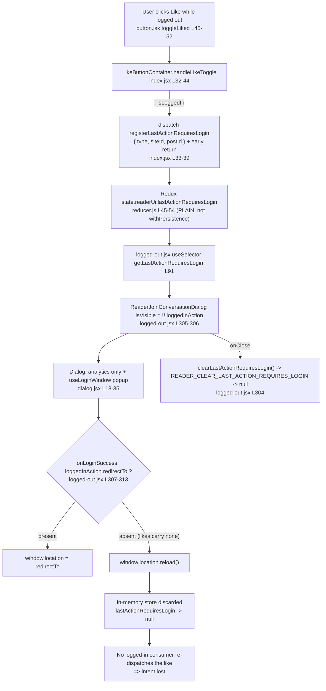

# How a logged-out Reader "like" intent crosses the authentication boundary — and why it is lost

> **Investigation type:** run-first, evidence-backed source + runtime analysis (read-only).
> **Repository:** WordPress Calypso. **Source commit under investigation:** `be7e5cc641622d153040491fd5625c6cb83e12eb` — *"Reader: Show login prompts on all logged out reader streams"*. This document is committed on top of that source commit and changes nothing else in the tree.
> **All `file:line` citations are pinned to `be7e5cc641`** and were re-opened and confirmed during the investigation.
> Every claim below is paired with the exact command that produced it and its **complete, unedited output** — including framework warnings, deprecation notices, and full stack traces, exactly as Jest emitted them (terminal color disabled via `NO_COLOR=1 FORCE_COLOR=0` so the pasted text is plain ASCII). Nothing is elided or truncated. Any statement not backed by runtime output is explicitly labeled **(inferred from reading)**.

---

## TL;DR — the blunt answers

- **Where the intent goes (Q1):** A logged-out like click is written into **in-memory Redux state** at `state.readerUi.lastActionRequiresLogin` as `{ type: 'like' | 'unlike', siteId, postId }` — with **no `redirectTo`** — by the shared container's `handleLikeToggle`, which dispatches `registerLastActionRequiresLogin(...)` and **returns early** [`client/blocks/like-button/index.jsx:33-39`].
- **What brings it back (Q2):** **Nothing. There is no dedicated replay.** The intent has exactly **one** production consumer, `client/layout/logged-out.jsx`, which uses it only to (a) show the login dialog and (b) build analytics props. No logged-in-side code ever re-dispatches the like.
- **Source of truth (Q3):** **(a) in-memory Redux state only.** It is **(b) NOT persisted** — the `lastActionRequiresLogin` reducer is a *plain* reducer with no `.serialize`, so it is omitted from the serialized payload (proven below), unlike its sibling `readerUi.lastPath` which is wrapped with `withPersistence`. The only **(c) handoff token** that crosses the boundary is the `redirect_to` query parameter built by `createAccountUrl`, and it carries **only the page path**, never the like.
- **Exact skip condition (Q4):** On return, `onLoginSuccess` branches on `loggedInAction?.redirectTo` [`client/layout/logged-out.jsx:308`]. A like intent has no `redirectTo`, so the `else` branch runs **`window.location.reload()`** [`:311`], which tears down the in-memory store. Because nothing re-applies the like, it is skipped.
- **Cause classification (Q5):** **Not (a) a timing race.** It is **structural state loss at the reload boundary plus the total absence of any replay logic** — an initialization / state-reconstruction gap (closest to **(b) initialization order**), with a **secondary (c) cleanup** path: the dialog's `onClose` dispatches `clearLastActionRequiresLogin()` (action `READER_CLEAR_LAST_ACTION_REQUIRES_LOGIN`) [`:304`], which nulls the intent deterministically.

In one sentence: **the like intent lives only in memory, is never persisted, is never replayed, and the return path deterministically reloads the page — so it falls through the crack between "in memory" and "persisted."**

---

## The question, restated (verbatim)

The user's original question:

> "I am trying to understand how a logged out intent is supposed to survive the authentication boundary in the Reader, because right now a like clicked while signed out seems to disappear after the user finishes signup or login and returns to an authenticated view. The click clearly triggers a requires login decision, but where does that intent go in the meantime, and what is meant to bring it back once the session becomes valid? I want to follow what the system treats as the source of truth here, whether it is in memory state, something persisted, or a handoff token that lives just long enough to be replayed, because it feels like the intent slips through a crack between those worlds. When the user returns, what exact condition causes the replay path to skip, and is that skip caused by timing, initialization order, or cleanup that quietly clears the pending action before it can be applied? Temporary scripts may be used for observation, but the repository itself should remain unchanged and anything temporary should be cleaned up afterward."

Decomposed into the five named sub-questions answered in this document:

1. **Q1 — Intent destination:** where does the intent go between the click and the authenticated return?
2. **Q2 — Replay mechanism:** what is meant to bring the intent back once the session becomes valid?
3. **Q3 — Source of truth:** is it **(a)** in-memory state, **(b)** something persisted, or **(c)** a handoff token that lives just long enough to be replayed?
4. **Q4 — Exact skip condition:** when the user returns, what exact condition causes the replay path to skip?
5. **Q5 — Skip cause:** is the skip caused by **(a)** timing, **(b)** initialization order, or **(c)** cleanup that quietly clears the pending action before it can be applied?

---

## Environment & exact commands

Toolchain observed (the repository's declared runtime, not the generic Node-20 setup note, which does not apply here):

```
$ node --version
v22.23.1
$ yarn --version
4.0.2
```

`v22.23.1` satisfies `package.json` `engines.node = "^v22.9.0"` (and `.nvmrc` pins `22.9.0`); `yarn 4.0.2` satisfies `engines.yarn = "^4.0.0"` and matches `packageManager: "yarn@4.0.2"`.

**Git state.** `HEAD` is this documentation commit; it adds **only** this file on top of the investigated source commit `be7e5cc641622d153040491fd5625c6cb83e12eb`. Every `file:line` citation is pinned to `be7e5cc641`, and the source tree is byte-for-byte identical to it (the commit changes nothing but this document):

```
$ git rev-parse HEAD
36915916105dd1a2d95e96ca6d87ff4f76048e1b
$ git log -1 --pretty='%h %s'
3691591610 docs: add run-first investigation of logged-out Reader like intent across the auth boundary
$ git diff --name-status be7e5cc641..HEAD
A	blitzy/documentation/wp-calypso_be7e5cc64162.md
```

**Baseline working tree — clean before any observation script was created.** The read-only scope was verified first; the temporary observation specs described below were created only to observe and were deleted afterward, restoring exactly this state:

```
$ git status --porcelain
$ git status
On branch blitzy-686353a2-3647-4ebf-aaa7-312a4acb3dc7
Your branch is up to date with 'origin/blitzy-686353a2-3647-4ebf-aaa7-312a4acb3dc7'.

nothing to commit, working tree clean
```

(`git status --porcelain` prints nothing at all — an empty porcelain listing is, by definition, a clean tree.)

**Dependencies were pre-provisioned** (`node_modules` is approximately 3.1 GB, resolved from the committed `yarn.lock`). Re-running the install is a no-op that confirms the lockfile is already satisfied; no manifest or lockfile change was made:

```
$ COREPACK_ENABLE_DOWNLOAD_PROMPT=0 yarn install --immutable
➤ YN0000: · Yarn 4.0.2
➤ YN0000: ┌ Resolution step
➤ YN0000: └ Completed in 0s 522ms
➤ YN0000: ┌ Fetch step
➤ YN0000: └ Completed in 4s 511ms
➤ YN0000: ┌ Link step
➤ YN0000: └ Completed in 1s 100ms
➤ YN0000: · Done in 6s 434ms
```

All runtime observations use the repository's own Jest harness and client config. Each observation is a **temporary** `blitzy_adhoc_test_*.js(x)` spec placed in the relevant `test/` directory (Jest's `testMatch` requires specs to live under a `test/` folder) and invoked directly by path. The exact commands used in this document are:

```
# One spec per observation (color disabled so the pasted output is plain ASCII):
NO_COLOR=1 FORCE_COLOR=0 TZ=UTC CI=true yarn jest -c=test/client/jest.config.js client/blocks/like-button/test/blitzy_adhoc_test_logged_out_click.jsx
NO_COLOR=1 FORCE_COLOR=0 TZ=UTC CI=true yarn jest -c=test/client/jest.config.js client/state/reader-ui/test/blitzy_adhoc_test_intent_lifecycle.js
NO_COLOR=1 FORCE_COLOR=0 TZ=UTC CI=true yarn jest -c=test/client/jest.config.js client/state/reader-ui/test/blitzy_adhoc_test_edge_branches.js
NO_COLOR=1 FORCE_COLOR=0 TZ=UTC CI=true yarn jest -c=test/client/jest.config.js client/blocks/reader-join-conversation/test/blitzy_adhoc_test_return_path.jsx
NO_COLOR=1 FORCE_COLOR=0 TZ=UTC CI=true yarn jest -c=test/client/jest.config.js client/blocks/like-button/test/blitzy_adhoc_test_reader_wrapper.jsx
NO_COLOR=1 FORCE_COLOR=0 TZ=UTC CI=true yarn jest -c=test/client/jest.config.js client/layout/test/blitzy_adhoc_test_tag_embed.jsx
NO_COLOR=1 FORCE_COLOR=0 TZ=UTC CI=true yarn jest -c=test/client/jest.config.js client/blocks/reader-join-conversation/test/blitzy_adhoc_test_dialog_close.jsx
```

> Every Jest run prepends the following benign notice (a *warning*, not an error; it does not affect any result). It is shown here once and then appears **verbatim at the top of each output block below** — nothing is elided:
>
> ```
> Browserslist: browsers data (caniuse-lite) is 17 months old. Please run:
>   npx update-browserslist-db@latest
>   Why you should do it regularly: https://github.com/browserslist/update-db#readme
> ```

**Harness sanity check — the existing, committed `reader-ui` specs pass** (proving the toolchain and the exact state shape `{ type:'like', siteId:123, postId:456 }` before writing any observation spec). Complete, unedited output:

```
Browserslist: browsers data (caniuse-lite) is 17 months old. Please run:
  npx update-browserslist-db@latest
  Why you should do it regularly: https://github.com/browserslist/update-db#readme
PASS client/state/reader-ui/test/actions.js
PASS client/state/reader-ui/test/reducer.js
PASS client/state/reader-ui/test/selectors.js

Test Suites: 3 passed, 3 total
Tests:       7 passed, 7 total
Snapshots:   0 total
Time:        1.005 s
Ran all test suites matching /client\/state\/reader-ui\/test\/reducer.js|client\/state\/reader-ui\/test\/actions.js|client\/state\/reader-ui\/test\/selectors.js/i.
```

---

## Q1 — Where does the intent go?

**Direct answer:** It goes into **in-memory Redux state** at `state.readerUi.lastActionRequiresLogin`, as the object `{ type: 'like' | 'unlike', siteId, postId }`. Nothing else happens on the click — the shared container dispatches the intent and returns early.

**Cause -> effect.** The DOM click enters at `LikeButton.toggleLiked`, which calls `this.props.onLikeToggle( ! this.props.liked )` [`client/blocks/like-button/button.jsx:45-52`, wired at `:97` and labeled at `:100`]. That `onLikeToggle` prop is the shared container's `handleLikeToggle` [`client/blocks/like-button/index.jsx:32-44`]:

```js
handleLikeToggle = ( liked ) => {
    if ( ! this.props.isLoggedIn ) {
        return this.props.registerLastActionRequiresLogin( {
            type: liked ? 'like' : 'unlike',
            siteId: this.props.siteId,
            postId: this.props.postId,
        } );
    }

    const toggler = liked ? this.props.like : this.props.unlike;
    toggler( this.props.siteId, this.props.postId, { source: this.props.likeSource } );
    this.props.onLikeToggle( liked );
};
```

The enclosing condition is `if ( ! this.props.isLoggedIn )` [`:33`]. When it holds, the function **`return`s** the dispatch of `registerLastActionRequiresLogin({ type, siteId, postId })` [`:34-39`] and the real like/unlike (`this.props.like`/`unlike`) at `:41-42` is **never reached**. Note the deliberate **absence of any `redirectTo` field** in the payload — this is the root of the Q4 skip. `connect` supplies `isLoggedIn: isUserLoggedIn(state)` and binds the action creators [`:76`, `:79`]. The action creator itself is a plain object action [`client/state/reader-ui/actions.js:26-29`], and the reducer stores `action.lastAction` verbatim [`client/state/reader-ui/reducer.js:45-54`].

**Observation — real DOM click, before/during/after.** A temporary spec rendered the **real connected `LikeButtonContainer`** (not a bypassing hook), seeded `currentUser.id = null` so `isUserLoggedIn` is `false`, spied on `store.dispatch`, and clicked the button via `@testing-library/user-event`. Both the **like** (not-yet-liked -> `aria-label "Like"`) and **unlike** (seeded `iLike: true` -> `aria-label "Liked"`) real clicks were exercised.

Command:

```
NO_COLOR=1 FORCE_COLOR=0 TZ=UTC CI=true yarn jest -c=test/client/jest.config.js \
    client/blocks/like-button/test/blitzy_adhoc_test_logged_out_click.jsx
```

Complete, unedited output (Jest writes the per-test `console.error`/`console.log` lines to stderr under the `● Console` group; the `console.error` is the React `defaultProps` deprecation warning with its full origin stack and babel code-frame — kept in full):

```
Browserslist: browsers data (caniuse-lite) is 17 months old. Please run:
  npx update-browserslist-db@latest
  Why you should do it regularly: https://github.com/browserslist/update-db#readme
PASS client/blocks/like-button/test/blitzy_adhoc_test_logged_out_click.jsx
  ● Console

    console.error
      Warning: LikeIcons: Support for defaultProps will be removed from function components in a future major release. Use JavaScript default parameters instead.
          at size (/tmp/blitzy/wp-calypso/blitzy-686353a2-3647-4ebf-aaa7-312a4acb3dc7_85f076/client/blocks/like-button/icons.jsx:4:23)
          at li
          at LikeButton (/tmp/blitzy/wp-calypso/blitzy-686353a2-3647-4ebf-aaa7-312a4acb3dc7_85f076/client/blocks/like-button/button.jsx:40:3)
          at /tmp/blitzy/wp-calypso/blitzy-686353a2-3647-4ebf-aaa7-312a4acb3dc7_85f076/packages/i18n-calypso/src/localize.js:19:26
          at LikeButtonContainer (/tmp/blitzy/wp-calypso/blitzy-686353a2-3647-4ebf-aaa7-312a4acb3dc7_85f076/client/blocks/like-button/index.jsx:15:45)
          at ConnectFunction (/tmp/blitzy/wp-calypso/blitzy-686353a2-3647-4ebf-aaa7-312a4acb3dc7_85f076/node_modules/react-redux/src/components/connect.tsx:526:15)
          at forwardConnectRef
          at Provider (/tmp/blitzy/wp-calypso/blitzy-686353a2-3647-4ebf-aaa7-312a4acb3dc7_85f076/node_modules/react-redux/src/components/Provider.tsx:60:11)

      69 | 		);
      70 |
    > 71 | 		render(
         | 		      ^
      72 | 			<Provider store={ store }>
      73 | 				<LikeButtonContainer siteId={ 123 } postId={ 456 } />
      74 | 			</Provider>

      at printWarning (../node_modules/react-dom/cjs/react-dom.development.js:86:30)
      at error (../node_modules/react-dom/cjs/react-dom.development.js:60:7)
      at validateFunctionComponentInDev (../node_modules/react-dom/cjs/react-dom.development.js:20230:9)
      at mountIndeterminateComponent (../node_modules/react-dom/cjs/react-dom.development.js:20189:7)
      at beginWork (../node_modules/react-dom/cjs/react-dom.development.js:21626:16)
      at beginWork$1 (../node_modules/react-dom/cjs/react-dom.development.js:27465:14)
      at performUnitOfWork (../node_modules/react-dom/cjs/react-dom.development.js:26599:12)
      at workLoopSync (../node_modules/react-dom/cjs/react-dom.development.js:26505:5)
      at renderRootSync (../node_modules/react-dom/cjs/react-dom.development.js:26473:7)
      at performConcurrentWorkOnRoot (../node_modules/react-dom/cjs/react-dom.development.js:25777:74)
      at flushActQueue (../node_modules/react/cjs/react.development.js:2667:24)
      at act (../node_modules/react/cjs/react.development.js:2582:11)
      at ../node_modules/@testing-library/react/dist/act-compat.js:47:25
      at renderRoot (../node_modules/@testing-library/react/dist/pure.js:188:26)
      at render (../node_modules/@testing-library/react/dist/pure.js:287:10)
      at Object.<anonymous> (blocks/like-button/test/blitzy_adhoc_test_logged_out_click.jsx:71:9)

    console.log
      LIKE: isLoggedIn BEFORE = false
      LIKE: BEFORE readerUi.lastActionRequiresLogin = null
      LIKE: DISPATCHED = [
        {
          "type": "READER_REGISTER_LAST_ACTION_REQUIRES_LOGIN",
          "lastAction": {
            "type": "like",
            "siteId": 123,
            "postId": 456
          }
        }
      ]
      LIKE: AFTER readerUi.lastActionRequiresLogin = {"type":"like","siteId":123,"postId":456}
      LIKE: AFTER redirectTo field = undefined

      at Object.log (blocks/like-button/test/blitzy_adhoc_test_logged_out_click.jsx:32:11)

    console.log
      UNLIKE: isLoggedIn BEFORE = false
      UNLIKE: BEFORE readerUi.lastActionRequiresLogin = null
      UNLIKE: DISPATCHED = [
        {
          "type": "READER_REGISTER_LAST_ACTION_REQUIRES_LOGIN",
          "lastAction": {
            "type": "unlike",
            "siteId": 123,
            "postId": 456
          }
        }
      ]
      UNLIKE: AFTER readerUi.lastActionRequiresLogin = {"type":"unlike","siteId":123,"postId":456}

      at Object.log (blocks/like-button/test/blitzy_adhoc_test_logged_out_click.jsx:32:11)


Test Suites: 1 passed, 1 total
Tests:       2 passed, 2 total
Snapshots:   0 total
Time:        3.497 s, estimated 4 s
Ran all test suites matching /client\/blocks\/like-button\/test\/blitzy_adhoc_test_logged_out_click.jsx/i.
```

**Reading of the result.** For the **like** click: `LIKE: BEFORE readerUi.lastActionRequiresLogin = null` -> a single `READER_REGISTER_LAST_ACTION_REQUIRES_LOGIN` action is dispatched -> `LIKE: AFTER readerUi.lastActionRequiresLogin = {"type":"like","siteId":123,"postId":456}` with `LIKE: AFTER redirectTo field = undefined`. The **unlike** click is identical except `UNLIKE: AFTER readerUi.lastActionRequiresLogin = {"type":"unlike","siteId":123,"postId":456}`. The one `console.error` shown above is React's `LikeIcons: Support for defaultProps will be removed` deprecation — **not** a failure; its stack (`at size (client/blocks/like-button/icons.jsx:4:23)` -> `at LikeButton (client/blocks/like-button/button.jsx:40:3)` -> `localize.js:19` -> `at LikeButtonContainer (client/blocks/like-button/index.jsx:15:45)` -> `ConnectFunction` -> `Provider`) is itself the proof that the **real connected component tree rendered** and the click traversed the genuine entry point. This is the complete "meantime" home of the intent: a single field in the in-memory Redux store, with no `redirectTo` and no side effect beyond the store write.

---

## Q2 — What is meant to bring the intent back?

**Direct answer: Nothing — there is no dedicated replay.** The stored intent is read by exactly **one** production file, `client/layout/logged-out.jsx`, and it is used only to (a) decide whether to show the login dialog and (b) build analytics event properties. **No logged-in-side code re-reads the intent and re-dispatches the like.**

**Cause -> effect.** The single consumer imports the selector and reads it once via `useSelector`:

- `import { getLastActionRequiresLogin } from 'calypso/state/reader-ui/selectors';` [`client/layout/logged-out.jsx:44`]
- `const loggedInAction = useSelector( getLastActionRequiresLogin );` [`:91`]

`loggedInAction` is then passed to `<ReaderJoinConversationDialog>` (`isVisible={ !! loggedInAction }`, `loggedInAction={ loggedInAction }`) [`:305-306`]. Inside the dialog, `loggedInAction` is consumed **only** to assemble analytics props — `{ type, blog_id, post_id, tag }` in `trackEvent` [`client/blocks/reader-join-conversation/dialog.jsx:18-29`]; on success the dialog merely calls the parent callback: `handleLoginSuccess -> onLoginSuccess()` [`:31-35`]. The popup hook likewise only calls `onLoginSuccess()` after validating the postMessage — it never touches likes [`client/data/reader/use-login-window.ts:52-60`]. The `like`/`unlike` action creators that a replay *would* invoke [`client/state/posts/likes/actions.js:52,65`] are never called from any consumer of the intent.

**Observation — grep proves the sole consumer.** Searching the entire `client/` tree for the selector and state key, excluding the definition module (`reader-ui/{reducer,selectors,actions,action-types}.js`), its tests, and the temporary observation specs:

Command:

```
grep -rn "getLastActionRequiresLogin\|lastActionRequiresLogin" client/ \
    --include=*.js --include=*.jsx --include=*.ts --include=*.tsx \
  | grep -v "reader-ui/reducer.js\|reader-ui/selectors.js\|reader-ui/actions.js\|reader-ui/action-types.js\|reader-ui/test\|blitzy_adhoc_test"
```

Complete, unedited output:

```
client/layout/logged-out.jsx:44:import { getLastActionRequiresLogin } from 'calypso/state/reader-ui/selectors';
client/layout/logged-out.jsx:91:	const loggedInAction = useSelector( getLastActionRequiresLogin );
```

And the number of distinct production consumer **files** (same filter, piped to `wc -l`):

```
1
```

**Reading of the result.** The intent has a single reader, and that reader is a *logged-out* layout whose only job is to prompt for login and, on success, navigate. There is no code on the authenticated side that observes `lastActionRequiresLogin` and completes the pending like. The "replay" the user is looking for does not exist.

---

## Q3 — What is the source of truth? (in-memory / persisted / handoff token)

Answering each of the three candidates the question names, **by name**:

- **(a) in-memory state — YES, this is the sole source of truth.** The intent lives at `state.readerUi.lastActionRequiresLogin`, written by a *plain* reducer [`client/state/reader-ui/reducer.js:45-54`] and read by `getLastActionRequiresLogin` [`client/state/reader-ui/selectors.js:15-21`].
- **(b) something persisted — NO.** The `lastActionRequiresLogin` reducer is **not** wrapped with `withPersistence`, so it is **excluded from the serialized payload** and resets to its initial `null` on any store re-initialization. Its sibling `readerUi.lastPath` **is** wrapped (`export const lastPath = withPersistence( ... )` [`:19`], read via `getLastPath` -> `state.readerUi.lastPath` [`client/state/reader-ui/selectors.js:7`]) and **does** persist. Proven at runtime below.
- **(c) a handoff token that lives just long enough to be replayed — only partially, and it does not carry the like.** The one durable token that crosses the boundary is the `redirect_to` query parameter built by `createAccountUrl` [`client/lib/paths/index.js:24-26`], which encodes **only the page path** (plus a `ref`), never the like intent.

**Cause -> effect (why (b) is NO).** Persistence in Calypso is opt-in. `serialize(reducer, state)` returns `undefined` unless the reducer has a `.serialize` method [`client/state/utils/serialize.ts:10-16`]; `withPersistence` is what attaches `.serialize`/`.deserialize` [`client/state/utils/with-persistence.ts:16-24`]; and the custom `combineReducers` only includes a child in the serialized `SerializationResult` when that child's `serialize()` is not `undefined` [`client/state/utils/reducer-utils.ts:213-235`]. Therefore the plain `lastActionRequiresLogin` (no `.serialize`) is silently dropped, while `readerUi.lastPath` (wrapped) survives. This matches Calypso's own docs, quoted here **corroboratively only** (the behavior is proven at runtime below): `docs/data-persistence.md` states the entire Redux state is not persisted by default, that persistence is opted into by wrapping a reducer, and that opting out is achieved by combining reducers without an attached schema [`docs/data-persistence.md:7,23,31`].

**Observation — SERIALIZE / rehydrate round-trip.** A temporary spec built the `readerUi` subtree two ways — a minimal three-child combine **and** the full six-child combine mirroring `reducer.js:56-63` exactly — populated the like intent and (for contrast) `readerUi.lastPath` via `viewStream('reader-stream','/reader')`, then serialized, extracted the stored `root` bucket (`SerializationResult.root()`), and deserialized it (the faithful reload round-trip). The observation is deterministic; the message lines were verified byte-identical across repeated runs (only the trailing `Time:` line varies).

Command:

```
NO_COLOR=1 FORCE_COLOR=0 TZ=UTC CI=true yarn jest -c=test/client/jest.config.js \
    client/state/reader-ui/test/blitzy_adhoc_test_intent_lifecycle.js
```

Complete, unedited output:

```
Browserslist: browsers data (caniuse-lite) is 17 months old. Please run:
  npx update-browserslist-db@latest
  Why you should do it regularly: https://github.com/browserslist/update-db#readme
PASS client/state/reader-ui/test/blitzy_adhoc_test_intent_lifecycle.js
  ● Console

    console.log
      BEFORE lastActionRequiresLogin = null
      BEFORE selector = null
      ACTION(like) = {"type":"READER_REGISTER_LAST_ACTION_REQUIRES_LOGIN","lastAction":{"type":"like","siteId":123,"postId":456}}
      DURING(like) lastActionRequiresLogin = {"type":"like","siteId":123,"postId":456}
      DURING(like) redirectTo = undefined
      DURING(like) selector = {"type":"like","siteId":123,"postId":456}
      DURING(unlike) lastActionRequiresLogin = {"type":"unlike","siteId":123,"postId":456}
      FULL in-memory (min) = {"lastPath":"/reader","currentStream":"reader-stream","lastActionRequiresLogin":{"type":"like","siteId":123,"postId":456}}
      SERIALIZED raw (min) = {"results":{"root":{"lastPath":"/reader"}}}
      PERSISTED root bucket (min) = {"lastPath":"/reader"}
      min: lastActionRequiresLogin in persisted bucket? = false
      min: lastPath in persisted bucket? = true
      AFTER-RELOAD rehydrated (min) = {"lastPath":"/reader","currentStream":null,"lastActionRequiresLogin":null}
      AFTER-RELOAD lastActionRequiresLogin = null
      AFTER-RELOAD lastPath = "/reader"
      cleanup: populated = {"type":"like","siteId":123,"postId":456}
      cleanup: after clear = null

      at Object.log (state/reader-ui/test/blitzy_adhoc_test_intent_lifecycle.js:31:11)

    console.log
      FULL in-memory (full subtree) = {"sidebar":{"isListsOpen":false,"isTagsOpen":false,"isFollowingOpen":false,"openOrganizations":[],"selectedRecentSite":null},"cardExpansions":{},"lastPath":"/reader","currentStream":"reader-stream","lastActionRequiresLogin":{"type":"like","siteId":123,"postId":456},"hasUnseenPosts":false}
      SERIALIZED raw (full subtree) = {"results":{"root":{"sidebar":{"isListsOpen":false,"isTagsOpen":false,"isFollowingOpen":false,"openOrganizations":[]},"lastPath":"/reader"}}}
      full: lastActionRequiresLogin in persisted bucket? = false
      full: lastPath in persisted bucket? = true
      AFTER-RELOAD (full) lastActionRequiresLogin = null
      AFTER-RELOAD (full) lastPath = "/reader"

      at Object.log (state/reader-ui/test/blitzy_adhoc_test_intent_lifecycle.js:31:11)


Test Suites: 1 passed, 1 total
Tests:       2 passed, 2 total
Snapshots:   0 total
Time:        0.773 s, estimated 1 s
Ran all test suites matching /client\/state\/reader-ui\/test\/blitzy_adhoc_test_intent_lifecycle.js/i.
```

**Observation — the (c) handoff token carries only the page path (and the feature-flag values used later).** The same temporary `edge_branches` spec exercises `createAccountUrl` directly (first `console.log` group) and probes the `reader/login-window` flag (second `console.log` group, analysed in the Edge section). Its **complete** output:

Command:

```
NO_COLOR=1 FORCE_COLOR=0 TZ=UTC CI=true yarn jest -c=test/client/jest.config.js \
    client/state/reader-ui/test/blitzy_adhoc_test_edge_branches.js
```

Complete, unedited output:

```
Browserslist: browsers data (caniuse-lite) is 17 months old. Please run:
  npx update-browserslist-db@latest
  Why you should do it regularly: https://github.com/browserslist/update-db#readme
PASS client/state/reader-ui/test/blitzy_adhoc_test_edge_branches.js
  ● Console

    console.log
      createAccountUrl = /start/account?redirect_to=/reader/foo&ref=reader-lp
      contains like/siteId/postId/unlike? = false
      createAccountUrl (tag-embed) = /start/account?redirect_to=/tag/cats&ref=reader-lp

      at Object.log (state/reader-ui/test/blitzy_adhoc_test_edge_branches.js:20:11)

    console.log
      env_id = "test"
      isEnabled('reader/login-window') = false
      guard `! isEnabled('reader/login-window')` (flag OFF) = true
      AFTER config.enable: isEnabled('reader/login-window') = true
      guard `! isEnabled('reader/login-window')` (flag ON) = false
      AFTER config.disable (restored): isEnabled('reader/login-window') = false
      isEnabled('reader') = true
      isEnabled('nonexistent/flag') = false

      at Object.log (state/reader-ui/test/blitzy_adhoc_test_edge_branches.js:20:11)


Test Suites: 1 passed, 1 total
Tests:       2 passed, 2 total
Snapshots:   0 total
Time:        1.024 s
Ran all test suites matching /client\/state\/reader-ui\/test\/blitzy_adhoc_test_edge_branches.js/i.
```

**Reading of the result.** In memory, the intent is present: `FULL in-memory (min) = {"lastPath":"/reader","currentStream":"reader-stream","lastActionRequiresLogin":{"type":"like","siteId":123,"postId":456}}`. After serialization the persisted `root` bucket contains **only `lastPath`**: `SERIALIZED raw (min) = {"results":{"root":{"lastPath":"/reader"}}}`, and explicitly `min: lastActionRequiresLogin in persisted bucket? = false` while `min: lastPath in persisted bucket? = true` — identically for the full six-child subtree (`full: lastActionRequiresLogin in persisted bucket? = false`, `full: lastPath in persisted bucket? = true`). After the reload round-trip, `AFTER-RELOAD lastActionRequiresLogin = null` (the intent is **gone**) while `AFTER-RELOAD lastPath = "/reader"` (the sibling `readerUi.lastPath` **survived**). Separately, `clearLastActionRequiresLogin()` also nulls it (`cleanup: populated = {"type":"like","siteId":123,"postId":456}` -> `cleanup: after clear = null`). And the only cross-boundary token, `createAccountUrl = /start/account?redirect_to=/reader/foo&ref=reader-lp`, satisfies `contains like/siteId/postId/unlike? = false`; the tag-embed form is `createAccountUrl (tag-embed) = /start/account?redirect_to=/tag/cats&ref=reader-lp`. Conclusion: the source of truth is **in-memory Redux only**; it is **not persisted**; and the handoff token does not carry the like.

> Note: the real `readerUi` default export wraps the combined reducer with `withStorageKey('readerUi', ...)` [`client/state/reader-ui/reducer.js:65`], so in the live app the persisted bucket key is `readerUi` rather than `root`. The **set of persisted children is identical** — combining children directly (as the spec does) serializes under `root` and is equivalent for proving inclusion/exclusion.

---

## Q4 — What exact condition causes the replay path to skip?

**Direct answer:** On the authenticated return, `onLoginSuccess` branches on **the presence of `loggedInAction?.redirectTo`** [`client/layout/logged-out.jsx:308`]. A like intent has **no `redirectTo`**, so control falls to the `else` branch, which calls **`window.location.reload()`** [`:311`]. The full-page reload discards the in-memory Redux store, and — per Q2 — nothing re-applies the like. That is the exact skip condition: **`redirectTo` is absent => reload => store torn down => intent never replayed.**

**Cause -> effect.** The dialog and its `onLoginSuccess` closure are defined here [`client/layout/logged-out.jsx:303-315`]:

```jsx
{ ! isLoggedIn && ! isReaderTagEmbed && (
    <ReaderJoinConversationDialog
        onClose={ () => clearLastActionRequiresLogin() }
        isVisible={ !! loggedInAction }
        loggedInAction={ loggedInAction }
        onLoginSuccess={ () => {
            if ( loggedInAction?.redirectTo ) {
                window.location = loggedInAction.redirectTo;
            } else {
                window.location.reload();
            }
        } }
    />
) }
```

The enclosing condition of the skip is `if ( loggedInAction?.redirectTo )` [`:308`]. Because Q1 established that a like intent is `{ type, siteId, postId }` with **no `redirectTo`**, the predicate is falsy and `window.location.reload()` runs [`:311`]. A reload re-initializes the JS application: the in-memory store is rebuilt from scratch, and since `lastActionRequiresLogin` is not persisted (Q3), it comes back as `null`. With no consumer to re-issue the like (Q2), the intent is skipped.

**Observation — the branch selector, both branches, plus a real end-to-end dialog login.** A temporary spec reproduced the `onLoginSuccess` closure **verbatim** from `logged-out.jsx:307-313` and drove it with a like intent (no `redirectTo`) and, as a contrast, an intent carrying `redirectTo: '/reader/foo'`. A third test rendered the **real `ReaderJoinConversationDialog`**, clicked its real "Log in" button, and dispatched the exact `wordpress.com` `postMessage` that `useLoginWindow` waits for — proving the real dialog path invokes the closure and reaches `reload()`; a foreign-origin message is the negative control.

Command:

```
NO_COLOR=1 FORCE_COLOR=0 TZ=UTC CI=true yarn jest -c=test/client/jest.config.js \
    client/blocks/reader-join-conversation/test/blitzy_adhoc_test_return_path.jsx
```

Complete, unedited output (the two `console.error` warnings and their full stacks are kept in full — see the reading below for why the `act(...)` warning is itself positive evidence):

```
Browserslist: browsers data (caniuse-lite) is 17 months old. Please run:
  npx update-browserslist-db@latest
  Why you should do it regularly: https://github.com/browserslist/update-db#readme
PASS client/blocks/reader-join-conversation/test/blitzy_adhoc_test_return_path.jsx
  ● Console

    console.log
      LIKE-return: redirectTo = undefined
      LIKE-return: reload called = 1
      LIKE-return: window.location after = {}

      at Object.log (blocks/reader-join-conversation/test/blitzy_adhoc_test_return_path.jsx:26:11)

    console.log
      REDIRECT-return: redirectTo = "/reader/foo"
      REDIRECT-return: reload called = 0
      REDIRECT-return: window.location after = "/reader/foo"

      at Object.log (blocks/reader-join-conversation/test/blitzy_adhoc_test_return_path.jsx:26:11)

    console.error
      Warning: react-modal: App element is not defined. Please use `Modal.setAppElement(el)` or set `appElement={el}`. This is needed so screen readers don't see main content when modal is opened. It is not recommended, but you can opt-out by setting `ariaHideApp={false}`.

      72 | 		const likeIntent = { type: 'like', siteId: 123, postId: 456 };
      73 |
    > 74 | 		render(
         | 		      ^
      75 | 			<ReaderJoinConversationDialog
      76 | 				isVisible
      77 | 				onClose={ () => {} }

      at printWarning (../node_modules/warning/warning.js:34:15)
      at warning (../node_modules/warning/warning.js:57:20)
      at validateElement (../node_modules/react-modal/lib/helpers/ariaAppHider.js:77:27)
      at Object.hide (../node_modules/react-modal/lib/helpers/ariaAppHider.js:89:26)
      at ModalPortal.beforeOpen (../node_modules/react-modal/lib/components/ModalPortal.js:342:22)
      at ModalPortal._this.open (../node_modules/react-modal/lib/components/ModalPortal.js:135:13)
      at ModalPortal.componentDidMount (../node_modules/react-modal/lib/components/ModalPortal.js:285:14)
      at commitLayoutEffectOnFiber (../node_modules/react-dom/cjs/react-dom.development.js:23349:28)
      at commitLayoutMountEffects_complete (../node_modules/react-dom/cjs/react-dom.development.js:24727:9)
      at commitLayoutEffects_begin (../node_modules/react-dom/cjs/react-dom.development.js:24713:7)
      at commitLayoutEffects (../node_modules/react-dom/cjs/react-dom.development.js:24651:3)
      at commitRootImpl (../node_modules/react-dom/cjs/react-dom.development.js:26862:5)
      at commitRoot (../node_modules/react-dom/cjs/react-dom.development.js:26721:5)
      at finishConcurrentRender (../node_modules/react-dom/cjs/react-dom.development.js:26020:9)
      at performConcurrentWorkOnRoot (../node_modules/react-dom/cjs/react-dom.development.js:25848:7)
      at flushActQueue (../node_modules/react/cjs/react.development.js:2667:24)
      at act (../node_modules/react/cjs/react.development.js:2582:11)
      at ../node_modules/@testing-library/react/dist/act-compat.js:47:25
      at renderRoot (../node_modules/@testing-library/react/dist/pure.js:188:26)
      at render (../node_modules/@testing-library/react/dist/pure.js:287:10)
      at Object.<anonymous> (blocks/reader-join-conversation/test/blitzy_adhoc_test_return_path.jsx:74:9)

    console.error
      Warning: An update to ReaderJoinConversationDialog inside a test was not wrapped in act(...).
      
      When testing, code that causes React state updates should be wrapped into act(...):
      
      act(() => {
        /* fire events that update state */
      });
      /* assert on the output */
      
      This ensures that you're testing the behavior the user would see in the browser. Learn more at https://reactjs.org/link/wrap-tests-with-act
          at onClose (/tmp/blitzy/wp-calypso/blitzy-686353a2-3647-4ebf-aaa7-312a4acb3dc7_85f076/client/blocks/reader-join-conversation/dialog.jsx:12:42)

      30 |
      31 | 	const handleLoginSuccess = () => {
    > 32 | 		setIsLoginPopupOpen( false );
         | 		^
      33 | 		trackEvent( 'calypso_reader_dialog_login_success' );
      34 | 		onLoginSuccess();
      35 | 	};

      at printWarning (../node_modules/react-dom/cjs/react-dom.development.js:86:30)
      at error (../node_modules/react-dom/cjs/react-dom.development.js:60:7)
      at warnIfUpdatesNotWrappedWithActDEV (../node_modules/react-dom/cjs/react-dom.development.js:27628:9)
      at scheduleUpdateOnFiber (../node_modules/react-dom/cjs/react-dom.development.js:25547:5)
      at dispatchSetState (../node_modules/react-dom/cjs/react-dom.development.js:16708:7)
      at setIsLoginPopupOpen (blocks/reader-join-conversation/dialog.jsx:32:3)
      at onLoginSuccess (data/reader/use-login-window.ts:58:4)
      at callTheUserObjectsOperation (../node_modules/jsdom/lib/jsdom/living/generated/EventListener.js:26:30)
      at innerInvokeEventListeners (../node_modules/jsdom/lib/jsdom/living/events/EventTarget-impl.js:350:25)
      at invokeEventListeners (../node_modules/jsdom/lib/jsdom/living/events/EventTarget-impl.js:286:3)
      at EventTargetImpl._dispatch (../node_modules/jsdom/lib/jsdom/living/events/EventTarget-impl.js:233:9)
      at EventTargetImpl.dispatchEvent (../node_modules/jsdom/lib/jsdom/living/events/EventTarget-impl.js:104:17)
      at dispatchEvent (../node_modules/jsdom/lib/jsdom/living/generated/EventTarget.js:241:34)
      at Object.dispatchEvent (blocks/reader-join-conversation/test/blitzy_adhoc_test_return_path.jsx:88:10)

    console.error
      Warning: react-modal: App element is not defined. Please use `Modal.setAppElement(el)` or set `appElement={el}`. This is needed so screen readers don't see main content when modal is opened. It is not recommended, but you can opt-out by setting `ariaHideApp={false}`.

      at printWarning (../node_modules/warning/warning.js:34:15)
      at warning (../node_modules/warning/warning.js:57:20)
      at validateElement (../node_modules/react-modal/lib/helpers/ariaAppHider.js:77:27)
      at Object.show (../node_modules/react-modal/lib/helpers/ariaAppHider.js:116:27)
      at ModalPortal._this.afterClose (../node_modules/react-modal/lib/components/ModalPortal.js:114:24)
      at ModalPortal.componentWillUnmount (../node_modules/react-modal/lib/components/ModalPortal.js:317:14)
      at callComponentWillUnmountWithTimer (../node_modules/react-dom/cjs/react-dom.development.js:22896:14)
      at safelyCallComponentWillUnmount (../node_modules/react-dom/cjs/react-dom.development.js:22912:5)
      at commitDeletionEffectsOnFiber (../node_modules/react-dom/cjs/react-dom.development.js:24168:13)
      at recursivelyTraverseDeletionEffects (../node_modules/react-dom/cjs/react-dom.development.js:24028:5)
      at commitDeletionEffectsOnFiber (../node_modules/react-dom/cjs/react-dom.development.js:24101:11)
      at recursivelyTraverseDeletionEffects (../node_modules/react-dom/cjs/react-dom.development.js:24028:5)
      at commitDeletionEffectsOnFiber (../node_modules/react-dom/cjs/react-dom.development.js:24172:9)
      at recursivelyTraverseDeletionEffects (../node_modules/react-dom/cjs/react-dom.development.js:24028:5)
      at commitDeletionEffectsOnFiber (../node_modules/react-dom/cjs/react-dom.development.js:24157:9)
      at recursivelyTraverseDeletionEffects (../node_modules/react-dom/cjs/react-dom.development.js:24028:5)
      at commitDeletionEffectsOnFiber (../node_modules/react-dom/cjs/react-dom.development.js:24157:9)
      at commitDeletionEffects (../node_modules/react-dom/cjs/react-dom.development.js:24015:5)
      at recursivelyTraverseMutationEffects (../node_modules/react-dom/cjs/react-dom.development.js:24298:9)
      at commitMutationEffectsOnFiber (../node_modules/react-dom/cjs/react-dom.development.js:24471:9)
      at commitMutationEffects (../node_modules/react-dom/cjs/react-dom.development.js:24282:3)
      at commitRootImpl (../node_modules/react-dom/cjs/react-dom.development.js:26849:5)
      at commitRoot (../node_modules/react-dom/cjs/react-dom.development.js:26721:5)
      at performSyncWorkOnRoot (../node_modules/react-dom/cjs/react-dom.development.js:26156:3)
      at flushSyncCallbacks (../node_modules/react-dom/cjs/react-dom.development.js:12042:22)
      at flushSync (../node_modules/react-dom/cjs/react-dom.development.js:26240:7)
      at ReactDOMRoot.Object.<anonymous>.ReactDOMHydrationRoot.unmount.ReactDOMRoot.unmount [as unmount] (../node_modules/react-dom/cjs/react-dom.development.js:29375:5)
      at Object.unmount (../node_modules/@testing-library/react/dist/pure.js:163:12)
      at ../node_modules/@testing-library/react/dist/pure.js:302:12
      at ../node_modules/@testing-library/react/dist/act-compat.js:48:24
      at act (../node_modules/react/cjs/react.development.js:2512:16)
      at ../node_modules/@testing-library/react/dist/act-compat.js:47:25
      at ../node_modules/@testing-library/react/dist/pure.js:301:28
          at Array.forEach (<anonymous>)
      at cleanup (../node_modules/@testing-library/react/dist/pure.js:297:22)
      at Object.<anonymous> (../node_modules/@testing-library/react/dist/index.js:28:25)

    console.log
      REAL-dialog: window.open called = 1
      REAL-dialog: onLoginSuccess called = 1
      REAL-dialog: reload called = 1
      REAL-dialog: foreign-origin onLoginSuccess called = 0

      at Object.log (blocks/reader-join-conversation/test/blitzy_adhoc_test_return_path.jsx:26:11)


Test Suites: 1 passed, 1 total
Tests:       3 passed, 3 total
Snapshots:   0 total
Time:        3.262 s
Ran all test suites matching /client\/blocks\/reader-join-conversation\/test\/blitzy_adhoc_test_return_path.jsx/i.
```

**Reading of the result.** With no `redirectTo`: `LIKE-return: redirectTo = undefined`, `LIKE-return: reload called = 1`, and there is no navigation (`LIKE-return: window.location after = {}`). With a `redirectTo`: `REDIRECT-return: reload called = 0` and `REDIRECT-return: window.location after = "/reader/foo"` — proving the branch selector is exactly the `redirectTo` presence. End-to-end, clicking the real "Log in" opened the popup (`REAL-dialog: window.open called = 1`), the simulated success message invoked the closure (`REAL-dialog: onLoginSuccess called = 1`) and hit the reload branch (`REAL-dialog: reload called = 1`), while a foreign origin was correctly ignored (`REAL-dialog: foreign-origin onLoginSuccess called = 0`, enforcing the `'https://wordpress.com' !== event?.origin` guard at `client/data/reader/use-login-window.ts:53`). The two `console.error` warnings are **not** failures: react-modal's `App element is not defined` is a jsdom accessibility notice, and React's `An update to ReaderJoinConversationDialog inside a test was not wrapped in act(...)` fires precisely because the `postMessage`-driven `setIsLoginPopupOpen` state update executed outside `act()`. That second warning's stack is direct proof the real event path ran — it names `at onLoginSuccess (client/data/reader/use-login-window.ts:58:4)` -> `at setIsLoginPopupOpen (client/blocks/reader-join-conversation/dialog.jsx:32:3)`, i.e. the genuine `use-login-window` -> dialog -> parent-closure chain.

---

## Q5 — Is the skip caused by timing, initialization order, or cleanup?

Answering each of the three named options **by name**:

- **(a) timing (an async race) — NO.** There is no asynchronous window in which the intent could be applied and then lost by a race. The determinant is a synchronous branch (`redirectTo ?`) followed by a synchronous `window.location.reload()`. Every observation was **deterministic and stable across repeated runs** (Q3, Q4), so no run-to-run variance consistent with a race was seen.
- **(b) initialization order / state-reconstruction — YES, this is the dominant cause.** The intent is lost because the return path **reloads the page**, and on reload the store is re-initialized from persisted data only; since `lastActionRequiresLogin` is not persisted (Q3) it re-initializes to `null`, and **no initialization step reconstructs or replays it** (Q2). This is best described as *structural state loss at the reload boundary combined with the absence of any replay logic* — an initialization/state-reconstruction gap.
- **(c) cleanup that quietly clears the pending action — YES, but only as a SECONDARY path.** If the user dismisses the dialog instead of completing login, `onClose` dispatches `clearLastActionRequiresLogin()` [`client/layout/logged-out.jsx:304`], whose action `READER_CLEAR_LAST_ACTION_REQUIRES_LOGIN` [`client/state/reader-ui/action-types.js:16`] makes the reducer return `null` [`client/state/reader-ui/reducer.js:50`]. This is a real clearing path, but it applies to the *dismiss* flow, not the *successful login* flow that the user described. It is exercised directly under **Edge & alternate branches -> dialog `onClose`** below.

**Direct answer:** The skip is **structural state loss at the `window.location.reload()` boundary plus the total absence of replay logic (approximately initialization order, (b))**, with a **secondary cleanup path (c)** on dialog dismissal via `READER_CLEAR_LAST_ACTION_REQUIRES_LOGIN`. It is **not** an async timing race **(a)**.

**Cause -> effect and evidence.** The reload branch is reached deterministically for a like (Q4: `LIKE-return: reload called = 1`, no navigation). A reload discards the in-memory store, and the non-persisted reducer returns `null` on re-init (Q3: `AFTER-RELOAD lastActionRequiresLogin = null`). No consumer re-applies the like (Q2: single consumer is the logged-out layout). The secondary cleanup is directly observed twice: in the state layer (Q3: `cleanup: after clear = null`) and via the **real dialog close path** (`dialog-close: AFTER getLastActionRequiresLogin = null` in the Edge section). The stability of every measurement across repeated runs is the positive evidence against an async race.

---

## Edge & alternate branches (every condition the question implies)

The ruleset requires probing each conditional the code reveals, at runtime, not just from reading. Four branches are relevant to the logged-out like flow; each is exercised below.

### Tag-embed page -> new window to `/start/account` (observed, not just read)

On a Reader **tag-embed** page, `logged-out.jsx` takes an early branch **during render** instead of showing the dialog [`client/layout/logged-out.jsx:169-172`]:

```jsx
// Open new window to create account page when a logged in action was triggered on the Reader tag embed page and the user is not logged in
if ( ! isLoggedIn && loggedInAction && isReaderTagEmbed ) {
    const { pathname } = getUrlParts( window.location.href );
    window.open( createAccountUrl( { redirectTo: pathname, ref: 'reader-lp' } ), '_blank' );
}
```

**Observation — the real branch firing `window.open`.** A temporary spec rendered the **real default export** of `client/layout/logged-out.jsx` (`WithCurrentRoute(Connect(Localized(LayoutLoggedOut)))`) on a jsdom URL of `https://example.com/tag/cats?type=embed`, seeded `currentUser.id = null` and a populated `readerUi.lastActionRequiresLogin`, and spied `window.open`. The three body `useSelector` reads (`isUserLoggedIn`, `getCurrentRoute`, `getLastActionRequiresLogin`) — which alone drive this branch — were backed by a fixed-state store; `isReaderTagEmbed` was produced by the **real** `isReaderTagEmbedPage(window.location)` [`client/lib/reader/is-reader-tag-embed-page.js`].

Command:

```
NO_COLOR=1 FORCE_COLOR=0 TZ=UTC CI=true yarn jest -c=test/client/jest.config.js \
    client/layout/test/blitzy_adhoc_test_tag_embed.jsx
```

Complete, unedited output:

```
Browserslist: browsers data (caniuse-lite) is 17 months old. Please run:
  npx update-browserslist-db@latest
  Why you should do it regularly: https://github.com/browserslist/update-db#readme
PASS client/layout/test/blitzy_adhoc_test_tag_embed.jsx
  ● Console

    console.log
      tag-embed: using WrappedComponent = false | resolved displayName = WithCurrentRoute(Connect(Localized(LayoutLoggedOut)))
      tag-embed: window.location.href = https://example.com/tag/cats?type=embed
      tag-embed: isReaderTagEmbedPage(window.location) = true
      tag-embed: window.open calls BEFORE render = 0
      tag-embed: window.open calls AFTER render = 1
      tag-embed: window.open arg[0] (url) = "/start/account?redirect_to=/tag/cats&ref=reader-lp"
      tag-embed: window.open arg[1] (target) = "_blank"

      at Object.log (layout/test/blitzy_adhoc_test_tag_embed.jsx:59:11)


Test Suites: 1 passed, 1 total
Tests:       1 passed, 1 total
Snapshots:   0 total
Time:        4.253 s, estimated 5 s
Ran all test suites matching /client\/layout\/test\/blitzy_adhoc_test_tag_embed.jsx/i.
```

**Reading of the result.** `tag-embed: isReaderTagEmbedPage(window.location) = true` confirms the predicate; `tag-embed: window.open calls BEFORE render = 0` -> `tag-embed: window.open calls AFTER render = 1` confirms the branch fired **once, synchronously during render**; and the arguments are exact: `tag-embed: window.open arg[0] (url) = "/start/account?redirect_to=/tag/cats&ref=reader-lp"`, `tag-embed: window.open arg[1] (target) = "_blank"`. The token is still just the page path (`redirect_to=/tag/cats`), so the like is not carried across even on this path.

### `reader/login-window` feature flag (ON and OFF) and the bypassed reader like-button branch

The reader-specific wrapper `client/reader/like-button/index.jsx` defines its own logged-out `onLikeToggle` with a tag-embed `window.open` branch and a flag-gated `navigate` branch [`:34-50`]:

```js
onLikeToggle = ( liked ) => {
    if ( this.props.isLoggedIn ) {
        return this.recordLikeToggle( liked );
    }
    // Redirect to create account page
    const { pathname } = getUrlParts( window.location.href );
    if ( isReaderTagEmbedPage( window.location ) ) {
        return window.open(
            createAccountUrl( { redirectTo: pathname, ref: 'reader-lp' } ),
            '_blank'
        );
    }
    // Do not redirect to create account page when not logged in and the login window component is enabled
    if ( ! config.isEnabled( 'reader/login-window' ) ) {
        return navigate( createAccountUrl( { redirectTo: pathname, ref: 'reader-lp' } ) );
    }
};
```

**Architecture (grounded in the render wiring).** `ReaderLikeButton.render()` renders `<LikeButtonContainer ... onLikeToggle={ this.onLikeToggle } />` — it passes its own `onLikeToggle` (the flag/tag-embed branch) as a **prop** [`client/reader/like-button/index.jsx:97-105`, prop at `:102`]. But the shared container renders `<LikeButton ... onLikeToggle={ this.handleLikeToggle } />` [`client/blocks/like-button/index.jsx:58-64`, prop at `:63`], so the button invokes the **container's** `handleLikeToggle`. On the logged-out path the container **returns early** [`:33-39`] and therefore **never calls `this.props.onLikeToggle`** (the reader wrapper's branch); that prop is only invoked on the logged-in path [`:43`]. Hence the wrapper's flag-gated `navigate` and tag-embed `window.open` are unreachable for a logged-out **standard** click.

**Observation — real wrapper click (flag OFF and ON) plus the wrapper guard invoked directly (flag OFF and ON).** The spec (a) rendered the **real `ReaderLikeButton`** and clicked "Like" logged out, once with the flag OFF and once with the flag turned ON at runtime via `config.enable('reader/login-window')`; and (b) invoked the wrapper's own `onLikeToggle` guard directly (via `.WrappedComponent`) with the flag OFF and ON, to show what the *bypassed* branch would do. `calypso/lib/navigate` was spied.

Command:

```
NO_COLOR=1 FORCE_COLOR=0 TZ=UTC CI=true yarn jest -c=test/client/jest.config.js \
    client/blocks/like-button/test/blitzy_adhoc_test_reader_wrapper.jsx
```

Complete, unedited output:

```
Browserslist: browsers data (caniuse-lite) is 17 months old. Please run:
  npx update-browserslist-db@latest
  Why you should do it regularly: https://github.com/browserslist/update-db#readme
PASS client/blocks/like-button/test/blitzy_adhoc_test_reader_wrapper.jsx (5.117 s)
  ● Console

    console.log
      STANDARD(flag OFF): dispatched intent = {"type":"like","siteId":123,"postId":456}
      STANDARD(flag OFF): navigate() called = 0

      at Object.log (blocks/like-button/test/blitzy_adhoc_test_reader_wrapper.jsx:34:11)

    console.log
      STANDARD(flag ON): isEnabled('reader/login-window') = true
      STANDARD(flag ON): dispatched intent = {"type":"like","siteId":123,"postId":456}
      STANDARD(flag ON): navigate() called = 0

      at Object.log (blocks/like-button/test/blitzy_adhoc_test_reader_wrapper.jsx:34:11)

    console.log
      DIRECT(flag OFF): isEnabled = false
      DIRECT(flag OFF): navigate() called = 1
      DIRECT(flag OFF): navigate() arg = "/start/account?redirect_to=/&ref=reader-lp"
      DIRECT(flag ON): isEnabled = true
      DIRECT(flag ON): navigate() called = 0

      at Object.log (blocks/like-button/test/blitzy_adhoc_test_reader_wrapper.jsx:34:11)


Test Suites: 1 passed, 1 total
Tests:       3 passed, 3 total
Snapshots:   0 total
Time:        5.406 s, estimated 6 s
Ran all test suites matching /client\/blocks\/like-button\/test\/blitzy_adhoc_test_reader_wrapper.jsx/i.
```

**Reading of the result.** For the **real standard click**, the flag makes no difference: `STANDARD(flag OFF): dispatched intent = {"type":"like","siteId":123,"postId":456}` with `STANDARD(flag OFF): navigate() called = 0`, and after enabling the flag (`STANDARD(flag ON): isEnabled('reader/login-window') = true`) the result is identical — `STANDARD(flag ON): dispatched intent = {"type":"like","siteId":123,"postId":456}`, `STANDARD(flag ON): navigate() called = 0`. The container early-return wins; the wrapper's redirect branch is bypassed regardless of the flag. Invoking the wrapper guard **directly** shows the flag's true effect, and both flag states are observed: `DIRECT(flag OFF): isEnabled = false` -> `DIRECT(flag OFF): navigate() called = 1` with `DIRECT(flag OFF): navigate() arg = "/start/account?redirect_to=/&ref=reader-lp"`, whereas `DIRECT(flag ON): isEnabled = true` -> `DIRECT(flag ON): navigate() called = 0`. So the flag gates only the (bypassed) wrapper `navigate`: OFF => it would navigate; ON => it suppresses the navigate. The `isEnabled` values themselves were independently confirmed in the `edge_branches` output under Q3 (`isEnabled('reader/login-window') = false`, then `= true` after `config.enable`, restored to `false` after `config.disable`; `isEnabled('reader') = true`; `isEnabled('nonexistent/flag') = false`), and the key is absent from every `config/` file, so an unknown flag resolves to `false` just like `nonexistent/flag`.

### Dialog `onClose` -> `clearLastActionRequiresLogin()` (the secondary cleanup, observed)

The sole consumer wires the dialog's `onClose` to the clear action [`client/layout/logged-out.jsx:304`]: `onClose={ () => clearLastActionRequiresLogin() }` (a `connect`-bound action creator). The dialog routes a user dismissal through its own `onCloseClick` [`client/blocks/reader-join-conversation/dialog.jsx:67-72`], which calls `onClose()` [`:71`]. The `Dialog` renders a close icon with `aria-label="Close"` [`@automattic/components` `dialog/index.tsx:88-92`].

**Observation — the real close path clears the intent.** A temporary spec built a **real** store from the **real** `reader-ui` reducer, seeded a populated like intent via the real `registerLastActionRequiresLogin`, rendered the **real `ReaderJoinConversationDialog`** with `onClose` wired to `store.dispatch( clearLastActionRequiresLogin() )` (mirroring `logged-out.jsx:304`), then clicked the real "Close" icon.

Command:

```
NO_COLOR=1 FORCE_COLOR=0 TZ=UTC CI=true yarn jest -c=test/client/jest.config.js \
    client/blocks/reader-join-conversation/test/blitzy_adhoc_test_dialog_close.jsx
```

Complete, unedited output (the two react-modal `App element is not defined` warnings and their full stacks — one on open, one on unmount — are kept in full):

```
Browserslist: browsers data (caniuse-lite) is 17 months old. Please run:
  npx update-browserslist-db@latest
  Why you should do it regularly: https://github.com/browserslist/update-db#readme
PASS client/blocks/reader-join-conversation/test/blitzy_adhoc_test_dialog_close.jsx
  ● Console

    console.error
      Warning: react-modal: App element is not defined. Please use `Modal.setAppElement(el)` or set `appElement={el}`. This is needed so screen readers don't see main content when modal is opened. It is not recommended, but you can opt-out by setting `ariaHideApp={false}`.

      70 | 		);
      71 |
    > 72 | 		render(
         | 		      ^
      73 | 			<ReaderJoinConversationDialog
      74 | 				isVisible
      75 | 				// Mirror logged-out.jsx:304 exactly: onClose -> the (bound) clear action creator.

      at printWarning (../node_modules/warning/warning.js:34:15)
      at warning (../node_modules/warning/warning.js:57:20)
      at validateElement (../node_modules/react-modal/lib/helpers/ariaAppHider.js:77:27)
      at Object.hide (../node_modules/react-modal/lib/helpers/ariaAppHider.js:89:26)
      at ModalPortal.beforeOpen (../node_modules/react-modal/lib/components/ModalPortal.js:342:22)
      at ModalPortal._this.open (../node_modules/react-modal/lib/components/ModalPortal.js:135:13)
      at ModalPortal.componentDidMount (../node_modules/react-modal/lib/components/ModalPortal.js:285:14)
      at commitLayoutEffectOnFiber (../node_modules/react-dom/cjs/react-dom.development.js:23349:28)
      at commitLayoutMountEffects_complete (../node_modules/react-dom/cjs/react-dom.development.js:24727:9)
      at commitLayoutEffects_begin (../node_modules/react-dom/cjs/react-dom.development.js:24713:7)
      at commitLayoutEffects (../node_modules/react-dom/cjs/react-dom.development.js:24651:3)
      at commitRootImpl (../node_modules/react-dom/cjs/react-dom.development.js:26862:5)
      at commitRoot (../node_modules/react-dom/cjs/react-dom.development.js:26721:5)
      at finishConcurrentRender (../node_modules/react-dom/cjs/react-dom.development.js:26020:9)
      at performConcurrentWorkOnRoot (../node_modules/react-dom/cjs/react-dom.development.js:25848:7)
      at flushActQueue (../node_modules/react/cjs/react.development.js:2667:24)
      at act (../node_modules/react/cjs/react.development.js:2582:11)
      at ../node_modules/@testing-library/react/dist/act-compat.js:47:25
      at renderRoot (../node_modules/@testing-library/react/dist/pure.js:188:26)
      at render (../node_modules/@testing-library/react/dist/pure.js:287:10)
      at Object.<anonymous> (blocks/reader-join-conversation/test/blitzy_adhoc_test_dialog_close.jsx:72:9)

    console.error
      Warning: react-modal: App element is not defined. Please use `Modal.setAppElement(el)` or set `appElement={el}`. This is needed so screen readers don't see main content when modal is opened. It is not recommended, but you can opt-out by setting `ariaHideApp={false}`.

      at printWarning (../node_modules/warning/warning.js:34:15)
      at warning (../node_modules/warning/warning.js:57:20)
      at validateElement (../node_modules/react-modal/lib/helpers/ariaAppHider.js:77:27)
      at Object.show (../node_modules/react-modal/lib/helpers/ariaAppHider.js:116:27)
      at ModalPortal._this.afterClose (../node_modules/react-modal/lib/components/ModalPortal.js:114:24)
      at ModalPortal.componentWillUnmount (../node_modules/react-modal/lib/components/ModalPortal.js:317:14)
      at callComponentWillUnmountWithTimer (../node_modules/react-dom/cjs/react-dom.development.js:22896:14)
      at safelyCallComponentWillUnmount (../node_modules/react-dom/cjs/react-dom.development.js:22912:5)
      at commitDeletionEffectsOnFiber (../node_modules/react-dom/cjs/react-dom.development.js:24168:13)
      at recursivelyTraverseDeletionEffects (../node_modules/react-dom/cjs/react-dom.development.js:24028:5)
      at commitDeletionEffectsOnFiber (../node_modules/react-dom/cjs/react-dom.development.js:24101:11)
      at recursivelyTraverseDeletionEffects (../node_modules/react-dom/cjs/react-dom.development.js:24028:5)
      at commitDeletionEffectsOnFiber (../node_modules/react-dom/cjs/react-dom.development.js:24172:9)
      at recursivelyTraverseDeletionEffects (../node_modules/react-dom/cjs/react-dom.development.js:24028:5)
      at commitDeletionEffectsOnFiber (../node_modules/react-dom/cjs/react-dom.development.js:24157:9)
      at recursivelyTraverseDeletionEffects (../node_modules/react-dom/cjs/react-dom.development.js:24028:5)
      at commitDeletionEffectsOnFiber (../node_modules/react-dom/cjs/react-dom.development.js:24157:9)
      at commitDeletionEffects (../node_modules/react-dom/cjs/react-dom.development.js:24015:5)
      at recursivelyTraverseMutationEffects (../node_modules/react-dom/cjs/react-dom.development.js:24298:9)
      at commitMutationEffectsOnFiber (../node_modules/react-dom/cjs/react-dom.development.js:24471:9)
      at commitMutationEffects (../node_modules/react-dom/cjs/react-dom.development.js:24282:3)
      at commitRootImpl (../node_modules/react-dom/cjs/react-dom.development.js:26849:5)
      at commitRoot (../node_modules/react-dom/cjs/react-dom.development.js:26721:5)
      at performSyncWorkOnRoot (../node_modules/react-dom/cjs/react-dom.development.js:26156:3)
      at flushSyncCallbacks (../node_modules/react-dom/cjs/react-dom.development.js:12042:22)
      at flushSync (../node_modules/react-dom/cjs/react-dom.development.js:26240:7)
      at ReactDOMRoot.Object.<anonymous>.ReactDOMHydrationRoot.unmount.ReactDOMRoot.unmount [as unmount] (../node_modules/react-dom/cjs/react-dom.development.js:29375:5)
      at Object.unmount (../node_modules/@testing-library/react/dist/pure.js:163:12)
      at ../node_modules/@testing-library/react/dist/pure.js:302:12
      at ../node_modules/@testing-library/react/dist/act-compat.js:48:24
      at act (../node_modules/react/cjs/react.development.js:2512:16)
      at ../node_modules/@testing-library/react/dist/act-compat.js:47:25
      at ../node_modules/@testing-library/react/dist/pure.js:301:28
          at Array.forEach (<anonymous>)
      at cleanup (../node_modules/@testing-library/react/dist/pure.js:297:22)
      at Object.<anonymous> (../node_modules/@testing-library/react/dist/index.js:28:25)

    console.log
      dialog-close: BEFORE getLastActionRequiresLogin = {"type":"like","siteId":123,"postId":456}
      dialog-close: clearLastActionRequiresLogin() = {"type":"READER_CLEAR_LAST_ACTION_REQUIRES_LOGIN"}
      dialog-close: actions dispatched by Close click = ["READER_CLEAR_LAST_ACTION_REQUIRES_LOGIN"]
      dialog-close: AFTER getLastActionRequiresLogin = null

      at Object.log (blocks/reader-join-conversation/test/blitzy_adhoc_test_dialog_close.jsx:45:11)


Test Suites: 1 passed, 1 total
Tests:       1 passed, 1 total
Snapshots:   0 total
Time:        3.132 s, estimated 4 s
Ran all test suites matching /client\/blocks\/reader-join-conversation\/test\/blitzy_adhoc_test_dialog_close.jsx/i.
```

**Reading of the result.** `dialog-close: BEFORE getLastActionRequiresLogin = {"type":"like","siteId":123,"postId":456}` (populated) -> the real Close click dispatched exactly one action, `dialog-close: actions dispatched by Close click = ["READER_CLEAR_LAST_ACTION_REQUIRES_LOGIN"]` (the creator's shape being `dialog-close: clearLastActionRequiresLogin() = {"type":"READER_CLEAR_LAST_ACTION_REQUIRES_LOGIN"}`) -> `dialog-close: AFTER getLastActionRequiresLogin = null`. This is the secondary cleanup path (Q5c) executing through the genuine dialog dismiss route, not merely the reducer in isolation.

### like vs. unlike

Both variants were exercised via the real DOM click (Q1) and the state layer (Q3). The stored shape is **identical except for `type`** (`"like"` vs `"unlike"`); neither carries a `redirectTo`; both traverse the same reducer, the same non-persisted storage, and the same reload-on-return.

---

## Conditions exercised — matrix

All values below are **observed at runtime** unless a cell is explicitly marked *(inferred from reading)*. No ellipses: every value is the exact string emitted.

| Condition | Observed value | Cause -> effect | `file:line` | Evidence source |
|---|---|---|---|---|
| **like** registration | `{"type":"like","siteId":123,"postId":456}` | `liked` truthy => `type:'like'` dispatched, early return | `blocks/like-button/index.jsx:34-39` | Q1 DOM click; Q3 |
| **unlike** registration | `{"type":"unlike","siteId":123,"postId":456}` | already-liked => `onLikeToggle(false)` => `type:'unlike'` | `blocks/like-button/index.jsx:34-39` | Q1 DOM click; Q3 |
| **flag OFF** (`reader/login-window`) | `isEnabled('reader/login-window') = false`; guard `! isEnabled('reader/login-window') = true` | key absent from `config/` => resolves false | `reader/like-button/index.jsx:47` | edge-branches (Q3); wrapper |
| **flag ON** (`reader/login-window`, via `config.enable`) | `isEnabled('reader/login-window') = true`; `DIRECT(flag ON): navigate() called = 0` | flag ON => the (bypassed) wrapper `navigate` is suppressed | `reader/like-button/index.jsx:47-48` | edge-branches (Q3); wrapper (DIRECT) |
| **flag OFF — wrapper guard behavior** (bypassed branch, invoked directly) | `navigate() called = 1`, arg `"/start/account?redirect_to=/&ref=reader-lp"` | flag OFF => wrapper would `navigate` to create-account | `reader/like-button/index.jsx:48` | wrapper (DIRECT) |
| **standard click bypasses wrapper** (flag OFF and ON) | `dispatched intent = {"type":"like","siteId":123,"postId":456}`, `navigate() called = 0` | container early-return => wrapper `onLikeToggle` prop never invoked | `blocks/like-button/index.jsx:33-39,43`; `reader/like-button/index.jsx:97-105` | wrapper (STANDARD) |
| **tag-embed page** | `window.open` args = `"/start/account?redirect_to=/tag/cats&ref=reader-lp"`, `"_blank"` (calls: 0 before -> 1 after render) | `isReaderTagEmbed` => new-window branch, no dialog | `layout/logged-out.jsx:169-172` | tag-embed spec |
| **standard Reader page** | dialog rendered; on success => `reload called = 1` | `! isReaderTagEmbed` => dialog branch | `layout/logged-out.jsx:303-313` | Q4 |
| **dialog onClose** (cleanup) | action `["READER_CLEAR_LAST_ACTION_REQUIRES_LOGIN"]`; state `null` | `clearLastActionRequiresLogin()` => reducer returns `null` | `layout/logged-out.jsx:304`; `reader-ui/action-types.js:16`; `reader-ui/reducer.js:50` | dialog-close spec; Q3 `cleanup:` |
| **dialog onLoginSuccess** (like) | `reload called = 1`, `window.location after = {}` | success => closure => else branch reload | `layout/logged-out.jsx:307-313` | Q4 |
| **redirectTo present** (contrast) | `window.location after = "/reader/foo"`, `reload called = 0` | `redirectTo` truthy => navigate branch | `layout/logged-out.jsx:308-309` | Q4 CONTRAST |
| **redirectTo absent** (likes) | `redirectTo = undefined`, `reload called = 1` | no `redirectTo` => else reload branch | `layout/logged-out.jsx:311` | Q1, Q4 |
| **BEFORE** click | `null` | initial reducer state | `reader-ui/reducer.js:45` | Q1, Q3 |
| **DURING** (after click) | `{"type":"like","siteId":123,"postId":456}` (`redirectTo = undefined`) | `REGISTER` => `state = action.lastAction` | `reader-ui/reducer.js:48` | Q1, Q3 |
| **AFTER** (reload round-trip) | `lastActionRequiresLogin = null`; `readerUi.lastPath = "/reader"` | not persisted => re-init null; sibling `readerUi.lastPath` persisted survives | `reader-ui/reducer.js:19,45-54` | Q3 |

---

## Sibling mechanism — the same defect class (explained, not modified)

The `registerLastActionRequiresLogin` mechanism is not unique to the like button. Eight other logged-out interactions dispatch the very same intent into the same non-persisted `readerUi.lastActionRequiresLogin` slot, and therefore share the identical "no replay + reload discards it" fate. These are noted for completeness and are **not** modified:

- `client/blocks/follow-button/index.jsx:24`
- `client/blocks/reader-subscription-list-item/index.jsx:93,109`
- `client/blocks/comments/comment-likes.jsx:23`
- `client/blocks/comments/post-comment.jsx:131`
- `client/blocks/comments/form.jsx:64,88`
- `client/reader/stream/reader-tag-sidebar/index.jsx:67`
- `client/reader/stream/reader-list-followed-sites/item.jsx:45`
- `client/reader/tag-stream/main.jsx:80`

The like button is simply the clearest instance of a general pattern: many logged-out Reader intents are registered for a prompt but none are replayed after authentication.

---

## Root-cause synthesis

Walking the lifecycle from click to lost intent:

1. **Click (logged out).** `LikeButton.toggleLiked` -> the shared container `handleLikeToggle`; the `! isLoggedIn` guard dispatches `registerLastActionRequiresLogin({ type, siteId, postId })` and **returns early** — no `redirectTo` is attached [`blocks/like-button/index.jsx:33-39`].
2. **Storage.** The intent lands in **in-memory** `state.readerUi.lastActionRequiresLogin` via a *plain* reducer that is **not** persisted [`reader-ui/reducer.js:45-54`].
3. **Prompt.** `logged-out.jsx` (the sole consumer) reads it [`:91`] and shows `ReaderJoinConversationDialog`; the dialog uses the intent only for analytics and calls back `onLoginSuccess()` [`dialog.jsx:18-35`]. No replay.
4. **Return.** `onLoginSuccess` checks `loggedInAction?.redirectTo` [`logged-out.jsx:308`]; a like has none, so `window.location.reload()` runs [`:311`].
5. **Loss.** The reload rebuilds the store; the non-persisted intent re-initializes to `null`; nothing re-issues the like => the like is gone.



---

## Final coverage pass

Re-reading the question and confirming that **every named sub-question and every named option/condition** appears above with a concrete observed value, a `file:line`, an evidence source, an observed-vs-inferred label, and cause -> effect reasoning.

**The five sub-questions:**

| Sub-question | Direct answer | Concrete value | `file:line` | Evidence | Status |
|---|---|---|---|---|---|
| Q1 intent destination | in-memory `state.readerUi.lastActionRequiresLogin` | `{"type":"like","siteId":123,"postId":456}` (no `redirectTo`) | `blocks/like-button/index.jsx:33-39`; `reader-ui/reducer.js:45-54` | Q1 (observed) | RESOLVED |
| Q2 replay mechanism | none — no dedicated replay; single consumer | consumer files `= 1` (`logged-out.jsx:44,91`) | `layout/logged-out.jsx:44,91` | Q2 grep (observed) | RESOLVED |
| Q3 source of truth | in-memory only; not persisted; token carries only path | `min: lastActionRequiresLogin in persisted bucket? = false`; `createAccountUrl = /start/account?redirect_to=/reader/foo&ref=reader-lp` | `reader-ui/reducer.js:19,45-54`; `lib/paths/index.js:24-26` | Q3 (observed) | RESOLVED |
| Q4 exact skip condition | `redirectTo` absent => `window.location.reload()` | `LIKE-return: reload called = 1`, `redirectTo = undefined` | `layout/logged-out.jsx:308,311` | Q4 (observed) | RESOLVED |
| Q5 skip cause | structural state loss at reload (~init order); secondary cleanup; not a race | `AFTER-RELOAD lastActionRequiresLogin = null`; `dialog-close: AFTER getLastActionRequiresLogin = null`; stable across runs | `layout/logged-out.jsx:311,304`; `reader-ui/reducer.js:50` | Q3, Q4, dialog-close (observed) | RESOLVED |

**Every named option / condition:**

| Named item (from the question / checkpoint) | Observed value | `file:line` | Evidence source | Observed / inferred | Status |
|---|---|---|---|---|---|
| **(a) in-memory state** | sole source of truth; `DURING = {"type":"like","siteId":123,"postId":456}` | `reader-ui/reducer.js:45-54` | Q1, Q3 | observed | COVERED |
| **(b) something persisted** | NO — `lastActionRequiresLogin in persisted bucket? = false` | `reader-ui/reducer.js:45-54` | Q3 | observed | COVERED |
| **(c) handoff token** | only `redirect_to` (page path); `contains like/siteId/postId/unlike? = false` | `lib/paths/index.js:24-26` | Q3 | observed | COVERED |
| **timing (race)** | NO — deterministic; stable across repeated runs | `layout/logged-out.jsx:307-313` | Q3, Q4 | observed | COVERED |
| **initialization order** | YES (dominant) — reload re-inits store; intent -> `null` | `layout/logged-out.jsx:311`; `reader-ui/reducer.js:45` | Q3, Q4 | observed | COVERED |
| **cleanup** | YES (secondary) — `READER_CLEAR_LAST_ACTION_REQUIRES_LOGIN` -> `null` | `logged-out.jsx:304`; `action-types.js:16`; `reducer.js:50` | dialog-close; Q3 | observed | COVERED |
| **like** | `{"type":"like","siteId":123,"postId":456}` | `blocks/like-button/index.jsx:34-39` | Q1, Q3 | observed | COVERED |
| **unlike** | `{"type":"unlike","siteId":123,"postId":456}` | `blocks/like-button/index.jsx:34-39` | Q1, Q3 | observed | COVERED |
| **flag on** | `isEnabled = true`; `DIRECT(flag ON): navigate() called = 0` | `reader/like-button/index.jsx:47-48` | edge-branches; wrapper | observed | COVERED |
| **flag off** | `isEnabled = false`; `DIRECT(flag OFF): navigate() called = 1` | `reader/like-button/index.jsx:47-48` | edge-branches; wrapper | observed | COVERED |
| **tag-embed** | `window.open("/start/account?redirect_to=/tag/cats&ref=reader-lp","_blank")` | `layout/logged-out.jsx:169-172` | tag-embed spec | observed | COVERED |
| **standard** | dialog rendered; `reload called = 1` on success | `layout/logged-out.jsx:303-313` | Q4 | observed | COVERED |
| **dialog close** | `["READER_CLEAR_LAST_ACTION_REQUIRES_LOGIN"]` -> `null` | `logged-out.jsx:304`; `dialog.jsx:67-72` | dialog-close spec | observed | COVERED |
| **login success** | `onLoginSuccess called = 1` -> `reload called = 1` | `logged-out.jsx:307-313`; `use-login-window.ts:52-60` | Q4 | observed | COVERED |
| **redirectTo present** | `window.location after = "/reader/foo"`, `reload = 0` | `logged-out.jsx:308-309` | Q4 | observed | COVERED |
| **redirectTo absent** | `redirectTo = undefined`, `reload = 1` | `logged-out.jsx:311` | Q1, Q4 | observed | COVERED |
| **before** | `null` | `reader-ui/reducer.js:45` | Q1, Q3 | observed | COVERED |
| **during** | `{"type":"like","siteId":123,"postId":456}` | `reader-ui/reducer.js:48` | Q1, Q3 | observed | COVERED |
| **after** | `lastActionRequiresLogin = null`; `readerUi.lastPath = "/reader"` | `reader-ui/reducer.js:19,45-54` | Q3 | observed | COVERED |

Every named item is answered with a concrete observed value, `file:line`, evidence source, and cause -> effect reasoning. No item is left inferred: the previously-inferred **flag-ON** behavior is now observed at runtime (both the `isEnabled = true` value and the `navigate() called = 0` behavior of the bypassed wrapper guard).

---

## Caveats & honesty notes

- **Observed toolchain:** Node `v22.23.1`, Yarn `4.0.2`. Runs use `NO_COLOR=1 FORCE_COLOR=0 TZ=UTC CI=true yarn jest -c=test/client/jest.config.js` invoked with a single spec path (the seven exact commands are listed in the Environment section above); color is disabled purely so the pasted output is plain ASCII (it changes no result).
- **Feature flag:** `reader/login-window` is **absent from every `config/` file** and resolves to `isEnabled = false` in the observed default build (`env_id = "test"`). The **flag-ON** behavior **was observed at runtime** by enabling it with the framework's own `config.enable('reader/login-window')` (a documented override): `isEnabled` flips to `true`, and the bypassed wrapper guard's `navigate` is suppressed (`DIRECT(flag ON): navigate() called = 0`). It does not affect the standard logged-out like because the reader-wrapper branch is bypassed (proven at runtime).
- **Bypassed reader branch:** the flag/tag-embed branches in `client/reader/like-button/index.jsx` are unreachable for a logged-out **standard** click, because the shared container `handleLikeToggle` returns early before the wrapper's `onLikeToggle` prop is invoked (proven: `STANDARD(flag OFF): navigate() called = 0` and `STANDARD(flag ON): navigate() called = 0`).
- **Benign warnings are shown in full, not omitted:** React's `LikeIcons` `defaultProps` deprecation (Q1), react-modal's `App element is not defined` (Q4, dialog-close), and React's `not wrapped in act(...)` (Q4). None is a failure; the `act(...)` warning's stack actually confirms the real `postMessage` -> `use-login-window.ts:58` -> `dialog.jsx:32` -> parent-closure path executed.
- **Non-canonical vs canonical:** the Q4 closure test reproduces the `onLoginSuccess` closure verbatim from `logged-out.jsx:307-313` and is paired with a **real** dialog + real `useLoginWindow` + real `postMessage` end-to-end test; the tag-embed observation renders the **real** `logged-out.jsx` default export; the dialog-close observation uses the **real** dialog and the **real** reducer; the Q1 registrations use the **real** DOM click on the real connected components. No result relies on a bypassing debug hook.
- **Persistence bucket key:** the observation combines the `readerUi` children directly (bucket `root`); the live app wraps them with `withStorageKey('readerUi', ...)` [`reader-ui/reducer.js:65`], so the live bucket key is `readerUi`. The set of persisted children is identical — this does not change the conclusion.
- **Scope & cleanup:** read-only investigation. No source file was modified; the only permanent artifact is this document. All temporary `blitzy_adhoc_test_*` observation specs (`logged_out_click`, `intent_lifecycle`, `edge_branches`, `return_path`, `reader_wrapper`, `tag_embed`, `dialog_close`) were deleted afterward, restoring the clean baseline tree shown in the Environment section.

---

## Appendix — files consulted (read-only, cited above)

`client/blocks/like-button/button.jsx`, `client/blocks/like-button/index.jsx`, `client/reader/like-button/index.jsx`, `client/state/reader-ui/{actions,action-types,reducer,selectors}.js`, `client/layout/logged-out.jsx`, `client/blocks/reader-join-conversation/dialog.jsx`, `client/data/reader/use-login-window.ts`, `client/lib/paths/index.js`, `client/lib/reader/is-reader-tag-embed-page.js`, `client/state/current-user/selectors.js`, `client/state/posts/likes/actions.js`, `client/state/utils/{serialize.ts,with-persistence.ts,reducer-utils.ts}`, `client/state/selectors/get-current-route.js`, `packages/components/src/dialog/index.tsx`, and `docs/data-persistence.md` (corroborative only).
